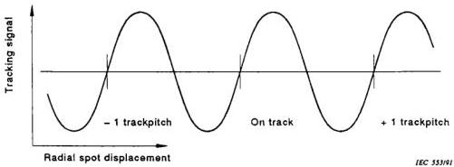
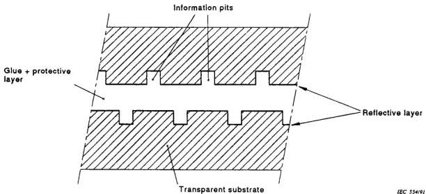

# IEC 60856-1986 Laservision PAL Amendment 1

# PREFACE

This amendment has been prepared by Sub-Committee 60B: Video recording, of IEC Technical Committee No. 60: Recording.

The text of this amendment is based on the following documents:

|  Six Months’ Rule | Report on Voting  |
| --- | --- |
|  60B(CO)106 | 60B(CO)115  |

Full information on the voting for the approval of this amendment can be found in the Voting Report indicated in the above table.

---

# INTRODUCTION

IEC Publication 856 which is the current standard for "Laser vision" does not contain a specification for a push-pull radial differential signal. For future applications of the video disk, it is desirable to specify this signal and to add this specification to the current standard.

The specified amplitude variation of the signal represents the state of the art of LV-disk production.

## 12. Operational parameters

Add, after subclause 12.1.3.1, the following new subclauses:

### 12.1.4 Push-pull radial differential signal (clause 11 does not apply to the case under consideration)

A slightly off-track position of the scanning light spot results in a diffraction pattern that is asymmetrical in the radial direction of the disk. The radial differential (RD) signal is defined as the difference of the optical powers diffracted into the two halves (positioned at opposite sides of the track) of the aperture of the objective lens.

#### 12.1.4.1 Requirements for the measuring pick-up

The optical pick-up to be used for disk measurement shall comply with the following requirements:

- wavelength: $780 \pm 10 \mathrm{~nm}$;
- circularly polarized light;
- numerical aperture: $0,50 \pm 0,01$;
- intensity at the rim of the pupil of the objective lens: $>50\%$ of the maximum intensity value;
- diffraction limited performance of the optical system: within the Marechal criterion.

12.1.4.2 Measurement conditions

12.1.4.2.1 Time constant: $t = 1,8 \, \mu\mathrm{s}$.

12.1.4.2.2 Filtering: low pass.

12.1.4.3 Characteristic of the RD signal

See figure 21. The positive zero-crossing corresponds to the correct radial position of the scanning spot. Figure 22 describes the shape of the shallow pits.

12.1.4.4 Magnitude

12.1.4.4.1 Definition

$P_{1} - P_{2}$ = the optical power difference in the two halves of the reflected beam measured at far field.

$P_{3}$ = the sum optical power in the two halves of the reflected beam measured at far field in uncoded reflecting area.

Magnitude $\frac{P_1 - P_2}{P_3}$ at 0,1 μm radial offset.

12.1.4.4.2 Specifications

Magnitude: 0,04 – 0,11.

Within one revolution, the variation in magnitude of the tracking signal shall be less than $\pm 15\%$.

12.1.4.5 Noise

12.1.4.5.1 Definitions and conditions

The r.m.s. value of the noise in the residual error signal with the RD signal used for tracking, measured in the closed loop situation in a frequency band from 2,2 kHz to 100 kHz with a radial servo bandwidth of 1,5 kHz.

12.1.4.5.2 Specification

The noise value shall correspond to a tracking error $\leq 0,03 \, \mu\mathrm{m}$.
Add, after figure 20, the following new figures 21 and 22:

*Figure 21 – Characteristic of the RD signal. Typical shape of the error signal for tracking versus radial spot position.*

*Figure 22 – Material build-up.*