# IEC 60856-1986 Laservision PAL Amendment 2

## FOREWORD

This amendment has been prepared by subcommittee 100B: Recording, of IEC technical committee 100: Audio, video and multimedia systems and equipment.

The text of this amendment is based on the following documents:

|  FDIS | Report on voting  |
| --- | --- |
|  100B/47/FDIS | 100B/66/RVD  |

Full information on the voting for the approval of this amendment can be found in the report on voting indicated in the above table.

CONTENTS

Add the title of clause 13 as follows:

### 13 Implementation of a digital audio signal

### 4 Mechanical parameters

Add, after subclause 4.1.2, the following new subclause 4.1.3:

|  Characteristics to be specified | Requirements | Methods of measurement and/or conditions  |
| --- | --- | --- |
|  4.1.3 Thickness of single disk (T), figure 1 | min. = 1,1 mm, see figure 1a
max. = 1,4 mm |   |

Replace the existing subclause 4.4 by the following:

|  Characteristics to be specified | Requirements | Methods of measurement and/or conditions  |
| --- | --- | --- |
|  4.4 Label (E), figure 1 | A label on both sides of a double and a single disk is allowed. The label of a single disk on the transparent side is optional, but the label on the protective layer side is mandatory |   |
|  4.4.1 Inside diameter of label (F), figure 1 | min. = 35 mm
max. = 38 mm |   |
|  4.4.2 Outside diameter of label (G), figure 1 | min. = 86 mm
max. = 100 mm |   |

Replace the existing subclause 4.5.3 by the following:

|  Characteristics to be specified | Requirements | Methods of measurement and/or conditions  |
| --- | --- | --- |
|  4.4.3 Outside diameter of the label (G), figure 1 of a single disk on the protective layer side | min. = 86 mm
max. = 300 mm |   |
|  4.4.4 Thickness of label (H), figure 1 | So that thickness of disk in clamping area (subclause 4.5.3) is within specification |   |
|  4.4.5 Position of label | Should not overlap either centre hole or, in case of a single disk, the outer diameter of the protective layer side |   |

Add, after subclause 4.16.4, the following new subclause 4.16.5:

|  Characteristics to be specified | Requirements | Methods of measurement and/or conditions  |
| --- | --- | --- |
|  4.16.5 Maximum radial angle (θ) between the normal on the surface (not infoside) and the optical axis | ± 1° | See figure 2  |

Replace the existing subclause 4.20.1 by the following:

|  Characteristics to be specified | Requirements | Methods of measurement and/or conditions  |
| --- | --- | --- |
|  4.20.1 Minimum
8 in version
12 in version | 35
35 |   |

Replace the existing subclause 4.21.1 by the following:

|  Characteristics to be specified | Requirements | Methods of measurement and/or conditions  |
| --- | --- | --- |
|  4.21.1 Minimum |  |   |
|  8 in version | 0,18 |   |
|  12 in version | 0,18 |   |

### 5 Optical requirements

Replace the existing subclause 5.2 by the following:

|  Characteristics to be specified | Requirements | Methods of measurement and/or conditions  |
| --- | --- | --- |
|  5.2 Birefringence of transparent disk (double pass) | 40° max. |   |

### 6 Temperature and humidity requirements

Replace the text in the second column by the following new text:

|  Requirements  |
| --- |
|  Must satisfy all requirements following exposure to any temperature within the range of 5 °C to 45 °C at any relative humidity within the range of 5 % to 90 % held constant for a period of four days  |

### 9 Video parameters

Replace the existing subclauses 9.1.3 and 9.1.4 by the following:

#### 9.1.3 Vertical interval test signals (VITS)

Vertical interval test signals according to ITU-R Recommendation 473-5, annex I (see figures 7 to 10) may be inserted in the lines 19, 13 or 20, 332 and 326 or 333. The lines 22 and 335 shall be blanked before optical recording, to enable disk noise measurements to be made.

#### 9.1.4 Address signals

In the video signal, lines 6 through 18 and 319 through 331 are reserved for address or data signals. For signal specification, see clause 10. The lines that are not specified have a video content set at blanking level and are reserved for future applications. Lines 20, 21 and 333, 334 may contain subtitle data signals; in that case there are no VITS (see 9.1.3) on lines 20 and 333.

When additional capacity is needed for subtitle data signals, lines 14, 15, 327 and 328 may be used.

#### 10.1.10 CLV picture number

Replace the text of subclause 10.1.10 by the following new text:

On the CLV disk the CLV picture number identifies each video frame and can also be used to detect hang-ups.

Code: 8 X1 E X3 X4 X5

X1 = A to F and X3 = 0 to 9.

X1 and X3 indicate the seconds of the run time together with the hours and minutes of the programme time code.

X4 and X5 are the picture numbers within 1 s, thus:

X4 = 0 to 2 and X5 = 0 to 9.

The CLV picture number shall be inserted into line 16 or 329 depending on which field is the first field of the picture.

The start of the programme time code is zero hour and zero minute, and that of CLV picture number is zero second and zero picture at the beginning of the active programme.

#### 11.1.2 Numerical aperture

Replace the text of subclause 11.1.2 by the following new text:

The numerical aperture of the lens of the readout beam is:

NA = 0,40 ± 0,01.

### 12 Operational parameters

Add, after clause 12, the following new clause 13:

### 13 Implementation of a digital audio signal

This clause specifies the implementation of a digital audio signal as an optional addition to the laser vision system (LV). See sections three and four of IEC 60908.

#### 13.1 Signal modulation

##### 13.1.1 General

The EFM signal, as defined in IEC 60908, prior to modulation, is filtered by a low-pass filter with a frequency response as detailed in 13.1.2, a high-pass filter with a response as shown in figure 25, and shall have a pre-emphasis as detailed in figure 25. The digital signal is a symmetrical double edge pulse width modulated onto the main carrier and recorded on the disk as shown in figure 23.

13.1.2 Low-pass filter (see figure 24)

a) The frequency response shall be as follows:

1) up to 1,6 MHz ±0,5 dB (ref. 0,5 MHz)
2) 1,75 MHz (-3 ± 0,5) dB
3) 2 MHz (-26 ± 2) dB
4) &gt;2,3 MHz &lt; -50 dB

b) The group delay shall be as follows:

1) &lt;0,5 MHz (0 ± 20) ns (ref. 0,5 MHz)
2) 0,8 MHz (-50 ± 20) ns
3) 1 MHz (-100 ± 50) ns
4) 1,2 MHz (-180 ± 50) ns
5) 1,4 MHz (-350 ± 75) ns

NOTE – This group delay is a predistortion for the low-pass filter of the player.

13.1.3 Pre-emphasis

The EFM signal prior to modulation shall have a pre-emphasis according to figure 25.

13.1.4 High-pass filter

The EFM signal prior to modulation shall be filtered by a high-pass filter according to figure 25.

13.1.5 Modulation of the filtered EFM signal

The filtered EFM signal shall be a symmetrical double edge pulse width modulated on the main carrier.

The level of this modulated EFM signal in the recorded frequency spectrum shall be -27 dB ± 1 dB with respect to the unmodulated main carrier when no audio signal in present during digital silence (see figure 26).

13.1.6 Block error rate (BLER)

13.1.6.1 Definitions

See 11.1.1, section three of IEC 60908.

13.1.6.2 Specification of random errors

BLER averaged over any 10 s shall be ≤ 8 × 10⁻² with a recommendation of ≤ 3 × 10⁻².

13.1.6.3 Specification of burst errors

See amendment 1 of IEC 60908, subclause 11.1.3.

13.2 Sample frequency

The audio sample frequency shall be:

$$F_{\mathrm{S}} = \frac{1764}{625} \times F_{\mathrm{H}} \quad (44,1\ \mathrm{kHz}\ \mathrm{nominal})$$

$F_{\mathrm{H}}$ is the line frequency corresponding to the video signal (50 Hz/625 lines – PAL system).

### 13.3 Compensation of time delay

Since the digital audio decoder delays the audio signal by 15,3 ms, it is recommended to advance the audio signals, modulated into the EFM signal, relative to the related video signal.

### 13.4 Analogue audio subcarriers

The analogue audio subcarriers shall not be recorded (status code 0010, see appendix C).

### 13.5 Control and display of the compact disk system (subcode)

#### 13.5.1 Subcode

The subcode conforms with IEC 60908, section four, clause 17, with the following modifications:

##### 13.5.1.1 ADR

Change "0001: ADR 1, mode 1 for DATA-Q" to "0100: ADR 4, mode 4 for DATA-Q".

##### 13.5.1.2 Subclause 17.5.1

Change title "Mode 1 for DATA-Q" to "Mode 4 for DATA-Q". In the first line, change "ADR = 1 = (0001)" to "ADR = 4 = (0100)" and, in the third line, change "mode 1" to mode 4".

#### 13.5.2 Table of content (TOC)

The repetitive TOC shall be recorded in such a way that, at the end of the lead-in area, the table of content can be ended with any value of point.

The video system identification code shall be recorded according to IEC 60908-2 (12 cm CD – V).

P frame is 22 = PAL "LV disk" with digital stereo sound

P frame is 23 = PAL "LV disk" with digital bilingual sound.

##### 13.5.2.1 Position lead-in subcode of compact disk

###### 13.5.2.1.1 Start of CD lead-in subcode in accordance with start lead-in code LV in this standard.

###### 13.5.2.1.2 Length of CD lead-in subcode in accordance with this standard.

##### 13.5.2.2 Position lead-out subcode of compact disk

###### 13.5.2.2.1 Start of CD lead-out subcode in accordance with start lead-out code LV in this standard.

###### 13.5.2.2.2 Length of CD lead-out subcode in accordance with this standard.

13.5.3 Relation between track number (CD) and chapter number (LV)

13.5.3.1 The chapter numbers shall be present in the video programme area. They should start with chapter "0" or "1" or a preset number of a previous disk with the same programme content. If they start with chapter "0", the length of chapter "0" area should be at most 1 min.

13.5.3.2 The track number (TNO) in a CD shall be the same as the chapter number in an LV with the exception of chapter "0" (see 13.5.3.1). Chapter "0" is then a part of track number "1".

13.5.3.3 Maximum track number in a CD in LV is 79.

13.5.3.4 Minimum length of a track (chapter) shall conform with this standard.

Replace the existing figure 1 by the following:

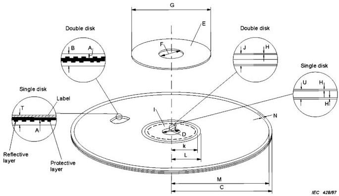

*Figure 1 – Mechanical parameters of the disk (see 4.1 to 4.13).*

Add, after the figure 1a, the following new figure 1b:

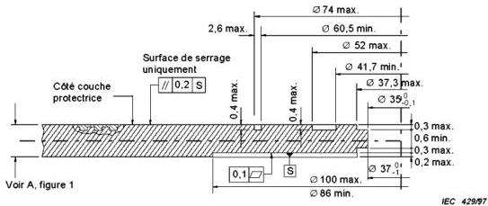

*Figure 1b – Possible profiling of the clamping area of a single disk without labels (see 4.5.3.2).*

(not to scale)

Dimensions in millimetres

NOTE - Flat single disks without notches or dents are recommended. However, to enable single disks to be produced with equipment for double disk production, the profile shown in figure 1b is permitted.

Replace the existing figure 2 by the following:

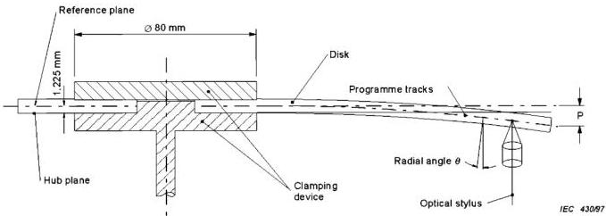

*Figure 2 – Measurement of vertical deviation and radial angle $\theta$ of programme tracks during rotation at playback speed (see 4.16).*

Replace the existing figure 8 by the following:

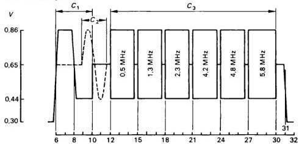

*Figure 8 – VITS (see 9.1.3). Lines 13 or 20 signal.*

Signal elements:

a) White reference bar $(C_1)$
Amplitude = 80 % of 0,70 $V_{pp} \pm 1\%$
Rise and fall time = 200 ns

b) Black reference bar $(C_2)$
Amplitude = 20 % of 0,70 $V_{pp} \pm 1\%$
Rise and fall time = 200 ns

c) Sine wave bursts $(C_3)$
Frequencies = 0,5; 1,3; 2,3; 4,2; 4,8; 5,8 MHz $\pm 2\%$
Amplitude = 60 % de 0,70 $V_{pp} \pm 1\%$
Start/stop: zero phase

Replace the existing figure 10 by the following:

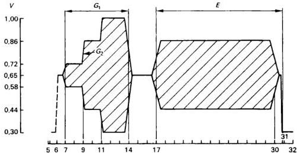

*Figure 10 – VITS (see 9.1.3). Lines 326 or 333 signal.*

Signal elements:

a) Three level chrominance bar $(G_1)$
Amplitudes = 20 %, 60 % and 100 % of 0,70 $V_{pp}$ ($\pm 1\%$ of $B_2$)
Grey level = 50 % of 0,70 $V_{pp} \pm 1\%$
Rise and fall time = 1 $\mu$s $\pm$ 5 %
DC content ≤ 0,5 %

b) Chrominance reference (E)
Amplitude = 60 % of 0,70 $V_{pp}$ ($\pm 1\%$ of $B_2$)
Grey level = 50 % of 0,70 $V_{pp} \pm 1\%$
Rise and fall time = 1 $\mu$s $\pm$ 5 %

Replace the existing figure 19 by the following:

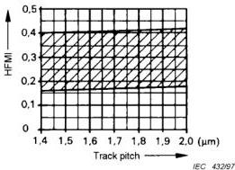

*Figure 19 – Limits of HFMI (see 12.3.1).*

$$
S _ {t} = (8 0 2 \pm 2 6) \mathrm {p i t s / m m}
$$

$$
S _ {t} = \frac {f}{2 \pi R \cdot f _ {t}} \mathrm {p i t s / m m}
$$

$f$  is the electrical signal frequency (Hz)

$R$  is the radius of the track (mm)

$f_{t}$  is the revolution frequency of the disk (Hz)

Add, after figure 22, the following new figures 23 to 26:

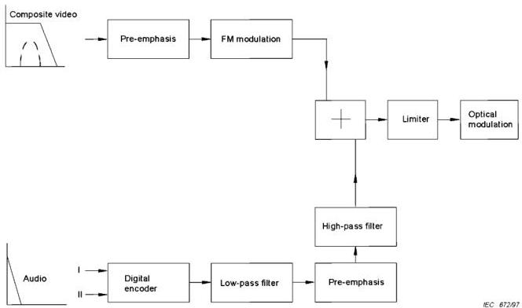

*Figure 23 – Signal processing encoding.*

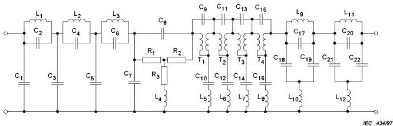

*Figure 24 – Recommended low-pass filter part values.*

|  C1 | 0,7436 | C16 | 2,4248 | L8 | 1,2761  |
| --- | --- | --- | --- | --- | --- |
|  C2 | 0,1272 | C17 | 0,9335 | L9 | 1,5116  |
|  C3 | 1,5438 | C18 | 0,7558 | L10 | 1,3114  |
|  C4 | 0,3534 | C19 | 0,7558 | L11 | 0,9584  |
|  C5 | 1,3275 | C20 | 1,1887 | L12 | 1,4283  |
|  C6 | 0,8921 | C21 | 0,4792 |  |   |
|  C7 | 0,2969 | C22 | 0,4792 | T1 | 17,4938  |
|  C8 | 15,201 |  |  | T2 | 8,7065  |
|  C9 | 1,2480 | L1 | 1,3817 | T3 | 4,2967  |
|  C10 | 17,4938 | L2 | 1,3645 | T4 | 2,4248  |
|  C11 | 1,2598 | L3 | 0,7020 |  |   |
|  C12 | 8,7066 | L4 | 15,201 | R1 | 0,0575  |
|  C13 | 1,2668 | L5 | 1,248 | R2 | 0,0575  |
|  C14 | 4,2967 | L6 | 1,2599 | R3 | 8,266  |
|  C15 | 1,2761 | L7 | 1,2668 |  |   |

$F_{c} = 1,75\mathrm{MHz}$

NOTE - For the low-pass filter in the player parts C1 to C7 and L1, L2 and L3 are recommended.

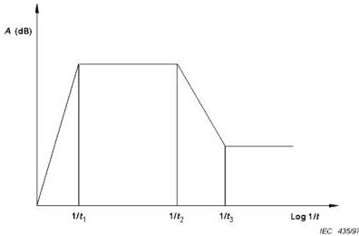

*Figure 25 – High-pass filter and pre-emphasis.*

High-pass filter

$$
A = \frac {j \omega t _ {1}}{1 + j \omega t _ {1}} \quad t _ {1} = (7 5 \pm 5) \mu \mathrm {s}
$$

Pre-emphasis

$$
A = \frac {1 + j \omega t _ {3}}{1 + j \omega t _ {2}} \quad t _ {2} = (5 \pm 0, 1) \mu \mathrm {s}; t _ {3} = (3 1 8 \pm 6) \mathrm {n s}
$$

Spectrum analyzer: 10 dB/div RBW 30 kHz VBW 30 kHz

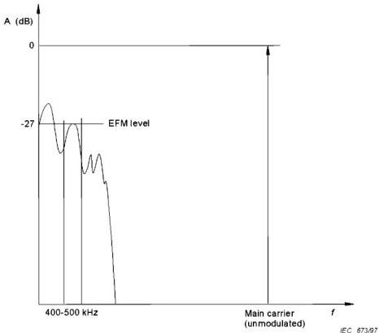

*Figure 26 – Level of EFM signal.*

Replace the existing figure B.3 by the following:

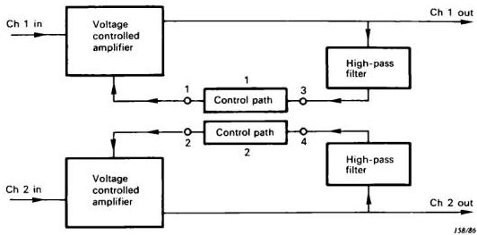

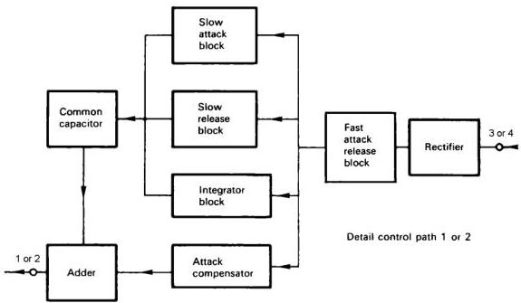

*Figure B.3 – Block diagram encoder (bilingual).*

## Appendix C

Replace the existing clause C.1 by the following new clause:

### C.1 Definition of the data in programme status code

$$
8 \frac {\mathrm {D C}}{\mathrm {B A}} X _ {3}, X _ {4}, X _ {5}
$$

- DC = CX noise reduction on
- BA = CX noise reduction off
- X31 indicates disk size:
0 = 12 inch; 1 = 8 inch

X32 indicates disk side:
0 = first side; 1 = second side

X33 indicates if there are teletext signals present anywhere on the disk or not:
0 = teletext signal absent; 1 = teletext signal present

X34 indicates if it is allowed to copy the programme:
0 = copy prohibited; 1 = copy permitted

- X41, X42, X43 together with X44 indicate the status of the analogue audio channels and the video signal according to the following table:

|  Mode | X41, X42, X43, X44 | Videosignal | Channel 1 Channel 2  |
| --- | --- | --- | --- |
|  0 | 0000 | Standard | Stereo  |
|  1 | 0001 | Standard | Mono  |
|  2 | 0010 | Standard | Audio subcarriers off  |
|  3 | 0011 | Standard | Bilingual  |
|  4 | 0100 | Future use | Future use  |
|  5 | 0101 | Future use | Future use  |
|  6 | 0110 | Future use | Future use  |
|  7 | 0111 | Future use | Future use  |
|  8 | 1000 | Standard | Mono Dump  |
|  9 | 1001 | Future use | Future use  |
|  10 | 1010 | Future use | Future use  |
|  11 | 1011 | Future use | Future use  |
|  12 | 1100 | Future use | Future use  |
|  13 | 1101 | Future use | Future use  |
|  14 | 1110 | Future use | Future use  |
|  15 | 1111 | Future use | Future use  |
