# IEC 60856-1986 Laservision PAL

## FOREWORD

1) The formal decisions or agreements of the IEC on technical matters, prepared by Technical Committees on which all the National Committees having a special interest therein are represented, express, as nearly as possible, an international consensus of opinion on the subjects dealt with.

2) They have the form of recommendations for international use and they are accepted by the National Committees in that sense.

3) In order to promote international unification, the I E C expresses the wish that all National Committees should adopt the text of the IEC recommendation for their national rules in so far as national conditions will permit. Any divergence between the I E C recommendation and the corresponding national rules should, as far as possible, be clearly indicated in the latter.

## PREFACE

This standard has been prepared by Sub-Committee 60B: Video Recording, of IEC Technical Committee No. 60: Recording.

The text of this standard is based on the following documents:

|  Six Months’ Rule | Report on Voting  |
| --- | --- |
|  60B(CO)64 | 60B(CO)72  |

Further information can be found in the Report on Voting indicated in the table above.

## INTRODUCTION

The optical videodisk system functions as follows:

The information carrier is a disk structure consisting of a transparent substrate, of which one surface contains the information covered with a reflective coating.

Two such substrates are assembled, information surface against information surface to form an optical videodisk. One of these two substrates might also be a “blank”, characterized by the absence of information, but in all other mechanical aspects conform to this standard.

The information on the disk is stored in a spiral track starting at the inside at a fixed diameter and moving to the outside.

The information is read out by a beam of light which passes through the transparent substrate and is reflected by the information on the encoded surface. The reflected beam is modulated by the information on the encoded surface.

Within the system two disk formats exist: the CAV disk and the CLV disk. CAV stands for Constant Angular Velocity and CLV for Constant Linear Velocity.

In the CAV format each revolution corresponds to one complete recorded video frame. Consequently during readout the disk will rotate at constant angular velocity. A disk thus recorded makes possible features such as still pictures, slow motion, etc.

In the CLV format the velocity of the information track relative to the readout beam is constant. Therefore the angular velocity decreases as the readout beam proceeds along the spiral track to the outside. A disk recorded in this way yields a longer playing time. Features such as still pictures, however, are not possible.

## SECTION ONE — GENERAL

### 1. Scope

This standard applies to pre-recorded optical reflective videodisks compatible with 50 Hz/625 lines CCIR monochrome and colour coding PAL systems, and defines those parameters that effect the interchangeability of the disks, excluding limitations of the programming material and source.

### 2. Object

To serve as a reference for manufacturers intending to make disks or players compatible with the optical system described herein.

## 3. Standard atmospheric conditions for testing

Measurements and mechanical checks shall be carried out at any combination of temperature, humidity and air pressure within the following limits unless otherwise specified for certain parameters elsewhere in this standard:

Ambient temperature: 15 °C to 35 °C
Relative humidity: 45% to 75%
Air pressure: 86 kPa to 106 kPa
Samples shall be conditioned in the testing environment for 24 h before testing.

## SECTION TWO — DISK PARAMETERS

### 4. Mechanical parameters

|  Characteristics to be specified | Requirements | Method of measurement and/or conditions  |
| --- | --- | --- |
|  4.1 Thickness in the programme area: |  |   |
|  4.1.1 Thickness of protective transparent layer, (A), Figure 1, page 31 | See Figure 1a |   |
|  4.1.2 Thickness of double disk (B), Figure 1 | min. = 2.2 mm, see Figure 1a
max. = 2.8 mm |   |
|  4.2 Outer radius of disk (C), Figure 1 | 150 ± 0.5 mm | To be measured at 20 ± 1 °C and 48% to 52% relative humidity  |
|  — 12-in version | 100 ± 0.5 mm |   |
|  — 8-in version |  |   |
|  4.3 Centre hole (D), Figure 1 |  |   |
|  4.3.1 Diameter of centre hole | 35.0 ± 0.1 mm | To be measured with a maximum and a minimum plug gauge at 20 ± 1 °C and 48% to 52% relative humidity  |
|  4.3.2 Diameter of centre hole for disk assembled from two single disks | 35.0 ± 0.1 mm |   |
|  4.3.3 Shape of edges of centre hole | Edges shall be free from burrs |   |
|  4.4 Label (E), Figure 1 |  |   |
|  4.4.1 Inside diameter of label (F), Figure 1 | min. = 35 mm
max. = 38 mm |   |
|  4.4.2 Outside diameter of label (G), Figure 1 | min. = 86 mm
max. = 100 mm |   |
|  4.4.3 Thickness of label (H), Figure 1 | Such that thickness of disk in clamping area (Sub-clause 4.5.3) is within specification |   |

(Table continued on page 11)

|  Characteristics to be specified | Requirements | Method of measurement and/or conditions  |
| --- | --- | --- |
|  4.4.4 Position of label | Should not overlap centre hole |   |
|  4.5 Clamping area (I), Figure 1, page 31 |  |   |
|  4.5.1 Inside radius of clamping area | 20.5 mm |   |
|  4.5.2 Outside radius of clamping area | 41.5 mm |   |
|  4.5.3 Thickness of disk in clamping area including labels (J), Figure 1 | min. = 2.2 mm
max. = 2.9 mm |   |
|  4.6 Sense of rotation of disk seen from read side | Anticlockwise |   |
|  4.7 Rotation speed | Never to exceed one revolution per TV frame |   |
|  4.7.1 Angular velocity for CAV format | 1 rotation/TV frame |   |
|  4.7.2 Linear velocity for CLV format | Between 8.4 m/s and 9.5 m/s | See Figure 20, page 53  |
|  4.7.3 Angular acceleration for CLV format | Maximum of -0.32 rad/s² | See Figure 20  |
|  4.8 Maximum unbalance | 1.5 N | Measured at 1 rotation/TV frame  |
|  4.9 Position of lead-in tracks | The space between starting radius of lead-in tracks and starting radius of programme area must be filled with lead-in tracks |   |
|  4.10 Starting radius lead-in tracks (K), Figure 1 | ≤ 53.5 mm |   |
|  4.11 Starting radius programme area (L), Figure 1 | ≥ 55 mm |   |
|  4.11.1 Minimum number of programme tracks | 30 |   |
|  4.12 Maximum radius programme area (M), Figure 1
— 12-in version
— 8-in version | 145 mm
96 mm |   |
|  4.13 Position of lead-out tracks (N), Figure 1 | The lead-out tracks follow directly after the end of the programme |   |

(Table continued on page 13)

|  Characteristics to be specified | Requirements | Method of measurement and/or conditions  |
| --- | --- | --- |
|  4.14 Minimum size of lead-out area |  |   |
|  4.14.1 For CAV disks | 2 mm |   |
|  4.14.2 For CLV disks | 2 mm |   |
|  4.15 Track pitch anywhere between any two adjacent tracks | min. 1.4 μm
max. 2 μm |   |
|  4.16 Vertical deviation of programme tracks during rotation at playback speed |  | Record supported in clamping area over a diameter of 80 mm and measured with the optical stylus (see Sub-clause 11.1)  |
|  4.16.1 Maximum distance (P) from reference plane to any point of tracks (see Figure 2, page 33) | +0.9 mm
-1.2 mm |   |
|  4.16.2 Maximum vertical acceleration | 100 m/s² for f <1.1 kHz | See Figure 2  |
|  4.16.3 Maximum vertical deviation | ±2 μm for f >1.1 kHz | See Figure 2  |
|  4.16.4 Maximum vertical velocity | 0.18 m/s | See Figure 2  |
|  4.17 Maximum static deflection of disk (Q), Figure 3, page 33 | -2.5 mm; +1.5 mm | Record supported in clamping area over a diameter of 80 mm and measured at outside diameter with reference to hub plane  |
|  4.18 Radial deviation of programme tracks during rotation at playback speed (see Figure 4, page 33) |  | Record supported in clamping area over a diameter of 80 mm and measured with the optical stylus (see Sub-clause 11.1)  |
|  4.18.1 Maximum deviation (ΔV) during one revolution (see Figure 4) | 160 μm |   |
|  4.18.2 Maximum radial deviation | ±0.1 μm for f>2.2 kHz |   |
|  4.18.3 Maximum radial acceleration | 20 m/s² for f<2.2 kHz |   |

(Table continued on page 15)

|  Characteristics to be specified | Requirements |   | Method of measurement and/or conditions  |
| --- | --- | --- | --- |
|  4.19 Tangential deviation of programme tracks at nominal velocity | CAV | CLV | Record supported in clamping area over a diameter of 80 mm and measured with the optical stylus (see Sub-clause 11.1)  |
|  4.19.1 Maximum time base error at: |  |  |   |
|  radius 55 mm | 12 μs peak-to-peak (pp) at 25 Hz roll-off with 12 dB/octave | 12 μs peak-to-peak (pp) at 25 Hz roll-off with 12 dB/octave |   |
|  radius 145 mm | 4.6 μs peak-to-peak (pp) at 25 Hz roll-off with 12 dB/octave | 12 μs peak-to-peak (pp) at 9 Hz roll-off with 12 dB/octave |   |
|  4.19.2 Shift between two adjacent tracks | ± 25 ns | not applicable |   |
|  4.20 Mass | (in 10^{-3} kg) |   |   |
|  4.20.1 Minimum |  |  |   |
|  8-in version | 70 |  |   |
|  12-in version | 70 |  |   |
|  4.20.2 Maximum |  |  |   |
|  8-in version | 280 |  |   |
|  12-in version | 280 |  |   |
|  4.21 Mass moment of inertia | (in 10^{-3} kg m^{2}) |   |   |
|  4.21.1 Minimum |  |  |   |
|  8-in version | 0.36 |  |   |
|  12-in version | 0.36 |  |   |
|  4.21.2 Maximum |  |  |   |
|  8-in version | 3.2 |  |   |
|  12-in version | 3.2 |  |   |
|  5. Optical requirements |  |  | λ = 6 328 Å (HeNe laser in air) and a numerical aperture = 0.40 ± 0.01  |
|  5.1 Refractive index | See Figure 1a, page 31 |   |   |
|  5.2 Birefringence of transparent disk (double pass) | 20° max. |   |   |
|  5.3 Reflectivity | ≥ 70% |   | Double pass through transparent substrate in unmodulated area. Includes transmission losses in the substrate  |

(Table continued on page 17)

|  Characteristics to be specified | Requirements | Method of measurement and/or conditions  |
| --- | --- | --- |
|  6. Temperature and humidity requirements | Must satisfy all requirements following exposure to a temperature range of 5 °C to 45 °C at a relative humidity within the range of 5% to 90% for a period of 4 days | Parameters to be measured 20 ± 1 °C and 48% to 52% relative humidity after a recovery of 24 h following exposure to the specified environment  |

## SECTION THREE — RECORDED PARAMETERS

## 7. Audio parameters

### 7.1 Channel applications

The disk shall contain two independent audio channels. This offers the possibility of:

a) Stereophonic sound
b) Monophonic sound — two independent audio programmes
c) Monophonic sound — one audio programme on both channels
d) Use of one or both channels for control or cueing information.

### 7.2 Audio subcarrier modulation of main carrier

#### 7.2.1 Type of modulation

The audio subcarrier shall be symmetrical double-edge pulsewidth modulated on the main carrier. (See Philips F. Panter: Modulation, Noise and Spectral Analysis, page 542).

#### 7.2.2 Audio subcarrier amplitude

The level of the audio subcarriers, in the recorded frequency spectrum, shall be $-26 \pm 1$ dB with respect to the unmodulated main carrier.

## 8. Audio subcarrier frequencies

Channel I (left channel in stereo)

$$
f = 43.75 \times f_{\mathrm{H}} = 683593.75 \mathrm{~Hz} \text{ (nominal)}
$$

Channel II (right channel in stereo)

$$
f = 68.25 \times f_{\mathrm{H}} = 1066406.25 \mathrm{~Hz} \text{ (nominal)}
$$

### 8.1 Type of modulation

The audio signal shall be frequency modulated on the subcarriers with a maximum deviation of $\pm 100\mathrm{kHz}$ for $100\%$ modulation. The instantaneous peak deviation at all times shall be less than $\pm 150\mathrm{kHz}$.

## 8.2 Polarity of modulation

Both audio subcarriers shall have the same polarity of modulation which may be positive or negative.

## 8.3 Pre-emphasis

The audio signal prior to modulation shall have a pre-emphasis according to Figure 5, page 35.

## 8.4 Audio compression

The audio signal before pre-emphasis may be compressed at the option of the programme maker. In case of compression the system described in Appendix B shall be used.

## 9. Video parameters

### 9.1 Video signal

#### 9.1.1 Video signal standards

The recorded video signal is a $50\mathrm{Hz}/625$ lines PAL signal according to CCIR, Report 624 (1974) and additions as specified in Sub-clause 9.1.2.

#### 9.1.2 Video signal pilot burst

On the synchronization level a pilot burst with a frequency of $240 \times f_{\mathrm{H}} = 3.75 \mathrm{MHz}$ shall be superimposed. The peak-to-peak value is $6/7$ of the difference between the blanking level and the peak white level $\pm 10\%$ (see Figures 6 and 6a, pages 35 and 37).

#### 9.1.3 Vertical Interval Test Signals (VITS)

Vertical Interval Test Signals according to CCIR Recommendation 473-3, Annex I (see Figures 7 to 10, pages 39 to 41) may be inserted in the lines 19, 20, 332 and 333. The lines 22 and 335 shall be blanked before optical recording, to enable disk noise measurements.

#### 9.1.4 Address signals

In the video signal, lines 6 through 18 and 319 through 331 are reserved for address or data signals. For signal specification, see Clause 10. The lines that are not specified have a video content set at the blanking level and are reserved for future applications. Lines 20, 21 and 333, 334 may contain subtitle data signals; in that case there are no VITS (see Sub-clause 9.1.3) on lines 20 and 333.

#### 9.1.5 Maximum video level

The maximum luminance level of the video signal shall not exceed $110\%$ and the maximum chroma saturation shall not exceed $100\%$.

## 9.1.6 Group delay pre-distortion

To equalize the group delay distortion of the playback low-pass filter, the video group delay shall be pre-distorted as follows (see Figure 11, page 43):

|  f = 0.5 MHz | t_{d} = 0 ns reference  |
| --- | --- |
|  f = 2.0 MHz | t_{d} = -10 ± 15 ns  |
|  f = 3.0 MHz | t_{d} = -35 ± 15 ns  |
|  f = 4.0 MHz | t_{d} = -85 ± 20 ns  |
|  f = 4.43 MHz | t_{d} = -135 ± 20 ns  |
|  f = 4.8 MHz | t_{d} = -200 ± 50 ns  |

## 9.2 Video signal modulation

### 9.2.1 Type of modulation

The video signal shall be frequency modulated on the main carrier with positive modulation.

### 9.2.2 Blanking level frequency

The main carrier frequency corresponding to the 30% blanking level shall be 7.1 MHz ± 50 kHz.

### 9.2.3 Main carrier deviation

The 30% blanking level to +100% white level deviation shall be 800 ± 20 kHz. White level is the highest frequency.

### 9.2.4 Video pre-emphasis

The video signal, prior to modulation, shall have a pre-emphasis as shown in Figure 12, page 45.

## 10. Vertical interval control and address signals

The code signals on the video disk provide special information, which can be utilized by the player to control special functions and provide picture frame or time information.

The CAV format has the following types of codes:

1. Lead-in
2. Lead-out
3. Picture numbers
4. Picture stop
5. Chapter numbers
6. Programme status code
7. Users code

On CLV format the codes are:

1. Lead-in
2. Lead-out
3. Programme time code
4. CLV code
5. Chapter numbers
6. CLV picture number
7. Programme status code
8. Users code

## 10.1 24-bit biphase coded signal

This signal is inserted in selected video lines during the vertical interval. It is subdivided into 6 groups of 4 bits and each group can be any hexadecimal word (see Figure 13, page 45). The first group of 4 bits is the key and starts with a logic one. Each bit cell is $2\mu s$ long with the digital level between $30\%$ and $100\%$ (see Figure 14, page 47).

## 10.1.1 Lead-in

The lead-in code indicates the start of the programme (see Sub-clause 4.9). The 24-bit biphase lead-in code with a hexadecimal value of "88FFFF" is inserted into lines 17, 18, 330 and 331 during at least a number of tracks corresponding to $1.5\mathrm{mm}$ prior to the active programme start.

## 10.1.2 Lead-out

The lead-out code indicates the end of the programme (see Sub-clause 4.13). The 24-bit biphase lead-out code with a hexadecimal value of "80EEEE" is inserted in lines 17, 18, 330 and 331 during at least $2\mathrm{mm}$ after the end of the active programme (see Sub-clause 4.14).

## 10.1.3 Picture numbers

The picture numbers shall be present during the active programme on CAV disks. They are unique and in a normal count sequence starting with number 1 at the beginning of the active programme.

The picture numbers shall be inserted into lines 17 and 18 or in lines 330 and 331, depending on which field is the first of the picture. The hexadecimal value is: $\mathbf{FX}_1\mathbf{X}_2\mathbf{X}_3\mathbf{X}_4\mathbf{X}_5$. $\mathbf{X}_1$ through $\mathbf{X}_5$ represent the picture number, $\mathbf{X}_5$ being the least significant digit. The maximum available picture number is 99999.

## 10.1.4 Picture stop code

On CAV disks, the picture stop code enables the playback equipment to switch automatically to the still picture mode from normal speed or slow motion. The 24-bit biphase picture stop code with a hexadecimal value of "82CFFF" is inserted in lines 16 and 17 or 329 and 330 of the field immediately following the field in which the 24-bit picture number was inserted to enable stopping on the selected picture. On CLV disks there is no picture stop code.

## 10.1.5 Chapter numbers

Chapter numbers indicate parts of the programme as a chapter and are optional. They are unique and in a normal count sequence starting with a selectable number at the beginning of the active programme (i.e. number “0” or “1” or a pre-set number consecutive to the last number of a previous disk with the same programme content).

The 24-bit biphase coded chapter numbers, if present, are inserted in lines 17, 18 and 330, 331 in the fields of the whole active programme area which do not have an insertion of picture numbers on CAV disks. However, for lines 17 and 330, picture stop code has priority.

On CLV disks, they are inserted in line 18 or 331 in the fields of the whole active programme area which do not have an insertion of programme time code and CLV picture number.

Each chapter number starts with a stop-bit (the first bit after the key) at a zero-logic value during 400 tracks followed by at least 400 tracks with a stop-bit at a one-logic value until the next chapter starts. The zero value stop-bit is intended to disable the search action of the player. The first chapter directly after the lead-in area shall not have a stop-bit of zero-logic value. The hexadecimal value is “8X₁X₂DDD”. X₁ and X₂ are the chapter numbers. The maximum number is 79.

On disks with chapters shorter than 800 tracks the stop bit of each chapter number shall have the logic value “one”. The minimum length of a chapter will be 30 tracks.

## 10.1.6 Programme time code

The programme time code is always present on CLV disks during the active programme and indicates the running time (expressed in hours and minutes).

The 24-bit biphase programme time code with a hexadecimal value of “FX₁DDX₂X₁” is inserted in lines 17 and 18 or 330 and 331 depending on which field is the first field of the picture.

X₁ indicates the hours

X₂ and X₃ indicate the minutes

## 10.1.7 Constant linear velocity code

The CLV code is always present in the active programme on a CLV disk.

It indicates the CLV format. The 24-bit CLV code with a hexadecimal value of “87FFFF” is inserted in line 330 or 17 in the fields of the whole active programme area which do not have an insertion of programme time code and CLV picture number.

## 10.1.8 Programme status code

The programme status code identifies the use of the audio and video channels and will be inserted in the active programme area.

Code: 8 $\frac{\mathrm{DC}}{\mathrm{BA}}$ X3, X4, X5 (see Appendix C for explanation)

Insertion on CLV disks is: line 329 or 16, in the same fields where CLV code is inserted.

On CAV disks the insertion is: lines 16 and 329.

Note. — Picture stop code has priority over the programme status code.

## 10.1.9 Users code

The users code is intended for filing and identification and can be inserted as an option in the lead-in and lead-out area. The data content is up to the disk manufacturer.

Code: 8 X1 D X3 X4 X5

X1 = 0 through 7; X3, X4, X5 = 0 through F.

Insertion in lead-in and/or lead-out area in the lines 16, 329.

## 10.1.10 CLV picture number

On the CLV disk the CLV picture number identifies each video frame and can also be used to detect hang-ups.

Code: 8 X1 E X3 X4 X5

X1 = A through F: X3 = 0 through 9

X1 and X3 indicate the seconds of the run time together with the hours and minutes of the programme time code.

X4 and X5 are the picture numbers within 1 s, thus:

X4 = 0 through 2 and X5 = 0 through 9.

The CLV picture number shall be inserted into line 16 or 329 depending on which field is the first field of the picture.

## SECTION FOUR — OPERATIONAL SIGNALS

## 11. Definition of playback measurement system

### 11.1 Optical stylus

#### 11.1.1 Wavelength

The wavelength of the used light is: $\lambda = 6328\,\mathrm{\AA}$

#### 11.1.2 Numerical aperture

The numerical aperture of the readout beam is: $\mathrm{NA} = 0.40 \pm 0.01$

#### 11.1.3 Readout beam

The readout beam has a circular cross-section and a Gaussian intensity profile.

The intensity at the rim is $23 \pm 1\%$ of the intensity at the centre.

#### 11.1.4 Readout spot

In the readout spot the peak intensity of the first diffraction ring is less than $2\%$ of the peak intensity of the central diffraction disk.

### 11.2 Measuring set-up

In the measuring set-up the readout spot is projected on a photodiode. The electrical output of this diode is raised by means of an amplifier to a convenient level for the actual measurement. Both photodiode and amplifier shall have an adequate bandwidth.

#### 11.3 General measurement conditions

11.3.1 The angle between the normal to the information plane and the central ray of the optical stylus is not greater than 10 mrad.

11.3.2 The information plane lies within the region of depth of focus of the optical stylus:

|   | Diameter = 110 mm | Diameter = 290 mm  |
| --- | --- | --- |
|  CAV | ±1.3 μm | ±2.5 μm  |
|  CLV | ±1.3 μm | ±1.3 μm  |

### 12. Operational parameters

#### 12.1 Radial signal

##### 12.1.1 Radial modulation index (RMI) (see Figure 15, page 49)

$$
\mathrm{RMI} = \frac{V_2 - V_3}{V_1} : \text{limits are shown in Figure 16, page 49.}
$$

##### 12.1.2 Radial reflection index (RRI) (see Figure 15)

$$
\mathrm{RRI} = \frac{V_2 + V_3}{2V_1} : \text{limits are shown in Figure 17, page 49.}
$$

##### 12.1.3 Radial noise

###### 12.1.3.1 Radial noise ratio (RNR)

$$
\mathrm{RNR} = \frac{V_{\mathrm{rms}}, \text{closed loop signal error}}{V_{\mathrm{pp}}, \text{open loop signal error}} \leqslant -28 \mathrm{dB}
$$

$V_{\mathrm{rms}}$, closed loop error signal, is measured between $2.2\,\mathrm{kHz}$ and $100\,\mathrm{kHz}$. The servo bandwidth of the measuring set-up is $1.5\,\mathrm{kHz}$.

#### 12.2 Tangential signal

##### 12.2.1 Drop-outs

Maximum drop-out length is $100\,\mu\mathrm{s}$ at playback speed.

The drop-out level is defined with reference to Figure 18, page 51, as the signal level where $V_3 / V_1 \leqslant 0.1$.

##### 12.2.2 Signal-to-noise ratio of the video signal

The minimum unweighted signal-to-noise ratio, measured at the blanking level, should be $\geqslant 30\,\mathrm{dB}$.

#### 12.3 High-frequency signal

##### 12.3.1 High frequency modulation index (HFMI) (see Figure 18)

$$
\mathrm{HFMI} = \frac{V_2 - V_3}{V_1} : \text{limits are shown in Figure 19, page 51.}
$$

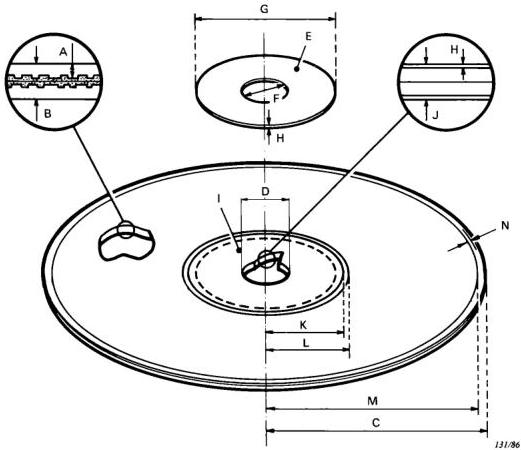

*Figure 1 - Mechanical parameters of the disk (Sub-clauses 4.1 to 4.13).*

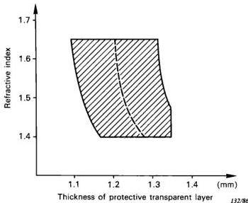

*Figure 1a - Thickness of protective transparent layer as a function of the refractive index of disk material (Sub-clauses 4.1 and 5.1).*
— Shadded area: any combination of refractive index and thickness falling in this area is allowed.
— Dotted line: assuming a read-out objective in the player, constructed for a nominal disk of refractive index of 1.525 and thickness of protective transparent layer of 1.225 mm, this line represents these disks for which the read-out signal is optimal.

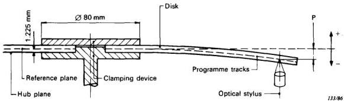

*Figure 2 - Measurement of vertical deviation of programme tracks during rotation at playback speed (Sub-clause 4.16).*

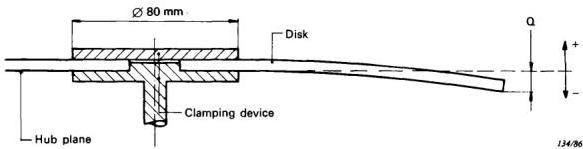

*Figure 3 - Measurement of static deflection of disk (Sub-clause 4.17).*

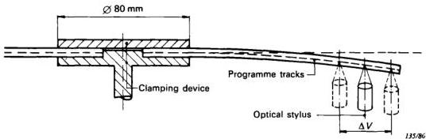

*Figure 4 - Measurement of radial deviation of programme tracks during rotation at playback speed. Disk is rotating around geometric centre of centre hole (Sub-clause 4.18).*

* For CLV this implies a rotational speed that corresponds with the radius at which the readout is made.

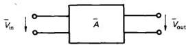

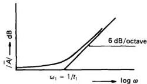

*Figure 5 - Pre-emphasis of the audio signal (Sub-clause 8.3).*

$\bar{A} =$ transfer function of the audio pre-emphasis

$$
\bar {A} = \frac {\bar {V} _ {\text {out}}}{\bar {V} _ {\text {in}}} = 1 + \mathrm {j} \omega t _ {1}, \quad \text {where} \quad t _ {1} = 75 \pm 1.5 \mu \mathrm {s}
$$

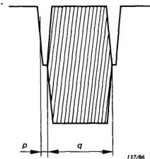
a) In the line-synchronizing pulses.

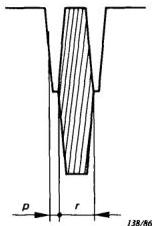
b) In the equalizing pulses.

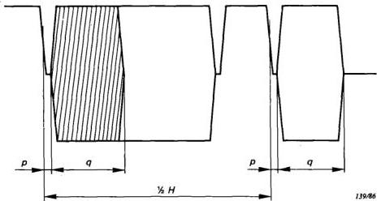

*Figure 6 - Video signal pilot burst (Sub-clause 9.1.2).*

c) In the field-synchronizing pulses.
$p = 0.5\pm 0.1\mu \mathrm{s}$
$q = 13.5\pm 1$  periods of  $3.75\mathrm{MHz}$ $(3.6\mu \mathrm{s}$  nominal)
$r = 6\pm 1$  periods of  $3.75\mathrm{MHz}$ $(1.6\mu \mathrm{s}$  nominal)
For detail, see Figure 6a, page 37.
Note. — Insertion of special burst during half-line intervals in equalizing pulse and field-synchronizing pulse is optional. In the field-synchronizing pulse  $q$  may be increased to a maximum of 100 periods.

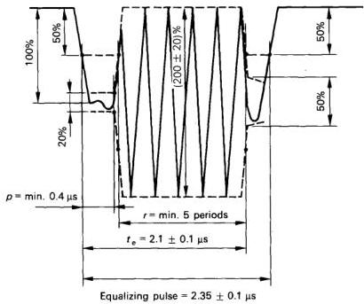

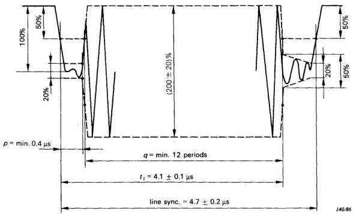

*Figure 6a - Detail of Figure 6.*

Line 19 signal

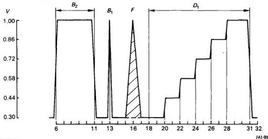

*Figure 7 - VITS (Sub-clause 9.1.3).*

Signal elements:

a) White reference bar $(B_{2})$

Amplitude $= 0.70\,V_{\mathrm{pp}} \pm 0.5\%$

Rise and fall time $= 100 \pm 10$ ns

Tilt $< 0.5\%$

b) 2T sine-squared pulse $(B_{1})$

Amplitude $= 0.70\,V_{\mathrm{pp}}$ (within $\pm 0.5\%$ of $B_{2}$)

Width $= 200 \pm 6$ ns

K factor $\leqslant 0.25\%$

Undershoot $\leqslant 0.3\%$

c) Composite 20T carrier-borne

sine-squared pulse $(F)$

Amplitude $= 0.70\,V_{\mathrm{pp}}$ (within $\pm 1\%$ of $B_{2}$)

Width $= 2\,000 \pm 60$ ns

Bottom curvature $\leqslant 0.5\% \leqslant 10$ ns

Modulation unbalance $\leqslant 3\,mV_{\mathrm{pp}}$

Subcarrier distortion $\leqslant 1\%$

d) Staircase signal $(D_{1})$

Number of levels $= 6$ (black and white incl.)

Amplitude $= 0.70\,V_{\mathrm{pp}}$ (within $\pm 1\%$ of $B_{2}$)

Rise and fall time $= 235 \pm 15$ ns by means of a

Thomson filter

Step inequality $< 0.5\%$

Line 20 signal

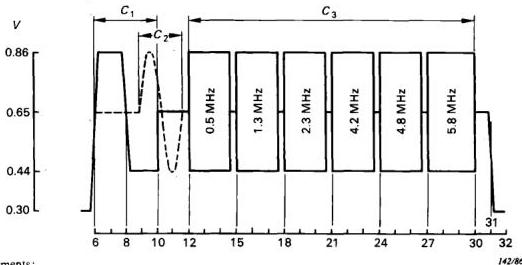

*Figure 8 - VITS (Sub-clause 9.1.3).*

Signal elements:

a) White reference bar $(C_{1})$

Amplitude $= 80\%$ of $0.70\,V_{\mathrm{pp}} \pm 1\%$

Rise and fall time $= 200$ ns

b) Black reference bar $(C_{2})$

Amplitude $= 20\%$ of $0.70\,V_{\mathrm{pp}} \pm 1\%$

Rise and fall time $= 200$ ns

c) Sine wave bursts $(C_{3})$

Frequencies $= 0.5; 1.3; 2.3; 4.2; 4.8; 5.8\,\mathrm{MHz} \pm 2\%$

Amplitude $= 60\%$ of $0.70\,V_{\mathrm{pp}} \pm 1\%$

Start/stop: zero phase

Line 332 signal

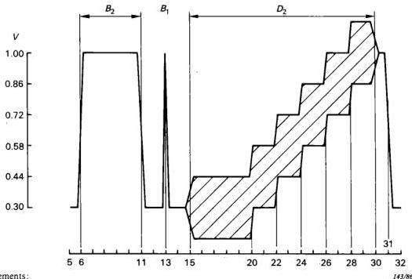

*Figure 9 - VITS (Sub-clause 9.1.3).*

Signal elements:

a) White reference bar $(B_{2})$ Identical to line 19 staircase
b) 2T sine squared pulse $(B_{1})$ Identical to line 19 pulse
c) Composite staircase $(D_{2})$ Identical to line 19 staircase

— Superimposed subcarrier:
Amplitude = 0.28 $V_{\mathrm{pp}} \pm 5\%$
Rise and fall time = $1\,\mu\mathrm{s} \pm 5\%$
Phase: $60 \pm 5^{\circ}$ for burst $135^{\circ}/225^{\circ}$

— Composite staircase:
differential gain $\leqslant 0.5\%$
differential phase $\leqslant 0.2^{\circ}$

Line 333 signal

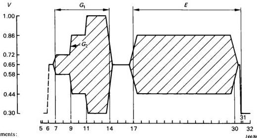

*Figure 10 - VITS (Sub-clause 9.1.3).*

Signal elements:

a) Three level chrominance bar $(G_{1})$
Amplitudes = 20%, 60% and 100% of 0.70 $V_{\mathrm{pp}}$ (within ±1% of $B_{2}$)
Grey level = 50% of 0.70 $V_{\mathrm{pp}} \pm 1\%$
Rise and fall time = $1\,\mu\mathrm{s} \pm 5\%$
D.C. content $\leqslant 0.5\%$

b) Chrominance reference (E)
Amplitude = 60% of 0.70 $V_{\mathrm{pp}}$ (within ±1% of $B_{2}$)
Grey level = 50% of 0.70 $V_{\mathrm{pp}} \pm 1\%$
Rise and fall time = $1\,\mu\mathrm{s} \pm 5\%$

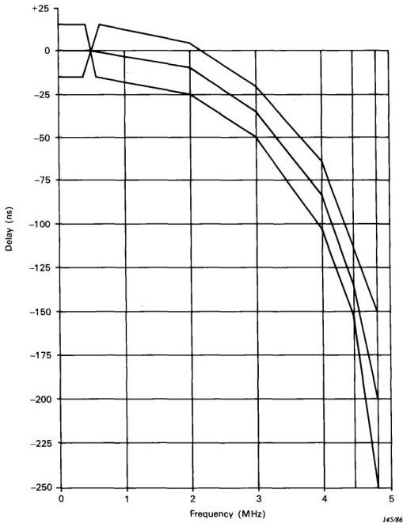

*Figure 11 - Group delay pre-distortion (Sub-clause 9.1.6).*

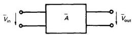

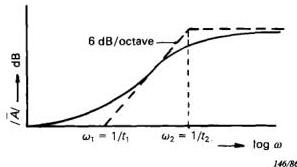

*Figure 12 - Pre-emphasis of the video signal (Sub-clause 9.2.4).*

$\bar{A} =$ transfer function of video pre-emphasis

$$
\bar {A} = \frac {\bar {V} _ {\text {out}}}{\bar {V} _ {\text {in}}} = \frac {1 + \mathrm {j} \omega t _ {1}}{1 + \mathrm {j} \omega t _ {2}} \quad \text {where} \left\{ \begin{array}{l l} t _ {1} = 4 0 0 \pm 8 \mathrm {n s} \\ t _ {2} = 1 0 0 \pm 2 \mathrm {n s} \end{array} \right.
$$

|  Bits value | Hexadecimal value  |
| --- | --- |
|  0000 | 0  |
|  0001 | 1  |
|  0010 | 2  |
|  0011 | 3  |
|  0100 | 4  |
|  0101 | 5  |
|  0110 | 6  |
|  0111 | 7  |
|  1000 | 8  |
|  1001 | 9  |
|  1010 | A  |
|  1011 | B  |
|  1100 | C  |
|  1101 | D  |
|  1110 | E  |
|  1111 | F  |

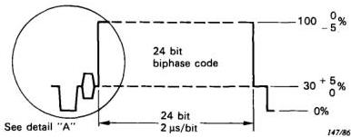

*Figure 13 - Hexadecimal value (Sub-clause 10.1).*

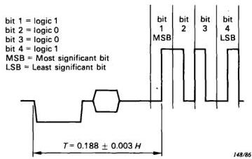

*Figure 14 - Bit cell length and digital level (Sub-clause 10.1), detail "A".*

1. Positive transition in centre of bit cell represents logical '1's. Negative transition in the centre of bit cell represents logical '0's.
2. Rise and fall times = 225 ± 25 ns (10% — 90%).
3. Bit length = 2 ± 0.01 μs.

Only in case of status code (Sub-clause 10.1.8)

$$
T = 0.172 \pm 0.003 \, H
$$

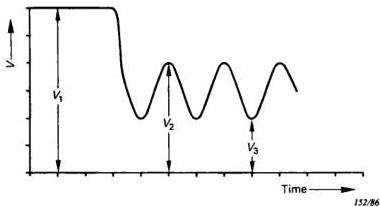

*Figure 18 - High-frequency signal (Sub-clause 12.3).*

$V =$  intensity of reflected light measured as follows:
$V_{1} =$  reading in uncoded reflecting area
$V_{2} =$  maximum reading between pits
$V_{3} =$  minimum reading onto pits

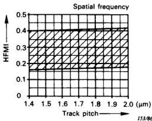

*Figure 19 - Limits of HFMI (Sub-clause 12.3.1).*

High Frequency Modulation Index HFMI =  $(V_{2} - V_{3}) / V_{1}$

$V = 802 \pm 26$  pits/mm
$V = \frac{f}{2\pi R \cdot fr}$  pits/mm
$f =$  frequency electrical signal (Hz)
$R =$  radius of the track (mm)
$fr =$  revolution frequency of the disk (Hz)

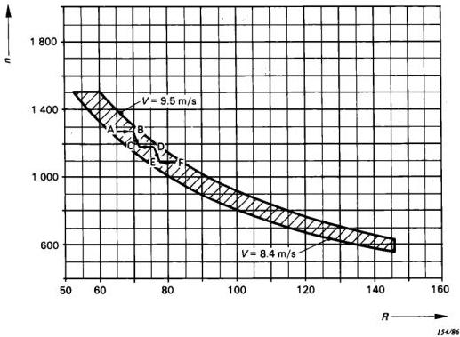

*Figure 20 - Linear velocity and angular acceleration for CLV format (Sub-clauses 4.7.2 and 4.7.3).*

$$
n = \frac {9549 \cdot V}{R}
$$

$$
n = \text{revolutions/min}
$$

$$
V = \text{linear velocity (m/s)}
$$

$$
R = \text{radius (mm)}
$$

in shaded area: $8.4 < V < 9.5 \, \text{m/s}$

To minimize the effect of cross-talk from adjacent tracks the “Laser vision” standard allows for recording of CLV disks as follows:

- in the trajects $\mathbf{A} \rightarrow \mathbf{B}$, $\mathbf{C} \rightarrow \mathbf{D}$, $\mathbf{E} \rightarrow \mathbf{F} \dots \mathbf{n} = \text{constant}$;
- in the trajects $\mathbf{B} \rightarrow \mathbf{C}$, $\mathbf{D} \rightarrow \mathbf{E} \dots$, the linear velocity decreases. The resulting angular acceleration should not exceed $-0.32 \, \text{rad/s}^2$.

## APPENDIX A

## LIST OF ABBREVIATIONS

- CAV: Constant Angular Velocity
- CCIR: International Radio Consultative Committee
- CLV: Constant Linear Velocity
- NA: Numerical Aperture
- VITS: Vertical Interval Test Signal

## APPENDIX B

## AUDIO COMPRESSION SYSTEM

### B1. General

To improve the dynamic range of the audio programme of the videodisk, an optional companding technique is recommended. This technique has been developed by CBS Technology Center and is known as CX. The technique is compatible in that the programme, if encoded in the CX format, can be played back on a decoding player or a non-decoding player. If played on a decoding player the full benefit of 14 dB noise reduction will be achieved.

Playback on a non-decoding player will be completely satisfactory but will not yield noise reduction improvement.

### B2. Definition of the parameters of blocks in Figures B2 and B3, pages 61 and 63

1) The cut-off frequency of the high-pass filter with 6 dB/oct

$$
f_{\mathrm{c}} = 500\ \mathrm{Hz} \pm 5\%
$$

2) The rectifier is composed of a full wave rectifier. The following blocks are fed with the rectified signal(s). When the input signal(s) levels is (are) under the “knee”, the constant d.c. level corresponding to the “knee” is fed to the following block.

3) The fast attack and release blocks have the following time constants:

- The fast attack time constant: $1\ \mathrm{ms} \pm 5\%$
- The fast release time constant: $10\ \mathrm{ms} \pm 5\%$

4) The slow attack, slow release and integrator blocks feed the common capacitor. These three blocks have the following time constants related to the common capacitor:

- The slow attack time constant: $30\ \mathrm{ms} \pm 5\%$
- The slow release time constant: $200\ \mathrm{ms} \pm 5\%$
- The integrator time constant: $2\ \mathrm{s} \pm 5\%$

5) The slow attack and slow release blocks are active for the level difference between the input and output of each block as follows:

- more than $0.26\ V_{\mathrm{CR}} \pm 10\%$
- ($V_{\mathrm{CR}}$ = steady-state control d.c. voltage corresponding to $\pm 40\ \mathrm{kHz}$ deviation, measured at the common capacitor)

6) The attack compensator has a decay time constant of $30\ \mathrm{ms} \pm 5\%$ and is active for the input level of this block with more than $0.52\ V_{\mathrm{CR}} \pm 10\%$.

7) The common capacitor output and the attack compensator output are added with identical weight for each path.

8) The aforesaid “attack” means increasing the control voltage and the “release” means decreasing.

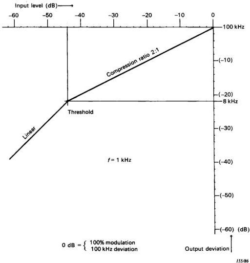

*Figure B1 - Compression curve.*

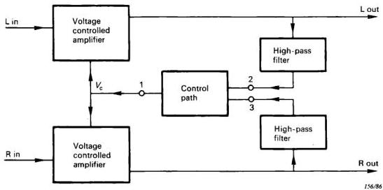

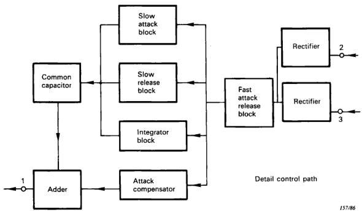

*Figure B2 - Block diagram encoder (stereo).*

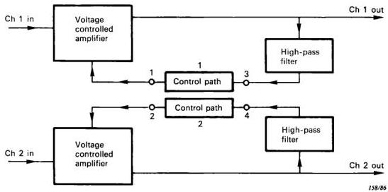

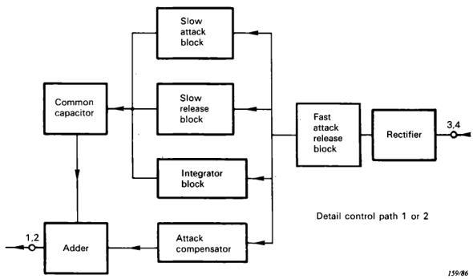

*Figure B3 - Block diagram encoder (bilingual).*

## APPENDIX C

## PROGRAMME STATUS CODE

### C1. Definition of the data in programme status code

Code: $8 \frac{\mathrm{DC}}{\mathrm{BA}}, \mathbf{X}_3, \mathbf{X}_4, \mathbf{X}_5$

- DC = CX noise reduction on;
- BA = CX noise reduction off
- X31 indicates disk size:
$0 = 12$-inch; $1 = 8$-inch
- X32 indicates disk side:
$0 = \text{first side}; 1 = \text{second side}$
- X33 indicates if there are teletext signals present anywhere on the disk or not:
$0 = \text{teletext signals absent}$
$1 = \text{teletext signals present}$
- X34 indicates if the audio signal is FM - FM multiplex modulated or not:
$0 = \text{FM - FM multiplex off}$
$1 = \text{FM - FM multiplex on}$
- X42 indicates if the video format contains normal analogue video signal or, during the active parts of the line, a digital signal:
$0 = \text{analogue video}$
$1 = \text{digital signal}$

*Note.* — This indication of these digital signals in the video is not mandatory but can be an option for the programme maker.

- X41, X43, X44 together with X34 indicate the status of the audio channels according to the following table:

|  X41, X34, X43, X44 | Programme dump | FM - FM multiplex | Channel 1 | Channel 2  |
| --- | --- | --- | --- | --- |
|  0000 | off | off | stereo  |   |
|  0001 | off | off | mono  |   |
|  0010 | off | off | future use  |   |
|  0011 | off | off | bilingual  |   |
|  0100 | off | on | stereo | stereo  |
|  0101 | off | on | stereo | bilingual  |
|  0110 | off | on | cross channel stereo  |   |
|  0111 | off | on | bilingual | bilingual  |
|  1000 | on | off | mono | dump  |
|  1001 | on | off | mono | dump  |
|  1010 | on | off | future use  |   |
|  1011 | on | off | mono | dump  |
|  1100 | on | on | stereo | dump  |
|  1101 | on | on | stereo | dump  |
|  1110 | on | on | bilingual | dump  |
|  1111 | on | on | bilingual | dump  |

*Note.* — The indication of programme dump (X41) is not mandatory, but an option for the programme maker.

— X5 is an error check code on X4 with even parity bit, according to Hamming Code,

X51 is the parity with X41, X42 and X44

X52 is the parity with X41, X43 and X44

X53 is the parity with X42, X43 and X44

## C2. Hamming Code

Information vector  $\mathbf{X}_4\colon A = \left[a_1,a_2,a_3,a_4\right]$
- Check vector  $\mathbf{X}_5$ :  $C = \left[c_1, c_2, c_3\right]$

with parity bit:  $c_{4} = \sum_{i=1}^{4} a_{i} + \sum_{j=1}^{4} c_{j}$  (modulus 2)

- Encoding  $\mathbf{V} = A \cdot \mathbf{G} = \left[ a_{1}, a_{2}, a_{3}, a_{4}, c_{1}, c_{2}, c_{3} \right]$

Where  $\mathbf{G}$  is the matrix:

|  1 | 0 | 0 | 0 | 1 | 1 | 0  |
| --- | --- | --- | --- | --- | --- | --- |
|  0 | 1 | 0 | 0 | 1 | 0 | 1  |
|  0 | 0 | 1 | 0 | 0 | 1 | 1  |
|  0 | 0 | 0 | 1 | 1 | 1 | 1  |

- Read out code  $U = \left[ a_{1}, a_{2}, a_{3}, a_{4}, c_{1}, c_{2}, c_{3} \right]$
- Decoding: Syndrome:  $S = U \cdot \mathbf{M} = \left[ s_{1}, s_{2}, s_{3} \right]$

Where  $\mathbf{M}$  is the matrix:

|  1 | 1 | 0  |
| --- | --- | --- |
|  1 | 0 | 1  |
|  0 | 1 | 1  |
|  1 | 1 | 1  |
|  1 | 0 | 0  |
|  0 | 1 | 0  |
|  0 | 0 | 1  |
|  s1 | s2 | s3 | Correction if 1 bit error  |
| --- | --- | --- | --- |
|  0 | 0 | 0 | No error  |
|  1 | 0 | 0 | c1  |
|  0 | 1 | 0 | c2  |
|  1 | 1 | 0 | a1  |
|  0 | 0 | 1 | c3  |
|  1 | 0 | 1 | a2  |
|  0 | 1 | 1 | a3  |
|  1 | 1 | 1 | a4  |

— Error detection with parity  $(c_4)$ :

1. If  $S = 0$  then  $U$  is valid
2. If  $S \neq 0$  and parity is error, then  $U$  can be corrected from  $S$
3. If  $S \neq 0$  but parity is valid, then  $U$  includes a two bit error not to be correct
