# IEC 60857-1986 Laservision NTSC Amendment 2

## FOREWORD

This amendment has been prepared by subcommittee 100B: Recording, of IEC technical committee 100: Audio, video and multimedia systems and equipment.

The text of this amendment is based on the following documents:

|  FDIS | Report on voting  |
| --- | --- |
|  100B/34/FDIS | 100B/62/RVD  |

Full information on the voting for the approval of this amendment can be found in the report on voting indicated in the above table.

---

### CONTENTS

Add the title of clause 13 as follows:

13 Implementation of a digital audio signal

---

### 4 Mechanical parameters

Add, after subclause 4.1.2, the following new subclause 4.1.3:

|  Characteristics to be specified | Requirements | Methods of measurement and/or conditions  |
| --- | --- | --- |
|  4.1.3 Thickness of single disk (T), figure 1 | min. = 1,1 mm, see figure 1a
max. = 1,4 mm |   |

Replace the existing subclause 4.4 by the following:

|  Characteristics to be specified | Requirements | Methods of measurement and/or conditions  |
| --- | --- | --- |
|  4.4 Label (E), figure 1 | A label on both sides of a double and a single disk is allowed. The label of a single disk on the transparent side is optional, but the label on the protective layer side is mandatory |   |
|  4.4.1 Inside diameter of label (F), figure 1 | min. = 35 mm
max. = 38 mm |   |
|  4.4.2 Outside diameter of label (G), figure 1 | min. = 86 mm
max. = 100 mm |   |

Replace the existing subclause 4.5.3 by the following:

|  Characteristics to be specified | Requirements | Methods of measurement and/or conditions  |
| --- | --- | --- |
|  4.4.3 Outside diameter of the label (G), figure 1 of a single disk on the protective layer side | min. = 86 mm
max. = 300 mm |   |
|  4.4.4 Thickness of label (H), figure 1 | Such that thickness of disk in clamping area (subclause 4.5.3) is within specification |   |
|  4.4.5 Position of label | Should overlap neither centre hole nor, in case of a single disk, the outer diameter of the protective layer side |   |

Add, after subclause 4.16.3, the following new subclause 4.16.4:

|  Characteristics to be specified | Requirements | Methods of measurement and/or conditions  |
| --- | --- | --- |
|  4.16.4 Maximum radial angle (θ) between the normal on the surface (not infoside) and the optical axis | ± 1° | See figure 2  |

Replace the existing subclause 4.20.1 by the following:

|  Characteristics to be specified | Requirements | Methods of measurement and/or conditions  |
| --- | --- | --- |
|  4.20.1 Minimum
8 in version
12 in version | 35
35 |   |

Replace the existing subclause 4.21.1 by the following:

|  Characteristics to be specified | Requirements | Methods of measurement and/or conditions  |
| --- | --- | --- |
|  4.21.1 Minimum
8 in version
12 in version | 0,18
0,18 |   |

### 5 Optical requirements

Replace the existing subclause 5.2 by the following:

|  Characteristics to be specified | Requirements | Methods of measurement and/or conditions  |
| --- | --- | --- |
|  5.2 Birefringence of transparent disk (double pass) | 40° max. |   |

### 6 Temperature and humidity requirements

Replace the text in the second column by the following new text:

|  Requirements  |
| --- |
|  Must satisfy all requirements following exposure to any temperature within the range of 5 °C to 45 °C at any relative humidity within the range of 5 % to 90 % held constant for a period of four days  |

### 10.1.10 CLV picture number

Replace the text of subclause 10.1.10 by the following new text:

On the CLV disk the CLV picture number identifies pictures and can also be used to detect hang-ups.

Code: 8 X1 E X3 X4 X5

X1 = A through F and X3 = 0 through 9.

X1 and X3 indicate the seconds of the run time together with the hours and minutes of the programme time code.

X4 and X5 are the picture numbers within 1 s, thus:

X4 = 0 through 2 and X5 = 0 through 9.

The CLV picture number shall be inserted into line 16 or 279 depending on which field is the first field of the picture.

To resolve the colour time error, the seconds count within the CLV picture number should jump to the next value (X1, X3 part incremented by 1; X4 and X5 part reset to zero) at the first following renewal of the CLV picture number, each time the accumulated number of video frames (N) equals one of the numbers in the following sequence:

$$
N = 8991 \times L + 899 \times M
$$

where $L$ and $M$ are integer, and $0 \leq L$ and $0 \leq M \leq 9$.

For example:

$$
N = 899, 1798, \dots, 8091, 8991, 9890, \dots
$$

The start of the programme time code is zero hour and zero minute, and that of CLV picture number is zero second and zero picture at the beginning of the active programme.

### 10.2.3 Picture numbers

Replace the text of subclause 10.2.3 by the following new text:

The picture numbers are always present on CAV disks. They are unique and in normal count sequence, starting with the number 1 at the beginning of the active programme. The maximum available picture number is 79 999.

#### 11.1.2 Numerical aperture

Replace the text of subclause 11.1.2 by the following new text:

The numerical aperture of the lens of the readout beam is:

$$
NA = 0,40 \pm 0,01.
$$

#### 12 Operational parameters

Add, after clause 12, the following new clause 13:

#### 13 Implementation of a digital audio signal

This clause specifies the implementation of a digital audio signal as an optional addition to the laser vision system (LV). See sections three and four of IEC 60908.

### 13.1 Signal modulation

#### 13.1.1 General

The EFM signal, as defined in IEC 60908, prior to modulation, is filtered by a low-pass filter with a frequency response as detailed in 13.1.2, a high-pass filter with a response as shown in figure 24 and shall have a pre-emphasis as detailed in figure 24. The digital signal is a symmetrical double edge pulsewidth modulated onto the main carrier and recorded onto the disk as shown in figure 22.

#### 13.1.2 Low-pass filter (see figure 23)

a) The frequency response shall be as follows:

1) up to 1,6 MHz  ±0,5 dB (ref. 0,5 MHz)
2) 1,75 MHz  (-3 ± 0,5) dB
3) 2 MHz  (-26 ± 2) dB
4) &gt;2,3 MHz  &lt; -50 dB

b) The group delay shall be as follows:

1) &lt;0,5 MHz  (0 ± 20) ns (ref. 0,5 MHz)
2) 0,8 MHz  (-50 ± 20) ns
3) 1 MHz  (-100 ± 50) ns
4) 1,2 MHz  (-180 ± 50) ns
5) 1,4 MHz  (-350 ± 75) ns

NOTE – This group delay is a pre-distortion for the low-pass filter of the player.

#### 13.1.3 Pre-emphasis

The EFM signal prior to modulation shall have a pre-emphasis according to figure 24.

#### 13.1.4 High-pass filter

The EFM signal prior to modulation shall be filtered by a high-pass filter according to figure 24.

#### 13.1.5 Modulation of the filtered EFM signal

The filtered EFM signal shall be a symmetrical double edge pulse width modulated on the main carrier.

The level of this modulated EFM signal in the recorded frequency spectrum shall be -27 dB ± 1 dB with respect to the unmodulated main carrier when no audio signal is present during digital silence (see figure 25).

#### 13.1.6 Block error rate (BLER)

##### 13.1.6.1 Definitions

See IEC 60908, section three, subclause 11.1.1.

##### 13.1.6.2 Specification of random errors

BLER averaged over any 10 s shall be ≤ 8 × 10⁻² with a recommendation of ≤ 3 × 10⁻².

13.1.6.3 Specification of burst errors

See 11.1.3 of amendment 1 of IEC 60908.

13.2 Sample frequency

The audio sample frequency shall be:

$$
F_{\mathrm{s}} = \frac{7007}{2500} \times F_{\mathrm{H}} \quad (44,1\ \mathrm{kHz\ nominal})
$$

$F_{\mathrm{H}}$ is the line frequency corresponding to the video signal (60 Hz/525 lines – M/NTSC system).

13.3 Compensation of time delay

Since the digital audio decoder delays the audio signal by 15,3 ms, it is recommended to advance the audio signals, modulated into the EFM signal, relative to the related video signal.

13.4 Levels of analogue audio subcarriers

Deviating from subclause 7.2.2, the levels of the analogue audio subcarriers in the recorded frequency spectrum shall be $-30\ \mathrm{dB} \pm 1\ \mathrm{dB}$ with respect to the unmodulated main carrier.

13.5 Polarity of modulation

The polarity of the audio modulation shall be such that $\mathrm{MSB} = 0$ of encoded data words in the EFM signal corresponds with a positive instantaneous frequency deviation of the analogue audio subcarriers.

13.6 Control and display system compact disk (subcode)

13.6.1 Subcode

The subcode is according to IEC 60908, clause 17, with the following modifications:

13.6.1.1 ADR

Change "0001: ADR 1, mode 1 for DATA-Q" to "0100: ADR 4, mode 4 for DATA-Q".

13.6.1.2 Subclause 17.5.1

Change title "Mode 1 for DATA-Q" to "Mode 4 for DATA-Q". In the first line, change "ADR = 1 = (0001)" to "ADR = 4 = (0100)" and, in the third line, change "mode 1" to "mode 4".

13.6.2 Table of content (TOC)

The repetitive TOC shall be recorded in such a way that, at the end of the lead-in area, the table of content can be ended with any value of point.

The video system identification code shall be recorded according to IEC 60908-2 (12 cm CD - V).

P frame is $12 = \mathrm{NTSC}$ "LV disk" with digital stereo sound

P frame is $13 = \mathrm{NTSC}$ "LV disk" with digital bilingual sound.

13.6.2.1 Position lead-in subcode of compact-disk

13.6.2.1.1 Start of CD lead-in subcode in accordance with start lead-in code LV in this standard.

13.6.2.1.2 Length of CD lead-in subcode in accordance with this standard.

13.6.2.2 Position lead-out subcode of compact disk

13.6.2.2.1 Start of CD lead-out subcode in accordance with start lead-out code LV in this standard.

13.6.2.2.2 Length of CD lead-out subcode in accordance with this standard.

13.6.3 Relation track number (CD) and chapter number (LV)

13.6.3.1 The chapter numbers shall be present in the video programme area. They should start with chapter "0" or "1" or a pre-set number of a previous disk with the same programme content. If they start with chapter "0", the length of chapter "0" area should be within 1 min.

13.6.3.2 The track number (TNO) in CD shall be the same as the chapter number in LV with the exception of chapter "0" (see 13.6.3.1), chapter "0" is then a part of track number "1".

13.6.3.3 Maximum track number CD in LV is 79.

13.6.3.4 Minimum length of a track (chapter) shall conform to this standard.

Replace the existing figure 1 by the following:

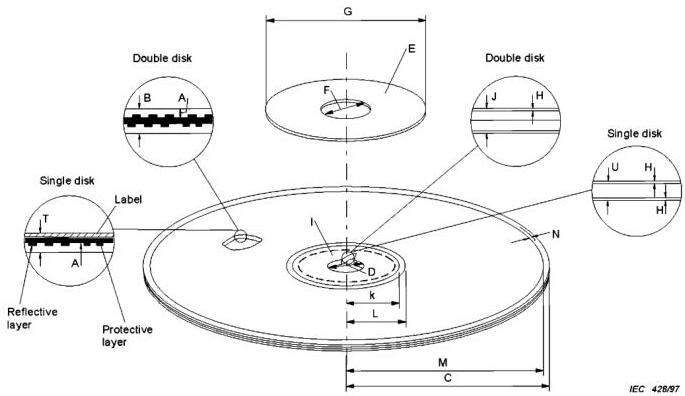

*Figure 1 – Mechanical parameters of the disk (see 4.1 to 4.13).*

Add, after figure 1a, the following new figure 1b:

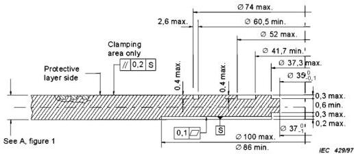

*Figure 1b – Possible profiling of the clamping area of a single disk without labels (see 4.5.3.2).*

(not to scale)

Dimensions in millimetres

NOTE - Flat single disks without notches or dents are recommended. However, to enable single disks to be produced with equipment for double disk production, the profile shown in figure 1b is permitted.

Replace the existing figure 2 by the following:

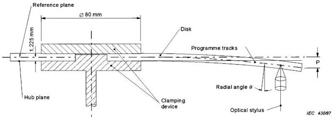

*Figure 2 – Measurement of vertical deviation and radial angle θ of programme tracks during rotation at playback speed (see 4.16).*

Replace the existing figure 8 by the following:

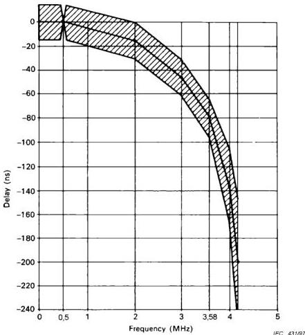

*Figure 8 – Group delay pre-distortion (see 9.1.7).*

Replace the existing figure 18 by the following:

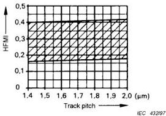

*Figure 18 – Limits of HFMI (see 12.3.1).*

$$
S _ {t} = (8 0 2 \pm 2 6) \mathrm {p i t s / m m}
$$

$$
S _ {t} = \frac {f}{2 \pi R \cdot f _ {f}} \mathrm {p i t s / m m}
$$

$f$  is the electrical signal frequency (Hz)

$R$  is the radius of the track (mm)

$f_{t}$  is the revolution frequency of the disk (Hz)

Add, after figure 21, the following new figures 22 to 25:

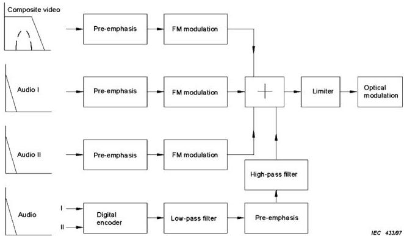

*Figure 22 – Signal processing encoding.*

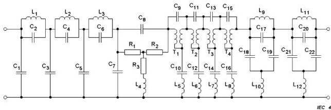

*Figure 23 – Recommended low-pass filter part values.*

IEC 434/97

|  C1 | 0,7436  |
| --- | --- |
|  C2 | 0,1272  |
|  C3 | 1,5438  |
|  C4 | 0,3534  |
|  C5 | 1,3275  |
|  C6 | 0,8921  |
|  C7 | 0,2969  |
|  C8 | 15,201  |
|  C9 | 1,2480  |
|  C10 | 17,4938  |
|  C11 | 1,2598  |
|  C12 | 8,7066  |
|  C13 | 1,2668  |
|  C14 | 4,2967  |
|  C15 | 1,2761  |
|  C16 | 2,4248  |
| --- | --- |
|  C17 | 0,9335  |
|  C18 | 0,7558  |
|  C19 | 0,7558  |
|  C20 | 1,1887  |
|  C21 | 0,4792  |
|  C22 | 0,4792  |
|  L1 | 1,3817  |
|  L2 | 1,3645  |
|  L3 | 0,7020  |
|  L4 | 15,201  |
|  L5 | 1,248  |
|  L6 | 1,2599  |
|  L7 | 1,2668  |
|  L8 | 1,2761  |
| --- | --- |
|  L9 | 1,5116  |
|  L10 | 1,3114  |
|  L11 | 0,9584  |
|  L12 | 1,4283  |
|  T1 | 17,4938  |
|  T2 | 8,7065  |
|  T3 | 4,2967  |
|  T4 | 2,4248  |
|  R1 | 0,0575  |
|  R2 | 0,0575  |
|  R3 | 8,266  |

$F_{c} = 1,75 \mathrm{MHz}$

NOTE - For the low-pass filter in the player parts C1 through C7 and L1, L2 and L3 are recommended.

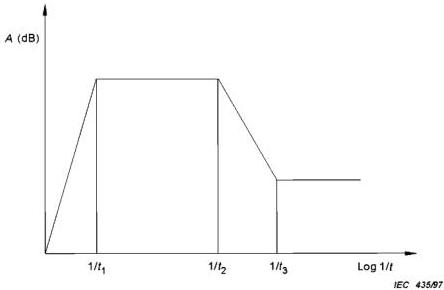

*Figure 24 – High-pass filter and pre-emphasis.*

High-pass filter

$$
A = \frac {\mathrm {j} \omega t _ {1}}{1 + \mathrm {j} \omega t _ {1}} \quad t _ {1} = (7 5 \pm 5) \mu \mathrm {s}
$$

Pre-emphasis

$$
A = \frac {1 + j \omega t _ {3}}{1 + j \omega t _ {2}} \quad t _ {2} = (5 \pm 0, 1) \mu s; t _ {3} = (3 1 8 \pm 6) n s
$$

Spectrum analyzer: 10 dB/div
RBW 30 kHz
VBW 30 kHz

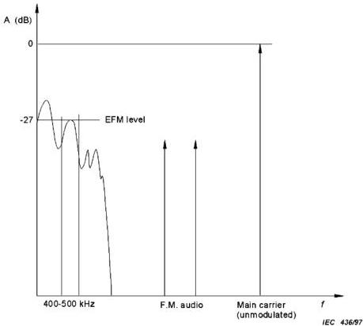

*Figure 25 – Level of EFM signal.*

## Appendix A

Replace the existing text by the following new text:

CAV: Constant Angular Velocity
CCIR: International Radio Consultative Committee
CLV: Constant Linear Velocity
EIA: Electronic Industries Association
FCC: Federal Communications Commission
NA: Numerical Aperture
PBS: Public Broadcasting Service
VIRS: Vertical Interval Reference Signal
ITS: International Test Signals

Replace the existing figure B.3 by the following new figure B.3:

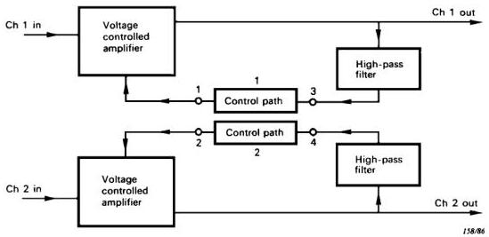

*Figure B.3 – Block diagram encoder (bilingual), upper portion.*

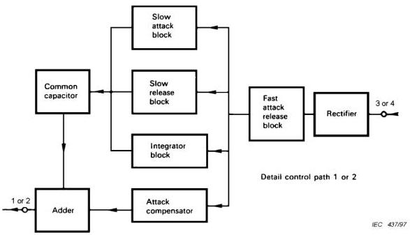

*Figure B.3 – Block diagram encoder (bilingual), lower portion.*

## Appendix C

Replace the existing clause C.1 by the following new clause:

### C.1 Definition of the data in programme status code

$$
8 \frac {D C}{B A} X _ {3}, X _ {4}, X _ {5}
$$

- DC = CX noise reduction on
- BA = CX noise reduction off
- X31 indicates disk size:
0 = 12 inch; 1 = 8 inch

X32 indicates disk side:
0 = first side; 1 = second side

X33 indicates if there are teletext signals present anywhere on the disk or not:
0 = teletext signal absent; 1 = teletext signal present

X34 indicates if it is allowed to copy the programme:
0 = copy prohibited; 1 = copy permitted

- X41, X42, X43 together with X44 indicate the status of the analogue audio channels and the video signal according to the following table:

|  Mode | X41, X42, X43, X44 | Video signal | Channel 1 Channel 2  |
| --- | --- | --- | --- |
|  0 | 0000 | Standard | Stereo  |
|  1 | 0001 | Standard | Mono  |
|  2 | 0010 | Standard | Future use  |
|  3 | 0011 | Standard | Bilingual  |
|  4 | 0100 | Future use | Future use  |
|  5 | 0101 | Future use | Future use  |
|  6 | 0110 | Future use | Future use  |
|  7 | 0111 | Future use | Future use  |
|  8 | 1000 | Standard | Mono Dump  |
|  9 | 1001 | Future use | Future use  |
|  10 | 1010 | Future use | Future use  |
|  11 | 1011 | Future use | Future use  |
|  12 | 1100 | Future use | Future use  |
|  13 | 1101 | Future use | Future use  |
|  14 | 1110 | Future use | Future use  |
|  15 | 1111 | Future use | Future use  |

