# JVC VIDEO TECHNICAL GUIDE VTG82063 - SECTION 1
## VHS BASICS TECHNOLOGY

### 1.1 VHS FORMAT DESCRIPTION

#### 1.1.1 VHS outline

The Video Home System (VHS) format was conceived as a means to bring video tape recording within the reach of the average consumer. Since its development, advances in all aspects of the technology, including greater video head provision and improved video tape, have yielded a wide variety of functions and features. Versions are also available for the world's major television systems, NTSC, PAL and SECAM.

VHS resulted from meeting several technical challenges for improving picture quality and resolution. Signal to noise ratio, crosstalk and over modulation were among the many problems encountered and resolved. The techniques for overcoming these difficulties include slant azimuth recording system, non-linear emphasis, double limiter and phase shift circuit designs.

##### 1. VHS Hi-Fi system

In terms of sound and picture quality, the initial series of VHS video cassette recorders was fully adequate for general purpose household entertainment. However, a market was also recognized among those who owned or planned to purchase high quality stereo audio systems.

The VHS Hi-Fi system was therefore developed for enhanced audio performance along with outstanding picture quality. Special rotating audio heads increase the relative tape to head speed to 5.80 m/sec (NTSC) / 4.85 m/sec (PAL/SECAM), thereby providing true high fidelity frequency response in the audio range of from 20 Hz to 20,000 Hz, as well as a dynamic range exceeding 90 dB.

The audio signal is frequency modulated at 1.3 MHz (NTSC) / 1.4 MHz (PAL/SECAM) for the left channel and 1.7 MHz (NTSC) / 1.8 MHz (PAL/SECAM) for the right channel. Maximum deviation is ±150 kHz.

Recording is performed by a “depth multiplex” (D-MPX) system, whereby both sound and picture are recorded on the same portion of the tape. The audio signal is recorded at a deeper level than the video, while the azimuth angles of the audio and video heads differ sufficiently to prevent cross-interference.

##### 2. HQ (high quality)

Advances in circuit technology and in television receivers provided impetus to further improve the picture quality of VHS equipment. This led to the HQ (high quality) series which incorporates the following technical features.

1) Increased white clip level
2) Detail enhancer
3) Luminance noise reduction (YNR)
4) Chrominance noise reduction (CNR)

Increasing the white clip level improves the picture edge sharpness. The detail enhancer functions by increasing the level of the high frequency low amplitude component of the signal, which is often lost in the REC/PB process. More detailed pictures are then obtained during playback.

YNR reduces noise at the picture edges and flat portions, while CNR contributes to reducing color smear.

HQ technology offers overall picture improvement and increases the recording and playback quality of home video recorders.

##### 3. S-VHS objectives

The trend in color television receivers is continuing toward larger screens and high picture quality. Nearly all of these new generation TV sets are connected to home video cassette recorders.

Demand is thus increasing for evermore detailed and realistic video reproduction. The S-VHS Euro system was developed to meet this goal and provide picture quality that approaches a 1-inch professional video tape recorder at a cost accessible to the consumer.

##### 4. S-VHS features

1) Horizontal resolution exceeds 400 lines. This is fully adequate to accommodate presently broadcast problems (about 330 lines) without degradation in picture quality.
2) Vivid realistic reproduction gives video program artists more freedom of expression and promotes higher quality software availability. Since more than 400 lines are also obtained in the EP/LP mode, software for this mode may appear in the near future.
3) Color video cameras and VideoMovie systems compatible with S-VHS are becoming available. Self-made video programs will be able to reval broadcast television quality.
4) The high picture quality and economical cost of S-VHS enables a broad range of commercial uses, such as video publishing, travel guides, sales manuals, etc.
#### 1.1.2 VHS and S-VHS compatibility

##### 1. Equipment

S-VHS video recorders have two selectable operating modes for recording and playback: S-VHS and VHS.

##### 2. Modes

Cassettes recorded in the S-VHS mode must be played back also in the S-VHS mode. If played back in the VHS mode (or with a VHS-only deck), a usable picture is not obtained.

1) An S-VHS recorded cassette cannot be played on a VHS-only deck.
2) A VHS recorded cassette may be played on an S-VHS deck.

##### 3. Cassette

1) For best results in the S-VHS mode, use an S-VHS cassette. (An ordinary VHS cassette will not deliver full performance in this mode.)
2) An S-VHS cassette may also be used in the VHS mode (or with a VHS-only deck).

Fig. 1-1-1 illustrates the compatibility between cassette types and video recorder modes.

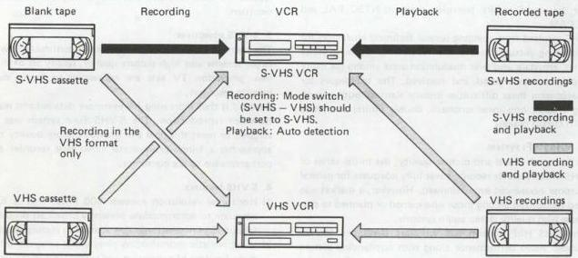

*Fig. 1-1-1 VHS/S-VHS compatibility*

##### 4. Super VHS and European color system compatibility

Tapes recorded in Super VHS anywhere except NTSC areas can be played back on any Super VHS Euro system deck.

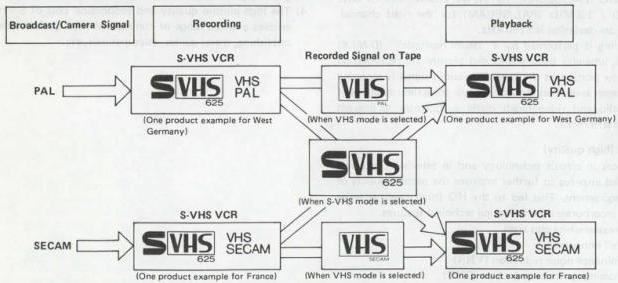

*Fig. 1-1-2 S-VHS Euro system and European color system*
#### 1.1.3 Magnetic tape pattern

Fig. 1-1-3 shows the recorded tape pattern for the VHS/S-VHS format with longitudinal (fixed head) audio tracks. This is the basic pattern without the rotary audio head feature. The VHS/S-VHS Hi-Fi tape pattern is produced by first laying down the pattern shown in Fig. 1-1-4 at nearly saturation level. Afterwards, the VHS/S-VHS format video and audio pattern of Fig. 1-1-3 is recorded over this to yield the D-MPX (Depth Multiplex) pattern used for the VHS/S-VHS Hi-Fi system.

##### 1. Slant azimuth principle

Due to the physical properties affecting magnetic tape and heads, maximum signal output is obtained when the azimuth angle of a playback head precisely matches that of the recording head (and tape track). As the difference between these angles increases, the playback output drops sharply.

In the standard VHS/S-VHS format, two rotary video heads are mounted at $\pm 6$ degrees azimuth relative to each other. The resulting video tracks become a chevron-like pattern as illustrated in Fig. 1-1-3. During playback, since each head yields an effective output only when it traces its corresponding track, crosstalk between video tracks is reduced to a level where it can be corrected by techniques described below.

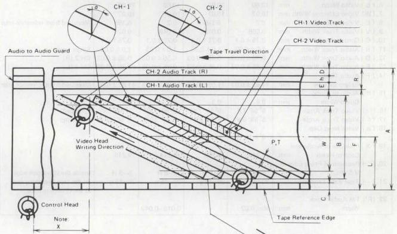

*Fig. 1-1-3 VHS/S-VHS magnetic tape pattern*

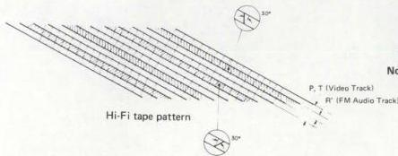

*Fig. 1-1-4 VHS/S-VHS Hi-Fi magnetic tape pattern*

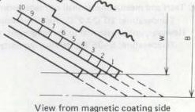
View from magnetic coating side
Note: Distance from the CH-2 video track 180° outlet point to CTL signal pulse.
The same principle as this is also employed for the sound information in the VHS/S-VHS Hi-Fi system. In this case, the rotary audio heads are mounted at $\pm 30$ degrees azimuth angles. Consequently, the tape pattern is characterized by four helical tracks at four different azimuth angles.

Table 1-1-1 lists the main specifications of the magnetic tape pattern.

|  Item | NTSC |   | PAL/SECAM |   | Remarks  |
| --- | --- | --- | --- | --- | --- |
|   |  SP mode | EP mode | SP mode | LP mode  |   |
|  1. (A) Tape Width mm | 12.65 ± 0.01 | 12.65 ± 0.01 | 12.65 ± 0.01 | 12.65 ± 0.01 |   |
|  2. (Vt) Tape Speed mm/sec | 33.35 ± 0.5% | 11.12 ± 0.5% | 23.39 ± 0.5% | 11.70 ± 0.5% |   |
|  3. (φ) Drum Diameter mm | 62 ± 0.01 | 62 ± 0.01 | 62 ± 0.01 | 62 ± 0.01 | (Upper Drum)  |
|  4. (Vh) Writing Speed m/sec | 5.80 | 5.83 | 4.85 | 4.86 |   |
|  5. (P) Video Track Pitch mm | 0.058 | 0.019 | 0.049 | 0.024 |   |
|  6. (B) Video Width mm | 10.60 | 10.60 | 10.60 | 10.60 |   |
|  7. (W) Video Effective Width mm | 10.07 | 10.07 | 10.07 | 10.07 |   |
|  8. (L) Video Track Center mm | 6.2 | 6.195 | 6.2 | 6.195 | Measured from reference edge  |
|  9. (V) Video Track Width mm | 0.058 | 0.019 | 0.049 | 0.024 |   |
|  10. (C) Control Track Width mm | 0.75 ± 0.1 | 0.75 ± 0.1 | 0.75 ± 0.1 | 0.75 ± 0.1 |   |
|  11. (R) Audio Track Width mm | 1.0 ± 0.03 | 1.0 ± 0.03 | 1.0 ± 0.03 | 1.0 ± 0.03 | Single track  |
|  12. (D) Audio Track Width mm | 0.35 ± 0.03 | 0.35 ± 0.03 | 0.35 ± 0.03 | 0.35 ± 0.03 | CH-2 (R)  |
|  13. (E) Audio Track Width mm | 0.35 ± 0.03 | 0.35 ± 0.03 | 0.35 ± 0.03 | 0.35 ± 0.03 | CH-1 (L)  |
|  14. (F) Audio Track Reference Line mm | 11.65 ± 0.03 | 11.65 ± 0.03 | 11.65 ± 0.03 | 11.65 ± 0.03 | Measured from reference edge  |
|  15. (h) Audio to Audio Guard Width mm | 0.3 | 0.3 | 0.3 | 0.3 |   |
|  16. (θo) Video Track Angle | 5° 56' 7.4" | 5° 56' 7.4" | 5° 56' 7.4" | 5° 56' 7.4" | (Stopped)  |
|  17. (θ) Video Track Angle | 5° 58' 9.9" | 5° 56' 48.1" | 5° 57' 50.3" | 5° 56' 58.8" | (Running)  |
|  18. (α) Video Head Gap Azimuth Angle | 6° ± 10' | 6° ± 10' | 6° ± 10' | 6° ± 10' |   |
|  19. (X) Positions of Audio and Control Heads mm | 79.244 | 79.253 | 79.244 | 79.248 |   |
|  20. ( ) Positions of Front Edge of V-SYNC | 5-8 H | 5-8 H | 5-8 H | 5-8 H | Inside the W bottom edge  |
|  21. ( ) Tape Back Tension | 30-45 g | 30-45 g | 30-45 g | 30-45 g | At the tape beginning and at the drum entrance  |
|  22. (R') FM Audio Track Width mm | Min. 0.02 | - | 0.016-0.049 | - |   |

Table 1-1-1 Magnetic tape pattern

Note: Tests and measurements shall be made under the following conditions.

Temperature: $20^{\circ}\mathrm{C} \pm 2^{\circ}\mathrm{C}$, Relative humidity: $65\% \pm 5\%$

However, unless essential to the judgement, these can also be done under the following conditions.

Temperature: $5-35^{\circ}\mathrm{C}$, Relative humidity: $40-80\%$
##### 2. Horizontal correlation (NTSC)

Horizontal (H) correlation is one of the techniques employed for reducing the effects of residual adjacent channel crosstalk. In this system, the writing start of one television scanning line is delayed 1.5 H (the time equivalent to 1.5 horizontal TV scanning lines) with respect to the previous scanning line.

The slant azimuth recording system is capable of eliminating most channel crosstalk at high frequencies. However, for the low frequency component, where the VHS/S-VHS color information is situated, this system is less effective.

Since the visual information between two adjacent television scanning lines differs only slightly, by employing horizontal correlation, demodulated color crosstalk components become aligned with the main information of neighboring lines. Consequently, the visual disturbance due to residual crosstalk is minimized.

An additional advantage of horizontal correlation is evident during special operating modes, such as slow motion, still frame and search. In these modes, even though the video heads trace more than one recorded track, the horizontal sync signals are played back at fixed intervals, thereby minimizing visual disturbance.

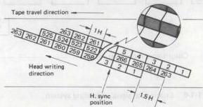

*Fig. 1-1-5(A) VHS/S-VHS recording signal pattern (NTSC)*

##### 3. Horizontal correlation (PAL/SECAM)

The azimuth head configuration removes crosstalk from most of the high frequency portion of the FM luminance signal, however, it is not able to fully eliminate crosstalk from the low frequency component of the lower side-band portion. This residual crosstalk is reduced by employing line correlation for the tape pattern.

Line correlation (or "H correlation") consists of arranging the horizontal sync signal positions of adjacent recorded tracks. Since this makes the frequencies of the main signal and crosstalk signal very close, the demodulated crosstalk amount becomes extremely low with respect to the main signal. The type of H correlation used in the VHS/S-VHS format is shown in Fig. 1-1-5(B).

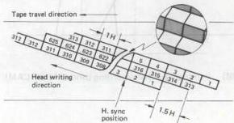

*Fig. 1-1-5(B) VHS/S-VHS recording signal pattern (PAL/SECAM)*

#### 1.1.4 VHS luminance signal recording system

Frequency modulation (FM) is used for the luminance signal recording system. A simplified block diagram of the system is shown in Fig. 1-1-6.

A lowpass filter (LPF) removes the color component and passes only the luminance component of the input color TV signal. At the next stage, the pre-emphasis circuit, the high frequency portion of the luminance signal is enhanced in order to improve the S/N ratio during FM recording.

Since excess pre-emphasis could lead to black/white reversal due to the shortened recording wavelength, a white/dark clip circuit cuts the overshoot and under-shoot components which exceed certain positive and negative levels.

The frequency modulator (FM MOD) converts the AM luminance signal to FM, which goes through a highpass filter (HPF) to the recording amplifier. These circuits amplify the signal with the proper frequency characteristic, after which it is mixed with the down-converted color signal and supplied to the video heads.

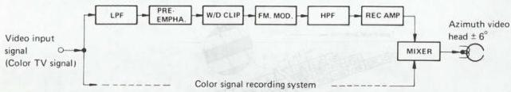

*Fig. 1-1-6 Luminance signal recording system*

##### 1. Luminance signal recording frequency characteristic

As shown in Fig. 1-1-7, when the video input is a color TV signal, a lowpass filter removes the color component.

This leaves the luminance signal, with a bandwidth from about $30\mathrm{Hz}$ to $3.0\mathrm{MHz}$. With some VHS models, when the input is a black and white TV signal, it by-passes the LPF; allowing a wider bandwidth to beyond $4.5\mathrm{MHz}$ (NTSC) or $4\mathrm{MHz}$ (PAL/SECAM).

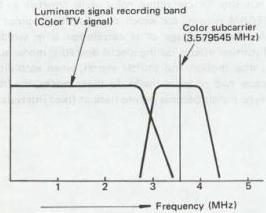

*Fig. 1-1-7(A) Luminance signal recording band (NTSC)*

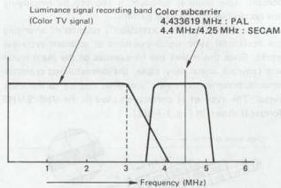

*Fig. 1-1-7(B) Luminance signal recording band (PAL/SECAM)*
##### 2. Pre-emphasis characteristics

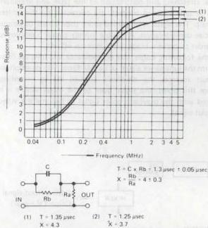

*Fig. 1-1-8 Pre-emphasis characteristics*

##### 3. White and dark clip level

White clip level and dark clip level are as shown in Fig. 1-1-9.

**Note:** The level from sync tip to white peak is 100%.

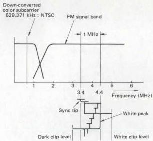

*Fig. 1-1-9(A) Recording spectrum (NTSC)*

##### 4. FM carrier frequency and deviation

See Fig. 1-1-9.

|  NTSC | Sync tip : 3.4 ± 0.1 MHz  |
| --- | --- |
|   |  White peak : 4.4 ± 0.1 MHz  |
|   |  Deviation : 1.0 ± 0.1 MHz  |
|  PAL/SECAM | Sync tip : 3.8 ± 0.1 MHz  |
|   |  White peak : 4.8 ± 0.1 MHz  |
|   |  Deviation : 1.0 ± 0.1 MHz  |

##### 5. FM signal recording frequency

As indicated in Fig. 1-1-9(A)/(B), when the video input is a color TV signal, it goes through an HPF, clearing an area for the down-converted color signal. With some VHS models, when the input is a B/W TV signal, the HPF can be bypassed to extend the bandwidth to the DC area.

##### 6. FM signal recording amp. current (REC amp)

Current:

|  More than 3.8 MHz | : Optimum saturation recording current  |
| --- | --- |
|  2 MHz | : 3 ± 1 dB  |
|  1 MHz | : 6 ± 1 dB  |
|  Less than 1 MHz | : Flat characteristics  |

**Note:** 0 dB at 3.8 MHz

##### 7. FM signal head current (video head)

Specified to be within ±1.5 dB of 4 MHz optimum recording current.

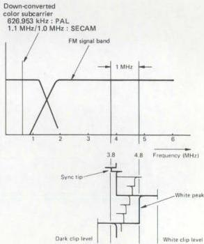

*Fig. 1-1-9(B) Recording spectrum (PAL/SECAM)*

#### 1.1.5 VHS luminance signal playback system

This system functions to return the signals recorded on the tape to a form as close as possible to the video input signals. The simplified block diagram is shown in Fig. 1-1-10. The low level FM signals played back by the video heads are combined into a single FM signal by the switching amplifier. After amplification to the required frequency characteristic, a highpass filter attenuates the down-converted color signal and passes only the FM luminance signal. This HPF has the same response as that of the recording system.

Variations in the playback FM signal level due to mechanical stretching and contraction of the tape, and irregularities in tape to head contact, are corrected by the limiter circuit. The signal is amplified more than 80 dB to permit precise demodulation. A double limiter circuit is employed in order to prevent black/white reversal effects.

In the following stages, the demodulator and lowpass filter return the luminance signal to its AM form. The de-emphasis circuit reverses the emphasis applied during recording. From this point, the signal goes to the mixer where it is mixed with the playback color signal to become the video output signal.

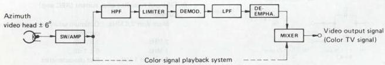

*Fig. 1-1-10 Luminance signal playback system*
#### 1.1.6 VHS color signal recording system (NTSC)

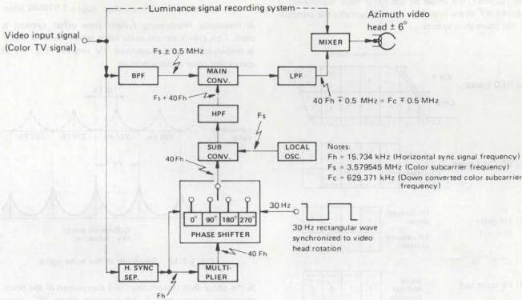

*Fig. 1-1-11 Color signal recording system*

This is a direct recording system using a down converted phase shifted color signal. The phase shift system removes color crosstalk which cannot be completely eliminated by the azimuth video heads. Fig. 1-1-11 illustrates a simplified block diagram of this system.

A bandpass filter (BPF) extracts the color component from the input video signal and supplies it to the main converter. At the same time, the input signal also goes to the horizontal sync separator, which supplies the $15.734\mathrm{kHz}$ (Fh) to the multiplier and phase shift circuits. Via the phase shifter, the 40 Fh CH-1 track component is advanced in phase each line (1 H) and supplied to the sub converter, while the CH-2 component is delayed in phase $90^{\circ}$ every line (1 H). A 30 Hz rectangular wave synchronized to the video head rotation is used for differentiating between the CH-1 and CH-2 components. Each line is also controlled by the Fh input.

The local oscillator produces the color subcarrier frequency of 3.579545 MHz (Fs). At the sub converter, the 40 Fh and Fs are frequency-converted to become $(Fs + 40 Fh)$. This is supplied through a highpass filter to the main converter. Also supplied to the main converter are the color signal $Fs \pm 0.5 MHz$ and carrier wave $(Fs + 40 Fh)$. These are down-converted to become $(40 Fh \mp 0.5 MHz)$, which goes through a lowpass filter and then to the mixer for mixing with the FM luminance signal. The result is applied to the video heads.

In other words, the 3.579545 MHz (Fc) color subcarrier is converted to a low band of 629.371 kHz (40 Fh). The down converted color signal is then recorded directly, using the FM luminance signal as AC bias.

##### 1. Color crosstalk correction by phase shift system

While the CH-1 track component is advanced $90^{\circ}$ every line and recorded, the phase of the CH-2 track component is delayed $90^{\circ}$ every line. Fig. 1-1-12 illustrates the principle of this phase shift system.

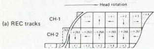

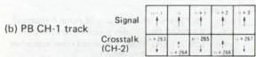

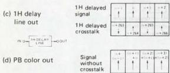

*Fig. 1-1-12 Phase shift system*

In the figure, (a) indicates the phase shifted recording pattern. The CH-1 head pattern phase is advanced $90^{\circ}$ every line. The phase of the CH-2 head pattern is delayed every line.

During playback, when the CH-1 head picks up a portion of the CH-2 track signal, this becomes the crosstalk component. The main signal is delayed $90^{\circ}$ every line from the CH-1 track, and this output is shown by (b). The dotted arrows indicate the crosstalk component and, as can be noted, the phase reverses every line.

Passing signal (b) through a 1 H delay line yields signal (c). In comparing signals (b) and (c), the main signal phase is the same every line, but the crosstalk phase reverses. Therefore, by mixing signals (b) and (c), the crosstalk component of the adjacent track can be removed to result in the playback color signal (d).

In other words, the signal is recorded by the phase shift system, and during playback it is mixed with the signal through a 1 H delay line to remove crosstalk.

Crosstalk in the playback color signal (d) effectively becomes zero, while the main signal is enhanced to improve the S/N ratio. Also, the CH-2 head playback phase is advanced $90^{\circ}$ every line (opposite to recording), producing the same effect. A digital type system is used for phase shifting.

##### 2. Down-converted color subcarrier frequency

The color subcarrier frequency (Fs) can be expressed as:

$$
F_s = \frac{1}{2} F_h \times n \quad (n = \text{odd number}: 455) = 3.579545 \text{ MHz}
$$

A frequency interleaving system (line offset system) is used. This avoids serious color noise when the color signal is displayed on a monochrome TV receiver. Fig. 1-1-13 shows this color signal spectrum.

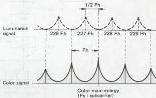

*Fig. 1-1-13 Spectrum of the color signal*

In the phase shift system, the CH-1 component of the down converted color signal is advanced in phase $90^{\circ}$ every line, deviated by plus 1/4 Fh, and distributed at 1/2 Fh intervals centered on the Fc (down converted color subcarrier) component. The CH-2 track component is delayed in phase $90^{\circ}$ every line, deviated by minus 1/4 Fh, and distributed at 1/2 Fh intervals centered on Fc. This spectrum is shown in Fig. 1-1-14.

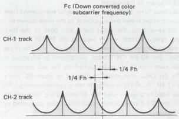

*Fig. 1-1-14 Spectrum of down-converted color signal*

The FM luminance and down converted color signals are mixed to become the recording current. When recorded and played back using magnetic tape, which possesses 3-dimensional distortion and nonlinearity, interference in the form of $F_{D} + 2F_{DC}$ (Fo : FM carrier; Fdc : down converted color signal) is introduced and cannot be ignored. When the 2F dc component is detected and demodulated, a beat is produced with respect to the luminance signal and appears in the picture. Therefore, as with the color signal, Fc (down converted color subcarrier frequency) must be selected so that the frequency of the 2Fdc component becomes interleaved (1/2 offset) in relation to the luminance signal.

When Fc is determined at 40 Fh, the 2 Fdc spectrum of the CH-1 track component appears at (+1/2 Fh) and in the CH-2 track distribution, the 2 Fdc spectrum appears at (nFh - Fh).

Fig. 1-1-15 shows the 2 FDC component spectrum with respect to the playback luminance signal at this time.

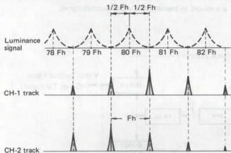

*Fig. 1-1-15 2 FDC playback spectrum*

The 2 Fdc components for both CH-1 and CH-2 become interleaved (1/2 line offset) with respect to the luminance signal and thereby visually reduced. The 629.371 kHz value was selected for both reducing noise and in consideration of color bandwidth.

##### 3. Color signal recording bandwidth

Response curves for the bandpass and lowpass filters are indicated in Fig. 1-1-16.

Constant current characteristics are possessed by the down-converted color signal recording current.

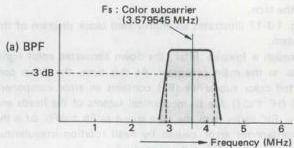

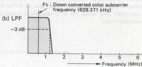

*Fig. 1-1-16 Color signal recording bandwidth*

#### 1.1.7 VHS color signal playback system (NTSC)

The color signal playback system performs essentially the opposite function of the recording system. In addition, however, important corrections must be performed for color signal frequency and phase errors introduced by variations in tape speed and head rotation, and elasticity of the tape.

Fig. 1-1-17 illustrates an abbreviated block diagram of this system.

Through a lowpass filter, the down converted color signal goes to the main converter. At this time, the down converted color subcarrier (Fc) contains an error component $(40\mathrm{fH}^{\prime}\pm \Delta \mathrm{f})$ due to mechanical factors of the heads and tape. Fh' varies with the tape speed as Fh ± ΔFh. Δf is the instantaneous error caused by head rotation irregularities and tape elongation and contraction.

The 40 Fh' frequency deviation component is compensated by supplying the video output signal to the horizontal sync separator, multiplier and phase shifter, and 40 Fh' to the sub converter. This forms the AFC (automatic frequency compensator) loop.

In the APC (automatic phase compensator) loop, the $\pm \Delta f$ phase error component is compensated by comparing the burst component of the up converted playback color signal with the subcarrier frequency from the local oscillator and APC detector. A variable crystal oscillator (VXO) produces $(\mathrm{Fs} \pm \Delta f)$ which goes to the sub converter. As a result, $(\mathrm{Fs} + 40 \mathrm{Fh}' \pm \Delta f)$ is supplied from the sub converter through a highpass filter to the main converter.

By frequency conversion with Fc, the color subcarrier frequency of 3.579545 MHz, which is free from frequency and phase deviations, is obtained through a bandpass filter. In the opposite manner, as with recording, the phase shifter delays the CH-1 track phase $90^{\circ}$ every line, advances the CH-2 track phase $90^{\circ}$ every line and 40 Fh' is supplied to the sub converter. The playback color signal through the main converter and bandpass filter is applied to a 1 H delay line to remove crosstalk. Characteristics of the lowpass and bandpass filters are the same as those for recording (Fig. 1-1-16).

At the mixer, the playback color and luminance signals are mixed to become the video output signal.

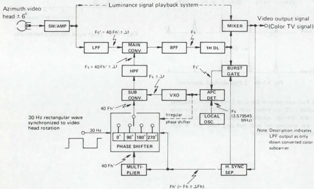

*Fig. 1-1-17 Color signal playback system*
#### 1.1.8 VHS color signal recording system (PAL)

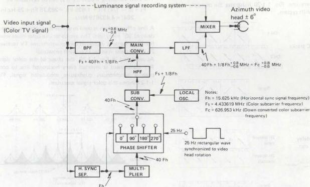

*Fig. 1-1-18 Color signal recording system*

This is a direct recording system using a down converted phase shifted color signal. The phase shift system removes color crosstalk which cannot be completely eliminated by the azimuth video heads. Fig. 1-1-18 illustrates a simplified block diagram of this system.

A bandpass filter (BPF) extracts the color component from the input video signal and supplies it to the main converter. At the same time, the input signal also goes to the horizontal sync separator, which supplies the 15.625 kHz (Fh) to the multiplier and phase shift circuits. Via the phase shifter, the 40 Fh CH-1 track component is supplied directly to the sub converter, but the CH-2 component is delayed in phase 90° every line (1 H). A 25 Hz rectangular wave synchronized to the video head rotation is used for differentiating between the CH-1 and CH-2 components. Each line is also controlled by the Fh input.

The local oscillator produces the color subcarrier frequency 4.433619 MHz (Fs) + 1/8 Fh single frequency which goes to the sub converter. At the sub converter, the 40 Fh and (Fs + 1/8 Fh) are frequency converted to become (Fs + 40 Fh + 1/8 Fh). This is supplied through a highpass filter to the main converter. Also supplied to the main converter are the color signal Fs +0.6 MHz and carrier wave (Fs + 40 Fh +1/8 Fh). These are down converted to become (40 Fh + 1/8 Fh +0.8 MHz) which through a lowpass filter goes to the mixer for mixing with the FM luminance signal. The result is applied to the video heads.

In other words, the 4.433619 MHz (Fc) color subcarrier is converted to a low band of 626.953 kHz (40 Fh + 1/8 Fh). The down converted color signal is then recorded directly using the FM luminance signal as AC bias.

##### 1. Color crosstalk correction by phase shift system

A synchronous quadrature modulation system is employed in which the phase of the color signal R-Y component is reversed every line in order to prevent transmission distortion.

The color signal indicated in Fig. 1-1-19 is converted to a lowband.

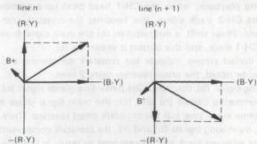

*Fig. 1-1-19 Vector of color signal*

While the CH-1 track component is recorded with phase unchanged, the phase of the CH-2 track component is delayed 90° every line. Fig. 1-1-20 illustrates the principle of this phase shift system.

(a) REC tracks
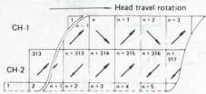

(b) PB CH-1 track
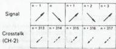

(c) 2H delay line out
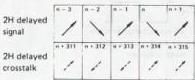

(d) PB color out
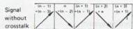

In the figure, (a) indicates the phase shifted recording pattern. Since the CH-1 head pattern is not phase shifted, the R-Y component phase becomes inverted every line. The phase of the CH-2 head pattern is delayed every line and this causes its R-Y component phase to become inverted every two lines.

During playback, when the CH-1 head picks up a portion of the CH-2 track signal, this becomes the crosstalk component. Phase shift is not required for the main signal from the CH-1 track, and this output is shown by (b).

The dotted arrows indicate the crosstalk component and, as can be noted, the phase reverses every 2 lines.

Passing signal (b) through a 2H delay line yields signal (c). In comparing signals (b) and (c), the main signal phase is the same every line, but the crosstalk phase reverses. Therefore, by mixing signals (b) and (c), the crosstalk component of the adjacent track can be removed to result in the playback color signal (d).

In other words, the color signal can be considered in 2 H units. It is recorded by the phase shift system and during playback, the signal through a 2 H delay line is mixed to remove crosstalk.

Crosstalk in the playback color signal (d) effectively becomes zero, while the main signal is enhanced to improve S/N. Also, the CH-2 head playback phase is advanced 90° every line (opposite to recording), producing the same effect. A digital type system is used for phase shifting.

##### 2. Down-converted color subcarrier frequency

The color subcarrier frequency (Fs) can be expressed as:

$$
F_s = (n - 1/4) F_h + 1/625 F_h = 283.75 F_h + 25 H_z \quad (n = 284) = 4.433619 \text{ MHz}
$$

A line offset system is used in which the subcarrier phase is delayed 90° every line. This avoids serious color noise when the color signal is displayed on a monochrome TV receiver. 25 Hz is added in order to prevent crosscolor.

As indicated in Fig. 1-1-20, the phase of the color signal R-Y component is inverted every horizontal line to compose a synchronous quadrature modulated signal. Fig. 1-1-21 shows this color signal spectrum.

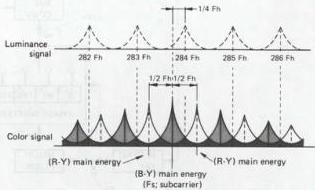

*Fig. 1-1-21 Spectrum of color signal*

In the phase shift system, the CH-1 component of the down converted color signal is distributed at 1/2 Fh intervals centered on the Fc (down converted color subcarrier) component. The CH-2 track component is delayed in phase 90° every line, deviated by 1/4 Fh, and distributed at 1/2 Fh intervals centered on Fc. This spectrum is shown in Fig. 1-1-22.

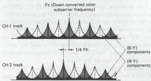

*Fig. 1-1-22 Spectrum of down-converted color signal*

The FM luminance and down converted color signals are mixed to become the recording current. When recorded and played back using magnetic tape, which processes 3-dimensional distortion and nonlinearity, interference in the form of $F_0 + 2F_{DC}$ (Fo : FM carrier; FDC : down converted color signal) becomes introduced and cannot be ignored. When the 2FDC component is detected and demodulated, beat becomes produced with respect to the luminance signal and appears in the picture. Therefore, as with the color signal, Fc (down converted color subcarrier frequency) must be selected so that the 2FDC component becomes 1/4 offset in relation to the luminance signal, i.e.:

$$
2F_c = \frac{2n - 1}{4}F_h
$$

$$
\begin{array}{l}
F_c = \frac{2n - 1}{8}F_h = \frac{321}{8}F_h = 40F_h + \frac{1}{8}F_h \quad (n = 161) \\
= 625 + 1.953 = 626.953 \text{ kHz}
\end{array}
$$

When Fc is determined at (40 Fh + 1/8 Fh), the spectrum of the CH-1 track B-Y component appears at (nFh + 1/8 Fh) and the R-Y component at (nFh - 3/8 Fh). In the CH-2 track distribution, B-Y appears at (nFh - 1/8 Fh) and R-Y at (nFh - 5/8 Fh).

Fig. 1-1-23 shows the 2 FDC component spectrum with respect to the playback luminance at this time.

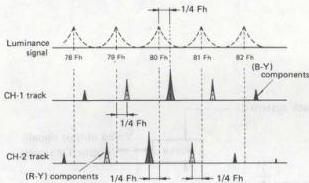

*Fig. 1-1-23 2 FDC playback spectrum*

The 2FDC components for both CH-1 and CH-2 become 1/4 line offset with respect to the luminance signal and thereby visually reduced. The 626.953 value was selected for both reducing noise and in consideration of color bandwidth.

##### 3. Color signal recording bandwidth

Response curves for the highpass and lowpass filters are indicated in Fig. 1-1-24.

Constant current characteristics are possessed by the down-converted color signal recording current.

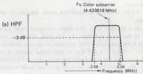

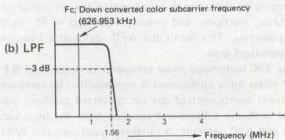

*Fig. 1-1-24 Color signal recording bandwidth*

#### 1.1.9 VHS color signal playback system (PAL)

The color signal playback system performs essentially the opposite function as the recording system. In addition, however, important corrections must be performed for color signal frequency and phase errors introduced by variations in tape speed and head rotation, and elasticity of the tape.

Fig. 1-1-25 indicates a simplified block diagram of this system.

Though a lowpass filter, the down converted color signal goes to the main converter. At this time, the down converted color subcarrier (Fc) contains an error component $(40\mathrm{Fh}^{\prime} + 1 / 8\mathrm{Fh}^{\prime}\pm \Delta \mathrm{f})$ due to mechanical factors of the heads and tape. $\mathsf{Fh}^{\prime}$ varies with the tape speed as $\mathsf{Fh}\pm \Delta \mathsf{Fh}$. $\Delta f$ is the instantaneous error caused by head rotation irregularities and tape elongation and contraction.

The 40 Fh' frequency deviation component is compensated by supplying the video output signal to the horizontal sync separator, multiplier and phase shifter, and 40 Fh' to the sub converter. This forms the AFC (automatic frequency compensator) loop.

In the APC (automatic phase compensator) loop, the $1/8\mathrm{F}^{\prime}\mathrm{h} \pm \Delta \mathrm{f}$ phase error component is compensated by comparing the burst component of the up converted playback color signal with the subcarrier frequency from the local oscillator and APC detector. A variable crystal oscillator (VXO) produces $(\mathrm{Fs} + 1/8\mathrm{Fh}^{\prime} \pm \Delta \mathrm{f})$ which goes to the sub converter. As a result, $(\mathrm{Fs} + 40\mathrm{Fh}^{\prime} + 1/8\mathrm{Fh}^{\prime} + \Delta \mathrm{f})$ is supplied as the main converter carrier input from the sub converter through a highpass filter.

By frequency conversion with Fc, the color subcarrier frequency of 4.433619 MHz, which is free from frequency and phase deviations, becomes obtained through a bandpass filter. In the opposite manner as with recording, the phase shifter advances the CH-2 track phase $90^{\circ}$ every line and 40 Fh' is supplied to the sub converter. The playback color signal through the main converter and bandpass filter is applied to a 2H delay line for removing crosstalk. Characteristics of the lowpass and bandpass filters are the same as those for recording (Fig. 1-1-24).

At the mixer, the playback color and luminance signals are mixed to become the video output signal.

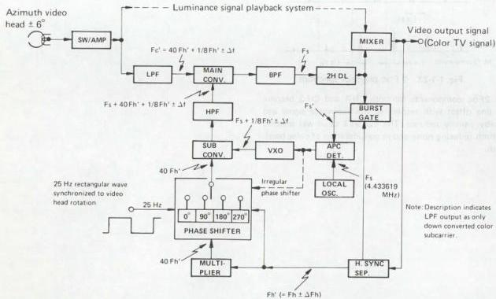

*Fig. 1-1-25 Color signal playback system*
#### 1.1.10 VHS color signal recording system (SECAM)

##### 1. SECAM color television signal

The SECAM color signal consists mainly of the following three component signals.

1) Synchronization ("sync")
2) Luminance ("Y")
3) Chrominance ("chroma")

Of these, the sync and luminance signals are processed in the same manner as for the PAL and NTSC systems. The principal differing point is that the chroma signal is frequency modulated and superimposed on the luminance signal.

The SECAM color signal is frequency modulated in order to avoid color hue fluctuations due to phase distortion in the transmitting system. Alternating lines are used for the modulated R-Y and B-Y signals. Two subcarrier frequencies are employed: 282 Fh = 4.40625 MHz (Fh = 15.625 kHz) for the R-Y component and 272 Fh = 4.25000 MHz for the B-Y component, which reduce the visible appearance Fo dot interference between the scanning lines.

To provide compatibility with B/W television, the signal goes through an anti-bell filter with a center frequency of 4.286 MHz. This attenuates the unmodulated carrier component, after which the signal is mixed with luminance.

Since pre-emphasis is applied prior to modulation, the frequency deviation range of the color FM carrier becomes 850 kHz between 3.9 MHz and 4.75 MHz. When the sidebands are included, the resulting range exceeds 2 MHz.

This model utilizes the VHS Hi-Fi format and records the SECAM color signal in the following manner.

1) The sync and luminance signals are frequency modulated (3.8 to 4.8 MHz) and recorded on the tape by rotating heads.
2) The 4 MHz color FM signal is counted down to approximately 1 MHz and recorded on the tape together with the luminance signal.
3) The longitudinal audio signal is recorded along the upper edge of the tape in the same manner as a conventional audio tape recorder.
4) In the VHS Hi-Fi system, audio signals are also frequency modulated and recorded helically by special rotary audio heads.

##### 2. 1/4 frequency countdown recording

###### 1) Color FM carrier bandwidth

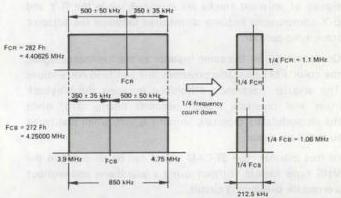

*Fig. 1-1-27 Color FM carrier bandwidth*

(a) Color FM carrier bandwidth
(b) 1/4 frequency counted down color FM carrier bandwidth

Fig. 1-1-27 (a) indicates the FM carrier bandwidth of the color signal, while (b) shows the counted down bandwidth. By counting down the frequency 1/4th, the recording bandwidth becomes 1/4th and azimuth loss difference between high and low frequency components can be reduced.

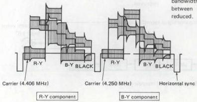

*Fig. 1-1-26 SECAM signal waveform*
###### 2) Color signal horizontal correlation

The color FM signal pattern based on the horizontal correlation of section 1.1.3 - 3 is shown in Fig. 1-1-28.

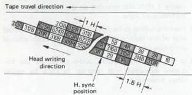

*Fig. 1-1-28 Recording color signal pattern*

As indicated, the pattern is distributed with a 1.5 H difference between adjacent tracks. The horizontal sync signals of adjacent tracks are arranged, while the R-Y and B-Y components become distributed between the adjacent track sync periods.

Consequently, in the same manner as the luminance signal, the color FM signal also possesses line and field correlations. The angular frequency difference between the playback main and crosstalk signals becomes nearly zero, while the demodulated crosstalk amount is very small compared to the main signal.

In this manner, the SECAM signal can be recorded in the VHS type format without using a guardband and without a crosstalk preventing circuit.

###### 3) Modulation index

The color signal FM carrier covers the 850 kHz frequency range from 3.9 to 4.75 MHz, and when the FM waveform sidebands are included, the occupied range becomes more than 2 MHz. Since the sidebands remain unchanged even after 1/4th frequency countdown, they continue to cover the 2 MHz range centered on 1/4 FCR and 1/4 FCB.

However, after frequency countdown, the modulation index becomes 1/4th. Therefore, the sideband level is reduced about 10 dB with respect to the carrier component, which increases the margin for avoiding color reversal effects.

With a 1/4th modulation index, the required bandwidth for the color signal can be reduced to about 1/4th, thereby reducing the recording bandwidth by several hundred kHz. As a result, both sidebands of the color FM signal are recorded, reducing the likelihood of color reversal.

##### 3. Recording block diagram

As simplified block diagram of the 1/4 frequency countdown direct recording system is shown in Fig. 1-1-29.

Bandpass filter BPF-1 separates the color component from the input video signal. The bell block functions to return the signal from the anti-bell characteristic used during transmission to a flat waveform which is easily counted down. The signal then goes through a limiter to the 1/4 frequency countdown circuit.

This circuit converts the color FM carrier form the 3.9 to 4.75 MHz range to the 0.98 to 1.19 MHz range. The next stage BPF-2 then limits the upper range of the frequency prior to mixing with the FM luminance signal.

In consideration of S/N and color reversal, the lower sideband is limited, after which the signal goes to the lowband anti-bell block. This circuit imparts an anti-bell characteristic to the counted down FM Carrier. The unmodulated carrier component is attenuated and S/N improved.

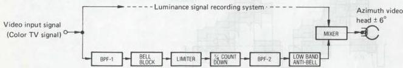

*Fig. 1-1-29 Color signal recording system*
##### 1. Recording bandwidth

Fig. 1-1-30 illustrates the response curves of BPF-1 and BPF-2.

A constant current characteristic is used for recording the counted-down color signal.

The generalized characteristics of the bell and lowband anti-bell blocks for recording are shown in Fig. 1-1-31.

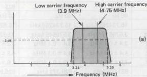

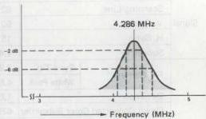

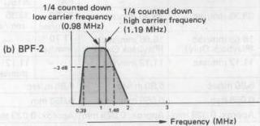

*Fig. 1-1-30 Color signal recording bandwidth*

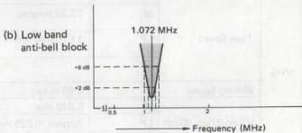

*Fig. 1-1-31 Recording bell block characteristics*

#### 1.1.11 VHS color signal playback system (SECAM)

The simplified block diagram is shown in Fig. 1-1-32.

The lowband color FM signal is obtained by applying the playback signal to a lowpass filter. After shaping by the lowband bell block, the 4 times countup circuit returns the wide bandwidth of the color FM signal.

A bandpass filter yields the specified color signal bandwidth, after which the anti-bell block attenuates the unmodulated carrier component. The signal is then mixed with luminance to produce the video output signal.

Characteristic of the bandpass filter is the same as that of BPF1 indicated in Fig. 1-1-30, while the bell block characteristic is opposite to that shown in Fig. 1-1-31.

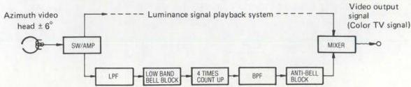

*Fig. 1-1-32 Color signal playback system*

#### 1.1.12 M-PAL/N-PAL format outline

##### 1. Specifications

|   |   |   | PAL | M-PAL | NTSC | N-PAL  |   |
| --- | --- | --- | --- | --- | --- | --- | --- |
|  Signal | Color System |   | PAL | PAL | NTSC | PAL  |   |
|   |  Scanning Line |   | 625 | 525 | 525 | 625  |   |
|   |  V. Sync |   | 50 Hz | 60 Hz | 60 Hz | 50 Hz  |   |
|   |  H. Sync |   | 15.625 kHz | 15.734266 kHz | 15.734266 kHz | 15.625 kHz  |   |
|   |  Subcarrier |   | 4.433619 MHz | 3.575611 MHz | 3.579545 MHz | 3.582056 MHz  |   |
|  VHS | FM Carrier | Sync Tip | 3.8 ± 0.1 MHz | 3.4 ± 0.1 MHz | 3.4 ± 0.1 MHz | 3.8 ± 0.1 MHz  |   |
|   |   |  White Peak | 4.8 ± 0.1 MHz | 4.4 ± 0.1 MHz | 4.4 ± 0.1 MHz | 4.8 ± 0.1 MHz  |   |
|   |  Deviation |   | 1.0 ± 0.1 MHz | 1.0 ± 0.1 MHz | 1.0 ± 0.1 MHz | 1.0 ± 0.1 MHz  |   |
|   |  Down Converted Color Subcarrier |   | 625.953 kHz | 631.337 kHz | 629.371 kHz | 626.953 kHz  |   |
|   |  Tape Speed | Format | - | - | - | PAL | NTSC  |
|   |   |  SP | 23.39 mm/sec | 33.35 mm/sec | 33.35 mm/sec | 23.39 mm/sec | 33.35 mm/sec  |
|   |   |  LP | 11.70 mm/sec | 16.68 mm/sec (Playback Only) | 16.68 mm/sec (Playback Only) | 11.70 mm/sec | -  |
|   |   |  EP | - | 11.12 mm/sec | 11.12 mm/sec | - | 11.12 mm/sec  |
|   |  Writing Speed |   | 4.85 m/sec | 5.80 m/sec | 5.80 m/sec | 4.85 m/sec  |   |
|   |  Video Track Width | SP | 0.049 mm | 0.058 mm | 0.058 mm | 0.058 mm  |   |
|   |   |  LP | Approx. 0.025 mm | Approx. 0.029 mm | Approx. 0.029 mm | Approx. 0.029 mm  |   |
|   |   |  EP | - | Approx. 0.019 mm | Approx. 0.019 mm | Approx. 0.019 mm  |   |
|   |  Video Track Angle (Running) |   | 5° 57' 50.3" | 5° 58' 9.9" | 5° 58' 9.9" | 5° 57' 50.3"  |   |
|  RF | TV Broadcasting System |   | B, (I) | M | M | N  |   |
|   |  Scanning Lines |   | 625 | 525 | 525 | 625  |   |
|   |  V. Sync |   | 50 Hz | 60 Hz | 60 Hz | 50 Hz  |   |
|   |  H. Sync |   | 15.625 kHz | 15.734266 kHz | 15.734266 kHz | 15.625 kHz  |   |
|   |  Subcarrier |   | 4.433619 MHz | 3.575611 MHz | 3.579545 MHz | 3.582056 MHz  |   |
|   |  Video Bandwidth |   | 5 MHz (5.5 MHz) | 4.2 MHz | 4.2 MHz | 4.2 MHz  |   |
|   |  Video Modulation System |   | AM | AM | AM | AM  |   |
|   |  Video Modulation Polarity |   | Negative | Negative | Negative | Negative  |   |
|   |  Channel Bandwidth |   | 7 MHz (8 MHz) | 6 MHz | 6 MHz | 6 MHz  |   |
|   |  fs - fp |   | 5.5 MHz (6.0 MHz) | 4.5 MHz | 4.5 MHz | 4.5 MHz  |   |
|   |  Video Modulation System |   | FM | FM | FM | FM  |   |

Table 1-1-2 Specifications
#### 1.1.13 Luminance signal recording system (M-PAL)

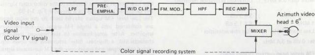

*Fig. 1-1-33 Luminance signal recording system*

Frequency modulation (FM) is used for the luminance signal recording system. A simplified block diagram of the system is shown in Fig. 1-1-33.

A lowpass filter (LPF) removes the color component and passes only the luminance component of the input color TV signal. At the next stage, the pre-emphasis circuit, the high frequency portion of the luminance signal is enhanced in order to improve the S/N ratio during FM recording. Since excess pre-emphasis could lead to black/white reversal due to the shortened recording wavelength, a white/dark clip circuit cuts the overshoot and under-shoot components which exceed certain positive and negative levels.

The frequency modulator (FM MOD) converts the AM luminance signal to FM, which goes through a highpass filter (HPF) to the recording amplifier. These circuits amplify the signal with the proper frequency characteristic, after which it is mixed with the down converted color signal and supplied to the video heads.

##### 1. Luminance signal recording frequency characteristic

As shown in Fig. 1-1-34, when the video input is a color TV signal, a lowpass filter removes the color component.

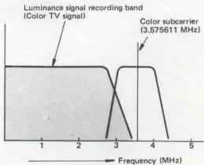

*Fig. 1-1-34 Luminance signal recording band*

This leaves the luminance signal, with a bandwidth from about $30\mathrm{Hz}$ to $3.0\mathrm{MHz}$. With some VHS models, when the input is a black and white TV signal, it by-passes the LPF; allowing a wider bandwidth (to beyond $4.5\mathrm{MHz}$).

##### 2. FM signal recording frequency

As indicated in Fig. 1-1-35, when the video input is a color TV signal, it goes through an HPF, clearing an area for the down-converted color signal. With some VHS models, when the input is a B/W TV signal, the HPF can be bypassed to extend the bandwidth to the DC area.

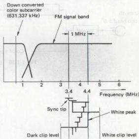

*Fig. 1-1-35 Recording spectrum*

##### 3. FM signal recording amp. current (REC amp)

Current:

|  More than 3.4 MHz | : | Optimum saturation recording current  |
| --- | --- | --- |
|  2 MHz | : | 3 ± 1 dB  |
|  1 MHz | : | 6 ± 1.5 dB  |
|  Less than 1 MHz | : | Flat characteristics  |

Note: 0 dB at 3.4 MHz

##### 4. FM signal head current (Video head)

Specified to be within $\pm 1.5$ dB of 4 MHz optimum recording current.

#### 1.1.14 Luminance signal playback system (M-PAL)

This system functions to return the signals recorded on the tape to a form as close as possible to the video input signals. The simplified block diagram is shown in Fig. 1-1-36.

The low level FM signals played back by the video heads are combined into a single FM signal by the switching amplifier. After amplification to the required frequency characteristic, a highpass filter attenuates the down converted color signal and passes only the FM luminance signal. This HPF has the same response as that of the recording system.

Variations in the playback FM signal level due to mechanical stretching and contraction of the tape, and irregularities in tape to head contact, are corrected by the limiter circuit. The signal is amplified more than 80 dB to permit precise demodulation. A double limiter circuit is employed in order to prevent black/white reversal effects.

In the following stages, the demodulator and lowpass filter return the luminance signal to its AM form. The de-emphasis circuit reverses the emphasis applied during recording. From this point, the signal goes to the mixer where it is mixed with the playback color signal to become the video output signal.

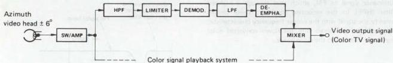

*Fig. 1-1-36 Luminance signal playback system*
#### 1.1.15 Color signal recording system (M-PAL)

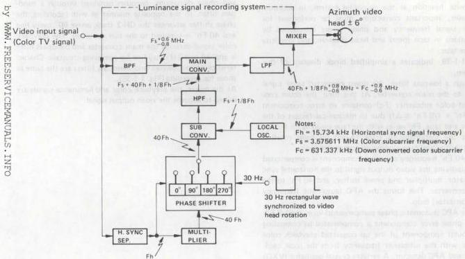

*Fig. 1-1-37 Color signal recording system*

This is a direct recording system using a down converted phase shifted color signal. The phase shift system removes color crosstalk which cannot be completely eliminated by the azimuth video heads. Fig. 1-1-37 illustrates a simplified block diagram of this system.

A bandpass filter (BPF) extracts the color component from the input video signal and supplies it to the main converter. At the same time, the input signal also goes to the horizontal sync separator, which supplies the 15.734 kHz (Fh) to the multiplier and phase shift circuits. Via the phase shifter, the 40 Fh CH-1 track component is supplied directly to the sub converter, but the CH-2 component is delayed in phase 90° every line (1 H). A 30 Hz rectangular wave synchronized to the video head rotation is used for differentiating between the CH-1 and CH-2 components. Each line is also controlled by the Fh input.

The local oscillator produces the color subcarrier frequency 3.575611 MHz (Fs) + 1/8 Fh single frequency which goes to the sub converter. At the sub converter, the 40 Fh and (Fs + 1/8 Fh) are frequency converted to become (Fs + 40 Fh + 1/8 Fh). This is supplied through a highpass filter to the main converter. Also supplied to the main converter are the color signal Fs +0.6 MHz and carrier wave (Fs + 40 Fh +1/8 Fh). These are down converted to become (40 Fh + 1/8 Fh +0.6 MHz) which through a lowpass filter goes to the mixer for mixing with the FM luminance signal. The result is applied to the video heads.

In other words, the 3.575611 MHz (Fc) color subcarrier is converted to a low band of 631.337 kHz (40 Fh + 1/8 Fh). The down converted color signal is then recorded directly using the FM luminance signal as AC bias.

##### 1. Color signal recording bandwidth

Response curves for the highpass and lowpass filters are indicated in Fig. 1-1-38.

Constant current characteristics are possessed by the down-converted color signal recording current.


*Fig. 1-1-38 Color signal recording bandwidth*

#### 1.1.16 Color signal playback system (M-PAL)

The color signal playback system performs essentially the opposite function as the recording system. In addition, however, important corrections must be performed for color signal frequency and phase errors introduced by variations in tape speed and head rotation, and elasticity of the tape.

Fig. 1-1-39 indicates a simplified block diagram of this system.

Though a lowpass filter, the down converted color signal goes to the main converter. At this time, the down converted color subcarrier (Fc) contains an error component $(40\mathrm{Fh}^{\prime} + 1 / 8\mathrm{Fh}^{\prime}\pm \Delta \mathrm{f})$ due to mechanical factors of the heads and tape. $\mathsf{Fh}^{\prime}$ varies with the tape speed as $\mathsf{Fh}\pm \Delta \mathsf{Fh}$. $\Delta f$ is the instantaneous error caused by head rotation irregularities and tape elongation and contraction.

The 40 Fh' frequency deviation component is compensated by supplying the video output signal to the horizontal sync separator, multiplier and phase shifter, and 40 Fh' to the sub converter. This forms the AFC (automatic frequency compensator) loop.

In the APC (automatic phase compensator) loop, the $1/8\mathrm{Fh}^{\prime}\pm \Delta \mathrm{f}$ phase error component is compensated by comparing the burst component of the up converted playback color signal with the subcarrier frequency from the local oscillator and APC detector. A variable crystal oscillator (VXO) produces $(\mathrm{Fs} + 1/8\mathrm{Fh}^{\prime}\pm \Delta \mathrm{f})$ which goes to the sub converter. As a result, $(\mathrm{Fs} + 40\mathrm{Fh}^{\prime} + 1/8\mathrm{Fh}^{\prime} + \Delta \mathrm{f})$ is supplied as the main converter carrier input from the sub converter through a highpass filter.

By frequency conversion with Fc, the color subcarrier frequency of 3.575611 MHz, which is free from frequency and phase deviations, becomes obtained through a bandpass filter. In the opposite manner as with recording, the phase shifter advances the CH-2 track phase $90^{\circ}$ every line and 40 Fh' is supplied to the sub converter. The playback color signal through the main converter and bandpass filter is applied to a 2H delay line for removing crosstalk. Characteristics of the lowpass and bandpass filters are the same as those for recording (Fig. 1-1-38).

At the mixer, the playback color and luminance signals are mixed to become the video output signal.


*Fig. 1-1-39 Color signal playback system*
#### 1.1.17 Luminance signal recording system (N-PAL)


*Fig. 1-1-40 Luminance signal recording system*

Frequency modulation (FM) is used for the luminance signal recording system. A simplified block diagram of the system is shown in Fig. 1-1-40.

A lowpass filter (LPF) removes the color component and passes only the luminance component of the input color TV signal. At the next stage, the pre-emphasis circuit, the high frequency portion of the luminance signal is enhanced in order to improve the S/N ratio during FM recording. Since excess pre-emphasis could lead to black/white reversal due to the shortened recording wavelength, a white/dark clip circuit cuts the overshoot and undershoot components which exceed certain positive and negative levels.

The frequency modulator (FM MOD) converts the AM luminance signal to FM, which goes through a highpass filter (HPF) to the recording amplifier. These circuits amplify the signal with the proper frequency characteristic, after which it is mixed with the down-converted color signal and supplied to the video heads.

##### 1. Luminance signal recording frequency characteristic

As shown in Fig. 1-1-41, when the video input is a color TV signal, a lowpass filter removes the color component. This leaves the luminance signal, with a bandwidth from about 30 Hz to 3.0 MHz. With some VHS models, when the input is a black and white TV signal, it by-passes the LPF; allowing a wider bandwidth (to beyond 4.5 MHz).


*Fig. 1-1-41 Luminance signal recording band*

##### 2. White and Dark clip level

White clip level and dark clip level are as shown in Fig. 1-1-42.

Note: The level from sync tip to white peak is 100%.

##### 3. FM carrier frequency and deviation

(See Fig. 1-1-42.)

Sync tip : 3.4 ± 0.1 MHz
White peak : 4.4 ± 0.1 MHz
Deviation : 1.0 ± 0.1 MHz

##### 4. FM signal recording frequency

As indicated in Fig. 1-1-42, when the video input is a color TV signal, it goes through an HPF, clearing an area for the down converted color signal. With some VHS models, when the input is a B/W TV signal, the HPF can be bypassed to extend the bandwidth to the DC area.


*Fig. 1-1-42 Recording spectrum*
#### 1.1.18 Color signal recording bandwidth (N-PAL)

Response curves for the bandpass and lowpass filters are indicated in Fig. 1-1-43.

Constant current characteristics are possessed by the down-converted color signal recording current.


*Fig. 1-1-43 Color signal recording bandwidth*

#### 1.1.19 S-VHS luminance signal recording system

Frequency modulation (FM) is used for the luminance signal recording system. A simplified block diagram of the system is shown in Fig. 1-1-44.

A Y/C separator removes the color component and passes only the luminance component of the input color TV signal. At the next stage, the sub pre-emphasis and the main pre-emphasis circuits, the high frequency portion of the luminance signal is enhanced in order to improve S/N during FM recording. Since excess pre-emphasis could lead to black/white reversal due to the shortened recording wavelength, a white/dark clip circuit cuts the overshoot and undershoot components which exceed certain positive and negative levels.

The frequency modulator (FM MOD) converts the AM luminance signal to FM, which goes to the recording amplifier. These circuits amplify the signal with the proper frequency characteristic, after which it is mixed with the down-converted color signal and supplied to the video heads.


*Fig. 1-1-44 Luminance signal recording system*
##### 1. Luminance signal recording frequency characteristics

As shown in Fig. 1-1-45, when signal input is a video signal, a Y/C separator removes the color component and the luminance signal, with a bandwidth of from about 30 Hz to 5.0 MHz, is used.


*Fig. 1-1-45(A) Luminance signal recording band (NTSC)*


*Fig. 1-1-45(B) Luminance signal recording band (PAL/SECAM)*

##### 2. White and dark clip level

White clip level and dark clip level are as shown in Fig. 1-1-46.

Note: The level from sync tip to white peak is 100%.

##### 3. FM carrier frequency and deviation (See Fig. 1-1-46.)

Sync tip : 5.4 ± 0.1 MHz
White peak : 7.0 ± 0.1 MHz
Deviation : 1.6 ± 0.1 MHz

##### 4. FM signal recording frequency

Fig. 1-1-46 shows recording spectrum when signal input is a video signal.


*Fig. 1-1-46 Recording spectrum*

##### 5. FM signal recording amp. characteristic (REC amp)

Current:
More than 5.4 MHz : Corresponds to the reference RF recording current
3 MHz : 0.5 ± 0.5 dB (0 dB at 5.4 MHz)
1 MHz : 3 ± 1 dB

##### 6. FM signal head current (video head)

It shall be ±1.5 dB of the reference RF recording current.

#### 1.1.20 S-VHS luminance signal playback system

This system functions to return the signals recorded on the tape to a form as close as possible to the video input signals. The simplified block diagram is shown in Fig. 1-1-47.

The low level FM signals played back by the two video heads are combined into a single FM signal by the switching amplifier. After amplification to the required frequency characteristic, an equalizer attenuates the down converted color signal and passes only the FM luminance signal. Variations in the playback FM signal level due to mechanical stretching and contraction of the tape, and irregularities in tape to head contact, are corrected by the limiter circuit.

The signal is amplified more than 80 dB to permit precise demodulation. A double limiter circuit is employed in order to prevent black/white reversal effects.

In the following stages, the demodulator and lowpass filter return the luminance signal to its AM form. The de-emphasis circuit reverses the emphasis applied during recording. From this point, the signal goes to the mixer where it is mixed with the playback color signal to become the video output signal.


*Fig. 1-1-47 Luminance signal playback system*

#### 1.1.21 Control signal recording system

Control signal waveform, polarity and video head relationships are indicated in Fig. 1-1-48.

Phase of the control signal is the same as the vertical sync signal rise component of the CH-1 track. The positive pulse voltage is the reference 30 Hz (NTSC) or 25 Hz (PAL/SECAM). The control signal is recorded on the control track above the saturation recording level.


*Fig. 1-1-48(A) Control signal (NTSC)*


*Fig. 1-1-48(B) Control signal (PAL/SECAM)*
#### 1.1.22 Audio signal recording system

##### 1. Audio signal recording level

Audio signals are recorded on the longitudinal audio tracks to the defined level, using an AC bias current recording system.

##### 2. Audio signal recording current characteristics

The equalizing amplifier controls the recording current in order to obtain a flat frequency characteristic in the reproduced output. See Fig. 1-1-49.


*Fig. 1-1-49 Audio equalizing frequency characteristics*

#### 1.1.23 CTL coding system ("INDEX" system)

##### 1. Outline

A newly developed "Index" system functions to locate the start of a desired program ("Index"). This operation relays a new CTL coding system which is described in this guide.

##### 2. CTL coding system

As illustrated in Fig. 1-1-50, the 30 Hz (NTSC) or 25 Hz (PAL/SECAM) control (CTL) signal is produced in synchronization with the falling edge of the input V. sync. In the previous VHS standards, the CTL signal duty cycle (T1) was specified for greater than 16.67 ms (NTSC) or 19.82 ms (PAL/SECAM) (greater than 50%). Therefore, difference in the duty cycle occurred according to model and maker.


*Fig. 1-1-50*

The VHS standards have been revised to include stricter specification for the CTL signal, thereby allowing the inclusion of random access functions based upon coding of the duty cycle. These form the basis for the control coding system.

##### 3. Control signal recording

The control signal is encoded and recorded in the forms illustrated in Fig. 1-1-51. Data are encoded by varying the duty cycle as shown.


*Fig. 1-1-51 Data are encoded by varying in the duty cycle*

For VHS models without the random access functions as well, the duty cycle has been specified as $60 \pm 5\%$.

##### 4. Overwrite function

When data are overwritten by using the same VHS machine, confirm that the residual signal level is less than $-20$ dB with respect to the newly recorded control signal. This is important in order to ensure proper waveform shaping.


*Fig. 1-1-52*

##### 5. Index code principle

###### 1) Index code

The index code serves the same purpose as the 'cue' signal provided in some previous models. It allows locating the start of recorded programs on the tape.

However, the cue signal was recorded over the entire width of the tape, while the index signal is produced by changing the duty cycle of the control signal. Also, the cue signal was only inserted automatically at the start of recording.

When recording is initiated from Timer or Stop settings, the index code is automatically inserted.

Index code search is performed in the Fast Forward (FF), Rewind (REW), Search Fast Forward (S-FF) and Search Rewind (S-REW) modes.
2) Index code composition

Fig. 1-1-53 illustrates the composition of the index code. The code is comprised in $61 \pm 3$ bits of data "1" with a data "0" bit at each end.


*Fig. 1-1-53 Composition of the index code*

##### 6. Index code marking

1) Automatic index code marking
When recording begins from the Timer Recording or Stop position, the index code is automatically inserted.

### NOTES:

* Codes cannot be marked on unrecorded portions of the tape or if the erase protector tab of the cassette has been removed.
* When adding the codes to previously recorded tapes, note carefully that the Recording mode will erase the previous sound and picture.
* Avoid pressing other buttons while the LEDs of the random access function buttons are lighted or flashing.
* Picture disturbance may occur if index code is marked, erased at or near the transition between standard (SP) and extended (EP) (NTSC) / long (LP) (PAL/SECAM) tape speed modes.
* In some cases, it may not be possible to cue the first recording of the tape by the index code or erase the index code at this location.
#### 1.1.24 VHS Hi-Fi system

##### 1. Hi-Fi recording system

As can be noted from the VHS recording spectrum (Fig. 1-1-54), there is a relatively vacant slot between the color and luminance signal components.

Therefore, it was decided to modulate the stereo audio channels by frequency and to insert them into the spectrum at the 1.3 MHz (NTSC) / 1.4 MHz (PAL/SECAM) and 1.7 MHz (NTSC) / 1.8 MHz (PAL/SECAM) positions.

##### 2. VHS Hi-Fi audio specifications

Recording system: The 2-channel audio signal is converted into two FM signal frequencies. These are recorded by special rotary heads. Afterwards, the video heads recorded the video signal overlapped. In the case of a monaural audio signal, the same signal is recorded on both audio channels.

Center carrier frequency
CH-1 : 1.3 MHz } NTSC
CH-2 : 1.7 MHz } PAL/SECAM
CH-1 (Main) : 1.4 MHz
CH-2 (Sub) : 1.8 MHz

Maximum frequency deviation : ±150 kHz
Operating frequency deviation : ±50 kHz
Pre-emphasis time constant : 50 µsec
Audio head azimuth angle : ±30°
Noise reduction system *
Compression ratio : 2 : 1 logarithmic
Detection system : Peak detection
Frequency response : 20 Hz to 20,000 Hz
Dynamic range : More than 80 dB
Wow and flutter : Less than 0.005% WRMS
Channel separation : More than 60 dB


*Fig. 1-1-54 VHS Hi-Fi recording spectrum*
#### 1.1.25 Cassette : NTSC

##### 1. Video tape

Length : The relationship between tape length and time for recording and playback can be defined by the formula:

$$
L = [2.2t + 2]_{-0}^{+3}
$$

Where, L : tape length (m)
t : recording or playback time (minutes)

Note: L shall be an integer obtained after all decimals produced in calculation are raised. (See "Reference Table".)

Width : $12.65 \pm 0.01 \text{ mm}$

Fluctuation: less than $6 \mu \text{m}$

Thickness : $19_{-2}^{+1} \mu \text{m}$

Coercivity : 600 oersted class (nominal)

Optimum recording current shall not differ from the standard tape.

[Reference Table]

|  Kinds of blank cassettes  |   |   |   |
| --- | --- | --- | --- |
|  Kind of cassette | Recording or playback time in SP mode | Length of video tape  |   |
|  T-120 | 120 min. | 246+3
0 m | 870 ft  |
|  T-90 | 90 min. | 185+3
0 m | 607 ft  |
|  T-80 | 80 min. | 165+3
0 m | 541 ft  |
|  T-60 | 60 min. | 125+3
0 m | 410 ft  |
|  T-40 | 40 min. | 84+3
0 m | 276 ft  |
|  T-30 | 30 min. | 64+3
0 m | 210 ft  |
|  T-20 | 20 min. | 44+3
0 m | 144 ft  |

##### 2. Leader tape and Trailer tape

Length : In case time for recording or playback is:
over 60 minutes : $170 \pm 20 \text{ mm}$
just or under
60 minutes : $150 \pm 20 \text{ mm}$

Width : $12.65 \pm 0.03 \text{ mm}$

Thickness : $40_{-25}^{+5} \mu \text{m}$

Material : Polyester film

Transparency : more than $50\%$

Length of splicing: $12 \sim 19 \text{ mm}$

Gap of splicing : $0 \sim 70 \mu \text{m}$

Splicing force : more than $3 \text{ kg}$

##### 3. Reel

Outside diameter : $89 \pm 0.2 \text{ mm}$

Hub diameter : In case time for recording or playback is:
over 60 minutes : $26 \pm 0.15 \text{ mm}$
just or under
60 minutes : $62 \pm 0.2 \text{ mm}$
(If just or under 30 minutes, it can be $70 \pm 0.2 \text{ mm}$.)

E-value : more than $1.5 \text{ mm}$

#### 1.1.26 Cassette : PAL/SECAM

##### 1. Video tape

Length : The relationship between tape length and time for recording and playback can be defined by the formula:

$$
L = [1.42t + 2]_{-0}^{+3}
$$

where, L : tape length (m)
t : recording or playback time (minutes)

Note: L shall be an integer obtained after all decimals produced in calculation are raised. (See "Reference Table".)

Width : $12.65 \pm 0.01 \text{ mm}$

Fluctuation : less than $6 \mu \text{m}$

Thickness : $19_{-2}^{+1} \mu \text{m}$ (Except E-240 tape).

Coercivity : 600 oersted class (nominal)

Optimum recording current shall not differ from the standard tape.

[Reference Table]

|  Kinds of blank cassettes  |   |   |
| --- | --- | --- |
|  Kind of cassette | Recording or playback time | Length of video tape  |
|  E-240 | 240 min. | 344+2
0 m  |
|  E-180 | 180 min. | 258+3
0 m  |
|  E-150 | 150 min. | 215+3
0 m  |
|  E-120 | 120 min. | 173+3
0 m  |
|  E-90 | 90 min. | 130+3
0 m  |
|  E-60 | 60 min. | 88+3
0 m  |
|  E-30 | 30 min. | 45+3
0 m  |

##### 2. Leader tape and Trailer tape

Length : In case time for recording or playback is:
over 90 minutes : $170 \pm 20 \text{ mm}$
just or under
90 minutes : $150 \pm 20 \text{ mm}$

Width : $12.65 \pm 0.03 \text{ mm}$

Thickness : $40_{-25}^{+5} \mu \text{m}$

Material : Polyester film

Transparency : more than $50\%$

Length of splicing: $12 \sim 19 \text{ mm}$

Gap of splicing : $0 \sim 70 \mu \text{m}$

Splicing force : more than $3 \text{ kg}$

##### 3. Reel

Outside diameter : $89 \pm 0.2 \text{ mm}$

Hub diameter : In case time for recording or playback is:
over 90 minutes : $26 \pm 0.15 \text{ mm}$
just or under
90 minutes : $62 \pm 0.2 \text{ mm}$
(If just or under 30 minutes, it can be $70 \pm 0.2 \text{ mm}$.)

E-value : more than $1.5 \text{ mm}$
#### 1.1.27 VHS cassette (simplified illustrations)


*Fig. 1-1-55 Tape winding and tape path*


*Fig. 1-1-56 Cassette appearance*

#### 1.1.28 S-VHS cassette

- VHS size with identification hole
- S-VHS tape is manufactured to newly established ratings and is important for deriving the S-VHS picture quality features.
- A special identification hole is provided in the S-VHS cassette for automatic detection by S-VHS type video cassette recorders.
- S-VHS cassettes can also be recorded in the standard VHS mode and played on ordinary VHS video cassette recorders.

##### 1. Video tape

Specially formulated 1/2-inch wide magnetic tape that conforms to S-VHS performance ratings.

Length : The relationship between tape length and time for recording and playback can be defined by the formula:

$$
L = [2.2t + 2]_{-0}^{+3} : NTSC
$$

$$
L = [1.42t + 2]_{-0}^{+3} : PAL/SECAM
$$

where, L : tape length (m)
t : recording or playback time (minutes)

Note: L shall be an integer obtained after all decimals produced in calculation are raised. (See "Reference Table".)

Width : $12.65 \pm 0.01 \mathrm{~mm}$

Fluctuation : less than $6\mu \mathrm{m}$

Thickness : $19_{-2}^{+1}\mu \mathrm{m}$

Coercivity : 600 oersted class (nominal)
Optimum recording current shall not differ from the standard tape.

[Reference Table] : NTSC

## Kinds of blank cassettes

|  Kind of cassette | Recording or playback time in SP mode | Length of video tape  |   |
| --- | --- | --- | --- |
|  ST-120 | 120 min. | 246^{+3}_{0} m | 870 ft  |
|  ST-60 | 60 min. | 125^{+3}_{0} m | 410 ft  |
|  ST-30 | 30 min. | 64^{+3}_{0} m | 210 ft  |
[Reference Table] : PAL/SECAM
Kinds of blank cassettes

|  Kind of cassette | Recording or playback time | Length of video tape  |
| --- | --- | --- |
|  SE-180 | 180 min. | 258+3
0 m  |
|  SE-150 | 150 min. | 215+3
0 m  |
|  SE-120 | 120 min. | 173+3
0 m  |
|  SE-90 | 90 min. | 130+3
0 m  |
|  SE-60 | 60 min. | 88+3
0 m  |
|  SE-30 | 30 min. | 45+3
0 m  |

##### 2. Simplified illustrations


*Fig. 1-1-57 Tape winding and tape path*


*Fig. 1-1-58 Cassette appearance*

### 1.2 S-VHS NEW TECHNOLOGY

#### 1.2.1 General description

S-VHS was developed on the basis of the world-recognized VHS Format in order to accommodate higher picture quality broadcasts. The system is capable of recording and playback with signal quality exceeding present day TV transmission. It can thus meet the requirements of anticipated future high quality broadcasts.

The recording and playback horizontal resolution of the VHS Format is approximately 240 lines NTSC and 250 lines PAL/SECAM. The S-VHS system is capable of more than 400 lines resolution in all systems. The resolution of present broadcast pictures is about 350 lines, which is exceeded by the S-VHS capability.

##### 1. Input connections

The S-VHS input and output connections differ according to the system. A 21-pin connector is used in Europe with switching between Y/C separate and composite signals. The NTSC system simply adds Y/C connections as indicated in Fig. 1-2-1 and Fig. 1-2-2.


*Fig. 1-2-1 (A)*


*Fig. 1-2-1 (B)*

|  Pin No. | Composite | Y/C mode | RGB mode  |
| --- | --- | --- | --- |
|  1 | Audio B out | Audio B out | Audio B out  |
|  2 | — | — | —  |
|  3 | Audio A out | Audio A out | Audio A out  |
|  6 | — | — | —  |
|  7 | — | — | B  |
|  11 | — | — | G  |
|  15 | — | C | R  |
|  16 | Low | Low | High  |
|  19 | CVBS | Y | —  |
|  20 | — | — | —  |
|  Pin No. | Composite | Y/C mode  |
| --- | --- | --- |
|  1 | — | —  |
|  2 | Audio B in | Audio B in  |
|  3 | — | —  |
|  6 | Audio A in | Audio A in  |
|  7 | — | —  |
|  11 | — | —  |
|  15 | — | C  |
|  16 | Low | Low  |
|  19 | — | —  |
|  20 | CVBS | Y  |

*Fig. 1-2-1 21-pin connector*

##### 2. Y/C connections

Fig. 1-2-1 and Fig. 1-2-2 indicate the Y/C connection ratings. Recording and playback through these connections are recommended for deriving maximum benefit from S-VHS performance. The Y/C separate connections can also be used for the VHS mode, where they offer the advantages of separate signal lines.


*Fig. 1-2-2(A)*


|  Pin No. | Label  |
| --- | --- |
|  1 | Y GND  |
|  2 | C GND  |
|  3 | Y out  |
|  4 | C out  |

*Fig. 1-2-2(B)*

S-VIDEO PLUG

|  Pin No. | Label  |
| --- | --- |
|  1 | Y GND  |
|  2 | C GND  |
|  3 | Y out  |
|  4 | C out  |

*Fig. 1-2-2*

*Fig. 1-2-2 4-pin S connector*
#### 1.2.2 S-VHS and VHS differences

##### 1. NTSC system

The main difference between S-VHS and VHS is in shifting the FM carrier to a higher frequency band, as indicated in Fig. 1-2-3. This permits resolution exceeding 400 lines even in the NTSC system. Also, in the NTSC system, the greater margin between the down converted color and luminance signals reduces interference between these signals.


*Fig. 1-2-3 NTSC FM carrier differences*


##### 2. European system

In Europe, a major difference with respect to VHS is that the same S-VHS system is used for both PAL and SECAM. Therefore, S-VHS mode recorded tapes are termed S-VHS Europe regardless of the TV broadcast system.

As indicated in Fig. 1-2-4, the FM carrier is shifted to a high frequency band in the same manner as NTSC. This expands the sideband width and provides superior resolution.


*Fig. 1-2-4 PAL/SECAM FM carrier differences*


Signal processing is the same for PAL and SECAM systems. This is outlined below.

1) PAL signal recording and playback

S-VHS recording of a PAL signal is essentially the same as VHS. Following Y/C separation, the luminance signal is converted to FM and the color signal is down converted for recording on the tape.

2) SECAM signal recording and playback

After Y/C separation, the color signal is detected to yield the R-Y and B-Y color difference signals. These are modulated at 4.43 MHz in the same form as a PAL signal, then sent to the recording converter circuit. The information is therefore recorded on the S-VHS tape without difference between PAL and SECAM.
##### 3. Compatibility

1) NTSC system

Compatibility is not a problem with NTSC as there is basically only one system.

**Note:**

VHS playback of S-VHS tape

In S-VHS the FM carrier is shifted to high band. When an S-VHS tape is played back in VHS, FM carrier loss occurs and overmodulation noise appears as black stripes mainly in bright portions of the picture. In a bright picture, the luminance level is high. When this is frequency modulated, the FM deviation is large and increases the high frequency component. Overmodulation occurs with this high frequency component.

Conversely, the opposite effect occurs with a dark TV picture. When this (S-VHS signal) is played back in the VHS mode, a normal picture may be obtained without overmodulation.

2) European systems

Compatibility is somewhat complex among European models and should be noted carefully in service and in responding to customer inquiries.

(1) S-VHS for PAL market

PAL S-VHS is intended for use with PAL monitor. It cannot record a SECAM signal. However, it can play back a prerecorded S-VHS tape, whether PAL or SECAM.

(2) S-VHS for SECAM market

SECAM S-VHS models can record and play back both SECAM and PAL sigals. Playback is selectable for SECAM or PAL modes.

##### 4. SECAM S-VHS recording and format

The same format is used for recording PAL and SECAM signals in the S-VHS Europe specifications. Therefore for models sold in SECAM areas (e.g., France) the recording format differs according to the S-VHS input signal and recording mode (S-VHS or VHS).

**Recording**

|  Input signal | REC mode | Output signal (EE mode) | REC color signal system  |
| --- | --- | --- | --- |
|  SECAM | S-VHS SP/LP | SECAM | S-VHS  |
|   |  VHS SP | SECAM | SECAM  |
|  PAL | S-VHS SP/LP | PAL | S-VHS  |
|   |  VHS SP/LP | PAL | PAL  |

**Playback**

|  REC signal & REC mode
by Color TV system |   | Output signal → Color TV
system  |
| --- | --- | --- |
|  S-VHS |   | PAL/SECAM  |
|  VHS SECAM | SP | SECAM only  |
|   |  LP | PAL/SECAM  |
|  VHS PAL VN/LD |   | PAL/SECAM  |

As indicated in Table 1-2-1, a SECAM input signal in the VHS LP mode becomes recorded on the tape in the PAL format. Prior to recording S-VHS, the color signal is detected to form the color difference signals, which are supplied to the PAL encoder. The resulting PAL signal is then sent to the recording circuit.

In normal VHS SECAM, the line sequential color signal format of SECAM is utilized so that essentially the same signal is recorded on adjacent tracks. During playback, effects from cross interference form the adjacent channel are nearly negligible.

However, in the LP mode, this correlation between tracks is lost. Therefore, normal VHS SECAM models use special narrow recording and playback heads for the LP mode in order to minimize adjacent track interference.

Since S-VHS Europe records not only SECAM but PAL as well, the head width is set to accommodate both systems. The LP head also uses a wider track in order to provide greater playback tracking margin.

In the S-VHS SECAM mode, the signal is recorded as a PAL or SECAM mode.

However, during VHS playback in the normal SECAM system (only a few normal VHS models are capable of LP mode playback), since the system in PAL, a SECAM signal is not obtained.

A PAL system recording played back on a SECAM S-VHS model is reproduced as PAL signal.

##### 5. Cassettes

Mechanical specifications of the S-VHS cassette are the same as the normal VHS cassette. Therefore, an S-VHS cassette can be used in normal VHS models for recording and playback in the normal VHS mode.

The S-VHS tape uses a finer surface process in order to allow high frequency recording and playback. It is therefore capable of stable picture quality when used for VHS mode recordings.

1) S-VHS tape specifications

Tapes for use is S-VHS recording and playback are designated as follows.

|  Designation | System  |
| --- | --- |
|  ST.*** (*** indicates time) | NTSC  |
|  SE-*** (*** indicates time) | PAL/SECAM  |
|  ST-C** (*** indicates time) | NTSC C cassette  |
|  SE-C** (*** indicates time) | PAL/SECAM C cassette  |

Table 1-2-2 S-VHS tape specifications

Construction is the same as VHS cassette, except that S-VHS has a special identification hole for automatically detecting presence of an S-VHS cassette.

Video tape thickness is $19 \pm 2 \mu \mathrm{m}$

Electrical characteristics are those required for S-VHS.
2) S-VHS mode selection

Recording: S-VHS cassette detected and S-VHS mode switch position

Playback: S-VHS cassette detected and FM carrier format

Note: Presence of an S-VHS C cassette cannot be detected when used with some earlier types of cassette adapters.

##### 6. Heads

Present day video heads include the advancements that have brought high performance video equipment. The main video head characteristics required for VHS products are as follows.


*Fig. 1-2-5 Video head*

1) High effective permeability

Current following in the head produces a magnetic flux. A magnetic field is then recorded on the tape. When the efficiency of this process is high, a large output can be obtained during playback.

2) Large maximum magnetic flux density

High performance tape possesses high magnetic resistance. A large flux density is therefore needed for recording. The magnetic flux density differs according to the head materials.

3) Low residual flux density

Although high magnetic flux density is desired, the residual flux density must be low. If this is high, the head will tend to erase the recorded information during playback. The reduced playback output impairs the playback S/N.

4) High resistance to abrasion

Since the head traverses the tape at high speed, abrasion wears the head and affects head life. The rate of abrasion depends on the head materials. Hard materials are thus desired.

#### 1.2.3 S-VHS new technology

##### 1. Input and output signal circuits

Input signal quality is important for deriving S-VHS performance. The Y/C separate inputs and outputs allow high picture quality and freedom from color dot noise in high frequency luminance signal components.

1) S-VHS input signals

|  S-VHS input signal | Description  |
| --- | --- |
|  External input (composite video) | Standard signal supplied to the video input connector  |
|  Y/C separate inputs | Inputs (Y/C) for S-VHS supplied to Y/C separate input connector Y/C separate input signals supplied to 21 pin connector  |
|  TV signal | Video signal received by built-in tuner
Composite sync signal from TV supplied via 21 pin connector  |

Table 1-2-3 S-VHS input signal

These are ordinary video signals, but as S-VHS has a wide recording signal bandwidth of 5 MHz, luminance and color cannot be separated by a simple lowpass filter such as used for VHS. Although separation is possible, beat interference would occur due to residual color component in the luminance signal and detract from picture quality.

Y/C separate input and output signals are therefore specified for S-VHS, since these do not require separation. These connections are presently found on new model TV receivers. While their use is expected to expand in the future, they are still comparatively rare among the general public.

At the present time, there are few input sources for S-VHS and most signals are composite. However, Y/C separate signals will become commonplace for video cameras, signal generators and TV broadcasts.

S-VHS models are therefore provided with both Y/C separate and composite signal connections. Special technology is used for Y/C separation of the composite signal. The quality of the separation circuit to a large extent determines the S-VHS performance.

Fig. 1-2-6 indicates the wide luminance signal frequency response. This is beyond the capability of a lowpass filter. Therefore, a logical comb filter circuit is used for separating the luminance and color signals.


*Fig. 1-2-6 PAL/SECAM luminance signal frequency spectrum*

##### 2. Y/C separation circuit

###### 1) NTSC signal

As shown in Fig. 1-2-7, luminance and color signals are mixed in the input composite NTSC frequency response. In normal VHS, Y and C are separated by a comb filter.


*Fig. 1-2-7 NTSC luminance signal frequency spectrum*

However, this would be inadequate for S-VHS because of the wide luminance signal band and residual color would appear as best interference during playback. A logical comb filter is therefore used in S-VHS for Y/C separation.

###### 2) PAL/SECAM signal

The luminance signal band is wider than NTSC and the Y/C separation circuit is particularly important. As the color signal frequency is higher a simple lowpass filter circuit is adequate for normal VHS Y/C separation.

However, a logical comb filter is used for S-VHS because of the wide luminance signal band. With a SECAM input, a bell filter circuit is used for separation, after which only the color signal is converted to PAL for recording.

##### 3. Recording processor circuit

The S-VHS recording processor is designed for common use with VHS. Circuit response is controlled by regulating signal flow through the filter circuit. Although the recording signal flow is more complex than VHS, it is basically the same.

###### 1) Recording FM signal

As indicated in Fig. 1-2-8, the recording FM signal is shifted to high band due to the expanded recording frequency range. This provides a luminance signal recording band of 5 MHz. The FM carrier shift also widens the lower sideband range and high resolution beyond 400 lines is achieved.

The FM signal shift requires changes in the response of the recording emphasis, white and dark clip, playback FM equalizer and FM limiter circuits.


*Fig. 1-2-8 S-VHS recording spectrum*

##### 4. Pilot burst signal

This signal is not required for NTSC system. In S-VHS Europe (PAL/SECAM) system, the pilot burst signal is needed for controlling Y/C separation response according to the TV signal characteristics.

As shown in Fig. 1-2-9, the pilot burst signal is inserted into the horizontal sync signal blanking interval and recorded on the S-VHS tape. This is used as the color signal subcarrier.


*Fig. 1-2-9 Pilot burst signal*

The piloty burst signal is inserted into the specified location just prior to color signal recording. It functions to detect good Y/C separation in the recording system. If the separation is poor during S-VHS recording and playback, problems occur as indicated in Fig. 1-2-10.

Good separation with Y/C or composite signal input: pilot burst signal phase is 90 degrees.

If separation is poor with composite input: pilot burst signal phase is 270 degrees.


*Fig. 1-2-10 Phase relation of pilot burst*

1) Pilot burst signal specifications (S-VHS Europe system)

|  Label | Specification  |
| --- | --- |
|  Frequency | Same as converted color subcarrier frequency  |
|  Level | “25% of the color burst signal level  |
|  Burst length | 2.26 ± 0.23μ  |
|  Position | 0.8 ± 0.3μs from horizontal sync front porch to burst signal start  |
|  Phase | 90 degrees ±10 degrees when highband luminance signal is included in the converted color carrier signal
270 degrees ±10 degrees when converted recording luminance signal is attenuated more than 20 dB with respect to the color signal in the 1.2 MHz area  |

Table 1-2-4 Pilot burst signal specification


*Fig. 1-2-11 Pilot burst circuit block*
###### 2) Circuit operation

As shown in Fig. 1-2-11, the S-VHS detector circuit inserts the pilot burst signal at the specified position during S-VHS recording. The signal is inserted in the final stage of the color signal processing circuit and recorded on the tape.

During playback, the S-VHS detector circuit detects the pilot burst signal phase and switches the S-VHS preamp filter. By detecting the pilot burst signal, the sideband signal in the 1.2 MHz area is cutoff, thereby avoiding color beat in the playback picture.

##### 5. High resolution technology

S-VHS is capable of processing about 200 lines more data compared with VHS. This high resolution capability is made possible by shifting the FM carrier to highband, as indicated in Fig. 1-2-15.

###### (1) NTSC VHS system

In NTSC VHS, the carrier is 3.4 MHz and deviation is 1 MHz. Therefore, the sideband from the FM carrier center is about 3 MHz. The VHS resolution is about 240 lines.

Down-converted color subcarrier
629.371 kHz : NTSC FM signal band


*Fig. 1-2-13 NTSC recording spectrum*


*Fig. 1-2-12 Pilot burst detector circuit*
###### (2) PAL VHS system

The PAL system video signal band is wider than NTSC at 5 MHz. If the same carrier as NTSC were used, the resolution would be lower. Therefore, the carrier frequency is raised to 3.8 MHz to provide a sideband width of 3.3 MHz and resolution of about 270 lies.


*Fig. 1-2-14 PAL recording spectrum*

##### 6. Logical comb filter

Y/C separation with a varying coloror signal is difficult for an ordinary comb filter circuit. Separation is improved by the logical comb filter by computing the data of the present line, 1 H (2 H) previous line, and 2 H (4 H) previous line.

The logical comb filter serves to improve luminance signal resolution and reduce the effects of cross color. Fig. 1-2-16 shows the logical comb filter circuit composition. The circuit comprises two delay lines and logical computer.

The input composite signal is supplied in one line to a bandpass filter and in another line to an equalizer. The color signal from the bandpass filter is supplied to the logical comb computer in three lines: direct (line n), 1 H (2 H) delayed line n − 1 (n − 2) and 2 H (4 H) delayed line n − 2 (n − 4).

###### (3) S-VHS system

In S-VHS, the carrier frequency is raised to 7.0 MHz and sideband width is 5.0 MHz, thus enabling better than 400 lines resolution. This higher recording and playback frequency places greater demands on video tape and video head performance.


*Fig. 1-2-15 S-VHS recording spectrum*

The separation circuit must distinguish between color and luminance signal components near the color signal frequency. Generally, luminance signal data is similar in the vertical direction (corresponding to 1/30th second, NTSC). The color signal is reversed 180 degrees from the adjacent track in order to avoid moiré effects. This basic difference is used for Y/C separation in the color signal frequency band.

The signal phase difference is detected by comparing the signals of three lines. As a result, only the separated color signal component is obtained from the logical comb filter. This goes to the color signal processing circuit.

The color signal is also supplied to an adder for use in separating the Y signal component from the composite signal.


*Fig. 1-2-16 Logical comb filter circuit*

1) Circuit operation

S-VHS response is largely determined by the comb filter circuit for Y/C separation of the composite signal. As illustrated in Fig. 1-2-16, the data from the present line (n), the previous line (n − 1) and 2 lines previous (n − 2) are sent to the logical comb, which determines whether a signal component is luminance or color. This allows separation without loss in the highband luminance signal response. In the PAL color system, line correlation is every 2 H. Therefore, the logical comb filter compares line n, n − 2, and n − 4. Y/C signal leak is also absent, eliminating dot noise that occurs from inadequate separation.

The NTSC color signal frequency is lower than PAL and comb filters are found in some high quality VHS models. However, the effects of inadequate separation do not appear in the 3 MHz frequency band.

Fig. 1-2-16 indicates the input data of lines n, n − 1, and n − 2. Generally speaking, TV signal correlation is strong in the vertical direction. The luminance signal is the same phase, while the color signal is at opposite phase.

Therefore, when the computer compares the data of the 3 lines, if the variation is linear, a luminance signal can be determined. If the signal varies with each line, the signals color.

2) S-VHS Y/C separation importance

(1) Residual color in Y signal

Y edge moire: Interference with color signal

Dot interference

(2) Residual highband luminance in color signal

Cross color: S-VHS specification is −20 dB at 1.2 MHz

S-VHS is provided with Y/C separate inputs in order to avoid these effects by eliminating the need for separation.

3) Y/C separation effects on resolution

Presently, the composite signal is most often used as the S-VHS input. But the Y/C separation circuit considerably affects the S-VHS recording and playback response. When the color is at a high frequency position, as in the case of PAL/SECAM, the separation characteristics of the composite input signal are recorded as data on the tape. The signal bearing this separation data is termed the pilot burst signal.

Poor separation affects both the luminance and color systems in the S-VHS mode. In order to avoid beat interference during playback, the circuit functions to automatically attenuate the lower sideband and the luminance component within the color signal band.

As indicated in Fig. 1-2-17, residual color in the lower sideband and the down converted color signal become equal. The interleave relationship is lost and beat interference occurs.


*Fig. 1-2-17*

A trap circuit for the 1 MHz area is therefore inserted into the playback system, cutting the signal component where beat occurs.

This circuit is not required when separation is good. The pilot burst signal is employed for detecting whether or not to insert the circuit.
##### 7. Pre-emphasis response

In order to maintain compatibility with VHS, a sub-emphasis circuit for S-VHS is added to the pre-emphasis system. The S-VHS sub-emphasis response is indicated in Fig. 1-218 and Fig. 1-2-19. The peak point is in the area of 3 MHz, 2 MHz higher than VHS. Operation is basically the same as the non-linear emphasis circuit of VHS. The S-VHS emphasis circuit allows resolution in excess of 400 lines without impairing S/N.


*Fig. 1-2-19 Frequency characteristics*


*Fig. 1-2-18 Sub-emphasis and FM modulation circuit*

# JVC VIDEO TECHNICAL GUIDE VTG82063 - SECTION 2

## MECHANISM DESCRIPTION

### 2.1 MECHANISM ADVANCES

The mechanical systems of home VTRs have been improved over the years to provide both easy use and to allow high performance functions such as editing.

The evolution in cassette housing design has brought easier usage by the customer, while improved tape loading systems allow editing and other sophisticated functions.

|  CASSETTE LOADING TYPE /CASSETTE HOUSING | MODEL NAME  |   |   |   |
| --- | --- | --- | --- | --- |
|  MECHANICAL (DOWN & LIFTING) | HR-2200 series
HR-3300 series | HR-3660 series
HR-4100 series | HR-6700 series
HR-7200 series | HR-7300 series  |
|  FRONT LOADING 1:FL-1 (Cassette motor via chain drive) | HR-7600 series
HR-7650 series | HR-7700 series |  |   |
|  FRONT LOADING 2:FL-2 (Cassette motor via gear drive) | HR-D110 series
HR-D111 series
HR-D120 series
HR-D121EG
HR-D130U
HR-D131U
HR-D140 series | HR-D141 series
HR-D142 series
HR-D143 series
HR-D150 series
HR-D151 series
HR-D152S
HR-D156MS | HR-D157MS
HR-D158MS
HR-D160EG
HR-D220 series
HR-D225 series
HR-D250 series
HR-D251 series | HR-D257MS
HR-D555U
HR-D565 series
HR-D566 series
HR-D725 series
HR-D756U
HR-P50E  |
|  FRONT LOADING 3:FL-3 (Cassette motor via belt drive) | HR-D160EN
HR-D170 series
HR-D171 series
HR-D180 series
HR-D190 series
HR-D210 series
HR-D211EM
HR-D217 series | HR-D227 series
HR-D230 series
HR-D237U
HR-D300 series
HR-D3050U
HR-D310 series
HR-D321 series
HR-D330 series | HR-D337MS
HR-D350MS
HR-D360U
HR-D370 series
HR-D430 series
HR-D440 series
HR-D441EN
HR-D530 series | HR-D570 series
HR-D630U
HR-S5000 series
HR-S5500 series
HR-S7000U
HR-S8000U
HR-S9000EG  |
|  SIDE LOADING 1:SL-1 (Cassette motor via gear drive) | HR-D470 series |  |  |   |
|  FRONT LOADING 4:FL-4 (Cassette motor via belt drive) | HR-D410U
HR-D700U
HR-D750 series | HR-D950 series
HR-S10000U |  |   |
|  FRONT LOADING 5:FL-5 (Mode motor via worm clutch drive) | HR-D1520 series
HR-D1830UM
HR-D4050U
HR-D520 series
HR-D540 series | HR-D550 series
HR-D580 series
HR-D600 series
HR-D610 series
HR-D620 series | HR-D641M
HR-D650MS
HR-D660 series
HR-D670U
HR-D680U | HR-D830 series
HR-D850U
HR-D870U
HR-S6600U  |
|  TRAY LOADING | HR-SC1000U | HR-FC100U | HR-FC100E/EG |   |

Table 2-1-1
#### 2.1.1 Cassette loading systems (cassette housing)

There are two main types of cassette loading systems. First to appear was manual insertion and positioning. The cassette was inserted from the top, then the housing was pressed by hand for lowering it into position. Ejecting the cassette was by pressing a lever to release the lock, after which the cassette housing was raised by a spring. These operations required space above the VTR, while the action was said to be noisy and occasionally the cassette was dropped upon ejecting.

Front loading is the second system introduced with the HR-7650 series. This system uses a motorized housing and the VTR itself performs the operations after inserting the cassette. It is also quiet and conserves space. Subsequent to the HR-7650, most models use the front loading system.

There are presently 7 types of front loading cassette housings. These are indicated in Table 2-1-1 together with their main models.

##### 1) Front loading 1 (FL-1) type

This cassette housing was adopted by the HR-7650 series. A distinguishing feature is the chain drive used for raising and lowering the cassette housing.


*Fig. 2-1-1 Cassette housing mechanism (FL-1 type)*
##### 2) Front loading 2 (FL-2) type

The FL-2 system was introduced with the HR-D220 series. It features simplified construction compared with the FL-1, allows lighter weight slim product designs and uses more plastic parts. Cassette loading is performed only by gears.


*Fig. 2-1-2 Cassette housing mechanism (FL-2 type)*

##### 3) Front loading 3 (FL-3) type

The HR-D530 series was the first to use this type of cassette housing. It is further slimmer and more simplified than the FL-2 type. A gear operates the cassette door. If a cassette is absent at the loading complete state, the door is closed. The fluorescent display panel (FDP) indicates when a cassette is present.


*Fig. 2-1-3 Cassette housing mechanism (FL-3 type)*
##### 4) Slide loading 1 (SL-1) type

In this system, the cassette is inserted in the long direction. This allows slim width design equivalent to typical audio components. The SL-1 type first appeared with the HR-D470 series.


*Fig. 2-1-4 Cassette housing mechanism (SL-1 type)*

##### 5) Front loading (FL-4) type

This was adopted in the HR-D410 series and is essentially an improved version of the FL-3 type.


*Fig. 2-1-5 Cassette housing mechanism (FL-4 type)*
##### 6) Front loading (FL-5) type

The FL-5 is the most recent version and was first used in the HR-D610 series. The cassette loading motor is not contained in the cassette housing assembly. The loading motor drive is transferred to the housing by the worm clutch assembly. Since the loading motor performs operations from cassette loading to tape loading, compact and lightweight designs are made possible.


*Fig. 2-1-6 Cassette housing mechanism (FL-5 type)*


##### 7) Tray loading type (TL-1 type)

This cassette housing system was introduced with the HR-SC1000U series. The system is the first in a home VTR that directly accepts both full size VHS and compact size VHS-C cassettes.


*Fig. 2-1-7 Cassette housing mechanism (TL-1 type)*
#### 2.1.2 Tape loading methods

There are two main categories of loading methods: loading ring and loading arm.

##### 1. Loading ring system

The loading ring system has been used since the first home VTR models. Presently, it is found mainly in VideoMovies. The mode control motor rotation is transferred by gears to the supply and take-up loading rings. Control is from the mechacon circuit and detection is by two mode sensors mounted on the loading gears. The mechanism provides good response for complex operations such as editing, but the number of component parts is comparatively large. The loading arm system was therefore adopted in order to reduce the number of parts and allow more compact and lightweight products.

##### 2. Loading arm system

This system was introduced with the HR-D160 series. A belt transfers the mode control motor rotation to a worm gear. This drives a control cam or arm gear for operating the supply and take-up loading arms. Overall mechanism operation is controlled by mode control motor, control plate and control cam. The slide encoder detects the mechanism mode and transfers the data to the mechacon circuit. In addition to allowing compact and lightweight designs, the system features adaptability for complex operations by changing the control plate and slide encoder. The loading arm system is presently used in 8 models. The system relationships are indicated in Table 2-1-2.


Table 2-1-2
##### 3. Tape loading systems

This section outlines the tape loading mechanisms used in various models. It includes the major parts and mechanism timing charts.

###### 1) Loading system


*Fig. 2-1-8*

|  LOADING TYPE | MODEL NAME  |   |   |   |
| --- | --- | --- | --- | --- |
|  LOADING RING | HR-2200 series | HR-7600 series | HR-D142 series | HR-D250 series  |
|   |  HR-3300 series | HR-7610MS | HR-D143 series | HR-D251 series  |
|   |  HR-3320EK | HR-7650 series | HR-D150 series | HR-D257MS  |
|   |  HR-3330 series | HR-7655 series | HR-D151 series | HR-D565 series  |
|   |  HR-3600 series | HR-7700 series | HR-D152S | HR-D566 series  |
|   |  HR-3660 series | HR-D110 series | HR-D156MS | HR-D725 series  |
|   |  HR-4100 series | HR-D111 series | HR-D157MS | HR-D755 series  |
|   |  HR-6700U | HR-D120 series | HR-D158MS | HR-D756U  |
|   |  HR-7200 series | HR-D121 series | HR-D160EG | HR-S10 series  |
|   |  HR-7300 series | HR-D140 series | HR-D220 series |   |
|   |  HR-7350EK | HR-D141 series | HR-D225 series |   |

Table 2-1-3


*Fig. 2-1-9 Main parts location (Loading ring type)*


*Fig. 2-1-10 Mechanism mode (Loading ring type)*

###### 2) Loading arm 1 (LA-1) system

This is the basic loading arm system.


*Fig. 2-1-11 Main parts location (LA-1 type)*


*Fig. 2-1-12 Mechanism mode (LA-1 type)*

|  LOADING TYPE | MODEL NAME  |   |   |   |
| --- | --- | --- | --- | --- |
|  LOADING ARM 1
:LA-1 | HR-D160EN | HR-D210 series | HR-D330 series | HR-D570U/U(C)  |
|   |  HR-D170 series | HR-D211EM | HR-D370 series |   |
|   |  HR-D171A | HR-D217 series | HR-D430 series |   |
|   |  HR-D180 series | HR-D230 series | HR-D470 series |   |
|   |  HR-D190 series | HR-D310 series | HR-D530 series |   |

Table 2-1-4

###### 3) Loading arm 2 (LA-2) system

This adds a new mechanical Slow/Still mode to the LA-1 type. Previously, during the shift from play to slow/still, the function was electrical and used a solenoid to operate the capstan brake. The LA-2 system adds a slow position to the slide encoder in place of the solenoid. The slide encoder detects the mode and the mechacon controls slow/still operation.


*Fig. 2-1-13 Mechanism mode (LA-2 type)*

|  LOADING TYPE | MODEL NAME  |   |   |   |
| --- | --- | --- | --- | --- |
|  LOADING ARM 2
:LA-2
(SLOW/STILL) | HR-D300 series
HR-D337MS |  |  |   |

Table 2-1-5
###### 4) Half loading 1 (HL-1) system

The HL-1 system adds a half loading mechanism to the LA-1 type to allow high speed search (Index) operation that uses control coding. The half loading mechanism is comprised of half loading cam, slide cam plate, loading lever, connect plate, link lever assembly and half loading arm. The control plate and slide encoder also differ. When a cassette is inserted, the tape is extracted and brought into the half loading position. The supply and take-up loading arms do not load the tape during this operation.


*Fig. 2-1-14 Main parts location (HL-1 type)*


*Fig. 2-1-15 Mechanism mode (HL-1 type)*

|  LOADING TYPE | MODEL NAME  |   |   |   |
| --- | --- | --- | --- | --- |
|  HALF LOADING 1 | HR-D227 series | HR-D360U/U(C) | HR-D950 series |   |
|  :HL-1 | HR-D230U/U(C) | HR-D530U/U(C) | HR-S7000U/U(C) |   |
|  (INDEX) | HR-D237U/U(C) | HR-D630U/U(C) | HR-S8000U/U(C) |   |

5) Half loading 2 (HL-2) system

This adds the Slow/Still modes to the HL-1 type, in the same manner as LA-2.


*Fig. 2-1-16 Mechanism mode (HL-2 type)*

Table 2-1-6

|  LOADING TYPE | MODEL NAME  |   |   |   |
| --- | --- | --- | --- | --- |
|  HALF LOADING 2 | HR-D400 series | HR-D750 series |  |   |
|  :HL-2 | HR-D410 series | HR-S5000 series |  |   |
|  (INDEX) | HR-D440 series | HR-S5500 series |  |   |
|  (SLOW/STILL) | HR-D700 series | HR-S9000EG |  |   |

Table 2-1-7
6) Half loading 3 (HL-3) system

This is the most recent type of half loading system. The loading motor force is conveyed by a belt and the slide gear of the worm clutch assembly to the cassette housing (FL-5). The pinch roller moves vertically during the cassette loading process.


*Fig. 2-1-17 Main parts location (HL-3 type)*


*Fig. 2-1-18 Mechanism mode (HL-3 type)*

|  LOADING TYPE | MODEL NAME  |   |   |
| --- | --- | --- | --- |
|  HALF LOADING 3
:HL-3
(INDEX)
(SLOW FWD) | HR-D1830UM
HR-D4050U
HR-D520 series
HR-D522A (DK) | HR-D600 series
HR-D610 series
HR-D830 series |   |

Table 2-1-8

7) Full loading 1 (FULL-1) system

The full loading system was introduced with the editing model HR-S10000U. While similar to the LA-1 type, the control plate and slide encoder differ in order to speed mode shift during editing. The full loading mechanism also includes a slide plate and reverse tension arm. Tape loading begins as soon as a cassette is positioned, then the Stop mode is entered. This is the first model to use the slow reverse mode. During this mode, the reverse guide arm and tension brake function to stabilize reverse back tension.


*Fig. 2-1-19 Main parts location (FULL-1 type)*


*Fig. 2-1-20 Mechanism mode (FULL-1 type)*

|  LOADING TYPE | MODEL NAME  |   |   |   |
| --- | --- | --- | --- | --- |
|  FULL LOADING 1
:FULL-1 | HR-S10000U |  |  |   |

Table 2-1-9

###### 8) Full loading 2 (FULL-2) system

This is the most recent type of full loading mechanism. It is essentially the same as the HL-3 type, but with changes in the control plate and slide encoder to accommodate the full loading function. Other major differences are elimination of the capstan brake and changing the V-belt to a gear type belt (timing belt). These allow faster mechanism response to mode changes.


*Fig. 2-1-21 Main parts location (FULL-2 type)*


|  No. | Parts Name | No. | Parts Name | No. | Parts Name  |
| --- | --- | --- | --- | --- | --- |
|  1 | Upper drum assy | 10 | Guide arm assy | 19 | Reel disk (take-up)  |
|  2 | Full erase head | 11 | A/C head | 20 | Idler gear assy  |
|  3 | End sensor | 12 | Capstan motor | 21 | Timing belt  |
|  4 | Tension arm assy | 13 | Pinch roller arm assy | 22 | Take-up reel sensor (PHS1)  |
|  5 | Tension band assy | 14 | Loading motor assy | 23 | Clutch assy  |
|  6 | Lower drum motor assy | 15 | Pinch roller cam | 24 | Take-up loading arm assy  |
|  7 | REC safety switch (S2) | 16 | Control cam | 25 | Supply loading arm assy  |
|  8 | Brush assy | 17 | Loading belt | 26 | Plate assy  |
|  9 | Half loading gear assy | 18 | LED holder (D1) | 27 | Slide switch (S3)  |

Table 2-1-10 Main mechanical parts (FULL-2 type)


*Fig. 2-1-22 Mechanism mode (FULL-2 type)*

|  LOADING TYPE | MODEL NAME  |   |   |   |
| --- | --- | --- | --- | --- |
|  FULL LOADING 2 :FULL-2 | HR-D540 series | HR-D580 series | HR-S6600U |   |
|   |  HR-D550 series | HR-D660 series |  |   |

Table 2-1-11

9) Full loading 3 (FULL-3) system

This system was introduced with the HR-S1000U. The mechanism is the first to directly accommodate both full size VHS and compact size VHS-C cassettes. While basically the same as the FULL-2 (HL-3), there are considerable changes in mechanism parts. Table 2-1-12 com the the mechanism modes and sensors with the FULL-2 (S-VHS) type.

|   |   | FULL-3 type | FULL-2 type  |
| --- | --- | --- | --- |
|  MECHANISM |   | FULL/COMPACT SIZE | FULL SIZE  |
|  MECHANISM MODE |   | 9 | 8  |
|  MOTOR |   | 4 | 3  |
|  SENSOR & SWITCH | CASS. S | 1 | 1  |
|   |  ST. S | 1 | 1  |
|   |  END. S | 1 | 1  |
|   |  REC SAFE | 2 | 1  |
|   |  S CASS SW | 2 | 1  |
|   |  TRAY SW | 1 | —  |
|   |  SIZE DET | 2 + 1 | —  |

Table 2-1-12

*Fig. 2-1-23 Top view of main deck (FULL-3 type)*


*Fig. 2-1-24 Bottom view of main deck (FULL-3 type)*

|  No. | Parts Name | No. | Parts Name  |
| --- | --- | --- | --- |
|  1 | Upper drum assy | 15 | Pinch roller cam  |
|  2 | Full erase head | 16 | Half loading gear assy  |
|  3 | End sensor | 17 | Belt (Mode motor)  |
|  4 | Tension servo assy | 18 | LED holder assy  |
|  5 | Tension band assy | 19 | Take-up reel disk  |
|  6 | Lower drum motor assy | 20 | Gear assy  |
|  7 | Rec switch assy | 21 | Timing belt  |
|  8 | Brush assy | 22 | Reel sensor (Take up)  |
|  9 | Guide arm gear assy | 23 | Gear unit assy  |
|  10 | Half load arm assy | 24 | Slide switch  |
|  11 | A/C head arm assy | 25 | Control cam  |
|  12 | Capstan motor | 26 | Loading gear assy (Supply)  |
|  13 | Pinch roller arm assy | 27 | Control plate assy  |
|  14 | Mode motor assy | 28 | Reel sensor (Supply)  |

Table 2-1-13 Main mechanical parts (FULL-3 type)


*Fig. 2-1-25 Mechanism mode (FULL-3 type)*

|  LOADING TYPE | MODEL NAME  |   |   |   |
| --- | --- | --- | --- | --- |
|  FULL LOADING 3 :FULL-3 | HR-SC1000U | HR-FC100 series |  |   |

Table 2-1-14
### 2.2 MECHANISM DESCRIPTION

#### 2.2.1 Loading arm 1 mechanism (LA-1)

##### 1. Function of main parts

###### 1) Drum motor

The drum motor composed of a stator and rotor inside the lower drum drives the upper drum which is equipped with video heads.


*Fig. 2-2-1 Drum motor chart*

###### 2) Capstan motor

The capstan motor rotates in the normal or reverse direction to more the tape.


*Fig. 2-2-2 Capstan motor chart*

###### 3) Reel motor

The reel motor drives the reel idler by rotating in the normal or reverse direction. During tape running, this DC motor holds a clutch as well, for, it is pressed to contact both the supply and take-up reel disks to lighten a load caused by tape running.


*Fig. 2-2-3 Reel motor chart*

###### 4) Mode control motor

This transmits motive power generated by its rotation in the normal or reverse direction to the worm assembly through the mode control belt. Then the power is transmitted to the control cam gearing with the worm assembly. As the control cam turns, the control plate is moved from left to right along the groove of the cam's front side by the motive power. At the same time, the power is also transmitted to the arm gear along the groove of the cam's back side to move the loading arm for loading and unloading.


*Fig. 2-2-4 Mode control motor chart*

##### 2. Mechanism mode

The mechanism mode is classified into five basic modes of PLAY, REV, SEARCH, PAUSE, FF/REW and STOP, and three other modes of ASSEMBLY, LOADING 1 and 2. The Assembly mode is provided for assembling the mechanism, and Loading-1 & -2 modes are for switch-over of the Stop and Play modes.

The following explanations confirm the condition of the deck mechanism in each mode in practice.

###### 1) Assembly mode

1. This mode is provided for assembling the cam gear and arm gear.
2. The main brakes are pressed to contact with the TU reel disk and SUP. reel disk in an over-load condition.
3. The sub-brakes of the TU and SUP. reel disks are pressed to contact with them.
4. The loading arm is positioned at the limit in the direction of unloading, and holes of the TU and SUP. arm gears are horizontally positioned when they are geared with each other.
5. The reel idler is at the neutral position.


*Fig. 2-2-5 Assembly mode*
###### (2) Stop mode

In this mode, the mechanism condition is the same as in the assembly mode except that the main brake's overload is released and the control plate is positioned slightly to the right.


*Fig. 2-2-6 Stop mode*
###### 3) FF/REW mode

1. The main brakes are released.
2. The sub-brakes are pressed to contact with the reel disks to prevent the tape from slackening and being wound irregularly.
3. The loading arm is positioned the same as in the Stop mode.
4. The reel idler is pressed to the reel disk by rotation of the reel motor and it turns the reel disk.
5. When the STOP button is pressed and the main brakes work, the reel motor does not stop immediately and the idler becomes positioned at the neutral.


*Fig. 2-2-7 FF/REW mode*
###### 4) L1 (Loading-1) mode

1. The main brake of the SUP. side is released, but the main brake of the TU side is pressed to the TU reel disk to be engaged in braking.
2. The sub-brakes are pressed to reel disks to prevent the tape from slackening.
3. The loading arm comes in the loading mode and is sitting at the position where the tape is slightly pulled out of the cassette housing.
4. In loading, the reel idler is situated at the neutral and the tape is forwarded only from the supply side. In unloading, the reel idler is pressed to contact with the supply reel disk for winding the tape.


*Fig. 2-2-8 L1 (Loading-1) mode*
###### 5) L2 (Loading-2) mode

(1) The main brakes are released. However, with the sub-brake at the point of the SUP, the main brake is engaged. This sub-brake, lying over the tension band, is pressed to contact with the supply reel disk in order to tension the tape at a certain force for controlling the amount of pulled tape.

(2) The sub-brake is pressed to the reel disk.

(3) The loading arm is coming in the loading mode and situated nearly at the mid-point of the loading process.

(4) In loading, the reel idler is sitting at the neutral position. Contrary to the L1 mode in which the tape is only pulled out of the supply side, in the L2 mode the tape is pulled out of the take-up side, too. This decreases scanning error.

(5) In unloading, the reel idler is pressed to the supply reel disk to wind the tape.


*Fig. 2-2-9 L2 (Loading-2) mode*
###### 6) Pause mode

1. The main brakes are disengaged.
2. The sub-brakes are disengaged, too.
3. The loading arm is situated at the position that loading is completed, and the tape entwines around the drum.
4. The pinch roller is disconnected from the capstan.


*Fig. 2-2-10 Pause mode*
###### 7) REV Search mode

1. The main brakes are disengaged.
2. The SUP, sub-brake is released to remove a load on the tape in winding, while the TU sub-brake is pressed to the take-up reel disk for applying back-tension to the tape.
3. The loading arm is sitting at the loading end position, and, the tape being contacted with the drum passes between the capstan and the pinch roller, which are pressed to contact with each other.
4. The reel idler has been moved to the supply side to wind the tape.
5. In order to forward the tape smoothly without slackening, the tension arm is moved to the outside of the deck to take a load on the reel disk.


*Fig. 2-2-11 Search REW mode*
###### (1) Play mode

1. The main brakes are disengaged.
2. The sub-brakes are also released to remove a load on the tape for smooth running.
3. The loading arm is sitting at the loading end position. The pinch roller and the capstan are pressed to contact with each other.
4. The reel idler is moved to the take-up side to wind the tape forwarded by the capstan.
5. The tension arm contacts the tape to produce a back tension on it by this braking so that tension of the tape becomes constant during entwining around the drum.


*Fig. 2-2-12 Play mode*
#### 2.2.2 Half loading 1 mechanism (HL-1)

##### 1. Functions of main parts

###### 1) Drum motor

The direct-drive (DD) drum motor turns the upper drum, which contains the rotary heads. Motor ON/OFF is controlled by the mechacon (mechanism control system), while rotational speed and phase are governed by the servo system.

```
Drum motor → Rotary video heads
```

*Fig. 2-2-13 Drum motor chart*

###### 2) Capstan motor

This is also a DD type motor and functions together with the pinch roller for transporting the tape. Motor ON/OFF and forward/reverse are controlled by the mechacon, while rotational speed and phase are governed by the servo system.

```
Capstan motor → Capstan
```

*Fig. 2-2-14 Capstan motor chart*

###### 3) Reel motor

This motor operates via the idler to turn the appropriate reel disk for taking up the tape. Motor ON/OFF, direction and speed are controlled by the mechacon.

```
Reel motor → Reel idler → T.U. reel disk
↓
SUP. reel disk
```

*Fig. 2-2-15 Reel motor chart*

###### 4) Mode control motor

The mode control motor operates loading and unloading. It also turns the control cam, which functions to select the principal mechanical operating modes. Motor ON/OFF and direction are controlled by the mechacon.

```
Mode control motor
↓
Mode control belt → Control plate
↓
Worm assembly → Arm gear assembly
↓
Control cam → Loading arm
```

*Fig. 2-2-16 Mode control motor chart*

###### 5) Cassette motor

This motor assists cassette insertion and removal. Operation and direction are controlled by the mechacon.

##### 2. Mechanism modes

It is suggested to outline the modes in different colors.

- **Mechanism function in each mode**

The mode sensors control the operations of the mechanism components for each mode. The six basic mechanism modes for this model are Stop, FF/REW, REC Pause, Search Reverse, Slow and Play.

Additional modes are Assembly, and Loading 1 and 2, which occur in the transition from Stop to Play.

The Slow mode system is new with this model and will be described below.

- **“Half-loading” Mechanism**

The Index feature of this model requires detecting a recorded code signal during FF and REW, when the tape is not wrapped about the head drum. Thus, the half-loading mechanism partially extracts the tape from the cassette and holds it in contact with the audio/control (A/CTL) head, which performs detection. Some differences with respect to earlier models also affect the Assembly, Eject and Stop modes.
###### 1) Half-loading mechanism

(1) The half-loading mechanism is introduced with this model. In the Stop mode, the tape is partially extracted from the cassette and brought into contact with the A/CTL head. This allows detecting the Index code during high speed search operation.

(2) The main components of the half-loading mechanism are as follows.

**Half-loading cam:**
The lower groove of the half-loading cam shifts the slide cam plate horizontally to move the half-loading arm.

**Slide cam plate:**
This is separate from the existing slide plate and was added specifically for the half-loading function.

**Loading lever:**
The slide cam plate hole and loading lever shaft convert the horizontal motion of the slide cam plate into rotary motion about the slide cam plate shaft.

**Connect plate and link lever assembly:**
Transfer the rotary motion of the loading lever to the half-loading arm.

###### 2) Assembly mode

(1) This is the state at which the mechanism is assembled at the factory. It can be achieved only with power OFF. To set this mode, turn off main power and position the components manually.

(2) Assembling and adjusting the relationships of the half-loading components are also performed in the Assembly mode.

(3) To set the half-loading cam, align hole “a” of the half-loading cam with the hole of the cam gear and the reference hole of the deck.

(4) In this state, engage pin “A” of the slide cam plate with the groove of the half-loading cam. This adjusts the slide cam plate relationship.

(5) Assemble the loading lever by aligning hole “b” with the reference hole of the deck.


*Fig. 2-2-17 Assembly mode*
#### 2.2.3 Loading ring 2 mechanism (LA-2)

(Half loading 2 mechanism : HL-2)

##### 1. Slow/Still mode mechanism

The mechanism for the Slow mode is newly introduced with this model. In previous models, during the shift from Play to Slow/Still, the capstan motor was stopped electrically using a solenoid and the capstan brake engaged.

In the new series, the Slow/Still mode is operated mechanically. The solenoid is deleted and the mode setting of the slide encoder is detected.

Except for the changes locations, other functions (Eject, Assembly, FF/REW, Loading 1 and 2, Search Reverse and Play modes) are the same as previous models.

##### 1. Slow/Still mode

For the Slow/Still mode, the mechacon instructs the mode control motor. The control cam and control plate shift to apply the capstan brake. At the same time, the slide encoder detects the mode.


*Fig. 2-2-18 Stop mode*
#### 2.2.4 Half loading 3 mechanism (HL-3)

##### 1. Overflow

The following three motors are used in the new mechanism.

- Drum motor
- Capstan motor
- Loading motor

These motors are controlled either by the mechanism controller or the servo circuit.

###### 1) Drum motor (direct drive)

This motor drives the upper drum where the rotary head is mounted. The motor is turned on and off by the mechanism controller and the speed and phase are servo controlled.

###### 2) Capstan motor (direct drive)

When loading is completed, this motor works together with the pinch roller to transport the tape. This motor also drives the reel disk via a belt for tape takeup.

The motor is turned on and off, and forward and reverse operation is switched by the mechanism controller. The speed and phase are servo controlled.

###### 3) Loading motor (belt drive)

This motor drives the control cam, switches the loading/unloading operations and also the mechanism modes. The power from this motor is transmitted to the cassette housing via the worm pulley slide gear to load and unload cassettes.

The motor is turned on and off, and forward and reverse operation is switched by the mechanism controller.

##### 2. Mechanism modes

While reading, identify the various modes by color and then confirm.

- **Model operation**

The mode sensors control the operation of each component for each mode. The 8 basic mechanism modes are eject, standby, stop, FF/REW, pause, reverse, slow forward and play.

- **New components**

###### 1) Worm clutch assembly

The worm clutch assembly consists of the pulley, slide gear, worm gear and windmill.

(1) The slide gear transmits the power from the loading motor to the cassette housing. This gear is turned on and off by the cancel lever to start or stop the transmission of motor power to the cassette housing.

(2) The worm gear transmits the power from the loading motor to the control cam via the worm.

(3) The windmill is rotated by the loading motor and releases the slide plate lock by operating the lock lever.

###### 2) Control cam

The power from the loading motor is transmitted to the control cam by the worm gear. The control cam then controls the half-loading arm/guide arm, pinch roller and plate assembly.

###### 3) Half-loading arm/guide arm

(1) The half-loading arm is rotated clockwise by the counterclockwise rotation of the control cam to load the video tape.

(2) The guide arm is rotated counterclockwise by the clockwise rotation of the half-loading arm to load the video tape.

###### 4) Pinch roller

The pinch roller is part of the pinch roller arm assembly. This pinch roller arm assembly is operated by the pinch roller press lever and pinch roller cam.

(1) The pinch roller cam consists of the gear which meshes with the control cam and the worm slot which moves the pinch roller press lever up and down.

(2) The pinch roller press lever moves up and down along the worm slot in the pinch roller cam to regulate the operation of the pinch roller arm assembly. After dropping down, the pin of the pinch roller lever enters the slot in the control cam, is pushed along the control cam slot by the counterclockwise rotation of the control cam and presses the pinch roller against the capstan.

###### 5) Plate assembly

The plate assembly consists of the control plate, slide plate and lock lever and controls the loading arm assembly, tension arm, main brake, tension band brake, takeup subbrake, cancel lever assembly and change lever assembly.

(1) The control plate converts the rotary motion of the control cam to reciprocal lateral motion by means of the linear rack gear. All parts except the loading arm assembly are controlled by this reciprocal lateral motion. The gear of the loading arm assembly meshes with the other linear rack gear of the control plate and converts the reciprocal lateral motion back into rotary motion.
###### 6) Assembly mode (EJECT mode)

(1) The pinch roller cam, half-loading gear assembly and guide arm assembly are assembled and the phases are adjusted with the “eject mode” as the basic position.

(2) Assemble so that the phases of hold A on the pinch roller cam and hole B on the control cam are aligned with the deck reference hole. Also set so that the phases of hole C in the control cam and part B on the pinch roller cam are matched.

(3) Assemble so that the phases of hole E in the half-loading gear and the deck reference hole are matched. Next, assemble so that the phases of hole F in the guide arm assembly and the deck reference hole are matched.

(4) To adjust the plate assembly phase, operate the plate assembly, match hole G in the slide plate with the upper and lower control plates, and align hole H with the deck reference hole. This adjusts the phase of the plate assembly.


*Fig. 2-2-19 Assembly mode*
#### 2.2.5 Full loading 1 mechanism (FULL-1)

##### 1. Functions of main parts

###### 1) Drum motor

The direct-drive (DD) drum motor turns the upper drum, which contains the rotary heads. Motor ON/OFF is controlled by the mechacon (mechanism control system), while rotational speed and phase are governed by the servo system.

```
Drum motor → Rotary video heads
```

*Fig. 2-2-20 Drum motor chart*

###### 2) Capstan motor

This is also a DD type motor and functions together with the pinch roller for transporting the tape. Motor ON/OFF and forward/reverse are controlled by the mechacon, while rotational speed and phase are governed by the servo system.

```
Capstan motor → Capstan
```

*Fig. 2-2-21 Capstan motor chart*

###### 3) Reel motor

This motor operates via the idler to turn the appropriate reel disk for taking up the tape. Motor ON/OFF, direction and speed are controlled by the mechacon.

```
Reel motor → Reel idler → T.U. reel disk
↓
SUP. reel disk
```

*Fig. 2-2-22 Reel motor chart*

###### 4) Mode control motor

The mode control motor operates loading and unloading. It also turns the control cam, which functions to select the principal mechanical operating modes. Motor ON/OFF and direction are controlled by the mechacon.

```
Mode control motor ↓
Mode control belt → Control plate
↓
Worm assembly → Arm gear assembly
↓
Control cam → Loading arm
```

*Fig. 2-2-23 Mode control motor chart*

###### 5) Cassette motor

This motor assists cassette insertion and removal. Operation and direction are controlled by the mechacon.

##### 2. Mechanism modes

For each mode of the following, it is suggested to distinguish by using different colors.

- **Mechanism function in each mode**

The mechanism function and practical operation in each mode (operating condition of the mechanism) are under the management of the mode sensor.

Besides the six basic mechanism modes of Eject, Short REW, Stop, FF/REW, Reverse and Play, this model has other three modes of Loading-1 and Loading-2 which are operated in the course of the mode shift from Eject to Stop, and Assembly mode that is used to assemble the deck.

- **New mechanism of HR-S10000 NTSC**

###### 1) Full-loading mechanism

This mechanism functions to start the Loading operation with finish of the cassette loading and to set the mode to Stop after the Loading finishes.

The characteristic of this mechanism has no need of the Half-loading mechanism employed in models after HR-D530U since the loaded tape always contacts the A/C head. In addition, it makes the operational speed of the mechanism faster in mode shifting from Stop to Play and from Play to FF/REW and to Play again.

###### 2) REV tension arm mechanism

This model employs the Slow Reverse function first to be used as a full-scale editing machine with a JOG/SHUTTLE dial.

For stable tape running in the Slow Reverse operation, the guide arm and the tension brake of the REV tension arm mechanism are interlocked to keep a constant reverse back tension.
###### 1) Operations of full-loading mechanism and REV tension arm

(1) The HR-S10000 NTSC is the first model employing the full-loading mechanism, which enables the deck to be used as a full-scale editing machine by the function not only to gather speed of mode shifting but also to make audio monitoring possible. For realizing this function, the deck starts full-loading operation and enters Stop mode to contact the tape with the A/C head immediately after the deck is loaded with a cassette.

The REV tension arm interlocks the tension brake and the guide arm with each other. During tape running in the Slow Reverse operation, the tension brake presses on the take-up reel disk to prevent the tape from slackening and, at the same time, the guide arm interlocked with the tension brake activates the REV tension arm to maintain an even tape tension in counter-running of the tape.

###### (2) Component parts related to the new mechanism

- Control cam, control plate, slide plate

The groove on the underside of the control cam moves the control plate in order to operate and shift the main brake, sub brake, tension brake and pinch roller arm.

In addition to the control plate as in those used currently, this model has the slide plate, which is moved right and left by the ridge of the lower side of the control cam in order to put the main brake into action in the FF/REW mode.

- REV tension arm, guide arm, tension brake

The tension brake and the REV tension arm are operated by the movement of the control plate, and the tension brake and the REV tension arm are interlocked by the guide arm to stabilize tape running in the reverse direction.

The following description about the mechanism centers operations of the full-loading mechanism and the REV tension arm.


*Fig. 2-2-24 Main component parts of the new mechanism*
###### 2) Assembly mode

1. The assembly mode is the standard mode to assemble the mechanism at the factory, and it cannot be set with the power on. To set the mechanism to this mode, make sure to do it manually with the power off.
2. To assemble the component parts of the full-loading mechanism and to adjust its phase, set the mechanism to the Assembly mode.
3. Phase adjustment of the control cam can be performed by setting the hole $\boxed{\text{a}}$ of the control cam so as to coincide its phase with that of the arm gear's hole and of the control cam bracket's reference hole.
4. For phase adjustment of the control plate and the slide plate, adjust the phase of the upper hole $\boxed{\text{b}}$ of the control phase by the reference hole of the deck. In this state, fit the pin $\boxed{\text{A}}$ of the control plate in the groove of the control cam.
5. In the Assembly mode and Eject mode, the reel idler is controlled by the control plate so that it stands neutrally. In other modes, it is controlled by voltage of the reel motor.


*Fig. 2-2-25 Mechanism condition in Assembly mode*

2.2.6 Full loading 2 mechanism (FULL-2)

1. Overview

The following three motors are used in the new mechanism.
- Drum motor
- Capstan motor
- Loading motor

These motors are controlled either by the mechanism controller or the servo circuit.

1) Drum motor (direct drive)

This motor drives the upper drum where the rotary head is mounted. The motor is turned on and off by the mechanism controller and the speed and phase are servo controlled.

2) Capstan motor (direct drive)

When loading is completed, this motor works together with the pinch roller to transport the tape. This motor also drives the reel disk via a belt for tape takeup.

The motor is turned on and off, and forward and reverse operation is switched by the mechanism controller. The speed and phase are servo controlled.

3) Loading motor (belt drive)

This motor drives the control cam, switches the loading/unloading operations and also the mechanism modes. The power from this motor is transmitted to the cassette housing via the worm pulley slide gear to load and unload cassettes.

The motor is turned on and off, and forward and reverse operation is switched by the mechanism controller.

2. Mechanism parts

While reading, identify the various modes by color and then confirm.

1) Worm clutch assembly

The worm clutch assembly consists of the pulley, slide gear, worm gear and windmill.
(1) The slide gear transmits the power from the loading motor to the cassette housing. This gear is turned on and off by the cancel lever to start or stop the transmission of motor power to the cassette housing.
(2) The worm gear transmits the power from the loading motor to the control cam via the worm.

(3) The windmill is rotated by the loading motor and releases the slide plate lock by operating the lock lever.

2) Control cam

The power from the loading motor is transmitted to the control cam by the worm gear. The control cam then controls the half-loading arm/guide arm, pinch roller and plate assembly.

3) Half-loading arm/guide arm

(1) The half-loading arm is rotated clockwise by the counterclockwise rotation of the control cam to load the video tape.
(2) The guide arm is rotated counterclockwise by the clockwise rotation of the half-loading arm to load the video tape.

4) Pinch roller

The pinch roller is part of the pinch roller arm assembly. This pinch roller arm assembly is operated by the pinch roller press lever and pinch roller cam.
(1) The pinch roller cam consists of the gear which meshes with the control cam and the worm slot which moves the pinch roller press lever up and down.
(2) The pinch roller press lever moves up and down along the worm slot in the pinch roller cam to regulate the operation of the pinch roller arm assembly. After dropping down, the pin of the pinch roller lever enters the slot in the control cam, is pushed along the control cam slot by the counterclockwise rotation of the control cam and presses the pinch roller against the capstan.

5) Plate assembly

The plate assembly consists of the control plate, slide plate and lock lever and controls the loading arm assembly, tension arm, main brake, tension band brake, takeup subbrake, cancel lever assembly and change lever assembly.
(1) The control plate converts the rotary motion of the control cam to reciprocal lateral motion by means of the linear rack gear. All parts except the loading arm assembly are controlled by this reciprocal lateral motion. The gear of the loading arm assembly meshes with the other linear rack gear of the control plate and converts the reciprocal lateral motion back into rotary motion.
##### 3. Outline

A full loading system is used for the mechanism of this model. The system features fast response when changing mechanism modes.

In previous systems, several seconds were needed in the mode shift from Stop to Play. But in the full loading system, a playback picture output is obtained in about 1 second. As can be noted from the figure, the full loading mechanism is essentially the same as the previously introduced "half loading" mechanism. The differing points are compared in the following pages.

###### 1) Comparisons

(1) Slide encoder (mode switch)

Two switches were used for detecting mechanism modes in previous models. A third switch is added to this model for detecting half loading and full loading Stop modes.

(2) Removal of Capstan Brake

The capstan brake was removed and a tension brake was added by changing the conventional V-belt into a gear belt (timing belt). This is to speedup the mode shift response (for example, from S-REW to S-FF).

The revolution of the capstan motor is transferred by the timing belt to the center pulley assembly. This timing belt's gear meshes with the gear mounted on the capstan motor, and is also designed to mesh with the center pulley's gear, so the capstan motor's revolution will be transmitted immediately and accurately to the center pulley without slipping and without any loss of revolution. The timing belt's tension is adjusted with the tension pulley.

##### 4. Main mechanism parts

###### 1) Full loading


*Fig. 2-2-26 Top view of main-deck*

(3) Change to Two-Stage Reel Clutch (Idler Gear)

Changing to the two-stage gear ratio enables high-speed winding. However, when the load is large at time of starting and at the tape end, the capstan motor's drive voltage is controlled to alleviate the impact.

(4) Strengthening of Pinch Roller Arm and Changing of Pinch Roller Press Lever Shape

The pinch roller will be actuated frequently to enable rapid shifting to the modes of the respective mechanisms, so the pinch roller arm was strengthened and the shape of the pinch roller press lever changed.

(5) Change of Control Cam Shape

The shape of the control cam's groves was changed to enable the pinch roller to be switched to OFF for a short period of time during the PAUSE mode (when switching from S-FF to S-REV).

(6) Addition of SUP-REEL SENSOR

This is to enable display (computing) of remaining tape volume.

(7) Addition of Stabilizer on Impedance Roller

This has been added to suppress jittering.


*Fig. 2-2-27 Bottom view of main-deck*
|  No. | Parts Name | No. | Parts Name | No. | Parts Name  |
| --- | --- | --- | --- | --- | --- |
|  1 | Upper drum assy | 11 | A/C head | 21 | Timing belt  |
|  2 | Full erase head | 12 | Capstan motor | 22 | Take-up reel sensor  |
|  3 | End sensor | 13 | Pinch roller arm assy | 23 | Clutch assy  |
|  4 | Tension arm assy | 14 | Loading motor assy | 24 | Take-up loading arm assy  |
|  5 | Tension band assy | 15 | Pinch roller cam | 25 | Supply loading arm assy  |
|  6 | Lower drum motor assy | 16 | Control cam | 26 | Plate assy  |
|  7 | REC safety switch | 17 | Loading belt | 27 | Slide switch  |
|  8 | Brush assy | 18 | LED holder | 31 | Reel disk (Supply)  |
|  9 | Half loading gear assy | 19 | Reel disk (Take-up) | 32 | Supply reel sensor  |
|  10 | Guide arm assy | 20 | Idler gear assy |  |   |

Table 2-2-1 Main mechanical parts (Full loading)

###### 2) Half loading


*Fig. 2-2-28 Top view of main-deck*


*Fig. 2-2-29 Bottom view of main-deck*

|  No. | Parts Name | No. | Parts Name | No. | Parts Name  |
| --- | --- | --- | --- | --- | --- |
|  1 | Upper drum assy | 11 | A/C head | 21 | Reel belt  |
|  2 | Full erase head | 12 | Capstan motor | 22 | Take-up reel sensor  |
|  3 | End sensor | 13 | Pinch roller arm assy | 23 | Clutch assy  |
|  4 | Tension arm assy | 14 | Loading motor assy | 24 | Take-up loading arm assy  |
|  5 | Tension band assy | 15 | Pinch roller cam | 25 | Supply loading arm assy  |
|  6 | Lower drum motor assy | 16 | Control cam | 26 | Plate assy  |
|  7 | REC safety switch | 17 | Loading belt | 27 | Slide switch  |
|  8 | Brush assy | 18 | LED holder | 31 | Reel disk (Supply)  |
|  9 | Half loading gear assy | 19 | Reel disk (Take-up) |  |   |
|  10 | Guide arm assy | 20 | Idler gear assy |  |   |

Table 2-2-2 Main mechanical parts (Half loading)
#### 2.2.7 Tray loading mechanism

##### 1. Outline

Four motors are used in this model: drum, capstan, loading and cassette. These are controlled by the syscon (system control) and servo circuits.

###### 1) Drum motor (direct drive)

This motor turns the upper drum which contains the rotary heads. The syscon circuit controls motor on/off, while speed and phase are controlled by the servo circuit.

###### 2) Capstan motor (direct drive)

Functions with the pinch roller to transport the tape. The motor turns the reel disk through a belt for tape take-up.

The syscon circuit controls motor on/off, while speed and phase are controlled by the servo circuit.

###### 3) Loading motor

This motor turns the control cam for loading and unloading, and setting the mechanism modes. The syscon circuit controls motor on/off and forward/reverse.

###### 4) Cassette motor (belt drive)

This motor functions for inserting and ejecting the cassette. The syscon circuit controls motor on/off and forward/reverse. As this model uses a cassette tray, the tray and cassette door are operated by belt drive.

The loading and cassette motors are controlled separately by a single IC.

##### 2. Mechanism modes

There are 9 mechanism modes: Eject (full and C cassette), Stop 1, FF/REW, Stop 2, Forward, Forward Slow/Still, Reverse Slow/Still and Reverse. Mode shift is controlled by the syscon circuit according to the mode sensor (3 position).

|   |   | HR-SC1000 U | HR-S6600 U  |
| --- | --- | --- | --- |
|  CASSETTE HOUSING |   | CASSETTE TRAY | –  |
|  MECHANISM |   | FULL/COMPACT SIZE | FULL SIZE  |
|  MECHANISM MODE |   | 9 | 8  |
|  MOTOR |   | 4 | 3  |
|  SENSOR & SWITCH | CASS.S | 1 | 1  |
|   |  ST.S | 1 | 1  |
|   |  END.S | 1 | 1  |
|   |  REC SAFE | 2 | 1  |
|   |  S CASS.SW | 2 | 1  |
|   |  TRAY SW | 1 | –  |
|   |  SIZE DET | 2 + 1 | –  |

*Fig. 2-2-30*

##### 3. Switches and sensors

The syscon detects the set mode from the states of the switches and sensors.

###### 1) REC safety switches

These detect presence of the cassette erase protector tab. One switch each is provided for full size and C cassettes, however both use the same detector port.

When the erase protector tab is absent (switch is off), REC and REC Pause are inhibited. If the Timer button is pressed, the cassette is ejected. (However, the Timer button is inoperative if the mainframe clock has not been set.)

###### 2) VHS cassette detectors

Differentiate between S-VHS and VHS cassettes. One switch each is provided for full size and C cassettes, however both use the same detector port.

###### 3) Tray switch

Detects status of the cassette tray. “High” when the tray is retracted within the mainframe.

###### 4) Cassette switches

These detect the cassette size. Two series connected switches detect full size and a third switch detects compact size.

###### 5) Cassette sensor

This detects the cassette housing status. See Section 2.4.

###### 6) Start sensor

Detects the leader tape at the beginning of the cassette. If the Stop mode, the tape is transported in the forward direction until the leader tape passes the sensor.

###### 7) End sensor

Detects the trailer tape at the end of the cassette. In other than Stop, Timer REC and Instant REC, the REW mode is entered automatically when the trailer tape is detected. If Timer or Instant REC, the tape is unloaded and the power cut off.

###### 8) Reel sensors

These detect take-up and supply reel disk rotation. The reel frequency generator is used to computer tape remaining.
###### 9) Mode switches

Switches A, B and C detect the mechanism modes.


*Fig. 2-2-31*

In previous models, the mode switch data went directly to the syscon CPU. In this mode, the data are first entered in IC1, then sent periodically to the syscon CPU.


*Fig. 2-2-32*

IC1 Pin Function

###### 10) Start and end sensors

These sensors also detect the cassette housing status. At completion of loading, if both sensors are activated, tape breakage is interpreted and the cassette is ejected.


*Fig. 2-2-33*


*Fig. 2-2-34*

SUP REEL SENSOR


*Fig. 2-2-35*

START SENSOR


*Fig. 2-2-36*

### 2.3 CASSETTE HOUSING DESCRIPTION

#### 2.3.1 Front loading type (FL-1)

##### 1. Cassette loading

A cassette can be loaded into the cassette housing by opening the cassette door and inserting a cassette. Pushing a cassette into the housing pushes the slider assembly, and at the same time, the Main gear (R) connected with the slider assembly rotates. When the Main gear (R) rotates, the cassette sensor turns off and the cassette motor starts rotation.

As the Main gear (R), Idler gear, and Idler pulley gear are engaged in series, motive power of the cassette motor is to one to move the projection of the slider assembly, and the cassette holder assembly comes down along the groove to finish cassette loading.


*Fig. 2-3-1 Cassette loading chart*

Loading

##### 2. Cassette unloading

When the EJECT switch is pressed, the mechanism enters REW mode for several seconds, and then, the cassette motor starts rotating and its motive power is transmitted from the Idler pulley opposite to the loading mode. This power finally moves the cassette holder assembly upward. When unloading finishes, the cassette sensor is turned on by the drive gear to stop the cassette motor.


*Fig. 2-3-2 Cassette unloading chart*

Unloading


*Fig. 2-3-3 Cassette housing (L) 1*


*Fig. 2-3-4 Cassette housing (L) 2*


*Fig. 2-3-5 Cassette housing (L) 3*

• CASSETTE MOTOR
• BELT
• IDLER PULLEY


*Fig. 2-3-6 Cassette housing (R) 1*


*Fig. 2-3-7 Cassette housing (R) 2*


*Fig. 2-3-8 Cassette housing (R) 3*

#### 2.3.2 Side loading type (SL-1)

##### 1. Cassette loading

A cassette can be loaded into the cassette housing by opening the cassette door and inserting a cassette. Pushing a cassette into the housing pushes the slider assembly, and at the same time, the drive gear connected with the slider assembly rotates. When the drive gear rotates, the cassette sensor turns off and the cassette motor starts rotation.

As the drive gear, cam gear, shift gear and pulley gear are engaged in series, motive power of the cassette motor is to one to move the projection of the slider assembly, and the cassette holder assembly comes down along the groove to finish cassette loading.


*Fig. 2-3-9 Cassette loading chart*

Loading

##### 2. Cassette unloading

When the EJECT switch is pressed, the mechanism enters REW mode for several seconds, and then, the cassette motor starts rotating and its motive power is transmitted from the pulley gear opposite to the loading mode. This power finally moves the cassette holder assembly upward. When unloading finishes, the cassette sensor is turned on by the drive gear to stop the cassette motor.


*Fig. 2-3-10 Cassette unloading chart*

Unloading


*Fig. 2-3-11 Cassette housing - 1*
*Fig. 2-3-12 Cassette housing - 2*


*Fig. 2-3-13 Cassette housing - 3*


*Fig. 2-3-14 Cassette housing - 4*

#### 2.3.3 Front loading 5 type (FL-5) replacement

##### 1. Precautions

The following problems may occur if the cassette housing is not installed properly.

1) Power cuts off a few seconds after power ON.
2) Cassette does not eject.
3) Cassette cannot be inserted.

##### 2. Manually removing cassette

(See Figs. 2-3-15 and 2-3-16.)

If the cassette remains in the loading state and cannot be ejected automatically due to a failure in the power supply or other section, remove the cassette by the following steps.

1) Disconnect from AC power.
2) Turn the mode motor by hand for clockwise rotation of the control cam. The pole base assemblies return to their unloading positions under the cassette.
3) Continue turning to where the guide arm and half loading assemblies shift to beneath the cassette. Stop turning the mode motor.
4) At the bottom of the deck turn the clutch assembly (Fig. 2-3-16) counterclockwise to absorb the slack tape within the cassette.
5) Again turn the mode motor to raise the cassette housing and remove the cassette.

##### 3. Replacement steps (Refer to Fig. 2-3-17.)

1) Disconnect from AC power.
2) Take out 4 screws ① and remove the top cover.
3) Take out 5 screws ② and remove the Main board assembly.
4) Remove the cassette tape. Refer to the previous section if necessary to remove it manually.
5) Take out 4 screws ③ that secure the cassette housing.
6) Disengage 3 tabs ④ of the front panel and pull the front panel forward to where it does not interfere with removing the cassette housing.
7) Remove the cassette housing in the upward direction.
8) Observe the position of the spring at the left end of the cassette door. At the center of the door, carefully bend the door outwards and remove it from the right end.


*Fig. 2-3-15*
*Fig. 2-3-16*


*Fig. 2-3-17 Removal of external covers*

4. Housing installation (Refer to Figs. 2-3-18 and 2-3-19.)

1) On the main deck, observe the positional relationships of the parts indicated in Fig. 2-3-18. If necessary, turn the mode motor by hand to obtain these positions.

2) Refer to Fig. 2-3-19 and confirm that the clutch is engaged. If necessary, press the lever indicated by the arrow to where the clutch is locked.

3) Check that the new cassette housing is in the eject state (internal holder of the housing is locked in raised position).


*Fig. 2-3-18*

4) Set the housing into place and secure with 4 screws.

5) Install the front panel and re-engage the tabs.

6) Supply power and use a spare cassette to check for normal loading and eject operations.

7) Disconnect from power, then reinstall the main board assembly and top cover.


*Fig. 2-3-19*

#### 2.3.4 Tray loading type status

##### 1. Cassette housing

Two sensor switches detect the cassette housing status. One detects retraction of the cassette tray, while the other detects lowering and raising of the cassette.

Table 2-4-1 indicates the relationship between the cassette housing status and the sensor output.

|  Cassette housing | Sensor output  |
| --- | --- |
|  During loading | H  |
|  Eject | H  |
|  Loading end | L  |
|  Eject | L  |
|  Cassette inserted |   |

Table 2-3-1

The sensor output is Low at both loading end and eject end. As which state cannot be determined immediately after power on, the start and end sensors are also polled. If one or both are Low, eject end is interpreted. If one or both are High, loading end is interpreted.

In view of the cassette housing control system, the following service points can be considered.

a) Insert and eject

After inserting a cassette, if loading is not completed within about 3 seconds, the cassette is ejected.

If eject is not completed within about 3 seconds, the cassette is loaded and the power cut off.

b) After inserting a cassette, the start and end sensor operations are as indicated in Table 2-4-2.

c) If backup has expired, at power on, the start and end sensors switch on and tape presence is detected.

|  Start Sensor | End Sensor | Operation  |
| --- | --- | --- |
|  Off | Off | Cassette loading end (Stop mode)  |
|  Off | On | Trailer tape detect  |
|  On | Off | Leader tape detect  |
|  On | On | Eject  |

* Tape forwarded to start sensor off position.

Table 2-3-2

##### 2. Cassette insertion and removal

The normal mode is described (i.e., timer mode, etc. is omitted).

###### 1) Cassette absent

###### (1) Open/Close button

Extension and retraction of the cassette tray are enabled in both power on and off states. However, if the power was initially off, it remains on after the tray retracts.

###### (2) Play key

In the power on state, pressing the Play key extends the cassette tray.

###### 2) Cassette tray extended

###### (1) Open/Close button

The tray retracts and the Eject mode is entered. Power remains on.

###### (2) Power button

The tray retracts and the Eject mode is entered. Power switches off.

###### 3) Cassette (record enabled) set on tray

* If erase protector tab is absent, the Play mode is entered.

###### (1) Open/Close button

The tray retracts and the Stop mode is entered. Power remains on.

###### (2) Power button

The tray retracts and the Stop mode is entered. Power switches off.

###### (3) Play key

The tray retracts and the Play mode is entered.

###### (4) Tray pressed by hand (only full size cassette is lowered)

The tray retracts and the Stop mode is entered. Power remains on.

###### 4) Tray retracted

###### (1) Open/Close button

Tray is extended, regardless of power on or off.

**Notes**

a) These operations are controlled by the syscon CPU.

b) Tray position is detected by the tray switch.

c) Cassette presence is detected by the 3 cassette switches, and start and end sensors.

# JVC VIDEO TECHNICAL GUIDE VTG82063 - SECTION 3

## VIDEO CIRCUIT

### 3.1 VIDEO CIRCUIT FUNDAMENTAL CONCEPTS

#### 3.1.1 General

The history of video signal recording is actually rather old and even the VHS Format is already approaching its 15th year. Ever since the VHS Format was established as the world standard for home video, the present stage of development has been reached through a succession of video system improvements.

This discussion is intended as an aid to understanding the video circuit principles employed in VHS. Therefore, it presumes prior understanding of basic video signal technology.

For the convenience of those not familiar with video signal terminology, a glossary is provided with this Technical Guide.

#### 3.1.2 NTSC VHS system

In the NTSC VHS system, 60 fields (60 Hz) are transmitted to compose 30 frames per second. The VHS Format uses a 30 rps rotating drum with two oppositely mounted heads to record the 60 field information onto a single track.

The recording frequency response for NTSC VHS system is indicated in Fig. 3-1-1 (NTSC VHS recording spectrum).


*Fig. 3-1-1 NTSC VHS recording spectrum*

Three recording speeds are used in NTSC VHS system, standard (SP), long play (LP) and extended play (SP). In the LP mode, since the horizontal synchronization signals of the recorded tracks are not aligned, the playback picture is noticeably impaired during variable speed playback.

This mode is therefore used only in certain NTSC areas. For this reason, the SP and EP speeds are the main modes for NTSC recording and playback.

|  Recording speed | Standard recording time | Max. recording time | C cassette  |
| --- | --- | --- | --- |
|  SP | 120 minutes | 168 minutes | 20 minutes  |
|  LP | 240 minutes | 336 minutes | —  |
|  EP | 360 minutes | 504 minutes | 60 minutes  |

Table 3-1-1 NTSC tape recording time

#### 3.1.3 PAL VHS system

The PAL VHS system differs from NTSC in using 50 fields that are recorded with 25 rps head rotation. PAL uses a wider transmission band than NTSC and the VHS recording bandwidth for this system is also wider. However, the 25 rps rotation rate results in a lower head to tape relative speed in comparison to NTSC and, theoretically, the frequency response conditions are more severe.


*Fig. 3-1-2 PAL VHS recording spectrum*

In establishing the VHS specifications for PAL, the 3 hour recording time was adopted as standard. New technology was also incorporated in order to obtain optimum picture quality in PAL signal recording and playback.

|  Recording speed | Standard recording time | Max. recording time | C cassette  |
| --- | --- | --- | --- |
|  SP | 180 minutes | 240 minutes | 30 minutes  |
|  LP | 360 minutes | 480 minutes | 60 minutes  |

Table 3-1-2 PAL tape recording time

#### 3.1.4 SECAM VHS system

The luminance signal specifications for SECAM are essentially the same as those for PAL. Monochrome recorded tapes are therefore interchangeable.

However, the color signal component differs from other areas in using frequency modulation. Thus, a simple 1/4th countdown system is used for recording.


*Fig. 3-1-3 SECAM VHS recording spectrum*

The FM color signal signal has numerous advantages with respect to video tape recording and playback. Prominent is eliminating the need for circuits to compensate for time axis fluctuations (AFC/APC) that occur in recording and playback. Color signal circuit composition is therefore simpler compared with other systems. The tape recording format, such as tape speed, is the same as in PAL.

#### 3.1.5 ME-SECAM VHS system

Recording a SECAM signal with a PAL VHS system recorder yields ME-SECAM VHS recording. In some areas where PAL signals are broadcast, SECAM signals can also be received. People residing in these areas expressed the desire to record both signals.


*Fig. 3-1-4 ME-SECAM VHS recording spectrum*

In response to this demand, VHS recorders have been produced that record and playback SECAM signals using PAL circuits. Thus, as indicated in Fig. 3-1-4, although the signal is SECAM, the recording system resembles PAL. Service technicians should therefore be aware that there are two SECAM systems used in VHS.

The ME-SECAM VHS system is used in parts of Germany and the Middle East. Specifications for tape speed, etc., are the same as PAL.

#### 3.1.6 N-PAL VHS system

The N-PAL broadcast system is used mainly in parts of South America. This system employs 625 lines PAL scanning, but the color signal frequency is close to that of NTSC. However, color signal processing is PAL.

VHS recorders designed for this system use 25 rps head rotation and the color reference signal (3.582056 MHz) is down-converted for recording. The system is used mainly in Argentina and adjacent areas.


*Fig. 3-1-5 N-PAL VHS recording spectrum*

#### 3.1.7 M-PAL VHS system

The M-PAL VHS system is largely found in Brazil. This differs from M-PAL in that horizontal scanning is close to the 525 lines of NTSC. However, color signal processing is PAL. Head rotation of 30 rps is the same as NTSC.


*Fig. 3-1-6 M-PAL VHS recording spectrum*

|   |   |   | PAL | M-PAL | NTSC | N-PAL  |   |
| --- | --- | --- | --- | --- | --- | --- | --- |
|  Signal | Color System |   | PAL | PAL | NTSC | PAL  |   |
|   |  Scanning Line |   | 625 | 525 | 525 | 625  |   |
|   |  V. Sync |   | 50 Hz | 60 Hz | 60 Hz | 50 Hz  |   |
|   |  H. Sync |   | 15.625 kHz | 15.734266 kHz | 15.734266 kHz | 15.625 kHz  |   |
|   |  Subcarrier |   | 4.433619 MHz | 3.575611 MHz | 3.579545 MHz | 3.582056 MHz  |   |
|  VHS | FM Carrier | Sync Tip | 3.8 ± 0.1 MHz | 3.4 ± 0.1 MHz | 3.4 ± 0.1 MHz | 3.8 ± 0.1 MHz  |   |
|   |   |  White Peak | 4.8 ± 0.1 MHz | 4.4 ± 0.1 MHz | 4.4 ± 0.1 MHz | 4.8 ± 0.1 MHz  |   |
|   |  Deviation |   | 1.0 ± 0.1 MHz | 1.0 ± 0.1 MHz | 1.0 ± 0.1 MHz | 1.0 ± 0.1 MHz  |   |
|   |  Down Converted Color Subcarrier |   | 625.953 kHz | 631.337 kHz | 629.371 kHz | 626.953 kHz  |   |
|   |  Tape Speed | Format | - | - | - | PAL | NTSC  |
|   |   |  SP | 23.39 mm/sec | 33.35 mm/sec | 33.35 mm/sec | 23.39 mm/sec | 33.35 mm/sec  |
|   |   |  LP | 11.70 mm/sec | 16.68 mm/sec (Playback Only) | 16.68 mm/sec (Playback Only) | 11.70 mm/sec | -  |
|   |   |  EP | - | 11.12 mm/sec | 11.12 mm/sec | - | 11.12 mm/sec  |
|   |  Writing Speed |   | 4.85 m/sec | 5.80 m/sec | 5.80 m/sec | 4.85 m/sec  |   |
|   |  Video Track Width | SP | 0.049 mm | 0.058 mm | 0.058 mm | 0.058 mm  |   |
|   |   |  LP | Approx. 0.025 mm | Approx. 0.029 mm | Approx. 0.029 mm | Approx. 0.029 mm  |   |
|   |   |  EP | - | Approx. 0.019 mm | Approx. 0.019 mm | Approx. 0.019 mm  |   |
|   |  Video Track Angle (Running) |   | 5° 57' 50.3" | 5° 58' 9.9" | 5° 58' 9.9" | 5° 57' 50.3"  |   |
|   |  RF | TV Broadcasting System |   | B, (I) | M | M | N  |
|  Scanning Lines |   | 625 | 525 | 525 | 625  |   |   |
|  V. Sync |   | 50 Hz | 60 Hz | 60 Hz | 50 Hz  |   |   |
|  H. Sync |   | 15.625 kHz | 15.734266 kHz | 15.734266 kHz | 15.625 kHz  |   |   |
|  Subcarrier |   | 4.433619 MHz | 3.575611 MHz | 3.579545 MHz | 3.582056 MHz  |   |   |
|  Video Bandwidth |   | 5 MHz (5.5 MHz) | 4.2 MHz | 4.2 MHz | 4.2 MHz  |   |   |
|  Video Modulation System |   | AM | AM | AM | AM  |   |   |
|  Video Modulation Polarity |   | Negative | Negative | Negative | Negative  |   |   |
|  Channel Bandwidth |   | 7 MHz (8 MHz) | 6 MHz | 6 MHz | 6 MHz  |   |   |
|  fs - fp |   | 5.5 MHz (6.0 MHz) | 4.5 MHz | 4.5 MHz | 4.5 MHz  |   |   |
|  Video Modulation System |   | FM | FM | FM | FM  |   |   |

Table 3-1-3 M-PAL/N-PAL format specification
3.1.8 MS VHS system

MS VHS system recorders are capable of recording and playback in 5 systems.

These are: NTSC (3.58 MHz)
NTSC (4.43 MHz)
PAL
SECAM
ME-SECAM

Tapes Tapes recorded in these systems can be played back with an MS model VHS machine.

Also called MS are models for the French SECAM system to which capability for recording and playing back PAL signals has been added. More precisely, these are dual PAL/SECAM models. They are capable of recording and playing PAL, SECAM and ME-SECAM.

1. NTSC 4.43 MHz playback

There is strong demand in European areas for playing NTSC software tapes. Some TV set models are also sold which are able of displaying NTSC 4.43 MHz signals. This demand has also necessitated video recorder models capable of playing back NTSC 4.43 MHz signals. Providing this capability is fairly easy and does not require modification to the basic PAL TV functions. When a videotape recorded in the NTSC system is played back, the color component is converted into 4.43 MHz NTSC. The foregoing has been an outline of the differences among VHS systems.

3.2 VIDEO CIRCUIT PRINCIPLES

The video circuit in the VHS Format does more than simply record the video signal on tape. It is a revolutionary system that incorporates functional technology for meeting the demands for household video equipment.

The present video circuit is the result of the continuous technical advances for improved picture quality that make up VHS history. Following is a summary of the video circuit principles. The functions are outlined in accordance with the signal flow in the VHS video circuit.

3.2.1 EE system

In this system, the recorder is mechanically in the Stop mode, while the picture appears on the monitor. The signal output is produced without passing through the mechanism. Therefore, it is termed electric to electric, or EE.

1. Input signal selector

The input selector circuit differs according to the model, however it functions to select an external input signal. Among the external signals are video via the input connector, and TV signal supplied from the TV tuner circuit. In recent models, the signal is selected within the video main IC. The control signal for selection is supplied from the mechacon CPU. The selection signal and signal relationships are as follows.

TNR (TUNER)
TV signal supplied from internal tuner circuit

AUX (external video)
Video signal supplied from external source

SC (Simulcast)
Selects TV signal and sound (linear), the external sound signal is selected as the Hi-Fi audio signal

2. AGC circuit

In the VHS Format, the AGC circuit response is specified as follows.

With respect to a reference input level variation of +12 dB, the AGC output variation shall be within +3 dB. A keyed AGC is employed in VHS. In present models, the AGC circuit is contained within an IC and cannot be measured externally. The keyed AGC uses feedback to maintain the sync level of the video signal at a fixed level.

1) Keyed AGC basic operation

The keyed AGC circuit uses the horizontal synchronization signal, which is a continuously fixed signal, and detects variations of the input video signal. The circuit then compensates the variation component.
##### 2) Keyed AGC basic circuit


*Fig. 3-2-1 Keyed AGC principle*

The AGC out signal appears at the clamp and LPF as waveform (a). Sync tip is clamped at a fixed DC potential and the signal is applied to the mixer. Waveform (b) is obtained following sync separation through a lowpass filter. This is delayed to match the phase of the back porch of waveform (a) horizontal sync component, amplified to a fixed level and mixed to become waveform (c).

At the mixer, the H sync back porch is mixed at a fixed level which is slightly higher than the 100% video level, as indicated by waveform (d). Level of this added reference pulse is fixed and the signal is rectified by Da and Ca. The rectified voltage varies the impedance (Ra) between Qa drain and source. Level of the input video signal supplied to the amplifier becomes controlled by the ratio of Ra to Rb.

For example, when the input signal level is high, the sum of the sync and reference levels increases and the rectified output becomes larger. When applied to Qa gate, this larger voltage decreases the impedance Ra between Qa source and drain. As a result, the input level to the amplifier becomes attenuated by the ratio of Ra to Rb. In the above manner, because of the fixed added pulse level, the rectified output becomes determined by the sync level. By this process the keyed AGC circuit functions to maintain a fixed sync level.

An advantage of the keyed AGC circuit is that its output level does not vary with change in the average picture level (APL) of the input video signal. This permits use of the above mentioned non-linear pre-emphasis system.

##### 3. Output circuit

The output circuit selects the signal flow for EE, recording and playback modes. In present models, this circuit is contained within the video signal processing IC.

#### 3.2.2 Recording system

##### 1. Luminance signal recording system

Lowpass and bandpass filter circuits separate the luminance and chrominance components from the input signal. The lowpass filter limits the upper bandwidth of the separated luminance signal in order to allow VHS recording. The signal then goes to the frequency modulator and recording amplifier.

The luminance signal recording system performs a vital function in converting the input video signal into a form that complies with VHS recording specifications. Early VHS models required numerous adjustments in this circuit. The number of adjustments has been sharply reduced in present models.

###### 1) Lowpass filter (luminance signal separator)

Luminance and chrominance must be separated from the composite input signal. The lowpass filter indicated in Fig. 3-2-2 is used for luminance signal separation. Some recent models use a comb filter circuit for Y/C separation.


*Fig. 3-2-2(A) Luminance signal recording band : NTSC*


*Fig. 3-2-2(B) Luminance signal recording band : PAL/SECAM*

The lowpass filter determines the frequency response of the luminance system. The comb filter type separator features better luminance frequency response than the lowpass filter type. Therefore, the S-VHS system uses a logical comb filter for luminance signal separation that covers a higher band.

###### 2) Pre-emphasis (main emphasis) circuit

After limiting, the luminance signal is supplied to the pre-emphasis circuit. This circuit shapes the response to conform with VHS specifications, as indicated in Fig. 3-2-3. The purpose of the circuit is to reduce the effects of high frequency noise produced from frequency modulation. Prior to recording, the high frequency component is enhanced. The pre-emphasis is performed at a considerably high level and serves to improve VHS S/N.


*Fig. 3-2-3 Pre-emphasis characteristics*

###### 3) Non-linear emphasis circuit

This operates in the same manner as the pre-emphasis circuit. Although the main emphasis circuit has been standardized in accordance with VHS specifications, improved picture quality in the extended mode has become important. The non-linear emphasis circuit has been added for improving S/N in the extended mode and functions only during recording in this mode.

Tape speed is 1/3rd normal in the extended mode and the track width is also 1/3rd. The narrower track reduces the playback FM output and detracts from S/N, particularly at high frequencies.

The main emphasis circuit is unable to compensate adequately in the extended mode. Therefore, the additional non-linear emphasis is applied to correct for the lower signal level. This is a variable emphasis which detects the signal level. The non-linear emphasis response is indicated in Fig. 3-2-4.


*Fig. 3-2-4 Non-linear emphasis characteristics*

Non-linear emphasis operation improves the picture quality in the extended mode. During playback, non-linear de-emphasis returns the signal to its original form. In recent models, the signal processing is performed within an IC.

###### 4) W/D clip circuit

The W/D clip circuit limits the upper and lower components (edge spikes) of the high frequency video signal in order to avoid over-modulation by the frequency modulator.

As shown in Fig. 3-2-5, pulse enhancement at high frequencies appears in the video signal from the emphasis circuit due to the differential circuit. If this signal were applied directly to the frequency modulator, the circuit could not respond to the rapid signal variations and an AC component would appear in the modulated output.

The AC component would be limited during playback, impairing the playback FM signal and causing over-modulation effects. The white and dark clip circuits are set to operate at the following levels.


*Fig. 3-2-5 White and dark clip*

|   | NTSC | PAL/SECAM  |
| --- | --- | --- |
|  White Clip | 160% + 10%
- 5% | 160% + 10%
- 5%  |
|  HQ Mode | 200% (LP/EP) | 190% (LP)  |
|  Dark Clip | 40% ± 10% | 40% ± 10%  |

Table 3-2-1 White and clip levels

5) Frequency modulator

The frequency modulator functions to convert the video signal into an FM form that complies with VHS specifications. The principle is indicated in Fig. 3-2-6. The DC voltage of the input video signal is detected and a frequency is oscillated corresponding to the DC level. For NTSC, the video signal level is modulated from the 3.4 MHz sync tip (carrier) to the 4.4 MHz white peak.


*Fig. 3-2-6 (A) Frequency modulator spectrum : NTSC*


*Fig. 3-2-6 (B) Frequency modulator spectrum : PAL/SECAM*

Present models do not include frequency modulator adjustments. However, the following adjustments are required for earlier models in order for the oscillation frequency to meet VHS specifications.

(1) Carrier and deviation

Carrier: Specified frequency oscillated at the sync tip

Deviation: Specified frequency oscillated at the video signal 100 % white

These modulator adjustments must be performed precisely in order for the recorded FM signal to comply with VHS specifications.

6) Recording amplifier

The recording amplifier provides the optimum current for recording the FM signal on tape. Current response of this amplifier is as follows.

Above 3.4 MHz : Optimum recording saturation current

2 MHz : 3 ± 1 dB 0 dB at 3.4 MHz

1 MHz : 6 ± 1.5 dB

Below 1 MHz : Flat current response

There are two types of recording amplifier: fixed voltage and fixed current.

2. Color signal recording system

The color signal recording circuit first separates the chrominance (color) component from the input video signal. In the VHS Format, the luminance signal recording band is about 3 MHz. As the color signal band is outside the luminance signal, it can be separated by a relatively simple circuit. However, since color is a high
frequency signal component, it cannot be recorded directly.

In the VHS Format, the color signal is converted to 40 fh + 1/2 fh, or 629 kHz (NTSC). The color signal recording circuit then mixes the down converted 629 kHz color signal with the luminance signal for recording.

1) Bandpass filter (color separator circuit)

This filter functions to separate the color signal. In recent models, a comb filter is used because of its superior separation response. As shown in Fig. 3-2-7, the bandpass filter extracts the band corresponding to the color signal.


*Fig. 3-2-7 Color signal recording band width*

However, in the SECAM system, the color signal is frequency modulated. Therefore a special filter (bell filter) is required for Y/C separation.

2) ACC circuit

The ACC is a circuit which automatically adjusts the color signal level to the predetermined value.

The ACC extracts only the burst signal, then detects its level before controlling its gain so that its value is constant. In general, if there is no amplitude distortion in the transmission system, the burst signal level is constant. Therefore, it can be said that this circuit eliminates amplitude distortion in the transmission system.


*Fig. 3-2-8 ACC block*

Fig. 3-2-9 shows the basic operation of the ACC circuit. The burst component of the playback color signal is detected and the amplifier gain is controlled in order to maintain a constant burst level. In recent high performance models, the ACC circuit operation is further stabilized by using a two step gain control. In new models, ACC gain is controlled by an external pulse.


*Fig. 3-2-9 ACC principle*

Switching point variations occur before and after the vertical sync component of the playback signal. Therefore, the ACC feedback gain is increased in order to provide faster response. This minimizes color flicker produced at the top of the picture. The ACC gain is reduced during comparatively stable periods, thereby providing a stable color signal. In this manner, the 2-step ACC yields a further stabilized color signal.

3) Color signal main converter (Ballanced modulator)

The high frequency broadcast color signal cannot be recorded directly by consumer video equipment. The parallel converter therefore changes the color signal to lowband for recording.

Circuit operation of the color signal down-converter is

described in the following. Fig. 3-2-10 shows composition of the circuit.

The main converter converts the Fs color signal into the 40 Fh + 1/8 Fh signal.


*Fig. 3-2-10 Main converter block*

As well as the color signals, the Fs + (40 Fh + 1/8 Fh) signal is fed to the main converter which outputs the sum component [Fs + (40 Fh + 1/8 Fh) signal] and difference component (40 Fh + 1/8 Fh signal).

###### (1) Main signal

This inserts the color signal into the input signal. As shown in Fig. 3-2-11, one input of the parallel converter is the colour signal at Fsc + 500 kHz, while the other input is Fsc + 40 Fh + 1/2 Fh. The converter produces the sum and difference outputs.


*Fig. 3-2-11 Color signal recording system principle*

During recording, a lowpass filter yields the difference signal (down converted color) from the main converter output. The 40 Fh signal is also used during recording for rotating the signal phase 90 degrees every horizontal line in order to prevent S/N reduction due to crosstalk during playback.

Color crosstalk correction by phase shift system

###### 4) APC circuit

Recording color signal processing is mainly divided between the APC and AFC circuits. The APC circuit controls the recording color signal phase with respect to the input burst signal. As indicated in Fig. 3-2-11, the burst gate extracts the burst component from the input colour signal. This signal is the color reference at 3.58 MHz (fsc).

The color signal phase is compared with the reference signal from a VCO (fsc oscillator) at the phase detector. The resulting output signal controls the VCO. The circuit therefore forms a phase locked loop with respect to the input burst signal. As the APC circuit functions by detecting the fsc phase, control is performed at very high frequency.

###### 5) AFC circuit

While the APC compensates for comparatively rapid variations, the AFC circuit forms a phase loop for the fh (horizontal sync signal frequency) component. The horizontal sync signal (fh) is used as the AFC input. Since the H sync signal input during recording can be considered stable, the resulting 160 fh (2.5 MHz) signal is also stable.

This is counted down to 40 fh (NTSC: 629 kHz, PAL: 626.9 kHz), VHS phase shift is applied, then the signal goes to the sub-converter. The recording AFC circuit performs 40 fh signal processing for down conversion and phase shift processing.

###### 6) Color signal recording circuit

This circuit records the down converted color signal by using the FM luminance signal as recording bias. Thus, the color signal is recorded with AC bias using the luminance signal.

#### 3.2.3 Playback system

Very large amplification is needed to playback the weak signals recorded on the tape. Improving S/N is therefore a major consideration in this process. Noise correction is also important in view of the narrow 58 um (NTSC) / 49 um (PAL/SECAM) track played back by the rotating heads.

##### 1. Luminance signal playback

###### 1) Preamplifier circuit

This circuit amplifies the minute signals played back from the tape to the level required by the video circuit. The preamplifier circuit is therefore shielded in order to avoid external noise.

###### 2) Highpass filter

The highpass filter extracts the FM signal component above 1.4 MHz from the preamplified signal. Fig. 3-2-12 indicates response of this filter.


*Fig. 3-2-12 Highpass filter band width*

###### 3) Dropout compensator

The FM signal is applied to this circuit prior to demodulation. Dropouts appear as black or white noise in the playback picture. Since these detract from picture quality, the DOC performs an important function.

Operation of the DOC circuit is indicated in Fig. 3-2-13.


*Fig. 3-2-13 Dropout compensator*

Defects in the tape, such as magnetic particle losses, can cause loss or reduction of the FM signal, which may impair picture quality when this occurs, the dropout compensator functions to insert the FM signal from the previous horizontal line, thereby preventing visible effects in the picture.

The FM AGC circuit first corrects for level fluctuations in the playback FM signal, which arise from variations in head to tape contact at the intake and output of the rotating drum. This results in a fixed level as indicated by waveform (b) in Fig. 3-2-13.

Part of this output goes directly to the switching circuit, while another part is applied to the dropout detector. In the dropout detector circuit, a highpass filter cuts the low sideband of the FM signal and an integrator detects the dropout component. A precise squarewave is formed and supplied as waveform (c) to the switching circuit. A 1H delay circuit and amplifier return part of this signal to the switching circuit as waveform (d). When (c) is low, output (b) is produced from the switcher. In event of dropout, (c) becomes high and output (d) is obtained. In this manner, the signal from the previous horizontal line becomes inserted in place of the dropout component. The loop circuit design of the DOC increases its effectiveness.

###### 4) Double limiter

The pre-emphasis circuit functions to enhance the high frequency portions of the signal in order to improve S/N during VHS recording. The double limiter limiter circuit converts these enhanced components into FM form. The
recording FM signal contains numerous high frequency components. As indicated in Fig. 3-2-14, these are recorded as AC components during frequency modulation.

During playback, although the heads can pickup the FM signal, their response tapers off in the high frequency region, resulting in FM signal loss. In order to avoid this loss, the FM signal is applied to the double limiter circuit, which compensates by producing the specified FM signal level. The operation is outlined below.


*Fig. 3-2-14 Double limiter principle*

Overshoot can result when pre-emphasis is applied to a signal which varies from black to white level. The playback FM signal is indicated by waveform (a) in Fig. 3-2-14.

If limiting is applied at the limiter line at the center of the waveform excursion, it cannot correct the carrier loss component and black/white reversal and impaired S/N can occur. For this reason, the signal is applied to highpass and lowpass filters which separate the carrier and lower sideband components, as indicated by (b) and (d).

The signal through the highpass filter goes to Limiter-1 which applies approximately 10 dB limiter gain, then to the mixer. At the mixer, the signals from the HPF and LPF are mixed and sent to Limiter-2. This is shown by waveform (e).

Phases of the signals are aligned by the phase correct circuit. As can be noted from waveform (e) limiting can be applied to the lower sideband component without losing signal information.

With the double limiter, the noise component is not amplified, while the carrier and lower sideband ratio is corrected. This serves to eliminate carrier loss and prevent black/white reversal. As a result, adequate pre-emphasis can be applied for improved S/N at high frequency.

5) Limiter circuit

The FM limiter removes the fluctuation components produced in playback from the DOC output prior to demodulation.

6) Frequency demodulator

This circuit operates to return the fixed level FM signal into the video signal.


*Fig. 3-2-15 Demodulator principle*

Part of the signal from the limiter goes directly to the switching circuit as the switching pulse. In the other route the signal goes through a delay circuit, then to the switcher as waveform (b) in Fig. 3-2-15.

The delayed output through the inverter enters the switcher as waveform (c). Since the delay amount (Td) is 1/4 th the FM carrier.

A low switching pulse (a) produces the switching circuit output shown by (b), while a high pulse results in (c).
Consequently, the switching circuit output becomes as shown by waveform (d). This is integrated through a lowpass filter to yield the AM luminance signal indicated by (e).

###### 7) Lowpass filter

The detected video signal from the demodulator includes carrier leak components. This lowpass filter removes the high frequencies and passes the VHS playback luminance signal band.


*Fig. 3-2-16 Lowpass filter band width*

###### 8) De-emphasis circuit

The high frequency components of the video signal are enhanced by the pre-emphasis circuit prior to recording. During playback, the signal must be returned to its original response. The de-emphasis circuit reverses the enhancement produced by pre-emphasis to yield a flat playback video signal.

###### 9) Noise limiter

The noise limiter functions to eliminate the noise in the flat portion of the luminance signal which is conspicuous visually. Since this noise is concentrated at the low level after passing through the HPF, it is extracted by the limiter. The subsequent LPF is provided to match timing which the PB Y signal.

The noise limiter circuit eliminates the noise in the flat portion obtained from the PB Y signal as above before outputting it.


*Fig. 3-2-17 Noise limiter*

###### 10) Output circuit

The high frequency response is limited in the VHS playback signal. This high frequency reduction results in a visible difference in picture quality between EE and playback. This compensation circuit is therefore included in order to increase visible picture quality. The circuit may be designated by various terms, but the objective is to increase visible sharpness in the playback picture.

The mixer circuit functions to combined the playback luminance and colour signals prior to output.

##### 2. Color signal playback system

The down converted color signal is converted by this circuit into the specified signal. However, because of jitter inherent in the VTR, the playback color signal includes time axis variations. The color signal playback circuit functions to correct for these variations.


*Fig. 3-2-18 Color signal playback system principle*

1) Playback ACC
The ACC circuit suppresses playback signal variations. Operation is basically the same as during recording.

2) Main converter
The main converter changes the down converted color signal into the normal frequency.

3) APC circuit
The APC circuit corrects for comparatively rapid variations by detecting the phase variations of the color burst signal.

4) AFC circuit
This circuit compensates for somewhat slower errors. While the APC functions by detecting Fsc variations, the AFC operates from the Fh. The variation component of the playback horizontal sync signal is detected and compensation is applied by the playback color correction circuit.

### 3.3 VHS HISTORY AND VIDEO CIRCUIT TECHNOLOGY

#### 3.3.1 General

As Table 3-3-1 indicates, the VHS history began in 1976 and is now approaching its 15th year. During this period, while maintaining VHS interchangeability, development continued to make available ever higher performance for meeting the changing demands of the era. This description covers VHS progress with respect to video circuit technology.

|  Year | Video circuit technology  |
| --- | --- |
|  1976 | VHS format  |
|  1979 | EP mode  |
|  1982 | VHS-C format  |
|  1983 | Hi-Fi audio circuit  |
|  1985 | HQ circuit  |
|  1986 | CTL coding “INDEX” system  |
|  1987 | S-VHS format  |

Table 3-3-1 VHS technology history

VHS sales started in 1976 and the VHS specifications formed the foundation the video circuit. VHS specifications pertain to the standard tape speed. The extended (EP) mode was developed in 1979. Loss of S/N was anticipated with the introduction of the EP mode and technical developments proceeded for improving this performance. These technical developments are outlined below.

#### 3.3.2 Non-linear emphasis

The non-linear emphasis circuit was specified for improving picture quality in the EP (NTSC) and LP (PAL) modes. This circuit adjusts the emphasis curve in response to variations in the input luminance signal level. Adequate emphasis response is provided for even low level video signal inputs and S/N is improved.

#### 3.3.3 Carrier interleave

The video track is narrow in the extended mode and crosstalk during playback is greater than in the standard mode. In VHS, crosstalk is reduced by azimuth recording and colour phase shift. However, the narrow extended mode track reduces the playback output and adjacent channel crosstalk cannot be ignored. Carrier interleave is therefore used only in the extended mode for reducing the effects of adjacent channel crosstalk.

Carrier interleave functions by recording the FM carrier of the CH 1 track at 1/2 fh higher frequency than the CH2 track. Prior to frequency modulation, the DC level of the 1/2 fh carrier shift component is applied to the

luminance signal by using the drum flipflop. This results in carrier interleave.

During playback, the video signal DC level difference must be corrected by the drum flipflop after demodulation.

#### 3.3.4 Twin comb filter

Previous equipment employed lowpass and bandpass filters for luminance and chrominance separation. However, the filters unavoidably clip the signal in the area of the pass band limits. In practice, the playback response was within VHS specifications and did not present a problem.

But recent high performance equipment emphasizes improved recording response as well. The twin comb filter circuit was thus designed to meet this requirement.


*Fig. 3-3-1 Twin Comb Filter Circuit*

#### 3.3.5 DCC (Dynamic color level control) circuit

Color level adjustment in previous models was performed by an ACC (automatic color control) circuit. The ACC circuit functions by automatically correcting variations of the input colour signal level to provide stable recording and playback color.

With the typical ACC circuit, improving the response, tends to impair color S/N. Conversely, delaying the ACC response reduces color level stability and may prevent a stable color picture.

An improvement is offered by the DCC circuit used in this model. Response is fast at the start of the field for stabilizing the color level, while response is reduced during the video signal period in order to preserve color S/N.

The DCC circuit is incorporated into the color module and does not appear in the wiring diagram.

#### 3.3.6 Automatic noise reduction (ANR) circuit

This is a newly introduced system for improving picture quality in the luminance system. It is contained in the Y module and is comprised of TNR (twin noise reduction) and LPA (linear phase aperture) circuits. The system is able to improve S/N without sacrificing playback signal pulse response.
The noise canceller type system used with earlier equipment subtracted the separated noise component from the playback signal to perform noise reduction. The highpass filter for separating the noise component also separated some of the high frequency signal component, which was removed by a limiter. Subtraction then reduced definition in the picture edges.

The ANR system offers significant improvement in edge response and S/N. Noise reducers NR-1 and NR-2 are positioned before and after the LPA, thus providing clear and lifelike picture reproduction.


*Fig. 3-3-2 ANR Circuit*
#### 3.3.7 Linear phase aperture (LPA) circuit

This serves to improve pulse response at the video signal edges. It is comprised of delay line, subtractor and adder circuits.

The input signal goes through a 2-step delay line to become waveform C. This is mixed with the original signal, gain adjusted to half, and applied to the subtractor. It is mixed with delayed signal B and inverted to become waveform E. After level adjustment, this is mixed with the original signal to yield and output waveform with enhanced edges.


*Fig. 3-3-3 LPA Circuit*

#### 3.3.8 PAL/SECAM LP skew compensation

The VHS format VTR makes use of the field and line correlation characteristics of the color television signal. The luminance component is recorded by a slant azimuth method, while phase shift (PS) recording is used for the color signal. These techniques permit high recording density without need for a guard band. Standard recording time is 3 hours (with E-180 cassette).

Further increased recording time is attained by reducing the tape transport speed to 1/2 (11.7mm/s), thereby allowing a maximum recording time of 8 hours (with E-240 cassette). In the following description, the normal speed is referred to as the SP (Standard Play) mode, while LP (Long Play) denotes the 1/2 speed function. In the VHS format, the horizontal sync signals of adjacent tracks are arranged linearly as shown in Fig. 3-3-4. This relationship deviates slightly during the LP mode to yield the pattern indicated in Fig. 3-3-5.

In the LP mode tape pattern, with respect to a specific recording track, the horizontal sync of the previous track deviates by 0.25H, while that of the subsequent track deviates by 0.75H.

Therefore, line correlation is absent between the main track signal and the adjacent channel crosstalk signal in the LP mode. Since the frequencies of the main FM and crosstalk carriers do not coincide, the crosstalk noise level increases in the demodulated signal.

Track width in the LP mode is 1/2 that of the SP mode. This necessitates measures for improving S/N.

Line correlation is used for removing color crosstalk and this does not present special difficulty in the LP mode. However, compensation is required for "special" playback modes, such as Search, Slow, Still and x2, during which the H sync is discontinuous.

In this model, FM interleave recording is used for reducing the visible effects of adjacent channel crosstalk. S/N reduction due to the narrow track width is improved by non-linear emphasis and noise canceling. Finally, 0.25H, 0.5H, 0.75H and 1H compensation corrects for fH sync discontinuity in the LP mode.


*Fig. 3-3-4 Recorded signal pattern of SP mode*


*Fig. 3-3-5 Recorded signal pattern of LP mode*

#### 3.3.9 SECAM detector

As described earlier, the color signal circuit of this model is basically designed for recording a PAL color TV signal. A down converted, phase shifted direct recording system is used for PAL.

Models specifically designed for SECAM generally employ a 1/4 countdown direct recording system. However, this model records the SECAM signal by using the down converted system.

In this process, the SECAM signal is frequency modulated and sent through a bell filter. Since no effect is impaired on the phase error, the phase shift system for PAL recording becomes meaningless, and the signal is simply converted to lowband and recorded.

Line correction in the tape pattern reduces crosstalk during playback and the 2H delay line system for PAL is not employed. The SECAM detector circuit distinguishes between PAL and SECAM signals. With a SECAM signal, the phase shift and 2H delay line circuit are cut off.

Refer to the block diagram of Fig. 3-3-6.

During both recording and playback, the color signal sampled by Q318 burst gate is sent from pin 1 to IC351 limiter. The SECAM burst signal alternates every line between 282 fh (4.40625 MHz) and 272 fh (4.25 MHz) and after passing through the bell filter, the resulting burst level is not fixed. For this reason, the limiter shapes the waveform to produce a fixed level square-wave, which goes to the burst gate amplifier.

The burst gate pulse is also routed to the burst gate from Q351. This circuit removes components other than the burst which were amplified by the limiter. This output goes to the 4.5 MHz filter as waveform (b). The filter possesses the response indicated in the block diagram and passes the 282 fh component, while attenuating the 272 ft component. Waveform (c) illustrates the filter output.

Consequently, 4.5 MHz filter enhances the 282 fh and attenuates the 272 fh. The result is integrated by DET and the 1/2fh output is supplied to the 1/2fh amplifier.

The 1/2fh component is amplified and the fh component attenuated by L351, 1/2fh tuning circuit to produce waveform (d). This output is supplied to the comparator-1 non-invert input. The constant potential is supplied to the invert input as a reference signal for the comparator. At this time, when the voltage at the non-invert input from the 1/2fh amplifier exceeds the reference voltage (about 6V), the comparator-1 high output goes from pin 12 to the rectifier. When below the reference voltage, the comparator output becomes a low potential. Waveform (e) illustrates the comparator-1 output. This is fullwave rectified by R354 & C353 to yield waveform (f). The rectifier high output is supplied to the comparator-2 to yield waveform (g).


*Fig. 3-3-6 SECAM detector*

#### 3.3.10 Compact VHS technology

The Compact (VHS-C) specifications were established in response to demand for small size movie equipment, while maintaining interchangeability with VHS. The specifications for other than the cassette size are entirely the same as VHS. However, the reduced size necessitated new technical developments.

##### (1) 41 mm head drum

A major consideration in reducing the physical size of the VHS recorder is compact design of the mechanism, including the head drum. The drum, in particular, is a vital component in conforming to VHS specifications. These specify a drum diameter of 62 mm and 30 rps (NTSC) rotation. Thus, any change would deviate from the VHS specifications.

However, by using a 41 mm drum diameter, compactness was achieved without modifying the VHS specifications. In order to maintain VHS interchangeability, the compact drum rotates at 45 rps (NTSC) or 37.5 rps (PAL). Since the diameter is small, the tape wrapping angle is set for 270 degrees.

The 60 frame signal is recorded at 45 rps by using 4 heads with head switching every 270 degrees. This 4 head system differs from the 2 head system in that switching is required during both recording and playback.

### 3.4 HQ TECHNOLOGY

HQ technology was developed in order to bring substantial picture quality improvement to the extended mode. As indicated in Table 3-4-1, the technology pertains to four items, namely raised white clip, luminance vertical processor, chrominance vertical processor and detail enhancer. A video recorder that includes at least one of these can be designated HQ. However, products that use luminance and chrominance vertical processors only in the playback system can also be designated as HQ.

|  HQ technology | Technical outline  |
| --- | --- |
|  WCL (White Clip Level circuit) | Clips the luminance signal at a 20% higher level than conventional systems  |
|  DE (Detail Enhancer) circuit | Applies non-linear emphasis to intensify signal amplitude changes.  |
|  YNR (Luminance Signal Noise Reduction) circuit | Employs a recursive comb filter to improve the video signal-to-noise ratio  |
|  CNR (Chrominance Signal Noise Reduction) circuit | Employs a recursive comb filter to improve the color signal-to-noise ratio  |

Table 3-4-1 HQ technology

#### 3.4.1 General description

Such newly developed technologies as the following are adopted in VHS VCR's of the high quality picture system.

a. Level up of white clip by 10%
b. Detail enhancer
c. YNR

Characteristic of TV pictures can be considered and analyzed from various points of view, however, main factors to influence quality of VTR pictures in playback are pulse response characteristic and S/N ratio. Pulse response characteristic shows how much recorded signals are reproduced in playback, while, S/N ratio shows amount of noise on the plane and edges of playback pictures.

Among the above mentioned three items, a. and b. improve pulse response characteristic, while c. improves S/N ratio.

#### 3.4.2 Principle of YNR

VHS VTR's are equipped with an emphasis circuit as in the past. The emphasis circuit is composed of a pre-emphasis circuit and de-emphasis circuit.

Video signals inputted in recording are once supplied to the pre-emphasis circuit which emphasizes high frequency components of the signal, and then, supplied to the clipping circuit for frequency modulation as the input signal is recorded in FM waveform.

In playback, the demodulated video signals contain high frequency noise components which are mainly generated in FM recording and playback. The de-emphasis circuit suppresses high frequency to reduce noise, and the video signal returns to its original level since its high frequency was emphasized in recording.

The emphasis circuit improves S/N ratio in the manner as said above.

Conventional emphasis circuits are composed of CR elements, which can be replaced with transversal filters of delay elements.

Fig. 3-4-1 and Fig. 3-4-2 illustrate pre-emphasis and de-emphasis circuits and relationship between them.

(A) Pre-emphasis circuit of CR element


(B) Frequency characteristic


(C) Step response


(D) Pre-emphasis circuit of transversal filters


(A) De-emphasis circuit of CR element


*Fig. 3-4-1 Pre-emphasis circuit and relationship*

(B) Frequency characteristic


(C) Step response


(D) De-emphasis circuit of transversal filters

Note: T's in Fig. (D) of Figs. 3-4-1 and 3-4-2 are delay element of transversal filters to delay time for a certain period.

As explained by the figures of transversal filter circuits, it can be said that outputs of conventional emphasis circuits are what previously outputted horizontal signals are composed. If a T of transversal filters is a delay element to delay the horizontal scanning time at a unit, emphasis that vertical signals are composed is effected.


(a)


*Fig. 3-4-3*

(b)

According to the above principle, Y. NR circuit has been developed.

Next explanation is the idea of S/N ratio improvement. A TV picture is composed of 625 scanning lines.


*Fig. 3-4-4*


In Fig. 3-4-4, for example, every scanning line is a signal waveform shown by the corresponding arrow. In the figure, except bordering portions, neighboring lines show correlation waveforms without remarkable difference. If a noise is mixed with the signals in recording and playback as shown in Fig. 3-4-5, and the signals of line n and line n-1 are added, the signal becomes double and the noise will be $\sqrt{2}$ times (not double because noise occurs at random). Therefore, when the signal is reduced half to be the original waveform, the noise becomes $\frac{\sqrt{2}}{2}$ 2 and the S/N ratio is improved to $\frac{\sqrt{2}}{2}$ (3 dB in amount).


*Fig. 3-4-5*

As the correlation between lines exists not only between neighboring two lines but also another two lines next to the neighboring ones, S/N ratio can be improved by adding these lines, using a circuit as shown in Fig. 3-4-6.


*Fig. 3-4-6*

In the above case, the adding is not done on the same rule but the rate increases proportionally for closer two lines. The rate can be set uniformly such as $K_0 = 1$, $k_1 = k$, $k_2 = k^2$, $k_3 = k^3$ as shown in Fig. 3-4-7 by way of example. In the case of the addition on the same rule, this idea is realized by using a 1H delay circuit. Fig. 3-4-8 shows a principle circuit for example.

If $g$ is set at the most suitable value for this circuit, theoretical S/N improvement becomes as shown below:

$$
20 \log -\sqrt{\frac{1-k}{2}}
$$

If such a circuit as shown in Fig. 3-4-8 is applied, vertical signals are added on the picture as shown in Fig. 3-4-9 (b).


*Fig. 3-4-7*


*Fig. 3-4-8*

However, if an edge portion of a picture is vertically displayed, the waveform is moderate at its rise portion as shown in Fig. 3-4-9 (a) because the neighboring scanning line is added. This causes deterioration in its vertical frequency characteristic.


*Fig. 3-4-9*


To solve this problem, applying the principles of pre-emphasis and de-emphasis explained previously for the vertical lines, treat the signal to be the waveform shown in Fig. 3-4-9 (b), to correct the rise portion and increase it in vertical frequency characteristic. By this treatment, the waveform similar to the original shown in Fig. 3-4-9 (c) is obtained in playback.

If this treatment is performed slightly just for low level signals, S/N ratio is improved without deterioration in changeability. This treatment is done by the limiter shown in Fig. 3-4-8.

#### 3.4.3 Principle of YNR circuit

Fig. 3-4-10 shows a circuit of the recording system. In recording, this circuit functions for precompensation of decrease in vertical resolution in playback. Waveforms observed at V. rate are shown in Fig. 3-4-11.

When a square waveform is inputted into signal source, the output from ADD(1) is moderate in its rise portion owing to the cyclic low pass filter consisting of ADD(1), 1H DELAY and ATT(1). As this output is larger in amplitude than the original one, ATT(2) corrects it to have the same level as that of the original signal. The output of SUB(1) is high-pass signal which is the difference component between the original and low-pass signals. This high-pass signal is amplified to have a level to compensate the playback signal, and, after its amplitude is limited by the limiter to secure the changeability, it is mixed with the original signal by ADD(2) to be sent as the REC signal.


*Fig. 3-4-10*


*Fig. 3-4-11*

This circuit functions to remove noise generated in recording and playback. When P.B. signal containing noise is inputted to the input terminal, the cyclic low-pass filter composed of ADD(1), 1H DELAY and ATT(1) removes the noise, and ADD(1) outputs noiseless signal. If this signal is sent to ADD(2) in the same manner as in recording, output of SUB(1) is high-pass signal containing noise.

Therefore, the circuit is designed so that the signal passes ATT(3) which decrease noise effectively, the limiter to secure changeability, and SUB(2) which adds noise in reversed polarity. Through the above processes, the same output signal, without noise, as the original one can be obtained.


*Fig. 3-4-12*

Fig. 3-4-12 shows a playback circuit.


*Fig. 3-4-13*

### 3.5 VIDEO HEAD TECHNOLOGY

#### 3.5.1 2 head system

This is the basic VHS video head configuration. It is also used at the present time for low end models. To accommodate different tape speeds, the video head width is between SP and EP (NTSC). The (SP) recording track is thus narrower compared to dedicated heads. Noise is also unavoidable in slow and still playback modes.

#### 3.5.2 4 head system

This system is used in somewhat higher grade models. Separate heads are employed for standard and extended modes, thereby improving recording and playback response. According to the model, the head mounting angle is either 42 or 90 degrees. The head distribution differs considerably from the DA4 head design and requires electrical switching position adjustment (REC delay of the servo circuit). This type 4 head system is now rare and most present models use the DA4 head configuration.

#### 3.5.3 DA4 head system

The DA4 head system allows switching during playback modes such as slow and still. The standard and extended mode heads are mounted at nearly the same positions (about $700\mu \mathrm{m}$). Electrical switching permits instantaneous playback of the opposite track. Since the head trace deviates from the track in the special playback modes, instantaneous switching is required. The DA4 head system is used in most present models and in nearly all high performance models.

#### 3.5.4 DA3 head system

Mechanical composition is essentially the same as the DA4 head, but one side of the DA4 is not used. The DA3 head provides good slow and still playback in general purpose models. However, very few models use this configuration.

#### 3.5.5 DA4 + 2A head system

This adds two FM audio heads to the DA4 system. The FM audio heads are used for both standard and extended modes. This system is found in most present medium range models.

#### 3.5.6 DA4 + 2A + FE head system

This system adds a "flying" erase head to the above system. The head serves to avoid "rainbow" noise due to overlapped recording during editing. The recording track is erased just prior to the recording head start position. The FE head is included in high end models with editing features.

The FE head width has been set to erase 2 signal tracks per scan. It therefore functions differently from the other heads. In order to maintain mechanical balance, a dummy head is mounted 180 degrees opposite the FE head.

| HEAD type | NTSC model | PAL/SECAM model |
| --- | --- | --- |
| 2HD | HR-2200series |  | HR-2200series | HR-D1520A |
| HR-3300series |  | HR-3300series | HR-D156MS |
| HR-3600series |  | HR-3320EK | HR-D158MS |
| HR-4100series |  | HR-3330series | HR-D160series |
| HR-4110series |  | HR-3600series | HR-D170series |
| HR-7200series |  | HR-3660series | HR-D171series |
| HR-D1520UM |  | HR-4100series | HR-D210series |
| HR-D170U |  | HR-4110S | HR-D211EM |
| HR-D200U/U(C) |  | HR-7200series | HR-D217MS |
| HR-D210series |  | HR-7300EK | HR-D220series |
| HR-D217U/U(C) |  | HR-7350EK | HR-D225series |
| HR-D3050U |  | HR-7600series | HR-D310S |
| HR-D310series |  | HR-7610MS | HR-D320series |
| HR-D320U/U(C) |  | HR-7650series | HR-D321series |
| HR-D4050U/U(C) |  | HR-7700series | HR-D350MS |
| HR-D515U |  | HR-D110series | HR-D520series |
| HR-D520U |  | HR-D111series | HR-D521series |
| HR-D540U |  | HR-D120series | HR-D522A(DK) |
| HR-D550U |  | HR-D121EG | HR-D525EE |
|  |  | HR-D140E | HR-D527MS |
|  |  | HR-D141series | HR-D540series |
|  |  | HR-D142S | HR-D550MS |
|  |  | HR-D143series | HR-D700series |
|  |  | HR-D150EE | HR-P50E |
|  |  | HR-D152S | HR-S10series |
| 2HD+2A | HR-D370series |  | HR-D370series | HR-D565series |
|  |  | HR-D430series | HR-D566series |
|  |  | HR-D470series | HR-D750EK |
| 4HD | HR-6700series | HR-D220series | HR-7655series |  |
| HR-7100U | HR-D225series | HR-D180series |  |
| HR-7300U | HR-D227series | HR-D190EN |  |
| HR-7650U | HR-D230series | HR-D220EK |  |
| HR-D120series | HR-D235U | HR-D227M |  |
| HR-D140U | HR-D237series | HR-D230series |  |
| HR-D142U | HR-D360series | HR-D440EK |  |
| HR-D150series | HR-D700series | HR-D455series |  |
| HR-D151series | HR-S100U | HR-D500EK |  |
| HR-D180series | HR-S101U | HR-D610series |  |
| DA3 | HR-D400series |  | HR-D300series | HR-D600series |
| HR-D410series |  | HR-D400series | HR-D620series |
|  |  | HR-D580series | HR-D650MS |
| DA3+2A |  |  | HR-D750series | HR-D860series |
|  |  | HR-D830series |  |
| DA4 | HR-D1640UM | HR-D600U/U(C) | HR-D250series | HR-D641M |
| HR-D1610UM | HR-D610U/U(C) | HR-D257MS | HR-D660EK |
| HR-D1670UM | HR-D620U/U(C) | HR-D330series |  |
| HR-D250U | HR-D660U | HR-D337MS |  |
| HR-D251series | HR-D670U | HR-D440M |  |
| HR-D440U/U(C) | HR-D680U | HR-D441series |  |
|  |
| DA4+2A | HR-D1830UM | HR-D750series | HR-D530series |  |
| HR-D470series | HR-D756U | HR-D725series |  |
| HR-D570U/U(C) | HR-D830U/U(C) | HR-D755series |  |
| HR-D530U/U(C) | HR-D840U |  |  |
| HR-D555U | HR-D850U/U(C) |  |  |
| HR-D565series | HR-D860U |  |  |
| HR-D566series | HR-D870U/U(C) |  |  |
| HR-D725U/U(C) | HR-S7000U/U(C) |  |  |
| DA4+2A+FE | HR-D630U/U(C) | HR-S8000U/U(C) | HR-D950series |  |
| HR-S5000U/U(C) | HR-S10000U | HR-S5000series |  |
| HR-S5500U/U(C) | HR-SC1000U | HR-S5500series |  |
| HR-S6600U |  | HR-S9000EG |  |

Table 3-5-1

### 3.6 DIGITAL VIDEO PRINCIPLES

#### 3.6.1 Digitizing

The error increases with smaller bit quantity. At 8 bits, 256 brightness levels are rendered and the resulting picture is nearly indistinguishable from the original.


*Fig. 3-6-1 Digitizing*

|  Bit quantity | Brightness Levels | Resolution (volts*)  |
| --- | --- | --- |
|  2 | 4 | 0.25  |
|  3 | 8 | 0.125  |
|  4 | 16 | 0.0625  |
|  5 | 32 | 0.03125  |
|  6 | 64 | 0.0156  |
|  7 | 128 | 0.0078  |
|  8 | 256 | 0.0039  |

Table 3-6-2 Brightness levels and resolution table to bit quantity

#### 3.6.2 Sampling

Sampling refers to detecting the instantaneous value of a continuously varying analog signal. Signal information is not lost if the sampling frequency is greater than twice that signal bandwidth. Therefore, an 8MHz sampling rate is needed for a 4MHz video signal. For home video recorders, a sampling rate of 3 times the color sub-carrier, or 10.7MHz, and 6 to 7 bits are often used. In broadcast equipment, 3 times, 4 times and 13.5MHz, with bits between 8 and 10 are employed. The 13.5MHz rate can be used for NTSC, PAL and SECAM. Digitizing at 10 bits is normally used in order to avoid compounding the digitization error during repeated dubbing.


*Fig. 3-6-2 Basic block diagram of the digitized video principle*

#### 3.6.3 A/D converter

The A/D converter is comprised of a 1-chip LSI device. Required inputs are video signal, clock and reference voltage. The sampling clock must be synchronized to the video signal.

Stability of the A/C converter, as well as that of the reference voltage, determine its precision to a large extent.

Full parallel and series/parallel type A/D converters have appeared. This model uses the full parallel type. Op-amps equaling the number of bits are arranged. The divided reference voltage is applied to one side, while the input video signal is supplied to the other side.

If, for example, the input video signal is precisely 1/2 the reference voltage, half the op-amp outputs go H, while the other half are L. This is encoded into binary from to become the 6-bit output.

Another important factor for the A/D converter is the clock for determining the binary encoding, i.e., the sampling frequency. For ordinary video equipment, a frequency 3 times the sub-carrier at $10.7\mathrm{MHz}$ is used, which is synchronized with the input signal. If not synchronized, the sampling point would slowly shift with respect to the video signal. This would prevent synchronization between the stored address and video signal.

Processing for storage in the memory also has to be synchronized to the input video signal. Therefore, the clock produced from the input video signal governs all operations for sampling and storage in memory.
#### 3.6.4 Field memory

The operation of this memory circuit determine the digital video functions and performance to a large extent. The digital video effects are produced according to the means of storing the TV picture in the memory of readout.

Each television picture consists of 30 frames and 60 fields per second.

For producing a still picture, the entire field of the desired location among the sequence of video signals is converted to digital form and stored in the memory. New data insertion into the memory is inhabited.

The still picture effect is obtained by continuously reading out this signal picture. (Refer to Fig. 3-6-3)

The same memory circuit is used for the multi-screen effect. For example, the sequence of converted TV signals is stored in a memory column at every other clock signal, then reset at the horizontal sync signal. At the completion of one field, precisely half a picture is stored in the memory. Then the other half a picture is stored in the same manner. When the complete memory is read out, halves of two different pictures appear together on the screen.

It should be noted here that the picture in each half possesses its own burst signal. Thus it is necessary to align the burst phases of the write-in and readout signal. (Refer to Fig. 3-6-4)

A separated Y/C system is used for signal processing in this model. The sync signal is also removed and only the video component is digitized.

This allows a sampling frequency of about 10MHz. Digitization is 6-bits.

Separate memories are used for Y and Colour signals. The Y signal is sample 512 times per horizontal line, while the C signals sampled a total of 256 times, consisting of 128 times each R-Y and B-Y information are memories.


*Fig. 3-6-3*


*Fig. 3-6-4*

#### 3.6.5 Memory write-in

Two 500 k-byte memories are used for the Y signal. Data of each sampling dot are recorded alternately in A and B memories. Each memory stores 256 dots per horizontal line, and a total of 512 dots are stored in both memories. In the vertical direction, the memories are capable of storing 320 dots, however only 240 are actually used in the NTSC system.

A signal 500 k-bit memory is used for the colour signal. The colour difference signals (R-Y and B-Y) are sampled at approximately 5MHz and stored in the memory.


*Fig. 3-6-5 Memory write-in data*


# JVC VIDEO TECHNICAL GUIDE VTG82063 - SECTION 4

## SERVO CIRCUIT

### 4.1 SERVO CIRCUIT DEVELOPMENT

Prior to VHS, most servo circuits functioned from AC synchronous motors. However, since its inception, VHS has used a DC servo system while a DC motor, thereby achieving the compact and lightweight design that is vital for home video.

#### 4.1.1 VHS servo circuit

As indicated in the table 4-1-1, the first VHS model used a drum servo system with a DC motor. This DC servo circuit was rather advanced for its time. Fixed speed servo was used for the capstan system.

The initial mechanism differed from the present ones in using two motors (drum and capstan) for the drive system, with most of the drive functions preformed by the capstan motor.

Still and slow playback was introduced in the first VHS PAL model. This was also the first to use a capstan servo circuit. The capstan servo circuit was quite advanced for the era and had been used previously only on professional editing equipment.

The first NTSC model to incorporate capstan servo was the HR-6700. The capstan servo provides playback phase control and increases picture stability. Subsequent models use this system.

Advancements in the servo circuit have yielded high performance and reliability. The next major step was incorporating the servo circuit into a single chip IC. The HR-D120 PAL was the first model to adopt digital servo technology. While complex functions are provided by the single chip digital servo circuit, the circuit itself is simplified by using the single chip. Although increasingly sophisticated models appear every year, the servo circuits use 1 or 2 ICs.
- Relation between servo ICs and models

|  SERVO IC | NTSC MODEL |   | PAL/SECAM MODEL  |   |
| --- | --- | --- | --- | --- |
|  Drum servo system | HR-3300series
HR-4110U |  | HR-3300series
HR-3320EK
HR-3330series | HR-4100series
HR-4110series  |
|  HA11711 type
(1st capstan servo system 1tip IC) | HR-2200U
HR-6700U
HR-7300U |  | HR-2200series
HR-3660series
HR-7200series |   |
|  BA851 type
(Capstan servo system IC) | HR-D120series
HR-D220series | HR-D225series | HR-7600MS |   |
|  BA831 type :NTSC
BA833 type :PAL/SECAM
(Capstan servo system IC) | HR-S100U
HR-S101U
HR-D725U/U(C) |  | HR-S10series
HR-D455series
HR-D725series |   |
|  HA11751NT
(1st digital servo system IC)
(PWM pulse) |  |  | HR-D110series
HR-D111series
HR-D120series | HR-D220series
HR-D225series  |
|  HA11827NT
(Digital servo system IC)
(PWM pulse) | HR-D140U
HR-D142U
HR-D150series
HR-D151series | HR-D555U | HR-D140series
HR-D141series
HR-D142S
HR-D143series | HR-D150series
HR-D152S
HR-D160series  |
|  BU2710 type
(Digital servo system IC)
(PWM pulse) | HR-S200U
HR-D250U
HR-D251series
HR-D565series
HR-D566series | HR-D756U | HR-P50E
HR-D156MS
HR-D157MS
HR-D158MS
HR-D250series | HR-D257MS
HR-D565series
HR-D566series
HR-D755series  |
|  VC2022 type :NTSC
VC2023 type :PAL/SECAM
(Digital servo system IC)
(PWM pulse) | HR-D170series
HR-D180series
HR-D370series
HR-D470series
HR-D570U/U(C) | HR-S7000U/U(C) | HR-D170series
HR-D171series
HR-D180series
HR-D190EN
HR-D230series | HR-D330series
HR-D370series
HR-D430series
HR-D470series  |
|  HD49712 type
(1st VISS function IC)
(1st serial data system IC) | HR-D200U/U(C)
HR-D210series
HR-D217U/U(C)
HR-D227series
HR-D230U/U(C) | HR-D3050U
HR-D310series
HR-D360U/U(C)
HR-D630U/U(C)
HR-S8000U/U(C) | HR-D210series
HR-D211EM
HR-D227M
HR-D300series
HR-D310S | HR-D530series  |
|  HD49722NT
(VISS function)
(Serial data system) | HR-D400series
HR-D440U/U(C)
HR-D410series
HR-D700U/U(C)
HR-D750series
HR-S5000U/U(C)
HR-S5500U/U(C)
HR-S10000U |  | HR-D160EN
HR-D217MS
HR-D320series
HR-D321EE
HR-D337MS
HR-D350MS
HR-D400series
HR-D441EN | HR-D440M
HR-D500EK
HR-D700S
HR-D750series
HR-D950series
HR-S5000series
HR-S5500series
HR-S9000EG  |
|  HD49733NT
(1st Slow/still control function IC)
(VISS function)
(Serial data system) | HR-D1520UM
HR-D1610UM
HR-D1670UM
HR-D1830UM
HR-D4050U/U(C)
HR-D515U
HR-D520U
HR-D540U
HR-D550U
HR-D600U | HR-D610U/U(C)
HR-D620U/U(C)
HR-D670U
HR-D680U
HR-D830U/U(C)
HR-D840U/U(C)
HR-D860U/U(C)
HR-D870U/U(C)
HR-SC1000U | HR-D1520A
HR-D520series
HR-D521series
HR-D522A(DK)
HR-D525EE
HR-D527MS
HR-D540series
HR-D550MS
HR-D580series
HR-D600series | HR-D610series
HR-D620series
HR-D641M
HR-D650MS
HR-D660EK
HR-D830series
HR-D860EK  |

Table 4-1-1
### 4.2 SERVO CIRCUIT DESCRIPTION

## General

As they are used in video cassette recorders, servo-mechanisms (servos) perform automatic control by detecting errors from standard values and issuing compensating signals in the form of feedback. Four servo systems are employed in this model: 1) drum servo, which regulates the speed and phase of the rotating head drum, 2) capstan servo, which controls the tape transport speed and phase, 3) reel servo, for governing speed in the search mode, and 4) back tension servo, which controls tension on the tape. Since this last is entirely mechanical, the following description deals mainly with the first two.

Both speed and phase servos are used for the drum and capstan systems, while the reel system employs speed servo only due to the less stringent demand on precision.

In considering servo systems, it is important to understand the natures of the standard (reference) signal and the comparison (error) signal. The methods of producing and detecting these signals are therefore outlined in the following discussion.

#### 4.2.1 Analog servo basic description

##### 1. Drum servo circuit

This controls speed and phase of the rotary head drum in the recording and playback modes. Frequency generator (FG) pulses produced by the direct-drive (DD) drum motor are detected and employed for speed control.

Phase control is performed by detecting the positions of magnets mounted on the rotor of the drum motor.

During recording, the phases of the signal (drum pulse) from these magnets and the vertical sync component of the input video signal are compared and used to control the video head rotational phase, and consequently, the position of the video signal recorded on the tape.

During playback, head rotation is synchronized to a crystal oscillator signal in order to ensure picture stability.


*Fig. 4-2-1 Drum servo loop*

|  Control Signal
Modes | DRUM SERVO  |   |
| --- | --- | --- |
|   |  Reference signal | Comparison signal  |
|  REC | Video V. sync
(30 Hz) | Drum pick-up pulse
(30 Hz)  |
|  Playback | Crystal osc.
(30 Hz)  |   |
|  Search | Horizontal discriminator  |   |
|  Slow | Crystal osc.
(30 Hz) | Drum pick-up pulse
(30 Hz)  |

Table 4-2-1 Drum servo control signal (NTSC)

|  Control Signal
Modes | DRUM SERVO  |   |
| --- | --- | --- |
|   |  Reference signal | Comparison signal  |
|  REC | Video V. sync
(25 Hz) | Drum pick-up pulse
(25 Hz)  |
|  Playback | Crystal osc.
(25 Hz)  |   |
|  Search | Horizontal discriminator  |   |
|  Slow | Crystal osc.
(25 Hz) | Drum pick-up pulse
(25 Hz)  |

Table 4-2-2 Drum servo control signal (PAL/SECAM)
###### (1) Flat direct-drive drum motor

## Construction

This DD motor incorporates a 60-pole magnet to generate an FG signal and is driven by two Hall elements and a 2-phase coil.

As shown in the cross-sectional view of Fig. 4-2-2, the flywheel, which is attached underneath the drum motor in conventional DD motors, is attached beneath the upper drum in this DD motor.

By locating the flywheel inside the drum between the upper and lower drums, the thickness of the drum motor assembly has been greatly reduced. Under the flywheel there are rotary transformers for audio and video signals. The upper ones are audio channel-1 and channel-2 transformers, the outer lower transformers are EP (LP) video channel-1 and channel-2 transformers, and the inner ones are SP video channel-1 and channel-2 transformers.

The drive system is located under these transformers.

A 2-phase coil is wound around the stator and a permanent magnet is attached to the rotor. The two Hall generators on the stator detect the position of poles of this permanent magnet and regulate the current (flowing in the stator coil) to drive the motor. This concept is exactly the same as with conventional DD drum motors.

An FG magnet mounted on the lower surface of the rotor generates an FG signal in conjunction with the FG board underneath. A magnet for generating drum pickup pulses is arranged under the FG board.

## Hall element

In certain semiconductors, when a current (IC) flows perpendicular to a magnetic flux (b), a voltage (VH) becomes produced that is perpendicular (3 dimensionally) to both the current and the magnetic flux. This relationship can be expressed as follows.

$$
VH = RH \times \frac{IC \times B}{d}
$$

In the above, RH is the Hall coefficient and d is the material thickness.

RH : material constant (Hall coefficient)
d : conductor thickness


*Fig. 4-2-3 Hall element*


*Fig. 4-2-2 Drum DD motor*
# Principle of drum motor operation

The operating principle of this drum motor will now be explained. As illustrated in Fig. 4-2-4, the drum motor consists of permanent magnets on the rotor and two coils on the stator. The coils face the rotor magnets. To detect the position of poles of the rotor magnet, Hall generators 1 and 2 are attached between the stator coils. Depending on the detected position of poles, the Hall generators vary the current flowing in the coil so that the rotor magnet is rotated by the magnetic field generated by the coil current.

Because the principle of operation is the same as conventional motors, this description should only serve to explain the relative position of the magnets and the coils.


*Fig. 4-2-4 Drum motor drive*

###### (2) Principle of frequency generator (FG)

The FG signal is obtained from the FG pulse produced by the flywheel.

As shown in Fig. 4-2-5, the frequency generator (FG) pulse is obtained from permanent magnets located on the rotor of the drum motor and capstan motor, which are detected by rectangular shaped coils distributed on the FG board. When the motor turns, electromagnetic induction produces detector voltage in accordance with Fleming's right hand rule.


(A) Construction of FG (Frequency Generator)


(B) Fleming's right hand rule


*Fig. 4-2-5 Principle of frequency generator (FG)*

By the arrangement of magnets and a corresponding number of detector coils indicated in Fig. 4-2-5, flux density can be small, while extreme precision is not required of the magnets and coils.
##### 2. Capstan servo circuit

The capstan servo circuit maintains a constant tape speed and controls the tape travel so that the video heads can accurately trace the recorded video tracks. This controls speed and phase of the rotating capstan speed in the recording and playback modes. Frequency generator (FG) pulses produced by the rotating capstan speed are detected and employed for rotating control.

Phase control is performed between the reference and comparison signals, and the resulting error voltage is used to control the rotation phase of the capstan motor.

During recording, the FG pulse of the rotating capstan from the capstan flywheel is counted down to 30 Hz (25 Hz) and the vertical sync component of the input video signal are compared and used to control the capstan motor rotational phase.

During playback, the control signal from tape and the 30 Hz (25 Hz) signal from the crystal oscillator are compared and used to control the tape speed.

The following table indicates the relationships between the reference and comparison signals during the recording and playback modes.


*Fig. 4-2-6 Capstan servo loop*

|  Control Signal Modes | CAPSTAN SERVO  |   |
| --- | --- | --- |
|   |  Reference signal | Comparison signal  |
|  REC | Video V. sync (30 Hz) | Capstan FG (30 Hz)  |
|  Playback | Crystal osc. (30 Hz) | Control (30 Hz)  |
|  Slow | Pulse drive  |   |

Table 4-2-3 Capstan servo control signal (NTSC)

|  Control Signal Modes | CAPSTAN SERVO  |   |
| --- | --- | --- |
|   |  Reference signal | Comparison signal  |
|  REC | Video V. sync (25 Hz) | Capstan FG (25 Hz)  |
|  Playback | Crystal osc. (25 Hz) | Control (25 Hz)  |
|  Slow | Pulse drive  |   |

Table 4-2-4 Capstan servo control signal (PAL/SECAM)
###### (1) Direct-drive capstan motor

## Construction

Fig. 4-2-7 is a cross-sectional view of the DD capstan motor. Six coils are arranged on the stator at intervals of $60^{\circ}$. Three Hall elements are attached between coils. The rotor consists of flywheel, rotor magnet, FG magnet and a capstan shaft. A ring-shaped ferrite magnet with 8 poles is used as the rotor magnet. The circuit board of the stator holds a capstan MDA circuit. The FG magnet is attached to the circumference of the ferrite rotor magnet. The FG magnet outputs an FG frequency to the capstan in the normal-speed playback.

As with the FG head used to detect the magnetic flux of the FG magnet, an MR head, using MR elements, is used in a similar manner. This makes it possible to obtain an FG output even at slow speeds. The MR elements will be explained later.

Six coils wound in a trapezoidal form on printed circuit boards are bonded to the stator unit. These coils are connected in pairs to provide 3-phase wiring, and three Hall elements are assembled at the center of the coils to detect the rotational position of the rotor magnet.


*Fig. 4-2-7 Capstan motor*

## Principle of operation

Refer to the circuit diagram of the motor drive system in Fig. 4-2-8. As shown in this diagram, a motor drive amp and necessary circuits are attached to the capstan motor. As explained in the section "Construction", the drive system consists of three sets of stator coils, three Hall elements, a rotor magnet, an FG printed circuit board and an FG magnet. An MR head is externally connected to the FG magnet.

Outputs of the Hall elements, HG-1, 2, 3 are fed to the coil current control circuit via the Hall generator amp as position signals. The Hall generator amp is a differential amp. The output of the coil current control circuit is applied to the pre-driver and the power transistor driver circuit.

As the timing chart in Fig. 4-2-8 shows, current in each coil is switched in reference to the zero point of the Hall element output. When current flows in coil 3 for example, the current is grounded through coils 1 and 2. Therefore, magnetic fields corresponding to the current in each coil are produced and effect rotation of the rotor magnet.

The capstan FG functions in two ways. On one hand, the FG signal is obtained from the FG magnet through the FG circuit board; on the other hand, there is a capstan FG signal obtained by the MR head. These FG signals are used for speed control of the capstan servo in the same way as in previous models. The FG signal from the MR head is used for judging the rotating direction of the capstan motor. It is necessary to judge whether the capstan motor rotates forward or in reverse, even at a very slow speed. Because of this, the MR head has been adopted.

While conventional magnetic heads respond to the magnetic variation within unit time, output of the MR element is obtained from the magnetic flux. So, it can be obtained regardless of motor speed, even when it is extremely low.


*Fig. 4-2-8 Capstan motor drive*


*Fig. 4-2-9 Capstan MDA circuit*
#### 4.2.2 Base of digital servo

Note: In the following description, frequency in parentheses indicates for PAL/SECAM system, otherwise it indicates for NTSC system.

A digital servo system contained in an LSI (large scale integration) device which substantially reduces peripheral circuitry and adjustment locations.

ficult due to the need for circuit elements such as capacitors that must be mounted externally to the IC package. Other weak points include need for adjustments to compensate for production variations in the individual circuit elements, and susceptibility to environmental, power source and aging conditions.

Since the digital servo system is composed mainly of clock, counter and memory circuits, the problems affecting analog systems are avoided in large measure. Moreover, by including the system within an LSI package, advantages with respect to compact size, reduced power consumption and cost/performance can also be realized.

Although circuit composition differs, the basic functional concept is the same for both analog and digital servo systems. Namely, motor rotation and phase are compared with references and the resulting errors are converted into voltages and applied as feedback to the motor.

In the analog system, a trapezoidal waveform is produced as the comparison signal and its ramp component is sampled by the reference signal to yield a voltage which charges a capacitor. This results in the phase error output.

Pulse width modulation (PWM) is used in the digital system. A clock pulse counts the phase difference between the reference and comparison signals. The count is converted by the pulse width modulator into a pulse that is proportional to the phase difference and this becomes the phase error output. The pulse is integrated by a lowpass filter (LPF) to produce a voltage which corresponds to the rotational phase of the motor.

The function of the monostable multivibrator (MMV), used widely in analog servo systems, is replaced by the counter in digital systems.


*Fig. 4-2-10(A) Analog system phase detection*


*Fig. 4-2-10(B) Digital system phase detection*


*Fig. 4-2-11(A) Analog system pulse delay*


*Fig. 4-2-11(B) Digital system pulse delay*

##### 1. Digital phase comparator principle

As illustrated in Fig. 4-2-12, the digital phase comparator is composed of a 9-bit PWM counter, 10-bit coincidence detector, 10-bit latch memory, sampling gate (switch), 10-bit trapezoidal waveform counter and RS flipflop.


*Fig. 4-2-12 Digital phase comparator*

The 9-bit PWM counter sends a set pulse to the RS flip-flop at 0000000000. Since a 895 kHz (1.1 MHz) clock pulse is employed, the set period is 1/895 kHz x 512 = approx. 572 microseconds (1/1.1 MHz x 512 = approx. 462 microseconds). Therefore, the pulse repetition frequency is 1/572 (1/462) microseconds or approximately 1.75 kHz (2.165 kHz).

The 10-bit coincidence detector compares the bit data from the 9-bit PWM counter and clock pulse (total 10 bits) with the bit data of the 10-bit latch memory. When the data are equal, the reset pulse is sent to the RS flip-flop.

During the sampling pulse input, the 10-bit latch memory stores the bit data from the 10-bit trapezoidal waveform counter.

The sampling gate (switch) is open (ON) during the sampling pulse input.

After the reset pulse input, the 10-bit trapezoidal waveform counter counts the 447.5 kHz (554 kHz) clock pulse, starting from 0000000000. The time required to count from 0000000000 to 1111111111 is 1/477.5 kHz x 1024 = approx. 2.3 milliseconds (1/554 kHz x 1024 = approx. 1.85 milliseconds), which is comparable to the trapezoid ramp period in the analog system.

As can be noted from the foregoing, the digital phase comparator also utilizes the concept of a trapezoidal waveform. However, since neither the trapezoidal waveform nor its relationship to the servo phase can be observed, it is referred to as an "imaginary" trapezoid.

The ramp of the imaginary trapezoid starts at the comparison signal falling edge. After the comparison signal resets the 10-bit trapezoidal waveform counter, the counter counts the 447.5 kHz (1.85 kHz) clock pulse from 0000000000 to 1111111111 in 1024 steps.

During servo lock, the sampling pulse input, which is the reference signal, is applied at 1000000000 counter value. This corresponds to the center of the imaginary trapezoid ramp.

The 9-bit PWM counter continues to count the 895 kHz (1.1 MHz) clock pulse, regardless of the reference and comparison signals. When the counter reaches 0000000000, the set pulse is sent to the RS flipflop. At this time, the PWM pulse is high. The count continues and at 1000000000, the data equal to those of the 10-bit latch memory. The coincidence detector sends the reset pulse to the RS flipflop and the PWM pulse is low. Again, the PWM counter registers 0000000000 and the PWM pulse is high. The PWM pulse duty ratio does not change until the next sampling pulse input and the latch memory data are rewritten.

When the sampling pulse is not positioned at the center of the imaginary trapezoid ramp, the PWM pulse duty ratio varies according to the amount of deviation, as indicated in Fig. 4-2-13.


*Fig. 4-2-13 Imaginary trapezoid and PWM pulse*

##### 2. Digital speed detector

Circuit composition is nearly the same as the phase comparator. A differing point is that after the comparison signal resets the counter, the comparison signal itself is used for sampling.

For reference, Fig. 4-2-14(A) illustrates the principle of the analog type speed detector. In this system, the frequency generator (FG) signal obtained from motor rotation is converted into the FG pulse and applied to the speed detector. The speed detector is composed of sawtooth generator, sampling and hold circuits.

The sawtooth generator produces a discharging pulse from the FG pulse rise. The sawtooth waveform is produced from this pulse and sent to the sampling and hold circuit. The FG pulse is also supplied to the sampling and hold circuit. At the FG pulse rise, the sawtooth waveform is sampled and gated. The resulting voltage charges a capacitor and the speed error voltage is obtained.

When the motor speed varies, the time between rising edges of the FG pulse also varies. As this time increases, since the sawtooth generator charging time also increases, the peak potential of the sawtooth waveform becomes higher. Conversely, decreased charging time results in a lower peak potential.

The peak potential of the sawtooth signal is gated at the sampling and hold circuit to yield the speed error voltage output that is inversely proportional to the FG pulse frequency.


*Fig. 4-2-14(A) Analog type speed detector*

Operating frequency of the speed detector is determined by the time constant CR of the sawtooth generator. Therefore, adjustment is required to compensate for unavoidable production variations in the individual components.

The basic concept of the digital speed detector is the same, however, it features excellent stability and does not require adjustment. Instead of utilizing the sawtooth waveform, the digital value is employed. Fig. 4-2-14(B) shows an outline of the digital speed detector.

The FG counter begins counting at the FG pulse falling edge and after reaching a predetermined value, the 10-bit sawtooth counter is reset and begins counting.

The sampling gate opens at the FG pulse rise, at which time the contents of the sawtooth counter are stored in the latch memory. Afterwards, by the same process as a phase comparator, the PWM output is produced in correspondence with the FG frequency.


*Fig. 4-2-14(B) Digital speed detector*


*Fig. 4-2-15(A)*

##### 3. Bit pattern generator

Pulse width modulation is performed using a bit pattern generator due to the high frequency. This is outlined in Fig. 4-2-15(A).

The process up to phase data latch is the same as previously described, while the PWM pulse generator section differs. Although processing is 10 bits, for clarity, Figs. 4-2-15(C) and 4-2-15(D) illustrate the principle for 3 bits. Bit patterns Q0, Q1 and Q2 are produced from the 3.58 MHz (4.43 MHz) clock pulse. These are supplied to the AND circuit of the PWM gate block. Since the latched phase difference data are also supplied to the AND circuit, the gated bit patterns are produced.

These become the PWM pulse output through the next stage OR gate. Relationships of the bit patterns, phase difference data and PWM pulse are shown in Fig. 4-2-15(D).


*Fig. 4-2-15(B)*


*Fig. 4-2-15(D)*


*Fig. 4-2-15(C)*
##### 4. Speed detect timing

Fig. 4-2-16(A) shows the block diagram and Fig. 4-2-16(B) illustrates the timing chart for the digital speed detector.

Operation following the latch stage is the same as the phase comparator with the exception that after counter reset, sampling is performed with the sampling signal itself.

The FG counter starts from the reset pulse input, which is provided after a fixed delay period from the frequency generator pulse rise. At reset, instead of returning to 0, the FG counter is reset to a predetermined value. This value is determined so that the sampling count is centered at the time of servo lock.

Sampling is performed at the next FG pulse rise.


*Fig. 4-2-16(A)*


*Fig. 4-2-16(B)*

#### 4.2.3 Double azimuth head

##### 1. Double azimuth video head construction

The video heads are mounted on the upper drum as illustrated in Fig. 4-2-17. The SP CH-1 and EP (LP) CH-2 heads are separated by only 2 H with respect to the tape, while the SP CH-2 and EP (LP) CH-1 heads are similarly located in opposite positions at an angle of 180°.

At each side of the drum, CH-1 and CH-2 heads are mounted at nearly the same position. Since these are of opposite azimuth (+6° and -6° respectively), the configuration is termed double azimuth heads.


*Fig. 4-2-17 DA4 head*

##### 2. Video head selection system

The SP CH-1 and CH-2 heads are used for SP mode recording and playback. Still operation during the SP mode utilizes the SP CH-2 and EP (LP) CH-2 heads to perform field still. During frame advance when the tape is moved, the playback FM level is detected and the four heads are switched.

Since Slow, Still and Frame Advance are performed continuously, when the tape is stopped, the SP CH-2 and EP (LP) CH-2 heads are used and when the tape is moving, the four heads are used.

All four heads are employed during SP mode Search. The head with the largest PB FM level is selected in sequence for playback.


*Fig. 4-2-18*

Fig. 4-2-19 illustrates the relationship between the head path and FM signal during Search Reverse. Due to azimuth loss, the playback FM signal from each head assumes a diamond shaped pattern as shown in the figure. Previously, bar noise resulted from the FM signal level drop. But with the double azimuth system, when the PB FM signal of one head is at minimum, the other is at maximum. By appropriate switching of the two heads, the PB FM signal can be obtained without loss. In practice, selection is performed by comparing the signal levels and the higher level is sent to the succeeding circuits.

The EP CH-1 and EP (LP) CH-2 heads are used for EP (LP) mode recording and playback. Field still is performed in the EP (LP) mode by using the EP (LP) CH-1 and SP CH-1 heads. The four heads are used while the tape is moving during Frame Advance and Slow, in the same manner as the SP mode.

In the EP (LP) mode Search, the EP (LP) CH-1 and EP (LP) CH-2 heads are employed. Although several noise bars appear, since the head width is slightly larger than minimal, the noise bars are narrow. The capstan servo lock also functions to stabilize the bar noise position and provide acceptable viewability.


*Fig. 4-2-19*
#### 4.2.4 Auto-tracking circuit

The auto-tracking function automatically shifts tracking and carries out level comparison of playback FM output to adjust to the position where output is maximum, that is, the point where tracking is optimum.

The auto-tracking function operates in the following situations.

- When inserting a cassette and carrying out initial playback.
- When turning the power ON and carrying out initial playback.
- When the playback FM output level has decreased 0.5 or more in a 2 second interval.
- When going from manual mode to automatic mode. (Pressing the ± buttons simultaneously from an auto-mode OFF state.)


*Fig. 4-2-20 Tape pattern*


##### 2. Description of circuits

As Fig. 4-2-21 below shows, the FM audio side is selected in the auto tracking circuit and the playback FM output is constantly monitored. When the level descends below a value taken to be the comparative standard, auto-tracking operations begin again.

A more concrete description of functions in the circuit is as follows. First, a DOC signal is used to judge whether FM Audio is recorded or not. If FM Audio is recorded, the playback FM output of FM A is monitored so that the switch goes to Video when the unit enters auto tracking and Video playback FM is selected. If there is no FM A recording, the switch is forcibly retained on the video side. Since the Video signal (playback FM output) that is supplied does not require a color element for level comparison, the color element is eliminated in "HPF".

Next, there is FM wave detection and this output is input to IC2. IC2 is composed of four OP amps. The four OP amps are used as an amp, inverter, integrating circuit and buffer. The waveform <avg fm=""> output from IC2 is an integrated waveform that finally carries out D FF reset on the detected FM signal.

This waveform is taken into the mechanism control CPU where it undergoes A/D conversion. A comparison of the former and latter levels is used to output the maximum playback FM output.

Next, when FM A is recorded, a V FM signal from M-CTL causes the switch to change to the Audio side and the optimum point is detected in the same way. However, the method for selecting the optimum point differs depending on whether FM A is recorded or not. Please refer to the next section on "Detection Method" for information on the selection method.

##### 3. Block diagram

* The auto-tracking circuit is included in a servo circuit.


*Fig. 4-2-21 Block diagram*

4-16</avg>

##### 3. Detection method

All aspects of auto-tracking detection are managed by the M-CTL CPU.

First, when auto-tracking begins, the tracking is automatically shifted. One shifting step is equal to approximately 0.465 msec (this makes a division into about 86 equal parts of the D. FF 1 cycle)

Thus, the M-CTL CPU compares the playback FM output level each time the tracking is shifted a step at a time to detect the position where output is maximum. This makes it possible to adjust the tracking to the optimum point.

Fig.4-2-22 is a simple visual representation of the detection method. Fr reference Fig. 4-2-23 shows the configuration for changes in the playback FM output when the tracking is shifted.

The M-CTL CPU takes in the shifting distance (position) and output level when the tracking is shifted. Next it compares the data obtained when shifting one step and also compares size. If the values are larger for data when the tracking is shifted one step, that position and the output level are re-stocked and the unit proceeds to the next in repeating data comparison. There are three patterns when carrying out data comparison.

For the sake of the discussion, the data which is stocked is called “A” and the data that is compared (after shifting one step) is called “B”.

1.  A &lt; B  &lt; α &gt;
In this case, the data is renewed and data “B” is stocked.

2.  A = B  &lt; β &gt;
In this case, data “A” is maintained.

3.  A &gt; B  &lt; γ &gt;
In this case, data “A” is maintained and there is data comparison until the difference in the playback FM output for “A” and “B” produces 0.5 V.

If we seek the optimum point under the conditions described above as found in the case shown figure below Fig. 4-2-22 we see that when there is only a Video signal the optimum tracking point is between B and C where the output level is constant. For this reason, any position can be selected as long as it is between B and C. In the program, however, it is designed to adjust to the center between the detected data. Thus, if position E is selected and the timing is controlled in order to come to this position, the tracking will be in optimum state.

As shown in the section on tracking adjustment on the next page, the method of controlling the timing involves output from the M-CTL CPU to the servo circuit using serial data. As the figure shows, if FM A is recorded, it is searched for between B and C that were derived with the Video signal and this is the point where FM A is optimum in this case position.


*Fig. 4-2-22 Curve*


*Fig. 4-2-23 AVG FM (playback FM)*

##### 5. Tracking adjustment

Conventional tracking adjustment by manual control. An adjustment button is pressed after which the information is taken in by the M-CTL CPU. The M-CTL CPU selects a command based on the contents of the information to send this to the servo circuit as 16 bits of serial data and actually carry out adjustment.

Refer to Table 4-2-5 regarding commands.

|  1 | 2 | 3 | 4 | 5 | 11 | 12 | 13 | 14 | 15 | 16 | MODE  |
| --- | --- | --- | --- | --- | --- | --- | --- | --- | --- | --- | --- |
|   |  |  |  | 0 | 0 | 0 | 0 | 1 | 1 | 1 | REMOTE TR. HOLD  |
|   |  |  |  | 0 | 1 | 0 | 1 | 1 | 1 | 1 | REMOTE TR. UP (+)  |
|   |  |  |  | 1 | 0 | 0 | 1 | 1 | 1 | 1 | REMOTE TR. DOWN (-)  |
|   |  |  |  | 1 | 1 | 0 | 1 | 1 | 1 | 1 | REMOTE TR. P. SET  |

Table 4-2-5
##### 6. Capstan servo PB timing chart


*Fig. 4-2-24 Capstan servo PB timing chart*

However, since this equipment makes use of an auto-tracking system, different commands are used. See Table 4-2-6 below.

|  15 | 14 | 13 | 12 | 11 | 10 | 9 | 8 | 3 | 2 | 1 | 0 | MODE  |
| --- | --- | --- | --- | --- | --- | --- | --- | --- | --- | --- | --- | --- |
|   | • | • | • | • | • | • | • |  | 1 | 1 | 1 | REMOTE TR. DATA  |

## Table 4-2-6

### Regarding DB - D14:

The data shown here is the position that is recorded during operation of auto-tracking. This address data is used to control timing for CTL DELAY, COUNTER and CAPSTAN REFERENCE COUNTER.

See Fig. 4-2-21.

- NTSC
The actual data is expressed in numbers from 69 to 127 (86 steps). See Table 4-2-7.

|   | D 8 | D 9 | D 10 | D 11 | D 12 | D 13 | D 14  |
| --- | --- | --- | --- | --- | --- | --- | --- |
|  69 | 1 | 0 | 0 | 1 | 0 | 1 | 0  |
|  ↓ | ↓  |   |   |   |   |   |   |
|  127 | 1 | 1 | 1 | 1 | 1 | 1 | 1  |

## Table 4-2-7


|  124 | 125 | 126 | 127 | 69 | 70 | 71 | 72 | ... (NTSC)  |
| --- | --- | --- | --- | --- | --- | --- | --- | --- |
|  124 | 125 | 126 | 127 | 41 | 42 | 43 | 44 | ... (PAL/SECAM)  |

## •PAL/SECAM

The actual date is expressed in numbers from 41 to 127 (86 steps). See Table 4-2-8

|   | D 8 | D 9 | D 10 | D 11 | D 12 | D 13 | D 14  |
| --- | --- | --- | --- | --- | --- | --- | --- |
|  41 | 1 | 0 | 0 | 1 | 0 | 1 | 0  |
|  ↓ | ↓  |   |   |   |   |   |   |
|  127 | 1 | 1 | 1 | 1 | 1 | 1 | 1  |

## Table 4-2-8

This data is used to control the timing and thus make possible automatic control of tracking.

In the case of manual operation, the configuration is as follows. From Auto Mode ON state, press ± button simultaneously to go to manual mode.
7. System block diagram
- Example: HR-D950PAL


*Fig. 4-2-25 System block diagram*

#### 4.2.5 Serial data

Servo data is 16-bit serial data transmitted between the mechacon IC and the servo IC.

For detail, refer to Table 4-2-9 and Table 4-2-10.

1. Serial data of HD49712NT and HD49722NT

|   | 1 | 2 | 3 | 4 | 5 | 6 | 7 | 8 | 9 | 10 | 11 | 12 | 13 | 14 | 15 | 16 |   |
| --- | --- | --- | --- | --- | --- | --- | --- | --- | --- | --- | --- | --- | --- | --- | --- | --- | --- |
|   |  |  |  |  |  |  |  |  |  |  |  |  |  | 0 | 0 | 0 | REC  |
|   |  |  |  |  |  |  |  |  |  |  |  | 0 | 0 |  |  |  | SP (NTSC) SP (PAL)  |
|   |  |  |  |  |  |  |  |  |  |  |  | 0 | 1 |  |  |  | LP (NTSC) LP (PAL)  |
|   |  |  |  |  |  |  |  |  |  |  |  | 1 | 0 |  |  |  | EP (NTSC) X (PAL)  |
|   |  |  |  |  |  |  |  |  |  |  |  |  |  | 1 | 0 | 0 | ASB  |
|   |  |  |  |  |  |  |  |  |  |  | 0 |  |  | 1 | 0 | 0 | ASB PAUSE BAR OFF  |
|   |  |  |  |  |  |  |  |  | 0 | 0 | 1 |  |  | 1 | 0 | 0 | ASB PAUSE BAR ON (18 μsec)  |
|   |  |  |  |  |  |  |  |  | 0 | 1 | 1 |  |  | 1 | 0 | 0 | " " (29 μsec)  |
|   |  |  |  |  |  |  |  |  | 1 | 0 | 1 |  |  | 1 | 0 | 0 | " " (40 μsec)  |
|   |  |  |  |  |  |  |  |  | 1 | 1 | 1 |  |  | 1 | 0 | 0 | " " (52 μsec)/PAL (52.2 μsec)  |
|   |  |  |  |  |  |  |  |  |  |  |  |  |  | 0 | 1 | 0 | INST  |
|   |  |  |  |  |  |  |  |  |  |  | 0 |  |  | 0 | 1 | 0 | INST PAUSE BAR OFF  |
|   |  |  |  |  |  |  |  |  | 0 | 0 | 1 |  |  | 0 | 1 | 0 | INST PAUSE BAR ON (18 μsec)  |
|   |  |  |  |  |  |  |  |  | 0 | 1 | 1 |  |  | 0 | 1 | 0 | " " (29 μsec)  |
|   |  |  |  |  |  |  |  |  | 1 | 0 | 1 |  |  | 0 | 1 | 0 | " " (40 μsec)  |
|   |  |  |  |  |  |  |  |  | 1 | 1 | 1 |  |  | 0 | 1 | 0 | " " (52 μsec)/PAL (52.2 μsec)  |
|   | 0 |  |  |  |  |  |  |  |  |  |  |  |  |  |  |  | NORM. Duty detected by CTL. PULSE  |
|   | 1 |  |  |  |  |  |  |  |  |  |  |  |  |  |  |  | STOP Duty detected by Q in  |
|   |  |  |  |  |  |  |  |  |  |  |  |  |  | 1 | 1 | 0 | PB  |
|   |  |  |  |  |  |  |  |  |  | 0 | 0 |  |  | 1 | 1 | 0 | V. PULSE OFF  |
|   |  |  |  |  |  |  |  |  |  | 0 | 1 |  |  | 1 | 1 | 0 | V. PULSE ON FIX/FIX  |
|   |  |  |  |  |  |  |  |  |  | 1 | 0 |  |  | 1 | 1 | 0 | " FIX/VAR. (NORM. SP STILL)  |
|   |  |  |  |  |  |  |  |  |  | 1 | 1 |  |  | 1 | 1 | 0 | " VAR./VAR. (FINE SLOW)  |
|   |  |  |  |  | 0 | 0 | 0 | 0 |  |  |  |  |  | 1 | 1 | 0 | SEARCH/STILL X±1  |
|   |  |  |  |  | 0 | 0 | 0 | 1 |  |  |  |  |  | 1 | 1 | 0 | " X±2  |
|   |  |  |  |  | 0 | 0 | 1 | 0 |  |  |  |  |  | 1 | 1 | 0 | " X±3  |
|   |  |  |  |  | 0 | 0 | 1 | 1 |  |  |  |  |  | 1 | 1 | 0 | " X±4  |
|   |  |  |  |  | 0 | 1 | 0 | 0 |  |  |  |  |  | 1 | 1 | 0 | " X±5  |
|   |  |  |  |  | 0 | 1 | 0 | 1 |  |  |  |  |  | 1 | 1 | 0 | " X±6  |
|   |  |  |  |  | 0 | 1 | 1 | 0 |  |  |  |  |  | 1 | 1 | 0 | " X±7 (X±9 PAL/SECAM)  |
|   |  |  |  |  | 0 | 1 | 1 | 1 |  |  |  |  |  | 1 | 1 | 0 | " X±8 (X±10 PAL/SECAM)  |
|   |  |  |  |  | 1 | 0 | 0 | 0 |  |  |  |  |  | 1 | 1 | 0 | " SP X±11, EP/LP X±21 (SP X±13, EP/LP X±19 PAL/SECAM)  |
|   |  |  |  |  | 1 | 0 | 0 | 1 |  |  |  |  |  | 1 | 1 | 0 | " SP X±12, EP/LP X±22 (SP X±14, EP/LP X±20 PAL/SECAM)  |
|   |  |  |  |  | 1 | 0 | 1 | 0 |  |  |  |  |  | 1 | 1 | 0 | SLOW  |
|   |  |  | 1 |  |  |  |  |  |  |  |  |  |  | 1 | 1 | 0 | REV  |
|   |  |  | 0 |  |  |  |  |  |  |  |  |  |  | 1 | 1 | 0 | FWD  |
|   |  |  |  | 1 |  |  |  |  |  |  |  |  |  |  |  |  | H. DISCRI ON  |
|   |  |  |  | 0 |  |  |  |  |  |  |  |  |  |  |  |  | DRUM PD ON  |
|  0 | 0 |  |  |  |  |  |  |  |  |  |  |  |  |  |  |  | DUTY DET. MODE  |
|  0 | 1 |  |  |  |  |  |  |  |  |  |  |  |  |  |  |  | INDEX DETECTOR MODE  |
|  1 | 0 |  |  |  |  |  |  |  |  |  |  |  |  |  |  |  | INDEX DETECTOR RESET  |
|  1 | 1 |  |  |  |  |  |  |  |  |  |  |  |  |  |  |  | INDEX REC  |
|   |  |  |  |  |  |  |  |  |  |  | 0 | 0 | 0 | 1 | 1 | 1 | REMOTE TRACKING HOLD  |
|   |  |  |  |  |  |  |  |  |  |  | 0 | 1 | 0 | 1 | 1 | 1 | REMOTE TRACKING UP  |
|   |  |  |  |  |  |  |  |  |  |  | 1 | 0 | 0 | 1 | 1 | 1 | REMOTE TRACKING DOWN  |
|   |  |  |  |  |  |  |  |  |  |  | 1 | 1 | 0 | 1 | 1 | 1 | REMOTE TRACKING P. SET (POWER OFF)  |

4-20 Table 4-2-9 Serial data of HD49712NT and HD49722NT

2. Serial data of HD49733NT

|  15 | 14 | 13 | 12 | 11 | 10 | 9 | 8 | 7 | 6 | 5 | 4 | 3 | 2 | 1 | 0 | COMMAND  |
| --- | --- | --- | --- | --- | --- | --- | --- | --- | --- | --- | --- | --- | --- | --- | --- | --- |
|   |  |  |  |  |  |  |  |  |  |  |  |  | 0 | 0 | 0 | SP  |
|   |  |  |  |  |  |  |  |  |  |  |  |  | 1 | 0 | 0 | EP  |
|   |  |  |  |  |  |  |  |  |  | 0 | 0 | 0 |  |  | 0 | REC  |
|   |  |  |  |  |  |  |  |  | 0 | 0 | 1 | 0 |  |  | 0 | ASB  |
|   |  |  |  |  |  | * | * |  | 1 | 0 | 1 | 0 |  |  | 0 | ASB (PAUSE BAR ON) (* is BAR length.)  |
|   |  |  |  |  |  |  |  |  | 0 | 1 | 0 | 0 |  |  | 0 | INST  |
|   |  |  |  |  |  | * | * |  | 1 | 1 | 0 | 0 |  |  | 0 | INST (PAUSE BAR ON) (* is BAR length.)  |
|  |   |   |   |   |   |   |   |   |   |   |   |   |   |   |   |   |
|   |  |  |  |  |  |  |  |  | 0 | 0 | 0 | 1 |  |  | 0 | PB V. PULSE OFF  |
|   |  |  |  |  |  |  |  |  | 0 | 0 | 1 | 1 |  |  | 0 | PB V. PULSE ON FIX/FIX  |
|   |  |  |  |  |  |  |  |  | 0 | 1 | 0 | 1 |  |  | 0 | PB V. PULSE ON FIX/VAR  |
|   |  |  |  |  |  |  |  |  | 0 | 1 | 1 | 1 |  |  |  | PB V. PULSE ON VAR./VAR.  |
|   |  |  |  |  |  |  |  |  | 1 | 0 | 0 | 1 |  |  | 0 | PB MONITOR OFF VP. out = H  |
|   |  |  |  |  |  |  |  |  | 1 | 0 | 1 | 1 |  |  | 0 | PB MONITOR OFF VP. out = M  |
|   |  |  |  |  |  |  |  |  | 1 | 1 | 0 | 1 |  |  | 0 | PB MONITOR OFF VP. out = M  |
|   |  |  |  |  |  |  |  |  | 1 | 1 | 1 | 1 |  |  | 0 | PB MONITOR OFF VP. out = M  |
|   |  |  |  |  |  |  |  |  | 0 |  |  | 1 |  |  | 0 | DRUM PD ON  |
|   |  |  |  |  |  |  |  |  | 1 |  |  | 1 |  |  | 0 | DRUM PD OFF  |
|  |   |   |   |   |   |   |   |   |   |   |   |   |   |   |   |   |
|   |  |  |  | 0 | 0 | 0 | 0 |  |  |  |  | 1 |  |  | 0 | SEARCH/STILL X1  |
|   |  |  |  | 0 | 0 | 0 | 1 |  |  |  |  | 1 |  |  | 0 | X2  |
|   |  |  |  | 0 | 0 | 1 | 0 |  |  |  |  | 1 |  |  | 0 | " X3  |
|   |  |  |  | 0 | 1 | 0 | 0 |  |  |  |  | 1 |  |  | 0 | " SP X5, EP X7  |
|   |  |  |  | 0 | 1 | 1 | 0 |  |  |  |  | 1 |  |  | 0 | " SP X7, EP X13  |
|   |  |  |  | 1 | 0 | 0 | 0 |  |  |  |  | 1 |  |  | 0 | " EP X21  |
|   |  |  |  | 1 | 1 | 1 | 0 |  |  |  |  | 1 |  |  | 0 | SLOW (1) CAP PD FIX  |
|   |  |  |  | 1 | 1 | 1 | 1 |  |  |  |  | 1 |  |  | 0 | SLOW (2) CAP PD FIX, DRUM PD FIX  |
|  |   |   |   |   |   |   |   |   |   |   |   |   |   |   |   |   |
|   |  |  | 0 |  |  |  |  |  |  |  |  |  |  |  | 0 | FWD  |
|   |  |  | 1 |  |  |  |  |  |  |  |  |  |  |  | 0 | REV  |
|  |   |   |   |   |   |   |   |   |   |   |   |   |   |   |   |   |
|  0 | 0 | 0 |  |  |  |  |  |  |  |  |  |  |  |  | 0 | DUTY DET MODE  |
|  0 | 0 | 1 |  |  |  |  |  |  |  |  |  |  |  |  | 0 | DUTY DET MODE, INDEX REC FF RESET  |
|  0 | 1 | 0 |  |  |  |  |  |  |  |  |  |  |  |  | 0 | INDEX MODE  |
|  0 | 1 | 1 |  |  |  |  |  |  |  |  |  |  |  |  | 0 | INDEX MODE, INDEX REC FF RESET  |
|  1 | 0 | 0 |  |  |  |  |  |  |  |  |  |  |  |  | 0 | INDEX MODE, INDEX DET. FF RESET  |
|  1 | 0 | 1 |  |  |  |  |  |  |  |  |  |  |  |  | 0 | INDEX MODE, INDEX DET./REC FF RESET  |
|  1 | 1 | 0 |  |  |  |  |  |  |  |  |  |  |  |  | 0 | INDEX MODE, INDEX RESET  |
|  1 | 1 | 1 |  |  |  |  |  |  |  |  |  |  |  |  | 0 | WRITE MODE, INDEX REC FF RESET  |
|  MSB |   |   |   |   |   |   | LSB |   |   |   |   |   |  |  |  |   |
|  * | * | * | * | * | * | * | * |  |  |  |  | 1 | 1 | 1 | PB TRACKING DATA  |   |
|  |   |   |   |   |   |   |   |   |   |   |   |   |   |   |   |   |
|   |  |  |  |  |  |  |  |  |  |  |  |  |  |  |  | MODE OUTPUT CTL  |
|   |  |  |  |  |  |  |  |  |  |  |  |  |  |  |  | x B  |
|  0 |  |  |  |  |  |  |  | 0 |  | 0 | 0 | 1 | 1 | 1 | SP X2 | SP X2  |
|  0 |  |  |  |  |  |  |  | 0 |  | 0 | 1 | 1 | 1 | 1 | SP | SP  |
|  0 |  |  |  |  |  |  |  | 0 |  | 1 | 0 | 1 | 1 | 1 | SP | SP  |
|  0 |  |  |  |  |  |  |  | 0 |  | 1 | 1 | 1 | 1 | 1 | OSC H | CAP RET  |
|  |   |   |   |   |   |   |   |   |   |   |   |   |   |   |   |   |
|  * | * | * | * | * | * | * | * |  |  |  |  | 0 | 1 | 1 | REC CTL DELAY DATA  |   |
|  |   |   |   |   |   |   |   |   |   |   |   |   |   |   |   |   |
|   |  |  |  |  |  |  |  |  |  |  |  |  |  |  |  | REF SEL : NORMAL  |
|   |  |  |  |  |  |  |  |  |  |  |  |  |  |  |  | REF SEL : EXT. REF  |
|   |  |  |  |  |  |  |  |  |  |  |  |  |  |  |  | REF SEL : FIELD DET  |
|   |  |  |  |  |  |  |  |  |  |  |  |  |  |  |  | REF SEL : EXT. REF + FIELD DET  |
|  |   |   |   |   |   |   |   |   |   |   |   |   |   |   |   |   |
|   |  |  |  |  |  |  |  |  |  |  |  |  |  |  |  | CLOCK : 3fSC  |
|   |  |  |  |  |  |  |  |  |  |  |  |  |  |  |  | CLOCK : fSC  |
|  |   |   |   |   |   |   |   |   |   |   |   |   |   |   |   |   |
|   |  |  |  |  |  |  |  |  |  |  |  |  |  |  |  | VP SEL : NORMAL  |
|   |  |  |  |  |  |  |  |  |  |  |  |  |  |  |  | VP SEL : +6H  |

Table 4-2-10 Serial data of HD49733NT

### 4.3 SERVO CIRCUIT DESCRIPTION

This section explains operations of the servo circuit employing HD49733NT of the up-to-date servo IC.

#### 4.3.1 Block diagram and pin function of HD49733NT


*Fig. 4-3-1 Block diagram and pin function of HD49733NT*

SW positions

|  *SW1 - SW3  |   |   |
| --- | --- | --- |
|   | REC | PB  |
|  SW1 | ON | OFF  |
|  SW2 | OFF | ON  |
|  SW3 | OFF | ON  |
|  * SW4
TAPE SPEED = 1: ON  |   |   |
| --- | --- | --- |
|  * SW5
SLOW STILL: ON  |   |   |
|  * SW6_SW7  |   |   |
| --- | --- | --- |
|  EWE | SW7 | NTSC SP  |
|  OFF | OFF | SLOW  |
|  OFF | ON | X1  |
|  OFF | ON | X1  |
|  ON | OFF | -  |
|  ON | ON | X7  |
|  * SW8
CAP P/D FIX: ON  |   |   |
| --- | --- | --- |
|  * SW9
SPECIAL PB: ON  |   |   |
|  * SW10
SPECIAL PB: ON  |   |   |
|  * SW11
DRUM P/D FIX: ON  |   |   |

#### 4.3.2 Servo timing chart of HD49733NT

Note: In the following description, frequency or time in parentheses indicates for PAL/SECAM system, otherwise it indicates for NTSC system.


*Fig. 4-3-2 Servo timing chart of HD49733NT*

#### 4.3.3 Drum servo

The drum servo circuit functions to regulate speed and phase of the rotating head drum. In recording, the reference signal is taken from the input vertical sync signal, while the comparison signal is the drum flipflop. The vertical sync signal is recorded at the position 6.5 H from the head switching point.

During playback, drum speed is controlled to maintain a fixed rate using a crystal clock (3 fsc) reference and the drum flipflop signals.

|  Mode | Phase Servo |   | Speed Servo  |
| --- | --- | --- | --- |
|   |  Reference signal | Comparison signal  |   |
|  REC | X'TAL 30 Hz (NTSC)
X'TAL 25 Hz (PAL/SECAM)
(V. sync reset) | DRUM FF
30 Hz (NTSC)
25 Hz (PAL/SECAM) | DRUM FG
240 Hz (NTSC)
200 Hz (PAL/SECAM)  |
|  PB | X'TAL 30 Hz (NTSC)
X'TAL 25 Hz (PAL/SECAM)  |   |   |
|  ASSEMBLY | X'TAL 30 Hz (NTSC)
X'TAL 25 Hz (PAL/SECAM)
(V. sync reset)  |   |   |
|  INSERT | X'TAL 30 Hz (NTSC)
X'TAL 25 Hz (PAL/SECAM)
(V. sync reset)  |   |   |
|  SEARCH | COMPENSATION
(15.734 kHz : NTSC)
(15.625 kHz : PAL/SECAM)  |   |   |
|  SLOW STILL  |   |   |   |

Table 4-3-1 Main signal for drum servo

##### 1. Speed control

The FG signal obtained from drum rotation is applied to the drum F-V (frequency to voltage) converter. The resulting speed error voltage is mixed with phase error voltage and supplied to the drum motor drive amplifier.

##### 2. Phase control (REC mode)

The reference signal during recording is the vertical sync component of the video signal. This is counted down 1/2 and resets the drum reference counter.

The comparison signal is taken from the drum flipflop. The drum trapezoid counter starts at the falling edge of the drum flipflop signal. Trapezoid counter data are sampled at 17.42 ms (NTSC)/20.513 ms (PAL/SECAM) from the reference counter reset point. The sampled data are pulse width modulated (PWM) and smoothed to become a DC voltage.

This phase error is mixed with the speed error voltage and supplied to the drum MDA. When the drum phase servo is locked, the sampling position is at the center of the trapezoid incline. The drum flipflop, i.e., head switching point, is positioned 6.014 H (NTSC)/6.065 H (PAL/SECAM) ahead of the V. sync signal in consideration of the V. sync separator delay amount.


*Fig. 4-3-3 Switching point for recording*

##### 3. Phase control (PB mode)

The reference signal during playback is taken from a crystal oscillator. The 3 fsc (10.74 MHz : NTSC / 13.34 MHz : PAL/SECAM) is divided to 30 Hz : NTSC / 25 Hz : PAL/SECAM and compared in phase with the drum flipflop. The drum flipflop phase is locked at 30 Hz : NTSC / 25 Hz : PAL/SECAM and the drum turns at a fixed speed.

The phase relationship between the drum flipflop and playback V sync, i.e., switching point, is adjusted by varying the switching monostable multivibrator. The drum flipflop is synchronized with the falling edge of the multivibrator signal. The drum phase servo is able to track the changed switching point.


*Fig. 4-3-4 Switching point for playback*
#### 4.3.4 Capstan servo

In the recording mode, the capstan servo reference is the input crystal clock (3 fsc), while the capstan FG produces the comparison signal. These are used to control the capstan motor rotation.

During playback, the input clock signal (3 fsc) is the reference and the playback control pulse is the comparison signal. Capstan motor rotation is controlled to obtain the same phase relationship between the drum flipflop and control pulse as in recording. This ensures the channel 1 and 2 heads trace their correct tracks.

|  Mode | Phase Servo |   | Speed Servo  |
| --- | --- | --- | --- |
|   |  Reference signal | Comparison signal  |   |
|  REC | X'TAL 30 Hz (NTSC)
X'TAL 25 Hz (PAL/SECAM) | CAPSTAN FG 30 Hz (NTSC)
25 Hz (PAL/SECAM) | CAPSTAN FG
SP: 1440 Hz
LP: 720 Hz
EP: 480 Hz  |
|  PB | X'TAL 30 Hz (NTSC)
X'TAL 25 Hz (PAL/SECAM) | PB CTL PULSE
30 Hz (NTSC)
25 Hz (PAL/SECAM)  |   |
|  ASSEMBLY | X'TAL 30 Hz (NTSC)
X'TAL 25 Hz (PAL/SECAM)
(V. sync reset)  |   |   |
|  INSERT | X'TAL 30 Hz (NTSC)
X'TAL 25 Hz (PAL/SECAM)
(V. sync reset)  |   |   |
|  SEARCH | X'TAL 30 Hz (NTSC)
X'TAL 25 Hz (PAL/SECAM)
(D. FF reset) |   |   |
|  SLOW STILL | No operation |   |   |

Table 4-3-2 Main signal for capstan servo

##### 1. Speed control

The FG signal produced by capstan rotation is converted into a voltage corresponding to the frequency. This speed error voltage is mixed with the phase error voltage and supplied to the capstan MDA.

##### 2. Phase control (REC mode)

The 3 fsc (10.74 MHz : NTSC / 13.3 MHz : PAL/SECAM) crystal oscillator is divided to 30 Hz : NTSC / 25 Hz : PAL/SECAM by the reference counter and compared with 30 Hz : NTSC / 25 Hz : PAL/ECAM counted down from the capstan FG signal. The capstan trapezoid counter starts at the point 14.393 ms : NTSC / 18.126 ms : PAL/SECAM from the reference counter start. The trapezoid counter data are sampled at the falling edge of the FG signal.

The sampled data are pulse width modulated and smoothed to form a DC voltage. This phase error voltage is mixed with the speed error voltage and supplied to the capstan MDA. When the capstan phase servo is locked, the trapezoidal waveform is sampled at the center of the slanted component. The comparison signal, counted down from the FG signal, becomes 30 Hz : NTSC / 25 Hz : PAL/SECAM and the capstan motor turns at fixed speed.

The control signal is recorded in synchronization with the V. sync component of the video signal. The drum reference counter produces a discharge pulse at 14.393 ms : NTSC / 18.126 ms : PAL/SECAM from the reset point. This is delayed by a monostable multivibrator with time determined by 16 bit serial data from the mechacon. The signal is delayed an additional 2.288 ms : NTSC / 1.848 ms : PAL/SECAM and supplied to the control head for recording.

##### 3. Phase control (PB mode)

If the playback tape was recorded by the dame machine, the control signal timing is the same as with the drum flip-flop reference (see Fig. 4-3-5).

The capstan reference counter is reset at the falling edge of the digital delay monostable multivibrator, while the trapezoid counter starts at the falling edge of the reference counter. The positive component of the playback control pulse samples the trapezoid counter data. The data are pulse width modulated and smoothed to a DC voltage.

The resulting phase error voltage is mixed with the speed error voltage and supplied to the capstan MDA.

When the capstan phase servo is locked, sampling occurs at the center of the trapezoid slanted component. The PB control pulse timing equals that of recording and the recorded tracks are traced accurately.


*Fig. 4-3-5 PB capstan phase comparison (REC then PB)*

If the playback tape was recorded by another set, differences in X value and control pulse timing lead to differences in the drum flipflop and control pulse phase (see Fig. 4-3-6). The mechacon can adjust the end of count timing by changing the initial data of the reference counter, which is reset by the monostable multivibrator. This is set to where data for the maximum playback FM signal are detected (digital tracking). The data can also be adjusted manually.
4-26.


*Fig. 4-3-6 Capstan phase comparison (another set)*

#### 4.3.5 Assembly editing

When the Pause button is pressed in the REC mode, the mechacon counts the capstan FG pulse. The tape rewinds for 1.4 seconds and the Pause mode is entered. By then pressing the Play button, the capstan phase servo functions to align the recorded control pulse of the tape with the vertical sync component of the input video signal. The REC mode resumes without picture disturbance at the editing point. For assembly editing, the drum phase servo must change from crystal lock to V. sync lock at the editing point. Phase difference must also be absent between these signals. The capstan phase servo functions from the control pulse during playback and the FG signal during recording.

Because of these relationships, the drum phase servo uses the V. sync as reference for 1.3 seconds during playback and resets the drum reference counter. As this is the normal operation for recording, at the end of the playback interval, the drum phase servo remains locked at the switch from playback to recording.

The capstan phase servo is locked during the 1.3 second interval using the input video V. sync component as reference and the PB control pulse as comparison. At the change from playback to recording, the capstan reference counter starts at the initial pulse rise of the counted down FG signal.

Afterwards, the reference counter operates at $30\mathrm{Hz}$ : NTSC / 25 Hz : PAL/SECAM freerun. Even though the counter is no longer synchronized to the FG signal, since it free runs at $30\mathrm{Hz}$ : NTSC / 25 Hz : PAL/SECAM, the capstan phase servo remains locked at the change to normal recording. Therefore, although the reference signal changes, the phase is not disturbed.

#### 4.3.6 Insert editing

This refers to adding a video signal in the midst of a previously recorded tape.

During insert recording, the drum phase servo uses the input V. sync as reference and resets the reference counter. This is the same as normal recording. At the change to playback, disturbance can occur when switching the reference signal from V. sync to crystal clock.

However, when switching to normal playback, even though the reference counter reset from V. sync ceases, since the counter continues to run at $30\mathrm{Hz}$ : NTSC / 25 Hz : PAL/SECAM, the drum phase servo remains locked. Picture disturbance is thus avoided at the end of insert recording.

Similarly, the capstan phase servo is locked during insert recording with the input V. sync as reference and the PB control pulse as comparison. In the change to normal playback, even though the reference counter reset from V. sync ceases, since the counter continues to run at $30\mathrm{Hz}$ : NTSC / 25 Hz : PAL/SECAM, the capstan phase servo remains locked.


*Fig. 4-3-7 Insert editing*

#### 4.3.7 fh compensation

The normal playback drum rotation (30 Hz : NTSC / 25 Hz : PAL/SECAM) in the Search mode would produce a change in relative tape to head speed. This introduces a video signal frequency change corresponding to the relative speed difference, resulting in an unstable picture. The relative speed also changes in the Slow and Still modes due to capstan motor accelerates and stops. The drum phase comparator output voltage is therefore controlled in the Search, Slow modes to maintain the playback horizontal sync at $15.734\mathrm{Hz}$ : NTSC / 15.625 Hz : PAL/SECAM. Switch SW10 functions to increase the drum phase servo gain, while the drum reference counter is synchronized to the drum flipflop.

At the return to normal playback, SW9 switches on and the IC internal voltage (Vcc/2) charges an external capacitor. This serves to shorten the drum phase servo risetime when returning to normal playback.
#### 4.3.8 Auto discriminator

##### 1. Drum discriminator

SW11 switching on to set the drum phase servo to Vcc/2 in the following cases.

1) Drum speed declines more than 12% or increases more than 15.7%.
2) Signal absence is detected during fh compensation.

##### 2. Capstan discriminator

In the following situation, SW8 sets the capstan phase servo to Vcc/2.

1) Capstan speed declines below 9.2% or increases above 11.3%.
2) Servo IC (HD49733NT) pin 19 is Low at Search start and stop, Slow or Still mode.
3) Playback control pulse is absent.

Connecting servo IC pin 19 to ground engages the capstan discriminator. This can be used for a service test.

#### 4.3.9 F-V converter initialize

The F-V converter outputs go Low if the drum or capstan FG signal inputs do not appear at fixed intervals.

#### 4.3.10 Switch operations

SW1: On during recording
SW2, SW3: On during playback
SW4: Selects control amplifier frequency response
Normal tape speed: on
Other tape speeds: off
SW5, SW6, SW7: Select capstan phase servo gain in Search, Slow and Still modes.

#### 4.3.11 EP tracking preset auto adjustment

The mechacon CPU can automatically detect the optimum control pulse recording position so that the drum flipflop and control pulse phase relationship is the same as the MH-1L : NTSC / MH-2L : PAL Alignment tape. The adjustment data are stored to maintain the control pulse phase the same as the MH-1L : NTSC / MH-2L : PAL.

Refer to Fig. 4-3-8. When the MH-1L : NTSC / MH-2L : PAL is played, the control pulse should be at the tracking preset position. If not, the control pulse recorded by the set will differ from the MH-1L : NTSC / MH-2L : PAL position. This is not a problem if recording and playback are done with the same machine, but it does interfere with interchangeability.


*Fig. 4-3-8 EP tracking preset error*

Assume the pulse phase has deviated. At the command from the Presetter Unit, the mechacon CPU sets the digital tracking data to the preset position (M = 127). The mechacon CPU also sends serial delay data (N) to the servo IC.

The mechacon CPU varies these data to shift the slanted component of the capstan trapezoidal waveform. The CPU enters the digital tracking mode and detects the position for the maximum playback FM signal. This is equivalent to center position of the control pulse with the MH-1L : NTSC / MH-2L : PAL. The data are detected and stored.

However, if the digital delay data (N) are between 20 and 49, the mechacon detects faulty position of the A/C head and ejects the tape. If this occurs, readjust the A/C head position.


*Fig. 4-3-9 EP tracking preset auto adjustment*

#### 4.3.12 Vertical pulse

In Search, Slow and Still modes, FM noise occurs in the playback video signal due to the head and tape tracking relationship. The mechacon controls the capstan motor in order to position the noise outside the picture area.

As a result of this adjustment, the FM noise interferes with the video signal V. sync component to produce vertical instability is the TV-monitor display. The vertical pulse is therefore inserted into the playback video signal to improve stability.

The servo IC produces the V. pulse in synchronization with the playback H. sync signal, while the drum flipflop is obtained from servo IC pin 48 as a window pulse. Refer to Fig. 4-3-10.

The V. pulse has 3 values which mute the video signal. The 3 H period Mid-level is inserted into the video signal to function as V. sync. Phase of the 3 H V. pulse is adjusted by a monostable multivibrator. This varies the inserted V. sync position and allows V. lock adjustment. However, V. lock is adjusted only at either the rising or falling edge of the drum flipflop. This differs according to head construction and mode.


*Fig. 4-3-10 V. pulse timing chart*

|  MODE | MODEL | T1 | T2  |
| --- | --- | --- | --- |
|  SP | 2 HEAD | Fixed 6H | Adjust.  |
|   |  DA4  |   |   |
|  EP : NTSC | 2 HEAD | Fixed 6H | Adjust.  |
|  LP : PAL/SECAM | DA4 | Adjust. | Fixed 6H  |
|  LP : NTSC | – | Output (Mid) Fixed  |   |

Table 4-3-3 V. pulse timing in each mode

|  V. PULSE | MUTE LEVEL  |
| --- | --- |
|  H | PEDESTAL  |
|  M | SYNC  |
|  L | THROUGH  |

Table 4-3-4 V. pulse muting

#### 4.3.13 YNR pulse

This pulse controls luminance noise reduction in the video circuit. The recursive noise reduction system uses positive feedback to improve the response of the line noise canceller (LNC) that utilizes horizontal correlation. Therefore, in order to avoid adverse effects from positive feedback in the V. sync region, where correlation is weak, switching is needed between feedback and normal line noise canceller. During normal recording and playback, the YNR pulse appears at servo IC pin 47. In the 20 H period between the drum flipflop falling and rising edges, the pulse is Low for switching to LNC.


*Fig. 4-3-11 YNR pulse timing*

# JVC VIDEO TECHNICAL GUIDE VTG82063 - SECTION 5

## MICROPROCESSOR SYSTEMS

### 5.1 VHS AND MICROPROCESSORS

Digital logic circuits were first used in $3/4''$ industrial type video cassette recorders. These did not function from programs, but instead used "wired logic" for detecting and controlling mechanical system operations. Some VCR editing systems were designed containing more than 500 individual logic ICs.

Logic circuits were also used in the early VHS models for the mechanism control (mechacon) systems. Examples of JVC models using these circuits were the HR-3300 series, HR-3600 series and HR-6700 NTSC model. Some makers use the term "syscon" (system control) over mechacon. This is merely editorial preference and the terms are essentially synonymous.

The first model to use a program controlled microprocessor was the HR-3600 series. This was a single chip microprocessor used in the timer circuit for the clock and program setting functions.

In 1981, the HR-7300 series was the first model to also include a programmed microprocessor for the mechacon circuit. The previous wired logic functions were programmed into the internal ROM (read only memory), thereby greatly simplifying the circuit design.

Later in the year, the line topping model HR-7650 series was introduced as the most feature packed video recorder of the time. This was the first unit to include front loading and a wireless remote controller. Five single chip microprocessors were used in the control systems and these formed the bases for those appearing in present day models. Subsequent improvements in both the mechanical system and mechacon circuit made possible previously impossible complex operations.

The VHS model expanded microprocessor use to include mechacon, timer, display and other circuits. The single chip type microprocessor is essentially the same for all circuits and differs according to the control operations. Moreover, the same computer principles apply to all.

#### 5.1.1 Microprocessor principles

The single chip microprocessor compares closely with the commonplace personal computer. The main components, ROM, RAM (random access memory), CPU (central processing unit), I/O (inputs/outputs), etc. are contained in a single chip. However, since these components are contained in one chip, they are greatly simplified in comparison to a full size computer and the only complex aspects are the I/O bus lines. Therefore, for the purposes of service, extensive knowledge of computer theory is not necessary.


*Fig. 5-1-1 CPU block diagram*

##### 1. CPU

Refer to the CPU block diagram of Fig. 5-1-1. The CPU consists of controller, ALU (arithmetic logic unit), counter and register sections. The CPU functions to control readout of instructions written into the ROM (external data input, ROM addressing and instruction execute). CPU operation starts from an externally supplied reset signal. The operating period is determined by an external crystal oscillator frequency.

##### 2. ROM

The ROM contents determine the computer operation. In the case of microprocessors used in video equipment, if the ROM programs differ, even though the parts may be physically the same, they are effectively entirely different parts and are not interchangeable. Therefore, note the part numbers carefully when replacing parts during service.

Mechacon CPU: IC601 (M50965-605)

Mechacon CPU: IC601 (M50965-616)

In these examples the suffixes (-605 and -616) indicate different ROM programs. The ICs are not interchangeable even though they are physically the same.

The ROM contents cannot be rewritten externally for CPUs used in VHS equipment.

##### 3. RAM

In contrast to the ROM, the RAM can be rewritten. This memory temporarily stores CPU operation, status when the CPU is stopped and data. Ordinarily the contents are erased when power is off.

However, non-volatile RAMs are used in certain applications, such as the timer circuit. These hold the contents even when power is off. RAM contents differ according to the CPU.

##### 4. I/O ports

The input ports are pins for supplying data (equipment status) to the internal computer circuits. These determine the internal CPU operations.

The output ports supply computed data to the external systems.

Some ports functions as both inputs and outputs. These are switched according to the internal program.

I/O port states for each microprocessor are indicated by tables in the Service Manuals. Refer to these.

##### 5. PWM output port

Pulse width modulation output. Output format is N channel open drain.

This is used for controlling reel motor rotation.

The PWM counter is 8 bits and the modulated pulse output is obtained in 256 steps. One period is equivalent to 4080 clock cycles. Output is set to 0 at reset.

##### 6. Serial I/O port

Serial I/O port, serial data and clock lines (between mechacon and timer)

Refer to the block diagram.


*Fig. 5-1-2 Serial data/clock*

Function of the serial I/O ports is controlled by the data and clock line relationship. The port is an input when the Data line falling edge occurs at the clock line High period (A).

Data are written into the 8 bit resistor at the clock signal rising edge. The CPU is set for data transfer at the Data rising edge while the clock is High. Data stored in the 8 bit resistor are sent to the output as serial data in synchronization with the clock signal.

Other types of I/O ports can accept directly connected analog voltage, which is converted internally into digital form (A-D converter), and those that directly provide analog voltage output.

##### 7. Reset input

When a microprocessor has been idle and begins operation, it needs an instruction to tell it were to start. This is the function of the reset signal. Most reset signal generators are external to the microprocessor. The reset circuit differs according to the application. Consult the schematic diagram.

##### 8. Clock oscillator

A computer operates in units of clock cycles and thus the clock signal is the most important input. The clock signal frequency determines the computer speed. The ROM capacity and work load are limited in a single chip microprocessor. Most VHS equipment therefore uses a clock frequency of about 4 MHz, except in special cases.
### 5.2 MECHACON CIRCUIT

#### 5.2.1 Mechacon CPU

The mechacon functions to both regulate the motors and coordinate the mechanical and electrical systems. Because of its central importance, an understanding of the mechacon CPU functions is essential when performing service in order to comprehend the overall VCR operation and identify causes of problems.

##### 1. Mechacon CPU basic operations

a) Operation key detect
b) Remote controller signal detect
c) Mechanism phase detect and operation control
d) Detect sensor states and control mechanism operation
e) Transfer serial data to the servo circuit (servo circuit control signals)
f) Transfer data to the timer CPU (control signals for timer recording)
g) Drum motor on/off control
h) Control reel, mode and cassette motors

i) Reel motor speed control
j) Index signal control
k) Playback tape speed control

##### 2. Servo circuit data transfer

Commands are sent to the servo circuit in the form of 16 bit serial data. Earlier models used special ports for transferring mode data between the mechacon and servo. Serial data is used in recent models to accommodate more complex VCR functions.

Fig. 5-2-1 indicates the serial data timing chart of the Model HR-D530 series, while Table 5-2-1 shows the transfer data.


*Fig. 5-2-1 Serial data timing chart*

|   | 0 | 1 | 2 | 3 | 4 | 5 | 6 | 7 | 8 | 9 | 10 | 11 | 12 | 13 | 14 | 15 |   |
| --- | --- | --- | --- | --- | --- | --- | --- | --- | --- | --- | --- | --- | --- | --- | --- | --- | --- |
|   |  |  |  |  |  |  |  |  |  |  |  |  |  | 0 | 0 | 0 | REC  |
|   |  |  |  |  |  |  |  |  |  |  |  | 0 | 0 |  |  |  | SP (NTSC)  |
|   |  |  |  |  |  |  |  |  |  |  |  | 0 | 1 |  |  |  | LP (NTSC)  |
|   |  |  |  |  |  |  |  |  |  |  |  | 1 | 0 |  |  |  | EP (NTSC)  |
|   |  |  |  |  |  |  |  |  |  |  | 0 |  |  | 1 | 0 | 0 | ASB  |
|   |  |  |  |  |  |  |  |  | 0 | 0 | 1 |  |  | 1 | 0 | 0 | ASB PAUSE BAR ON  |
|   |  |  |  |  |  |  |  |  | 0 | 1 | 1 |  |  | 1 | 0 | 0 | “ ”  |
|   |  |  |  |  |  |  |  |  | 1 | 0 | 1 |  |  | 1 | 0 | 0 | “ ”  |
|   |  |  |  |  |  |  |  |  | 1 | 1 | 1 |  |  | 1 | 0 | 0 | “ ”  |
|   |  |  | 0 |  |  |  |  |  |  |  |  |  |  |  |  |  | NORM. Duty detected by CTL. PULSE  |
|   |  |  | 1 |  |  |  |  |  |  |  |  |  |  |  |  |  | STOP Duty detected by Q in : INDEX REC RESET  |
|   |  |  |  |  |  |  |  |  |  | 0 | 0 |  |  | 1 | 1 | 0 | V. PULSE OFF  |
|   |  |  |  |  |  |  |  |  |  | 0 | 1 |  |  | 1 | 1 | 0 | V. PULSE ON  |
|   |  |  |  |  |  | 0 | 0 | 0 | 0 |  |  |  |  | 1 | 1 | 0 | PB  |
|   |  |  |  |  |  | 0 | 1 | 1 | 0 |  |  |  |  | 1 | 1 | 0 | SEARCH X±7  |
|   |  |  |  |  |  | 1 | 0 | 0 | 0 |  |  |  |  | 1 | 1 | 0 | “ EP X±21  |
|   |  |  |  |  |  | 1 | 0 | 1 | 0 |  |  |  |  | 1 | 1 | 0 | SLOW  |
|   |  |  |  | 1 |  |  |  |  |  |  |  |  |  | 1 | 1 | 0 | REV  |
|   |  |  |  | 0 |  |  |  |  |  |  |  |  |  | 1 | 1 | 0 | FWD  |
|   |  |  |  |  | 1 |  |  |  |  |  |  |  |  |  |  |  | H. DISCRI ON  |
|   |  |  |  |  | 0 |  |  |  |  |  |  |  |  |  |  |  | DRUM PD ON  |
|   | 0 | 1 |  |  |  |  |  |  |  |  |  |  |  |  |  |  | INDEX DETECTOR MODE  |
|   | 1 | 0 |  |  |  |  |  |  |  |  |  |  |  |  |  |  | INDEX DETECTOR RESET  |
|   | 1 | 1 |  |  |  |  |  |  |  |  |  |  |  |  |  |  | INDEX REC  |
|   |  |  |  |  |  |  |  |  |  |  | 0 | 0 | 0 | 1 | 1 | 1 | REMOTE TRACKING HOLD  |
|   |  |  |  |  |  |  |  |  |  |  | 0 | 1 | 0 | 1 | 1 | 1 | REMOTE TRACKING UP  |
|   |  |  |  |  |  |  |  |  |  |  | 1 | 0 | 0 | 1 | 1 | 1 | REMOTE TRACKING DOWN  |
|   |  |  |  |  |  |  |  |  |  |  | 1 | 1 | 0 | 1 | 1 | 1 | REMOTE TRACKING P. SET (POWER OFF)  |

Table 5-2-1 Serial data
1) Operation;
Refer to Fig. 5-2-2.


*Fig. 5-2-2 Serial data CPU block diagram*

The serial port is N channel open drain and data are transferred every 10 ms while power is supplied (more recent models transfer data every 5 ms).

As indicated in the timing chart, the serial data are transferred at the rising edge of the clock signal. Data transfer comprises 16 bits x 2 or 32 bits. The first 16 bits are sent when Data 0 is "0", while the second 16 bits are sent when Data "0" is "1". In most models, the first 16 bits are used for servo commands.

#### 5.2.2 Mechacon microprocessor control principles

This section outlines the microprocessor principles with respect to video operations. It is not limited to specific models and applies generally to all models that include the functions mentioned.

Fig. 5-2-3 shows an example of a mechacon CPU. Sensors provide input data on the mechanism conditions. These are analyzed and transferred to the output system. The following describes the inputs, outputs and their relation to the various functions.


*Fig. 5-2-3 Mechacon microprocessor control principles*
##### 1. Input system

1) Mode switch (operation keys)

Three methods are used for operation key detection.

a: Special key detector circuit (serial 10 bit)
b: Key scan detect
c: Voltage detect

(1) Special key detector circuit: a

This system was used for comparatively older models, such as the HR-D725. The operation key code used 10 bit serial data supplied to the CPU via a single port. The same port was also used for the remote control code and the system offered advantages in high performance models.

The key scan IC (M50115AP) is indicated in Fig. 5-2-4. This detects the operation keys and produces corresponding 10 bit serial code, which goes to the mechacon CPU. The code is the same as that of the remote controller and the same port can be used.


*Fig. 5-2-4 Special key detector block*

(2) Key scan detector type: b

In this version, the keyscan circuit is contained in the mechacon CPU. The operation key lines form intersections with the scanning pulse outputs from the CPU ports. Although circuit construction is simple, the system requires many CPU ports and is not often used for the mechacon CPU. However, the system is used for the timer operation key detector circuit. The CPU produces a time division keyscan pulse output. The scan pulse returns via the depressed key intersection to the input port. The depressed key is then detected from the timing of the return pulse. Operation of this system requires ten or more input and output ports. As indicated in Fig. 5-2-5, Scan Pulse 1 is produced at a certain timing. The operation key is detected from the input port by which the signal returns. Generally, the pulse is also used for other functions (such as FDP drive) in order to minimize the number of ports.


*Fig. 5-2-5 Key scan detector block*

(3) Voltage detector type: c

This system has become more common with recent increases in the CPU speed. Compared with other systems, circuit composition is simple, while port number requirement is low. It is therefore used for nearly all new models.

The principle is indicated in Fig. 5-2-6. The mechacon CPU contains an analog to digital (A/D) converter and a software program for detecting the depressed key from the input DC voltage. Most models use two ports (OPE-1, OPE-2) for detecting the operation keys.


*Fig. 5-2-6 Operation key block*

2) Remote control codes

Three types of codes are used for infrared remote controllers.

a: 10 bit serial
b: 16 bit serial A
c: 16 bit serial B

(1) 10 bit serial code: a

As this formed the basis for the present 16 bit serial code, it can still be used for basic operations. The code is comprised of 7 bits data and 3 bits fixed code, as indicated in Fig. 5-2-7.


*Fig. 5-2-7 10 bit serial code format*

|  POWER ON |  | POWER OFF |   |
| --- | --- | --- | --- |
|  CH SELECT |  | SLOW |   |
|  FRAME ADVANCE |  | AFTER RECORDING |   |
|  PAUSE |  | REW |   |
|  PB |  | FF |   |
|  REC |  | STOP |   |

Table 5-2-2 10 bit remocon code
(2) 16 bit serial code

The trend toward more complex remote control functions led to the introduction of the 16 bit code. However, instances of two recorders in ty same room became more common in both dealer shwrooms and customer homes. It was thus necessary to avoid having the two machines respond to the same remote controller.

The 16 bit A and B codes were therefore introduced with the Model HR-D180 series.

A) 16 bit serial code A: b

This is an extension of the earlier 10 bit serial code. Consequently, the basic functions of even current models that use the A code can be operated from a 10 bit remote controller. However, among 10 bit types, the Models HR-2650 series and HR-7650 series do not respond to the 16 bit code. The code configuration is shown in Fig. 5-2-8. The first 8 bits are fixed manufacturer and product code, while the final 8 bits are used for the function code.

Among 16 bit models, although the remote controllers use the A code, the mainframes will also respond to the B code. The 16 bit models include a remote control lock function.

|  C_{0} | C_{1} | C_{2} | C_{3} | C_{4} | C_{5} | C_{6} | C_{7} | D_{0} | D_{1} | D_{2} | D_{3} | D_{4} | D_{5} | D_{6} | D_{7}  |
| --- | --- | --- | --- | --- | --- | --- | --- | --- | --- | --- | --- | --- | --- | --- | --- |
|  Fixed code ("1100")
Lower digit of the custom code ("0011") |   |   |   | Device code
Upper digit of the custom code |   |   |   | Lower digit
Function code |   |   |   | Upper digit  |   |   |   |

*Fig. 5-2-8 16 bit serial code format*

|  Custom code |   |   |   |   |   |   | Product Div. | Appliance  |
| --- | --- | --- | --- | --- | --- | --- | --- | --- |
|  Upper digit C_{7} C_{6} C_{5} C_{4} |   |   | Lower digit C_{3} C_{2} C_{1} C_{0} |   |   | Hexa-decimal  |   |   |
|  0 | 0 | 0 | 0 | 0 | 0 | 1 1 | 0 3 | Television  |
|  0 | 0 | 0 | 1 | 0 | 0 | 1 1 | 1 3  |   |
|  0 | 0 | 1 | 0 | 0 | 0 | 1 1 | 2 3  |   |
|  0 | 0 | 1 | 1 | 0 | 0 | 1 1 | 3 3  |   |
|  0 | 1 | 0 | 0 | 0 | 0 | 1 1 | 4 3 | Video  |
|  0 | 1 | 0 | 1 | 0 | 0 | 1 1 | 5 3  |   |
|  0 | 1 | 1 | 0 | 0 | 0 | 1 1 | 6 3  |   |
|  0 | 1 | 1 | 1 | 0 | 0 | 1 1 | 7 3  |   |
|  1 | 0 | 0 | 0 | 0 | 0 | 1 1 | 8 3 | Audio  |
|  1 | 0 | 0 | 1 | 0 | 0 | 1 1 | 9 3  |   |
|  1 | 0 | 1 | 0 | 0 | 0 | 1 1 | A 3  |   |
|  1 | 0 | 1 | 1 | 0 | 0 | 1 1 | B 3  |   |
|  1 | 1 | 0 | 0 | 0 | 0 | 1 1 | C 3 | Others  |
|  1 | 1 | 0 | 1 | 0 | 0 | 1 1 | D 3  |   |
|  1 | 1 | 1 | 0 | 0 | 0 | 1 1 | E 3  |   |
|  1 | 1 | 1 | 1 | 0 | 0 | 1 1 | F 3  |   |

Table 5-2-3 Custom code table
|  Function code (Binary)
D_{0} D_{1} D_{2} D_{3} D_{4} D_{5} D_{6} D_{7} | Hexa-decimal code | Function Name  |
| --- | --- | --- |
|  0 0 0 0 0 0 0 0 0 | 0 0 | Not used  |
|  0 1 0 0 0 0 0 0 0 | 0 2 |   |
|  1 1 0 0 0 0 0 0 0 | 0 3 | STOP  |
|  0 0 1 0 0 0 0 0 0 | 0 4 | EJECT  |
|  1 0 1 0 0 0 0 0 0 | 0 5 | (POWER ON)  |
|  0 1 1 0 0 0 0 0 0 | 0 6 | FAST FORWARD  |
|  1 1 1 0 0 0 0 0 0 | 0 7 | REWIND  |
|  0 0 0 1 0 0 0 0 0 | 0 8 | SLOW (FORWARD)  |
|  1 0 0 1 0 0 0 0 0 | 0 9 | DOUBLE-SPEED (X 2)  |
|  0 1 0 1 0 0 0 0 0 | 0 A | (POWER OFF)  |
|  1 1 0 1 0 0 0 0 0 | 0 B | POWER ON/OFF  |
|  0 0 1 1 0 0 0 0 0 | 0 C | PLAY  |
|  1 0 1 1 0 0 0 0 0 | 0 D | STILL/PAUSE  |
|  0 1 1 1 0 0 0 0 0 | 0 E | SEARCH F.F.  |
|  1 1 1 1 0 0 0 0 0 | 0 F | SEARCH REW  |
|  0 0 0 0 1 0 0 0 0 | 1 0 | TV  |
|  1 0 0 0 1 0 0 0 0 | 1 1 | VTR  |
|  0 1 0 0 1 0 0 0 0 | 1 2 | Not used  |
|  1 1 0 0 1 0 0 0 0 | 1 3 | TV/VTR  |
|  0 0 1 0 1 0 0 0 0 | 1 4 | SPEED UP  |
|  1 0 1 0 1 0 0 0 0 | 1 5 | SPEED DOWN  |
|  0 1 1 0 1 0 0 0 0 | 1 6 | FRAME ADVANCE  |
|  1 1 1 0 1 0 0 0 0 | 1 7 | AUDIO SELECT  |
|  0 0 0 1 1 0 0 0 0 | 1 8 | CHANNEL DOWN  |
|  1 0 0 1 1 0 0 0 0 | 1 9 | CHANNEL UP  |
|  0 1 0 1 1 0 0 0 0 | 1 A | POWER OFF  |
|  1 1 0 1 1 0 0 0 0 | 1 B | (AUDIO DUBBING)  |
|  0 0 1 1 1 0 0 0 0 | 1 C | (REC)  |
|  1 0 1 1 1 0 0 0 0 | 1 D | POWER ON  |
|  0 1 1 1 1 0 0 0 0 | 1 E | Not used  |
|  1 1 1 1 1 0 0 0 0 | 1 F |   |
|  0 0 0 0 0 1 0 0 | 2 0 | DIRECT CHANNEL  |
|  1 1 1 1 0 1 0 0 | 2 F |   |
|  Function code (Binary)
D_{0} D_{1} D_{2} D_{3} D_{4} D_{5} D_{6} D_{7} | Hexa-decimal code | Function Name  |
| --- | --- | --- |
|  0 0 0 0 1 1 0 0 | 3 0 | Not used  |
|  1 0 0 0 1 1 0 0 | 3 1 | SP/EP  |
|  0 1 0 0 1 1 0 0 | 3 2 | AM/PM  |
|  1 1 0 0 1 1 0 0 | 3 3 | CH-0 (TEN KEY)  |
|  0 0 1 0 1 1 0 0 | 3 4 | CHANNEL (V.P.S.)  |
|  1 0 1 0 1 1 0 0 | 3 5 | TIMER ON/OFF  |
|  0 1 1 0 1 1 0 0 | 3 6 | CANCEL  |
|  1 1 1 0 1 1 0 0 | 3 7 | PROGRAM  |
|  0 0 0 1 1 1 0 0 | 3 8 | DISPLAY  |
|  1 0 0 1 1 1 0 0 | 3 9 | (COUNTER RESET)  |
|  0 1 0 1 1 1 0 0 | 3 A | Not used  |
|  1 1 0 1 1 1 0 0 | 3 B | COUNTER GO TO  |
|  0 0 1 1 1 1 0 0 | 3 C | SELECT (TIMER)  |
|  1 0 1 1 1 1 0 0 | 3 D | Not used  |
|  0 1 1 1 1 1 0 0 | 3 E | ENTER  |
|  1 1 1 1 1 1 0 0 | 3 F | Not used  |
|  1 1 0 1 0 0 1 0 | 4 B |   |
|  0 0 1 1 0 0 1 0 | 4 C | AUDIO DUBBING  |
|  1 0 1 1 0 0 1 0 | 4 D | AUDIO DUBBING PAUSE  |
|  0 1 1 1 0 0 1 0 | 4 E | Not used  |
|  1 1 0 1 0 0 0 1 | 8 B |   |
|  0 0 1 1 0 0 0 1 | 8 C | INSERT REC  |
|  1 0 1 1 0 0 0 1 | 8 D | INSERT REC PAUSE  |
|  0 1 1 1 0 0 0 1 | 8 E | Not used  |
|  1 1 0 1 0 0 1 1 | C B |   |
|  0 0 1 1 0 0 1 1 | C C | REC  |
|  1 0 1 1 0 0 1 1 | C D | REC PAUSE  |
|  0 1 1 1 0 0 1 1 | C E | Not used  |
|  1 1 1 1 1 1 1 1 | F F |   |

Table 5-2-4 Function code in the remocon
- Remote control lock function
The mechacon CPU locks on the format of the first signal received from the remote controller. Afterwards, it does not respond to codes other than this.
The CPU also locks onto the first code after reset. Customers who own more than one set should be aware of this in event of a power outage.

B) 16 bit serial code B: c
This is basically the same as the A code except for the first 8 fixed bits. Remote controllers equipped with the B code also include an A/B selector switch. The transmission code is therefore selectable.

3) Cassette switches
These are used mainly for detecting cassette presence and position. Types and detecting methods differ according to model and cassette type.
Following are typical examples.

|  Mechanical | HR-3300 | Manual type cassette housing  |
| --- | --- | --- |
|  FL-1 | Initial front loading types | Starting with HR-7650
Cassette motor or via chain drive  |
|  FL-2 | HR-D120 | Cassette motor via gear drive  |
|  FL-3 | HR-D170 | Cassette motor via belt drive  |
|  SL-1 | HR-D470 | Side loading
Cassette motor via gear drive  |
|  FL-4 | HR-D410 | Cassette motor via belt drive  |
|  FL-5 | HR-D600 | Mode motor via worm clutch drive  |
|  TRAY | Initial tray loading types | Starting with HR-SC1000U  |

FL: Front loading  SL: Side loading
Following are the main electrical functions of these switches.

|  Type | Switch | Function  |
| --- | --- | --- |
|  Mechanical | Cassette down detect | Cassette housing at mechanically lowered position  |
|  FL-1 | Cassette up detect | Cassette ejected  |
|  FL-2 | Cassette down detect | Cassette fully loaded  |
|  FL-3 | Cassette up detect | Cassette ejected  |
|  SL-1 | Cassette down detect | Cassette fully loaded  |
|  FL-4 | Cassette sensor | Cassette inserted and lowered  |
|  FL-5 | Cassette sensor | Cassette inserted and lowered  |
|  TRAY | Cassette sensor | Cassette lowered and raised  |
|   | Cassette switch | Cassette size  |

4) Mode switch
This provides the principal data on the mechanism status to the mechacon CPU. The data has changed with evolution of the mechanism design. The mode switch data is processed by the mechacon software, after which the machacon CPU controls the external circuits. Refer to section 2.1.2-3. Following are descriptions of typical mode detector switch data.

|  Loading type | Mode switch diagram | Mechanism features  |
| --- | --- | --- |
|  LOADING RING | Fig. 2-1-10 | Earlier loading ring type mechanism  |
|  LA-1 | Fig. 2-1-12 | Initial loading arm system  |
|  LA-2 | Fig. 2-1-13 | SLOW/STILL mode add to LA-1 type  |
|  FULL-1 | Fig. 2-1-15 | Initial half loading system  |
|  FULL-2 | Fig. 2-1-16 | SLOW/STILL mode add to HL-1 type  |
|  FULL-3 | Fig. 2-1-18 | New mechanism half loading system  |
|  FL-1 | Fig. 2-1-20 | Initial full loading system  |
|  FL-2 | Fig. 2-1-22 | New mechanism full loading system  |
|  FL-3 | Fig. 2-1-25 | Initial VHS/VHS-C cassette loading system  |

5) Start and end sensors
These sensors have been used since the initial products in the VHS format, although their construction and form differ according to the cassette housing design. They function to detect the beginning and end of the tape.

(1) Start sensor
Rewind is stopped at the detection of light. The tape is transported in the forward direction until the beginning of the magnetically coated (opaque) section.

(2) End sensor
The following mode shifts are produced when light is detected.
PB : Auto Rewind
S-FF : Still
REC : Auto Rewind
Timer REC : Auto-Stop
Note: If both start and end sensors detect light, shift to Auto-Eject.
6) Supply (SP) and take-up (TU) reel sensors

These detect reel rotation. However, note that some models without the tape remaining function do not have an SP sensor. The reel sensor functions with respect to the mechacon CPU are as follows.

(1) SP reel sensor

Input for tape remaining calculation

Reel rotation detect

Tape counter

(2) TU reel sensor

Tape remaining detect

Reel rotation detect

Tape counter

7) Drum flipflop (DFF)

This is produced by the servo IC and supplied to the mechacon CPU for use in detecting drum rotation and as the recording start control signal. The drum flipflop functions with respect to the mechacon CPU are as follows.

(1) Drum rotation detect : Auto-Stop

(2) Recording start control : Video recording start

FM audio recording start

8) Capstan FG and CTL signals

The capstan frequency generator and control pulses are supplied from the servo circuit and provide the mechacon CPU with the following information.

(1) Capstan FG signal

Playback speed detect : In combination with CTL signal

Backspace : FG is counted to detect backspace amount

Capstan rotation detect : Detects rotation; Auto-Stop

(2) CTL signal

Zero frame editing (ZFE): Edit start control

Playback tape speed detect: FG count per CTL pulse

Note: Software selects tape speed according to the capstan FG count with respect to the control signal.

2. Output system

1) Drum motor control

The drum motor on/off control signal is sent to the servo circuit.

2) Capstan motor

Capstan motor control differs according to the model. Following are the basic functions.

(1) Models using capstan motor for reel drive

Reel drive and capstan drive are selected by a control signal (SERVO) from the mechacon CPU. This switches between mechacon and servo control.

(2) Capstan direction

Forward and reverse directions are controlled.

3) Mode, cassette and reel motors

These motors are directly controlled by the mechacon circuit. Check the schematic since the motor drive amplifier (MDA) differs according to the model.

(1) Mode motor

Some models refer to this as the loading motor. The motor controls the mechanism system.

(2) Cassette motor

This drives the cassette housing. Recent models use the mode motor for this function and do not include a separate cassette motor.

(3) Reel motor

Motor for driving the reels. Recent models use the capstan motor for this function.

4) Circuit control signals

(1) Power supply

Power on control

(2) Video

REC, PB, FE control

Recording start timing

SP/EP

Special playback

(3) Servo circuit

Serial data control

Index search control

Motor control

Tape speed control

(4) Timer circuit

TM bus data transfer

(Timer recording control; mode data transfer)

(5) Audio circuit

Recording start

FM audio recording start

PB, REC, EE control

Mode (ST/L/R)

Mode (Hi-Fi/MONO/MIX)

FM audio dropout correction
### 5.3 TIMER CIRCUIT

#### 5.3.1 Timer CPU

The timer CPU controls timer recording and display lighting. In previous models, it also controlled the tuner, while this function is handled by the mechacon CPU in recent models. The timer CPU includes a power backup function in the timer program system. The backup time differs according to the model and ranges from several minutes to about an hour.

#### 5.3.2 Timer microprocessor control principles

Following are numerous basic functions of the timer CPU. In some models, the functions are divided between the timer CPU and display CPU. The functions vary according to the model.

- Basic functions
1) Present time control
2) Stores program timer recording data
3) Program timer execution
4) TV channel control
5) Display tube lighting control
6) Operation key detection
7) TM bus control
8) Remote control data decode
9) Power loss detection
10) Data transfer to on-screen circuit
11) Timer transfer
12) Tape counter control


*Fig. 5-3-1 Timer microprocessor control principle*
##### 1. Present time control

This is the most important timer function. The two most common systems are internal and external reference clocks. The internal types use one or more crystal oscillators. Some models use separate oscillators for the CPU operating clock and time reference. In recent models, the increased CPU clock speed allows use also as the time reference. This was not possible with the relatively slow CPU clocks of earlier models and a separate oscillator was used to increase time keeping accuracy.

The external types function from a stable external reference signal. Most of these are synchronized to the power line.

The following features typify the clock reference systems.

Internal (crystal): Used as main clock, most common crystal sync system, special oscillator included, used in some models.

External: Independent oscillator, used in European models, employs power supply pulse, power supply sync system (CLK REF).

###### 1) Crystal synchronized system

This system functions by dividing and counting the CPU clock frequency. Accuracy depends on the CPU oscillator frequency. In some earlier models, adjustment of the clock accuracy was very difficult. But in recent models, the oscillator frequency has become stabilized, allowing improved clock precision. This is the most commonly used among recent crystal synchronized systems.

###### 2) Power line synchronized type

This system was used for popular priced models until crystal sync types became more commonplace. Recently, it is again being seen frequently. Features of the power line sync system are as follows.

1. Simple design (programming not required)
2. Simple circuit composition
3. Low cost

Clock accuracy of the line sync system has also improved in recent years.

##### 2. Timer recording program storage

The backup function of the timer CPU is able to hold the RAM contents in event of power failure. However, note that the backup time may be short for some models. The timer program is stored in the CPU and recording begins when the set time corresponds to the present time.

##### 3. TV channel selection

Two types of tuning systems are commonly used, voltage synthesizer and frequency synthesizer. Station data are sent to the tuner from the timer CPU. Following are the main operations.

###### 1) Voltage synthesizer

The tuning operation is performed within the CPU. The resulting PWM data are sent to the tuner system and only the channel number is sent to the tuner CPU.

###### 2) Frequency synthesizer

The tuning operation is performed within the CPU. The resulting serial data are sent to the tuner system and only the channel number is sent to the tuner CPU.

##### 4. Display control

Display lighting is controlled by the timer and display CPUs. The dynamic fluorescent display tubes are driven directly by the CPU output circuit. Some models include a dimmer function which alters the drive pulse width. The display tube control principle is indicated in Fig. 5-3-2.


*Fig. 5-3-2 Display control principle*

##### 5. Keyscan

This is basically the same as the mechacon operation. Refer to the section 5.2.2-1.

##### 6. TM bus control

The FM bus is used for data transfer between the timer and mechacon CPUs. The mechacon data sent to the timer consists mainly of mechanism status (mode), while the timer CPU data are mainly related to timer recording.

Two types of TM bus systems are found in video products.

1. 4 bit parallel system: Earlier models
2. 16 bit serial system: Most recent models

###### 1) 4 bit parallel system

A 4 bit bus and strobe signal are used for data transfer between the T/T control and mechacon CPUs. The bus is controlled from the T/T CPU, which produces the strobe signal and address.

The strobe pulse determines the data transfer timing. At the falling edge of the pulse, the address from the T/T CPU enters the mechacon CPU. Data for the specified address are sent at the rising edge.

Addresses are 0 to 15. Mechacon data are obtained when the specified address is 0 to 7, while address 8 to 15 produce the T/T data output.

Inputs are address 0 to 7 for T/T and 8 to 15 for the mechacon.

Data are all active High.
Address 0, 1

CH UP: When the CH UP button of the infrared remote controller (transmitter) is pressed, the Mechacon is loaded with a HIGH.

CH DOWN: When CH DOWN button of the infrared remote controller is pressed, the Mechacon is loaded with a HIGH.

CN ENABLE: The Mechacon assumes HIGH when CH DATA at address 1 is effective.

CH DATA 0 - 4 : Indicates the depressed CH button by these 5 bits.

Address 2

INSTANT REC ENABLE : HIGH when a cassette with a tab is loaded.

POWER SW : HIGH at Power SW ON state.

TIMER SW : HIGH when Timer SW is ON.

REC MODE : HIGH in REC mode. This data is used for channel lock (CH LOCK).

Address 3

POWER ON : HIGH when the power source switch is turned on.

TUNER ON : HIGH when the input select switch is at "TV" position in E-E mode.

TUNER SW : HIGH when the input select switch is at position of "TV".

Address 4-13 : Not used

Address 14

REC START : Becomes HIGH just 2 sec before the timer REC start time.

At the same time the Mechacon sets the machine to the REC mode.

PRE START : Becomes HIGH just 10 sec before the timer REC start time. The Mechacon functions to turn on power, and the machine starts loading 2 sec after and enters into REC PAUSE mode.

Address 15

EJECT: When INSTANT REC button is pressed at IN-STANT REC ENABLE held in LOW, this becomes HIGH.

"9900": HIGH during the period that the tape counter reads 9900-0000.

"0100": HIGH during the period the counter reads 0100 -0000.

"0000": HIGH during the period the counter reads 0000.


*Fig. 5-3-3 4-bit parallel TM bus timing*

|   | ADDRESS |   |   |   | DATA  |   |   |   |
| --- | --- | --- | --- | --- | --- | --- | --- | --- |
|   |  A3 | A2 | A1 | A0 | D3 | D2 | D1 | D0  |
|  0 | 0 | 0 | 0 | 0 | CH DATA 4 | CH ENARLE | CH DOWN | CH UP  |
|  1 | 0 | 0 | 0 | 1 | CH DATA 3 | CH DATA 2 | CH DATA 1 | CH DATA 0  |
|  2 | 0 | 0 | 1 | 0 | REC MODE | TIMER SW | POWER SW | INSTANT REC ENABLE  |
|  3 | 0 | 0 | 1 | 1 | TUNER SW | - | TUNER ON | POWER ON  |
|  4 | 0 | 1 | 0 | 0 | -  |   |   |   |
|  5 | 0 | 1 | 0 | 1 | -  |   |   |   |
|  6 | 0 | 1 | 1 | 0 | -  |   |   |   |
|  7 | 0 | 1 | 1 | 1 |   |   |   |   |
|  8 | 1 | 0 | 0 | 0  |   |   |   |   |
|  9 | 1 | 0 | 0 | 1  |   |   |   |   |
|  10 | 1 | 0 | 1 | 0  |   |   |   |   |
|  11 | 1 | 0 | 1 | 1  |   |   |   |   |
|  12 | 1 | 1 | 0 | 0  |   |   |   |   |
|  13 | 1 | 1 | 0 | 1  |   |   |   |   |
|  14 | 1 | 1 | 1 | 0 | - | - | REC START | PRE START  |
|  15 | 1 | 1 | 1 | 1 | EJECT | "9900" | "0100" | "0000"  |

Table 5-3-1 4-bit parallel TM bus data
2) 16 bit serial system

The 16 bit serial system uses two lines, clock and data, for data transfer. The TM bus is controlled by the timer CPU. While power is supplied, the timer CPU continuously monitors the deck status.

(1) TM bus data composition and timing

As indicated in Fig. 5-3-4(A), the 16 bits consist of 4 bits address and 12 bits data.

The clock is obtained from the timer CPU. As indicated in Fig. 5-3-4(C and D), the timing differs between data transfer from timer to mechacon, and from mechacon to timer.

- Mechacon to timer
Data transfer from the mechacon CPU is synchronized with the clock signal produced by the timer CPU itself.

- Timer to mechacon
As indicated in Fig. 3-3-4(B), the mechacon accepts input data when the timer data line drops from High to Low (point A). Transfer is complete when the clock is High and the data line rises from Low to High (point B). However, Low level is held until completion of mechacon processing (point C).

- Data latch is at the clock rise and data shift is at the clock fall.


*Fig. 5-3-4(A) 16 bit serial TM bus data composition*


*Fig. 5-3-4(B) TM bus data timing (timer to mechacon CPU)*


*Fig. 5-3-4(C) TM bus data timing (mechacon to timer CPU)*

|  Address | 11 | 10 | 9 | 8 | 7 | 6 | 5 | 4 | 3 | 2 | 1 | 0  |
| --- | --- | --- | --- | --- | --- | --- | --- | --- | --- | --- | --- | --- |
|  0 | TO1 | WR0 | V JITTER ADJUST DATA  |   |   |   |   |   |   |   |   |   |
|  1 | TO1 | WR1 | EP SLOW TRACKING DATA  |   |   |   |   |   |   |   |   |   |
|  2 | TO1 | WR2 | SP SLOW TRACKING DATA  |   |   |   |   |   |   |   |   |   |
|  3 | PGMF | BUSY | 100's POSITION | CH DISPLAY 10's POSITION |   |   |   | CH DISPLAY UNIT POSITION  |   |   |   |   |
|  4 | FLASH | VARIABLE SEARCH/SLOW |   |   | DECK MODE  |   |   |   |   |   |   |   |
|  5 | FLASH | MARK | ERASE | VISS | VISS DATA (8 bit)  |   |   |   |   |   |   |   |
|  6 | - | - | - | - | POFLG | OTREN | EEMON | POWER | TU ON | VIDEO | SPHB | ELHB  |
|  7 | GTM | TSTT | STM | REVH | TU SEL |   | - | - | - | - | REC SAFE | NOCS  |
|  8 | Not Used  |   |   |   |   |   |   |   |   |   |   |   |
|  9  |   |   |   |   |   |   |   |   |   |   |   |   |
|  A  |   |   |   |   |   |   |   |   |   |   |   |   |
|  B | - | Fsc | - | CAT | - | - | ANT/CATV/HRC |   | - | - | - | -  |
|  C | CNT SW | CT O | GT RW | GT FF | O | O | O | MUTE | TIMER | SP MODE | REC STT | PRESTT  |
|  D | O | O | O | O | - | - | X 10 Key | PRGM | U/D X | CH SET M | POS/TUN | NG/REAL  |
|  E | REAL | O | CHEN | 100's POSITION | CH (10's POSITION) |   |   |   | CH (UNIT POSITION)  |   |   |   |
|  F | O | O | CDEN | MAINFRAME/ RCU | REMOCON CODE (8-BIT HEX)  |   |   |   |   |   |   |   |

Table 5-3-2 TM bus data
2) TM bus data
- Data comprise 16 bits as indicated in Table 5-3-2. Of course, 4 bits indicate address and the remaining 12 bits are for data.
- Among the address bits, 0 to A are for data transfer from the timer to the mechacon, B–F are for transfer from the mechacon to the timer.

Address 0
- D0 to D9 : V jitter adjust data
- D10 : Still mode
- D11 : Output mode

Address 1
- D0 to D9 : EP slow tracking data
- D10 : EP slow mode adjust
- D11 : Output mode

Address 2
- D0 to D9 : SP slow tracking data
- D10 : SP slow mode adjust
- D11 : Output mode

Address 3
- D0 to D8 : Read channel
- D9 : Skip
- D10 : Busy
- D11 : Program mode

Address 4
|  D11 | D10 | D9 | D8 | D7 | D6 | D5 | D4 | D3 | D2 | D1 | D0 | Mode  |
| --- | --- | --- | --- | --- | --- | --- | --- | --- | --- | --- | --- | --- |
|  0 | 0 | 0 | 0 | 0 | 0 | 0 | 0 | 0 | 0 | 0 | 0 | OFF, STOP  |
|  0 | 0 | 0 | 0 | 0 | 0 | 0 | 1 | 0 | 0 | 0 | 1 | EJECT  |
|  0 | 0 | 0 | 0 | 0 | 0 | 1 | 0 | 0 | 0 | 1 | 0 | FF  |
|  0 | 0 | 0 | 0 | 0 | 1 | 0 | 0 | 0 | 0 | 1 | 1 | REW  |
|  0 | 0 | 0 | 0 | 0 | 0 | 0 | 0 | 0 | 1 | 0 | 0 | PLAY  |
|  0 | 0 | 0 | 1 | 0 | 0 | 1 | 0 | 0 | 1 | 0 | 1 | X2  |
|  0 | 1 | 0 | 0 | 0 | 0 | 1 | 0 | 0 | 1 | 1 | 0 | S-FF 7  |
|  0 | 1 | 0 | 1 | 0 | 0 | 1 | 0 | 0 | 1 | 1 | 0 | S-FF 21  |
|  0 | 1 | 0 | 0 | 0 | 1 | 0 | 0 | 0 | 1 | 1 | 1 | S-REW -7  |
|  0 | 1 | 0 | 1 | 0 | 1 | 0 | 0 | 0 | 1 | 1 | 1 | S-REW -21  |
|  0 | 0 | 0 | 0 | 1 | 0 | 0 | 0 | 1 | 0 | 0 | 0 | STILL + STILL -  |
|  0 | 0 | 0 | 1 | 1 | 0 | 0 | 0 | 1 | 0 | 0 | 0 | SLOW +1/30  |
|  0 | 0 | 1 | 0 | 1 | 0 | 0 | 0 | 1 | 0 | 0 | 0 | +1/24  |
|  0 | 0 | 1 | 1 | 1 | 0 | 0 | 0 | 1 | 0 | 0 | 0 | +1/18  |
|  0 | 1 | 0 | 0 | 1 | 0 | 0 | 0 | 1 | 0 | 0 | 0 | +1/12  |
|  0 | 1 | 0 | 1 | 1 | 0 | 0 | 0 | 1 | 0 | 0 | 0 | +1/6  |
|  0 | 0 | 0 | 0 | 0 | 0 | 0 | 0 | 1 | 0 | 1 | 0 | REC  |
|  0 | 0 | 0 | 0 | 1 | 0 | 0 | 0 | 1 | 0 | 1 | 1 | REC PAUSE  |

- Address 5
- D0 to D7 : Index data
- D8 : Index mode
- D9 : Erase mode
- D10 : Mark mode
- D11 : Flash mode

- Address 6
|  D0 | D1 | Mode  |
| --- | --- | --- |
|  0 | 1 | SP  |
|  0 | 0 | LP  |
|  1 | 0 | EP  |
- Address 2
- D0 to D9 : SP slow tracking data
- D10 : SP slow mode adjust
- D11 : Output mode

- Address 3
- D0 to D8 : Read channel
- D9 : Skip
- D10 : Busy
- D11 : Program mode

- Address 4
|  D11 | D10 | D9 | D8 | D7 | D6 | D5 | D4 | D3 | D2 | D1 | D0 | Mode  |
| --- | --- | --- | --- | --- | --- | --- | --- | --- | --- | --- | --- | --- |
|  0 | 0 | 0 | 0 | 0 | 0 | 0 | 0 | 0 | 0 | 0 | 0 | OFF, STOP  |
|  0 | 0 | 0 | 0 | 0 | 0 | 0 | 1 | 0 | 0 | 0 | 1 | EJECT  |
|  0 | 0 | 0 | 0 | 0 | 0 | 1 | 0 | 0 | 0 | 1 | 0 | FF  |
|  0 | 0 | 0 | 0 | 0 | 1 | 0 | 0 | 0 | 0 | 1 | 1 | REW  |
|  0 | 0 | 0 | 0 | 0 | 0 | 0 | 0 | 0 | 1 | 0 | 0 | PLAY  |
|  0 | 0 | 0 | 1 | 0 | 0 | 1 | 0 | 0 | 1 | 0 | 1 | X2  |
- Address 7
D0 : Cassette present/absent
D1 : Tab present/absent
D2 to D5 : Not used

|  D6 | D7 | Mode  |
| --- | --- | --- |
|  0 | 0 | AIR  |
|  1 | 0 | CATV  |
|  0 | 1 | ICC  |
|  1 | 1 | HRC  |

D8 : Counter reverse mode
D9 : GoTo enable
D10 : Tape start
D11 : GoTo mode

- Address 8
D0 to D11 : Not used

- Address 9
D0 to D11 : Not used

- Address A
D0 to D11 : [Transmission check]

- Address B
D0 to D3 : Not used

|  D4 | D5 | Mode  |
| --- | --- | --- |
|  0 | 0 | AIR  |
|  1 | 0 | CATV  |
|  0 | 1 | ICC  |
|  1 | 1 | HRC  |

D6, D7 : Not used
D8 : Channel memory IC select
D9 : Not used
D10 : Fsc/3 Fsc
D11 : Not used

- Address C
D0, D1 : Timer REC start control
D2 : Mode select (SP/EP)
D3 : Timer REC start control
D4 : Picture mute OFF
D5 to D7 : Not used
D8 : GoTo OFF
D9 : GoTo Rewind
D10 : Counter zero
D11 : Counter memory switch

- Address D

|  D0 | D1 | D2 | Mode  |
| --- | --- | --- | --- |
|  0 | 0 | 0 | Normal mode  |
|  X | X | 1 | Channel preset mode  |
|  0 | 0 | 1 | Skip channel up/down  |
|  1 | 0 | 1 | Position channel up/down  |
|  0 | 1 | 1 | Tuning voltage up/down  |
|  1 | 1 | 1 | Not used  |

D3 : U/D key inhibit
D4 : Timer program mode
D5 : 10 key inhibit
D6 to D11 : Not used

- Address E
D0 to D8 : Channel data
D9 : Channel enable
D10 : Not used
D11 : Channel display

- Address F
D0 to D7 : Remote controller JVC code (8-bit HEX DATA)
D8 : Mainframe/remote controller operation
D9 : Remote controller enable
D10, D11 : Not used
(3) Data transfer from mechacon CPU to timer CPU

The timer CPU accepts data synchronization with its internal clock. Therefore, data transfer in this direction is performed easily.

a) Vertical jitter compensation data
b) Slow tracking data

Vertical jitter compensation and slow tracking adjustment data are stored in the channel memory IC. These adjustments are performed in conjunction with the mainframe up/down buttons.

At power on, the timer CPU reads out the channel memory IC data and transfers it to the mechacon RAM. After write-in, the mechacon to timer transfer mode is entered. Adjustment uses the stored data.

c) Deck status

The timer CPU cannot detect the deck status.

Examples:
- Cassette presence
- REC safety switch
- Tuner mode
- Start/End sensor
- Mechanism mode

d) Index function

The mechacon directly accesses the servo circuit. Feedback is used for checking index write-in and detection.

(4) Data transfer from mechacon CPU to timer CPU

Mechacon CPU data input is more complex due to the lack of clock control.

As indicated by point A in Fig. 5-3-4(C), the mechacon input mode begins when the timer drops the data line from H to L.

At point B, mechacon data transfer is complete when the data line rises from L to H. However, the L level is held until completion of processing.

- Data latch is at clock rise and shift at clock fall.

a) Key operations are sent to the timer CPU as key scan data. Similarly, remote controller operations also enter the timer CPU.

The data are then transferred to the mechacon CPU via the TM bus. The mechacon then controls the mechanism mode according to these data.

Examples:
- Deck operation
- Switch states
- Channel set

b) Timer program set
c) Remote control code
d) Timer recording data


*Fig. 5-3-5 Serial data CPU circuit*
##### 7. Remote control signal input

The remote control signal is applied to the timer CPU by the following methods.

a: remote control data not supplied to the timer CPU
b: only transfer code supplied
c: all remote control codes applied

###### 1) Not directly connected:

In models prior to the HR-D530, the remote control code was supplied to the mechacon CPU, then transferred to the timer via the TM bus.


*Fig. 5-3-6(A) Not directly connected type block*

###### 2) Signal supplied to both:

The program data only goes to the timer CPU, while operation code is sent to the mechacon. Remote control A/B setting is more complex compared with other models.


*Fig. 5-3-6(B) Signal supplied to both type block*

###### 3) Signal to timer CPU:

Recent models use this system. All remote control data go to the timer CPU, then the operation code is transferred to the mechacon.


*Fig. 5-3-6(C) Signal to timer CPU type block*

##### 8. TV channel memory and non-volatile memory

The timer CPU controls write-in and readout of the non-volatile memory. In previous models, this memory stored channel data, but in recent models, it also stores other information.

##### 9. Power loss detect

This detector port is for switching to the CPU to the low power mode in order to efficiently use the backup function in event of power loss. When power loss is detected, the CPU ceases external related operations. This port is also an important checkpoint during service.

##### 10. On-screen data transfer

On-screen data are transferred in serial form. The transferred data are as follows.

a) Mode
b) Program
c) Blue back control

##### 11. Linear time counter

The timer CPU controls the linear time counter. The control signal is supplied to the CPU, where it is counted down. Such functions as Go-to, which use the linear time count, are also controlled by the timer CPU.

# JVC VIDEO TECHNICAL GUIDE VTG82063 - SECTION 6

## TUNER CIRCUIT

### 6.1 BASIC PRINCIPLE OF TUNER CIRCUIT

#### 6.1.1 Comparison table of color TV broadcasting standards

|  CHARACTERISTICS | NTSC | PAL (E/EG) | PAL (EK) | SECAM  |
| --- | --- | --- | --- | --- |
|   |  R.T.M.A | GERBER | BRITISH | FRENCH  |
|   |  VHF/UHF | VHF/UHF | VHF/UHF | UHF  |
|  Number of lines per picture (frame) | 525 | 625 | 625 | 625  |
|  Field frequency (field/second) | 60 | 50 | 50 | 50  |
|  Picture (frame) frequency (picture/second) | 30 | 25 | 25 | 25  |
|  Line frequency (lines/second) | 15750 | 15625 | 15625 | 15625  |
|  Picture IF (MHz) | 45.75 | 38.9 | 39.5 | 32.7  |
|  Sound IF (MHz) | 41.25 | 33.4 | 33.5 | 39.2  |
|  Color sub carrier (MHz) | 3.58 | 4,433 | 4,433 | fb : 4,406
fr : 4,250  |
|  Nominal video bandwidth (MHz) | 4.2 | 5 | 5.5 | 6  |
|  Nominal radio-frequency bandwidth (MHz) | 6 | 7 (VHF)
8 (UHF) | 8 | 8  |
|  Sound carrier relative to vision carrier (MHz) (fs-fp) | +4.5 | +5.5 | +6 | +6.5  |
|  Nearest edge of channel relative to fp | -1.25 | -1.25 | -1.25 | -1.25  |
|  Nominal width of vestigial sideband (MHz) | 0.75 | 0.75 | 1.25 | 1.25  |
|  Type of polarity of vision modulation | Negative | Negative | Negative | Positive  |
|  Type of sound modulation | FM ± 25 kHz | FM ± 50 kHz | FM ± 50 kHz | AM  |
|  Pre-emphasis | 75/μs | 50/μs | 50/μs | -  |
|  Ratio of effective radiated power of vision and sound | 10/1–5/1(4/1) | 10/1 | 5/1 | 8/1  |
|  TV signal frequency spectrum figure number | Fig. 6-1-1 | Fig. 6-1-3 | Fig. 6-1-4 | Fig. 6-1-6  |
|  Channel frequencies table | Table 6-1-1 | Table 6-1-2 | Table 6-1-3 | Table 6-1-4  |

#### 6.1.2 Tuner circuit description (NTSC)

##### 1. TV signal frequency spectrum

The NTSC type tuner is suitable for receiving USA television standard.

The negative modulated video signal bandwidth is 6 MHz.

Sound is frequency modulated (FM) at ±25 kHz deviation. Video detection is performed by detecting the negative modulation video signal, while FM detection is used for detecting the sound signal.


*Fig. 6-1-1 NTSC TV signal frequency spectrum*

• NTSC
Sound IF = 41.25 MHz
Picture IF = 45.75 MHz
Audio Modulation = F₃ (±25 kHz)
fs-fp Band Width = +4.5 MHz
Channel Band Width = 6.0 MHz
Color Sub Carrier = 3.58 MHz
Nominal Video Band Width = 4.2 MHz
Nominal Width of
Vestigial Sideband = 1.25 MHz
2. Table of receivable frequencies

Receivable frequencies are listed in the following table.

Sound IF 41.25 MHz
Picture IF 45.75 MHz (Unit: MHz)

|  CH | Center Frequency | Frequency Range | Picture Frequency | Sound Frequency | Local OSC | Image | CH | Center Frequency | Frequency Range | Picture Frequency | Sound Frequency | Local OSC | Image  |
| --- | --- | --- | --- | --- | --- | --- | --- | --- | --- | --- | --- | --- | --- |
|  2 | 57 | 54–60 | 55.25 | 59.75 | 101 | 146.75 | 43 | 647 | 644–650 | 645.25 | 649.75 | 691 | 736.75  |
|  3 | 63 | 60–66 | 61.25 | 65.75 | 107 | 152.75 | 44 | 653 | 650–656 | 651.25 | 655.75 | 697 | 742.75  |
|  4 | 69 | 66–72 | 67.25 | 71.25 | 113 | 158.75 | 45 | 659 | 656–662 | 657.25 | 661.75 | 703 | 748.75  |
|  5 | 79 | 76–82 | 77.25 | 81.75 | 123 | 168.75 | 46 | 665 | 662–668 | 663.25 | 667.75 | 709 | 754.75  |
|  6 | 85 | 82–88 | 83.25 | 87.75 | 129 | 174.75 | 47 | 671 | 668–674 | 669.25 | 673.75 | 715 | 760.75  |
|  7 | 177 | 174–180 | 175.25 | 179.75 | 221 | 266.75 | 48 | 677 | 674–680 | 675.25 | 679.75 | 721 | 766.75  |
|  8 | 183 | 180–186 | 181.25 | 185.75 | 227 | 272.75 | 49 | 683 | 680–686 | 681.25 | 685.75 | 727 | 772.75  |
|  9 | 189 | 186–192 | 187.25 | 191.75 | 233 | 278.75 | 50 | 689 | 686–692 | 687.25 | 691.75 | 733 | 778.75  |
|  10 | 195 | 192–198 | 193.25 | 197.75 | 239 | 284.75 | 51 | 695 | 692–698 | 693.25 | 697.75 | 739 | 784.75  |
|  11 | 201 | 198–204 | 199.25 | 203.75 | 245 | 290.75 | 52 | 701 | 698–704 | 699.25 | 703.75 | 745 | 790.75  |
|  12 | 207 | 204–210 | 205.25 | 209.75 | 251 | 296.75 | 53 | 707 | 704–710 | 705.25 | 709.75 | 751 | 796.75  |
|  13 | 213 | 210–216 | 211.25 | 215.75 | 257 | 302.75 | 54 | 713 | 710–716 | 711.25 | 715.75 | 757 | 802.75  |
|  14 | 473 | 470–476 | 471.25 | 475.75 | 517 | 562.75 | 55 | 719 | 716–722 | 717.25 | 721.75 | 763 | 808.75  |
|  15 | 479 | 476–482 | 477.25 | 481.75 | 523 | 568.75 | 56 | 725 | 722–728 | 723.25 | 727.75 | 769 | 814.75  |
|  16 | 485 | 482–488 | 483.25 | 487.75 | 529 | 574.75 | 57 | 731 | 728–734 | 729.25 | 733.75 | 775 | 820.75  |
|  17 | 491 | 488–494 | 489.25 | 493.75 | 535 | 580.75 | 58 | 737 | 734–740 | 735.25 | 739.75 | 781 | 826.75  |
|  18 | 497 | 494–500 | 495.25 | 499.75 | 541 | 586.75 | 59 | 743 | 740–746 | 741.75 | 745.75 | 787 | 832.75  |
|  19 | 503 | 500–506 | 501.25 | 505.75 | 547 | 592.75 | 60 | 749 | 746–752 | 747.25 | 751.75 | 793 | 838.75  |
|  20 | 509 | 506–512 | 507.25 | 511.75 | 553 | 598.75 | 61 | 755 | 752–758 | 753.25 | 757.75 | 799 | 844.75  |
|  21 | 515 | 512–518 | 513.25 | 517.75 | 559 | 604.75 | 62 | 761 | 758–764 | 759.25 | 763.75 | 805 | 850.75  |
|  22 | 521 | 518–524 | 519.25 | 523.75 | 565 | 610.75 | 63 | 767 | 764–770 | 765.25 | 769.75 | 811 | 856.75  |
|  23 | 527 | 524–530 | 525.25 | 529.75 | 571 | 616.75 | 64 | 773 | 770–776 | 771.25 | 775.75 | 817 | 862.75  |
|  24 | 533 | 530–536 | 531.25 | 535.75 | 577 | 622.75 | 65 | 779 | 776–782 | 777.25 | 781.75 | 823 | 868.75  |
|  25 | 539 | 536–542 | 537.25 | 541.75 | 583 | 628.75 | 66 | 785 | 782–788 | 783.25 | 787.75 | 829 | 874.75  |
|  26 | 545 | 542–548 | 543.25 | 547.75 | 589 | 634.75 | 67 | 791 | 788–794 | 789.25 | 793.75 | 835 | 880.75  |
|  27 | 551 | 548–554 | 549.25 | 553.75 | 595 | 640.75 | 68 | 797 | 794–800 | 795.25 | 799.75 | 841 | 886.75  |
|  28 | 557 | 554–560 | 555.25 | 559.75 | 601 | 646.75 | 69 | 803 | 800–806 | 801.25 | 805.75 | 847 | 892.75  |
|  29 | 563 | 560–566 | 561.25 | 565.75 | 607 | 652.75 | 70 | 809 | 806–812 | 807.25 | 811.75 | 853 | 898.75  |
|  30 | 569 | 566–572 | 567.25 | 571.75 | 613 | 658.75 | 71 | 815 | 812–818 | 813.25 | 817.75 | 859 | 904.75  |
|  31 | 575 | 572–578 | 573.25 | 577.75 | 619 | 664.75 | 72 | 821 | 818–824 | 819.25 | 823.75 | 865 | 910.75  |
|  32 | 581 | 578–584 | 579.25 | 583.75 | 625 | 670.25 | 73 | 827 | 824–830 | 825.25 | 829.75 | 871 | 916.75  |
|  33 | 587 | 584–590 | 585.25 | 589.75 | 631 | 676.75 | 74 | 833 | 830–836 | 831.25 | 835.75 | 877 | 922.75  |
|  34 | 593 | 590–596 | 591.25 | 595.75 | 637 | 682.75 | 75 | 839 | 836–842 | 837.25 | 841.75 | 883 | 928.75  |
|  35 | 599 | 596–602 | 597.25 | 601.75 | 643 | 688.75 | 76 | 845 | 842–848 | 843.25 | 847.75 | 889 | 934.75  |
|  36 | 605 | 602–608 | 603.25 | 607.75 | 649 | 694.75 | 77 | 851 | 848–854 | 849.25 | 853.75 | 895 | 940.75  |
|  37 | 611 | 608–614 | 609.25 | 613.75 | 655 | 700.75 | 78 | 857 | 854–860 | 855.25 | 859.75 | 901 | 946.75  |
|  38 | 617 | 614–620 | 615.25 | 619.75 | 661 | 706.75 | 79 | 863 | 860–866 | 861.25 | 865.75 | 907 | 952.75  |
|  39 | 623 | 620–626 | 621.25 | 625.75 | 667 | 712.75 | 80 | 869 | 866–872 | 867.25 | 871.75 | 913 | 958.75  |
|  40 | 629 | 626–632 | 627.25 | 631.75 | 673 | 718.75 | 81 | 875 | 872–878 | 873.25 | 877.75 | 919 | 964.75  |
|  41 | 635 | 632–638 | 633.25 | 637.75 | 679 | 724.75 | 82 | 881 | 878–884 | 879.25 | 883.75 | 925 | 970.75  |
|  42 | 641 | 638–644 | 639.25 | 643.75 | 685 | 730.75 | 83 | 887 | 884–890 | 885.25 | 889.75 | 931 | 976.75  |

Table 6-1-1 NTSC receivable frequency
##### 3. Video detection circuit description

The TV signal from each broadcast station is fed through the antenna to the antenna input terminal. The simplified block diagram is shown in Fig. 6-1-2.

The UHF signal is applied to the distributor on the UHF terminal circuit. Its output is directly fed to the tuner module and the other output is applied to the UHF antenna input of a TV receiver. The VHF signal is fed to the RF switcher (distributor) and its output is applied to the tuner module just like the UHF signal. The other output is fed to the RF switch. To the other input of this RF switch, channel 1 or channel 2 signal from the RF converter is applied. This RF switch switches output between the VHF signal from the VHS recorder, the TV signal from a broadcasting station and the signal from the VHF's RF converter and eliminates cross modulation between adjacent channels of the TV RF output signals.

During the playback, irrespective of the position of this switch, the signal from the RF converter is outputted. When the power switch is OFF, the TV signal is outputted. With the tuner module, as a power source, TU 12 V (power source which permits the power ON when the input select switch is in the "TV" position) is fed to the MB terminal. As AFC and AGC inputs, the AFC and AGC terminals are provided.

For switching the channel selection band, the VLB, VHB and UB pins are available.

Furthermore, there is the TU pin to which the tuning voltage is applied to permit tuning to the specified channel within the selected band.

As a result, the TV signal of the selected station is outputted from the IF OUT of the tuner module after it is converted into the IF signal with an impedance of 75 ohms.

The video carrier frequency of the IF signal from the tuner module is 45.75 MHz and the difference between the video carrier frequency and audio carrier frequency is 4.5 MHz.

The IF signal from the tuner module is matched in impedance to 75 ohms and then amplified by the IF amplifier so that is can be passed through the IF filter. The IF filter (SAW FILTER) is a surface acoustic wave resonator which is relative free from spurious and does not require a tuning circuit as there is only one resonance point. The output characteristics of SAW FILTER is such that adjacent bands can be eliminated. The IF signal which has been compensated in high and low frequencies respectively by TUNING FILTER is fed to VIF AMP. The VIF AMP is a video IF amplifier consisting of 3-stage differential amplifier and 41.25 MHz SOUND TRAP.

The IF signal is amplified by VIF AMP to the level high enough for detection, and it is sent to 41.25 MHz SOUND TRAP, where the audio carrier components are suppressed. The video IF signal is fed to the following video detection stage.

The VIDEO DETECTOR circuit, which is a complete synchronous detector having a characteristic with no orthogonal distortion in detecting signal side-band (45.75 MHz).

The output of the video detector is outputted as a negative-going video signal. This signal is passed through the 4.5 MHz audio trap, invert-amplified by VIDEO AMP and converted into impedance by emitter-follower EF AMP before it is applied to the VIDEO circuit as a positive-going VIDEO (TV) signal. VIDEO AMP comprise a resonance circuit for the 3.58 MHz chrominance sub-carrier frequency. Color level VR adjusts the chrominance output level.


*Fig. 6-1-2 NTSC tuner/IF block diagram*
##### 4. Sound detection circuit description

The detection of the sound signal employs the inter-carrier reception system in which the FM beat signal is extracted by the VIF AMP from between the video carrier signal and sound carrier signal and this FM beat signal is then used as the second sound IF signal.

The output from the VIF AMP is fed to the SIF DET where the 4.5 MHz component is extracted from the SIF DET circuit by the power detector which uses the base-emitter PN junction of the SIF AMP transistor.

The signal passes 4.5 MHz BPF where its frequency modulated audio signal is extracted and then supplied to LIMITER circuit. This signal is demodulated after its AM component are removed by the LIMITER before being fed to the FM audio detector.

The FM detector employs the differential FM detection. As this is a differential amplifier drive, a tuning circuit consisting of 4.5 MHz SOUND DET FILTER and capacitor is provided FM DET circuit in order to form the "S" curve required for FM detection.

As a result, amplitude variations in accordance with the frequency deviation are each applied in reverse polarity to each other to FM DET circuit with the result that when they are synthesized, then the "S" curve characteristic can be obtained.

The output from AUDIO DRIVER circuit is eliminated from DC component by coupling capacitor, and adjusted in output level by AUDIO LEVEL VR before being applied to the AUDIO circuit as the audio (TV) signal.

#### 6.1.3 Tuner circuit description (PAL)

##### 1. TV signal frequency spectrum (E/EG)

The E/EG type tuner is suitable for receiving West European (CCIR) PAL B (VHF) and PAL G (UHF) television standards. The negative modulated video signal band width is 7(8) MHz. Sound is frequency modulated (FM) at ±50 kHz deviation. Video detection is performed by detecting the negative modulation video signal, while FM detection is used for detecting the sound signal.


*Fig. 6-1-3 PAL TV signal frequency spectrum (E/EG)*

- PAL (E/EG)
- Sounf IF = 33.4 MHz
- Picture IF = 38.9 MHz
- Audio Modulation = F₃ (±50 kHz)
- fs-fp Band Width = +5.5 MHz
- Channel Band Width = 7.0 MHz (VHF)
- 8.0 MHz (UHF)
- Color Sub Carrier = 4.433 MHz
- Nominal Video Band Width = 5.0 MHz
- Nominal Width of
- Vestigial Sideband = 1.25 MHz

2. Table of receivable frequencies (E/EG)
Receivable frequencies are indicated in the following table.

Sound IF 33.4 MHz
Picture IF 38.9 MHz (Unit: MHz)

|  CH | Center Frequency | Frequency Range | Picture Frequency | Sound Frequency | Local OSC | Image | CH | Center Frequency | Frequency Range | Picture Frequency | Sound Frequency | Local OSC | Image  |
| --- | --- | --- | --- | --- | --- | --- | --- | --- | --- | --- | --- | --- | --- |
|  2 | 50.5 | 47–54 | 48.25 | 53.75 | 87.15 | 126.05 | 40 | 626 | 622–630 | 623.25 | 628.75 | 662.15 | 701.05  |
|  3 | 57.5 | 54–61 | 55.25 | 60.75 | 94.15 | 133.05 | 41 | 634 | 630–638 | 631.25 | 636.75 | 670.15 | 709.05  |
|  4 | 64.5 | 61–68 | 62.25 | 67.75 | 101.15 | 140.05 | 42 | 642 | 638–646 | 639.25 | 644.75 | 678.15 | 717.05  |
|  5 | 177.5 | 174–181 | 175.25 | 180.75 | 214.15 | 253.05 | 43 | 650 | 646–654 | 647.25 | 652.75 | 686.15 | 725.05  |
|  6 | 184.5 | 181–188 | 182.25 | 187.75 | 221.15 | 260.05 | 44 | 658 | 654–662 | 655.25 | 660.75 | 694.15 | 733.05  |
|  7 | 191.5 | 188–195 | 189.25 | 194.75 | 228.15 | 267.05 | 45 | 666 | 662–670 | 663.25 | 668.75 | 702.15 | 741.05  |
|  8 | 198.5 | 195–202 | 196.25 | 201.75 | 235.15 | 274.05 | 46 | 674 | 670–678 | 671.25 | 676.75 | 710.15 | 749.05  |
|  9 | 205.5 | 202–209 | 203.25 | 208.75 | 242.15 | 281.05 | 47 | 682 | 678–686 | 679.25 | 684.75 | 718.15 | 757.05  |
|  10 | 212.5 | 209–216 | 210.25 | 215.75 | 249.15 | 288.05 | 48 | 690 | 686–694 | 687.25 | 692.75 | 726.15 | 765.05  |
|  11 | 219.5 | 216–223 | 217.25 | 222.75 | 256.15 | 295.05 | 49 | 698 | 694–702 | 695.25 | 700.75 | 734.15 | 773.05  |
|  12 | 226.5 | 223–230 | 224.25 | 229.75 | 263.15 | 302.05 | 50 | 706 | 702–710 | 703.25 | 708.75 | 742.15 | 781.05  |
|  21 | 474 | 470–478 | 471.25 | 476.75 | 510.15 | 549.05 | 51 | 714 | 710–718 | 711.25 | 716.75 | 750.15 | 789.05  |
|  22 | 482 | 478–486 | 479.25 | 484.75 | 518.15 | 557.05 | 52 | 722 | 718–726 | 719.25 | 724.75 | 758.15 | 797.05  |
|  23 | 490 | 486–494 | 487.25 | 492.75 | 526.15 | 565.05 | 53 | 730 | 726–734 | 727.25 | 732.75 | 766.15 | 805.05  |
|  24 | 498 | 494–502 | 495.25 | 500.75 | 534.15 | 573.05 | 54 | 738 | 734–742 | 735.25 | 740.75 | 774.15 | 813.05  |
|  25 | 506 | 502–510 | 503.25 | 508.75 | 542.15 | 581.05 | 55 | 746 | 742–750 | 743.25 | 748.75 | 782.15 | 821.05  |
|  26 | 514 | 510–518 | 511.25 | 516.75 | 550.15 | 589.05 | 56 | 754 | 750–758 | 751.25 | 756.75 | 790.15 | 829.05  |
|  27 | 522 | 518–526 | 519.25 | 524.75 | 558.15 | 597.05 | 57 | 762 | 758–766 | 759.25 | 764.75 | 798.15 | 837.05  |
|  28 | 530 | 526–534 | 527.25 | 532.75 | 566.15 | 605.05 | 58 | 770 | 766–774 | 767.25 | 772.75 | 806.15 | 845.05  |
|  29 | 538 | 534–542 | 535.25 | 540.75 | 574.15 | 613.05 | 59 | 778 | 774–782 | 775.25 | 780.75 | 814.15 | 853.05  |
|  30 | 546 | 542–550 | 543.25 | 548.75 | 582.15 | 621.05 | 60 | 786 | 782–790 | 783.25 | 788.75 | 822.15 | 861.05  |
|  31 | 554 | 550–558 | 551.25 | 556.75 | 590.15 | 629.05 | 61 | 794 | 790–798 | 791.25 | 796.75 | 830.15 | 869.05  |
|  32 | 562 | 558–566 | 559.25 | 564.75 | 598.15 | 637.05 | 62 | 802 | 798–806 | 799.25 | 804.75 | 838.15 | 877.05  |
|  33 | 570 | 566–574 | 567.25 | 572.75 | 606.15 | 645.05 | 63 | 810 | 806–814 | 807.25 | 812.75 | 846.15 | 885.05  |
|  34 | 578 | 574–582 | 575.25 | 580.75 | 614.15 | 653.05 | 64 | 818 | 814–822 | 815.25 | 820.75 | 854.15 | 893.05  |
|  35 | 586 | 582–590 | 583.25 | 588.75 | 622.15 | 661.05 | 65 | 826 | 822–830 | 823.25 | 828.75 | 862.15 | 901.05  |
|  36 | 594 | 590–598 | 591.25 | 596.75 | 630.15 | 669.05 | 66 | 834 | 830–838 | 831.25 | 836.75 | 870.15 | 909.05  |
|  37 | 602 | 598–606 | 599.25 | 604.75 | 638.15 | 677.05 | 67 | 842 | 838–846 | 839.25 | 844.75 | 878.15 | 917.05  |
|  38 | 610 | 606–614 | 607.25 | 612.75 | 646.15 | 685.05 | 68 | 850 | 846–854 | 847.25 | 852.75 | 886.15 | 925.05  |
|  39 | 618 | 614–622 | 615.25 | 620.75 | 654.15 | 693.05 | 69 | 858 | 854–862 | 855.25 | 860.75 | 894.15 | 933.05  |

Table 6-1-2 PAL receivable frequency (E/EG)
##### 3. TV signal frequency spectrum (EK)

The EK type tuner is suitable for receiving UK television standards.

The negative modulated video signal band width is 8 MHz. Sound is frequency modulated (FM) at $\pm 50\,\mathrm{kHz}$ deviation. Video detection is performed by detecting the negative modulation video signal, while FM detection is used for detecting the sound signal.


*Fig. 6-1-4 PAL TV signal frequency spectrum (EK)*

- PAL (EK)
- Sounf IF = 33.5 MHz
- Picture IF = 38.9 MHz
- Audio Modulation = $F_3$ ($\pm 50\,\mathrm{kHz}$)
- fs-fp Band Width = +6.0 MHz
- Channel Band Width = 8.0 MHz
- Color Sub Carrier = 4.433 MHz
- Nominal Video Band Width = 5.5 MHz
- Nominal Width of Vestigial Sideband = 1.25 MHz
##### 1. Table of receivable frequencies (EK)

Receivable frequencies are indicated in the following table.

Sound IF 33.5 MHz
Picture IF 39.5 MHz (Unit: MHz)

|  CH | Center Frequency | Frequency Range | Picture Frequency | Sound Frequency | Local OSC | Image  |
| --- | --- | --- | --- | --- | --- | --- |
|  21 | 474 | 470–478 | 471.25 | 477.25 | 510.75 | 550.25  |
|  22 | 482 | 478–486 | 479.25 | 485.25 | 518.75 | 558.25  |
|  23 | 490 | 486–494 | 487.25 | 493.25 | 526.75 | 566.25  |
|  24 | 498 | 494–502 | 495.25 | 501.25 | 534.75 | 574.25  |
|  25 | 506 | 502–510 | 503.25 | 509.25 | 542.75 | 582.25  |
|  26 | 514 | 511–518 | 511.25 | 517.25 | 550.75 | 590.25  |
|  27 | 522 | 518–526 | 519.25 | 525.25 | 558.75 | 598.25  |
|  28 | 530 | 526–534 | 527.25 | 533.25 | 566.75 | 606.25  |
|  29 | 538 | 534–542 | 535.25 | 541.25 | 574.75 | 614.25  |
|  30 | 546 | 542–550 | 543.25 | 549.25 | 582.75 | 622.25  |
|  31 | 554 | 550–558 | 551.25 | 557.25 | 590.75 | 630.25  |
|  32 | 562 | 558–566 | 559.25 | 565.25 | 598.75 | 638.25  |
|  33 | 570 | 566–574 | 567.25 | 573.25 | 606.75 | 646.25  |
|  34 | 578 | 574–582 | 575.25 | 581.25 | 614.75 | 654.25  |
|  35 | 586 | 582–590 | 583.25 | 589.25 | 622.75 | 662.25  |
|  36 | 594 | 590–598 | 591.25 | 597.25 | 630.75 | 670.25  |
|  37 | 602 | 598–606 | 599.25 | 605.25 | 638.75 | 678.25  |
|  38 | 610 | 606–614 | 607.25 | 613.25 | 646.75 | 686.25  |
|  39 | 618 | 614–622 | 615.25 | 621.25 | 654.75 | 694.25  |
|  40 | 626 | 622–630 | 623.25 | 629.25 | 662.75 | 702.25  |
|  41 | 634 | 630–638 | 631.25 | 637.25 | 670.75 | 710.25  |
|  42 | 642 | 638–646 | 639.25 | 645.25 | 678.75 | 718.25  |
|  43 | 650 | 646–654 | 647.25 | 653.25 | 686.75 | 726.25  |
|  44 | 652 | 654–662 | 655.25 | 661.25 | 694.75 | 734.25  |
|  45 | 666 | 662–670 | 663.25 | 669.25 | 702.75 | 742.25  |
|  46 | 674 | 670–678 | 671.25 | 677.25 | 710.75 | 750.25  |
|  47 | 682 | 678–686 | 679.25 | 685.25 | 718.75 | 758.25  |
|  48 | 690 | 686–694 | 687.25 | 693.25 | 726.75 | 766.25  |
|  49 | 698 | 694–702 | 695.25 | 701.25 | 734.75 | 774.25  |
|  50 | 706 | 702–710 | 703.25 | 709.25 | 742.75 | 782.25  |
|  51 | 714 | 710–718 | 711.25 | 717.25 | 750.75 | 790.25  |
|  52 | 722 | 718–726 | 719.25 | 725.25 | 758.75 | 798.25  |
|  53 | 730 | 726–734 | 727.25 | 733.25 | 766.75 | 806.25  |
|  54 | 738 | 734–742 | 735.25 | 741.25 | 774.75 | 814.25  |
|  55 | 746 | 742–750 | 743.25 | 749.25 | 782.75 | 822.25  |
|  56 | 754 | 750–759 | 751.25 | 757.25 | 790.75 | 830.25  |
|  57 | 762 | 759–766 | 759.25 | 765.25 | 798.75 | 838.25  |
|  58 | 770 | 766–774 | 767.25 | 773.25 | 806.75 | 846.25  |
|  59 | 778 | 774–782 | 775.25 | 781.25 | 814.75 | 854.25  |
|  60 | 786 | 782–790 | 783.25 | 789.25 | 822.75 | 862.25  |
|  61 | 794 | 790–798 | 791.25 | 797.25 | 830.75 | 870.25  |
|  62 | 802 | 798–806 | 799.25 | 805.25 | 838.75 | 878.25  |
|  63 | 810 | 806–814 | 807.25 | 813.25 | 846.75 | 886.25  |
|  64 | 818 | 814–822 | 815.25 | 821.25 | 854.75 | 894.25  |
|  65 | 826 | 822–830 | 823.25 | 829.25 | 862.75 | 902.25  |
|  66 | 834 | 830–838 | 831.25 | 837.25 | 870.75 | 910.25  |
|  67 | 842 | 838–846 | 839.25 | 845.25 | 878.75 | 918.25  |
|  68 | 850 | 846–854 | 847.25 | 853.25 | 886.75 | 926.25  |
|  69 | 858 | 854–862 | 855.25 | 861.25 | 894.75 | 934.25  |

Table 6-1-3 PAL receivable frequency (EK)
##### 5. Video detection circuit description

- Parentheses ( ) indicate EK frequency that differs from E/EG's.

Broadcast television signals are supplied to the antenna input (ANT IN) of the mix booster, from which the RF amplifier amplifies only the portion subject to loss at the next stage divider. The simplified block diagram is shown in Fig. 6-1-5.

One output of the divider is mixed with the CH-36 RF signal from the RF converter and supplied via the RF OUT terminals to the connected TV receiver. Another output of the divider goes to the ANT IN connection of the tuner. With the tuner module, as a power source, TU 12 V is fed to the MB terminal. As AFC and AGC inputs, the AFC and AGC terminals are provided.

For switching the channel selection band, the VLB, VHB and UB pins are available. Furthermore there is the TU pin to which the tuning voltage is applied to permit tuning to the specified channel within the selected band.

As a result, the TV signal of the selected station is output from the IF OUT of the tuner module after it is converted into the IF signal with an impedance of 75 ohms.

The video carrier frequency of the IF signal from the tuner module is 38.9 MHz (39.5 MHz) and the difference between the video carrier frequency and audio carrier frequency is 5.5 MHz (6.0 MHz).

The IF signal from the tuner module is matched in impedance of 75 ohms and then amplified by the IF amplifier so that is can be passed through the IF filter.

The IF filter (SAW FILTER) is a surface acoustic wave resonator which is relative free from spurious and does not require a tuning circuit as there is only one resonance point. The output characteristics of SAW FILTER is such that adjacent bands can be eliminated.

The IF signal which has been compensated in high and low frequencies respectively by TUNER FILTER is fed to VIF AMP.

The VIF AMP is a video IF amplifier consisting of 3-stage differential amplifier and 33.4 MHz (33.5 MHz) SOUND TRAP. The IF signal is amplified by VIF AMP to the level high enough for detection, and it is sent to 33.4 MHz (33.5 MHz) SOUND TRAP, where the audio carrier components are suppressed. The video IF signal is fed to the following video detection stage.

The VIDEO DETECTOR circuit, which is a complete synchronous detector having a characteristic with no orthogonal distortion in detecting signal side-band (38.9 MHz [39.5 MHz]).

The output of the video detector is output as a negative-going video signal. This signal is passed through the 5.5 MHz (6.0 MHz) audio trap, invert-amplified by VIDEO AMP and converted in impedance by emitter-follower EF AMP before it is applied to the VIDEO circuit as a positive-going VIDEO (TV) signal.

VIDEO AMP comprises a resonance circuit for the 4.43 MHz chrominance sub-carrier frequency. Color level VR adjusts the chrominance output level.


*Fig. 6-1-5 PAL tuner/IF block diagram*
##### 6. Sound detection circuit description

The detection of the sound signal employs the inter-carrier reception system in which the FM beat signal is extracted by the VIF AMP from between the video carrier signal and sound carrier signal and this FM beat signal is then used as the second sound IF signal.

The output from the VIF AMP is fed to the SIF DET where the 5.5 MHz (6 MHz) component is extracted from SIF DET circuit by the power detector which uses the base-emitter PN junction of the SIF AMP transistor. The signal passes 5.5 MHz (6 MHz) BPF where its frequency modulated audio signal is extracted and then supplied to LIMITER circuit. This signal is demodulated after its AM components are removed by the LIMITER before being fed to the FM audio detector. The FM detector employs the differential FM detection. As this is a differential amplifier drive, a tuning circuit consisting of 5.5 MHz (6 MHz) SOUND DET FILTER and capacitor is provided FM DET circuit in order to form the "S" curve required for FM detection.

As a result, amplitude variations in accordance with the frequency deviation are each applied in reverse polarity to each other to FM DET circuit with the result that when they are synthesized, then the "S" curve characteristic can be obtained.

The output from AUDIO DRIVER circuit is eliminated from DC component by coupling capacitor, and adjusted in output level by AUDIO LEVEL VR before being applied to the AUDIO circuit as the audio (TV) signal.


(VHF-Low)


*Fig. 6-1-6 SECAM TV signal frequency spectrum*

(VHF-High, UHF)

#### 6.1.4 Tuner circuit description (SECAM)

##### 1. TV signal frequency spectrum

The SECAM type is capable of receiving VHF low band (41 MHz to 68 MHz), VHF high band (174.75 MHz to 222.75 MHz) and UHF band (470 MHz to 862 MHz).

As shown in the figure, picture and sound carriers of VHF-high and UHF are at reverse position with respect to VHF-low. Consequently, the lower heterodyne of the local oscillator frequencies are used for VHF-high and UHF, while the upper heterodyne is employed for VHF-low.

The positive modulated video signal band width is 8 MHz. Sound is amplitude modulation (AM). Video detection is performed by detecting the positive modulation video signal, while AM detection is used for detecting the sound signal.

## SECAM

Sound IF = 39.2 MHz
Picture IF = 32.7 MHz
Audio Modulation = A₃
fs-fp Band Width = 6.5 MHz
Channel Band Width = 8.0 MHz
Color Sub Carrier (fB) = 4.406 MHz
Color Sub Carrier (fR) = 4.250 MHz
Nominal Video Band Width = 6.0 MHz
Nominal Width of
Vestigial Sideband = 1.25 MHz
2. Table of receivable frequencies
Receivable frequencies are indicated in the following table.

Sound IF 39.2 MHz
Picture IF 32.7 MHz (Unit: MHz)

|  CH | Center Frequency | Frequency Range | Picture Frequency | Sound Frequency | Local OSC | Image  |
| --- | --- | --- | --- | --- | --- | --- |
|  A | 45.00 | 41.00 – 49.00 | 47.75 | 41.25 | 80.450 | 113.15  |
|  B | 53.00 | 49.00 – 57.00 | 55.75 | 49.25 | 88.450 | 121.15  |
|  C1 | 57.75 | 53.75 – 61.75 | 60.50 | 54.00 | 93.200 | 125.90  |
|  C | 61.00 | 57.00 – 65.00 | 63.75 | 57.25 | 96.450 | 129.15  |
|  1 | 178.75 | 174.75 – 182.75 | 176.00 | 182.50 | 143.300 | 110.60  |
|  2 | 186.75 | 182.75 – 190.75 | 184.00 | 190.50 | 151.300 | 118.60  |
|  3 | 194.75 | 190.75 – 198.75 | 192.00 | 198.50 | 159.300 | 126.60  |
|  4 | 202.75 | 198.75 – 206.75 | 200.00 | 206.50 | 167.300 | 134.60  |
|  5 | 210.75 | 206.75 – 214.75 | 208.00 | 214.50 | 175.300 | 142.60  |
|  6 | 218.75 | 214.75 – 222.75 | 216.00 | 222.50 | 183.300 | 150.60  |
|  21 | 474.00 | 470.00 – 478.00 | 471.25 | 477.75 | 438.550 | 405.85  |
|  22 | 482.00 | 478.00 – 486.00 | 479.25 | 485.75 | 446.550 | 413.85  |
|  23 | 490.00 | 486.00 – 494.00 | 487.25 | 495.75 | 454.550 | 421.85  |
|  24 | 498.00 | 494.00 – 502.00 | 495.25 | 501.75 | 462.550 | 429.85  |
|  25 | 506.00 | 502.00 – 510.00 | 503.25 | 509.75 | 470.550 | 437.85  |
|  26 | 514.00 | 510.00 – 518.00 | 511.25 | 517.75 | 478.550 | 445.85  |
|  27 | 522.00 | 518.00 – 526.00 | 519.25 | 525.75 | 486.550 | 453.85  |
|  28 | 530.00 | 526.00 – 534.00 | 527.25 | 533.75 | 494.550 | 461.85  |
|  29 | 538.00 | 534.00 – 542.00 | 535.25 | 541.75 | 502.550 | 469.85  |
|  30 | 546.00 | 542.00 – 550.00 | 543.25 | 549.75 | 510.550 | 477.85  |
|  31 | 554.00 | 550.00 – 558.00 | 551.25 | 557.75 | 518.550 | 485.85  |
|  32 | 562.00 | 558.00 – 566.00 | 559.25 | 565.75 | 526.550 | 493.85  |
|  33 | 570.00 | 566.00 – 574.00 | 567.25 | 573.75 | 534.550 | 501.85  |
|  34 | 578.00 | 574.00 – 582.00 | 575.25 | 581.75 | 542.550 | 509.85  |
|  35 | 586.00 | 582.00 – 590.00 | 583.25 | 589.75 | 550.550 | 517.85  |
|  36 | 594.00 | 590.00 – 598.00 | 591.25 | 597.75 | 558.550 | 525.85  |
|  37 | 602.00 | 598.00 – 606.00 | 599.25 | 605.75 | 566.550 | 533.85  |
|  38 | 610.00 | 606.00 – 614.00 | 607.25 | 613.75 | 574.550 | 541.85  |
|  39 | 618.00 | 614.00 – 622.00 | 615.25 | 621.75 | 582.550 | 549.85  |
|  40 | 626.00 | 622.00 – 630.00 | 623.25 | 629.75 | 590.550 | 557.85  |
|  41 | 634.00 | 630.00 – 638.00 | 631.25 | 637.75 | 598.550 | 565.85  |
|  42 | 642.00 | 638.00 – 646.00 | 639.25 | 645.75 | 606.550 | 573.85  |
|  43 | 650.00 | 646.00 – 654.00 | 647.25 | 653.75 | 614.550 | 581.85  |
|  44 | 658.00 | 654.00 – 662.00 | 655.25 | 661.75 | 622.550 | 589.85  |
|  45 | 666.00 | 662.00 – 670.00 | 663.25 | 669.75 | 630.550 | 597.85  |
|  46 | 674.00 | 670.00 – 678.00 | 671.25 | 677.75 | 638.550 | 603.85  |
|  47 | 682.00 | 678.00 – 686.00 | 679.25 | 685.75 | 646.550 | 613.85  |
|  48 | 690.00 | 686.00 – 694.00 | 687.25 | 693.75 | 654.550 | 621.85  |
|  49 | 698.00 | 694.00 – 702.00 | 695.25 | 701.75 | 662.550 | 629.85  |
|  50 | 706.00 | 702.00 – 710.00 | 703.25 | 709.75 | 670.550 | 637.85  |
|  51 | 714.00 | 710.00 – 718.00 | 711.25 | 717.75 | 678.550 | 645.85  |
|  52 | 722.00 | 718.00 – 726.00 | 719.25 | 725.75 | 686.550 | 653.85  |
|  53 | 730.00 | 726.00 – 734.00 | 727.25 | 733.75 | 694.550 | 661.85  |
|  54 | 738.00 | 734.00 – 742.00 | 735.25 | 741.75 | 702.550 | 669.85  |
|  55 | 746.00 | 742.00 – 750.00 | 743.25 | 749.75 | 710.550 | 677.85  |
|  56 | 754.00 | 750.00 – 758.00 | 751.25 | 757.75 | 718.550 | 685.85  |
|  57 | 762.00 | 758.00 – 766.00 | 759.25 | 765.75 | 726.550 | 693.85  |
|  58 | 770.00 | 766.00 – 774.00 | 767.25 | 773.75 | 734.550 | 701.85  |
|  59 | 778.00 | 774.00 – 782.00 | 775.25 | 781.75 | 742.550 | 709.85  |
|  60 | 786.00 | 782.00 – 790.00 | 783.25 | 789.75 | 750.550 | 717.85  |
|  61 | 794.00 | 790.00 – 798.00 | 791.25 | 797.75 | 758.550 | 725.85  |
|  62 | 802.00 | 798.00 – 806.00 | 799.25 | 803.75 | 766.550 | 733.85  |
|  63 | 810.00 | 806.00 – 814.00 | 807.25 | 813.75 | 774.550 | 741.85  |
|  64 | 818.00 | 814.00 – 822.00 | 815.25 | 821.75 | 782.550 | 749.85  |
|  65 | 826.00 | 822.00 – 830.00 | 823.25 | 829.75 | 790.550 | 757.85  |
|  66 | 834.00 | 830.00 – 838.00 | 831.25 | 837.75 | 798.550 | 765.85  |
|  67 | 842.00 | 838.00 – 846.00 | 839.25 | 845.75 | 806.550 | 773.85  |
|  68 | 850.00 | 846.00 – 854.00 | 847.25 | 853.75 | 814.550 | 781.85  |
|  69 | 858.00 | 854.00 – 862.00 | 855.25 | 861.75 | 822.550 | 789.85  |

Table 6-1-4 SECAM receivable frequency
##### 3. Video detection circuit description

Broadcast television signals are supplied to the antenna input (ANT IN) of the RF switcher, from which the RF amplifier amplifies only the portion subject to loss at the next stage divider. The simplified block diagram is shown in Fig. 6-1-7.

One output of the divider is mixed with the CH-36 RF signal from the RF converter and supplied via the RF OUT terminals to the connected TV receiver. Another output of the divider goes to the ANT IN connection of the tuner.

With the tuner module, as a power source, TU 12 V is fed to the MB terminal. As AFC and AGC inputs, the AFC and AGC terminals are provided. For switching the channel selection band, the VLB, VHB and the UB pins are available. Furthermore there is the TU pin to which the tuning voltage is applied to permit tuning to the specified channel within the selected band. As a result, the TV signal of the selected station is output from the IF OUT of the tuner module after it is converted into the IF signal with an impedance of 75 ohms.

The video carrier frequency of the IF signal from the tuner is 32.7 MHz. At the same time, the difference between video and sound carrier frequencies is 6.5 MHz. The IF signal from the tuner module is matched in impedance to 75 ohms and then amplified by the IF amplifier so that it can be passed through the IF filter.

The IF filter (SAW FILTER) is a surface acoustic wave resonator, which features a single resonance point without the need for a tuning circuit and low spurious signal production. Since SAW FILTER output sends to attenuate the adjacent bands, TUNING FILTER compensates for the VIF center frequency to yield the response indicated in the block diagram. The output goes to VIF amplifier.

The 2 stage differential amplifier output of the video IF amp goes to the video detector stage. A differential amplifier is used by the sync detector type video detector.

The VIF amplifier increases the signal to an adequate level for driving the detector, then supplies two outputs at opposite phase to the video detector. Through the limiter, the signal is fullwave rectified in a double balanced connection to become the detector output.

32.7 MHz TUNING TRANS. is connected to the limiter resonates at the video carrier frequency and applies a precise same phase input waveform to the video detector. The video detector output is amplified and obtained as a positive polarity video signal from VIDEO DET AMP.

The signal through 6.5 MHz audio trap goes to the equalizing amplifier, where a resonance circuit formed by inductor and capacitor enhances the color FM component.

SYNC LEVEL VR adjusts the ratio between sync and video levels, while COLOR LEVEL VR similarly adjusts the color level.

VIDEO AMP inverts and amplifies the signal and an emitter-follower converts its impedance. Before it is applied to the VIDEO circuit as a positive-going VIDEO (TV) signal.

##### 4. Sound detection circuit description

The audio carrier frequency of the IF signal from the tuner is 39.2 MHz.

SIF TUNING TRANS.-1 yields the 39.2 MHz component from the AM audio IF signal obtained from the tuner and supplies it SIF AMP-1. SIF TUNING TRANS.-2 performs additional 39.2 MHz tuning for enters SIF AMP-2.

SIF AMP-2 amplifies the signal to a sufficient level for driving the detector and supplies it to the audio detector circuit. This circuit demodulates the AM signal to produce the audio signal output from AUDIO DET circuit.

The output from AUDIO DET circuit is eliminated from DC component by coupling capacitor, and adjusted in output level by AUDIO LEVEL VR before being applied to the AUDIO circuit as the audio (TV) signal.


*Fig. 6-1-7 SECAM tuner/IF block diagram*
### 6.2 TV CHANNEL RECEPTION

#### 6.2.1 Operating principle

The voltage synthesizer tuner (VST) principle is indicated in Fig. 6-2-1. Tuning voltage (BT) and PWM data from the timer CPU are smoothed by a lowpass filter. The PWM counter is contained in the CPU and the counter value with respect to each channel voltage is sent as PWM data from the timer CPU.

Generally speaking, the voltage synthesizer has the advantage of lower cost over the frequency synthesizer tuner.

The voltage synthesizer tuner uses a channel memory IC and stores the PWM counter value for the voltage data that provides optimum tuning.

#### 6.2.2 Channel selection

##### 1. Voltage synthesizer tuner

Refer to Fig. 6-2-1. The tuning operation begins with the band data output from the timer CPU. The tuning PWM counter then increments and the smoothed PC voltage rises. This is converted to the tuning voltage BT of between 0 and 40 V.

The tuner unit IF output varies in proportion to the BT voltage. The IF amplifier detects the video signal. If the sync component is detected, this data is sent to the timer CPU. The CPU then slows the PWM counter operation.

Normal tuning is performed at high speed and when the video signal is detected, the tuning rate is lowered to shift to the fine tuning mode. In this mode, the timer CPU detects AFC data (AFC-H/AFC-L) from the IF circuit. The optimum tuning point is detected from the AFC data, at which the tuning operation stops. The tuning data are stored in the channel memory by pressing the Store key.

##### 2. Frequency synthesizer tuner (using a timer CPU)

Refer to Fig. 6-2-2. The frequency synthesizer system differs in that the tuning voltage directly controls the frequency of a local oscillator. The oscillator output then goes to a phase locked loop circuit for controlling the phase level.

Although accuracy is greater than the voltage synthesizer type, cost is also higher. Generally, VST and FST can be differentiated by this feedback from the tuner circuit to the PLL. Some older models used a separate tuner CPU, since the timer CPU memory capacity was inadequate.

##### 3. Frequency synthesizer tuner (using a tuner CPU)

In the frequency synthesizer system (using a tuner CPU), channel frequency data are stored in the timer CPU. When a channel is selected, the timer CPU reads out the corresponding frequency data and transmits it to the PLL controller via the serial data line.

However, in some models such as the HR-D565, the tuner circuit includes the CPU for selecting channels, which sends channel number data to the timer and mechacon CPUs.

The 19 bits serial data are sent to the PLL controller, which selects the band, main oscillator counter (DEV) and the PLL counter. After setting the counters, the internal phase comparator (Phase DET) locks the phase of the tuner unit local oscillator frequency. The tuner unit thus produces the desired frequency.

The frequency synthesizer system is considered best when the broadcast frequency is stable. However, problems can occur with local stations where the transmitted frequency is not as strictly controlled. The PLL system therefore has provision for fine adjustment to allow reception in such cases.


*Fig. 6-2-1 VST (Voltage Synthesizer Tuner) principle*


*Fig. 6-2-2 FST (Frequency Synthesizer Tuner) principle - 1*


*Fig. 6-2-3 FST (Frequency Synthesizer Tuner) principle - 2*

#### 6.2.3 Tuner CPU

The timer CPU sends channel serial data to the tuner CPU for controlling station selection. Stations are selected by the internal PLL tuner. The main tuner CPU functions are as follows.

1) Accepts control data from the timer CPU.
2) Sends control signals to the tuner unit.
3) Selects the band.
4) Audio mute control during channel selection
5) Audio mute control during no signal

### 6.3 TUNER CIRCUIT DESCRIPTION

#### 6.3.1 Principle of PLL frequency synthesizer tuner

##### 1. Principle of PLL frequency synthesizer

Fig. 6-3-1 shows a basic block diagram of the PLL frequency synthesizer.

The Reference Frequency Oscillator generates the reference frequency (fr) by means of its accurate crystal oscillator. The phase comparator detects phase difference between fr and fo/N, as well as their frequencies, and it transmits the result of the comparison. The LPF (Low Pass Filter) functions not only in eliminating high frequency components generated by the phase comparator but also determines the PLL's synchronization and response characteristics. The VCO is an oscillator whose frequency varies according to the control voltage. The I/N Programmable Divider changes the dividing ratio according to the integer (N) set beforehand.

If "fr" is the reference frequency, and "fo" is the output frequency, the relationship between them can be explained by the following formula as far as PLL is completely locked.

$$
f r = f o / N \rightarrow \therefore f o = N \cdot f r
$$

Since N is an optional integer, it is clear from the above formula that "fo" changes according to the step of "fr".

The above is a brief explanation of the basic block.

However, Fig. 6-3-1 shows a principle and basic block diagram regardless of costs and characteristics of components to be used. In practice, many systems are planned in consideration of such limitations. Among various systems in the field, the pre-scaler system is the most popular.

Fig. 6-3-2 shows a block diagram of PLL frequency synthesizer of a pre-scaler system.

In a basic pre-scaler tuning system, an ultra high speed fixed divider (pre-scaler) is inserted between the VCO and the programmable divider. This permits the divider to function at lower frequency, thereby permitting faster access to a given frequency. In addition, there occurs a phenomenon where the comparison frequency drops at the ratio of the pre-scaler's dividing ratio, which is unfavorable from the viewpoint of the S/N ratio of the PLL. This model solves the problem by adopting the pulse-swallow system that will be described below.

In the pulse-swallow system, a high-speed device is utilized only for high-speed components. In other words, this circuit increases in operation frequency without an increase of the programmable divider's steps or a drop of comparison frequency.

A basic block diagram is shown in Fig. 6-3-1 and when PLL is completely locked, the following formula is achieved.

$$
f o = N \cdot f r
$$

If a certain constant P (P = plus integer) is introduced, Np is the quotient of N divided by P, and the remainder is A. N can be shown by the following formula.

$$
N = P \cdot N p + A
$$

When the above formula is arranged by adding [AP - AP] to its right side, the formula becomes:

$$
\begin{array}{l}
N = P \cdot N p + A + A P - A P \\
= A (P + 1) + P (N p - A)
\end{array}
$$


*Fig. 6-3-1 Basic block diagram of PLL frequency system*


*Fig. 6-3-2 Block diagram of PLL frequency synthesizer of pre-scaler system*

The above formula represents operation of the pulse-swallow system. The details are:

P and P + 1: Pre-scaler's dividing ratios

The pre-scaler is required to provide these two dividing ratios. But it is easier and more economical to adopt the pre-scaler than high-speed programmable dividers.

A: Swallow counter's counting value

Pre-scaler's dividing ratio is changed according to this value. This also shows the lower figure of the whole dividing ratio.

Np: Programmable counter's counting value

This shows the upper figure of the whole dividing ratio.

The following is explanation about the operations of the circuit referring to the formula.

Fig. 6-3-3 shows a block diagram of a programmable divider of the pulse-swallow system.


*Fig. 6-3-3 Programmable divider block diagram*

##### 2. Frequency synthesizer TV tuner

As shown in the diagram of Fig. 6-3-4, the synthesizer tuner consists of a tuner unit, one IC for IF and video/audio detection, two PLL controller ICs, and a microprocessor IC1. When the direct selection of a channel is made from the remote controller, the channel data is sent from the mechacon CPU to IC1 via bus. The CPU IC1 converts the channel data into serial data and supplies it to IC2 PLL controller, which then outputs band select data to the tuner. The band select data is used to select the tuner band.

The channel data input to the CPU controls the program divider's counter as shown in the diagram. A PLL data frequency is supplied from the tuner to the program divider, the counter output of which is then supplied to a phase comparator.

The phase comparator compares the phases of the reference signal from the reference signal generator and the frequency from the program divider, and sends tuning data back to the tuner unit. Tuning data is one of three command signals such as tune-up, tune-down, and hold.

On the tuner side, the tuning data is used to control the frequency of the local oscillator which tunes up, down or holds according to the data. The local oscillator feeds back a frequency to the program divider as PLL data, so that the local oscillator is always controlled within this loop to maintain stable reception.


*Fig. 6-3-4 Frequency synthesizer TV tuner*

#### 6.3.2 Audio demodulator circuit

The circuit incorporating a TV tuner which can receive stereo broadcasts is described in this paper. This technical guide describes the stereo tuner section with special emphasis on the demodulator circuit.

##### 1. Principle of US stereo sound broadcasting system

US stereo sound system refers to TV broadcasting systems which transmit another signal between the TV RF frequencies being currently used.

US stereo sound broadcasts feature the common use of the fundamental portion of broadcasting facilities, and receiver currently in use, and can cope with the diversification of information without assigning new channel frequencies. The frequency band that can be used at present is approx. the 250 kHz upper sideband adjacent to the current carrier or the 4.5 MHz band.

The stereo or second audio signal is modulated and positioned in this portion.

The conventional TV audio signal is frequency-modulated by a 4.5 MHz signal, then converted together with the video signal into assigned channel frequencies before being transmitted.

In the U.S. stereo broadcasting method, the stereo sub-audio, signal and Second Audio Program (SAP) signal are added to the baseband audio signal to be frequency-modulated by the 4.5 MHz signal before these are frequency-modulated.

The sub-audio signal is amplitude-modulated by the 2 fh carrier (about 31.5 kHz) whereas the SAP signal is frequency-modulated by the 5 fh carrier (about 78.5 kHz).

At the same time, the fH pilot signal (15.734 kHz) is also transmitted for the detection of stereo broadcasts.

The US stereo method employs the AM-FM method unlike the FM-FM stereo broadcasts already employed in Japan and Europe (notably West Germany). However, as explained already, the SAP signal is transmitted simultaneously, together with the main audio and sub-audio signals.

The figure shows the relationship between the audio frequency spectrum and frequency deviation in the US stereo broadcast method.


*Fig. 6-3-4 US stereo sound baseband spectrum*

Here, the features of the US stereo broadcasting method are described.

The main feature of the US method is that the Second Audio Program (SAP) signal is transmitted simultaneously with the sub-audio signal.

In other conventional stereo methods, the stereo broadcast was clearly distinguished from the bilingual broadcast, and it was impossible to tune to these simultaneously.

On the other hand, in the US method, it is possible to the Second Audio Program (SAP) while tuned to the stereo broadcast.

As such, since in this stereo method the three different sets of audio information are received simultaneously, the demodulator circuit in the receiver will become somewhat complex.
##### 2. West Germany sound multiplex broadcasting system

The West Germany sound multiplex system employs the FM-FM method.

This system modulates a 5.7421875 MHz carrier, which is separate from the normal 5.5 MHz FM sound carrier, for,

transmission takes place with sub audio carrier and multiplex pilot signal.

This system features the transmission of STEREO and BILINGUAL signals.


*Fig. 6-3-5 West Germany sound multiplex baseband spectrum*

Fig. 6-3-5 illustrates the spectral diagram of the West Germany sound multiplex signal.

The main audio signal has 50 microseconds pre-emphasis and deviates the aural carrier $30\mathrm{kHz}$. The sub audio signal is $30\mathrm{kHz}$ deviated FM signal centered at 5.7421875 MHz.

In addition, the sub audio signal includes a pilot signal modulated on a 5.7421875 MHz. The pilot signal is carrier frequency of 3.5 fH = 54.6875 kHz, AM waveform modulated by 50%.

The BILINGUAL signal consists of 5.5 MHz main audio signal (MONO 1) and 5.7421875 MHz sub audio signal (MONO 2).

The STEREO signal consists of main audio signal $(\mathsf{L} + \mathsf{R})$ and sub audio signal (2 R). In the case of stereo mode, the L-R signal must be supplied to STEREO MATRIX circuit. Therefore, at ADDER circuit, the sub audio signal (2 R) is subtracted from the main audio signal $(\mathsf{L} + \mathsf{R})$ to yield L-R signal.

The automatic sound multiplex system selection is controlled by pilot signal. The pilot signal detection is as follows. The sub channel signal goes through the $54.7\mathrm{Hz}$ (3.5 fH) tuning circuit, and the pilot detector circuit. After AM detection, the pilot signal is sent to bandpass filter.

The bandpass filter is composed of 117.5 MHz and 274.1 Hz active bandpass filters. Only the frequency component of the pilot signal becomes amplified, then rectified and supplied as DC voltage to the non-invert inputs of 117.5 Hz comparator and 274.1 Hz comparator.

The reference signal is applied to the invert inputs of comparators.

High level comparator outputs are obtained only when the level of inputs exceeds the reference voltage.

The following table indicates 117.5 Hz comparator output and 274.1 Hz comparator output by mode.

|  Mode | Comparator (117.5 Hz) | Comparator (274.1 Hz)  |
| --- | --- | --- |
|  MONAURAL | Low | Low  |
|  STEREO | High | Low  |
|  BILINGUAL | Low | High  |

The comparator outputs go to the control logic circuit.

The control logic circuit controls the switching circuit. In the switching circuit, the BILINGUAL/STEREO SWITCHING MATRIX is controlled by data from the control logic circuit.
##### 3. NICAM system (EK sound multiplex broadcasting system)

###### 1) Technical outline

Presently operating audio multiplex systems for television broadcast are those of the United States, Europe (notably West Germany) and Japan. All of these methods are analog and adequate for transmitting multiplexed sound information.

Recently, a digital type multiplex system has been developed in the U.K., which in addition to suitability for sound multiplex, includes provision for anticipated future digital data transmission. The newly announced system is known as NICAM (Near Instantaneous Companding Audio Multiplex).

The NICAM system modulates a 6.552 MHz carrier, which is separate from the normal 6.0 MHz FM sound carrier, for transmitting a digitized audio signal.

This model is the first consumer type video recorder equipped for the NICAM system.

###### 2) Digitized audio

Pulse code modulation (PCM) is already established for digitizing sound in Compact Disc (CD), digital audio tape (DAT) and other applications. It is also used for satellite broadcasts in Europe. However, the NICAM system is the first to allow direct connection to a conventional television receiver.

Generally speaking, digital transmission is superior in terms of power and bandwidth when conveying high SN audio signals. A major factor in determining SN for a digital signal is quantum type noise. For each additional bit of digitized data, the SN is improved by 6 dB.

This allows use of a narrower signal bandwidth compared to an analog signal, for transmitting high SN audio signals. PCM (pulse code modulation) baseband transmission is typically performed for digitized signals. The analog sound signal is applied to an A/D (analog to digital) converter, which changes it into a parallel digital signal. This is further converted into a series signal and sent to the transmission circuit. A frame synchronization signal is inserted for distinguishing each transmitted "word" at the receiver.

The PCM signal carrier is modulated for transmitting the digital sound signal. The following three types of modulation systems are presently utilized.

- Amplitude shift keying (ASK)
- Frequency shift keying (FSK)
- Phase shift keying (PSK)

The PSK system is used for NICAM.

As indicated in Fig. 6-3-6, the 2-phase PSK system is the simplest where carrier phases $0^{\circ}$ and $180^{\circ}$ correspond to binary digits "0" and "1". More complex 4-phase and 8-phase systems have also appeared. NICAM uses the 4-phase PSK system.

In the 4-phase system, the data are modulated in 2-bit sets.


*Fig. 6-3-6 PCM signal carrier*

Digital
###### 3) RF characteristics of NICAM audio signal

The frequency spectrum of the British System I is shown in Fig. 6-3-7. The sound is frequency modulated 6.0 MHz. In addition, the NICAM RF signal includes a 4-phase PSK signal modulated on a 6.552 MHz carrier.


*Fig. 6-3-7 RF characteristics*

The relationship between the input data and 4-phase PSK signal is indicated in the following table.

|  Input Data | 6.552 MHz Carrier Phase  |
| --- | --- |
|  0 0 | 0°  |
|  0 1 | -90°  |
|  1 0 | -270°  |
|  1 1 | -180°  |

Table 6-3-1 4-phase PSK

The receiver detects the data phase to provide accurate conversion. Data is transmitted at 728 k-bits per second and the carrier is 9 times this value or 6.552 MHz.

###### 4) Baseband format

##### 1. Frame composition

As indicated in Fig. 6-3-8, the transmitted serial data is sent continuously at 728 bits per frame. At 1 ms per frame, the digital data bit rate is 728 k bits per second. Data composition is as follows.

- 8 bits Frame Alignment Word (FAW) 8 k-bits per sec
- 5 bits Control Information 5 k-bits per sec
- 11 bits Additional Data 11 k-bits per sec
- 704 bits Sound + Parity Data 704 k-bits per sec

The 720 bits excluding the 8-bit FAW data are basically comprised of the C, D and D2 MAC systems employed for DBS (direct broadcast satellite) applications. Therefore the already existing MAC system can be used for the digital decoder of the receiver.

The 704-bit Sound Data component also allows transmission of specialized data not included in the 24 bits allotted to FAW, Control Information and Additional Data.


*Fig. 6-3-8 Frame data format*

(a) Frame Alignment Word (8 bits)

These bits synchronize the data of each frame. The bits are fixed at 01001110 and indicate the start of the transmitted frame.

(b) Control Information (5 bits)

The 5 bits indicate the type of sound data as noted in the following table.

|  Control Bit | Data | Information  |
| --- | --- | --- |
|  C0 | 1 | Frame flag bit Frame 1-8  |
|   |  0 | Frame flag bit Frame 9-16  |
|  C1, C2 | C1 C2 |   |
|   |  0 0 | Stereo broadcast (L & R alternate in same frame)  |
|   |  0 1 | Two monaural transmissions (sent in separate frames)  |
|   |  1 0 | One mono channel and 352 kb/s digital data (sent in separate frames)  |
|   |  1 1 | 704 kb/s digital data  |
|  C3 | 0 | Normal broadcast  |
|   |  1 | Unspecified  |
|  C4 | 0 |   |
|   |  1 | Sound data same as main sound  |

Table 6-3-2

- Flag bit C0

This flag bit is for distinguishing Frames 1 through 8 (data "1") or Frames 9 through 16 (data "0"). The frame flag is utilized as a synchronization signal when the control signal data changes during reception. When the control data changes, the flag data changes from "1" to "0", thus allowing system command selection from the first frame.


*Fig. 6-3-9 C0 format*

(c) Additional Data (11 bits)

These have not yet been specified.

(d) Sound Data (704 bits)

Sound data is transmitted by the 704 bits at the end of each frame. The data consist of 11 bits x 64 samples.

- Stereo: In stereo broadcast, the 64 blocks of the frame data is sent alternately as L-CH and R-CH. Each channel includes 32 samples. (Refer to Fig. 3-6-5.)

- Mono 2 channel: Different information is conveyed monaurally on each of the two channels. The data for M channel is transmitted on the odd frames, starting from Frame 1, while the sound data for S channel is sent on the even frames, starting from Frame 2. (Refer to Fig. 6-3-11.) During mono operation, each channel is transmitted on a separate frame. The data from two frames, at 32 samples each, is compressed into one frame.

- Mono 1-CH + Data: The monaural sound information is sent on the odd frame, while the data is transmitted on the even frame. The mono sound data composition is the same as in the previous item, while the digital data assignment has not yet been determined.

- Data broadcast: This capability is presently under study.


*Fig. 6-3-10 Stereo mode format*


*Fig. 6-3-11 Mono 2-CH mode format*
###### 5) Digitized sound

The audio signal is sampled at $32\mathrm{kHz}$, resulting in 32 samples for each channel per frame, or a total of 64 samples per frame. The sampled data is in 14-bit parallel form. This is compressed (near-instantaneous companding) into 11 serial bits consisting of 10 bits data plus one parity bit for error detection and scale factor signalling purposes to become the transmitted signal. (Refer to Fig. 6-3-12.)

Fig. 6-3-13 indicates the sound data composition for one frame. In order to avoid error due to such causes as transmission system noise, interleaving is applied to the 720 bits that follow the FAW, but not to the frame alignment word at the start of the frame. This separates the data of each frame by 16 clock periods, thereby minimizing the effects of errors.


*Fig. 6-3-12 Digitized sound*


*Fig. 6-3-13 Sound data composition*

As indicated in Fig. 6-3-14, the data bits after the FAW are transferred to memory, then the interleaved data for each frame is transmitted.

The data is scrambled, in which the flag bit (0 and 1) parity of the transmitted data is avoided, thus simplifying FAW sampling. Scrambling is performed by a pseudo random sequence generator. Of course, a similar circuit is included in the receiver for de-scrambling and returning the original signal.


*Fig. 6-3-14 Interleave data (memory read/write)*

Digital
##### 4. VPS system

###### 1) VPS (Video Programming System)

##### 1. General description

The VPS controls timer recording of the VTR (VCR) with data multiplexed to video recording signals.

The VTR extracts such data signals from multiplexed video signals to record TV programs designated previously, while the user sets each program's starting time by appointing month, day, hour, minute and the channel number (timer programming).

The VPS has the advantage of conventional timer recording system, because the VPS can record designated programs if their scheduled times are changed.

##### 2. Outline of the system

VPS data having 2.5 M bits/sec transmission rate and being modulated by bi-phase are multiplexed to the 16th scanning line.

As shown in Fig. 6-3-15, this bi-phase modulation forms regular wave having a low and high level in every bit, and it is designed so that the logical value "1" is at $H \rightarrow L$, while "0" at $L \rightarrow H$.


*Fig. 6-3-15 Bi-phase modulation*

There are 15 words of VPS data, and each word consists of 8 bits.

Fig. 6-3-16 shows video signals on the 16th scanning line.


*Fig. 6-3-16 16th scanning line video signal*

##### 3. Contents of VPS data

**Word 1: RUN IN**

Succession of logical value 1's — namely, CLOCK component itself, which makes clock pulse extraction by the decoder with ease.

**Word 2: START CODE**

Used to judge whether the decoded datum is effective or not, and to determine positioning of bits.

The signal of this word is contradictory to the rule of bi-phase modulation (succession of bits having an H and L level each).

Consequently, Word 1 and Word 2 are fixed signals as shown in Fig. 6-3-17.


*Fig. 6-3-17 Word 1 and Word 2 signals*

**Word 3: Program Source Identification (Binary coded)**

**Word 4: Program Source Identification (ASCII)**

**Word 5: Sound and Picture Identification**

|  Bit No. Code | 1 2 |  | 3 4 |   | 5 6 7 8  |
| --- | --- | --- | --- | --- | --- |
|  0 | 0 0 | Bilingual | 0 0 | For Adult | Reserve  |
|  1 | 0 1 | Mono | 0 1 | No Adult  |   |
|  2 | 1 0 | Stereo | 1 0 | For Adult  |   |
|  3 | 1 1 | Bilingual | 1 1 | For Adult  |   |

**Word 6: Program/Test Picture Identification**

**Word 7: Internal Information Exchange**

**Word 8: Address Assignment of Signal Distribution**

**Word 9: Address Assignment of Signal Distribution**

**Word 10: Messages/Commands**

**Note:** Words 3 through 10 are not used in this mode.

**Words 11-14: VCR Control Information**

(Refer to Table 3-8-1.)

**Word 15: Reserved code**

|  Word No. | 11 | 12 | 13 | 14 | 15 | 16 | 17 | 18 | 19 | 20 | 21 | 22 | 23 | 24 | 25 | 26 | 27 | 28 | 29 | 30 | 31  |
| --- | --- | --- | --- | --- | --- | --- | --- | --- | --- | --- | --- | --- | --- | --- | --- | --- | --- | --- | --- | --- | --- |
|  Bit No. | 1 | 2 | 3 | 4 | 5 | 6 | 7 | 8 | 9 | 10 | 11 | 12 | 13 | 14 | 15 | 16 | 17 | 18 | 19 | 20 | 21  |
|  VPS Bit No. | Area Code Day Month M M L |   |   |   |   |   |   | Hour M M L |   |   |   |   |   |   | County Code M M L  |   |   |   |   |   |   |
|  Special Codes |   |   |   |   |   |   |   |   |   |   |   |   |   |   |   |   | X  |   |   |   |   |
|  System Status code | X | 0 0 0 0 0 | 1 1 1 1 | 1 1 1 1 1 | 1 1 1 1 1 | 1 1 1 1 1 | 1 1 1 1 1 | 1 1 1 1 1 | 1 1 1 1 1 | 1 1 1 1 1 | 1 1 1 1 1 | 1 1 1 1 1 | 1 1 1 1 1 | 1 1 1 1 1 | 1 1 1 1 1 | 1  |   |   |   |   |   |
|  Blank code | X | 0 0 0 0 0 | 1 1 1 1 | 1 1 1 0 1 | 1 1 1 1 1 | 1 1 1 0 1 | 1 1 1 1 1 | 1 1 1 1 1 | 1 1 1 1 1 | 1 1 1 1 1 | 1 1 1 1 1 | 1 1 1 1 1 | 1 1 1 1 1 | 1 1 1 1 1 | 1  |   |   |   |   |   |   |
|  Interruption code | X | 0 0 0 0 0 | 1 1 1 1 | 1 1 1 0 1 | 1 1 1 1 1 | 1 1 1 1 1 | 1 1 1 1 1 | 1 1 1 1 1 | 1 1 1 1 1 | 1 1 1 1 1 | 1 1 1 1 1 | 1 1 1 1 1 | 1 1 1 1 | 1  |   |   |   |   |   |   |   |

M : MSB
L : LSB
X : Don't care.

System status code: When this code is outputted, recording is controlled by the VTR's timer programming system.
Blank code : This is outputted when the VTR is receiving valueless TV signals such as of a test pattern.
Interruption code : This is outputted when TV program in reception is interrupted. The VTR stands by in REC PAUSE mode.

Table 6-3-3 VCR control data

# JVC VIDEO TECHNICAL GUIDE VTG82063 - SECTION 7

## AUDIO CIRCUIT

### 7.1 AUDIO TECHNOLOGY ADVANCES

Television sound multiplex broadcasts were not available at the time of the first home video tape recorders. As the VHS standard tape speed (NTSC: 33.35 mm/s. PAL/SECAM: 23.39 mm/s) is close to that of an audio cassette, single track recording with a fixed audio head was adequate for the era.

With the arrival of multiplex TV sound and marketing of video music prerecorded cassettes, the VHS normal audio track was subdivided into two stereo channels to allow VHS stereo recording and playback.

At about the same time, VTRs with extended mode capability began to appear. In this mode, the tape is transported at 1/3rd (NTSC: 11.12 mm/s) or 1/2 (PAL/SECAM: 11.7 mm/s) the standard mode. This capability was accompanied by increased demand for further improved picture and sound quality.

The VHS Hi-Fi was thus developed in order to meet these demands. The system overcomes the limitations of fixed audio heads and the slow transport speed by using rotating audio heads.

Models that include the VHS Hi-Fi feature also retain the fixed head recording capability. Thus these models possess two recording systems, one for fixed head "normal" recording, and the other a stereo system for rotating head FM recording. These models also allow receiving a TV signal while recording an external audio signal.

#### 7.1.1 Sound recording systems

Two audio recording and playback systems are used in presently marketed VHS products. One is recording the audio and bias signals directly onto the tape by a fixed head. The other is by rotating audio heads that insert the sound in FM form into the video signal band.

##### 1. Fixed head recording

This is the original and most basic magnetic recording method. The audio signal is recorded together with AC bias of at least twice the highest audio frequency (typically 3 to 5 times). AC bias recording features good linearity and naturalness, plus low non-linear distortion.

Generally speaking, sound quality in the fixed head recording system is proportional to the tape speed. The width of the recording track also affects S/N (tape noise). A tape speed of 9.5 cm/s is needed to adequately record the audible frequency range (20 Hz to 20 kHz) with the fixed head system.

The VHS tape speed is 33.3 mm/s and home VTR tape is equivalent to the chrome position of audio cassette tape. However, as the tape speed slows, the playback output at higher frequencies diminishes rapidly. Thus, standard mode VHS is capable of about 10 kHz, but in the extended mode, this drops to about 8 kHz.

With the advent of TV sound multiplex broadcasts, the VHS normal audio track was further divided to accommodate two stereo tracks. Moreover, this reduced the track width of each channel to about 0.3 mm, and inadequacy at high frequency and loss of S/N were unavoidable.

Noise reduction was added in order to improve S/N especially at high frequencies. The circuit functions by compressing the signal during recording, then expanding it upon playback. The Dolby B noise reduction system was incorporated into VHS models for reducing tape hiss and improving performance at high frequencies.

##### 2. Rotary head recording (VHS Hi-Fi)

The VHS Hi-Fi system was developed in response to demand for improved audio quality in the extended mode. In this system, the audio signal is frequency modulated at approximately 1.5 MHz and recorded on the tape by rotating heads.

During playback, filter circuits yield the FM audio signal. This is demodulated to reproduce the sound.

The FM recording system maintains high S/N with respect to playback output level fluctuations. Another advantage is comparatively simple circuit composition.

The audio carrier is inserted between the down converted color and FM luminance signals. Deep layer recording is used for insertion. VHS Hi-Fi models are capable of two channel recording and playback.

While this system is capable of high quality audio recording, since the same tape area is used for both video and Hi-Fi audio signals, subsequent audio dubbing is disallowed. This poses no problem in recording TV broadcasts and playing commercially recorded tapes. However there is a disadvantage in editing live video recordings. The fixed head normal recording facility is therefore retained in Hi-Fi models to permit audio dubbing in these cases.
### 7.2 DESCRIPTION OF VHS Hi-Fi TECHNOLOGY

#### 7.2.1 VHS Hi-Fi D-MPX (Depth-Multiplex) recording system : NTSC

In the VHS Hi-Fi system, the video and audio heads are independent of each other. First the audio signal is recorded and then the video signal is recorded on top of the audio signal. Because of this method, the frequency band of the video signal is never affected by the audio signal and full VHS compatibility is maintained. This is a definite advantage over other Hi-Fi video systems. Generally, the recorded wavelength is determined by $\lambda = V/F$.

- $\lambda$ : Wavelength
- $V$ : Relative tape speed 5.8 m/sec
- $F$ : Frequency

For an FM video signal of 4.4 MHz, the wave-length on the tape is approximately 1.3 $\mu$m. For the carrier frequency of 3.4 MHz, the wavelength is approximately 1.7 $\mu$m.

As illustrated, the recorded wavelength of the video signal ranges from about 1.3 to 1.7 $\mu$m is recorded to a depth of about 0.3 $\mu$m on the magnetic coating of the tape by the 0.3 $\mu$ gap of the video head.

In contrast of this, the FM audio signal for Hi-Fi recording and reproduction has a carrier frequency of 1.3 MHz for channel 1 and 1.7 MHz for channel 2. Converted into the recorded wavelength, they are about 4 $\mu$m for channel 1 and about 3.4 $\mu$m for channel 2.

When the video and FM audio signals are recorded on the same track of the tape, the audio signal magnetizes the tape far deeper than the video signal, as illustrated, and a portion on the deep layer remains even after the video signal is recorded on the surface layer. This means both signals remain with no interference to each other.

The frequency spectrum (see Fig. 7-2-1) of the recorded signals shows that the FM audio signal frequency band lies between Y and C. However, because the audio signal is recorded independently of the video signal, no side band of the Y and C signals is sacrificed. These signals have exactly the same frequency spectrum as in the conventional VHS system.

To sum up, the VHS Hi-Fi system employs a recording method that does not introduce any degradation of the video signal due to the FM audio signal. The azimuth angle of the audio head is $30^{\circ}$, far greater than the $6^{\circ}$ azimuth angle of the video head. The $30^{\circ}$ azimuth was established to provide a sufficient azimuth effect on the audio signals, which have longer wavelengths.


*Fig. 7-2-1 VHS Hi-Fi recording spectrum (NTSC)*


*Fig. 7-2-2 VHS Hi-Fi recording system*
#### 7.2.2 Crosstalk rejection by azimuth difference: NTSC

In VHS Hi-Fi, the video heads have an azimuth angle of $+6^{\circ}$ and $-6^{\circ}$; and the audio heads, $+30^{\circ}$ and $-30^{\circ}$. Because of this difference, crosstalk between audio and video signals and that between audio signals on adjacent tracks are all effectively suppressed. The situations shown here clearly demonstrate that the VHS Hi-Fi system achieves crosstalk rejection sufficient to superbly reproduce audio and video signals. Even in the EP mode which is more susceptible to crosstalk, only a slight degree of crosstalk is detected as indicated by these graphs.

Lines (A) are plotted for output level (EP mode) obtained when the azimuth of the head coincides with that of the magnetic pattern as a function of the overlapping track-width. Output level is expressed in percentage (100% for a track of 19 microns fully overlapped by the head gap). The lower groups of curves (B) represent the output of crosstalk components of audio signals. The head azimuth difference in each situation is shown at the upper right corner of the graph.

Fig. 7-2-4(A) shows crosstalk between adjacent audio tracks. A rejection of more than $20\mathrm{dB}$ is observed with audio signals when the overlapping track width is 19 microns. Fig. 7-2-4(B) shows crosstalk between audio and video signals on the same track, and Fig. 7-2-4(C) crosstalk between the video signal and the audio signal on adjacent tracks.


*Fig. 7-2-3 VHS Hi-Fi magnetic tape pattern*


*Fig. 7-2-4(A) Crosstalk between adjacent audio tracks*


*Fig. 7-2-4(B) Crosstalk between audio and video*


*Fig. 7-2-4(C) Crosstalk between audio and adjacent video*
```markdown
#### 7.2.3 VHS Hi-Fi outline : PAL/SECAM

High fidelity sound recording and playback are made possible in the VHS Hi-Fi system by employing special rotating audio heads, which are mounted on the upper drum along with the video heads. The audio input signals are then frequency modulated and recorded in the form of FM signals.

Fig. 7-2-5 and 7-2-6 illustrate the video and audio signal spectrum that is recorded on the tape by the rotating heads.


*Fig. 7-2-5 VHS Hi-Fi recording spectrum (PAL)*


*Fig. 7-2-6 VHS Hi-Fi recording spectrum (SECAM)*

The horizontal scanning and field frequencies are the same for both the PAL and SECAM television standards. Since the two systems are interchangeable with regard to a black and white picture, the audio signal carrier frequencies are set so that the tape playback sound characteristics are the same regardless of which of these systems is used for recording. The audio signal carrier frequencies are 1.4 MHz for the Left channel and 1.8 MHz for the Right channel.

By using the special Hi-Fi rotating audio heads, since the frequency deviation is large (±50 kHz at operating level and ±150 kHz maximum) the signal to noise and dynamic range characteristics are fully adequate for high fidelity applications. Also, even though the audio signal is inserted between the color and luminance signals, since it is recorded independently of the video information, there is no need to change the video signal spectrum, while audio signal effects on picture quality are nearly absent.

When a magnetic head records a signal on a tape that has already been recorded, the previous signal is not erased. Instead, both signals become overlapped. Also, if the recording wavelength is short, while the azimuths of the recording and playback heads differ, the playback output is strongly attenuated.

These effects are employed by the VHS Hi-Fi system. The video and audio signals are each recorded by heads with different azimuth angles and are overlapped on the tape. The azimuth difference then exerts a separating effect during playback.

#### 7.2.4 VHS Hi-Fi D-MPX recording system: PAL/SECAM

In the VHS Hi-Fi system, the audio signal is first recorded on the video track by special rotating heads, then the video signal is recorded over this by the video heads. Since the recording wavelength of the audio signal is longer than that of the video signal, it is recorded deeply in the magnetic layer of the tape.

With the recording speed taken as $\nu$, and the recording frequency as $f$, the recording wavelength is determined by the formula:

$$
\lambda = \frac{\nu}{f}
$$

In the VHS format, this is: $\nu = 4.85$ (m/sec)

When applied to the video and audio carrier frequencies, the values become as follows.

Video signal: $\lambda = \frac{\nu}{f} = \frac{4.85}{3.8 \text{ to } 4.8} = \text{approx. } 1.0 \text{ to } 1.3$ (μm)

Audio signal: $\lambda = \frac{\nu}{f} = \frac{4.85}{1.4 \text{ to } 1.8} = \text{approx. } 2.7 \text{ to } 3.5$ (μm)

Recording in the tape thickness direction introduces thickness loss which attenuates the playback output to a certain degree. Also, the optimum playback sensitivity is obtained when recording is performed at a depth equivalent to 1/4th the recording wavelength. In considering these factors, the optimum recording depth $d$ becomes as indicated below.

Video signal: $d = \frac{\lambda}{4} = \frac{1.0 \text{ to } 1.3}{4} = \text{approx. } 0.26 \text{ to } 0.36$ (μm)

Audio signal: $d = \frac{\lambda}{4} = \frac{2.7 \text{ to } 3.5}{4} = \text{approx. } 0.68 \text{ to } 0.89$ (μm)
```
As indicated in Fig. 7-2-7, when these signals are recorded on the same tape, the audio signal is recorded in the deep portion of the magnetic layer, while the subsequently recorded video signal occupies the portion toward the tape surface.


*Fig. 7-2-7 VHS Hi-Fi recording system*

When the surface portion is erased by the video signal in this manner, separation loss attenuates the audio signal playback output level. As can be noted from the following calculation, if $0.3\mu \mathrm{m}$ of the surface portion is erased, the attenuation becomes 5.3 dB.

Attenuation = 54.6 d/λ (dB)

d: Head to recorded portion distance

$\lambda$: Audio signal recording wavelength (example is $3.1 \mu \mathrm{m}$)

In actual measurement, the attenuation exceeds 5.3 dB. However, the remaining amount is fully adequate for the purposes of retaining audio signal quality and performance. Signal separation upon playback is performed by using different azimuth angles for the video and audio heads. Azimuth loss (used to advantage in this system) occurs when the azimuth angles of the recording and playback head differ. This loss also increases and decreases according to the signal frequency.

Consequently, separation is performed by using azimuth angles of $\pm 30^{\circ}$ for the audio heads and $\pm 6^{\circ}$ for the video heads.

### 7.3 FM AUDIO CIRCUIT PRINCIPLE


*Fig. 7-3-1 FM audio block diagram*

#### 7.3.1 FM audio recording signal flow

##### 1. VHS Hi-Fi noise reduction

Since the VHS Hi-Fi system uses frequency modulation (FM), triangular noise occurs during demodulation. Although emphasis reduces this noise, the effectiveness is not fully adequate. Consequently, the noise reduction circuit combines low frequency emphasis with logarithmic compression of the audio input signal.

Fig. 7-3-2 shows a block diagram of the noise reduction. The compression circuit functions to raise low level audio input signals, but reduce high level signals. This is followed by a weighting circuit which serves to avoid excessive high frequency emphasis during recording. A peak level detection system is used.

Emphasis Time Constant T1 = 240 µs, T2 = 56 µs
Weighting Time Constant T1 = 240 µs, T2 = 24 µs
Attack Time 3 to 10 ms
Recovery Time 70 ms


*Fig. 7-3-2 VHS Hi-Fi noise reduction block*

##### 2. Pre-emphasis

The purpose of the pre-emphasis circuit is to maintain S/N at high frequencies. In FM systems, demodulation noise increases linearly as the frequency increases. During playback, S/N can be improved by reducing the gain of only the pre-emphasized component. The pre-emphasis time constant is set for 56 µs.

##### 3. Input limiter

The FM audio signal frequency band expands with increased input signal level. In order to prevent affecting the video signal, the input signal is limited to a fixed maximum.

##### 4. Frequency modulator

#### [NTSC]

The frequency produced by the frequency modulator varies linearly with the input signal level. Center carrier frequencies are 1.3 MHz ± 10 kHz for the Left (Main) channel and 1.7 MHz ± 10 kHz for the Right (Sub) channel. Frequency deviation is ±50 kHz, with maximum set at ±150 kHz.

#### [PAL/SECAM]

The frequency produced by the frequency modulator varies linearity with the input signal level. Center carrier frequencies are 1.4 MHz ± 10 kHz for the Left (Main) channel and 1.8 MHz ± 10 kHz for the Right (Sub) channel. Frequency deviation is ±50 kHz, with maximum set at ±150 kHz.

##### 5. Lowpass filter (LPF)

The FM signal from the modulator has a nearly square waveform and includes harmonics which would interfere with the video signal if recorded. The LPF yields a nearly sine waveform that eliminates these harmonics.

##### 6. Recording amplifier and recording level

The FM signal is amplified to a level sufficient for recording on tape (approximately 2.2 Vp-p). The recording level adjustment is important, since excess level may interfere with the video signal, while audio S/N may be impaired if the level is too low.

#### 7.3.2 FM audio playback signal flow

##### 1. Preamplifiers, Channel switcher and FM AGC

The playback signals from the rotary audio heads are sent through the rotary transformers, then preamplified approximately 60 dB and supplied to the channel switcher. This uses the drum flipflop signal to produce continuous signals. The FM AGC circuit serves to compensate for level fluctuations due to variations in head to tape contact.
##### 2. Bandpass filter (BPF)

[NTSC]

The left channel BPF passes the $1.3\mathrm{MHz} \pm 150\mathrm{kHz}$ FM signal and the right channel BPF passes the $1.7\mathrm{MHz} \pm 150\mathrm{kHz}$ FM signal.

[PAL/SECAM]

The left channel BPF passes the $1.4\mathrm{MHz} \pm 150\mathrm{kHz}$ FM signal and the right channel BPF passes the $1.8\mathrm{MHz} \pm 150\mathrm{kHz}$ FM signal.

##### 3. Playback limiter, Frequency demodulator and LPF

The playback limiter removes AM components from the playback FM signal. Phase locked loop (PLL) demodulation is performed using the same demodulator circuit (VCO) used in recording. The LPF removes FM carrier components from the demodulated audio signal.

##### 4. Switching noise reduction

###### 1) Head switching noise

When the FM audio signals are recorded and played back by the rotary audio heads, pulse type noise is generated by the head switching process. Also, carrier phase disturbance occurs in the overlap portion due to slight differences in tape tension and other factors between recording and playback.

As indicated in Fig. 7-3-3, the instantaneous phase of the carrier changes at the head switching point. This results in a frequency deviation change that appears as pulse type noise in the demodulated signal.

In the case of the video signal, head switching is performed outside the picture region. However, since blanking is absent from the audio signal, processing is required in order to remove the noise.


*Fig. 7-3-3 Head switching noise*

###### 2) Pre-hold method

This technique uses a sampling and hold circuit as shown in Fig. 7-3-4. Demodulated audio signal (a), which includes pulse noise, is sampled by hold pulse (b) produced from the head switching signal. The result is held to prevent transfer of the noise to the following stage.

The width of hold pulse (b) is generally set for about $20\mu\mathrm{s}$ in order to adequately cover the pulse noise which has been affected by the bandpass filter for the FM signal and the lowpass filter for cutting high frequency noise after demodulation.

This method is comparatively simple and effective at removing pulse noise. However, it does not perform well at high frequencies.

Interpolation error is indicated in waveform (c) of Fig. 7-3-4. Even though operation is nearly ideal at no signal and at low frequency, additional error is produced with respect to high frequency and high slew rate signals.

In actual music signals, high frequencies tend to possess lower level than midrange. The music also tends to mask the noise produced by interpolation error to where it is not easily detected. However, in the case of sounds approaching a mono-frequency, the noise cannot be ignored.


*Fig. 7-3-4 Pre-hold method*

###### 3) Reduced interpolation time

There are two techniques for improving the performance of the pre-hold method. One of these is to shorten the interpolation time.

This consists of designing for appropriate response in the bandpass filter for the FM signal and lowpass filter for the demodulated signal. If the pulse noise is prevented from widening, the minimum required hold pulse can be used.

By this relatively modest improvement, interpolation time can be reduced to less than half and interpolation error reduced considerably.
###### 4) Closed loop interpolation (CLI)

In addition to shortening the interpolation time, this technique can further reduce interpolation error. This principle is illustrated in Fig. 7-3-5.

The slope just prior to the noise component is detected and the holding capacitor is discharged accordingly. The slope data are applied to a loop for performing interpolation.

Compared with the pre-hold method, this system offers greater interpolation error suppression without regard to frequency.


*Fig. 7-3-5 Closed loop interpolation*

###### 5) Adaptive closed loop interpolation (ACLI)

This is a further development of the CLI method which offers reduction for a wider range of noise. The principle is illustrated in Fig. 7-3-6.

The slew rate is detected for controlling the interpolation time for the optimum value. Since interpolation error is not large for a low slew rate signal, a longer time is desired in order to cover the switching noise ringing component. However, a shorter interpolation time provides better overall noise reduction for a high slew rate signal.

Fig. 7-3-7 illustrates the noise spectrum for $15\mathrm{kHz}$ recording and playback. The pre-hold method is shown by waveform A, CLI by B and ACLI by C.

In the case of C, switching noise is eliminated and system noise (tape noise, etc.) becomes dominant in the waveform.


*Fig. 7-3-6 Adaptive closed loop interpolation*


*Fig. 7-3-7 Noise spectrum*
###### 6) Advanced new tangent system

The advanced new tangent system is the improved version of the previous new tangent system, and correction can be made for both Lch and Rch.

See Fig. 7-3-8.

In the new tangent system, correction is performed by averaging the value of the correction period of the switching noise of Lch and Rch. In this case, the noise of Lch is larger than the noise of Rch, when the signals of Lch and Rch are different. The reverse is also true.

In the advanced new tangent system, correction operation is properly controlled according to the rate of each channel. This improves the noise component due to the switching noise.


(New tangent system)


*Fig. 7-3-8*

(Advanced new tangent system)

# JVC VIDEO TECHNICAL GUIDE VTG82063 - SECTION 8

## APPENDIX

### A.1 RELATION OF SERVICE MANUAL TO TECHNICAL GUIDE

#### A.1.1 NTSC model

|  Model Name | Issu date | Manual No. | TG Name | TG No.  |
| --- | --- | --- | --- | --- |
|  HR-3300U | '77 | 8095 | Included by Service Manual |   |
|  HR-3300UC | '78 | 8105 | Included by Service Manual |   |
|  HR-3300T | '78 | 8118 | Included by Service Manual |   |
|  HR-3300UM | '78 | 8125 | Included by Service Manual |   |
|  HR-3600T | '79 | 8141 | Included by Service Manual |   |
|  HR-6700U | '79 | 8150/B | Included by Service Manual |   |
|  HR-4110U | '80 | 8158 | Included by Service Manual |   |
|  HR-6700T | '80 | 8181 | Included by Service Manual |   |
|  HR-2200U | '80 | 8185 | Included by Service Manual |   |
|  HR-7300U | '81 | 8203 | Included by Service Manual |   |
|  HR-7650U | '81 | 8216/B | Included by Service Manual |   |
|  HR-7300T | '81 | 8220 | Included by Service Manual |   |
|  HR-7300UM | '82 | 8232 | Included by Service Manual |   |
|  HR-7100U | '82 | 8256 | Included by Service Manual |   |
|  HR-7200U(C) | '83 | 8333 | Included by Service Manual |   |
|  HR-D120U | '83/08 | 8311 | HR-D120/D225 NTSC | T-8013  |
|  HR-D225U | '83/08 | 8312 | HR-D120/D225 NTSC | T-8013  |
|  HR-D120UM | '83/08 | 8313 | HR-D120/D225 NTSC | T-8013  |
|  HR-D225UM | '83/09 | 8314 | HR-D120/D225 NTSC | T-8013  |
|  HR-D235U | '83/10 | 8320 | Refer to HR-D120/D225 NTSC | T-8013  |
|  HR-D725U | '84/02 | 8321 | HR-D725 NTSC | T-8015  |
|  HR-D725U(C) | '84/02 | 8321 | HR-D725 NTSC | T-8015  |
|  Model Name | Issu date | Manual No. | TG Name | TG No.  |
| --- | --- | --- | --- | --- |
|  HR-D220U | '84/04 | 8346 | Refer to HR-D120/D225 NTSC | T-8013  |
|  HR-D220UM | '84/04 | 8350 | Refer to HR-D120/D225 NTSC | T-8013  |
|  HR-S100U | '84/04 | 8351 | Refer to HR-S10/TU-S10 NTSC | T-8019  |
|  HR-S101U | '84/11 | 8382 | Refer to HR-S10/TU-S10 NTSC | T-8019  |
|  HR-D150U | '84/12 | 8381 | HR-D150/D555 NTSC | T-8026  |
|  HR-D151U | '84/12 | 8381 | HR-D150/D555 NTSC | T-8026  |
|  HR-D555U | '85/01 | 8383 | HR-D150/D555 NTSC | T-8026  |
|  HR-D140U | '85/03 | 8392 | Refer to HR-D150/D555 NTSC | T-8026  |
|  HR-D150UM | '85/04 | 8393 | HR-D150/D555 NTSC | T-8026  |
|  HR-D250U | '85/04 | 8399 | HR-D250 NTSC | T-8032  |
|  HR-D251U | '85/04 | 8399 | HR-D250 NTSC | T-8032  |
|  HR-D251UM | '85/06 | 8405 | HR-D250 NTSC | T-8032  |
|  HR-D565U | '85/07 | 8404 | HR-D565/D566 NTSC | T-8035  |
|  HR-D566U | '85/07 | 8404 | HR-D565/D566 NTSC | T-8035  |
|  HR-S200U | '85/07 | 8422 | HR-S200 NTSC | T-8039  |
|  HR-D142U | '85/08 | 8417 | Refer to HR-D150/D555 NTSC | T-8026  |
|  HR-D566UM | '85/09 | 8412 | HR-D565/D566 NTSC | T-8035  |
|  HR-D151UM | '85/09 | 8423 | HR-D150/D555 NTSC | T-8026  |
|  HR-D565UM | '86/01 | 8437 | HR-D565/D566 NTSC | T-8035  |
|  HR-D756U | '86/02 | 8436 | HR-D756 NTSC | T-8042  |
|  HR-D170U | '86/03 | 8441 | HR-D170/D180 NTSC | T-8046  |
|  HR-D180U | '86/03 | 8442/8477 | HR-D170/D180 NTSC | T-8046  |
|  Model Name | Issu date | Manual No. | TG Name | TG No.  |
| --- | --- | --- | --- | --- |
|  HR-D170UM | '86/04 | 8454 | HR-D170/D180 NTSC | T-8046  |
|  HR-D180UM | '86/04 | 8455 | HR-D180 NTSC | T-8046  |
|  HR-D470U | '86/05 | 8449 | HR-D470 NTSC | T-8047  |
|  HR-D470U(C) | '86/05 | 8449 | HR-D470 NTSC | T-8047  |
|  HR-D180U(A) | '86/07 | 8477 | HR-D180 NTSC | T-8046  |
|  HR-D180UM(A) | '86/07 | 8478 | HR-D180 NTSC | T-8046  |
|  HR-D170U(A) | '86/08 | 8479 | HR-D170/D180 NTSC | T-8046  |
|  HR-D470UM | '86/09 | 8467 | HR-D470 NTSC | T-8047  |
|  HR-D370UM | '86/09 | 8469 | Refer to HR-D370 NTSC | T-8048  |
|  HR-D170UM(A) | '86/09 | 8480 | HR-D170/D180 NTSC | T-8046  |
|  HR-D370U | '86/10 | 8452 | HR-D370 NTSC | T-8048  |
|  HR-D570U | '86/12 | 8471 | HR-D570 NTSC | T-8058  |
|  HR-D570U(C) | '86/12 | 8471 | HR-D570 NTSC | T-8058  |
|  HR-D210U | '87/04 | 82001 | HR-D210 NTSC | VTG82001  |
|  HR-D210U(C) | '87/04 | 82001 | HR-D210 NTSC | VTG82001  |
|  HR-D227U | '87/04 | 82002 | HR-D227 NTSC | VTG82002  |
|  HR-D227U(C) | '87/04 | 82002 | HR-D227 NTSC | VTG82002  |
|  HR-D530U | '87/05 | 82004 | HR-D530 NTSC | VTG82004  |
|  HR-D530U(C) | '87/05 | 82004 | HR-D530 NTSC | VTG82004  |
|  HR-D217U | '87/06 | 82005 | HR-D210 NTSC | VTG82001  |
|  HR-D217U(C) | '87/06 | 82005 | HR-D210 NTSC | VTG82001  |
|  Model Name | Issu date | Manual No. | TG Name | TG No.  |
| --- | --- | --- | --- | --- |
|  HR-D237U | '87/06 | 82006 | HR-D230/D237 NTSC | VTG82010  |
|  HR-D237U(C) | '87/06 | 82006 | HR-D230/D237 NTSC | VTG82010  |
|  HR-S7000U | '87/06 | 82008 | HR-S7000 NTSC | VTG82008  |
|  HR-S7000U(C) | '87/06 | 82008 | HR-S7000 NTSC | VTG82008  |
|  HR-D210UM | '87/07 | 82019 | HR-D210 NTSC | VTG82001  |
|  HR-D227UM | '87/07 | 82020 | HR-D227 NTSC | VTG82002  |
|  HR-D230U | '87/08 | 82015 | HR-D230/D237 NTSC | VTG82010  |
|  HR-D230U(C) | '87/08 | 82015 | HR-D230/D237 NTSC | VTG82010  |
|  HR-D200U | '87/08 | 82018 | HR-D210 NTSC | VTG82001  |
|  HR-D200U(C) | '87/08 | 82018 | HR-D210 NTSC | VTG82001  |
|  HR-D360U | '87/09 | 82013 | HR-D360 NTSC | VTG82009  |
|  HR-D360U(C) | '87/09 | 82013 | HR-D360 NTSC | VTG82009  |
|  HR-D630U | '88/01 | 82029 | HR-D630 NTSC | VTG82016  |
|  HR-D630U(C) | '88/01 | 82029 | HR-D630 NTSC | VTG82016  |
|  HR-D310U | '88/02 | 82044 | HR-D310/D320/D400/D440 NTSC | VTG82020  |
|  HR-D310U(C) | '88/02 | 82044 | HR-D310/D320/D400/D440 NTSC | VTG82020  |
|  HR-S8000U | '88/03 | 82039 | HR-S8000 NTSC | VTG82019  |
|  HR-S8000U(C) | '88/03 | 82039 | HR-S8000 NTSC | VTG82019  |
|  HR-D320U | '88/03 | 82045 | HR-D310/D320/D400/D440 NTSC | VTG82020  |
|  HR-D320U(C) | '88/03 | 82045 | HR-D310/D320/D400/D440 NTSC | VTG82020  |
|  Model Name | Issu date | Manual No. | TG Name | TG No.  |
| --- | --- | --- | --- | --- |
|  HR-D3050U | '88/04 | 82048 | Refer to HR-D310/D320/D400/D440 NTSC | VTG82020  |
|  HR-D400U | '88/04 | 82049 | HR-D310/D320/D400/D440 NTSC | VTG82020  |
|  HR-D400U(C) | '88/04 | 82049 | HR-D310/D320/D400/D440 NTSC | VTG82020  |
|  HR-D310UM | '88/04 | 82053 | HR-D310/D320/D400/D440 NTSC | VTG82020  |
|  HR-D440U | '88/04 | 82056 | HR-D310/D320/D440/D400 NTSC | VTG82020  |
|  HR-D440U(C) | '88/04 | 82056 | HR-D310/D320/D440/D400 NTSC | VTG82020  |
|  HR-D750U | '88/04 | 82058 | HR-D750/D410 NTSC | VTG82023  |
|  HR-D750U(C) | '88/04 | 82058 | HR-D750/D410 NTSC | VTG82023  |
|  HR-D410U | '88/05 | 82055 | HR-D750/D410 NTSC | VTG82023  |
|  HR-D410U(C) | '88/05 | 82055 | HR-D750/D410 NTSC | VTG82023  |
|  HR-D400UM | '88/06 | 82052 | HR-D310/D320/D400/D440 NTSC | VTG82020  |
|  HR-D700U | '88/06 | 82062 | HR-D700 NTSC | VTG82026  |
|  HR-D700U(C) | '88/06 | 82062 | HR-D700 NTSC | VTG82026  |
|  HR-S5000U | '88/07 | 82065 | HR-S5000 NTSC | VTG82028  |
|  HR-S5000U(C) | '88/07 | 82065 | HR-S5000 NTSC | VTG82028  |
|  HR-D750UM | '88/08 | 82069 | HR-D750/D410 NTSC | VTG82023  |
|  HR-D410UM | '88/08 | 82074 | HR-D750/D410 NTSC | VTG82023  |
|  HR-D441T | '88/09 | 82066 | Refer to HR-D310/D320/D400/D440 NTSC | VTG82020  |
|  HR-D610U | '89/02 | 82103 | HR-D610/D620 NTSC | VTG82034  |
|  HR-D610U(C) | '89/02 | 82103 | HR-D610/D620 NTSC | VTG82034  |
|  HR-D620U(C) | '89/03 | 82102 | HR-D610/D620 NTSC | VTG82034  |
|  HR-D4050U | '89/03 | 82117 | HR-D600/D520/D4050 NTSC | VTG82035  |
|  HR-D4050U(C) | '89/03 | 82117 | HR-D600/D520/D4050 NTSC | VTG82035  |
|  Model Name | Issu date | Manual No. | TG Name | TG No.  |
| --- | --- | --- | --- | --- |
|  HR-D600U | '89/04 | 82108 | HR-D600/D520/D4050 NTSC | VTG82035  |
|  HR-D600U(C) | '89/04 | 82108 | HR-D600/D520/D4050 NTSC | VTG82035  |
|  HR-D520U | '89/04 | 82112 | HR-D600/D520/D4050 NTSC | VTG82035  |
|  HR-D620U | '89/05 | 82102 | HR-D610/D620 NTSC | VTG82034  |
|  HR-D830U | '89/05 | 82114 | HR-D830/D840/D850 NTSC | VTG82040  |
|  HR-D830U(C) | '89/05 | 82114 | HR-D830/D840/D850 NTSC | VTG82040  |
|  HR-D1520UM | '89/06 | 82115 | HR-D1830/D1640/D1610/D1520 UM | VTG82043  |
|  HR-D1610UM | '89/06 | 82116 | HR-D1830/D1640/D1610/D1520 UM | VTG82043  |
|  HR-D840U | '89/06 | 82122 | HR-D830/D840/D850 NTSC | VTG82040  |
|  HR-D840U(C) | '89/06 | 82122 | HR-D830/D840/D850 NTSC | VTG82040  |
|  HR-S5500U | '89/07 | 82125 | HR-S6600/S5500 NTSC | VTG82045  |
|  HR-S5500U(C) | '89/07 | 82125 | HR-S6600/S5500 NTSC | VTG82045  |
|  HR-D850U | '89/07 | 82126 | HR-D830/D840/D850 NTSC | VTG82040  |
|  HR-D850U(C) | '89/07 | 82126 | HR-D830/D840/D850 NTSC | VTG82040  |
|  HR-D515U | '89/07 | 82129 | HR-D600/D520/D4050 NTSC | VTG82035  |
|  HR-D1640UM | '89/07 | 82130 | HR-D1830/D1640/D1610/D1520 UM | VTG82043  |
|  HR-S10000U | '89/08 | 82127 | HR-S10000 NTSC | VTG82044  |
|  HR-D1830UM | '89/08 | 82133 | HR-D1830/D1640/D1610/D1520 UM | VTG82043  |
|  HR-S6600U | '89/09 | 82136 | HR-S6600/S5500 NTSC | VTG82045  |
|  HR-D5050U | '89/10 | 82156 | Refer to HR-D600/D520/D4050 NTSC | VTG82035  |
|  HR-D660U | '89/12 | 82157 | HR-D660/D670 NTSC | VTG82050  |
|  Model Name | Issu date | Manual No. | TG Name | TG No.  |
| --- | --- | --- | --- | --- |
|  HR-D670U | '90/01 | 82163 | HR-D660/D670 NTSC | VTG82050  |
|  HR-D540U | '90/03 | 82165 | Refer to HR-D660/D670 NTSC | VTG82050  |
|  HR-SC1000U | '90/04 | 82175 | HR-SC1000 NTSC | VTG82054  |
|  HR-D550U | '90/05 | 82165 | Refer to HR-D660/D670 NTSC | VTG82050  |
|  HR-D550U(C) | '90/05 | 82165 | Refer to HR-D660/D670 NTSC | VTG82050  |
|  HR-D870U | '90/05 | 82170 | HR-D780/D860/D870 NTSC | VTG82055  |
|  HR-D870U(C) | '90/05 | 82170 | HR-D780/D860/D870 NTSC | VTG82055  |
|  HR-D860U | '90/05 | 82181 | HR-D780/D860/D870 NTSC | VTG82055  |
|  HR-D780U | '90/05 | 82186 | HR-D780/D860/D870 NTSC | VTG82055  |
|  HR-D680U | '90/06 | 82179 | HR-D670/D660 NTSC | VTG82050  |
|  HR-D1670UM | '90/06 | 82182 | HR-D670/D660 NTSC | VTG82050  |
|  HR-D970U | '90/07 | 82191 | HR-D960/D970 NTSC | VTG82058  |
|  HR-D960U | '90/07 | 82191 | HR-D960/D970 NTSC | VTG82058  |
|  HR-S5800U | '90/08 | 82195 | HR-S5800 NTSC | VTG82059  |
|  HR-FC100U | '90/08 | 82198 | HR-FC100 NTSC | VTG82061  |
8.1.2 PAL model

|  Model Name | Issu date | Manual No. | TG Name | TG No.  |
| --- | --- | --- | --- | --- |
|  HR-3300E | 78 | 8106 | Included by Service Manual |   |
|  HR-3300EG | 78 | 8106 | Included by Service Manual |   |
|  HR-3300EK | 78 | 8106 | Included by Service Manual |   |
|  HR-3300EA | 78 | 8111 | Included by Service Manual |   |
|  HR-3600AU | 78 | 8113/-2 | Included by Service Manual |   |
|  HR-3300H | 78 | 8117 | Included by Service Manual |   |
|  HR-3600AUC | 78 | 8122 | Included by Service Manual |   |
|  HR-4100AU | 78 | 8124 | Included by Service Manual |   |
|  HR-3330E | 79 | 8130 | Included by Service Manual |   |
|  HR-3300ES | 79 | 8133 | Included by Service Manual |   |
|  HR-4100E | 79 | 8136 | Included by Service Manual |   |
|  HR-4100EK | 79 | 8136 | Included by Service Manual |   |
|  HR-3330EA | 79 | 8145 | Included by Service Manual |   |
|  HR-3330ER | 79 | 8157 | Included by Service Manual |   |
|  HR-4110AU | 79 | 8158 | Included by Service Manual |   |
|  HR-4110AUC | 79 | 8166 | Included by Service Manual |   |
|  HR-3330ES | 80 | 8160 | Included by Service Manual |   |
|  HR-3330EB | 80 | 8165 | Included by Service Manual |   |
|  HR-3660EA | 80 | 8171 | Included by Service Manual |   |
|  HR-3320EK | 80 | 8175 | Included by Service Manual |   |
|  HR-7700E | 80 | 8176 | Included by Service Manual |   |
|  HR-4100EG | 80 | 8186 | Included by Service Manual |   |
|  Model Name | Issu date | Manual No. | TG Name | TG No.  |
| --- | --- | --- | --- | --- |
|  HR-3660E | '81 | 8146 | Included by Service Manual |   |
|  HR-3660EB | '81 | 8156 | Included by Service Manual |   |
|  HR-2200E | '81 | 8187 | Included by Service Manual |   |
|  HR-2200EG | '81 | 8187 | Included by Service Manual |   |
|  HR-2200EK | '81 | 8187 | Included by Service Manual |   |
|  HR-3660ER | '81 | 8195 | Included by Service Manual |   |
|  HR-3660EP | '81 | 8196 | Included by Service Manual |   |
|  HR-7700ER | '81 | 8200 | Included by Service Manual |   |
|  HR-7200EG | '81 | 8201/B | Included by Service Manual |   |
|  HR-7200EK | '81 | 8201/B | Included by Service Manual |   |
|  HR-2200EA | '81 | 8210 | Included by Service Manual |   |
|  HR-7600EG | '81 | 8214 | Included by Service Manual |   |
|  HR-7300EK | '82 | 8204 | Included by Service Manual |   |
|  HR-7200EA | '82 | 8205 | Included by Service Manual |   |
|  HR-7200ER | '82 | 8219 | Included by Service Manual |   |
|  HR-7200EB | '82 | 8221 | Included by Service Manual |   |
|  HR-7600EB | '82 | 8228 | Included by Service Manual |   |
|  HR-7650EG | '82 | 8230 | Included by Service Manual |   |
|  HR-7200ES | '82 | 8231 | Included by Service Manual |   |
|  HR-7650EK | '82 | 8233 | Included by Service Manual |   |
|  HR-7650EB | '82 | 8236 | Included by Service Manual |   |
|  HR-7650ES | '82 | 8240 | Included by Service Manual |   |
|  HR-7650EA | '82 | 8244 | Included by Service Manual |   |
|  HR-7350EK | '82 | 8249 | Included by Service Manual |   |

|  Model Name | Issu date | Manual No. | TG Name | TG No.  |
| --- | --- | --- | --- | --- |
|  HR-7700EA | '83 | 8211 | Included by Service Manual |   |
|  HR-7655EG | '83 | 8262 | Included by Service Manual |   |
|  HR-7655EK | '83 | 8262 | Included by Service Manual |   |
|  HR-7655EB | '83 | 8266 | Included by Service Manual |   |
|  HR-D120EK | '83/05 | 8331 | HR-D120/D220/D225 PAL | T-8011  |
|  HR-D225E | '83/06 | 8303 | HR-D120/D225 PAL | T-8011  |
|  HR-D225EG | '83/06 | 8303 | HR-D120/D225 PAL | T-8011  |
|  HR-D120E | '83/06 | 8305 | HR-D120/D220/D225 PAL | T-8011  |
|  HR-D120EG | '83/06 | 8305 | HR-D120/D220/D225 PAL | T-8011  |
|  HR-D220E | '83/07 | 8304 | Refer to HR-D120/D220/D225 PAL | T-8011  |
|  HR-D225EK | '83/07 | 8308 | HR-D120/D225 PAL | T-8011  |
|  HR-D225EB | '83/08 | 8310 | HR-D120/D225 PAL | T-8011  |
|  HR-D220EB | '83/09 | 8306 | Refer to HR-D120/D220/D225 PAL | T-8011  |
|  HR-D120EB | '83/09 | 8307 | HR-D120/D220/D225 PAL | T-8011  |
|  HR-D225ES | '83/10 | 8316 | HR-D120/D225 PAL | T-8011  |
|  HR-D110EK | '83/10 | 8323 | Refer to HR-D120/D220/D225 PAL | T-8011  |
|  HR-D110E | '83/11 | 8322 | Refer to HR-D120/D220/D225 PAL | T-8011  |
|  HR-D110EG | '83/11 | 8322 | Refer to HR-D120/D220/D225 PAL | T-8011  |
|  HR-D110EB | '83/12 | 8325 | Refer to HR-D120/D220/D225 PAL | T-8011  |
|  HR-D225EA | '83/12 | 8330 | HR-D120/D225 PAL | T-8011  |
|  HR-D110ES | '84/01 | 8326 | Refer to HR-D120/D220/D225 PAL | T-8011  |
|  HR-D111A | '84/01 | 8337 | Refer to HR-D120/D220/D225 PAL | T-8011  |
|  HR-D140EK | '84/03 | 8388 | HR-D140/D150 PAL | T-8030  |
|  Model Name | Issu date | Manual No. | TG Name | TG No.  |
| --- | --- | --- | --- | --- |
|  HR-D111EG | '84/05 | 8355 | Refer to HR-D120/D220/D225 PAL | T-8011  |
|  HR-D121EG | '84/05 | 8355 | Refer to HR-D120/D220/D225 PAL | T-8011  |
|  HR-D110EA | '84/06 | 8348 | Refer to HR-D120/D220/D225 PAL | T-8011  |
|  HR-D725E | '84/06 | 8356 | HR-D725 PAL | T-8018  |
|  HR-D725EB | '84/06 | 8356 | HR-D725 PAL | T-8018  |
|  HR-D725EG | '84/06 | 8356 | HR-D725 PAL | T-8018  |
|  HR-D725EK | '84/06 | 8356 | HR-D725 PAL | T-8018  |
|  HR-D120ES | '84/09 | 8317 | HR-D120/D220/D225 PAL | T-8011  |
|  HR-D455E | '84/11 | 8364 | HR-D455 PAL | T-8023  |
|  HR-D455EB | '84/11 | 8364 | HR-D455 PAL | T-8023  |
|  HR-D455EG | '84/11 | 8364 | HR-D455 PAL | T-8023  |
|  HR-D725A | '84/11 | 8366 | HR-D725 PAL | T-8018  |
|  HR-D725EA | '84/11 | 8367 | HR-D725 PAL | T-8018  |
|  HR-D725EF | '84/11 | 8369 | HR-D725 PAL | T-8018  |
|  HR-S10EG | '84/11 | 8370 | HR-S10/TU-S10 PAL | T-8024  |
|  HR-S10EK | '84/11 | 8370 | HR-S10/TU-S10 PAL | T-8024  |
|  HR-S10E | '84/11 | 8371 | HR-S10/TU-S10 PAL | T-8024  |
|  HR-D120EA | '84/12 | 8324 | HR-D120/D220/D225 PAL | T-8011  |
|  HR-D111EM | '84/12 | 8332 | HR-D120/D220/D225 PAL | T-8011  |
|  HR-D120EM | '84/12 | 8332 | HR-D120/D220/D225 PAL | T-8011  |
|  HR-D455A | '84/12 | 8363 | HR-D455 PAL | T-8023  |
|  HR-D455EK | '84/12 | 8363 | HR-D455 PAL | T-8023  |
|  HR-D725ES | '84/12 | 8368 | HR-D725 PAL | T-8018  |
|  Model Name | Issu date | Manual No. | TG Name | TG No.  |
| --- | --- | --- | --- | --- |
|  HR-S10EA | '85/01 | 8379 | HR-S10/TU-S10 PAL | T-8024  |
|  HR-D455EA | '85/02 | 8385 | HR-D455 PAL | T-8023  |
|  HR-D455ES | '85/02 | 8385 | HR-D455 PAL | T-8023  |
|  HR-D150E | '85/02 | 8387 | HR-D140/D150 PAL | T-8030  |
|  HR-D150EG | '85/02 | 8387 | HR-D140/D150 PAL | T-8030  |
|  HR-D150EK | '85/03 | 8391 | HR-D140/D150 PAL | T-8030  |
|  HR-D140E | '85/06 | 8390 | HR-D140/D150 PAL | T-8030  |
|  HR-D140ES | '85/06 | 8390 | HR-D140/D150 PAL | T-8030  |
|  HR-D141EM | '85/06 | 8400 | Refer to HR-D140/D150 PAL | T-8030  |
|  HR-D141A | '85/06 | 8400 | Refer to HR-D140/D150 PAL | T-8030  |
|  HR-D250E | '85/08 | 8409 | HR-D250 PAL | T-8036  |
|  HR-D250EG | '85/08 | 8409 | HR-D250 PAL | T-8036  |
|  HR-D250EK | '85/08 | 8409 | HR-D250 PAL | T-8036  |
|  HR-D160EG | '85/08 | 8410 | Refer to HR-D140/D150 PAL | T-8030  |
|  HR-D140EA | '85/08 | 8414 | HR-D140/D150 PAL | T-8030  |
|  HR-D565E | '85/10 | 8413 | HR-D565 PAL | T-8037  |
|  HR-D565EG | '85/10 | 8413 | HR-D565 PAL | T-8037  |
|  HR-D565EK | '85/10 | 8413 | HR-D565 PAL | T-8037  |
|  HR-D140EG | '85/11 | 8389 | HR-D140/D150 PAL | T-8030  |
|  HR-D250EA | '85/11 | 8431 | HR-D250 PAL | T-8036  |
|  HR-P50E | '85/12 | 8421 | HR-P50E | T-8043  |
|  HR-D565EA | '85/12 | 8429 | HR-D565 PAL | T-8037  |
|  Model Name | Issu date | Manual No. | TG Name | TG No.  |
| --- | --- | --- | --- | --- |
|  HR-D566E | '86/02 | 8443 | HR-D565 PAL | T-8037  |
|  HR-D566EG | '86/02 | 8443 | HR-D565 PAL | T-8037  |
|  HR-D566EK | '86/02 | 8443 | HR-D565 PAL | T-8037  |
|  HR-D566EA | '86/02 | 8447 | HR-D565 PAL | T-8037  |
|  HR-D143EM | '86/03 | 8448 | Refer to HR-D140/D150 PAL | T-8030  |
|  HR-D143A | '86/03 | 8448 | Refer to HR-D140/D150 PAL | T-8030  |
|  HR-D566ES | '86/04 | 8446 | HR-D565 PAL | T-8037  |
|  HR-D566A | '86/05 | 8438 | HR-D565 PAL | T-8037  |
|  HR-D170E | '86/06 | 8451 | HR-D170/D180 PAL | T-8049  |
|  HR-D170EG | '86/06 | 8451 | HR-D170/D180 PAL | T-8049  |
|  HR-D170EK | '86/06 | 8451 | HR-D170/D180 PAL | T-8049  |
|  HR-D180E | '86/06 | 8457 | HR-D170/D180 PAL | T-8049  |
|  HR-D180EG | '86/06 | 8457 | HR-D170/D180 PAL | T-8049  |
|  HR-D180EK | '86/06 | 8457 | HR-D170/D180 PAL | T-8049  |
|  HR-D150EE | '86/07 | 8464 | HR-D140/D150 PAL | T-8030  |
|  HR-D370E | '86/08 | 8460 | HR-D370 PAL | T-8051  |
|  HR-D370EG | '86/08 | 8460 | HR-D370 PAL | T-8051  |
|  HR-D370EK | '86/08 | 8460 | HR-D370 PAL | T-8051  |
|  HR-D171EM | '86/08 | 8466 | HR-D171A/D171EM | T-8049  |
|  HR-D171A | '86/08 | 8466 | HR-D171A/D171EM | T-8049  |
|  HR-D755E | '86/09 | 8456 | HR-D755 PAL | T-8052  |
|  HR-D755EG | '86/09 | 8456 | HR-D755 PAL | T-8052  |
|  HR-D755EK | '86/09 | 8456 | HR-D755 PAL | T-8052  |
|  Model Name | Issu date | Manual No. | TG Name | TG No.  |
| --- | --- | --- | --- | --- |
|  HR-D470E | '86/09 | 8465 | HR-D470 PAL | T-8050  |
|  HR-D470EG | '86/09 | 8465 | HR-D470 PAL | T-8050  |
|  HR-D470EK | '86/09 | 8465 | HR-D470 PAL | T-8050  |
|  HR-D170ES | '86/10 | 8472 | HR-D170/D180 PAL | T-8049  |
|  HR-D180ES | '86/10 | 8472 | HR-D170/D180 PAL | T-8049  |
|  HR-D170EA | '86/10 | 8475 | HR-D170/D180 PAL | T-8049  |
|  HR-D180EA | '86/10 | 8475 | HR-D170/D180 PAL | T-8049  |
|  HR-D180EM | '86/10 | 8487 | HR-D170/D180 PAL | T-8049  |
|  HR-D180A | '86/10 | 8487 | HR-D170/D180 PAL | T-8049  |
|  HR-D370A | '86/11 | 8482 | HR-D370 PAL | T-8051  |
|  HR-D370EA | '86/11 | 8482 | HR-D370 PAL | T-8051  |
|  HR-D755EA | '86/12 | 8483 | HR-D755 PAL | T-8052  |
|  HR-D210E | '87/04 | 82003VD | HR-D210 PAL | VTG82003  |
|  HR-D210EG | '87/04 | 82003VD | HR-D210 PAL | VTG82003  |
|  HR-D210EK | '87/04 | 82003VD | HR-D210 PAL | VTG82003  |
|  HR-D230E | '87/07 | 82011 | HR-D230 PAL | VTG82006  |
|  HR-D230EG | '87/07 | 82011 | HR-D230 PAL | VTG82006  |
|  HR-D230EK | '87/07 | 82011 | HR-D230 PAL | VTG82006  |
|  HR-D330E | '87/07 | 82012 | HR-D330 PAL | VTG82007  |
|  HR-D330EK | '87/07 | 82012 | HR-D330 PAL | VTG82007  |
|  HR-D430EG | '87/08 | 82017 | HR-D430 PAL | VTG82011  |
|  HR-D210ES | '87/08 | 82024 | HR-D210 PAL | VTG82003  |
|  HR-D530EK | '87/09 | 82016 | HR-D530EK | VTG82017  |
|  HR-D210EE | '87/09 | 82028 | HR-D210 PAL | VTG82003  |
|  Model Name | Issu date | Manual No. | TG Name | TG No.  |
| --- | --- | --- | --- | --- |
|  HR-D211EM | '87/10 | 82030 | Refer to HR-D210 PAL | VTG82003  |
|  HR-D210EA | '87/10 | 82032 | HR-D210 PAL | VTG82003  |
|  HR-D300E | '87/10 | 82033 | HR-D300 PAL | VTG82018  |
|  HR-D300EG | '87/10 | 82033 | HR-D300 PAL | VTG82018  |
|  HR-D430EA | '87/11 | 82035 | HR-D430 PAL | VTG82011  |
|  HR-D530EH | '87/12 | 82035 | HR-D530EK | VTG82017  |
|  HR-D530E | '88/01 | 82025 | HR-D530 PAL | VTG82013  |
|  HR-D530EG | '88/01 | 82025 | HR-D530 PAL | VTG82013  |
|  HR-D230EA | '88/01 | 82027 | HR-D230 PAL | VTG82006  |
|  HR-D300EA | '88/01 | 82040 | HR-D300 PAL | VTG82018  |
|  HR-D300EM | '88/01 | 82041 | HR-D300 PAL | VTG82018  |
|  HR-D320E | '88/03 | 82046 | HR-D400/D320 PAL | VTG82021  |
|  HR-D320EG | '88/03 | 82046 | HR-D400/D320 PAL | VTG82021  |
|  HR-D400EK | '88/03 | 82057 | HR-D400/D320 PAL | VTG82021  |
|  HR-D320EK | '88/04 | 82047 | HR-D400/D320 PAL | VTG82021  |
|  HR-D440EK | '88/05 | 82057 | HR-D440/D220 PAL | VTG82030  |
|  HR-D700EK | '88/06 | 82060 | HR-D700/D500 PAL | VTG82024  |
|  HR-D700E | '88/07 | 82061 | HR-D700/D500 PAL | VTG82024  |
|  HR-D700EG | '88/07 | 82061 | HR-D700/D500 PAL | VTG82024  |
|  HR-D500EK | '88/07 | 82063 | HR-D700/D500 PAL | VTG82024  |
|  HR-D750E | '88/08 | 82067 | HR-D750 PAL | VTG82027  |
|  HR-D750EG | '88/08 | 82067 | HR-D750 PAL | VTG82027  |
|  HR-D750EK | '88/08 | 82068 | HR-D750 PAL | VTG82027  |
|  HR-D300EE | '88/08 | 82071 | HR-D300 PAL | VTG82018  |
|  Model Name | Issu date | Manual No. | TG Name | TG No.  |
| --- | --- | --- | --- | --- |
|  HR-D210EE | '88/08 | 82078 | HR-D210 PAL | VTG82003  |
|  HR-S5000E | '88/09 | 82070 | HR-S5000 PAL | VTG82029  |
|  HR-S5000EG | '88/09 | 82070 | HR-S5000 PAL | VTG82029  |
|  HR-D320EA | '88/09 | 82079 | HR-D400/D320 PAL | VTG82021  |
|  HR-D320ES | '88/09 | 82080 | HR-D400/D320 PAL | VTG82021  |
|  HR-D321EM | '88/10 | 82083 | Refer to HR-D400/D320 PAL | VTG82021  |
|  HR-D400ES | '88/10 | 82084 | HR-D400/D320 PAL | VTG82021  |
|  HR-D400E | '88/10 | 82085 | HR-D400/D320 PAL | VTG82021  |
|  HR-D400EG | '88/10 | 82085 | HR-D400/D320 PAL | VTG82021  |
|  HR-S5000EK | '88/11 | 82082 | HR-S5000 PAL | VTG82029  |
|  HR-S5000EH | '88/11 | 82087 | HR-S5000 PAL | VTG82029  |
|  HR-D320EE | '88/11 | 82088 | HR-D400/D320 PAL | VTG82021  |
|  HR-D750EH | '88/12 | 82095 | HR-D750 PAL | VTG82027  |
|  HR-D400EA | '88/12 | 82099 | HR-D400/D320 PAL | VTG82021  |
|  HR-S5000EA | '89/02 | 82101 | HR-S5000 PAL | VTG82029  |
|  HR-D750EA | '89/02 | 82109 | HR-D750 PAL | VTG82027  |
|  HR-D520E | '89/03 | 82105 | HR-D520 PAL | VTG82036  |
|  HR-D520EG | '89/03 | 82105 | HR-D520 PAL | VTG82036  |
|  HR-D321EE | '89/04 | 82089 | HR-D400/D320 PAL | VTG82021  |
|  HR-D520EK | '89/04 | 82106 | HR-D520 PAL | VTG82036  |
|  HR-D750EE | '89/04 | 82111 | HR-D750 PAL | VTG82027  |
|  HR-D400ED | '89/05 | 82094 | HR-D400/D320 PAL | VTG82021  |
|  HR-D620E | '89/06 | 82113 | HR-D620/D610/D600 PAL | VTG82037  |
|  HR-D620EG | '89/06 | 82113 | HR-D620/D610/D600 PAL | VTG82037  |
|  Model Name | Issu date | Manual No. | TG Name | TG No.  |
| --- | --- | --- | --- | --- |
|  HR-D610EK | '89/06 | 82120 | HR-D620/D610/D600 PAL | VTG82037  |
|  HR-D620EK | '89/07 | 82121 | HR-D620/D610/D600 PAL | VTG82037  |
|  HR-D830E | '89/07 | 82124 | HR-D830 PAL | VTG82041  |
|  HR-D830EG | '89/07 | 82124 | HR-D830 PAL | VTG82041  |
|  HR-D830EK | '89/08 | 82131 | HR-D830 PAL | VTG82041  |
|  HR-D520EA | '89/09 | 82132 | HR-D520 PAL | VTG82036  |
|  HR-D600E | '89/09 | 82135 | HR-D620/D610/D600 PAL | VTG82037  |
|  HR-D600EG | '89/09 | 82135 | HR-D620/D610/D600 PAL | VTG82037  |
|  HR-S5500E | '89/09 | 82137 | HR-S5500 PAL | VTG82049  |
|  HR-S5500EG | '89/09 | 82137 | HR-S5500 PAL | VTG82049  |
|  HR-D520ES | '89/09 | 82138 | HR-D520 PAL | VTG82036  |
|  HR-D521EM | '89/10 | 82139 | Refer to HR-D520 PAL | VTG82036  |
|  HR-D600EA | '89/10 | 82140 | HR-D620/D610/D600 PAL | VTG82037  |
|  HR-D1520A | '89/10 | 82141 | HR-D520 PAL | VTG82036  |
|  HR-S5500EK | '89/10 | 82142 | HR-S5500 PAL | VTG82049  |
|  HR-D950E | '89/10 | 82144 | HR-D950 PAL | VTG82047  |
|  HR-D950EG | '89/10 | 82144 | HR-D950 PAL | VTG82047  |
|  HR-D830EH | '89/10 | 82146 | HR-D830 PAL | VTG82041  |
|  HR-D520EE | '89/11 | 82147 | HR-D520 PAL | VTG82036  |
|  HR-D521EE | '89/11 | 82147 | HR-D520 PAL | VTG82036  |
|  HR-S5500EH | '89/11 | 82149 | HR-S5500 PAL | VTG82049  |
|  HR-D600EM | '89/11 | 82152 | HR-D620/D610/D600 PAL | VTG82037  |
|  HR-D950EH | '89/11 | 82154 | HR-D950 PAL | VTG82047  |
|  Model Name | Issu date | Manual No. | TG Name | TG No.  |
| --- | --- | --- | --- | --- |
|  HR-D950EK | '90/01 | 82158 | HR-D950 PAL | VTG82047  |
|  HR-D830EA | '90/01 | 82159 | HR-D830 PAL | VTG82041  |
|  HR-D540E | '90/02 | 82166 | HR-D540/D580/D660 PAL | VTG82052  |
|  HR-D540EG | '90/02 | 82166 | HR-D540/D580/D660 PAL | VTG82052  |
|  HR-S9000EG | '90/03 | 82162 | HR-S9000EG | VTG82051  |
|  HR-D580E | '90/03 | 82168 | HR-D540/D580/D660 PAL | VTG82052  |
|  HR-D580EG | '90/03 | 82168 | HR-D540/D580/D660 PAL | VTG82052  |
|  HR-D540EK | '90/03 | 82169 | HR-D540/D580/D660 PAL | VTG82052  |
|  HR-D610ES | '90/04 | 82161 | HR-D620/D610/D600 PAL | VTG82037  |
|  HR-D525EE | '90/04 | 82171 | HR-D520 PAL | VTG82036  |
|  HR-D660EK | '90/04 | 82172 | HR-D660/D580/D540 PAL | VTG82052  |
|  HR-D580EK | '90/05 | 82178 | HR-D540/D580/D660 PAL | VTG82052  |
|  HR-S5500EA | '90/06 | 82183 | HR-S5500 PAL | VTG82049  |
|  HR-D540EA | '90/06 | 82189 | HR-D540/D580/D660 PAL | VTG82052  |
|  HR-D860E | '90/06 | 82184 | HR-D860 PAL | VTG82056  |
|  HR-D860EG | '90/06 | 82184 | HR-D860 PAL | VTG82056  |
|  HR-D860EK | '90/06 | 82192 | HR-D860 PAL | VTG82056  |
|  HR-D960E | '90/08 | 82197 | HR-D960 PAL | VTG82056  |
|  HR-D960EG | '90/08 | 82197 | HR-D960 PAL | VTG82056  |
|  HR-FC100E | '90/09 | 82196 | HR-FC100 NTSC | VTG82061  |
|  HR-FC100EG | '90/09 | 82196 | HR-FC100 NTSC | VTG82061  |
|  HR-D1540A | '90/09 | 82212 | HR-D540/D580/D660 PAL | VTG82052  |
1.1.3 SECAM model

|  Model Name | Issu date | Manual No. | TG Name | TG No.  |
| --- | --- | --- | --- | --- |
|  HR-3300S | '78 | 8108 | Included by Service Manual |   |
|  HR-3330S | '79 | 8131 | Included by Service Manual |   |
|  HR-3300SR | '79 | 8132 | Included by Service Manual |   |
|  HR-4100S | '79 | 8139 | Included by Service Manual |   |
|  HR-3660S | '79 | 8147 | Included by Service Manual |   |
|  HR-3330SR | '80 | 8149 | Included by Service Manual |   |
|  HR-3660SV | '80 | 8159 | Included by Service Manual |   |
|  HR-3330SV | '80 | 8164 | Included by Service Manual |   |
|  HR-4110S | '80 | 8168 | Included by Service Manual |   |
|  HR-3660SR | '80 | 8180 | Included by Service Manual |   |
|  HR-7700S | '80 | 8189 | Included by Service Manual |   |
|  HR-2200S | '81 | 8190 | Included by Service Manual |   |
|  HR-7200S | '81 | 8202 | Included by Service Manual |   |
|  HR-7200SR | '82 | 8207 | Included by Service Manual |   |
|  HR-7600S | '82 | 8215 | Included by Service Manual |   |
|  HR-2200SR | '82 | 8223 | Included by Service Manual |   |
|  HR-7600SR | '82 | 8252 | Included by Service Manual |   |
|  HR-D120SR | '84/01 | 8331 | HR-D120/D225 SECAM | T-8012  |
|  HR-D225S | '84/02 | 8339 | HR-D120/D225 SECAM | T-8012  |
|  HR-D725S | '84/10 | 8365 | HR-D725 SECAM | T-8022  |
|  HR-D120S | '84/12 | 8334 | HR-D120/D225 SECAM | T-8012  |
|  Model Name | Issu date | Manual No. | TG Name | TG No.  |
| --- | --- | --- | --- | --- |
|  HR-D455S | '85/01 | 8378 | HR-D455 SECAM | T-8027  |
|  HR-S10S | '85/02 | 8386 | HR-S10 SECAM | T-8028  |
|  HR-D150S | '85/04 | 8396 | HR-D140/D150 SECAM | T-8031  |
|  HR-D140S | '85/05 | 8397 | HR-D140/D150 SECAM | T-8031  |
|  HR-S10SR | '85/06 | 8419 | HR-S10 SECAM | T-8028  |
|  HR-D140SR | '85/09 | 8411 | HR-D140/D150 SECAM | T-8031  |
|  HR-D250S | '85/11 | 8428 | HR-D250 SECAM | T-8040  |
|  HR-D565S | '85/12 | 8430 | HR-D565 SECAM | T-8041  |
|  HR-D566S | '85/12 | 8430 | HR-D565 SECAM | T-8041  |
|  HR-D142S | '86/03 | 8444 | Refer to HR-D140/D150 SECAM | T-8031  |
|  HR-D152S | '86/03 | 8445 | HR-D140/D150 SECAM | T-8031  |
|  HR-D170S | '86/08 | 8462 | HR-D170/D180 SECAM | T-8054  |
|  HR-D180S | '86/08 | 8463 | HR-D170/D180 SECAM | T-8054  |
|  HR-D755S | '86/10 | 8470 | HR-D755 SECAM | T-8053  |
|  HR-D370S | '86/10 | 8481 | HR-D370 SECAM | T-8055  |
|  HR-D170SR | '86/10 | 8485 | HR-D170/D180 SECAM | T-8054  |
|  HR-D470S | '86/11 | 8486 | HR-D470 SECAM | T-8061  |
|  HR-D210S | '87/06 | 82007 | HR-D210 SECAM | VTG82005  |
|  HR-D230S | '87/08 | 82021 | HR-D230 SECAM | VTG82012  |
|  HR-D300S | '87/11 | 82034 | HR-D530MS/D300 SECAM | VTG82014  |
|  Model Name | Issu date | Manual No. | TG Name | TG No.  |
| --- | --- | --- | --- | --- |
|  HR-D210SR | '88/03 | 82050 | HR-D210 SECAM & HR-D210 PAL | VTG82005&VTG82003  |
|  HR-D320S | '88/05 | 82059 | HR-D320 SECAM | VTG82022  |
|  HR-D750S | '88/09 | 82073 | HR-D700S/D750S/D350MS | VTG82031  |
|  HR-D700S | '88/10 | 82086 | HR-D700S/D750S/D350MS | VTG82031  |
|  HR-D400S | '88/11 | 82092 | HR-D400/D310 SECAM | VTG82033  |
|  HR-D310S | '88/12 | 82091 | HR-D400/D310 SECAM | VTG82033  |
|  HR-D520S | '89/05 | 82119 | HR-D520 SECAM | VTG82039  |
|  HR-D620S | '89/09 | 82134 | HR-D620 SECAM | VTG82046  |
|  HR-D520SR | '89/10 | 82145 | HR-D520 SECAM | VTG82039  |
|  HR-S5000S | '89/12 | 82096 | HR-S5000 SECAM | VTG82032  |
|  HR-D540S | '90/03 | 82167 | HR-D540/D600 SECAM | VTG82053  |
|  HR-D600S | '90/05 | 82174 | HR-D540/D600 SECAM | VTG82053  |
8.1.4 Other (MULTI/N-PAL/M-PAL) model

|  Model Name | Issu date | Manual No. | TG Name | TG No.  |
| --- | --- | --- | --- | --- |
|  HR-3330TP | '80 | 8178/B | Included by Service Manual |   |
|  HR-3330EN | '81 | 8198 | Included by Service Manual |   |
|  HR-7200EN | '82 | 8206 | Included by Service Manual |   |
|  HR-2200EN | '82 | 8227 | Included by Service Manual |   |
|  HR-7600MS | '82 | 8248 | Included by Service Manual |   |
|  HR-7610MS | '83 | 8272 | Included by Service Manual |   |
|  HR-D120MS | '84/04 | 8347 | Refer to HR-D120/D220/D225 PAL | T-8011  |
|  HR-D257MS | '85/11 | 8426 | Refer to HR-D250 PAL | T-8036  |
|  HR-D157MS | '86/01 | 8432 | Refer to HR-D140/D150 PAL | T-8030  |
|  HR-D158MS | '86/02 | 8433 | Refer to HR-D140/D150 PAL | T-8030  |
|  HR-D156MS | '86/08 | 8461 | Refer to HR-D140/D150 PAL | T-8030  |
|  HR-D257MS | '86/11 | 8491 | Refer to HR-D250 PAL | T-8036  |
|  HR-D190EN | '87/02 | 8493 | HR-D190EN | T-8063  |
|  HR-D170MS | '87/07 | 82014 | HR-D170MS | VTG82015  |
|  HR-D227M | '87/08 | 82023 | HR-D227NTSC | VTG82002  |
|  HR-D530MS | '87/10 | 82026 | HR-D530MS/D300 SECAM | VTG82014  |
|  HR-D217MS | '88/01 | 82037 | Refer to HR-D210 PAL | VTG82003  |
|  HR-D160EN | '88/02 | 82043 | Refer to HR-D140/D150 PAL | T-8030  |
|  HR-D440M | '88/08 | 82075 | HR-D440/D220 PAL | VTG82030  |
|  HR-D350MS | '88/09 | 82081 | HR-D700S/D750S/D350MS | VTG82031  |

|  Model Name | Issu date | Manual No. | TG Name | TG No.  |
| --- | --- | --- | --- | --- |
|  HR-D337MS | '89/07 | 82107 | HR-D337MS | VTG82025  |
|  HR-D441EN | '89/07 | 82118 | HR-D441EN | VTG82042  |
|  HR-D650MS | '89/10 | 82143 | HR-D830/D650MS | VTG82048  |
|  HR-D830MS | '89/11 | 82148 | HR-D830/D650MS | VTG82048  |
|  HR-D641M | '89/12 | 82151 | HR-D600/D520/D4050 NTSC | VTG82035  |
|  HR-D527MS | '90/05 | 82177 | Refer to HR-D520 PAL | VTG82036  |
|  HR-D550MS | '90/06 | 82188 | HR-D550/D860/D960MS | VTG82060  |
### 8.2 GLOSSARY OF VIDEO TERMS

## — A —

A (Ampere) : Unit of electrical current.

A (Audio) : Signal conveying sound information.

ABC (Automatic Beam Control) : Video camera picture to be beam control circuit.

ABC (Automatic Brightness Control) : A regulating circuit or function used in display systems.

A/B remote code switching : Allows two JVC VCRs to be controlled via one remote control without double response errors.

AC : Alternating current; also line voltage. Common in most of the world as the electricity available from wall outlets. For example, the US standard is 120 volts, 60Hz.

ACC (Automatic Color Control) : A color level control.

ACT (Auto color tracking) : A sensor continuously monitors color temperature changes, automatically adjusting white balance. (See “White balance” )

A/CTL (Audio/Control) : Type of magnetic head assembly or circuit for Audio and Servo control signal recording and playback.

A/C Head (Audio Control Head) : A combination of an audio head and a CTL head.

ADC (Analog to Digital Converter) : Circuit or device that changes a signal from analog to digital format; opposite function of DAC.

ADJ (Adjustment) : Denotes a part that is adjusted during operation or maintenance.

ADP (Adapter) : A unit, circuit, etc. that allows combination with another device or system.

A DUB (Audio Dub) : To re-record the audio portion of a video tape without disturbing the video portion of the signal. Duplication of audio signal.

AE (Audio Erase) : Erasing only the sound track on tape.

AEF (Automatic Editing Function) : The feature that edits the assembled signals (video, audio, and control signals) so as not to cause discontinuity at editing paint.

AF (Auto Focus) : Automatic Focus control operation of video camera.

AFC (Automatic Frequency Control) : Frequency control circuit of color signal.

AFM (Audio Frequency Modulation) : System for recording sound on video tape by rotary video head.

AFT (Automatic Fine Tuning) : Tape of (radio, TV, etc.) tuning circuit.

After-recording : This is to record sound effects, music, and narration on the tape after completion of video recording. Only the audio track is re-recorded.

AGC (Auto Gain Control) : Automatically increases camera sensitivity when the illumination falls below a certain level. This can be defeated by the AGC ON/OFF switch to provide more natural results if desired (GR-S707).

Age insertion : Permits recording of the age of a subject (years, months) while shooting live events. Ideal for chronicling events like anniversaries, birthdays, etc.

AH (Audio Head) : Magnetic head for sound recording and playback.

AL (After Loading) : VTR status when tape is properly positioned for recording or playback.

AL switch (After-Loading SW) : Switch to be turned ON at completion of tape loading.

ALC (Audio Limiter Circuit) : Automatically cuts incoming audio signals when they exceed a certain level. The ALC ON/OFF switch allows this function to be defeated when manual recording level control is desired (Hi-Fi models).

ALC (Automatic Level Control) : An electronic circuit that adjusts the incoming signal to a predetermined level. Can apply to either audio or video signals.

ALC (Automatic Light Compensation) : A video camera circuit.

ALM (Alarm) : Signal, mode, datum, etc. indicating abnormality.

ALU (Arithmetic Logic Unit) : One of the fundamental circuits of a computer.

AMP (Amplifier) : An electronic circuit that strengthens electric signals sent through it with a certain amplitude/ frequency range.

AMV (Astable Multivibrator) : Type of electronic circuit.
AND (AND) : One of the fundamental logic functions used in logic circuit.

Animation : In the Record-Pause mode, the single touch of a button causes the camcorder to record for a preselected duration(1/4, 1/2, 1sec.) and automatically return to the Record-Pause state. By shooting the same inanimate subject repeatedly with slight variations each time, the illusion of motion can be created.

ANT (Antenna) : Device for picking up off-air signals.

APC (Automatic Phase Control) : A VTR color signal time base error compensation circuit.

Aperture : Lens irese. Video circuit which compensating sharpness of picture.

APL (Average Picture Level) : TV signal specification.

Aspect Ratio : The proportional dimensions of the TV picture area. It measures 3 units high and 4 units wide and is expressed as 3 : 4.

Assemble Editing : A method of electronic editing; various taped segments are retaped in a determined sequence to produce a coherent whole.

ASS'Y (Assembly) : Parts list notation; also, an editing technique.

A/S/M (Audio/Servo/Mechacon) : Refers to a printed wiring board or module that includes these component circuits.

ATT (Attenuate) : A widely used type of electronic circuit.

Attenuate : To turn down or reduce the level of a signal.

Audio Head : The recording and/or playback assembly on an audio or video tape recorder. It receives the audio signal, transfers that signal onto the magnetic tape moving past it, and/ or picks up the signal from the tape for reproduction.

Audio dubbing : Allows user to replace only the linear audio portion, in a previously recorded program.(e.g. for adding narration, etc.)

Audio-in : Input jack which delivers an audio signal to a particular piece of equipment. Am input receptacle which receives an audio signal.

Audio Mixer : An electronic circuit capable of accepting a number of audio signals from various sources (microphones, tape decks, turntables) and combining them at relative signal levels to form one total signal.

Audio-out : Output jack which carries an audio signal from a particular piece of equipment. An output receptacle which delivers an audio signal.

Audio Track : Sound recording track of video tape.

AUTO (Automatic) : General prefix denoting an automatic function.

Auto BLC : Automatic backlight compensation. The camera lens aperture is automatically adjusted according to the brightness of the subject located at the center of the frame and is not affected by the brightness of the background. (See "Backlight compensation")

Auto channel programming : The VCR automatically scans all channel frequencies in succession, storing those that are in use and skipping those that are not. This function is available by ON-Screen menu selection and can be used with both TV and CATV frequencies.

Automatic Shutoff : The feature that automatically shift the VHS in the mode of STOP at the ends of the tape or at emergency mode.

Auto play : Automatic start of playback when a pre-recorded cassette with safety tab removed is inserted into the VCR.

Auto power on : VCR power is automatically switched on when a cassette is inserted.

Auto rewind : The tape is automatically rewound when it reaches the end.

AV (Audio and Visual) : Auditory and visual senses.

AV (Audio Visual <or video=""> ) : Technology for using sound and picture media in education, etc..

AVE (Audio-Visual Education) : Education using audio-visual devices such as a cinematograph, television, and tape recorder.

Azimuth : The slight off-set angle of the pair of video heads to each other. Employed to allow high-density recording by eliminating the need for guard bands which were formerly used to minimize crosstalk.

— B —

B (Base) : One of the terminals of a transistor.

B (B Voltage) : Voltage needed for circuit operation, as opposed to a signal voltage handled by the circuit.

8-25</or>

Backlight compensation (BLC) : Increases the lens aperture at the touch of a button for proper exposure of backlit subjects.

BAL (Balance) : Circuit for regulation the ratio between two or more signal components.

Balanced coils : Coils wrapped in opposite polarities on either side of a video head gap to cancel out spurious signals, thereby preventing color beats. A technology applied to the oval-cut DA-4 head system.

BATT (Battery) : Schematic diagram notation.

Backspacing : The technique of rewinding the tape slightly in preparation for making an assembly edit.

Back space edit : An editing system to make back space at Rec Pause mode. The machine starts reproduction up to the edit point to stabilize servo circuits.

Back tension : To put the head in contact with tape at the appropriate pressure for proper picture recording, the supply reel needs to be slightly braked, which pulls the tape in the direction reverse to the tape running direction. This back-ward force is called back tension.

Bandwidth : The range of frequencies contained in a designated channel.

BBD (Bucket Brigade Device) : This is built into IC to store a series of analog signals in a number of capacitors in the bucket relay system. By reading these analog signals, this device allows them to be delayed without converting them into digital signals. This delay can be determined by the number of capacitors (One capacitor is called a stage. e.g., 256 stages and 512 stages) and the frequency of the relayed clock signal. For application, it is used as an echo circuit or 1H delay line for the video system.

BCD (Binary Coded Decimal) : A data transfer format.

Beam : In video terms, the stream of electrons emitted from an electron gun in a video camera tube or in a TV picture tube.

BFP (Burst Flag Pulse) : One of the components of a color TV signal.

BGM IN : Input terminal which lets the user add music or other sounds to the audio track during dubbing or live recording to create a mixed soundtrack.

BGP (Burst Gate Pulse) : One of the components of a color TV signal.

Bi-directional : A directional microphone (as opposed to omni-directional) which accepts sound waves from two opposite directions, while attenuating sound waves from any other direction.

BIT (Binary Digit) : A unit of computer data.

Blanking : Suppression. The process - and the period of time that process takes - during the scanning of the raster area when the beam is shut off.

Blank Search : Automatically seeks out the unrecorded portion on a tape.

Blue back : The ability to mute both video and audio noise and provide a blue-colored TV screen when no effective signal is available.

BNC (Bayonet Connector) : Bayonet is a knife adapted to fit the muzzle end of a rifle. This is a kind of coaxial connector having good connection characteristics which can be easily plugged in and out. It is always used as a signal connector for commercial video systems. cf. M connector.

Boom : A long-armed device used to suspend a microphone, a light or a camera above the performers and out of camera range of the scene being shot.

BPF (Bandpass Filter) : Type of electronic circuit.

Brightness Ratio : An indication, expressed as a ratio, of the difference between the brightest and the darkest object in the scene.

BRK (Brake) : Electro-mechanical device for stopping tape recorder reel rotation.

Broadband : Ability of a circuit to operate over a relatively wide range of frequencies. Cable TV is often referred to as broadband communication.

BRT (Brightness) : Circuit or control knob for adjusting screen brightness.

Burn, Burn-in : Images retained on the target area of the camera's pickup tube, caused by shooting excessively bright objects. In some cases, may be removed by shooting a white surface, or by operating the camera with the lens capped.

B/W (Black and white) : Monochrome TV signal or receiver.

B-Y (Blue minus Luminance) : One of the components of a color TV signal.
C (Collector) : One of the terminals of a transistor.

CAL (Calibration) : Preadjustment of a scale, meter, etc. before actually using.

Camera : The eye of the video system; capable of absorbing the light values of a scene and converting them into a corresponding series of electric impulses, through the use of a cathode ray pickup tube such as the vidicon. It is a device made up of a lens, a pickup tube and other electric components.

CAP (Capstan) : A motor-driven rotating shaft in the video recorder that serves as a roller which governs the speed of the tape as it proceeds from the supply reel to the take-up reel.

Capstan Servo VTR : VTRs which absorb jitter from tapes with capstan servo system.

CAR (Carrier) : A component of a transmitted signal.

Cardioid : One of the many possible pickup patterns of microphones. This particular heart-shaped pattern is sensitive to sounds coming from the sides and front of the microphone while rejecting sounds coming from the rear.

Cassette adapter : A device which allows Compact VHS cassettes to be used on VHS for recording and playback; also referred to as a “VHS Playback”. Of course, Full-Size/Compact VHS Compatible VCRs do not require this device.

CATV : Community Antenna Television or Cable Television. TV signals are received from off-air broadcasts or are otherwise generated from a master antenna and are sent along a coaxial cable to TV receivers. Using present technology, more than eighty channels can be sent by cable to any TV set.

CCD (Charge Coupled Device) Image Sensor : Solid-state imaging device used in camcorders as the camera’s image pickup; analogous to the eye’s retina except that picture information is output as electric signals. Consists of numerous photo cells and vertical/horizontal transfer elements. Generally, the greater the number of photo cells, the higher the picture resolution.

CCU (Camera Control Unit) : A separate unit that contains the controls necessary for aligning and regulating camera operation. Built into the camera itself on more recent home video cameras.

CCT (Circuit) : Schematic diagram notation.

CD (Countdown) : Operating mode for a timer or other digital circuit.

Cds (Cadmium Sulphide) : Light sensitive material used in photosensors, electric eyes, lens iris controls, etc.

CH (Channel) : May refer to a TV broadcast channel, a stereo audio channel, a test instrument input etc.

CHG (Charge) : Schematic diagram notation.

CHROMA (Chrominance) : One of the components of a color TV signal.

Chrominance Signal : That portion of the total video signal which contains the color information. Without the chrominance signal, the received TV picture would be B &amp; W.

CLK (Clock) : A regulated signal (e.g., pulse) for controlling CPU system operation.

Closed Circuit : In television, a distribution system using wires or microwaves to connect receiving sets to transmission equipment. The classroom unit of camera, monitor and sometimes video recorder is considered a closed circuit system. See also CCTV.

CLR (Clear) : An often used computer or calculator command.

CMOS (Complementary Metal Oxide Semiconductor) : Type of construction used for semiconductors(e.g., IC’s).

C mount : Lens mount washer used by a 16 mm cinematographic camera. This screw-type mount is widely used by video cameras. Lens exchange is free between C mounts.

CNR (Chrominance Signal Noise Reduction) circuit : Uses a recursive comb filter to improve the color signal-to noise ratio. (See “HQ System” )

COAX (Coaxial) : Type of cable construction.

Coaxial Cable : A specially designed one-ground, one-conductor cable that is shielded and is used to transmit television signals.

COL (Color) : Schematic diagram notation.

Color response improvement circuit : (See “CRI” ).

Color signal : The “Chromaticity signal” which transfers three primary colors of light red, blue, and green.
Color temperature: A measurement in Kelvin degrees which indicates the color contents of a light source. Bluish light has a higher color temperature than reddish light. To reproduce whites as white under different types of lighting, the chrominance signal must be adjusted to match the light source's color temperature. (See "White balance")

COM (Common): One of the connecting terminals of an electrical power supply.

COMB (Comb Filter): This filter uses the 1H delay line to allow the color signal to be separated from the luminance signal by performing the addition or subtraction operation between the 1H-delayed signal and the original signal. Unlike the band-pass filter, this filter has less deterioration in the high frequency component of luminance signal so that it can improve resolution.

COMP (Comparator): Type of electronic circuit.

COMP (Compensation): Circuit or process for correcting an error component.

COMP (Composite): A (TV) signal that includes its subcomponents.

Compact video cassette: See the section for the VHS-C system.

Composite Signal: A complete picture signal containing both video information and sync pulse.

CONN (Connector): Device for joining cables, etc.

Control track: A 30Hz (NTSC) or 25Hz (PAL/SECAM) signal recorded on the lower edge of VHS tapes. The control signal controls the head rotation phase to trace through the same track on the tape during playback with VTR.

Counter memory feature: This is a VTR feature which memorizes a tape position by the counter and automatically stops the tape or shifts the made to playback at the memorized position during rewind operation.

CPU (Central Processing Unit): One of the fundamental circuits of a computer.

CRC (Cyclic Redundancy Check): A self-testing system used in computerized equipment.

CRI (Color Response Improvement) circuit: A circuit that improves the transient response of the chrominance signal so that it changes at exactly the same time as an object's color changes. As a result, color spreading and edging at image borders is substantially reduced.

Crosstalk: Interference caused between the main signal and the signals picked up from adjacent tracks.

CRT (Cathode Ray Tube): A specially designed vacuum tube capable of producing a series of electrons that are focused into a beam. The beam is directed down the length of the tube where the electrons strike a phosphor coating on the face of the tube which makes it glow (in the case of a TV picture tube), or strikes an oxide coating to produce a voltage (in the case of a pickup tube). Both a camera pickup tube and a TV picture tube are cathode ray tubes.

CTC (Crosstalk Cancel): A signal compensating function.

CTL (Control): Schematic diagram notation.

CTL Head (Control Head): A record/playback head for control signal.

CU (Count-up): Operating mode for a timer or other digital circuit.

Cueing: Presetting a record, transcription, audiotape or videotape on a playback machine (source player) for immediate starting when called for.

Cue signal: A signal to be recorded on tape for controlling FF and REW. Tape is able to stop automatically by detecting this signal. The Victor VHS video uses the full erase head to record the cue signal and the special head to play it back.

CVBS (Chrominance, Video, Burst and Sync): A color TV signal that includes these components.

— D —

D (Diode): Type of electronic circuit part (e.g., semiconductor, vacuum tube, etc.) which allows current to flow only in one direction.

D (Drain): One of the terminals of an FET.

D (Drive): Type of electronic circuit.

D (Drum): Rotating VTR assembly containing the video heads.

DA (Diode Array): An arrangement of a group of diodes (or diode IC elements) for a particular circuit function.

DA (Distribution Amplifier): Circuit or unit for supplying signals from one source to multiple locations.
DA-4 head system : Double-Azimuth 4-Head system comprised of two pairs of dedicated heads _I one pair for SP, the other for EP. This ensures optimum picture quality at each recording speed.

DA-8 head system : A variation of the 4-Head system applied to the 4-Head sequential recording system with compact head drum (41mm drum) used by compact camcorders.

DAC (Digital to Analog Converter) : Circuit or unit for converting signals from digital to analog format; opposite function of ADC. D/A, A/D converter

DAC (Dynamic aperture control) : A complete aperture control circuit which uses the delay line during recording to emphasize the rising and falling edges of the big amplitude signals component of video signal.

dB (Decibel) : A subjective evaluation of the volume of any particular sound in relation to other sounds. An evaluation of the strength of a signal in relation to a predetermined reference level and expressed on a logarithmic scale.

DBC (Dynamic Beam Control) : One of the control circuits of a video camera.

DBS (Direct Broadcast Satellite) : Type of TV Earth satellite.

DCC (Dark Current Compensator) : Type of electronic circuit used in video cameras.

DD (Direct Drive) : Rotating a record turntable, tape reel, etc. directly without using belts or pulleys.

DE (Detail Enhancer) circuit : Applies non-linear emphasis to intensify luminance signal amplitude changes, providing better-defined details. (See "HQ system")

DEC (Decoder) : Circuit or unit for deriving information from a signal; opposite function of an encoder.

DEC (Decrement) : Counting down of a digital value by a certain amount; opposite of increment.

DEF (Deflection) : Signal, circuit or device for bending electron beams.

DEMOD (Demodulator) : Circuit or unit for separating a transmitted signal from its carrier; opposite function of a modulator.

DEMUX (Demultiplexer) : Circuit or unit for separating individual signals from an overall compound signal; opposite function of a multiplexer.

Depth of Field : The distance between the nearest object in focus and the farthest object in focus as viewed through a particular lens. Three variables determine depth of field; subject-to-camera distance, focal length of lens and f-stop setting.

Depth of Focus : Distance between the lens and the camera's pickup tube in which sharp focus is maintained.

DET (Detector) : Type of electronic circuit or device.

DEV (Deviation) : An FM signal specification.

Dew Control : A warning system that indicates the presence of too much moisture for the safe operation of video equipment.

Dew sensor : This means that dew is generated on the metal parts such as a VTR cylinder when a room is quickly heated in winter.

DG (Differential Gain) : A specification for an electronic circuit.

DI (Directivity Index) : A specification for loudspeakers or microphones.

Dichroic Mirrors : Special mirrors which reflect certain wavelengths of the light spectrum, while allowing others to pass through their semi-transparent surfaces. Used in color TV cameras, they are arranged to divide light into the three primary colors for acceptance by pickup tubes.

Digital AV Tracking : Microcomputer adjusts tracking to the optimum position for both video and Hi-Fi audio tracks automatically, immediately, and constantly; available on JVC Hi-Fi VHS and Super VHS VCRs.

Digital effects : Features like freeze, strobe, zoom, picture-in-picture, etc. which utilize picture information stored as digital data, processing them in different ways to produce special effects.

Digital superimpose : Digitally "memorizes" images which can be superimposed on live recordings for titling, etc.

Digital Tracking : Microcomputer adjusts video tracking to the optimum position automatically, immediately, and constantly; available on JVC monaural VHS VCRs.

DIN (Deutsche Industrie-Norm) : German standard for electric equipment. DIN plugs can be three-, five- or six-pin plugs, depending on their use, although they all have the same outer appearance.
DIP (Dual Inline Package) : Type of IC packaging (sometimes used for other devices, such as switches).

DISCR (Discriminator) : Type of electronic circuit.

Dissolve : A production technique where one video source is made to fade out while another video source is made to fade in. The images of the two sources overlap for a period during this simultaneous process. Also called "crossfade".

Distributor : A device used to divide the input signal into equal "branch signals".

DL (Delay Line) : Circuit or device that retards a signal by a predetermined amount.

DMA (Direct Memory Access) : A computer system format.

DMM (Digital Multimeter) : A general purpose service test instrument; modern version of the VOM.

D-MPX (Depth Multiplex) : A technique for recording two or more signals on the same magnetic tape track.

DNR (Dynamic Noise Reduction) : A technique for reducing signal noise.

DOC (Dropout Compensator) : Circuit or unit which electronically corrects for flaws in magnetic tape.

Dolby NR System : A system for the NR (Noise Reduction) circuit developed by the Dolby Laboratory in the U.S. which enables the S/N of audio signal to be improved about 10 dB. This system is available in two types; type A for professional use and type B for general use. Dolby and the dolby noise reduction are trademarks of Dolby Laboratories Licensing Corporation.

Dolly : Wheels on the legs of a camera support which allow the camera to be moved about smoothly. Also the action of moving the camera toward (dolly-in) or away from (dolly-out) the scene being shot.

Double Limiter FM (DL-FM) system : The luminance signal played back from video tape usually contains amplitude fluctuation. The uneven revolution of video head, difference in the sensitivity characteristic between heads, fluctuation of tape running speed, or too much pre-emphasis in VHS are likely to cause the output level to fluctuate so that the FM signal with a fixed amplitude cannot be obtained. If the FM signal containing this AM component is demodulated (FM-to-AM conversion) as it is, not only the proper luminance signal is impossible to reproduce, but also the black/white inverse phenomenon (breakage of a picture) is generated. Therefore, after the high-frequency components which may cause inversion are taken out by the high-pass filter (after AM fluctuating components are removed), the first limiter is applied, and at the same time the low-frequency components are also taken out by the low-pass filter. And then the second limiter is applied to remove the amplitude fluctuation components. Invention of this circuit enables effective pre-emphasis. As the result of re-studying the overall FM system and applying new devices, S/N can be improved and black/white inverse phenomenon can be prevented, to playback clear pictures.

DP (Differential Phase) : An electronic circuit specification.

DPC (Drum Phase Control) : One of the regulating functions in a video cassette recorder.

DRAM (Dynamic Random Access Memory) : A type of computer memory.

Dropout : A defect that causes tape to function abnormally; the magnetic substance coated on magnetic tape becomes partially deteriorated, and adhesion of dust to tape causes the signal from the head not to be recorded on the tape, or the signal recorded on the tape not to be transmitted to the head. Dropouts cause deterioration of sound quality from audio signal and video tape signal deterioration gives a picture with vacant horizontal lines appearing on the screen.

Dropout compensator : If the video tape contains dropouts, the image receives bad influence. On TV, however, scanning lines form an image. Thus, when a dropout occurs in a scanning line, if the detective line is replaced with the previous line, the image on the screen becomes clear again. This circuit is called a dropout compensator.

Drum Pick-up Head : A sensor for drum rotation phase, constructed with a magnetic head and a pair of magnets.

Drum Servo VTR : VTRs which absorb jitter from tapes with Drum Servo System.

Dual-screen programming : Programming operations can be carried out with the remote control in conjunction with either the on-screen menu or the remote's LCD.

Dubbing : To make a new recording from the original. This term is used in the same meaning as copying or duplication.

Dubbing mode switch : When "ON", delivers video signals in their original state. Should be engaged when dubbing from a camcorder to a video deck to ensure best possible results.
Duet Editing : Editing function which allows simultaneous one-touch control of two JVC VCRs from a single remote control. A and B code signals are transmitted together, allowing one VCR to be used as a player and the other as a recorder. (See "A/B remote code switching" )

DVTR (Digital Video Tape Recorder) : A type of VTR design.

Dynamic Microphone : A very pressure-sensitive microphone of a moving-coil design. This type of mike can be either uni-or omnidirectional and can stand up to rough handling.

Dynamic Tracking : A tracking technique to drive video head vertically to obtain best tracking position.

— E —

E (Emitter) : One of the terminals of a transistor.

ECL (Emitter Coupled Logic) : A digital circuit format.

Edit : To arrange the position and length of the recorded audio and video program material in a sequence that's both logical and artistically suitable for presentation.

Edit Button : Enables automatic editing with the Master Edit Control system.

Editing button : Mechanically, this button can be pressed at any time in the playback mode without pressing the stop button. The editing button for the electronic editing device controls the synchronizing signal to prevent a picture disturbance at the editing points.

Editing Deck : A specially constructed video tape recorder which has, in addition to play and record circuitry, circuitry and controls to accomplish assemble and/or insert editing; an editing deck is used in conjunction with a second video tape recorder to record a master program tape (onto the editing deck) from various tape recorded segments being played back on the second video recorder.

E.E (Electric-to-electric) : When a VHS recorder is set to STOP/FF/REW/REC mode, the output terminal of the recording circuit is connected to the input terminal of the video output circuit to enable on-screen monitoring of the video signal to be recorded. This is called the "E.E" status because the signal is just transmitted to the electronic circuit so that any magnetic processes such as the video head or video tape is not used. And, if a picture can be monitored on the screen in the E.E mode, it can be assumed that the video signal output circuits for both recording and playback operate normally.

EE (Electronic Eye) : Light sensitive element used for camera automatic iris controls.

EEPROM (Electrically Erasable Programmable Read Only Memory) : A type of computer memory circuit.

EF (Emitter-Follower) : Type of transistor circuit connection.

EIA (Electronic Industries Association) : The organization that determines recommended audio and video standards in the US.

EIAJ (Electronic Industries Association of Japan)

8-Color fader : Allows fade-in from and fade-out to one of eight selectable colors: black, white, yellow, cyan, green, magenta, red, and blue. (See "Title fader" )

Eight-pin Connector : A type of plug commonly used for the VTR-to-monitor connection; provides a full set of audio and video connections including ground and sync signal.

EL (Electro-luminescent) : Light emitting technology used for illuminated display systems.

EL (Electronic Lens) : A type of focusing system used for electron beams.

Electret Condenser Microphone : A capacitor (or condenser) designed microphone that is very sensitive and requires a DC power supply (usually a built-in battery).

Electron Gun : The assembly at the end of a TV picture tube or a camera pickup tube which produces the electron beam for scanning the raster of a TV picture tube or the target area in a camera pickup tube.

EMI (Electromagnetic Interference) : Noise or other interference imparted by discharge from an external man-made or natural source (e.g., automobile ignition, lightning, etc.).

EMP (Emphasis) : Enhancing portions of a signal for a particular purpose.

Empty channel : A channel not used for TV broadcasting in a specific area. To monitor the pictures played back by VTR with a general television through a RF converter, a empty channel is utilized. For example, channels 1 and 2 are used in Osaka and Tokyo areas, respectively.
ENC (Encoder) : Circuit or unit for converting a signal into a form suitable for storage or transmission; opposite function of a decoder.

ENG (Electronic News Gathering) : Gathering of news with electronic pictures. Recently, broadcasting stations use the VTR camera instead of the movie camera for gathering pictures for news.

ENV (Envelope) : One of the components of a complex signal.

EP (Extended Play) : An equipment operating mode.

EPROM (Electrically Programmable Read Only Memory) : Type of computer memory circuit.

EQ (Equalizer) : Circuit or unit for adjusting relations between signal components.

Erase Head : An electromagnetic assembly (called "head") in either an audio or video recorder which erases electronic information recorded on a magnetic (audio or video) tape.

ES (Electronic Switch) : Circuit device that switches without mechanical parts.

ESC (Edit Start Control) : Signal or device used in tape editing systems.

Essential Area : The area of the TV picture being televised which is sure to be seen on all TV receiving sets. When working with graphics, it is the area on the graphic where important visual information is positioned to be picked up by the video camera.

Establishing Shot : A long camera shot used to focus attention on the environment in which the action to follow takes place; for example, a long shot of a burning house preceding a medium shot of firemen with hoses.

EVF (Electronic Viewfinder) : A small 1.5-inch to 5-inch TV screen attached to or built in the video camera or TV studio camera which allows the operator to view (in black and white) a given scene exactly as it is being picked up by the camera.

EVR (Electronic Video Recording) : CBS trademark for a format combining film and TV.

EXOR (Exclusive OR) : Type of logic circuit connection.

EXP (Expander) : Type of electronic circuit.

EXT (External) : Signal, etc. from a source external to a particular unit or system.

Extra 4-head : A video-heads configuration of VHS, which mounts a pair of combination heads.

— F —

F (Farad) : Unit of capacitance.

F (Focal Length) : A lens specification.

F (Fuse) : An electrical protective device.

Fade (Fade-in/Fade-out) : A gradual increase or decrease of either the audio or video signal strength. As a video technique, a fade-in is to bring the image slowly into view out of black; while a fade-out is this technique in reverse.

F ADV (Frame Advance) : A VTR or cine projector operating mode.

FBT (Flyback Transformer) : A TV receiver circuit.

FCC (Federal Communication Commission) : The federal agency responsible for making policy and exercising control over all use of the air waves for broadcast purposes in the USA.

F-connector : One type of plug used for making video connections.

F/C compatibility : The ability to directly accept Full-Size and Compact VHS cassettes. (See "Multi-loading mechanism")

FDP (Fluorescent Display Panel) : A Plate-like fluorescent display tube in which fluorescent material is applied to the tube part to be in contact with each segment so as to fluorescent necessary characters with the matrix of grids and segments.

FE (Full Erase) : Erasing the entire recorded signal.

FE (Flying Erase Head) : See Flying Erase head.

FE Head (Full Erase Head)

Feeder : A line used by TV antenna. Feeder means the line to distribute electricity. In general, the ribbon-type line is called a feeder. The coaxial cable is also a kind of feeder and is used to transmit the signals caught by the antenna to TV, and to distribute VTR pictures to a number of TV sets. If the coaxial cables are used in the future to form a network between cities, transmission of information will be so progressed as to change the concept of communication.
FET (Field Effect Transistor) : Type of high sensitivity transistor.

FF (Fast Forward) : A tape recorder operating mode.

FF (Flipflop) : Type of electronic circuit.

FG (Frequency Generator) : Type of electronic circuit (sometimes includes mechanical parts).

Field : Half the video picture made up of the electronic signal corresponding to the odd or even scanning lines resulting from one passage over the raster area of the TV picture tube by the electron beam. Two interlaced fields compose one frame of a complete video picture.

Field of View : The entire area of a scene as observed through the lens of the camera.

Fine slow-motion : A slow-motion playback system which causes almost no noise bar on the screen.

Fixed Focus : A camera lens whose focal length cannot be varied.

Flat Light : Lighting a scene or setting with an over-all, evenly diffused light that minimizes shadows and contrast.

Flicker : A picture blinking phenomena caused by the signal difference between 1st and 2nd field.

Floodlight : A broad-beam light source that produces a flat, diffused illumination over a wide area.

Fluid Head Tripod : A tripod whose camera mount consists of two metal plates. The upper, rotating plate rests on a bed of fluid and the movement provided is very smooth.

Flying erase (FE) head : Scans video tracks just before the video head, erasing track-by-track; only the exact portions to be replaced are erased for re-recording. Effective when re-recording onto a recorded tape, or in insert editing.

FM (Frequency Modulation) : A signal transmission format.

Focal length (video vs.35mm SLR) : The distance between the optical center of a lens and the CCD image sensor (or photographic film) when the lens is focused on an object. The greater the value, the greater the telephoto effect. These values are much smaller on video cameras using a 1/2" CCD than on SLR cameras. However, in terms of effects, they correspond to still camera telephoto lenses 5 or 6 times longer.

Focus : The greatest possible resolution of an object, that is, when the object appears to be sharp and well-defined. The act of adjusting a lens to make the object appear sharp and well-defined.

Follow Focus : The continual adjustment of a lens to keep an object in focus as either object, camera, or both are moving.

Foot Candle : Measurement of intensity of illumination received by a surface one foot from a lighted candle - metric equivalent is "lux" . 1 fc = 10.76 lux.

Format : A general grouping of videocassette recorders according to tape width as well as recording and signal system. For example, among 1/2-inch format videocassette recorders there are a number of specific format designations such as VHS, BETA, VCR, SVR, etc. Interchangeability of recordings between different formats is not possible.

FPD (Flat Panel Display) : Method for displaying numerical or other information.

Frame : A complete TV picture consisting of two interlaced fields. For the NTSC system this results from a scanning of all 525 lines on the raster area by the electron beam and occurs at a frequency of once every 1/30 of a second. (625 lines, 1/25 second in Europe and many other countries on the PAL and SECAM systems.)

Framing : Both positioning the camera and adjusting its lens in order to include (as well as exclude) all the visual elements required for shooting a particular subject.

Frequency : The number of complete cycles per second made by an electric signal; expressed in Herts(Hz).

Frequency synthesized tuner : A television tuner using a quartz-crystal frequency synthesizer. Numerous different frequencies corresponding to available broadcast channels are provided so manual pretuning is unnecessary. The PLL (Phased-Locked Loop) frequency synthesized tuners on recent JVC VCR models cover up to 181 channels and ensure accurate tuning with no aging.

Fresnel Spotlight : A very commonly used lighting device which employs a Fresnel lens to produce a beam of hard, concentrated light which can be varied from "spot" to "flood" .

Friction Head Tripod : A tripod whose camera mount consists of two metal plates, the lower stationary, the upper rotating; generally does not provide smooth camera movement though more expensive models utilize ball bearings to offset this problem.
Front Loading : The cassette motor rotates in the forward direction for loading and in the reverse direction for eject. The cassette in detect switches close when a cassette is inserted, then after the housing lowers, the housing down detect switch closes. Cassette ejection begins when the EJECT key is pressed. A brief rewind operation is performed for taking up tape slack, followed by a short interval of the Stop mode, then the Eject mode is entered. The housing up detect switch closes at the completion of eject.

F-Stop : A calibrated control (f4, f5.6, f8, etc.) which indicates the amount of light passing through the lens of the video camera to the target area of the pickup tube, which can be adjusted to vary the size of the aperture. The higher the f-stop number, the smaller the aperture opening.

Full-loading mechanism : Keeps the tape around the head drum (fully-loaded position) even in the Stop mode, for instant response to a given command.

Full Range AF system : The latest autofocus system combining contrast-sensing and master lens driving. Adjusts focus at all times from macro to infinity.

Full/Segment repeat : Repeats playback of whole tape or selected tape segment automatically.

F-V CONV (Frequency to Voltage Converter) : Circuit producing a voltage proportional to an input signal frequency.

FW (Flywheel) : A mechanical element used for speed regulation.

FWD (Forward) : A tape recorder operating mode.

— G —

G (Gate) : One of the terminals of an FET.

G (Generator) : An electronic circuit or unit.

G (Green) : Schematic diagram notation.

G (Grid) : Part of an electron tube.

GaAs (Gallium Arsenide) : Material used in lasers.

Gain : The amount of signal amplification in both audio and video.

Gap : The minute space between the pole pieces of an audio or video head across which the magnetic field is produced when recording and induced during playback of the magnetic tape.

Gelatin (Gel) : Translucent, colored plastic or gelatin substance which is mounted as a filter in front of a camera lens or lighting instrument to alter the characteristics of the light source.

GEN (Generator) : Schematic diagram notation.

Generation : The number of re-recordings away from the original. The 1st generation is a recording of the original, the 2nd generation is a recording made of a 1st-generation recording, etc.

GENLOCK (Generator Lock) : Format for synchronizing operation of all TV studio cameras to the circuits of one of the cameras.

Glitch : Random TV picture distortion (noise) that appears momentarily.

GM (Glass Molded) : Type of video head construction.

GND (Ground) : Denotes ground connection of a particular circuit (the term "earth" is preferred in Japan and U.K.).

Graphics : All visuals prepared for inserting into the video production. These include such material as title cards, charts, slides, photographs, etc.

GRN (Green) : Schematic diagram notation.

Guard band : A non-recording band between tracks to prevent interference from adjacent tracks. This is not provided for VHS.

Guide roller (Guide pole) : A rotary pole (guide roller) which is used to vertically align the tape to run at the specified position accurately when the tape is wound around the video head.

G-Y (Green Minus Luminance) : One of the components of a color TV signal.

— H —

H (Heater) : Part of an electron tube.

H (Henry) : Unit of inductance.

H (High) : Logic "high" in digital circuits.

H (Horizontal) : One of the synchronization components of a TV signal; term often appears (in Japan) as a unit of time, e.g., 6H = the time equivalent to six TV horizontal scanning lines.
Half-loading mechanism: Keeps the tape in the half-loaded position in the Stop, FF and REW modes. Because the tape is in constant contact with the control head, the CTL reading microprocessor can detect control pulses and index codes even in the FF and REW modes.

Hall Device (Element): A device to convert magnetic flux change into voltage.

Hardware: When applied to video, this term refers to equipment used to record or play back the video program — i.e., video recorder, videodisc player, video camera, lighting and sound instruments, etc.

HBF (Horizontal Burst Flag): One of the components of a color TV signal.

HCMOS (High Speed Complementary Metal Oxide Semiconductor): A type of semiconductor construction.

HD (Horizontal Drive): One of the control signals in a TV system.

H DEF (Horizontal Deflection): Side to side movement of an electron beam (in a TV system, etc.).

HDTV (High Definition Television): TV format using increased number of scanning lines.

Head: A small electromagnet used to read/write signals from/to magnetic tape for VTR, tape recorder, or computer. VTR is provided with video, audio, CTL, and erase heads. A ferrite head is frequently used as the video head for the compact VTR. There are two head types; the fixed head like the head for the tape recorder which is fixed while tape runs, and the rotary head, mounted on a drum and revolving at a relatively high speed. The rotary head, while revolving, is put into contact with the running tape.

Head clog: A head problem with damaging surface of video head or short circuit between head chips.

Helical scan system: A recording system widely used for the medium-sized and small-sized VTRs in which tape runs around the turning rotary head. This recording system allows video signals to be recorded in oblique tracks on video tape and features easy playback of slow-motion and still pictures. In addition, this recording system can be made at lower cost than the VTR system for broadcasting.

Head Drum: The circular, "drum-like" assembly in the videocassette recorder in which the video heads (two, sometimes four heads) are mounted and in which their related mechanical and electronic controls are located. In the helical scan system, the head drum assembly is the rather large circular unit which generally rotates at a high, constant speed and the video tape is wrapped partially around this assembly in order to come in contact with the video heads.

Head Drum Servo: One method of controlling the video tape during playback so that the video heads contact the tape with the proper timing (sync) to retrieve the information on the tape. The control track pulses are used to control the rotation of the video heads.

Helical Scan: A method of video recording in which the video heads and tape are arranged in such a manner that the resulting pattern recorded on the tape is a series of long, diagonally slanted tracks. Also called "slant track" recording.

Hertz (Hz): The international electrical term for cycles per second, most usually written as Hz.

HEX (Hexadecimal): Base 16 number system used in computer programming.

HEX (Hexagonal): 6-sided (tool, wrench, screw, etc.).

HG (Hall Generator): A type of semiconductor that is sensitive to magnetic fields.

Hi-Fi audio noise reduction: Applies signal compensation to reduce noise associated with head switching.

Hi-Fi VHS stereo: An FM-recording system which uses the helical-scan depth-multiplex recording system to record Hi-Fi audio signals on a different layer below the tape surface. This prevents Hi-Fi audio and video signals from interfering with each other and delivers clear, powerful sound.

High Density: A video recording technique resulting in a relatively large quantity of video information per unit area being recorded on the tape.

High-speed shutter: Normally the CCD transmits picture information every 1/60 second. A high-speed shutter makes it possible to use only a small portion of electric charges accumulated in each 1/60-second segment, to reduce picture blur, or to obtain crystal-clear stills of fast-moving objects in playback.

Horizontal resolution: Determines picture sharpness and detail. The higher the resolution, the greater the detail. Horizontal resolution is determined by counting the number of discernible vertical lines that intersect a horizontal scanning line. VHS provides about 250 lines of horizontal resolution, and broadcast television, about 330. JVC S-VHS provides more than 400 lines of horizontal resolution.
HPF (Highpass Filter) : A type of electronic circuit.

HQ circuit (High-Quality circuit) : A high-quality circuit which improves picture quality of VHS.

HQ System : Video picture quality improvement system developed by JVC. Comprised of WCL and one or more of the following three circuits: DE, YNR, CNR. (See respective entries) Concepts like "HQ PRO" or "Super HQ" do not exist.

HRC (Harmonic Related Carrier) : A system used for (cable TV) transmission.

HSG (Housing) : Section of equipment containing battery, tape, lamp, etc.

HV (High Voltage) : Circuit producing high (possibly hazardous) voltages used in TV receivers, etc.

— I —

IC (Integrated Circuit) : An often complex electronic circuit contained in a single small package.

ID (Identification <pulse>) : One of the components of a TV signal.

IF (Intermediate Frequency) : A signal component produced in a receiver circuit.

IFR (Infrared) : Light with wavelength longer than the visible range.

IFT (Intermediate Frequency Transformer) : An electronic circuit component.

IIR (Infinite Impulse Response) : Specification for a (filter) circuit.

Image : The scene picked up by the video camera and the picture that appears on the TV screen; whether in color or black and white.

Image orthicon : A television camera pickup tube that uses a low-velocity electron beam to scan a photoactive mosaic. This is a very high performance camera, but expensive, so that it is mainly used at TV stations.

Image Retention : The video camera pickup tube's tendency to retain an image on its target area after the scanning process inside the tube has stopped. This results from shooting an excessively bright subject. Also called "lag".

Image Sensing (IS) AF : CCDs and a microcomputer are used to determine the subject distance. This is one of the most accurate auto focusing methods.

Impedance : The total opposition, represented in ohms (Ω), to current flow in an alternating-current circuit. That is, it is the sum of DC resistance and reactance of the coil or capacitor to an alternating current.

INC (Increment) : Increase a digital value by a certain amount; opposite of decrement.

IND (Indicator) : Schematic diagram notation.

Index Mark/Erase : Adds or deletes index codes on a tape to allow index Search. (See "VHS Index Search System")

Index Search : (See "VHS Index Search System")

INH (Inhibit) : Prevention of (a computer) operation due to possible conflict with another operation in progress.

INS (Inset) : A VTR editing mode.

INS DEC (Instruction Decoder) : Type of computer circuit.

Insert edit : To insert other picture (or sound) into a part of the tape on which pictures have already been recorded. There are two insert systems; the simple insert system which records a new picture overlapping the previous picture, and the system which records a new picture on a part after completely erasing the previous image. In the insert mode, the control signal is not rewritten so that the previous control signal remains on the tape.

Insert editing : Allows user to replace a specified segment of an already recorded tape with a new recording, while retaining the original soundtrack. Adds drama and creativity to one's recordings.

Instant Replay : Immediate playback of recorded material at either full speed or in slow motion, usually of a live program.

Instant timer recording : One-touch timer programming in increments of thirty minutes up to four hours or manually adjusted for exact time up to 8 hours and 59 minutes with recorder automatically switching off after the specified time.

Instant TV monitor : Allows users to switch instantly between tape playback picture and currently tuned-in television channel without stopping the tape.

8-36</pulse>

INT (Internal) : Signal source, etc. produced internally within a unit or system.

INT (Interrupt) : One of the command signals used in computer programming.

Interlace : A state in which an even-numbered scanning line is properly inserted into the center between odd-numbered scanning lines during interlaced scanning. To maintain this state, the ratio of the horizontal scanning frequency to the vertical scanning frequency must have a fraction of 0.5 (e.g., The ratio of horizontal scanning frequency 15,750 Hz to vertical scanning frequency is 262.5.). Therefore, the horizontal scanning frequency must correlate with the vertical scanning frequency and each of these frequencies must not fluctuate. For interlace, a crystal oscillator circuit with excellent stability is used to generate the horizontal and vertical frequencies.

Intro search : Automatically locates all index-coded programs on a pre-recorded tape and plays back a segment from the beginning of each program in fast-motion for about 5 seconds. (See "VHS Index Search System")

INV (Inverter) : Originally a circuit for converting DC current into AC current; more recently often refers to a circuit that changes a positive pulse to a negative one, or vice versa.

I/O (Input/Output) : Signal terminals (of a computer circuit).

IPS (Inches Per Second) : Specification for film or tape speed.

Iris : An adjustable device covering the aperture of the lens, often composed of a set of metal leaves and used to control the amount of light passing through the lens. Iris openings are measured in f-stops.

ITV (Industrial <or institutional=""> Television) : Private TV system used by business, government agencies, etc.

ITV (Industrial TV) : This term used to mean the TV camera for industrial use, but presently indicates the wired TV camera.

— J —

JFET (Junction Field Effect Transistor) : Type of FET.

Jitter : A tendency toward lack of synchronization of the TV picture. It may refer to individual lines in the picture or to the entire field of view.

JK FF (JK Flipflop) : Type of flipflop connection.

JVC : Victor Company of Japan, Limited.

Jog/Shuttle dials : Dual concentric dials used for precise tape speed control in editing. Inner JOG dial permits manual speed control with the tape moving in the same direction and at the same speed as the dial is turned. Outer SHUTTLE ring permits quick-response variable-speed search.

— K —

K (Kelvin) : Unit of temperature; often used for expressing color temperature for color TV camera adjustments and optical filters.

Key Light : A spotlight or the main source of light on a scene which is used to emphasize important objects in that scene.

Keystone : Distortion caused by misalignment of the material (whether graphics or projected film in the case of telecine conversion) being shot by the video camera.

— L —

L : Schematic diagram symbol for a coil.

L (Low) : Logic "low" in digital circuits.

Lag : See Image Retention.

LC : A circuit containing both inductance and capacitance.

LCD (Liquid Crystal Display) : Type of indicating system now used widely in digital wristwatches and pocket calculators.

LED (Light Emitting Diode) : A diode that emits (visible) light.

Lens : A series of optical elements (or the elements themselves), contained within a barrel or tube, which collect and focus light. Employed to project an image onto the target area of the pickup tube in the video camera.

Lens Mount : An assembly on the front of the camera which the lens is attached.

Lens Speed : The ability of a given lens to collect light. Refers to the lowest f-stop number or the maximum iris opening (aperture) of the lens. The faster the lens the wider the opening.

8-37</or>

LHCC (Leadless Hermetic Chip Carrier) : An (IC) manufacturing technique.

LIM (Limiter) : A type of electronic circuit.

LIN (Linearity) : A signal quality specification.

Line input/output : If a sound signal comes from a VTR rather than from a microphone, the signal coming from the VTR is called "line output". If the sound signal is input into another VTR, at the second VTR, the signal is called "line input".

## LLD (Low Level Detector)

LNA (Low Noise Amplifier) : A high precision amplifier circuit designed for minimizing noise.

LNC (Low Noise Converter) : A type of circuit (or unit) used in satellite signal reception.

LOC (Low Output Capacity) : A specification for an electronic circuit (e.g., TV camera tube).

Logical Comb Filter : A type of comb filter used for Y/C separation. Delay lines and a logic circuit are incorporated for more precise separation. The precision of Y/C separation is essential to determining Super VHS picture quality. (The HR-S10000 uses two CCDs as delay lines.)

LPF (Lowpass Filter) : Type of electronic circuit.

LP mode (Long Play Mode) : A recording playback mode which enables 2 times performance.

LPA (Linear Phase Aperture) : Video circuit for improve pulse response of video signal.

LSB (Least Significant Bit) : Lowest value datum in a computer process.

LSB (Lower Sideband) : A component of a transmitted signal.

LSI (Large Scale Integration) : Type of highly complex integrated circuit.

LSTTL (Low Power Schottky Transistor-Transistor Logic) : Type of computer circuit technique.

LTC (Longitudinal Time code) : A signal system used in (video) tape editing.

Lux : The term applied to the metric measurement of light intensity, taken at the surface on which the light source is illuminating.

Lux rating : A measurement of a camera's light sensitivity, not an index for evaluation of overall picture quality. Although there is no standardized measurement method among manufacturers, JVC's camcorder lux ratings are based on one of the most stringent methods in the industry.

## — M —

MAC (Multiplexed Analogue Components) : A (proposed) TV signal format.

MACRO (Macroscopic) : Lens setting for extreme close-up shots (e.g., of insects, plants, etc.).

Macro Lens : A lens capable of focusing in on very small minute objects for ultra close-up shots.

Manual aperture control : Permits manual adjustment of the camera lens's aperture for exposure control. Useful in unusual light situations or for more creative videography.

Master : An original video tape (or disc, audio tape, etc.) and most suitable for making copies. (See Source Player.)

Master Edit control system : Lets a camcorder control the starting and stopping of VCR recording during editing for accurate, synchronized editing at the touch of a single button.

Matching unit BJ : A converter which is used to match impedances between connectors with different impedances. The 2 most common impedance values are 75 Ω (Unbalance) and 300 Ω (Balance). The converter is used if the impedance is different between the connecting point of the antenna and coaxial cable, or the connecting point of the coaxial cable and television.

MAX (Maximum) : Largest value of an entity (e.g., voltage, frequency, control setting, etc.).

MBR : (See "Multi-Brand-TV-Compatible remote control")

M connector : A rather old-type connector for video signals.

MDA (Motor Drive Amplifier) : Circuit for electronic control of a motor.

ME (Metal Evaporated) : A process used in magnetic tape manufacture.
MECHACON (Mechanism Control) : A circuit system used in VTRs.

MECHACON (Mechanism Control) circuit : Mechanism control is the circuit to operate mechanism and to monitor its status.

Memory bank : An LCD memory capable of storing multiple timer recording data. JVC's Memory Bank is capable of storing data for up to 20 programs for later transfer to the VCR.

MESECAM : This is recording standard of VHS system. MESECAM is modified SECAM signal recording with PAL VHS recorder. Difference between SECAM and MESECAM are following; MESECAM color signal is recorded with AM low side-band recording as same as PAL recording system. SECAM color signal is recorded with 1/4 count down FM signal.

MFR (Metal Film Resistor) : Type of electronic part.

MIC (Microphone) : Can refer to a microphone itself, a jack for connecting one, or a circuit.

MIN (Minimum) : The least value of an entity (voltage, frequency, control setting, etc.).

Mini Plug : A variety of plug often used as a mike connector; similar to a phone plug in design but much smaller.

Mixer : A device used to mix and duplicate pictures and sound, or a person operating this device.

MM (Magnetic Focus-Magnetic Deflection) : A TV camera tube format.

MM (Moving Magnet) : A type of phonograph cartridge design.

MMV (Monostable Multivibrator) : Type of electronic circuit.

MOL (Maximum Output Level) : A specification for magnetic tape.

MOD (Modulation) : Form by which information is contained in a signal.

MOD (Modulator) : Circuit or unit for inserting information into a carrier signal; opposite function of a demodulator.

MON (Monitor) : Means for observing (or hearing) a signal; a device for doing this.

Monitor : A TV set having no receiving circuitry and is used to directly display video signals from a camera, a video recorder or from a special effects generator.

Monitor/Receiver : See TV Monitor.

Monitor television : A television used to pick up the VTR video signal, and also used as a monitor for the camera.

MONO : Prefix meaning single.

MONOMULTI (Monostable Multivibrator) : Usually appears as katakana; a Japanese coinage referring to a circuit used quite often in video tape recorders; normally abbreviate MMV in English.

MOS (Metal Oxide Semiconductor) : Type of semiconductor construction.

MOSFET (Metal Oxide Semiconductor Field Effect Transistor) : Type of semiconductor construction.

Moving Coil Microphone : See Dynamic Microphone.

MPC (Multifunction Peripheral Controller) : A component (unit) of a computerized (TV) system.

MPIP (Multiple Picture In Picture) : A (TV) display format.

MPX (Multiplex) : Format for sending two or more signals over the same path simultaneously.

MPX (Multiplexer) : A circuit or unit which does this (opposite function of a demultiplexer); also, a device or system for optically selecting or combining pictures from cine and slides for feeding into a TV system.

MR Head (Magnetic Resistance Head) : A magnetic pickup head which detects the magnetic field strongness.

MS (Magnetic Focus/Static Deflection) : A TV camera tube format.

MSB (Most Significant Bit) : Highest value datum in a computer program.

MSP : (Mini Square Package)

MTS (Multichannel Television Sound) : A TV transmission format.

MTS decoder : Permits reception and recording of MTS(Multichannel Television Sound) signals in stereo, or an additional mono audio track (SAP). In combination with Hi-Fi VHS this provides the most flexible audio accompaniment to television programs. (See "SAP")
Multi-Brand-TV-Compatible remote control : A remote control with TV code setting ability to make it compatible with about 30 different brands of televisions for remote operation of both VCR and TV with a single remote control unit.

Multi-color on-screen menu system : On-screen menu system with color-assisted visual confirmation capability. Six different background colors denote status(e.g. green for "on" or "OK") for easier understanding. (See "On-screen menu system")

Multi-loading mechanism : Used in Full-Size/Compact (F/C) VHS Compatible VCRs, it features a loading tray with a power-assisted skating mechanism to directly accept both Full-Size and Compact VHF cassettes. When a cassette is placed on the tray, a sensor automatically determines the cassette size and lets the VCR perform the necessary take-up operation.

Multi-system VHS : Record and playback for 5 systems : PAL, SECAM, MESECAM, NTSC (3.58MHz) and NTSC (4.43MHz).

Muting : To disconnect (ground) the signal circuit in order to prevent noise in the pictures and sound when the unrecorded part of video tape is played back. Muting is used if an empty TV channel is used for playback.

MUX (Multiplex or Multiplexer) : See MPX.

— N —

N (Negative) : Electrical or magnetic polarity.

N (North) : Pole of a magnet.

NAND (Not-AND) : One of the fundamental logic functions used in computers.

NC (Normally Closed) : Indicates that switch (or relay, etc.) contacts are closed in the neutral state.

NC (Not Connected) : Indicates that a part (connector pin, etc.) is not used in the particular instance.

Neutral Density (ND) Filter : A filter for placing over the lens of the video camera to reduce the light intensity without affecting the color quality.

NFB (Negative Feedback) : A design technique for electronic circuits.

NiCd (Nickel-Cadmium) : Material used in rechargeable batteries.

NLN (Non-linear) : Designates a circuit or function with intentionally non-linear characteristics.

NMOS (Negative-channel Metal Oxide Semiconductor) : A type of semiconductor construction.

NO (Normally Open) : Switch (or relay, etc.) contacts that are open in the neutral state.

Noise : Any unwanted audio or video signal that is present and interferes with the required audio and video information. In video terms this interference can appear as "bars" on the screen or randomly as "snow".

NOR (Not-OR) : A fundamental logic function used in computers.

NPN (Negative-Positive-Negative) : A type of transistor construction.

NTSC (National Television Standards Committee) : A broadcast engineering advisory group established in the USA in the 1940's which recommends standards for the FCC. The NTSC television color standard is based on a 525 line/60 field system.

NTSC color signal : A color television signal system used in Japan and the U.S. (See the section for the color signal.)

— O —

Off-the-air : In video terms, receivable TV programs that are broadcast publicly.

OIRT (Organization International de Radiodiffusion et Television) : A color TV format.

OMR (Oxide Metal Resistor) : Type of electronic component.

One-shot time counter : Displays, in minutes and seconds, the length of a single take.

One touch Rec timer : By only pressing the button of this timer, the VTR is placed in the recording mode if tape is already loaded. This timer is very convenient for immediate video recording. By pressing this button, the video recording time can be set in increments to 30 minutes or in minutes.

On-location : Video productions which are made outside and away from a studio setting; usually out in the open and shot with portable video equipment.
On-screen menu system : Provides easy-to-used on-screen "menus" for auto-channel programming as well as VCR status, clock, and timer setting operations. All necessary prompts are displayed on the screen and data is easily input using the SELECT and SET buttons.

OP AMP (Operational Amplifier) : Type of electronic circuit.

OR (OR) : One of the fundamental logic functions used in computers.

ORN (Orange) : Schematic diagram notation.

OSC (Oscillator) : A type of electronic circuit.

OTR (One Touch Recording) : A (video) recorder operating feature.

Oval-cut heads : Video heads with rounded edges designed to avoid the "false gap phenomenon" which occurs when the edge is parallel to the azimuth gap and can cause ghosts. A technology applied to the DA-4 head system.

— P —

PAL (Phase Alteration by Line) : The name for the standard color television system adopted by West Germany, the U.K., Scandinavia, Australia and others. It is based on a 625 line/50 field system.

Pan : The horizontal pivoting of the camera, either right or left, during shooting.

Pause : To stop the tape temporarily. This is used to temporarily stop tape during picture recording for commercial cut or playback.

PCM (Pulse Code Modulation) : A signal transmission and recording format.

PI (Photo Interrupter) : A (mechanical) device for cutting off light.

Pickup Pattern : The pattern or directions to which a microphone is designed to be sensitive to sound waves. The most common pickup patterns are omnidirectional, unidirectional and cardioid.

Pickup Tube : The vacuum tube inside the video camera which picks up light from the subject being shot and changes the light into electric signals.

Picto Sign : A display for mode status in operation.

Picture Tube : A cathode ray tube (CRT) designed to display the video picture signal.

PIF (Picture Intermediate Frequency) : A signal component produced in a TV receiver.

Pinch roller : A rubber roller in the mechanical unit used to feed tape at a constant speed by pressing the tape against the capstan shaft.

PIXEL (Picture Element) : A unit of picture data in a digital TV system.

Playback : After recording audio and/or video signals, the process of reproducing them so that they can be listened to and/or viewed.

Playback head : Audio or video assembly used to obtain the signals from a recorded magnetic tape.

PLL (Phase Locked Loop) : An oscillator circuit is combined with a phase comparison circuit to form an oscillator circuit with accurate frequency and phase by following the input signal. This characteristic can be applied to both AM and FM detection.

Plumbicon : The trade name of N.V. Philips' special lead oxide vacuum tube which is more sensitive than a vidicon; used in some video cameras.

PMOS (Positive-channel Metal Oxide Semiconductor) : A type of semiconductor construction.

PNP (Positive-Negative-Positive) : A type of transistor construction.

P-P (Peak to Peak) : A signal specification.

PR (Pinch Roller) : A mechanical component of a tape recorder to regulate tape motion.

PREAMP (Preamplifier) : Type of electronic circuit functioning with extremely weak signals.

PRE-EMP (Pre-emphasis) : Enhancing certain portions of a signal.

Preroll-capable REMOTE PAUSE input : Accepts a Master Edit command from a camcorder for automatic release from the Record-Pause mode and synchronized start of recording, or accepts a PAUSE control command from another deck for automatic release from the Still mode for synchronized start of playback. Useful in tape-to-tape editing.

PROM (Programmable Read Only Memory) : A type of computer memory.
Program-timer: A clock which enables free setting of the time to turn ON/OFF the power. This is available in various types such as 1 week/4 programs and 2 weeks/8 programs timers. The 2-week timer is also available in two systems; the day counting system and the 24-hour counting system. The latter system will be more advantageous than the former one because the program hour may differ by nearly 1 day depending on the program contents.

PU (Pickup) head: Original detection of a signal by a magnetic head, stylus, etc.

PVC (Polyvinyl Chloride): Plastic type material used for wire insulation, etc.

PWB (Printed Wiring Board): An electronic circuit board.

PWM (Pulse Width Modulation): A signal transmission format.

PWR (Power): Schematic diagram notation.

— Q —

Q: Schematic diagram symbol for a transistor.

QFP: (Quad Flat Package)

Quad-Picture-in-Picture: Digital effects feature which offers picture-in-picture with 4-position window shift/swap, and permits continuous automatic 4-window channel scan and 4-window strobe of tape program.

Quick review: Permits reviewing of the final part of the last recorded segment in the Record-Pause mode.

— R —

R: Schematic diagram symbol for a resistor.

R (Red): Schematic diagram notation.

RA (Resistor Array): An arrangement of a quantity of resistors.

RAM (Random Access Memory): A type of computer memory circuit.

Random Access: Simple retrieval of recorded information regardless of where it is located on the tape or disc.

Raster: The face of the TV screen which is illuminated by the scanning of the electron beam within the picture tube.

RCA connector: Pin type connector for video and audio signals.

Realtime Go-To: Locates a point on a tape a specified time away from the beginning of the tape.

Realtime Search: Locates a point on a tape a specified time away from the current position.

Realtime tape counter: Displays, in minutes and seconds, the total time spent shooting one or more scenes. With VCRs, this displays elapsed time of a program or edit during recording or playback in hours, minutes, and seconds.

REC (Recording): A tape recorder operating mode.

Recursive comb filter: A part of the output from the 1H delay line can be applied as positive feedback (or negative feedback) to form the circuit with different characteristics as described below: Contour correction with good phase characteristics. Positive feedback applied during recording causes a mustache at the rise and fall of waveform. During playback, clear pictures can be obtained through the recording/play-back circuit by applying positive feedback to soften the waveform. And this system enables vertical contour correction. Enhancement of S/N. Theoretically, the S/N for both luminance and color signals can be improved 6 dB or more. But this system is actually used at a S/N slightly lower than this value, due to considerations of compatibility with the conventional VTR system. It can be said that this is a very excellent circuit system since the normal comb type filter can improve the S/N up to $\sqrt{2}$ times.

Reel: A frame that turns on an axis and is used for winding video tape or audio tape.

REG (Regulated): A power supply that is accurately controlled.

Remaining tape time counter: Keeps user informed of how much time remains on a tape in both the SP and EP modes.

REMOCON (Remote Control <unit>): Hand held touch pad for operating a VTR or other product.

Resolution: The final frequency response of video signal, which is measured visually on CRT or by oscilloscope. e.g., a general monochrome television has the horizontal resolution of 400 lines or more and the vertical resolution of 300 lines or more.

Retake function: Permits forward or reverse search in the Record-Pause mode for easy re-recording. Models equipped with a flying erase head allow noiseless transition to a re-recorded segment.

8-42</unit>

REV (Reverse) : A VTR operating mode.

REW (Rewind) : A tape recorder operating mode.

RF (Radio Frequency) : Of a frequency suitable for transmitting signals via airwaves.

RF converter : A unit used to convert the video and audio signals from the video recorder into the TV broadcasting signals. If the signal from this adapter is connected to the antenna input terminal of a general television, the television can be exclusively used as a monitor for VTR. For example, the video signal is input to the antenna terminal by using the frequency of channel 2. If the TV tuner is set at channel 2, the video signal can be displayed in the same manner as receiving TV broadcasting.

RF signal (Radio-frequency signal) : The broadcasting frequency signal, or broadcasting signal used for TV broadcasting. VTR outputs are modulated into RF signal for the distribution of being school, hotel, or company broadcasting system.

RF Sweep signal : A video signal which contains finuous frequency-sweep signal, which is used for video head resonance or frequency response adjustment.

RGB (Red-Green-Blue) : The primary color TV signal components (used in reference to a product, e.g., TV receiver, in which these components are processed separately).

RMS (Root-Mean-Square) : A signal specification.

ROM (Read Only Memory) : A type of computer memory circuit.

Rotary head : A VTR head which is mounted on a rotary drum.

Rotary transformer : A transformer used to relay between the rotary head which contacts with tapes and the pre-amp circuit. This transformer makes the brush and ring unnecessary and thus eliminates slip-ring noise.

RS FF (RS Flipflop) : A type of flipflop circuit.

RST (Reset) : A circuit control function.

RY (Relay) : An electronic or electro-mechanical switching device.

R-Y (Red Minus Luminance) : One of the components of a color TV signal.

— S —

S (Source) : One of the terminals of an FET.

S (South) : Pole of a magnet.

SAP (Second Audio Program) : NTSC system for transmitting auxiliary sound information along with a primary (TV) program.

SAP (Separate Audio Program) : A separate mono audio track associated with MTS television broadcasts, used mainly to carry secondary language dialogue. (See “MTS decoder” )

SATCOM (Satellite Communications) : Technology for relaying messages via orbiting Earth satellites.

Saticon : A color vidicon-like pickup tube developed by Hitachi and NHK (Japanese Broadcasting Corporation) which has improved characteristics over conventional vidicons.

SATICON tube : The image pickup tube co-developed by NHK and Hitachi which has high resolution and excellent color reproducibility with less burning, after-image, and flare compared with vidicon.

SAW (Sawtooth <waveform>) : One of the control signals used in video systems.

SAW (Surface Acoustic Wave) : Physical effect used in filters and other applications.

SBY (Standby) : An equipment operating mode.

SC (Subcarrier) : One of the components of a color TV signal.

Scanning : The process of the electron beam tracing a pattern over the target area of the camera pickup tube to convert the light energy of each dot on the area into a corresponding electric signal. This process is reversed in the case of the TV picture tube to reproduce the image by tracing the same pattern on the raster.

Scanning line : Electronic beam lines to be scanned from left to right on the screen of the image pickup tube for the video camera to pick up an image, or on a CRT to reproduce an image. NTSC video signal has the number of scanning lines as 525, and PAL/SECAM have 625.

SCR (Silicon Controlled Rectifier) : A type of semiconductor.

Script : Written material prepared for making a video production. It describes the settings, action and dialogue and includes cues, camera direction, etc.

8-43</waveform>

S-DIP : (Shrink-Dual In-line Package)

SECAM (Sequential Couleur a Memoire) : A standard color TV system developed and adopted in France and used in other countries as well. Based on a 625 line/50 field system.

SEG (Special Effects Generator) : An electronic unit used in more elaborate video productions to produce various video effects in the program such as wipes, split screens, inserts, etc.

Self-timer : Allows a camcorder to automatically start recording after a selected time so the user can include him or herself in a scene.

SEPP (Single Ended Push Pull) : An electronic circuit technique.

SERVO : An abbreviation of servo mechanism or circuit, e.g. one of various automatic control features provided for the video recorder, used to generally control the speed and the phase of head revolutions.

SF (Source Follower) : An electronic circuit design technique.

SFF (Short Fast Forward) : A VTR operating mode.

SFWD (Search Forward) : A VTR operating mode.

Shotgun Microphone : A long cylindrical-shaped, highly sensitive unidirectional microphone used to pickup sound from a great distance.

Shuttle search : A search mode used to monitor pictures at the playback speed of 3 to 21 times faster than the normal speed.

SIF (Sound Intermediate Frequency) : Signal component produced in a receiver circuit.

Signal-to-Noise Ratio : The relationship of the level of the signal that the unit is actually processing compared to the amount of electric signal inherently produced by a unit in operation. The higher the S/N ratio (i.e., the more signal, the less noise), the better quality of sound and picture.

Simulcast : The broadcasting system which sends the sound from other source like FM radio program.

SIP : (Single In-line Package)

Skew : When tape tension changes during tape replacement, tape length expands and contracts to change the video track length. As a result, a series of video signals reproduced become discontinuous in frequency so that the upper part of screen shakes obliquely. This is called “skew phenomenon.” For adjusting this skew, the back tension of the tape may be changed manually.

Skip search : Lets VCR users automatically skip 30-second tape segments. Up to four segments (2 minutes) can be skipped at one time.

Slip-ring noise : Signals are transmitted to the rotary head by putting the brush into contact with the revolving head. At this time, if the space between the brush and ring is filled with dust or dust adheres to the ring, the signals may not be transmitted well to the head. If a signal is not transmitted to the head, it causes on the screen or deteriorates picture quality. This is called slip-ring noise.

Slow-motion : A special playback mode to run video tape or audio tape slowly for playback.

SM (Static Focus/Magnetic Deflection) : A TV camera tube format.

SMPTE Timer Code (Society of Motion Picture and Television Engineers) : An electronic address code used to identify each video frame by hour, minute, second and video frame for making precise edits.

SN (Signal to Noise Radio) : A signal quality specification.

S/N : The Signal-to-Noise ratio. The greater this value becomes, the clearer the picture becomes. In general, 40 dB (S/N 100:1) is enough to obtain a clear picture.

SNC : (See “Video Switching Noise Compensator” )

Snow noise : Random noise on the TV screen, often caused by dirty video heads.

Software : When applied to video, this term refers to the video programs recorded on videodiscs and magnetic tapes.

SOL (Solenoid) : Electro-mechanical device used for control functions in tape recorders.

SOS (Sound on Sound) : A tape recorder operating mode.

SOP : (Small Out-line Package)

SP (Speaker) : Device for emitting sound.

SP (Standard Play) : An equipment operating mode.
Special Effects: Electronic and mechanical techniques or devices employed to produce either visual or auditory illusions for video productions.

Splicing tape: A tape used to joint video tape which has been broken or cut in half. Do not use tape other than video splicing tape for splicing.

Split carrier (Separate carrier): The audio IF of 45 MHz in the inter-carrier system is usually used for the TV audio circuit. But, this is not so good when the TV is connected to the stereo amplifier. Therefore, to obtain high-quality sound with less noise, the audio IF is separated from the video IF when output from the tuner to amplify and detect only the audio IF.

Split Screen: A special effect using two or more cameras so that two or more scenes appear on the screen at the same time. This may also be done with two video tape sources during editing.

SP mode (Standard Play Mode): Standard VHS mode T-120 indicating 2-hour recording/playback mode and E-180 record 3-hour of recording.

SR (Supply Reel): One of the reels of a tape recorder.

SREV (Search Reverse): A VTR operating mode.

SREW (Short Rewind): A VTR operating mode.

SSB (Single Sideband): A signal transmission format.

SSG (Sync Signal Generator): A pulse generator which produces the sync signals necessary to integrate the functioning of various pieces of video equipment in relation to each other and the video signal.

Still (Still playback): To playback one frame with the video recorder. A still picture can be obtained by stopping video tape temporarily while revolving the head.

Still Frame: A single video frame being held "frozen" on the screen for continuous viewing.

Super VHS: Extension of VHS format which records the luminance signal in a higher, broader frequency band with a wider frequency deviation for increased horizontal resolution of more than 400 lines and improved signal-to-noise ratio.

Super DA-4 Head System: A Super VHS version of the DA-4 head system to accommodate higher frequencies. (See "DA-4 head system")

Super DA-8 Head System: A Super VHS version of the DA-8 head system. (See "DA-8 head system")

SW (Switch): Schematic diagram notation.

Swap control: In editing, this allows one VCR to be used as a controller for both machines with instant switching back and forth between machines. The monitored signal is switched appropriately.

SWEMAR (Sweeper-Marker Generator): A type of signal generator used for testing and adjustments.

Switcher: A device used to select a camera by pressing the switch button when multiple cameras are used for video recording. Some systems may be provided with fader, overlap, and superimpose as additional features e.g. KM-2000, KM-V13.

SWR (Standing Wave Ratio): A signal quality specification. (typically used in reference to antenna systems)

Sync (Synchronize): The various timing pulses that drive and coordinate the TV scanning system to keep all the related electronic equipment in phase with one another.

S-ZIP: (Shrink-Zigzag In-line Package)

Synchronizing signal: A TV image is formed by scanning lines running from left to right. This is just like a telephotograph used for newspaper. That is, the larger the number of scanning lines becomes, the finer and more clear the picture becomes. The Japanese television system employs the number of scanning lines (525) identical to that for the U.S. television system. The broadcasting wave carries a special signal to specify 525 as the number of scanning lines, with the video signals, so that any home television can reproduce the identical picture. If the number of scanning lines for a television is not 525, the television cannot reproduce a correct picture. It will reproduce only horizontal lines on the screen because the scanning lines are in disorder, even though it can receive the broadcasting wave. A TV image can be formed according to the following processed. An electron beam starts horizontal scanning from the upper left corner on the fluorescent screen of CRT and moves from left to right. Then, it moves to the next line to reproduce picture elements one after another. When the electron beam moves to the next line, it must be shifted down one line. This movement is called vertical scanning. The vertical scanning can be performed in two methods. One scanning method is called sequential scanning that scans liens 1, 2, and 3 in sequence. On the other hand, in the second method, which is an improvement over the first one, 525 scanning lines composing one image is cut in half to form two/rough images, each consisting of 262.5 scanning lines. First, the electron beam scans odd-numbered lines, such as liens 1, 3, 5, and 7 in this order, to form an odd-field image. Then, it scans even-numbered lines, such as lines
2, 4, and 6 in this order, to form an even-field image. As the result, the number of transmitted pictures is doubled so as to reduce flickering on the screen. This is called interlaced scanning of 2:1 which is the standard TV broadcasting system in Japan. At completion of scanning line 525, one picture (actually 2 half-pictures) completes being formed. Then, to make pictures move in sequence, 30 still pictures (actually 60 half-pictures) are transmitted within one second in the same manner as motion-pictures. As the result, the Japanese television transmission and receiving system is prescribed as follows:

Horizontal oscillation frequency: 525 × 30 = 15.750 Hz

Vertical oscillation frequency: 60 Hz

Number of pictures transmitted per second: 30

When the video signals generated according to this standard system are transmitted to a general home television set, the receiver side can arrange the signals in the same sequence and at the same speed as the broadcasting station-did. The term “synchronism” is used for the process of both transmitter and receiver arranging the signals in the same manner according to the promised sequence. Therefore, the broadcasting wave carries the synchronizing signal in addition to the video signals.

SYSCON (System Control): A circuit system used in VTRs.

— T —

TA (Transistor Array): An arrangement of individual transistor elements for a circuit function.

Tally: A light located on the video camera which notifies the performers that actions are being videotaped by that particular camera.

Tape Remain: A VHS feature to indicate remaining time for recording/playback.

Tape Transport: The mechanical assembly and its various components inside the video recorder which move the tape from supply reel, past the head(s), to take-up reel and back.

Target Area: In the camera’s pickup tube this is the lightsensitive faceplate from which the electron scanning beam “reads” the image that is formed.

TBC (Time Base Corrector): TV studio equipment for VTR signal compensation.

TCL (Through Camera Lens): A type of camera optical system.

Telecine: A device used to project a motion picture on TV, or a TV program already produced as a motion picture. TV reproduces 30 frames per second while a motion picture film consists of 24 exposures per second. Therefore, this device is required to generate the TV signals with a video camera so that the 24-exposure pictures can be converted into the 30-frame TV signals.

Telephoto Lens: A specially designed camera lens with a longer-than-normal focal length; thus a narrower field of view. Useful for focusing in on subjects and scenes at a great distance from the camera.

Television Receiver: A conventional TV set, capable of sensing and receiving broadcast television signals and converting them into a light image picture on the screen to be viewed.

TELOP (Television Opaque Projector): TV studio equipment for superimposing titles, etc. onto the picture.

Test pattern: A pattern used to adjust the operation condition of TV during sending pictures or receiving pictures. The hue, resolution, contrast, and distortion can be checked with this pattern.

TH (Thermister): An electronic circuit component, temperature sensitive and performs regulating functions.

TH (Thyrister): An electronic circuit component; performs switching functions.

THD (Total Harmonic Distortion): A signal quality specification.

Tight Shot: See Close-up.

Tilt: The vertical pivoting of the video camera, either up or down, during shooting.

Timer recording: The automatic video recording by setting the time for the program to be recorded.

Time-lapse recording: Permits automatic on/off sequential recording at preset intervals. Used to capture changes over long periods of time.

Title Card: A graphic which is shot by a video camera.

Title fader: Allows fade-in and fade-out of superimposed titles in one of 8 colors. (See “8-Color fader” and “Digital superimpose” )

TOD (Time of Day): Part of information contained in a time code.
TP (Test Point) : Location for applying a test instrument during service and adjustment.

TPZ (Trapezoid) : One of the control signals used in VTRs.

TR (Transistor; Transformer) : Schematic diagram notation.

TR (Transmit-Receive) : A specification for a signal processing system. (e.g., satellite earth station)

Track : The recording path on VTR tape. The audio track and control track are positioned on the upper and lower edge of the tape; the video tracks are obliquely positioned in the center of the tape.

Tracking : To cause the video head to pass through the same track on tape for playback. The status satisfying tracking is that the VTR is made compatible.

Tracking control : A mechanism able to adjust the tracking position so that heads can accurately pick up the recorded signal in the best condition. Adjustments are sometimes necessary when playing back tapes recorded on other machines or with prerecorded software.

Tracking Shot : Following the action by moving the camera itself along with the movement of the subject being shot.

Trigger alarm : Audibly alerts user when recording is started and stopped to help prevent recording mistakes.

Tripod : A three-legged stand on top of which a camera is mounted.

Tripod Head (Pan/Tilt Head) : The top portion of a tripod where its legs meet and the camera is mounted; friction and fluid tripod heads are available.

TS (Tape Stabilizing) head drum : Head drum with minutely raised shoulders which stabilize tape running and prevent vertical line distortion when tape comes into or goes out of contact with the video head.

T/T (Tuner/Timer) : A module or accessory unit containing tuner and timer circuits.

TTL (Transistor-Transistor-logic) : An electronic circuit technique.

TTL (Through-the-lens) white balance : White balance is calculated and controlled by a microcomputer using the information obtained from light passing through the camera's lens. This ensures accurate white balance even when different types of lighting fall on the subject and camera.

TU (Take-up) : A tape recorder function.

TVI (Television Interference) : Interference detracting from TV signal reception quality.

TV Monitor : A combination of monitor and TV receiver which is capable of accepting video signals directly from a video source, or those video signals broadcast, and also capable of producing a video signal output from a broadcast input signal, thus allowing “off-air” programs to be recorded.

Twin trigger : Triggers provided on two different locations to facilitate start/stop operation even in unusual shooting positions.

Two-thirds-Inch (17mm) Vidicon : A vidicon with a target area 2/3-inch in diameter; the most commonly used pickup tube in portable video cameras.

24-Hour instant timer : Simplified timer recording; to record a program that starts within 24 hours, there are only two prompts to respond to: “What time?” and “How long?” .

— U —

U-Format : Refers to 3/4-inch format videocassette recorders and players in which the tape is wrapped about the head drum in a “U-shaped” pattern. A standard video format developed by JVC, Matsushita and Sony. Also called “U-MATIC”.

UHF (Ultra High Frequency) : TV broadcast frequency range between 300 and 3,000 MHz.

UL (Unloading) : The reverse of loading.

UL switch (Unloading SW) : The switch to be turned ON at completion of unloading tape.

Unbalance : Two lead wires are required for the flow of outgoing and returning currents in the transmission of electrical signals. If one of these wires is grounded, this state is called “Unbalance.” cf. balance

Unidirectional : A microphone design in which its pickup pattern is sensitive to sound coming from one specific and limited direction — usually in front.

UNREG (Unregulated) : Power source that is not strictly controlled.

UNSW (Unswitched) : Designates a function (e.g., rear panel convenience outlet) which is energized independently of the (front panel) power switch.
U standard : The VTR standard determined by JVC, Matsushita, and Sony. This standard prescribes the conditions to make VTR tape compatible for magnetic recording of color TV signals between u-VCR systems.

UV (Ultraviolet) : Light with wavelength shorter than the visible range.

— V —

V (Vertical) : One of the synchronization components of a TV signal; term often used (in Japan) as a unit of timer, e.g., 3V = the time equivalent to 3 TV vertical scanning periods.

V (Volt) : Unit of electrical potential.

VA (Volt-Amperes) : A power consumption rating; sometimes used in place of Watts.

VCO (Voltage Controlled Oscillator) : A type of electronic circuit.

VCR : Generally used to stand for Videocassette Recorder. In Europe however, it is a specific trademark for a 1/2-inch video format developed by Philips of the Netherlands.

VD (Vertical Drive) : One of the control signals in a TV system.

VDA (Video Distribution Amplifier) : Circuit or unit for supplying TV signals to multiple locations.

V DEF (Vertical Deflection) : Up and down scanning of an electron beam.

VF (Viewfinder) : An electronic or optical device through which the video camera operator can view the scene being shot. Electronic viewfinders generally permit viewing the playback of recorded material.

VFD (Vacuum Fluorescent Display) : A type of illuminated display system.

VFO (Variable Frequency Oscillator) : A type of electronic circuit.

VHF (Very High Frequency) : TV broadcasting frequency range between 30 and 300 MHz.

VHS (Video Home System) : The 1/2-inch home video format originated and developed by JVC and adopted by a number of leading manufacturers throughout the world.

VHS-C : VHS standard for a portable video cassette recorder format.

VHS HiFi : By recording/reproducing audio FM signals with the rotary head exclusively used for HiFi, the following characteristics can be obtained:

(1) Frequency characteristic 20 to 20,000 Hz.

(2) Dynamic range 80 dB or more.

(3) Wow, flutter 0.005% WRMS.

(4) Channel separation 60 dB or more.

For recording the audio FM signals on tape, refer page.

VHS Index Search System : Index codes(modified control pulses on the control track) are used to designate a specific location on the tape to facilitate access. (See "Index Mark/Erase" and "Intro Search")

VHS Playpack : (See "Cassette adapter")

VID (Vertical Interval Data) : Information coded into a TV signal.

Video : The picture portion of the TV broadcast signal. Television and the technical equipment and events involved in creating television. Also generally refers to the alternative to broadcast television (i.e., "narrowcast").

Videocassette : Similar in concept to an audio cassette but played only on units called videocassette recorders. It is a self-contained plastic container that houses two reels - supply and take-up - with the magnetic tape running between them but connected to both.

Video distributor : A unit used to distribute TV signals. It is available in two types; the branch code type which distributes signals as they are and the video amplifying distributor which distributes the input signals after amplifying them.

Video-in : Input jack which delivers a video signal to a particular piece of equipment. An input receptacle which receives a video signal.

Video-out : Output jack which carries a video signal from particular piece of equipment. An output receptacle which delivers a video signal.

Video signal : A video signal as opposed to an audio signal. The audio signal is transmitted to human being as a sound generated from a speaker; the video signal is transmitted to human being as a picture output by the CRT.
Video Stabilizer: Corrects unstable pictures caused by irregular control pulses which can occur during playback of tapes made by repeated dubbing. By replacing the sync pulses already recorded on the tape with equivalent sync pulses, this circuit stabilizes playback pictures.

Video Switching Noise Compensator (SNC): Eliminates flickering at the very bottom of the screen which is caused by switching of the two video heads, and is most visible on large, flat-square television screens.

Vidicon: A small television camera tube that forms a charge-density image on a photoconductive surface for subsequent electron-beam scanning. This is inexpensive and compact but has the disadvantage of more residual images than plunvicon.

VIR (Vertical Interval Reference): A test signal used in TV broadcasting.

VISS: Index signal for cueing of recording start. VISS and INDEX signal are same signal. This signal is automatically record about 2 second of recording start on CTL track.

VITC (Vertical Interval Time Code): A signal system used in (TV) transmission and editing.

V-LOCK: When operating the Still or Slow. Some time picture generates vertical vibration. V-LOCK adjustment eliminate this vibration.

VLSI (Very Large Scale Integration): A type of high density IC construction.

VNS (Video Noise Suppression): A circuit system used in video equipment.

VOM (Volt-Ohm-Milliammeter): A widely used service test instrument.

VPM (Video Processing Module): A component (unit) of a computerized TV system.

VR (Variable Resistor): An electronic circuit part.

VS (Video and Sync): A TV signal containing these components.

VSB (Vestigial Sideband): A component of a (TV) signal.

VTR (Video Tape Recorder): Originally the trademark of the electro-mechanical instrument developed by Ampex in the USA in 1956; capable of recording, storing and reproducing electric signals which contain video, audio and control information. Now is virtually interchangeable with the general term "videocassette recorder" or simply "VCR". One distinction might be pointed out in that there is a tendency to use "VTR" to refer to the earlier open-reel models prior to the mid-70's as well as to the 3/4-inch format machines and larger, and to use "VCR" to refer to both 3/4-inch and 1/2-inch format machines.

VU (Volume Unit): A measurement of sound level; meters often appear on tape recorders.

VXO (Variable Crystal Oscillator): A crystal oscillator which enables the oscillation frequency to be varied by the input signal. This is used as the FM oscillator for a wireless microphone or APC circuit for video and television.

— W —

Watt: A unit of electrical power. Used to indicate the relative illumination of various lamps and lighting instruments.

WCL (White Clip Level) circuit: Clips the white level of the luminance signal at a level 20% higher than conventional systems, thereby better defining the profile of an image. (See "HQ System")

W &amp; F (Wow and Flutter): A signal quality specification.

White Balance: A term that refers to the correctness of color reproduction under various lighting. If the white balance is correct, all other colors will be accurately reproduced. (See "Color temperature" and "Auto color tracking")

White fader: Allows fade-in from or fade-out to a white screen for a more professional-looking video production.

WHT (White): Schematic diagram notation.

Wide Angle Lens: A special type of camera lens design having a very short focal length and a very extended horizontal field of view. Used for shooting broad, panoramic scenes.

Wide-band input: A type of composite video input which accommodates a wider range of video frequencies to obtain input signal with no loss.

Wide-bandwidth tuner: A tuner capable of accommodating a much wider range of video signal frequencies than a conventional tuner. This ensures that the broadcast signal is not cut at the tuner stage and permits recording of off-the-air broadcasts with no loss of resolution.
Wiper : When two cameras are used to broadcast two images in sequence or one image is switched to another image, one image is inserted into another image. This is called “wipe”. And, a unit to perform the wipe operation in called a “wiper”.

WV (Working Voltage) : A specification for an electronic part.

— X —

X : Sometimes denotes a transistor in schematic diagrams.

XCH (Cross-channel) : Interaction (intentionally or otherwise) between signal channels.

XLR (Cannon Connector) : A particular band of audio connector which features three leads - two for the signal, and one for the overall system grounding. It is a very secure type of connector often found on high quality microphones, video monitors and video professional recorders.

XOR (Exclusive OR) : A type of logic circuit connection. (also abbreviated EXOR)

XTAL (Crystal) : Quartz crystal used as a reference in an electronic circuit.

— Y —

Y (Luminance) : One of the components of a color TV signal.

YEL (Yellow) : Schematic diagram notation.

YNR (Luminance Signal Noise Reduction) circuit : Uses a recursive comb filter to improve the video signal-to-noise ratio. (See “HQ System” )

— Z —

Z : Symbol for impedance.

Zero Frame editing : Ensures that the end of one recorded segment is matched perfectly to the beginning of the next, for glitch-free transitions without overlap.

ZFE (Zero Frame Editing) : An editing feature which enables just-at-timing editing without error, by controlling CTL signals on the tape.

ZIP : (Zigzag In-line Package) Type of IC packaging.

Zoom lens : An optical system which enables the focal distance to be changed in sequence without changing the focal point nor the F value, by moving a group of inner lenses in the optic axis direction with one lens. A zoom enables remote control, for adjusting the focal distance; zooming or focusing by using a motor is called a motor-drive zoom. If the zoom lens is used to change the focal distance in sequence, it allows special effects to be obtained, such as zoom-in which is to move rapidly toward a photographic subject and zoom-out which is to move rapidly away from a photographic subject. And the ratio of the shortest focal distance to the longest focal distance is called the zoom ratio.

Zoom Shot : Shooting a scene with a steady, continuous adjustment of the camera’s zoom lens from wide angle to telephoto (zoom out) or vice versa (zoom in).

— SYMBOLS —

à ( Bar over letter or word ):
Logic “not” or electrical “negative” for the particular value.

γ ( Gamma <l.c.="" letter="" Greek="">):
A TV circuit (e.g., camera) specification or adjustment.

Δ ( Delta <capital letter="" Greek="">) :
A value that changes (e.g., time, temperature, etc.).

ϕ ( Phi <l.c. letter="" Greek="">):
May indicate (mechanical) diameter or (signal) phase.

μ ( Mu <l.c. letter="" Greek="">):
Symbol for micro (millionth).

Ω ( Omega <capital letter="" Greek="">) :
Symbol for Ohm (unit of resistance or impedance).

∞ ( Infinity):
A (camera) lens setting.

~ : May indicate AC (current) or a sinewave (a type of signal waveform).

X : May indicate magnification (of a lens) or tape speed relative to normal playback.

8-50</capital></capital></l.c.></l.c.>

### 8.3 CLASSIFICATION OF MODELS BY DESTINATION

#### 8.3.1 Television system of models by destination

Note: The following table is just a reference for the present JVC models.

|  MODEL | POWER VOLTAGE | COLOR | SYSTEM | CHANNEL (VHF) | VHF-LOW | VHF-RIGH | SUPER | HYPER | CHANNEL (HHF) | DRF | RF DOT | RF CH  |
| --- | --- | --- | --- | --- | --- | --- | --- | --- | --- | --- | --- | --- |
|  S | 220V | PAL | B/G | CONTINENTAL EUROPE | E2 ~ E1 (47 ~ 75) | S2 ~ E12 (75 ~ 200) | S11 ~ S20 (200 ~ 300) | S21 ~ S41 (300 ~ 400) | EUROPE/AFRICA | 21 ~ 60 (470 ~ 662) | G | 38 ± 4  |
|   |   |   |   |  (BELGIUM) | E2 ~ M1 E2 ~ 80 | M2 ~ E12 81 ~ E12 | 90 ~ 99 U1 ~ U10 |  |  |  |  |   |
|  EG | 220V | PAL | B/G | CONTINENTAL EUROPE | E2 ~ E1 (47 ~ 75) | S2 ~ E12 (75 ~ 200) | S11 ~ S20 (200 ~ 300) | - | EUROPE/AFRICA | 21 ~ 60 (470 ~ 662) | G | 38 ± 4  |
|  EE | 240V | PAL | I | - | - | - | - | - | EUROPE/AFRICA | 21 ~ 60 (470 ~ 662) | I | 38 ± 4  |
|  EU | 220V | PAL | B/G | CONTINENTAL EUROPE | E2 ~ E1 (47 ~ 75) | S2 ~ E12 (75 ~ 200) | S11 ~ S20 (200 ~ 300) | S21 ~ S41 (300 ~ 400) | EUROPE/AFRICA | 21 ~ 60 (470 ~ 662) | G | 38 ± 4  |
|   |   |   |   |  NEW ZEALAND | 1 ~ 2 (44 ~ 68) | 4 ~ 11 (174 ~ 200) | - | - |  |  |  |   |
|  EG | 220V | PAL | B/G D/E | CONTINENTAL EUROPE | E2 ~ E1 (47 ~ 75) | S2 ~ E12 (75 ~ 200) | S11 ~ S20 (200 ~ 300) | - | EUROPE/AFRICA | 21 ~ 60 (470 ~ 662) | G/E | 38 ± 4  |
|   |   |   |   |  OIET | 1 ~ 2 (48 ~ 68) | 3 ~ 12 (76 ~ 200) | - | - |  |  |  |   |
|  ES | 110/127/220/240V | PAL | I | IRELAND | A ~ C (44 ~ 60) | D ~ J (174 ~ 222) | - | - | EUROPE/AFRICA | 21 ~ 60 (470 ~ 662) | I | 38 ± 4  |
|   |   |   |   |  SOUTH AFRICA | - | 4 ~ 10 (174 ~ 200) | 11 ~ 13 (200 ~ 255) | - |  |  |  |   |
|  ED | 110 ~ 240V | PAL | I, D/E | CHINA | 1 ~ 5 (48 ~ 82) | 6 ~ 12 (167 ~ 222) | - | - | EUROPE/AFRICA | 13 ~ 56 (470 ~ 668) | I D | 38 ± 4 25  |
|  EN | 110/127/220/240V | PAL | B/G | CONTINENTAL EUROPE | E2 ~ E1 (47 ~ 75) | S2 ~ E12 (75 ~ 200) | S11 ~ S20 (200 ~ 300) | - | EUROPE/AFRICA | 21 ~ 60 (470 ~ 662) | G/I | 38 ± 4  |
|   |   |   |   |  MOROCCO | - | 4 ~ 10 (162 ~ 216) | - | - |  |  |  |   |
|  EA | 240V | PAL | B/G | AUSTRALIA | 0 ~ 5 (45 ~ 100) | 54 ~ 11 (137 ~ 222) | - | - | AUSTRALIA | 28 ~ 60 (528 ~ 662) | D | 0/1  |
|   |   |   |   |  NEW ZEALAND | 1 ~ 3 (44 ~ 68) | 4 ~ 9 (174 ~ 216) | - | - | EUROPE/AFRICA | 21 ~ 60 (470 ~ 662) |  |   |
|  A | 110/127/220/240V | PAL | B/G | CONTINENTAL EUROPE | E2 ~ E1 (47 ~ 75) | S2 ~ E12 (75 ~ 200) | S11 ~ S20 (200 ~ 300) | - | EUROPE/AFRICA | 21 ~ 60 (470 ~ 662) | G/E | 38 ± 4  |
|   |   |   |   |  MOROCCO | - | 4 ~ 10 (162 ~ 216) | - | - |  |  |  |   |
|  S | 220V | SECAM | L | FRANCE, MORACO | 2 ~ 4 (49 ~ 72) | 5 ~ 10, B ~ (115 ~ 236) | L ~ Q (235 ~ 308) | - | EUROPE/AFRICA | 21 ~ 60 (470 ~ 662) | L | 38 ± 4  |
|  SR | 220V | SECAM | D/E | FRENCH OVERSEAS | E' 1 ~ E' 3 (42 ~ 67) | E' 4 ~ E' 9 (174 ~ 222) | - | - | EUROPE/AFRICA | 21 ~ 60 (470 ~ 662) | E | 4/5  |
|   |   |   |   |  OIET | 1 ~ 5 (48 ~ 100) | 6 ~ 12 (174 ~ 200) | - | - |  |  | D | 6/7  |
|  MI | 110 ~ 240V | HTSC | M | USA | 2 ~ 4 (54 ~ 72) | 5 ~ E (76 ~ 228) | L ~ W (228 ~ 300) | - | USA | 14 ~ 60 (470 ~ 606) | M | 34 ± 5  |
|   |   |   |   |  JAPAN | - | 1 ~ 12 (90 ~ 222) | - | - | JAPAN | 13 ~ 62 (470 ~ 770) | M | 33 ± 5  |
|   |   |  PAL SECAM | B/G, I, D/E, L | CONTINENTAL EUROPE | E2 ~ E1 (47 ~ 75) | S2 ~ E12 (75 ~ 200) | S11 ~ S20 (200 ~ 300) | - | EUROPE/AFRICA | 21 ~ 60 (470 ~ 662) | G/I | 38 ± 4  |
|   |   |   |   |  OIET | 1 ~ 2 (48 ~ 68) | 3 ~ 12 (76 ~ 200) | - | - |  |  |  |   |
|   |   |   |   |  FRANCE, MORACO | 2 ~ 4 (49 ~ 73) | 5 ~ 10, B ~ (115 ~ 236) | L ~ Q (235 ~ 308) | - |  |  | L | 38 ± 4  |
|  EN | 220V | PAL | H | USA | 2 ~ 43 (54 ~ 100) | A2 ~ 13 (100 ~ 216) | J ~ W (216 ~ 300) | W+1 ~ W+10 (300 ~ 360) | USA | 14 ~ 60 (470 ~ 600) | M | 3/4  |
|  M | 110/220V | PAL | M | USA | 2 ~ 43 (54 ~ 100) | A3 ~ 13 (100 ~ 216) | J ~ W (216 ~ 300) | W+1 ~ W+10 (300 ~ 360) | USA | 14 ~ 60 (470 ~ 600) | M | 3/4  |
|  E | 120V | HTSC | M | USA | 2 ~ 44 (54 ~ 102) | A3 ~ 13 (102 ~ 216) | J ~ W (216 ~ 300) | W+1 ~ W+20 (300 ~ 488) | USA | 14 ~ 60 (488 ~ 606) W+20 ~ W+64 | M | 3/4  |
|  EM | 120/220V | HTSC | M | USA | 2 ~ 44 (54 ~ 102) | A3 ~ 13 (102 ~ 216) | J ~ W (216 ~ 300) | W+1 ~ W+30 (300 ~ 488) | USA | 14 ~ 60 (488 ~ 606) W+20 ~ W+64 | M | 3/4  |
|  T | 110V | HTSC | M | USA | 2 ~ 43 (54 ~ 108) | A3 ~ 13 (108 ~ 216) | J ~ W (216 ~ 300) | W+1 ~ W+10 (300 ~ 360) | USA | 14 ~ 60 (470 ~ 600) | M | 13  |

( )EWIT:MBo
8-51 8-51

8.3.2 TV broadcasting standards of country

|  <AREA>Country | TV Broadcasting Standards  |   |   |
| --- | --- | --- | --- |
|   |  Power Voltage/Rz | Color | System  |
|  <EUROPE> |  |  |   |
|  Albania | 220V, 50Hz | PAL | B/G  |
|  Austria | 220V, 50Hz | PAL | B/G  |
|  Azores | 220/380V, 50Hz | PAL | B  |
|  Belgium | 110/127/220V, 50Hz | PAL | B/H  |
|  Bulgaria | 220V, 50Hz | SECAM | B/K  |
|  Czechoslovakia | 220V, 50Hz | SECAM | B/K  |
|  Denmark | 220V, 50Hz | PAL | B  |
|  Faroe Islands | 220V, 50Hz | PAL | B/G  |
|  Finland | 220V, 50Hz | PAL | B/G  |
|  France | 100/115/120/127/220V, 50Hz | SECAM | L  |
|  Germany (E) | 110/120/127/220V, 50Hz | SECAM | B/G  |
|  Germany (M) | 220V, 50Hz | PAL | B/G  |
|  Gibraltar | 240V, 50Hz | PAL | B/G  |
|  Greece | 220V, 50Hz | SECAM | B/G  |
|  Hungary | 220V, 50Hz | SECAM | B/K  |
|  Iceland | 220V, 50Hz | PAL | B/G  |
|  Ireland | 220V, 50Hz | PAL | A/I  |
|  Italy | 127/160/220V, 50Hz | PAL | B/G  |
|  Luxembourg | 120/220V, 50Hz | PAL/SECAM | B/L/G  |
|  Malta | 240V, 50Hz | PAL | B/H  |
|  Monaco | 127/220V, 50Hz | PAL/SECAM | L/G  |
|  Netherlands | 125/220V, 50Hz | PAL | B/G  |
|  Norway | 230V, 50Hz | PAL | B/G  |
|  Poland | 220V, 50Hz | SECAM | B/K  |
|  Portugal | 110/220V, 50Hz | PAL | B/G  |
|  Romania | 220V, 50Hz | PAL | B/K  |
|  Spain | 127/220V, 50Hz | PAL | B/G  |
|  Sweden | 127/220V, 50Hz | PAL | B/G  |
|  Switzerland | 220V, 50Hz | PAL | B/G  |
|  United Kingdom | 200/210/230V, 50Hz | PAL | I  |
|  US$ | 127/220V, 50Hz | SECAM | B/K  |
|  Yugoslavia | 220V, 50Hz | PAL | B/H  |
|  <AREA>Country | TV Broadcasting Standards  |   |   |
| --- | --- | --- | --- |
|   |  Power Voltage/Rz | Color | System  |
|  <MIDDLE EAST>Afghanistan | 220V, 50Hz | PAL | B  |
|  Bahrain | 110/230V, 50Hz | PAL | B/G  |
|  Cyprus | 240V, 50Hz | PAL/SECAM | B/G  |
|  Iran | 220V, 50Hz | SECAM | B  |
|  Iraq | 220V, 50Hz | SECAM | B  |
|  Israel | 220V, 50Hz | PAL | B/G  |
|  Jordan | 220V, 50Hz | PAL | B/G  |
|  Kuwait | 240V, 50Hz | PAL | B/G  |
|  Lebanon | 110/220V, 50Hz | SECAM | B/G  |
|  Oman | 220V, 50Hz | PAL | B/G  |
|  Qatar | 240V, 50Hz | PAL | B  |
|  Saudi Arabia | 110/120/220/230V, 50/60Hz | PAL/SECAM | B/G  |
|  Syrian Arab Rep. | 110/220V, 50Hz | PAL/SECAM | B  |
|  Turkey | 110/220V, 50Hz | PAL | B  |
|  United Arab Emirates | 220V, 50Hz | PAL | B/G  |
|  Yemen Arab Rep. | 220V, 50Hz | PAL | B  |
|  Yemen (People's Dem. Rep. of) | 220V, 50Hz | NTSC | B  |
|  <AFRICA>Algeria | 127/220/380V,50Hz | PAL | B  |
|  Angola | 220V, 50Hz | PAL | I  |
|  Bebib |  | SECAM | K*  |
|  Burkina Faso | 220/380V, 50Hz | SECAM | K*  |
|  Burundi (Rep.) | 220/380V, 50Hz | SECAM | K*  |
|  Cameroon | 220/270V, 50Hz | PAL | B  |
|  Canary Islands | 110/220V, 50Hz | PAL | B/G  |
|  Congo | 220V, 50Hz | SECAM | D  |
|  Cote Divoire | 220/280V, 50Hz | SECAM | K*  |
|  Djibouti | 220V, 50Hz | SECAM | K*  |
|  Egypt | 220V, 50Hz | SECAM | B  |
|  Equatorial Guinea | 220/380V, 50Hz |  | B  |
|  <AREA>Country | TV Broadcasting Standards  |   |   |
| --- | --- | --- | --- |
|   |  Power Voltage/Rz | Color | System  |
|  <AFRICA>Ethiopia | 127/220V, 50Hz | PAL | B  |
|  Gabon | 220V, 50Hz | SECAM | K*  |
|  Gambia | 230V, 50Hz |  | I  |
|  Ghana | 230V, 50Hz | PAL | B  |
|  Guinea | 220/380V, 50Hz | SECAM | K*  |
|  Kenya | 240V, 50Hz | PAL | B  |
|  Lesotho | 240V, 50Hz | PAL | I  |
|  Liberia | 120V, 60Hz | PAL | B  |
|  Libya | 127/220V, 50Hz | SECAM/PAL | B  |
|  Madagascar | 110/220V, 50Hz | SECAM | K*  |
|  Madeira | 220/380V, 50Hz | PAL | B  |
|  Mali | 220V, 50Hz | SECAM | K*  |
|  Mauritania | 200/380V, 50Hz | SECAM | B  |
|  Mauritius | 240V, 50Hz | SECAM | B  |
|  Morocco | 127/220V, 50Hz | SECAM | B  |
|  Mozambique | 220V, 50Hz | PAL | B  |
|  Niger | 220/380V, 50Hz | SECAM | K  |
|  Nigeria | 230/400V, 50Hz | PAL | B/G  |
|  Reunion | 220V, 50Hz | SECAM | K*  |
|  Senegal | 220V, 50Hz | SECAM | K*  |
|  Seychelles | 230V, 50Hz | PAL | B  |
|  Sierra Leone | 230V, 50Hz | PAL | B  |
|  South Africa | 220/380V, 50Hz | PAL | I  |
|  Sudan | 240V, 50Hz | PAL | B  |
|  Swaziland | 250V, 50Hz | PAL | B/G  |
|  Tanzania | 230/240V, 50Hz | PAL | B  |
|  Togo | 127/220V, 50Hz | SECAM | K*  |
|  Tunisia | 115/220/380V,50Hz | SECAM | B/G  |
|  Uganda | 240/415V, 50Hz | PAL | B  |
|  Zaire | 220V, 50Hz | SECAM | K*  |
|  Zambia | 220V, 50Hz | PAL | B  |
|  Zimbabwe | 230/240V, 50Hz | PAL | B  |
|  <AREA>Country | TV Broadcasting Standards  |   |   |
| --- | --- | --- | --- |
|   |  Power Voltage/Rz | Color | System  |
|  <NORTH AMERICA>Alaska | 120/250V, 60Hz | NTSC | M  |
|  Bermuda | 115/230V, 60Hz | NTSC | M  |
|  Canada | 115/230V, 60Hz | NTSC | M  |
|  Greenland | 220/380V, 50Hz | PAL | B  |
|  St. Pierre et Miquelon | 220V, 50Hz | SECAM | K*  |
|  USA | 120V, 50Hz | NTSC | M  |
|  <CENTRAL AMERICA>Antigua & Barbuda | 230V, 60Hz | NTSC | M  |
|  Bahamas | 110/220V, 60Hz | NTSC | M  |
|  Barbados | 110/220V, 50Hz | NTSC | M  |
|  Costarica | 120/220V, 60Hz | NTSC | M  |
|  Cuba | 115/220V, 60Hz | NTSC | M  |
|  Dominican Republic | 110V, 60Hz | NTSC | M  |
|  El Salvador | 110/220V, 60Hz | NTSC | M  |
|  Guadeloupe | 220V, 50Hz | SECAM | K*  |
|  Guatemala | 110/120/127/220V, 60Hz | NTSC | M  |
|  Haiti | 110/220V, 60Hz | NTSC | M  |
|  Honduras | 110V, 60Hz | NTSC | M  |
|  Jamaica | 110/220V, 50Hz | NTSC | M  |
|  Martinique | 220V, 50Hz | SECAM | K*  |
|  Mexico | 110/220V, 60Hz | NTSC | M  |
|  Montserrat | 220/230V, 60Hz | NTSC | M  |
|  Netherlands Antilles | 127/220V, 50/60Hz | NTSC | M  |
|  Nicaragua | 120V, 60Hz | NTSC | M  |
|  Panama | 110/115/120/125V, 60Hz | NTSC | M  |
|  Puerto Rico | 120V, 60Hz | NTSC | M  |
|  St. Eitte & Nevis | 220V, 60Hz | NTSC | M  |
|  Trinidad & Tobago | 115/230V, 60Hz | NTSC | M  |
|  Virgin Island | 110V, 60Hz | NTSC | M  |
|  <AREA>
Country | TV Broadcasting Standards  |   |   |
| --- | --- | --- | --- |
|   | Power Voltage/Hz | Color | System  |
|  <SOUTH AMERICA>
Argentina | 220V, 50Hz | PAL | N  |
|  Bolivia | 220V, 50Hz | NTSC | M  |
|  Brazil | 110/127/220V,
50/60Hz | PAL | M  |
|  Chile | 220/380V, 50Hz | NTSC | M  |
|  Colombia | 110/220V, 60Hz | NTSC | M  |
|  Ecuador | 110/220V, 50Hz | NTSC | M  |
|  Guiana | 127/220V, 50Hz | SECAM |   |
|  Paraguay | 220V, 50Hz | PAL | N  |
|  Peru | 220V, 60Hz | NTSC | M  |
|  Surinam | 110/115/127/
220V, 60Hz | NTSC | M  |
|  Uruguay | 220V, 50Hz | PAL | N  |
|  Venezuela | 120/240V,
50/60Hz | NTSC | M  |
|  <PACIFIC OCIAN>
Australia | 240/415V, 50Hz | PAL | B  |
|  Guam | 110/220V, 60Hz | NTSC | M  |
|  Hawaii | 115V, 60Hz | NTSC | M  |
|  Johnston Island |  | NTSC | M  |
|  Micronesia | 110/220V, 60Hz | NTSC | M  |
|  Midway Island |  | NTSC | M  |
|  New Caledonia | 220V, 50Hz | SECAM | K'  |
|  New Zealand | 230/400V, 50Hz | PAL | B  |
|  Northern Mariana Is |  | NTSC | M  |
|  Palau | 220V, 50Hz | NTSC | M  |
|  Polynesia | 220V, 50Hz | SECAM | K'  |
|  Samoa | 120V, 60Hz | NTSC | M  |
|  <AREA>
Country | TV Broadcasting Standards  |   |   |
| --- | --- | --- | --- |
|   | Power Voltage/Hz | Color | System  |
|  <ASIA>
Bangladesh | 220/240V, 50Hz | PAL | B  |
|  Brunei | 110/127/220V,
50/60Hz | PAL | B  |
|  Burma | 230V, 50Hz | NTSC | M  |
|  China (People's
Rep. of) | 220V, 50Hz | PAL | D  |
|  China (Rep. of) | 110/220V, 60Hz | NTSC | M  |
|  Diego Garcia | 110/220V, 60Hz | NTSC | M  |
|  Hong Kong | 200V, 50Hz | PAL | I  |
|  India | 230/400V, 50Hz | PAL | B  |
|  Indonesia | 127/220V, 50Hz | PAL | B  |
|  Japan | 100V, 50/60Hz | NTSC | M  |
|  Kampuchea | 120/208/220V,
50Hz | SECAM | M  |
|  Korea (Dem. Rep.) | 100/200V, 60Hz | PAL | D  |
|  Korea (Rep.) | 100/200V, 60Hz | NTSC | M  |
|  Laos | 127/220V, 50Hz | PAL | M  |
|  Malaysia | 240V, 50Hz | PAL | B  |
|  Maldives (Rep. of) |  | PAL | B  |
|  Mongolia | 220V, 50Hz | SECAM | D  |
|  Nepal | 220V, 50Hz | PAL | B  |
|  Pakistan | 230/240V, 50Hz | PAL | B  |
|  Philippines | 110/220V, 60Hz | NTSC | M  |
|  Singapore | 230/400V, 50Hz | PAL | B  |
|  Srilanka | 230V, 50Hz | PAL | B  |
|  Thailand | 220/380V, 50Hz | PAL | B/M  |
N13C(U) N13C(U)

#### 8.3.3 NTSC model

##### 1. NTSC (U)

|  Model Name | MNL No. | Issu Date | Tape Format | Power Requirement / Power Consumption | Head Type | Audio Channel | Tuning System | CH Coverage : VHF | CH Coverage : DHF | CH Coverage : CATV | Aerial Output | Clock Display | Reference Frequency | Program Capacity | Memory Back-up Time  |
| --- | --- | --- | --- | --- | --- | --- | --- | --- | --- | --- | --- | --- | --- | --- | --- |
|  HR-67000 | 8150/B | '79 | VHS NTSC (SP/EP) | 120 V~, 60 Hz 55 W | 4HD | 1 normal audio | Pre-set | CH (#1) | CH (#2) | - | CH (#3) | 12-hour(AW/PM) FDP indication | AC line | Weekly programmable timer (8 programs) | -  |
|  HR-73000 | 8203 | '81 | VHS NTSC (SP/EP) | 120 V~, 60Hz 40 W | 4HD | 1 normal audio | Pre-set | CH (#1) | CH (#2) | - | CH (#3) | 12-hour(AW/PM) FDP indication | AC line | 14-day programmable timer/8-programs | -  |
|  HR-76500 | 8216-B | '81 | VHS NTSC (SP/EP) | 120 V~, 60Hz 47 W (62 W with camera) | 4HD | 1 normal audio | VST | CH (#4, #5) | CH (#2) | - | CH (#3) | 12-hour(AW/PM) FDP indication | Crystal | 14-day programmable timer/8-programs | 60 min.  |
|  HR-71000 | 8256 | '82 | VHS NTSC (SP/EP) | 120 V~, 60 Hz 35 W | 4HD | 1 normal audio | Pre-set | CH (#1) | CH (#2) | - | CH (#3) | 12-hour(AW/PM) FDP indication | AC line | 10-day/1-event timer | -  |
|  HR-D1200 | 8311 | '83/08 | VHS NTSC (SP/EP) | 120 V~, 60 Hz 30 W | 4HD | 1 normal audio | VST | CH (#1) | CH (#2) | - | CH (#3) | 12-hour(AW/PM) FDP indication | AC line | 14-day/1-event timer | -  |
|  HR-D2250 | 8312 | '83/08 | VHS NTSC (SP/EP) | 120 V~, 60 Hz 35 W | 4HD | 2 normal audio | VST | CH (#5) | CH (#2) | - | CH (#3) | 12-hour(AW/PM) FDP with tape remaining indication | Crystal | 14-day/8-event programmable timer | -  |
|  HR-D2350 | 8320 | '83/10 | VHS NTSC (SP/EP) | 120 V~, 60 Hz 35 W | 4HD | 2 normal audio | VST | CH (#4, #5) | CH (#2) | - | CH (#3) | 12-hour(AW/PM) FDP indication | AC line | 14-day/8-event programmable timer | -  |
|  HR-D7250 | 8321 | '84/02 | VHS NTSC (SP/EP) Hi-Fi audio | 120 V~, 60 Hz 40 W (50 W with camera) | DA4 + 2A | 2 Hi-Fi audio 2 normal audio | PST | CH (#1) | CH (#2) | CATV (#14) | CH (#3) | 12-hour(AW/PM) FDP with tape remaining indication | Crystal | 14-day programmable timer 8 programs with repeat function. | 60 min.  |

Note: #1 VHF channels 2 - 13.
#2 UHF channels 14 - 83.
#3 Channel 3 or 4 (switchable; preset to channel 3 when skipped).
75 ohms, unbalanced.
#4 VHF channels VL 2 - 6.
#5 VHF channels VH A - 1, 7 - 13, J - W.

NTSC(U) NTSC(U)

|  Model Name | MNL No. | Issu Date | Tape Format | Power Requirement / Power Consumption | Head Type | Audio Channel | Tuning System | CH Coverage :VHF | CH Coverage :UHF | CH Coverage :CATV | Aerial Output | Clock Display | Reference Frequency | Program Capacity | Memory Back-up Time  |
| --- | --- | --- | --- | --- | --- | --- | --- | --- | --- | --- | --- | --- | --- | --- | --- |
|  HH-D220U | 8346 | '84/04 | VHS NTSC (SP/EP) | 120 V~, 60 Hz 32 W | 4HD | 1 normal audio | VST | CH (#4, #5) | CH (#2) | - | CH (#3) | 12-hour(AM/PM) FDP indication | AC line | 14-day/8-event programmable timer | -  |
|  HH-D131U | 8357 | '84/08 | VHS NTSC (SP/EP) | 120 V~, 60 Hz 30 W | 4HD | 1 normal audio | VST | CH (#1) | CH (#2) | - | CH (#3) | 12-hour(AM/PM) FDP indication | AC line | 14-day/1-event timer | -  |
|  HH-D130U | 8357 | '84/08 | VHS NTSC (SP/EP) | 120 V~, 60 Hz 30 W | 4HD | 1 normal audio | VST | CH (#1) | CH (#2) | - | CH (#3) | 12-hour(AM/PM) FDP indication | AC line | 14-day/1-event timer | -  |
|  HH-D150U | 8381 | '84/12 | VHS NTSC (SP/EP) | 120 V~, 60 Hz 26 W | 4HD | 1 normal audio | VST | CH (#4, #5) | - | - | CH (#3) | 12-hour(AM/PM) FDP indication | AC line | - | -  |
|  HH-S101U | 8382 | '84/11 | VHS NTSC (SP/EP) | 12 V DC 8 W (18 W with camera) | 4HD | 1 normal audio | PST | - | CH (#2) | - | CH (#3) | 12-hour(AM/PM) FDP indication | Crystal | 14-day/4-event timer | -  |
|  HH-D151U | 8381 | '84/12 | VHS NTSC (SP/EP) | 120 V~, 60 Hz 26 W | 4HD | 1 normal audio | VST | CH (#4, #5) | CH (#2) | - | CH (#3) | 12-hour(AM/PM) FDP indication | AC line | 14-day/4-event timer | -  |
|  HH-D555U | 8383 | '85/01 | VHS NTSC (SP/EP) Hi-Fi audio | 120 V~, 60 Hz 37 W | DA4 + 2A | 2 Hi-Fi audio 1 normal audio | VST | CH (#4, #5) | CH (#2) | - | CH (#3) | 12-hour(AM/PM) FDP with tape remaining indication | Crystal | 14-day programmable timer 8 programs with repeat | -  |
|  HH-D140U | 8392 | '85/03 | VHS NTSC (SP/EP) | 120 V~, 60 Hz 28 W | 4HD | 1 normal audio | VST | CH (#1) | CH (#2) | - | CH (#3) | 12-hour(AM/PM) FDP indication | AC line | 14-day/1-event timer | -  |

Note: #1 VHF channels 2 - 13.
#2 UHF channels 14 - 83.
#3 Channel 3 or 4 (switchable; preset to channel 3 when shipped).
75 ohms, unbalanced.
#4 VHF channels VL 2 - 6.
#5 VHF channels VH A - 1, 7 - 13, J - W.
#14 CATV: 57 channels (mld, super and hyper).

8-56 8-56

N130(0) N130(0)

|  Model Name | MNL No. | Issu Date | Tape Format | Power Requirement / Power Consumption | Read Type | Audio Channel | Tuning System | CH Coverage :VHF | CH Coverage :DRF | CH Coverage :CATV | Aerial Output | Clock Display | Reference Frequency | Program Capacity | Memory Back-up Time  |
| --- | --- | --- | --- | --- | --- | --- | --- | --- | --- | --- | --- | --- | --- | --- | --- |
|  HB-D250U | 8399 | '85/04 | VHS NTSC (SP/EP) | 120 V~, 60 Hz 28 W | DA4 | 1 normal audio | VST | CH (#4, #5) | CH (#2) | - | CH (#3) | 12-hour(AM/FM) FDP indication | AC line | 14-day/ 6-event timer | -  |
|  HB-D251U | 8399 | '85/04 | VHS NTSC (SP/EP) | 120 V~, 60 Hz 28 W | DA4 | 1 normal audio | VST | CH (#4, #5) | CH (#2) | - | CH (#3) | 12-hour(AM/FM) FDP with tape remaining indication | AC line | 14-day/ 6-event timer | -  |
|  HB-D566U | 8404 | '85/07 | VHS NTSC (SP/LP) Bi-Fi audio | 120 V~, 60 Hz 35 W | DA4 + 2A | 2 Bi-Fi audio 1 normal audio | PST | CH (#4, #7) | CH (#6) | CATV (#16) | CH (#3) | 12-hour(AM/FM) FDP with tape remaining indication | Crystal | 14-day programmable timer 8 programs with repeat | -  |
|  HB-D142U | 8417 | '85/08 | VHS NTSC (SP/EP) | 120 V~, 60 Hz 28 W | 4HD | 1 normal audio | VST | CH (#4, #5) | CH (#2) | - | CH (#3) | 12-hour(AM/FM) FDP indication | AC line | 14-day/ 1-event timer | -  |
|  HB-D756U | 8438 | '86/02 | VHS NTSC (SP/EP) Bi-Fi audio | 120 V~, 60 Hz 38 W (46 W with camera) | DA4 + 2A | 2 Bi-Fi audio 2 normal audio | PST | CH (#4, #7) | CH (#6) | CATV (#13) | CH (#3) | 12-hour(AM/FM) FDP with tape remaining indication | Crystal | 14-day programmable timer 8 programs with repeat | -  |
|  HB-D170U | 8441 | '86/03 | VHS NTSC (SP/EP) | 120 V~, 60 Hz 28 W | 2BD | 1 normal audio | PST | CH (#1) | CH (#2) | CATV (#15) | CH (#3) | 12-hour(AM/FM) FDP with lap time counter indication | AC line | 14-day/ 4-event timer | -  |
|  HB-D180U | 8477 | '86/03 | VHS NTSC (SP/EP) | 120 V~, 60 Hz 28 W | 4BD | 1 normal audio | PST | CH (#1) | CH (#2) | CATV (#15) | CH (#3) | 12-hour(AM/FM) FDP with lap time counter indication | AC line | 14-day/ 4-event timer | -  |
|  HB-D470U | 8449 | '86/05 | VHS NTSC (SP/EP with Bi-Fi audio only) | 120 V~, 60 Hz 36 W | DA4 + 2A | 2 Bi-Fi audio 1 normal audio | PST | CH (#1) | CH (#6) | CATV (#13) | CH (#3) | 12-hour(AM/FM) FDP indication | Crystal | 14-day programmable timer 8 programs with repeat | 60 min.  |

Note: #1 VHF channels 2 - 13.
#2 UHF channels 14 - 83.
#3 Channel 3 or 4 (switchable; preset to channel 3 when shipped).
75 ohms, unbalanced.
#4 VHF channels VL 2 - 6.
#5 VHF channels VH A - 1, 7 - 13, J - W.
#7 VHF channels VH 7 - 13.
#13 CATV: 113 channels.
#15 CATV: 29 channels.
#16 CATV: 25 channels (including 12 VHF channels).

867 867

NTSC(U) NTSC(U)

|  Model Name | MNL No. | Issu Date | Tape Format | Power Requirement / Power Consumption | Read Type | Audio Channel | Tuning System | CH Coverage :VHF | CH Coverage :DRF | CH Coverage :CATV | Aerial Output | Clock Display | Reference Frequency | Program Capacity | Memory Back-up Time  |
| --- | --- | --- | --- | --- | --- | --- | --- | --- | --- | --- | --- | --- | --- | --- | --- |
|  HR-D180 U(A) | 8477 | '86/07 | VHS NTSC (SP/EP) | 120 V~, 60 Hz 28 W | 4HD | 1 normal audio | PST | CH (#1) | CH (#2) | CATV (#15) | CH (#3) | 12-hour(AW/PM) FDF indication | AC line | 14-day/ 4-event timer | -  |
|  HR-D170 U(A) | 8479 | '86/08 | VHS NTSC (SP/EP) | 120 V~, 60 Hz 28 W | 2HD | 1 normal audio | PST | CH (#1) | CH (#2) | CATV (#15) | CH (#3) | 12-hour(AW/PM) FDF indication | AC line | 14-day/ 4-event timer | -  |
|  HR-D070U | 8452B | '86/10 | VHS NTSC (SP/EP) Hi-Fi audio | 120 V~, 60 Hz 38 W | 2HD + 2A | 2 Hi-Fi audio 1 normal audio | PST | CH (#1) | CH (#2) | CATV (#15) | CH (#3) | 12-hour(AW/PM) FDF with tape remaining indication | Crystal | 14-day programmable timer 4 programs with repeat | -  |
|  HR-D570U | 8471 | '86/12 | VHS NTSC Hi-Fi audio | 120 V~, 60 Hz 44 W | DA4 + 2A | 2 Hi-Fi audio 1 normal audio | PST | CH (#1) | CH (#6) | CATV (#13) | CH (#3) | 12-hour(AW/PM) FDF with tape remaining indication | Crystal | 14-day programmable timer 8 programs with repeat | 80 min.  |
|  HR-D210U | 82001 | '87/04 | VHS NTSC (SP/EP) | 120 V~, 60 Hz 28 W | 2HD | 1 normal audio | PST | CH (#1) | CH (#2) | CATV (#11) | CH (#3) | 12-hour(AW/PM) FDF with lap time counter indication | ACline | 14-day/ 4-event timer | 10 sec.  |
|  HR-D227U | 82002 | '87/04 | VHS NTSC (SP/EP) | 120 V~, 60 Hz 27 W | 4HD | 1 normal audio | PST | CH (#1) | CH (#2) | CATV (#11) | CH (#3) | 12-hour(AW/PM) FDF with real time counter and lap time counter indication | AC line | 14-day/ 4-event timer | 10 sec.  |
|  HR-D500U | 82004 | '87/05 | VHS NTSC (SP/EP) Hi-Fi audio | 120 V~, 60 Hz 33 W | DA4 + 2A | 2 Hi-Fi audio 1 normal audio | PST | CH (#1) | CH (#6) | CATV (#13) | CH (#3) | 12-hour(AW/PM) FDF with tape remaining indication | Crystal | 14-day programmable timer 8 programs with repeat | 10 min.  |
|  HR-D217U | 82005 | '87/06 | VHS NTSC (SP/EP) | 120 V~, 60 Hz 27 W | 2HD | 1 normal audio | PST | CH (#1) | CH (#2) | CATV (#11) | CH (#3) | 12-hour(AW/PM) FDF with lap time counter indication | Crystal | 14-day/ 4-event timer | 10 sec.  |

Note: #1 VHF channels 2 - 13.
#2 UHF channels 14 - 83.
#3 Channel 3 or 4 (switchable; preset to channel 3 when shipped).
75 ohms, unbalanced.
#6 UHF channels 14 - 69.
#11 CATV: 39 channels.
#13 CATV: 113 channels.
#15 CATV: 29 channels.

8-58 8-58

|  Model Name | MNL No. | Issu Date | Tape Format | Power Requirement / Power Consumption | Head Type | Audio Channel | Tuning System | CB Coverage :VHF | CB Coverage :CHF | CB Coverage :CATV | Aerial Output | Clock Display | Reference Frequency | Program Capacity | Memory Back-up Time  |
| --- | --- | --- | --- | --- | --- | --- | --- | --- | --- | --- | --- | --- | --- | --- | --- |
|  HR-0237U | 82006 | '87/06 | VHS NTSC (SP/EP) | 120 V~, 60 Hz 28 W | 4HD | 1 normal audio | PST | CH (#1) | CH (#2) | CATV (#11) | CH (#3) | 12-hour(AW/PM) FDP with tape remaining and lap time counter indication | AC line | 14-day/ 4-event timer | 10 sec.  |
|  HR-57000U | 82008 | '87/06 | 5-VHS/VHS NTSC(SP/EP) Hi-Fi audio | 120 V~, 60 Hz 41 W | DA4 + 2A | 2 Hi-Fi audio 1 normal audio | PST | CH (#1) | CH (#6) | CATV (#13) | CH (#3) | 12-hour(AW/PM) FDP with tape remaining indication | Crystal | 14-day programmable timer 8 programs with repeat | 10 min.  |
|  HR-0200U | 82018 | '87/08 | VHS NTSC (SP/EP) | 120 V~, 60 Hz 26 W | 2HD | 1 normal audio | PST | CH (#1) | CH (#2) | CATV (#10) | CH (#3) | 12-hour(AW/PM) FDP with lap time counter indication | AC line | 14-day/ 4-event timer | 10 sec.  |
|  HR-0230U | 82015 | '87/08 | VHS NTSC (SP/EP) | 120 V~, 60 Hz 27 W | 4HD | 1 normal audio | PST | CH (#1) | CH (#2) | CATV (#11) | CH (#3) | 12-hour(AW/PM) FDP with lap time counter indication | AC line | 14-day/ 4-event timer | 10 sec.  |
|  HR-0380U | 82013 | '87/09 | VHS NTSC (SP/EP) | 120 V~, 60 Hz 27 W | 4HD | 2 normal audio | PST | CH (#1) | CH (#2) | CATV (#11) | CH (#3) | 12-hour(AW/PM) FDP with lap time counter indication | ACline | 14-day/ 4-event timer | 10 sec.  |
|  HR-0630U | 82029 | '88/01 | VHS NTSC (SP/LP) Hi-Fi audio | 120 V~, 60 Hz 44 W | DA4 + 2A + PE | 2 Hi-Fi audio 1 normal audio | PST | CH (#1) | CH (#6) | CATV (#13) | CH (#3) | 12-hour(AW/PM) FDP with tape remaining indication | Crystal | 16-day programmable timer 8 programs with repeat | 60 min.  |
|  HR-0310U | 82044 | '88/02 | VHS NTSC (SP/EP) | 120 V~, 60 Hz 26 W | 2HD | 1 normal audio | PST | CH (#1) | CH (#2) | CATV (#10) | CH (#3) | 12-hour(AW/PM) FDP with lap time counter indication | AC line | 14-day/ 4-event timer | -  |
|  HR-0320U | 82045 | '88/03 | VHS NTSC (SP/EP) | 120 V~, 60 Hz 28 W | 2HD | 1 normal audio | VST | CH (#1) | CH (#2) | CATV (#11) | CH (#3) | 12-hour(AW/PM) FDP with lap time counter indication | AC line | 14-day/ 4-event timer | 10 sec.  |

Note: #1 VHF channels 2 - 13.
#2 UHF channels 14 - 83.
#3 Channel 3 or 4 (switchable; preset to channel 3 when shipped).
75 ohms, unbalanced.
#6 UHF channels 14 - 69.
#10 CATV: 2B channels.
#11 CATV: 39 channels.
#13 CATV: 113 channels.
NTSC(U) NTSC(U)

|  Model Name | MNL No. | Issu Date | Tape Format | Power Requirement / Power Consumption | Read Type | Audio Channel | Tuning System | CH Coverage :VHF | CH Coverage :CHF | CH Coverage :CATV | Aerial Output | Clock Display | Reference Frequency | Program Capacity | Memory Back-up Time  |
| --- | --- | --- | --- | --- | --- | --- | --- | --- | --- | --- | --- | --- | --- | --- | --- |
|  HR-S80000 | 82039 | '88/03 | S-VHS/VHS NTSC(SP/EP) Hi-Fi audio | 120 V~, 60 Hz 48 W | DA4 + 2A + FE | 2 Hi-Fi audio 1 normal audio | FST | CH (#1) | CH (#6) | CATV (#13) | CH (#3) | 12-hour(AM/PM) FDF with real time counter and tape remaining indication | Crystal | 14-day programmable timer 8 programs with repeat | 60 min.  |
|  HR-D30500 | 82048 | '88/04 | VHS NTSC (SP/EP) | 120 V~, 60 Hz 26 W | 2HD | 1 normal audio | FST | CH (#1) | CH (#2) | CATV (#10) | CH (#3) | 12-hour(AM/PM) FDF with lap time counter indication | AC line | 14-day/ 4-event timer | -  |
|  HR-D4000 | 82049 | '88/04 | VHS NTSC (SP/EP) | 120 V~, 60 Hz 27 W | DA4 | 1 normal audio | FST | CH (#1) | CH (#2) | CATV (#11) | CH (#3) | 12-hour(AM/PM) FDF with real time counter indication | AC line | 14-day/ 4-event timer | 10 sec.  |
|  HR-D4400 | 82058 | '88/04 | VHS NTSC (SP/EP) | 120 V~, 60 Hz 27 W | DA4 | 1 normal audio | FST | CH (#1) | CH (#2) | CATV (#11) | CH (#3) | 12-hour(AM/PM) FDF with real time counter indication | AC line | 14-day/ 4-event timer | 10 sec.  |
|  HR-D7500 | 82058 | '88/04 | VHS NTSC (SP/EP) | 120 V~, 60 Hz 30 W | DA4 + 2A | 2 Hi-Fi audio 1 normal audio | FST | CH (#1) | CH (#6) | CATV (#12) | CH (#3) | 12-hour(AM/PM) FDF with real time counter indication | ACline | 14-day/ 4-event timer | 10 sec.  |
|  HR-D4100 | 82055 | '88/05 | VHS NTSC (SP/EP) | 120 V~, 60 Hz 26 W | DA3 | 1 normal audio | FST | CH (#1) | CH (#2) | CATV (#11) | CH (#3) | 12-hour(AM/PM) FDF with real time counter indication | Crystal | 14-day/ 4-event timer | 10 sec.  |
|  HR-D7000 | 82062 | '88/06 | VHS NTSC (SP/EP) | 120 V~, 60 Hz 32 W | 4HD | 1 normal audio | FST | CH (#1) | CH (#2) | CATV (#11) | CH (#3) | 12-hour(AM/PM) FDF with real time counter indication | AC line | 14-day/ 4-event timer | 10 sec.  |
|  HR-S50000 | 82065 | '88/07 | S-VHS/VHS NTSC(SP/EP) Hi-Fi audio | 120 V~, 60 Hz 42 W | DA4 + 2A + FE | 2 Hi-Fi audio 1 normal audio | FST | CH (#1) | CH (#6) | CATV (#12) | CH (#3) | 12-hour(AM/PM) FDF with real time counter indication | AC line | 14-day programmable timer 8 programs with repeat | 10 min.  |

Note: #1 VHF channels 2 - 13.
#2 UHF channels 14 - 83.
#3 Channel 3 or 4 (switchable; preset to channel 3 when shipped).
75 ohms, unbalanced.
#6 UHF channels 14 - 68.
#10 CATV: 28 channels.
#11 CATV: 39 channels.
#12 CATV: 87 channels (mid, super and hyper).
#13 CATV: 113 channels.

8-60 8-60

NTSC(U) NTSC(U)

|  Model Name | MNL No. | Issu Date | Tape Format | Power Requirement / Power Consumption | Read Type | Audio Channel | Tuning System | CH Coverage : VHF | CH Coverage : UHF | CH Coverage : CATV | Aerial Output | Clock Display | Reference Frequency | Program Capacity | Memory Back-up Time  |
| --- | --- | --- | --- | --- | --- | --- | --- | --- | --- | --- | --- | --- | --- | --- | --- |
|  HB-0610U | 82103 | '89/02 | VHS NTSC | 120 V~, 60 Hz 24 W | DA4 | 1 normal audio | PST | CH (#1) | CH (#6) | CATV (#13) | CH (#9) | 12-hour (AM/PM) FDP with real time counter indication | AC line | 14-day programmable timer/4 programs | 10 sec.  |
|  HB-04050U | 82117 | '89/03 | VHS NTSC (SP/EP) | 120 V~, 60 Hz 24 W | 2BD | 1 normal audio | PST | CH (#1) | CH (#6) | CATV (#13) | CH (#9) | 12-hour (AM/PM) FDP with real time counter indication | AC line | 14-day programmable timer/4 programs | 10 sec.  |
|  HB-0520U | 82112 | '89/04 | VHS NTSC (SP/EP) | 120 V~, 60 Hz 24 W | 2BD | 1 normal audio | PST | CH (#1) | CH (#6) | CATV (#13) | CH (#9) | 12-hour (AM/PM) FDP with real time counter indication | AC line | 14-day programmable timer/4 programs | 10 sec.  |
|  HB-0600U | 82108 | '89/04 | VHS NTSC (SP/EP) | 120 V~, 60 Hz 18 W | DA4 | 1 normal audio | PST | CH (#1) | CH (#6) | CATV (#13) | CH (#9) | 12-hour (AM/PM) FDP with real time counter indication | Crystal | 14-day programmable timer/4 programs | 10 sec.  |
|  HB-0620U | 82102 | '89/05 | VHS NTSC | 120 V~, 60 Hz 24 W | DA4 | 1 normal audio | PST | CH (#1) | CH (#6) | CATV (#13) | CH (#9) | 12-hour (AM/PM) FDP with real time counter indication | AC line | 14-day programmable timer/4 programs | 10 sec.  |
|  HB-0830U | 82114 | '89/05 | VHS NTSC (SP/EP) | 120 V~, 60 Hz 30 W | DA4 + 2A | 2 Hi-Fi audio 1 normal audio | PST | CH (#1) | CH (#6) | CATV (#13) | CH (#9) | 12-hour (AM/PM) FDP with real time counter indication | AC line | 14-day programmable timer/5 programs | 10 sec.  |
|  HB-0840U | 82122 | '89/06 | VHS NTSC | 120 V~, 60 Hz 30 W | DA4 + 2A | 2 Hi-Fi audio 1 normal audio | PST | CH (#1) | CH (#6) | CATV (#13) | CH (#9) | 12-hour (AM/PM) FDP with real time counter indication | AC line | 14-day programmable timer/5 programs | 10 sec.  |
|  HB-0515U | 82129 | '89/07 | VHS NTSC (SP/EP) | 120 V~, 60 Hz 24 W | 2BD | 1 normal audio | PST | CH (#1) | CH (#6) | CATV (#13) | CH (#9) | 12-hour (AM/PM) FDP with real time counter indication | AC line | 14-day programmable timer/4 programs | 10 sec.  |

Note: #1 VHF channels 2 - 13.
#6 UHF channels 14 - 69.
#9 Channel 3, 4 or OFF. (switchable; preset to channel 3 when shipped).
75 ohms, umbalanced.
#12 CATV: R7 channels (mid, super and hyper).
#13 CATV: 113 channels.

8-61 8-61

NTSC(U) NTSC(U)

|  Model Name | MNL No. | Issu Date | Tape Format | Power Requirement / Power Consumption | Head Type | Audio Channel | Tuning System | CH Coverage :VHF | CH Coverage :CATV | CH Coverage :ACTV | Aerial Output | Clock Display | Reference Frequency | Program Capacity | Memory Back-up Time  |
| --- | --- | --- | --- | --- | --- | --- | --- | --- | --- | --- | --- | --- | --- | --- | --- |
|  HR-D650U | 82126 | '89/87 | VHS NTSC (SP/EP) Hi-Fi audio | 120 V~, 60 Hz 23 W | DA4 + 2A | 2 Hi-Fi audio 1 normal audio | PST | CH (#1) | CH (#6) | CATV (#13) | CH (#9) | 12-hour(AM/PM) FDP with real time counter indication | AC line | 14-day programmable timer/8 programs | 10 sec.  |
|  HR-S5500U | 82125 | '89/87 | S-VHS/VHS NTSC(SP/EP) Hi-Fi audio | 120 V~, 60 Hz 42 W | DA4 + 2A + FE | 2 Hi-Fi audio 1 normal audio | PST | CH (#1) | CH (#6) | CATV (#12) | CH (#9) | 12-hour(AM/PM) FDP with real time counter indication | AC line | 14-day programmable timer/8 programs | 10 min.  |
|  HR-S6600U | 82136 | '89/89 | S-VHS/VHS NTSC(SP/EP) Hi-Fi audio | 120 V~, 60 Hz 30 W | DA4 + 2A + FE | 2 Hi-Fi audio 1 normal audio | PST | CH (#1) | CH (#6) | CATV (#13) | CH (#9) | 12-hour(AM/PM) FDP with real time counter and tape remaining indication | Crystal | 14-day programmable timer/8 programs | 60 sec.  |
|  HR-D5050U | 82154 | '89/10 | VHS NTSC (SP/EP) | 120 V~, 60 Hz 24 W | 4HD | 1 normal audio | PST | CH (#1) | CH (#6) | CATV (#13) | CH (#9) | 12-hour(AM/PM) FDP with real time counter indication | AC line | 14-day programmable timer/4 programs | 10 sec.  |
|  HR-D660U | 82157 | '89/12 | VHS NTSC (SP/LP) | 120 V~, 60 Hz 19 W | DA4 | 1 normal audio | PST | CH (#1) | CH (#6) | CATV (#13) | CH (#9) | 12-hour(AM/PM) FDP with real time counter and tape remaining indication | AC line | 1-month programmable timer/8 programs | 10 sec.  |
|  HR-D670U | 82163 | '90/01 | VHS NTSC (SP/EP) | 120 V~, 60 Hz 19 W | DA4 | 1 normal audio | PST | CH (#1) | CH (#6) | CATV (#13) | CH (#9) | 12-hour(AM/PM) FDP with real time counter and tape remaining indication | AC line | 1-month programmable timer/8 programs | 10 sec.  |
|  HR-D540U | 82165 | '90/03 | VHS NTSC (SP/EP) | 120 V~, 60 Hz 19 W | 2HD | 1 normal audio | PST | CH (#1) | CH (#6) | CATV (#13) | CH (#9) | 12-hour(AM/PM) FDP with real time counter and tape remaining indication | AC line | 1-month programmable timer/8 programs | 10 sec.  |
|  HR-SC1000U | 82175 | '90/04 | S-VHS/VHS NTSC(SP/EP) Hi-Fi audio | 120 V~, 60 Hz 30 W | DA4 + 2A + FE | 2 Hi-Fi audio 1 normal audio | PST | CH (#1) | CH (#6) | CATV (#13) | CH (#9) | 12-hour(AM/PM) FDP with real time counter and tape remaining indication | Crystal | 14-day programmable timer/8 programs | 60 sec.  |

Note: #1 VHF channels 2 - 13.
#6 UHF channels 14 - 69.
#9 Channel 3, 4 or OFF. (switchable; preset to channel 3 when shipped).
75 ohms, unbalanced.
#12 CATV: 87 channels (mid, super and hyper).
#13 CATV: 113 channels.

8-62 8-62

|  Model Name | MNL No. | Issu Date | Tape Format | Power Requirement / Power Consumption | Head Type | Audio Channel | Tuning System | CB Coverage :VHF | CB Coverage :DRP | CB Coverage :CATV | Aerial Output | Clock Display | Reference Frequency | Program Capacity | Memory Back-up Time  |
| --- | --- | --- | --- | --- | --- | --- | --- | --- | --- | --- | --- | --- | --- | --- | --- |
|  HB-0550U | 82165 | '90/95 | VHS NTSC (SP/EP) | 120 V~, 60 Hz 19 W | 2BD | 1 normal audio | FST | CB (#1) | CB (#6) | CATV (#13) | CB (#9) | 12-hour(AM/PM) FDP with real time counter and tape remaining indication | AC line | 1-month programmable timer/8 programs | 10 sec.  |
|  HB-0870U | 82170 | '90/95 | VHS NTSC (SP/EP) | 120 V~, 60 Hz 20 W | DA4 + 2A | 2 Hi-Fi audio 1 normal audio | FST | CB (#1) | CB (#6) | CATV (#13) | CB (#9) | 12-hour(AM/PM) FDP with real time counter and tape remaining indication | AC line | 1-month programmable timer/8 programs | 10 sec.  |
|  HB-0680U | 82179 | '90/96 | VHS NTSC | 120 V~, 60 Hz 19 W | DA4 | 1 normal audio | FST | CB (#1) | CB (#6) | CATV (#13) | CB (#9) | 12-hour(AM/PM) FDP with real time counter and tape remaining indication | Crystal | 1-month programmable timer/8 programs | 10 sec.  |

Note: #1 VHF channels 2 - 13.
#6 UHF channels 14 - 69.
#9 Channel 3, 4 or OFF. (switchable; preset to channel 3 when shipped).
75 ohms. unbalanced.
#13 CATV: 113 channels.
NTSC(UM) NTSC(UM)

2. NTSC (UM)

|  Model Name | MNL No. | Issu Date | Tape Format | Power Requirement / Power Consumption | Read Type | Audio Channel | Tuning System | CH Coverage :VHF | CH Coverage :URF | CH Coverage :CATV | Aerial Output | Clock Display | Reference Frequency | Program Capacity | Memory Back-up Time  |
| --- | --- | --- | --- | --- | --- | --- | --- | --- | --- | --- | --- | --- | --- | --- | --- |
|  HR-7300UM | 8232 | '82 | VHS NTSC (SP/EP) | 220 V~, 50/80Hz 40 W | 4HD | 1 normal audio | Pre-set | CH (#1) | CH (#2) | - | CH (#3) | - | AC line | 14-day programmable timer/8-programs | -  |
|  HR-D120UM | 8313 | '83/88 | VHS NTSC (SP/EP) | 120/220 V~, 50/80 Hz 30 W | 4HD | 1 normal audio | VST | CH (#1) | CH (#2) | - | CH (#3) | - | AC line | 14-day/1-event timer | -  |
|  HR-D225UM | 8314 | '83/88 | VHS NTSC (SP/EP) | 120/220 V~, 50/80 Hz 35 W | 4HD | 2 normal audio | VST | CH (#4, #5) | CH (#2) | - | CH (#3) | 12-hour(AM/PM) FDP with lap time counter indication | Crystal | 14-day/8-event programmable timer | -  |
|  HR-D220UM | 8350 | '84/04 | VHS NTSC (SP/EP) | 120/220 V~, 50/80 Hz 32 W | 4HD | 1 normal audio | VST | CH (#4, #5) | CH (#2) | - | CH (#3) | 12-hour(AM/PM) FDP indication | AC line | 14-day/8-event programmable timer | -  |
|  HR-D150UM | 8393 | '85/04 | VHS NTSC (SP/EP) | 120/220 V~, 50/80 Hz 29 W | 4HD | 1 normal audio | VST | CH (#4, #5) | CH (#2) | - | CH (#3) | 12-hour(AM/PM) FDP indication | AC line | 14-day/4-event timer | -  |
|  HR-D251UM | 8405 | '85/06 | VHS NTSC (SP/EP) | 120/220 V~, 50/80 Hz 32 W | DA4 | 1 normal audio | VST | CH (#4, #5) | CH (#2) | - | CH (#3) | 12-hour(AM/PM) FDP indication | AC line | 14-day/4-event timer | -  |
|  HR-D140UM | 8402 | '85/08 | VHS NTSC (SP/EP) | 120/220 V~, 50/80 Hz 29 W | 4HD | 1 normal audio | VST | CH (#1) | CH (#2) | - | CH (#3) | 12-hour(AM/PM) FDP indication | AC line | 14-day/1-event timer | -  |
|  HR-D151UM | 8423 | '85/09 | VHS NTSC (SP/EP) | 120/220 V~, 50/80 Hz 29 W | 4HD | 1 normal audio | VST | CH (#4, #5) | CH (#2) | - | CH (#3) | 12-hour(AM/PM) FDP indication | AC line | 14-day/4-event timer | -  |

Note: #1 VHF channels 2 - 13.
#2 UHF channels 14 - 83.
#3 Channel 3 or 4 (switchable; preset to channel 3 when shipped).
75 ohms. unbalanced.
#4 VHF channels VL 2 - 6.
#5 VHF channels VH A - 1, 7 - 13, J - W.

S-64 8-64

|  Model Name | MNL No. | Issu Date | Tape Format | Power Requirement / Power Consumption | Bead Type | Audio Channel | Tuning System | CH Coverage :VHF | CH Coverage :DRF | CH Coverage :CATV | Aerial Output | Clock Display | Reference Frequency | Program Capacity | Memory Back-up Time  |
| --- | --- | --- | --- | --- | --- | --- | --- | --- | --- | --- | --- | --- | --- | --- | --- |
|  HR-D566UM | 8412 | '85/09 | VHS NTSC (SP/EP) Hi-Fi audio | 120/220 V~, 50/60 Hz 40 W | DA4 + 2A | 2 Hi-Fi audio 1 normal audio | FST | CH (#4, #7) | CH (#6) | CATV (#13) | CH (#3) | 12-hour(AM/PM) FDP with tape remaining indication | Crystal | 14-day programmable timer/8 programs with repeat | -  |
|  HR-D565UM | 8437 | '86/01 | VHS NTSC (SP/EP) Hi-Fi audio | 120/220 V~, 50/60 Hz 35 W | DA4 + 2A | 2 Hi-Fi audio 1 normal audio | FST | CH (#4, #7) | CH (#6) | CATV (#13) | CH (#3) | 12-hour(AM/PM) FDP with tape remaining indication | Crystal | 14-day programmable timer/8 programs with repeat | -  |
|  HR-D170UM | 8454 | '86/04 | VHS NTSC (SP/EP) | 120/220 V~, 50/60 Hz 26 W | 2HD | 1 normal audio | FST | CH (#1) | CH (#2) | CATV (#15) | CH (#3) | 12-hour(AM/PM) FDP with lap time counter indication | AC line | 14-day/ 4-event timer | -  |
|  HR-D180UM | 8455 | '86/04 | VHS NTSC (SP/EP) | 120/220 V~, 50/60 Hz 28 W | 4HD | 1 normal audio | FST | CH (#1) | CH (#2) | CATV (#15) | CH (#3) | 12-hour(AM/PM) FDP with lap time counter indication | AC line | 14-day/ 4-event timer | -  |
|  HR-D180 UM(A) | 8478 | '86/07 | VHS NTSC (SP/EP) | 120/220 V~, 50/60 Hz 28 W | 4HD | 1 normal audio | FST | CH (#1) | CH (#2) | CATV (#15) | CH (#3) | 12-hour(AM/PM) FDP with lap time counter indication | AC line | 14-day/ 4-event timer | -  |
|  HR-D170 UM(A) | 8480 | '86/09 | VHS NTSC (SP/EP) | 120/220 V~, 50/60 Hz 28 W | 2HD | 1 normal audio | FST | CH (#1) | CH (#2) | CATV (#15) | CH (#3) | 12-hour(AM/PM) FDP with lap time counter indication | AC line | 14-day/ 4-event timer | -  |
|  HR-D370UM | 8489 | '86/09 | VHS NTSC (SP/EP) Hi-Fi audio | 120/220 V~, 50/60 Hz 42 W | 2HD + 2A | 2 Hi-Fi audio 1 normal audio | FST | CH (#1) | CH (#2) | CATV (#15) | CH (#3) | 12-hour(AM/PM) FDP with tape remaining indication | Crystal | 14-day programmable timer/4 programs with repeat | 10 sec.  |
|  HR-D470UM | 8487 | '86/09 | VHS NTSC (SP/EP) Hi-Fi audio | 120/220 V~, 50/60 Hz 36 W | DA4 + 2A | 2 Hi-Fi audio 1 normal audio | FST | CH (#1) | CH (#6) | CATV (#13) | CH (#3) | 12-hour(AM/PM) FDP indication | Crystal | 14-day programmable timer/8 programs with repeat | 80 min.  |

Note: #1 VHF channels 2 - 13.
#2 UHF channels 14 - 83.
#3 Channel 3 or 4 (switchable; preset to channel 3 when shipped).
75 ohms, unbalanced.
#4 VHF channels VL 2 - 6.
#5 VHF channels VR A - 1, 7 - 13, J - W.
#6 UHF channels 14 - 88.
#7 VHF channels VR 7 - 13.
#13 CATV: 113 channels

8-65 8-65

NTSC(UM) NTSC(UM)

|  Model Name | MNL No. | Issu Date | Tape Format | Power Requirement / Power Consumption | Head Type | Audio Channel | Tuning System | CB Coverage :VHF | CB Coverage :CATV | CB Coverage :ACT | Aerial Output | Clock Display | Reference Frequency | Program Capacity | Memory Back-up Time  |
| --- | --- | --- | --- | --- | --- | --- | --- | --- | --- | --- | --- | --- | --- | --- | --- |
|  HR-D210UM | 82019 | '87/07 | VHS NTSC (SP/EP) | 120/220 V~,50/60 Hz 26 W | 2HD | 1 normal audio | FST | CB (#1) | CB (#2) | CATV (#11) | CB (#3) | 12-hour(AW/FM) FDP with lap time counter indication | AC line | 14-day/ 4-event timer | 10 sec.  |
|  HR-D227UM | 82020 | '87/07 | VHS NTSC (SP/EP) | 120/220 V~,50/60 Hz 27 W | 4HD | 1 normal audio | FST | CB (#1) | CB (#2) | CATV (#11) | CB (#3) | 12-hour(AW/FM) FDP with real time counter and lap time counter indication | AC line | 14-day/ 4-event timer | 10 sec.  |
|  HR-D310UM | 82053 | '88/04 | VHS NTSC (SP/EP) | 120/220 V~,50/60 Hz 26 W | 2HD | 1 normal audio | FST | CB (#1) | CB (#2) | CATV (#10) | CB (#3) | 12-hour(AW/FM) FDP with lap time counter indication | AC line | 14-day/ 4-event timer | 10 sec.  |
|  HR-D400UM | 82052 | '88/06 | VHS NTSC (SP/EP) | 120/220 V~,50/60 Hz 27 W | DA4 | 1 normal audio | FST | CB (#1) | CB (#2) | CATV (#11) | CB (#3) | 12-hour(AW/FM) FDP with real time counter indication | AC line | 14-day/ 4-event timer | 10 sec.  |
|  HR-D410UM | 82074 | '88/08 | VHS NTSC | 120/220 V~,50/60 Hz 26 W | DA3 | 1 normal audio | FST | CB (#1) | CB (#2) | CATV (#11) | CB (#3) | 12-hour(AW/FM) FDP with real time counter indication | AC line | 14-day/ 4-event timer | 10 sec.  |
|  HR-D750UM | 82069 | '88/08 | VHS NTSC (SP/EP) Hi-Fi audio | 120/220 V~,50/60 Hz 30 W | DA4 + 2A | 2 Hi-Fi audio 1 normal audio | FST | CB (#1) | CB (#6) | CATV (#12) | CB (#3) | 12-hour(AW/FM) FDP with real time counter indication | AC line | 14-day/ 4-event timer | 10 sec.  |
|  HR-D1520UM | 82115 | '89/06 | VHS NTSC (SP/EP) | 120/220 V~,50/60 Hz 26 W | 2HD | 1 normal audio | FST | CB (#1) | CB (#6) | CATV (#13) | CB (#9) | 12-hour(AW/FM) FDP with real time counter indication | AC line | 14-day programmable timer/4 programs | 10 sec.  |
|  HR-D1610UM | 82116 | '89/06 | VHS NTSC (SP/EP) | 120/220 V~,50/60 Hz 26 W | DA4 | 1 normal audio | FST | CB (#1) | CB (#6) | CATV (#13) | CB (#9) | 12-hour(AW/FM) FDP with real time counter indication | AC line | 14-day programmable timer/4 programs | 10 sec.  |

Note: #1 VHF channels 2 - 13.
#2 UHF channels 14 - 83.
#3 Channel 3 or 4 (switchable; preset to channel 3 when shipped).
75 ohms, unbalanced.
#6 UHF channels 14 - 69.
#9 Channel 3, 4 or OFF. (switchable; preset to channel 3 when shipped).
75 ohms, unbalanced.
#10 CATV: 28 channels.
#11 CATV: 39 channels.
#12 CATV: 87 channels (mid, super and hyper).
#13 CATV: 113 channels.

8-66 8-66

|  Model Name | MNL No. | Issu Date | Tape Format | Power Requirement / Power Consumption | Head Type | Audio Channel | Tuning System | CH Coverage :VHF | CH Coverage :CHF | CH Coverage :CATV | Aerial Output | Clock Display | Reference Frequency | Program Capacity | Memory Back-up Time  |
| --- | --- | --- | --- | --- | --- | --- | --- | --- | --- | --- | --- | --- | --- | --- | --- |
|  HR-D1640UM | 82130 | '89/07 | VHS NTSC (SP/EP) | 120/220 V~, 50/60 Hz 18 W | DA4 | 1 normal audio | FST | CH (#1) | CH (#6) | CATV (#13) | CH (#9) | 12-hour(AM/PM) FDP with real time counter indication | Crystal | 14-day programmable timer/4 programs | 10 sec.  |
|  HR-D1630UM | 82133 | '89/08 | VHS NTSC (SP/EP) | 120/220 V~, 50/60 Hz 32 W | DA4 + 2A | 2 Hi-Fi audio 1 normal audio | FST | CH (#1) | CH (#6) | CATV (#13) | CH (#9) | 12-hour(AM/PM) FDP with real time counter indication | AC line | 14-day programmable timer/8 programs | 10 sec.  |
|  HR-D1670UM | 82182 | '90/06 | VHS NTSC | 120/220 V~, 50/60 Hz 19 W | DA4 | 1 normal audio | FST | CH (#1) | CH (#6) | CATV (#13) | CH (#9) | 12-hour(AM/PM) FDP with real time counter and tape remaining indication | AC line | 1-month programmable timer/8 programs | 10 sec.  |

Note: #1 VHF channels 2 - 13.
#6 UHF channels 14 - 69.
#9 Channel 3, 4 or OFF. (switchable; preset to channel 3 when shipped).
75 ohms, unbalanced.
#13 CATV: 113 channels.

8-67 8-67

PAL (E) PAL (E)

#### 8.3.4 PAL model

1. PAL (E)

|  Model Name | MNL No. | Issu Date | Tape Format | Power Requirement / Power Consumption | Head Type | Audio Channel | Tuning System | CH Coverage :VHF | CH Coverage :CHF | CH Coverage :CATV | Aerial Output | Clock Display | Reference Frequency | Program Capacity | Memory Back-up Time  |
| --- | --- | --- | --- | --- | --- | --- | --- | --- | --- | --- | --- | --- | --- | --- | --- |
|  HR-D120E | 8305 | '83/06 | VHS PAL | 220 V~, 50/60 Hz 30 W | 2HD | 1 normal audio | VST | Band I, (*1) Band III, (*2) | Band IV/V, (*3) | - | UHF (*12) | 24-hour FDP with lap time counter indication | AC line | 14-day/ 1-programme timer | -  |
|  HR-D225E | 8303 | '83/06 | VHS PAL | 220 V~, 50/60 Hz 35 W | 2HD | 2 normal audio | VST | Band I, (*1) Band III, (*2) | Band IV/V, (*3) | - | UHF (*12) | 24-hour FDP with lap time counter indication | Crystal | Within 2 weeks/ 8 programmes | -  |
|  HR-D220E | 8304 | '83/07 | VHS PAL | 220 V~, 50/60 Hz 32 W | 2HD | 1 normal audio | VST | Band I, (*1) Band III, (*2) | Band IV/V, (*3) | - | UHF (*12) | 24-hour FDP with day indication | Crystal | Within 2 weeks/ 8 programmes | -  |
|  HR-D110E | 8322 | '83/11 | VHS PAL | 220 V~, 50/60 Hz 30 W | 2HD | 1 normal audio | VST | Band I, (*1) Band III, (*2) | Band IV/V, (*3) | - | UHF (*12) | 24-hour FDP with tape remaining indication | AC line | 14-day/ 1-programme timer | -  |
|  HR-D726E | 8066 | '84/06 | VHS PAL (SP/LP) Hi-Fi audio | 220 V~, 50/60 Hz 40 W (50 W with camera) | 344 + 2A | 2 Hi-Fi audio 2 normal audio | VST | Band I, (*4) Band III, (*5) | Band IV/V, (*6) | - | UHF (*12) | 24-hour FDP with tape remaining indication | Crystal | Within 2 weeks/ 8 programmes | -  |
|  HR-D455E | 8364 | '84/11 | VHS PAL (SP/LP) | 220 V~, 50/60 Hz 35 W | 4HD | 2 normal audio | VST | Band I, (*1) Band III, (*2) | Band IV/V, (*3) | - | UHF (*12) | 24-hour FDP with lap time counter indication | Crystal | Within 2 weeks/ 8 programmes | -  |
|  HR-D150E | 8387 | '85/02 | VHS PAL | 220 V~, 50/60 Hz 30 W | 2HD | 1 normal audio | VST | Band I, (*7) Band III, (*8) | Band IV/V, (*6) | - | UHF (*12) | 24-hour FDP with lap time counter indication | Crystal | 14-day/ 4-programme timer | -  |
|  HR-D140E | 8390 | '85/06 | VHS PAL | 220 V~, 50/60 Hz 30 W | 2HD | 1 normal audio | VST | Band I, (*7) Band III, (*8) | Band IV/V, (*6) | - | UHF (*12) | 24-hour FDP with lap time counter indication | AC line | 14-day/ 1-programme timer | -  |

Note: *1 VHF band I, channels 2 - 4.
*2 VHF band III, channels 5 - 12.
*3 UHF band IV/V, channels 21 - 69.
*4 VHF band I, 47 - 118 MHz.
*5 VHF band III, 118 - 300 MHz.
*6 UHF band IV/V, 470 - 862 MHz (channels 21 - 69).
*7 VHF band I, 47 - 111 MHz.
*8 VHF band III, 111 - 300 MHz.
*12 UHF channels 32 - 40 (adjustable).

8-68 8-68

|  Model Name | MNL No. | Issu Date | Tape Format | Power Requirement / Power Consumption | Read Type | Audio Channel | Tuning System | CB Coverage :VHF | CB Coverage :DRF | CB Coverage :CATV | Aerial Output | Clock Display | Reference Frequency | Program Capacity | Memory Back-up Time  |
| --- | --- | --- | --- | --- | --- | --- | --- | --- | --- | --- | --- | --- | --- | --- | --- |
|  HR-D250E | 8409 | '85/08 | VHS PAL | 220 V~, 50/60 Hz 30 W 50 W with camera) | DA4 | 1 normal audio | VST | Band I, (#7) Band III, (#8) | Band IV/V, (#6) | - | UHF (#12) | 24-hour FDP with lap time counter indication | Crystal | 14-day/ 4-programme timer | -  |
|  HR-D565E | 8413 | '85/10 | VHS PAL Hi-Fi audio | 220 V~, 50/60 Hz 40 W | 2HD + 2A | 2 Hi-Fi audio 2 normal audio | VST | Band I, (#7) Band III, (#8) | Band IV/V, (#6) | - | UHF (#12) | 24-hour FDP with lap time counter indication | Crystal | Within one year/ 4 programmes | -  |
|  HR-D566E | 8443 | '86/02 | VHS PAL Hi-Fi audio | 220 V~, 50/60 Hz 40 W | 2HD + 2A | 2 Hi-Fi audio 1 normal audio | VST | Band I, (#7) Band III, (#8) | Band IV/V, (#6) | - | UHF (#12) | 24-hour FDP with lap time counter indication | Crystal | Within one year/ 4 programmes | -  |
|  HR-D170E | 8451 | '86/06 | VHS PAL | 220 V~, 50/60 Hz 30 W | 2HD | 1 normal audio | FST | Band I, (#9) Band III, (#10) | Band IV/V, (#6) | - | UHF (#12) | 24-hour FDP with lap time counter indication | Crystal | 14-day/ 4-programme timer | -  |
|  HR-D180E | 8467 | '86/06 | VHS PAL (SP/LP) | 220 V~, 50/60 Hz 33 W | 4HD | 1 normal audio | FST | Band I, (#9) Band III, (#11) | Band IV/V, (#6) | - | UHF (#12) | 24-hour ROP with tape remaining indication | Crystal | 1 year/ 8-event timer | 60 min.  |
|  HR-D370E | 8460 | '86/08 | VHS PAL (SP/LP) Hi-Fi audio | 220 V~, 50/60 Hz 39 W | 2HD + 2A | 2 Hi-Fi audio 1 normal audio | FST | Band I, (#9) Band III, (#11) | Band IV/V, (#6) | - | UHF (#12) | 24-hour FDP with tape remaining indication | Crystal | Within one year/ 4 programmes | 60 min.  |
|  HR-D470E | 8465 | '86/09 | VHS PAL Hi-Fi audio (SP/LP Hi-Fi audio only) | 220 V~, 50/60 Hz 37 W | 2HD + 2A | 2 Hi-Fi audio 1 normal audio | FST | Band I, (#9) Band III, (#11) | Band IV/V, (#6) | - | UHF (#12) | 24-hour FDP with tape remaining indication | Crystal | Within one year/ 8 programmes | 60 min.  |
|  HR-D755E | 8456 | '86/09 | VHS PAL (SP/LP) Hi-Fi audio | 220 V~, 50/60 Hz 40 W | DA4 + 2A | 2 Hi-Fi audio 1 normal audio | FST | Band I, (#9) Band III, (#11) | Band IV/V, (#6) | - | UHF (#12) | 24-hour FDP with day indication | Crystal | Within one year/ 8 programmes | -  |

Note: #6 UHF band IV/V, 470 - 862 MHz (channels 21 - 69).
#7 VHF band I, 47 - 111 MHz.
#8 VHF band III, 111 - 300 MHz.
#9 VHF band I, 47 - 89 MHz.
#10 VHF band III, 104 - 470 MHz.
#11 VHF band III, 104 - 300 MHz / 302 - 470 MHz.
#12 UHF channels 32 - 40 (adjustable).

8-69 8-69

PAL (E) PAL (E)

|  Model Name | MNL No. | Issu Date | Tape Format | Power Requirement / Power Consumption | Read Type | Audio Channel | Tuning System | CH Coverage :VHF | CH Coverage :UTF | CH Coverage :CATV | Aerial Output | Clock Display | Reference Frequency | Program Capacity | Memory Back-up Time  |
| --- | --- | --- | --- | --- | --- | --- | --- | --- | --- | --- | --- | --- | --- | --- | --- |
|  HR-D210E | 82003VD | '87/04 | VHS PAL | 220 V~, 50/60 Hz 28 W | 2HD | 1 normal audio | VST | Band 1, (#9) Band 111, (#11) | Band IV/V, (#6) | - | UHF (#12) | 24-hour FDP with lap time counter indication | Crystal | 14-day/ 4-programme timer | 10 sec.  |
|  HR-D230E | 82011 | '87/07 | VHS PAL (SP/LP) | 220 V~, 50/60 Hz 31 W | 4HD | 1 normal audio | PST | Band 1, (#9) Band 111, (#11) | Band IV/V, (#6) | - | UHF (#12) | 24-hour FDP with tape remaining indication | Crystal | 1-year/ 8-event timer | 10 sec.  |
|  HR-D330E | 82012 | '87/07 | VHS PAL (SP/LP) | 220 V~, 50/60 Hz 32 W | DA4 | 1 normal audio | PST | Band 1, (#9) Band 111, (#11) | Band IV/V, (#6) | - | UHF (#12) | 24-hour FDP with tape remaining indication | Crystal | 1-year/ 8-event timer | 10 sec.  |
|  HR-D300E | 82033 | '87/10 | VHS PAL | 220 V~, 50/60 Hz 28 W | DA3 | 1 normal audio | VST | Band 1, (#9) Band 111, (#11) | Band IV/V, (#6) | - | UHF (#12) | 24-hour FDP with lap time counter indication | Crystal | 14-day/ 4-programme timer | 10 sec.  |
|  HR-D530E | 82025 | '88/01 | VHS PAL (SP/LP) Hi-Fi audio | 220 V~, 50/60 Hz 41 W | DA4 + 2A | 2 Hi-Fi audio 1 normal audio | PST | Band 1, (#9) Band 111, (#11) | Band IV/V, (#6) | - | UHF (#12) | 24-hour FDP with tape remaining indication | Crystal | Within one year/ 8 programmes | 60 min.  |
|  HR-D320E | 82048 | '88/03 | VHS PAL | 220 V~, 50/60 Hz 28 W | 2HD | 1 normal audio | VST | Band 1, (#9) Band 111, (#11) | Band IV/V, (#6) | - | UHF (#12) | 24-hour FDP with lap time counter indication | AC line | 14-day/ 4-programme timer | Minimum 3 min.  |
|  HR-D700E | 82061VD | '88/07 | VHS PAL | 220 V~, 50/60 Hz 35 W | 2HD | 1 normal audio | PST | Band 1, (#9) Band 111, (#11) | Band IV/V, (#6) | - | UHF (#12) | 24-hour FDP with real time counter indication | Crystal | 1-year/ 8-programme timer | -  |
|  HR-D750E | 82067 | '88/08 | VHS PAL (SP/LP) Hi-Fi audio | 220 V~, 50/60 Hz 35 W | DA3 + 2A | 2 Hi-Fi audio 1 normal audio | PST | Band 1, (#9) Band 111, (#11) | Band IV/V, (#6) | - | UHF (#12) | 24-hour FDP with real time counter indication | Crystal | Within one year/ 8 programmes | -  |

Note: #6 UHF band IV/V, 470 - 862 MHz (channels 21 - 69).
#9 VHF band I, 47 - 89 MHz.
#11 VHF band III, 104 - 300 MHz / 302 - 470 MHz.
#12 UHF channels 32 - 40 (adjustable).

8-70 8-70

|  Model Name | MNL No. | Issu Date | Tape Format | Power Requirement / Power Consumption | Bead Type | Audio Channel | Tuning System | CH Coverage :VHF | CH Coverage :CH | CH Coverage :CATV | Aerial Output | Clock Display | Reference Frequency | Program Capacity | Memory Back-up Time  |
| --- | --- | --- | --- | --- | --- | --- | --- | --- | --- | --- | --- | --- | --- | --- | --- |
|  HR-55000E | 82070 | '88/09 | 5-VHS/VHS PAL (SP/LP) Hi-Fi audio | 220 V~, 50/60 Hz 44 W | DA4 + 2A + FE | 2 Hi-Fi audio 1 normal audio | FST | Band I, (#9) Band III, (#11) | Band IV/V, (#6) | - | UHF (#12) | 24-hour FDP with day and date indication | Crystal | Within one year/ 8 programmes | -  |
|  HR-D400E | 82085 | '88/10 | VHS PAL | 220 V~, 50/60 Hz 36 W | DA3 | 1 normal audio | VST | Band I, (#9) Band III, (#11) | Band IV/V, (#6) | - | UHF (#12) | 24-hour FDP with tape remaining indication | AC line | 1-year/ 4-programme timer | -  |
|  HR-D520E | 82105 | '89/03 | VHS PAL | 220 V~, 50/60 Hz 43 W | 2HD | 1 normal audio | FST | Band I, (#7) Band III, (#8) | Band IV/V, (#6) | - | UHF (#13) | 24-hour FDP with real time counter indication | AC line | 1-year/ 8-programme timer | Minimum 3 - 5 min.  |
|  HR-D620E | 82113 | '89/06 | VHS PAL | 220 V~, 50/60 Hz 45 W | DA3 | 1 normal audio | FST | Band I, (#7) Band III, (#8) | Band IV/V, (#6) | - | UHF (#13) | 24-hour FDP with real time counter indication | Crystal | 1-year/ 8-programme timer | Minimum 3 - 5 min.  |
|  HR-D830E | 82124 | '89/07 | VHS PAL (SP/LP) | 220 V~, 50/60 Hz 35 W | DA3 + 2A | 2 Hi-Fi audio 1 normal audio | FST | Band I, (#7) Band III, (#8) | Band IV/V, (#6) | - | UHF (#13) | 24-hour FDP with real time counter indication | Crystal | 1-year/ 8-programme timer | Minimum 3 - 5 min.  |
|  HR-D800E | 82135 | '89/09 | VHS PAL | 220 V~, 50/60 Hz 43 W | DA3 | 1 normal audio | FST | Band I, (#7) Band III, (#8) | Band IV/V, (#6) | - | UHF (#13) | 24-hour FDP with real time counter and tape remaining indication | Crystal | 1-year/ 8-programme timer | Minimum 3 min.  |
|  HR-55500E | 82137 | '89/09 | 5-VHS/VHS PAL (SP/LP) Hi-Fi audio | 220 V~, 50/60 Hz 45 W | DA4 + 2A + FE | 2 Hi-Fi audio 1 normal audio | FST | Band I, (#7) Band III, (#8) | Band IV/V, (#6) | - | UHF (#13) | 24-hour FDP with tape remaining indication | Crystal | 1-year/ 8 programme timer | Minimum 3 min.  |
|  HR-D950E | 82144 | '89/10 | VHS PAL (SP/LP) Hi-Fi audio | 220 V~, 50/60 Hz 41 W | DA4 + 2A + FE | 2 Hi-Fi audio 1 normal audio | FST | Band I, (#7) Band III, (#8) | Band IV/V, (#6) | - | UHF (#13) | 24-hour FDP with real time counter indication | Crystal | 1-year/ 8-programme timer | Minimum 3 min.  |

Note: #6 UHF band IV/V, 470 - 862 MHz (channels 21 - 89).
#7 VHF band I, 47 - 111 MHz.
#8 VHF band III, 111 - 300 MHz.
#9 VHF band I, 47 - 89 MHz.
#11 VHF band III, 104 - 300 MHz / 302 - 470 MHz.
#12 UHF channels 32 - 40 (adjustable).
#13 UHF channels 36 (adjustable 32 - 40).
PAL(E) PAL(E)

|  Model Name | MNL No. | Issu Date | Tape Format | Power Requirement / Power Consumption | Head Type | Audio Channel | Tuning System | CH Coverage :VHF | CH Coverage :UHF | CH Coverage :CATV | Aerial Output | Clock Display | Reference Frequency | Program Capacity | Memory Back-up Time  |
| --- | --- | --- | --- | --- | --- | --- | --- | --- | --- | --- | --- | --- | --- | --- | --- |
|  HR-D540E | 82166 | '90/02 | VHS PAL | 220 V~, 50/60 Hz 27 W | 2HD | 1 normal audio | PST | Band I, (#7) Band III, (#14) | Band IV/V, (#6) | - | UHF (#13) | 24-hour FDP with real time counter and tape remaining indication | Crystal | 1-year/8-programme timer | 60 min.  |
|  HR-D580E | 82168 | '90/03 | VHS PAL | 220 V~, 50/60 Hz 27 W | DA3 | 1 normal audio | PST | Band I, (#7) Band III, (#8) | Band IV/V, (#6) | - | UHF (#13) | 24-hour FDP with real time counter and tape remaining indication | Crystal | 1-year/8-programme timer | 60 min.  |
|  HR-D960E | 82197 | '90/08 | VHS PAL Hi-Fi audio | 220 V~, 50/60 Hz 32 W | DA4 + 2A + FE | 2 Hi-Fi audio 1 normal audio | PST | Band I, (#7) Band III, (#14) | Band IV/V, (#6) | - | UHF (#13) | 24-hour FDP with real time counter and tape remaining indication | Crystal | 1-year/8-programme timer | 60 min.  |
|  HR-PC100E | 82196 | '90/09 | VHS PAL | 220 V~, 50/60 Hz 30 W | DA4 | 1 normal audio | PST | Band I, (#7) Band III, (#14) | Band IV/V, (#6) | - | UHF (#13) | 24-hour FDP with real time counter and tape remaining indication | Crystal | 1-year/8-programme timer | 60 min.  |

Note: #6 UHF band IV/V, 470 - 862 MHz (channels 21 - 69).
#7 VHF band I, 47 - 111 MHz.
#8 VHF band III, 111 - 300 MHz.
#13 UHF channels 36 (adjustable 32 - 40).
#14 VHF band III, 111 - 300 / 302 - 470 MHz.

8-72 8-72

PAL(EA) PAL(EA)

2. PAL (EA)

|  Model Name | MNL No. | Issu Date | Tape Format | Power Requirement / Power Consumption | Head Type | Audio Channel | Tuning System | CH Coverage : VHF | CH Coverage : UHF | CH Coverage : CATV | Aerial Output | Clock Display | Reference Frequency | Program Capacity | Memory Back-up Time  |
| --- | --- | --- | --- | --- | --- | --- | --- | --- | --- | --- | --- | --- | --- | --- | --- |
|  HR-3300EA | 8111 | '78 | VHS PAL | 240 V~, 50Hz 35 W (including timer) | 2HD | 1 normal audio | Pre-set | Band I, (*1) Band III, (*2) | Band IV/V, (*3) | - | VHF (*8) | 24-hour LED digital indication | AC line | - | -  |
|  HR-3330EA | 8145 | '79 | VHS PAL | 240 V~, 50Hz 40 W (Including timer) | 2HD | 1 normal audio | Pre-set | Band I, (*1) Band III, (*2) | Band IV/V, (*3) | - | VHF (*8) | 24-hour LED digital indication | AC line | 8-day preset capacity | -  |
|  HR-3660EA | 8171 | '80 | VHS PAL | 240 V~, 50Hz 40 W (Including timer) | 2HD | 1 normal audio | Pre-set | Band I, (*1) Band III, (*2) | Band IV/V, (*3) | - | VHF (*8) | 24-hour LED digital indication | AC line | 8-day preset capacity | -  |
|  HR-7200EA | 8205 | '82 | VHS PAL | 220/240 V~, 50/60Hz 35 W | 2HD | 1 normal audio | Pre-set | Band I, (*1) Band III, (*2) | Band IV/V, (*4) | - | VHF (*8) | - | - | 10-day/ 1-programme timer | -  |
|  HR-7650EA | 8244 | '82 | VHS PAL | 220/240 V~, 50/60Hz 50 W (65 W with camera) | 2HD | 2 normal audio | VST | Band I, (*1) Band III, (*2) | Band IV/V, (*4) | - | VHF (*8) | 24-hour PDP with day indication | Crystal | Within 2 weeks/ 8 programmes | -  |
|  HR-7700EA | 8211 | '83 | VHS PAL | 220/240 V~, 50/60Hz 55 W (70 W with camera) | 2HD | 1 normal audio | VST | Band I, (*1) Band III, (*2) | Band IV/V, (*4) | - | VHF (*8) | 24-hour PDP with day indication | Crystal | Within 2 weeks/ 8 programmes | -  |
|  HR-D225EA | 8330 | '83/12 | VHS PAL | 240 V~, 50/80 Hz 35 W | 2HD | 2 normal audio | VST | Band I, (*1) Band III, (*2) | Band IV/V, (*4) | - | VHF (*9) | 24-hour PDP with lap time counter indication | Crystal | Within 2 weeks/ 8 programmes | -  |
|  HR-D110EA | 8348 | '84/06 | VHS PAL | 240 V~, 50/80 Hz 30 W | 2HD | 1 normal audio | VST | Band I, (*1) Band III, (*2) | Band IV/V, (*4) | - | VHF (*9) | 24-hour PDP with tape remaining indication | AC line | 14-day/ 1-programme timer | -  |

Note: *1 VHF band I, channels 0 - 5.
*2 VHF band III, channels 5A - 11.
*3 UHF band IV/V, channels 21 - 68.
*4 UHF band IV/V, channels 21 - 69.
*8 VHF channels 3-4 (switchable).
*9 VHF channels 0 or 1 (switchable preset to channel 1 when shipped).

8-73 8-73

PAL(EA) PAL(EA)

|  Model Name | MNL No. | Issu Date | Tape Format | Power Requirement / Power Consumption | Bead Type | Audio Channel | Tuning System | CH Coverage : VHF | CH Coverage : CATV | CH Coverage : ADF | AC Line | Crack Display | Reference Frequency | Program Capacity | Memory Back-up Time  |
| --- | --- | --- | --- | --- | --- | --- | --- | --- | --- | --- | --- | --- | --- | --- | --- |
|  HR-D725EA | 8367 | '84/11 | VHS PAL (SP/LP) Hi-Fi audio | 240 V~, 50/60 Hz 40 W (50 W with camera) | DA4 + 2A | 2 Hi-Fi audio 2 normal audio | VST | Band I, (*1) Band III, (*2) | Band IV/V, (*4) | - | VHF (*9) | 24-hour FDP with tape remaining indication | Crystal | Within 2 weeks/ 8 programmes | -  |
|  HR-D120EA | 8324 | '84/12 | VHS PAL | 240 V~, 50/60 Hz 30 W | 2HD | 1 normal audio | VST | Band I, (*1) Band III, (*2) | Band IV/V, (*4) | - | VHF (*9) | 24-hour FDP with tape remaining indication | AC line | 14-day/ 1-programme timer | -  |
|  HR-S10EA /TD-S10EA | 8379 | '85/01 | VHS PAL | 12 V DC / 240V~, 50/60 Hz 6 W (16 W with camera)/ 29W | 2HD | 1 normal audio | VST | Band I, (*1) Band III, (*2) | Band IV/V, (*4) | - | VHF (*9) | 24-hour FDP with day indication | Crystal | Within 2 weeks/ 8 programmes | -  |
|  HR-D455EA | 8385 | '85/02 | VHS PAL (SP/LP) | 240 V~, 50/60 Hz 35 W | 4HD | 2 normal audio | VST | Band I, (*1) Band III, (*2) | Band IV/V, (*4) | - | VHF (*9) | 24-hour FDP with day indication | Crystal | Within 2 weeks/ 8 programmes | -  |
|  HR-D140EA | 8414 | '85/08 | VHS PAL | 240 V~, 50/60 Hz 30 W | 2HD | 1 normal audio | VST | Band I, (*1) Band III, (*2) | Band IV/V, (*4) | - | VHF (*9) | 24-hour FDP with lap time counter indication | AC line | 14-day/ 1-programme timer | -  |
|  HR-D250EA | 8431 | '85/11 | VHS PAL | 240 V~, 50/60 Hz 30 W (50 W with camera) | DA4 | 1 normal audio | VST | Band I, (*1) Band III, (*2) | Band IV/V, (*4) | - | VHF (*9) | 24-hour FDP with lap time counter indication | Crystal | 14-day/ 1-programme timer | -  |
|  HR-D565EA | 8429 | '85/12 | VHS PAL Hi-Fi audio | 240 V~, 50/60 Hz 40 W | 2HD + 2A | 2 Hi-Fi audio 1 normal audio | VST | Band I, (*1) Band III, (*2) | Band IV/V, (*4) | - | VHF (*9) | 24-hour FDP with lap time counter indication | Crystal | Within one year/ 4 programmes | -  |
|  HR-D566EA | 8447 | '86/02 | VHS PAL Hi-Fi audio | 240 V~, 50/60 Hz 40 W | 2HD + 2A | 2 Hi-Fi audio 1 normal audio | VST | Band I, (*1) Band III, (*2) | Band IV/V, (*4) | - | VHF (*9) | 24-hour FDP with lap time counter indication | Crystal | Within one year/ 4 programmes | -  |

Note: *1 VHF band I, channels 0 - 5.
*2 VHF band III, channels 5A - 11.
*4 VHF band IV/V, channels 21 - 69.
*9 VHF channels 0 or 1 (switchable preset to channel 1 when shipped).

8-74 8-74

PAL(EA) PAL(EA)

|  Model Name | MNL No. | Issu Date | Tape Format | Power Requirement / Power Consumption | Read Type | Audio Channel | Tuning System | CH Coverage : VHF | CH Coverage : CATV | CH Coverage : C4TV | Aerial Output | Clock Display | Reference Frequency | Program Capacity | Memory Back-up Time  |
| --- | --- | --- | --- | --- | --- | --- | --- | --- | --- | --- | --- | --- | --- | --- | --- |
|  HR-D170EA | 8475 | '86/10 | VHS PAL | 240 V~, 50/60 Hz 30 W | 2HD | 1 normal audio | FST | Band I, (#5) Band III, (#6) | Band IV/V, (#7) | - | VHF (#10) | 24-hour FDP with lap time counter indication | Crystal | 14-day/ 1-programme timer | -  |
|  HR-D180EA | 8475 | '86/10 | VHS PAL (SP/LP) | 240 V~, 50/60 Hz 33 W | 4HD | 1 normal audio | FST | Band I, (#5) Band III, (#6) | Band IV/V, (#7) | - | VHF (#10) | 24-hour FDP with lap time counter indication | Crystal | 1-year/ 8-event timer | 60 min.  |
|  HR-D370EA | 8482 | '86/11 | VHS PAL (SP/LP) Hi-Fi audio | 240 V~, 50/60 Hz 38 W | 2HD + 2A | 2 Hi-Fi audio 1 normal audio | FST | Band I, (#5) Band III, (#6) | Band IV/V, (#7) | - | VHF (#10) | 24-hour FDP with tape remaining indication | Crystal | Within one year/ 8 programmes | 60 min.  |
|  HR-D755EA | 8483 | '86/12 | VHS PAL (SP/LP) Hi-Fi audio | 240 V~, 50/60 Hz 40 W | DA4 + 2A | 2 Hi-Fi audio 1 normal audio | FST | Band I, (#5) Band III, (#6) | Band IV/V, (#7) | - | VHF (#10) | 24-hour FDP with tape remaining indication | Crystal | Within one year/ 8 programmes | -  |
|  HR-D210EA | 82032 | '87/10 | VHS PAL | 240 V~, 50/60 Hz 26 W | 2HD | 1 normal audio | VST | Band I, (#5) Band III, (#6) | Band IV/V, (#7) | - | VHF (#10) | 24-hour FDP with lap time counter indication | AC line | 14-day/ 4-programme timer | -  |
|  HR-D430EA | 82035 | '87/11 | VHS PAL (SP/LP) Hi-Fi audio | 240 V~, 50/60 Hz 38 W | 2HD + 2A | 2 Hi-Fi audio 1 normal audio | FST | Band I, (#5) Band III, (#6) | Band IV/V, (#7) | - | VHF (#10) | 24-hour FDP with tape remaining indication | Crystal | Within one year/ 8 programmes | -  |
|  HR-D230EA | 82027 | '88/01 | VHS PAL (SP/LP) | 240 V~, 50/60 Hz 31 W | 4HD | 1 normal audio | FST | Band I, (#5) Band III, (#6) | Band IV/V, (#7) | - | VHF (#10) | 24-hour FDP with tape remaining indication | AC line | 1-year/ 8-event timer | -  |
|  HR-D300EA | 82040 | '88/01 | VHS PAL | 240 V~, 50/60 Hz 28 W | DA3 | 1 normal audio | VST | Band I, (#5) Band III, (#6) | Band IV/V, (#7) | - | VHF (#10) | 24-hour FDP with lap time counter indication | Crystal | 14-day/ 4-programme timer | -  |

Note: #5 VHF band I: CH 0-5 (Australia) / CH 1-3 (New Zealand).
#6 VHF band III: CH 5A-11 (Australia) / CH 4-11 (New Zealand).
#7 UHF band IV/V: CH 28-69 (Australia) / CH 21-69 (New Zealand).
#10 VHF channel 0 or 1 of the Australian channel system
(Switchable, preset to channel 1 when shipped).

8-75 8-75

PAL(EA) PAL(EA)

|  Model Name | MNL No. | Issu Date | Tape Format | Power Requirement | Head Type | Audio Channel | Tuning System | CH Coverage : VHF | CH Coverage : SBF | CH Coverage : CATV | Aerial Output | Clock Display | Reference Frequency | Program Capacity | Memory Back-up Time  |
| --- | --- | --- | --- | --- | --- | --- | --- | --- | --- | --- | --- | --- | --- | --- | --- |
|  HH-D320EA | 82079 | '88/09 | VHS PAL | 240 V~, 50/60 Hz 28 W | 2HD | 1 normal audio | VST | Band I, (*5) Band III, (*6) | Band IV/V, (*7) | - | VHF (*10) | 24-hour FDP with tape remaining indication | AC line | 14-day/ 4-programme timer | -  |
|  HH-D400EA | 82099 | '88/12 | VHS PAL | 240 V~, 50/60 Hz 28 W | DA3 | 1 normal audio | VST | Band I, (*5) Band III, (*6) | Band IV/V, (*7) | - | VHF (*10) | 24-hour FDP with tape counter indication | AC line | 14-day/ 4-programme timer | -  |
|  HH-D750EA | 82109 | '89/02 | VHS PAL (SP/LP) Hi-Fi audio | 240 V~, 50/60 Hz 30 W | DA3 + 2A | 2 Hi-Fi audio 2 normal audio | PST | Band I, (*5) Band III, (*6) | Band IV/V, (*7) | - | VHF (*10) | 24-hour FDP with real time counter indication | Crystal | Within one year/ 8 programmes | -  |
|  HH-S5000EA | 82101 | '89/02 | S-VHS/VHS PAL (SP/LP) Hi-Fi audio | 240 V~, 50/60 Hz 40 W | DA4 + 2A + PE | 2 Hi-Fi audio 1 normal audio | PST | Band I, (*5) Band III, (*6) | Band IV/V, (*7) | - | VHF (*10) | 24-hour FDP with day and date indication | Crystal | Within one year/ 8 programmes | -  |
|  HH-D520EA | 82132 | '89/09 | VHS PAL | 240 V~, 50/60 Hz 30 W | 2BD | 1 normal audio | PST | Band I, (*5) Band III, (*6) | Band IV/V, (*7) | - | VHF (*10) | 24-hour FDP with real time counter indication | AC line | 1-year/ 8-programme timer | -  |
|  HH-D600EA | 82140 | '89/10 | VHS PAL | 240 V~, 50/60 Hz 31 W | DA3 | 1 normal audio | PST | Band I, (*5) Band III, (*6) | Band IV/V, (*7) | - | VHF (*10) | 24-hour FDP with real time counter and tape remaining indication | Crystal | 1-year/ 8-programme timer | -  |
|  HH-D830EA | 82159 | '90/01 | VHS PAL (SP/LP) Hi-Fi audio | 240 V~, 50/60 Hz 35 W | DA3 + 2A | 2 Hi-Fi audio 1 normal audio | PST | Band I, (*1) Band III, (*2) | Band IV/V, (*4) | - | VHF (*10) | 24-hour FDP with real time counter indication | Crystal | 1-year/ 8-programme timer | -  |
|  HH-S5500EA | 82183 | '90/06 | S-VHS/VHS PAL (SP/LP) Hi-Fi audio | 240 V~, 50/60 Hz 46 W | DA4 + 2A + PE | 2 Hi-Fi audio 1 normal audio | PST | Band I, (*1) Band III, (*2) | Band IV/V, (*4) | - | VHF (*10) | 24-hour FDP with real time counter and tape remaining indication | Crystal | 1-year/ 8-programme timer | -  |

Note: *1 VHF band I, channels 0 - 5.
*2 VHF band III, channels 5A - 11.
*5 VHF band I: CH 0-5 (Australia) / CH 1-3 (New Zealand).
*6 VHF band III: CH 3A-11 (Australia) / CH 4-11 (New Zealand).
*4 UHF band IV/V, channels 21 - 69.
*7 UHF band IV/V: CH 28-69 (Australia) / CH 21-69 (New Zealand).
*10 VHF channel 0 or 1 of the Australian channel system (Switchable, preset to channel 1 when shipped).

8-76 8-76

PAG(EB) PAG(EB)

3. PAL (EB)

|  Model Name | MNL No. | Issu Date | Tape Format | Power Requirement / Power Consumption | Head Type | Audio Channel | Tuning System | CB Coverage :VHF | CB Coverage :GIF | CB Coverage :CATV | Aerial Output | Clock Display | Reference Frequency | Program Capacity | Memory Back-up Time  |
| --- | --- | --- | --- | --- | --- | --- | --- | --- | --- | --- | --- | --- | --- | --- | --- |
|  HR-3330EB | 8165 | '80 | VHS PAL | 110/127/220/240 V~ selectable(#1), 50Hz 40 W (Included timer) | 2HD | 1 normal audio | Pre-set | Band I, (#2) Band III, (#3) | Band IV/V, (#4) | - | UHF (#9) | 24-hour LED digital indication | AC line | 8-day/ preset capacity | -  |
|  HR-3660EB | 8156 | '81 | VHS PAL | 110/127/220/240 V~ selectable(#1), 50Hz 40 W (Included timer) | 2HD | 1 normal audio | Pre-set | Band I, (#2) Band III, (#3) | Band IV/V, (#4) | - | UHF (#9) | 24-hour LED digital indication | AC line | 8-day/ preset capacity | -  |
|  HR-7200EB | 8221 | '82 | VHS PAL | 110/127/220/240 V~ 50/50Hz 35 W | 2HD | 1 normal audio | Pre-set | Band I, (#5) Band III, (#6) | Band IV/V, (#4) | - | UHF (#9) | - | - | 10-day/ 1-programme timer | -  |
|  HR-7600EB | 8228 | '82 | VHS PAL | 110/127/220/240 V~ 50/60 Hz 45 W (60 W with camera) | 2HD | 1 normal audio | VST | Band I, (#5) Band III, (#6) | Band IV/V, (#4) | - | UHF (#9) | 24-hour FDP with day indication | Crystal | Within 2 weeks/ 8 programmes | -  |
|  HR-7650EB | 8236 | '82 | VHS PAL | 110/127/220/240 V~ 50/60 Hz 50 W (65 W with camera) | 2HD | 2 normal audio | VST | Band I, (#6) Band III, (#6) | Band IV/V, (#4) | - | UHF (#9) | 24-hour FDP with day indication | Crystal | Within 2 weeks/ 8 programmes | -  |
|  HR-D225EB | 8310 | '83/88 | VHS PAL | 220 V~, 50/60 Hz 35 W | 2HD | 2 normal audio | VST | Band I, (#7) Band III, (#8) | Band IV/V, (#4) | - | UHF (#9) | 24-hour FDP with tape remaining indication | Crystal | Within 2 weeks/ 8 programmes | -  |
|  HR-D120EB | 8307 | '83/89 | VHS PAL | 220 V~, 50/60 Hz 30 W | 2HD | 1 normal audio | VST | Band I, (#7) Band III, (#8) | Band IV/V, (#4) | - | UHF (#9) | 24-hour FDP with lap time counter indication | AC line | 14-day/ 1-programme timer | -  |
|  HR-D220EB | 8306 | '83/89 | VHS PAL | 220 V~, 50/60 Hz 32 W | 2HD | 1 normal audio | VST | Band I, (#7) Band III, (#8) | Band IV/V, (#4) | - | UHF (#9) | 24-hour FDP with day indication | Crystal | Within 2 weeks/ 8 programmes | -  |

Note: #1 (to adjusted by your dealer)
#2 VHF band I, Channels E2 - E4, S1 - S3, M1 (in Belgium)
/ Channels E2 - E4, X, Y, Z, S1 (in Switzerland).
#3 VHF band III, Channels E5 - E12, M2 - M10, U1 - U9 (in Belgium)
/ Channels E5 - E12, S2 - S10, S11 - S19 (in Switzerland)
/ Channels D, E, F, G, H, H1, H2 (in Italy).
#4 UHF band IV/V, 470 - 862 MHz, channels 21 - 69.
#5 VHF band I, 47 - 89 MHz.
#6 VHF band III, 104 - 300 MHz.
#7 VHF band I, 47 - 118 MHz.
#8 VHF band III, 118 - 300 MHz.
#9 UHF channels 32 - 40 (adjustable).

8-77 8-77

PAL(EB) PAL(EB)

|  Model Name | MNL No. | Issu Date | Tape Format | Power Requirement / Power Consumption | Head Type | Audio Channel | Tuning System | CH Coverage :VHF | CH Coverage :UHF | CH Coverage :CATV | Aerial Output | Clock Display | Reference Frequency | Program Capacity | Memory Back-up Time  |
| --- | --- | --- | --- | --- | --- | --- | --- | --- | --- | --- | --- | --- | --- | --- | --- |
|  HR-D110EB | 8325 | '83/12 | VHS PAL | 220 V~, 50/60 Hz 30 W | 2HD | 1 normal audio | VST | Hand I, (#7) Hand III, (#8) | Hand IV/V, (#4) | - | UHF (#9) | 24-hour FDP with tape remaining indication | AC line | 14-day/ 1-programme timer | -  |
|  HR-D725EB | 8356 | '84/06 | VHS PAL (SP/LP) Hi-Fi audio | 220 V~, 50/60 Hz 40 W (50 W with camera) | DA4 + 2A | 2 Hi-Fi audio 2 normal audio | VST | Hand I, (#7) Hand III, (#8) | Hand IV/V, (#4) | - | UHF (#9) | 24-hour FDP with tape remaining indication | Crystal | Within 2 weeks/ 8 programmes | -  |
|  HR-D455EB | 8364 | '84/11 | VHS PAL (SP/LP) | 220 V~, 50/60 Hz 35 W | 4HD | 2 normal audio | VST | Hand I, (#10) Hand III, (#11) | Hand IV/V, (#4) | - | UHF (#9) | 24-hour FDP with lap time counter indication | Crystal | Within 2 weeks/ 8 programmes | -  |

Note: #4 UHF band IV/V, 470 - 862 MHz. channels 21 - 69.
#7 VHF band I, 47 - 118 MHz.
#8 VHF band III, 118 - 300 MHz.
#9 UHF channels 32 - 40 (adjustable).
#10 VHF band I, 47 - 118 MHz (channels Belgium : E2 - E4 / S1 - S3 / M1 - M2, Switzerland : E2 - E4 / X / Y / Z / S1 - S2).
#11 VHF band III, 118 - 300 MHz (channels Belgium : M3 - M10 / E5 - E12 / U1 / U10, Switzerland / West Germany : S3 - S10 / E5 - E12 / S11 / S20).

8-78 8-78

PAL(EE) PAL(EE)

4. PAL (EE)

|  Model Name | MNL No. | Issu Date | Tape Format | Power Requirement / Power Consumption | Head Type | Audio Channel | Tuning System | CB Coverage :VHF | CB Coverage :VHF | CB Coverage :CATV | Aerial Output | Clock Display | Reference Frequency | Program Capacity | Memory Back-up Time  |
| --- | --- | --- | --- | --- | --- | --- | --- | --- | --- | --- | --- | --- | --- | --- | --- |
|  HR-0150EE | 8464 | '88/07 | VHS PAL | 220 V~, 50/60 Hz 30 W | 2HD | 1 normal audio | VST | Band I, (*1) Band III, (*2) | Band IV/V, (*6) | - | UHF (*7) | 24-hour FDP with lap time counter indication | Crystal | 14-day/ 4-programme timer | -  |
|  HR-0210EE | 82028 | '87/09 | VHS PAL | 220 V~, 50/60 Hz 26 W | 2HD | 1 normal audio | VST | Band I, (*3) Band III, (*4) | Band IV/V, (*6) | - | UHF (*7) | 24-hour FDP with lap time counter indication | Crystal | 14-day/ 4-programme timer | -  |
|  HR-0210EE | 82078 | '88/08 | VHS PAL | 220 V~, 50/60 Hz 26 W | 2HD | 1 normal audio | VST | Band I, (*3) Band III, (*4) | Band IV/V, (*6) | - | UHF (*7) | 24-hour FDP with lap time counter indication | Crystal | 14-day/ 4-programme timer | -  |
|  HR-0210 EE(D) | 82042 | '88/01 | VHS PAL | 220 V~, 50/60 Hz 26 W | 2HD | 1 normal audio | VST | Band I, (*3) Band III, (*4) | Band IV/V, (*6) | - | UHF (*7) | 24-hour FDP with lap time counter indication | Crystal | 14-day/ 4-programme timer | -  |
|  HR-0300EE | 82071 | '88/08 | VHS PAL | 220 V~, 50/60 Hz 28 W | DA3 | 1 normal audio | VST | Band I, (*3) Band III, (*4) | Band IV/V, (*6) | - | UHF (*7) | 24-hour FDP with lap time counter indication | Crystal | 14-day/ 4-programme timer | -  |
|  HR-0320EE | 82068 | '88/11 | VHS PAL | 220 V~, 50/60 Hz 28 W | 2HD | 1 normal audio | VST | Band I, (*3) Band III, (*4) | Band IV/V, (*6) | - | UHF (*7) | 24-hour FDP with lap time counter indication | Crystal | 14-day/ 4-programme timer | -  |
|  HR-0321EE | 82089 | '89/04 | VHS PAL | 220 V~, 50/60 Hz 28 W | 2HD | 1 normal audio | VST | Band I, (*3) Band III, (*4) | Band IV/V, (*6) | - | UHF (*7) | 24-hour FDP with lap time counter indication | Crystal | 14-day/ 4-programme timer | -  |
|  HR-0750EE | 82111 | '89/04 | VHS PAL (SP/LP) Hi-Fi audio | 220 V~, 50/60 Hz 35 W | DA3 + 2A | 2 Hi-Fi audio 1 normal audio | VST | Band I, (*5) Band III, (*4) | Band IV/V, (*6) | - | UHF (*7) | 24-hour FDP with real time counter indication | Crystal | Within one year/ 8 programmes | -  |

Note: *1 VHF band I, 47 - 111 MHz.
*2 VHF band III, 111 - 300 MHz.
*3 VHF band I, 47 - 100 MHz.
*4 VHF band III, 104 - 300 MHz.
*5 VHF band I, 47 - 89 MHz.
*6 UHF band IV/V, 470 - 862 MHz.
*7 UHF channels 32 - 40 (adjustable).

8-79 8-79

PAL(EE) PAL(EE)

|  Model Name | MNL No. | Issu Date | Tape Format | Power Requirement / Power Consumption | Head Type | Audio Channel | Tuning System | CH Coverage : VHF | CH Coverage : VHF | CH Coverage : CATV | Anrial Output | Clock Display | Reference Frequency | Program Capacity | Memory Back-up Time  |
| --- | --- | --- | --- | --- | --- | --- | --- | --- | --- | --- | --- | --- | --- | --- | --- |
|  HH-D520EE | 82147 | '89/11 | VHS PAL | 220 V~, 50/60 Hz 30 W | 2HD | 1 normal audio | VST | Band I, (*1) Band III, (*2) | Band IV/V, (*6) | - | UHF (*8) | 24-hour FDP with real time counter indication | Crystal | 1-year/8-programme timer | 60 min.  |
|  HH-D521EE | 82147 | '89/11 | VHS PAL | 220 V~, 50/60 Hz 37 W | 2HD | 1 normal audio | VST | Band I, (*1) Band III, (*2) | Band IV/V, (*6) | - | UHF (*8) | 24-hour FDP with real time counter indication | Crystal | 1-year/8-programme timer | 60 min.  |
|  HH-D525EE | 82171 | '90/04 | VHS PAL | 220 V~, 50/60 Hz 30 W | 2HD | 1 normal audio | VST | Band I, (*1) Band III, (*2) | Band IV/V, (*6) | - | UHF (*8) | 24-hour FDP with real time counter indication | Crystal | 1-year/8-programme timer | 60 min.  |

Note: *1 VHF band I, 47 - 111 MHz.
*2 VHF band III, 111 - 300 MHz.
*6 UHF band IV/V, 470 - 867 MHz.
*8 UHF channels 36 (adjustable 32 - 40).

8-80 8-80

PAL(EG) PAL(EG)

6. PAL (EG)

|  Model Name | MNL No. | Issu Date | Tape Format | Power Requirement / Power Consumption | Head Type | Audio Channel | Tuning System | CB Coverage :VHF | CB Coverage :CATV | CB Coverage :CATV | Aerial Output | Clock Display | Reference Frequency | Program Capacity | Memory Back-up Time  |
| --- | --- | --- | --- | --- | --- | --- | --- | --- | --- | --- | --- | --- | --- | --- | --- |
|  HR-3300EG | 8106 | '78 | VHS PAL | 110/127/220/240 V~ selectable(#1), 50Hz 35 W (including timer) | 2BD | 1 normal audio | Pre-set | Band 1, (#2) Band III, (#3) | Band IV/V, (#4) | - | VHF (#5) | 24-hour LED digital indication | AC line | - | -  |
|  HR-3330EG | 8130 | '78 | VHS PAL | 110/127/220/240 V~ selectable(#1), 50Hz 40 W (including timer) | 2BD | 1 normal audio | Pre-set | Band 1, (#2) Band III, (#3) | Band IV/V, (#4) | - | VHF (#5) | 24-hour LED digital indication | AC line | 8-day preset capacity | -  |
|  HR-7700EG | 8176 | '80 | VHS PAL | 110/127/220/240 V~ 50/60 Hz 55 W | 2BD | 1 normal audio | VST | Band 1, (#6) Band III, (#7) | Band IV/V, (#8) | - | UHF (#9) | 24-hour FDP with day indication | Crystal | Within 2 weeks/ 8-programmes | -  |
|  HR-3660EG | 8146 | '81 | VHS PAL | 110/127/220/240 V~ selectable (#1), 50Hz, 40 W (including timer) | 2BD | 1 normal audio | Pre-set | Band 1, (#2) Band III, (#3) | Band IV/V, (#4) | - | UHF (#9) | 24-hour LED digital indication | AC line | 8-day preset capacity | -  |
|  HR-7200EG | 8201/B | '81 | VHS PAL | 110/127/220/240 V~ 50/60 Hz 35 W | 2BD | 1 normal audio | Pre-set | Band 1, (#2) Band III, (#3) | Band IV/V, (#4) | - | UHF (#9) | - | - | 10-day/ 1-programme timer | -  |
|  HR-7600EG | 8214 | '81 | VHS PAL | 110/127/220/240 V~ 50/60 Hz 45 W | 2BD | 1 normal audio | VST | Band 1, (#2) Band III, (#3) | Band IV/V, (#4) | - | UHF (#9) | 24-hour FDP with day indication | Crystal | Within 2 weeks/ 8-programmes | -  |
|  HR-7650EG | 8230 | '82 | VHS PAL | 110/127/220/240 V~ 50/60 Hz 50 W (65 W with camera) | 2BD | 2 normal audio | VST | Band 1, (#2) Band III, (#3) | Band IV/V, (#4) | - | UHF (#9) | 24-hour FDP with day indication | Crystal | Within 2 weeks/ 8-programmes | -  |
|  HR-7655EG | 8262 | '83 | VHS PAL (SP/LP) | 110/127/220/240 V~ 50/60 Hz 50 W | 4BD | 2 normal audio | VST | Band 1, (#2) Band III, (#3) | Band IV/V, (#4) | - | UHF (#9) | 24-hour FDP with day indication | Crystal | Within 2 weeks/ 8-programmes | -  |

Note: #1 (to be adjusted by your dealer).
#2 VHF band I, channels 2 - 4.
#3 VHF band III, channels, 5 - 12.
#4 UHF band IV/V, 470 - 862 MHz (channels 21 - 69).
#5 VHF channels 43 - 47 (adjustable).
#6 VHF band I, 47 - 86 MHz.
#7 VHF band III, 104 - 300 MHz.
#8 UHF band IV/V, 470 - 862 MHz.
#9 UHF channels 32 - 40 (adjustable).

8-81 8-81

PAL(EG) PAL(EG)

|  Model Name | MOL No. | Issu Date | Tape Format | Power Requirement / Power Consumption | Head Type | Audio Channel | Tuning System | CH Coverage : VHF | CH Coverage : CRTV | CH Coverage : CCTV | Aerial Output | Clock Display | Reference Frequency | Program Capacity | Memory Back-up Time  |
| --- | --- | --- | --- | --- | --- | --- | --- | --- | --- | --- | --- | --- | --- | --- | --- |
|  HR-D120EG | 8305 | '83/06 | VHS PAL | 220 V~, 50/60 Hz 30 W | 2HD | 1 normal audio | VST | Band 1, (#2) Band 111, (#3) | Band 1V/V, (#4) | - | UHF (#9) | 24-hour FDP with lap time counter indication | AC line | 14-day/ 1-programme timer | -  |
|  HR-D225EG | 8303 | '83/06 | VHS PAL | 220 V~, 50/60 Hz 35 W | 2HD | 2 normal audio | VST | Band 1, (#2) Band 111, (#3) | Band 1V/V, (#4) | - | UHF (#9) | 24-hour FDP with lap time counter indication | Crystal | Within 2 weeks/ 8-programmes | -  |
|  HR-D110EG | 8322 | '83/11 | VHS PAL | 220 V~, 50/60 Hz 30 W | 2HD | 1 normal audio | VST | Band 1, (#2) Band 111, (#3) | Band 1V/V, (#4) | - | UHF (#9) | 24-hour FDP with lap time counter indication | AC line | 14-day/ 1-programme timer | -  |
|  HR-D111EG | 8355 | '84/05 | VHS PAL | 220 V~, 50/60 Hz 30 W | 2HD | 1 normal audio | VST | Band 1, (#10) Band 111, (#11) | Band 1V/V, (#12) | - | UHF (#9) | 24-hour FDP with tape remaining indication | AC line | 14-day/ 1-programme timer | -  |
|  HR-D121EG | 8355 | '84/05 | VHS PAL | 220 V~, 50/60 Hz 30 W | 2HD | 1 normal audio | VST | Band 1, (#10) Band 111, (#11) | Band 1V/V, (#12) | - | UHF (#9) | 24-hour FDP with tape remaining indication | AC line | 14-day/ 1-programme timer | -  |
|  HR-D725EG | 8356 | '84/06 | VHS PAL (SP/LP) H1-F1 audio | 220 V~, 50/60 Hz 40 W (50 W with camera) | DA4 + 2A | 2 H1-F1 audio 2 normal audio | VST | Band 1, (#13) Band 111, (#14) | Band 1V/V, (#4) | - | UHF (#9) | 24-hour FDP with tape remaining indication | Crystal | Within 2 weeks/ 8-programmes | -  |
|  HR-D455EG | 8364 | '84/11 | VHS PAL (SP/LP) | 220 V~, 50/60 Hz 35 W | 4HD | 2 normal audio | VST | Band 1, (#15) Band 111, (#16) | Band 1V/V, (#4) | - | UHF (#9) | 24-hour FDP with lap time counter indication | Crystal | Within 2 weeks/ 8-programmes | -  |
|  HR-S10EG/ TO-S10EG | 8370 | '84/11 | VHS PAL | 12 V DC/ 220 V~, 50/60 Hz 6 W/ 29W | 2HD | 1 normal audio | VST | Band 1, (#13) Band 111, (#14) | Band 1V/V, (#4) | - | UHF (#9) | 24-hour FDP with day indication | Crystal | Within 2 weeks/ 8-programmes | -  |

Note: #2 VHF band 1, channels 2 - 4.
#3 VHF band 111, channels, 5 - 12.
#4 UHF band 1V/V, 470 - 862 MHz (channels 21 - 69).
#9 UHF channel 32 - 40 (adjustable).
#10 VHF band 1, channels E2 - E4 / S1 - S2 / S21 - S23.
#11 VHF band 111, channels S3 - S10 / E5 - E12 / S11 - S20.
#12 UHF band 1V/V, channels 21 - 69.
#13 VHF band 1, 47 - 118 MHz.
#14 VHF band 111, 118 - 300 MHz.
#15 VHF band 1, 47 - 118 MHz (channels West Germany : E2 - E4 / S21 - S23 / S1 - S2).
#16 VHF band 111, 118 - 300 MHz (channels Belgium : M0 - M10 / E5 - E12 / U1, - U10,

Switzerland / West Germany : S3 - S10 / E5 - E12 / S11 - S20).

|  Model Name | MNL No. | Issu Date | Tape Format | Power Requirement / Power Consumption | Read Type | Audio Channel | Tuning System | CB Coverage :VHF | CB Coverage :CHF | CB Coverage :CATV | Aerial Output | Clock Display | Reference Frequency | Program Capacity | Memory Back-up Time  |
| --- | --- | --- | --- | --- | --- | --- | --- | --- | --- | --- | --- | --- | --- | --- | --- |
|  HR-D150EG | 8387 | '85/02 | VHS PAL | 220 V~, 50/60 Hz 30 W | 2HD | 1 normal audio | VST | Band I. (#13) Band III. (#14) | Band IV/V. (#4) | - | UHF (#9) | 24-hour FDP with lap time counter indication | Crystal | 14-day/ 4-programme timer | -  |
|  HR-D160EG | 8410 | '85/08 | VHS PAL | 220 V~, 50/60 Hz 30 W | 2HD | 1 normal audio | VST | Band I. (#13) Band III. (#14) | Band IV/V. (#4) | - | UHF (#9) | 24-hour FDP with lap time counter indication | Crystal | 4-programme/1-year calendar timer | -  |
|  HR-D250EG | 8409 | '85/08 | VHS PAL | 220 V~, 50/60 Hz 30 W (50 W with camera) | DA4 | 1 normal audio | VST | Band I. (#13) Band III. (#14) | Band IV/V. (#4) | - | UHF (#9) | 24-hour FDP with lap time counter indication | Crystal | 14-day/ 4-programme timer | -  |
|  HR-D565EG | 8413VD | '85/10 | VHS PAL Hi-Fi audio | 220 V~, 50/60 Hz 40 W | 2HD + 2A | 2 Hi-Fi audio 1 normal audio | VST | Band I. (#13) Band III. (#14) | Band IV/V. (#4) | - | UHF (#9) | 24-hour FDP with lap time counter indication | Crystal | Within one year/ 4-programmes | -  |
|  HR-D140EG | 8389 | '86/11 | VHS PAL | 220 V~, 50/60 Hz 30 W | 2HD | 1 normal audio | VST | Band I. (#13) Band III. (#14) | Band IV/V. (#4) | - | UHF (#9) | 24-hour FDP with lap time counter indication | AC line | 14-day/ 1-programme timer | -  |
|  HR-D566EG | 8443 | '86/02 | VHS PAL Hi-Fi audio | 220 V~, 50/60 Hz 40 W | 2HD + 2A | 2 Hi-Fi audio 1 normal audio | VST | Band I. (#13) Band III. (#14) | Band IV/V. (#4) | - | UHF (#9) | 24-hour FDP with lap time counter indication | Crystal | Within one year/ 4-programmes | -  |
|  HR-D180EG | 8457 | '86/06 | VHS PAL (SP/LP) | 220 V~, 50/60 Hz 30 W | 4HD | 1 normal audio | FST | Band I. (#6) Band III. (#17) | Band IV/V. (#4) | - | UHF (#9) | 24-hour FDP with tape remaining indication | Crystal | 1-year/ 8-event timer | -  |
|  HR-D170EG | 8451 | '86/06 | VHS PAL | 220 V~, 50/60 Hz 30 W | 2HD | 1 normal audio | FST | Band I. (#16) Band III. (#19) | Band IV/V. (#4) | - | UHF (#9) | 24-hour FDP with lap time counter indication | Crystal | 14-day/ 4-programme timer | -  |

Note: #4 UHF band IV/V. 470 - 862 MHz (channels 21 - 69).
#6 VHF band I. 47 - 89 MHz.
#9 UHF channel 32 - 40 (adjustable).
#13 VHF band I. 47 - 118 MHz.
#14 VHF band III. 118 - 300 MHz.
#17 VHF band III. 104 - 300 MHz / 302 - 470 MHz.
#18 VHF band I. 47 - 69 MHz.
#19 VHF band III. 104 - 470 MHz.

8-83 8-83

PAL(EG) PAL(EG)

|  Model Name | MNL No. | Issu Date | Tape Format | Power Requirement / Power Consumption | Read Type | Audio Channel | Tuning System | CH Coverage :VHF | CH Coverage :CHF | CH Coverage :CATV | Aerial Output | Clock Display | Reference Frequency | Program Capacity | Memory Back-up Time  |
| --- | --- | --- | --- | --- | --- | --- | --- | --- | --- | --- | --- | --- | --- | --- | --- |
|  HR-D370EG | 8460VD | '86/08 | VHS PAL (SP/LP) Hi-Fi audio | 220 V~, 50/80 Hz 38 W | 2HD + 2A | 2 Hi-Fi audio 1 normal audio | PST | Band I, (*6) Band III, (*20) | Band IV/V, (*4) | - | UHF (*9) | 24-hour FDP with tape remaining indication | Crystal | Within one year/ 8-programmes | 60 min.  |
|  HR-D470EG | 8465VD | '86/09 | VHS PAL (SP/LP) Hi-Fi audio | 220 V~, 50/80 Hz 37 W | 2HD + 2A | 2 Hi-Fi audio 1 normal audio | PST | Band I, (*6) Band III, (*20) | Band IV/V, (*4) | - | UHF (*9) | 24-hour FDP with tape remaining indication | Crystal | Within one year/ 8-programmes | 60 min.  |
|  HR-D755EG | 8456VF | '86/12 | VHS PAL (SP/LP) Hi-Fi audio | 220 V~, 50/80 Hz 40 W | DA4 + 2A | 2 Hi-Fi audio 1 normal audio | PST | Band I, (*6) Band III, (*20) | Band IV/V, (*4) | - | UHF (*9) | 24-hour FDP with day and date indication | Crystal | Within one year/ 8-programmes | 10 sec.  |
|  HR-D210EG | 82003VD | '87/04 | VHS PAL | 220 V~, 50/80 Hz 26 W | 2HD | 1 normal audio | VST | Band I, (*6) Band III, (*20) | Band IV/V, (*4) | - | UHF (*9) | 24-hour FDP with lap time counter indication | Crystal | 14-day/ 4-programme timer | 10 sec.  |
|  HR-D230EG | 82011VD | '87/07 | VHS PAL (SP/LP) | 220 V~, 50/80 Hz 31 W | 4HD | 1 normal audio | PST | Band I, (*6) Band III, (*20) | Band IV/V, (*4) | - | UHF (*9) | 24-hour FDP with tape remaining indication | Crystal | one year/ 8-event timer | 10 sec.  |
|  HR-D430EG | 82017 | '87/08 | VHS PAL (SP/LP) Hi-Fi audio | 220 V~, 50/80 Hz 38 W | 2HD + 2A | 2 Hi-Fi audio 1 normal audio | PST | Band I, (*6) Band III, (*20) | Band IV/V, (*4) | - | UHF (*9) | 24-hour FDP with tape remaining indication | Crystal | Within one year/ 8-programmes | 10 sec.  |
|  HR-D300EG | 82033 | '87/10 | VHS PAL | 220 V~, 50/80 Hz 28 W | DA3 | 1 normal audio | VST | Band I, (*6) Band III, (*20) | Band IV/V, (*4) | - | UHF (*9) | 24-hour FDP with lap time counter indication | Crystal | 14-day/ 4-programme timer | 10 sec.  |
|  HR-D530EG | 82025 | '88/01 | VHS PAL Hi-Fi audio | 220 V~, 50/80 Hz 41 W | DA4 + 2A | 2 Hi-Fi audio 1 normal audio | PST | Band I, (*6) Band III, (*20) | Band IV/V, (*4) | - | UHF (*9) | 24-hour FDP with real time counter indication | Crystal | Within one year/ 8-programmes | -  |

Note: *6 UHF band IV/V, 470 - 862 MHz (channels 21 - 69).
*6 VHF band I, 47 - 89 MHz.
*9 UHF channel 32 - 40 (adjustable).
*20 VHF band III, 104 - 300 MHz / 302 - 470 MHz.

8-84 8-84

|  Model Name | MNL No. | Issu Date | Tape Format | Power Requirement / Power Consumption | Head Type | Audio Channel | Tuning System | CH Coverage :VHF | CH Coverage :CHV | CH Coverage :CATV | Aerial Output | Clock Display | Reference Frequency | Program Capacity | Memory Back-up Time  |
| --- | --- | --- | --- | --- | --- | --- | --- | --- | --- | --- | --- | --- | --- | --- | --- |
|  HR-D320EG | 82046 | '88/03 | VHS PAL | 220 V~, 50/60 Hz 28 W | 2HD | 1 normal audio | VST | Band 1, (#4) Band III, (#20) | Band IV/V, (#4) | - | UHF (#9) | 24-hour FDP with real time counter indication | AC line | 14-day/ 4-programme timer | Minimum 3 min.  |
|  HR-D700EG | 82061VD | '88/07 | VHS PAL | 220 V~, 50/60 Hz 35 W | 2HD | 1 normal audio | FST | Band 1, (#4) Band III, (#20) | Band IV/V, (#4) | - | UHF (#9) | 24-hour FDP with real time counter indication | Crystal | one year/ 8-event timer | Minimum 3 min.  |
|  HR-D750EG | 82067 | '88/08 | VHS PAL (SP/LP) Hi-Fi audio | 220 V~, 50/60 Hz 35 W | DA3 + 2A | 2 Hi-Fi audio 1 normal audio | FST | Band 1, (#4) Band III, (#20) | Band IV/V, (#4) | - | UHF (#9) | 24-hour FDP with real time counter indication | Crystal | Within one year/ 8-programmes | Minimum 3 min.  |
|  HR-D470EG | 8465 | '88/09 | VHS PAL Hi-Fi audio (SP/LP Hi-Fi audio only) | 220 V~, 50/60 Hz 37 W | 2HD + 2A | 2 Hi-Fi audio 1 normal audio | FST | Band 1, (#4) Band III, (#20) | Band IV/V, (#4) | - | UHF (#9) | 24-hour FDP with day and date indication | Crystal | Within one year/ 8-programmes | -  |
|  HR-D5000EG | 82070 | '88/09 | S-VHS/VHS PAL (SP/LP) Hi-Fi audio | 220 V~, 50/60 Hz 44 W | DA4 + 2A + PE | 2 Hi-Fi audio 1 normal audio | FST | Band 1, (#4) Band III, (#20) | Band IV/V, (#4) | - | UHF (#9) | 24-hour FDP with real time counter and tape remaining indication | Crystal | Within one year/ 8-programmes | Minimum 3 min.  |
|  HR-D400EG | 82085 | '88/10 | VHS PAL | 220 V~, 50/60 Hz 36 W | DA3 | 1 normal audio | VST | Band 1, (#4) Band III, (#20) | Band IV/V, (#4) | - | UHF (#9) | 24-hour FDP with tape counter indication | AC line | one year/ 4-programme timer | Minimum 3 min.  |
|  HR-D520EG | 82105 | '89/03 | VHS PAL | 220 V~, 50/60 Hz 43 W | 2HD | 1 normal audio | FST | Band 1, (#21) Band III, (#22) | Band IV/V, (#4) | - | UHF (#9) | 24-hour FDP with real time counter indication | AC line | 1-year/ 8-programme timer | 3 - 5 min.  |
|  HR-D620EG | 82113 | '89/06 | VHS PAL | 220 V~, 50/60 Hz 45 W | DA3 | 1 normal audio | FST | Band 1, (#21) Band III, (#22) | Band IV/V, (#4) | - | UHF (#9) | 24-hour FDP with real time counter indication | Crystal | 1-year/ 8-programme timer | 3 - 5 min.  |

Note: #4 UHF band IV/V, 470 - 862 MHz (channels 21 - 69).
#6 VHF band I, 47 - 89 MHz.
#9 UHF channel 32 - 40 (adjustable).
#20 VHF band III, 104 - 300 MHz / 302 - 470 MHz.
#21 VHF band I, 47 - 111 MHz.
#22 VHF band III, 111 - 300 MHz.

8-85 8-85

PAL(EG) PAL(EG)

|  Model Name | MNL No. | Issu Date | Tape Format | Power Requirement / Power Consumption | Head Type | Audio Channel | Tuning System | CH Coverage :VHF | CH Coverage :CHF | CH Coverage :CATV | Aerial Output | Clock Display | Reference Frequency | Program Capacity | Memory Back-up Time  |
| --- | --- | --- | --- | --- | --- | --- | --- | --- | --- | --- | --- | --- | --- | --- | --- |
|  HR-D830EG | 82124 | '89/07 | VHS PAL (SP/LP) | 220 V~, 50/80 Hz 35 W | DA3 + 2A | 2 Hi-Fi audio 1 normal audio | FST | Band I, (#21) Band III, (#22) | Band IV/V, (#4) | - | UHF (#9) | 24-hour FDP with real time counter indication | Crystal | 1-year/ 8-programme timer | 3 - 5 min.  |
|  HR-D800EG | 82135 | '89/09 | VHS PAL | 220 V~, 50/80 Hz 43 W | DA3 | 1 normal audio | FST | Band I, (#21) Band III, (#22) | Band IV/V, (#4) | - | UHF (#9) | 24-hour FDP with real time counter and tape remaining indication | Crystal | 1-year/ 8-programme timer | Minimum 3 min.  |
|  HR-S5500EG | 82137 | '89/09 | S-VHS/VHS PAL (SP/LP) Hi-Fi audio | 220 V~, 50/80 Hz 45 W | DA4 + 2A + FE | 2 Hi-Fi audio 1 normal audio | FST | Band I, (#21) Band III, (#22) | Band IV/V, (#4) | - | UHF (#9) | 24-hour FDP with real time counter and tape remaining indication | Crystal | 1-year/ 8-programme timer | Minimum 3 min.  |
|  HR-D850EG | 82144 | '89/10 | VHS PAL (SP/LP) Hi-Fi audio | 220 V~, 50/80 Hz 41 W | DA4 + 2A + FE | 2 Hi-Fi audio 1 normal audio | FST | Band I, (#21) Band III, (#22) | Band IV/V, (#4) | - | UHF (#9) | 24-hour FDP with real time counter indication | Crystal | 1-year/ 8-programme timer | Minimum 3 min.  |
|  HR-D540EG | 82166 | '90/02 | VHS PAL | 220 V~, 50/80 Hz 27 W | 2HD | 1 normal audio | FST | Band I, (#21) Band III, (#22) | Band IV/V, (#4) | - | UHF (#9) | 24-hour FDP with real time counter and tape remaining indication | Crystal | 1-year/ 8-programme timer | Minimum 3 min.  |
|  HR-D580EG | 82168 | '90/03 | VHS PAL | 220 V~, 50/80 Hz 27 W | DA3 | 1 normal audio | FST | Band I, (#21) Band III, (#22) | Band IV/V, (#4) | - | UHF (#9) | 24-hour FDP with real time counter and tape remaining indication | Crystal | 1-year/ 8-programme timer | Minimum 3 min.  |
|  HR-D980EG | 82197 | '90/08 | VHS PAL Hi-Fi audio | 220 V~, 50/80 Hz 32 W | DA4 + 2A + FE | 2 Hi-Fi audio 1 normal audio | FST | Band I, (#21) Band III, (#22) | Band IV/V, (#4) | - | UHF (#9) | 24-hour FDP with real time counter and tape remaining indication | Crystal | 1-year/ 8-programme timer | Minimum 3 min.  |
|  HR-PC100EG | 82196 | '90/09 | VHS PAL | 220 V~, 50/80 Hz 30 W | DA4 | 1 normal audio | FST | Band I, (#21) Band III, (#22) | Band IV/V, (#4) | - | UHF (#9) | 24-hour FDP with real time counter and tape remaining indication | Crystal | 1-year/ 8-programme timer | Minimum 3 min.  |

Note: #4 UHF band IV/V, 470 - 862 MHz (channels 21 - 69).
#9 UHF channel 32 - 40 (adjustable).
#21 VHF band I, 47 - 111 MHz.
#22 VHF band III, 111 - 300 MHz.
PAL(EN) PAL(EN)

|  Model Name | MNL No. | Issu Date | Tape Format | Power Requirement / Power Consumption | Read Type | Audio Channel | Tuning System | CH Coverage :VHF | CH Coverage :CHV | Serial Output | Clock Display | Reference Frequency | Program Capacity | Memory Back-up Time  |
| --- | --- | --- | --- | --- | --- | --- | --- | --- | --- | --- | --- | --- | --- | --- |
|  HR-D530EH | 82035 | '87/12 | VHS PAL (SP/LP) Hi-Fi audio | 110/127/220/240 V~ selectable (#1) 50Hz, 40 W (included timer) | D44 + 2A | 2 Hi-Fi audio 1 normal audio | FST | Band I, (#2) Band III, (#3) | Band IV/V, (#6) | - | UHF (#7) | 24-hour FDP with real time counter indication | Crystal | Within one year / 8 programmes  |
|  HR-D750EH | 82095 | '88/12 | VHS PAL (SP/LP) Hi-Fi audio | 220 V~ 50/60Hz 35 W | D43 + 2A | 2 Hi-Fi audio 1 normal audio | FST | Band I, (#2) Band III, (#3) | Band IV/V, (#6) | - | UHF (#7) | 24-hour FDP with real time counter indication | Crystal | Within one year / 8 programmes  |
|  HR-D830EH | 82146 | '89/10 | VHS PAL (SP/LP) Hi-Fi audio | 220 V~ 50/50 Hz 30 W | D43 + 2A | 2 Hi-Fi audio 1 normal audio | FST | Band I, (#4) Band III, (#5) | Band IV/V, (#6) | - | UHF (#8) | 24-hour FDP with real time counter indication | Crystal | 1-year / 8 programme timer  |
|  HR-D850EH | 82154 | '89/11 | VHS PAL (SP/LP) Hi-Fi audio | 110/220 V~ 50/60 Hz 27 W | D44 + 2A + FE | 2 Hi-Fi audio 1 normal audio | FST | Band I, (#4) Band III, (#5) | Band IV/V, (#6) | - | UHF (#8) | 24-hour FDP with real time counter indication | Crystal | 1-year / 8 programme timer  |
|  HR-S5000EH | 82087 | '88/11 | S-VHS/VHS PAL (SP/LP) Hi-Fi audio | 220 V~ 50/60 Hz 25 W | D44 + 2A + FE | 2 Hi-Fi audio 1 normal audio | FST | Band I, (#2) Band III, (#3) | Band IV/V, (#6) | - | UHF (#7) | 24-hour FDP with real time counter and tape remaining indication | Crystal | Within one year / 8 programmes  |
|  HR-S5500EH | 82149 | '89/11 | S-VHS/VHS PAL (SP/LP) Hi-Fi audio | 110/220 V~ 50/60 Hz 28 W | D44 + 2A + FE | 2 Hi-Fi audio 1 normal audio | FST | Band I, (#4) Band III, (#5) | Band IV/V, (#6) | - | UHF (#8) | 24-hour FDP with real time counter and tape remaining indication | Crystal | 1-year / 8 programme timer  |

Note: #1 (to be adjusted by your dealer)
#2 VHF band I, 44 - 89 MHz.
#3 VHF band III, 104 - 300 MHz, 302 - 470 MHz.
#4 VHF band I, 44 - 115 MHz.
#5 VHF band III, 111 - 300 MHz, 302 - 470 MHz.
#6 UHF band IV/V, 470 - 882 MHz.
#7 UHF channels 32 - 40 (adjustable).
#8 UHF channels 36 (adjustable 32 - 40).

8-87 8-87

PAL (EK) PAL (EK)

7. PAL (EK)

|  Model Name | MNL No. | Issu Date | Tape Format | Power Requirement / Power Consumption | Head Type | Audio Channel | Tuning System | CH Coverage : VHF | CH Coverage : UHF | CH Coverage : CATV | Aerial Output | Clock Display | Reference Frequency | Program Capacity | Memory Back-up Time  |
| --- | --- | --- | --- | --- | --- | --- | --- | --- | --- | --- | --- | --- | --- | --- | --- |
|  HR-3300EK | 8106 | '78 | VHS PAL | 110/127/220/240 V~ selectable(#1), 50Hz 35 W | 2HD | 1 normal audio | Pre-set | - | Band IV/V, (#2) | - | UHF (#3) | 24-hour LED digital indication | AC line | - | -  |
|  HR-3330EK | 8130 | '79 | VHS PAL | 110/127/220/240 V~ selectable(#1), 50Hz 40 W | 2HD | 1 normal audio | Pre-set | - | Band IV/1, (#2) | - | UHF (#3) | 24-hour LED digital indication | AC line | 8-day preset capacity | -  |
|  HR-3320EK | 8175 | '80 | VHS PAL | 110/127/220/240 V~ selectable(#1), 50Hz 40 W | 2HD | 1 normal audio | Pre-set | - | Band IV/1, (#2) | - | UHF (#4) | 24-hour LED digital indication | AC line | 8-day preset capacity | -  |
|  HR-7700EK | 8176 | '80 | VHS PAL | 110/127/220/240 V~ 50/60 Hz 55 W | 2HD | 1 normal audio | VST | - | Band IV/V, (#2) | - | UHF (#4) | 24-hour FOP with day indication | Crystal | Within 2 weeks/ 8 programmes | -  |
|  HR-3660EK | 8146 | '81 | VHS PAL | 110/127/220/240 V~ selectable(#1), 50Hz 40 W | 2HD | 1 normal audio | Pre-set | - | Band IV/V, (#2) | - | UHF (#4) | 24-hour LED digital indication | AC line | 8-day preset capacity | -  |
|  HR-7200EK | 8201/B | '81 | VHS PAL | 220/240 V~ 50/60 Hz 35 W | 2HD | 1 normal audio | Pre-set | - | Band IV/V, (#2) | - | UHF (#4) | - | - | 10-day/ 1-programme timer | -  |
|  HR-7300EK | 8204 | '82 | VHS PAL | 220/240 V~ 50/60 Hz 40 W | 2HD | 1 normal audio | Pre-set | - | Band IV/V, (#2) | - | UHF (#4) | - | - | 14-day/ 8-programme timer | -  |
|  HR-7350EK | 8249 | '82 | VHS PAL | 220/240 V~ 50/60 Hz 40 W | 2HD | 2 normal audio | Pre-set | - | Band IV/V, (#2) | - | UHF (#4) | - | - | 14-day/ 8-programme timer | -  |

Note: #1 (to be adjusted by your dealer)
#2 UHF band IV/V, 470 - 882 MHz (channels 21 - 69).
#3 UHF channels 43 - 47 (adjustable).
#4 UHF channels 32 - 40 (adjustable, preset to UHF channel 36 when shipped).
#5 UHF channels 36 - 40 (adjustable, preset to UHF channel 36 when shipped).

8-88 8-88

|  Model Name | MNL No. | Issu Date | Tape Format | Power Requirement / Power Consumption | Bead Type | Audio Channel | Tuning System | CH Coverage : VHF | CH Coverage : UHF | CH Coverage : CATV | Aerial Output | Clock Display | Reference Frequency | Program Capacity | Memory Back-up Time  |
| --- | --- | --- | --- | --- | --- | --- | --- | --- | --- | --- | --- | --- | --- | --- | --- |
|  HR-7650EX | 8233 | '82 | VHS PAL | 220/240 V~ 50/60 Hz 50 W (16 W with camera) | 2HD | 2 normal audio | VST | - | Hand IV/V, (#2) | - | UHF (#4) | 24-hour PDP with day indication | Crystal | Within 2 weeks/ 8 programmes | -  |
|  HR-7655EX | 8262 | '83 | VHS PAL (SP/LP) | 220/240 V~ 50/60 Hz 50 W | 4HD | 2 normal audio | VST | - | Hand IV/V, (#2) | - | UHF (#4) | 24-hour PDP with day indication | Crystal | Within 2 weeks/ 8 programmes | -  |
|  HR-D120EX | 8331 | '83/05 | VHS PAL | 240 V~, 50/60 Hz 30 W | 2HD | 1 normal audio | VST | - | Hand IV/V, (#2) | - | UHF (#4) | 24-hour PDP with lap time counter indication | AC line | 14-day/ 1-programme timer | -  |
|  HR-D225EX | 8308 | '83/07 | VHS PAL | 240 V~, 50/60 Hz 35 W | 2HD | 2 normal audio | VST | - | Hand IV/V, (#2) | - | UHF (#4) | 24-hour PDP with lap time counter indication | Crystal | Within 2 weeks/ 8 programmes | -  |
|  HR-D110EX | 8323 | '83/10 | VHS PAL | 240 V~, 50/60 Hz 30 W | 2HD | 1 normal audio | VST | - | Hand IV/V, (#2) | - | UHF (#4) | 24-hour PDP with lap time counter indication | AC line | 14-day/ 1-programme timer | -  |
|  HR-D140EX | 8368 | '84/03 | VHS PAL | 240 V~, 50/60 Hz 30 W | 2HD | 1 normal audio | VST | - | Hand IV/V, (#2) | - | UHF (#4) | 24-hour PDP with lap time counter indication | AC line | 14-day/ 1-programme timer | -  |
|  HR-D725EX | 8356 | '84/06 | VHS PAL (SP/LP) Hi-Fi audio | 240 V~, 50/60 Hz 40 W (50 W with camera) | DA4 + 2A | 2 Hi-Fi audio 2 normal audio | VST | - | Hand IV/V, (#2) | - | UHF (#4) | 24-hour PDP with tape remaining indication | Crystal | Within 2 weeks/ 8 programmes | -  |
|  HR-S10EX/ TU-S10EX | 8370 | '84/11 | VHS PAL | 12 V DC / 240 V~ 50/60 Hz 6 W / 25 W (16 W with camera) | 2HD | 1 normal audio | VST | - | Hand IV/V, (#2) | - | UHF (#5) | 24-hour PDP indication | Crystal | Within 2 weeks/ 8 programmes | -  |

Note: #2 UHF hand IV/V, 470 - 882 MHz (channels 21 - 69).
#3 UHF channels 43 - 47 (adjustable).
#4 UHF channels 32 - 40 (adjustable, preset to UHF channel 36 when shipped).
#5 UHF channels 38 - 40 (adjustable, preset to UHF channel 36 when shipped).
PAL (EK) PAL (EK)

|  Model Name | MNL No. | Issu Date | Tape Format | Power Requirement / Power Consumption | Head Type | Audio Channel | Tuning System | CH Coverage :VHF | CH Coverage :URF | CH Coverage :CATV | Aerial Output | Clock Display | Reference Frequency | Program Capacity | Memory Back-up Time  |
| --- | --- | --- | --- | --- | --- | --- | --- | --- | --- | --- | --- | --- | --- | --- | --- |
|  HR-D455EK | 8383 | '84/12 | VHS PAL (SP/LP) | 240 V~, 50/60 Hz 35 W | 4HD | 2 normal audio | VST | - | Band IV/V, (#2) | - | UHF (#4) | 24-hour FDP with day indication | Crystal | Within 2 weeks/ 8 programmes | -  |
|  HR-D150EK | 8391 | '85/03 | VHS PAL | 240 V~, 50/60 Hz 30 W | 2HD | 1 normal audio | VST | - | Band IV/V, (#2) | - | UHF (#4) | 24-hour FDP with lap time counter indication | Crystal | 14-day/ 4-programme timer | -  |
|  HR-D250EK | 8409 | '85/08 | VHS PAL | 240 V~, 50/60 Hz 30 W (50 W with camera) | DA4 | 1 normal audio | VST | - | Band IV/V, (#2) | - | UHF (#4) | 24-hour FDP with lap time counter indication | Crystal | 14-day/ 4-programme timer | -  |
|  HR-D565EK | 8413 | '85/10 | VHS PAL Hi-Fi audio | 240 V~, 50/60 Hz 35 W | 2HD + 2A | 2 Hi-Fi audio 2 normal audio | VST | - | Band IV/V, (#2) | - | UHF (#4) | 24-hour FDP with lap time counter indication | Crystal | Within one year/ 4 programmes | -  |
|  HR-D566EK | 8443 | '86/02 | VHS PAL Hi-Fi audio | 240 V~, 50/60 Hz 35 W | 2HD + 2A | 2 Hi-Fi audio 1 normal audio | VST | - | Band IV/V, (#2) | - | UHF (#4) | 24-hour FDP with lap time counter indication | Crystal | Within one year/ 4 programmes | -  |
|  HR-D170EK | 8451 | '86/06 | VHS PAL | 240 V~, 50/60 Hz 30 W | 2HD | 1 normal audio | FST | - | Band IV/V, (#2) | - | UHF (#4) | 24-hour FDP with lap time counter indication | Crystal | 14-day/ 4-programme timer | -  |
|  HR-D180EK | 8457 | '86/06 | VHS PAL (SP/LP) | 240 V~, 50/60 Hz 33 W | 4HD | 1 normal audio | FST | - | Band IV/V, (#2) | - | UHF (#4) | 24-hour FDP with tape remaining indication | Crystal | 1-year/ 8-event timer | 60 min.  |
|  HR-D370EK | 8460 | '86/08 | VHS PAL (SP/LP) Hi-Fi audio | 240 V~, 50/60 Hz 36 W | 2HD + 2A | 2 Hi-Fi audio 1 normal audio | FST | - | Band IV/V, (#2) | - | UHF (#4) | 24-hour FDP with tape remaining indication | Crystal | Within one year/ 8 programmes | 60 min.  |

Note: #2 UHF band IV/V, 470 - 862 MHz (channels 21 - 69).
#3 UHF channels 43 - 47 (adjustable).
#4 UHF channels 32 - 40 (adjustable, preset to UHF channel 36 when shipped).
#5 UHF channels 36 - 40 (adjustable, preset to UHF channel 36 when shipped).

8-90 8-90

|  Model Name | MNL No. | Issu Date | Tape Format | Power Requirement / Power Consumption | Read Type | Audio Channel | Tuning System | CH Coverage :VHF | CH Coverage :CATV | CH Coverage :CCTV | Aerial Output | Clock Display | Reference Frequency | Program Capacity | Memory Back-up Time  |
| --- | --- | --- | --- | --- | --- | --- | --- | --- | --- | --- | --- | --- | --- | --- | --- |
|  HR-D470EK | 8465 | '86/09 | VHS PAL
Hi-Fi audio
(SP/LP Hi-Fi audio only) | 220 V~, 50/60 Hz
37 W | 2HD + 2A | 2 Hi-Fi audio
1 normal audio | PST | - | Band IV/V, (#2) | - | UHF (#4) | 24-hour FDP
with tape remaining indication | Crystal | Within one year/
8 programmes | 60 min.  |
|  HR-D755EK | 8456 | '86/09 | VHS PAL
(SP/LP)
Hi-Fi audio | 240 V~, 50/60 Hz
38 W | DA4 + 2A | 2 Hi-Fi audio
1 normal audio | PST | - | Band IV/V, (#2) | - | UHF (#4) | 24-hour FDP with day and date indication | Crystal | Within one year/
8 programmes | -  |
|  HR-D210EK | 82003VD | '87/04 | VHS PAL | 240 V~, 50/60 Hz
26 W | 2HD | 1 normal audio | VST | - | Band IV/V, (#2) | - | UHF (#4) | 24-hour FDP
with lap time counter indication | AC line | 14-day/
4-programme timer | 10 sec.  |
|  HR-D230EK | 82011 | '87/07 | VHS PAL
(SP/LP) | 240 V~, 50/60 Hz
31 W | 4HD | 1 normal audio | PST | - | Band IV/V, (#2) | - | UHF (#4) | 24-hour FDP
with tape remaining indication | Crystal | 1-year/
8-event timer | 10 sec.  |
|  HR-D330EK | 82012 | '87/07 | VHS PAL
(SP/LP) | 240 V~, 50/60 Hz
31 W | DA4 | 1 normal audio | PST | - | Band IV/V, (#2) | - | UHF (#4) | 24-hour FDP
with tape remaining indication | Crystal | 1-year/
8-event timer | 10 sec.  |
|  HR-D530EK | 82016 | '87/09 | VHS PAL
(SP/LP)
Hi-Fi audio | 240 V~, 50/60 Hz
38 W | DA4 + 2A | 2 Hi-Fi audio
1 normal audio | PST | - | Band IV/V, (#2) | - | UHF (#4) | 24-hour FDP
with tape remaining indication | Crystal | Within one year/
8 programmes | 60 min.  |
|  HR-D400EK | 82057 | '88/03 | VHS PAL | 240 V~, 50/60 Hz
28 W | DA3 | 1 normal audio | VST | - | Band IV/V, (#2) | - | UHF (#4) | 24-hour FDP
with lap time counter indication | AC line | 14-day/
4-programme timer | -  |
|  HR-D320EK | 82047 | '88/04 | VHS PAL | 240 V~, 50/60 Hz
28 W | 2HD | 1 normal audio | VST | - | Band IV/V, (#2) | - | UHF (#4) | 24-hour FDP
with lap time counter indication | AC line | 14-day/
4-programme timer | Minimum 3 min.  |

Note: #2 UHF band IV/V, 470 - 862 MHz (channels 21 - 69).
#3 UHF channels 43 - 47 (adjustable).
#4 UHF channels 32 - 40 (adjustable, preset to UHF channel 36 when shipped).
#5 UHF channels 36 - 40 (adjustable, preset to UHF channel 36 when shipped).

8-91 8-91

PAL (EK) PAL (EK)

|  Model Name | MNL No. | Issu Date | Tape Format | Power Requirement / Power Consumption | Read Type | Audio Channel | Tuning System | CH Coverage :VHF | CH Coverage :GHF | CH Coverage :CATV | Aerial Output | Clock Display | Reference Frequency | Program Capacity | Memory Back-up Time  |
| --- | --- | --- | --- | --- | --- | --- | --- | --- | --- | --- | --- | --- | --- | --- | --- |
|  HR-D700EK | 82060 | '88/06 | VHS PAL | 240 V~, 50/60 Hz 31 W | 2HD | 1 normal audio | VST | - | Band IV/V, (#2) | - | UHF (#4) | 24-hour FDP with real time counter indication | AC line | 14-day/ 4-programme timer | Minimum 3 min.  |
|  HR-D500EK | 82063 | '88/07 | VHS PAL (SP/LP) | 240 V~, 50/60 Hz 28 W | 4HD | 1 normal audio | VST | - | Band IV/V, (#2) | - | UHF (#4) | 24-hour FDP with tape counter indication | AC line | 14-day/ 4-programme timer | Minimum 3 min.  |
|  HR-D750EK | 82068 | '88/08 | VHS PAL (SP/LP) Hi-Fi audio | 240 V~, 50/60 Hz 31 W | 2HD + 2A | 2 Hi-Fi audio 1 normal audio | PST | - | Band IV/V, (#2) | - | UHF (#4) | 24-hour FDP with real time counter indication | Crystal | Within one year/ 8 programmes | Minimum 3 min.  |
|  HR-D5000EK | 82082 | '88/11 | 5-VHS/VHS PAL (SP/LP) Hi-Fi audio | 240 V~, 50/60 Hz 40 W | DA4 + 2A + FE | 2 Hi-Fi audio 1 normal audio | PST | - | Band IV/V, (#2) | - | UHF (#4) | 24-hour FDP with real time counter and tape remaining indication | Crystal | Within one year/ 8 programmes | Minimum 3 min.  |
|  HR-D520EK | 82106 | '89/04 | VHS PAL (SP/LP) | 240 V~, 50/60 Hz 36 W | 2HD | 1 normal audio | VST | - | Band IV/V, (#2) | - | UHF (#4) | 24-hour FDP with real time counter indication | AC line | 1-year/ 8-programme timer | 3 - 5 min.  |
|  HR-D610EK | 82120 | '89/06 | VHS PAL (SP/LP) | 240 V~, 50/60 Hz 38 W | 4HD | 1 normal audio | VST | - | Band IV/V, (#2) | - | UHF (#4) | 24-hour FDP with real time counter indication | AC line | 1-year/ 8-programme timer | 3 - 5 min.  |
|  HR-D620EK | 82121 | '89/07 | VHS PAL | 240 V~, 50/60 Hz 45 W | DA3 | 1 normal audio | PST | - | Band IV/V, (#2) | - | UHF (#4) | 24-hour FDP with real time counter indication | Crystal | 1-year/ 8-programme timer | 3 - 5 min.  |
|  HR-D830EK | 82131 | '89/08 | VHS PAL (SP/LP) Hi-Fi audio | 240 V~, 50/60 Hz 33 W | DA3 + 2A | 2 Hi-Fi audio 1 normal audio | PST | - | Band IV/V, (#2) | - | UHF (#4) | 24-hour FDP with real time counter indication | Crystal | 1-year/ 8-programme timer | Minimum 3 min.  |

Note: #2 UHF band IV/V, 470 - 862 MHz (channels 21 - 69).
#3 UHF channels 43 - 47 (adjustable).
#4 UHF channels 32 - 40 (adjustable, preset to UHF channel 36 when shipped).
#5 UHF channels 36 - 40 (adjustable, preset to UHF channel 36 when shipped).

8-92 8-92

|  Model Name | MNL No. | Issu Date | Tape Format | Power Requirement / Power Consumption | Head Type | Audio Channel | Tuning System | CB Coverage :VHF | CB Coverage :UHF | CB Coverage :CATV | Aerial Output | Clock Display | Reference Frequency | Program Capacity | Memory Back-up Time  |
| --- | --- | --- | --- | --- | --- | --- | --- | --- | --- | --- | --- | --- | --- | --- | --- |
|  HR-55500EX | 82142 | '89/10 | S-VES/VHS PAL (SP/LP) Bi-Fi audio | 240 V~, 50/60 Hz 44 W | DA4 + 2A + PE | 2 Bi-Fi audio 1 normal audio | PST | - | Band IV/V, (#2) | - | UHF (#4) | 24-hour PDP with real time counter and tape remaining indication | Crystal | 1-year/ 8 programme timer | Minimum 3 min.  |
|  HR-D950EX | 82158 | '90/01 | VHS PAL (SP/LP) Bi-Fi audio | 240 V~, 50/60 Hz 42 W | DA4 + 2A + PE | 2 Bi-Fi audio 1 normal audio | PST | - | Band IV/V, (#2) | - | UHF (#4) | 24-hour PDP with real time counter indication | Crystal | 1-year/ 8 programme timer | Minimum 3 min.  |
|  HR-D540EX | 82169 | '90/03 | VHS PAL | 240 V~, 50/60 Hz 27 W | 2BD | 1 normal audio | PST | - | Band IV/V, (#2) | - | UHF (#4) | 24-hour PDP with real time counter and tape remaining indication | Crystal | 1-year/ 8-programme timer | Minimum 3 min.  |
|  HR-D660EX | 82172 | '90/04 | VHS PAL (SP/LP) | 240 V~, 50/60 Hz 27 W | DA4 | 1 normal audio | PST | - | Band IV/V, (#2) | - | UHF (#4) | 24-hour PDP with real time counter and tape remaining indication | Crystal | 1-year/ 8-programme timer | Minimum 3 min.  |
|  HR-D580EX | 82178 | '90/05 | VHS PAL | 240 V~, 50/60 Hz 27 W | DA2 | 1 normal audio | PST | - | Band IV/V, (#2) | - | UHF (#4) | 24-hour PDP with real time counter and tape remaining indication | Crystal | 1-year/ 8-programme timer | Minimum 3 min.  |
|  HR-D660EX | 82192 | '90/06 | VHS PAL | 240 V~, 50/60 Hz 32 W | DA3 + 2A | 2 Bi-Fi audio 1 normal audio | PST | - | Band IV/V, (#2) | - | UHF (#4) | 24-hour PDP with real time counter and tape remaining indication | Crystal | 1-year/ 8-programme timer | Minimum 3 min.  |

Note: #2 UHF band IV/V, 470 - 862 MHz (channels 21 - 69).
#3 UHF channels 43 - 47 (adjustable).
#4 UHF channels 32 - 40 (adjustable, preset to UHF channel 36 when shipped).
#5 UHF channels 36 - 40 (adjustable, preset to UHF channel 36 when shipped).

8-93 8-93

PAL(EM) PAL(EM)

8. PAL (EM)

|  Model Name | MNL No. | Issu Date | Tape Format | Power Requirement / Power Consumption | Head Type | Audio Channel | Tuning System | CH Coverage :VHF | CH Coverage :UHF | CH Coverage :CATV | Aerial Output | Clock Display | Reference Frequency | Program Capacity | Memory Back-up Time  |
| --- | --- | --- | --- | --- | --- | --- | --- | --- | --- | --- | --- | --- | --- | --- | --- |
|  HR-D111EM | 8332 | '84/12 | VHS PAL | 110/127/220/240 V~ 50/80 Hz 30 W | 2HD | 1 normal audio | VST | Band I, (*1) Band III, (*2) | Band IV/V, (*3) | - | UHF (*9) | 24-hour FDP with tape remaining indication | AC line | 14-day / 1-programme timer | -  |
|  HR-D120EM | 8332 | '84/12 | VHS PAL | 110/127/220/240 V~ 50/80 Hz 30 W | 2HD | 1 normal audio | VST | Band I, (*1) Band III, (*2) | Band IV/V, (*3) | - | UHF (*9) | 24-hour FDP with lap time counter indication | AC line | 14-day / 1-programme timer | -  |
|  HR-D141EM | 8400 | '85/06 | VHS PAL | 110/127/220/240 V~ 50/80 Hz 30 W | 2HD | 1 normal audio | VST | Band I, (*1) Band III, (*2) | Band IV/V, (*3) | - | UHF (*9) | 24-hour FDP with lap time counter indication | AC line | 14-day / 1-programme timer | -  |
|  HR-D143EM | 8448 | '86/03 | VHS PAL | 110/127/220/240 V~ 50/80 Hz 30 W | 2HD | 1 normal audio | VST | Band I, (*1) Band III, (*2) | Band IV/V, (*3) | - | UHF (*9) | 24-hour FDP with lap time counter indication | AC line | 14-day / 1-programme timer | -  |
|  HR-D171EM | 8466 | '86/08 | VHS PAL | 110/127/220/240 V~ 50/80 Hz 30 W | 2HD | 1 normal audio | PST | Band I, (*1) Band III, (*2) | Band IV/V, (*3) | - | UHF (*9) | 24-hour FDP with lap time counter indication | Crystal | 14-day / 1-programme timer | -  |
|  HR-D180EM | 8487 | '86/10 | VHS PAL (SP/LP) | 110/127/220/240 V~ 50/80 Hz 30 W | 4HD | 1 normal audio | PST | Band I, (*1) Band III, (*2) | Band IV/V, (*3) | - | UHF (*9) | 24-hour FDP with lap time counter indication | Crystal | 1-year / 8-event timer | -  |
|  HR-D211EM | 82030 | '87/10 | VHS PAL | 110/127/220/240 V~ 50/80 Hz 28 W | 2HD | 1 normal audio | VST | Band I, (*1) Band III, (*2) | Band IV/V, (*3) | - | UHF (*9) | 24-hour FDP with tape remaining indication | AC line | 14-day / 1-programme timer | -  |
|  HR-D300EM | 82041 | '88/01 | VHS PAL | 110/127/220/240 V~ 50/80 Hz 28 W | DAS | 1 normal audio | VST | Band I, (*4) Band III, (*5) | Band IV/V, (*6) | - | UHF (*10) | 24-hour FDP with tape remaining indication | AC line | 14-day / 1-programme timer | -  |

Note: *1 VHF band I, channels 2 - 4.
*2 VHF band III, channels 5 - 12.
*3 UHF band IV/V, channels 21 - 68.
*4 VHF band I, channels E2 - E4.
*5 VHF band III, channels E5 - E12.
*6 UHF band IV/V, channels E21 - E69.
*9 UHF channels 32 - 40 (adjustable).
*10 UHF channels 32 - 40 (adjustable). System G or I (switchable).

8-94 8-94

|  Model Name | MNL No. | Issu Date | Tape Format | Power Requirement / Power Consumption | Head Type | Audio Channel | Tuning System | CH Coverage :VHF | CH Coverage :CATV | CH Coverage :CEV | Aerial Output | Clock Display | Reference Frequency | Program Capacity | Memory Back-up Time  |
| --- | --- | --- | --- | --- | --- | --- | --- | --- | --- | --- | --- | --- | --- | --- | --- |
|  HH-D321EM | 82083 | '88/10 | VHS PAL | 110/127/220/240 V~ 50/60 Hz 28 W | 2HD | 1 normal audio | VST | Band I, (#4) Band III, (#5) | Band IV/V, (#6) | - | UHF (#10) | 24-hour PDP with lap time counter indication | AC line | 18-day / 4-programme timer | -  |
|  HH-D521EM | 82135 | '89/10 | VHS PAL | 110/127/220/240 V~ 50/60 Hz 30 W | 2HD | 1 normal audio | PST | Band, (#7) | Band, (#8) | - | UHF (#11) | 24-hour PDP with real time counter indication | Crystal | 1-year / 8-programme timer | -  |
|  HH-D600EM | 82152 | '89/11 | VHS PAL | 110/127/220/240 V~ 50/60 Hz 33 W | DA3 | 1 normal audio | PST | Band, (#7) | Band, (#8) | - | UHF (#11) | 24-hour PDP with real time counter and tape remaining indication | Crystal | 1-year / 8-programme timer | -  |

Note: #4 VHF band I, channels E2 - E4.
#5 VHF band III, channels E5 - E12.
#6 UHF band IV/V, channels E21 - E69.
#7 VHF band, 47 - 68 MHz : CH E2 - E4 / 162 - 230 MHz : CH E5 - E12 / CH M4 - M10 (Morocco).
#8 UHF band, 470 - 882 MHz; channels E21 - E69.
#10 UHF channels 32 - 40 (adjustable). System G or I (switchable).
#11 UHF channels 36 (adjustable 32 - 40). System G or I (switchable).
PAL(ER) PAL(ER)

9. PAL (ER)

|  Model Name | MNL No. | Issu Date | Tape Format | Power Requirement / Power Consumption | Head Type | Audio Channel | Tuning System | CH Coverage :VHF | CH Coverage :CATV | CH Coverage :ACT | Serial Output | Clock Display | Reference Frequency | Program Capacity | Memory Back-up Time  |
| --- | --- | --- | --- | --- | --- | --- | --- | --- | --- | --- | --- | --- | --- | --- | --- |
|  HR-3330ER | 8157 | '79 | VHS PAL | 110/127/220/240 V~ selectable (*1) 50Hz, 40 W (Including timer) | 2HD | 1 normal audio | Pre-set | Band I, (*2) Band III, (*3) | Band U, (*4) | - | UHF (*5) | 24-hour LED digital indication | AC line | 8-day preset capacity | -  |
|  HR-3660ER | 8195 | '81 | VHS PAL | 110/127/220/240 V~ selectable (*1) 50Hz, 40 W (Including timer) | 2HD | 1 normal audio | Pre-set | Band I, (*2) Band III, (*3) | Band U, (*4) | - | UHF (*5) | 24-hour LED digital indication | AC line | 8-day preset capacity | -  |
|  HR-7700ER | 8200 | '81 | VHS PAL | 110/127/220/240 V~ 50/60Hz (*1) 55 W (70 W with camera) | 2HD | 1 normal audio | Pre-set | Band I, (*2) Band III, (*3) | Band U, (*4) | - | UHF (*5) | 24-hour FDP with day indication | AC line | Within 2 weeks / 8 programmes | -  |
|  HR-7200ER | 8219 | '82 | VHS PAL | 220/240 V~ 50/60Hz | 2HD | 1 normal audio | Pre-set | Band I, (*2) Band III, (*3) | Band U, (*4) | - | UHF (*5) | - | AC line | 10-day / 1-programme timer | -  |

Note: *1 (to be adjusted by your dealer)
*2 VHF channels A, B, C.
*3 VHF channels D, E, F, G, H, J.
*4 UHF channels 21 - 69.
*5 UHF channels 32 - 40 (adjustable).

8-96 8-96

10. PAL (ES)

|  Model Name | MNL No. | Issu Date | Tape Format | Power Requirement / Power Consumption | Head Type | Audio Channel | Tuning System | CB Coverage :VHF | CB Coverage :UHF | CB Coverage :CATV | Aerial Output | Clock Display | Reference Frequency | Program Capacity | Memory Back-up Time  |
| --- | --- | --- | --- | --- | --- | --- | --- | --- | --- | --- | --- | --- | --- | --- | --- |
|  HH-3300ES | 8133 | '79 | VHS PAL | 110/127/220/240 V~ selectable(#1) 50Hz 35 W (#2) | 2HD | 1 normal audio | - | Hand III, (#3) | Band IV/V, (#4) | - | UHF (#9) | 24-hour LED digital indication | AC line | - | -  |
|  HH-3330ES | 8160 | '80 | VHS PAL | 110/127/220/240 V~ selectable(#1) 50Hz 40 W (#2) | 2HD | 1 normal audio | - | Hand III, (#3) | Band IV/V, (#4) | - | UHF (#10) | 24-hour LED digital indication | AC line | 8-day preset capacity | -  |
|  HH-7200ES | 8231 | '82 | VHS PAL | 110/127/220/240 V~ 50/60 Hz 35 W | 2HD | 1 normal audio | - | Hand I, (#5) Band III, (#6) | Band IV/V, (#7) | - | UHF (#10) | - | - | 10-day / 1-programme timer | -  |
|  HH-7650ES | 8240 | '82 | VHS PAL | 110/127/220/240 V~ 50/60Hz 50 W (65 W with camera) | 2HD | 2 normal audio | - | Hand I, (#5) Band III, (#6) | Band IV/V, (#7) | - | UHF (#10) | 24-hour FDP with day indication | Crystal | Within 2 weeks / 8 programmes | -  |
|  HH-D225ES | 8316 | '83/10 | VHS PAL | 240 V~ 50/60 Hz 35 W | 2HD | 2 normal audio | VST | Hand I, (#5) Band III, (#6) | Band IV/V, (#7) | - | UHF (#10) | 24-hour FDP with tape remaining indication | Crystal | Within 2 weeks / 8 programmes | -  |
|  HH-D110ES | 8326 | '84/01 | VHS PAL | 220/240 V~ 50/60 Hz 30 W | 2HD | 1 normal audio | VST | Hand I, (#5) Band III, (#6) | Band IV/V, (#7) | - | UHF (#10) | 24-hour FDP with tape remaining indication | AC line | 14-day / 1-programme timer | -  |
|  HH-D120ES | 8317 | '84/09 | VHS PAL | 220/240 V~ 50/60 Hz 30 W | 2HD | 1 normal audio | VST | Hand I, (#5) Band III, (#6) | Band IV/V, (#7) | - | UHF (#10) | 24-hour FDP with tape remaining indication | AC line | 14-day / 1-programme timer | -  |
|  HH-D725ES | 8368 | '84/12 | VHS PAL (SP/LP) Hi-Fi audio | 220/240 V~ 50/60 Hz 40 W (50 W with camera) | D44 + 24 | 2 Hi-Fi audio 2 normal audio | VST | Hand I, (#5) Band III, (#6) | Band IV/V, (#7) | - | UHF (#10) | 24-hour FDP with tape remaining indication | Crystal | Within 2 weeks / 8 programmes | -  |

Note: #1 (to be adjusted by your dealer)
#2 (included thermal heater activates below 20°C, 68°F approx.)
#3 VHF band III, channels 4 - 13.
#4 UHF band IV/V, channels 21 - 68.
#5 VHF band I, channels A - C (Ireland).
#6 VHF band III, channels D - J (Ireland) / 4 - 13 (Republic of South Africa).
#7 UHF band IV/V, channels 21 - 68.
#8 UHF channels 34 - 38 (adjustable).
#10 UHF channels 32 - 40 (adjustable).

8-97 8-97

PAGES/PAGES

|  Model Name | MNL No. | Issu Date | Tape Format | Power Requirement / Power Consumption | Head Type | Audio Channel | Tuning System | CB Coverage :VHF | CB Coverage :CATV | Aerial Output | Clock Display | Reference Frequency | Program Capacity | Memory Back-up Time  |
| --- | --- | --- | --- | --- | --- | --- | --- | --- | --- | --- | --- | --- | --- | --- |
|  HH-D455ES | 8385 | '85/02 | VHS PAL (SP/LP) | 220/240 V~ 50/60 Hz 35 W | 4HD | 2 normal audio | - | Band 1, (*5) Band 111, (*6) | Band IV/V, (*7) | - | UHF (*10) | 24-hour FDP with day indication | Crystal | Within 2 weeks / 8 programmes  |
|  HH-D140ES | 8390 | '85/06 | VHS PAL | 220/240 V~ 50/60 Hz 30 W | 2HD | 1 normal audio | VST | Band 1, (*5) Band 111, (*6) | Band IV/V, (*7) | - | UHF (*10) | 24-hour FDP with lap time counter indication | AC line | 14-day / 1-programme timer  |
|  HH-D566ES | 8446 | '86/04 | VHS PAL Hi-Fi audio | 220/240 V~ 50/60 Hz 33 W | 2HD + 2A | 2 Hi-Fi audio 1 normal audio | VST | Band 1, (*5) Band 111, (*6) | Band IV/V, (*7) | - | UHF (*10) | 24-hour FDP with tape remaining indication | Crystal | Within one year / 4 programmes  |
|  HH-D170ES | 8472 | '86/10 | VHS PAL | 110/127/220/240 V~ 50/60 Hz 30 W | 2HD | 1 normal audio | VST | Band 1, (*5) Band 111, (*6) | Band IV/V, (*7) | - | UHF (*10) | 24-hour FDP with lap time counter indication | Crystal | 14-day / 4-programme timer  |
|  HH-D180ES | 8472 | '86/10 | VHS PAL (SP/LP) | 110/127/220/240 V~ 50/60 Hz 33 W | 4HD | 1 normal audio | VST | Band 1, (*5) Band 111, (*6) | Band IV/V, (*7) | - | UHF (*10) | 24-hour FDP with lap time counter indication | Crystal | 1-year / 8-event timer  |
|  HH-D210ES | 82024 | '87/08 | VHS PAL | 110/127/220/240 V~ 50/60 Hz 28 W | 2HD | 1 normal audio | VST | Band 1, (*5) Band 111, (*6) | Band IV/V, (*7) | - | UHF (*10) | 24-hour FDP with lap time counter indication | AC line | 14-day / 4-programme timer  |
|  HH-D320ES | 82080 | '88/09 | VHS PAL | 110/127/220/240 V~ 50/60 Hz 28 W | 2HD | 1 normal audio | VST | Band 1, (*5) Band 111, (*6) | Band IV/V, (*7) | - | UHF (*10) | 24-hour FDP with tape remaining indication | AC line | 14-day / 4-programme timer  |
|  HH-D400ES | 82084 | '88/10 | VHS PAL (SP/LP) Hi-Fi audio | 110/127/220/240 V~ 50/60 Hz 28 W | DA3 | 1 normal audio | - | Band 1, (*5) Band 111, (*6) | Band IV/V, (*8) | - | UHF (*10) | 24-hour FDP with tape remaining indication | AC line | 14-day / 4-programme timer  |

Note: *5 VHF band 1, channels A - C (Ireland).
*6 VHF band 111, channels D - J (Ireland) / 4 - 13 (Republic of South Africa).
*7 UHF band IV/V, channels 21 - 69.
*8 UHF band IV/V, channels 21 - 69 (Hong Kong, Ireland, Republic of South Africa).
*10 UHF channels 32 - 40 (adjustable).

8-98 8-98

|  Model Name | MNL No. | Issu Date | Tape Format | Power Requirement / Power Consumption | Head Type | Audio Channel | Tuning System | CB Coverage :VHF | CB Coverage :URF | CH Coverage :CATV | Aerial Output | Clock Display | Reference Frequency | Program Capacity | Memory Back-up Time  |
| --- | --- | --- | --- | --- | --- | --- | --- | --- | --- | --- | --- | --- | --- | --- | --- |
|  HR-0620ES | 82138 | '89/06 | VHS PAL | 110/127/220/240 V~ 50/60 Hz 33 W | 2HD | 1 normal audio | FST | Band I, (#5) Band III, (#6) | Band IV/V, (#8) | - | URF (#11) | 24-hour FDF with real time counter indication | AC line | 1-year / 8-programme timer | -  |
|  HR-0520 BS(1) | 82153 | '89/11 | VHS PAL | 110/127/220/240 V~ 50/60 Hz 33 W | 2HD | 1 normal audio | FST | Band I, (#5) Band III, (#6) | Band IV/V, (#8) | - | URF (#11) | 24-hour FDF with real time counter indication | AC line | 1-year / 8-programme timer | -  |
|  HR-0610ES | 82161 | '90/04 | VHS PAL (SP/LP) | 110/127/220/240 V~ 50/60 Hz 30 W | 4HD | 1 normal audio | VST | Band I, (#5) Band III, (#6) | Band IV/V, (#8) | - | URF (#11) | 24-hour FDF with real time counter and tape remaining indication | AC line | 1-year / 8-programme timer | -  |

Note: #5 VHF band I, channels A - C (Ireland).
#6 VHF band III, channels D - J (Ireland) / 4 - 13 (Republic of South Africa).
#8 UHF band IV/V, channels 21 - 69 (Hong Kong, Ireland, Republic of South Africa).
#11 UHF channels 26 (adjustable 32 - 40).

8-99 8-99

PAL(A) PAL(A)

11. PAL (A/A (DK))

|  Model Name | MNL No. | Issu Date | Tape Format | Power Requirement / Power Consumption | Read Type | Audio Channel | Tuning System | CH Coverage :VHF | CH Coverage :UHF | CH Coverage :CATV | Aerial Output | Clock Display | Reference Frequency | Program Capacity | Memory Back-up Time  |
| --- | --- | --- | --- | --- | --- | --- | --- | --- | --- | --- | --- | --- | --- | --- | --- |
|  HR-D111A | 8337 | '84/01 | VHS PAL | 110/127/220/240 V~ 50/60 Hz 30 W | 2HD | 1 normal audio | VST | Band I, (#1) Band III, (#2) | Band IV/V, (#3) | - | UHF (#4) | 24-hour FDP with tape remaining indication | AC line | 14-day / 1-programme timer | -  |
|  HR-D725A | 8366 | '84/11 | VHS PAL (SP/LP) Hi-Fi audio | 110/127/220/240 V~ 50/60 Hz 40 W (50 W with camera) | DA4 + 2A | 2 Hi-Fi audio 2 normal audio | VST | Band I, (#1) Band III, (#2) | Band IV/V, (#3) | - | UHF (#4) | 24-hour FDP with tape remaining indication | Crystal | Within 2 weeks / 8 programmes | -  |
|  HR-D455A | 8363 | '84/12 | VHS PAL (SP/LP) | 110/127/220/240 V~ 50/60 Hz 35 w | 4HD | 2 normal audio | VST | Band I, (#1) Band III, (#2) | Band IV/V, (#3) | - | UHF (#4) | 24-hour FDP with day indication | Crystal | Within 2 weeks / 8 programmes | -  |
|  HR-D143A | 8448 | '86/03 | VHS PAL | 110/127/220/240 V~ 50/60 Hz 30 w | 2HD | 1 normal audio | VST | Band I, (#1) Band III, (#2) | Band IV/V, (#3) | - | UHF (#4) | 24-hour FDP with lap time counter indication | AC line | 1-year / 8-event timer | -  |
|  HR-D141A | 8400 | '86/06 | VHS PAL | 110/127/220/240 V~ 50/60 Hz 30 w | 2HD | 1 normal audio | VST | Band I, (#1) Band III, (#2) | Band IV/V, (#3) | - | UHF (#4) | 24-hour FDP with lap time counter indication | AC line | 14-day / 1-programme timer | -  |
|  HR-D566A | 8438 | '86/05 | VHS PAL Hi-Fi audio | 110/127/220/240 V~ 50/60 Hz 30 w | 2HD + 2A | 2 Hi-Fi audio 1 normal audio | VST | Band I, (#1) Band III, (#2) | Band IV/V, (#3) | - | UHF (#4) | 24-hour FDP with tape remaining indication | Crystal | 14-day / 1-programme timer | -  |
|  HR-D171A | 8466 | '86/08 | VHS PAL | 110/127/220/240 V~ 50/60 Hz 30 w | 2HD | 1 normal audio | PST | Band I, (#1) Band III, (#2) | Band IV/V, (#3) | - | UHF (#4) | 24-hour FDP with tape remaining indication | Crystal | Within one year / 4 programmes | -  |
|  HR-D180A | 8487 | '86/10 | VHS PAL (SP/LP) | 110/127/220/240 V~ 50/60 Hz 30 w | 4HD | 1 normal audio | PST | Band I, (#1) Band III, (#2) | Band IV/V, (#3) | - | UHF (#4) | 24-hour FDP with tape remaining indication | Crystal | 14-day / 4-programme timer | -  |

Note: #1 VHF band I, channels 2 - 4.
#2 VHF band III, channels 5 - 12.
#3 UHF band IV/V, channels 21 - 69.
#4 UHF channels 32 - 40 (adjustable).

8-100 8-100

|  Model Name | MNL No. | Issu Date | Tape Format | Power Requirement / Power Consumption | Head Type | Audio Channel | Tuning System | CH Coverage :VHF | CH Coverage :DRF | CH Coverage :CATV | Aerial Output | Clock Display | Reference Frequency | Program Capacity | Memory Back-up Time  |
| --- | --- | --- | --- | --- | --- | --- | --- | --- | --- | --- | --- | --- | --- | --- | --- |
|  HR-D370A | 8482 | '86/11 | VHS PAL (SP/LP) Hi-Fi audio | 240 V~, 50/60 Hz 30 W | 2HD + 2A | 2 Hi-Fi audio 1 normal audio | FST | Band 1, (#5) Band III, (#6) | Band IV/V, (#7) | - | UHF (#8) | 24-hour FDP with tape remaining indication | Crystal | Within one year / 8 programmes | 60 min.  |
|  HR-D1520A | 82141 | '89/10 | VHS PAL | 110/127/220/240 V~ 50/60 Hz 30 W | 2HD | 1 normal audio | FST | Band, (#9) | Band, (#10) | - | UHF (#11) | 24-hour FDP with real time counter indication | Crystal | 1-year / 8-programme timer | -  |
|  HR-D522 A(DK) | 82176 | '90/04 | VHS PAL | 220 V~, 50/60 Hz 30 W | 2HD | 1 normal audio | VST | Band 1, (#12) Band III, (#13) | Band IV/V, (#14) | - | UHF (#11) | 24-hour FDP with real time counter indication | Crystal | 1-year / 8-programme timer | 60 min.  |
|  HR-D1540A | 82212 | '90/09 | VHS PAL | 110 - 240 V~ 50/60 Hz 21 W | 2HD | 1 normal audio | FST | Band, (#9) | Band, (#10) | - | UHF (#11) | 24-hour FDP with real time counter and tape remaining indication | Crystal | 1-year / 8-programme timer | -  |

Note: #5 VHF band 1, CH 0 - 5 (Australia) / CH 1 - 3 (New Zealand).
#6 VHF band III, CH 5A - 11 (Australia) / CH 4 - 11 (New Zealand).
#7 UHF band IV/V, CH 28 - 69 (Australia) / CH 21 - 69 (New Zealand).
#8 UHF channel 0 or 1 of the Australian channel system (switchable, preset to channel 1 when shipped).
#9 VHF band, 47 - 68 MHz : CH E2 - E4 / 162 - 230 MHz : CH D5 - E12 , CH M4 - M10 (Morocco).
#10 UHF band, 470 - 862 MHz : CH E21 - E69.
#11 UHF channels 36 (adjustable 32 - 40) system G or I (switchable).
#12 VHF band 1, 47 - 111 MHz.
#13 VHF band III, 111 - 300 MHz.
#14 UHF band IV/V, 470 - 862 MHz.
N-PAL/M-PAL N-PAL/M-PAL

8.3.5 N-PAL/M-PAL model

|  Model Name | MNL No. | Issu Date | Tape Format | Power Requirement / Power Consumption | Read Type | Audio Channel | Tusing System | CH Coverage :VHF | CH Coverage :GBF | CH Coverage :CATV | Aerial Output | Clock Display | Reference Frequency | Program Capacity | Memory Back-up Time  |
| --- | --- | --- | --- | --- | --- | --- | --- | --- | --- | --- | --- | --- | --- | --- | --- |
|  HR-3330EN | 8198 | '81 | VHS N-PAL | 110/127/220/240 V~ selectable (#1) 50Hz, 40 W (Included timer) | 2HD | 1 normal audio | Pre-set | CH (#2) | CH (#3) | - | VHF (#5) | 24-hour LED digital indication | AC line | 8-day preset capacity | -  |
|  HR-7200EN | 8206 | '82 | VHS N-PAL | 220 V~ 50/80Hz 35 W | 2HD | 1 normal audio | Pre-set | CH (#2) | CH (#3) | - | VHF (#5) | - | - | 10-day / 1-programme timer | -  |
|  HR-D190EN | 8493 | '87/02 | VHS N-PAL/HTSC (SP/EP) | 220 V~ 50/80 Hz 30 W | 4HD | 1 normal audio | PST | CH (#2) | CH (#3) | - | VHF (#5) | 24-hour FDP with lap time counter indication | AC line | 14-day / 4-event timer | 10 sec.  |
|  HR-D227M | 82023 | '87/08 | VHS M-PAL (SP/EP) | 110/220 V~ 50/80 Hz 27 W | 4HD | 1 normal audio | PST | CH (#2) | CH (#3) | - | VHF (#5) | 12-hour (AM/PM) FDP with lap time counter indication | AC line | 14-day / 4-event timer | 10 sec.  |
|  HR-D160EN | 82043 | '88/02 | VHS N-PAL/HTSC | 220 V~ 50/80 Hz 25 W | 3HD | 1 normal audio | PST | CH (#2) | CH (#3) | - | VHF (#5) | 24-hour FDP with tape remaining indication | AC line | 14-day / 4-event timer | 10 sec.  |
|  HR-D440M | 82075 | '88/08 | VHS M-PAL (SP/EP) | 110/220 V~ 50/80 Hz 28 W | DA4 | 1 normal audio | PST | CH (#2) | CH (#3) | - | VHF (#5) | 12-hour (AM/PM) FDP with real time counter indication | AC line | 14-day / 4-event timer | 10 sec.  |
|  HR-D441EN | 82118 | '88/07 | VHS N-PAL (SP/LP) | 220 V~ 50/80 Hz 28 W | DA4 | 1 normal audio | PST | CH (#2) | CH (#3) | - | VHF (#5) | 24-hour FDP with real time counter indication | AC line | 14-day / 4-programme timer | 10 sec.  |
|  HR-D641M | 82151 | '88/12 | VHS M-PAL (SP/EP) | 110 - 220 V~ 50/80 Hz 18 W | DA4 | 1 normal audio | PST | CH (#2) | CH (#4) | - | VHF (#5) | 12-hour (AM/PM) FDP with real time counter indication | Crystal | 14-day / 4-event timer | 10 sec.  |

Note: #1 (to be adjusted by your dealer)
#2 VHF channels 2 - 13.
#3 UHF channels 14 - 82.
#4 UHF channels 14 - 89.
#5 VHF channels 3 or 4 (switchable; preset to channel 2 when shipped) 75 ohms, unbalanced.

8-102 8-102

#### 3.3.6 SECAM model

##### 1. SECAM (S)

|  Model Name | MNL No. | Issu Date | Tape Format | Power Requirement / Power Consumption | Bead Type | Audio Channel | Tuning System | CH Coverage :VHF | CH Coverage :URF | CH Coverage :CATV | Aerial Output | Clock Display | Reference Frequency | Program Capacity | Memory Back-up Time  |
| --- | --- | --- | --- | --- | --- | --- | --- | --- | --- | --- | --- | --- | --- | --- | --- |
|  HR-3300S | 8108 | '78 | VHS SECAM | 110/127/220/240 V~, selectable(*1) 50Hz 35 W (including Video timer) | 2HD | 1 normal audio | Pre-set | - | Band IV/V, (*4) | - | URF (*12) | 24-hour LED digital indication | AC line | - | -  |
|  HR-3330S | 8131 | '79 | VHS SECAM | 110/127/220/240 V~, selectable(*1) 50Hz 40 W (Including timer) | 2HD | 1 normal audio | Pre-set | - | Band IV/V, (*4) | - | URF (*13) | 24-hour LED digital indication | AC line | - | -  |
|  HR-3660S | 8147 | '79 | VHS SECAM | 110/127/220/240 V~, selectable(*1) 50Hz 40 W (Including timer) | 2HD | 1 normal audio | Pre-set | - | Band IV/V, (*4) | - | URF (*11) | 24-hour LED digital indication | AC line | 8-day preset capacity | -  |
|  HR-7700S | 8189 | '80 | VHS SECAM | 110/127/220/240 V~, 50/60Hz 55 W | 2HD | 1 normal audio | VST | Band I, (*9) Band III, (*10) | Band IV/V, (*4) | - | URF (*11) | 24-hour FDP with day indication | Crystal | Within 2 weeks/8 programmes | -  |
|  HR-7200S | 8202 | '81 | VHS SECAM | 110/127/220/240 V~, 50Hz 35 W | 2HD | 1 normal audio | Pre-set | Band I, (*9) Band III, (*10) | Band IV/V, (*5) | - | URF (*11) | - | - | 10-day/1-programme timer | -  |
|  HR-7600S | 8215 | '82 | VHS SECAM | 110/127/220/240 V~, 50/60Hz 45 W | 2HD | 1 normal audio | VST | Band I, (*9) Band III, (*10) | Band IV/V, (*4) | - | URF (*11) | 24-hour FDP with day indication | Crystal | Within 2 weeks/8 programmes | -  |
|  HR-D225S | 8339 | '84/02 | VHS SECAM | 220 V~, 50/60Hz 35 W | 2HD | 2 normal audio | VST | Band I, (*9) Band III, (*10) | Band IV/V, (*4) | - | URF (*11) | 24-hour FDP with lap time counter indication | Crystal | Within 2 weeks/8 programmes | -  |
|  HR-D725S | 8365 | '84/10 | VHS SECAM Bi-Fi audio | 220 V~, 50/60Hz 40 W (50 W with camera) | DA4 + 2A | 2 Bi-Fi audio 2 normal audio | VST | Band I, (*9) Band III, (*10) | Band IV/V, (*4) | - | URF (*11) | 24-hour FDP with tape remaining indication | Crystal | Within 2 weeks/8-programmes | -  |

Note: *1 (to be adjusted by your dealer)
*3 VHF band III, channels B6 - B12 / E'4 - E'9
*4 UHF band IV/V, channels 21 - 69
*9 VHF band I, channels A, B, C1, C
*10 VHF band III, channels 1 - 8
*11 UHF channels 32 - 40 (adjustable)
*12 UHF channels 43 - 47 (adjustable)
*13 UHF channels 34 - 38 (adjustable)

8-103 8-103

SECRET
DECLASSIFIED
Authority NND 39211

|  Model Name | MNL No. | Issu Date | Tape Format | Power Requirement / Power Consumption | Bead Type | Audio Channel | Tuning System | CB Coverage :VHF | CB Coverage :CATV | Serial Output | Clock Display | Reference Frequency | Program Capacity | Memory Back-up Time  |
| --- | --- | --- | --- | --- | --- | --- | --- | --- | --- | --- | --- | --- | --- | --- |
|  HR-D120S | 8334 | '84/12 | VHS SECAM | 220 V~, 50/60Hz 30 W | 2HD | 1 normal audio | VST | Band I, (#5) Band III, (#10) | Band IV/V, (#4) | - | UHF (#11) | 24-hour FDP with tape remaining indication | AC line | 14-day/ 1-programme timer  |
|  HR-D455S | 8378 | '85/01 | VHS SECAM (SP/LP) | 220 V~, 50/60Hz 35 W | 4HD | 2 normal audio | VST | Band I, (#5) Band III, (#10) | Band IV/V, (#4) | - | UHF (#11) | 24-hour FDP with lap time counter indication | Crystal | 6Within 2 weeks/ 8 programmes  |
|  HR-S10S/ TU-S10S | 8386 | '85/02 | VHS SECAM | 12 V DC / 220~ 50/60Hz 6 W /31 W | 2HD | 1 normal audio | VST | Band I, (#5) Band III, (#10) | Band IV/V, (#4) | - | UHF (#18) | 24-hour FDP indication | Crystal | Within 2 weeks / 8 programmes  |
|  HR-D150S | 8396 | '85/04 | VHS SECAM | 220 V~, 50/60Hz 30 W | 2HD | 1 normal audio | VST | Band I, (#14) Band III, (#15) | Band IV/V, (#4) | - | UHF (#11) | 24-hour FDP with lap time counter indication | Crystal | 14-day/ 4-programme timer  |
|  HR-D140S | 8397 | '85/05 | VHS SECAM | 220 V~, 50/60Hz 30 W | 2HD | 1 normal audio | VST | Band I, (#14) Band III, (#15) | Band IV/V, (#4) | - | UHF (#11) | 24-hour FDP with lap time counter indication | AC line | 14-day/ 1-programme timer  |
|  HR-D250S | 8428 | '85/11 | VHS SECAM | 220 V~, 50/60Hz 30 W (50 W with camera) | DA4 | 1 normal audio | VST | Band I, (#14) Band III, (#15) | Band IV/V, (#4) | - | UHF (#11) | 24-hour FDP with lap time counter indication | Crystal | 14-day/ 4-programme timer  |
|  HR-D565S | 8430 | '85/12 | VHS SECAM Hi-Fi audio | 220 V~, 50/60Hz 40 W | 2HD + 2A | 2 Hi-Fi audio 1 normal audio | VST | Band I, (#14) Band III, (#15) | Band IV/V, (#4) | - | UHF (#11) | 24-hour FDP with tape remaining indication | Crystal | Within one year/ 4 programmes  |
|  HR-D566S | 8430VF | '85/12 | VHS SECAM Hi-Fi audio | 220 V~, 50/60Hz 40 W | 2HD + 2A | 2 Hi-Fi audio 1 normal audio | VST | Band I, (#14) Band III, (#15) | Band IV/V, (#4) | - | UHF (#11) | 24-hour FDP with tape remaining indication | Crystal | Within one year/ 4 programmes  |

Note: #4 UHF band IV/V, channels 21 - 69
#9 VHF band I, channels A, B, C1, C
#10 VHF band III, channels 1 - 6
#11 UHF channels 32 - 40 (adjustable)
#14 VHF band I, channels 2 - 4
#15 VHF band III, channels 5 - 10
#18 UHF channels 36 - 40 (adjustable, preset to UHF channels 36 when shipped).

8-104 8-104

|  Model Name | MNL No. | Issu Date | Tape Format | Power Requirement / Power Consumption | Head Type | Audio Channel | Tuning System | CB Coverage :VHF | CB Coverage :CATV | CE Coverage :CATV | Aerial Output | Clock Display | Reference Frequency | Program Capacity | Memory Back-up Time  |
| --- | --- | --- | --- | --- | --- | --- | --- | --- | --- | --- | --- | --- | --- | --- | --- |
|  HB-D142S | 8444 | '86/03 | VHS SECAM | 220 V~, 50/60Hz 30 W | 2HD | 1 normal audio | VST | Band I, (#14) Band III, (#15) | Band IV/V, (#4) | - | UHF (#11) | 24-hour FDP with tape remaining indication | AC line | 14-day/ 1-programme timer | 10 sec.  |
|  HB-D152S | 8445 | '86/03 | VHS SECAM | 220 V~, 50/60Hz 30 W | 2HD | 1 normal audio | VST | Band I, (#14) Band III, (#15) | Band IV/V, (#4) | - | UHF (#11) | 24-hour FDP with tape remaining indication | Crystal | 14-day/ 4-programme timer | 60 min.  |
|  HB-D170S | 8462 | '86/08 | VHS SECAM | 220 V~, 50/60Hz 30 W | 2HD | 1 normal audio | FST | Band I, (#14) Band III, (#16) | Band IV/V, (#4) | - | UHF (#11) | 24-hour FDP indication | Crystal | 14-day/ 4-programme timer | 60 min.  |
|  HB-D180S | 8463 | '86/08 | VHS SECAM (SP/LP) | 220 V~, 50/60Hz 30 W | 4HD | 1 normal audio | FST | Band I, (#14) Band III, (#16) | Band IV/V, (#4) | - | UHF (#11) | 24-hour FDP indication | Crystal | 1-year/ 8-events timer | 60 min.  |
|  HB-D370S | 8481 | '86/10 | VHS SECAM (SP/LP) Hi-Fi audio | 220 V~, 50/60Hz 38 W | 2HD + 2A | 2 Hi-Fi audio 1 normal audio | FST | Band I, (#14) Band III, (#16) | Band IV/V, (#4) | - | UHF (#11) | 24-hour FDP with tape remaining indication | Crystal | Within one year/ 8 programmes | 60 min.  |
|  HB-D755S | 8470VF | '86/10 | VHS SECAM (SP/LP) Hi-Fi audio | 220 V~, 50/60Hz 40 W | DA4 + 2A | 2 Hi-Fi audio 1 normal audio | FST | Band I, (#14) Band III, (#16) | Band IV/V, (#4) | - | UHF (#11) | 24-hour FDP with day and date indication | Crystal | Within one year/ 8 programmes | 3 mon.  |
|  HB-D470S | 8486 | '86/11 | VHS SECAM Hi-Fi audio (SP/LP Hi-Fi audio only) | 220 V~, 50/60Hz 37 W | 2HD + 2A | 2 Hi-Fi audio 1 normal audio | FST | Band I, (#14) Band III, (#16) | Band IV/V, (#4) | - | UHF (#11) | 24-hour FDP with tape remaining indication | Crystal | Within one year/ 8 programmes | 60 min.  |
|  HB-D210S | 82007VF | '87/06 | VHS SECAM | 220 V~, 50/60Hz 34 W | 2HD | 1 normal audio | VST | Band I, (#14) Band III, (#16) | Band IV/V, (#4) | - | UHF (#11) | 24-hour FDP with lap time counter indication | AC line | 14-day/ 4-programme timer | 10 sec.  |

Note: #4 UHF band IV/V, channels 21 - 69
#11 UHF channels 32 - 40 (adjustable)
#14 VHF band I, channels 2 - 4
#15 VHF band III, channels 5 - 10
#16 VHF band III, channels 5 - 10 / B - Q / 70 - 86

B-105 B-105

SECAM(S) SECAM(S)

|  Model Name | MRL No. | Insu Date | Tape Format | Power Requirement / Power Consumption | Head Type | Audio Channel | Tuning System | CH Coverage :VHF | CH Coverage :CHV | Serial Output | Clock Display | Reference Frequency | Program Capacity | Memory Back-up Time  |
| --- | --- | --- | --- | --- | --- | --- | --- | --- | --- | --- | --- | --- | --- | --- |
|  HR-D230S | 82021 | '87/88 | VHS SECAM (SP/LP) | 220 V~, 50/80Hz 35 W | 4HD | 1 normal audio | VST | Band I, (*14) Band III, (*16) | Band IV/V, (*4) | - | UHF (*11) | 24-hour FDP indication | Crystal | 1-year/ 8-evente timer  |
|  HR-D300S | 82034 | '87/11 | VHS SECAM | 220 V~, 50/80Hz 34 W | DA3 | 1 normal audio | VST | Band I, (*14) Band III, (*16) | Band IV/V, (*4) | - | UHF (*11) | 24-hour FDP with lap time counter indication | AC line | 14-day/ 4-programme timer  |
|  HR-D320S | 82059 | '88/05 | VHS SECAM | 220 V~, 50/80Hz 34 W | 2HD | 1 normal audio | VST | Band I, (*14) Band III, (*16) | Band IV/V, (*4) | - | UHF (*11) | 24-hour FDP with lap time counter indication | AC line | 14-day/ 4-programme timer  |
|  HR-D750S | 82073VF | '88/09 | VHS SECAM (SP/LP) Hi-Fi audio | 220 V~, 50/80Hz 30 W | DA3 + 2A | 2 Hi-Fi audio 1 normal audio | VST | Band I, (*14) Band III, (*16) | Band IV/V, (*4) | - | UHF (*11) | 24-hour FDP with real time counter indication | Crystal | Within one year/ 8 programmes  |
|  HR-D700S | 82086VF | '88/10 | VHS SECAM | 220 V~, 50/80Hz 35 W | 2HD | 1 normal audio | VST | Band I, (*14) Band III, (*16) | Band IV/V, (*4) | - | UHF (*11) | 24-hour FDP with real time counter indication | Crystal | 1-year/ 8-programme timer  |
|  HR-D400S | 82092 | '88/11 | VHS SECAM | 220 V~, 50/80Hz 36 W | DA3 | 1 normal audio | VST | Band I, (*14) Band III, (*16) | Band IV/V, (*4) | - | UHF (*11) | 24-hour FDP with lap time counter indication | Crystal | 1-year/ 4-programme timer  |
|  HR-D310S | 82091 | '88/12 | VHS SECAM | 220 V~, 50/80Hz 34 W | 2HD | 1 normal audio | VST | Band I, (*14) Band III, (*16) | Band IV/V, (*4) | - | UHF (*11) | 24-hour FDP with lap time counter indication | AC line | 14-day/ 4-programme timer  |
|  HR-D520S | 82119 | '89/05 | VHS SECAM | 220 V~, 50/80Hz 35 W | 2HD | 1 normal audio | VST | Band I, (*14) Band III, (*16) | Band IV/V, (*4) | - | UHF (*17) | 24-hour FDP with real time counter indication | AC line | 1-year/ 8-programme timer  |

Note: *4 UHF band IV/V, channels 21 - 69
*11 UHF channels 32 - 40 (adjustable)
*14 VHF band I, channels 2 - 4
*16 VHF band III, channels 5 - 10 / B - Q / 70 - 86
*17 UHF channels 36 (adjustable 32 - 40)

S-106 8-106

|  Model Name | MNL No. | Issu Date | Tape Format | Power Requirement / Power Consumption | Head Type | Audio Channel | Tuning System | CH Coverage :VHF | CH Coverage :URF | CH Coverage :CATV | Aerial Output | Clock Display | Reference Frequency | Program Capacity | Memory Back-up Time  |
| --- | --- | --- | --- | --- | --- | --- | --- | --- | --- | --- | --- | --- | --- | --- | --- |
|  HR-D620S | 82134 | '89/09 | VHS SECAM | 220 V~, 50/60Hz 41 W | DA3 | 1 normal audio | FST | Band 1, (#14) Band III, (#16) | Band IV/V, (#4) | - | URF (#17) | 24-hour FDP with real time counter indication | Crystal | 1-year/ 8-programme timer | Minimum 3 min.  |
|  HR-S5000S | 82096 | '89/12 | S-VHS/VHS PAL/ VHS SECAM (SP/LP) Hi-Fi audio | 220 V~, 50/60Hz 48 W | DA4 + 2A + FE | 2 Hi-Fi audio 1 normal audio | FST | Band (#19) | Band (#20) | CATV (#21) | URF (#11) | 24-hour FDP with real time counter and tape remaining indication | Crystal | Within one year/ 8 programmes | Minimum 3 min.  |
|  HR-D540S | 82167 | '90/03 | VHS SECAM | 220 V~, 50/60Hz 23 W | 2HD | 1 normal audio | FST | Band 1, (#14) Band III, (#16) | Band IV/V, (#4) | - | URF (#17) | 24-hour FDP with real time counter and tape remaining indication | Crystal | 1-year/ 8-programme timer | 60 min.  |
|  HR-D600S | 82174 | '90/05 | VHS SECAM | 220 V~, 50/60Hz 35 W | DA3 | 1 normal audio | FST | Band 1, (#14) Band III, (#16) | Band IV/V, (#4) | - | URF (#17) | 24-hour FDP with real time counter and tape remaining indication | Crystal | 1-year/ 8-programme timer | 60 min.  |

Note: #4 UHF band IV/V, channels 21 - 69
#11 UHF channels 32 - 40 (adjustable)
#14 VHF band I, channels 2 - 4
#16 VHF band III, channels 5 - 10 / D - Q / 70 - 86
#17 UHF channels 36 (adjustable 32 - 40)
#19 VHF: 47 - 103 MHz / 104 - 300 MHz
#20 UHF: 470 - 862 MHz
#21 Cable channels D - Q / 70 - 86

8-107 B-107

SECAM(SV/SR) SECAM(SV/SR)

2. SECAM (SV/SR)

|  Model Name | MNL No. | Issu Date | Tape Format | Power Requirement / Power Consumption | Read Type | Audio Channel | Tuning System | CH Coverage : VHF | CH Coverage : UHF | CH Coverage : CATV | Aerial Output | Clock Display | Reference Frequency | Program Capacity | Memory Back-up Time  |
| --- | --- | --- | --- | --- | --- | --- | --- | --- | --- | --- | --- | --- | --- | --- | --- |
|  HR-3300SR | 8132 | '79 | VHS SECAM | 110/127/220/240 V~, selectable(#1), 50Hz 35 W (including Video timer) | 2HD | 1 normal audio | Pre-set | Band I, (#2) Band III, (#3) | Band IV/V, (#4) | - | UHF (#5) | 24-hour LED digital indication | AC line | - | -  |
|  HR-3330SR | 8149 | '80 | VHS SECAM | 110/127/220/240 V~, selectable(#1), 50Hz 40 W (including timer) | 2HD | 1 normal audio | Pre-set | Band I, (#2) Band III, (#3) | - | - | UHF (#5) | 24-hour LED digital indication | AC line | 8-day preset capacity | -  |
|  HR-3660SR | 8160 | '80 | VHS SECAM | 110/127/220/240 V~, selectable(#1), 50Hz 40 W (including timer) | 2HD | 1 normal audio | Pre-set | Band I, (#2) Band III, (#3) | Band IV/V, (#4) | - | UHF (#5) | 24-hour LED digital indication | AC line | 8-day preset capacity | -  |
|  HR-3330SV | 8164 | '80 | VHS SECAM | 110/127/220/240 V~, selectable (#1), 50H 40 W (including timer) | 2HD | 1 normal audio | Pre-set | Band I, (#9) Band III, (#10) | Band IV/V, (#4) | - | UHF (#11) | 24-hour LED digital indication | AC line | 8-day preset capacity | -  |
|  HR-3660SV | 8159 | '80 | VHS SECAM | 110/127/220/240 V~, selectable (#1), 50H 40 W (including timer) | 2HD | 1 normal audio | Pre-set | Band I, (#9) Band III, (#10) | Band IV/V, (#4) | - | UHF (#11) | 24-hour LED digital indication | AC line | 8-day preset capacity | -  |
|  HR-7200SR | 8207 | '82 | VHS SECAM | 110/127/220/240 V~, 50/60Hz 35 W | 2HD | 1 normal audio | Pre-set | Band I, (#2) Band III, (#3) | Band IV/V, (#4) | - | UHF (#5) | - | - | 10-day/ 1-programme timer | -  |
|  HR-7600SR | 8252 | '82 | VHS SECAM | 110/127/220/240 V~, 50/60Hz 45 W (60 W with camera) | 2HD | 1 normal audio | VST | Band I, (#2) Band III, (#3) | Band IV/V, (#4) | - | UHF (#5) | 24-hour FDP with day indication | Crystal | Within 2 weeks/ 6 programmes | -  |
|  HR-D120SR | 8331 | '84/01 | VHS SECAM | 220 V~, 50/60Hz 30 W | 2HD | 1 normal audio | VST | Band I, (#2) Band III, (#3) | Band IV/V, (#4) | - | UHF (#5) | 24-hour LED with tape remaining indication | AC line | 14-day/ 1-programme timer | -  |

Note: #1 (to be adjusted by your dealer)
#2 VHF band I, channels R1 - R5
#3 VHF band III, channels R6 - R12 / K'4 - K'9
#4 UHF band IV/V, channels 21 - 69
#5 UHF channels K'4(R6) or K'5(R7)
(welterable: preset to channel K'5 (RT) when shipped.)
#9 VHF band I, channels A, B, C1, C
#10 VHF band III, channels 1 - 6
#11 UHF channels 32 - 40 (adjustable)

8-108 8-108

|  Model Name | MNL No. | Issu Date | Tape Format | Power Requirement / Power Consumption | Head Type | Audio Channel | Tuning System | CH Coverage :VHF | CH Coverage :URF | CH Coverage :CATV | Aerial Output | Clock Display | Reference Frequency | Program Capacity | Memory Back-up Time  |
| --- | --- | --- | --- | --- | --- | --- | --- | --- | --- | --- | --- | --- | --- | --- | --- |
|  HR-D140SR | 8411 | '85/09 | VHS SECAM | 220 V~, 50/60Hz 30 W | 2HD | 1 normal audio | VST | Band I, (*2) Band III, (*3) | Band IV/V, (*4) | - | UHF (*5) | 24-hour LED with lap time counter indication | AC line | 14-day/ 1-programme timer | -  |
|  HR-D170SR | 8485 | '86/10 | VHS SECAM | 220 V~, 50/60Hz 30 W | 2HD | 1 normal audio | VST | Band I, (*2) Band III, (*3) | Band IV/V, (*4) | - | UHF (*5) | 24-hour LED with lap time counter indication | Crystal | 14-day/ 4-programme timer | -  |
|  HR-D210SR | 82050 | '88/03 | VHS SECAM | 220 V~, 50/60Hz 28 W | 2HD | 1 normal audio | VST | Band I, (*2) Band III, (*3) | Band IV/V, (*4) | - | UHF (*5) | 24-hour LED with lap time counter indication | AC line | 14-day/ 4-programme timer | -  |
|  HR-D520SR | 82145 | '89/10 | VHS SECAM | 220 V~, 50/60Hz 31 W | 2HD | 1 normal audio | VST | Band I, (*6) Band III, (3) | Band IV/V, (*8) | - | UHF (*5) | 24-hour LED with real time counter indication | AC line | 1-year/ 8-programme timer | Minimum 3 min.  |

Note: *2 VHF band I, channels R1 - R5
*3 VHF band III, channels R6 - R12 / X'4 - X'9
*4 UHF band IV/V, channels 21 - 69
*5 UHF channels X'4(R6) or X'5(R7)
(switchable: preset to channel X'5 (R7) when shipped.)
*6 UHF band IV/V, channels E21 - E69
MULTI(M5) MULTI(M5)

8.3.7 MULTI model

|  Model Name | MRL No. | Issu Date | Tape Format | Power Requirement / Power Consumption | Read Type | Audio Channel | Tuning System | CH Coverage :VHF | CH Coverage :CH TV | Serial Output | Clock Display | Reference Frequency | Program Capacity | Memory Back-up Time  |
| --- | --- | --- | --- | --- | --- | --- | --- | --- | --- | --- | --- | --- | --- | --- |
|  HR-7600MS | 8248 | '82 | VHS PAL/SECAM/NTSC(4.43) | 110/127/220/240 V~50/60 Hz 45 W | 2HD | 1 normal audio | VST | Band I, (*1) Band III, (*2) | Band IV/V, (*3) | - | UHF (*18) | 24-hour PDP with day indication | Crystal | Within 2 weeks/8 programmes  |
|  HR-7810MS | 8272 | '83 | VHS PAL/SECAM/NTSC(4.43) | 220 V~50/60 Hz 45 W (60 W with camera) | 2HD | 1 normal audio | VST | Band I, (*4) Band III, (*5) | Band IV/V, (*3) | - | UHF (*18) | 24-hour PDP with day indication | Crystal | Within 2 weeks/8 programmes  |
|  HR-D120MS | 8347 | '84/84 | VHS PAL/SECAM/NTSC(4.43) | 110/127/220/240 V~50/60 Hz 30 W | 2HD | 1 normal audio | VST | Band I, (*1) Band III, (*2) | Band IV/V, (*3) | - | UHF (*18) | 24-hour PDP with tape remaining indication | AC line | 14-day/1-programme timer  |
|  HR-D257MS | 8426 | '85/11 | VHS PAL/SECAM/NTSC(4.43) | 110/127/220/240 V~50/60 Hz 33 W (40 W with camera) | DA4 | 1 normal audio | VST | Band I, (*6) Band III, (*7) | Band IV/V, (*8) | - | UHF (*18) | 24-hour PDP with lap time counter indication | Crystal | 14-day/4-programme timer  |
|  HR-D157MS | 8432 | '86/01 | VHS PAL/SECAM/NTSC(4.43) | 110/127/220/240 V~50/60 Hz 33 W | 2HD | 1 normal audio | VST | Band I, (*9) Band III, (*10) | Band IV/V, (*11) | - | UHF (*18) | 24-hour PDP with lap time counter indication | Crystal | 14-day/4-programme timer  |
|  HR-D158MS | 8433 | '86/02 | VHS PAL/SECAM/NTSC(4.43) | 110/127/220/240 V~50/60 Hz 33 W | 2HD | 1 normal audio | VST | Band I, (*9) Band III, (*10) | Band IV/V, (*11) | - | UHF (*18) | 24-hour PDP with lap time counter indication | Crystal | 14-day/4-programme timer  |
|  HR-D159MS | 8461 | '86/06 | VHS PAL/SECAM | 220 V~. 50/60 Hz 39 W | 2HD | 1 normal audio | VST | Band I, (*9) Band III, (*10) | Band IV/V, (*11) | CATV (*16) | UHF (*18) | 24-hour PDP with lap time counter indication | Crystal | 14-day/4-programme timer  |
|  HR-D170MS | 82014 | '87/07 | VHS PAL/SECAM (SP/LP) Hi-Fi audio | 220 V~. 50/60 Hz 32 W | 2HD | 1 normal audio | VST | Band I, (*12) Band III, (*13) | Band IV/V, (*11) | CATV (*16) | UHF (*18) | 24-hour PDP with lap time counter indication | AC line | 14-day/4-programme timer  |

Note: *0 VHF band I, channels 2 - 4.
*2 VHF band III, channels 5 - 12.
*3 UHF band IV/V, channels 21 - 69.
*4 VHF band I, channels 2 - 4 (A,B,C1,C).
*5 VHF band III, channels 5 - 12 (I - 6).
*6 VHF band I, channels E2 - E4.
*7 VHF band III, channels E5 - E12.
*8 UHF band IV/V, channels E21 - E69.
*9 VHF band I, 47 - 111 MHz.
*10 VHF band III, 111 - 300 MHz.
*11 UHF band IV/V, 470 - 862 MHz.
*12 VHF band I, 47 - 103 MHz.
*13 VHF band III, 104 - 300 MHz.
*16 CATV: channels B - Q, 70 - 86 (SECAM only).
*18 UHF channels 32 - 40 (adjustable).
|  Model Name | MNL No. | Issu Date | Tape Format | Power Requirement / Power Consumption | Band Type | Audio Channel | Tuning System | CH Coverage :CHF | CH Coverage :CHF | CH Coverage :CATV | Aerial Output | Clock Display | Reference Frequency | Program Capacity | Memory Back-up Time  |
| --- | --- | --- | --- | --- | --- | --- | --- | --- | --- | --- | --- | --- | --- | --- | --- |
|  HH-D337MS | 82051 | '88/05 | VHS PAL/SECAM/NTSC(4.43)(SP/LP/EP) | 110/127/220/240 V~50/60 Hz33 W | DA4 | 1 normal audio | VST | CH (#14) | CH (#15) | CABLE (#17) | UHF (#19) | 24-hour FDP with tap time counter indication | Crystal | 14-day/4-programme timer | -  |
|  HH-D530MS | 82026 | '87/10 | VHS PAL/SECAM(SP/LP)Hi-Fi audio | 220 V~50/60 Hz38 W | DA4 + 2A | 2 Hi-Fi audio1 normal audio | FST | Band I, (#12)Band III, (#13) | Band IV/V, (#11) | CATV (#16) | UHF (#18) | 24-hour FDP with tape remaining indication | Crystal | Within one year/8 programmes | 60 min.  |
|  HH-D217MS | 82037 | '88/01 | VHS PAL/NTSC(4.43) | 110/127/220/240 V~50/60 Hz29 W | 2HD | 1 normal audio | VST | Band I, (#20)Band III, (#21) | Band IV/V, (#22) | - | UHF (#18) | 24-hour FDP with tap time counter indication | AC line | 14-day/4-programme timer | 10 sec.  |
|  HH-D350MS | 82081 | '88/09 | VHS PAL/SECAM | 220 V~50/60 Hz36 W | 2HD | 1 normal audio | VST | Band I, (#12)Band III, (#13) | Band IV/V, (#11) | CATV (#16) | UHF (#18) | 24-hour FDP with tape counter indication | AC line | 14-day/4-programme timer | Minimum 3 min.  |
|  HH-D650MS | 82143 | '89/10 | VHS PAL/SECAM/(SP/LP)Hi-Fi audio | 220 V~50/60 Hz28 W | DA3 | 1 normal audio | FST | Band I, (#23)Band III, (#24) | Band IV/V, (#25) | CABLE (#26) | UHF (#27) | 24-hour FDP with real time counter indication | Crystal | 1-year/8-programme timer | Minimum 3 min.  |
|  HH-D830MS | 82148 | '89/11 | VHS PAL/SECAM/(SP/LP)Hi-Fi audio | 220 V~50/60 Hz28 W | DA3 + 2A | 2 Hi-Fi audio1 normal audio | FST | Band I, (#23)Band III, (#24) | Band IV/V, (#25) | CABLE (#26) | UHF (#27) | 24-hour FDP with real time counter indication | Crystal | 1-year/8-programme timer | Minimum 3 min.  |
|  HH-D527MS | 82177 | '90/05 | VHS PAL/SECAMMESECAM/NTSC(3.58)/NTSC(4.43) | 110/127/220/240 V~50/60 Hz27 W | 2HD | 1 normal audio | VST | VHF band, (#26) | Band IV/V, (#29) | CABLE (#30) | UHF (#19) | 24-hour FDP with real time counter indication | Crystal | 1-year/8-programme timer | Minimum 3 min.  |
|  HH-D550MS | 82188 | '90/06 | VHS PAL/SECAM | 220 V~50/60 Hz26 W | 2HD | 1 normal audio | FST | Band I, (#23)Band III, (#24) | Band IV/V, (#25) | CABLE (#26) | UHF (#27) | 24-hour FDP with real time counter and tape remaining indication | Crystal | 1-year/8-programme timer | 60 min.  |

Note: #11 UHF band IV/V, 470 - 862 MHz.
#12 VHF band I, 47 - 103 MHz.
#13 VHF band III, 104 - 300 MHz.
#14 VHF: CH E2 - E4, E5 - E12, S1 - S20 (Europe ch) / CH 2 - 6, 7 - 13 (USA ch) / CH 1 - 2, 3 - 12 (JAPAN ch).
#15 UHF: CH E21 - E69 (Europe ch) / CH 14 - 79 (USA ch) / CH 13 - 62 (JAPAN ch).
#16 CATV: channels H - Q, 70 - 86 (SECAM only).
#17 CABLE ch A - I, J - W (USA ch).
#18 UHF channels 32 - 40 (adjustable).
#19 X, I, G, M modulation. PAL: UHF 32 - 40 adjustable (preset D36 ch) / NTSC(USA): UHF 29 - 39 adjustable (preset 34 ch) / NTSC(JAPAN): UHF 28 - 38 adjustable (preset 33 ch).
#20 VHF band I, 47 - 68 MHz (CH E2 - E4).
#21 VHF band III, 192 - 230 MHz (CH E5 - E12).
#22 UHF band IV/V, 470 - 862 MHz (CH E21 - E69).

Note: #23 VHF band I: Frequency / 47 - 111 MHz.
L channel / CH 2 - 4. B/Q channel / CH E2 - E4.
#24 VHF band III: Frequency / 111 - 300 MHz.
L channel / CH 5 - 10. B/Q channel / CH E5 - E12.
#25 UHF band IV/V: Frequency / 470 - 862 MHz.
L channel / CH 21 - 69. B/Q channel CH E21 - E69.
#26 Cable channel: L channel / CH B - Q, CH 70 - 86.
B/Q channel / CH S1 - S20, CH X, CH Y, CH Z, CH M1 - M10, CH U1 - U10.
#27 UHF channels 36 (adjustable 32 - 40).
#28 System H/Q, D/K, I, M.
[VHF] Europe ch: E2 - E4; X - S10 / E5 - E12; S11 - S20.
USA ch: 2 - 6, 7 - 13. Japan ch: 1 - 2, 3 - 12.
#29 [UHF] Europe ch: E21 - E69. USA ch: 14 - 63. Japan ch: 13 - 62.
#30 [CABLE] USA ch: A-2 - I, J - W.
