# JVC VIDEO TECHNICAL GUIDE VTG82063 - SECTION 3

## VIDEO CIRCUIT

### 3.1 VIDEO CIRCUIT FUNDAMENTAL CONCEPTS

#### 3.1.1 General

The history of video signal recording is actually rather old and even the VHS Format is already approaching its 15th year. Ever since the VHS Format was established as the world standard for home video, the present stage of development has been reached through a succession of video system improvements.

This discussion is intended as an aid to understanding the video circuit principles employed in VHS. Therefore, it presumes prior understanding of basic video signal technology.

For the convenience of those not familiar with video signal terminology, a glossary is provided with this Technical Guide.

#### 3.1.2 NTSC VHS system

In the NTSC VHS system, 60 fields (60 Hz) are transmitted to compose 30 frames per second. The VHS Format uses a 30 rps rotating drum with two oppositely mounted heads to record the 60 field information onto a single track.

The recording frequency response for NTSC VHS system is indicated in Fig. 3-1-1 (NTSC VHS recording spectrum).

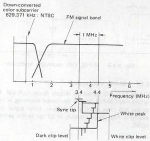

*Fig. 3-1-1 NTSC VHS recording spectrum*

Three recording speeds are used in NTSC VHS system, standard (SP), long play (LP) and extended play (SP). In the LP mode, since the horizontal synchronization signals of the recorded tracks are not aligned, the playback picture is noticeably impaired during variable speed playback.

This mode is therefore used only in certain NTSC areas. For this reason, the SP and EP speeds are the main modes for NTSC recording and playback.

|  Recording speed | Standard recording time | Max. recording time | C cassette  |
| --- | --- | --- | --- |
|  SP | 120 minutes | 168 minutes | 20 minutes  |
|  LP | 240 minutes | 336 minutes | —  |
|  EP | 360 minutes | 504 minutes | 60 minutes  |

Table 3-1-1 NTSC tape recording time

#### 3.1.3 PAL VHS system

The PAL VHS system differs from NTSC in using 50 fields that are recorded with 25 rps head rotation. PAL uses a wider transmission band than NTSC and the VHS recording bandwidth for this system is also wider. However, the 25 rps rotation rate results in a lower head to tape relative speed in comparison to NTSC and, theoretically, the frequency response conditions are more severe.

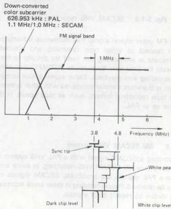

*Fig. 3-1-2 PAL VHS recording spectrum*

In establishing the VHS specifications for PAL, the 3 hour recording time was adopted as standard. New technology was also incorporated in order to obtain optimum picture quality in PAL signal recording and playback.

|  Recording speed | Standard recording time | Max. recording time | C cassette  |
| --- | --- | --- | --- |
|  SP | 180 minutes | 240 minutes | 30 minutes  |
|  LP | 360 minutes | 480 minutes | 60 minutes  |

Table 3-1-2 PAL tape recording time

#### 3.1.4 SECAM VHS system

The luminance signal specifications for SECAM are essentially the same as those for PAL. Monochrome recorded tapes are therefore interchangeable.

However, the color signal component differs from other areas in using frequency modulation. Thus, a simple 1/4th countdown system is used for recording.

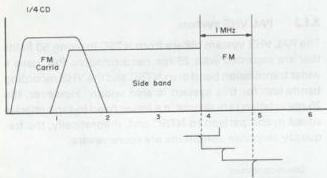

*Fig. 3-1-3 SECAM VHS recording spectrum*

The FM color signal signal has numerous advantages with respect to video tape recording and playback. Prominent is eliminating the need for circuits to compensate for time axis fluctuations (AFC/APC) that occur in recording and playback. Color signal circuit composition is therefore simpler compared with other systems. The tape recording format, such as tape speed, is the same as in PAL.

#### 3.1.5 ME-SECAM VHS system

Recording a SECAM signal with a PAL VHS system recorder yields ME-SECAM VHS recording. In some areas where PAL signals are broadcast, SECAM signals can also be received. People residing in these areas expressed the desire to record both signals.

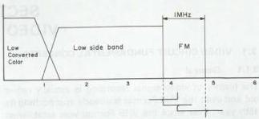

*Fig. 3-1-4 ME-SECAM VHS recording spectrum*

In response to this demand, VHS recorders have been produced that record and playback SECAM signals using PAL circuits. Thus, as indicated in Fig. 3-1-4, although the signal is SECAM, the recording system resembles PAL. Service technicians should therefore be aware that there are two SECAM systems used in VHS.

The ME-SECAM VHS system is used in parts of Germany and the Middle East. Specifications for tape speed, etc., are the same as PAL.

#### 3.1.6 N-PAL VHS system

The N-PAL broadcast system is used mainly in parts of South America. This system employs 625 lines PAL scanning, but the color signal frequency is close to that of NTSC. However, color signal processing is PAL.

VHS recorders designed for this system use 25 rps head rotation and the color reference signal (3.582056 MHz) is down-converted for recording. The system is used mainly in Argentina and adjacent areas.

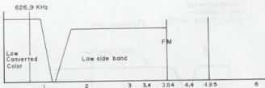

*Fig. 3-1-5 N-PAL VHS recording spectrum*

#### 3.1.7 M-PAL VHS system

The M-PAL VHS system is largely found in Brazil. This differs from M-PAL in that horizontal scanning is close to the 525 lines of NTSC. However, color signal processing is PAL. Head rotation of 30 rps is the same as NTSC.

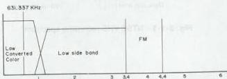

*Fig. 3-1-6 M-PAL VHS recording spectrum*

|   |   |   | PAL | M-PAL | NTSC | N-PAL  |   |
| --- | --- | --- | --- | --- | --- | --- | --- |
|  Signal | Color System |   | PAL | PAL | NTSC | PAL  |   |
|   |  Scanning Line |   | 625 | 525 | 525 | 625  |   |
|   |  V. Sync |   | 50 Hz | 60 Hz | 60 Hz | 50 Hz  |   |
|   |  H. Sync |   | 15.625 kHz | 15.734266 kHz | 15.734266 kHz | 15.625 kHz  |   |
|   |  Subcarrier |   | 4.433619 MHz | 3.575611 MHz | 3.579545 MHz | 3.582056 MHz  |   |
|  VHS | FM Carrier | Sync Tip | 3.8 ± 0.1 MHz | 3.4 ± 0.1 MHz | 3.4 ± 0.1 MHz | 3.8 ± 0.1 MHz  |   |
|   |   |  White Peak | 4.8 ± 0.1 MHz | 4.4 ± 0.1 MHz | 4.4 ± 0.1 MHz | 4.8 ± 0.1 MHz  |   |
|   |  Deviation |   | 1.0 ± 0.1 MHz | 1.0 ± 0.1 MHz | 1.0 ± 0.1 MHz | 1.0 ± 0.1 MHz  |   |
|   |  Down Converted Color Subcarrier |   | 625.953 kHz | 631.337 kHz | 629.371 kHz | 626.953 kHz  |   |
|   |  Tape Speed | Format | - | - | - | PAL | NTSC  |
|   |   |  SP | 23.39 mm/sec | 33.35 mm/sec | 33.35 mm/sec | 23.39 mm/sec | 33.35 mm/sec  |
|   |   |  LP | 11.70 mm/sec | 16.68 mm/sec (Playback Only) | 16.68 mm/sec (Playback Only) | 11.70 mm/sec | -  |
|   |   |  EP | - | 11.12 mm/sec | 11.12 mm/sec | - | 11.12 mm/sec  |
|   |  Writing Speed |   | 4.85 m/sec | 5.80 m/sec | 5.80 m/sec | 4.85 m/sec  |   |
|   |  Video Track Width | SP | 0.049 mm | 0.058 mm | 0.058 mm | 0.058 mm  |   |
|   |   |  LP | Approx. 0.025 mm | Approx. 0.029 mm | Approx. 0.029 mm | Approx. 0.029 mm  |   |
|   |   |  EP | - | Approx. 0.019 mm | Approx. 0.019 mm | Approx. 0.019 mm  |   |
|   |  Video Track Angle (Running) |   | 5° 57' 50.3" | 5° 58' 9.9" | 5° 58' 9.9" | 5° 57' 50.3"  |   |
|   |  RF | TV Broadcasting System |   | B, (I) | M | M | N  |
|  Scanning Lines |   | 625 | 525 | 525 | 625  |   |   |
|  V. Sync |   | 50 Hz | 60 Hz | 60 Hz | 50 Hz  |   |   |
|  H. Sync |   | 15.625 kHz | 15.734266 kHz | 15.734266 kHz | 15.625 kHz  |   |   |
|  Subcarrier |   | 4.433619 MHz | 3.575611 MHz | 3.579545 MHz | 3.582056 MHz  |   |   |
|  Video Bandwidth |   | 5 MHz (5.5 MHz) | 4.2 MHz | 4.2 MHz | 4.2 MHz  |   |   |
|  Video Modulation System |   | AM | AM | AM | AM  |   |   |
|  Video Modulation Polarity |   | Negative | Negative | Negative | Negative  |   |   |
|  Channel Bandwidth |   | 7 MHz (8 MHz) | 6 MHz | 6 MHz | 6 MHz  |   |   |
|  fs - fp |   | 5.5 MHz (6.0 MHz) | 4.5 MHz | 4.5 MHz | 4.5 MHz  |   |   |
|  Video Modulation System |   | FM | FM | FM | FM  |   |   |

Table 3-1-3 M-PAL/N-PAL format specification
3.1.8 MS VHS system

MS VHS system recorders are capable of recording and playback in 5 systems.

These are: NTSC (3.58 MHz)
NTSC (4.43 MHz)
PAL
SECAM
ME-SECAM

Tapes Tapes recorded in these systems can be played back with an MS model VHS machine.

Also called MS are models for the French SECAM system to which capability for recording and playing back PAL signals has been added. More precisely, these are dual PAL/SECAM models. They are capable of recording and playing PAL, SECAM and ME-SECAM.

1. NTSC 4.43 MHz playback

There is strong demand in European areas for playing NTSC software tapes. Some TV set models are also sold which are able of displaying NTSC 4.43 MHz signals. This demand has also necessitated video recorder models capable of playing back NTSC 4.43 MHz signals. Providing this capability is fairly easy and does not require modification to the basic PAL TV functions. When a videotape recorded in the NTSC system is played back, the color component is converted into 4.43 MHz NTSC. The foregoing has been an outline of the differences among VHS systems.

3.2 VIDEO CIRCUIT PRINCIPLES

The video circuit in the VHS Format does more than simply record the video signal on tape. It is a revolutionary system that incorporates functional technology for meeting the demands for household video equipment.

The present video circuit is the result of the continuous technical advances for improved picture quality that make up VHS history. Following is a summary of the video circuit principles. The functions are outlined in accordance with the signal flow in the VHS video circuit.

3.2.1 EE system

In this system, the recorder is mechanically in the Stop mode, while the picture appears on the monitor. The signal output is produced without passing through the mechanism. Therefore, it is termed electric to electric, or EE.

1. Input signal selector

The input selector circuit differs according to the model, however it functions to select an external input signal. Among the external signals are video via the input connector, and TV signal supplied from the TV tuner circuit. In recent models, the signal is selected within the video main IC. The control signal for selection is supplied from the mechacon CPU. The selection signal and signal relationships are as follows.

TNR (TUNER)
TV signal supplied from internal tuner circuit

AUX (external video)
Video signal supplied from external source

SC (Simulcast)
Selects TV signal and sound (linear), the external sound signal is selected as the Hi-Fi audio signal

2. AGC circuit

In the VHS Format, the AGC circuit response is specified as follows.

With respect to a reference input level variation of +12 dB, the AGC output variation shall be within +3 dB. A keyed AGC is employed in VHS. In present models, the AGC circuit is contained within an IC and cannot be measured externally. The keyed AGC uses feedback to maintain the sync level of the video signal at a fixed level.

1) Keyed AGC basic operation

The keyed AGC circuit uses the horizontal synchronization signal, which is a continuously fixed signal, and detects variations of the input video signal. The circuit then compensates the variation component.
##### 2) Keyed AGC basic circuit

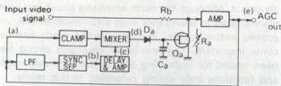

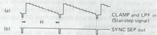

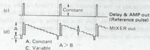

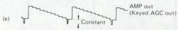

*Fig. 3-2-1 Keyed AGC principle*

The AGC out signal appears at the clamp and LPF as waveform (a). Sync tip is clamped at a fixed DC potential and the signal is applied to the mixer. Waveform (b) is obtained following sync separation through a lowpass filter. This is delayed to match the phase of the back porch of waveform (a) horizontal sync component, amplified to a fixed level and mixed to become waveform (c).

At the mixer, the H sync back porch is mixed at a fixed level which is slightly higher than the 100% video level, as indicated by waveform (d). Level of this added reference pulse is fixed and the signal is rectified by Da and Ca. The rectified voltage varies the impedance (Ra) between Qa drain and source. Level of the input video signal supplied to the amplifier becomes controlled by the ratio of Ra to Rb.

For example, when the input signal level is high, the sum of the sync and reference levels increases and the rectified output becomes larger. When applied to Qa gate, this larger voltage decreases the impedance Ra between Qa source and drain. As a result, the input level to the amplifier becomes attenuated by the ratio of Ra to Rb. In the above manner, because of the fixed added pulse level, the rectified output becomes determined by the sync level. By this process the keyed AGC circuit functions to maintain a fixed sync level.

An advantage of the keyed AGC circuit is that its output level does not vary with change in the average picture level (APL) of the input video signal. This permits use of the above mentioned non-linear pre-emphasis system.

##### 3. Output circuit

The output circuit selects the signal flow for EE, recording and playback modes. In present models, this circuit is contained within the video signal processing IC.

#### 3.2.2 Recording system

##### 1. Luminance signal recording system

Lowpass and bandpass filter circuits separate the luminance and chrominance components from the input signal. The lowpass filter limits the upper bandwidth of the separated luminance signal in order to allow VHS recording. The signal then goes to the frequency modulator and recording amplifier.

The luminance signal recording system performs a vital function in converting the input video signal into a form that complies with VHS recording specifications. Early VHS models required numerous adjustments in this circuit. The number of adjustments has been sharply reduced in present models.

###### 1) Lowpass filter (luminance signal separator)

Luminance and chrominance must be separated from the composite input signal. The lowpass filter indicated in Fig. 3-2-2 is used for luminance signal separation. Some recent models use a comb filter circuit for Y/C separation.

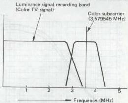

*Fig. 3-2-2(A) Luminance signal recording band : NTSC*
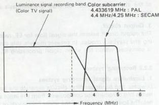

*Fig. 3-2-2(B) Luminance signal recording band : PAL/SECAM*

The lowpass filter determines the frequency response of the luminance system. The comb filter type separator features better luminance frequency response than the lowpass filter type. Therefore, the S-VHS system uses a logical comb filter for luminance signal separation that covers a higher band.

###### 2) Pre-emphasis (main emphasis) circuit

After limiting, the luminance signal is supplied to the pre-emphasis circuit. This circuit shapes the response to conform with VHS specifications, as indicated in Fig. 3-2-3. The purpose of the circuit is to reduce the effects of high frequency noise produced from frequency modulation. Prior to recording, the high frequency component is enhanced. The pre-emphasis is performed at a considerably high level and serves to improve VHS S/N.

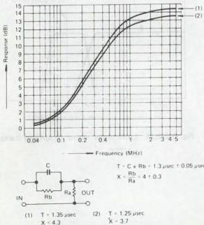

*Fig. 3-2-3 Pre-emphasis characteristics*

###### 3) Non-linear emphasis circuit

This operates in the same manner as the pre-emphasis circuit. Although the main emphasis circuit has been standardized in accordance with VHS specifications, improved picture quality in the extended mode has become important. The non-linear emphasis circuit has been added for improving S/N in the extended mode and functions only during recording in this mode.

Tape speed is 1/3rd normal in the extended mode and the track width is also 1/3rd. The narrower track reduces the playback FM output and detracts from S/N, particularly at high frequencies.

The main emphasis circuit is unable to compensate adequately in the extended mode. Therefore, the additional non-linear emphasis is applied to correct for the lower signal level. This is a variable emphasis which detects the signal level. The non-linear emphasis response is indicated in Fig. 3-2-4.

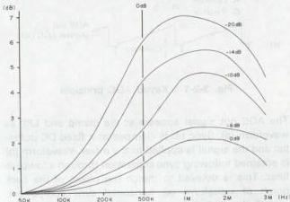

*Fig. 3-2-4 Non-linear emphasis characteristics*

Non-linear emphasis operation improves the picture quality in the extended mode. During playback, non-linear de-emphasis returns the signal to its original form. In recent models, the signal processing is performed within an IC.

###### 4) W/D clip circuit

The W/D clip circuit limits the upper and lower components (edge spikes) of the high frequency video signal in order to avoid over-modulation by the frequency modulator.

As shown in Fig. 3-2-5, pulse enhancement at high frequencies appears in the video signal from the emphasis circuit due to the differential circuit. If this signal were applied directly to the frequency modulator, the circuit could not respond to the rapid signal variations and an AC component would appear in the modulated output.

The AC component would be limited during playback, impairing the playback FM signal and causing over-modulation effects. The white and dark clip circuits are set to operate at the following levels.

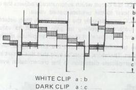

*Fig. 3-2-5 White and dark clip*

|   | NTSC | PAL/SECAM  |
| --- | --- | --- |
|  White Clip | 160% + 10%
- 5% | 160% + 10%
- 5%  |
|  HQ Mode | 200% (LP/EP) | 190% (LP)  |
|  Dark Clip | 40% ± 10% | 40% ± 10%  |

Table 3-2-1 White and clip levels

5) Frequency modulator

The frequency modulator functions to convert the video signal into an FM form that complies with VHS specifications. The principle is indicated in Fig. 3-2-6. The DC voltage of the input video signal is detected and a frequency is oscillated corresponding to the DC level. For NTSC, the video signal level is modulated from the 3.4 MHz sync tip (carrier) to the 4.4 MHz white peak.

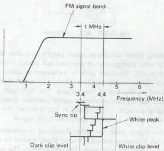

*Fig. 3-2-6 (A) Frequency modulator spectrum : NTSC*

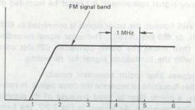

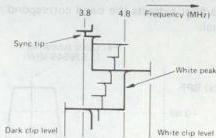

*Fig. 3-2-6 (B) Frequency modulator spectrum : PAL/SECAM*

Present models do not include frequency modulator adjustments. However, the following adjustments are required for earlier models in order for the oscillation frequency to meet VHS specifications.

(1) Carrier and deviation

Carrier: Specified frequency oscillated at the sync tip

Deviation: Specified frequency oscillated at the video signal 100 % white

These modulator adjustments must be performed precisely in order for the recorded FM signal to comply with VHS specifications.

6) Recording amplifier

The recording amplifier provides the optimum current for recording the FM signal on tape. Current response of this amplifier is as follows.

Above 3.4 MHz : Optimum recording saturation current

2 MHz : 3 ± 1 dB 0 dB at 3.4 MHz

1 MHz : 6 ± 1.5 dB

Below 1 MHz : Flat current response

There are two types of recording amplifier: fixed voltage and fixed current.

2. Color signal recording system

The color signal recording circuit first separates the chrominance (color) component from the input video signal. In the VHS Format, the luminance signal recording band is about 3 MHz. As the color signal band is outside the luminance signal, it can be separated by a relatively simple circuit. However, since color is a high
frequency signal component, it cannot be recorded directly.

In the VHS Format, the color signal is converted to 40 fh + 1/2 fh, or 629 kHz (NTSC). The color signal recording circuit then mixes the down converted 629 kHz color signal with the luminance signal for recording.

1) Bandpass filter (color separator circuit)

This filter functions to separate the color signal. In recent models, a comb filter is used because of its superior separation response. As shown in Fig. 3-2-7, the bandpass filter extracts the band corresponding to the color signal.

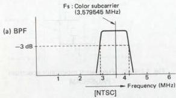

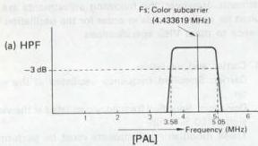

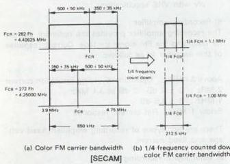

*Fig. 3-2-7 Color signal recording band width*

However, in the SECAM system, the color signal is frequency modulated. Therefore a special filter (bell filter) is required for Y/C separation.

2) ACC circuit

The ACC is a circuit which automatically adjusts the color signal level to the predetermined value.

The ACC extracts only the burst signal, then detects its level before controlling its gain so that its value is constant. In general, if there is no amplitude distortion in the transmission system, the burst signal level is constant. Therefore, it can be said that this circuit eliminates amplitude distortion in the transmission system.

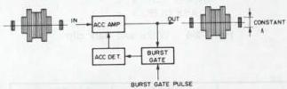

*Fig. 3-2-8 ACC block*

Fig. 3-2-9 shows the basic operation of the ACC circuit. The burst component of the playback color signal is detected and the amplifier gain is controlled in order to maintain a constant burst level. In recent high performance models, the ACC circuit operation is further stabilized by using a two step gain control. In new models, ACC gain is controlled by an external pulse.

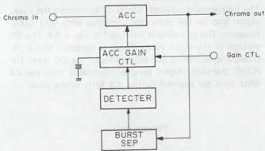

*Fig. 3-2-9 ACC principle*

Switching point variations occur before and after the vertical sync component of the playback signal. Therefore, the ACC feedback gain is increased in order to provide faster response. This minimizes color flicker produced at the top of the picture. The ACC gain is reduced during comparatively stable periods, thereby providing a stable color signal. In this manner, the 2-step ACC yields a further stabilized color signal.

3) Color signal main converter (Ballanced modulator)

The high frequency broadcast color signal cannot be recorded directly by consumer video equipment. The parallel converter therefore changes the color signal to lowband for recording.

Circuit operation of the color signal down-converter is

described in the following. Fig. 3-2-10 shows composition of the circuit.

The main converter converts the Fs color signal into the 40 Fh + 1/8 Fh signal.

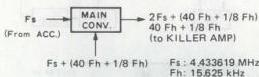

*Fig. 3-2-10 Main converter block*

As well as the color signals, the Fs + (40 Fh + 1/8 Fh) signal is fed to the main converter which outputs the sum component [Fs + (40 Fh + 1/8 Fh) signal] and difference component (40 Fh + 1/8 Fh signal).

###### (1) Main signal

This inserts the color signal into the input signal. As shown in Fig. 3-2-11, one input of the parallel converter is the colour signal at Fsc + 500 kHz, while the other input is Fsc + 40 Fh + 1/2 Fh. The converter produces the sum and difference outputs.

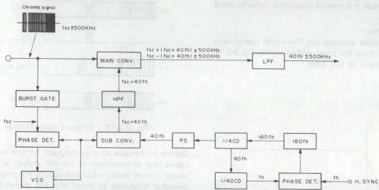

*Fig. 3-2-11 Color signal recording system principle*

During recording, a lowpass filter yields the difference signal (down converted color) from the main converter output. The 40 Fh signal is also used during recording for rotating the signal phase 90 degrees every horizontal line in order to prevent S/N reduction due to crosstalk during playback.

Color crosstalk correction by phase shift system

###### 4) APC circuit

Recording color signal processing is mainly divided between the APC and AFC circuits. The APC circuit controls the recording color signal phase with respect to the input burst signal. As indicated in Fig. 3-2-11, the burst gate extracts the burst component from the input colour signal. This signal is the color reference at 3.58 MHz (fsc).

The color signal phase is compared with the reference signal from a VCO (fsc oscillator) at the phase detector. The resulting output signal controls the VCO. The circuit therefore forms a phase locked loop with respect to the input burst signal. As the APC circuit functions by detecting the fsc phase, control is performed at very high frequency.

###### 5) AFC circuit

While the APC compensates for comparatively rapid variations, the AFC circuit forms a phase loop for the fh (horizontal sync signal frequency) component. The horizontal sync signal (fh) is used as the AFC input. Since the H sync signal input during recording can be considered stable, the resulting 160 fh (2.5 MHz) signal is also stable.

This is counted down to 40 fh (NTSC: 629 kHz, PAL: 626.9 kHz), VHS phase shift is applied, then the signal goes to the sub-converter. The recording AFC circuit performs 40 fh signal processing for down conversion and phase shift processing.

###### 6) Color signal recording circuit

This circuit records the down converted color signal by using the FM luminance signal as recording bias. Thus, the color signal is recorded with AC bias using the luminance signal.

#### 3.2.3 Playback system

Very large amplification is needed to playback the weak signals recorded on the tape. Improving S/N is therefore a major consideration in this process. Noise correction is also important in view of the narrow 58 um (NTSC) / 49 um (PAL/SECAM) track played back by the rotating heads.

##### 1. Luminance signal playback

###### 1) Preamplifier circuit

This circuit amplifies the minute signals played back from the tape to the level required by the video circuit. The preamplifier circuit is therefore shielded in order to avoid external noise.

###### 2) Highpass filter

The highpass filter extracts the FM signal component above 1.4 MHz from the preamplified signal. Fig. 3-2-12 indicates response of this filter.

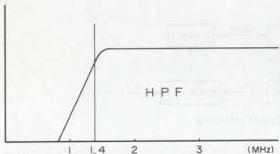

*Fig. 3-2-12 Highpass filter band width*

###### 3) Dropout compensator

The FM signal is applied to this circuit prior to demodulation. Dropouts appear as black or white noise in the playback picture. Since these detract from picture quality, the DOC performs an important function.

Operation of the DOC circuit is indicated in Fig. 3-2-13.

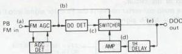

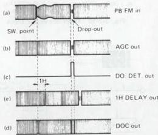

*Fig. 3-2-13 Dropout compensator*

Defects in the tape, such as magnetic particle losses, can cause loss or reduction of the FM signal, which may impair picture quality when this occurs, the dropout compensator functions to insert the FM signal from the previous horizontal line, thereby preventing visible effects in the picture.

The FM AGC circuit first corrects for level fluctuations in the playback FM signal, which arise from variations in head to tape contact at the intake and output of the rotating drum. This results in a fixed level as indicated by waveform (b) in Fig. 3-2-13.

Part of this output goes directly to the switching circuit, while another part is applied to the dropout detector. In the dropout detector circuit, a highpass filter cuts the low sideband of the FM signal and an integrator detects the dropout component. A precise squarewave is formed and supplied as waveform (c) to the switching circuit. A 1H delay circuit and amplifier return part of this signal to the switching circuit as waveform (d). When (c) is low, output (b) is produced from the switcher. In event of dropout, (c) becomes high and output (d) is obtained. In this manner, the signal from the previous horizontal line becomes inserted in place of the dropout component. The loop circuit design of the DOC increases its effectiveness.

###### 4) Double limiter

The pre-emphasis circuit functions to enhance the high frequency portions of the signal in order to improve S/N during VHS recording. The double limiter limiter circuit converts these enhanced components into FM form. The
recording FM signal contains numerous high frequency components. As indicated in Fig. 3-2-14, these are recorded as AC components during frequency modulation.

During playback, although the heads can pickup the FM signal, their response tapers off in the high frequency region, resulting in FM signal loss. In order to avoid this loss, the FM signal is applied to the double limiter circuit, which compensates by producing the specified FM signal level. The operation is outlined below.

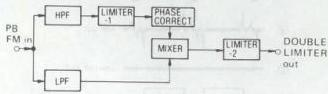

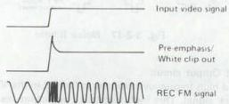

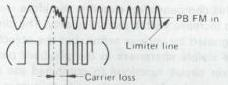

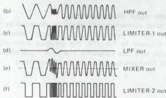

*Fig. 3-2-14 Double limiter principle*

Overshoot can result when pre-emphasis is applied to a signal which varies from black to white level. The playback FM signal is indicated by waveform (a) in Fig. 3-2-14.

If limiting is applied at the limiter line at the center of the waveform excursion, it cannot correct the carrier loss component and black/white reversal and impaired S/N can occur. For this reason, the signal is applied to highpass and lowpass filters which separate the carrier and lower sideband components, as indicated by (b) and (d).

The signal through the highpass filter goes to Limiter-1 which applies approximately 10 dB limiter gain, then to the mixer. At the mixer, the signals from the HPF and LPF are mixed and sent to Limiter-2. This is shown by waveform (e).

Phases of the signals are aligned by the phase correct circuit. As can be noted from waveform (e) limiting can be applied to the lower sideband component without losing signal information.

With the double limiter, the noise component is not amplified, while the carrier and lower sideband ratio is corrected. This serves to eliminate carrier loss and prevent black/white reversal. As a result, adequate pre-emphasis can be applied for improved S/N at high frequency.

5) Limiter circuit

The FM limiter removes the fluctuation components produced in playback from the DOC output prior to demodulation.

6) Frequency demodulator

This circuit operates to return the fixed level FM signal into the video signal.

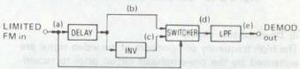

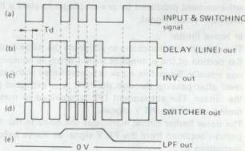

*Fig. 3-2-15 Demodulator principle*

Part of the signal from the limiter goes directly to the switching circuit as the switching pulse. In the other route the signal goes through a delay circuit, then to the switcher as waveform (b) in Fig. 3-2-15.

The delayed output through the inverter enters the switcher as waveform (c). Since the delay amount (Td) is 1/4 th the FM carrier.

A low switching pulse (a) produces the switching circuit output shown by (b), while a high pulse results in (c).
Consequently, the switching circuit output becomes as shown by waveform (d). This is integrated through a lowpass filter to yield the AM luminance signal indicated by (e).

###### 7) Lowpass filter

The detected video signal from the demodulator includes carrier leak components. This lowpass filter removes the high frequencies and passes the VHS playback luminance signal band.

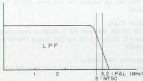

*Fig. 3-2-16 Lowpass filter band width*

###### 8) De-emphasis circuit

The high frequency components of the video signal are enhanced by the pre-emphasis circuit prior to recording. During playback, the signal must be returned to its original response. The de-emphasis circuit reverses the enhancement produced by pre-emphasis to yield a flat playback video signal.

###### 9) Noise limiter

The noise limiter functions to eliminate the noise in the flat portion of the luminance signal which is conspicuous visually. Since this noise is concentrated at the low level after passing through the HPF, it is extracted by the limiter. The subsequent LPF is provided to match timing which the PB Y signal.

The noise limiter circuit eliminates the noise in the flat portion obtained from the PB Y signal as above before outputting it.

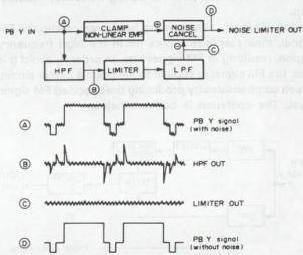

*Fig. 3-2-17 Noise limiter*

###### 10) Output circuit

The high frequency response is limited in the VHS playback signal. This high frequency reduction results in a visible difference in picture quality between EE and playback. This compensation circuit is therefore included in order to increase visible picture quality. The circuit may be designated by various terms, but the objective is to increase visible sharpness in the playback picture.

The mixer circuit functions to combined the playback luminance and colour signals prior to output.

##### 2. Color signal playback system

The down converted color signal is converted by this circuit into the specified signal. However, because of jitter inherent in the VTR, the playback color signal includes time axis variations. The color signal playback circuit functions to correct for these variations.
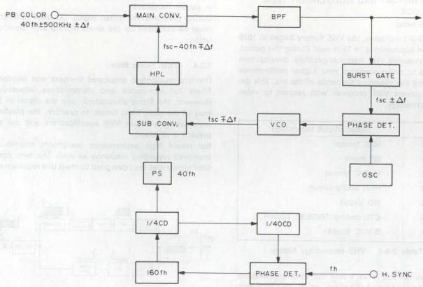

*Fig. 3-2-18 Color signal playback system principle*

1) Playback ACC
The ACC circuit suppresses playback signal variations. Operation is basically the same as during recording.

2) Main converter
The main converter changes the down converted color signal into the normal frequency.

3) APC circuit
The APC circuit corrects for comparatively rapid variations by detecting the phase variations of the color burst signal.

4) AFC circuit
This circuit compensates for somewhat slower errors. While the APC functions by detecting Fsc variations, the AFC operates from the Fh. The variation component of the playback horizontal sync signal is detected and compensation is applied by the playback color correction circuit.

### 3.3 VHS HISTORY AND VIDEO CIRCUIT TECHNOLOGY

#### 3.3.1 General

As Table 3-3-1 indicates, the VHS history began in 1976 and is now approaching its 15th year. During this period, while maintaining VHS interchangeability, development continued to make available ever higher performance for meeting the changing demands of the era. This description covers VHS progress with respect to video circuit technology.

|  Year | Video circuit technology  |
| --- | --- |
|  1976 | VHS format  |
|  1979 | EP mode  |
|  1982 | VHS-C format  |
|  1983 | Hi-Fi audio circuit  |
|  1985 | HQ circuit  |
|  1986 | CTL coding “INDEX” system  |
|  1987 | S-VHS format  |

Table 3-3-1 VHS technology history

VHS sales started in 1976 and the VHS specifications formed the foundation the video circuit. VHS specifications pertain to the standard tape speed. The extended (EP) mode was developed in 1979. Loss of S/N was anticipated with the introduction of the EP mode and technical developments proceeded for improving this performance. These technical developments are outlined below.

#### 3.3.2 Non-linear emphasis

The non-linear emphasis circuit was specified for improving picture quality in the EP (NTSC) and LP (PAL) modes. This circuit adjusts the emphasis curve in response to variations in the input luminance signal level. Adequate emphasis response is provided for even low level video signal inputs and S/N is improved.

#### 3.3.3 Carrier interleave

The video track is narrow in the extended mode and crosstalk during playback is greater than in the standard mode. In VHS, crosstalk is reduced by azimuth recording and colour phase shift. However, the narrow extended mode track reduces the playback output and adjacent channel crosstalk cannot be ignored. Carrier interleave is therefore used only in the extended mode for reducing the effects of adjacent channel crosstalk.

Carrier interleave functions by recording the FM carrier of the CH 1 track at 1/2 fh higher frequency than the CH2 track. Prior to frequency modulation, the DC level of the 1/2 fh carrier shift component is applied to the

luminance signal by using the drum flipflop. This results in carrier interleave.

During playback, the video signal DC level difference must be corrected by the drum flipflop after demodulation.

#### 3.3.4 Twin comb filter

Previous equipment employed lowpass and bandpass filters for luminance and chrominance separation. However, the filters unavoidably clip the signal in the area of the pass band limits. In practice, the playback response was within VHS specifications and did not present a problem.

But recent high performance equipment emphasizes improved recording response as well. The twin comb filter circuit was thus designed to meet this requirement.

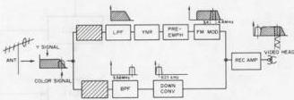

*Fig. 3-3-1 Twin Comb Filter Circuit*

#### 3.3.5 DCC (Dynamic color level control) circuit

Color level adjustment in previous models was performed by an ACC (automatic color control) circuit. The ACC circuit functions by automatically correcting variations of the input colour signal level to provide stable recording and playback color.

With the typical ACC circuit, improving the response, tends to impair color S/N. Conversely, delaying the ACC response reduces color level stability and may prevent a stable color picture.

An improvement is offered by the DCC circuit used in this model. Response is fast at the start of the field for stabilizing the color level, while response is reduced during the video signal period in order to preserve color S/N.

The DCC circuit is incorporated into the color module and does not appear in the wiring diagram.

#### 3.3.6 Automatic noise reduction (ANR) circuit

This is a newly introduced system for improving picture quality in the luminance system. It is contained in the Y module and is comprised of TNR (twin noise reduction) and LPA (linear phase aperture) circuits. The system is able to improve S/N without sacrificing playback signal pulse response.
The noise canceller type system used with earlier equipment subtracted the separated noise component from the playback signal to perform noise reduction. The highpass filter for separating the noise component also separated some of the high frequency signal component, which was removed by a limiter. Subtraction then reduced definition in the picture edges.

The ANR system offers significant improvement in edge response and S/N. Noise reducers NR-1 and NR-2 are positioned before and after the LPA, thus providing clear and lifelike picture reproduction.

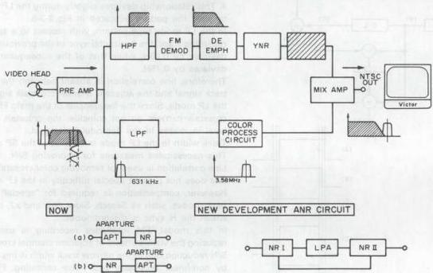

*Fig. 3-3-2 ANR Circuit*
#### 3.3.7 Linear phase aperture (LPA) circuit

This serves to improve pulse response at the video signal edges. It is comprised of delay line, subtractor and adder circuits.

The input signal goes through a 2-step delay line to become waveform C. This is mixed with the original signal, gain adjusted to half, and applied to the subtractor. It is mixed with delayed signal B and inverted to become waveform E. After level adjustment, this is mixed with the original signal to yield and output waveform with enhanced edges.

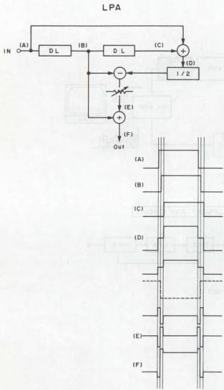

*Fig. 3-3-3 LPA Circuit*

#### 3.3.8 PAL/SECAM LP skew compensation

The VHS format VTR makes use of the field and line correlation characteristics of the color television signal. The luminance component is recorded by a slant azimuth method, while phase shift (PS) recording is used for the color signal. These techniques permit high recording density without need for a guard band. Standard recording time is 3 hours (with E-180 cassette).

Further increased recording time is attained by reducing the tape transport speed to 1/2 (11.7mm/s), thereby allowing a maximum recording time of 8 hours (with E-240 cassette). In the following description, the normal speed is referred to as the SP (Standard Play) mode, while LP (Long Play) denotes the 1/2 speed function. In the VHS format, the horizontal sync signals of adjacent tracks are arranged linearly as shown in Fig. 3-3-4. This relationship deviates slightly during the LP mode to yield the pattern indicated in Fig. 3-3-5.

In the LP mode tape pattern, with respect to a specific recording track, the horizontal sync of the previous track deviates by 0.25H, while that of the subsequent track deviates by 0.75H.

Therefore, line correlation is absent between the main track signal and the adjacent channel crosstalk signal in the LP mode. Since the frequencies of the main FM and crosstalk carriers do not coincide, the crosstalk noise level increases in the demodulated signal.

Track width in the LP mode is 1/2 that of the SP mode. This necessitates measures for improving S/N.

Line correlation is used for removing color crosstalk and this does not present special difficulty in the LP mode. However, compensation is required for "special" playback modes, such as Search, Slow, Still and x2, during which the H sync is discontinuous.

In this model, FM interleave recording is used for reducing the visible effects of adjacent channel crosstalk. S/N reduction due to the narrow track width is improved by non-linear emphasis and noise canceling. Finally, 0.25H, 0.5H, 0.75H and 1H compensation corrects for fH sync discontinuity in the LP mode.

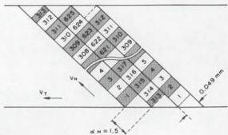

*Fig. 3-3-4 Recorded signal pattern of SP mode*

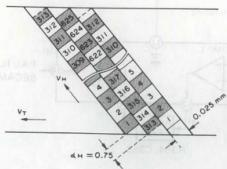

*Fig. 3-3-5 Recorded signal pattern of LP mode*

#### 3.3.9 SECAM detector

As described earlier, the color signal circuit of this model is basically designed for recording a PAL color TV signal. A down converted, phase shifted direct recording system is used for PAL.

Models specifically designed for SECAM generally employ a 1/4 countdown direct recording system. However, this model records the SECAM signal by using the down converted system.

In this process, the SECAM signal is frequency modulated and sent through a bell filter. Since no effect is impaired on the phase error, the phase shift system for PAL recording becomes meaningless, and the signal is simply converted to lowband and recorded.

Line correction in the tape pattern reduces crosstalk during playback and the 2H delay line system for PAL is not employed. The SECAM detector circuit distinguishes between PAL and SECAM signals. With a SECAM signal, the phase shift and 2H delay line circuit are cut off.

Refer to the block diagram of Fig. 3-3-6.

During both recording and playback, the color signal sampled by Q318 burst gate is sent from pin 1 to IC351 limiter. The SECAM burst signal alternates every line between 282 fh (4.40625 MHz) and 272 fh (4.25 MHz) and after passing through the bell filter, the resulting burst level is not fixed. For this reason, the limiter shapes the waveform to produce a fixed level square-wave, which goes to the burst gate amplifier.

The burst gate pulse is also routed to the burst gate from Q351. This circuit removes components other than the burst which were amplified by the limiter. This output goes to the 4.5 MHz filter as waveform (b). The filter possesses the response indicated in the block diagram and passes the 282 fh component, while attenuating the 272 ft component. Waveform (c) illustrates the filter output.

Consequently, 4.5 MHz filter enhances the 282 fh and attenuates the 272 fh. The result is integrated by DET and the 1/2fh output is supplied to the 1/2fh amplifier.

The 1/2fh component is amplified and the fh component attenuated by L351, 1/2fh tuning circuit to produce waveform (d). This output is supplied to the comparator-1 non-invert input. The constant potential is supplied to the invert input as a reference signal for the comparator. At this time, when the voltage at the non-invert input from the 1/2fh amplifier exceeds the reference voltage (about 6V), the comparator-1 high output goes from pin 12 to the rectifier. When below the reference voltage, the comparator output becomes a low potential. Waveform (e) illustrates the comparator-1 output. This is fullwave rectified by R354 &amp; C353 to yield waveform (f). The rectifier high output is supplied to the comparator-2 to yield waveform (g).
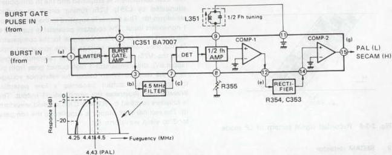

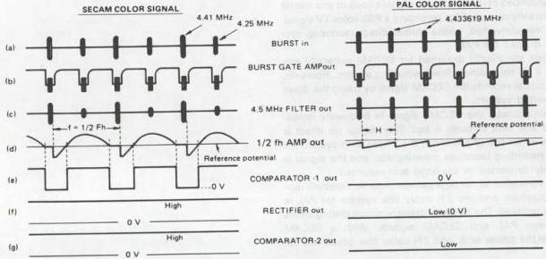

*Fig. 3-3-6 SECAM detector*

#### 3.3.10 Compact VHS technology

The Compact (VHS-C) specifications were established in response to demand for small size movie equipment, while maintaining interchangeability with VHS. The specifications for other than the cassette size are entirely the same as VHS. However, the reduced size necessitated new technical developments.

##### (1) 41 mm head drum

A major consideration in reducing the physical size of the VHS recorder is compact design of the mechanism, including the head drum. The drum, in particular, is a vital component in conforming to VHS specifications. These specify a drum diameter of 62 mm and 30 rps (NTSC) rotation. Thus, any change would deviate from the VHS specifications.

However, by using a 41 mm drum diameter, compactness was achieved without modifying the VHS specifications. In order to maintain VHS interchangeability, the compact drum rotates at 45 rps (NTSC) or 37.5 rps (PAL). Since the diameter is small, the tape wrapping angle is set for 270 degrees.

The 60 frame signal is recorded at 45 rps by using 4 heads with head switching every 270 degrees. This 4 head system differs from the 2 head system in that switching is required during both recording and playback.

### 3.4 HQ TECHNOLOGY

HQ technology was developed in order to bring substantial picture quality improvement to the extended mode. As indicated in Table 3-4-1, the technology pertains to four items, namely raised white clip, luminance vertical processor, chrominance vertical processor and detail enhancer. A video recorder that includes at least one of these can be designated HQ. However, products that use luminance and chrominance vertical processors only in the playback system can also be designated as HQ.

|  HQ technology | Technical outline  |
| --- | --- |
|  WCL (White Clip Level circuit) | Clips the luminance signal at a 20% higher level than conventional systems  |
|  DE (Detail Enhancer) circuit | Applies non-linear emphasis to intensify signal amplitude changes.  |
|  YNR (Luminance Signal Noise Reduction) circuit | Employs a recursive comb filter to improve the video signal-to-noise ratio  |
|  CNR (Chrominance Signal Noise Reduction) circuit | Employs a recursive comb filter to improve the color signal-to-noise ratio  |

Table 3-4-1 HQ technology

#### 3.4.1 General description

Such newly developed technologies as the following are adopted in VHS VCR's of the high quality picture system.

a. Level up of white clip by 10%
b. Detail enhancer
c. YNR

Characteristic of TV pictures can be considered and analyzed from various points of view, however, main factors to influence quality of VTR pictures in playback are pulse response characteristic and S/N ratio. Pulse response characteristic shows how much recorded signals are reproduced in playback, while, S/N ratio shows amount of noise on the plane and edges of playback pictures.

Among the above mentioned three items, a. and b. improve pulse response characteristic, while c. improves S/N ratio.

#### 3.4.2 Principle of YNR

VHS VTR's are equipped with an emphasis circuit as in the past. The emphasis circuit is composed of a pre-emphasis circuit and de-emphasis circuit.

Video signals inputted in recording are once supplied to the pre-emphasis circuit which emphasizes high frequency components of the signal, and then, supplied to the clipping circuit for frequency modulation as the input signal is recorded in FM waveform.

In playback, the demodulated video signals contain high frequency noise components which are mainly generated in FM recording and playback. The de-emphasis circuit suppresses high frequency to reduce noise, and the video signal returns to its original level since its high frequency was emphasized in recording.

The emphasis circuit improves S/N ratio in the manner as said above.

Conventional emphasis circuits are composed of CR elements, which can be replaced with transversal filters of delay elements.

Fig. 3-4-1 and Fig. 3-4-2 illustrate pre-emphasis and de-emphasis circuits and relationship between them.
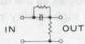
(A) Pre-emphasis circuit of CR element

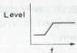
(B) Frequency characteristic

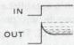
(C) Step response

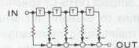
(D) Pre-emphasis circuit of transversal filters

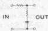
(A) De-emphasis circuit of CR element

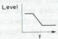

*Fig. 3-4-1 Pre-emphasis circuit and relationship*

(B) Frequency characteristic

(C) Step response

(D) De-emphasis circuit of transversal filters

Note: T's in Fig. (D) of Figs. 3-4-1 and 3-4-2 are delay element of transversal filters to delay time for a certain period.

As explained by the figures of transversal filter circuits, it can be said that outputs of conventional emphasis circuits are what previously outputted horizontal signals are composed. If a T of transversal filters is a delay element to delay the horizontal scanning time at a unit, emphasis that vertical signals are composed is effected.

(a)

*Fig. 3-4-3*

(b)

According to the above principle, Y. NR circuit has been developed.

Next explanation is the idea of S/N ratio improvement. A TV picture is composed of 625 scanning lines.

*Fig. 3-4-4*

In Fig. 3-4-4, for example, every scanning line is a signal waveform shown by the corresponding arrow. In the figure, except bordering portions, neighboring lines show correlation waveforms without remarkable difference. If a noise is mixed with the signals in recording and playback as shown in Fig. 3-4-5, and the signals of line n and line n-1 are added, the signal becomes double and the noise will be $\sqrt{2}$ times (not double because noise occurs at random). Therefore, when the signal is reduced half to be the original waveform, the noise becomes $\frac{\sqrt{2}}{2}$ 2 and the S/N ratio is improved to $\frac{\sqrt{2}}{2}$ (3 dB in amount).

*Fig. 3-4-5*

As the correlation between lines exists not only between neighboring two lines but also another two lines next to the neighboring ones, S/N ratio can be improved by adding these lines, using a circuit as shown in Fig. 3-4-6.

*Fig. 3-4-6*

In the above case, the adding is not done on the same rule but the rate increases proportionally for closer two lines. The rate can be set uniformly such as $K_0 = 1$, $k_1 = k$, $k_2 = k^2$, $k_3 = k^3$ as shown in Fig. 3-4-7 by way of example. In the case of the addition on the same rule, this idea is realized by using a 1H delay circuit. Fig. 3-4-8 shows a principle circuit for example.

If $g$ is set at the most suitable value for this circuit, theoretical S/N improvement becomes as shown below:

$$
20 \log -\sqrt{\frac{1-k}{2}}
$$

If such a circuit as shown in Fig. 3-4-8 is applied, vertical signals are added on the picture as shown in Fig. 3-4-9 (b).

*Fig. 3-4-7*

*Fig. 3-4-8*

However, if an edge portion of a picture is vertically displayed, the waveform is moderate at its rise portion as shown in Fig. 3-4-9 (a) because the neighboring scanning line is added. This causes deterioration in its vertical frequency characteristic.

*Fig. 3-4-9*

To solve this problem, applying the principles of pre-emphasis and de-emphasis explained previously for the vertical lines, treat the signal to be the waveform shown in Fig. 3-4-9 (b), to correct the rise portion and increase it in vertical frequency characteristic. By this treatment, the waveform similar to the original shown in Fig. 3-4-9 (c) is obtained in playback.

If this treatment is performed slightly just for low level signals, S/N ratio is improved without deterioration in changeability. This treatment is done by the limiter shown in Fig. 3-4-8.

#### 3.4.3 Principle of YNR circuit

Fig. 3-4-10 shows a circuit of the recording system. In recording, this circuit functions for precompensation of decrease in vertical resolution in playback. Waveforms observed at V. rate are shown in Fig. 3-4-11.

When a square waveform is inputted into signal source, the output from ADD(1) is moderate in its rise portion owing to the cyclic low pass filter consisting of ADD(1), 1H DELAY and ATT(1). As this output is larger in amplitude than the original one, ATT(2) corrects it to have the same level as that of the original signal. The output of SUB(1) is high-pass signal which is the difference component between the original and low-pass signals. This high-pass signal is amplified to have a level to compensate the playback signal, and, after its amplitude is limited by the limiter to secure the changeability, it is mixed with the original signal by ADD(2) to be sent as the REC signal.

*Fig. 3-4-10*

*Fig. 3-4-11*

This circuit functions to remove noise generated in recording and playback. When P.B. signal containing noise is inputted to the input terminal, the cyclic low-pass filter composed of ADD(1), 1H DELAY and ATT(1) removes the noise, and ADD(1) outputs noiseless signal. If this signal is sent to ADD(2) in the same manner as in recording, output of SUB(1) is high-pass signal containing noise.

Therefore, the circuit is designed so that the signal passes ATT(3) which decrease noise effectively, the limiter to secure changeability, and SUB(2) which adds noise in reversed polarity. Through the above processes, the same output signal, without noise, as the original one can be obtained.

*Fig. 3-4-12*

Fig. 3-4-12 shows a playback circuit.

*Fig. 3-4-13*

### 3.5 VIDEO HEAD TECHNOLOGY

#### 3.5.1 2 head system

This is the basic VHS video head configuration. It is also used at the present time for low end models. To accommodate different tape speeds, the video head width is between SP and EP (NTSC). The (SP) recording track is thus narrower compared to dedicated heads. Noise is also unavoidable in slow and still playback modes.

#### 3.5.2 4 head system

This system is used in somewhat higher grade models. Separate heads are employed for standard and extended modes, thereby improving recording and playback response. According to the model, the head mounting angle is either 42 or 90 degrees. The head distribution differs considerably from the DA4 head design and requires electrical switching position adjustment (REC delay of the servo circuit). This type 4 head system is now rare and most present models use the DA4 head configuration.

#### 3.5.3 DA4 head system

The DA4 head system allows switching during playback modes such as slow and still. The standard and extended mode heads are mounted at nearly the same positions (about $700\mu \mathrm{m}$). Electrical switching permits instantaneous playback of the opposite track. Since the head trace deviates from the track in the special playback modes, instantaneous switching is required. The DA4 head system is used in most present models and in nearly all high performance models.

#### 3.5.4 DA3 head system

Mechanical composition is essentially the same as the DA4 head, but one side of the DA4 is not used. The DA3 head provides good slow and still playback in general purpose models. However, very few models use this configuration.

#### 3.5.5 DA4 + 2A head system

This adds two FM audio heads to the DA4 system. The FM audio heads are used for both standard and extended modes. This system is found in most present medium range models.

#### 3.5.6 DA4 + 2A + FE head system

This system adds a "flying" erase head to the above system. The head serves to avoid "rainbow" noise due to overlapped recording during editing. The recording track is erased just prior to the recording head start position. The FE head is included in high end models with editing features.

The FE head width has been set to erase 2 signal tracks per scan. It therefore functions differently from the other heads. In order to maintain mechanical balance, a dummy head is mounted 180 degrees opposite the FE head.

| HEAD type | NTSC model | PAL/SECAM model |
| --- | --- | --- |
| 2HD | HR-2200series |  | HR-2200series | HR-D1520A |
| HR-3300series |  | HR-3300series | HR-D156MS |
| HR-3600series |  | HR-3320EK | HR-D158MS |
| HR-4100series |  | HR-3330series | HR-D160series |
| HR-4110series |  | HR-3600series | HR-D170series |
| HR-7200series |  | HR-3660series | HR-D171series |
| HR-D1520UM |  | HR-4100series | HR-D210series |
| HR-D170U |  | HR-4110S | HR-D211EM |
| HR-D200U/U(C) |  | HR-7200series | HR-D217MS |
| HR-D210series |  | HR-7300EK | HR-D220series |
| HR-D217U/U(C) |  | HR-7350EK | HR-D225series |
| HR-D3050U |  | HR-7600series | HR-D310S |
| HR-D310series |  | HR-7610MS | HR-D320series |
| HR-D320U/U(C) |  | HR-7650series | HR-D321series |
| HR-D4050U/U(C) |  | HR-7700series | HR-D350MS |
| HR-D515U |  | HR-D110series | HR-D520series |
| HR-D520U |  | HR-D111series | HR-D521series |
| HR-D540U |  | HR-D120series | HR-D522A(DK) |
| HR-D550U |  | HR-D121EG | HR-D525EE |
|  |  | HR-D140E | HR-D527MS |
|  |  | HR-D141series | HR-D540series |
|  |  | HR-D142S | HR-D550MS |
|  |  | HR-D143series | HR-D700series |
|  |  | HR-D150EE | HR-P50E |
|  |  | HR-D152S | HR-S10series |
| 2HD+2A | HR-D370series |  | HR-D370series | HR-D565series |
|  |  | HR-D430series | HR-D566series |
|  |  | HR-D470series | HR-D750EK |
| 4HD | HR-6700series | HR-D220series | HR-7655series |  |
| HR-7100U | HR-D225series | HR-D180series |  |
| HR-7300U | HR-D227series | HR-D190EN |  |
| HR-7650U | HR-D230series | HR-D220EK |  |
| HR-D120series | HR-D235U | HR-D227M |  |
| HR-D140U | HR-D237series | HR-D230series |  |
| HR-D142U | HR-D360series | HR-D440EK |  |
| HR-D150series | HR-D700series | HR-D455series |  |
| HR-D151series | HR-S100U | HR-D500EK |  |
| HR-D180series | HR-S101U | HR-D610series |  |
| DA3 | HR-D400series |  | HR-D300series | HR-D600series |
| HR-D410series |  | HR-D400series | HR-D620series |
|  |  | HR-D580series | HR-D650MS |
| DA3+2A |  |  | HR-D750series | HR-D860series |
|  |  | HR-D830series |  |
| DA4 | HR-D1640UM | HR-D600U/U(C) | HR-D250series | HR-D641M |
| HR-D1610UM | HR-D610U/U(C) | HR-D257MS | HR-D660EK |
| HR-D1670UM | HR-D620U/U(C) | HR-D330series |  |
| HR-D250U | HR-D660U | HR-D337MS |  |
| HR-D251series | HR-D670U | HR-D440M |  |
| HR-D440U/U(C) | HR-D680U | HR-D441series |  |
|  |
| DA4+2A | HR-D1830UM | HR-D750series | HR-D530series |  |
| HR-D470series | HR-D756U | HR-D725series |  |
| HR-D570U/U(C) | HR-D830U/U(C) | HR-D755series |  |
| HR-D530U/U(C) | HR-D840U |  |  |
| HR-D555U | HR-D850U/U(C) |  |  |
| HR-D565series | HR-D860U |  |  |
| HR-D566series | HR-D870U/U(C) |  |  |
| HR-D725U/U(C) | HR-S7000U/U(C) |  |  |
| DA4+2A+FE | HR-D630U/U(C) | HR-S8000U/U(C) | HR-D950series |  |
| HR-S5000U/U(C) | HR-S10000U | HR-S5000series |  |
| HR-S5500U/U(C) | HR-SC1000U | HR-S5500series |  |
| HR-S6600U |  | HR-S9000EG |  |

Table 3-5-1

### 3.6 DIGITAL VIDEO PRINCIPLES

#### 3.6.1 Digitizing

The error increases with smaller bit quantity. At 8 bits, 256 brightness levels are rendered and the resulting picture is nearly indistinguishable from the original.

*Fig. 3-6-1 Digitizing*

|  Bit quantity | Brightness Levels | Resolution (volts*)  |
| --- | --- | --- |
|  2 | 4 | 0.25  |
|  3 | 8 | 0.125  |
|  4 | 16 | 0.0625  |
|  5 | 32 | 0.03125  |
|  6 | 64 | 0.0156  |
|  7 | 128 | 0.0078  |
|  8 | 256 | 0.0039  |

Table 3-6-2 Brightness levels and resolution table to bit quantity

#### 3.6.2 Sampling

Sampling refers to detecting the instantaneous value of a continuously varying analog signal. Signal information is not lost if the sampling frequency is greater than twice that signal bandwidth. Therefore, an 8MHz sampling rate is needed for a 4MHz video signal. For home video recorders, a sampling rate of 3 times the color sub-carrier, or 10.7MHz, and 6 to 7 bits are often used. In broadcast equipment, 3 times, 4 times and 13.5MHz, with bits between 8 and 10 are employed. The 13.5MHz rate can be used for NTSC, PAL and SECAM. Digitizing at 10 bits is normally used in order to avoid compounding the digitization error during repeated dubbing.

*Fig. 3-6-2 Basic block diagram of the digitized video principle*

#### 3.6.3 A/D converter

The A/D converter is comprised of a 1-chip LSI device. Required inputs are video signal, clock and reference voltage. The sampling clock must be synchronized to the video signal.

Stability of the A/C converter, as well as that of the reference voltage, determine its precision to a large extent.

Full parallel and series/parallel type A/D converters have appeared. This model uses the full parallel type. Op-amps equaling the number of bits are arranged. The divided reference voltage is applied to one side, while the input video signal is supplied to the other side.

If, for example, the input video signal is precisely 1/2 the reference voltage, half the op-amp outputs go H, while the other half are L. This is encoded into binary from to become the 6-bit output.

Another important factor for the A/D converter is the clock for determining the binary encoding, i.e., the sampling frequency. For ordinary video equipment, a frequency 3 times the sub-carrier at $10.7\mathrm{MHz}$ is used, which is synchronized with the input signal. If not synchronized, the sampling point would slowly shift with respect to the video signal. This would prevent synchronization between the stored address and video signal.

Processing for storage in the memory also has to be synchronized to the input video signal. Therefore, the clock produced from the input video signal governs all operations for sampling and storage in memory.
#### 3.6.4 Field memory

The operation of this memory circuit determine the digital video functions and performance to a large extent. The digital video effects are produced according to the means of storing the TV picture in the memory of readout.

Each television picture consists of 30 frames and 60 fields per second.

For producing a still picture, the entire field of the desired location among the sequence of video signals is converted to digital form and stored in the memory. New data insertion into the memory is inhabited.

The still picture effect is obtained by continuously reading out this signal picture. (Refer to Fig. 3-6-3)

The same memory circuit is used for the multi-screen effect. For example, the sequence of converted TV signals is stored in a memory column at every other clock signal, then reset at the horizontal sync signal. At the completion of one field, precisely half a picture is stored in the memory. Then the other half a picture is stored in the same manner. When the complete memory is read out, halves of two different pictures appear together on the screen.

It should be noted here that the picture in each half possesses its own burst signal. Thus it is necessary to align the burst phases of the write-in and readout signal. (Refer to Fig. 3-6-4)

A separated Y/C system is used for signal processing in this model. The sync signal is also removed and only the video component is digitized.

This allows a sampling frequency of about 10MHz. Digitization is 6-bits.

Separate memories are used for Y and Colour signals. The Y signal is sample 512 times per horizontal line, while the C signals sampled a total of 256 times, consisting of 128 times each R-Y and B-Y information are memories.

*Fig. 3-6-3*

*Fig. 3-6-4*

#### 3.6.5 Memory write-in

Two 500 k-byte memories are used for the Y signal. Data of each sampling dot are recorded alternately in A and B memories. Each memory stores 256 dots per horizontal line, and a total of 512 dots are stored in both memories. In the vertical direction, the memories are capable of storing 320 dots, however only 240 are actually used in the NTSC system.

A signal 500 k-bit memory is used for the colour signal. The colour difference signals (R-Y and B-Y) are sampled at approximately 5MHz and stored in the memory.

*Fig. 3-6-5 Memory write-in data*

