# JVC VIDEO TECHNICAL GUIDE VTG82063 - SECTION 4

## SERVO CIRCUIT

### 4.1 SERVO CIRCUIT DEVELOPMENT

Prior to VHS, most servo circuits functioned from AC synchronous motors. However, since its inception, VHS has used a DC servo system while a DC motor, thereby achieving the compact and lightweight design that is vital for home video.

#### 4.1.1 VHS servo circuit

As indicated in the table 4-1-1, the first VHS model used a drum servo system with a DC motor. This DC servo circuit was rather advanced for its time. Fixed speed servo was used for the capstan system.

The initial mechanism differed from the present ones in using two motors (drum and capstan) for the drive system, with most of the drive functions preformed by the capstan motor.

Still and slow playback was introduced in the first VHS PAL model. This was also the first to use a capstan servo circuit. The capstan servo circuit was quite advanced for the era and had been used previously only on professional editing equipment.

The first NTSC model to incorporate capstan servo was the HR-6700. The capstan servo provides playback phase control and increases picture stability. Subsequent models use this system.

Advancements in the servo circuit have yielded high performance and reliability. The next major step was incorporating the servo circuit into a single chip IC. The HR-D120 PAL was the first model to adopt digital servo technology. While complex functions are provided by the single chip digital servo circuit, the circuit itself is simplified by using the single chip. Although increasingly sophisticated models appear every year, the servo circuits use 1 or 2 ICs.
- Relation between servo ICs and models

|  SERVO IC | NTSC MODEL |   | PAL/SECAM MODEL  |   |
| --- | --- | --- | --- | --- |
|  Drum servo system | HR-3300series
HR-4110U |  | HR-3300series
HR-3320EK
HR-3330series | HR-4100series
HR-4110series  |
|  HA11711 type
(1st capstan servo system 1tip IC) | HR-2200U
HR-6700U
HR-7300U |  | HR-2200series
HR-3660series
HR-7200series |   |
|  BA851 type
(Capstan servo system IC) | HR-D120series
HR-D220series | HR-D225series | HR-7600MS |   |
|  BA831 type :NTSC
BA833 type :PAL/SECAM
(Capstan servo system IC) | HR-S100U
HR-S101U
HR-D725U/U(C) |  | HR-S10series
HR-D455series
HR-D725series |   |
|  HA11751NT
(1st digital servo system IC)
(PWM pulse) |  |  | HR-D110series
HR-D111series
HR-D120series | HR-D220series
HR-D225series  |
|  HA11827NT
(Digital servo system IC)
(PWM pulse) | HR-D140U
HR-D142U
HR-D150series
HR-D151series | HR-D555U | HR-D140series
HR-D141series
HR-D142S
HR-D143series | HR-D150series
HR-D152S
HR-D160series  |
|  BU2710 type
(Digital servo system IC)
(PWM pulse) | HR-S200U
HR-D250U
HR-D251series
HR-D565series
HR-D566series | HR-D756U | HR-P50E
HR-D156MS
HR-D157MS
HR-D158MS
HR-D250series | HR-D257MS
HR-D565series
HR-D566series
HR-D755series  |
|  VC2022 type :NTSC
VC2023 type :PAL/SECAM
(Digital servo system IC)
(PWM pulse) | HR-D170series
HR-D180series
HR-D370series
HR-D470series
HR-D570U/U(C) | HR-S7000U/U(C) | HR-D170series
HR-D171series
HR-D180series
HR-D190EN
HR-D230series | HR-D330series
HR-D370series
HR-D430series
HR-D470series  |
|  HD49712 type
(1st VISS function IC)
(1st serial data system IC) | HR-D200U/U(C)
HR-D210series
HR-D217U/U(C)
HR-D227series
HR-D230U/U(C) | HR-D3050U
HR-D310series
HR-D360U/U(C)
HR-D630U/U(C)
HR-S8000U/U(C) | HR-D210series
HR-D211EM
HR-D227M
HR-D300series
HR-D310S | HR-D530series  |
|  HD49722NT
(VISS function)
(Serial data system) | HR-D400series
HR-D440U/U(C)
HR-D410series
HR-D700U/U(C)
HR-D750series
HR-S5000U/U(C)
HR-S5500U/U(C)
HR-S10000U |  | HR-D160EN
HR-D217MS
HR-D320series
HR-D321EE
HR-D337MS
HR-D350MS
HR-D400series
HR-D441EN | HR-D440M
HR-D500EK
HR-D700S
HR-D750series
HR-D950series
HR-S5000series
HR-S5500series
HR-S9000EG  |
|  HD49733NT
(1st Slow/still control function IC)
(VISS function)
(Serial data system) | HR-D1520UM
HR-D1610UM
HR-D1670UM
HR-D1830UM
HR-D4050U/U(C)
HR-D515U
HR-D520U
HR-D540U
HR-D550U
HR-D600U | HR-D610U/U(C)
HR-D620U/U(C)
HR-D670U
HR-D680U
HR-D830U/U(C)
HR-D840U/U(C)
HR-D860U/U(C)
HR-D870U/U(C)
HR-SC1000U | HR-D1520A
HR-D520series
HR-D521series
HR-D522A(DK)
HR-D525EE
HR-D527MS
HR-D540series
HR-D550MS
HR-D580series
HR-D600series | HR-D610series
HR-D620series
HR-D641M
HR-D650MS
HR-D660EK
HR-D830series
HR-D860EK  |

Table 4-1-1
### 4.2 SERVO CIRCUIT DESCRIPTION

## General

As they are used in video cassette recorders, servo-mechanisms (servos) perform automatic control by detecting errors from standard values and issuing compensating signals in the form of feedback. Four servo systems are employed in this model: 1) drum servo, which regulates the speed and phase of the rotating head drum, 2) capstan servo, which controls the tape transport speed and phase, 3) reel servo, for governing speed in the search mode, and 4) back tension servo, which controls tension on the tape. Since this last is entirely mechanical, the following description deals mainly with the first two.

Both speed and phase servos are used for the drum and capstan systems, while the reel system employs speed servo only due to the less stringent demand on precision.

In considering servo systems, it is important to understand the natures of the standard (reference) signal and the comparison (error) signal. The methods of producing and detecting these signals are therefore outlined in the following discussion.

#### 4.2.1 Analog servo basic description

##### 1. Drum servo circuit

This controls speed and phase of the rotary head drum in the recording and playback modes. Frequency generator (FG) pulses produced by the direct-drive (DD) drum motor are detected and employed for speed control.

Phase control is performed by detecting the positions of magnets mounted on the rotor of the drum motor.

During recording, the phases of the signal (drum pulse) from these magnets and the vertical sync component of the input video signal are compared and used to control the video head rotational phase, and consequently, the position of the video signal recorded on the tape.

During playback, head rotation is synchronized to a crystal oscillator signal in order to ensure picture stability.

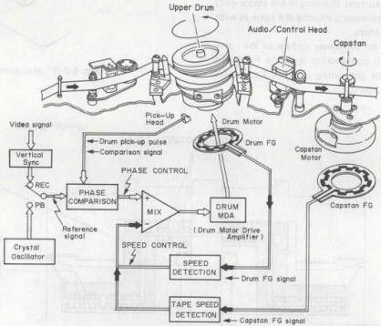

*Fig. 4-2-1 Drum servo loop*

|  Control Signal Modes | DRUM SERVO  |   |
| --- | --- | --- |
|   |  Reference signal | Comparison signal  |
|  REC | Video V. sync (30 Hz) | Drum pick-up pulse (30 Hz)  |
|  Playback | Crystal osc. (30 Hz)  |   |
|  Search | Horizontal discriminator  |   |
|  Slow | Crystal osc. (30 Hz) | Drum pick-up pulse (30 Hz)  |

Table 4-2-1 Drum servo control signal (NTSC)

|  Control Signal Modes | DRUM SERVO  |   |
| --- | --- | --- |
|   |  Reference signal | Comparison signal  |
|  REC | Video V. sync (25 Hz) | Drum pick-up pulse (25 Hz)  |
|  Playback | Crystal osc. (25 Hz)  |   |
|  Search | Horizontal discriminator  |   |
|  Slow | Crystal osc. (25 Hz) | Drum pick-up pulse (25 Hz)  |

Table 4-2-2 Drum servo control signal (PAL/SECAM)

###### (1) Flat direct-drive drum motor

## Construction

This DD motor incorporates a 60-pole magnet to generate an FG signal and is driven by two Hall elements and a 2-phase coil.

As shown in the cross-sectional view of Fig. 4-2-2, the flywheel, which is attached underneath the drum motor in conventional DD motors, is attached beneath the upper drum in this DD motor.

By locating the flywheel inside the drum between the upper and lower drums, the thickness of the drum motor assembly has been greatly reduced. Under the flywheel there are rotary transformers for audio and video signals. The upper ones are audio channel-1 and channel-2 transformers, the outer lower transformers are EP (LP) video channel-1 and channel-2 transformers, and the inner ones are SP video channel-1 and channel-2 transformers.

The drive system is located under these transformers.

A 2-phase coil is wound around the stator and a permanent magnet is attached to the rotor. The two Hall generators on the stator detect the position of poles of this permanent magnet and regulate the current (flowing in the stator coil) to drive the motor. This concept is exactly the same as with conventional DD drum motors.

An FG magnet mounted on the lower surface of the rotor generates an FG signal in conjunction with the FG board underneath. A magnet for generating drum pickup pulses is arranged under the FG board.

## Hall element

In certain semiconductors, when a current (IC) flows perpendicular to a magnetic flux (b), a voltage (VH) becomes produced that is perpendicular (3 dimensionally) to both the current and the magnetic flux. This relationship can be expressed as follows.

$$
VH = RH \times \frac{IC \times B}{d}
$$

In the above, RH is the Hall coefficient and d is the material thickness.

RH : material constant (Hall coefficient)
d : conductor thickness

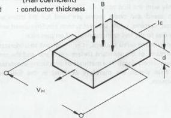

*Fig. 4-2-3 Hall element*

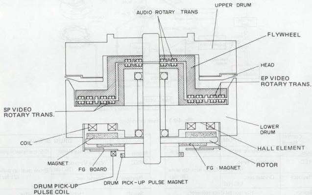

*Fig. 4-2-2 Drum DD motor*
# Principle of drum motor operation

The operating principle of this drum motor will now be explained. As illustrated in Fig. 4-2-4, the drum motor consists of permanent magnets on the rotor and two coils on the stator. The coils face the rotor magnets. To detect the position of poles of the rotor magnet, Hall generators 1 and 2 are attached between the stator coils. Depending on the detected position of poles, the Hall generators vary the current flowing in the coil so that the rotor magnet is rotated by the magnetic field generated by the coil current.

Because the principle of operation is the same as conventional motors, this description should only serve to explain the relative position of the magnets and the coils.

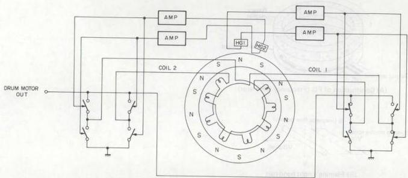

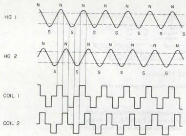

*Fig. 4-2-4 Drum motor drive*

###### (2) Principle of frequency generator (FG)

The FG signal is obtained from the FG pulse produced by the flywheel.

As shown in Fig. 4-2-5, the frequency generator (FG) pulse is obtained from permanent magnets located on the rotor of the drum motor and capstan motor, which are detected by rectangular shaped coils distributed on the FG board. When the motor turns, electromagnetic induction produces detector voltage in accordance with Fleming's right hand rule.

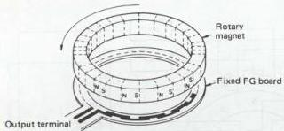
(A) Construction of FG (Frequency Generator)

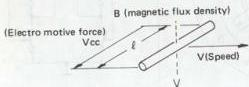
(B) Fleming's right hand rule

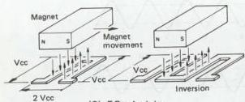

*Fig. 4-2-5 Principle of frequency generator (FG)*

By the arrangement of magnets and a corresponding number of detector coils indicated in Fig. 4-2-5, flux density can be small, while extreme precision is not required of the magnets and coils.
##### 2. Capstan servo circuit

The capstan servo circuit maintains a constant tape speed and controls the tape travel so that the video heads can accurately trace the recorded video tracks. This controls speed and phase of the rotating capstan speed in the recording and playback modes. Frequency generator (FG) pulses produced by the rotating capstan speed are detected and employed for rotating control.

Phase control is performed between the reference and comparison signals, and the resulting error voltage is used to control the rotation phase of the capstan motor.

During recording, the FG pulse of the rotating capstan from the capstan flywheel is counted down to 30 Hz (25 Hz) and the vertical sync component of the input video signal are compared and used to control the capstan motor rotational phase.

During playback, the control signal from tape and the 30 Hz (25 Hz) signal from the crystal oscillator are compared and used to control the tape speed.

The following table indicates the relationships between the reference and comparison signals during the recording and playback modes.

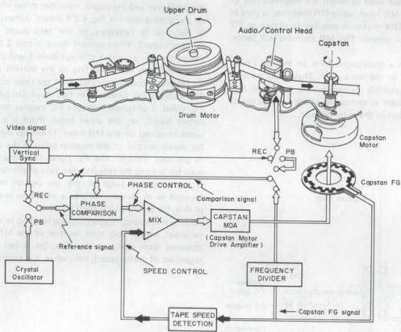

*Fig. 4-2-6 Capstan servo loop*

|  Control Signal Modes | CAPSTAN SERVO  |   |
| --- | --- | --- |
|   |  Reference signal | Comparison signal  |
|  REC | Video V. sync (30 Hz) | Capstan FG (30 Hz)  |
|  Playback | Crystal osc. (30 Hz) | Control (30 Hz)  |
|  Slow | Pulse drive  |   |

Table 4-2-3 Capstan servo control signal (NTSC)

|  Control Signal Modes | CAPSTAN SERVO  |   |
| --- | --- | --- |
|   |  Reference signal | Comparison signal  |
|  REC | Video V. sync (25 Hz) | Capstan FG (25 Hz)  |
|  Playback | Crystal osc. (25 Hz) | Control (25 Hz)  |
|  Slow | Pulse drive  |   |

Table 4-2-4 Capstan servo control signal (PAL/SECAM)
###### (1) Direct-drive capstan motor

## Construction

Fig. 4-2-7 is a cross-sectional view of the DD capstan motor. Six coils are arranged on the stator at intervals of $60^{\circ}$. Three Hall elements are attached between coils. The rotor consists of flywheel, rotor magnet, FG magnet and a capstan shaft. A ring-shaped ferrite magnet with 8 poles is used as the rotor magnet. The circuit board of the stator holds a capstan MDA circuit. The FG magnet is attached to the circumference of the ferrite rotor magnet. The FG magnet outputs an FG frequency to the capstan in the normal-speed playback.

As with the FG head used to detect the magnetic flux of the FG magnet, an MR head, using MR elements, is used in a similar manner. This makes it possible to obtain an FG output even at slow speeds. The MR elements will be explained later.

Six coils wound in a trapezoidal form on printed circuit boards are bonded to the stator unit. These coils are connected in pairs to provide 3-phase wiring, and three Hall elements are assembled at the center of the coils to detect the rotational position of the rotor magnet.

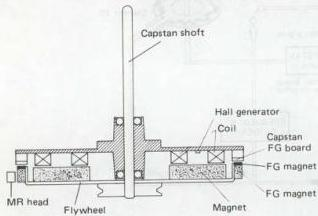

*Fig. 4-2-7 Capstan motor*

## Principle of operation

Refer to the circuit diagram of the motor drive system in Fig. 4-2-8. As shown in this diagram, a motor drive amp and necessary circuits are attached to the capstan motor. As explained in the section "Construction", the drive system consists of three sets of stator coils, three Hall elements, a rotor magnet, an FG printed circuit board and an FG magnet. An MR head is externally connected to the FG magnet.

Outputs of the Hall elements, HG-1, 2, 3 are fed to the coil current control circuit via the Hall generator amp as position signals. The Hall generator amp is a differential amp. The output of the coil current control circuit is applied to the pre-driver and the power transistor driver circuit.

As the timing chart in Fig. 4-2-8 shows, current in each coil is switched in reference to the zero point of the Hall element output. When current flows in coil 3 for example, the current is grounded through coils 1 and 2. Therefore, magnetic fields corresponding to the current in each coil are produced and effect rotation of the rotor magnet.

The capstan FG functions in two ways. On one hand, the FG signal is obtained from the FG magnet through the FG circuit board; on the other hand, there is a capstan FG signal obtained by the MR head. These FG signals are used for speed control of the capstan servo in the same way as in previous models. The FG signal from the MR head is used for judging the rotating direction of the capstan motor. It is necessary to judge whether the capstan motor rotates forward or in reverse, even at a very slow speed. Because of this, the MR head has been adopted.

While conventional magnetic heads respond to the magnetic variation within unit time, output of the MR element is obtained from the magnetic flux. So, it can be obtained regardless of motor speed, even when it is extremely low.

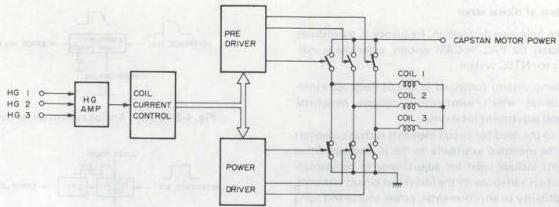

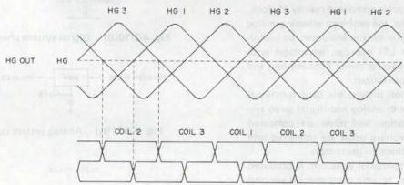

*Fig. 4-2-8 Capstan motor drive*

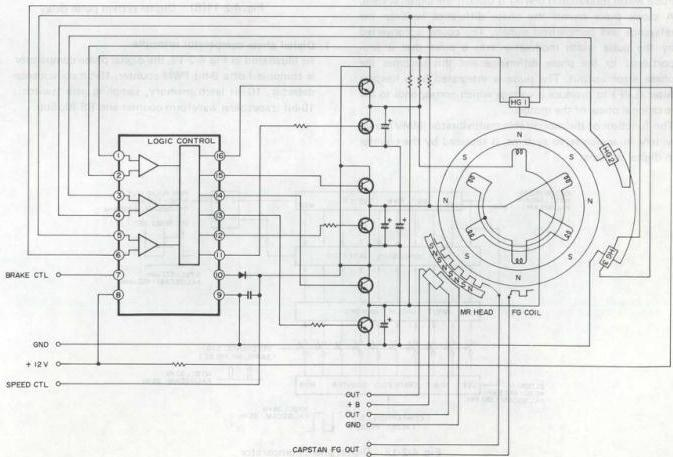

*Fig. 4-2-9 Capstan MDA circuit*
#### 4.2.2 Base of digital servo

Note: In the following description, frequency in parentheses indicates for PAL/SECAM system, otherwise it indicates for NTSC system.

A digital servo system contained in an LSI (large scale integration) device which substantially reduces peripheral circuitry and adjustment locations.

ficult due to the need for circuit elements such as capacitors that must be mounted externally to the IC package. Other weak points include need for adjustments to compensate for production variations in the individual circuit elements, and susceptibility to environmental, power source and aging conditions.

Since the digital servo system is composed mainly of clock, counter and memory circuits, the problems affecting analog systems are avoided in large measure. Moreover, by including the system within an LSI package, advantages with respect to compact size, reduced power consumption and cost/performance can also be realized.

Although circuit composition differs, the basic functional concept is the same for both analog and digital servo systems. Namely, motor rotation and phase are compared with references and the resulting errors are converted into voltages and applied as feedback to the motor.

In the analog system, a trapezoidal waveform is produced as the comparison signal and its ramp component is sampled by the reference signal to yield a voltage which charges a capacitor. This results in the phase error output.

Pulse width modulation (PWM) is used in the digital system. A clock pulse counts the phase difference between the reference and comparison signals. The count is converted by the pulse width modulator into a pulse that is proportional to the phase difference and this becomes the phase error output. The pulse is integrated by a lowpass filter (LPF) to produce a voltage which corresponds to the rotational phase of the motor.

The function of the monostable multivibrator (MMV), used widely in analog servo systems, is replaced by the counter in digital systems.

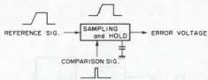

*Fig. 4-2-10(A) Analog system phase detection*

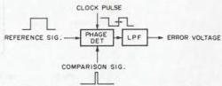

*Fig. 4-2-10(B) Digital system phase detection*

*Fig. 4-2-11(A) Analog system pulse delay*

*Fig. 4-2-11(B) Digital system pulse delay*

##### 1. Digital phase comparator principle

As illustrated in Fig. 4-2-12, the digital phase comparator is composed of a 9-bit PWM counter, 10-bit coincidence detector, 10-bit latch memory, sampling gate (switch), 10-bit trapezoidal waveform counter and RS flipflop.

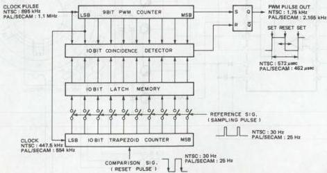

*Fig. 4-2-12 Digital phase comparator*

The 9-bit PWM counter sends a set pulse to the RS flip-flop at 0000000000. Since a 895 kHz (1.1 MHz) clock pulse is employed, the set period is 1/895 kHz x 512 = approx. 572 microseconds (1/1.1 MHz x 512 = approx. 462 microseconds). Therefore, the pulse repetition frequency is 1/572 (1/462) microseconds or approximately 1.75 kHz (2.165 kHz).

The 10-bit coincidence detector compares the bit data from the 9-bit PWM counter and clock pulse (total 10 bits) with the bit data of the 10-bit latch memory. When the data are equal, the reset pulse is sent to the RS flip-flop.

During the sampling pulse input, the 10-bit latch memory stores the bit data from the 10-bit trapezoidal waveform counter.

The sampling gate (switch) is open (ON) during the sampling pulse input.

After the reset pulse input, the 10-bit trapezoidal waveform counter counts the 447.5 kHz (554 kHz) clock pulse, starting from 0000000000. The time required to count from 0000000000 to 1111111111 is 1/477.5 kHz x 1024 = approx. 2.3 milliseconds (1/554 kHz x 1024 = approx. 1.85 milliseconds), which is comparable to the trapezoid ramp period in the analog system.

As can be noted from the foregoing, the digital phase comparator also utilizes the concept of a trapezoidal waveform. However, since neither the trapezoidal waveform nor its relationship to the servo phase can be observed, it is referred to as an "imaginary" trapezoid.

The ramp of the imaginary trapezoid starts at the comparison signal falling edge. After the comparison signal resets the 10-bit trapezoidal waveform counter, the counter counts the 447.5 kHz (1.85 kHz) clock pulse from 0000000000 to 1111111111 in 1024 steps.

During servo lock, the sampling pulse input, which is the reference signal, is applied at 1000000000 counter value. This corresponds to the center of the imaginary trapezoid ramp.

The 9-bit PWM counter continues to count the 895 kHz (1.1 MHz) clock pulse, regardless of the reference and comparison signals. When the counter reaches 0000000000, the set pulse is sent to the RS flipflop. At this time, the PWM pulse is high. The count continues and at 1000000000, the data equal to those of the 10-bit latch memory. The coincidence detector sends the reset pulse to the RS flipflop and the PWM pulse is low. Again, the PWM counter registers 0000000000 and the PWM pulse is high. The PWM pulse duty ratio does not change until the next sampling pulse input and the latch memory data are rewritten.

When the sampling pulse is not positioned at the center of the imaginary trapezoid ramp, the PWM pulse duty ratio varies according to the amount of deviation, as indicated in Fig. 4-2-13.

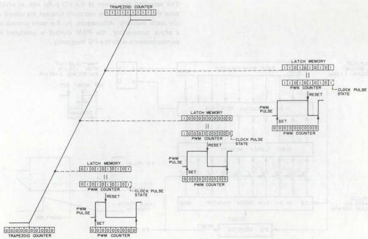

*Fig. 4-2-13 Imaginary trapezoid and PWM pulse*

##### 2. Digital speed detector

Circuit composition is nearly the same as the phase comparator. A differing point is that after the comparison signal resets the counter, the comparison signal itself is used for sampling.

For reference, Fig. 4-2-14(A) illustrates the principle of the analog type speed detector. In this system, the frequency generator (FG) signal obtained from motor rotation is converted into the FG pulse and applied to the speed detector. The speed detector is composed of sawtooth generator, sampling and hold circuits.

The sawtooth generator produces a discharging pulse from the FG pulse rise. The sawtooth waveform is produced from this pulse and sent to the sampling and hold circuit. The FG pulse is also supplied to the sampling and hold circuit. At the FG pulse rise, the sawtooth waveform is sampled and gated. The resulting voltage charges a capacitor and the speed error voltage is obtained.

When the motor speed varies, the time between rising edges of the FG pulse also varies. As this time increases, since the sawtooth generator charging time also increases, the peak potential of the sawtooth waveform becomes higher. Conversely, decreased charging time results in a lower peak potential.

The peak potential of the sawtooth signal is gated at the sampling and hold circuit to yield the speed error voltage output that is inversely proportional to the FG pulse frequency.

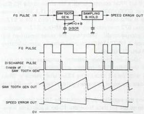

*Fig. 4-2-14(A) Analog type speed detector*

Operating frequency of the speed detector is determined by the time constant CR of the sawtooth generator. Therefore, adjustment is required to compensate for unavoidable production variations in the individual components.

The basic concept of the digital speed detector is the same, however, it features excellent stability and does not require adjustment. Instead of utilizing the sawtooth waveform, the digital value is employed. Fig. 4-2-14(B) shows an outline of the digital speed detector.

The FG counter begins counting at the FG pulse falling edge and after reaching a predetermined value, the 10-bit sawtooth counter is reset and begins counting.

The sampling gate opens at the FG pulse rise, at which time the contents of the sawtooth counter are stored in the latch memory. Afterwards, by the same process as a phase comparator, the PWM output is produced in correspondence with the FG frequency.

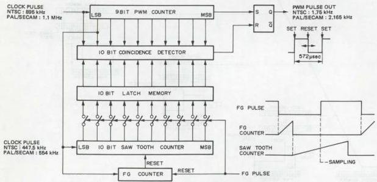

*Fig. 4-2-14(B) Digital speed detector*
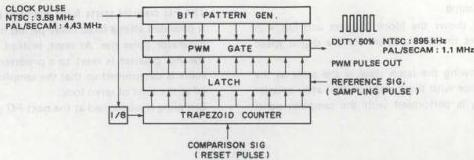

*Fig. 4-2-15(A)*

##### 3. Bit pattern generator

Pulse width modulation is performed using a bit pattern generator due to the high frequency. This is outlined in Fig. 4-2-15(A).

The process up to phase data latch is the same as previously described, while the PWM pulse generator section differs. Although processing is 10 bits, for clarity, Figs. 4-2-15(C) and 4-2-15(D) illustrate the principle for 3 bits. Bit patterns Q0, Q1 and Q2 are produced from the 3.58 MHz (4.43 MHz) clock pulse. These are supplied to the AND circuit of the PWM gate block. Since the latched phase difference data are also supplied to the AND circuit, the gated bit patterns are produced.

These become the PWM pulse output through the next stage OR gate. Relationships of the bit patterns, phase difference data and PWM pulse are shown in Fig. 4-2-15(D).

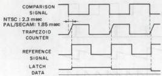

*Fig. 4-2-15(B)*

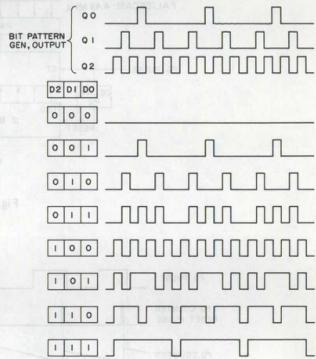

*Fig. 4-2-15(D)*

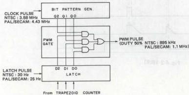

*Fig. 4-2-15(C)*
##### 4. Speed detect timing

Fig. 4-2-16(A) shows the block diagram and Fig. 4-2-16(B) illustrates the timing chart for the digital speed detector.

Operation following the latch stage is the same as the phase comparator with the exception that after counter reset, sampling is performed with the sampling signal itself.

The FG counter starts from the reset pulse input, which is provided after a fixed delay period from the frequency generator pulse rise. At reset, instead of returning to 0, the FG counter is reset to a predetermined value. This value is determined so that the sampling count is centered at the time of servo lock.

Sampling is performed at the next FG pulse rise.

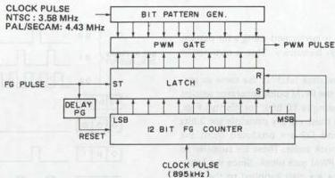

*Fig. 4-2-16(A)*

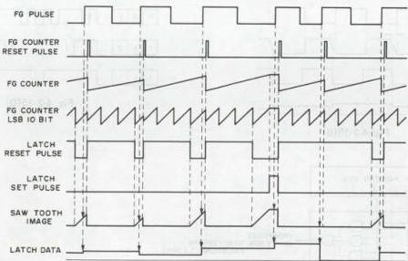

*Fig. 4-2-16(B)*

#### 4.2.3 Double azimuth head

##### 1. Double azimuth video head construction

The video heads are mounted on the upper drum as illustrated in Fig. 4-2-17. The SP CH-1 and EP (LP) CH-2 heads are separated by only 2 H with respect to the tape, while the SP CH-2 and EP (LP) CH-1 heads are similarly located in opposite positions at an angle of 180°.

At each side of the drum, CH-1 and CH-2 heads are mounted at nearly the same position. Since these are of opposite azimuth (+6° and -6° respectively), the configuration is termed double azimuth heads.

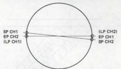

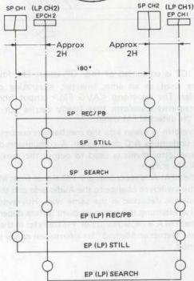

*Fig. 4-2-17 DA4 head*

##### 2. Video head selection system

The SP CH-1 and CH-2 heads are used for SP mode recording and playback. Still operation during the SP mode utilizes the SP CH-2 and EP (LP) CH-2 heads to perform field still. During frame advance when the tape is moved, the playback FM level is detected and the four heads are switched.

Since Slow, Still and Frame Advance are performed continuously, when the tape is stopped, the SP CH-2 and EP (LP) CH-2 heads are used and when the tape is moving, the four heads are used.

All four heads are employed during SP mode Search. The head with the largest PB FM level is selected in sequence for playback.

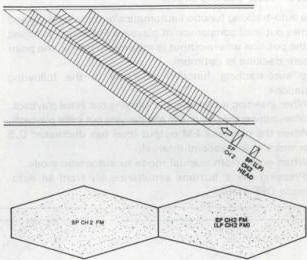

*Fig. 4-2-18*

Fig. 4-2-19 illustrates the relationship between the head path and FM signal during Search Reverse. Due to azimuth loss, the playback FM signal from each head assumes a diamond shaped pattern as shown in the figure. Previously, bar noise resulted from the FM signal level drop. But with the double azimuth system, when the PB FM signal of one head is at minimum, the other is at maximum. By appropriate switching of the two heads, the PB FM signal can be obtained without loss. In practice, selection is performed by comparing the signal levels and the higher level is sent to the succeeding circuits.

The EP CH-1 and EP (LP) CH-2 heads are used for EP (LP) mode recording and playback. Field still is performed in the EP (LP) mode by using the EP (LP) CH-1 and SP CH-1 heads. The four heads are used while the tape is moving during Frame Advance and Slow, in the same manner as the SP mode.

In the EP (LP) mode Search, the EP (LP) CH-1 and EP (LP) CH-2 heads are employed. Although several noise bars appear, since the head width is slightly larger than minimal, the noise bars are narrow. The capstan servo lock also functions to stabilize the bar noise position and provide acceptable viewability.

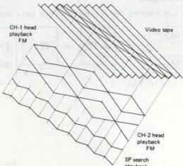

*Fig. 4-2-19*
#### 4.2.4 Auto-tracking circuit

The auto-tracking function automatically shifts tracking and carries out level comparison of playback FM output to adjust to the position where output is maximum, that is, the point where tracking is optimum.

The auto-tracking function operates in the following situations.

- When inserting a cassette and carrying out initial playback.
- When turning the power ON and carrying out initial playback.
- When the playback FM output level has decreased 0.5 or more in a 2 second interval.
- When going from manual mode to automatic mode. (Pressing the ± buttons simultaneously from an auto-mode OFF state.)

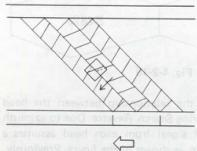

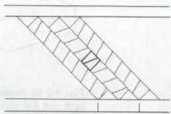

*Fig. 4-2-20 Tape pattern*

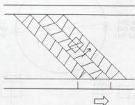

##### 2. Description of circuits

As Fig. 4-2-21 below shows, the FM audio side is selected in the auto tracking circuit and the playback FM output is constantly monitored. When the level descends below a value taken to be the comparative standard, auto-tracking operations begin again.

A more concrete description of functions in the circuit is as follows. First, a DOC signal is used to judge whether FM Audio is recorded or not. If FM Audio is recorded, the playback FM output of FM A is monitored so that the switch goes to Video when the unit enters auto tracking and Video playback FM is selected. If there is no FM A recording, the switch is forcibly retained on the video side. Since the Video signal (playback FM output) that is supplied does not require a color element for level comparison, the color element is eliminated in "HPF".

Next, there is FM wave detection and this output is input to IC2. IC2 is composed of four OP amps. The four OP amps are used as an amp, inverter, integrating circuit and buffer. The waveform <avg fm=""> output from IC2 is an integrated waveform that finally carries out D FF reset on the detected FM signal.

This waveform is taken into the mechanism control CPU where it undergoes A/D conversion. A comparison of the former and latter levels is used to output the maximum playback FM output.

Next, when FM A is recorded, a V FM signal from M-CTL causes the switch to change to the Audio side and the optimum point is detected in the same way. However, the method for selecting the optimum point differs depending on whether FM A is recorded or not. Please refer to the next section on "Detection Method" for information on the selection method.

##### 3. Block diagram

* The auto-tracking circuit is included in a servo circuit.

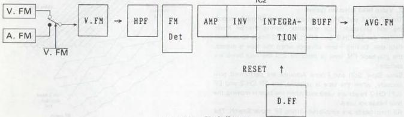

*Fig. 4-2-21 Block diagram*

4-16</avg>

##### 3. Detection method

All aspects of auto-tracking detection are managed by the M-CTL CPU.

First, when auto-tracking begins, the tracking is automatically shifted. One shifting step is equal to approximately 0.465 msec (this makes a division into about 86 equal parts of the D. FF 1 cycle)

Thus, the M-CTL CPU compares the playback FM output level each time the tracking is shifted a step at a time to detect the position where output is maximum. This makes it possible to adjust the tracking to the optimum point.

Fig.4-2-22 is a simple visual representation of the detection method. Fr reference Fig. 4-2-23 shows the configuration for changes in the playback FM output when the tracking is shifted.

The M-CTL CPU takes in the shifting distance (position) and output level when the tracking is shifted. Next it compares the data obtained when shifting one step and also compares size. If the values are larger for data when the tracking is shifted one step, that position and the output level are re-stocked and the unit proceeds to the next in repeating data comparison. There are three patterns when carrying out data comparison.

For the sake of the discussion, the data which is stocked is called “A” and the data that is compared (after shifting one step) is called “B”.

1.  A &lt; B  &lt; α &gt;
In this case, the data is renewed and data “B” is stocked.

2.  A = B  &lt; β &gt;
In this case, data “A” is maintained.

3.  A &gt; B  &lt; γ &gt;
In this case, data “A” is maintained and there is data comparison until the difference in the playback FM output for “A” and “B” produces 0.5 V.

If we seek the optimum point under the conditions described above as found in the case shown figure below Fig. 4-2-22 we see that when there is only a Video signal the optimum tracking point is between B and C where the output level is constant. For this reason, any position can be selected as long as it is between B and C. In the program, however, it is designed to adjust to the center between the detected data. Thus, if position E is selected and the timing is controlled in order to come to this position, the tracking will be in optimum state.

As shown in the section on tracking adjustment on the next page, the method of controlling the timing involves output from the M-CTL CPU to the servo circuit using serial data. As the figure shows, if FM A is recorded, it is searched for between B and C that were derived with the Video signal and this is the point where FM A is optimum in this case position.

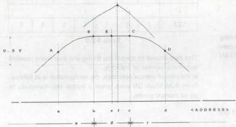

*Fig. 4-2-22 Curve*

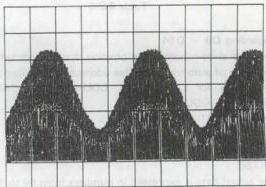

*Fig. 4-2-23 AVG FM (playback FM)*

##### 5. Tracking adjustment

Conventional tracking adjustment by manual control. An adjustment button is pressed after which the information is taken in by the M-CTL CPU. The M-CTL CPU selects a command based on the contents of the information to send this to the servo circuit as 16 bits of serial data and actually carry out adjustment.

Refer to Table 4-2-5 regarding commands.

|  1 | 2 | 3 | 4 | 5 | 11 | 12 | 13 | 14 | 15 | 16 | MODE  |
| --- | --- | --- | --- | --- | --- | --- | --- | --- | --- | --- | --- |
|   |  |  |  | 0 | 0 | 0 | 0 | 1 | 1 | 1 | REMOTE TR. HOLD  |
|   |  |  |  | 0 | 1 | 0 | 1 | 1 | 1 | 1 | REMOTE TR. UP (+)  |
|   |  |  |  | 1 | 0 | 0 | 1 | 1 | 1 | 1 | REMOTE TR. DOWN (-)  |
|   |  |  |  | 1 | 1 | 0 | 1 | 1 | 1 | 1 | REMOTE TR. P. SET  |

Table 4-2-5
##### 6. Capstan servo PB timing chart

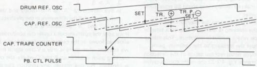

*Fig. 4-2-24 Capstan servo PB timing chart*

However, since this equipment makes use of an auto-tracking system, different commands are used. See Table 4-2-6 below.

|  15 | 14 | 13 | 12 | 11 | 10 | 9 | 8 | 3 | 2 | 1 | 0 | MODE  |
| --- | --- | --- | --- | --- | --- | --- | --- | --- | --- | --- | --- | --- |
|   | • | • | • | • | • | • | • |  | 1 | 1 | 1 | REMOTE TR. DATA  |

## Table 4-2-6

### Regarding DB - D14:

The data shown here is the position that is recorded during operation of auto-tracking. This address data is used to control timing for CTL DELAY, COUNTER and CAPSTAN REFERENCE COUNTER.

See Fig. 4-2-21.

- NTSC
The actual data is expressed in numbers from 69 to 127 (86 steps). See Table 4-2-7.

|   | D 8 | D 9 | D 10 | D 11 | D 12 | D 13 | D 14  |
| --- | --- | --- | --- | --- | --- | --- | --- |
|  69 | 1 | 0 | 0 | 1 | 0 | 1 | 0  |
|  ↓ | ↓  |   |   |   |   |   |   |
|  127 | 1 | 1 | 1 | 1 | 1 | 1 | 1  |

## Table 4-2-7

|  124 | 125 | 126 | 127 | 69 | 70 | 71 | 72 | ... (NTSC)  |
| --- | --- | --- | --- | --- | --- | --- | --- | --- |
|  124 | 125 | 126 | 127 | 41 | 42 | 43 | 44 | ... (PAL/SECAM)  |

## •PAL/SECAM

The actual date is expressed in numbers from 41 to 127 (86 steps). See Table 4-2-8

|   | D 8 | D 9 | D 10 | D 11 | D 12 | D 13 | D 14  |
| --- | --- | --- | --- | --- | --- | --- | --- |
|  41 | 1 | 0 | 0 | 1 | 0 | 1 | 0  |
|  ↓ | ↓  |   |   |   |   |   |   |
|  127 | 1 | 1 | 1 | 1 | 1 | 1 | 1  |

## Table 4-2-8

This data is used to control the timing and thus make possible automatic control of tracking.

In the case of manual operation, the configuration is as follows. From Auto Mode ON state, press ± button simultaneously to go to manual mode.
7. System block diagram
- Example: HR-D950PAL

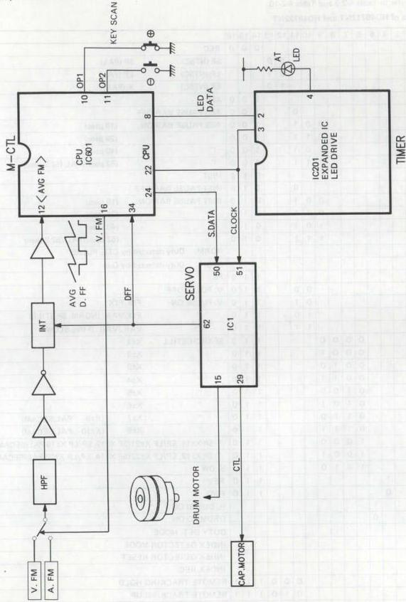

*Fig. 4-2-25 System block diagram*

#### 4.2.5 Serial data

Servo data is 16-bit serial data transmitted between the mechacon IC and the servo IC.

For detail, refer to Table 4-2-9 and Table 4-2-10.

1. Serial data of HD49712NT and HD49722NT

|   | 1 | 2 | 3 | 4 | 5 | 6 | 7 | 8 | 9 | 10 | 11 | 12 | 13 | 14 | 15 | 16 |   |
| --- | --- | --- | --- | --- | --- | --- | --- | --- | --- | --- | --- | --- | --- | --- | --- | --- | --- |
|   |  |  |  |  |  |  |  |  |  |  |  |  |  | 0 | 0 | 0 | REC  |
|   |  |  |  |  |  |  |  |  |  |  |  | 0 | 0 |  |  |  | SP (NTSC) SP (PAL)  |
|   |  |  |  |  |  |  |  |  |  |  |  | 0 | 1 |  |  |  | LP (NTSC) LP (PAL)  |
|   |  |  |  |  |  |  |  |  |  |  |  | 1 | 0 |  |  |  | EP (NTSC) X (PAL)  |
|   |  |  |  |  |  |  |  |  |  |  |  |  |  | 1 | 0 | 0 | ASB  |
|   |  |  |  |  |  |  |  |  |  |  | 0 |  |  | 1 | 0 | 0 | ASB PAUSE BAR OFF  |
|   |  |  |  |  |  |  |  |  | 0 | 0 | 1 |  |  | 1 | 0 | 0 | ASB PAUSE BAR ON (18 μsec)  |
|   |  |  |  |  |  |  |  |  | 0 | 1 | 1 |  |  | 1 | 0 | 0 | " " (29 μsec)  |
|   |  |  |  |  |  |  |  |  | 1 | 0 | 1 |  |  | 1 | 0 | 0 | " " (40 μsec)  |
|   |  |  |  |  |  |  |  |  | 1 | 1 | 1 |  |  | 1 | 0 | 0 | " " (52 μsec)/PAL (52.2 μsec)  |
|   |  |  |  |  |  |  |  |  |  |  |  |  |  | 0 | 1 | 0 | INST  |
|   |  |  |  |  |  |  |  |  |  |  | 0 |  |  | 0 | 1 | 0 | INST PAUSE BAR OFF  |
|   |  |  |  |  |  |  |  |  | 0 | 0 | 1 |  |  | 0 | 1 | 0 | INST PAUSE BAR ON (18 μsec)  |
|   |  |  |  |  |  |  |  |  | 0 | 1 | 1 |  |  | 0 | 1 | 0 | " " (29 μsec)  |
|   |  |  |  |  |  |  |  |  | 1 | 0 | 1 |  |  | 0 | 1 | 0 | " " (40 μsec)  |
|   |  |  |  |  |  |  |  |  | 1 | 1 | 1 |  |  | 0 | 1 | 0 | " " (52 μsec)/PAL (52.2 μsec)  |
|   | 0 |  |  |  |  |  |  |  |  |  |  |  |  |  |  |  | NORM. Duty detected by CTL. PULSE  |
|   | 1 |  |  |  |  |  |  |  |  |  |  |  |  |  |  |  | STOP Duty detected by Q in  |
|   |  |  |  |  |  |  |  |  |  |  |  |  |  | 1 | 1 | 0 | PB  |
|   |  |  |  |  |  |  |  |  |  | 0 | 0 |  |  | 1 | 1 | 0 | V. PULSE OFF  |
|   |  |  |  |  |  |  |  |  |  | 0 | 1 |  |  | 1 | 1 | 0 | V. PULSE ON FIX/FIX  |
|   |  |  |  |  |  |  |  |  |  | 1 | 0 |  |  | 1 | 1 | 0 | " FIX/VAR. (NORM. SP STILL)  |
|   |  |  |  |  |  |  |  |  |  | 1 | 1 |  |  | 1 | 1 | 0 | " VAR./VAR. (FINE SLOW)  |
|   |  |  |  |  | 0 | 0 | 0 | 0 |  |  |  |  |  | 1 | 1 | 0 | SEARCH/STILL X±1  |
|   |  |  |  |  | 0 | 0 | 0 | 1 |  |  |  |  |  | 1 | 1 | 0 | " X±2  |
|   |  |  |  |  | 0 | 0 | 1 | 0 |  |  |  |  |  | 1 | 1 | 0 | " X±3  |
|   |  |  |  |  | 0 | 0 | 1 | 1 |  |  |  |  |  | 1 | 1 | 0 | " X±4  |
|   |  |  |  |  | 0 | 1 | 0 | 0 |  |  |  |  |  | 1 | 1 | 0 | " X±5  |
|   |  |  |  |  | 0 | 1 | 0 | 1 |  |  |  |  |  | 1 | 1 | 0 | " X±6  |
|   |  |  |  |  | 0 | 1 | 1 | 0 |  |  |  |  |  | 1 | 1 | 0 | " X±7 (X±9 PAL/SECAM)  |
|   |  |  |  |  | 0 | 1 | 1 | 1 |  |  |  |  |  | 1 | 1 | 0 | " X±8 (X±10 PAL/SECAM)  |
|   |  |  |  |  | 1 | 0 | 0 | 0 |  |  |  |  |  | 1 | 1 | 0 | " SP X±11, EP/LP X±21 (SP X±13, EP/LP X±19 PAL/SECAM)  |
|   |  |  |  |  | 1 | 0 | 0 | 1 |  |  |  |  |  | 1 | 1 | 0 | " SP X±12, EP/LP X±22 (SP X±14, EP/LP X±20 PAL/SECAM)  |
|   |  |  |  |  | 1 | 0 | 1 | 0 |  |  |  |  |  | 1 | 1 | 0 | SLOW  |
|   |  |  | 1 |  |  |  |  |  |  |  |  |  |  | 1 | 1 | 0 | REV  |
|   |  |  | 0 |  |  |  |  |  |  |  |  |  |  | 1 | 1 | 0 | FWD  |
|   |  |  |  | 1 |  |  |  |  |  |  |  |  |  |  |  |  | H. DISCRI ON  |
|   |  |  |  | 0 |  |  |  |  |  |  |  |  |  |  |  |  | DRUM PD ON  |
|  0 | 0 |  |  |  |  |  |  |  |  |  |  |  |  |  |  |  | DUTY DET. MODE  |
|  0 | 1 |  |  |  |  |  |  |  |  |  |  |  |  |  |  |  | INDEX DETECTOR MODE  |
|  1 | 0 |  |  |  |  |  |  |  |  |  |  |  |  |  |  |  | INDEX DETECTOR RESET  |
|  1 | 1 |  |  |  |  |  |  |  |  |  |  |  |  |  |  |  | INDEX REC  |
|   |  |  |  |  |  |  |  |  |  |  | 0 | 0 | 0 | 1 | 1 | 1 | REMOTE TRACKING HOLD  |
|   |  |  |  |  |  |  |  |  |  |  | 0 | 1 | 0 | 1 | 1 | 1 | REMOTE TRACKING UP  |
|   |  |  |  |  |  |  |  |  |  |  | 1 | 0 | 0 | 1 | 1 | 1 | REMOTE TRACKING DOWN  |
|   |  |  |  |  |  |  |  |  |  |  | 1 | 1 | 0 | 1 | 1 | 1 | REMOTE TRACKING P. SET (POWER OFF)  |

4-20 Table 4-2-9 Serial data of HD49712NT and HD49722NT

2. Serial data of HD49733NT

|  15 | 14 | 13 | 12 | 11 | 10 | 9 | 8 | 7 | 6 | 5 | 4 | 3 | 2 | 1 | 0 | COMMAND  |
| --- | --- | --- | --- | --- | --- | --- | --- | --- | --- | --- | --- | --- | --- | --- | --- | --- |
|   |  |  |  |  |  |  |  |  |  |  |  |  | 0 | 0 | 0 | SP  |
|   |  |  |  |  |  |  |  |  |  |  |  |  | 1 | 0 | 0 | EP  |
|   |  |  |  |  |  |  |  |  |  | 0 | 0 | 0 |  |  | 0 | REC  |
|   |  |  |  |  |  |  |  |  | 0 | 0 | 1 | 0 |  |  | 0 | ASB  |
|   |  |  |  |  |  | * | * |  | 1 | 0 | 1 | 0 |  |  | 0 | ASB (PAUSE BAR ON) (* is BAR length.)  |
|   |  |  |  |  |  |  |  |  | 0 | 1 | 0 | 0 |  |  | 0 | INST  |
|   |  |  |  |  |  | * | * |  | 1 | 1 | 0 | 0 |  |  | 0 | INST (PAUSE BAR ON) (* is BAR length.)  |
|  |   |   |   |   |   |   |   |   |   |   |   |   |   |   |   |   |
|   |  |  |  |  |  |  |  |  | 0 | 0 | 0 | 1 |  |  | 0 | PB V. PULSE OFF  |
|   |  |  |  |  |  |  |  |  | 0 | 0 | 1 | 1 |  |  | 0 | PB V. PULSE ON FIX/FIX  |
|   |  |  |  |  |  |  |  |  | 0 | 1 | 0 | 1 |  |  | 0 | PB V. PULSE ON FIX/VAR  |
|   |  |  |  |  |  |  |  |  | 0 | 1 | 1 | 1 |  |  |  | PB V. PULSE ON VAR./VAR.  |
|   |  |  |  |  |  |  |  |  | 1 | 0 | 0 | 1 |  |  | 0 | PB MONITOR OFF VP. out = H  |
|   |  |  |  |  |  |  |  |  | 1 | 0 | 1 | 1 |  |  | 0 | PB MONITOR OFF VP. out = M  |
|   |  |  |  |  |  |  |  |  | 1 | 1 | 0 | 1 |  |  | 0 | PB MONITOR OFF VP. out = M  |
|   |  |  |  |  |  |  |  |  | 1 | 1 | 1 | 1 |  |  | 0 | PB MONITOR OFF VP. out = M  |
|   |  |  |  |  |  |  |  |  | 0 |  |  | 1 |  |  | 0 | DRUM PD ON  |
|   |  |  |  |  |  |  |  |  | 1 |  |  | 1 |  |  | 0 | DRUM PD OFF  |
|  |   |   |   |   |   |   |   |   |   |   |   |   |   |   |   |   |
|   |  |  |  | 0 | 0 | 0 | 0 |  |  |  |  | 1 |  |  | 0 | SEARCH/STILL X1  |
|   |  |  |  | 0 | 0 | 0 | 1 |  |  |  |  | 1 |  |  | 0 | X2  |
|   |  |  |  | 0 | 0 | 1 | 0 |  |  |  |  | 1 |  |  | 0 | " X3  |
|   |  |  |  | 0 | 1 | 0 | 0 |  |  |  |  | 1 |  |  | 0 | " SP X5, EP X7  |
|   |  |  |  | 0 | 1 | 1 | 0 |  |  |  |  | 1 |  |  | 0 | " SP X7, EP X13  |
|   |  |  |  | 1 | 0 | 0 | 0 |  |  |  |  | 1 |  |  | 0 | " EP X21  |
|   |  |  |  | 1 | 1 | 1 | 0 |  |  |  |  | 1 |  |  | 0 | SLOW (1) CAP PD FIX  |
|   |  |  |  | 1 | 1 | 1 | 1 |  |  |  |  | 1 |  |  | 0 | SLOW (2) CAP PD FIX, DRUM PD FIX  |
|  |   |   |   |   |   |   |   |   |   |   |   |   |   |   |   |   |
|   |  |  | 0 |  |  |  |  |  |  |  |  |  |  |  | 0 | FWD  |
|   |  |  | 1 |  |  |  |  |  |  |  |  |  |  |  | 0 | REV  |
|  |   |   |   |   |   |   |   |   |   |   |   |   |   |   |   |   |
|  0 | 0 | 0 |  |  |  |  |  |  |  |  |  |  |  |  | 0 | DUTY DET MODE  |
|  0 | 0 | 1 |  |  |  |  |  |  |  |  |  |  |  |  | 0 | DUTY DET MODE, INDEX REC FF RESET  |
|  0 | 1 | 0 |  |  |  |  |  |  |  |  |  |  |  |  | 0 | INDEX MODE  |
|  0 | 1 | 1 |  |  |  |  |  |  |  |  |  |  |  |  | 0 | INDEX MODE, INDEX REC FF RESET  |
|  1 | 0 | 0 |  |  |  |  |  |  |  |  |  |  |  |  | 0 | INDEX MODE, INDEX DET. FF RESET  |
|  1 | 0 | 1 |  |  |  |  |  |  |  |  |  |  |  |  | 0 | INDEX MODE, INDEX DET./REC FF RESET  |
|  1 | 1 | 0 |  |  |  |  |  |  |  |  |  |  |  |  | 0 | INDEX MODE, INDEX RESET  |
|  1 | 1 | 1 |  |  |  |  |  |  |  |  |  |  |  |  | 0 | WRITE MODE, INDEX REC FF RESET  |
|  MSB |   |   |   |   |   |   | LSB |   |   |   |   |   |  |  |  |   |
|  * | * | * | * | * | * | * | * |  |  |  |  | 1 | 1 | 1 | PB TRACKING DATA  |   |
|  |   |   |   |   |   |   |   |   |   |   |   |   |   |   |   |   |
|   |  |  |  |  |  |  |  |  |  |  |  |  |  |  |  | MODE OUTPUT CTL  |
|   |  |  |  |  |  |  |  |  |  |  |  |  |  |  |  | x B  |
|  0 |  |  |  |  |  |  |  | 0 |  | 0 | 0 | 1 | 1 | 1 | SP X2 | SP X2  |
|  0 |  |  |  |  |  |  |  | 0 |  | 0 | 1 | 1 | 1 | 1 | SP | SP  |
|  0 |  |  |  |  |  |  |  | 0 |  | 1 | 0 | 1 | 1 | 1 | SP | SP  |
|  0 |  |  |  |  |  |  |  | 0 |  | 1 | 1 | 1 | 1 | 1 | OSC H | CAP RET  |
|  |   |   |   |   |   |   |   |   |   |   |   |   |   |   |   |   |
|  * | * | * | * | * | * | * | * |  |  |  |  | 0 | 1 | 1 | REC CTL DELAY DATA  |   |
|  |   |   |   |   |   |   |   |   |   |   |   |   |   |   |   |   |
|   |  |  |  |  |  |  |  |  |  |  |  |  |  |  |  | REF SEL : NORMAL  |
|   |  |  |  |  |  |  |  |  |  |  |  |  |  |  |  | REF SEL : EXT. REF  |
|   |  |  |  |  |  |  |  |  |  |  |  |  |  |  |  | REF SEL : FIELD DET  |
|   |  |  |  |  |  |  |  |  |  |  |  |  |  |  |  | REF SEL : EXT. REF + FIELD DET  |
|  |   |   |   |   |   |   |   |   |   |   |   |   |   |   |   |   |
|   |  |  |  |  |  |  |  |  |  |  |  |  |  |  |  | CLOCK : 3fSC  |
|   |  |  |  |  |  |  |  |  |  |  |  |  |  |  |  | CLOCK : fSC  |
|  |   |   |   |   |   |   |   |   |   |   |   |   |   |   |   |   |
|   |  |  |  |  |  |  |  |  |  |  |  |  |  |  |  | VP SEL : NORMAL  |
|   |  |  |  |  |  |  |  |  |  |  |  |  |  |  |  | VP SEL : +6H  |

Table 4-2-10 Serial data of HD49733NT

### 4.3 SERVO CIRCUIT DESCRIPTION

This section explains operations of the servo circuit employing HD49733NT of the up-to-date servo IC.

#### 4.3.1 Block diagram and pin function of HD49733NT

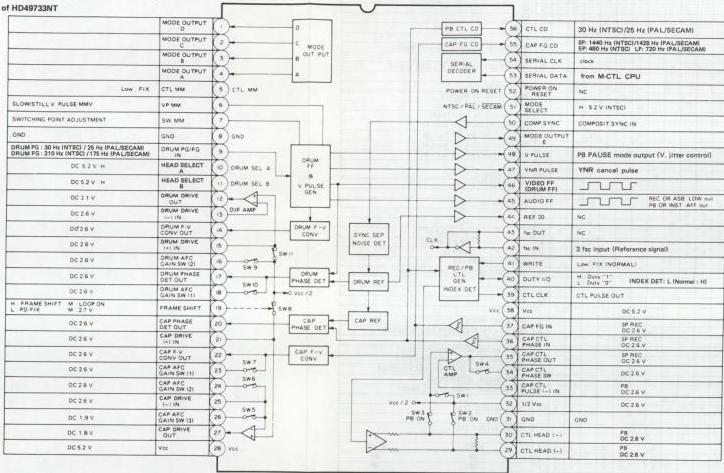

*Fig. 4-3-1 Block diagram and pin function of HD49733NT*

SW positions

|  *SW1 - SW3  |   |   |
| --- | --- | --- |
|   | REC | PB  |
|  SW1 | ON | OFF  |
|  SW2 | OFF | ON  |
|  SW3 | OFF | ON  |
|  * SW4
TAPE SPEED = 1: ON  |   |   |
| --- | --- | --- |
|  * SW5
SLOW STILL: ON  |   |   |
|  * SW6_SW7  |   |   |
| --- | --- | --- |
|  EWE | SW7 | NTSC SP  |
|  OFF | OFF | SLOW  |
|  OFF | ON | X1  |
|  OFF | ON | X1  |
|  ON | OFF | -  |
|  ON | ON | X7  |
|  * SW8
CAP P/D FIX: ON  |   |   |
| --- | --- | --- |
|  * SW9
SPECIAL PB: ON  |   |   |
|  * SW10
SPECIAL PB: ON  |   |   |
|  * SW11
DRUM P/D FIX: ON  |   |   |

#### 4.3.2 Servo timing chart of HD49733NT

Note: In the following description, frequency or time in parentheses indicates for PAL/SECAM system, otherwise it indicates for NTSC system.

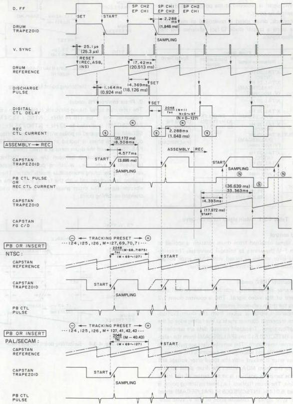

*Fig. 4-3-2 Servo timing chart of HD49733NT*

#### 4.3.3 Drum servo

The drum servo circuit functions to regulate speed and phase of the rotating head drum. In recording, the reference signal is taken from the input vertical sync signal, while the comparison signal is the drum flipflop. The vertical sync signal is recorded at the position 6.5 H from the head switching point.

During playback, drum speed is controlled to maintain a fixed rate using a crystal clock (3 fsc) reference and the drum flipflop signals.

|  Mode | Phase Servo |   | Speed Servo  |
| --- | --- | --- | --- |
|   |  Reference signal | Comparison signal  |   |
|  REC | X'TAL 30 Hz (NTSC)
X'TAL 25 Hz (PAL/SECAM)
(V. sync reset) | DRUM FF
30 Hz (NTSC)
25 Hz (PAL/SECAM) | DRUM FG
240 Hz (NTSC)
200 Hz (PAL/SECAM)  |
|  PB | X'TAL 30 Hz (NTSC)
X'TAL 25 Hz (PAL/SECAM)  |   |   |
|  ASSEMBLY | X'TAL 30 Hz (NTSC)
X'TAL 25 Hz (PAL/SECAM)
(V. sync reset)  |   |   |
|  INSERT | X'TAL 30 Hz (NTSC)
X'TAL 25 Hz (PAL/SECAM)
(V. sync reset)  |   |   |
|  SEARCH | COMPENSATION
(15.734 kHz : NTSC)
(15.625 kHz : PAL/SECAM)  |   |   |
|  SLOW STILL  |   |   |   |

Table 4-3-1 Main signal for drum servo

##### 1. Speed control

The FG signal obtained from drum rotation is applied to the drum F-V (frequency to voltage) converter. The resulting speed error voltage is mixed with phase error voltage and supplied to the drum motor drive amplifier.

##### 2. Phase control (REC mode)

The reference signal during recording is the vertical sync component of the video signal. This is counted down 1/2 and resets the drum reference counter.

The comparison signal is taken from the drum flipflop. The drum trapezoid counter starts at the falling edge of the drum flipflop signal. Trapezoid counter data are sampled at 17.42 ms (NTSC)/20.513 ms (PAL/SECAM) from the reference counter reset point. The sampled data are pulse width modulated (PWM) and smoothed to become a DC voltage.

This phase error is mixed with the speed error voltage and supplied to the drum MDA. When the drum phase servo is locked, the sampling position is at the center of the trapezoid incline. The drum flipflop, i.e., head switching point, is positioned 6.014 H (NTSC)/6.065 H (PAL/SECAM) ahead of the V. sync signal in consideration of the V. sync separator delay amount.

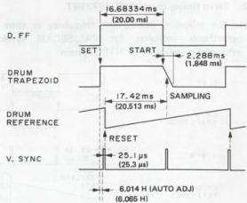

*Fig. 4-3-3 Switching point for recording*

##### 3. Phase control (PB mode)

The reference signal during playback is taken from a crystal oscillator. The 3 fsc (10.74 MHz : NTSC / 13.34 MHz : PAL/SECAM) is divided to 30 Hz : NTSC / 25 Hz : PAL/SECAM and compared in phase with the drum flipflop. The drum flipflop phase is locked at 30 Hz : NTSC / 25 Hz : PAL/SECAM and the drum turns at a fixed speed.

The phase relationship between the drum flipflop and playback V sync, i.e., switching point, is adjusted by varying the switching monostable multivibrator. The drum flipflop is synchronized with the falling edge of the multivibrator signal. The drum phase servo is able to track the changed switching point.

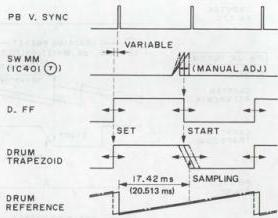

*Fig. 4-3-4 Switching point for playback*
#### 4.3.4 Capstan servo

In the recording mode, the capstan servo reference is the input crystal clock (3 fsc), while the capstan FG produces the comparison signal. These are used to control the capstan motor rotation.

During playback, the input clock signal (3 fsc) is the reference and the playback control pulse is the comparison signal. Capstan motor rotation is controlled to obtain the same phase relationship between the drum flipflop and control pulse as in recording. This ensures the channel 1 and 2 heads trace their correct tracks.

|  Mode | Phase Servo |   | Speed Servo  |
| --- | --- | --- | --- |
|   |  Reference signal | Comparison signal  |   |
|  REC | X'TAL 30 Hz (NTSC)
X'TAL 25 Hz (PAL/SECAM) | CAPSTAN FG 30 Hz (NTSC)
25 Hz (PAL/SECAM) | CAPSTAN FG
SP: 1440 Hz
LP: 720 Hz
EP: 480 Hz  |
|  PB | X'TAL 30 Hz (NTSC)
X'TAL 25 Hz (PAL/SECAM) | PB CTL PULSE
30 Hz (NTSC)
25 Hz (PAL/SECAM)  |   |
|  ASSEMBLY | X'TAL 30 Hz (NTSC)
X'TAL 25 Hz (PAL/SECAM)
(V. sync reset)  |   |   |
|  INSERT | X'TAL 30 Hz (NTSC)
X'TAL 25 Hz (PAL/SECAM)
(V. sync reset)  |   |   |
|  SEARCH | X'TAL 30 Hz (NTSC)
X'TAL 25 Hz (PAL/SECAM)
(D. FF reset) |   |   |
|  SLOW STILL | No operation |   |   |

Table 4-3-2 Main signal for capstan servo

##### 1. Speed control

The FG signal produced by capstan rotation is converted into a voltage corresponding to the frequency. This speed error voltage is mixed with the phase error voltage and supplied to the capstan MDA.

##### 2. Phase control (REC mode)

The 3 fsc (10.74 MHz : NTSC / 13.3 MHz : PAL/SECAM) crystal oscillator is divided to 30 Hz : NTSC / 25 Hz : PAL/SECAM by the reference counter and compared with 30 Hz : NTSC / 25 Hz : PAL/ECAM counted down from the capstan FG signal. The capstan trapezoid counter starts at the point 14.393 ms : NTSC / 18.126 ms : PAL/SECAM from the reference counter start. The trapezoid counter data are sampled at the falling edge of the FG signal.

The sampled data are pulse width modulated and smoothed to form a DC voltage. This phase error voltage is mixed with the speed error voltage and supplied to the capstan MDA. When the capstan phase servo is locked, the trapezoidal waveform is sampled at the center of the slanted component. The comparison signal, counted down from the FG signal, becomes 30 Hz : NTSC / 25 Hz : PAL/SECAM and the capstan motor turns at fixed speed.

The control signal is recorded in synchronization with the V. sync component of the video signal. The drum reference counter produces a discharge pulse at 14.393 ms : NTSC / 18.126 ms : PAL/SECAM from the reset point. This is delayed by a monostable multivibrator with time determined by 16 bit serial data from the mechacon. The signal is delayed an additional 2.288 ms : NTSC / 1.848 ms : PAL/SECAM and supplied to the control head for recording.

##### 3. Phase control (PB mode)

If the playback tape was recorded by the dame machine, the control signal timing is the same as with the drum flip-flop reference (see Fig. 4-3-5).

The capstan reference counter is reset at the falling edge of the digital delay monostable multivibrator, while the trapezoid counter starts at the falling edge of the reference counter. The positive component of the playback control pulse samples the trapezoid counter data. The data are pulse width modulated and smoothed to a DC voltage.

The resulting phase error voltage is mixed with the speed error voltage and supplied to the capstan MDA.

When the capstan phase servo is locked, sampling occurs at the center of the trapezoid slanted component. The PB control pulse timing equals that of recording and the recorded tracks are traced accurately.

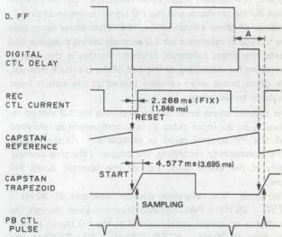

*Fig. 4-3-5 PB capstan phase comparison (REC then PB)*

If the playback tape was recorded by another set, differences in X value and control pulse timing lead to differences in the drum flipflop and control pulse phase (see Fig. 4-3-6). The mechacon can adjust the end of count timing by changing the initial data of the reference counter, which is reset by the monostable multivibrator. This is set to where data for the maximum playback FM signal are detected (digital tracking). The data can also be adjusted manually.
4-26.

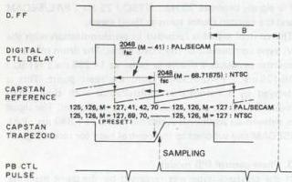

*Fig. 4-3-6 Capstan phase comparison (another set)*

#### 4.3.5 Assembly editing

When the Pause button is pressed in the REC mode, the mechacon counts the capstan FG pulse. The tape rewinds for 1.4 seconds and the Pause mode is entered. By then pressing the Play button, the capstan phase servo functions to align the recorded control pulse of the tape with the vertical sync component of the input video signal. The REC mode resumes without picture disturbance at the editing point. For assembly editing, the drum phase servo must change from crystal lock to V. sync lock at the editing point. Phase difference must also be absent between these signals. The capstan phase servo functions from the control pulse during playback and the FG signal during recording.

Because of these relationships, the drum phase servo uses the V. sync as reference for 1.3 seconds during playback and resets the drum reference counter. As this is the normal operation for recording, at the end of the playback interval, the drum phase servo remains locked at the switch from playback to recording.

The capstan phase servo is locked during the 1.3 second interval using the input video V. sync component as reference and the PB control pulse as comparison. At the change from playback to recording, the capstan reference counter starts at the initial pulse rise of the counted down FG signal.

Afterwards, the reference counter operates at $30\mathrm{Hz}$ : NTSC / 25 Hz : PAL/SECAM freerun. Even though the counter is no longer synchronized to the FG signal, since it free runs at $30\mathrm{Hz}$ : NTSC / 25 Hz : PAL/SECAM, the capstan phase servo remains locked at the change to normal recording. Therefore, although the reference signal changes, the phase is not disturbed.

#### 4.3.6 Insert editing

This refers to adding a video signal in the midst of a previously recorded tape.

During insert recording, the drum phase servo uses the input V. sync as reference and resets the reference counter. This is the same as normal recording. At the change to playback, disturbance can occur when switching the reference signal from V. sync to crystal clock.

However, when switching to normal playback, even though the reference counter reset from V. sync ceases, since the counter continues to run at $30\mathrm{Hz}$ : NTSC / 25 Hz : PAL/SECAM, the drum phase servo remains locked. Picture disturbance is thus avoided at the end of insert recording.

Similarly, the capstan phase servo is locked during insert recording with the input V. sync as reference and the PB control pulse as comparison. In the change to normal playback, even though the reference counter reset from V. sync ceases, since the counter continues to run at $30\mathrm{Hz}$ : NTSC / 25 Hz : PAL/SECAM, the capstan phase servo remains locked.

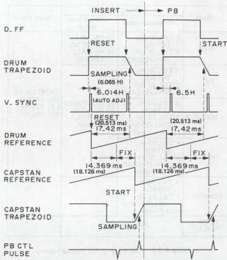

*Fig. 4-3-7 Insert editing*

#### 4.3.7 fh compensation

The normal playback drum rotation (30 Hz : NTSC / 25 Hz : PAL/SECAM) in the Search mode would produce a change in relative tape to head speed. This introduces a video signal frequency change corresponding to the relative speed difference, resulting in an unstable picture. The relative speed also changes in the Slow and Still modes due to capstan motor accelerates and stops. The drum phase comparator output voltage is therefore controlled in the Search, Slow modes to maintain the playback horizontal sync at $15.734\mathrm{Hz}$ : NTSC / 15.625 Hz : PAL/SECAM. Switch SW10 functions to increase the drum phase servo gain, while the drum reference counter is synchronized to the drum flipflop.

At the return to normal playback, SW9 switches on and the IC internal voltage (Vcc/2) charges an external capacitor. This serves to shorten the drum phase servo risetime when returning to normal playback.
#### 4.3.8 Auto discriminator

##### 1. Drum discriminator

SW11 switching on to set the drum phase servo to Vcc/2 in the following cases.

1) Drum speed declines more than 12% or increases more than 15.7%.
2) Signal absence is detected during fh compensation.

##### 2. Capstan discriminator

In the following situation, SW8 sets the capstan phase servo to Vcc/2.

1) Capstan speed declines below 9.2% or increases above 11.3%.
2) Servo IC (HD49733NT) pin 19 is Low at Search start and stop, Slow or Still mode.
3) Playback control pulse is absent.

Connecting servo IC pin 19 to ground engages the capstan discriminator. This can be used for a service test.

#### 4.3.9 F-V converter initialize

The F-V converter outputs go Low if the drum or capstan FG signal inputs do not appear at fixed intervals.

#### 4.3.10 Switch operations

SW1: On during recording
SW2, SW3: On during playback
SW4: Selects control amplifier frequency response
Normal tape speed: on
Other tape speeds: off
SW5, SW6, SW7: Select capstan phase servo gain in Search, Slow and Still modes.

#### 4.3.11 EP tracking preset auto adjustment

The mechacon CPU can automatically detect the optimum control pulse recording position so that the drum flipflop and control pulse phase relationship is the same as the MH-1L : NTSC / MH-2L : PAL Alignment tape. The adjustment data are stored to maintain the control pulse phase the same as the MH-1L : NTSC / MH-2L : PAL.

Refer to Fig. 4-3-8. When the MH-1L : NTSC / MH-2L : PAL is played, the control pulse should be at the tracking preset position. If not, the control pulse recorded by the set will differ from the MH-1L : NTSC / MH-2L : PAL position. This is not a problem if recording and playback are done with the same machine, but it does interfere with interchangeability.

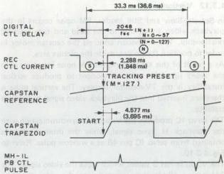

*Fig. 4-3-8 EP tracking preset error*

Assume the pulse phase has deviated. At the command from the Presetter Unit, the mechacon CPU sets the digital tracking data to the preset position (M = 127). The mechacon CPU also sends serial delay data (N) to the servo IC.

The mechacon CPU varies these data to shift the slanted component of the capstan trapezoidal waveform. The CPU enters the digital tracking mode and detects the position for the maximum playback FM signal. This is equivalent to center position of the control pulse with the MH-1L : NTSC / MH-2L : PAL. The data are detected and stored.

However, if the digital delay data (N) are between 20 and 49, the mechacon detects faulty position of the A/C head and ejects the tape. If this occurs, readjust the A/C head position.

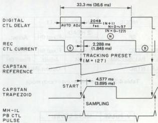

*Fig. 4-3-9 EP tracking preset auto adjustment*

#### 4.3.12 Vertical pulse

In Search, Slow and Still modes, FM noise occurs in the playback video signal due to the head and tape tracking relationship. The mechacon controls the capstan motor in order to position the noise outside the picture area.

As a result of this adjustment, the FM noise interferes with the video signal V. sync component to produce vertical instability is the TV-monitor display. The vertical pulse is therefore inserted into the playback video signal to improve stability.

The servo IC produces the V. pulse in synchronization with the playback H. sync signal, while the drum flipflop is obtained from servo IC pin 48 as a window pulse. Refer to Fig. 4-3-10.

The V. pulse has 3 values which mute the video signal. The 3 H period Mid-level is inserted into the video signal to function as V. sync. Phase of the 3 H V. pulse is adjusted by a monostable multivibrator. This varies the inserted V. sync position and allows V. lock adjustment. However, V. lock is adjusted only at either the rising or falling edge of the drum flipflop. This differs according to head construction and mode.

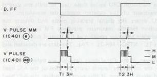

*Fig. 4-3-10 V. pulse timing chart*

|  MODE | MODEL | T1 | T2  |
| --- | --- | --- | --- |
|  SP | 2 HEAD | Fixed 6H | Adjust.  |
|   |  DA4  |   |   |
|  EP : NTSC | 2 HEAD | Fixed 6H | Adjust.  |
|  LP : PAL/SECAM | DA4 | Adjust. | Fixed 6H  |
|  LP : NTSC | – | Output (Mid) Fixed  |   |

Table 4-3-3 V. pulse timing in each mode

|  V. PULSE | MUTE LEVEL  |
| --- | --- |
|  H | PEDESTAL  |
|  M | SYNC  |
|  L | THROUGH  |

Table 4-3-4 V. pulse muting

#### 4.3.13 YNR pulse

This pulse controls luminance noise reduction in the video circuit. The recursive noise reduction system uses positive feedback to improve the response of the line noise canceller (LNC) that utilizes horizontal correlation. Therefore, in order to avoid adverse effects from positive feedback in the V. sync region, where correlation is weak, switching is needed between feedback and normal line noise canceller. During normal recording and playback, the YNR pulse appears at servo IC pin 47. In the 20 H period between the drum flipflop falling and rising edges, the pulse is Low for switching to LNC.

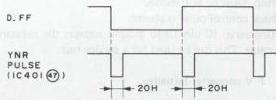

*Fig. 4-3-11 YNR pulse timing*

