# JVC VIDEO TECHNICAL GUIDE VTG82063 - SECTION 5

## MICROPROCESSOR SYSTEMS

### 5.1 VHS AND MICROPROCESSORS

Digital logic circuits were first used in $3/4''$ industrial type video cassette recorders. These did not function from programs, but instead used "wired logic" for detecting and controlling mechanical system operations. Some VCR editing systems were designed containing more than 500 individual logic ICs.

Logic circuits were also used in the early VHS models for the mechanism control (mechacon) systems. Examples of JVC models using these circuits were the HR-3300 series, HR-3600 series and HR-6700 NTSC model. Some makers use the term "syscon" (system control) over mechacon. This is merely editorial preference and the terms are essentially synonymous.

The first model to use a program controlled microprocessor was the HR-3600 series. This was a single chip microprocessor used in the timer circuit for the clock and program setting functions.

In 1981, the HR-7300 series was the first model to also include a programmed microprocessor for the mechacon circuit. The previous wired logic functions were programmed into the internal ROM (read only memory), thereby greatly simplifying the circuit design.

Later in the year, the line topping model HR-7650 series was introduced as the most feature packed video recorder of the time. This was the first unit to include front loading and a wireless remote controller. Five single chip microprocessors were used in the control systems and these formed the bases for those appearing in present day models. Subsequent improvements in both the mechanical system and mechacon circuit made possible previously impossible complex operations.

The VHS model expanded microprocessor use to include mechacon, timer, display and other circuits. The single chip type microprocessor is essentially the same for all circuits and differs according to the control operations. Moreover, the same computer principles apply to all.

#### 5.1.1 Microprocessor principles

The single chip microprocessor compares closely with the commonplace personal computer. The main components, ROM, RAM (random access memory), CPU (central processing unit), I/O (inputs/outputs), etc. are contained in a single chip. However, since these components are contained in one chip, they are greatly simplified in comparison to a full size computer and the only complex aspects are the I/O bus lines. Therefore, for the purposes of service, extensive knowledge of computer theory is not necessary.

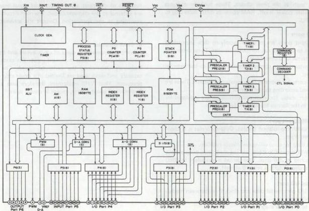

*Fig. 5-1-1 CPU block diagram*

##### 1. CPU

Refer to the CPU block diagram of Fig. 5-1-1. The CPU consists of controller, ALU (arithmetic logic unit), counter and register sections. The CPU functions to control readout of instructions written into the ROM (external data input, ROM addressing and instruction execute). CPU operation starts from an externally supplied reset signal. The operating period is determined by an external crystal oscillator frequency.

##### 2. ROM

The ROM contents determine the computer operation. In the case of microprocessors used in video equipment, if the ROM programs differ, even though the parts may be physically the same, they are effectively entirely different parts and are not interchangeable. Therefore, note the part numbers carefully when replacing parts during service.

Mechacon CPU: IC601 (M50965-605)

Mechacon CPU: IC601 (M50965-616)

In these examples the suffixes (-605 and -616) indicate different ROM programs. The ICs are not interchangeable even though they are physically the same.

The ROM contents cannot be rewritten externally for CPUs used in VHS equipment.

##### 3. RAM

In contrast to the ROM, the RAM can be rewritten. This memory temporarily stores CPU operation, status when the CPU is stopped and data. Ordinarily the contents are erased when power is off.

However, non-volatile RAMs are used in certain applications, such as the timer circuit. These hold the contents even when power is off. RAM contents differ according to the CPU.

##### 4. I/O ports

The input ports are pins for supplying data (equipment status) to the internal computer circuits. These determine the internal CPU operations.

The output ports supply computed data to the external systems.

Some ports functions as both inputs and outputs. These are switched according to the internal program.

I/O port states for each microprocessor are indicated by tables in the Service Manuals. Refer to these.

##### 5. PWM output port

Pulse width modulation output. Output format is N channel open drain.

This is used for controlling reel motor rotation.

The PWM counter is 8 bits and the modulated pulse output is obtained in 256 steps. One period is equivalent to 4080 clock cycles. Output is set to 0 at reset.

##### 6. Serial I/O port

Serial I/O port, serial data and clock lines (between mechacon and timer)

Refer to the block diagram.

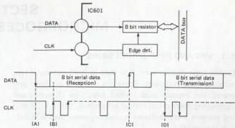

*Fig. 5-1-2 Serial data/clock*

Function of the serial I/O ports is controlled by the data and clock line relationship. The port is an input when the Data line falling edge occurs at the clock line High period (A).

Data are written into the 8 bit resistor at the clock signal rising edge. The CPU is set for data transfer at the Data rising edge while the clock is High. Data stored in the 8 bit resistor are sent to the output as serial data in synchronization with the clock signal.

Other types of I/O ports can accept directly connected analog voltage, which is converted internally into digital form (A-D converter), and those that directly provide analog voltage output.

##### 7. Reset input

When a microprocessor has been idle and begins operation, it needs an instruction to tell it were to start. This is the function of the reset signal. Most reset signal generators are external to the microprocessor. The reset circuit differs according to the application. Consult the schematic diagram.

##### 8. Clock oscillator

A computer operates in units of clock cycles and thus the clock signal is the most important input. The clock signal frequency determines the computer speed. The ROM capacity and work load are limited in a single chip microprocessor. Most VHS equipment therefore uses a clock frequency of about 4 MHz, except in special cases.
### 5.2 MECHACON CIRCUIT

#### 5.2.1 Mechacon CPU

The mechacon functions to both regulate the motors and coordinate the mechanical and electrical systems. Because of its central importance, an understanding of the mechacon CPU functions is essential when performing service in order to comprehend the overall VCR operation and identify causes of problems.

##### 1. Mechacon CPU basic operations

a) Operation key detect
b) Remote controller signal detect
c) Mechanism phase detect and operation control
d) Detect sensor states and control mechanism operation
e) Transfer serial data to the servo circuit (servo circuit control signals)
f) Transfer data to the timer CPU (control signals for timer recording)
g) Drum motor on/off control
h) Control reel, mode and cassette motors

i) Reel motor speed control
j) Index signal control
k) Playback tape speed control

##### 2. Servo circuit data transfer

Commands are sent to the servo circuit in the form of 16 bit serial data. Earlier models used special ports for transferring mode data between the mechacon and servo. Serial data is used in recent models to accommodate more complex VCR functions.

Fig. 5-2-1 indicates the serial data timing chart of the Model HR-D530 series, while Table 5-2-1 shows the transfer data.

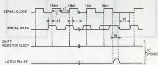

*Fig. 5-2-1 Serial data timing chart*

|   | 0 | 1 | 2 | 3 | 4 | 5 | 6 | 7 | 8 | 9 | 10 | 11 | 12 | 13 | 14 | 15 |   |
| --- | --- | --- | --- | --- | --- | --- | --- | --- | --- | --- | --- | --- | --- | --- | --- | --- | --- |
|   |  |  |  |  |  |  |  |  |  |  |  |  |  | 0 | 0 | 0 | REC  |
|   |  |  |  |  |  |  |  |  |  |  |  | 0 | 0 |  |  |  | SP (NTSC)  |
|   |  |  |  |  |  |  |  |  |  |  |  | 0 | 1 |  |  |  | LP (NTSC)  |
|   |  |  |  |  |  |  |  |  |  |  |  | 1 | 0 |  |  |  | EP (NTSC)  |
|   |  |  |  |  |  |  |  |  |  |  | 0 |  |  | 1 | 0 | 0 | ASB  |
|   |  |  |  |  |  |  |  |  | 0 | 0 | 1 |  |  | 1 | 0 | 0 | ASB PAUSE BAR ON  |
|   |  |  |  |  |  |  |  |  | 0 | 1 | 1 |  |  | 1 | 0 | 0 | “ ”  |
|   |  |  |  |  |  |  |  |  | 1 | 0 | 1 |  |  | 1 | 0 | 0 | “ ”  |
|   |  |  |  |  |  |  |  |  | 1 | 1 | 1 |  |  | 1 | 0 | 0 | “ ”  |
|   |  |  | 0 |  |  |  |  |  |  |  |  |  |  |  |  |  | NORM. Duty detected by CTL. PULSE  |
|   |  |  | 1 |  |  |  |  |  |  |  |  |  |  |  |  |  | STOP Duty detected by Q in : INDEX REC RESET  |
|   |  |  |  |  |  |  |  |  |  | 0 | 0 |  |  | 1 | 1 | 0 | V. PULSE OFF  |
|   |  |  |  |  |  |  |  |  |  | 0 | 1 |  |  | 1 | 1 | 0 | V. PULSE ON  |
|   |  |  |  |  |  | 0 | 0 | 0 | 0 |  |  |  |  | 1 | 1 | 0 | PB  |
|   |  |  |  |  |  | 0 | 1 | 1 | 0 |  |  |  |  | 1 | 1 | 0 | SEARCH X±7  |
|   |  |  |  |  |  | 1 | 0 | 0 | 0 |  |  |  |  | 1 | 1 | 0 | “ EP X±21  |
|   |  |  |  |  |  | 1 | 0 | 1 | 0 |  |  |  |  | 1 | 1 | 0 | SLOW  |
|   |  |  |  | 1 |  |  |  |  |  |  |  |  |  | 1 | 1 | 0 | REV  |
|   |  |  |  | 0 |  |  |  |  |  |  |  |  |  | 1 | 1 | 0 | FWD  |
|   |  |  |  |  | 1 |  |  |  |  |  |  |  |  |  |  |  | H. DISCRI ON  |
|   |  |  |  |  | 0 |  |  |  |  |  |  |  |  |  |  |  | DRUM PD ON  |
|   | 0 | 1 |  |  |  |  |  |  |  |  |  |  |  |  |  |  | INDEX DETECTOR MODE  |
|   | 1 | 0 |  |  |  |  |  |  |  |  |  |  |  |  |  |  | INDEX DETECTOR RESET  |
|   | 1 | 1 |  |  |  |  |  |  |  |  |  |  |  |  |  |  | INDEX REC  |
|   |  |  |  |  |  |  |  |  |  |  | 0 | 0 | 0 | 1 | 1 | 1 | REMOTE TRACKING HOLD  |
|   |  |  |  |  |  |  |  |  |  |  | 0 | 1 | 0 | 1 | 1 | 1 | REMOTE TRACKING UP  |
|   |  |  |  |  |  |  |  |  |  |  | 1 | 0 | 0 | 1 | 1 | 1 | REMOTE TRACKING DOWN  |
|   |  |  |  |  |  |  |  |  |  |  | 1 | 1 | 0 | 1 | 1 | 1 | REMOTE TRACKING P. SET (POWER OFF)  |

Table 5-2-1 Serial data
1) Operation;
Refer to Fig. 5-2-2.

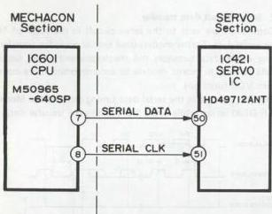

*Fig. 5-2-2 Serial data CPU block diagram*

The serial port is N channel open drain and data are transferred every 10 ms while power is supplied (more recent models transfer data every 5 ms).

As indicated in the timing chart, the serial data are transferred at the rising edge of the clock signal. Data transfer comprises 16 bits x 2 or 32 bits. The first 16 bits are sent when Data 0 is "0", while the second 16 bits are sent when Data "0" is "1". In most models, the first 16 bits are used for servo commands.

#### 5.2.2 Mechacon microprocessor control principles

This section outlines the microprocessor principles with respect to video operations. It is not limited to specific models and applies generally to all models that include the functions mentioned.

Fig. 5-2-3 shows an example of a mechacon CPU. Sensors provide input data on the mechanism conditions. These are analyzed and transferred to the output system. The following describes the inputs, outputs and their relation to the various functions.

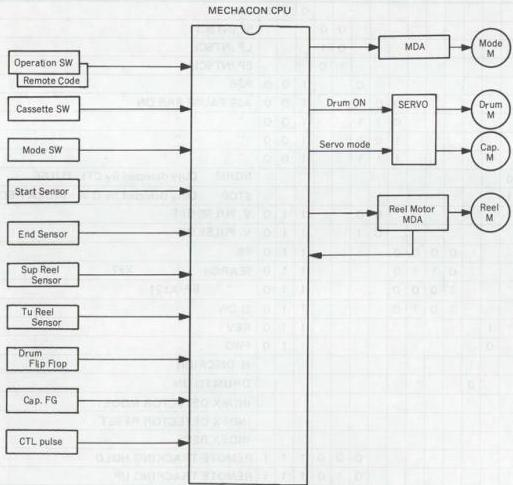

*Fig. 5-2-3 Mechacon microprocessor control principles*
##### 1. Input system

1) Mode switch (operation keys)

Three methods are used for operation key detection.

a: Special key detector circuit (serial 10 bit)
b: Key scan detect
c: Voltage detect

(1) Special key detector circuit: a

This system was used for comparatively older models, such as the HR-D725. The operation key code used 10 bit serial data supplied to the CPU via a single port. The same port was also used for the remote control code and the system offered advantages in high performance models.

The key scan IC (M50115AP) is indicated in Fig. 5-2-4. This detects the operation keys and produces corresponding 10 bit serial code, which goes to the mechacon CPU. The code is the same as that of the remote controller and the same port can be used.

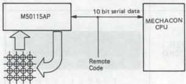

*Fig. 5-2-4 Special key detector block*

(2) Key scan detector type: b

In this version, the keyscan circuit is contained in the mechacon CPU. The operation key lines form intersections with the scanning pulse outputs from the CPU ports. Although circuit construction is simple, the system requires many CPU ports and is not often used for the mechacon CPU. However, the system is used for the timer operation key detector circuit. The CPU produces a time division keyscan pulse output. The scan pulse returns via the depressed key intersection to the input port. The depressed key is then detected from the timing of the return pulse. Operation of this system requires ten or more input and output ports. As indicated in Fig. 5-2-5, Scan Pulse 1 is produced at a certain timing. The operation key is detected from the input port by which the signal returns. Generally, the pulse is also used for other functions (such as FDP drive) in order to minimize the number of ports.

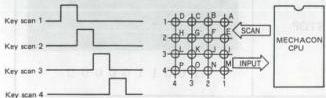

*Fig. 5-2-5 Key scan detector block*

(3) Voltage detector type: c

This system has become more common with recent increases in the CPU speed. Compared with other systems, circuit composition is simple, while port number requirement is low. It is therefore used for nearly all new models.

The principle is indicated in Fig. 5-2-6. The mechacon CPU contains an analog to digital (A/D) converter and a software program for detecting the depressed key from the input DC voltage. Most models use two ports (OPE-1, OPE-2) for detecting the operation keys.

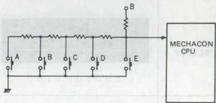

*Fig. 5-2-6 Operation key block*

2) Remote control codes

Three types of codes are used for infrared remote controllers.

a: 10 bit serial
b: 16 bit serial A
c: 16 bit serial B

(1) 10 bit serial code: a

As this formed the basis for the present 16 bit serial code, it can still be used for basic operations. The code is comprised of 7 bits data and 3 bits fixed code, as indicated in Fig. 5-2-7.

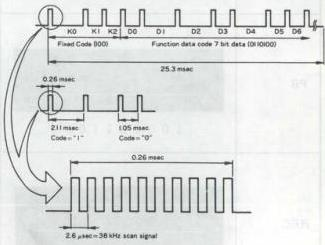

*Fig. 5-2-7 10 bit serial code format*

|  POWER ON |  | POWER OFF |   |
| --- | --- | --- | --- |
|  CH SELECT |  | SLOW |   |
|  FRAME ADVANCE |  | AFTER RECORDING |   |
|  PAUSE |  | REW |   |
|  PB |  | FF |   |
|  REC |  | STOP |   |

Table 5-2-2 10 bit remocon code
(2) 16 bit serial code

The trend toward more complex remote control functions led to the introduction of the 16 bit code. However, instances of two recorders in ty same room became more common in both dealer shwrooms and customer homes. It was thus necessary to avoid having the two machines respond to the same remote controller.

The 16 bit A and B codes were therefore introduced with the Model HR-D180 series.

A) 16 bit serial code A: b

This is an extension of the earlier 10 bit serial code. Consequently, the basic functions of even current models that use the A code can be operated from a 10 bit remote controller. However, among 10 bit types, the Models HR-2650 series and HR-7650 series do not respond to the 16 bit code. The code configuration is shown in Fig. 5-2-8. The first 8 bits are fixed manufacturer and product code, while the final 8 bits are used for the function code.

Among 16 bit models, although the remote controllers use the A code, the mainframes will also respond to the B code. The 16 bit models include a remote control lock function.

|  C_{0} | C_{1} | C_{2} | C_{3} | C_{4} | C_{5} | C_{6} | C_{7} | D_{0} | D_{1} | D_{2} | D_{3} | D_{4} | D_{5} | D_{6} | D_{7}  |
| --- | --- | --- | --- | --- | --- | --- | --- | --- | --- | --- | --- | --- | --- | --- | --- |
|  Fixed code ("1100")
Lower digit of the custom code ("0011") |   |   |   | Device code
Upper digit of the custom code |   |   |   | Lower digit
Function code |   |   |   | Upper digit  |   |   |   |

*Fig. 5-2-8 16 bit serial code format*

|  Custom code |   |   |   |   |   |   | Product Div. | Appliance  |
| --- | --- | --- | --- | --- | --- | --- | --- | --- |
|  Upper digit C_{7} C_{6} C_{5} C_{4} |   |   | Lower digit C_{3} C_{2} C_{1} C_{0} |   |   | Hexa-decimal  |   |   |
|  0 | 0 | 0 | 0 | 0 | 0 | 1 1 | 0 3 | Television  |
|  0 | 0 | 0 | 1 | 0 | 0 | 1 1 | 1 3  |   |
|  0 | 0 | 1 | 0 | 0 | 0 | 1 1 | 2 3  |   |
|  0 | 0 | 1 | 1 | 0 | 0 | 1 1 | 3 3  |   |
|  0 | 1 | 0 | 0 | 0 | 0 | 1 1 | 4 3 | Video  |
|  0 | 1 | 0 | 1 | 0 | 0 | 1 1 | 5 3  |   |
|  0 | 1 | 1 | 0 | 0 | 0 | 1 1 | 6 3  |   |
|  0 | 1 | 1 | 1 | 0 | 0 | 1 1 | 7 3  |   |
|  1 | 0 | 0 | 0 | 0 | 0 | 1 1 | 8 3 | Audio  |
|  1 | 0 | 0 | 1 | 0 | 0 | 1 1 | 9 3  |   |
|  1 | 0 | 1 | 0 | 0 | 0 | 1 1 | A 3  |   |
|  1 | 0 | 1 | 1 | 0 | 0 | 1 1 | B 3  |   |
|  1 | 1 | 0 | 0 | 0 | 0 | 1 1 | C 3 | Others  |
|  1 | 1 | 0 | 1 | 0 | 0 | 1 1 | D 3  |   |
|  1 | 1 | 1 | 0 | 0 | 0 | 1 1 | E 3  |   |
|  1 | 1 | 1 | 1 | 0 | 0 | 1 1 | F 3  |   |

Table 5-2-3 Custom code table
|  Function code (Binary)
D_{0} D_{1} D_{2} D_{3} D_{4} D_{5} D_{6} D_{7} | Hexa-decimal code | Function Name  |
| --- | --- | --- |
|  0 0 0 0 0 0 0 0 0 | 0 0 | Not used  |
|  0 1 0 0 0 0 0 0 0 | 0 2 |   |
|  1 1 0 0 0 0 0 0 0 | 0 3 | STOP  |
|  0 0 1 0 0 0 0 0 0 | 0 4 | EJECT  |
|  1 0 1 0 0 0 0 0 0 | 0 5 | (POWER ON)  |
|  0 1 1 0 0 0 0 0 0 | 0 6 | FAST FORWARD  |
|  1 1 1 0 0 0 0 0 0 | 0 7 | REWIND  |
|  0 0 0 1 0 0 0 0 0 | 0 8 | SLOW (FORWARD)  |
|  1 0 0 1 0 0 0 0 0 | 0 9 | DOUBLE-SPEED (X 2)  |
|  0 1 0 1 0 0 0 0 0 | 0 A | (POWER OFF)  |
|  1 1 0 1 0 0 0 0 0 | 0 B | POWER ON/OFF  |
|  0 0 1 1 0 0 0 0 0 | 0 C | PLAY  |
|  1 0 1 1 0 0 0 0 0 | 0 D | STILL/PAUSE  |
|  0 1 1 1 0 0 0 0 0 | 0 E | SEARCH F.F.  |
|  1 1 1 1 0 0 0 0 0 | 0 F | SEARCH REW  |
|  0 0 0 0 1 0 0 0 0 | 1 0 | TV  |
|  1 0 0 0 1 0 0 0 0 | 1 1 | VTR  |
|  0 1 0 0 1 0 0 0 0 | 1 2 | Not used  |
|  1 1 0 0 1 0 0 0 0 | 1 3 | TV/VTR  |
|  0 0 1 0 1 0 0 0 0 | 1 4 | SPEED UP  |
|  1 0 1 0 1 0 0 0 0 | 1 5 | SPEED DOWN  |
|  0 1 1 0 1 0 0 0 0 | 1 6 | FRAME ADVANCE  |
|  1 1 1 0 1 0 0 0 0 | 1 7 | AUDIO SELECT  |
|  0 0 0 1 1 0 0 0 0 | 1 8 | CHANNEL DOWN  |
|  1 0 0 1 1 0 0 0 0 | 1 9 | CHANNEL UP  |
|  0 1 0 1 1 0 0 0 0 | 1 A | POWER OFF  |
|  1 1 0 1 1 0 0 0 0 | 1 B | (AUDIO DUBBING)  |
|  0 0 1 1 1 0 0 0 0 | 1 C | (REC)  |
|  1 0 1 1 1 0 0 0 0 | 1 D | POWER ON  |
|  0 1 1 1 1 0 0 0 0 | 1 E | Not used  |
|  1 1 1 1 1 0 0 0 0 | 1 F |   |
|  0 0 0 0 0 1 0 0 | 2 0 | DIRECT CHANNEL  |
|  1 1 1 1 0 1 0 0 | 2 F |   |
|  Function code (Binary)
D_{0} D_{1} D_{2} D_{3} D_{4} D_{5} D_{6} D_{7} | Hexa-decimal code | Function Name  |
| --- | --- | --- |
|  0 0 0 0 1 1 0 0 | 3 0 | Not used  |
|  1 0 0 0 1 1 0 0 | 3 1 | SP/EP  |
|  0 1 0 0 1 1 0 0 | 3 2 | AM/PM  |
|  1 1 0 0 1 1 0 0 | 3 3 | CH-0 (TEN KEY)  |
|  0 0 1 0 1 1 0 0 | 3 4 | CHANNEL (V.P.S.)  |
|  1 0 1 0 1 1 0 0 | 3 5 | TIMER ON/OFF  |
|  0 1 1 0 1 1 0 0 | 3 6 | CANCEL  |
|  1 1 1 0 1 1 0 0 | 3 7 | PROGRAM  |
|  0 0 0 1 1 1 0 0 | 3 8 | DISPLAY  |
|  1 0 0 1 1 1 0 0 | 3 9 | (COUNTER RESET)  |
|  0 1 0 1 1 1 0 0 | 3 A | Not used  |
|  1 1 0 1 1 1 0 0 | 3 B | COUNTER GO TO  |
|  0 0 1 1 1 1 0 0 | 3 C | SELECT (TIMER)  |
|  1 0 1 1 1 1 0 0 | 3 D | Not used  |
|  0 1 1 1 1 1 0 0 | 3 E | ENTER  |
|  1 1 1 1 1 1 0 0 | 3 F | Not used  |
|  1 1 0 1 0 0 1 0 | 4 B |   |
|  0 0 1 1 0 0 1 0 | 4 C | AUDIO DUBBING  |
|  1 0 1 1 0 0 1 0 | 4 D | AUDIO DUBBING PAUSE  |
|  0 1 1 1 0 0 1 0 | 4 E | Not used  |
|  1 1 0 1 0 0 0 1 | 8 B |   |
|  0 0 1 1 0 0 0 1 | 8 C | INSERT REC  |
|  1 0 1 1 0 0 0 1 | 8 D | INSERT REC PAUSE  |
|  0 1 1 1 0 0 0 1 | 8 E | Not used  |
|  1 1 0 1 0 0 1 1 | C B |   |
|  0 0 1 1 0 0 1 1 | C C | REC  |
|  1 0 1 1 0 0 1 1 | C D | REC PAUSE  |
|  0 1 1 1 0 0 1 1 | C E | Not used  |
|  1 1 1 1 1 1 1 1 | F F |   |

Table 5-2-4 Function code in the remocon
- Remote control lock function
The mechacon CPU locks on the format of the first signal received from the remote controller. Afterwards, it does not respond to codes other than this.
The CPU also locks onto the first code after reset. Customers who own more than one set should be aware of this in event of a power outage.

B) 16 bit serial code B: c
This is basically the same as the A code except for the first 8 fixed bits. Remote controllers equipped with the B code also include an A/B selector switch. The transmission code is therefore selectable.

3) Cassette switches
These are used mainly for detecting cassette presence and position. Types and detecting methods differ according to model and cassette type.
Following are typical examples.

|  Mechanical | HR-3300 | Manual type cassette housing  |
| --- | --- | --- |
|  FL-1 | Initial front loading types | Starting with HR-7650
Cassette motor or via chain drive  |
|  FL-2 | HR-D120 | Cassette motor via gear drive  |
|  FL-3 | HR-D170 | Cassette motor via belt drive  |
|  SL-1 | HR-D470 | Side loading
Cassette motor via gear drive  |
|  FL-4 | HR-D410 | Cassette motor via belt drive  |
|  FL-5 | HR-D600 | Mode motor via worm clutch drive  |
|  TRAY | Initial tray loading types | Starting with HR-SC1000U  |

FL: Front loading  SL: Side loading
Following are the main electrical functions of these switches.

|  Type | Switch | Function  |
| --- | --- | --- |
|  Mechanical | Cassette down detect | Cassette housing at mechanically lowered position  |
|  FL-1 | Cassette up detect | Cassette ejected  |
|  FL-2 | Cassette down detect | Cassette fully loaded  |
|  FL-3 | Cassette up detect | Cassette ejected  |
|  SL-1 | Cassette down detect | Cassette fully loaded  |
|  FL-4 | Cassette sensor | Cassette inserted and lowered  |
|  FL-5 | Cassette sensor | Cassette inserted and lowered  |
|  TRAY | Cassette sensor | Cassette lowered and raised  |
|   | Cassette switch | Cassette size  |

4) Mode switch
This provides the principal data on the mechanism status to the mechacon CPU. The data has changed with evolution of the mechanism design. The mode switch data is processed by the mechacon software, after which the machacon CPU controls the external circuits. Refer to section 2.1.2-3. Following are descriptions of typical mode detector switch data.

|  Loading type | Mode switch diagram | Mechanism features  |
| --- | --- | --- |
|  LOADING RING | Fig. 2-1-10 | Earlier loading ring type mechanism  |
|  LA-1 | Fig. 2-1-12 | Initial loading arm system  |
|  LA-2 | Fig. 2-1-13 | SLOW/STILL mode add to LA-1 type  |
|  FULL-1 | Fig. 2-1-15 | Initial half loading system  |
|  FULL-2 | Fig. 2-1-16 | SLOW/STILL mode add to HL-1 type  |
|  FULL-3 | Fig. 2-1-18 | New mechanism half loading system  |
|  FL-1 | Fig. 2-1-20 | Initial full loading system  |
|  FL-2 | Fig. 2-1-22 | New mechanism full loading system  |
|  FL-3 | Fig. 2-1-25 | Initial VHS/VHS-C cassette loading system  |

5) Start and end sensors
These sensors have been used since the initial products in the VHS format, although their construction and form differ according to the cassette housing design. They function to detect the beginning and end of the tape.

(1) Start sensor
Rewind is stopped at the detection of light. The tape is transported in the forward direction until the beginning of the magnetically coated (opaque) section.

(2) End sensor
The following mode shifts are produced when light is detected.
PB : Auto Rewind
S-FF : Still
REC : Auto Rewind
Timer REC : Auto-Stop
Note: If both start and end sensors detect light, shift to Auto-Eject.
6) Supply (SP) and take-up (TU) reel sensors

These detect reel rotation. However, note that some models without the tape remaining function do not have an SP sensor. The reel sensor functions with respect to the mechacon CPU are as follows.

(1) SP reel sensor

Input for tape remaining calculation

Reel rotation detect

Tape counter

(2) TU reel sensor

Tape remaining detect

Reel rotation detect

Tape counter

7) Drum flipflop (DFF)

This is produced by the servo IC and supplied to the mechacon CPU for use in detecting drum rotation and as the recording start control signal. The drum flipflop functions with respect to the mechacon CPU are as follows.

(1) Drum rotation detect : Auto-Stop

(2) Recording start control : Video recording start

FM audio recording start

8) Capstan FG and CTL signals

The capstan frequency generator and control pulses are supplied from the servo circuit and provide the mechacon CPU with the following information.

(1) Capstan FG signal

Playback speed detect : In combination with CTL signal

Backspace : FG is counted to detect backspace amount

Capstan rotation detect : Detects rotation; Auto-Stop

(2) CTL signal

Zero frame editing (ZFE): Edit start control

Playback tape speed detect: FG count per CTL pulse

Note: Software selects tape speed according to the capstan FG count with respect to the control signal.

2. Output system

1) Drum motor control

The drum motor on/off control signal is sent to the servo circuit.

2) Capstan motor

Capstan motor control differs according to the model. Following are the basic functions.

(1) Models using capstan motor for reel drive

Reel drive and capstan drive are selected by a control signal (SERVO) from the mechacon CPU. This switches between mechacon and servo control.

(2) Capstan direction

Forward and reverse directions are controlled.

3) Mode, cassette and reel motors

These motors are directly controlled by the mechacon circuit. Check the schematic since the motor drive amplifier (MDA) differs according to the model.

(1) Mode motor

Some models refer to this as the loading motor. The motor controls the mechanism system.

(2) Cassette motor

This drives the cassette housing. Recent models use the mode motor for this function and do not include a separate cassette motor.

(3) Reel motor

Motor for driving the reels. Recent models use the capstan motor for this function.

4) Circuit control signals

(1) Power supply

Power on control

(2) Video

REC, PB, FE control

Recording start timing

SP/EP

Special playback

(3) Servo circuit

Serial data control

Index search control

Motor control

Tape speed control

(4) Timer circuit

TM bus data transfer

(Timer recording control; mode data transfer)

(5) Audio circuit

Recording start

FM audio recording start

PB, REC, EE control

Mode (ST/L/R)

Mode (Hi-Fi/MONO/MIX)

FM audio dropout correction
### 5.3 TIMER CIRCUIT

#### 5.3.1 Timer CPU

The timer CPU controls timer recording and display lighting. In previous models, it also controlled the tuner, while this function is handled by the mechacon CPU in recent models. The timer CPU includes a power backup function in the timer program system. The backup time differs according to the model and ranges from several minutes to about an hour.

#### 5.3.2 Timer microprocessor control principles

Following are numerous basic functions of the timer CPU. In some models, the functions are divided between the timer CPU and display CPU. The functions vary according to the model.

- Basic functions
1) Present time control
2) Stores program timer recording data
3) Program timer execution
4) TV channel control
5) Display tube lighting control
6) Operation key detection
7) TM bus control
8) Remote control data decode
9) Power loss detection
10) Data transfer to on-screen circuit
11) Timer transfer
12) Tape counter control

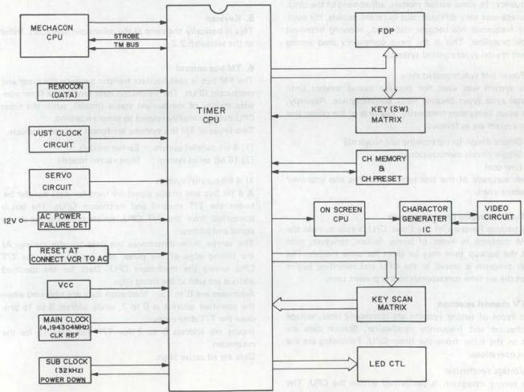

*Fig. 5-3-1 Timer microprocessor control principle*
##### 1. Present time control

This is the most important timer function. The two most common systems are internal and external reference clocks. The internal types use one or more crystal oscillators. Some models use separate oscillators for the CPU operating clock and time reference. In recent models, the increased CPU clock speed allows use also as the time reference. This was not possible with the relatively slow CPU clocks of earlier models and a separate oscillator was used to increase time keeping accuracy.

The external types function from a stable external reference signal. Most of these are synchronized to the power line.

The following features typify the clock reference systems.

Internal (crystal): Used as main clock, most common crystal sync system, special oscillator included, used in some models.

External: Independent oscillator, used in European models, employs power supply pulse, power supply sync system (CLK REF).

###### 1) Crystal synchronized system

This system functions by dividing and counting the CPU clock frequency. Accuracy depends on the CPU oscillator frequency. In some earlier models, adjustment of the clock accuracy was very difficult. But in recent models, the oscillator frequency has become stabilized, allowing improved clock precision. This is the most commonly used among recent crystal synchronized systems.

###### 2) Power line synchronized type

This system was used for popular priced models until crystal sync types became more commonplace. Recently, it is again being seen frequently. Features of the power line sync system are as follows.

1. Simple design (programming not required)
2. Simple circuit composition
3. Low cost

Clock accuracy of the line sync system has also improved in recent years.

##### 2. Timer recording program storage

The backup function of the timer CPU is able to hold the RAM contents in event of power failure. However, note that the backup time may be short for some models. The timer program is stored in the CPU and recording begins when the set time corresponds to the present time.

##### 3. TV channel selection

Two types of tuning systems are commonly used, voltage synthesizer and frequency synthesizer. Station data are sent to the tuner from the timer CPU. Following are the main operations.

###### 1) Voltage synthesizer

The tuning operation is performed within the CPU. The resulting PWM data are sent to the tuner system and only the channel number is sent to the tuner CPU.

###### 2) Frequency synthesizer

The tuning operation is performed within the CPU. The resulting serial data are sent to the tuner system and only the channel number is sent to the tuner CPU.

##### 4. Display control

Display lighting is controlled by the timer and display CPUs. The dynamic fluorescent display tubes are driven directly by the CPU output circuit. Some models include a dimmer function which alters the drive pulse width. The display tube control principle is indicated in Fig. 5-3-2.

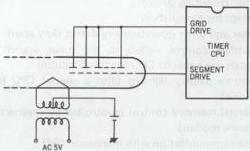

*Fig. 5-3-2 Display control principle*

##### 5. Keyscan

This is basically the same as the mechacon operation. Refer to the section 5.2.2-1.

##### 6. TM bus control

The FM bus is used for data transfer between the timer and mechacon CPUs. The mechacon data sent to the timer consists mainly of mechanism status (mode), while the timer CPU data are mainly related to timer recording.

Two types of TM bus systems are found in video products.

1. 4 bit parallel system: Earlier models
2. 16 bit serial system: Most recent models

###### 1) 4 bit parallel system

A 4 bit bus and strobe signal are used for data transfer between the T/T control and mechacon CPUs. The bus is controlled from the T/T CPU, which produces the strobe signal and address.

The strobe pulse determines the data transfer timing. At the falling edge of the pulse, the address from the T/T CPU enters the mechacon CPU. Data for the specified address are sent at the rising edge.

Addresses are 0 to 15. Mechacon data are obtained when the specified address is 0 to 7, while address 8 to 15 produce the T/T data output.

Inputs are address 0 to 7 for T/T and 8 to 15 for the mechacon.

Data are all active High.
Address 0, 1

CH UP: When the CH UP button of the infrared remote controller (transmitter) is pressed, the Mechacon is loaded with a HIGH.

CH DOWN: When CH DOWN button of the infrared remote controller is pressed, the Mechacon is loaded with a HIGH.

CN ENABLE: The Mechacon assumes HIGH when CH DATA at address 1 is effective.

CH DATA 0 - 4 : Indicates the depressed CH button by these 5 bits.

Address 2

INSTANT REC ENABLE : HIGH when a cassette with a tab is loaded.

POWER SW : HIGH at Power SW ON state.

TIMER SW : HIGH when Timer SW is ON.

REC MODE : HIGH in REC mode. This data is used for channel lock (CH LOCK).

Address 3

POWER ON : HIGH when the power source switch is turned on.

TUNER ON : HIGH when the input select switch is at "TV" position in E-E mode.

TUNER SW : HIGH when the input select switch is at position of "TV".

Address 4-13 : Not used

Address 14

REC START : Becomes HIGH just 2 sec before the timer REC start time.

At the same time the Mechacon sets the machine to the REC mode.

PRE START : Becomes HIGH just 10 sec before the timer REC start time. The Mechacon functions to turn on power, and the machine starts loading 2 sec after and enters into REC PAUSE mode.

Address 15

EJECT: When INSTANT REC button is pressed at IN-STANT REC ENABLE held in LOW, this becomes HIGH.

"9900": HIGH during the period that the tape counter reads 9900-0000.

"0100": HIGH during the period the counter reads 0100 -0000.

"0000": HIGH during the period the counter reads 0000.

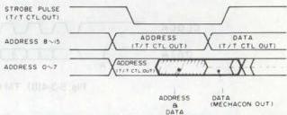

*Fig. 5-3-3 4-bit parallel TM bus timing*

|   | ADDRESS |   |   |   | DATA  |   |   |   |
| --- | --- | --- | --- | --- | --- | --- | --- | --- |
|   |  A3 | A2 | A1 | A0 | D3 | D2 | D1 | D0  |
|  0 | 0 | 0 | 0 | 0 | CH DATA 4 | CH ENARLE | CH DOWN | CH UP  |
|  1 | 0 | 0 | 0 | 1 | CH DATA 3 | CH DATA 2 | CH DATA 1 | CH DATA 0  |
|  2 | 0 | 0 | 1 | 0 | REC MODE | TIMER SW | POWER SW | INSTANT REC ENABLE  |
|  3 | 0 | 0 | 1 | 1 | TUNER SW | - | TUNER ON | POWER ON  |
|  4 | 0 | 1 | 0 | 0 | -  |   |   |   |
|  5 | 0 | 1 | 0 | 1 | -  |   |   |   |
|  6 | 0 | 1 | 1 | 0 | -  |   |   |   |
|  7 | 0 | 1 | 1 | 1 |   |   |   |   |
|  8 | 1 | 0 | 0 | 0  |   |   |   |   |
|  9 | 1 | 0 | 0 | 1  |   |   |   |   |
|  10 | 1 | 0 | 1 | 0  |   |   |   |   |
|  11 | 1 | 0 | 1 | 1  |   |   |   |   |
|  12 | 1 | 1 | 0 | 0  |   |   |   |   |
|  13 | 1 | 1 | 0 | 1  |   |   |   |   |
|  14 | 1 | 1 | 1 | 0 | - | - | REC START | PRE START  |
|  15 | 1 | 1 | 1 | 1 | EJECT | "9900" | "0100" | "0000"  |

Table 5-3-1 4-bit parallel TM bus data
2) 16 bit serial system

The 16 bit serial system uses two lines, clock and data, for data transfer. The TM bus is controlled by the timer CPU. While power is supplied, the timer CPU continuously monitors the deck status.

(1) TM bus data composition and timing

As indicated in Fig. 5-3-4(A), the 16 bits consist of 4 bits address and 12 bits data.

The clock is obtained from the timer CPU. As indicated in Fig. 5-3-4(C and D), the timing differs between data transfer from timer to mechacon, and from mechacon to timer.

- Mechacon to timer
Data transfer from the mechacon CPU is synchronized with the clock signal produced by the timer CPU itself.

- Timer to mechacon
As indicated in Fig. 3-3-4(B), the mechacon accepts input data when the timer data line drops from High to Low (point A). Transfer is complete when the clock is High and the data line rises from Low to High (point B). However, Low level is held until completion of mechacon processing (point C).

- Data latch is at the clock rise and data shift is at the clock fall.

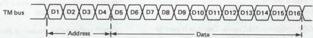

*Fig. 5-3-4(A) 16 bit serial TM bus data composition*

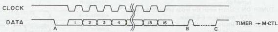

*Fig. 5-3-4(B) TM bus data timing (timer to mechacon CPU)*

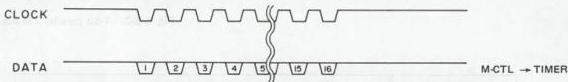

*Fig. 5-3-4(C) TM bus data timing (mechacon to timer CPU)*

|  Address | 11 | 10 | 9 | 8 | 7 | 6 | 5 | 4 | 3 | 2 | 1 | 0  |
| --- | --- | --- | --- | --- | --- | --- | --- | --- | --- | --- | --- | --- |
|  0 | TO1 | WR0 | V JITTER ADJUST DATA  |   |   |   |   |   |   |   |   |   |
|  1 | TO1 | WR1 | EP SLOW TRACKING DATA  |   |   |   |   |   |   |   |   |   |
|  2 | TO1 | WR2 | SP SLOW TRACKING DATA  |   |   |   |   |   |   |   |   |   |
|  3 | PGMF | BUSY | 100's POSITION | CH DISPLAY 10's POSITION |   |   |   | CH DISPLAY UNIT POSITION  |   |   |   |   |
|  4 | FLASH | VARIABLE SEARCH/SLOW |   |   | DECK MODE  |   |   |   |   |   |   |   |
|  5 | FLASH | MARK | ERASE | VISS | VISS DATA (8 bit)  |   |   |   |   |   |   |   |
|  6 | - | - | - | - | POFLG | OTREN | EEMON | POWER | TU ON | VIDEO | SPHB | ELHB  |
|  7 | GTM | TSTT | STM | REVH | TU SEL |   | - | - | - | - | REC SAFE | NOCS  |
|  8 | Not Used  |   |   |   |   |   |   |   |   |   |   |   |
|  9  |   |   |   |   |   |   |   |   |   |   |   |   |
|  A  |   |   |   |   |   |   |   |   |   |   |   |   |
|  B | - | Fsc | - | CAT | - | - | ANT/CATV/HRC |   | - | - | - | -  |
|  C | CNT SW | CT O | GT RW | GT FF | O | O | O | MUTE | TIMER | SP MODE | REC STT | PRESTT  |
|  D | O | O | O | O | - | - | X 10 Key | PRGM | U/D X | CH SET M | POS/TUN | NG/REAL  |
|  E | REAL | O | CHEN | 100's POSITION | CH (10's POSITION) |   |   |   | CH (UNIT POSITION)  |   |   |   |
|  F | O | O | CDEN | MAINFRAME/ RCU | REMOCON CODE (8-BIT HEX)  |   |   |   |   |   |   |   |

Table 5-3-2 TM bus data
2) TM bus data
- Data comprise 16 bits as indicated in Table 5-3-2. Of course, 4 bits indicate address and the remaining 12 bits are for data.
- Among the address bits, 0 to A are for data transfer from the timer to the mechacon, B–F are for transfer from the mechacon to the timer.

Address 0
- D0 to D9 : V jitter adjust data
- D10 : Still mode
- D11 : Output mode

Address 1
- D0 to D9 : EP slow tracking data
- D10 : EP slow mode adjust
- D11 : Output mode

Address 2
- D0 to D9 : SP slow tracking data
- D10 : SP slow mode adjust
- D11 : Output mode

Address 3
- D0 to D8 : Read channel
- D9 : Skip
- D10 : Busy
- D11 : Program mode

Address 4
|  D11 | D10 | D9 | D8 | D7 | D6 | D5 | D4 | D3 | D2 | D1 | D0 | Mode  |
| --- | --- | --- | --- | --- | --- | --- | --- | --- | --- | --- | --- | --- |
|  0 | 0 | 0 | 0 | 0 | 0 | 0 | 0 | 0 | 0 | 0 | 0 | OFF, STOP  |
|  0 | 0 | 0 | 0 | 0 | 0 | 0 | 1 | 0 | 0 | 0 | 1 | EJECT  |
|  0 | 0 | 0 | 0 | 0 | 0 | 1 | 0 | 0 | 0 | 1 | 0 | FF  |
|  0 | 0 | 0 | 0 | 0 | 1 | 0 | 0 | 0 | 0 | 1 | 1 | REW  |
|  0 | 0 | 0 | 0 | 0 | 0 | 0 | 0 | 0 | 1 | 0 | 0 | PLAY  |
|  0 | 0 | 0 | 1 | 0 | 0 | 1 | 0 | 0 | 1 | 0 | 1 | X2  |
|  0 | 1 | 0 | 0 | 0 | 0 | 1 | 0 | 0 | 1 | 1 | 0 | S-FF 7  |
|  0 | 1 | 0 | 1 | 0 | 0 | 1 | 0 | 0 | 1 | 1 | 0 | S-FF 21  |
|  0 | 1 | 0 | 0 | 0 | 1 | 0 | 0 | 0 | 1 | 1 | 1 | S-REW -7  |
|  0 | 1 | 0 | 1 | 0 | 1 | 0 | 0 | 0 | 1 | 1 | 1 | S-REW -21  |
|  0 | 0 | 0 | 0 | 1 | 0 | 0 | 0 | 1 | 0 | 0 | 0 | STILL + STILL -  |
|  0 | 0 | 0 | 1 | 1 | 0 | 0 | 0 | 1 | 0 | 0 | 0 | SLOW +1/30  |
|  0 | 0 | 1 | 0 | 1 | 0 | 0 | 0 | 1 | 0 | 0 | 0 | +1/24  |
|  0 | 0 | 1 | 1 | 1 | 0 | 0 | 0 | 1 | 0 | 0 | 0 | +1/18  |
|  0 | 1 | 0 | 0 | 1 | 0 | 0 | 0 | 1 | 0 | 0 | 0 | +1/12  |
|  0 | 1 | 0 | 1 | 1 | 0 | 0 | 0 | 1 | 0 | 0 | 0 | +1/6  |
|  0 | 0 | 0 | 0 | 0 | 0 | 0 | 0 | 1 | 0 | 1 | 0 | REC  |
|  0 | 0 | 0 | 0 | 1 | 0 | 0 | 0 | 1 | 0 | 1 | 1 | REC PAUSE  |

- Address 5
- D0 to D7 : Index data
- D8 : Index mode
- D9 : Erase mode
- D10 : Mark mode
- D11 : Flash mode

- Address 6
|  D0 | D1 | Mode  |
| --- | --- | --- |
|  0 | 1 | SP  |
|  0 | 0 | LP  |
|  1 | 0 | EP  |
- Address 2
- D0 to D9 : SP slow tracking data
- D10 : SP slow mode adjust
- D11 : Output mode

- Address 3
- D0 to D8 : Read channel
- D9 : Skip
- D10 : Busy
- D11 : Program mode

- Address 4
|  D11 | D10 | D9 | D8 | D7 | D6 | D5 | D4 | D3 | D2 | D1 | D0 | Mode  |
| --- | --- | --- | --- | --- | --- | --- | --- | --- | --- | --- | --- | --- |
|  0 | 0 | 0 | 0 | 0 | 0 | 0 | 0 | 0 | 0 | 0 | 0 | OFF, STOP  |
|  0 | 0 | 0 | 0 | 0 | 0 | 0 | 1 | 0 | 0 | 0 | 1 | EJECT  |
|  0 | 0 | 0 | 0 | 0 | 0 | 1 | 0 | 0 | 0 | 1 | 0 | FF  |
|  0 | 0 | 0 | 0 | 0 | 1 | 0 | 0 | 0 | 0 | 1 | 1 | REW  |
|  0 | 0 | 0 | 0 | 0 | 0 | 0 | 0 | 0 | 1 | 0 | 0 | PLAY  |
|  0 | 0 | 0 | 1 | 0 | 0 | 1 | 0 | 0 | 1 | 0 | 1 | X2  |
- Address 7
D0 : Cassette present/absent
D1 : Tab present/absent
D2 to D5 : Not used

|  D6 | D7 | Mode  |
| --- | --- | --- |
|  0 | 0 | AIR  |
|  1 | 0 | CATV  |
|  0 | 1 | ICC  |
|  1 | 1 | HRC  |

D8 : Counter reverse mode
D9 : GoTo enable
D10 : Tape start
D11 : GoTo mode

- Address 8
D0 to D11 : Not used

- Address 9
D0 to D11 : Not used

- Address A
D0 to D11 : [Transmission check]

- Address B
D0 to D3 : Not used

|  D4 | D5 | Mode  |
| --- | --- | --- |
|  0 | 0 | AIR  |
|  1 | 0 | CATV  |
|  0 | 1 | ICC  |
|  1 | 1 | HRC  |

D6, D7 : Not used
D8 : Channel memory IC select
D9 : Not used
D10 : Fsc/3 Fsc
D11 : Not used

- Address C
D0, D1 : Timer REC start control
D2 : Mode select (SP/EP)
D3 : Timer REC start control
D4 : Picture mute OFF
D5 to D7 : Not used
D8 : GoTo OFF
D9 : GoTo Rewind
D10 : Counter zero
D11 : Counter memory switch

- Address D

|  D0 | D1 | D2 | Mode  |
| --- | --- | --- | --- |
|  0 | 0 | 0 | Normal mode  |
|  X | X | 1 | Channel preset mode  |
|  0 | 0 | 1 | Skip channel up/down  |
|  1 | 0 | 1 | Position channel up/down  |
|  0 | 1 | 1 | Tuning voltage up/down  |
|  1 | 1 | 1 | Not used  |

D3 : U/D key inhibit
D4 : Timer program mode
D5 : 10 key inhibit
D6 to D11 : Not used

- Address E
D0 to D8 : Channel data
D9 : Channel enable
D10 : Not used
D11 : Channel display

- Address F
D0 to D7 : Remote controller JVC code (8-bit HEX DATA)
D8 : Mainframe/remote controller operation
D9 : Remote controller enable
D10, D11 : Not used
(3) Data transfer from mechacon CPU to timer CPU

The timer CPU accepts data synchronization with its internal clock. Therefore, data transfer in this direction is performed easily.

a) Vertical jitter compensation data
b) Slow tracking data

Vertical jitter compensation and slow tracking adjustment data are stored in the channel memory IC. These adjustments are performed in conjunction with the mainframe up/down buttons.

At power on, the timer CPU reads out the channel memory IC data and transfers it to the mechacon RAM. After write-in, the mechacon to timer transfer mode is entered. Adjustment uses the stored data.

c) Deck status

The timer CPU cannot detect the deck status.

Examples:
- Cassette presence
- REC safety switch
- Tuner mode
- Start/End sensor
- Mechanism mode

d) Index function

The mechacon directly accesses the servo circuit. Feedback is used for checking index write-in and detection.

(4) Data transfer from mechacon CPU to timer CPU

Mechacon CPU data input is more complex due to the lack of clock control.

As indicated by point A in Fig. 5-3-4(C), the mechacon input mode begins when the timer drops the data line from H to L.

At point B, mechacon data transfer is complete when the data line rises from L to H. However, the L level is held until completion of processing.

- Data latch is at clock rise and shift at clock fall.

a) Key operations are sent to the timer CPU as key scan data. Similarly, remote controller operations also enter the timer CPU.

The data are then transferred to the mechacon CPU via the TM bus. The mechacon then controls the mechanism mode according to these data.

Examples:
- Deck operation
- Switch states
- Channel set

b) Timer program set
c) Remote control code
d) Timer recording data

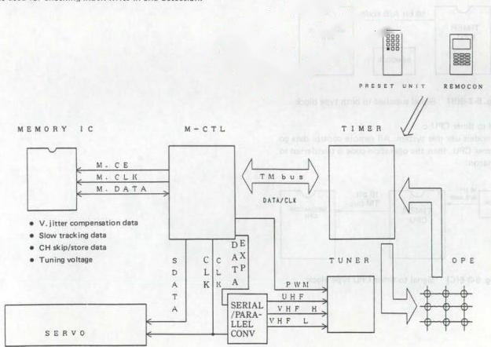

*Fig. 5-3-5 Serial data CPU circuit*
##### 7. Remote control signal input

The remote control signal is applied to the timer CPU by the following methods.

a: remote control data not supplied to the timer CPU
b: only transfer code supplied
c: all remote control codes applied

###### 1) Not directly connected:

In models prior to the HR-D530, the remote control code was supplied to the mechacon CPU, then transferred to the timer via the TM bus.

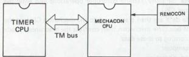

*Fig. 5-3-6(A) Not directly connected type block*

###### 2) Signal supplied to both:

The program data only goes to the timer CPU, while operation code is sent to the mechacon. Remote control A/B setting is more complex compared with other models.

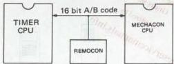

*Fig. 5-3-6(B) Signal supplied to both type block*

###### 3) Signal to timer CPU:

Recent models use this system. All remote control data go to the timer CPU, then the operation code is transferred to the mechacon.

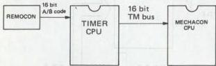

*Fig. 5-3-6(C) Signal to timer CPU type block*

##### 8. TV channel memory and non-volatile memory

The timer CPU controls write-in and readout of the non-volatile memory. In previous models, this memory stored channel data, but in recent models, it also stores other information.

##### 9. Power loss detect

This detector port is for switching to the CPU to the low power mode in order to efficiently use the backup function in event of power loss. When power loss is detected, the CPU ceases external related operations. This port is also an important checkpoint during service.

##### 10. On-screen data transfer

On-screen data are transferred in serial form. The transferred data are as follows.

a) Mode
b) Program
c) Blue back control

##### 11. Linear time counter

The timer CPU controls the linear time counter. The control signal is supplied to the CPU, where it is counted down. Such functions as Go-to, which use the linear time count, are also controlled by the timer CPU.

