# JVC VIDEO TECHNICAL GUIDE VTG82063 - SECTION 6

## TUNER CIRCUIT

### 6.1 BASIC PRINCIPLE OF TUNER CIRCUIT

#### 6.1.1 Comparison table of color TV broadcasting standards

|  CHARACTERISTICS | NTSC | PAL (E/EG) | PAL (EK) | SECAM  |
| --- | --- | --- | --- | --- |
|   |  R.T.M.A | GERBER | BRITISH | FRENCH  |
|   |  VHF/UHF | VHF/UHF | VHF/UHF | UHF  |
|  Number of lines per picture (frame) | 525 | 625 | 625 | 625  |
|  Field frequency (field/second) | 60 | 50 | 50 | 50  |
|  Picture (frame) frequency (picture/second) | 30 | 25 | 25 | 25  |
|  Line frequency (lines/second) | 15750 | 15625 | 15625 | 15625  |
|  Picture IF (MHz) | 45.75 | 38.9 | 39.5 | 32.7  |
|  Sound IF (MHz) | 41.25 | 33.4 | 33.5 | 39.2  |
|  Color sub carrier (MHz) | 3.58 | 4,433 | 4,433 | fb : 4,406
fr : 4,250  |
|  Nominal video bandwidth (MHz) | 4.2 | 5 | 5.5 | 6  |
|  Nominal radio-frequency bandwidth (MHz) | 6 | 7 (VHF)
8 (UHF) | 8 | 8  |
|  Sound carrier relative to vision carrier (MHz) (fs-fp) | +4.5 | +5.5 | +6 | +6.5  |
|  Nearest edge of channel relative to fp | -1.25 | -1.25 | -1.25 | -1.25  |
|  Nominal width of vestigial sideband (MHz) | 0.75 | 0.75 | 1.25 | 1.25  |
|  Type of polarity of vision modulation | Negative | Negative | Negative | Positive  |
|  Type of sound modulation | FM ± 25 kHz | FM ± 50 kHz | FM ± 50 kHz | AM  |
|  Pre-emphasis | 75/μs | 50/μs | 50/μs | -  |
|  Ratio of effective radiated power of vision and sound | 10/1–5/1(4/1) | 10/1 | 5/1 | 8/1  |
|  TV signal frequency spectrum figure number | Fig. 6-1-1 | Fig. 6-1-3 | Fig. 6-1-4 | Fig. 6-1-6  |
|  Channel frequencies table | Table 6-1-1 | Table 6-1-2 | Table 6-1-3 | Table 6-1-4  |

#### 6.1.2 Tuner circuit description (NTSC)

##### 1. TV signal frequency spectrum

The NTSC type tuner is suitable for receiving USA television standard.

The negative modulated video signal bandwidth is 6 MHz.

Sound is frequency modulated (FM) at ±25 kHz deviation. Video detection is performed by detecting the negative modulation video signal, while FM detection is used for detecting the sound signal.

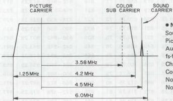

*Fig. 6-1-1 NTSC TV signal frequency spectrum*

• NTSC
Sound IF = 41.25 MHz
Picture IF = 45.75 MHz
Audio Modulation = F₃ (±25 kHz)
fs-fp Band Width = +4.5 MHz
Channel Band Width = 6.0 MHz
Color Sub Carrier = 3.58 MHz
Nominal Video Band Width = 4.2 MHz
Nominal Width of
Vestigial Sideband = 1.25 MHz
2. Table of receivable frequencies

Receivable frequencies are listed in the following table.

Sound IF 41.25 MHz
Picture IF 45.75 MHz (Unit: MHz)

|  CH | Center Frequency | Frequency Range | Picture Frequency | Sound Frequency | Local OSC | Image | CH | Center Frequency | Frequency Range | Picture Frequency | Sound Frequency | Local OSC | Image  |
| --- | --- | --- | --- | --- | --- | --- | --- | --- | --- | --- | --- | --- | --- |
|  2 | 57 | 54–60 | 55.25 | 59.75 | 101 | 146.75 | 43 | 647 | 644–650 | 645.25 | 649.75 | 691 | 736.75  |
|  3 | 63 | 60–66 | 61.25 | 65.75 | 107 | 152.75 | 44 | 653 | 650–656 | 651.25 | 655.75 | 697 | 742.75  |
|  4 | 69 | 66–72 | 67.25 | 71.25 | 113 | 158.75 | 45 | 659 | 656–662 | 657.25 | 661.75 | 703 | 748.75  |
|  5 | 79 | 76–82 | 77.25 | 81.75 | 123 | 168.75 | 46 | 665 | 662–668 | 663.25 | 667.75 | 709 | 754.75  |
|  6 | 85 | 82–88 | 83.25 | 87.75 | 129 | 174.75 | 47 | 671 | 668–674 | 669.25 | 673.75 | 715 | 760.75  |
|  7 | 177 | 174–180 | 175.25 | 179.75 | 221 | 266.75 | 48 | 677 | 674–680 | 675.25 | 679.75 | 721 | 766.75  |
|  8 | 183 | 180–186 | 181.25 | 185.75 | 227 | 272.75 | 49 | 683 | 680–686 | 681.25 | 685.75 | 727 | 772.75  |
|  9 | 189 | 186–192 | 187.25 | 191.75 | 233 | 278.75 | 50 | 689 | 686–692 | 687.25 | 691.75 | 733 | 778.75  |
|  10 | 195 | 192–198 | 193.25 | 197.75 | 239 | 284.75 | 51 | 695 | 692–698 | 693.25 | 697.75 | 739 | 784.75  |
|  11 | 201 | 198–204 | 199.25 | 203.75 | 245 | 290.75 | 52 | 701 | 698–704 | 699.25 | 703.75 | 745 | 790.75  |
|  12 | 207 | 204–210 | 205.25 | 209.75 | 251 | 296.75 | 53 | 707 | 704–710 | 705.25 | 709.75 | 751 | 796.75  |
|  13 | 213 | 210–216 | 211.25 | 215.75 | 257 | 302.75 | 54 | 713 | 710–716 | 711.25 | 715.75 | 757 | 802.75  |
|  14 | 473 | 470–476 | 471.25 | 475.75 | 517 | 562.75 | 55 | 719 | 716–722 | 717.25 | 721.75 | 763 | 808.75  |
|  15 | 479 | 476–482 | 477.25 | 481.75 | 523 | 568.75 | 56 | 725 | 722–728 | 723.25 | 727.75 | 769 | 814.75  |
|  16 | 485 | 482–488 | 483.25 | 487.75 | 529 | 574.75 | 57 | 731 | 728–734 | 729.25 | 733.75 | 775 | 820.75  |
|  17 | 491 | 488–494 | 489.25 | 493.75 | 535 | 580.75 | 58 | 737 | 734–740 | 735.25 | 739.75 | 781 | 826.75  |
|  18 | 497 | 494–500 | 495.25 | 499.75 | 541 | 586.75 | 59 | 743 | 740–746 | 741.75 | 745.75 | 787 | 832.75  |
|  19 | 503 | 500–506 | 501.25 | 505.75 | 547 | 592.75 | 60 | 749 | 746–752 | 747.25 | 751.75 | 793 | 838.75  |
|  20 | 509 | 506–512 | 507.25 | 511.75 | 553 | 598.75 | 61 | 755 | 752–758 | 753.25 | 757.75 | 799 | 844.75  |
|  21 | 515 | 512–518 | 513.25 | 517.75 | 559 | 604.75 | 62 | 761 | 758–764 | 759.25 | 763.75 | 805 | 850.75  |
|  22 | 521 | 518–524 | 519.25 | 523.75 | 565 | 610.75 | 63 | 767 | 764–770 | 765.25 | 769.75 | 811 | 856.75  |
|  23 | 527 | 524–530 | 525.25 | 529.75 | 571 | 616.75 | 64 | 773 | 770–776 | 771.25 | 775.75 | 817 | 862.75  |
|  24 | 533 | 530–536 | 531.25 | 535.75 | 577 | 622.75 | 65 | 779 | 776–782 | 777.25 | 781.75 | 823 | 868.75  |
|  25 | 539 | 536–542 | 537.25 | 541.75 | 583 | 628.75 | 66 | 785 | 782–788 | 783.25 | 787.75 | 829 | 874.75  |
|  26 | 545 | 542–548 | 543.25 | 547.75 | 589 | 634.75 | 67 | 791 | 788–794 | 789.25 | 793.75 | 835 | 880.75  |
|  27 | 551 | 548–554 | 549.25 | 553.75 | 595 | 640.75 | 68 | 797 | 794–800 | 795.25 | 799.75 | 841 | 886.75  |
|  28 | 557 | 554–560 | 555.25 | 559.75 | 601 | 646.75 | 69 | 803 | 800–806 | 801.25 | 805.75 | 847 | 892.75  |
|  29 | 563 | 560–566 | 561.25 | 565.75 | 607 | 652.75 | 70 | 809 | 806–812 | 807.25 | 811.75 | 853 | 898.75  |
|  30 | 569 | 566–572 | 567.25 | 571.75 | 613 | 658.75 | 71 | 815 | 812–818 | 813.25 | 817.75 | 859 | 904.75  |
|  31 | 575 | 572–578 | 573.25 | 577.75 | 619 | 664.75 | 72 | 821 | 818–824 | 819.25 | 823.75 | 865 | 910.75  |
|  32 | 581 | 578–584 | 579.25 | 583.75 | 625 | 670.25 | 73 | 827 | 824–830 | 825.25 | 829.75 | 871 | 916.75  |
|  33 | 587 | 584–590 | 585.25 | 589.75 | 631 | 676.75 | 74 | 833 | 830–836 | 831.25 | 835.75 | 877 | 922.75  |
|  34 | 593 | 590–596 | 591.25 | 595.75 | 637 | 682.75 | 75 | 839 | 836–842 | 837.25 | 841.75 | 883 | 928.75  |
|  35 | 599 | 596–602 | 597.25 | 601.75 | 643 | 688.75 | 76 | 845 | 842–848 | 843.25 | 847.75 | 889 | 934.75  |
|  36 | 605 | 602–608 | 603.25 | 607.75 | 649 | 694.75 | 77 | 851 | 848–854 | 849.25 | 853.75 | 895 | 940.75  |
|  37 | 611 | 608–614 | 609.25 | 613.75 | 655 | 700.75 | 78 | 857 | 854–860 | 855.25 | 859.75 | 901 | 946.75  |
|  38 | 617 | 614–620 | 615.25 | 619.75 | 661 | 706.75 | 79 | 863 | 860–866 | 861.25 | 865.75 | 907 | 952.75  |
|  39 | 623 | 620–626 | 621.25 | 625.75 | 667 | 712.75 | 80 | 869 | 866–872 | 867.25 | 871.75 | 913 | 958.75  |
|  40 | 629 | 626–632 | 627.25 | 631.75 | 673 | 718.75 | 81 | 875 | 872–878 | 873.25 | 877.75 | 919 | 964.75  |
|  41 | 635 | 632–638 | 633.25 | 637.75 | 679 | 724.75 | 82 | 881 | 878–884 | 879.25 | 883.75 | 925 | 970.75  |
|  42 | 641 | 638–644 | 639.25 | 643.75 | 685 | 730.75 | 83 | 887 | 884–890 | 885.25 | 889.75 | 931 | 976.75  |

Table 6-1-1 NTSC receivable frequency
##### 3. Video detection circuit description

The TV signal from each broadcast station is fed through the antenna to the antenna input terminal. The simplified block diagram is shown in Fig. 6-1-2.

The UHF signal is applied to the distributor on the UHF terminal circuit. Its output is directly fed to the tuner module and the other output is applied to the UHF antenna input of a TV receiver. The VHF signal is fed to the RF switcher (distributor) and its output is applied to the tuner module just like the UHF signal. The other output is fed to the RF switch. To the other input of this RF switch, channel 1 or channel 2 signal from the RF converter is applied. This RF switch switches output between the VHF signal from the VHS recorder, the TV signal from a broadcasting station and the signal from the VHF's RF converter and eliminates cross modulation between adjacent channels of the TV RF output signals.

During the playback, irrespective of the position of this switch, the signal from the RF converter is outputted. When the power switch is OFF, the TV signal is outputted. With the tuner module, as a power source, TU 12 V (power source which permits the power ON when the input select switch is in the "TV" position) is fed to the MB terminal. As AFC and AGC inputs, the AFC and AGC terminals are provided.

For switching the channel selection band, the VLB, VHB and UB pins are available.

Furthermore, there is the TU pin to which the tuning voltage is applied to permit tuning to the specified channel within the selected band.

As a result, the TV signal of the selected station is outputted from the IF OUT of the tuner module after it is converted into the IF signal with an impedance of 75 ohms.

The video carrier frequency of the IF signal from the tuner module is 45.75 MHz and the difference between the video carrier frequency and audio carrier frequency is 4.5 MHz.

The IF signal from the tuner module is matched in impedance to 75 ohms and then amplified by the IF amplifier so that is can be passed through the IF filter. The IF filter (SAW FILTER) is a surface acoustic wave resonator which is relative free from spurious and does not require a tuning circuit as there is only one resonance point. The output characteristics of SAW FILTER is such that adjacent bands can be eliminated. The IF signal which has been compensated in high and low frequencies respectively by TUNING FILTER is fed to VIF AMP. The VIF AMP is a video IF amplifier consisting of 3-stage differential amplifier and 41.25 MHz SOUND TRAP.

The IF signal is amplified by VIF AMP to the level high enough for detection, and it is sent to 41.25 MHz SOUND TRAP, where the audio carrier components are suppressed. The video IF signal is fed to the following video detection stage.

The VIDEO DETECTOR circuit, which is a complete synchronous detector having a characteristic with no orthogonal distortion in detecting signal side-band (45.75 MHz).

The output of the video detector is outputted as a negative-going video signal. This signal is passed through the 4.5 MHz audio trap, invert-amplified by VIDEO AMP and converted into impedance by emitter-follower EF AMP before it is applied to the VIDEO circuit as a positive-going VIDEO (TV) signal. VIDEO AMP comprise a resonance circuit for the 3.58 MHz chrominance sub-carrier frequency. Color level VR adjusts the chrominance output level.

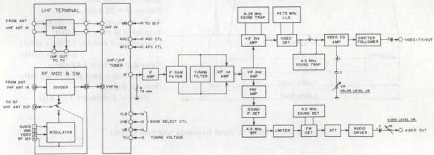

*Fig. 6-1-2 NTSC tuner/IF block diagram*
##### 4. Sound detection circuit description

The detection of the sound signal employs the inter-carrier reception system in which the FM beat signal is extracted by the VIF AMP from between the video carrier signal and sound carrier signal and this FM beat signal is then used as the second sound IF signal.

The output from the VIF AMP is fed to the SIF DET where the 4.5 MHz component is extracted from the SIF DET circuit by the power detector which uses the base-emitter PN junction of the SIF AMP transistor.

The signal passes 4.5 MHz BPF where its frequency modulated audio signal is extracted and then supplied to LIMITER circuit. This signal is demodulated after its AM component are removed by the LIMITER before being fed to the FM audio detector.

The FM detector employs the differential FM detection. As this is a differential amplifier drive, a tuning circuit consisting of 4.5 MHz SOUND DET FILTER and capacitor is provided FM DET circuit in order to form the "S" curve required for FM detection.

As a result, amplitude variations in accordance with the frequency deviation are each applied in reverse polarity to each other to FM DET circuit with the result that when they are synthesized, then the "S" curve characteristic can be obtained.

The output from AUDIO DRIVER circuit is eliminated from DC component by coupling capacitor, and adjusted in output level by AUDIO LEVEL VR before being applied to the AUDIO circuit as the audio (TV) signal.

#### 6.1.3 Tuner circuit description (PAL)

##### 1. TV signal frequency spectrum (E/EG)

The E/EG type tuner is suitable for receiving West European (CCIR) PAL B (VHF) and PAL G (UHF) television standards. The negative modulated video signal band width is 7(8) MHz. Sound is frequency modulated (FM) at ±50 kHz deviation. Video detection is performed by detecting the negative modulation video signal, while FM detection is used for detecting the sound signal.

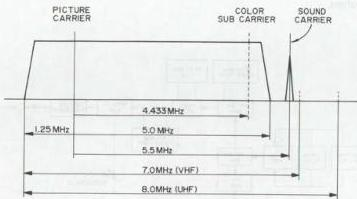

*Fig. 6-1-3 PAL TV signal frequency spectrum (E/EG)*

- PAL (E/EG)
- Sounf IF = 33.4 MHz
- Picture IF = 38.9 MHz
- Audio Modulation = F₃ (±50 kHz)
- fs-fp Band Width = +5.5 MHz
- Channel Band Width = 7.0 MHz (VHF)
- 8.0 MHz (UHF)
- Color Sub Carrier = 4.433 MHz
- Nominal Video Band Width = 5.0 MHz
- Nominal Width of
- Vestigial Sideband = 1.25 MHz

2. Table of receivable frequencies (E/EG)
Receivable frequencies are indicated in the following table.

Sound IF 33.4 MHz
Picture IF 38.9 MHz (Unit: MHz)

|  CH | Center Frequency | Frequency Range | Picture Frequency | Sound Frequency | Local OSC | Image | CH | Center Frequency | Frequency Range | Picture Frequency | Sound Frequency | Local OSC | Image  |
| --- | --- | --- | --- | --- | --- | --- | --- | --- | --- | --- | --- | --- | --- |
|  2 | 50.5 | 47–54 | 48.25 | 53.75 | 87.15 | 126.05 | 40 | 626 | 622–630 | 623.25 | 628.75 | 662.15 | 701.05  |
|  3 | 57.5 | 54–61 | 55.25 | 60.75 | 94.15 | 133.05 | 41 | 634 | 630–638 | 631.25 | 636.75 | 670.15 | 709.05  |
|  4 | 64.5 | 61–68 | 62.25 | 67.75 | 101.15 | 140.05 | 42 | 642 | 638–646 | 639.25 | 644.75 | 678.15 | 717.05  |
|  5 | 177.5 | 174–181 | 175.25 | 180.75 | 214.15 | 253.05 | 43 | 650 | 646–654 | 647.25 | 652.75 | 686.15 | 725.05  |
|  6 | 184.5 | 181–188 | 182.25 | 187.75 | 221.15 | 260.05 | 44 | 658 | 654–662 | 655.25 | 660.75 | 694.15 | 733.05  |
|  7 | 191.5 | 188–195 | 189.25 | 194.75 | 228.15 | 267.05 | 45 | 666 | 662–670 | 663.25 | 668.75 | 702.15 | 741.05  |
|  8 | 198.5 | 195–202 | 196.25 | 201.75 | 235.15 | 274.05 | 46 | 674 | 670–678 | 671.25 | 676.75 | 710.15 | 749.05  |
|  9 | 205.5 | 202–209 | 203.25 | 208.75 | 242.15 | 281.05 | 47 | 682 | 678–686 | 679.25 | 684.75 | 718.15 | 757.05  |
|  10 | 212.5 | 209–216 | 210.25 | 215.75 | 249.15 | 288.05 | 48 | 690 | 686–694 | 687.25 | 692.75 | 726.15 | 765.05  |
|  11 | 219.5 | 216–223 | 217.25 | 222.75 | 256.15 | 295.05 | 49 | 698 | 694–702 | 695.25 | 700.75 | 734.15 | 773.05  |
|  12 | 226.5 | 223–230 | 224.25 | 229.75 | 263.15 | 302.05 | 50 | 706 | 702–710 | 703.25 | 708.75 | 742.15 | 781.05  |
|  21 | 474 | 470–478 | 471.25 | 476.75 | 510.15 | 549.05 | 51 | 714 | 710–718 | 711.25 | 716.75 | 750.15 | 789.05  |
|  22 | 482 | 478–486 | 479.25 | 484.75 | 518.15 | 557.05 | 52 | 722 | 718–726 | 719.25 | 724.75 | 758.15 | 797.05  |
|  23 | 490 | 486–494 | 487.25 | 492.75 | 526.15 | 565.05 | 53 | 730 | 726–734 | 727.25 | 732.75 | 766.15 | 805.05  |
|  24 | 498 | 494–502 | 495.25 | 500.75 | 534.15 | 573.05 | 54 | 738 | 734–742 | 735.25 | 740.75 | 774.15 | 813.05  |
|  25 | 506 | 502–510 | 503.25 | 508.75 | 542.15 | 581.05 | 55 | 746 | 742–750 | 743.25 | 748.75 | 782.15 | 821.05  |
|  26 | 514 | 510–518 | 511.25 | 516.75 | 550.15 | 589.05 | 56 | 754 | 750–758 | 751.25 | 756.75 | 790.15 | 829.05  |
|  27 | 522 | 518–526 | 519.25 | 524.75 | 558.15 | 597.05 | 57 | 762 | 758–766 | 759.25 | 764.75 | 798.15 | 837.05  |
|  28 | 530 | 526–534 | 527.25 | 532.75 | 566.15 | 605.05 | 58 | 770 | 766–774 | 767.25 | 772.75 | 806.15 | 845.05  |
|  29 | 538 | 534–542 | 535.25 | 540.75 | 574.15 | 613.05 | 59 | 778 | 774–782 | 775.25 | 780.75 | 814.15 | 853.05  |
|  30 | 546 | 542–550 | 543.25 | 548.75 | 582.15 | 621.05 | 60 | 786 | 782–790 | 783.25 | 788.75 | 822.15 | 861.05  |
|  31 | 554 | 550–558 | 551.25 | 556.75 | 590.15 | 629.05 | 61 | 794 | 790–798 | 791.25 | 796.75 | 830.15 | 869.05  |
|  32 | 562 | 558–566 | 559.25 | 564.75 | 598.15 | 637.05 | 62 | 802 | 798–806 | 799.25 | 804.75 | 838.15 | 877.05  |
|  33 | 570 | 566–574 | 567.25 | 572.75 | 606.15 | 645.05 | 63 | 810 | 806–814 | 807.25 | 812.75 | 846.15 | 885.05  |
|  34 | 578 | 574–582 | 575.25 | 580.75 | 614.15 | 653.05 | 64 | 818 | 814–822 | 815.25 | 820.75 | 854.15 | 893.05  |
|  35 | 586 | 582–590 | 583.25 | 588.75 | 622.15 | 661.05 | 65 | 826 | 822–830 | 823.25 | 828.75 | 862.15 | 901.05  |
|  36 | 594 | 590–598 | 591.25 | 596.75 | 630.15 | 669.05 | 66 | 834 | 830–838 | 831.25 | 836.75 | 870.15 | 909.05  |
|  37 | 602 | 598–606 | 599.25 | 604.75 | 638.15 | 677.05 | 67 | 842 | 838–846 | 839.25 | 844.75 | 878.15 | 917.05  |
|  38 | 610 | 606–614 | 607.25 | 612.75 | 646.15 | 685.05 | 68 | 850 | 846–854 | 847.25 | 852.75 | 886.15 | 925.05  |
|  39 | 618 | 614–622 | 615.25 | 620.75 | 654.15 | 693.05 | 69 | 858 | 854–862 | 855.25 | 860.75 | 894.15 | 933.05  |

Table 6-1-2 PAL receivable frequency (E/EG)
##### 3. TV signal frequency spectrum (EK)

The EK type tuner is suitable for receiving UK television standards.

The negative modulated video signal band width is 8 MHz. Sound is frequency modulated (FM) at $\pm 50\,\mathrm{kHz}$ deviation. Video detection is performed by detecting the negative modulation video signal, while FM detection is used for detecting the sound signal.

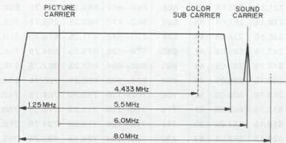

*Fig. 6-1-4 PAL TV signal frequency spectrum (EK)*

- PAL (EK)
- Sounf IF = 33.5 MHz
- Picture IF = 38.9 MHz
- Audio Modulation = $F_3$ ($\pm 50\,\mathrm{kHz}$)
- fs-fp Band Width = +6.0 MHz
- Channel Band Width = 8.0 MHz
- Color Sub Carrier = 4.433 MHz
- Nominal Video Band Width = 5.5 MHz
- Nominal Width of Vestigial Sideband = 1.25 MHz
##### 1. Table of receivable frequencies (EK)

Receivable frequencies are indicated in the following table.

Sound IF 33.5 MHz
Picture IF 39.5 MHz (Unit: MHz)

|  CH | Center Frequency | Frequency Range | Picture Frequency | Sound Frequency | Local OSC | Image  |
| --- | --- | --- | --- | --- | --- | --- |
|  21 | 474 | 470–478 | 471.25 | 477.25 | 510.75 | 550.25  |
|  22 | 482 | 478–486 | 479.25 | 485.25 | 518.75 | 558.25  |
|  23 | 490 | 486–494 | 487.25 | 493.25 | 526.75 | 566.25  |
|  24 | 498 | 494–502 | 495.25 | 501.25 | 534.75 | 574.25  |
|  25 | 506 | 502–510 | 503.25 | 509.25 | 542.75 | 582.25  |
|  26 | 514 | 511–518 | 511.25 | 517.25 | 550.75 | 590.25  |
|  27 | 522 | 518–526 | 519.25 | 525.25 | 558.75 | 598.25  |
|  28 | 530 | 526–534 | 527.25 | 533.25 | 566.75 | 606.25  |
|  29 | 538 | 534–542 | 535.25 | 541.25 | 574.75 | 614.25  |
|  30 | 546 | 542–550 | 543.25 | 549.25 | 582.75 | 622.25  |
|  31 | 554 | 550–558 | 551.25 | 557.25 | 590.75 | 630.25  |
|  32 | 562 | 558–566 | 559.25 | 565.25 | 598.75 | 638.25  |
|  33 | 570 | 566–574 | 567.25 | 573.25 | 606.75 | 646.25  |
|  34 | 578 | 574–582 | 575.25 | 581.25 | 614.75 | 654.25  |
|  35 | 586 | 582–590 | 583.25 | 589.25 | 622.75 | 662.25  |
|  36 | 594 | 590–598 | 591.25 | 597.25 | 630.75 | 670.25  |
|  37 | 602 | 598–606 | 599.25 | 605.25 | 638.75 | 678.25  |
|  38 | 610 | 606–614 | 607.25 | 613.25 | 646.75 | 686.25  |
|  39 | 618 | 614–622 | 615.25 | 621.25 | 654.75 | 694.25  |
|  40 | 626 | 622–630 | 623.25 | 629.25 | 662.75 | 702.25  |
|  41 | 634 | 630–638 | 631.25 | 637.25 | 670.75 | 710.25  |
|  42 | 642 | 638–646 | 639.25 | 645.25 | 678.75 | 718.25  |
|  43 | 650 | 646–654 | 647.25 | 653.25 | 686.75 | 726.25  |
|  44 | 652 | 654–662 | 655.25 | 661.25 | 694.75 | 734.25  |
|  45 | 666 | 662–670 | 663.25 | 669.25 | 702.75 | 742.25  |
|  46 | 674 | 670–678 | 671.25 | 677.25 | 710.75 | 750.25  |
|  47 | 682 | 678–686 | 679.25 | 685.25 | 718.75 | 758.25  |
|  48 | 690 | 686–694 | 687.25 | 693.25 | 726.75 | 766.25  |
|  49 | 698 | 694–702 | 695.25 | 701.25 | 734.75 | 774.25  |
|  50 | 706 | 702–710 | 703.25 | 709.25 | 742.75 | 782.25  |
|  51 | 714 | 710–718 | 711.25 | 717.25 | 750.75 | 790.25  |
|  52 | 722 | 718–726 | 719.25 | 725.25 | 758.75 | 798.25  |
|  53 | 730 | 726–734 | 727.25 | 733.25 | 766.75 | 806.25  |
|  54 | 738 | 734–742 | 735.25 | 741.25 | 774.75 | 814.25  |
|  55 | 746 | 742–750 | 743.25 | 749.25 | 782.75 | 822.25  |
|  56 | 754 | 750–759 | 751.25 | 757.25 | 790.75 | 830.25  |
|  57 | 762 | 759–766 | 759.25 | 765.25 | 798.75 | 838.25  |
|  58 | 770 | 766–774 | 767.25 | 773.25 | 806.75 | 846.25  |
|  59 | 778 | 774–782 | 775.25 | 781.25 | 814.75 | 854.25  |
|  60 | 786 | 782–790 | 783.25 | 789.25 | 822.75 | 862.25  |
|  61 | 794 | 790–798 | 791.25 | 797.25 | 830.75 | 870.25  |
|  62 | 802 | 798–806 | 799.25 | 805.25 | 838.75 | 878.25  |
|  63 | 810 | 806–814 | 807.25 | 813.25 | 846.75 | 886.25  |
|  64 | 818 | 814–822 | 815.25 | 821.25 | 854.75 | 894.25  |
|  65 | 826 | 822–830 | 823.25 | 829.25 | 862.75 | 902.25  |
|  66 | 834 | 830–838 | 831.25 | 837.25 | 870.75 | 910.25  |
|  67 | 842 | 838–846 | 839.25 | 845.25 | 878.75 | 918.25  |
|  68 | 850 | 846–854 | 847.25 | 853.25 | 886.75 | 926.25  |
|  69 | 858 | 854–862 | 855.25 | 861.25 | 894.75 | 934.25  |

Table 6-1-3 PAL receivable frequency (EK)
##### 5. Video detection circuit description

- Parentheses ( ) indicate EK frequency that differs from E/EG's.

Broadcast television signals are supplied to the antenna input (ANT IN) of the mix booster, from which the RF amplifier amplifies only the portion subject to loss at the next stage divider. The simplified block diagram is shown in Fig. 6-1-5.

One output of the divider is mixed with the CH-36 RF signal from the RF converter and supplied via the RF OUT terminals to the connected TV receiver. Another output of the divider goes to the ANT IN connection of the tuner. With the tuner module, as a power source, TU 12 V is fed to the MB terminal. As AFC and AGC inputs, the AFC and AGC terminals are provided.

For switching the channel selection band, the VLB, VHB and UB pins are available. Furthermore there is the TU pin to which the tuning voltage is applied to permit tuning to the specified channel within the selected band.

As a result, the TV signal of the selected station is output from the IF OUT of the tuner module after it is converted into the IF signal with an impedance of 75 ohms.

The video carrier frequency of the IF signal from the tuner module is 38.9 MHz (39.5 MHz) and the difference between the video carrier frequency and audio carrier frequency is 5.5 MHz (6.0 MHz).

The IF signal from the tuner module is matched in impedance of 75 ohms and then amplified by the IF amplifier so that is can be passed through the IF filter.

The IF filter (SAW FILTER) is a surface acoustic wave resonator which is relative free from spurious and does not require a tuning circuit as there is only one resonance point. The output characteristics of SAW FILTER is such that adjacent bands can be eliminated.

The IF signal which has been compensated in high and low frequencies respectively by TUNER FILTER is fed to VIF AMP.

The VIF AMP is a video IF amplifier consisting of 3-stage differential amplifier and 33.4 MHz (33.5 MHz) SOUND TRAP. The IF signal is amplified by VIF AMP to the level high enough for detection, and it is sent to 33.4 MHz (33.5 MHz) SOUND TRAP, where the audio carrier components are suppressed. The video IF signal is fed to the following video detection stage.

The VIDEO DETECTOR circuit, which is a complete synchronous detector having a characteristic with no orthogonal distortion in detecting signal side-band (38.9 MHz [39.5 MHz]).

The output of the video detector is output as a negative-going video signal. This signal is passed through the 5.5 MHz (6.0 MHz) audio trap, invert-amplified by VIDEO AMP and converted in impedance by emitter-follower EF AMP before it is applied to the VIDEO circuit as a positive-going VIDEO (TV) signal.

VIDEO AMP comprises a resonance circuit for the 4.43 MHz chrominance sub-carrier frequency. Color level VR adjusts the chrominance output level.

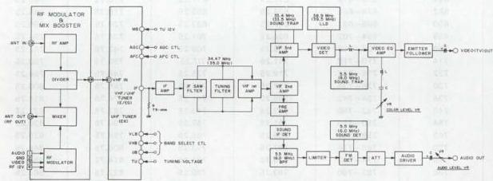

*Fig. 6-1-5 PAL tuner/IF block diagram*
##### 6. Sound detection circuit description

The detection of the sound signal employs the inter-carrier reception system in which the FM beat signal is extracted by the VIF AMP from between the video carrier signal and sound carrier signal and this FM beat signal is then used as the second sound IF signal.

The output from the VIF AMP is fed to the SIF DET where the 5.5 MHz (6 MHz) component is extracted from SIF DET circuit by the power detector which uses the base-emitter PN junction of the SIF AMP transistor. The signal passes 5.5 MHz (6 MHz) BPF where its frequency modulated audio signal is extracted and then supplied to LIMITER circuit. This signal is demodulated after its AM components are removed by the LIMITER before being fed to the FM audio detector. The FM detector employs the differential FM detection. As this is a differential amplifier drive, a tuning circuit consisting of 5.5 MHz (6 MHz) SOUND DET FILTER and capacitor is provided FM DET circuit in order to form the "S" curve required for FM detection.

As a result, amplitude variations in accordance with the frequency deviation are each applied in reverse polarity to each other to FM DET circuit with the result that when they are synthesized, then the "S" curve characteristic can be obtained.

The output from AUDIO DRIVER circuit is eliminated from DC component by coupling capacitor, and adjusted in output level by AUDIO LEVEL VR before being applied to the AUDIO circuit as the audio (TV) signal.

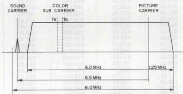
(VHF-Low)

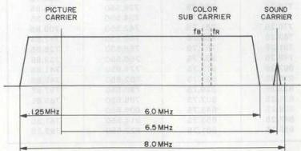

*Fig. 6-1-6 SECAM TV signal frequency spectrum*

(VHF-High, UHF)

#### 6.1.4 Tuner circuit description (SECAM)

##### 1. TV signal frequency spectrum

The SECAM type is capable of receiving VHF low band (41 MHz to 68 MHz), VHF high band (174.75 MHz to 222.75 MHz) and UHF band (470 MHz to 862 MHz).

As shown in the figure, picture and sound carriers of VHF-high and UHF are at reverse position with respect to VHF-low. Consequently, the lower heterodyne of the local oscillator frequencies are used for VHF-high and UHF, while the upper heterodyne is employed for VHF-low.

The positive modulated video signal band width is 8 MHz. Sound is amplitude modulation (AM). Video detection is performed by detecting the positive modulation video signal, while AM detection is used for detecting the sound signal.

## SECAM

Sound IF = 39.2 MHz
Picture IF = 32.7 MHz
Audio Modulation = A₃
fs-fp Band Width = 6.5 MHz
Channel Band Width = 8.0 MHz
Color Sub Carrier (fB) = 4.406 MHz
Color Sub Carrier (fR) = 4.250 MHz
Nominal Video Band Width = 6.0 MHz
Nominal Width of
Vestigial Sideband = 1.25 MHz
2. Table of receivable frequencies
Receivable frequencies are indicated in the following table.

Sound IF 39.2 MHz
Picture IF 32.7 MHz (Unit: MHz)

|  CH | Center Frequency | Frequency Range | Picture Frequency | Sound Frequency | Local OSC | Image  |
| --- | --- | --- | --- | --- | --- | --- |
|  A | 45.00 | 41.00 – 49.00 | 47.75 | 41.25 | 80.450 | 113.15  |
|  B | 53.00 | 49.00 – 57.00 | 55.75 | 49.25 | 88.450 | 121.15  |
|  C1 | 57.75 | 53.75 – 61.75 | 60.50 | 54.00 | 93.200 | 125.90  |
|  C | 61.00 | 57.00 – 65.00 | 63.75 | 57.25 | 96.450 | 129.15  |
|  1 | 178.75 | 174.75 – 182.75 | 176.00 | 182.50 | 143.300 | 110.60  |
|  2 | 186.75 | 182.75 – 190.75 | 184.00 | 190.50 | 151.300 | 118.60  |
|  3 | 194.75 | 190.75 – 198.75 | 192.00 | 198.50 | 159.300 | 126.60  |
|  4 | 202.75 | 198.75 – 206.75 | 200.00 | 206.50 | 167.300 | 134.60  |
|  5 | 210.75 | 206.75 – 214.75 | 208.00 | 214.50 | 175.300 | 142.60  |
|  6 | 218.75 | 214.75 – 222.75 | 216.00 | 222.50 | 183.300 | 150.60  |
|  21 | 474.00 | 470.00 – 478.00 | 471.25 | 477.75 | 438.550 | 405.85  |
|  22 | 482.00 | 478.00 – 486.00 | 479.25 | 485.75 | 446.550 | 413.85  |
|  23 | 490.00 | 486.00 – 494.00 | 487.25 | 495.75 | 454.550 | 421.85  |
|  24 | 498.00 | 494.00 – 502.00 | 495.25 | 501.75 | 462.550 | 429.85  |
|  25 | 506.00 | 502.00 – 510.00 | 503.25 | 509.75 | 470.550 | 437.85  |
|  26 | 514.00 | 510.00 – 518.00 | 511.25 | 517.75 | 478.550 | 445.85  |
|  27 | 522.00 | 518.00 – 526.00 | 519.25 | 525.75 | 486.550 | 453.85  |
|  28 | 530.00 | 526.00 – 534.00 | 527.25 | 533.75 | 494.550 | 461.85  |
|  29 | 538.00 | 534.00 – 542.00 | 535.25 | 541.75 | 502.550 | 469.85  |
|  30 | 546.00 | 542.00 – 550.00 | 543.25 | 549.75 | 510.550 | 477.85  |
|  31 | 554.00 | 550.00 – 558.00 | 551.25 | 557.75 | 518.550 | 485.85  |
|  32 | 562.00 | 558.00 – 566.00 | 559.25 | 565.75 | 526.550 | 493.85  |
|  33 | 570.00 | 566.00 – 574.00 | 567.25 | 573.75 | 534.550 | 501.85  |
|  34 | 578.00 | 574.00 – 582.00 | 575.25 | 581.75 | 542.550 | 509.85  |
|  35 | 586.00 | 582.00 – 590.00 | 583.25 | 589.75 | 550.550 | 517.85  |
|  36 | 594.00 | 590.00 – 598.00 | 591.25 | 597.75 | 558.550 | 525.85  |
|  37 | 602.00 | 598.00 – 606.00 | 599.25 | 605.75 | 566.550 | 533.85  |
|  38 | 610.00 | 606.00 – 614.00 | 607.25 | 613.75 | 574.550 | 541.85  |
|  39 | 618.00 | 614.00 – 622.00 | 615.25 | 621.75 | 582.550 | 549.85  |
|  40 | 626.00 | 622.00 – 630.00 | 623.25 | 629.75 | 590.550 | 557.85  |
|  41 | 634.00 | 630.00 – 638.00 | 631.25 | 637.75 | 598.550 | 565.85  |
|  42 | 642.00 | 638.00 – 646.00 | 639.25 | 645.75 | 606.550 | 573.85  |
|  43 | 650.00 | 646.00 – 654.00 | 647.25 | 653.75 | 614.550 | 581.85  |
|  44 | 658.00 | 654.00 – 662.00 | 655.25 | 661.75 | 622.550 | 589.85  |
|  45 | 666.00 | 662.00 – 670.00 | 663.25 | 669.75 | 630.550 | 597.85  |
|  46 | 674.00 | 670.00 – 678.00 | 671.25 | 677.75 | 638.550 | 603.85  |
|  47 | 682.00 | 678.00 – 686.00 | 679.25 | 685.75 | 646.550 | 613.85  |
|  48 | 690.00 | 686.00 – 694.00 | 687.25 | 693.75 | 654.550 | 621.85  |
|  49 | 698.00 | 694.00 – 702.00 | 695.25 | 701.75 | 662.550 | 629.85  |
|  50 | 706.00 | 702.00 – 710.00 | 703.25 | 709.75 | 670.550 | 637.85  |
|  51 | 714.00 | 710.00 – 718.00 | 711.25 | 717.75 | 678.550 | 645.85  |
|  52 | 722.00 | 718.00 – 726.00 | 719.25 | 725.75 | 686.550 | 653.85  |
|  53 | 730.00 | 726.00 – 734.00 | 727.25 | 733.75 | 694.550 | 661.85  |
|  54 | 738.00 | 734.00 – 742.00 | 735.25 | 741.75 | 702.550 | 669.85  |
|  55 | 746.00 | 742.00 – 750.00 | 743.25 | 749.75 | 710.550 | 677.85  |
|  56 | 754.00 | 750.00 – 758.00 | 751.25 | 757.75 | 718.550 | 685.85  |
|  57 | 762.00 | 758.00 – 766.00 | 759.25 | 765.75 | 726.550 | 693.85  |
|  58 | 770.00 | 766.00 – 774.00 | 767.25 | 773.75 | 734.550 | 701.85  |
|  59 | 778.00 | 774.00 – 782.00 | 775.25 | 781.75 | 742.550 | 709.85  |
|  60 | 786.00 | 782.00 – 790.00 | 783.25 | 789.75 | 750.550 | 717.85  |
|  61 | 794.00 | 790.00 – 798.00 | 791.25 | 797.75 | 758.550 | 725.85  |
|  62 | 802.00 | 798.00 – 806.00 | 799.25 | 803.75 | 766.550 | 733.85  |
|  63 | 810.00 | 806.00 – 814.00 | 807.25 | 813.75 | 774.550 | 741.85  |
|  64 | 818.00 | 814.00 – 822.00 | 815.25 | 821.75 | 782.550 | 749.85  |
|  65 | 826.00 | 822.00 – 830.00 | 823.25 | 829.75 | 790.550 | 757.85  |
|  66 | 834.00 | 830.00 – 838.00 | 831.25 | 837.75 | 798.550 | 765.85  |
|  67 | 842.00 | 838.00 – 846.00 | 839.25 | 845.75 | 806.550 | 773.85  |
|  68 | 850.00 | 846.00 – 854.00 | 847.25 | 853.75 | 814.550 | 781.85  |
|  69 | 858.00 | 854.00 – 862.00 | 855.25 | 861.75 | 822.550 | 789.85  |

Table 6-1-4 SECAM receivable frequency
##### 3. Video detection circuit description

Broadcast television signals are supplied to the antenna input (ANT IN) of the RF switcher, from which the RF amplifier amplifies only the portion subject to loss at the next stage divider. The simplified block diagram is shown in Fig. 6-1-7.

One output of the divider is mixed with the CH-36 RF signal from the RF converter and supplied via the RF OUT terminals to the connected TV receiver. Another output of the divider goes to the ANT IN connection of the tuner.

With the tuner module, as a power source, TU 12 V is fed to the MB terminal. As AFC and AGC inputs, the AFC and AGC terminals are provided. For switching the channel selection band, the VLB, VHB and the UB pins are available. Furthermore there is the TU pin to which the tuning voltage is applied to permit tuning to the specified channel within the selected band. As a result, the TV signal of the selected station is output from the IF OUT of the tuner module after it is converted into the IF signal with an impedance of 75 ohms.

The video carrier frequency of the IF signal from the tuner is 32.7 MHz. At the same time, the difference between video and sound carrier frequencies is 6.5 MHz. The IF signal from the tuner module is matched in impedance to 75 ohms and then amplified by the IF amplifier so that it can be passed through the IF filter.

The IF filter (SAW FILTER) is a surface acoustic wave resonator, which features a single resonance point without the need for a tuning circuit and low spurious signal production. Since SAW FILTER output sends to attenuate the adjacent bands, TUNING FILTER compensates for the VIF center frequency to yield the response indicated in the block diagram. The output goes to VIF amplifier.

The 2 stage differential amplifier output of the video IF amp goes to the video detector stage. A differential amplifier is used by the sync detector type video detector.

The VIF amplifier increases the signal to an adequate level for driving the detector, then supplies two outputs at opposite phase to the video detector. Through the limiter, the signal is fullwave rectified in a double balanced connection to become the detector output.

32.7 MHz TUNING TRANS. is connected to the limiter resonates at the video carrier frequency and applies a precise same phase input waveform to the video detector. The video detector output is amplified and obtained as a positive polarity video signal from VIDEO DET AMP.

The signal through 6.5 MHz audio trap goes to the equalizing amplifier, where a resonance circuit formed by inductor and capacitor enhances the color FM component.

SYNC LEVEL VR adjusts the ratio between sync and video levels, while COLOR LEVEL VR similarly adjusts the color level.

VIDEO AMP inverts and amplifies the signal and an emitter-follower converts its impedance. Before it is applied to the VIDEO circuit as a positive-going VIDEO (TV) signal.

##### 4. Sound detection circuit description

The audio carrier frequency of the IF signal from the tuner is 39.2 MHz.

SIF TUNING TRANS.-1 yields the 39.2 MHz component from the AM audio IF signal obtained from the tuner and supplies it SIF AMP-1. SIF TUNING TRANS.-2 performs additional 39.2 MHz tuning for enters SIF AMP-2.

SIF AMP-2 amplifies the signal to a sufficient level for driving the detector and supplies it to the audio detector circuit. This circuit demodulates the AM signal to produce the audio signal output from AUDIO DET circuit.

The output from AUDIO DET circuit is eliminated from DC component by coupling capacitor, and adjusted in output level by AUDIO LEVEL VR before being applied to the AUDIO circuit as the audio (TV) signal.

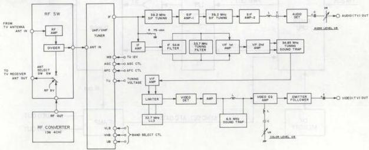

*Fig. 6-1-7 SECAM tuner/IF block diagram*
### 6.2 TV CHANNEL RECEPTION

#### 6.2.1 Operating principle

The voltage synthesizer tuner (VST) principle is indicated in Fig. 6-2-1. Tuning voltage (BT) and PWM data from the timer CPU are smoothed by a lowpass filter. The PWM counter is contained in the CPU and the counter value with respect to each channel voltage is sent as PWM data from the timer CPU.

Generally speaking, the voltage synthesizer has the advantage of lower cost over the frequency synthesizer tuner.

The voltage synthesizer tuner uses a channel memory IC and stores the PWM counter value for the voltage data that provides optimum tuning.

#### 6.2.2 Channel selection

##### 1. Voltage synthesizer tuner

Refer to Fig. 6-2-1. The tuning operation begins with the band data output from the timer CPU. The tuning PWM counter then increments and the smoothed PC voltage rises. This is converted to the tuning voltage BT of between 0 and 40 V.

The tuner unit IF output varies in proportion to the BT voltage. The IF amplifier detects the video signal. If the sync component is detected, this data is sent to the timer CPU. The CPU then slows the PWM counter operation.

Normal tuning is performed at high speed and when the video signal is detected, the tuning rate is lowered to shift to the fine tuning mode. In this mode, the timer CPU detects AFC data (AFC-H/AFC-L) from the IF circuit. The optimum tuning point is detected from the AFC data, at which the tuning operation stops. The tuning data are stored in the channel memory by pressing the Store key.

##### 2. Frequency synthesizer tuner (using a timer CPU)

Refer to Fig. 6-2-2. The frequency synthesizer system differs in that the tuning voltage directly controls the frequency of a local oscillator. The oscillator output then goes to a phase locked loop circuit for controlling the phase level.

Although accuracy is greater than the voltage synthesizer type, cost is also higher. Generally, VST and FST can be differentiated by this feedback from the tuner circuit to the PLL. Some older models used a separate tuner CPU, since the timer CPU memory capacity was inadequate.

##### 3. Frequency synthesizer tuner (using a tuner CPU)

In the frequency synthesizer system (using a tuner CPU), channel frequency data are stored in the timer CPU. When a channel is selected, the timer CPU reads out the corresponding frequency data and transmits it to the PLL controller via the serial data line.

However, in some models such as the HR-D565, the tuner circuit includes the CPU for selecting channels, which sends channel number data to the timer and mechacon CPUs.

The 19 bits serial data are sent to the PLL controller, which selects the band, main oscillator counter (DEV) and the PLL counter. After setting the counters, the internal phase comparator (Phase DET) locks the phase of the tuner unit local oscillator frequency. The tuner unit thus produces the desired frequency.

The frequency synthesizer system is considered best when the broadcast frequency is stable. However, problems can occur with local stations where the transmitted frequency is not as strictly controlled. The PLL system therefore has provision for fine adjustment to allow reception in such cases.

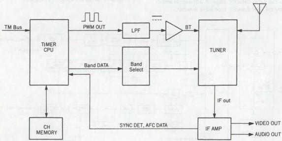

*Fig. 6-2-1 VST (Voltage Synthesizer Tuner) principle*
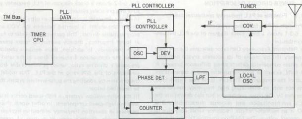

*Fig. 6-2-2 FST (Frequency Synthesizer Tuner) principle - 1*

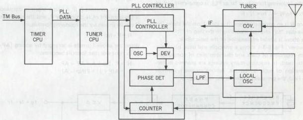

*Fig. 6-2-3 FST (Frequency Synthesizer Tuner) principle - 2*

#### 6.2.3 Tuner CPU

The timer CPU sends channel serial data to the tuner CPU for controlling station selection. Stations are selected by the internal PLL tuner. The main tuner CPU functions are as follows.

1) Accepts control data from the timer CPU.
2) Sends control signals to the tuner unit.
3) Selects the band.
4) Audio mute control during channel selection
5) Audio mute control during no signal

### 6.3 TUNER CIRCUIT DESCRIPTION

#### 6.3.1 Principle of PLL frequency synthesizer tuner

##### 1. Principle of PLL frequency synthesizer

Fig. 6-3-1 shows a basic block diagram of the PLL frequency synthesizer.

The Reference Frequency Oscillator generates the reference frequency (fr) by means of its accurate crystal oscillator. The phase comparator detects phase difference between fr and fo/N, as well as their frequencies, and it transmits the result of the comparison. The LPF (Low Pass Filter) functions not only in eliminating high frequency components generated by the phase comparator but also determines the PLL's synchronization and response characteristics. The VCO is an oscillator whose frequency varies according to the control voltage. The I/N Programmable Divider changes the dividing ratio according to the integer (N) set beforehand.

If "fr" is the reference frequency, and "fo" is the output frequency, the relationship between them can be explained by the following formula as far as PLL is completely locked.

$$
f r = f o / N \rightarrow \therefore f o = N \cdot f r
$$

Since N is an optional integer, it is clear from the above formula that "fo" changes according to the step of "fr".

The above is a brief explanation of the basic block.

However, Fig. 6-3-1 shows a principle and basic block diagram regardless of costs and characteristics of components to be used. In practice, many systems are planned in consideration of such limitations. Among various systems in the field, the pre-scaler system is the most popular.

Fig. 6-3-2 shows a block diagram of PLL frequency synthesizer of a pre-scaler system.

In a basic pre-scaler tuning system, an ultra high speed fixed divider (pre-scaler) is inserted between the VCO and the programmable divider. This permits the divider to function at lower frequency, thereby permitting faster access to a given frequency. In addition, there occurs a phenomenon where the comparison frequency drops at the ratio of the pre-scaler's dividing ratio, which is unfavorable from the viewpoint of the S/N ratio of the PLL. This model solves the problem by adopting the pulse-swallow system that will be described below.

In the pulse-swallow system, a high-speed device is utilized only for high-speed components. In other words, this circuit increases in operation frequency without an increase of the programmable divider's steps or a drop of comparison frequency.

A basic block diagram is shown in Fig. 6-3-1 and when PLL is completely locked, the following formula is achieved.

$$
f o = N \cdot f r
$$

If a certain constant P (P = plus integer) is introduced, Np is the quotient of N divided by P, and the remainder is A. N can be shown by the following formula.

$$
N = P \cdot N p + A
$$

When the above formula is arranged by adding [AP - AP] to its right side, the formula becomes:

$$
\begin{array}{l}
N = P \cdot N p + A + A P - A P \\
= A (P + 1) + P (N p - A)
\end{array}
$$

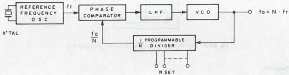

*Fig. 6-3-1 Basic block diagram of PLL frequency system*

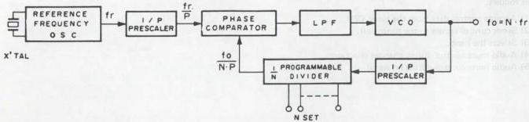

*Fig. 6-3-2 Block diagram of PLL frequency synthesizer of pre-scaler system*

The above formula represents operation of the pulse-swallow system. The details are:

P and P + 1: Pre-scaler's dividing ratios

The pre-scaler is required to provide these two dividing ratios. But it is easier and more economical to adopt the pre-scaler than high-speed programmable dividers.

A: Swallow counter's counting value

Pre-scaler's dividing ratio is changed according to this value. This also shows the lower figure of the whole dividing ratio.

Np: Programmable counter's counting value

This shows the upper figure of the whole dividing ratio.

The following is explanation about the operations of the circuit referring to the formula.

Fig. 6-3-3 shows a block diagram of a programmable divider of the pulse-swallow system.

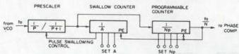

*Fig. 6-3-3 Programmable divider block diagram*

##### 2. Frequency synthesizer TV tuner

As shown in the diagram of Fig. 6-3-4, the synthesizer tuner consists of a tuner unit, one IC for IF and video/audio detection, two PLL controller ICs, and a microprocessor IC1. When the direct selection of a channel is made from the remote controller, the channel data is sent from the mechacon CPU to IC1 via bus. The CPU IC1 converts the channel data into serial data and supplies it to IC2 PLL controller, which then outputs band select data to the tuner. The band select data is used to select the tuner band.

The channel data input to the CPU controls the program divider's counter as shown in the diagram. A PLL data frequency is supplied from the tuner to the program divider, the counter output of which is then supplied to a phase comparator.

The phase comparator compares the phases of the reference signal from the reference signal generator and the frequency from the program divider, and sends tuning data back to the tuner unit. Tuning data is one of three command signals such as tune-up, tune-down, and hold.

On the tuner side, the tuning data is used to control the frequency of the local oscillator which tunes up, down or holds according to the data. The local oscillator feeds back a frequency to the program divider as PLL data, so that the local oscillator is always controlled within this loop to maintain stable reception.

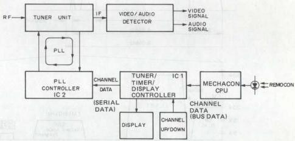

*Fig. 6-3-4 Frequency synthesizer TV tuner*

#### 6.3.2 Audio demodulator circuit

The circuit incorporating a TV tuner which can receive stereo broadcasts is described in this paper. This technical guide describes the stereo tuner section with special emphasis on the demodulator circuit.

##### 1. Principle of US stereo sound broadcasting system

US stereo sound system refers to TV broadcasting systems which transmit another signal between the TV RF frequencies being currently used.

US stereo sound broadcasts feature the common use of the fundamental portion of broadcasting facilities, and receiver currently in use, and can cope with the diversification of information without assigning new channel frequencies. The frequency band that can be used at present is approx. the 250 kHz upper sideband adjacent to the current carrier or the 4.5 MHz band.

The stereo or second audio signal is modulated and positioned in this portion.

The conventional TV audio signal is frequency-modulated by a 4.5 MHz signal, then converted together with the video signal into assigned channel frequencies before being transmitted.

In the U.S. stereo broadcasting method, the stereo sub-audio, signal and Second Audio Program (SAP) signal are added to the baseband audio signal to be frequency-modulated by the 4.5 MHz signal before these are frequency-modulated.

The sub-audio signal is amplitude-modulated by the 2 fh carrier (about 31.5 kHz) whereas the SAP signal is frequency-modulated by the 5 fh carrier (about 78.5 kHz).

At the same time, the fH pilot signal (15.734 kHz) is also transmitted for the detection of stereo broadcasts.

The US stereo method employs the AM-FM method unlike the FM-FM stereo broadcasts already employed in Japan and Europe (notably West Germany). However, as explained already, the SAP signal is transmitted simultaneously, together with the main audio and sub-audio signals.

The figure shows the relationship between the audio frequency spectrum and frequency deviation in the US stereo broadcast method.

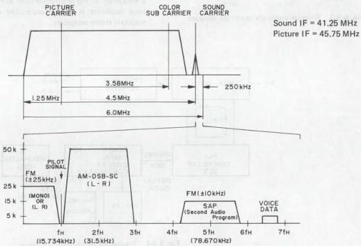

*Fig. 6-3-4 US stereo sound baseband spectrum*

Here, the features of the US stereo broadcasting method are described.

The main feature of the US method is that the Second Audio Program (SAP) signal is transmitted simultaneously with the sub-audio signal.

In other conventional stereo methods, the stereo broadcast was clearly distinguished from the bilingual broadcast, and it was impossible to tune to these simultaneously.

On the other hand, in the US method, it is possible to the Second Audio Program (SAP) while tuned to the stereo broadcast.

As such, since in this stereo method the three different sets of audio information are received simultaneously, the demodulator circuit in the receiver will become somewhat complex.
##### 2. West Germany sound multiplex broadcasting system

The West Germany sound multiplex system employs the FM-FM method.

This system modulates a 5.7421875 MHz carrier, which is separate from the normal 5.5 MHz FM sound carrier, for,

transmission takes place with sub audio carrier and multiplex pilot signal.

This system features the transmission of STEREO and BILINGUAL signals.

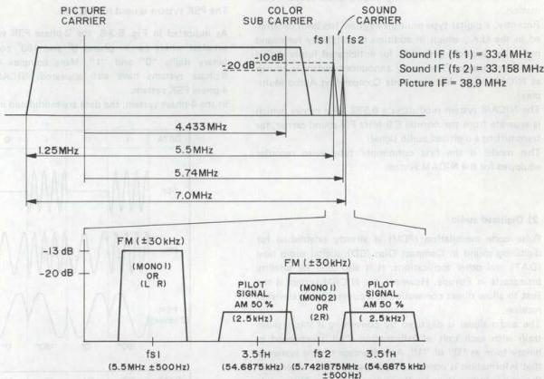

*Fig. 6-3-5 West Germany sound multiplex baseband spectrum*

Fig. 6-3-5 illustrates the spectral diagram of the West Germany sound multiplex signal.

The main audio signal has 50 microseconds pre-emphasis and deviates the aural carrier $30\mathrm{kHz}$. The sub audio signal is $30\mathrm{kHz}$ deviated FM signal centered at 5.7421875 MHz.

In addition, the sub audio signal includes a pilot signal modulated on a 5.7421875 MHz. The pilot signal is carrier frequency of 3.5 fH = 54.6875 kHz, AM waveform modulated by 50%.

The BILINGUAL signal consists of 5.5 MHz main audio signal (MONO 1) and 5.7421875 MHz sub audio signal (MONO 2).

The STEREO signal consists of main audio signal $(\mathsf{L} + \mathsf{R})$ and sub audio signal (2 R). In the case of stereo mode, the L-R signal must be supplied to STEREO MATRIX circuit. Therefore, at ADDER circuit, the sub audio signal (2 R) is subtracted from the main audio signal $(\mathsf{L} + \mathsf{R})$ to yield L-R signal.

The automatic sound multiplex system selection is controlled by pilot signal. The pilot signal detection is as follows. The sub channel signal goes through the $54.7\mathrm{Hz}$ (3.5 fH) tuning circuit, and the pilot detector circuit. After AM detection, the pilot signal is sent to bandpass filter.

The bandpass filter is composed of 117.5 MHz and 274.1 Hz active bandpass filters. Only the frequency component of the pilot signal becomes amplified, then rectified and supplied as DC voltage to the non-invert inputs of 117.5 Hz comparator and 274.1 Hz comparator.

The reference signal is applied to the invert inputs of comparators.

High level comparator outputs are obtained only when the level of inputs exceeds the reference voltage.

The following table indicates 117.5 Hz comparator output and 274.1 Hz comparator output by mode.

|  Mode | Comparator (117.5 Hz) | Comparator (274.1 Hz)  |
| --- | --- | --- |
|  MONAURAL | Low | Low  |
|  STEREO | High | Low  |
|  BILINGUAL | Low | High  |

The comparator outputs go to the control logic circuit.

The control logic circuit controls the switching circuit. In the switching circuit, the BILINGUAL/STEREO SWITCHING MATRIX is controlled by data from the control logic circuit.
##### 3. NICAM system (EK sound multiplex broadcasting system)

###### 1) Technical outline

Presently operating audio multiplex systems for television broadcast are those of the United States, Europe (notably West Germany) and Japan. All of these methods are analog and adequate for transmitting multiplexed sound information.

Recently, a digital type multiplex system has been developed in the U.K., which in addition to suitability for sound multiplex, includes provision for anticipated future digital data transmission. The newly announced system is known as NICAM (Near Instantaneous Companding Audio Multiplex).

The NICAM system modulates a 6.552 MHz carrier, which is separate from the normal 6.0 MHz FM sound carrier, for transmitting a digitized audio signal.

This model is the first consumer type video recorder equipped for the NICAM system.

###### 2) Digitized audio

Pulse code modulation (PCM) is already established for digitizing sound in Compact Disc (CD), digital audio tape (DAT) and other applications. It is also used for satellite broadcasts in Europe. However, the NICAM system is the first to allow direct connection to a conventional television receiver.

Generally speaking, digital transmission is superior in terms of power and bandwidth when conveying high SN audio signals. A major factor in determining SN for a digital signal is quantum type noise. For each additional bit of digitized data, the SN is improved by 6 dB.

This allows use of a narrower signal bandwidth compared to an analog signal, for transmitting high SN audio signals. PCM (pulse code modulation) baseband transmission is typically performed for digitized signals. The analog sound signal is applied to an A/D (analog to digital) converter, which changes it into a parallel digital signal. This is further converted into a series signal and sent to the transmission circuit. A frame synchronization signal is inserted for distinguishing each transmitted "word" at the receiver.

The PCM signal carrier is modulated for transmitting the digital sound signal. The following three types of modulation systems are presently utilized.

- Amplitude shift keying (ASK)
- Frequency shift keying (FSK)
- Phase shift keying (PSK)

The PSK system is used for NICAM.

As indicated in Fig. 6-3-6, the 2-phase PSK system is the simplest where carrier phases $0^{\circ}$ and $180^{\circ}$ correspond to binary digits "0" and "1". More complex 4-phase and 8-phase systems have also appeared. NICAM uses the 4-phase PSK system.

In the 4-phase system, the data are modulated in 2-bit sets.

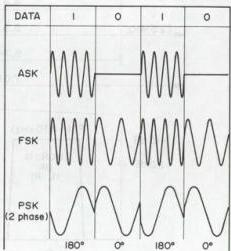

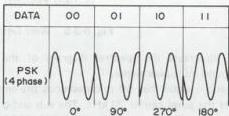

*Fig. 6-3-6 PCM signal carrier*

Digital
###### 3) RF characteristics of NICAM audio signal

The frequency spectrum of the British System I is shown in Fig. 6-3-7. The sound is frequency modulated 6.0 MHz. In addition, the NICAM RF signal includes a 4-phase PSK signal modulated on a 6.552 MHz carrier.

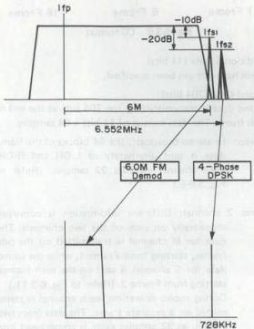

*Fig. 6-3-7 RF characteristics*

The relationship between the input data and 4-phase PSK signal is indicated in the following table.

|  Input Data | 6.552 MHz Carrier Phase  |
| --- | --- |
|  0 0 | 0°  |
|  0 1 | -90°  |
|  1 0 | -270°  |
|  1 1 | -180°  |

Table 6-3-1 4-phase PSK

The receiver detects the data phase to provide accurate conversion. Data is transmitted at 728 k-bits per second and the carrier is 9 times this value or 6.552 MHz.

###### 4) Baseband format

##### 1. Frame composition

As indicated in Fig. 6-3-8, the transmitted serial data is sent continuously at 728 bits per frame. At 1 ms per frame, the digital data bit rate is 728 k bits per second. Data composition is as follows.

- 8 bits Frame Alignment Word (FAW) 8 k-bits per sec
- 5 bits Control Information 5 k-bits per sec
- 11 bits Additional Data 11 k-bits per sec
- 704 bits Sound + Parity Data 704 k-bits per sec

The 720 bits excluding the 8-bit FAW data are basically comprised of the C, D and D2 MAC systems employed for DBS (direct broadcast satellite) applications. Therefore the already existing MAC system can be used for the digital decoder of the receiver.

The 704-bit Sound Data component also allows transmission of specialized data not included in the 24 bits allotted to FAW, Control Information and Additional Data.

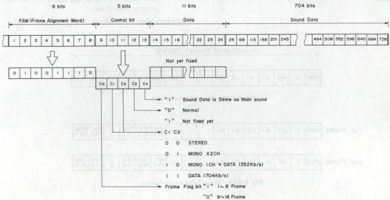

*Fig. 6-3-8 Frame data format*

(a) Frame Alignment Word (8 bits)

These bits synchronize the data of each frame. The bits are fixed at 01001110 and indicate the start of the transmitted frame.

(b) Control Information (5 bits)

The 5 bits indicate the type of sound data as noted in the following table.

|  Control Bit | Data | Information  |
| --- | --- | --- |
|  C0 | 1 | Frame flag bit Frame 1-8  |
|   |  0 | Frame flag bit Frame 9-16  |
|  C1, C2 | C1 C2 |   |
|   |  0 0 | Stereo broadcast (L & R alternate in same frame)  |
|   |  0 1 | Two monaural transmissions (sent in separate frames)  |
|   |  1 0 | One mono channel and 352 kb/s digital data (sent in separate frames)  |
|   |  1 1 | 704 kb/s digital data  |
|  C3 | 0 | Normal broadcast  |
|   |  1 | Unspecified  |
|  C4 | 0 |   |
|   |  1 | Sound data same as main sound  |

Table 6-3-2

- Flag bit C0

This flag bit is for distinguishing Frames 1 through 8 (data "1") or Frames 9 through 16 (data "0"). The frame flag is utilized as a synchronization signal when the control signal data changes during reception. When the control data changes, the flag data changes from "1" to "0", thus allowing system command selection from the first frame.

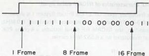

*Fig. 6-3-9 C0 format*

(c) Additional Data (11 bits)

These have not yet been specified.

(d) Sound Data (704 bits)

Sound data is transmitted by the 704 bits at the end of each frame. The data consist of 11 bits x 64 samples.

- Stereo: In stereo broadcast, the 64 blocks of the frame data is sent alternately as L-CH and R-CH. Each channel includes 32 samples. (Refer to Fig. 3-6-5.)

- Mono 2 channel: Different information is conveyed monaurally on each of the two channels. The data for M channel is transmitted on the odd frames, starting from Frame 1, while the sound data for S channel is sent on the even frames, starting from Frame 2. (Refer to Fig. 6-3-11.) During mono operation, each channel is transmitted on a separate frame. The data from two frames, at 32 samples each, is compressed into one frame.

- Mono 1-CH + Data: The monaural sound information is sent on the odd frame, while the data is transmitted on the even frame. The mono sound data composition is the same as in the previous item, while the digital data assignment has not yet been determined.

- Data broadcast: This capability is presently under study.

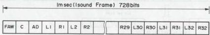

*Fig. 6-3-10 Stereo mode format*

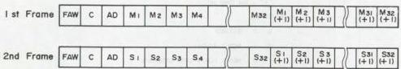

*Fig. 6-3-11 Mono 2-CH mode format*
###### 5) Digitized sound

The audio signal is sampled at $32\mathrm{kHz}$, resulting in 32 samples for each channel per frame, or a total of 64 samples per frame. The sampled data is in 14-bit parallel form. This is compressed (near-instantaneous companding) into 11 serial bits consisting of 10 bits data plus one parity bit for error detection and scale factor signalling purposes to become the transmitted signal. (Refer to Fig. 6-3-12.)

Fig. 6-3-13 indicates the sound data composition for one frame. In order to avoid error due to such causes as transmission system noise, interleaving is applied to the 720 bits that follow the FAW, but not to the frame alignment word at the start of the frame. This separates the data of each frame by 16 clock periods, thereby minimizing the effects of errors.

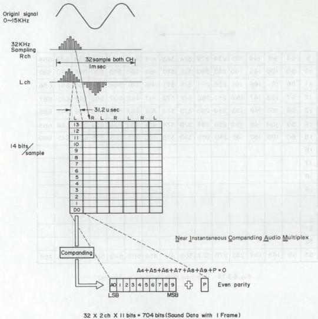

*Fig. 6-3-12 Digitized sound*

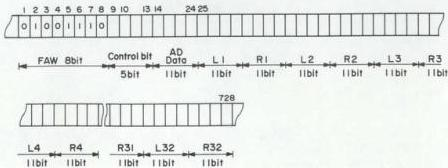

*Fig. 6-3-13 Sound data composition*

As indicated in Fig. 6-3-14, the data bits after the FAW are transferred to memory, then the interleaved data for each frame is transmitted.

The data is scrambled, in which the flag bit (0 and 1) parity of the transmitted data is avoided, thus simplifying FAW sampling. Scrambling is performed by a pseudo random sequence generator. Of course, a similar circuit is included in the receiver for de-scrambling and returning the original signal.

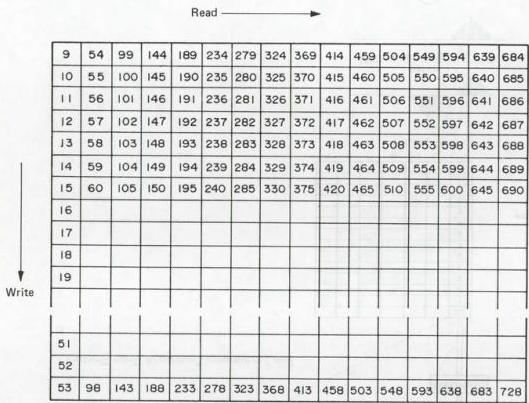

*Fig. 6-3-14 Interleave data (memory read/write)*

Digital
##### 4. VPS system

###### 1) VPS (Video Programming System)

##### 1. General description

The VPS controls timer recording of the VTR (VCR) with data multiplexed to video recording signals.

The VTR extracts such data signals from multiplexed video signals to record TV programs designated previously, while the user sets each program's starting time by appointing month, day, hour, minute and the channel number (timer programming).

The VPS has the advantage of conventional timer recording system, because the VPS can record designated programs if their scheduled times are changed.

##### 2. Outline of the system

VPS data having 2.5 M bits/sec transmission rate and being modulated by bi-phase are multiplexed to the 16th scanning line.

As shown in Fig. 6-3-15, this bi-phase modulation forms regular wave having a low and high level in every bit, and it is designed so that the logical value "1" is at $H \rightarrow L$, while "0" at $L \rightarrow H$.

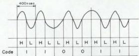

*Fig. 6-3-15 Bi-phase modulation*

There are 15 words of VPS data, and each word consists of 8 bits.

Fig. 6-3-16 shows video signals on the 16th scanning line.

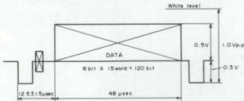

*Fig. 6-3-16 16th scanning line video signal*

##### 3. Contents of VPS data

**Word 1: RUN IN**

Succession of logical value 1's — namely, CLOCK component itself, which makes clock pulse extraction by the decoder with ease.

**Word 2: START CODE**

Used to judge whether the decoded datum is effective or not, and to determine positioning of bits.

The signal of this word is contradictory to the rule of bi-phase modulation (succession of bits having an H and L level each).

Consequently, Word 1 and Word 2 are fixed signals as shown in Fig. 6-3-17.

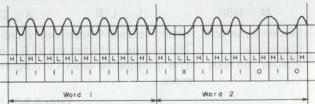

*Fig. 6-3-17 Word 1 and Word 2 signals*

**Word 3: Program Source Identification (Binary coded)**

**Word 4: Program Source Identification (ASCII)**

**Word 5: Sound and Picture Identification**

|  Bit No. Code | 1 2 |  | 3 4 |   | 5 6 7 8  |
| --- | --- | --- | --- | --- | --- |
|  0 | 0 0 | Bilingual | 0 0 | For Adult | Reserve  |
|  1 | 0 1 | Mono | 0 1 | No Adult  |   |
|  2 | 1 0 | Stereo | 1 0 | For Adult  |   |
|  3 | 1 1 | Bilingual | 1 1 | For Adult  |   |

**Word 6: Program/Test Picture Identification**

**Word 7: Internal Information Exchange**

**Word 8: Address Assignment of Signal Distribution**

**Word 9: Address Assignment of Signal Distribution**

**Word 10: Messages/Commands**

**Note:** Words 3 through 10 are not used in this mode.

**Words 11-14: VCR Control Information**

(Refer to Table 3-8-1.)

**Word 15: Reserved code**

|  Word No. | 11 | 12 | 13 | 14 | 15 | 16 | 17 | 18 | 19 | 20 | 21 | 22 | 23 | 24 | 25 | 26 | 27 | 28 | 29 | 30 | 31  |
| --- | --- | --- | --- | --- | --- | --- | --- | --- | --- | --- | --- | --- | --- | --- | --- | --- | --- | --- | --- | --- | --- |
|  Bit No. | 1 | 2 | 3 | 4 | 5 | 6 | 7 | 8 | 9 | 10 | 11 | 12 | 13 | 14 | 15 | 16 | 17 | 18 | 19 | 20 | 21  |
|  VPS Bit No. | Area Code Day Month M M L |   |   |   |   |   |   | Hour M M L |   |   |   |   |   |   | County Code M M L  |   |   |   |   |   |   |
|  Special Codes |   |   |   |   |   |   |   |   |   |   |   |   |   |   |   |   | X  |   |   |   |   |
|  System Status code | X | 0 0 0 0 0 | 1 1 1 1 | 1 1 1 1 1 | 1 1 1 1 1 | 1 1 1 1 1 | 1 1 1 1 1 | 1 1 1 1 1 | 1 1 1 1 1 | 1 1 1 1 1 | 1 1 1 1 1 | 1 1 1 1 1 | 1 1 1 1 1 | 1 1 1 1 1 | 1 1 1 1 1 | 1  |   |   |   |   |   |
|  Blank code | X | 0 0 0 0 0 | 1 1 1 1 | 1 1 1 0 1 | 1 1 1 1 1 | 1 1 1 0 1 | 1 1 1 1 1 | 1 1 1 1 1 | 1 1 1 1 1 | 1 1 1 1 1 | 1 1 1 1 1 | 1 1 1 1 1 | 1 1 1 1 1 | 1 1 1 1 1 | 1  |   |   |   |   |   |   |
|  Interruption code | X | 0 0 0 0 0 | 1 1 1 1 | 1 1 1 0 1 | 1 1 1 1 1 | 1 1 1 1 1 | 1 1 1 1 1 | 1 1 1 1 1 | 1 1 1 1 1 | 1 1 1 1 1 | 1 1 1 1 1 | 1 1 1 1 1 | 1 1 1 1 | 1  |   |   |   |   |   |   |   |

M : MSB
L : LSB
X : Don't care.

System status code: When this code is outputted, recording is controlled by the VTR's timer programming system.
Blank code : This is outputted when the VTR is receiving valueless TV signals such as of a test pattern.
Interruption code : This is outputted when TV program in reception is interrupted. The VTR stands by in REC PAUSE mode.

Table 6-3-3 VCR control data

