# SMPTE STANDARD

SMPTE 32M-1998
Revision of ANSI/SMPTE 32M-1993

for Video Recording —
1/2-in Type H —
Cassette, Tape and Records

## Table of contents

1. Scope
2. Normative references
3. Basic type H parameters and characteristics
4. LP and EP modes
5. FM audio recording characteristics
6. Compact video tape and cassette
7. High-performance type H cassette, records and system
- Annex A: High-quality mode technology
- Annex B: Compact video cassette adaptor

## 1 Scope

This standard specifies the characteristics and parameters for type H, helical-scan, 1/2-in video tape recorders operating with video signals as defined by ITU-R BT.470 and ANSI/SMPTE 170M, and having a typical scanning structure of 525 lines, 59.94 fields per second, and 2:1 interlace.

This standard also specifies the double record time mode (long play, LP) and the triple record time mode (extended play, EP), and optional frequency modulation (FM) audio recording.

This standard further specifies the dimensions of the video tape and compact video cassette for use in a type H, helical-scan, 1/2-in video tape recording cassette system with the aid of a cassette adaptor.

Finally, this standard specifies the characteristics and parameters for high-performance type H, helical-scan, 1/2-in video tape recorders operating with video signals as defined by ITU-R BT.470 and ANSI/SMPTE 170M, and having a typical scanning structure of 525 lines, 59.94 fields per second, and 2:1 interlace.

## 2 Normative references

The following standards contain provisions which, through reference in this text, constitute provisions of this standard. At the time of publication, the editions indicated were valid. All standards are subject to revision, and parties to agreements based on this standard are encouraged to investigate the possibility of applying the most recent edition of the standards indicated below.

ANSI/SMPTE 170M-1994, Television — Composite Analog Video Signal — NTSC for Studio Applications

ITU-R BT.470-4, Television Systems

## 3 Basic type H parameters and characteristics

### 3.1 General specifications

#### 3.1.1 Measurement conditions

The dimensions shall be measured with no transverse or longitudinal tension applied to the tape.

#### 3.1.2 Measurement environment

The temperature shall be $20^{\circ}\mathrm{C} \pm 1^{\circ}\mathrm{C}$, with a relative humidity of $(50 \pm 2)\%$.

The user's attention is called to the possibility that compliance with this standard may require use of an invention covered by patent rights.

By publication of this standard, no position is taken with respect to the validity of this claim or of any patent rights in connection therewith. The patent holder has, however, filed a statement of willingness to grant a license under these rights on reasonable and nondiscriminatory terms and conditions to applicants desiring to obtain such a license. Details may be obtained from the publisher.

No representation or warranty is made or implied that this is the only license that may be required to avoid infringement in the use of this standard.

Approved

September 23, 1998

#### 3.1.3 Tape speed

The tape speed shall be 33.35 mm/s ± 0.5%.

#### 3.1.4 Video writing speed

The nominal video writing speed shall be 5.80 m/s.

#### 3.1.5 Video head drum diameter

The video head drum diameter shall be 62.00 mm ± 0.01 mm.

### 3.2 Video tape and video cassette

#### 3.2.1 Tape characteristics

##### 3.2.1.1 Length and thickness dimensions

The length and thickness dimensions of the video tape shall be as given in table 1.

##### 3.2.1.2 Tape width

The average tape width shall be 12.65 mm ± 0.01 mm. Width fluctuation shall not exceed 6 µm. The average tape width is the average of measured values of the width of the video tape, made at many points along a length of the video tape.

##### 3.2.1.3 Tape type

The type of video tape to be used shall be high resolution video tape (for example, cobalt iron-oxide tape).

##### 3.2.1.4 Coercivity

The coercivity shall be approximately 50 × 10³ A/m.

#### 3.2.2 Leader and trailer tape

##### 3.2.2.1 Length

The length of the leader and trailer tape shall be as follows:

- T-160, T-120 and T-90 170 mm ± 20 mm;
- T-60 and T-30 150 mm ± 20 mm.

The length of the leader and trailer tape is defined to be the distance between the point where they attach to the reel hub and the point where they attach (splice) to the magnetic tape.

##### 3.2.2.2 Thickness and width

The thickness of the leader and trailer tape shall be 40 µm ± 5 µm – 25 µm. The width shall be 12.65 mm ± 0.03 mm.

##### 3.2.2.3 Material

The material shall be polyester film or its equivalent with a light transmission greater than 50% (measured over the range of wavelengths 800 nm to 950 nm).

##### 3.2.2.4 Attachment

The attachment of the leader and the trailer to the video tape and to the reel hubs shall be capable of withstanding a pulling force of at least 30 N. The leader-to-video-tape and trailer-to-video-tape splicing gaps shall each be less than 0.07 mm.

#### 3.2.3 Video cassette

Dimensions for the video cassette are shown in figures 1 to 5. The path of the video tape within the cassette is shown in figure 6.

Table 1 – Video tape dimensions

|  Name | Tape length m | Playing time min | Reel hub diameter mm | Tape thickness µm  |
| --- | --- | --- | --- | --- |
|  T-160 | 327 +3 0 | 160 | 26 | 15.6 ± 0.5  |
|  T-120 | 246 +3 0 | 120 | 26 | 19.0 +1 –2  |
|  T-90 | 185 +3 0 | 90 | 26 | 19.0 +1 –2  |
|  T-60 | 125 +3 0 | 60 | 62 | 19.0 +1 –2  |
|  T-30 | 64 +3 0 | 30 | 62 (or 70) | 19.0 +1 –2  |

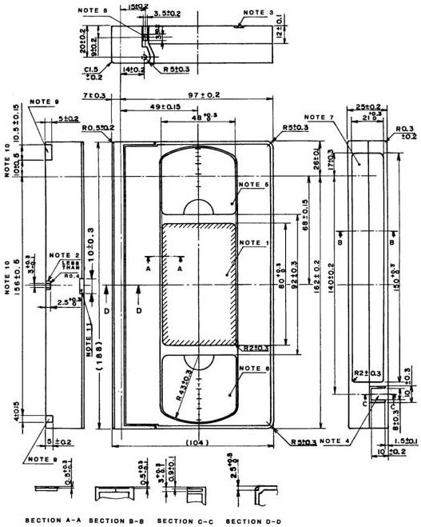

*Figure 1 – Top and side views of video cassette*

**NOTES**

1. Top label area.
2. Guide groove A to prevent improper insertion.
3. Guide groove B to prevent improper insertion.
4. Break-out lug to prevent accidental erasure.
5. Window for take-up reel.
6. Window for supply reel.
7. Side label area.
8. Unlocking pin for the front cover. The unlocking force is less than 0.15 N.
9. Groove for positioning of cassette.
10. Allowances include slight play of the front cover.
11. Recess to prevent improper insertion.

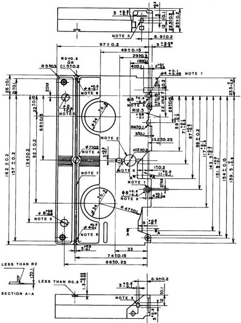

*Figure 2 – Bottom view of video cassette*

**NOTES**

1. Reference hole.
2. Hole for the sensor lamp.
3. Hole for the sensor light pass.
4. Unlocking hole for the reel brake. The unlocking force is less than 0.69 N.

5. Datum plane. The flatness of the four datum planes shall be less than 0.2 mm.
6. Guide groove A to prevent improper insertion.
7. Guide groove B to prevent improper insertion.
8. Auxiliary hole position.

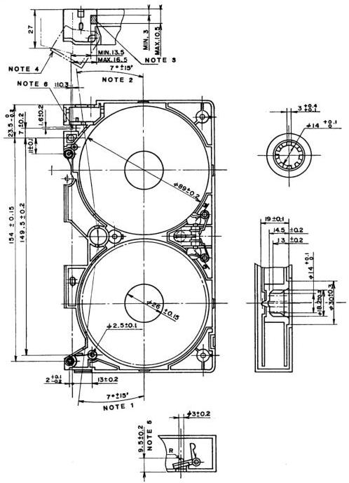

*Figure 3 – Inner structure and reels*

**NOTES**

1. Sensor light angle of supply side.
2. Sensor light angle of take-up side.
3. Pushing position of the cover unlocking device of the recorder.

4. The cover opens more than 27 mm. The opening force is less than 1 N.
5. Position of the brake unlocking pin of the recorder.
6. Position of the lever in the recorder for opening the cassette cover.

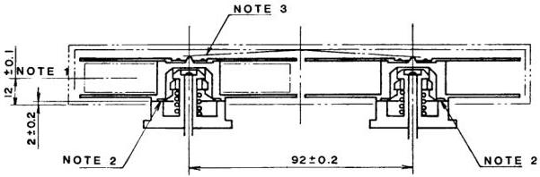

**NOTES**

1. Center of tape.
2. Height of the reel base from the cassette datum plane. The cassette shall operate smoothly at a height of 2.0 mm + 0.8 mm – 0.5 mm.
3. Reel spring.

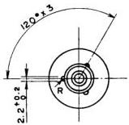

*Figure 4 – Relationship between reels and spindles*

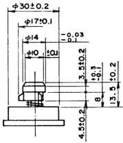

*Figure 5 – Reel spindle*

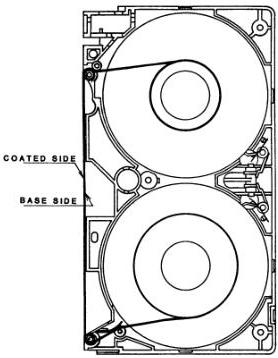

*Figure 6 – Tape winding*

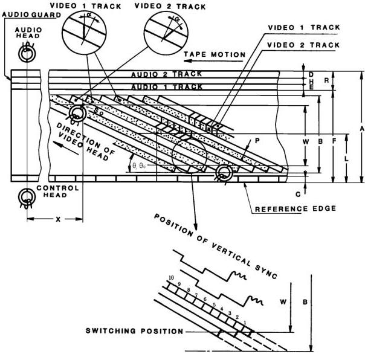

*Figure 7 – Track configuration from magnetic coating side*

Table 2 – Track configuration (refer to figure 7)

|  Dimensions | Description | SP mode mm  |
| --- | --- | --- |
|  A | Tape width | 12.65 ± 0.01  |
|  B | Video recording area width | 10.6  |
|  C | Control track width | 0.75 ± 0.10  |
|  D | Audio 2 track width (stereophonic) | 0.35 ± 0.05  |
|  E | Audio 1 track width (stereophonic) | 0.35 ± 0.05  |
|  F | Audio track reference line | 11.65 ± 0.05  |
|  H | Audio-to-audio track guard band | 0.3  |
|  L | Video track center from reference edge of tape | 6.2  |
|  P | Video track pitch | 0.058  |
|  R | Audio track width (monophonic) | 1.0 ± 0.1  |
|  T | Video track width | 0.058  |
|  W | Video recording effective area | 10.07  |
|  X | Position of audio and control track head | 79.244  |
|  α | Video head azimuth angle | +6° and –6°  |
|  θ | Video track angle | 5° 58′ 9.9″  |
|  θ₀ | Video track angle (tape stationary) | 5° 56′ 7.4″  |
|   | Track shift error (from logical value) | 0.014  |
|   | Track bend (peak-to-peak value) | 0.014  |
|  NOTES 1 Values are nominal where there are no tolerances specified. 2 Dimension θ₀ represents the video track angle without linear motion of the video tape, such as might result from repetitive reading of a single track (one field) of the video record on the tape.  |   |   |

### 3.3 Video tape records; SP mode track configuration and dimensions

The track configuration and the transverse and longitudinal dimensions in the SP mode shall be as specified in figure 7 and table 2.

### 3.4 Audio and control track head position

The distance X on the tape pattern, from the end of the 180° scan of a video head to the audio and control track head position, shall be 79.244 mm, as shown in figure 7.

### 3.5 Audio record displacement

Program audio or other information which is time coincident with video information recorded at a point S₀ of the video 2 track shall be recorded on either audio track at a distance X downstream from that point (S₀). (See figure 7.) S₀ is the center of the video track at the switching position of the video heads.

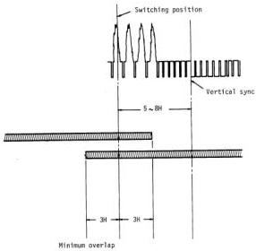

*Figure 8 – Switching position and overlap of two video heads*

### 3.6 Video head switching

The switching position between the two heads during playback shall lie between 5 and 8 horizontal lines ahead of the leading edge of the vertical sync signal, as shown in figure 8.

### 3.7 Tape tension

The tape tension for the record and playback modes, measured with a spring scale for a full supply reel, shall be normally from 0.30 N to 0.45 N at the entrance of the drum when the tape is pulled at the specified speed.

### 3.8 Relationship of video track and video field signal

Type H recording devices, whose applications require that each video signal field and video tape track be distinguished, shall record video field 1 on video tape track 1, and video field 2 on video tape track 2.

### 3.9 Video recording

The video recording system shall provide separate signal paths for the luminance and chrominance signals. The luminance signal shall be frequency modulated on a high-frequency rf carrier signal prior to recording. The chrominance signal shall be downconverted to a low frequency prior to recording. After this separate processing, the signals shall be combined and recorded together on a single video track.

#### 3.9.1 Luminance channel

##### 3.9.1.1 Signal processing

A luminance signal processing system, as specified in this standard, shall contain the following elements in the order of the signal flow:

###### 3.9.1.1.1 Separation filter

The luminance signal component of the composite video signal shall be separated from the chrominance component by a filter that attenuates the luminance signal by no less than 40 dB at the chrominance subcarrier frequency.

###### 3.9.1.1.2 Preemphasis

The luminance video signal shall be preemphasized prior to frequency modulation. The preemphasis network characteristic shall be as shown in figure 9.

###### 3.9.1.1.3 Clipping

The preemphasized luminance video signal shall be clipped prior to frequency modulation. The clipping levels are as shown below. The level from sync tip to peak white is defined to be 100%.

- White clipping level measured from tip of sync: 160% nominal, 155% minimum, 200% maximum;
- Dark clipping level measured from tip of sync: 40% nominal, -50% minimum, -30% maximum.

###### 3.9.1.1.4 Modulation characteristics

The preemphasized and clipped luminance video signal shall be frequency modulated (FM) by a linear frequency modulator, having constant deviation with respect to the amplitude of the modulating frequencies, on an rf carrier corresponding to the reference luminance video levels below:

- Reference white level (100 IRE units) 4.4 MHz ± 0.1 MHz;
- Reference sync level (-40 IRE units) 3.4 MHz ± 0.1 MHz;
- Frequency deviation, ref white to ref sync (140 IRE units) 1.0 MHz ± 0.1 MHz.

###### 3.9.1.1.5 High-pass filter

The FM rf carrier, frequency modulated by the luminance video signal, shall be processed by a high-pass filter prior to recording. The high-pass filter network characteristic shall be as shown in figure 10.

###### 3.9.1.1.6 Recording level

The record current shall be set to the optimum value over the entire bandwidth of the FM carrier. Optimum record current shall be that which returns the maximum output signal level during playback.

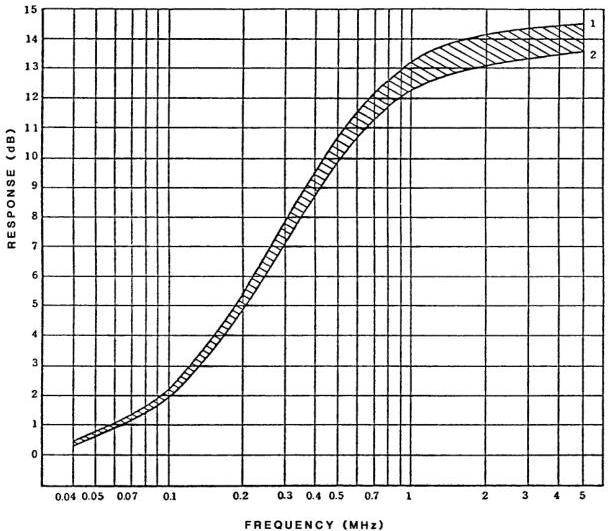

*Figure 9 – Preemphasis characteristic of luminance signal*

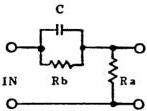

T = C × Rb = 1.3 μs ± 0.05 μs
T = 1.35 μs
X = 4.3
} . . . (1)

X = Rb/Ra = 4 ± 0.3
T = 1.25 μs
X = 3.7
} . . . (2)

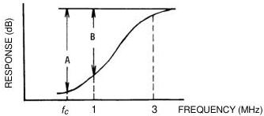

*Figure 10 – FM high-pass filter*
A = Greater than 17 dB.
B = Greater than 10 dB.
$f_{c}$ = Converted chrominance carrier frequency (629.371 kHz).

#### 3.9.2 Chrominance channel

##### 3.9.2.1 Signal processing

A chrominance signal processing system, as specified by this standard, shall contain the following elements in the order of signal flow:

###### 3.9.2.1.1 Separation filter

The chrominance signal component of the composite video signal shall be separated from the luminance component by a band-pass filter. Characteristics of the band-pass filter shall be as follows:

- Center frequency: 3.58 MHz;
- Response: –3 dB at 4.08 MHz; –3 dB at 3.08 MHz.

###### 3.9.2.1.2 Recording level

The chrominance signal is recorded directly on the video tape as an amplitude modulated (AM) rf carrier. Record level shall be such that the amplitude of the played back chrominance signal is 7 dB to 10 dB below the saturation level of the recording chrominance signal.

###### 3.9.2.1.3 Color burst amplitude doubler

The amplitude of the color burst part of the chrominance signal shall be increased by $6.0\mathrm{dB}\pm 0.5\mathrm{dB}$ prior to recording.

###### 3.9.2.1.4 Chrominance frequency conversion

The chrominance signal shall be (down) converted such that the new carrier frequency to be recorded equals the horizontal scanning rate, multiplied by 40 (629.371 kHz). (See figure 11.)

###### 3.9.2.1.5 Chrominance carrier phase rotation

The chrominance carrier shall be shifted in phase at every horizontal sync pulse as follows:

- video track 1: Advance $+90^{\circ}$ from the carrier phase of the previous horizontal line period;
- video track 2: Retard $-90^{\circ}$ from the carrier phase of the previous horizontal line period.

Shift of phase shall be completed before color burst occurs in each horizontal blanking interval.

#### 3.9.3 Recording signal

##### 3.9.3.1 Luminance and chrominance combination

The FM luminance carrier and AM chrominance carrier shall be combined before recording.

##### 3.9.3.2 Record amplifier

An amplifier shall be provided to supply recording signal current drive to the record heads.

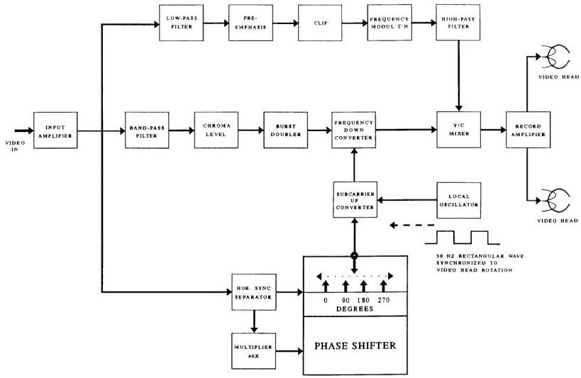

*Figure 11 – Record process block diagram*

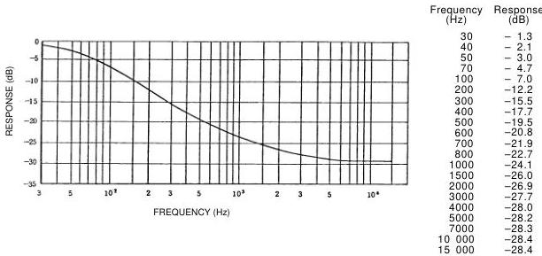

*Figure 12 – Reproducing deemphasis of audio signal*

### 3.10 Longitudinal audio signal recording

Two longitudinal tape tracks shall be provided for the recording of audio signals. These shall be as specified in figure 7 and table 2.

#### 3.10.1 Recording level

The recording reference audio level shall be 100 nWb/m.

#### 3.10.2 Audio signal recording current characteristics

Recording current shall have a characteristic such that the reproduced output shall be of essentially flat frequency response after application of the deemphasis characteristic shown in figure 12. The time constants shall be 120 µs and 3180 µs.

#### 3.10.3 Relative polarity

For stereo program material, the relative polarity of the audio signals at the inputs to a stereo television video tape recorder shall be such that any monophonic component of the program shall have the same polarity in the magnetic records of both channels.

#### 3.10.4 Audio track allocation

For stereo audio associated with television program material, audio track 1 shall carry the discrete left (L) signal and audio track 2 shall carry the discrete right (R) signal. The terms left and right shall relate to the viewer's perspective.

### 3.11 Control signal

#### 3.11.1 Recording signal

The positive-going edge of the recorded control pulse signal shall be in coincidence with the start of video 1 track scan as shown in figure 13.

#### 3.11.2 Polarity

The control signal shall be recorded so that the rotating drum side of the control head poles shall be north polarized when the pulse signal is positive.

#### 3.11.3 Recording current waveform

The rise time shall be less than 200 µs.

## 4 LP and EP modes

### 4.1 Tape speed

The tape speed shall be 16.67 mm/s ± 0.5% in the LP mode and 11.12 mm/s ± 0.5% in the EP mode.

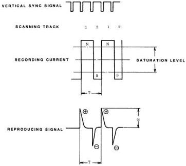

*Figure 13 – Control signal waveform and polarity*

Table 3 – Track configuration (refer to figure 7)

|  Dimensions | Description | LP mode mm | EP mode mm  |
| --- | --- | --- | --- |
|  A | Tape width | 12.65 ± 0.01 | 12.65 ± 0.01  |
|  B | Video recording area width | 10.6 | 10.6  |
|  C | Control track width | 0.75 ± 0.10 | 0.75 ± 0.10  |
|  D | Audio 2 track width (stereophonic) | 0.35 ± 0.05 | 0.35 ± 0.05  |
|  E | Audio 1 track width (stereophonic) | 0.35 ± 0.05 | 0.35 ± 0.05  |
|  F | Audio track reference line | 11.65 ± 0.05 | 11.65 ± 0.05  |
|  H | Audio-to-audio track guard band | 0.3 | 0.3  |
|  L | Video track center from reference edge of tape | 6.2 | 6.195  |
|  P | Video track pitch | 0.029 | 0.019  |
|  R | Audio track width (monophonic) | 1.0 ± 0.1 | 1.0 ± 0.1  |
|  T | Video track width | 0.029 | 0.019  |
|  W | Video recording effective area | 10.07 | 10.07  |
|  X | Position of audio and control track head | 79.251 | 79.253  |
|  α | Video head azimuth angle | +6° and -6° | +6° and -6°  |
|  θ | Video track angle | 5° 57' 8.5" | 5° 56' 8.1"  |
|  θ0 | Video track angle (tape stationary) | 5° 56' 7.4" | 5° 56' 7.4"  |
|   | Track shift error (from logical value) | 0.010 | 0.010  |
|   | Track bend (peak-to-peak value) | 0.010 or less | 0.010 or less  |
|  NOTES  |   |   |   |
|  1 Values are nominal where there are no tolerances specified.  |   |   |   |
|  2 Dimension θ0 represents the video track angle without linear motion of the video tape, such as might result from repetitive reading of a single track (one field) of the video record on the tape.  |   |   |   |

Table 4 – Response characteristics of subpreemphasis for basic system

|  LP mode |   |   |   |   |   | Unit dB  |
| --- | --- | --- | --- | --- | --- | --- |
|  Frequency Input level (dB) | 50 kHz | 200 kHz | 500 kHz | 1 MHz | 2 MHz | 3 MHz  |
|  0 | 0 ± 0.3 | 0 ± 0.4 | 0.1 ± 0.4 | 0.7 ± 0.4 | 1.2 ± 0.5 | 1.5 ± 0.6  |
|  -10 | 0 ± 0.3 | 0.1 ± 0.4 | 0.8 ± 0.4 | 2.2 ± 0.5 | 3.3 ± 0.7 | 4.0 ± 1.0  |
|  -14 | 0 ± 0.3 | 0.2 ± 0.4 | 2.0 ± 0.5 | 3.8 ± 0.8 | 5.3 ± 1.0 | 6.0 ± 1.2  |
|  -20 | 0 ± 0.3 | 0.4 ± 0.4 | 2.3 ± 0.5 | 5.0 ± 0.8 | 6.8 ± 1.0 | 7.5 ± 1.2  |

|  EP mode |   |   |   |   |   | Unit dB  |
| --- | --- | --- | --- | --- | --- | --- |
|  Frequency Input level (dB) | 50 kHz | 200 kHz | 500 kHz | 1 MHz | 2 MHz | 3 MHz  |
|  0 | 0 ± 0.4 | 0.4 ± 1.5 | 1.0 ± 1.5 | 2.0 ± 1.5 | 2.0 ± 2.0 | 1.0 ± 2.0  |
|  -10 | 0 ± 0.4 | 1.2 ± 1.5 | 2.5 ± 1.5 | 4.5 ± 1.5 | 4.5 ± 2.0 | 3.0 ± 2.0  |
|  -14 | 0 ± 0.4 | 1.7 ± 1.5 | 4.5 ± 1.5 | 5.5 ± 1.5 | 5.5 ± 2.0 | 3.5 ± 2.0  |
|  -20 | 0 ± 0.4 | 3.0 ± 1.5 | 6.0 ± 1.5 | 7.0 ± 1.5 | 6.5 ± 2.0 | 4.5 ± 2.0  |

NOTE – The subpreemphasis response characteristic shall be defined by comparing the peak-to-peak amplitude of a sine wave signal at the input with the peak-to-peak amplitude of the sine wave signal at the output. The reference response shall be 0 dB at a frequency of 10 kHz. For a signal at the input that is a 100% peak white video signal, the amplitude of the signal, from sync tip to peak white, shall be defined as 0 dB. Subpreemphasis response shall be determined by comparing a sine wave in the active video part of the signal, at the input, with the waveform in the active video part of the signal at the output. Sync may be included in the measurement.

### 4.2 Track configuration

The transverse and longitudinal dimensions shall be as specified in figure 7 and table 3.

### 4.3 Recording characteristics

#### 4.3.1 Video signal

##### 4.3.1.1 FM recording of luminance component

###### 4.3.1.1.1 Subpreemphasis and main preemphasis

For the LP and EP modes, the luminance signal shall be subpreemphasized and main preemphasized. The characteristics of the subpreemphasis shall be as shown in table 4. The characteristics of the main preemphasis shall be as given in 3.9.

##### 4.3.1.2 FM carrier interleave

The FM carrier frequency to be recorded using the channel 1 video head shall be $1/2 f_{\mathrm{H}}$ higher than that using the channel 2 video head ($f_{\mathrm{H}} = 15.734 \mathrm{kHz}$).

##### 4.3.1.3 The color burst amplitude shall not be doubled in the LP mode.

#### 4.3.2 Longitudinal audio recording

##### 4.3.2.1 Audio signal recording current characteristics

Recording current shall have a characteristic such that the reproduced output shall be of essentially flat frequency response after application of a deemphasis characteristic. The time constants for the LP and EP modes shall be $t_1 = 170 \mu s$ and $t_2 = 3180 \mu s$.

#### 4.3.3 Other characteristics and parameters

For characteristics and parameters not given above, the specifications of clause 3 shall apply.

## 5 FM audio recording characteristics

### 5.1 Recording method

A system of audio recording is specified that uses frequency modulation (FM) methods. The FM audio signal shall be recorded into the depth of the magnetic layer of the video tape. It shall be recorded at a specified number of TV fields earlier in time than the associated video signal and in the video track area. Separate FM audio heads shall be mounted on the scanning drum for this purpose. The video signal shall be subsequently recorded on the surface of the same area of the video tape. This system is known as depth multiplex recording. The FM audio and video head gaps shall be of different azimuth angles to minimize crosstalk between their respective recordings.

### 5.2 Track pattern

FM audio tracks are related to the video tracks as shown in figure 14 and dimensions shall be in accordance with table 5.

### 5.3 Recording time difference

The FM audio heads shall be arranged so that the FM audio signal is recorded within the time-difference limits specified in table 5. The FM audio signal shall be recorded prior to the video signal which is recorded at the same location on the tape.

### 5.4 FM audio azimuth angle

The azimuth angles of adjacent FM audio tracks shall be $+30^{\circ} 30'$ and $-30^{\circ} 30'$, respectively. The relationship of the directions of the azimuth angles of coincident video and FM audio tracks shall be as specified in table 5.

### 5.5 Recording characteristics

Two channels of audio shall be recorded. Each channel shall use an FM subcarrier of a different frequency. The recording signal spectrum is shown in figure 15. The block diagram of this system is shown in figure 16.

### 5.6 Noise reduction

An audio noise-reduction system shall be used. The noise-reduction encoder shall be as shown in figure 17 and shall have the following characteristics:

- Detection method: Peak detection;
- Compression ratio: 2:1 logarithmic compression;
- Attack time: 3 to 10 ms (see figure 18);
- Recovery time: $70\mathrm{ms}\pm 14\mathrm{ms}$.

### 5.7 Preemphasis

The preemphasis time constants shall be as follows: $t_1 = 56 \mu s \pm 11 \mu s$, $t_2 = 20 \mu s \pm 4 \mu s$ (see figure 19).

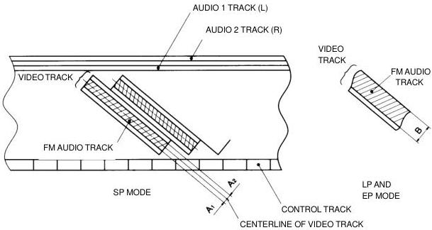

*Figure 14 – FM audio track location*

Table 5 – Audio track dimensions

|  Item | SP mode | LP mode | EP mode  |
| --- | --- | --- | --- |
|  FM audio track width A1, A2, and B (unit:mm) | Min. value of A1, A2: 0.010 Max.value of A1, A2: 0.029 | Min. value of B: 0.012 | Min. value of B: 0.016  |
|  Recording time sequence | Audio recorded 0 to 2 fields earlier than the associated video recording | Audio recorded 1/3 to 2-1/3 fields earlier than the associated video recording | Audio recorded 1-1/3 to 3-1/3 fields earlier than the associated video recording  |
|  Azimuth angle direction: audio head vs video head | Opposite direction | Opposite direction | Same direction  |

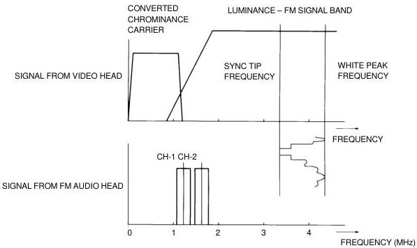

*Figure 15 – Signal spectrum: FM audio, AM chrominance video and FM luminance video*

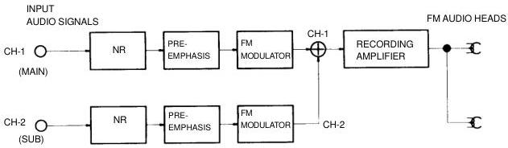

*Figure 16 – Block diagram of FM audio recording system*

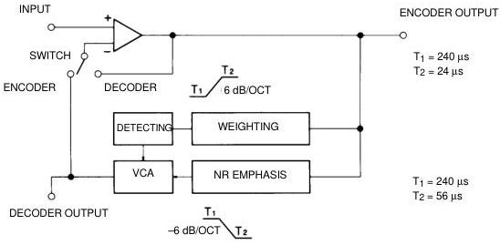

*Figure 17 – Block diagram of noise-reduction system*

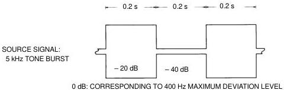

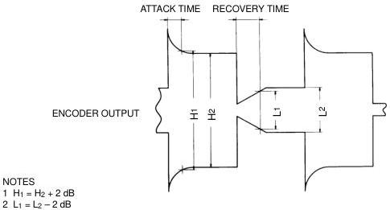

*Figure 18 – Encoder transient measurement method*

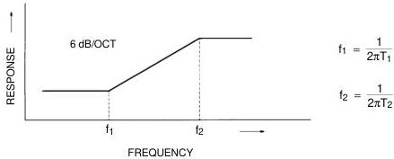

*Figure 19 – Preemphasis*

### 5.8 Center carrier frequencies

Center carrier frequencies shall be as follows:

- Channel 1: 1.3 MHz ± 10 kHz
- Channel 2: 1.7 MHz ± 10 kHz

### 5.9 Frequency deviation

Frequency deviation shall be as follows:

- Maximum frequency deviation: ± 150 kHz;
- Reference frequency deviation: ± 50 kHz at 400 Hz;
- Reference level: The input audio signal level at the reference frequency deviation.

### 5.10 Polarity

The modulation polarity of the channel 1 and channel 2 audio signals shall be the same. For simultaneous positive- (or negative-) going audio signals, present at the channel 1 and 2 inputs, the polarity of frequency modulation deviation shall be the same for the channel 1 and channel 2 FM modulators.

### 5.11 Recording level

The FM audio rf signals shall be recorded such that their playback rf levels are approximately equal and maximum.

### 5.12 Channel application

For stereo audio associated with television program material, audio channel 1 shall carry the discrete left (L) signal and audio channel 2 shall carry the discrete right (R) signal. The terms left and right shall relate to the viewer's perspective.

When the FM audio channels are used for other than stereo recordings, the channel use shall be as follows:

|   | Monophonic recording | Main and sub-recording  |
| --- | --- | --- |
|  Channel 1 | Monophonic signal | Main signal  |
|  Channel 2 | Monophonic signal | Subsignal  |

## 6 Compact video tape and cassette

### 6.1 Compact video tape

#### 6.1.1 Longitudinal dimensions

Longitudinal dimensions of the compact video tape shall be as follows:

|  Name | Tape length (m) | Playing time (min)  |
| --- | --- | --- |
|  TC-20 | 43.7 +2 0 | 20  |
|  TC-10 | 24 +2 0 | 10  |

#### 6.1.2 Width

The average tape width shall be 12.65 mm ± 0.01 mm. Width fluctuation shall not exceed 6 µm. The average tape width is the average of measured values of the width of the video tape made at many points along a length of the video tape.

#### 6.1.3 Thickness

The tape thickness shall be 19 µm + 1 µm – 2 µm.

### 6.2 Leader and trailer tape

#### 6.2.1 Length

The length of the leader and trailer tape shall be as follows:

- Leader tape: 80 mm ± 5 mm;
- Trailer tape: 110 mm ± 5 mm.

#### 6.2.2 Thickness and width

The thickness shall be 20 µm + 2 µm – 6 µm and the width shall be 12.65 mm ± 0.03 mm.

#### 6.2.3 Material

The material shall be polyester film or its equivalent with a light transmission greater than 70% (measured over the range of wavelengths 800 nm to 950 nm).

#### 6.2.4 Attachment

The attachment of the leader and trailer to the video tape and the reel hub shall be capable of withstanding a pulling force of at least 30 N. The splicing gap between the leader and trailer and the video tape shall be less than 0.07 mm.

### 6.3 Compact video cassette

Dimensions for the compact video cassette and tape winding shall be as specified in figures 20 to 25 and figure 30, respectively. The cassette dimensions include two types of front cover with and without a front cover locking structure.

#### 6.3.1 Front cover

##### 6.3.1.1 Front cover with locking structure (see figure 26)

With this type of cassette, a spring force is always present to keep the front cover closed. The forces (F₁ and F₂) in note 1 to figure 26, necessary to open the front cover with the lock released, shall be as follows:

- 0.1 N ≤ F₁ ≤ 0.25 N;
- 0.05 N ≤ F₂ ≤ 0.2 N.

Even when the front cover is locked, it shall be forcibly released with a force (F₃) of less than 0.8 N at the unlocking position indicated in note 3 to figure 26. The unlocking pin shall be pushed to the unlocking position indicated in note 4 with a force (F₄) of less than 0.8 N. The unlocking pin shall be pushed to the surface of the cassette side wall with a force (F₅) of less than 3 N.

##### 6.3.1.2 Front cover without locking structure (see figure 27)

In this design, the cover shall have two stable positions — completely closed or completely open. When the front cover is within an angle of 20° open or closed, as indicated in note 1 to figure 27, the cover shall automatically become fully open or fully closed. The forces (F₁ and F₂) in figure 27 necessary to open and close the front cover shall be as follows:

- 0.05 N ≤ F₁ ≤ 0.2 N;
- 0.05 N ≤ F₂ ≤ 0.2 N.

#### 6.3.2 Reel dimensions

The dimensions of the reel shall be in accordance with figures 28 and 29. The tape shall be pulled out with the following forces as shown in note 3 to figure 28 and note 2 to figure 29 with the brake engaged:

- Supply reel: 0.4 N ≤ F ≤ 1.5 N;
- Take-up reel: 0.05 N ≤ F ≤ 3 N.

#### 6.3.3 E-values

E-values L₁ and L₂ as shown in note 1 and note 2 to figure 30 shall be more than 0.7 mm, respectively.

#### 6.3.4 Guide rollers

Guide rollers shall be provided as shown in figure 30. The perpendicularity of all rollers shall be less than 0° 27' with respect to the video cassette reference plane (see figure 31).

#### 6.3.5 Cassette reels

The reels in the cassette as shown in note 4 to figure 32 shall be pushed down with the following forces by a reel spring:

- Supply reel: 1.6 N ± 0.4 N;
- Take-up reel: 0.7 N + 0.3 N – 0.2 N.

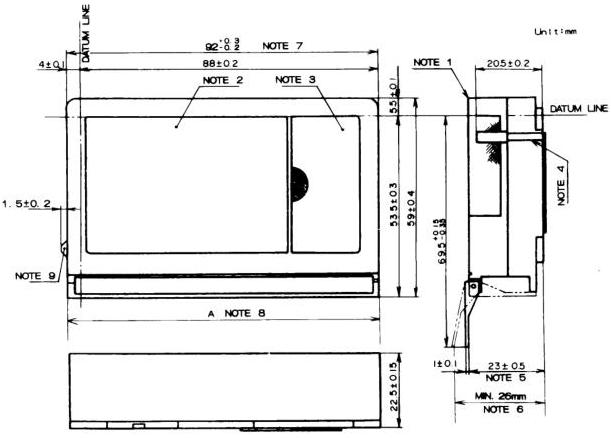

*Figure 20 – Complete compact video cassette case (1)*

**NOTES**

1. All ridges on the cassette body shall be less than R 0.5 mm or C 0.5 mm.
2. Top label area.
3. Window for supply reel.
4. Guide groove. When a gauge, having dimensions of the groove on the lower case, is inserted into the groove from the bottom, the gauge shall not contact the walls of the corresponding groove in the upper case.
5. Distance when the front cover is at normal opening position.
6. Maximum value when the front cover is fully opened.
7. The front cover without a locking structure is 92.0 mm ± 0.3 mm.
8. The length A of the front cover shall be smaller than the cassette length, up to 0.6 mm max.
9. See figure 21, note 11, for a description of the front cover unlocking device.

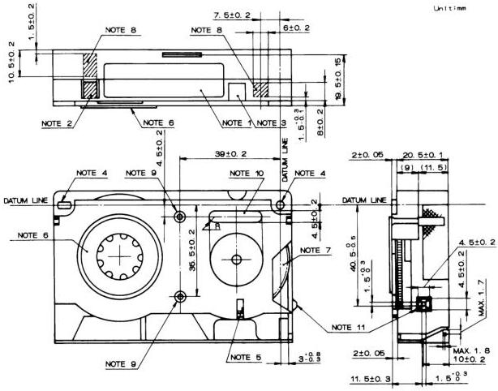

*Figure 21 – Complete compact video cassette case (2)*

**NOTES**

1. Side label area.
2. Erasure prevention tab area. The depth of the recess shall be 2.5 mm.
3. Groove corresponding to the unlocking pin for reel brake shown in figure 2, note 4.
4. Datum holes.
5. Groove to prevent misinsertion, corresponding to the guide groove shown in figure 2, note 6.
6. Supply reel.
7. Take-up reel.
8. Auxiliary hole positions. The depth of the recess shall be 2.5 mm.
9. Screw locations for securing upper and lower cases.
10. Area for identification. This identification shall not protrude from the bottom surface.
11. Front cover unlocking device only for the type of front cover with a locking structure.

Unit: mm

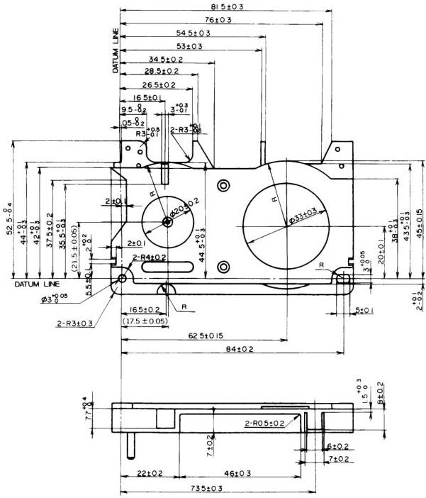

*Figure 22 – Lower compact video cassette half (1)*

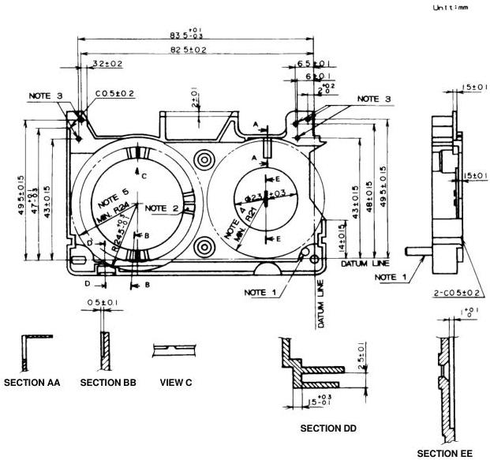

*Figure 23 – Lower compact video cassette half (2)*

**NOTES**

1. Take-up reel brake mounting boss.
2. Supply reel brake.
3. Center of tape guide rollers.
4. Radius R21 shows the limit of reel rotation. No obstruction is permitted within this radius while the reel is turning.
5. Radius R24 shows the limit of reel rotation. No obstruction is permitted within this radius while the reel is turning.

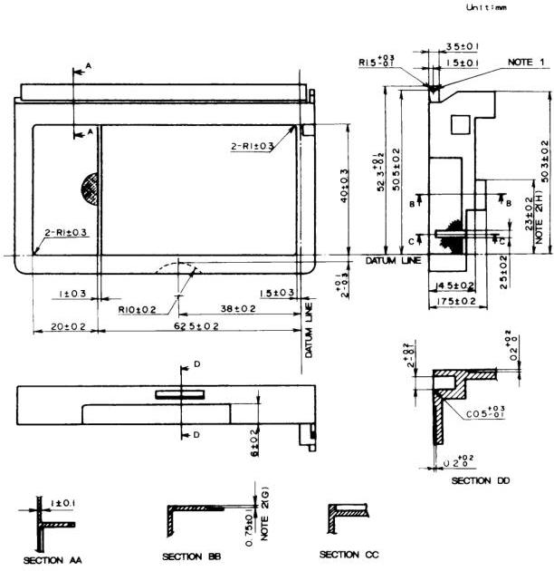

*Figure 24 – Upper compact video cassette half*

**NOTES**

1. Front cover turning axis.
2. This step dimension G may be 0 mm when dimension H is 20.0 mm ± 0.2 mm.

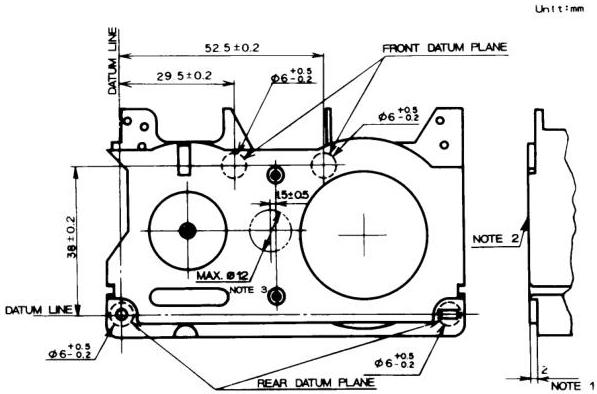

*Figure 25 – Compact video cassette reference plane*

**NOTES**

1. The cassette reference plane is an imaginary plane which includes the two points 2 mm over the two rear datum planes and one of the two front datum planes.
2. The cassette bottom surface shall be between +0.1 mm (convex) and –0.2 mm (concave) referred to the reference plane.
3. A molding gate, if necessary on this surface, shall be positioned within this area.

Unit: mm

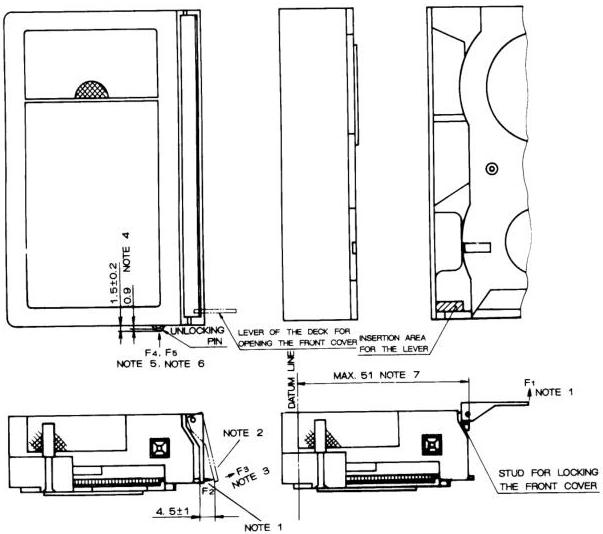

*Figure 26 – Compact video cassette front cover with locking structure*

**NOTES**

1.  F₁, F₂: Force necessary to open the front cover at each position without a lock.
2. Locking and unlocking position of the front cover.
3. F₃: Force necessary to open with the front cover locked.
4. Locking and unlocking position of the unlocking pin.
5. F₄: Force necessary to push to the unlocking position.
6. F₅: Force necessary to push to the surface of the cassette wall.
7. End position of the stud for locking the front cover.

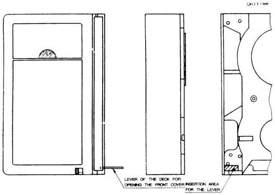

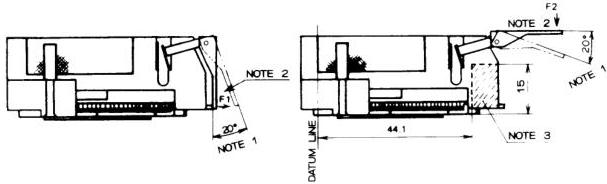

*Figure 27 – Compact video cassette front cover without locking structure*

**NOTES**

1. Front cover shall open (right) or close (left) by itself within these angles.
2. F₁, F₂: Force necessary to open and close.
3. This figure indicates the allowed insertion range for the front cover releasing lever of the deck.

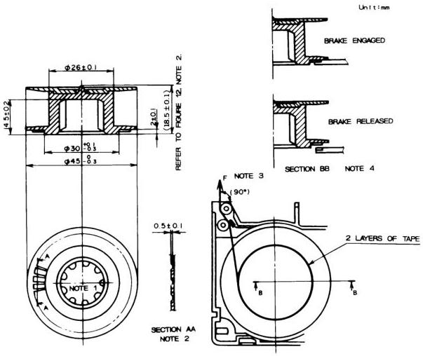

*Figure 28 – Compact video cassette supply reel and reel brake*

**NOTES**

1. The dimensions of the reel socket shall conform to the specifications in figure 3.
2. The structure of the reel brake is not restricted to this figure, provided that the brake force is provided by friction.
3. With the brake engaged, the tape shall be pulled out as shown above with brake force F.
4. The brake shall be fully released at the raised position of the supply reel within the cassette. For the releasing position, refer to figure 32, note 2.

Unit: mm

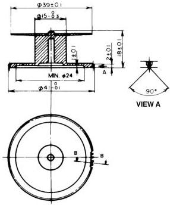

*Figure 29 – Compact video cassette take-up reel and reel brake*

**GEAR SPECIFICATIONS**

|  TOOTH FORM | FULL DEPTH TEETH*  |
| --- | --- |
|  MODULE | 0.5  |
|  PRESSURE ANGLE | 20°  |
|  NUMBER OF TEETH | 80  |
|  PITCH CIRCLE | φ40  |

*REFER TO VIEW A

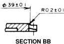

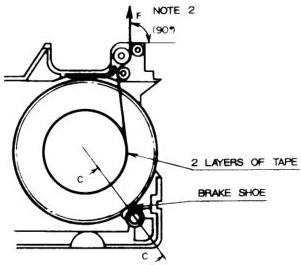

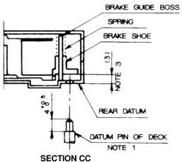

**NOTES**

1. The brake shall be released when the brake shoe is pushed up by the pin. At the released position when the brake shoe is pushed up, the spring force shall be less than 0.3 N.
2. With the brake engaged, the tape shall be pulled out as shown above with brake force F.
3. The dimensions are shown with the brake engaged.

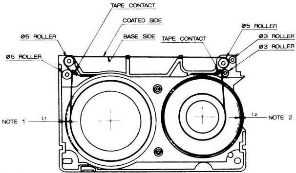

NOTES
1 E-value  $L_{1}$  of the supply reel.
2 E-value  $L_{2}$  of the take-up reel.

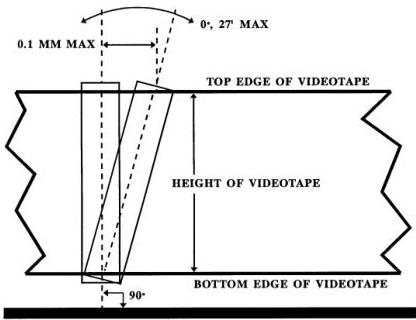

*Figure 30 – Compact video cassette tape winding and guide rollers*

*Figure 31 – Perpendicularity*

Unit: mm

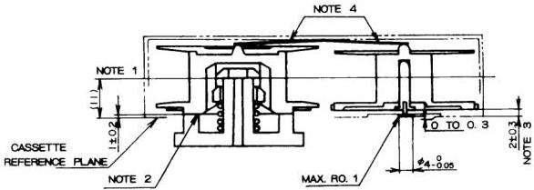

*Figure 32 – Relative positions of reels with respect to compact video cassette case*

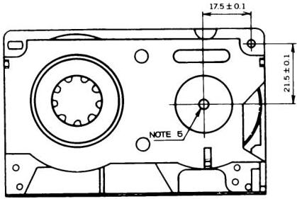

**NOTES**

1. Center of the tape.
2. Bottom plane of the supply reel. The supply reel shall be rotatable without contacting the cassette case at the height range of 1.0 mm + 0.8 mm – 0.5 mm from the cassette reference plane.
3. Flange wobble of the take-up reel is included.
4. The reels in the cassette shall be pushed down.
5. Positioning screw.

#### 6.3.6 Screw head

The center of the positioning screw head shall be placed within 0.05 mm of the axis of rotation of the take-up reel (see figure 32).

### 6.4 Other specifications

The window and the upper flange of the supply reel shall be clear to indicate the remaining tape.

## 7 High-performance type H cassette, records and system

### 7.1 Modes of operation

Only the SP and EP modes of operation shall be functional in the high-performance type H system. The LP mode shall not be used.

### 7.2 Video tape records

The track configuration and the transverse and longitudinal dimensions shall be as specified in figure 7 and table 2 or table 3, as applicable to the operating mode.

### 7.3 Video tape

#### 7.3.1 Nomenclature

The following type names shall be used in order to indicate tape conformance to the high-performance type H system:

- ST-XXX, where XXX indicates tape length in minutes for standard size video cassettes;
- ST-CXX, where XX indicates tape length in minutes for compact size video cassettes.

The indication of tape length in minutes shall conform to that described in table 1 and 6.1.1 for the SP and EP operating modes only.

#### 7.3.2 Tape type

The type of video tape used shall be high-resolution video tape (for example, cobalt iron-oxide tape).

#### 7.3.3 Coercivity

The coercivity shall be approximately 70 × 10³ A/m.

### 7.4 Video cassette

#### 7.4.1 Cassette identification

Video cassettes and compact video cassettes for the high-performance type H system shall have an identification hole (ID hole) as defined in figures 33 and 34. All other mechanical parameters shall conform to those described in 3.2 and 6.1.

### 7.5 Recording characteristics

#### 7.5.1 Video signal

##### FM recording of luminance component

###### 7.5.1.1.1 Modulation characteristics

FM carrier frequencies corresponding to reference video levels shall be as shown in table 6. The FM carrier shall be interleaved in the EP mode. In this mode, the FM carrier frequency recorded by the channel 1 video head shall be f_H/2 higher than that of the channel 2 video head (f_H = 15.734 kHz).

###### 7.5.1.1.2 Recording level

The recording current shall have the optimum value at all frequencies within the entire FM carrier range defined in table 6.

NOTE - Optimum record current is the recording current value which is necessary to obtain the maximum output signal level during playback.

###### 7.5.1.1.3 Subpreemphasis and main preemphasis

The luminance signal shall be subpreemphasized and main preemphasized. The characteristics of the subpreemphasis shall be as shown in table 7. The characteristics of the main preemphasis shall be as specified in 3.9.

###### 7.5.1.1.4 Clipping levels

The preemphasized luminance video signal shall be clipped prior to frequency modulation. The clipping levels shall be as shown below. The level from sync tip to peak white is defined to be 100%.

- White clipping level measured from tip of sync: 210% nominal, 189% minimum, 231% maximum;
- Dark clipping level measured from tip of sync: -70% nominal, -77% minimum, -63% maximum.

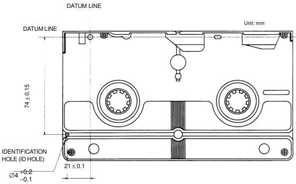

*Figure 33 – Identification hole (ID hole) of cassette*
NOTE – Depth shall be more than 3.8 mm (from datum plane).

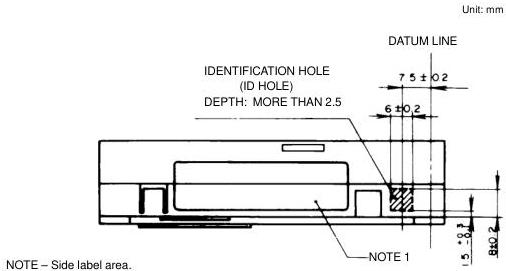

*Figure 34 – Identification hole (ID hole) of compact cassette*

Table 6 – FM carrier frequencies

|  Reference white level | 7.0 MHz ± 0.1 MHz  |
| --- | --- |
|  Reference sync level | 5.4 MHz ± 0.1 MHz  |
|  Frequency deviation, white to sync | 1.6 MHz ± 0.1 MHz  |

Table 7 – Response characteristics of subpreemphasis for high-performance system

|  SP mode |   |   |   |   | Unit dB  |   |
| --- | --- | --- | --- | --- | --- | --- |
|  Frequency Input level (dB) | 200 kHz | 500 kHz | 1 MHz | 2 MHz | 3 MHz | 5 MHz  |
|  0 | -1.73 ± 0.30 | -1.60 ± 0.30 | -1.04 ± 0.30 | -0.37 ± 0.50 | -0.07 ± 0.50 | -0.06 ± 0.50  |
|  -10 | -1.30 ± 0.30 | -0.73 ± 0.50 | 0.69 ± 0.50 | 1.75 ± 0.50 | 2.10 ± 0.50 | 2.02 ± 0.50  |
|  -20 | -0.65 ± 0.50 | 1.09 ± 0.50 | 2.86 ± 0.50 | 4.16 ± 0.50 | 4.60 ± 0.50 | 4.43 ± 0.60  |
|  -30 | -0.49 ± 0.50 | 2.35 ± 0.50 | 5.30 ± 0.60 | 7.14 ± 0.60 | 7.64 ± 0.70 | 7.34 ± 0.70  |

|  EP mode |   |   |   |   | Unit dB  |   |
| --- | --- | --- | --- | --- | --- | --- |
|  Frequency Input level (dB) | 200 kHz | 500 kHz | 1 MHz | 2 MHz | 3 MHz | 5 MHz  |
|  0 | -1.86 ± 0.30 | -0.76 ± 0.30 | 0.81 ± 0.30 | 1.60 ± 0.50 | 1.72 ± 0.50 | 1.54 ± 0.50  |
|  -10 | -1.46 ± 0.30 | 0.11 ± 0.50 | 2.50 ± 0.50 | 3.73 ± 0.50 | 3.89 ± 0.50 | 3.59 ± 0.50  |
|  -20 | -0.82 ± 0.50 | 1.93 ± 0.50 | 4.70 ± 0.50 | 6.14 ± 0.50 | 6.36 ± 0.50 | 5.97 ± 0.60  |
|  -30 | -0.63 ± 0.50 | 3.21 ± 0.50 | 7.14 ± 0.60 | 9.15 ± 0.60 | 9.43 ± 0.70 | 8.89 ± 0.70  |

NOTE – The subpreemphasis response characteristic shall be defined by comparing the peak-to-peak amplitude of a sine wave signal at the input with the peak-to-peak amplitude of the sine wave signal at the output. The reference response shall be 0 dB at a frequency of 10 kHz. For a signal at the input that is a 100% peak white video signal, the amplitude of the signal, from sync tip to peak white, shall be defined as 0 dB. Subpreemphasis response shall be determined by comparing a sine wave in the active video part of the signal, at the input, with the waveform in the active video part of the signal at the output. Sync may be included in the measurement.

##### 7.5.1.2 525-line/60-field chrominance signal recording

The specifications of 3.9 shall apply to all items except those stated below.

###### 7.5.1.2.1 Level of luminance video component remaining in down-converted chrominance subcarrier signal

The amplitude of a luminance video component that remains as part of the chrominance signal after it is down-converted prior to recording shall be attenuated more than 20 dB in the vicinity of 1.2 MHz with reference to the down-converted chrominance subcarrier frequency.

###### 7.5.1.2.2 Recording level

The chrominance signal shall be recorded with the luminance FM signal acting as bias. The chrominance signal recording level shall be set so that the playback level of the spurious components measured at a frequency $f_y - 2f_c$ is attenuated between 20 dB and 25 dB with reference to the level of the output signal at a frequency $f_y$:

- $f_y$: Center carrier frequency of luminance signal (6.5 MHz);
- $f_c$: Converted chrominance subcarrier frequency.

##### 7.5.1.3 Audio signal and control signal records

Audio signal and control signal records shall conform to 3.9.

## Annex A (informative)

### High-quality mode technology

#### A.1 Compatibility

This annex summarizes the technology that may be applied to effect a high-quality mode of operation. This results in improved picture quality for type H format video recordings. The application of high-quality mode processing does not affect compatibility between high-quality mode recordings and those recorded without application of high-quality mode processing. None, all, or any of the high-quality mode techniques may or may not be applied without affecting type H compatibility (see table A.1).

##### A.1.1 Use of high-quality mode identification

High-quality mode technologies are as follows:

1. Greater white clip amplitude;
2. Luminance video signal vertical processing;
3. Chrominance video signal vertical processing;
4. Detail enhancement.

These are described in the remainder of this annex.

A type H VTR may be identified as applying high-quality mode technology if item 1 is combined with at least one other item (2, 3, or 4) listed above.

Alternatively, a type H VTR may be identified as applying high-quality mode technology if items 2 and 3 above are applied in the playback circuit chain only.

#### A.2 Improving picture quality using vertical emphasis in the LP and EP modes

To maintain compatibility, the following describes the allowable range of parameters when attempting to improve LP and EP mode picture quality.

##### A.2.1

The vertical preemphasis for the luminance signal shall be as shown in figure A.1.

##### A.2.2

The vertical preemphasis for the chrominance signal shall be as shown in figure A.2.

##### A.2.3

The white clipping level shall be a maximum of 200% measured from the sync tip.

**CAUTION** – FM carrier frequency shall be as given in 3.9.1.1.4:

- White peak: 4.4 MHz ± 0.1 MHz;
- Sync tip: 3.4 MHz ± 0.1 MHz.

#### A.3 Improving picture quality using detail enhancer

When reproducing small amplitude video signals, their output pictures are apt to become weak. Therefore, if their signals are enhanced moderately in recording the original signal, it is possible to improve the picture quality of detail components. This technology may be applied to the SP, LP, and EP modes as shown in figure A.3.

#### A.4 Specified values

The specified values shall be as follows:

- Emphasis ratio: less than 8 dB;
- Amount of emphasis: less than 10 IRE units;
- Operating frequency: more than 1 MHz (frequency at one-half of maximum emphasis ratio, measured at -40 dB or less input level).

#### A.5 Recording circuit

An example of the recording circuit is shown in figure A.4.

#### A.6 Example of response characteristics

An example of maximum emphasis (8 dB) is shown in figure A.5.

**NOTE** – Measure input/output ratios at the following input levels using sine wave:

0 dB, -10 dB, -20 dB, -30 dB, -40 dB, -50 dB

Peak-to-peak of 0 dB sine wave shall be the voltage from sync tip to 100% peak white.

Table A.1 – Recording application of high-quality mode technology

|   |  | SP mode | LP and EP modes  |
| --- | --- | --- | --- |
|  1 | Greater white clip level (200% maximum) | Applied | Applied  |
|  2 | Luminance video signal vertical processing X = 0.65 max; L = 5% max | Not applied | Applied: kP = 0.5 max  |
|  3 | Chrominance video signal vertical processing X = 1 max; L = 15% max | Not applied | Applied: kP = 0.35 max  |
|  4 | Detail enhancer emphasis ratio: Less than 8 dB Amount of emphasis: Less than 10 IRE units Operating frequency: Greater than 1 MHz | Applied | Applied  |

(1) Basic circuit

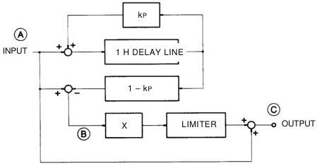

(2) Waveforms at  (A),  (B)  and  (C).

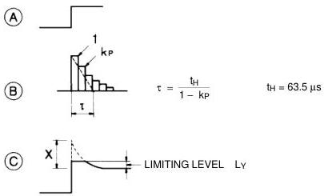

*Figure A.1 – Luminance signal vertical preemphasis*

(3) Values:

Feedback factor, $k_P$ = less than 0.5 (time constant $t = 2.0 \, t_H$)

Amount of emphasis, $X$ = less than 0.65

Limiting level, $L_Y$ = less than 5 IRE units

NOTE – Vertical emphasis shall not be applied during the equalizing pulse and vertical sync pulse intervals.

(1) Basic circuit

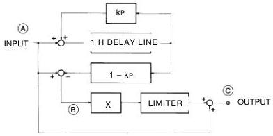

(2) Waveforms at  $\boxed{\mathrm{A}}$ ,  $\boxed{\mathrm{B}}$  and  $\boxed{\mathrm{C}}$ .

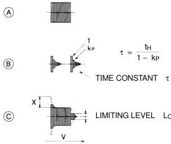

*Figure A.2 – Chrominance signal vertical preemphasis*

(3) Values:

Feedback factor,  $k_{P}$  = less than 0.35 (time constant  $\tau = 1.5 t_{H}$ )

Amount of emphasis,  $X =$  less than 1.0

Limiting level,  $L_{C}$  = less than 15% (with reference to 100% for the peak-to-peak amplitude of the red signal in the 75% color bar signal)

NOTE - Vertical emphasis shall not be applied during the equalizing pulse and vertical sync pulse intervals.

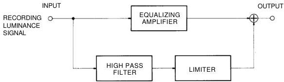

*Figure A.3 – Block diagram*

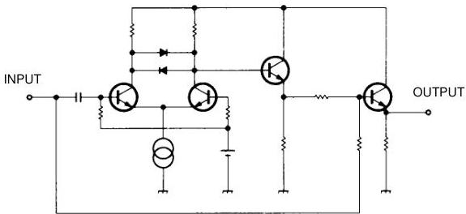

*Figure A.4 – Example of recording circuit*

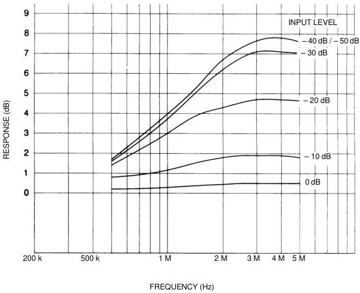

*Figure A.5 – Response characteristics of detail enhancer*

EMPHASIS RATIO 8 dB
AMOUNT OF EMPHASIS 10 IRE
OPERATING FREQUENCY 4 dB / 1 MHz

## Annex B (informative)

### Compact video cassette adaptor

A compact video cassette adaptor allows use of a compact video cassette in video recording equipment designed for the standard video cassette specified in 3.2.

One design for such a device, using the adaptor as an example, is illustrated in figures B.1 and B.2. Figure B.1 shows the external appearance of the adaptor while figure B.2 shows the internal construction. In use, a compact video cassette is placed in the adaptor and the top lid is closed. The adaptor is then inserted into a standard video cassette machine. When the top lid is closed, the tape guide arm of the adaptor extracts tape from the compact video cassette and pulls it to a position that permits the normal loading mechanism in the VCR to complete the tape-loading cycle.

At the conclusion of use, the tape is rewound using the normal VCR rewind function and the adaptor is removed from the VCR.

To remove the compact video cassette from the adaptor, the operation knob (figure B.1) is pressed in the direction of the arrow. The adaptor mechanism then fully winds the tape into the compact video cassette and the adaptor lid opens to permit removal of the cassette.

Figure B.2 shows that the supply reel of a cassette placed in the adaptor is directly driven by the VCR supply reel drive.

The cassette take-up reel is indirectly driven from the VCR take-up drive through use of an intermediate gear.

Figure B.2 also illustrates two safety features of this adaptor design. A lever is shown on the end of the adaptor. It detects an improper adaptor position and thus protects the system from damage that might result if the adaptor were not fully inserted into the VCR. In addition, the adaptor has on its edge a linked tab that prevents accidental erasure of a compact video cassette.

Recording on a cassette contained in the adaptor is not possible if the tab of the compact video cassette has been removed.

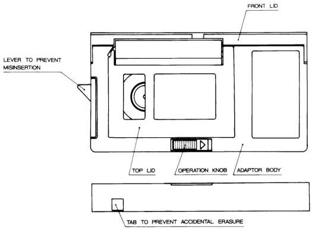

*Figure B.1 – Example of the compact video cassette adaptor*

*Figure B.2 – Main parts and movement of the compact video cassette adaptor*
