# RECOMMENDATION ITU-R BT.1700*

# Characteristics of composite video signals for conventional analogue television systems

(2005)

## Scope

This Recommendation describes the characteristics of the analogue composite colour television signals used in the production process, and for programme interchange. Typically, the production process may involve studio facilities, remote facilities, ENG contributions and inter-facility programme exchange.

The ITU Radiocommunication Assembly,

## considering

a) that many countries have established analogue colour television broadcasting services based on the NTSC, PAL or SECAM systems;
b) that it would add further complications to the interchange of programmes to have a greater multiplicity of systems;
c) that Recommendation ITU-R BT.1701 – Characteristics of radiated signals of conventional analogue television systems, defines the radio-frequency specifications;
d) that Report ITU-R BT.2043 – Analogue television systems currently in use throughout the world, gives information on different television systems used by different countries,

## recommends

1. that administrations wishing to implement an analogue composite colour television system should choose the production video signal characteristics of one of the television systems defined in Parts A, B and C of Annex 1.

* Radiocommunication Study Group 6 made editorial amendments to this Recommendation in 2007 in accordance with Resolution ITU-R 44.

# Annex 1

## Introduction

Currently there are three analogue colour television systems in use: NTSC, PAL and SECAM. Common terminology refers to the signal representing the luminance and chrominance components of these signals as being "composite".

The analogue composite colour signals covered by this Recommendation include NTSC, PAL and SECAM signal format definitions and specifications.

## PART A

## NTSC signal format and specification

For format specifications and signal waveforms, see SMPTE 170M-2004 Television - Composite Analogue Video Signal - NTSC for Studio Applications.

NOTE 1 - In Japan, the following parameters have been implemented and deviate from those defined in SMPTE 170M-2004.

|   | Parameter | SMPTE 170M-2004 | Value used in Japan  |
| --- | --- | --- | --- |
|  1 | Black (set-up) level | Table 1 | 0  |
|  2 | Vertical blanking | Table 3 | 0.07 v-0.082 v, where v is the field period  |
|  3 | Reference white | Section 4.2 | The adjustment of the chromaticity of studio monitor to a D-white at 9300 K is also used  |

## NTSC analogue video signal specifications

For applications in professional television production and post-production NTSC, video signals should be defined by the detailed parameters given in SMPTE Standard 170M-2004.

This Recommendation describes the composite analogue colour video signal for studio applications: NTSC, 525 lines, 59.94 Hz field rates, 2:1 interface with an aspect ratio of 4:3. This Recommendation specifies the interface for analogue interconnection and serves as the basis for the digital coding necessary for digital interconnection of NTSC equipment.

The composite colour video signal contains an electrical representation of the brightness and colour of a scene being analysed (the active picture area) along defined paths (scan lines). The signal includes synchronizing and colour reference signals that allow the geometric and colorimetric aspects of the original scene to be correctly reconstituted at the display. The synchronizing and colour reference signals are placed in parts of the composite colour video signal that are not visible on a correctly adjusted display. Certain portions of the composite colour video signal that do not contain active picture information are blanked (forced below black level) in order to allow retrace of scanning beams in some types of cameras and display devices.

The video signal representing the active picture area consists of:

- a wideband luminance (brightness) component with set-up and no upper bandwidth limitation for studio applications;
- a pair of simultaneous chrominance (colouring) components, amplitude modulated on a pair of suppressed sub-carriers of identical frequency ($f_{sc} = 3.579545\ldots \mathrm{MHz}$) in quadrature (i.e. with a $90^{\circ}$ difference in phase).

The video signal representing the active picture area corresponds to the scanning of the image at uniform velocities from left to right and from top to bottom. The velocities are such that the picture is repetitively scanned on 525 nominally horizontal lines, with alternate lines scanned on each vertical pass. This process is described as 2:1 interlace.

The aspect ratio of the active picture area is four units horizontally to three units vertically.

The composite colour video signal is produced by an NTSC encoder that functions as follows:

- The input signals to an NTSC encoder are time-coincident green, blue, and red video signals ($G B R$), with no set-up and of equal amplitude when conveying picture information with no colour content. Horizontal and vertical synchronizing signals and reference sub-carrier are also required.
- After low-pass filtering, the colour-difference signals ($B-Y$ and $R-Y$ or $I$ and $Q$) are fed to balanced, quadrature-phase, sub-carrier amplitude modulators.
- The modulated sub-carrier signals are added to the luminance signal, along with set-up, blanking, sync, and burst (a colour synchronizing signal) to form the composite output video signal.
- There is a fixed frequency and phase relationship between the sub-carrier in the burst signal, the sub-carriers conveying the colour-difference signals, and the horizontal and vertical synchronizing signals.
- The luminance and colour-difference components of the composite colour video signal at the encoder output are time-coincident.

NOTE 1 – SMPTE Standard 170M-2004 is available in electronic form at the ITU website: http://www.itu.int/ITU-R/study-groups/rsg6/SMPTE/index.html as well as in Annex 2 of this Recommendation. SMPTE Standard 170M-2004 refers to version 2004 only, which is the version approved, by administrations of Member States of the ITU and Radiocommunication Sector Members participating in the work of Radiocommunication Study Group 6 in application of Resolution ITU-R 1-4. By agreement between ITU and SMPTE, this version was provided and authorized for use by SMPTE and accepted by ITU-R for inclusion in this Recommendation. Any subsequent version of SMPTE Standard 170M, which has not been accepted and approved by Radiocommunication Study Group 6 is not part of this Recommendation. For subsequent versions of SMPTE documents, the reader should access the SMPTE website: http://www.smpte.org.

# PART B

# PAL signal format and specification

This Part provides information concerning signal level, timing, chrominance modulation characteristics, and baseband bandwidth characteristics of 525-line and 625-line PAL implementations.

TABLE 1 Basic characteristics of video and synchronizing signals\*

|  Item | Characteristic | 525 PAL NOTE - Future use of 525 PAL as a production standard is not recommended | 625 PAL {Argentina 625 PAL - Values in brackets { } Future use of this standard as a production standard is not recommended.}  |
| --- | --- | --- | --- |
|  1 | Total number of lines per picture (frame) | 525 | 625  |
|  1a | Number of active lines | 483 | 576  |
|  2 | Line frequency fH (colour) | 15734.26 Hz ± 0.0003% | 15625 Hz ± 0.00002%  |
|  3 | Field frequency (field/s) | 2fH/525 (60/1.001) | 2fH/625  |
|  4 | Nominal video bandwidth | There is no constraint in studio/production applications  |   |
|  5 | Chrominance sub-carrier frequency fsc | 3575611.49 ± 5 Hz | 4433618.75 ± 1 Hz {3582056.25 ± 5 Hz}  |
|  6 | Relationship between chrominance sub-carrier frequency fsc and line frequency fH | fsc = 909/4 fH | fsc = (1135/4 + 1/625) fH {fsc = (917/4 + 1/625) fH}  |
|  7 | Type of chrominance sub-carrier modulation | Suppressed-carrier amplitude-modulation of two sub-carriers in quadrature  |   |
|  8 | Luminance signal | E′Y = 0.299 E′B + 0.587 E′G + 0.114 E′B E′R, E′G and E′B are gamma-pre-corrected primary signals  |   |
|  8a | Assumed gamma of display device | 2.2  |   |
|  9 | Chrominance signals (colour difference) matrix equations | E′U = 0.493 (E′B - E′Y) E′V = 0.877 (E′R - E′Y)  |   |

TABLE 1 Basic characteristics of video and synchronizing signals\*

| Item | Characteristic | 525 PAL NOTE - Future use of 525 PAL as a production standard is not recommended | 625 PAL {Argentina 625 PAL - Values in brackets { } Future use of this standard as a production standard is not recommended.} |
| --- | --- | --- | --- |
| 10a | Assumed chromaticity coordinates (CIE, 1931) for primary colours of receiver(1) |  | x | y | x | y |
| Red | 0.630 | 0.340 | 0.64 | 0.33 |
| Green | 0.310 | 0.595 | 0.29 | 0.60 |
| Blue | 0.155 | 0.070 | 0.15 | 0.06 |
| 10b | Chromaticity coordinates for equal primary signals ER=EG'=EB (reference white) | (Illuminant C) x=0.3101 y=0.3162 | (Illuminant D65) x=0.3127 y=0.3290 |
| 10c | Attenuation of colour difference signals | EU<2 dB at 1.3 MHz EV>20 dB at 3.6 MHz | EU<3 dB at 1.3 MHz EV>20 dB at 4 MHz {EV>20 dB at 3,6 MHz} |
| 10d | Equation of composite colour signal | EM=EV+EUsin(2πfsc,t)+EVcos(2πfsc,t) where: EVsee item 8 EUand EVsee item 9 fscsee item 5 The sign of the EVcomponent is the same as that of the sub-carrier burst (changing for each line) (see item 10f) |
| 10e | Amplitude of chrominance sub-carrier | G=√E'2+E'2 |
| 10f | Phase of chrominance sub-carrier burst (see Fig. 2) | 135° relative to EUaxis with the following polarity |
| Field | 1 | 2 | 3 | 4 | 5 | 6 | 7 |
| Burst blanking sequence (see Figs. 8 and 9) | I | II | III | IV | I | II | III |
| Even line | - | - | + | + | - | - | + |
| Odd line | + | + | - | - | + | + | - |

TABLE 1 Basic characteristics of video and synchronizing signals\*

|  Item | Characteristic | 525 PAL NOTE - Future use of 525 PAL as a production standard is not recommended | 625 PAL {Argentina 625 PAL - Values in brackets { } Future use of this standard as a production standard is not recommended.}  |
| --- | --- | --- | --- |
|  10g | Synchronization of chrominance sub-carrier | By chrominance sub-carrier reference signals on the line-blanking back porch  |   |
|  10h | Synchronization of chrominance sub-carrier switching during line blanking | By \( E_V' \) chrominance component of sub-carrier burst  |   |
|  11 | Line synchronization | See Table 2  |   |
|  12 | Field synchronization | See Table 3  |   |

* This PAL recommendation provides information concerning signal level, timing, modulation characteristics, and bandwidth characteristics. Although there may be different emission standards using the 625 PAL system, there is only one studio/production format.
(1) Field 1 of the sequence of eight colour fields is defined as that field where the phase $\varphi_{E_U^\prime}$ of the extrapolated $E_U^\prime$ component (see item 9) of the video burst at the half-amplitude point of the leading edge of the line-synchronizing pulse of line 1 is in the range $-90^{\circ} \le \varphi_{E_U^\prime} < 90^{\circ}$.

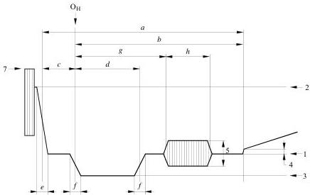

*Figure 1 - Line synchronization detail.*

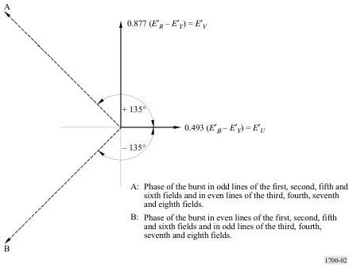

*Figure 2 - Chrominance axes and phase of the sub-carrier synchronization burst.*

TABLE 2
Details of line synchronizing signals (see Fig. 1)

|  Symbol | Characteristic | 525 PAL NOTE - Future use of 525 PAL as a production standard is not recommended | 625 PAL {Argentina 625 PAL - Values in brackets { } Future use of this standard as a production standard is not recommended.}  |
| --- | --- | --- | --- |
|  H | Nominal line period | 1/fH Nominally 63.555 μs | 1/fH Nominally 64 μs  |
|  a | Line-blanking interval | 10.5-11.0 μs | 12 + 0 -0.3 μs  |
|  b | Interval between time datum (Oit) and back edge of line-blanking pulse | 9.2 + 0.2 -0.1 μs | 10.5 μs  |
|  c | Interval between time datum (Oit) and front porch | 1.5 ± 0.1 μs | 1.2 + 0.32 -0.0 μs {1.5 ± 0.3 μs}  |
|  d | Duration of synchronizing pulse | 4.7 ± 0.1 μs | 4.7 ± 0.2 μs  |
|  e | Rise time (10 to 90%) of the edges of the line-blanking pulse | 140 ± 20 ns | 300 ± 100 ns  |

TABLE 2
Details of line synchronizing signals (see Fig. 1)

|  Symbol | Characteristic | 525 PAL NOTE - Future use of 525 PAL as a production standard is not recommended | 625 PAL {Argentina 625 PAL - Values in brackets {} Future use of this standard as a production standard is not recommended.}  |
| --- | --- | --- | --- |
|  f | Rise time (10 to 90%) of the edges of the line-synchronizing pulses | {140 ± 20 ns} 200 ± 100 ns  |   |
|  g | Interval between time datum (OII) and start of sub-carrier burst | 5.3 ± 0.1 μs | 5.6 ± 0.1 μs  |
|  h | Duration of sub-carrier burst | 2.52 ± 0.28 μs or 9 ± 1 cycles | 2.25 ± 0.23 μs or 10 ± 1 cycles {2.51 ± 0.28 μs or 9 ± 1 cycles}  |
|  1 | Blanking level-reference | 0 mV  |   |
|  2 | White level | 700 mV  |   |
|  3 | Synchronizing level | -286 mV | -300 mV  |
|  4 | Difference between black and blanking level (“set-up”) | 0-70 mV | 0 mV  |
|  5 | Burst amplitude peak-to-peak | 316-317 mV | 300 ± 30 mV  |
|  7 | Peak-to-peak composite signal | 1330 mV  |   |

# Details of field-synchronizing waveforms

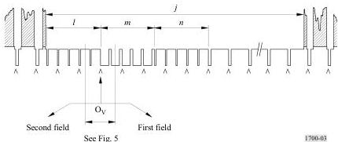

*Figure 3 - Signal at the beginning of each first field 625 PAL (see Note 5 of Fig. 4).* 

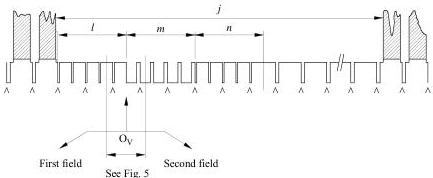

*Figure 4 - Signal at the beginning of each second field 625 PAL (see Note 5).* 

Note 1 – A,A,A indicates an unbroken sequence of edges of line-synchronizing pulses throughout the field-blanking period.
Note 2 – At the beginning of each first field, the edge of the field-synchronizing pulse, $O_V$, coincides with the edge of a line-synchronizing pulse if $l$ is an odd number of half-line periods as shown.
Note 3 – At the beginning of each second field, the edge of the field-synchronizing pulse, $O_V$, falls midway between the edges of two line-synchronizing pulses if $l$ is an odd number of half-line periods as shown.
Note 4 – The dominant field is defined as that field of the video waveform at which a change of picture material should occur. The change of picture information should occur at the beginning of the first field.
Note 5 – Figures 3-7 are traditional analogue monochrome timing signals that also apply to the composite colour signal. Figures 8 and 9 show the vertical interval burst blanking signal sequences.

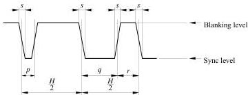

*Figure 5 - Detail of equalizing and field-synchronizing pulses 525/625 PAL. The durations are measured between the half-amplitude points on the appropriate edges.*

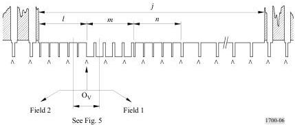

*Figure 6 - Signal at the beginning of each first field 525 PAL (see Note 5 of Fig. 4).* 

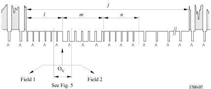

*Figure 7 - Signal at the beginning of each second field 525 PAL (see Note 5 of Fig. 4).* 

NOTE 1 -  $\wedge \wedge \wedge$  indicates an unbroken sequence of edges of line-synchronizing pulses throughout the field blanking period.

TABLE 3 Details of field synchronizing signals (see Figs. 3-7)

|  Symbol | Characteristic | 525 PAL NOTE - Future use of 525 PAL as a production standard is not recommended | 625 PAL  |
| --- | --- | --- | --- |
|  v | Field period | 525/2fH Nominally 16.6833 ms | 625/2fH Nominally 20 ms  |
|  j | Field-blanking interval (for H and a, see Table 1) | 20 H + 1.5 μs (1 272.62 μs) | 25H + a  |
|  J(1) | Rise time (10 to 90%) of the edges of field-blanking pulses | 140 ± 20 ns  |   |
|  K(1) | Interval between front edge of field-blanking interval and front edge of first equalizing pulse | 1.5 ± 0.1 μs | 3 ± 2 μs  |
|  l | Duration of first sequence of equalizing pulses | 3 H | 2.5 H  |
|  m | Duration of sequence of synchronizing pulses | 3 H | 2.5 H  |
|  n | Duration of second sequence of equalizing pulses | 3 H | 2.5 H  |
|  p | Duration of equalizing pulse | 2.3 ± 0.1 μs | 2.35 ± 0.1 μs  |
|  q | Duration of field-synchronizing pulse | 27.1 μs (nominal value) | 27.3 ± 0.1 μs  |
|  r | Interval between field-synchronizing pulse | 4.7 ± 0.1 μs | 4.7 ± 0.1 μs  |
|  s | Rise time (10 to 90%) of synchronizing and equalizing pulses | 140 ± 20 ns | 200 ± 100 ns  |

(1) Not indicated in the drawing.

# Burst-blanking sequences

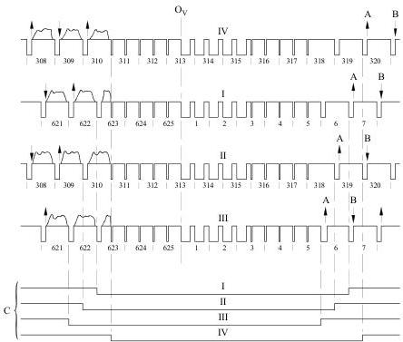

*Figure 8 - Burst-blanking sequence 625 PAL.*

Ov: field-synchronizing datum

I, II, III, IV: first and fifth, second and sixth, third and seventh, fourth and eighth fields (see item 10f of Table 1)

A: phase of burst; nominal value  $+135^{\circ}$
B: phase of burst; nominal value  $-135^{\circ}$
C: burst-blanking intervals:

625 PAL: 9 lines of field blanking interval

I Lines 623-006 inclusive
II Lines 310-318 inclusive
III Lines 622-005 inclusive
IV Lines 311-319 inclusive

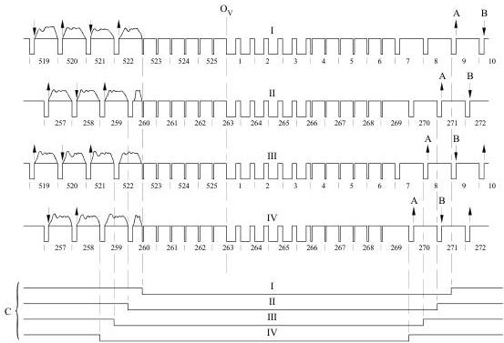

*Figure 9 - Burst-blanking sequence 525 PAL.*

Ov: field-synchronizing datum

I, II, III, IV: first and fifth, second and sixth, third and seventh, fourth and eighth fields (see item 10f of Table 1)

A: phase of burst; nominal value  $+135^{\circ}$
B: phase of burst; nominal value  $-135^{\circ}$
C: burst-blanking intervals:

625 PAL: 11 lines of field blanking interval

I Lines 523-008 inclusive
II Lines 260-270 inclusive
III Lines 522-007 inclusive
IV Lines 259-269 inclusive

# PART C

# SECAM signal format and specification

This Part provides information concerning signal level, timing, modulation characteristics, and baseband bandwidth characteristics of SECAM 625-line,  $50\mathrm{Hz}$  field rate, 2:1 interlace with an aspect ratio of 4:3. This Recommendation contains parameters used in, post-production, production and studio applications.

TABLE 4 Basic characteristics of video and synchronizing signals

|  Item | Characteristic | 625-line SECAM  |   |   |
| --- | --- | --- | --- | --- |
|  1 | Total number of lines per picture (frame) | 625  |   |   |
|  1a | Number of active lines | 575  |   |   |
|  2 | Line frequency fH | 15625 Hz ± 0.016 Hz  |   |   |
|  3 | Field frequency (field/s) | 2fH/625 Nominally 50 fields/s  |   |   |
|  4 | Nominal video bandwidth | B, D1, G systems nominally 5 MHz D, K, K1, L systems - nominally 6 MHz (No constraints for studio/production applications)  |   |   |
|  5 | Chrominance sub-carrier frequencies | fOR=4406250 ± 2000 Hz fOB=4250000 ± 2000 Hz  |   |   |
|  6 | Relationship between chrominance sub-carrier frequency fSC and line frequency fH | Unmodulated sub-carrier at beginning of line fOR=282 fH fOB=272 fH(1)  |   |   |
|  7 | Type of chrominance sub-carrier modulation | Frequency modulation  |   |   |
|  8 | Luminance signal | ET=0.299ET+0.587ET+0.114ET ET, ET and ET are gamma - precorrected primary signals Intermodulation between the luminance and chrominance signals can be reduced by a non-linear circuit applied to the luminance signal  |   |   |
|  8a | Assumed gamma of display device | 2.2  |   |   |
|  9 | Chrominance signals (colour difference) matrix equations | DT= -1.902 (ET - ET) DT= 1.505 (ET - ET)  |   |   |
|  10a | Assumed chromaticity coordinates (CIE, 1931) for primary colours of receiver |  | x | y  |
|   |   |  Red | 0.64 | 0.33  |
|   |   |  Green | 0.29 | 0.60  |
|   |   |  Blue | 0.15 | 0.06  |
|  10b | Chromaticity coordinates for equal primary signals ET = ET = ET | x = 0.3127 y = 0.3290 Illuminant D65  |   |   |
|  10c | Attenuation of colour difference signals | DT≤3 dB at 1.3 MHz DT≥30 dB at 3.5 MHz Low frequency precorrection see Table 4 item 10g  |   |   |

TABLE 4
Basic characteristics of video and synchronizing signals

|  Item | Characteristic | 625-line SECAM  |   |   |
| --- | --- | --- | --- | --- |
|  10d | Equation of composite colour signal | EM=ET+ESC ESC1chrominance sub-carrier ESC filtered by high frequency precorrection (HFP) filter with frequency response AHFP(f) = 1 + j16 F / 1 + j1.26 F where: F = f/f0 - f0/f ESC = M0cos 2π(fORt + ΔfOR∫0fD* dt) or ESC = M0cos 2π(fORt + ΔfOR∫0D* dt) alternately from line-to-line where: ET, see Table 4 item 8 fOR and fOB, see Table 4 item 5 ΔfOR and ΔfOB, see Table 4 item 10e DR* and DR*, see Table 4 item 10f f0 = 4286 kHz and f is the instantaneous sub-carrier frequency where the peak-to-peak amplitude, 2M0, is 23 ± 2.5% of the luminance amplitude (between blanking level and peak-white). The deviation of frequency, f0, from its nominal value due to misalignment of the circuits should not exceed ±20 kHz (see Fig. 15 for the amplitude response)  |   |   |
|  10e | Frequency deviation of chrominance sub-carrier (frequency modulation of sub-carrier)(3) |  | Nominal deviation(2) (kHz) D* = 1 | Maximum deviation (kHz)  |
|   |   |  ΔfOR | 280 ± 9 | +350 ± 18 -506 ± 25  |
|   |   |  ΔfOB | 230 ± 7 | +506 ± 25 -350 ± 18  |
|  10f | Low frequency precorrection of colour difference signals | DR*, DR* - signals DR*, DR* filtered by low frequency correction (LFP) filter with an amplitude-frequency response: AHFP(f) = 1 + j f/f1/1 + j f/3f1 f: signal frequency (kHz) f1 = 85 kHz (see Fig. 14 for the amplitude-frequency response including the low frequency filtering).  |   |   |

TABLE 4
Basic characteristics of video and synchronizing signals

|  Item | Characteristic | 625-line SECAM  |
| --- | --- | --- |
|  10g | Amplitude of chrominance sub-carrier | Approximately in the case of constant colour difference signals G = M0 1 + j16 F 1 + j1.26 F M0 - see Table 4 item 10d Exact value for any case is defined as maximum of signal ESC of chrominance sub-carrier signal ESC - see Table 4 item 10d  |
|  11 | Line synchronization | See Table 5  |
|  12 | Field synchronization | See Table 6  |
|  13 | Synchronization of chrominance sub-carrier switching during line blanking | In the SECAM system, one of two colour synchronization methods can be chosen: - Line identification: by chrominance sub-carrier reference signals on the line-blanking back porch. - By identification signals occupying 9 lines of field-blanking period: a) line 7 to 15 in fields 1 and 3 b) line 320 to 328 in fields 2 and 4 (see Fig. 16)(4). Shape of video signals corresponding to identification signals: For lines D'R Linear Trapezoid waveform with a 15 ± 5 μs rise time from 0 up to level +1.25 and then constant at the level +1.25 ± 0.06 (± 0.13) (see Fig. 17). For lines D'B Linear Trapezoid with a 18 ± 6 μs (20 ± 10 μs) rise time from 0 down to level -1.52 and then constant at the level -1.52 ± 0.07 (± 0.15) (see Fig.17). Peak-to-peak amplitude of identification signals: For lines D'R 500 ± 50 mV For lines D'R 540 + 40 mV/-50 mV if amplitude of luminance signal (between blanking level and peak white) equals 700 mV. The line identification method is preferable, as it does not rely upon transparent transmission of the vertical interval.  |

# Notes to Table 4:

(1) The initial phase of the sub-carrier undergoes a variation in each line defined by the following rule:

From frame-to-frame: by  $0^{\circ}$ :  $180^{\circ}$ :  $0^{\circ}$ :  $180^{\circ}$  and so on, and also from line-to-line in either one of the following two patterns:

$0^{\circ}$ :  $0^{\circ}$ :  $180^{\circ}$ :  $0^{\circ}$ :  $0^{\circ}$ :  $180^{\circ}$  and so on, or

$0^{\circ}$ :  $0^{\circ}$ :  $0^{\circ}$ :  $180^{\circ}$ :  $180^{\circ}$ :  $180^{\circ}$ : and so on.

(2) The unity value represents the value of the luminance signal between the blanking level and the peak white level.
(3) The maximum deviations from the nominal shape of the curve (see Fig. 14) should not exceed  $\pm 0.5$  dB in the frequency range from 0.1 to  $0.5\mathrm{MHz}$  and  $\pm 1.0$  dB in the frequency range from 0.5 to  $1.3\mathrm{MHz}$ .
(4) The order in which the identification signals  $D_{R}^{*}$  and  $D_{R}^{*}$  appear on the four fields of a complete cycle given in Fig. 16 is in conformity with Recommendation ITU-R BR.469.

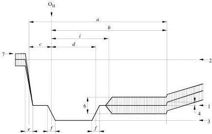

*Figure 10 - Composite signal levels and details of line-synchronizing signals. Drawing not to scale.*

See Fig. 5 contained in the PAL specification, Part B.

# Details of field-synchronizing waveforms

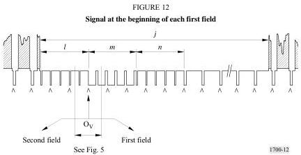

*Figure 12 - Signal at the beginning of each first field.*

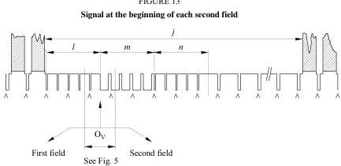

*Figure 13 - Signal at the beginning of each second field.*

Note 1 -  $\mathrm{AAA}$  indicates an unbroken sequence of edges of line-synchronizing pulses throughout the field-blanking period.

Note 2 - At the beginning of each first field, the edge of the field-synchronizing pulse,  $\mathrm{O_V}$ , coincides with the edge of a line-synchronizing pulse if  $l$  is an odd number of half-line periods as shown.

Note 3 - At the beginning of each second field, the edge of the field-synchronizing pulse,  $\mathrm{O_V}$ , falls midway between the edges of two line-synchronizing pulses if  $l$  is an odd number of half-line periods as shown.

Note 4 - The dominant field is defined as that field of the video waveform at which a change of picture material should occur. The change of picture information should occur at the beginning of the first field.

Note 5 - Figures 12 and 13 are traditional analogue monochrome timing signals that also apply to the composite colour signal.

Figure 16 shows the vertical interval  $D_{\mathrm{a}} / D_{\mathrm{d}}$  chrominance sequence.

TABLE 5 Details of line synchronizing signals (see Fig. 10)

|  Symbol | Characteristic | 625 system values  |
| --- | --- | --- |
|  H | Line period | 1/fH Nominally 64 μs  |
|  a | Line-blanking interval | 12 + 0 μs -0.3  |
|  b | Interval between time datum (OH) and back edge of line-blanking pulse | 10.5 μs  |
|  c | Front porch | 1.5 + 0.3 μs -0.0  |
|  d | Synchronizing pulse | 4.7 ± 0.2 μs  |
|  e | Rise time (10 to 90%) of the edges of the line-blanking pulse | 300 ± 10 ns  |
|  f | Rise time (10 to 90%) of the edges of the line-synchronizing pulses | 200 ± 10 ns  |
|  i | Blanking of chrominance sub-carrier (C + I) | 5.6 ± 0.02 μs  |
|  1 | Blanking level – Reference | 0 mV  |
|  2 | White level | 700 mV  |
|  3 | Synchronizing level | -300 mV  |
|  4 | Difference between black and blanking level (“set-up”) | 0 - 49 mV  |
|  6 | Peak to peak value of the colour sub-carrier | 23 ± 2.5% of the luminance amplitude (between blanking level and peak-white)  |
|  7 | Peak composite signal level | 1161 ± 17.5 mV  |

TABLE 6 Details of field synchronizing signals (see Figs. 11-13)

|  Symbol | Characteristic | 625 system values  |
| --- | --- | --- |
|  v | Field period | 625/2fH Nominally 20 ms  |
|  j | Field-blanking interval (for H and a, see Table 4) | 25H + a  |
|  J(1) | Rise time (10 to 90%) of the edges of field-blanking pulses | 300 ±100 ns  |
|  K(1) | Interval between front edge of field-blanking interval and front edge of first equalizing pulse | 3 ± 2 μs  |
|  l | Duration of first sequence of equalizing pulses | 2.5 H  |
|  m | Duration of sequence of synchronizing pulses | 2.5 H  |
|  n | Duration of second sequence of equalizing pulses | 2.5 H  |
|  p | Duration of equalizing pulse | 2.35 ± 0.1 μs  |
|  q | Duration of field-synchronizing pulse | 27.3 μs (nominal value)  |
|  r | Interval between field-synchronizing pulse | 4.7 ± 0.2 μs  |
|  s | Rise time (10 to 90%) of synchronizing and equalizing pulses | 200 ± 100 ns  |

(1) Not indicated in the drawing.

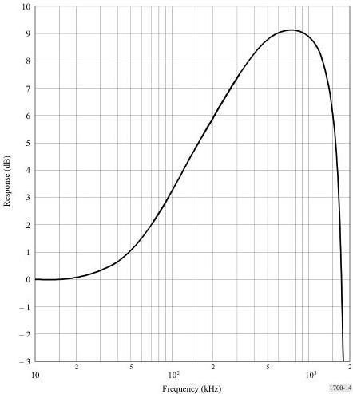

*Figure 14 - Nominal response of transfer function resulting from the video-frequency precorrection (refer to Table 4, item 10f).* 

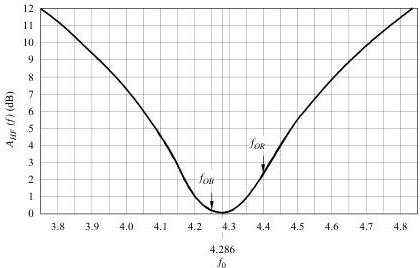

*Figure 15 - Attenuation curve of frequency correction  $A_{HF}$  (f) (refer to Table 4, item 10d).* 

Deviations from the nominal curve outside point  $f_{0}$  shall not exceed  $\pm 0.5$  dB.

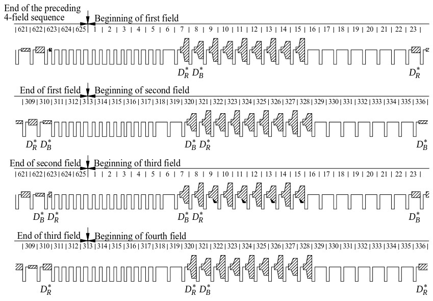

*Figure 16 - Sequence of  $D_R^*$  and  $D_R^*$  signals over four consecutive fields.*

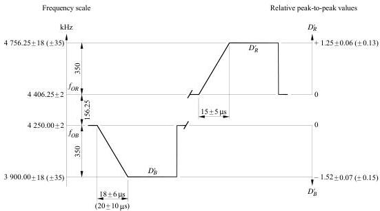

*Figure 17 - Shape of video signals corresponding to the chrominance synchronization signals. The value 1 represents the amplitude of the luminance signal between the blanking level and the white level. Provisionally, the tolerances may be extended up to the values given in brackets.*

# Annex 2

See: [SMPTE 170M-2004](../SMPTE-170M-2004/SMPTE-170M-2004.md)

