# RECOMMENDATION ITU-R BT.470-6

## Conventional television systems

(Question ITU-R 1/11)

(1970-1974-1986-1994-1995-1997-1998)

The ITU Radiocommunication Assembly,

## Considering

a) that many countries have established satisfactory monochrome television broadcasting services based on either 525-line or 625-line systems;
b) that a number of countries have established (or are in the process of establishing) satisfactory colour television broadcasting services based on the NTSC, PAL or SECAM systems;
c) that the use of video component signals, signals consisting of the luminance and two colour difference signals, with time compression and time division multiplexing, may offer picture quality benefits, using new types of television receivers;
d) that it would add further complications to the interchange of programmes to have a greater multiplicity of systems,

## Recommends

1 that, for a country wishing to initiate a conventional monochrome television service, a system using 525- or 625-lines as defined in Annex 1 is to be preferred;
2 that, for conventional monochrome 625-line systems, the video-frequency characteristic described in Recommendation ITU-R BT.472 is to be preferred;
3 that, for a country wishing to initiate a conventional colour television service, one of the systems defined in Annex 1 is to be preferred.

NOTE 1 – Pre-1986 editions of the ex-CCIR Volumes, and in particular that of 1982, contain a complete description of system E used in France until 1984, and system A used in the United Kingdom until 1985.

NOTE 2 – Pre-1997 editions of Recommendation ITU-R BT.470 contain a complete description of the SECAM IV colour television system.

## Annex 1

### Characteristics of television systems

The following tables, given for information purposes, contain details of a number of different television systems in use at the time of the Radiocommunication Assembly, 1995.

A list of countries and geographical areas, and the television systems used, are given in Appendix 1.

Information on the results of the comparative laboratory tests carried out on the various colour television systems in the period 1963-1966 by broadcasting authorities, administrations and industrial organizations, together with the main parameters of systems may be found in Reports 406 and 407, XIIth Plenary Assembly, New Delhi, 1970.

All television systems listed in this Annex employ an aspect ratio of the picture display (width/height) of 4/3, a scanning sequence from left to right and from top to bottom and an interlace ratio of 2/1, resulting in a picture (frame) frequency of half the field frequency. All systems are capable of operating independently of the power supply frequency.

* This Recommendation includes editorial amendments.

TABLE 1
Basic characteristics of video and synchronizing signals

|  Item | Characteristics | System  |   |   |   |   |   |   |   |   |
| --- | --- | --- | --- | --- | --- | --- | --- | --- | --- | --- |
|   |   |  M | N(1) | B, B1, D1, G | H | I | D, K | K1 | L | Rec. ITU-R BT.472(2)  |
|  1 | Number of lines per picture (frame) | 525 | 625 | 625 | 625 | 625 | 625 | 625 | 625 | 625  |
|  2 | Field frequency, nominal value (field/s)(3) | 60 (59.94) | 50 | 50 | 50 | 50 | 50 | 50 | 50 | 50  |
|  3 | Line frequency fH and tolerance when operated non-synchronously (Hz)(3), (4) | 15 750 (15 734.264 ± 0.0003%) | 15 625 ± 0.15% (± 0.00014%) | 15 625(5) ± 0.02% (± 0.0001%) | 15 625 ± 0.02% (± 0.0001%) | 15 625 ± 0.00002%(6) | 15 625(5) ± 0.02% (± 0.0001%) | 15 625 ± 0.02% (± 0.0001%) | 15 625 ± 0.02% (± 0.0001%) | 15 625 ± 0.02% (± 0.0001%)  |
|  3 a) | Maximum variation rate of line frequency valid for monochrome transmission (%/s)(7), (8) | 0.15 |  | 0.05 | 0.05 | 0.05 | 0.05 | 0.05 | 0.05 |   |
|  4(9) | Nominal and peak levels of the composite video signal (%) (see Fig. 1) |   |   |   |   |   |   |   |   |   |
|   |  Blanking level (reference level) | 0 | 0 | 0 | 0 | 0 | 0 | 0 | 0 |   |
|   |  Peak white-level | 100 | 100 | 100 | 100 | 100 | 100 | 100 | 100 |   |
|   |  Synchronizing level | -40 | -40 (-43) | -43 | -43 | -43 | -43 | -43 | -43 |   |
|   |  Difference between black and blanking level | 7.5 ± 2.5(10) | 7.5 ± 2.5 (0) | 0 | 0 | 0 | 0-7 0(11) | 0 (colour) 0-7 (mono.) | 0 (colour) 0-7 (mono.) | +5 0-0  |
|   |  Peak level including chrominance signal | 120 |  | 133(11) |  | 133 | 115(12) 133(11) | 115(12) | 124(12) |   |
|  5 | Assumed gamma of display device for which pre-correction of monochrome signal is made | 2.2 | 2.2 (2.8) | 2.8(13) |   |   |   |   |   | (14)  |
|  6 | Nominal video bandwidth (MHz) | 4.2 | 4.2 | 5 | 5 | 5.5 | 6 | 6 | 6 | 5.0 or 5.5 or 6.0  |
|  7 | Line synchronization | see Table 1-1  |   |   |   |   |   |   |   |   |
|  8 | Field synchronization | see Table 1-2  |   |   |   |   |   |   |   |   |

## Notes to Table 1:

(1) The values in brackets apply to the combination N/PAL used in Argentina.

(2) Figures are given for comparison.

(3) Figures in brackets are valid for colour transmission.

(4) In order to take full advantage of precision offset when the interfering carrier falls in the sideband of the upper video range (greater than 2 MHz) of the wanted signal a line-frequency stability of at least $2 \times 10^{-7}$ is necessary.

(5) The exact value of the tolerance for line frequency when the reference of synchronism is being changed requires further study.

(6) When the reference of synchronism is being changed, this may be relaxed to $15\,625 \pm 0.02\%$.

(7) These values are not valid when the reference of synchronism is being changed.

(8) Further study is required to define maximum variation rate of line frequency valid for colour transmission. In the United Kingdom and Japan this is $0.1\,\mathrm{Hz/s}$.

(9) It is also customary to define certain signal levels in 625-line systems, as follows:

Synchronizing level = 0
Blanking level = 30
Peak white-level = 100

For this scale, the peak level including chrominance signal for system D, K/SECAM equals 110.7. According to common studio operating practices, peak white-level = 100 corresponds to $1.0\,\mathrm{V}$ measured across a matched $75\,\Omega$ termination.

(10) In Japan values $0_{-0}^{+10}$ are used.

(11) Value applies to PAL signals.

(12) Values apply to SECAM signals. For programme exchange the value is 115.

(13) Assumed value for overall gamma approximately 1.2. The gamma of the picture tube is defined as the slope of the curve giving the logarithm of the luminance reproduced as a function of the logarithm of the video signal voltage when the brightness control of the receiver is set so as to make this curve as straight as possible in a luminance range corresponding to a contrast of at least 1/40.

(14) In Recommendation ITU-R BT.472, a gamma value for the picture signal is given as approximately 0.4.

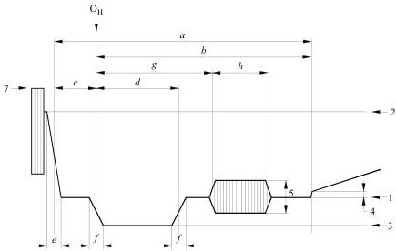

*Figure 1a - Levels in the composite signal and details of line-synchronizing signals, NTSC and PAL systems.*

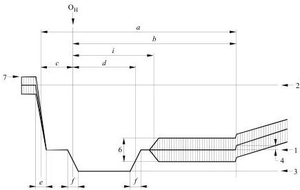

*Figure 1b - Levels in the composite signal and details of line-synchronizing signals, SECAM system. 1: Blanking level; 2: Peak white-level; 3: Synchronizing level; 4: Difference between black and blanking levels; 5: Peak-to-peak value of burst; 6: Peak-to-peak value of colour sub-carrier; 7: Peak level including chrominance signal.*

TABLE 1-1
Details of line synchronizing signals (see Fig. 1)

Duration (measured between half-amplitude points on the appropriate edges) for various systems

| Symbol | Characteristics | M$^{(1)}$ | N$^{(2)}$ | B, B1, G, H, I, D, D1, K, K1, L (see also Rec. ITU-R BT.472) |
| --- | --- | --- | --- | --- |
| H | Nominal line period (μs) | 63.492 (63.5555) | 64 | 64$^{(3)}$ |
| a | Line-blanking interval (μs) | 10.2 to 11.4$^{(4)}$ (10.9 ±0.2) | 10.24 to 11.52 (12 ±0.3) | $12^{+0.0}_{-0.3}\,\mu\mathrm{s}^{(5)}$ |
| b | Interval between time datum (O$_{H}$) and back edge of line-blanking pulse (μs) | 8.9 to 10.3 (9.2 to 10.3) | 8.96 to 10.24 (10.5) | 10.5$^{(6)}$ |
| c | Front porch (μs) | 1.27 to 2.54 (1.27 to 2.22) | 1.28 to 2.56 (1.5 ±0.3) | $1.5^{+0.3}_{-0.0}\,\mu\mathrm{s}^{(5)}$ |
| d | Synchronizing pulse (μs) | 4.19 to 5.71$^{(4)}$ (4.7 ±0.1) | 4.22 to 5.76 (4.7 ±0.2) | 4.7 ±0.2 |
| e | Build-up time (10 to 90%) of the edges of the line-blanking pulse (μs) | ≤0.64 ≤0.48 | ≤0.64 (0.3 ±0.1) | 0.3 ±0.1 |
| f | Build-up time (10 to 90%) of the edges of the line-synchronizing pulses (μs) | ≤0.25 | ≤0.25 (0.2 ±0.1) | 0.2 ±0.1$^{(7)}$ |

**(1)** Values in brackets apply to M/NTSC.

**(2)** The values in brackets apply to the combination N/PAL used in Argentina.

**(3)** In France, and some countries of the former OIRT, the tolerance for the instantaneous line period value is ± 0.032 μs.

**(4)** In Japan, the values in brackets apply to studio facilities.

**(5)** The tolerances for Symbols $a$ and $c$ are the preferred values that take into account the need to reduce the possibilities of data loss in 625-line countries using Teletext System B as specified in Annex 1 to Recommendation ITU-R BT.653.

**(6)** Average calculated value, for information.

**(7)** For system I, the values are 0.25 ± 0.05.

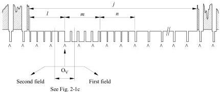

*Figure 2-1a - Details of field-synchronizing waveforms for all systems except M; signal at the beginning of each first field.*

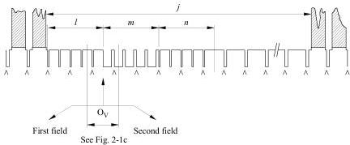

*Figure 2-1b - Details of field-synchronizing waveforms for all systems except M; signal at the beginning of each second field.*

Note 1 -  $\triangle \triangle \triangle$  indicates an unbroken sequence of edges of line-synchronizing pulses throughout the field-blanking period. Note 2 - At the beginning of each first field, the edge of the field-synchronizing pulse,  $\mathrm{O_V}$ , coincides with the edge of a line-synchronizing pulse if  $l$  is an odd number of half-line periods as shown.

Note 3 - At the beginning of each second field, the edge of the field-synchronizing pulse,  $\mathrm{O_V}$ , falls midway between the edges of two line-synchronizing pulses if  $l$  is an odd number of half-line periods as shown.

Note 4 - The dominant field is defined as that field of the video waveform at which a change of picture material should occur. The change of picture information should occur at the beginning of the first field.

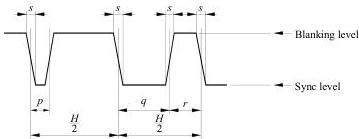

*Figure 2-1c - Details of equalizing and synchronizing pulses. Durations are measured between the half-amplitude points on the appropriate edges.*

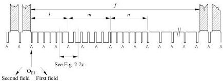

*Figure 2-2 - Details of field-synchronizing waveforms for system M.*

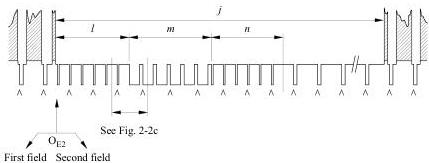

*Figures 2-2a and 2-2b - Signals at the beginning of each first and second fields.*

Note 1 -  $\wedge$  indicates an unbroken sequence of edges of line-synchronizing pulses throughout the field-blanking period.

Note 2 - Field-one line numbers start with the first equalizing pulse in Field 1, designated  $\mathrm{O_{E1}}$  in Fig. 2-2a.

Note 3 - Field-two line numbers start with the second equalizing pulse in Field 2, one-half-line period after  $\mathrm{O_{E2}}$  in Fig. 2-2b.

*Figure 2-2c - Details of equalizing and synchronizing pulses.*

Duration (measured between half-amplitude points on the appropriate edges) for various systems

TABLE 1-2
Details of field synchronizing signals (see Fig. 2)

| Symbol | Characteristics | M | N(1) | B, B1, G, H, I, D, D1, K, K1, L (see also Rec. ITU-R BT.472) |
| --- | --- | --- | --- | --- |
| $\nu$ | Field period (ms) | 16.667(2) (16.6833) | 20 | 20 |
| <i>j</i> | Field-blanking interval (for <i>H</i> and <i>a</i>, see Table 1-1) | (19 to 21) <i>H</i> + <i>a</i>(3) | (19 to 25) <i>H</i> + <i>a</i> (25 <i>H</i> + <i>a</i>) | 25 <i>H</i> + <i>a</i> |
| <i>j</i>'(4) | Build-up time (10 to 90%) of the edges of field-blanking pulses (μs) | ≤ 6.35 | ≤ 6.35 (0.3 ± 0.1) | 0.3 ± 0.1 |
| <i>k</i>(4) | Interval between front edge of field-blanking interval and front edge of first equalizing pulse (μs) | (1.5 ± 0.1) |  | 3 ± 2(5) (systems B, D, G, K/SECAM, K1 and L only; no ref. in Rec. ITU-R BT.472) |
| <i>l</i> | Duration of first sequence of equalizing pulses | 3 <i>H</i> | 3 <i>H</i> (2.5 <i>H</i>) | 2.5 <i>H</i> |
| <i>m</i> | Duration of sequence of synchronizing pulses | 3 <i>H</i> | 3 <i>H</i> (2.5 <i>H</i>) | 2.5 <i>H</i> |
| <i>n</i> | Duration of second sequence of equalizing pulses | 3 <i>H</i> | 3 <i>H</i> (2.5 <i>H</i>) | 2.5 <i>H</i> |
| <i>p</i> | Duration of equalizing pulse (μs) | (2.3 ± 0.1)(6) | 2.30 to 2.56 (2.35 ± 0.1) | (2.35 ± 0.1) |
| <i>q</i> | Duration of field-synchronizing pulse (μs) | 27.1 (nominal value) | 26.52 to 28.16 (27.3) | 27.3(7) (nominal value) |
| <i>r</i> | Interval between field-synchronizing pulse (μs) | (4.7 ± 0.1) | 3.84 to 5.63 (4.7 ± 0.2) | (4.7 ± 0.2)(8) |
| <i>s</i> | Build-up time (10 to 90%) of synchronizing and equalizing pulses (μs) | ≤ 0.25 | ≤ 0.25 (0.2 ± 0.1) | (0.2 ± 0.1)(9) |

**(1)** The values in brackets apply to the combination N/PAL used in Argentina.

**(2)** The value in brackets applies to the M/NTSC system.

**(3)** The value  $0.07\mathrm{v}_{-0}^{+0.012}\mathrm{v}$  is used in Japan where  $\mathbf{v}$  is the field period.

**(4)** Not indicated in the diagram.

**(5)** This value is to be specified more precisely at a later date.

**(6)** The following specification is also applied in Japan: an equalizing pulse has 0.45 to 0.5 times the area of a line-synchronizing pulse.

**(7)** For system I:  $27.3 \pm 0.1$ .

**(8)** For system I:  $4.7 \pm 0.1$ .

**(9)** For system I:  $0.25 \pm 0.05$ .

TABLE 2
Characteristics of video signal for colour television

| Item | Characteristics | M/NTSC | M/PAL | B, B1, D, D1, G, H, K, N/PAL | I/PAL | B, D, G, H, K, K1, L/SECAM | N/PAL(1) |
| --- | --- | --- | --- | --- | --- | --- | --- |
| 2.1 | Assumed chromaticity coordinates (CIE, 1931) for primary colours of receiver | x     y Red 0.67  0.33 Green 0.21  0.71 Blue 0.14  0.08 |  |  | x     y Red 0.64  0.33 Green 0.29  0.60 Blue 0.15  0.06 | (2) |  |
| 2.2 | Chromaticity coordinates for equal primary signals $E_R' = E_G' = E_B'$ | Illuminant C $x = 0.310$ $y = 0.316$ |  | Illuminant D65 $x = 0.313$ $y = 0.329$ | (2) |  |  |
| 2.3 | Assumed gamma value of the receiver for which the primary signals are pre-corrected(4) | 2.2 | 2.8 |  |  |  |  |
| 2.4 | Luminance signal | $E_Y' = 0.299 E_R' + 0.587 E_G' + 0.114 E_B'$ (5) $E_R'$, $E_G'$ and $E_B'$ are gamma-pre-corrected primary signals (6) |  |  |  |  |  |
| 2.5 | Chrominance signals (colour difference) | $E_I' = -0.27(E_B' - E_Y') + 0.74(E_R' - E_Y')$ $E_Q' = 0.41(E_B' - E_Y') + 0.48(E_R' - E_Y')$ | $E_U' = 0.493(E_B' - E_Y')$ $E_V' = 0.877(E_R' - E_Y')$ |  |  | $D_R' = -1.902(E_R' - E_Y')$ $D_B' = 1.505(E_B' - E_Y')$ |  |
| 2.6 | Attenuation of colour difference signals | dB MHz $E_I' < 3$ at 1.3 $\geq 20$ at 3.6 $< 2$ at 0.4 $E_Q' < 6$ at 0.5 $\geq 6$ at 0.6 | dB MHz $E_U' < 2$ at 1.3 $E_V' > 20$ at 3.6 | dB MHz $E_U' < 3$ at 1.3 $E_V' > 20$ at 4 |  | dB MHz $D_R' \leq 3$ at 1.3 $D_B' \geq 30$ at 3.5 Low frequency pre-correction not taken into account(7) | dB MHz $E_U' < 3$ at 1.3 $E_V' > 20$ at 3.6 |

TABLE 2 (continued)

| Item | Characteristics | M/NTSC | M/PAL | B, B1, D, D1, G, H, K, N/PAL | I/PAL | B, D, G, H, K, K1, L/SECAM | N/PAL(1) |
| --- | --- | --- | --- | --- | --- | --- | --- |
| 2.7 | Low frequency pre-correction of colour difference signals |  |  |  |  | For sinusoidal signals: $D_R'^* = A_{BF}(f) D_R'$ $D_B'^* = A_{BF}(f) D_B'$ $A_{BF}(f) = \dfrac{1 + j(f/f_1)}{1 + j(f/3f_1)}$ $f$: signal frequency (kHz) $f_1 = 85\,\mathrm{kHz}$ (See Fig. 6 for the amplitude response)(8) |  |
| 2.8 | Time-coincidence error between luminance and chrominance signals (μs) | < 0.05 Excluding pre-correction for receiver response |  |  |  |  |  |
| 2.9 | Equation of composite colour signal | $E_M = E_Y' + E_Q' \sin(2\pi f_{sc}' t + 33^{\circ}) + E_I' \cos(2\pi f_{sc}' t + 33^{\circ})$ where: $E_Y'$, see item 2.4 $E_Q'$ and $E_I'$, see item 2.5 $f_{sc}'$, see item 2.11 (See also Fig. 4a) | $E_M = E_Y' + E_U' \sin 2\pi f_{sc}' t + E_V' \cos 2\pi f_{sc}' t$ where: $E_Y'$, see item 2.4 $E_U'$ and $E_V'$, see item 2.5 $f_{sc}'$, see item 2.11 The sign of the $E_V'$ component is the same as that of the sub-carrier burst (changing for each line) (see item 2.16 and Fig. 4b) |  |  | $E_M = E_Y' + G \cos 2\pi\left(f_{OR}' + \Delta f_{OR} f_0' D_R'^*\,dt\right)$ or $E_M = E_Y' + G \cos 2\pi\left(f_{OB}' + \Delta f_{OB} f_0' D_B'^*\,dt\right)$ alternately from line to line where: $E_Y'$, see item 2.4 $f_{OR}'$ and $f_{OB}'$, see item 2.11 $\Delta f_{OR}$ and $\Delta f_{OB}$, see item 2.12 $D_R'^*$ and $D_B'^*$, see item 2.7 $G$, see item 2.13 |  |

See Notes at the end of Table 2.

TABLE 2 (continued)

| Item | Characteristics | M/NTSC | M/PAL | B, B1, D, D1, G, H, K, N/PAL | I/PAL | B, D, G, H, K, K1, L/SECAM | N/PAL(1) |
| --- | --- | --- | --- | --- | --- | --- | --- |
| 2.10 | Type of chrominance sub-carrier modulation | Suppressed-carrier amplitude-modulation of two sub-carriers in quadrature | Suppressed-carrier amplitude-modulation of two sub-carriers in quadrature | Suppressed-carrier amplitude-modulation of two sub-carriers in quadrature | Suppressed-carrier amplitude-modulation of two sub-carriers in quadrature | Frequency modulation |  |
| 2.11 | a) Nominal value and tolerance (Hz) | 3 579 545 ± 10 | 3 579 611.49 ± 10 | 4 433 618.75 ± 5 | 4 433 618.75 ± 1(9), (10) | $f_{OR} = 4\,406\,250 \pm 2\,000$ $f_{OB} = 4\,250\,000 \pm 2\,000$ (11) | 3 582 056.25 ± 5 |
| 2.11 | b) Relationship between chrominance sub-carrier frequency $f_{sc}$ and line frequency $f_H$ | $f_{sc} = \dfrac{455}{2} f_H$ | $f_{sc} = \dfrac{909}{4} f_H$ | $f_{sc} = \left(\dfrac{1135}{4} + \dfrac{1}{625}\right) f_H$ |  | Unmodulated sub-carrier at beginning of line 282 $f_H$ for $f_{OR}$ 272 $f_H$ for $f_{OB}$(12) | $f_{sc} = \left(\dfrac{917}{4} + \dfrac{1}{625}\right) f_H$ |
| 2.12 | Bandwidth of chrominance sidebands (quadrature modulation of sub-carrier) (kHz) or Frequency deviation of chrominance sub-carrier (frequency modulation of sub-carrier) (kHz) | $f_{sc} + 620$ $f_{sc} - 1\,300$ | $f_{sc} + 600$ $f_{sc} - 1\,300$ | $f_{sc} + 570$ $f_{sc} - 1\,300$(13) | $f_{sc} + 1\,066$ $f_{sc} - 1\,300$ | Nominal deviation $D'^* = 1$(14) $\Delta f_{OR}$(15) $\Delta f_{OB}$(15) | Maximum deviation 280 ± 9 (± 14) +350 ± 18 (± 35) −506 ± 25 (± 50)  230 ± 7 (± 11.5) +506 ± 25 (± 50) −350 ± 18 (± 35) |

See Notes at the end of Table 2.

TABLE 2 (continued)

| Item | Characteristics | M/NTSC | M/PAL | B, B1, D, D1, G, H, K, N/PAL | I/PAL | B, D, G, H, K, K1, L/SECAM | N/PAL(1) |
| --- | --- | --- | --- | --- | --- | --- | --- |
| 2.13 | Amplitude of chrominance sub-carrier | $G = \sqrt{E_I'^2 + E_Q'^2}$ | $G = \sqrt{E_U'^2 + E_V'^2}$ (16), (17) |  |  | $G = M_0 \dfrac{1 + j16F}{1 + j1.26F}$ where the peak-to-peak amplitude, $2M_0$, is 23 ± 2.5% of the luminance amplitude (between blanking level and peak-white) and $F = \dfrac{f}{f_0} - \dfrac{f_0}{f}$ where $f_0 = 4\,286\,\mathrm{kHz}$ and $f$ is the instantaneous sub-carrier frequency. The deviation of frequency, $f_0$, from its nominal value due to misalignment of the circuits concerned should not exceed ± 20 kHz. (See Fig. 7 for the amplitude response) |  |
| 2.14 | Synchronization of chrominance sub-carrier | Sub-carrier burst on blanking back porch | Sub-carrier burst on blanking back porch |  |  |  |  |
| 2.14 | g) Start of sub-carrier burst (μs) (see Fig. 1a) | 4.71 to 5.71 (5.3 nominal) at least 0.38 μs after the trailing edge of line synchronization signal | 5.8 ± 0.1 after epoch $O_H$ | 5.6 ± 0.1 after epoch $O_H$(18) |  |  |  |
| 2.14 | h) Duration of sub-carrier burst (μs) (see Fig. 1a) | 2.23 to 3.11 (9 ± 1 cycles) | 2.52 ± 0.28 (9 ± 1 cycles) | 2.25 ± 0.23 (10 ± 1 cycles) |  |  | 2.51 ± 0.28 (9 ± 1 cycles) |

See Notes at the end of Table 2.

TABLE 2 (continued)

<table>
	<thead>
		<tr>
			<th>Item</th>
			<th>Characteristics</th>
			<th>M/NTSC</th>
			<th>M/PAL</th>
			<th>B, B1, D, D1, G, H, K, N/PAL</th>
			<th>I/PAL</th>
			<th>B, D, G, H, K, K1, L/SECAM</th>
			<th>N/PAL(1)</th>
		</tr>
	</thead>
	<tbody>
		<tr>
			<td>2.15</td>
			<td>Peak-to-peak value of chrominance sub-carrier burst (see Fig. 1a)(19)</td>
			<td>4/10 of difference between blanking level and peak white-level ± 10%</td>
			<td colspan="3">3/7 of difference between blanking level and peak white-level ± 10% For systems D and I the tolerance is ± 3% (16), (17)</td>
			<td></td>
			<td></td>
		</tr>
		<tr>
			<td>2.16</td>
			<td>Phase of chrominance sub-carrier burst (see Fig. 1a)</td>
			<td>180° relative to $E_B' - E_Y'$ axis (see Fig. 4a). In the NTSC sequence of four colour fields, field 1 is identified in accordance with Note(20) (see also Fig. 5c)</td>
			<td colspan="3">135° relative to $E_U'$ axis with the following sign (see Fig. 4b)  <table>
				<tr><th rowspan="4">Line</th><th colspan="8">Field No.(21)</th></tr>
				<tr><td>1</td><td>2</td><td>3</td><td>4</td><td>5</td><td>6</td><td>7</td><td>8</td></tr>
				<tr><th colspan="8">Burst blanking sequence (see Figs. 5a and 5b)</th></tr>
				<tr><td>I</td><td>II</td><td>III</td><td>IV</td><td>I</td><td>II</td><td>III</td><td>IV</td></tr>
				<tr><th>Even</th><td>−</td><td>−</td><td>+</td><td>+</td><td>−</td><td>−</td><td>+</td><td>+</td></tr>
				<tr><th>Odd</th><td>+</td><td>+</td><td>−</td><td>−</td><td>+</td><td>+</td><td>−</td><td>−</td></tr>
			</table></td>
			<td></td>
			<td></td>
		</tr>
		<tr>
			<td>2.17</td>
			<td>Blanking of chrominance sub-carrier</td>
			<td>Following each equalizing pulse and also during the broad synchronizing pulses in the field-blanking interval</td>
			<td>11 lines of field-blanking interval: 260 to 270 522 to 7 259 to 269 233 to 8 (see Fig. 5b)</td>
			<td>9 lines of the field-blanking interval: lines 311 to 319 inclusive 623 to 6 inclusive 310 to 318 inclusive 622 to 5 inclusive (see Fig. 5a)</td>
			<td>a) From leading edge of line-blanking signal up to $i = 5.6 \pm 0.2$ (μs) after epoch $O_H$, i.e. during $c + i$ (see Fig. 1b)(22)  b) During field-blanking interval, excluding frame identification signals, or, in countries where this is possible, during the whole of the field-blanking interval (see item 2.18)</td>
			<td></td>
			<td></td>
		</tr>
	</tbody>
</table>

See Notes at the end of Table 2.

TABLE 2 (continued)

<table>
	<thead>
		<tr>
			<th>Item</th>
			<th>Characteristics</th>
			<th>M/NTSC</th>
			<th>M/PAL</th>
			<th>B, B1, D, D1, G, H, K, N/PAL</th>
			<th>I/PAL</th>
			<th>B, D, G, H, K, K1, L/SECAM</th>
			<th>N/PAL(1)</th>
		</tr>
	</thead>
	<tbody>
		<tr>
			<td>2.18</td>
			<td>Synchronization of chrominance sub-carrier switching during line blanking</td>
			<td>See item 2.16. For signals used in programme integration, the tolerance on the coincidence between the reference sub-carrier and the horizontal synchronizing pulses is nominally 0 ± 40° of the reference sub-carrier</td>
			<td colspan="3">By $E_V'$ chrominance component of sub-carrier burst (see item 2.16)</td>
			<td>In the SECAM system, one of two colour synchronization methods can be chosen: − Line identification: by chrominance sub-carrier reference signals on the line-blanking back porch(23) − By identification signals occupying 9 lines of field-blanking period: a) line 7 to 15 in 1st and 3rd field b) line 320 to 328 in 2nd and 4th field (see Fig. 9)(24)  <i>Shape of video signals corresponding to identification signals:</i>  For lines $D_R'$ − Trapezoid with linear variation from beginning of line on 15 ± 5 μs from 0 up to level +1.25 and then constant at the level +1.25 ± 0.06 (± 0.13) (see Fig. 8)</td>
			<td></td>
		</tr>
	</tbody>
</table>

See Notes at the end of Table 2.

TABLE 2 (continued)

<table>
	<thead>
		<tr>
			<th>Item</th>
			<th>Characteristics</th>
			<th>M/NTSC</th>
			<th>M/PAL</th>
			<th>B, B1, D, D1, G, H, K, N/PAL</th>
			<th>I/PAL</th>
			<th>B, D, G, H, K, K1, L/SECAM</th>
			<th>N/PAL(1)</th>
		</tr>
	</thead>
	<tbody>
		<tr>
			<td></td>
			<td></td>
			<td></td>
			<td></td>
			<td></td>
			<td></td>
			<td>For lines $D_B'$ − Trapezoid with linear variation from the beginning of the line on 18 ± 6 μs (20 ± 10 μs) from 0 down to level −1.52 and then constant at the level −1.52 ± 0.07 (± 0.15) (see Fig. 8)(15)  <i>Peak-to-peak amplitude of identification signals:</i> For lines $D_B'$: 500 ± 50 mV For lines $D_R'$: $500^{+40\,\mathrm{mV}}_{-40\,\mathrm{mV}}$ if amplitude of luminance signal (between blanking level and peak white) equals 700 mV  <i>Maximum deviation during transmission of identification signals (kHz):</i> For lines $D_R'$: +350 ± 18 (± 35) For lines $D_B'$: −350 ± 18 (± 35) (15)</td>
			<td></td>
		</tr>
	</tbody>
</table>

See Notes at the end of Table 2.

## Notes to Table 2:

**(1)** These values apply to the combination N/PAL used in Argentina. Only those values are given in this column which are different from the values given in the column B, G, H, N/PAL.

**(2)** For SECAM systems and for existing sets, it is provisionally allowed to use the following chromaticity coordinates for the primary colours and white:

|   | x | y  |
| --- | --- | --- |
|  Red | 0.67 | 0.33  |
|  Green | 0.21 | 0.71  |
|  Blue | 0.14 | 0.08  |
|  White | 0.310 | 0.316 (C-white)  |

**(3)** In Japan, the chromaticity of studio monitors is adjusted to a D-white at 9 300 K.

**(4)** The primary signals are pre-corrected so that the optimum quality is obtained with a display having the indicated value of gamma.

**(5)** In certain countries using the SECAM systems and in Japan it is also permitted to obtain the luminance signal as a direct output from an independent photo-electric analyser instead of from the primary signals.

**(6)** For the SECAM system, it is allowable to apply a correction to reduce interference distortions between the luminance and chrominance signals by an attenuation of the luminance signal components as a function of the amplitude of the luminance components in the chrominance band.

**(7)** This value will be defined more precisely later.

**(8)** The maximum deviations from the nominal shape of the curve (see Fig. 6) should not exceed ± 0.5 dB in the frequency range from 0.1 to 0.5 MHz and ± 1.0 dB in the frequency range from 0.5 to 1.3 MHz.

**(9)** When the signal originates from a portable or overseas source the tolerance on the frequency may be relaxed to ± 5 Hz. Maximum rate of variation of $f_{sc} = 0.1$ Hz/s.

**(10)** This tolerance may not be maintained during such operational procedures as "genlock".

**(11)** A reduction of the tolerance is desirable.

**(12)** The initial phase of the sub-carrier undergoes in each line a variation defined by the following rule:

From frame to frame: by $0^{\circ}$: $180^{\circ}$: $0^{\circ}$: $180^{\circ}$: and so on, and also from line to line in either one of the following two patterns:

$0^{\circ}$: $0^{\circ}$: $180^{\circ}$: $0^{\circ}$: $0^{\circ}$: $180^{\circ}$: and so on,

or $0^{\circ}$: $0^{\circ}$: $0^{\circ}$: $180^{\circ}$: $180^{\circ}$: and so on.

**(13)** $f_{sc} \pm 1300 \mathrm{kHz}$ is adopted in the People's Republic of China.

**(14)** The unity value represents the amplitude of the luminance signal between the blanking level and the peak white-level.

**(15)** Provisionally, the tolerances may be extended up to the values given brackets.

**(16)** During transmission of a monochrome programme of significant duration, in order to ensure satisfactory operation of colour-killers in receivers, all signals having the same nominal frequency as the colour sub-carrier that appears in the line-blanking interval, should be attenuated by at least 35 dB below the peak-to-peak value of the burst given in item 2.15, column 3 of Table 2, and shown as item 5 in Fig. 1.

**(17)** The value given in Note (16) is accepted on a tentative basis.

**(18)** Transmitter pre-correction for receiver group delay is not included.

**(19)** For the use of automatic gain control circuits, it is important that the burst amplitude should maintain the correct ratio with the chrominance signal amplitude.

**(20)** Field 1 of the sequence of four fields in the NTSC video signal is defined by a whole line between the first equalizing pulse and the preceding horizontal synchronizing pulse and a negative-going zero-crossing of the reference sub-carrier nominally at the 50% point of the first equalizing pulse. The zero-crossing of the reference sub-carrier shall be nominally coincident with the 50% point of the leading edges of all horizontal synchronizing pulses for programme integration at the studio.

**(21)** Field 1 of the sequence of eight colour fields is defined as that field, where the phase $\varphi E_U'$ of the extrapolated $E_U'$ component (see item 2.5 of Table 2) of the video burst at the hall amplitude point of the leading edge of the line synchronizing pulse of line 1 is in the range $-90^{\circ} \leq \varphi E_U' < 90^{\circ}$.

**(22)** The value of the tolerance will be defined more precisely later.

**(23)** The line identification method is preferable, because it will enable agreements to be reached subsequently on the suppression of frame identification signals in international programme exchanges. In the absence of such agreements, signals meeting the SECAM standard are regarded as comprising such identification signals.

**(24)** In France, a decree of 14 March 1978 specified that colour TV receivers placed on sale on or after 1 December 1979 must use the line identification method of decoding. In France and Ukraine, studies are taking place with a view to reducing the number of lines used for field colour identification signals.

**(24)** The order in which the identification signals $D_B^*$ and $D_B^*$ appear on the four fields of a complete cycle given in Fig. 9 is in conformity with Recommendation ITU-R BR.469.

TABLE 3
Characteristics of the radiated signals (monochrome and colour)

| Item | Characteristics | M | N(1) | B, B1, G | H | I | D, D1, K | K1 | L |
| --- | --- | --- | --- | --- | --- | --- | --- | --- | --- |
|  | Frequency spacing (see Fig. 10) |  |  |  |  |  |  |  |  |
| 1 | Nominal radio-frequency channel bandwidth (MHz) | 6 | 6 | B:7 B1, G:8 | 8 | 8 | 8 | 8 | 8 |
| 2 | Sound carrier relative to vision carrier (MHz) | + 4.5(2) | + 4.5 | + 5.5 ±0.001 (3), (4), (5), (6) | + 5.5 | + 5.9996 ±0.0005(7) | + 6.5 ±0.001(6) | + 6.5(8) | + 6.5(8) |
| 3 | Nearest edge of channel relative to vision carrier (MHz) | −1.25 | −1.25 | −1.25 | −1.25 | −1.25 | −1.25 | −1.25 | −1.25 |
| 4 | Nominal width of main sideband (MHz) | 4.2 | 4.2 | 5 | 5 | 5.5 | D, K: 6 D1: 5 | 6 | 6(8) |
| 5 | Nominal width of vestigial sideband (MHz) | 0.75 | 0.75 | 0.75 | 1.25 | 1.25(32) | 0.75 | 1.25 | 1.25(9) |
| 6 | Minimum attenuation of vestigial sideband (dB at MHz)(10) | 20 (−1.25) 42 (−3.58) | 20 (−1.25) 42 (−3.5) | 20 (−1.25) 20 (−3.0) 30 (−4.43)(11) | 20 (−1.75) 20 (−3.0) | 20 (−3.0) 30 (−4.43)(32) | 20 (−1.25) 30 (−4.33 ± 0.1) (12), (13) | 20 (−2.7) 30 (−4.3) ref.: 0 (+0.8) | 15 (−2.7) 30 (−4.3)(9) ref.: 0 (+0.8) |
| 7 | Type and polarity of vision modulations | C3F neg. | C3F neg. | C3F neg. | C3F neg. | C3F neg. | C3F neg. | C3F neg. | C3F pos. |
| 8 | Levels in the radiated signal (% of peak carrier) Synchronizing level Blanking level Difference between black level and blanking level Peak white-level | 100 72.5 to 77.5 2.88 to 6.75 (15) 10 to 15 | 100 72.5 to 77.5 (75 ± 2.5) 2.88 to 6.75 10 to 15 (10 to 12.5) | 100 75 ± 2.5 (14) 0 to 2 (nominal) 10 to 15 (14), (17) | 100 72.5 to 77.5 0 to 7 10 to 12.5 | 100 76 ± 2 0 (nominal) 20 ± 2 | 100 75 ± 2.5 0 to 4.5 (16) 10 to 15 (18), (19) | 100 75 ± 2.5 0 to 4.5 10 to 12.5 | < 6(8) 30 ± 2 0 to 4.5 100 (≈110) (20) |
| 9 | Type of sound modulation | F3E | F3E | F3E | F3E | F3E | F3E | F3E | A3E |

See Notes at the end of Table 3.

TABLE 3 (continued)

| Item | Characteristics | M | N(1) | B, B1, G | H | I | D, D1, K | K1 | L |
| --- | --- | --- | --- | --- | --- | --- | --- | --- | --- |
| 10 | Frequency deviation (kHz) | ±25 | ±25 | ±50 | ±50 | ±50 | ±50 | ±50 |  |
| 11 | Pre-emphasis for modulation (μs) | 75 | 75 | 50 | 50 | 50 | 50 | 50 |  |
| 12 | Ratio of effective radiated powers of vision and (primary) sound(21) | 10/1 to 5/1 (22) | 10/1 to 5/1 | 20/1 to 10/1 (3), (6), (23) | 5/1 to 10/1 | 5/1 10/1(24) 20/1(7), (25) | 10/1 to 5/1 (6), (26) | 10/1 | 10/1 10/1 to 40/1 (8), (27) |
| 13 | Pre-correction for receiver group-delay characteristics at medium video frequencies (ns) (see also Fig. 3) | 0 | ( 1 MHz 0 ± 100 1 MHz 0 ± 100 1 MHz 0 ± 60 ) | (28) |  |  | (29, 31) |  |  |
| 14 | Pre-correction for receiver group-delay characteristics at colour sub-carrier frequency (ns) (see also Fig. 3) | −170 (nominal) | ($-170^{+60}_{-40}$) | −170 (nominal) (28) |  |  | (30, 31) |  |  |

**(1)** The values in brackets apply to the combination N/PAL used in Argentina.

**(2)** In Japan, the values  $+4.5 \pm 0.001$  are used.

**(3)** In the Federal Republic of Germany, Austria, Italy, the Netherlands, Slovakia and Switzerland a system of two sound carriers is used, the frequency of the second carrier being  $242.1875\mathrm{kHz}$  above the frequency of the first sound carrier. The ratio between vision/sound e.r.p. for this second carrier is  $100/1$ . For further information on this system see Recommendation ITU-R BS.707. For stereophonic sound transmissions a similar system is used in Australia with vision/sound power ratios being  $20/1$  and  $100/1$  for the first and second sound carriers respectively.

**(4)** New Zealand uses a sound carrier displaced  $5.4996 \pm 0.0005 \mathrm{MHz}$  from the vision carrier.

**(5)** The sound carrier for single carrier sound transmissions in Australia may be displaced  $5.5 \pm 0.005 \mathrm{MHz}$  from the vision carrier.

**(6)** In Denmark, Finland, New Zealand, Sweden and Spain a system of two sound carriers is used. In Iceland, Norway and Poland the same system is being introduced. The second carrier is  $5.85\mathrm{MHz}$  above the vision carrier and is DQPSK modulated with 728 kbit/s sound and data multiplex. The ratios between vision/sound power are 20/1 and 100/1 for the first and second carrier respectively. For further information, see Recommendation ITU-R BS.707.

**(7)** In the United Kingdom, a system of two sound carriers is used. The second sound carrier is  $6.552\mathrm{MHz}$  above the vision carrier and is DQPSK modulated with a 728 kbit/s sound and data multiplex able to carry two sound channels. The ratio between vision and sound e.r.p. for the second carrier is  $100/1$ .

**(8)** In France, a digital carrier  $5.85\mathrm{MHz}$  away from the vision carrier may be used in addition to the main sound carrier. It is modulated in differentially encoded QPSK with a 728 kbit/s sound and data multiplexer capable of carrying two sound channels. The nominal width of the main sideband is limited to  $5.1\mathrm{MHz}$ . With the L standard, the depth of video modulation in the radiated signal is reduced to leave a residual radiated carrier level of  $5 \pm 2\%$ . For further information, see Recommendation ITU-R BS.707.

## Notes to Table 3 (continued):

**(9)** In France a vestigial sideband of 0.75 MHz is optionally used. In such cases, typical values to be used for minimum attenuation of vestigial sideband are 15 (−1.25) and 30 (−4.3) in dB at MHz.

**(10)** In some cases, low-power transmitters are operated without vestigial-sideband filter.

**(11)** For B/SECAM and G/SECAM: 30 dB at −4.33 MHz, within the limits of ±0.1 MHz.

**(12)** In some countries, members of the former OIRT, additional specifications are in use:

a) not less than 40 dB at −4.286 MHz ± 0.5 MHz,  
b) 0 dB from −0.75 MHz to +6.0 MHz,  
c) not less than 20 dB at ±6.375 MHz and higher.

Reference: 0 dB at +1.5 MHz.

**(13)** In the People’s Republic of China, the attenuation value at the point (−4.33 ± 0.1) has not yet been determined.

**(14)** Australia uses the nominal modulation levels specified for system I.

**(15)** In Japan, the values of 0 to 6.75 have been adopted.

**(16)** In the People’s Republic of China, the values 0 to 5 have been adopted.

**(17)** Italy is considering the possibility of controlling the peak white-level after weighting the video frequency signal by a low-pass filter, so as to take account only of those spectrum components of the signal that are likely to produce inter-carrier noise in certain receivers when the nominal level is exceeded. Studies should be continued with a view to optimizing the response of the weighting filter to be used.

**(18)** The former USSR has adopted the value 15 ± 2%.

**(19)** A new parameter “white level with sub-carrier” should be specified at a later date. For that parameter, the former USSR has adopted the value of 7 ± 2%.

**(20)** The peak white-level refers to a transmission without colour sub-carrier. The figure in brackets corresponds to the peak value of the transmitted signal, taking into account the colour sub-carrier of the respective colour television system.

**(21)** The values to be considered are:

- the r.m.s. value of the carrier at the peak of the modulation envelope for the vision signal. For system L, only the luminance signal is to be considered. (See Note(16) above);
- the r.m.s. value of the unmodulated carrier for amplitude-modulated and frequency-modulated sound transmissions.

**(22)** In Japan, a ratio of 1/0.15 to 1/0.35 is used. In the United States, the sound carrier e.r.p. is not to exceed 22% of the peak authorized vision e.r.p.

**(23)** Recent studies in India confirm the suitability of a 20/1 ratio of effective radiated powers of vision and sound. This ratio still enables the introduction of a second sound carrier.

**(24)** The ratio 10/1 is used in the Republic of South Africa.

## Notes to Table 3 (continued):

**(25)** The ratio 20:1 is used in the United Kingdom.

**(26)** In the People’s Republic of China, the value 10/1 has been adopted.

**(27)** In France, the ratios 10/1 and 40/1 are used.

**(28)** In the Federal Republic of Germany and the Netherlands the correction for receiver group-delay characteristics is made according to curve B in Fig. 3a). Tolerances are shown in the table under Fig. 3a). Spain uses curve A. Some former OIRT countries using the B/SECAM and G/SECAM systems use a nominal pre-correction of 90 ns at medium video frequencies. In Sweden, the pre-correction is $0 \pm 40$ ns up to $3.6\mathrm{MHz}$. For $4.43\mathrm{MHz}$, the correction is $-170 \pm 20$ ns and for $5\mathrm{MHz}$ it is $-350 \pm 80$ ns. In New Zealand the pre-correction increases linearly from $0 \pm 20$ ns at $0\mathrm{MHz}$ to $60 \pm 50$ ns at $2.25\mathrm{MHz}$, follows curve A of Fig. 3a) from $2.25\mathrm{MHz}$ to $4.43\mathrm{MHz}$ and then decreases linearly to $-300 \pm 75$ ns at $5\mathrm{MHz}$. In Australia, the nominal pre-correction follows curve A up to $2.5\mathrm{MHz}$, then decreases to $0$ ns at $3.5\mathrm{MHz}$, $-170$ ns at $4.43\mathrm{MHz}$ and $-280$ ns at $5\mathrm{MHz}$. Based on studies on receivers in India, the receiver group delay pre-equalization proposed to be adopted in India at $1\mathrm{MHz}$, $2\mathrm{MHz}$, $3\mathrm{MHz}$, $4.43\mathrm{MHz}$ and $4.8\mathrm{MHz}$ is $+125$ ns, $+150$ ns, $+142$ ns, $-75$ ns and $-200$ ns respectively. In Denmark, the precorrections at 0, 0.25, 1.0, 2.0, 3.0, 3.8, 4.43 and $4.8\mathrm{MHz}$ are 0, +5, +53, +75, +75, 0, -170 and 400 ns.

**(29)** Not yet determined. The former Czechoslovak Socialist Republic proposed +90 ns (nominal value).

**(30)** Not yet determined. The former Czechoslovak Socialist Republic proposed +25 ns (nominal value).

**(31)** In Poland no group-delay precorrection is used.

**(32)** In the United Kingdom, for PAL transmissions in the upper-adjacent channel to a DVB-T service, the nominal width of the vestigial sideband is proposed to be $0.75\mathrm{MHz}$, with minimum attenuations of the vestigial sideband of 20 (-1.25), 45 (-1.45) in dB at MHz. Such transmission will be referred to as System II.

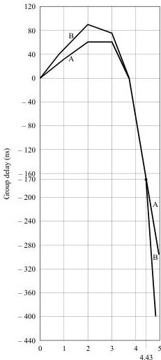

*Figure 3a - Curve of pre-correction for receiver group-delay characteristics, B/PAL and G/PAL systems (see Table 3 (28)).*

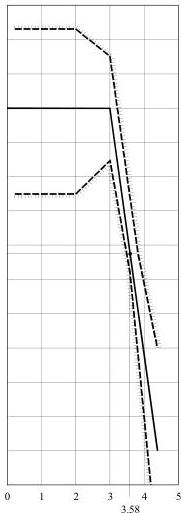

*Figure 3b - Curve of pre-correction for receiver group-delay characteristics, M/PAL and M/NTSC systems.*

Nominal values and tolerances (ns)

|  Frequency (MHz) | Curve A | Curve B  |
| --- | --- | --- |
|  0.25 |  | + 5 ± 0  |
|  1.00 | + 30 ± 50 | + 53 ± 40  |
|  2.00 | + 60 ± 50 | + 90 ± 40  |
|  3.00 | + 60 ± 50 | + 75 ± 40  |
|  3.75 | 0 ± 50 | 0 ± 40  |
|  4.43 | - 170 ± 35 | - 170 ± 40  |
|  4.80 | - 260 ± 75 | - 400 ± 90  |

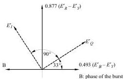

*Figure 4a - Chrominance axes and phase of the burst, NTSC system.*

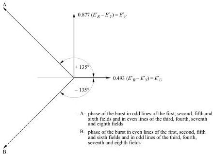

*Figure 4b - Chrominance axes and phase of the burst, PAL system.*

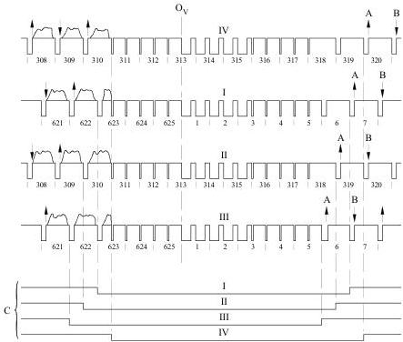

*Figure 5a - Burst-blanking sequence in the B, B1, D, D1, G, H, K and I/PAL systems. Ov: field-synchronizing datum; I, II, III, IV: first and fifth, second and sixth, third and seventh, fourth and eighth fields (see item 2.16 of Table 2); A: phase of burst, nominal value $+135^{\circ}$; B: phase of burst, nominal value $-135^{\circ}$; C: burst-blanking intervals.*

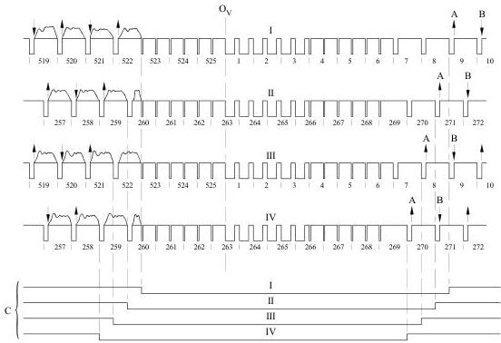

*Figure 5b - Burst-blanking sequence in M/PAL system. Ov: field-synchronizing datum; I, II, III, IV: first and fifth, second and sixth, third and seventh, fourth and eighth fields (see item 2.16 of Table 2); A: phase of burst, nominal value $+135^{\circ}$; B: phase of burst, nominal value $-135^{\circ}$; C: burst-blanking intervals.*

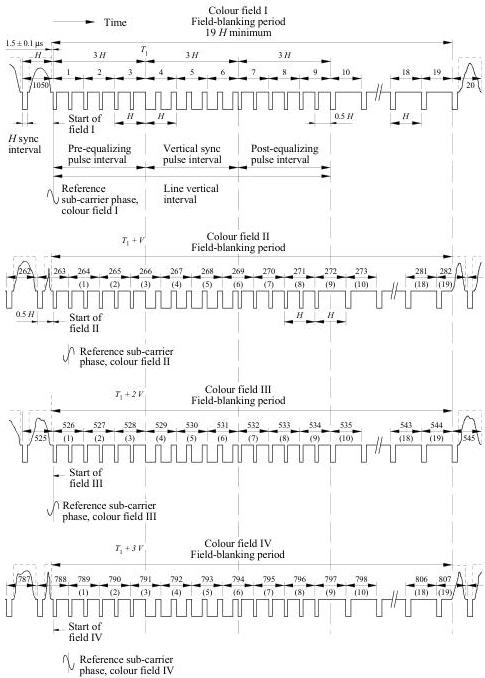

*Figure 5c - Burst-blanking sequence in M/NTSC system. Note 1: The numbering of specific lines is in accordance with new engineering practice; line numbers in parentheses represent an alternative method of line numbering used in some systems in some countries.*

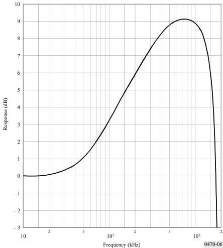

*Figure 6 - Nominal response of the transfer function resulting from the video-frequency precorrection circuit $A_{BF}(f)$ and the low-pass filter (see Table 2, item 2.7).*

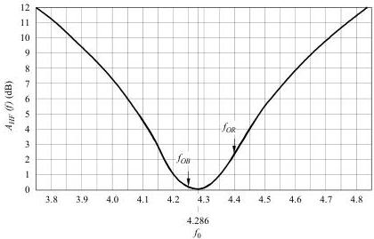

*Figure 7 - Attenuation curve of frequency correction $A_{HF}(f)$. Deviations from the nominal curve outside point $f_0$ must not exceed $\pm 0.5$ dB.*

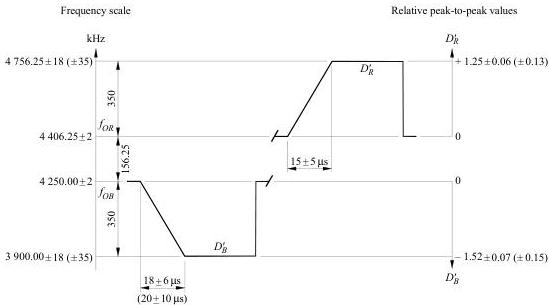

*Figure 8 - Shape of video signals corresponding to the chrominance synchronization signals. The value 1 represents the amplitude of the luminance signal between the blanking level and the white level. Provisionally, the tolerances may be extended up to the values given in brackets.*

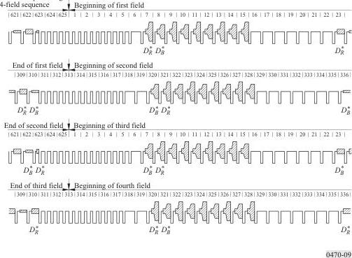

*Figure 9 - Sequence of $D_R^*$ or $D_B^*$ signal over four consecutive fields.*

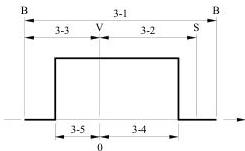

*Figure 10 - Significance of items 1 to 5 in Table 3 (3-1 to 3-5). B: channel limit; V: vision carrier; S: sound carrier.*

APPENDIX 1
TO ANNEX 1

Systems used in various countries/geographical areas

Explanation of signs used in the table:

*   : planned (whether the standard is indicated or not);
*   : updated in 1993, according to replies received from Administrations to Circular-letter 11/CL/3 dated 31 July 1992;
*   : updated in 1996, based on EBU Technical Information I-32-1996 “Changes of the Terrestrial Television Systems in the Central and East European countries”;
*   : not yet planned, or no information received;
*   : the abbreviation following the stroke indicates the colour transmission system in use (NTSC, PAL or SECAM).

(Figures in brackets refer to the Notes following the table.)

Television systems used in different countries/geographical areas

|  Country/Geographical area | System used in bands:  |   |   |
| --- | --- | --- | --- |
|   |   |  I/III
VHF broadcasting
(Band 8) | IV/V
UHF broadcasting
(Band 9)  |
|  Afghanistan (Islamic State of) |   | D/SECAM | –  |
|  Albania (Republic of)*** |   | B/PAL | G/PAL  |
|  Algeria (People’s Democratic Republic of) | (1) | B/PAL | G/PAL (1)  |
|  Germany (Federal Republic of) | (2) | B/PAL | G/PAL (2)  |
|  Angola (People’s Republic of) | (1) | I/PAL | I/PAL* (1)  |
|  Aruba** |   | M/NTSC | M/NTSC  |
|  Antigua and Barbuda |   |  |   |
|  Saudi Arabia (Kingdom of) |   | B/SECAM, PAL | G/SECAM  |
|  Argentine Republic |   | N/PAL | N/PAL  |
|  Armenia (Republic of) |   |  |   |
|  Australia | (3) | B/PAL | B/PAL (3)  |
|  Austria** | (2) | B/PAL | G/PAL (2)  |
|  Azerbaijani Republic |   |  |   |
|  Bahamas (Commonwealth of the) |   |  |   |
|  Bahrain (State of)** |   | B/PAL | G/PAL  |
|  Bangladesh (People’s Republic of) |   | B/PAL | –  |
|  Barbados |   |  |   |
|  Belarus (Republic of)*** |   | D/SECAM | K/SECAM  |
|  Belgium** | (4) | B/PAL | H/PAL (4)  |
|  Belize** |   | M/NTSC | –  |
|  Benin (Republic of) | (1) | K1/SECAM | K1/SECAM (1)  |
|  Bermuda |   | M/NTSC | –  |
|  Bhutan (Kingdom of) |   |  |   |
|  Bolivia (Republic of) |   | M/NTSC | M/NTSC  |
|  Bosnia and Herzegovina (Republic of) |   |  |   |
|  Botswana (Republic of) | (1) | I/PAL | I/PAL* (1)  |

|  Country/Geographical area | System used in bands:  |   |
| --- | --- | --- |
|   |  I/III
VHF broadcasting
(Band 8) | IV/V
UHF broadcasting
(Band 9)  |
|  Brazil (Federative Republic of) | M/PAL | M/PAL  |
|  Brunei Darussalam | B/PAL | –  |
|  Bulgaria (Republic of)*** | D/SECAM, D/PAL* | K/SECAM, KPAL  |
|  Burkina Faso
(1) | K1/SECAM | K1*SECAM
(1)  |
|  Burundi (Republic of)
(1) | K1/SECAM* | K1/SECAM*
(1)  |
|  Cambodia | B/PAL | G*/PAL  |
|  Cameroon (Republic of) | B/PAL | G*/PAL  |
|  Canada | M/NTSC | M/NTSC  |
|  Cape Verde (Republic of)
(1) | K1/SECAM* | K1/SECAM*
(1)  |
|  Central African Republic
(1) | K1/SECAM* | K1/SECAM*
(1)  |
|  Chile | M/NTSC | M/NTSC  |
|  China (People’s Republic of) | D/PAL | D/PAL  |
|  Cyprus (Republic of)** | B/PAL | G/PAL  |
|  Vatican City State |  |   |
|  Colombia (Republic of) | M/NTSC | M*  |
|  Comoros (Islamic Federal Republic of the)
(1) | K1/SECAM* | K1/SECAM*
(1)  |
|  Congo (Republic of the)
(1) | K1/SECAM* | K1/SECAM*
(1)  |
|  Korea (Republic of) | M/NTSC | M/NTSC  |
|  Costa Rica | M/NTSC | M/NTSC  |
|  Côte d’Ivoire (Republic of)
(1) | K1/SECAM | K1/SECAM*
(1)  |
|  Croatia (Republic of)** | B/PAL | G/PAL  |
|  Cuba | M/NTSC | M/NTSC  |
|  Denmark
(4) | B/PAL | G/PAL
(4)  |
|  Djibouti (Republic of)
(1) | B/SECAM | –
(1)  |
|  Dominican Republic |  |   |
|  Egypt (Arab Republic of)
(1) | B/PAL | G/PAL
(1)  |
|  El Salvador (Republic of) | M/NTSC |   |
|  United Arab Emirates | B/PAL | G/PAL  |
|  Ecuador | M/NTSC | M/NTSC  |
|  Eritrea |  |   |
|  Spain
(4) | B/PAL | G/PAL
(4)  |
|  Estonia (Republic of)*** | D/SECAM, B1/PAL | K/SECAM, G/PAL  |
|  United States of America** | M/NTSC | M/NTSC  |
|  Ethiopia
(1) | B,G/PAL | G/PAL*
(1)  |
|  Fiji (Republic of) |  |   |
|  Finland
(4) | B/PAL | G/PAL
(4)  |
|  France
(5),(6) | L/SECAM | L/SECAM
(5),(6)  |

|  Country/Geographical area |   | System used in bands:  |   |
| --- | --- | --- | --- |
|   |   | I/III
VHF broadcasting
(Band 8) | IV/V
UHF broadcasting
(Band 9)  |
|  Gabonese Republic | (1) | K1/SECAM | K1/SECAM*
(1)  |
|  Gambia (Republic of the) | (1) | I/PAL | I/PAL*
(1)  |
|  Georgia (Republic of) |  |  |   |
|  Ghana | (1) | B/PAL | B/PAL*
(1)  |
|  Gibraltar |  | B/PAL | G/PAL  |
|  Greece |  | B/SECAM | G/SECAM  |
|  Grenada |  |  |   |
|  Guatemala (Republic of) |  |  |   |
|  Guinea (Republic of) | (1) | K1/SECAM, PAL | K1/PAL*
(1)  |
|  Guinea-Bissau (Republic of) | (1) | I/PAL | I/PAL*
(1)  |
|  Equatorial Guinea (Republic of) | (1) | B/PAL | G/PAL*
(1)  |
|  Guyana |  |  |   |
|  Haiti (Republic of) |  |  |   |
|  Honduras (Republic of) |  |  |   |
|  Hong Kong |  | – | I/PAL  |
|  Hungary (Republic of)*** | (14) | D/PAL, B1/PAL | K/PAL, G/PAL*  |
|  India (Republic of) |  | B/PAL | –  |
|  Indonesia (Republic of) |  | B/PAL | –  |
|  Iran (Islamic Republic of) |  | B/SECAM | G/SECAM  |
|  Iraq (Republic of) | (1) | B,G/SECAM | G/SECAM*
(1)  |
|  Ireland | (7) | I/PAL | I/PAL
(7)  |
|  Iceland | (4) | B/PAL | G*
(4)  |
|  Israel (State of) |  | B/PAL | G/PAL
(8)  |
|  Italy | (2) | B/PAL | G/PAL
(2)  |
|  Jamaica |  | N | –  |
|  Japan |  | M/NTSC | M/NTSC  |
|  Jordan (Hashemite Kingdom of) |  | B | G*  |
|  Kazakhstan (Republic of) |  |  |   |
|  Kenya (Republic of) | (1) | B/PAL | B,G/PAL*
(1)  |
|  Kiribati (Republic of) |  |  |   |
|  Kuwait (State of) | (1) | B/PAL | G/PAL*
(1)  |
|  Lao People’s Democratic Republic |  |  |   |
|  Latvia (Republic of)*** | (14) | D/SECAM, D/PAL* | K/SECAM, K/PAL*  |
|  Lesotho (Kingdom of) | (1) | I*/PAL | I*/PAL
(1)  |
|  Lebanon |  |  |   |
|  Liberia (Republic of) | (1) | B/PAL | G/PAL*
(1)  |
|  Libya (Socialist People’s Libyan Arab Jamahiriya) | (1) | B,G/PAL | B,G/PAL*
(1)  |

|  Country/Geographical area | System used in bands:  |   |
| --- | --- | --- |
|   |  I/III
VHF broadcasting
(Band 8) | IV/V
UHF broadcasting
(Band 9)  |
|  Lithuania (Republic of)***
(14) | D/SECAM, B1/PAL* | K/SECAM, G/PAL*  |
|  Liechtenstein (Principality of)** | B/PAL | G/PAL  |
|  Luxembourg | B/PAL | G/PAL, L/SECAM  |
|  Macau** | – | I/PAL  |
|  Macedonia (Former Yugoslav Republic of) |  |   |
|  Madagascar (Democratic Republic of)
(1) | K1/SECAM | K/SECAM*
(1)  |
|  Malaysia | B/PAL | G/PAL  |
|  Malawi
(1) | I/PAL | I/PAL*
(1)  |
|  Maldives (Republic of) | B/PAL | –  |
|  Mali (Republic of)
(1) | B/SECAM | G/SECAM*
(1)  |
|  Malta | B/PAL | –  |
|  Morocco (Kingdom of)
(1) | B,G/SECAM | G/SECAM
(1)  |
|  Mauritius (Republic of)
(1) | B,G/SECAM | B,G/SECAM*
(1)  |
|  Mauritania (Islamic Republic of)
(1) | B/SECAM | B/SECAM*
(1)  |
|  Mexico | M/NTSC | M/NTSC  |
|  Micronesia (Federated States of) |  |   |
|  Moldova (Republic of)*** | D/SECAM | K/SECAM  |
|  Monaco (Principality of) | L/SECAM | G/PAL, G/SECAM  |
|  Mongolia | D/SECAM | –  |
|  Montserrat | M/NTSC | –  |
|  Mozambique (Republic of)
(1) | G/PAL* | G/PAL
(1)  |
|  Myanmar (Union of)** | M/NTSC | –  |
|  Namibia (Republic of)
(1) | I/PAL | I/PAL
(1)  |
|  Nauru (Republic of) |  |   |
|  Nepal |  |   |
|  Nicaragua |  |   |
|  Niger (Republic of the)
(1) | K1/SECAM | K1/SECAM
(1)  |
|  Nigeria (Federal Republic of)
(1) | B/PAL | I/PAL*
(1)  |
|  Norway
(4) | B/PAL | G/PAL
(4)  |
|  New Zealand
(4),(9) | B/PAL | G/PAL
(4),(9)  |
|  Oman (Sultanate of) | B/PAL | G/PAL  |
|  Uganda (Republic of)
(1) | B/PAL | –
(1)  |
|  Uzbekistan (Republic of) |  |   |
|  Pakistan (Islamic Republic of) | B/PAL | G/PAL  |
|  Panama (Republic of) | M/NTSC | M*/NTSC  |
|  Papua New Guinea | B/PAL | G/PAL  |
|  Paraguay (Republic of) |  |   |
|  Netherlands (Kingdom of the)
(2) | B/PAL | G/PAL
(2)  |

|  Country/Geographical area | System used in bands:  |   |
| --- | --- | --- |
|   | I/III
VHF broadcasting
(Band 8) | IV/V
UHF broadcasting
(Band 9)  |
|  Peru | M/NTSC | M/NTSC  |
|  Philippines (Republic of the) |  |   |
|  Poland (Republic of)
(4) | D1/PAL
(16) | D1/PAL  |
|  Portugal | B/PAL | G/PAL  |
|  Qatar (State of)** | B/PAL | G/PAL  |
|  Syrian Arab Republic | B/PAL | G/PAL  |
|  Democratic People’s Republic of Korea | D/PAL | K/PAL  |
|  Slovak Republic***
(14) | D/PAL, B1/PAL | K/PAL, G/PAL  |
|  Czech Republic*** | D/PAL | K/PAL  |
|  Romania*** | D/PAL | G/PAL  |
|  United Kingdom of Great Britain and Northern Ireland | –
(10) | I/PAL,
(4)
DVB-T 8 MHz/2k
(15)  |
|  Russian Federation *** | D/SECAM | K/SECAM  |
|  Rwandese Republic
(1) | B/PAL | K1/SECAM*
(1)  |
|  San Marino (Republic of) |  |   |
|  Saint Vincent and the Grenadines |  |   |
|  Solomon Islands |  |   |
|  Western Samoa (Independent State of) |  |   |
|  St. Christopher and Nevis | M/NTSC | –  |
|  Sao Tome and Principe (Democratic Republic of)
(1) | B/PAL | –
(1)  |
|  Senegal (Republic of)
(1) | K1/SECAM | K1/SECAM*
(1)  |
|  Seychelles | B/PAL | –
(1)  |
|  Sierra Leone | B/PAL | G/PAL*
(1)  |
|  Singapore (Republic of) | B/PAL | G*/PAL
(11)  |
|  Slovenia (Republic of)** | B/PAL | G/PAL  |
|  Somali Democratic Republic
(1) | B/PAL | G/PAL*
(1)  |
|  Sudan (Republic of the)
(1) | B/PAL | G/PAL*
(1)  |
|  Sri Lanka (Democratic Socialist Republic of) | B/PAL | G/PAL  |
|  South Africa (Republic of) | I/PAL | I/PAL  |
|  Sweden
(4) | B/PAL | G/PAL,
(4)
DVB-T 8 MHz/8k
(15)  |
|  Switzerland (Confederation of)** | B/PAL | G/PAL
(12)  |
|  Suriname (Republic of) | M/NTSC | –  |
|  Swaziland (Kingdom of) |  |   |
|  Tanzania (United Republic of)
(1) | I/PAL | I/PAL
(1)  |
|  Chad (Republic of)
(1) | K1/SECAM* | K1/SECAM*
(1)  |
|  Thailand | B/PAL | G/PAL*  |
|  Togolese Republic
(1) | K1/SECAM | K1/SECAM*
(1)  |

|  Country/Geographical area | System used in bands:  |   |
| --- | --- | --- |
|   |  I/III
VHF broadcasting
(Band 8) | IV/V
UHF broadcasting
(Band 9)  |
|  Tonga (Kingdom of) |  |   |
|  Trinidad and Tobago |  |   |
|  Tunisia | (13)
B/SECAM, PAL | G/SECAM, PAL
(13)  |
|  Turkmenistan |  |   |
|  Turkey** | B/PAL | G/PAL  |
|  Ukraine*** | D/SECAM | K/SECAM  |
|  Uruguay (Eastern Republic of) | N/PAL | –  |
|  Vanuatu (Republic of)** | B/PAL | –  |
|  Venezuela (Republic of) | M/NTSC | M/NTSC  |
|  British Virgin Islands | M/NTSC | –  |
|  Viet Nam (Socialist Republic of) | D/SECAM | K/SECAM  |
|  Yemen (Republic of) | (1)
B/PAL | G/PAL*
(1)  |
|  Yugoslavia (Federal Republic of) | B/PAL | G/PAL  |
|  Zaire (Republic of) | (1)
K1/SECAM | K1/SECAM*
(1)  |
|  Zambia (Republic of)** | (1)
G/PAL* | G/PAL*
(1)  |
|  Zimbabwe (Republic of) | (1)
G/PAL* | G/PAL*
(1)  |

(1) This information has been taken from the preliminary requirements file as submitted by the Administrations concerned to the ITU in preparation of the Second Session of the Regional Administrative Conference for the planning of VHF/UHF television broadcasting in the African Broadcasting Area and Neighbouring Countries (AFBC(2)). In a number of cases transmitters using different systems from those indicated in the requirements file may continue to operate for a transitional period.

(2) The Federal Republic of Germany, Austria, Italy and the Netherlands use an additional FM carrier for stereophonic or two-channel sound transmission.

(3) Australia uses nominal modulation levels as specified for System I. For stereophonic sound transmission, an additional FM carrier is used similar to the system used in the Federal Republic of Germany.

(4) Denmark, Spain, Finland, Iceland, Norway, New Zealand, Poland, the United Kingdom and Sweden have approved the use of an additional digital carrier for stereophonic or multi-channel sound transmission.

(5) In the French Overseas departments and territories, the system K1 is used instead of L/SECAM which is used in the metropolitan area.

(6) In France, the use the NICAM system for stereophonic or multi-channel sound transmission is being investigated for K1/SECAM.

(7) System I will be used at all stations though with a vision-to-sound ratio of up to 10/1. In addition Ireland reserves the right to the possible use of an additional sound carrier in the band between 5.5 MHz and 6.75 MHz in relation to the vision carrier.

(8) No final decision has been taken about the width of the residual sideband, but for planning purposes this country is willing to accept the assumption of a residual sideband 1.25 MHz wide.

(9) In New Zealand the modulation levels are identical to those of System I.

(10) The United Kingdom has ceased to use Bands I and III for television broadcasting.

(11) Singapore reserves the right to use additional frequency-modulated sound channels in the band between 5.5 and 6.5 MHz in relation to the picture carrier, for additional sound channels for sound broadcasting.

(12) The Swiss Administration is planning to use additional frequency-modulated sound carriers, in the frequency interval between the spacings of 5.5 and 6.5 MHz in relation to the picture carrier, at levels lower than or equal to the normal level of the sound carrier, for additional sound-tracks or for sound broadcasting.
(13) In Tunisia SECAM is used for broadcasting the national programmes; PAL is used for rebroadcasting other programmes.
(14) It is a case of a gradual transition from the D, K/SECAM system to the B1, G/PAL system. Characteristics are identical to system G. VHF channel numbers remain R1 to R12.
(15) 1998 characteristics of digital systems are expected to be drawn up.
(16) Poland uses only Band III for television broadcasting in VHF.

### ANNEX 2

### Colorimetric standards in colour television

1. In 1953, when the NTSC colour television system was adopted for transmission in the United States of America, the colorimetry of the system was based on three specific primary colours and a reference white. The coordinates of the primaries were (the coordinates are given in the CIE system (1931)):

	Red:  $x = 0.67$  $y = 0.33$

	Green:  $x = 0.21$  $y = 0.71$

	Blue:  $x = 0.14$  $y = 0.08$

	The reference white chosen was standard:

	White C:  $x = 0.310$  $y = 0.316$

2. When the PAL and SECAM systems were first designed, they were based upon the colorimetric standards of NTSC. As a result, the coefficients used for determining the signals involved in coding PAL and SECAM (the luminance signal and the colour-difference signals) were directly based upon the chromaticities given in § 1.

3. However, it has been recognized that there have been continuing changes in the chromaticities of the phosphors used in making colour picture tubes over the years, and that those actually used do not have the same primary chromaticities as those which served to establish the coding of systems. Nevertheless, in all systems the coefficients used for determining the signals involved in coding (the luminance signal and the colour-difference signals) are directly based upon the chromaticities and white point given in § 1.

4. Several solutions have been proposed or implemented, in different countries, for compensating or correcting the effect upon colour reproduction of this difference between the receiver characteristics and the standards given in § 1.

5. The United States of America continues to base the colorimetry of its transmissions upon NTSC primaries whose chromaticities and white point are defined in § 1. Studio monitors are adjusted to a reference white of $D_{65}$. However, because picture tubes do not yet contain phosphors whose chromaticities are the same (or very nearly the same) as those defined in § 1, approximate corrections, involving operations upon the electrical signals, are made in receivers in order to achieve satisfactory colour reproduction. Further, to achieve greater consistency in colour transmissions, the United States of America recommends that the picture monitors used in studios should also contain correction circuits which cause the colour reproduction to approximate to that which would have been obtained if the picture tubes used in the monitors had contained phosphors with the primary chromaticities shown in § 1.

6. In Japan, the colorimetry of the system is based upon the primary chromaticities and white point given in § 1. Studio monitors are adjusted to a white point of $D$, $9300\,\mathrm{K}$.

7. In the 625-line PAL and SECAM systems, the colorimetry is now based upon the three specific primary colours (see Note 1):

	Red: $x = 0.64$ $y = 0.33$

	Green: $x = 0.29$ $y = 0.60$

	Blue: $x = 0.15$ $y = 0.06$

	and reference white $D_{65}$.

	These chromaticities are closely representative of the phosphors incorporated in the picture tubes of many of the receivers and studio monitors used in those countries that have adopted the 625-line PAL and SECAM systems. Thus, in such receivers and monitors, no electrical corrections are required in order to achieve good colour reproduction. Further, in order to improve the consistency of colour reproduction, when the television receiver is switched from one programme to another, it has been suggested that the chromaticities of the phosphors used in studio monitors should be standardized. The assessment is based upon a method of tolerance which takes account of both the primary chromaticities of the tube phosphors and the effect of their combined chromaticities upon the reproduction of a typical skin tone.

	NOTE 1 – These coordinates are given in the CIE system (1931). For 625-line SECAM systems, it is provisionally permitted (for existing equipment), to use the chromaticity coordinates and reference white given in § 1.

