# Studio Encoding Parameters of Digital Television for Standard 4:3 and Wide-Screen 16:9 Aspect Ratios

(Question ITU-R 206/11)

(1982-1986-1990-1992-1994-1995)

The ITU Radiocommunication Assembly,

## Considering

a) that there are clear advantages for television broadcasters and programme producers in digital studio standards which have the greatest number of significant parameter values common to 525-line and 625-line systems;
b) that a worldwide compatible digital approach will permit the development of equipment with many common features, permit operating economies and facilitate the international exchange of programmes;
c) that an extensible family of compatible digital coding standards is desirable. Members of such a family could correspond to different quality levels, different aspect ratios, facilitate additional processing required by present production techniques, and cater for future needs;
d) that a system based on the coding of components is able to meet these desirable objectives;
e) that the co-siting of samples representing luminance and colour-difference signals (or, if used, the red, green and blue signals) facilitates the processing of digital component signals, required by present production techniques,

## Recommends

that the following be used as a basis for digital coding standards for television studios in countries using the 525-line system as well as in those using the 625-line system:

## 1 Introduction

This Recommendation specifies methods for digitally coding video signals. It includes a 13.5 MHz sampling rate for both 4:3 and 16:9 aspect ratios with performance adequate for present transmission systems. An alternative 18 MHz sampling rate for those 16:9 systems which require proportionately higher horizontal resolution is also specified.

Specifications applicable to any member of this family of standards are presented first. Then follows in Part A the specific characteristics for 13.5 MHz sampling and in Part B the specific characteristics for 18 MHz sampling.

## 2 Extensible family of compatible digital coding standards

2.1 The digital coding should allow the establishment and evolution of an extensible family of compatible digital coding standards. It should be possible to interface simply between any two members of the family.

2.2 The digital coding should be based on the use of one luminance and two colour-difference signals (or, if used, the red, green and blue signals).

2.3 The spectral characteristics of the signals must be controlled to avoid aliasing whilst preserving the passband response. Filter specifications are shown in Appendix 2 to Part A and Appendix 2 to Part B.

## 3 Specifications applicable to any member of the family

3.1 Sampling structures should be spatially static. This is the case, for example, for the orthogonal sampling structures specified in Part A and Part B.

3.2 If the samples represent luminance and two simultaneous colour-difference signals, each pair of colour-difference samples should be spatially co-sited. If samples representing red, green and blue signals are used they should be co-sited.

3.3 The digital standard adopted for each member of the family should permit worldwide acceptance and application in operation; one condition to achieve this goal is that, for each member of the family, the number of samples per line specified for 525-line and 625-line systems shall be compatible (preferably the same number of samples per line).

3.4 In applications of these specifications, the contents of digital words are expressed in both decimal and hexadecimal forms, denoted by the suffixes "d" and "h" respectively.

To avoid confusion between 8-bit and 10-bit representations, the eight most-significant bits are considered to be an integer part while the two additional bits, if present, are considered to be fractional parts.

For example, the bit pattern 10010001 would be expressed as $145\mathrm{d}$ or $91\mathrm{h}$, whereas the pattern 1001000101 would be expressed as $145.25\mathrm{d}$ or $91.4\mathrm{h}$.

Where no fractional part is shown, it should be assumed to have the binary value 00.

## 3.5 Definition of the digital signals $Y, C_R, C_B$, from the primary (analogue) signals $E_R', E_G'$ and $E_B'$

This section describes, with a view to defining the signals $Y$, $C_R$, $C_B$, the rules for construction of these signals from the primary analogue signals $E_R'$, $E_G'$ and $E_B'$. The signals are constructed by following the three stages described in § 3.5.1, 3.5.2 and 3.5.3. The method is given as an example, and in practice other methods of construction from these primary signals or other analogue or digital signals may produce identical results. An example is given in § 3.5.4.

## 3.5.1 Construction of luminance $(E_Y')$ and colour-difference $(E_R' - E_Y')$ and $(E_B' - E_Y')$ signals

The construction of luminance and colour-difference signals is as follows:

$$
E _ {Y} ^ {\prime} = 0. 2 9 9 E _ {R} ^ {\prime} + 0. 5 8 7 E _ {G} ^ {\prime} + 0. 1 1 4 E _ {B} ^ {\prime}
$$

whence:

$$
\begin{array}{l} \left(E _ {R} ^ {\prime} - E _ {Y} ^ {\prime}\right) = E _ {R} ^ {\prime} - 0. 2 9 9 E _ {R} ^ {\prime} - 0. 5 8 7 E _ {G} ^ {\prime} - 0. 1 1 4 E _ {B} ^ {\prime} \\ = 0. 7 0 1 E _ {R} ^ {\prime} - 0. 5 8 7 E _ {G} ^ {\prime} - 0. 1 1 4 E _ {B} ^ {\prime} \\ \end{array}
$$

and:

$$
\begin{array}{l} \left(E _ {B} ^ {\prime} - E _ {Y} ^ {\prime}\right) = E _ {B} ^ {\prime} - 0. 2 9 9 E _ {R} ^ {\prime} - 0. 5 8 7 E _ {G} ^ {\prime} - 0. 1 1 4 E _ {B} ^ {\prime} \\ = - 0. 2 9 9 E _ {R} ^ {\prime} - 0. 5 8 7 E _ {G} ^ {\prime} + 0. 8 8 6 E _ {B} ^ {\prime} \\ \end{array}
$$

Taking the signal values as normalized to unity (e.g. $1.0\mathrm{V}$ maximum levels), the values obtained for white, black and the saturated primary and complementary colours are shown in Table 1.

TABLE 1
Normalized signal values

|  Condition | $E_R^*$ | $E_G^*$ | $E_B^*$ | $E_Y^*$ | $E_R^* - E_Y^*$ | $E_B^* - E_Y^*$  |
| --- | --- | --- | --- | --- | --- | --- |
|  White | 1.0 | 1.0 | 1.0 | 1.0 | 0 | 0  |
|  Black | 0 | 0 | 0 | 0 | 0 | 0  |
|  Red | 1.0 | 0 | 0 | 0.299 | 0.701 | -0.299  |
|  Green | 0 | 1.0 | 0 | 0.587 | -0.587 | -0.587  |
|  Blue | 0 | 0 | 1.0 | 0.114 | -0.114 | 0.886  |
|  Yellow | 1.0 | 1.0 | 0 | 0.886 | 0.114 | -0.886  |
|  Cyan | 0 | 1.0 | 1.0 | 0.701 | -0.701 | 0.299  |
|  Magenta | 1.0 | 0 | 1.0 | 0.413 | 0.587 | 0.587  |

### 3.5.2 Construction of re-normalized colour-difference signals ($E_{C_R}'$ and $E_{C_B}'$)

Whilst the values for $E_Y^*$ have a range of 1.0 to 0, those for $(E_R^* - E_Y^*)$ have a range of +0.701 to -0.701 and for $(E_B^* - E_Y^*)$ a range of +0.886 to -0.886. To restore the signal excursion of the colour-difference signals to unity (i.e. +0.5 to -0.5), coefficients can be calculated as follows:

$$
K_R = \frac{0.5}{0.701} = 0.713; \quad K_B = \frac{0.5}{0.886} = 0.564
$$

Then:

$$
E_{C_R}^* = 0.713 (E_R^* - E_Y^*) = 0.500 E_R^* - 0.419 E_G^* - 0.081 E_B^*
$$

and:

$$
E_{C_B}^* = 0.564 (E_B^* - E_Y^*) = -0.169 E_R^* - 0.331 E_G^* + 0.500 E_B^*
$$

where $E_{C_R}^*$ and $E_{C_B}^*$ are the re-normalized red and blue colour-difference signals respectively (see Notes 1 and 2).

NOTE 1 – The symbols $E_{C_R}^*$ and $E_{C_B}^*$ will be used only to designate re-normalized colour-difference signals, i.e. having the same nominal peak-to-peak amplitude as the luminance signal $E_Y^*$ thus selected as the reference amplitude.

NOTE 2 – In the circumstances when the component signals are not normalized to a range of 1 to 0, for example, when converting from analogue component signals with unequal luminance and colour-difference amplitudes, an additional gain factor will be necessary and the gain factors $K_R$, $K_B$ should be modified accordingly.

### 3.5.3 Quantization

In the case of a uniformly-quantized 8-bit binary encoding, $2^8$, i.e. 256, equally spaced quantization levels are specified, so that the range of the binary numbers available is from 0000 0000 to 1111 1111 (00 to FF in hexadecimal notation), the equivalent decimal numbers being 0 to 255, inclusive.

In the case of the 4:2:2 systems described in this Recommendation, levels 0 and 255 are reserved for synchronization data, while levels 1 to 254 are available for video.

Given that the luminance signal is to occupy only 220 levels, to provide working margins, and that black is to be at level 16, the decimal value of the luminance signal, $\overline{Y}$, prior to quantization, is:

$$
\overline{Y} = 219 (E_Y^*) + 16
$$

and the corresponding level number after quantization is the nearest integer value.

Similarly, given that the colour-difference signals are to occupy 225 levels and that the zero level is to be level 128, the decimal values of the colour-difference signals, $\overline{C}_R$ and $\overline{C}_B$, prior to quantization are:

$$
\overline{C}_R = 224 \left[ 0.713 (E_R' - E_Y') \right] + 128
$$

and:

$$
\overline{C}_B = 224 \left[ 0.564 (E_B' - E_Y') \right] + 128
$$

which simplify to the following:

$$
\overline{C}_R = 160 (E_R' - E_Y') + 128
$$

and:

$$
\overline{C}_B = 126 (E_B' - E_Y') + 128
$$

and the corresponding level number, after quantization, is the nearest integer value.

The digital equivalents are termed $Y$, $C_R$ and $C_B$.

### 3.5.4 Construction of $Y, C_R, C_B$ via quantization of $E_R', E_G', E_B'$

In the case where the components are derived directly from the gamma pre-corrected component signals $E_R'$, $E_G'$, $E_B'$, or directly generated in digital form, then the quantization and encoding shall be equivalent to:

$$
E_{R_D}' (\text{in digital form}) = \operatorname{int} (219 E_R') + 16
$$

$$
E_{G_D}' (\text{in digital form}) = \operatorname{int} (219 E_G') + 16
$$

$$
E_{B_D}' (\text{in digital form}) = \operatorname{int} (219 E_B') + 16
$$

Then:

$$
Y = \frac{77}{256} E_{R_D}' + \frac{150}{256} E_{G_D}' + \frac{29}{256} E_{B_D}'
$$

$$
C_R = \frac{131}{256} E_{R_D}' - \frac{110}{256} E_{G_D}' - \frac{21}{256} E_{B_D}' + 128
$$

$$
C_B = - \frac{44}{256} E_{R_D}' - \frac{87}{256} E_{G_D}' + \frac{131}{256} E_{B_D}' + 128
$$

taking the nearest integer coefficients, base 256. To obtain the 4:2:2 components $Y$, $C_R$, $C_B$, low-pass filtering and subsampling must be performed on the 4:4:4 $C_R$, $C_B$ signals described above. Note should be taken that slight differences could exist between $C_R$, $C_B$ components derived in this way and those derived by analogue filtering prior to sampling.

### 3.5.5 Limiting of $Y, C_R, C_B$ signals

Digital coding in the form of $Y$, $C_R$, $C_B$ signals can represent a substantially greater gamut of signal values than can be supported by the corresponding ranges of $R$, $G$, $B$ signals. Because of this it is possible, as a result of electronic picture generation or signal processing, to produce $Y$, $C_R$, $C_B$ signals which, although valid individually, would result in out-of-range values when converted to $R$, $G$, $B$. It is both more convenient and more effective to prevent this by applying limiting to the $Y$, $C_R$, $C_B$ signals than to wait until the signals are in $R$, $G$, $B$ form. Also, limiting can be applied in a way that maintains the luminance and hue values, minimizing the subjective impairment by sacrificing only saturation.

## 4 13 MHz family members

The following family members are defined in Part A:

- 4:2:2, 13.5 MHz for 4:3 aspect ratio, and for wide-screen 16:9 aspect ratio systems when it is necessary to keep the same analogue signal bandwidth and digital rates for both aspect ratios.
- 4:4:4, 13.5 MHz 4:3 and 16:9 aspect ratio systems with higher colour resolution.

## 5 18 MHz family members

The following family members are defined in Part B:

- 4:2:2, 18 MHz, for 16:9 aspect ratio systems with higher horizontal resolution compared with systems sampled at 13.5 MHz.
- 4:4:4, 18 MHz for 16:9 aspect ratio systems with higher colour resolution.

NOTE 1 – In the 4:4:4 members of the family the sampled signals may be luminance and colour difference signals (or, if used, red, green and blue signals).

## ANNEX 1

### Some guidance on the practical implementation of the filters specified in Appendix 2 to Part A and Appendix 2 to Part B

In the proposals for the filters used in the encoding and decoding processes, it has been assumed that, in the post-filters which follow digital-to-analogue conversion, correction for the (sin $x / x$) characteristic is provided. The passband tolerances of the filter plus (sin $x / x$) corrector plus the theoretical (sin $x / x$) characteristic should be the same as given for the filters alone. This is most easily achieved if, in the design process, the filter, (sin $x / x$) corrector and delay equalizer are treated as a single unit.

The total delays due to filtering and encoding the luminance and colour-difference components should be the same. The delay in the colour-difference filter (Figs. 4a) and 4b)) is double that of the luminance filter (Figs. 3a) and 3b)). As it is difficult to equalize these delays using analogue delay networks without exceeding the passband tolerances, it is recommended that the bulk of the delay differences (in integral multiples of the sampling period) should be equalized in the digital domain. In correcting for any remainder, it should be noted that the sample-and-hold circuit in the decoder introduces a flat delay of one half a sampling period.

The passband tolerances for amplitude ripple and group delay are recognized to be very tight. Present studies indicate that it is necessary so that a significant number of coding and decoding operations in cascade may be carried out without sacrifice of the potentially high quality of the 4:2:2 coding standard. Due to limitations in the performance of currently available measuring equipment, manufacturers may have difficulty in economically verifying compliance with the tolerances of individual filters on a production basis. Nevertheless, it is possible to design filters so that the specified characteristics are met in practice, and manufacturers are required to make every effort in the production environment to align each filter to meet the given templates.

The specifications given in Appendix 2 to Part A and Appendix 2 to Part B were devised to preserve as far as possible the spectral content of the $Y$, $C_R$, $C_B$ signals throughout the component signal chain. It is recognized, however, that the colour-difference spectral characteristic must be shaped by a slow roll-off filter inserted at picture monitors, or at the end of the component signal chain.

## PART A

## TO ANNEX 1

## The 13.5 MHz members of the family

## 1 Encoding parameter values for the 4:2:2, 13.5 MHz member of the family

The specification (see Table 2) applies to the 4:2:2 member of the family, to be used for the standard digital interface between main digital studio equipment and for international programme exchange of 4:3 aspect ratio digital television or wide-screen 16:9 aspect ratio digital television when it is necessary to keep the same analogue signal bandwidth and digital rates.

TABLE 2

|  Parameters | 525-line, 60 field/s systems | 625-line, 50 field/s systems  |
| --- | --- | --- |
|  1. Coded signals: Y, CR, CB | These signals are obtained from gamma pre-corrected signals, namely: EY, ER - EY, EB - EY (see § 3.5)  |   |
|  2. Number of samples per total line: - luminance signal (Y) - each colour-difference signal (CR, CB) | 858 429 | 864 432  |
|  3. Sampling structure | Orthogonal, line, field and frame repetitive. CR and CB samples co-sited with odd (1st, 3rd, 5th, etc.) Y samples in each line  |   |
|  4. Sampling frequency: - luminance signal - each colour-difference signal | 13.5 MHz 6.75 MHz The tolerance for the sampling frequencies should coincide with the tolerance for the line frequency of the relevant colour television standard  |   |
|  5. Form of coding | Uniformly quantized PCM, 8 (optionally 10) bits per sample, for the luminance signal and each colour-difference signal  |   |
|  6. Number of samples per digital active line: - luminance signal - each colour-difference signal | 720 360  |   |
|  7. Analogue-to-digital horizontal timing relationship: - from end of digital active line to OH | 16 luminance clock periods | 12 luminance clock periods  |
|  8. Correspondence between video signal levels and quantization levels: - scale - luminance signal - each colour-difference signal | (See § 3.4) (Values are decimal) 0 to 255 220 quantization levels with the black level corresponding to level 16 and the peak white level corresponding to level 235. The signal level may occasionally excurse beyond level 235 225 quantization levels in the centre part of the quantization scale with zero signal corresponding to level 128  |   |
|  9. Code-word usage | Code words corresponding to quantization levels 0 and 255 are used exclusively for synchronization. Levels 1 to 254 are available for video  |   |

## 2 Encoding parameter values for the 4:4:4, 13.5 MHz member of the family

The specifications given in Table 3 apply to the 4:4:4 member of the family suitable for television source equipment and high-quality video signal processing applications.

TABLE 3

|  Parameters | 525-line, 60 field/s systems | 625-line, 50 field/s systems  |
| --- | --- | --- |
|  1. Coded signals: Y, CR, CB or R, G, B | These signals are obtained from gamma pre-corrected signals, namely: ET, ER-ET, EB-ET or ER, EG, EB  |   |
|  2. Number of samples per total line for each signal | 858 | 864  |
|  3. Sampling structure | Orthogonal, line, field and frame repetitive. The three sampling structures to be coincident and coincident also with the luminance sampling structure of the 4:2:2 member  |   |
|  4. Sampling frequency for each signal | 13.5 MHz  |   |
|  5. Form of coding | Uniformly quantized PCM, 8 (optionally 10) bits per sample  |   |
|  6. Duration of the digital active line expressed in number of samples | 720  |   |
|  7. Correspondence between video signal levels and the 8 most significant bits (MSB) of the quantization level for each sample: - scale - R, G, B or luminance signal(1) - each colour-difference signal(1) | (See § 3.4) (Values are decimal)0 to 255220 quantization levels with the black level corresponding to level 16 and the peak white level corresponding to level 235. The signal level may occasionally excurse beyond level 235225 quantization levels in the centre part of the quantization scale with zero signal corresponding to level 128  |   |

(1) If used.

APPENDIX 1

TO PART A

## Definition of signals used in the digital coding standards

## 1 Relationship of digital active line to analogue sync reference

The relationship between the digital active line luminance samples and the analogue synchronizing reference is shown in:

- Fig. 1 for 625-line  $13.5\mathrm{MHz}$  (see Table 2);
- Fig. 2 for 525-line  $13.5\mathrm{MHz}$  (see Table 3).

In the figures, the sampling point occurs at the commencement of each block.

The respective numbers of colour-difference samples can be obtained by dividing the number of luminance samples by two. The (12,132), and (16,122) were chosen symmetrically to dispose the digital active line about the permitted variations. They do not form part of the digital line specification and relate only to the analogue interface.

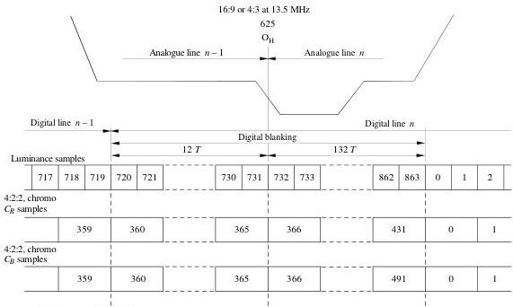

*Figure 1 - 16:9 or 4:3 at $13.5\mathrm{MHz}$.*

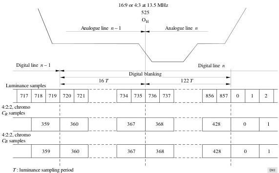

*Figure 2.*

## APPENDIX 2

### TO PART A

#### Filtering characteristics

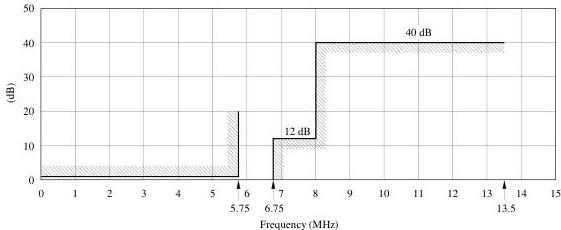

*Figure 3 - Specification for a luminance or RGB signal filter used when sampling at 13.5 MHz.*

a) Template for insertion loss/frequency characteristic

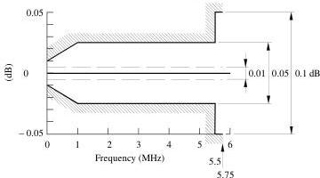

b) Passband ripple tolerance

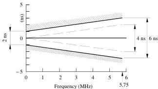

c) Passband group-delay tolerance

Note 1 – The lowest indicated values in b) and c) are for 1 kHz (instead of 0 MHz).

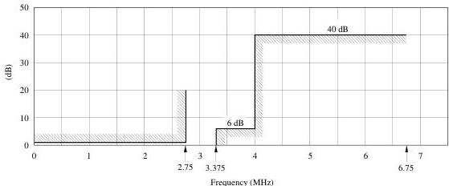

*Figure 4 - Specification for a colour-difference signal filter used when sampling at $6.75\mathrm{MHz}$.*

a) Template for insertion loss/frequency characteristic

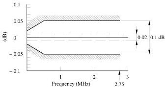
b) Passband ripple tolerance

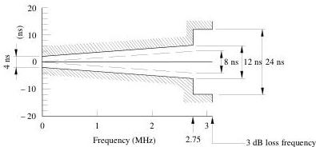
c) Passband group-delay tolerance

Note 1 - The lowest indicated values in b) and c) are for
1\mathrm{kHz}
 (instead of
0\mathrm{MHz}
 ).

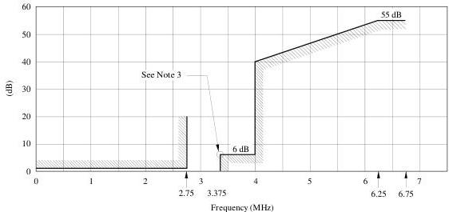

*Figure 5 - Specification for a digital filter for sampling-rate conversion from 4:4:4 to 4:2:2 colour-difference signals.*

a) Template for insertion loss/frequency characteristic

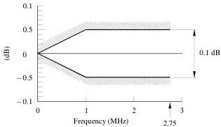
b) Passband ripple tolerance

Notes to Figs. 3, 4 and 5:

Note 1 – Ripple and group delay are specified relative to their values at 1 kHz. The full lines are practical limits and the dashed lines give suggested limits for the theoretical design.

Note 2 – In the digital filter, the practical and design limits are the same. The delay distortion is zero, by design.

Note 3 – In the digital filter (Fig. 5), the amplitude/frequency characteristic (on linear scales) should be skew-symmetrical about the half-amplitude point, which is indicated on the figure.

Note 4 – In the proposals for the filters used in the encoding and decoding processes, it has been assumed that, in the post-filters which follow digital-to-analogue conversion, correction for the (sin x/x) characteristic of the sample-and-hold circuits is provided.

## PART B

## TO ANNEX 1

## The 18 MHz members of the family

## 1 Encoding parameter values for the 4:2:2, 18 MHz member of the family

The specification (see Table 4) applies to the 4:2:2 member of the family used for the standard digital interface between main digital studio equipment and for international programme exchange of 16:9 aspect ratio television with higher horizontal resolution compared with 16:9 systems sampled at  $13.5\mathrm{MHz}$ .

TABLE 4

|  Parameters | 525-line, 60 field/s systems | 625-line, 50 field/s systems  |
| --- | --- | --- |
|  1. Coded signals: Y, CR, CB | These signals are obtained from gamma pre-corrected signals, namely: ET, ER - ET, ER - ET (see Annex § 3.5)  |   |
|  2. Number of samples per total line: - luminance signal (Y) - each colour-difference signal (CR, CB) | 1144 572 | 1152 576  |
|  3. Sampling structure | Orthogonal, line, field and frame repetitive. CR and CB samples co-sited with odd (1st, 3rd, 5th, etc.) Y samples in each line  |   |
|  4. Sampling frequency: - luminance signal - each colour-difference signal | 18 MHz 9 MHz The tolerance for the sampling frequencies should coincide with the tolerance for the line frequency of the relevant colour television standard  |   |
|  5. Form of coding | Uniformly quantized PCM, 8 (optionally 10) bits per sample, for the luminance signal and each colour-difference signal  |   |
|  6. Number of samples per digital active line: - luminance signal - each colour-difference signal | 960 480  |   |
|  7. Analogue-to-digital horizontal timing relationship: - from end of digital active line to OH | To be determined (see Appendix 1 to Part B)  |   |
|  8. Correspondence between video signal levels and quantization levels: - scale - luminance signal - each colour-difference signal | (See § 3.4) (Values are decimal) 0 to 255 220 quantization levels with the black level corresponding to level 16 and the peak white level corresponding to level 235. The signal level may occasionally excurse beyond level 235 225 quantization levels in the centre part of the quantization scale with zero signal corresponding to level 128  |   |
|  9. Code-word usage | Code words corresponding to quantization levels 0 and 255 are used exclusively for synchronization. Levels 1 to 254 are available for video  |   |

## 2 Encoding parameter values for the 4:4:4, 18 MHz member of the family

The specifications given in Table 5 apply to the 4:4:4 member of the family suitable for television source equipment and high-quality video signal processing applications.

TABLE 5

|  Parameters | 525-line, 60 field/s systems | 625-line, 50 field/s systems  |
| --- | --- | --- |
|  1. Coded signals: Y, $C_R$, $C_R$ or R, G, B | These signals are obtained from gamma pre-corrected signals, namely: $E_Y^*, E_R^* - E_Y^*, E_R^* - E_Y^*$ or $E_R^*, E_G^*, E_B^*$  |   |
|  2. Number of samples per total line for each signal | 1144 | 1152  |
|  3. Sampling structure | Orthogonal, line, field and frame repetitive. The three sampling structures to be coincident and coincident also with the luminance sampling structure of the 4:2:2 member  |   |
|  4. Sampling frequency for each signal | 18 MHz  |   |
|  5. Form of coding | Uniformly quantized PCM, 8 (optionally 10) bits per sample  |   |
|  6. Duration of the digital active line expressed in number of samples | 960  |   |
|  7. Correspondence between video signal levels and the 8 most significant bits (MSB) of the quantization level for each sample: - scale | (See § 3.4) (Values are decimal)  |   |
|  - R, G, B or luminance signal(1) | 0 to 255  |   |
|   |  220 quantization levels with the black level corresponding to level 16 and the peak white level corresponding to level 235. The signal level may occasionally excurse beyond level 235  |   |
|  - each colour-difference signal(1) | 225 quantization levels in the centre part of the quantization scale with zero signal corresponding to level 128  |   |

(1) If used.

APPENDIX 1

TO PART B

## Definition of signals used in the digital coding standards

## 1 Relationship of digital active line to analogue sync reference

Further study is required to specify absolute values for these parameters, while ensuring consistent picture positioning and geometry across different standards. For practical application, the correct relationship is achieved when the picture to sync relationship in the analogue domain is identical for images converted from 13.5 and 18 MHz sampled digital representations.

## APPENDIX 2

## TO PART B

## Filtering characteristics

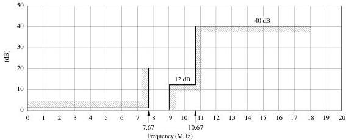

*Figure 6 - Specification for a luminance or RGB signal filter used when sampling at 18 MHz.*

a) Template for insertion loss/frequency characteristic

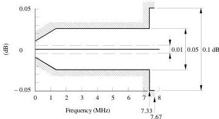
b) Passband ripple tolerance

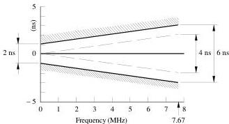
c) Passband group-delay tolerance

Note 1 - The lowest indicated values in b) and c) are for
1\mathrm{kHz}
 (instead of
0\mathrm{MHz}
 .

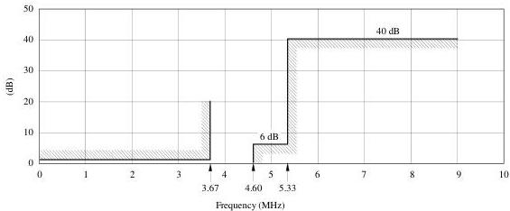

*Figure 7 - Specification for a colour-difference signal filter used when sampling at 9 MHz.*

a) Template for insertion loss/frequency characteristic

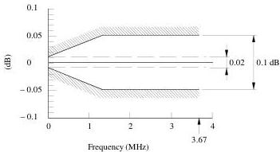
b) Passband ripple tolerance

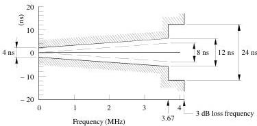
c) Passband group-delay tolerance

Note 1 – The lowest indicated values in b) and c) are for 1 kHz (instead of 0 MHz).

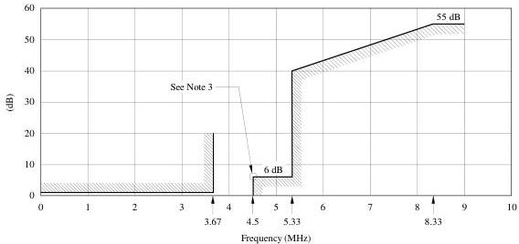

*Figure 8 - Specification for a digital filter for sampling-rate conversion from 4:4:4 to 4:2:2 colour-difference signals.*

a) Template for insertion loss/frequency characteristic

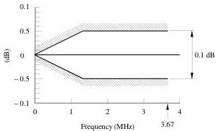
b) Passband ripple tolerance

Notes to Figs. 6, 7 and 8:

Note 1 - Ripple and group delay are specified relative to their values at  $1\mathrm{kHz}$ . The full lines are practical limits and the dashed lines give suggested limits for the theoretical design.

Note 2 - In the digital filter, the practical and design limits are the same. The delay distortion is zero, by design.

Note 3 - In the digital filter (Fig. 8), the amplitude/frequency characteristic (on linear scales) should be skew-symmetrical about the half-amplitude point, which is indicated on the figure.

Note 4 - In the proposals for the filters used in the encoding and decoding processes, it has been assumed that, in the post-filters which follow digital-to-analogue conversion, correction for the (sin  $x / x$ ) characteristic of the sample-and-hold circuits is provided.

