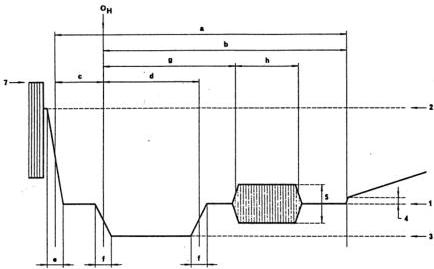
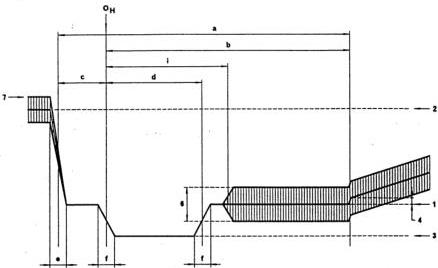

SECTION 11A: CHARACTERISTICS OF SYSTEMS FOR MONOCHROME AND COLOUR TELEVISION

REPORT 624-4

# CHARACTERISTICS OF TELEVISION SYSTEMS

(Question 1/11)

(1974-1978-1982-1986-1990)

The following Tables, given for information purposes, contain details of a number of different television systems in use at the time of the XVIIth Plenary Assembly of the CCIR, Düsseldorf, 1990.

A list of countries and geographical areas, and the television systems used, are given in Annex I.

Specifications of the SECAM IV colour television system, which is still under consideration, are given in Annex II.

Information on the results of the comparative laboratory tests carried out on the various colour television systems in the period 1963-1966 by broadcasting authorities, administrations and industrial organizations, together with the main parameters of systems may be found in Reports 406 and 407, XIIth Plenary Assembly, New Delhi, 1970.

All television systems listed in this Report employ an aspect ratio of the picture display (width/height) of 4/3, a scanning sequence from left to right and from top to bottom and an interlace ratio of 2/1, resulting in a picture (frame) frequency of half the field frequency. All systems are capable of operating independently of the power supply frequency.

TABLE I – Basic characteristics of video and synchronizing signals

|  Item |   | Characteristics | System  |   |   |   |   |   |   |   |   |
| --- | --- | --- | --- | --- | --- | --- | --- | --- | --- | --- | --- |
|   |   |   |  M | N (1) | B, G | H | I | D, K | K1 | L | Rec. 472 (2)  |
|  1 |   | Number of lines per picture (frame) | 525 | 625 | 625 | 625 | 625 | 625 | 625 | 625 | 625  |
|  2 |   | Field frequency, nominal value (fields/second) (3) | 60 (59.94) | 50 | 50 | 50 | 50 | 50 | 50 | 50 | 50  |
|  3 |   | Line frequency $f_H$ and tolerance when operated non-synchronously (Hz) (5) (4) | 15 750 (15 734.264 ± 0.0003%) | 15 625 ± 0.15% (± 0.00014%) | 15 625 (5) ± 0.02% (± 0.0001%) | 15 625 ± 0.02% (± 0.0001%) | 15 625 ± 0.00002% (6) | 15 625 (5) ± 0.02% (± 0.0001%) | 15 625 ± 0.02% (± 0.0001%) | 15 625 ± 0.02% (± 0.0001%) | 15 625 ± 0.02% (± 0.0001%)  |
|  3 (a) |   | Maximum variation rate of line frequency valid for monochrome transmission (%/s) (7) (8) | 0.15 |  | 0.05 | 0.05 | 0.05 | 0.05 | 0.05 | 0.05 |   |
|  4 (10) | Nominal and peak levels of the composite video signal (see Fig. 1) | blanking level (reference level) | 0 | 0 | 0 | 0 | 0 | 0 | 0 | 0 |   |
|   |   | peak-white-level | 100 | 100 | 100 | 100 | 100 | 100 | 100 | 100 |   |
|   |   | synchronizing level | -40 | -40 (-43) | -43 | -43 | -43 | -43 | -43 | -43 |   |
|   |   | difference between black and blanking level | 7.5 ± 2.5 (9) | 7.5 ± 2.5 (0) | 0 | 0 | 0 | 0-7 | 0 (colour) 0-7 (mono.) | 0 (colour) 0-7 (mono.) | 0 +5 -0  |
|   |   | peak level including chrominance signal | 120 |  | 133 (11) |  | 133 | 115 (12) | 115 (12) | 124 (12) |   |

TABLE I (continued)

|  Item | Characteristics | System  |   |   |   |   |   |   |   |   |
| --- | --- | --- | --- | --- | --- | --- | --- | --- | --- | --- |
|   |   |  M | N (1) | B, G | H | I | D, K | K1 | L | Rec. 472 (2)  |
|  5 | Assumed gamma of display device for which pre-correction of monochrome signal is made | 2.2 | 2.2 (2.8) | 2.8 (13) | 2.8 (13) | 2.8 (13) | 2.8 (13) | 2.8 (13) | 2.8 (13) | (14)  |
|  6 | Nominal video bandwidth (MHz) | 4.2 | 4.2 | 5 | 5 | 5.5 | 6 | 6 | 6 | 5.0 or 5.5 or 6.0  |
|  7 | Line synchronization | see Table I-1  |   |   |   |   |   |   |   |   |
|  8 | Field synchronization | see Table I-2  |   |   |   |   |   |   |   |   |

**(1)** The values in brackets apply to the combination N/PAL used in Argentina.

**(2)** Figures are given for comparison.

**(3)** Figures in brackets are valid for colour transmission.

**(4)** In order to take full advantage of precision offset when the interfering carrier falls in the sideband of the upper video range (greater than 2 MHz) of the wanted signal a line-frequency stability of at least $2 \times 10^{-7}$ is necessary.

**(5)** The exact value of the tolerance for line frequency when the reference of synchronism is being changed requires further study.

**(6)** When the reference of synchronism is being changed, this may be relaxed to $15625 \pm 0.02\%$.

**(7)** These values are not valid when the reference of synchronism is being changed.

**(8)** Further study is required to define maximum variation rate of line frequency valid for colour transmission. In the UK and Japan this is 0.1 Hz/s [CCIR, 1982-86b; CCIR, 1986-90].

**(9)** In Japan values $0 \pm 10$ are used.

**(10)** It is also customary to define certain signal levels in 625-line systems, as follows:

Synchronizing level = 0  
Blanking level = 30  
Peak white-level = 100

For this scale, the peak level including chrominance signal for system D, K/SECAM equals 110.7. (See [CCIR, 1982-86a].) According to common studio operating practices, peak white-level = 100 corresponds to 1.0 V measured across a matched 75 ohms termination.

**(11)** Value applies to PAL signals.

**(12)** Values apply to SECAM signals. For programme exchange the value is 115.

**(13)** Assumed value for overall gamma approximately 1.2. The gamma of the picture tube is defined as the slope of the curve giving the logarithm of the luminance reproduced as a function of the logarithm of the video signal voltage when the brightness control of the receiver is set so as to make this curve as straight as possible in a luminance range corresponding to a contrast of at least 1/40.

**(14)** In Recommendation 472, a gamma value for the picture signal is given as approximately 0.4.

*Figure 1(a) – NTSC and PAL systems.*

*Figure 1(b) – SECAM system.  
Levels in the composite signal and details of line-synchronizing signals.  
1 blanking level.  
2 peak white-level.  
3 synchronizing level.  
4 difference between black and blanking levels.  
5 peak-to-peak value of burst.  
6 peak-to-peak value of colour sub-carrier.  
7 peak level including chrominance signal.*

## TABLE I-1 — Details of line synchronizing signals (see Fig. 1)

Durations (measured between half-amplitude points on the appropriate edges) for various systems

|  Symbol | Characteristics | M^{(1)} | N^{(2)} | B, G, H, I, D, K, K1, L (see also Rec. 472)  |
| --- | --- | --- | --- | --- |
|  H | Nominal line period (μs) | 63.492 (63.5555) | 64 | 64^{(3)}  |
|  a | Line-blanking interval (μs) | 10.2 to 11.4^{(8)} (10.9 ± 0.2) | 10.24 to 11.52 (12 ± 0.3) | 12 ± 0.3^{(4)}  |
|  b | Interval between time datum (O_{H}) and back edge of line-blanking pulse (μs) | 8.9 to 10.3 (9.2 to 10.3) | 8.96 to 10.24 (10.5) | 10.5^{(5)}  |
|  c | Front porch (μs) | 1.27 to 2.54 (1.27 to 2.22) | 1.28 to 2.56 (1.5 ± 0.3) | 1.5 ± 0.3^{(4)}^{(6)}  |
|  d | Synchronizing pulse (μs) | 4.19 to 5.71^{(8)} (4.7 ± 0.1) | 4.22 to 5.76 (4.7 ± 0.2) | 4.7 ± 0.2  |
|  e | Build-up time (10 to 90%) of the edges of the line-blanking pulse (μs) | ≤ 0.64 (≤ 0.48) | ≤ 0.64 (0.3 ± 0.1) | 0.3 ± 0.1  |
|  f | Build-up time (10 to 90%) of the edges of the line-synchronizing pulses (μs) | ≤ 0.25 | ≤ 0.25 (0.2 ± 0.1) | 0.2 ± 0.1^{(5)}  |

**(1)** Values in brackets apply to M/NTSC.

**(2)** The values in brackets apply to the combination N/PAL used in Argentina.

**(3)** In France, and the countries of the OIRT, the tolerance for the instantaneous line period value is ± 0.032 μs.

**(4)** In 625-line countries using Teletext System B as specified in the Annex to Recommendation 653 to reduce the possibilities of data loss, the following values are preferred [CCIR, 1982-86c and d]:

a) line blanking interval: $12^{+0.0}_{-0.3} \mu s$  
c) front porch: $1.5^{+0.3}_{-0.0} \mu s$

**(5)** Average calculated value, for information. For system I the value is 10.4 [CCIR, 1982-86b].

**(6)** For system I, the values are 1.65 ± 0.1.

**(7)** For system I, the values are 0.25 ± 0.05.

**(8)** In Japan, the values in brackets apply to studio facilities.

<figure>
	
	<figcaption><strong>FIGURE 2 – Details of field-synchronizing waveforms</strong> <strong>FIGURES 2-1 – Diagrams applicable to all systems except $M$</strong></figcaption>
</figure>

<figure>
	
	<figcaption><strong>FIGURE 2-1a – Signal at beginning of each first field</strong> <strong>FIGURE 2-1b – Signal at beginning of each second field</strong> Note 1. – $\triangle \triangle \triangle$ indicates an unbroken sequence of edges of line-synchronizing pulses throughout the field-blanking period. Note 2. – At the beginning of each first field, the edge of the field-synchronizing pulse, $\mathrm{O_v}$, coincides with the edge of a line-synchronizing pulse if $l$ is an odd number of half-line periods as shown. Note 3. – At the beginning of each second field, the edge of the field-synchronizing pulse, $\mathrm{O_v}$, falls midway between the edges of two line-synchronizing pulses if $l$ is an odd number of half-line periods as shown.</figcaption>
</figure>

<figure>
	
	<figcaption><strong>FIGURE 2-1c – Details of equalizing and synchronizing pulses</strong> (The durations are measured between the half-amplitude points on the appropriate edges)</figcaption>
</figure>

<figure>
	
	<figcaption><strong>FIGURE 2 – Details of field-synchronizing waveforms</strong> <strong>FIGURES 2-2 – Diagrams applicable to system M</strong></figcaption>
</figure>

<figure>
	
	<figcaption><strong>FIGURE 2-2a – Signal at beginning of each first field</strong> <strong>FIGURE 2-2b – Signal at beginning of each second field</strong> Note 1. – $\Lambda$ indicates an unbroken sequence of edges of line-synchronizing pulses throughout the field-blanking period. Note 2. – Field-one line numbers start with the first equalizing pulse in Field 1, designated $\mathrm{O_{F1}}$ in Fig. 2-2a. Note 3. – Field-two line numbers start with the second equalizing pulse in Field 2, one-half-line period after $\mathrm{O_{F2}}$ in Fig. 2-3b.</figcaption>
</figure>

<figure>
	
	<figcaption><strong>FIGURE 2-2c – Details of equalizing and synchronizing pulses</strong></figcaption>
</figure>

TABLE I-2 — Details of field synchronizing signals (see Fig. 2)
Duration (measured between half-amplitude points on the appropriate edges) for various systems

|  Symbol | Characteristics | M | N^{(1)} | B, G, H, I, D, K, K1, L (see also Rec. 472)  |
| --- | --- | --- | --- | --- |
|  ν | Field period (ms) | 16.667 (²) (16.6833) | 20 | 20  |
|  j | Field-blanking interval (for H and a, see Table I-1) | (19 to 21) H + a^{(3)} | (19 to 25) H + a (25 H + a) | 25 H + a  |
|  j′^{(4)} | Build-up time (10 to 90%) of the edges of field-blanking pulses (μs) | ≤ 6.35 | ≤ 6.35 (0.3 ± 0.1) | 0.3 ± 0.1  |
|  k^{(4)} | Interval between front edge of field-blanking interval and front edge of first equalizing pulse (μs) | (1.5 ± 0.1) |  | 3 ± 2^{(5)} (systems B/SECAM, G/SECAM, D, K, K1 and L only; no ref. in Rec. 472)  |
|  l | Duration of first sequence of equalizing pulses | 3 H | 3 H (2.5 H) | 2.5 H  |
|  m | Duration of sequence of synchronizing pulses | 3 H | 3 H (2.5 H) | 2.5 H  |
|  n | Duration of second sequence of equalizing pulses | 3 H | 3 H (2.5 H) | 2.5 H  |
|  p | Duration of equalizing pulse (μs) | (2.3 ± 0.1)^{(6)} | 2.30 to 2.56 (2.35 ± 0.1) | 2.35 ± 0.1  |
|  q | Duration of field-synchronizing pulse (μs) | 27.1 (nominal value) | 26.52 to 28.16 (27.3) | 27.3^{(7)} (nominal value)  |
|  r | Interval between field-synchronizing pulse (μs) | (4.7 ± 0.1) | 3.84 to 5.63 (4.7 ± 0.2) | 4.7 ± 0.2^{(8)}  |
|  s | Build-up time (10 to 90%) of synchronizing and equalizing pulses (μs) | ≤ 0.25 | ≤ 0.25 (0.2 ± 0.1) | 0.2 ± 0.1^{(9)}  |

**(1)** The values in brackets apply to the combination N/PAL used in Argentina.

**(2)** The value in brackets applies to the M/NTSC system.

**(3)** The value $0.07 \, \text{v} \, \frac{0.012 \, \text{v}}{0}$ is used in Japan where v is the field period.

**(4)** Not indicated in the diagram.

**(5)** This value is to be specified more precisely at a later date.

**(6)** The following specification is also applied in Japan: an equalizing pulse has 0.45 to 0.5 times the area of a line-synchronizing pulse.

**(7)** For system I: $27.3 \pm 0.1$.

**(8)** For system I: $4.7 \pm 0.1$.

**(9)** For system I: $0.25 \pm 0.05$.

TABLE II – Characteristics of video signal for colour television

|  Item | Characteristics | Colour television system  |   |   |   |   |   |
| --- | --- | --- | --- | --- | --- | --- | --- |
|   |   |  M/NTSC | M/PAL | B, D, G, H, N/PAL | I/PAL | B, D, G, H, K, K1, L/SECAM | N/PAL (1)  |
|  2.1 | Assumed chromaticity coordinates (CIE, 1931) for primary colours of receiver | $\begin{array}{cc} & x & y \\ \text{Red} & 0.67 & 0.33 \\ \text{Green} & 0.21 & 0.71 \\ \text{Blue} & 0.14 & 0.08 \end{array}$ |   |   |   | $\begin{array}{cc} & x & y \\ \text{Red} & 0.64 & 0.33 \\ \text{Green} & 0.29 & 0.60 \\ \text{Blue} & 0.15 & 0.06 \end{array}$ | (2) |
|  2.2 | Chromaticity coordinates for equal primary signals $E'_{R} = E'_{G} = E'_{B}$ | Illuminant C $x = 0.310$ $y = 0.316$ (3) |   | Illuminant $D_{65}$ $x = 0.313$ $y = 0.329$ |   | (2) |   |
|  2.3 | Assumed gamma value of the receiver for which the primary signals are pre-corrected (4) | 2.2 |   |   | 2.8 |   |   |
|  2.4 | Luminance signal |   |   | $E'_{Y} = 0.299\,E'_{R} + 0.587\,E'_{G} + 0.114\,E'_{B}$ $E'_{R}$, $E'_{G}$ and $E'_{B}$ are gamma-pre-corrected primary signals |   | (5) (6) |   |
|  2.5 | Chrominance signals (Colour difference) | $E'_{I} = -0.27(E'_{B} - E'_{Y}) + 0.74(E'_{R} - E'_{Y})$ $E'_{Q} = 0.41(E'_{B} - E'_{Y}) + 0.48(E'_{R} - E'_{Y})$ | $E'_{U} = 0.493(E'_{B} - E'_{Y})$ $E'_{V} = 0.877(E'_{R} - E'_{Y})$ |   |   | $D'_{R} = -1.902(E'_{R} - E'_{Y})$ $D'_{B} = 1.505(E'_{B} - E'_{Y})$ |   |
|  2.6 | Attenuation of colour difference signals | dB MHz $E'_{I}$: $< 3$ at 1.3, $> 20$ at 3.6 $E'_{Q}$: $< 2$ at 0.4, $> 6$ at 0.5, $> 6$ at 0.6 | dB MHz $E'_{U}$: $< 2$ at 1.3 $E'_{V}$: $> 20$ at 3.6 | dB MHz $E'_{U}$: $< 3$ at 1.3 $E'_{V}$: $> 20$ at 4 |   | dB MHz $D'_{R}$: $< 3$ at 1.3 $D'_{B}$: $> 30$ at 3.5 Low frequency pre-correction not taken into account (7) | dB MHz $E'_{U}$: $< 3$ at 1.3 $E'_{V}$: $> 20$ at 3.6 |

See notes at the end of Table II.

TABLE II (continued)

|  Item | Characteristics | Colour television system  |   |   |   |   |   |
| --- | --- | --- | --- | --- | --- | --- | --- |
|   |   |  M/NTSC | M/PAL | B, D, G, H, N/PAL | I/PAL | B, D, G, H, K, K1, L/SECAM | N/PAL (1)  |
|  2.7 | Low frequency pre-correction of colour difference signals |   |   |   |   | For sinusoidal signals: $D'^{*}_{R} = A_{BF}(f)D'_{R}$ $D'^{*}_{B} = A_{BF}(f)D'_{B}$ $A_{BF}(f) = \dfrac{1 + j(f/f_{1})}{1 + j(f/3f_{1})}$ $f$ = signal frequency (kHz) $f_{1} = 85\ \text{kHz}$ (See Fig. 6 for the amplitude response) (8) |   |
|  2.8 | Time-coincidence error between luminance and chrominance signals (μs) | $< 0.05$ Excluding pre-correction for receiver response |   |   |   |   |   |
|  2.9 | Equation of composite colour signal | $E_{M} = E'_{Y} + E'_{Q}\sin(2\pi f_{sc} t + 33^\circ) + E'_{I}\cos(2\pi f_{sc} t + 33^\circ)$ where: $E'_{Y}$, see item 2.4 $E'_{Q}$ and $E'_{I}$, see item 2.5 $f_{sc}$, see item 2.11 (See also Fig. 4a) | $E_{M} = E'_{Y} + E'_{U}\sin 2\pi f_{sc} t \pm E'_{V}\cos 2\pi f_{sc} t$ where: $E'_{Y}$, see item 2.4 $E'_{U}$ and $E'_{V}$, see item 2.5 $f_{sc}$, see item 2.11 The sign of the $E'_{V}$ component is the same as that of the sub-carrier burst (changing for each line) (see item 2.16 and Fig. 4b) |   |   | $E_{M} = E'_{Y} + G\cos 2\pi\left(f_{OR} + \Delta f_{OR}\int_{0}^{t} D'^{*}_{R}\,dt\right)$ or $E_{M} = E'_{Y} + G\cos 2\pi\left(f_{OB} + \Delta f_{OB}\int_{0}^{t} D'^{*}_{B}\,dt\right)$ alternately from line to line where: $E'_{Y}$, see item 2.4 $f_{OR}$ and $f_{OB}$, see item 2.11 $\Delta f_{OR}$ and $\Delta f_{OB}$, see item 2.12 $D'^{*}_{R}$ and $D'^{*}_{B}$, see item 2.7 $G$, see item 2.13 |   |
|  2.10 | Type of chrominance sub-carrier modulation | Suppressed-carrier amplitude-modulation of two sub-carriers in quadrature |   |   |   | Frequency modulation |   |

See notes at the end of Table II.

TABLE II (continued)

|  Item | Characteristics | Colour television system  |   |   |   |   |   |   |
| --- | --- | --- | --- | --- | --- | --- | --- | --- |
|   |   |  M/NTSC | M/PAL | B, D, G, H, N/PAL | I/PAL | B, D, G, H, K, K1, L/SECAM |   | N/PAL (1)  |
|  2.11 | Chrominance sub-carrier frequency (a) nominal value and tolerance (Hz) | 3 579 545 ± 10 | 3 575 611.49 ± 10 | 4 433 618.75 ± 5 | 4 433 618.75 ± 1 (9) (10) | $f_{OR} = 4\,406\,250 \pm 2000$ $f_{OB} = 4\,250\,000 \pm 2000$ (11) |   | 3 582 056.25 ± 5 |
|   | (b) relationship between chrominance sub-carrier frequency $f_{sc}$ and line frequency $f_{H}$ | $f_{sc} = \dfrac{455}{2}f_{H}$ | $f_{sc} = \dfrac{909}{4}f_{H}$ | $f_{sc} = \left(\dfrac{1135}{4} + \dfrac{1}{625}\right)f_{H}$ |   | Unmodulated sub-carrier at beginning of line 282 $f_{H}$ for $f_{OR}$ 272 $f_{H}$ for $f_{OB}$ (12) |   | $f_{sc} = \left(\dfrac{917}{4} + \dfrac{1}{625}\right)f_{H}$ |
|  2.12 | Bandwidth of chrominance sidebands (quadrature modulation of sub-carrier) (kHz) or Frequency deviation of chrominance sub-carrier (frequency modulation of sub-carrier) (kHz) | $+620$ $f_{sc}$ $-1300$ | $+600$ $f_{sc}$ $-1300$ | $+570$ $f_{sc}$ $-1300$ (13) | $+1066$ $f_{sc}$ $-1300$ | Nominal deviation $D'^{*} = 1$ (14) | Maximum deviation | $+620$ $f_{sc}$ $-1300$ |
|   |   |   |   |   |   | $\Delta f_{OR}$ (15) 280 ± 9 (± 14) | +350 ± 18 (± 35) −506 ± 25 (± 50) |   |
|   |   |   |   |   |   | $\Delta f_{OB}$ (15) 230 ± 7 (± 11.5) | +506 ± 25 (± 50) −350 ± 18 (± 35) |   |

See notes at the end of Table II.

TABLE II (continued)

|  Item | Characteristics | Colour television system  |   |   |   |   |   |
| --- | --- | --- | --- | --- | --- | --- | --- |
|   |   |  M/NTSC | M/PAL | B, D, G, H, N/PAL | I/PAL | B, D, G, H, K, K1, L/SECAM | N/PAL (1)  |
|  2.13 | Amplitude of chrominance sub-carrier | $G = \sqrt{E'^{2}_{I} + E'^{2}_{Q}}$ | $G = \sqrt{E'^{2}_{U} + E'^{2}_{V}}$ (16) (17) (16) |   |   | $G = M_{0}\dfrac{1 + j\,16F}{1 + j\,1.26F}$ where the peak-to-peak amplitude, $2M_{0}$, is $23 \pm 2.5\%$ of the luminance amplitude (between blanking level and peak-white) and $F = \dfrac{f}{f_{0}} - \dfrac{f_{0}}{f}$ where $f_{0} = 4286\ \text{kHz}$ and $f$ is the instantaneous sub-carrier frequency. The deviation of frequency, $f_{0}$, from its nominal value due to misalignment of the circuits concerned should not exceed ± 20 kHz. (See Fig. 7 for the amplitude response) |   |
|  2.14 | Synchronization of chrominance sub-carrier | Sub-carrier burst on blanking back porch | Sub-carrier burst on blanking back porch |   |   |   |   |
|   | (g) Start of sub-carrier burst (see Fig. 1a) (μs) | 4.71 to 5.71 (5.3 nominal) at least 0.38 μs after the trailing edge of line synchronization signal | 5.8 ± 0.1 after epoch $O_{H}$ | 5.6 ± 0.1 after epoch $O_{H}$ (18) |   |   |   |
|   | (h) Duration of sub-carrier burst (see Fig. 1a) (μs) | 2.23 to 3.11 (9 ± 1 cycles) | 2.52 ± 0.28 (9 ± 1 cycles) | 2.25 ± 0.23 (10 ± 1 cycles) |   |   | 2.51 ± 0.28 (9 ± 1 cycles) |

See notes at the end of Table II.

TABLE II (continued)

|  Item | Characteristics | Colour television system  |   |   |   |   |   |
| --- | --- | --- | --- | --- | --- | --- | --- |
|   |   |  M/NTSC | M/PAL | B, D, G, H, N/PAL | I/PAL | B, D, G, H, K, K1, L/SECAM | N/PAL (1)  |
|  2.15 | Peak-to-peak value of chrominance sub-carrier burst (see Fig. 1a) (19) | 4/10 of difference between blanking level and peak white-level ± 10% | 3/7 of difference between blanking level and peak white-level ± 10% For systems D and I the tolerance is ± 3% (16) (17) (16) |   |   |   |   |
|  2.16 | Phase of chrominance sub-carrier burst (see Fig. 1a) | 180° relative to $(E'_{B} - E'_{Y})$ axis (see Fig. 4a) In the NTSC sequence of four colour fields, field 1 is identified in accordance with Note (20) (see also Fig. 5c) | 135° relative to $E'_{U}$ axis with the following sign (see Fig. 4b) Field Number (21): 1 2 3 4 5 6 7 8 Burst blanking sequence (see Figs. 5a and 5b): I II III IV I II III IV even: − − + + − − + + odd: + + − − + + − − |   |   |   |   |
|  2.17 | Blanking of chrominance sub-carrier | Following each equalizing pulse and also during the broad synchronizing pulses in the field-blanking interval | 11 lines of field-blanking interval: 260 to 270 522 to 7 259 to 269 523 to 8 (See Fig. 5b) | 9 lines of the field-blanking interval: lines 311 to 319 inclusive 623 to 6 inclusive 310 to 318 inclusive 622 to 5 inclusive (See Fig. 5a) |   |   | (a) from leading edge of line-blanking signal up to $i = 5.6 \pm 0.2$ μs after epoch $O_{H}$, i.e. during $c + i$ (see Fig. 1b) (22) (b) During field-blanking interval, excluding frame identification signals, or, in countries where this is possible, during the whole of the field-blanking interval (see item 2.18) |

See notes at the end of Table II.

TABLE II (continued)

|  Item | Characteristics | Colour television system  |   |   |   |   |   |
| --- | --- | --- | --- | --- | --- | --- | --- |
|   |   |  M/NTSC | M/PAL | B, D, G, H, N/PAL | I/PAL | B, D, G, H, K, K1, L/SECAM | N/PAL (1)  |
|  2.18 | Synchronization of chrominance sub-carrier switching during line blanking | See item 2.16. For signals used in programme integration, the tolerance on the coincidence between the reference sub-carrier and the horizontal synchronizing pulses is nominally $0 \pm 40^\circ$ of the reference sub-carrier | By $E'_{V}$ chrominance component of sub-carrier burst (See item 2.16) |   |   | In the SECAM system, one of two colour synchronization methods can be chosen: - line identification: by chrominance sub-carrier reference signals on the line-blanking back porch (23) - by identification signals occupying 9 lines of field-blanking period: (a) line 7 to 15 in 1st and 3rd field (b) line 320 to 328 in 2nd and 4th field (See Fig. 9) (24) Shape of video signals corresponding to identification signals: For lines $D'_{R}$: trapezoid with linear variation from beginning of line on $15 \pm 5$ μs from 0 up to level $+1.25$ and then constant at the level $+1.25 \pm 0.06$ (± 0.13) (See Fig. 8) |   |

See notes at the end of Table II.

TABLE II (continued)

|  Item | Characteristics | Colour television system  |   |   |   |   |   |
| --- | --- | --- | --- | --- | --- | --- | --- |
|   |   |  M/NTSC | M/PAL | B, D, G, H, N/PAL | I/PAL | B, D, G, H, K, K1, L/SECAM | N/PAL (1)  |
|   |   |   |   |   |   | For lines $D'_{B}$: trapezoid with linear variation from the beginning of the line on 18 ± 6 μs (20 ± 10 μs) from 0 down to level −1.52 and then constant at the level −1.52 ± 0.07 (± 0.15) (see Fig. 8) (15) Peak-to-peak amplitude of identification signals: For lines $D'_{B}$: 500 ± 50 mV For lines $D'_{R}$: 540 + 40 mV / − 50 mV if amplitude of luminance signal (between blanking level and peak white) equals 700 mV Maximum deviation during transmission of identification signals (kHz): For lines $D'_{R}$: +350 ± 18 (± 35) For lines $D'_{B}$: −350 ± 18 (± 35) (15) |   |

See notes next page.

**(1)** These values apply to the combination N/PAL used in Argentina. Only those values are given in this column which are different from the values given in the column B, G, H, N/PAL.

**(2)** For SECAM systems and for existing sets, it is provisionally allowed to use the following chromaticity coordinates for the primary colours and white:

|   | x | y  |
| --- | --- | --- |
|  Red | 0.67 | 0.33  |
|  Green | 0.21 | 0.71  |
|  Blue | 0.14 | 0.08  |
|  White | 0.310 | 0.316 (C-white)  |

**(3)** In Japan, the chromaticity of studio monitors is adjusted to a D-white at 9300 K.

**(4)** The primary signals are pre-corrected so that the optimum quality is obtained with a display having the indicated value of gamma.

**(5)** In certain countries using the SECAM systems and in Japan it is also permitted to obtain the luminance signal as a direct output from an independent photo-electric analyser instead of from the primary signals.

**(6)** For the SECAM system, it is allowable to apply a correction to reduce interference distortions between the luminance and chrominance signals by an attenuation of the luminance signal components as a function of the amplitude of the luminance components in the chrominance band.

**(7)** This value will be defined more precisely later.

**(8)** The maximum deviations from the nominal shape of the curve (see Fig. 6) should not exceed ± 0.5 dB in the frequency range from 0.1 to 0.5 MHz and ± 1.0 dB in the frequency range from 0.5 to 1.3 MHz.

**(9)** When the signal originates from a portable or overseas source the tolerance on the frequency may be relaxed to ± 5 Hz. Maximum rate of variation of $f_{SC} : 0.1 \, \text{Hz/s}$.

**(10)** This tolerance may not be maintained during such operational procedures as "genlock".

**(11)** A reduction of the tolerance is desirable.

**(12)** The initial phase of the sub-carrier undergoes in each line a variation defined by the following rule:

From frame to frame: by $0^{\circ}: 180^{\circ}: 0^{\circ}: 180^{\circ}$ and so on, and also from line to line in either one of the following two patterns:

$0^{\circ}: 0^{\circ}: 180^{\circ}: 0^{\circ}: 0^{\circ}: 180^{\circ}$: and so on,

or $0^{\circ}: 0^{\circ}: 0^{\circ}: 180^{\circ}: 180^{\circ}: 180^{\circ}$: and so on.

**(13)** $f_{m} \pm 1300 \, \text{kHz}$ is adopted in the People's Republic of China.

**(14)** The unity value represents the amplitude of the luminance signal between the blanking level and the peak white-level.

**(15)** Provisionally, the tolerances may be extended up to the values given brackets.

**(16)** During transmission of a monochrome programme of significant duration, in order to ensure satisfactory operation of colour-killers in receivers, all signals having the same nominal frequency as the colour sub-carrier that appears in the line-blanking interval, should be attenuated by at least 35 dB below the peak-to-peak value of the burst given in item 2.15, column 3 of Table II, and shown as item 5 in Fig. 1.

**(17)** The value given in Note (16) is accepted on a tentative basis.

**(18)** Transmitter pre-correction for receiver group delay is not included.

**(19)** For the use of automatic gain control circuits, it is important that the burst amplitude should maintain the correct ratio with the chrominance signal amplitude.

**(20)** Field 1 of the sequence of four fields in the NTSC video signal is defined by a whole line between the first equalizing pulse and the preceding horizontal synchronizing pulse and a negative-going zero-crossing of the reference sub-carrier nominally at the 50% point of the first equalizing pulse. The zero-crossing of the reference sub-carrier shall be nominally coincident with the 50% point of the leading edges of all horizontal synchronizing pulses for programme integration at the studio.

**(21)** Field 1 of the sequence of eight colour fields is defined as that field, where the phase $\varphi E'_U$ of the extrapolated $E'_U$ component (see item 2.5 of Table II) of the video burst at the half-amplitude point of the leading edge of the line synchronizing pulse of line 1 is in the range $-90^{\circ} \leqslant \varphi E'_U < 90^{\circ}$.

**(22)** The value of the tolerance will be defined more precisely later.

**(23)** The line identification method is preferable, because it will enable agreements to be reached subsequently on the suppression of frame identification signals in international programme exchanges. In the absence of such agreements, signals meeting the SECAM standard are regarded as comprising such identification signals.

In France, a decree of 14 March 1978 specified that colour TV receivers placed on sale on or after 1 December 1979 must use the line identification method of decoding [CCIR, 1982-86e].

**(24)** The order in which the identification signals $D_{R}^{*}$ and $D_{B}^{*}$ appear on the four fields of a complete cycle given in Fig. 9 is in conformity with Recommendation 469.

TABLE III – Characteristics of the radiated signals (monochrome and colour)

|  Item |   | Characteristics | M | N (1) | B, G | H | I | D, K | K1 | L  |
| --- | --- | --- | --- | --- | --- | --- | --- | --- | --- | --- |
|  1 | Frequency spacing (see Fig. 10) | Nominal radio-frequency channel bandwidth (MHz) | 6 | 6 | B: 7 G: 8 | 8 | 8 | 8 | 8 | 8 |
|  2 |   | Sound carrier relative to vision carrier (MHz) | +4.5 (2) | +4.5 | +5.5 ± 0.001 (3), (4), (5), (24) | +5.5 | +5.9996 ± 0.0005 (25) | +6.5 ± 0.001 | +6.5 | +6.5 |
|  3 |   | Nearest edge of channel relative to vision carrier (MHz) | -1.25 | -1.25 | -1.25 | -1.25 | -1.25 | -1.25 | -1.25 | -1.25 |
|  4 |   | Nominal width of main sideband (MHz) | 4.2 | 4.2 | 5 | 5 | 5.5 | 6 | 6 | 6 |
|  5 |   | Nominal width of vestigial sideband (MHz) | 0.75 | 0.75 | 0.75 | 1.25 | 1.25 | 0.75 | 1.25 | 1.25 |
|  6 | Minimum attenuation of vestigial sideband (dB at MHz) (6) |   | 20 (-1.25) 42 (-3.58) | 20 (-1.25) 42 (-3.5) | 20 (-1.25) 20 (-3.0) 30 (-4.43) (7) | 20 (-1.75) 20 (-3.0) | 20 (-3.0) 30 (-4.43) | 20 (-1.25) 30 (-4.33 ± 0.1) (8) (9) | 20 (-2.7) 30 (-4.3) ref.: 0 (+0.8) | 15 (-2.7) 30 (-4.3) ref.: 0 (+0.8) |
|  7 | Type and polarity of vision modulations |   | C3F neg. | C3F neg. | C3F neg. | C3F neg. | C3F neg. | C3F neg. | C3F neg. | C3F pos. |
|  8 | Levels in the radiated signal (% of peak carrier) | Synchronizing level | 100 | 100 | 100 | 100 | 100 | 100 | 100 | < 6 |
|   |   | Blanking level | 72.5 to 77.5 | 72.5 to 77.5 (75 ± 2.5) | 75 ± 2.5 (10) | 72.5 to 77.5 | 76 ± 2 | 75 ± 2.5 | 75 ± 2.5 | 30 ± 2 |
|   |   | Difference between black level and blanking level | 2.88 to 6.75 (26) | 2.88 to 6.75 | 0 to 2 (nominal) | 0 to 7 | 0 (nominal) | 0 to 4.5 (11) | 0 to 4.5 | 0 to 4.5 |
|   |   | Peak white-level | 10 to 15 | 10 to 15 (10 to 12.5) | 10 to 12.5 (10) (12) | 10 to 12.5 | 20 ± 2 | 10 to 12.5 (13) (14) | 10 to 12.5 | 100 (≈ 110) (15) |

See notes at the end of Table III.

TABLE III (continued)

|  Item | Characteristics | M | N (1) | B, G | H | I | D, K | K1 | L  |
| --- | --- | --- | --- | --- | --- | --- | --- | --- | --- |
|  9 | Type of sound modulation | F3E | F3E | F3E | F3E | F3E | F3E | F3E | A3E  |
|  10 | Frequency deviation (kHz) | ± 25 | ± 25 | ± 50 | ± 50 | ± 50 | ± 50 | ± 50 |   |
|  11 | Pre-emphasis for modulation (μs) | 75 | 75 | 50 | 50 | 50 | 50 | 50 |   |
|  12 | Ratio of effective radiated powers of vision and (primary) sound (16) | 10/1 to 5/1 (17) | 10/1 to 5/1 | 20/1 to 10/1 (3) (18) (19) (24) | 5/1 to 10/1 | 5/1 10/1 (20) (25) | 10/1 to 5/1 (21) | 10/1 | 10/1 10/1 to 40/1 (27) |
|  13 | Pre-correction for receiver group-delay characteristics at medium video frequencies (ns) (see also Fig. 3) | 0 | (1 MHz 0 ± 100 1 MHz 0 ± 100 1 MHz 0 ± 60) | (22) |   |   | (23a) |   |   |
|  14 | Pre-correction for receiver group-delay characteristics at colour sub-carrier frequency (ns) (see also Fig. 3) | -170 (nominal) | (+60 -170 -40) | -170 (nominal) (22) |   |   | (23b) |   |   |

**(1)** The values in brackets apply to the combination N/PAL used in Argentina.

**(2)** In Japan, the values $+4.5 \pm 0.001$ are used.

**(3)** In the Federal Republic of Germany, Italy, the Netherlands and Switzerland a system of two sound carriers is used, the frequency of the second carrier being $242.1875\mathrm{kHz}$ above the frequency of the first sound carrier. The ratio between vision/sound e.r.p. for this second carrier is 100/1. For further information on this system see Report 795. For stereophonic sound transmissions a similar system is used in Australia with vision/sound power ratios being 20/1 and 100/1 for the first and second sound carriers respectively.

**(4)** New Zealand uses a sound carrier displaced $5.4996 \pm 0.0005$ MHz from the vision carrier.

**(5)** The sound carrier for single carrier sound transmissions in Australia may be displaced $5.5 \pm 0.005$ MHz from the vision carrier.

**(6)** In some cases, low-power transmitters are operated without vestigial-sideband filter.

**(7)** For B/SECAM and G/SECAM: 30 dB at $-4.33\mathrm{MHz}$, within the limits of $\pm 0.1\mathrm{MHz}$.

**(8)** In some countries, members of the OIRT, additional specifications are in use:

(a) not less than 40 dB at $-4.286\mathrm{MHz} \pm 0.5\mathrm{MHz}$,  
(b) 0 dB from $-0.75\mathrm{MHz}$ to $+6.0\mathrm{MHz}$,  
(c) not less than 20 dB at $\pm 6.375\mathrm{MHz}$ and higher;  
Reference: 0 dB at $+1.5\mathrm{MHz}$.

**(9)** In the People's Republic of China, the attenuation value at the point $(-4.33 \pm 0.1)$ has not yet been determined.

**(10)** Australia uses the nominal modulation levels specified for system I.

**(11)** In the People's Republic of China, the values 0 to 5 have been adopted.

**(12)** Italy is considering the possibility of controlling the peak white-level after weighting the video frequency signal by a low-pass filter, so as to take account only of those spectrum components of the signal that are likely to produce inter-carrier noise in certain receivers when the nominal level is exceeded. Studies should be continued with a view to optimizing the response of the weighting filter to be used.

**(13)** The USSR has adopted the value 15 ± 2%.

**(14)** A new parameter “white level with sub-carrier” should be specified at a later date. For that parameter, the USSR has adopted the value of 7 ± 2%.

**(15)** The peak white-level refers to a transmission without colour sub-carrier. The figure in brackets corresponds to the peak value of the transmitted signal, taking into account the colour sub-carrier of the respective colour television system.

**(16)** The values to be considered are:

- the r.m.s. value of the carrier at the peak of the modulation envelope for the vision signal. For system L, only the luminance signal is to be considered. (See Note (15) above);
- the r.m.s. value of the unmodulated carrier for amplitude-modulated and frequency-modulated sound transmissions.

**(17)** In Japan, a ratio of 1/0.15 to 1/0.35 is used. In the United States, the sound carrier e.r.p. is not to exceed 22% of the peak authorized vision e.r.p.

**(18)** It may be that the Austrian Administration will continue to use a 5/1 power ratio in certain cases, when necessary.

**(19)** Recent studies in India [CCIR, 1982-86f] confirm the suitability of a 20/1 ratio of effective radiated powers of vision and sound. This ratio still enables the introduction of a second sound carrier.

**(20)** The ratio 10/1 is used in the Republic of South Africa and in the United Kingdom.

**(21)** In the People's Republic of China, the value 10/1 has been adopted.

**(22)** In the Federal Republic of Germany and the Netherlands the correction for receiver group-delay characteristics is made according to curve B in Fig. 3a). Tolerances are shown in the table under Fig. 3a. From [CCIR, 1966-69] it is learned that Spain uses curve A. The OIRT countries using the B/SECAM and G/SECAM systems use a nominal pre-correction of 90 ns at medium video frequencies. In Sweden, the pre-correction is 0 ± 40 ns up to 3.6 MHz. For 4.43 MHz, the correction is -170 ± 20 ns and for 5 MHz it is -350 ± 80 ns. In New Zealand the pre-correction increases linearly from 0 ± 20 ns at 0 MHz to 60 ± 50 ns at 2.25 MHz, follows curve A of Fig. 3a from 2.25 MHz to 4.43 MHz and then decreases linearly to -300 ± 75 ns at 5 MHz. In Australia, the nominal pre-correction follows curve A up to 2.5 MHz, then decreases to 0 ns at 3.5 MHz, -170 ns at 4.43 MHz and -280 ns at 5 MHz. Based on studies on receivers in India, the receiver group delay pre-equalization proposed to be adopted in India at 1 MHz, 2 MHz, 3 MHz, 4.43 MHz and 4.8 MHz are +125 ns, +150 ns, +142 ns, -75 ns and -200 ns respectively. In Denmark, the precorrection at 0, 0.25, 1.0, 2.0, 3.0, 3.8, 4.43 and 4.8 MHz are 0, +5, +53, +75, +75, 0, -170 and -400 ns.

**(23a)** Not yet determined. The Czechoslovak Socialist Republic proposes +90 ns (nominal value).

**(23b)** Not yet determined. The Czechoslovak Socialist Republic proposes +25 ns (nominal value).

**(24)** In Denmark, Finland, New Zealand, Sweden and Spain a system of two sound carriers is used. In Iceland and Norway the same system is being introduced. The second carrier is 5.85 MHz above the vision carrier and is DQPSK modulated with 728 kbit/s sound and data multiplex. The ratios between vision/sound power are 20/1 and 100/1 for the first and second carrier respectively. For further information, see Recommendation 707, Report 795 and Report 1214.

**(25)** In the United Kingdom, a system of two sound carriers is used. The second sound carrier is 6.552 MHz above the vision carrier and is DQPSK modulated with a 728 kbit/s sound and data multiplex able to carry two sound channels. The ratio between vision and sound e.r.p. for the second carrier is 100/1. Further information on this system is given in Report 795.

**(26)** In Japan, the values of 0 to 6.75 have been adopted.

**(27)** In France, experimental.

<figure>
	
	<figcaption><strong>FIGURE 3(a) – Curve of pre-correction for receiver group-delay characteristics</strong> Frequency (MHz) B/PAL and G/PAL systems (See Table III (22))</figcaption>
</figure>

<figure>
	
	<figcaption><strong>FIGURE 3(b) – M/PAL and M/NTSC systems</strong></figcaption>
</figure>

Nominal values and tolerances (ns)

|  Frequency (MHz) | Curve A | Curve B  |
| --- | --- | --- |
|  0·25 |  | + 5 ± 0  |
|  1·00 | + 30 ± 50 | + 53 ± 40  |
|  2·00 | + 60 ± 50 | + 90 ± 40  |
|  3·00 | + 60 ± 50 | + 75 ± 40  |
|  3·75 | 0 ± 50 | 0 ± 40  |
|  4·43 | -170 ± 35 | -170 ± 40  |
|  4·80 | -260 ± 75 | -400 ± 90  |

<figure>
	
	<figcaption><strong>FIGURE 4(a) – NTSC system</strong> B: phase of the burst</figcaption>
</figure>

<figure>
	
	<figcaption><strong>FIGURE 4(b) – Chrominance axes and phase of the burst</strong> A: phase of the burst in odd lines of the first, second, fifth and sixth fields and in even lines of the third, fourth, seventh and eighth fields B: phase of the burst in even lines of the first, second, fifth and sixth fields and in odd lines of the third, fourth, seventh and eighth fields PAL system</figcaption>
</figure>

<figure>
	
	<figcaption><strong>FIGURE 5a – Burst-blanking sequence in the B, G, H and I/PAL systems</strong> Ov: field-synchronizing datum I, II, III, IV: first and fifth, second and sixth, third and seventh, fourth and eighth fields (see item 2.16 of Table II) A: phase of burst; nominal value +135° B: phase of burst; nominal value -135° C: burst-blanking intervals</figcaption>
</figure>

<figure>
	
	<figcaption><strong>FIGURE 5b – Burst-blanking sequence in M/PAL system</strong> Ov: field-synchronizing datum I, II, III, IV: first and fifth, second and sixth, third and seventh, fourth and eighth fields (see item 2.16 of Table II) A: phase of burst; nominal value +135° B: phase of burst; nominal value -135° C: burst-blanking intervals</figcaption>
</figure>

<figure>
	
	<figcaption><strong>FIGURE 5c – Burst-blanking sequence in M/NTSC System</strong> Note. – The numbering of specific lines is in accordance with new engineering practice. Line numbers in parentheses ( ) represent an alternative method of line numbering used in some systems in some countries.</figcaption>
</figure>

<figure>
	
	<figcaption><strong>FIGURE 6 – Nominal response of transfer function resulting from the video-frequency precorrection circuit $A_{BF}(f)$ and the low-pass filter (See Table II, item 2.7)</strong></figcaption>
</figure>

<figure>
	
	<figcaption><strong>FIGURE 7 – Attenuation curve of frequency correction $A_{HF}(f)$</strong> Deviations from the nominal curve outside point $f_0$ must not exceed $\pm 0.5$ dB</figcaption>
</figure>

<figure>
	
	<figcaption><strong>FIGURE 8 – Shape of video signals corresponding to the chrominance synchronization signals</strong> The value 1 represents the amplitude of the luminance signal between the blanking level and the white level. Provisionally, the tolerances may be extended up to the values given in brackets.</figcaption>
</figure>

<figure>
	
	<figcaption><strong>FIGURE 9 – Sequence of $D_R^*$ or $D_B^*$ signal over four consecutive fields</strong></figcaption>
</figure>

<figure>
	
	<figcaption><strong>FIGURE 10 – Significance of items 1 to 5 in Table III</strong> B: Channel limit V: Vision carrier S: Sound carrier</figcaption>
</figure>

## REFERENCES

### CCIR Documents

[1966-69]: XI/170 (Spain).

[1978-82]: 11/251 (EBU).

[1982-86]: a. 11/286 (USSR); b. 11/273 (United Kingdom); c. 11/365 (Australia); d. 11/376 (Germany (Federal Republic of)); e. 11/297 (France); f. 11/397 (India).

~~1986-907: 11/64 (Japan).~~

## BIBLIOGRAPHY

BENSON, K. B. [January, 1977] EIA recommended practice for horizontal sync., horizontal blanking and burst timing in TV broadcasting. *JSMPTE*, Vol. 86, 1, Part I.

VAN DAEL, J. W. [December, 1978] Disturbances occurring at edits on PAL 625-line video tapes. *EBU Rev. Tech.*, 172, 265-281.

### CCIR Documents

[1966-69]: XI/136 (United Kingdom); XI/194 (Netherlands).

[1970-74]: 11/1 (EBU); 11/63 (USA); 11/276 (Germany (Federal Republic of)).

[1974-78]: 11/54 (OIRT); 11/440 (OIRT).

## ANNEX I

### SYSTEMS USED IN VARIOUS COUNTRIES/GEOGRAPHICAL AREAS

Explanation of signs used in the table:

* : planned (whether the standard is indicated or not);
- : not yet planned, or no information received;
/ : the abbreviation following the stroke indicates the colour transmission system in use (NTSC, PAL or SECAM).

(Figures in brackets refer to the notes following the table.)

|  Country/Geographical area | System used in bands:  |   |
| --- | --- | --- |
|   | I/III
VHF broadcasting
(Band 8) | IV/V
UHF broadcasting
(Band 9)  |
|  Afghanistan (Democratic Republic of) | D/SECAM | –  |
|  Algeria (Algerian Democratic and Popular Republic) | B/PAL (8) | G/PAL (8)  |
|  Germany (Federal Republic of) | B/PAL (12) | G/PAL (12)  |
|  Angola (People's Republic of) | I/PAL (8) | I/PAL^{®} (8)  |
|  Netherlands Antilles | M | –  |
|  Saudi Arabia (Kingdom of) | B/SECAM, PAL (8) | G/SECAM (8)  |
|  Argentine Republic | N/PAL | N/PAL  |
|  Australia | B/PAL (11) | B/PAL (11)  |
|  Austria | B/PAL | G/PAL (1)  |
|  Bahrain (State of) | B/PAL | G/PAL  |
|  Bangladesh (People's Republic of) | B/PAL | –  |
|  Belgium | B/PAL | H/PAL  |
|  Benin (People's Republic of) | K1/SECAM (8) | K1/SECAM (8)  |
|  Bermuda | M/NTSC | –  |
|  Burma (Socialist Republic of the Union of) | M/NTSC | –  |
|  Bolivia (Republic of) | M/NTSC | M/NTSC  |
|  Botswana | I/PAL (8) | I/PAL^{®} (8)  |
|  Brazil (Federative Republic of) | M/PAL | M/PAL  |
|  Brunei Darussalam | B/PAL | –  |
|  Bulgaria (People's Republic of) | D/SECAM | K/SECAM  |
|  Burkina Faso | K1/SECAM (8) | K1*/SECAM (8)  |
|  Burundi (Republic of) | K1/SECAM^{®} (8) | K1/SECAM^{®} (8)  |
|  Cameroon (Republic of) | B/PAL | G*/PAL  |
|  Canada | M/NTSC | M/NTSC  |
|  Cape Verde (Republic of) | K1/SECAM^{®} (8) | K1/SECAM^{®} (8)  |
|  Central African Republic | K1/SECAM^{®} (8) | K1/SECAM^{®} (8)  |
|  Chile | M/NTSC | M/NTSC  |
|  China (People's Republic of) | D/PAL | D/PAL  |
|  Cyprus (Republic of) | B/SECAM | G/SECAM  |
|  Colombia (Republic of) | M/NTSC | M*  |
|  Comoros (Islamic Federal Republic of) | K1/SECAM^{®} (8) | K1/SECAM^{®} (8)  |
|  Congo (People's Republic of the) | K1/SECAM^{®} (8) | K1/SECAM^{®} (8)  |
|  Korea (Republic of) | M/NTSC | M/NTSC  |
|  Costa Rica | M/NTSC | M/NTSC  |
|  Côte d'Ivoire (Republic of) | K1/SECAM (8) | K1/SECAM^{®} (8)  |
|  Cuba | M/NTSC | M/NTSC  |
|  Denmark (Including Greenland and Faeroe Islands) | B/PAL (13) | G/PAL (13)  |
|  Djibouti (Republic of) | B/SECAM (8) | –  |
|  Egypt (Arab Republic of) | B/SECAM (8) | G/SECAM (8)  |
|  El Salvador (Republic of) | M/NTSC | –  |
|  United Arab Emirates | B/PAL | G/PAL  |
|  Spain | B/PAL (13) | G/PAL (13)  |
|  United States of America | M/NTSC | M/NTSC  |
|  Ethiopia | B,G/PAL (8) | G/PAL^{®} (8)  |
|  Finland | B/PAL (13) | G/PAL (13)  |
|  France | L/SECAM (7)(14) | L/SECAM (7)(14)  |
|  Gabonese Republic | K1/SECAM (8) | K1/SECAM^{®} (8)  |
|  Gambia (Republic of the) | I/PAL (8) | I/PAL^{®} (8)  |
|  Ghana | B/PAL (8) | B/PAL^{®} (8)  |
|  Gibraltar | B/PAL | G/PAL  |
|  Greece | B/SECAM | G/SECAM  |
|  Guinea (Republic of) | K1/SECAM, PAL^{®} (8) | K1/PAL^{®} (8)  |
|  Guinea-Bissau (Republic of) | I/PAL^{®} (8) | I/PAL^{®} (8)  |
|  Equatorial Guinea (Republic of) | B/PAL (8) | G/PAL^{®} (8)  |
|  Hong Kong | – | I/PAL  |
|  Hungarian People's Republic | D/SECAM | K/SECAM  |
|  India (Republic of) | B/PAL | –  |
|  Indonesia (Republic of) | B/PAL | –  |
|  Iran (Islamic Republic of) | B/SECAM | G/SECAM  |
|  Iraq (Republic of) | B,G/SECAM (8) | G/SECAM^{®} (8)  |
|  Ireland | I/PAL (3) | I/PAL (3)  |
|  Iceland | B/PAL (13) | G* (13)  |
|  Israel (State of) | B/PAL (12) | G/PAL (5)  |
|  Italy | B/PAL (12) | G/PAL (12)  |
|  Jamaica | N | –  |
|  Japan | M/NTSC | M/NTSC  |
|  Jordan (Hashemite Kingdom of) | B | G*  |

|  Country/Geographical area | System used in bands:  |   |
| --- | --- | --- |
|   | I/III
VHF broadcasting
(Band 8) | IV/V
UHF broadcasting
(Band 9)  |
|  Kenya (Republic of) | B/PAL (8) | B_{2}G/PAL^{®} (8)  |
|  Kuwait (State of) | B/PAL (8) | G/PAL^{®} (8)  |
|  Lesotho (Kingdom of) | I*/PAL (8) | I*/PAL (8)  |
|  Liberia (Republic of) | B/PAL (8) | G/PAL^{®} (8)  |
|  Libya (Socialist People's Libyan Arab Jamahiriya) | B_{2}G/PAL (8) | B_{2}G/PAL^{®} (8)  |
|  Luxembourg | B/PAL | G/PAL, L/SECAM  |
|  Madagascar (Democratic Republic of) | K1/SECAM (8) | K/SECAM^{®} (8)  |
|  Malaysia | B/PAL | G/PAL  |
|  Malawi | I/PAL (8) | I/PAL^{®} (8)  |
|  Maldives | B/PAL | –  |
|  Mali (Republic of) | B/SECAM (8) | G/SECAM^{®} (8)  |
|  Malta (Republic of) | B/PAL | –  |
|  Morocco (Kingdom of) | B_{2}G/SECAM (8) | G/SECAM (8)  |
|  Mauritius | B_{2}G/SECAM (8) | B_{2}G/SECAM^{®} (8)  |
|  Mauritania (Islamic Republic of) | B/SECAM (8) | B/SECAM^{®} (8)  |
|  Mexico | M/NTSC | M/NTSC  |
|  Monaco | L/SECAM | G/PAL, G/SECAM  |
|  Mongolian People's Republic | D/SECAM | –  |
|  Montserrat | M/NTSC | –  |
|  Mozambique (People's Republic of) | G/PAL^{®} (8) | G/PAL (8)  |
|  Namibia | I/PAL (8) | I/PAL (8)  |
|  Niger (Republic of the) | K1/SECAM (8) | K1/SECAM (8)  |
|  Nigeria (Federal Republic of) | B/PAL (8) | I/PAL^{®} (8)  |
|  Norway | B/PAL (13) | G/PAL (13)  |
|  New Zealand | B/PAL (13)(10) | G/PAL (13)(10)  |
|  Oman (Sultanate of) | B/PAL | G/PAL  |
|  Uganda (Republic of) | B/PAL (8) | –  |
|  Pakistan (Islamic Republic of) | B/PAL | G/PAL  |
|  Panama (Republic of) | M/NTSC | M*/NTSC  |
|  Papua New Guinea | B/PAL | G/PAL  |
|  Netherlands (Kingdom of the) | B/PAL (12) | G/PAL (12)  |
|  Peru | M/NTSC | M/NTSC  |
|  Poland (People's Republic of) | D/SECAM | K/SECAM  |
|  Portugal | B/PAL | G/PAL  |
|  Qatar (State of) | B/PAL | G/PAL  |
|  Syrian Arab Republic | B/PAL | G/PAL  |
|  German Democratic Republic | B/SECAM | G/SECAM  |
|  Democratic People's Republic of Korea | D/PAL | K/PAL  |
|  Roumania (Socialist Republic of) | D/PAL | K/PAL  |
|  United Kingdom of Great Britain and Northern Ireland | – (4) | I/PAL (13)  |
|  Rwanda (Republic of) | K1/SECAM^{®} (8) | K1/SECAM^{®} (8)  |
|  St. Christopher and Nevis | M/NTSC | –  |
|  Sao Tome and Principe (Dem. Rep. of) | B/PAL (8) | – (8)  |
|  Senegal (Republic of the) | K1/SECAM (8) | K1/SECAM^{®} (8)  |
|  Seychelles | B/PAL (8) | G/PAL^{®} (8)  |
|  Sierra Leone | B/PAL (8) | G/PAL^{®} (8)  |
|  Singapore (Republic of) | B/PAL | G*/PAL (9)  |
|  Somali Democratic Republic | B/PAL (8) | G/PAL^{®} (8)  |
|  Sudan (Republic of the) | B/PAL (8) | G/PAL^{®} (8)  |
|  Sri Lanka (Democratic Socialist Republic of) | B | –  |
|  South Africa (Republic of) | I/PAL | I/PAL  |
|  Sweden | B/PAL (13) | G/PAL (13)  |
|  Switzerland (Confederation of) | B/PAL | G/PAL (6)  |
|  Surinam (Republic of) | M/NTSC | –  |
|  Tanzania (United Republic of) | I/PAL (8) | I/PAL (8)  |
|  Chad (Republic of the) | K1/SECAM^{®} (8) | K1/SECAM^{®} (8)  |
|  Czechoslovak Socialist Republic | D/SECAM | K/SECAM  |
|  Thailand | B/PAL | G/PAL*  |
|  Togolese Republic | K1/SECAM (8) | K1/SECAM^{®} (8)  |
|  Tunisia | B/SECAM, PAL (2) | G/SECAM, PAL (2)  |
|  Turkey | B/PAL | G/PAL  |
|  Union of Soviet Socialist Republics | D/SECAM | K/SECAM  |
|  Uruguay (Oriental Republic of) | N/PAL | –  |
|  Venezuela (Republic of) | M | –  |
|  British Virgin Islands | M/NTSC | –  |
|  Viet Nam (Socialist Republic of) | D/SECAM | K/SECAM  |
|  Yemen Arab Republic | B/PAL (8) | G/PAL^{®} (8)  |
|  Yemen (People's Democratic Rep. of) | B/PAL (8) | – (8)  |
|  Yugoslavia (Socialist Federal Republic of) | B/PAL | G/PAL  |
|  Zaire (Republic of) | K1/SECAM (8) | K1/SECAM^{®} (8)  |
|  Zambia (Republic of) | G/PAL^{®} (8) | G/PAL^{®} (8)  |
|  Zimbabwe (Republic of) | G/PAL^{®} (8) | G/PAL^{®} (8)  |

Note 1. - Austria reserves the right to the possible use of additional frequency-modulated sound carriers, in the band between 5.75 and 6.75 MHz, in relation to the picture carrier.

Note 2. - In Tunisia SECAM is used for broadcasting the national programmes; PAL is used for rebroadcasting other programmes.

Note 3. - System I will be used at all stations though with a vision to sound ratio of up to 10/1. In addition Ireland reserves the right to the possible use of an additional sound carrier in the band between 5.5 MHz and 6.75 MHz in relation to the vision carrier.

Note 4. - The United Kingdom has ceased to use Bands I and III for television broadcasting.

Note 5. - No final decision has been taken about the width of the residual sideband, but for planning purposes this country is willing to accept the assumption of a residual sideband 1.25 MHz wide.

Note 6. - The Swiss Administration is planning to use additional frequency-modulated sound carriers, in the frequency interval between the spacings of 5.5 and 6.5 MHz in relation to the picture carrier, at levels lower than or equal to the normal level of the sound carrier, for additional sound-tracks or for sound broadcasting.

Note 7. - In the French Overseas departments and territories, the system K1 is used instead of L/SECAM which is used in the metropolitan area.

Note 8. - This information has been taken from the preliminary requirements file as submitted by the administrations concerned to the ITU in preparation of the African Television Planning Conference AFBC(2). In a number of cases transmitters using different systems as those indicated in the requirements file may continue to operate for a transitional period.

Note 9. - Singapore reserves the right to use additional frequency-modulation sound channels in the band between 5.5 and 6.5 MHz in relation to the picture carrier, for additional sound channels for sound broadcasting.

Note 10. - In New Zealand — the modulation levels are identical to those of System I.

Note 11. - Australia uses nominal modulation levels as specified for System I. For stereophonic sound transmission, an additional f.m. carrier is used similar to the system used in the Federal Republic of Germany.

Note 12. - The Federal Republic of Germany, Italy and the Netherlands use an additional f.m. carrier for stereophonic or two-channel sound transmission.

Note 13. - Denmark, Spain, Finland, Iceland, Norway, New Zealand, United Kingdom and Sweden have approved the use of an additional digital carrier for stereophonic or multichannel sound transmission.

Note 14. - In France, the use of an additional digital carrier for stereophonic or multichannel sound transmission is being investigated.

BIBLIOGRAPHY

CCIR Documents

[1986-90] : 11/41 (United Kingdom); 11/44 (Sweden); 11/64 (Japan); 11/79 (France); 11/80 (France); 11/142 (Netherlands).

## ANNEX II

### CHIEF TECHNICAL CHARACTERISTICS OF THE SECAM IV COLOUR TELEVISION SYSTEM

#### 1. Signals transmitted

SECAM IV is compatible with standard black-and-white 625-line television systems, except system N. The luminance signal is obtained from gamma-corrected primary signals $E'_{R}$, $E'_{G}$, $E'_{B}$, and corresponds to the equation:

$$
E'_{Y} = 0.30 \, E'_{R} + 0.59 \, E'_{G} + 0.11 \, E'_{B}
$$

The colour information is transmitted by two colour-difference signals:

$$
D'_{R} = \frac{1}{1.14} (E'_{R} - E'_{Y})
$$

$$
D'_{B} = \frac{1}{2.03} (E'_{B} - E'_{Y})
$$

Before modulation, the frequency band of the colour-difference signals occupies more than 1.5 MHz.

#### 2. Transmission procedure

The colour-difference signals are transmitted by modulation of a sub-carrier. They are differentiated from one line to the next as follows:

Signal transmitted during one of the lines

$$
E_{S1} = \left\{ \sqrt{D_{B}'^{2} + D_{R}'^{2}} + E_{p} \right\} \cos \left( \omega_{0} t + \varphi(t) \right)
$$

Signal transmitted during the following line

$$
E_{S2} = \left\{ \sqrt{D_{R}'^{2} + D_{B}'^{2}} + E_{p} \right\} \cos \left( \omega_{0} t + \varphi_{0} \right)
$$

where:

$E_{p}$ is a d.c. voltage equal to 10% of the maximum signal,

$$
\varphi(t) = \arctan \left( \frac{D'_{B}}{D'_{R}} \right)
$$

#### 3. Frequency of the colour sub-carrier

The frequency of the colour sub-carrier is equal to: $f_{0} = 4.43361875$ MHz. It is related to the line sweep frequency, $f_{H} = 15625$ Hz, by the following equation:

$$
f_{0} = (284 - 1/4) f_{H} + 25 \, \mathrm{Hz}.
$$

#### 4. Colour synchronization signal

The receiver switch is synchronized by synchronization signals transmitted with the composite video signal. They represent six wave trains of the colour sub-carrier, each train lasting about 40 μs. They are transmitted during the field returns in the 6th-11th lines of the first field and in the 319th-324th lines of the second field. During the even lines, the sub-carrier phase in the train is $\varphi = 90^{\circ}$, and during all the odd lines $\varphi = 180^{\circ}$. The amplitude of each wave train is equal to 30% of the composite signal $E'_{Y}$ measured between the white and black levels.

### 5. Reception procedure

The colour-difference signals $D_{R}^{\prime}$ and $D_{B}^{\prime}$ are obtained by multiplication of the transmitted signals $E_{(2n+1)}$ and $E_{2n}$, each signal being delayed in turn by the duration of one line. The level of the signal $E_{2n}$ must be 10 to 20 times higher than that of the signal $E_{(2n+1)}$.

To obtain the correct polarity for the signals $E_{B - Y}^{\prime}$ and $E_{R - Y}^{\prime}$ at each line, a switch working to the line periodicity is used.

---

