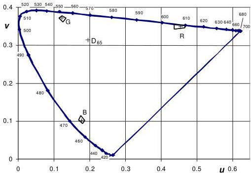
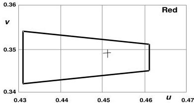
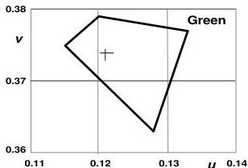
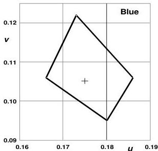
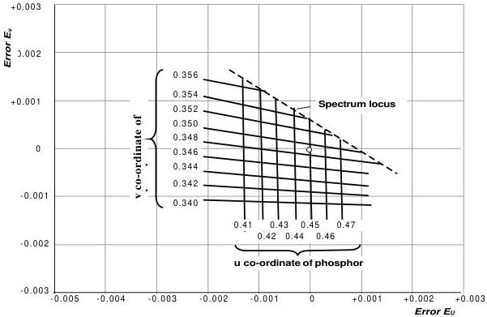
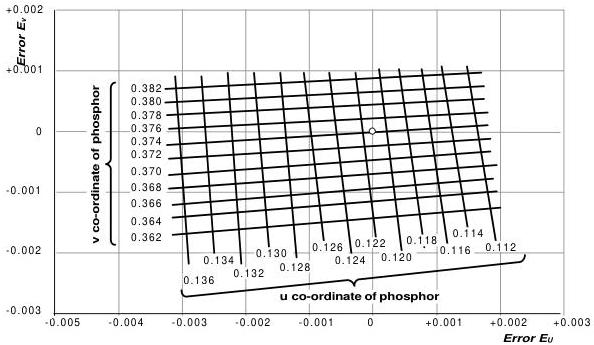
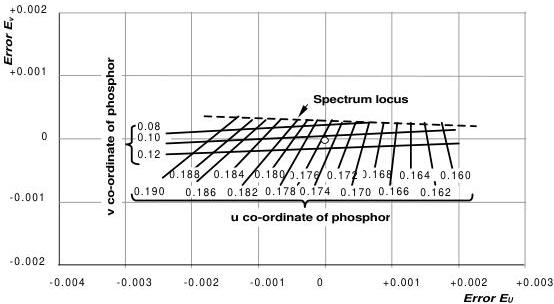
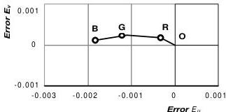

E.B.U. STANDARD FOR CHROMATICITY TOLERANCES FOR STUDIO MONITORS

Tech. 3213-E

August 1975

# Introduction

During the transmission of colour television signals, unwanted changes in the fidelity of colour reproduction can occur causing undesirable changes of hue on the domestic receiver screen. In any colour-television system such changes may be the effect of a multiplicity of causes, but one particularly important cause may be differences between nominally identical cameras used in the same studio, or in different studios; when programmes are made up partly of local signals and partly of signals from a foreign country, the problem becomes one of international significance. In order to minimise these unwanted changes in the fidelity of colour reproduction due to signal source, it is most desirable that the colour-reproducing characteristics of the colour picture tubes used in studio monitors should be standardised. In this way, all studios would be working to the same standard of colour reproduction.

This matter has been studied for several years by the European Broadcasting Union through its Ad-hoc Group on primary colours for colour television. Nominal values have been adopted for the chromaticity co-ordinates for television monitor phosphors [1, 2].

The subject has also been discussed by the C.C.I.R. and their conclusions are set out in Table 2 of C.C.I.R. Report 624 [3]. It will be observed that the C.C.I.R. recommends two sets of values for these co-ordinates. The original chromaticity co-ordinates chosen by the NTSC in the United States in 1953 have been retained for 525-line/60-field systems using either NTSC or PAL, but the chromaticity co-ordinates proposed by the E.B.U. Ad-hoc Group have been adopted for PAL and SECAM systems based on 625-line/50-field systems B, G, H, I, D, K, KI and L. This latter set of co-ordinates, which is more suited to the needs of European television, was chosen following a study carried out in 1970 of the colorimetric characteristics of phosphors known at that time [4]. The true characteristics of these phosphors was taken into account as was the likelihood of technical developments in this field.

This standardisation of chromaticity co-ordinates was not intended to deter manufacturers from continuing their search for phosphors of ever greater efficiency but to allow television viewers to enjoy the highest possible fidelity of colour reproduction.

It was, however, useful to specify acceptable tolerances for the production of these phosphors to the manufacturers. While the C.C.I.R. document gives "aim points" for the chromaticities of the red, green and blue primary-colour phosphors, it does not specify how much latitude is allowed.

Studies on this subject have been carried out in the United Kingdom which have led to the proposal of a set of tolerances for permissible variations of chromaticity of primary phosphors.

A method is also proposed for ensuring that the combined result of the individual phosphor tolerances does not produce an unacceptable variation in the reproduction of skin tone. These tolerances and this method are mentioned in C.C.I.R. Report 476-1. They were approved in April 1975 by the Technical Committee of the E.B.U. which recommended that they should be adopted for television monitors in colour studios by any television organisation using a 625-line/50-field colour-television system. The essential details of the recommendation follow.

# Summary of existing standards

Existing standards for the colorimetry of studio monitors in 625-line/50-field systems are related to the reference white obtained when all three types of phosphors are equally excited and to the primary colours obtained from each type of phosphor separately.

## 1. Reference white

Reference white, for which the three primary-colour signals $\mathrm{E}_{\mathrm{R}}'$, $\mathrm{E}_{\mathrm{G}}'$ and $\mathrm{E}_{\mathrm{R}}'$ are equal, is illuminant $\mathrm{D}_{65}$ which has been standardised by the International Commission on Illumination (C.I.E.). In the C.I.E. 1960 system, its chromaticity co-ordinates are:

$$
u = 0.1978 \quad \text{and} \quad v = 0.3122
$$

or, in the C.I.E. 1931 system:

$$
x = 0.313 \quad \text{and} \quad y = 0.329
$$

Illuminant $\mathrm{D}_{65}$ represents a particular spectral distribution of daylight and corresponds to a correlated colour temperature of approximately $6504\,\mathrm{K}$.

## 2. Primary colours

The chromaticity of each of the primary phosphors as seen on a monitor screen should have the following values:

In the C.I.E. 1960 system:

|   | u | v  |
| --- | --- | --- |
|  Red | 0.451 | 0.349  |
|  Green | 0.121 | 0.374  |
|  Blue | 0.175 | 0.105  |

In the C.I.E. 1931 system:

|   | x | y  |
| --- | --- | --- |
|  Red | 0.64 | 0.33  |
|  Green | 0.29 | 0.60  |
|  Blue | 0.15 | 0.06  |

These values were established in 1970 after a thorough examination of the colorimetric characteristics of phosphors available at that time and after discussions with the manufacturers on likely technical developments.

# Tolerances recommended by the E.B.U.

## 1. General principles

The chromaticities of primary phosphors as seen on a television monitor screen may not be rigorously held to the foregoing values. They will, however, be considered acceptable if they meet simultaneously the following two conditions:

a) The chromaticity of each phosphor must lie within an area which surrounds the standardised value and which defines the "intrinsic tolerance" of this phosphor.

b) When the three phosphors are excited together, they must reproduce a particular skin-tone colour within the appropriate tolerance for this colour.

The intrinsic tolerance for each phosphor has been established so as to limit the possible divergence from the standardised value while making allowances for normal manufacturing tolerances. The magnitude of the divergence is of the order of a tenth of a unit on the C.I.E. 1960 uniform chromaticity scale diagram, but its exact value depends both on the phosphor and on the direction of divergence.

The permissible tolerance for skin-tones is much smaller than that applicable to primary colours. Studies of vision have shown that the eye is particularly sensitive to variations of skin-tone rendering and, consequently, the absolute value of tolerance in this region has been set at 0.003 units on the C.I.E. 1960 uniform chromaticity scale diagram. This is slightly more stringent than the generally accepted figure of 0.004 units for a perceptible variation of chromaticity for all colours [5]. The E.B.U. considers that the fidelity obtained with a tolerance of 0.003 units will meet the needs of normal vision for all skin-tones likely to be met in colour television.

It is possible to measure the variations of chromaticity obtained for colours other than skin-tones. For example, this test could be carried out on C.I.E. test colours or on test colours produced by the B.B.C. The general principles of the method are described in [6], but only skin-tones will be considered here as these are the most critical colours to be reproduced by a television system.

# 2. Intrinsic tolerances

The magnitude of the intrinsic tolerance area on the C.I.E. 1960 uniform chromaticity scale diagram is shown in Fig. 1. An enlargement of each of these zones appears in Fig. 2.

The chromaticity co-ordinates of the corners of the quadrilaterals that define the tolerances shown on these figures have the following values:

In the C.I.E. 1960 system:

|   | u1 v1 |   | u2 v2 |   | u3 v3 |   | u4 v4  |   |
| --- | --- | --- | --- | --- | --- | --- | --- | --- |
|  Red | 0.461 | 0.351 | 0.461 | 0.345 | 0.431 | 0.342 | 0.431 | 0.354  |
|  Green | 0.133 | 0.377 | 0.128 | 0.363 | 0.115 | 0.375 | 0.120 | 0.379  |
|  Blue | 0.186 | 0.106 | 0.180 | 0.095 | 0.166 | 0.106 | 0.173 | 0.122  |

In the C.I.E. 1931 system:

|   | x1 y1 |   | x2 y2 |   | x3 y4 |   | x4 y4  |   |
| --- | --- | --- | --- | --- | --- | --- | --- | --- |
|  Red | 0.654 | 0.332 | 0.640 | 0.319 | 0.608 | 0.322 | 0.637 | 0.349  |
|  Green | 0.320 | 0.605 | 0.286 | 0.542 | 0.280 | 0.610 | 0.298 | 0.627  |
|  Blue | 0.158 | 0.060 | 0.150 | 0.053 | 0.143 | 0.061 | 0.154 | 0.072  |

*Figure 1 – Intrinsic chromaticity tolerances for the three standardised primaries.*

*Figure 2 – Details of the intrinsic chromaticity tolerances, part 1.*

*Figure 2 – Details of the intrinsic chromaticity tolerances, part 2.*

*Figure 2 – Details of the intrinsic chromaticity tolerances, part 3.*

## 3. Tolerances for skin-tones

When making an acceptance test on a picture tube for a television studio monitor, it is not enough to check that the chromaticities of the red, green and blue phosphors fall within the quadrilaterals shown in Fig. 2. It must also be checked that the combination of primary chromaticities produces a skin-tone chromaticity within 0.003 $u, v$ units of the original skin-tone being reproduced.

The variations of skin-tone resulting from variations of primary phosphor chromaticity can easily be determined by using the charts in Figs. 3, 4 and 5.

Each chart contains two co-ordinate grid systems: the larger orthogonal grid gives errors in reproduced skin-tone chromaticity $(u, v)$ units, while the smaller non-orthogonal grid gives the $(u, v)$ co-ordinates of the chromaticity of one phosphor. Each point on the chart thus represents both the phosphor chromaticity and the error in skin-tone chromaticity caused by the use of this phosphor chromaticity.

The error is a vector quantity whose origin is denoted by a small circle, co-ordinates $(0, 0)$ on the particular $\mathbf{E}_u$, $\mathbf{E}_v$ diagram. This origin corresponds to the aim point" for the phosphor chromaticity on the $(u, v)$ co-ordinate system.

The total error arising from the simultaneous excitation of the three phosphors can be found by vectorial addition of the errors found separately for each phosphor.

The skin-tone chosen has chromaticity co-ordinates $u = 0.2221$, $v = 0.3256$, with luminance $Y = 0.4404$, normalised to a unit value of white. The illuminant is assumed to be $D_{65}$

An example of the use of these charts is appended.

*Figure 3 – Errors in the reproduction of skin tone resulting from variations in the chromaticity of the red phosphor.*

*Figure 4 – Errors in the reproduction of skin tone resulting from variations in the chromaticity of the green phosphor.*

*Figure 5 – Errors in the reproduction of skin tone resulting from variations in the chromaticity of the blue phosphor.*

# Summary of the recommendations

The EBU. recommends that broadcasting organisations using PAL or SECAM signals, based on standards B, G, H, I, D, K, Kl and L, should ensure that the colour monitors installed in their studios are such that the chromaticities of the primary colours lie within the quadrilaterals shown in Fig. 2.

Where the phosphors satisfy this condition, further checks should be made the that reproduction of a skin-tone whose chromaticity is $u = 0.2221$, $v = 0.3256$, with a luminance $Y = 0.4404$ with reference to unit white and lit by illuminant $D_{65}$ does not diverge from the correct value by more than:

$$
\sqrt{(\Delta u)^2 + (\Delta v)^2} = 0.003
$$

# Appendix

It is desired to check whether a monitor displaying primary colours with the following chromaticities satisfies conditions (a) and (b) on page 7:

|   | u | v  |
| --- | --- | --- |
|  Red | 0.44 | 0.35  |
|  Green | 0.125 | 0.375  |
|  Blue | 0.18 | 0.11  |

Reference to Fig. 2 shows that the "intrinsic tolerances" on page 8 are not exceeded. To determine the effect on the chosen skin-tone, Fig. 3 shows the chromaticity shift due to the red display primary ( $u = 0.44$ ,  $\nu = 0.35$ ) and indicates a vector displacement of about 0.00035 at an angle of about  $+152^{\circ}$  to the  $+u$  direction. This is shown as OR in Fig. 6. Looking up the co-ordinates  $u = 0.125$ ,  $\nu = 0.375$  on Fig. 4, gives (by interpolation) a vector displacement of about 0.0008 and at an angle of  $+175^{\circ}$  due to the chromaticity of the green primary. This vector is added in Fig. 6 as RG. Finally the co-ordinates  $u = 0.18$ ,  $\nu = 0.11$  are located on Fig. 5 and this shows a vector of magnitude about 0.0007 and direction about  $+189^{\circ}$ . This is shown as GB in Fig. 6. The total displacement is OB, which has a magnitude of about 0.0018. This is less than 0.003 (the skin-tone tolerance) and hence this set of primary display colours satisfies the proposed specification.

*Figure 6 – Determination of the resultant error in the example.*

# Bibliographical references

[1] Colorimetric analysis characteristics of colour television cameras. E.B.U. Technical Centre : Appendix 1 to document Com.T.(C) 7, September 1970

[2] Wood, C.B.B.: Unified characteristics for colour picture monitors. E.B.U. Review, Technical Part, No. 133, pp. 108-112.

[3] Characteristics of television systems. C.C.I.R. Report 624, C.C.I.R. XIIIth Plenary Assembly, Geneva 1974, (document 11/1049).

[4] Wood, C.B.B. and Sproson, W.N.: The choice of primary colours for colour television. B.B.C. Engineering, No. 85, January 1971, pp. 19-36.

[5] Wilhelm-Leroy, C. and Dupont-Henius, G.: Recherche des seuils de differenciation des couleurs (Research into just noticeable colour differences). Congress of A.I.C. Colour '73, ed. Hilger, pp. 373-377.

[6] Taylor, E.W.: Colour television displays : Error diagrams for evaluating the reproduced chromaticities of some test colours. B.B.C. Research Department Report, No. 1974/34.

