Specification of interfaces for 625-line digital PAL signals

Tech. 3280-E

April 1995

# Introduction

## Scope

This present specification describes the means of interconnecting digital television equipment operating according to the composite PAL 625-line television standard.

Only two devices will be connected together at one time through one interface.

The interfaces are intended to satisfy the dubbing requirements of composite television recorders. A parallel and a serial version are specified.

A list of definitions of the terms used in this document is given in the Appendix.

## Nomenclature

### Number representations

Within this specification, the contents of digital words are expressed in both decimal and hexadecimal forms (denoted by subscripts d and h respectively). To avoid confusion between 8-bit and 10-bit representations, the 8 most-significant bits are considered to be an integer part and the two additional bits, if present, are considered to be fractional parts.

For example:

|  the bit pattern | 10010001 | is expressed as: | 145_{d} or | 91_{h}  |
| --- | --- | --- | --- | --- |
|  the bit pattern | 1001000101 | is expressed as: | 145.25_{d} or | 91.4_{h}  |

Where no fractional part is shown it is assumed to be zero.

### PAL chrominance phase angles

Phase angles in this specification are expressed in positive values between $0^{\circ}$ and $359^{\circ}$.

The convention used is that phasors rotate in an anticlockwise direction and that phase angles are expressed relative to the $+\mathrm{U}$ axis with phase advance considered positive.

This is consistent with other PAL documentation and with the calibration of vectorscopes.

# Chapter 1

# Structure of the signals transferred through the interfaces

# 1. General description

The data signals in the interface are carried in the form of binary information coded in 10-bit words. The most significant 8 bits of each word are required to be present. The 2 least-significant bits of each word are optional, and may be used to increase the resolution of the words. Unless otherwise noted, when referring to word values in this document, 10-bit words will be assumed.

# 1.1. Video signals

# 1.1.1. Coding characteristics

Video data signals are derived by coding the analogue composite PAL video signal. The coding parameters are given in Table 1.

The following specification is based on the assumption that the colour subcarrier phase of the sampled signal is zero (0° Sc-H) as defined in EBU Statement D23 [1]. This means that the phase of the +U axis of the subcarrier is zero relative to the horizontal timing reference point,  $0_{\mathrm{H}}$ , (the mid-point of the leading edge of the line sync pulse) of line 1 in field 1 as shown in Fig. 1.

The quantization scale shall be uniformly-quantized PCM with 10 bits per sample. 8 bits per sample may be carried across the interface by using the 8 most-significant bits and setting the 2 least-significant bits to 0.

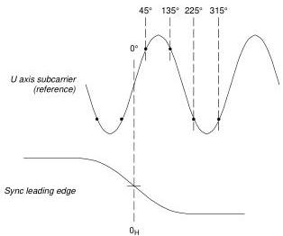

*Figure 1 - Sampling instants for line 1 field 1 (zero degrees Sc-H).*

Table 1 - Encoding parameter values for video signals.

|  Parameter | Specification  |   |
| --- | --- | --- |
|  Coded signal | PAL  |   |
|  Number of samples per active line | 1135 + (4/625) (see Section 1.2.)  |   |
|  Sampling structure | non-orthogonal, frame repetitive  |   |
|  Sampling frequency | 4fsc: 17.734475 MHz  |   |
|  Form of coding | Uniformly-quantized PCM, 8 to 10 bits per sample  |   |
|  Number of samples per digital active line | 948  |   |
|  Correspondence between video signal levels and quantizing level | 8-bit signals | 10-bit signals  |
|  Blanking level | 40h | 40.0h  |
|  White level | D3h | D3.0h  |
|  Sync level | 01h | 01.0h  |
|  Sync headroom | 0.14 dB | 0.14 dB  |
|  Picture headroom (yellow bar – see Fig. 4) | 0.23 dB | 0.23 dB  |

The characteristics of the data word at the interface are based on the assumption that the location of any required  $\sin (\mathrm{x}) / \mathrm{x}$  correction is at the point where the digital signal is converted to an analogue form.

The analogue PAL composite waveform is sampled at a rate of four times colour subcarrier frequency  $(4\mathrm{f_{sc}})$ . Sampling instants occur at  $45^{\circ}$ ,  $135^{\circ}$ ,  $225^{\circ}$  and  $315^{\circ}$ , relative to the  $+\mathrm{U}$  axis, as illustrated in Fig. 1. A method of verifying the correct sampling phase is shown in Fig. 2.

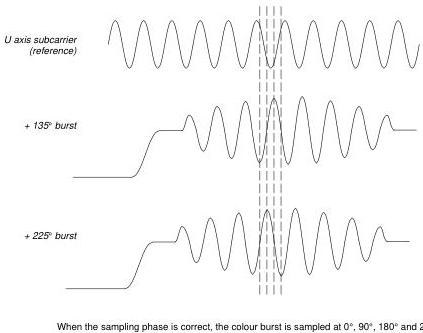

*Figure 2 - Sampling instants during the burst.*

|  Level (mV) | Hex code | Binary code | Signal  |
| --- | --- | --- | --- |
|  913.1 | FF.C | 1111 1111 11 | Excluded values  |
|   |  FF.8 | 1111 1111 10  |   |
|   |  FF.4 | 1111 1111 01  |   |
|  909.5 | FF.0 | 1111 1111 00  |   |
|  903.3 | FE.C | 1111 1110 11 | Maximum value  |
|  700.0 | D3.0 | 1101 0011 00 | Peak white  |
|  0.0 | 40.0 | 0100 0000 00 | Blanking  |
|  -300.0 | 01.0 | 0000 0001 00 | Sync tip  |
|  -304.8 | 00.C | 0000 0000 11 | Excluded values  |
|   |  00.8 | 0000 0000 10  |   |
|   |  00.4 | 0000 0000 01  |   |
|  -308.3 | 00.0 | 0000 0000 00  |   |

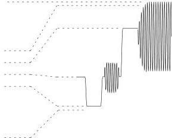

*Figure 3 - Relationship between analogue signal level and digital sample values. Note: Peaks of the analogue yellow bar extend above the excluded values (see Fig. 4).*

The amplitude relationship between the digital signal and the equivalent analogue signal is shown in Fig. 3. The signal illustrated is a representation of  $100\%$  colour bars (100/0/100/0). The peak analogue value of  $100\%$  bars (yellow bar) exceeds the digital range and extends into the range of excluded values; nonetheless, the digital samples remain within the range of "legal" values. This is possible due to the sampling phase of the signals within the allowed gamut, such as for the yellow bar as shown in Fig. 4. Designers and operators of analogue to digital convertors should consider the effects of this small amount of headroom.

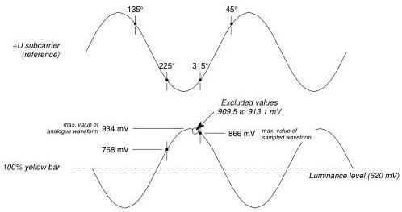

*Figure 4 - 100% yellow bar, maximum sample values. Note: Odd-numbered lines of fields 1 and 2, even-numbered lines of field 3 and 4.*

# 1.1.2. Video data word format

The video data is transferred across the interface as 8-bit or 10-bit data words.

In an 8-bit system, 254 of the 256 levels  $(01_{\mathrm{h}}$  to  $\mathrm{FE_h})$  are used to express a quantized value.

Levels  $00_{\mathrm{h}}$  and  $\mathrm{FF_h}$  are not permitted in the data stream.

In an 10-bit system, 1016 of the 1024 levels  $(01.0_{\mathrm{h}}$  to  $\mathrm{FE.C_h})$  are used to express a quantized value.

Levels  $00.0_{\mathrm{h}}$ ,  $00.4_{\mathrm{h}}$ ,  $00.8_{\mathrm{h}}$ ,  $00.0_{\mathrm{h}}$  and  $\mathrm{FF.0_h}$ ,  $\mathrm{FF.4_h}$ ,  $\mathrm{FF.8_h}$ ,  $\mathrm{FF.0_h}$  are not permitted in the data stream.

# 1.2. Timing relationship between video samples and the analogue synchronizing waveform

Fig. 5a shows the timing relationship between the digital video sampling instants and the analogue line synchronization pulse of line 1 field 1. Fig. 5b shows the positions of the active and blanking portions of the digital line.

The numbers shown in Fig. 5 were chosen in such a way that the digital active line period begins before, and end after, the analogue active video. Thus, the blanking edges of the analogue video are contained within the digital active line period.

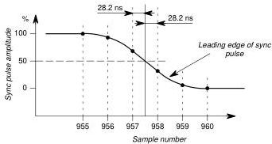

*Figure 5a - Sampling instants and sample numbering for line 1 field 1 (as ITU-R Report 624 [2]).*

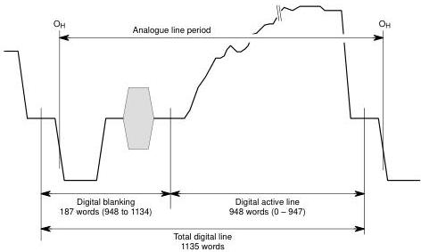

*Figure 5b - Sample numbering and horizontal sync relationship.*

For a signal with $0^{\circ}$ Sc-H phase, the half-amplitude point of the leading edge of the line sync pulse on line 1 field 1 falls mid-way between samples. On succeeding lines the sampling structure advances by 0.361 ns per line i.e. 4 samples per frame. As a consequence, the sampling structure is non-orthogonal (there being 1135.0064 sample periods per line) and the structure repeats at frame rate.

948 of the 1135 samples in each picture line are designated as the digital active line; the remaining 187 samples comprise the digital horizontal blanking interval. The first of the 948 active samples is designated sample 0 for the purpose of reference. A complete digital line consists of samples 948 to 1134 and 0 to 947 inclusive. The first sample of the digital active line on line $N$ is:

in fields 1, 3, 5 and 7: $((N - 1) \times 1135) + 177$ samples after the sample following the leading edge of sync on line 1;

in fields 2, 4, 6 and 8: $((N - 314) \times 1135) + 177$ samples after the sample following the leading edge of sync on line 314.

As a consequence of this non-orthogonal structure, two extra samples are needed per field. These are located on lines 313 and 625 and are numbered 1135 and 1136; they appear immediately prior to the first active picture sample, 0000. These extra samples do not affect the continuous signal concept where all but two lines in a field have 1135 samples and the other two have 1136. (the numbers of the lines which contain 1136 samples results from the exact Sc-H phase and the criteria for deciding which samples fall on which lines.)

## 1.3. Digital blanking

Any equipment which does not pass the signal in its entirety must re-create digital blanking at the output interface. A 10-bit representation of the blanking interval is preferred, although 8-bit values can be used. The sample values for the sync and burst edges must represent the rise-time and positions of the pulses within the tolerances laid down for the analogue signal in ITU-R Report 624 [2].

Fig. 6 shows the relation between the analogue and digital active picture areas.

### 1.3.1. Digital horizontal blanking

Data within the digital horizontal blanking interval shall consist of a digital representation of an analogue horizontal blanking interval. Note that, where 8-bit values are used, the sample values should be selected to maximise the accuracy of the representation of the burst (i.e. rounding of the sample values is preferable to truncation.)

### 1.3.2. Digital vertical blanking

The digital vertical blanking extends from:

in fields 1, 3, 5 and 7: line 623, sample 382 to line 5 sample 947 inclusive;

in fields 2, 4, 6 and 8: line 310, sample 948 to line 317 sample 947 inclusive.

Digital data within the digital vertical blanking interval shall consist of a digital representation of the analogue blanking interval.

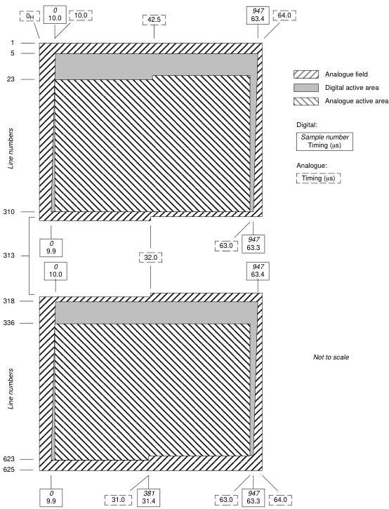

*Figure 6 - Relationship between the analogue and digital active picture areas.*

# Chapter 2

# Parallel interface

# 2.1. Introduction

The interface is intended for use with screened twisted 12-pair cable of conventional design over distances of up to  $40\mathrm{m}$  without transmission equalization or any special equalization at the receiver. Longer cable lengths may be used, but with a rapidly increasing requirement for care in cable selection and possible receiver equalization, or the use of active repeaters, or both.

The interface consists of a unidirectional, 11-pair interconnection between one device and another. Ten pairs carry the data corresponding to the television signal, or associated data, whilst pair 11 carries a synchronous clock signal. Pair 12 is used for signal ground connections.

# 2.1.1. General

The eleven parallel bit-streams (data plus clock) shall be transmitted via balanced signal pairs, respecting the polarity indicated in Fig. 7.

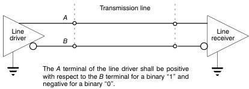

*Figure 7 - Line driver and receiver interconnection.*

All digital signal time intervals are measured at the half-amplitude points.

Although the use of ECL technology is not specified, the line driver and receiver must be ECL compatible i.e. they must permit the use of standard ECL components for either or both ends of the link. (In this specification "ECL" refers to the 10,000 series of ECL (10k ECL).)

# 2.2. Signal conventions

# 2.2.1. Polarity

The signalling sense of the voltage appearing across the interconnection cable is positive binary as defined in Fig. 7.

# 2.2.2. Bits of the data word

Expression of the data word requires more than one binary signal; DATA 0 to DATA 9 are all required to specify the data. This group of ten signals is identified by placing parentheses around the range of suffixes included. i.e. DATA (0-9). DATA 9 is the most significant bit of the data.

DATA 1 and DATA 0 are optional and may be used to increase the resolution of the video data word from a minimum of 8 bits to a maximum of 10 bits. If used, then DATA 1 shall be more significant than DATA 0 but less significant then DATA 2. If it is not used, then DATA 1 and DATA 0 shall be set to binary "0" at the line driver.

# 2.3. Electrical characteristics of the interface

# 2.3.1. Line driver characteristics

a) Output impedance

The line driver shall have a balanced output with a maximum internal impedance of  $110\Omega$  (as seen from the terminals to which the line is connected).

b) Common mode voltage

The average voltage of both terminals of the line driver shall be  $-1.29\mathrm{V}\pm 15\%$  with reference to the ground terminal.

c) Signal amplitude

The signal amplitude shall lie between  $0.8\mathrm{V}$  and  $2.0\mathrm{V}$  peak-to-peak, measured across a  $110\Omega$  resistor connected to the output terminals without any transmission line.

d) Rise and fall times

Rise and fall times, determined between the  $20\%$  and  $80\%$  amplitude points and measured across a  $110\Omega$  resistor connected to the output terminals without a transmission line, shall be no longer than 7 ns and shall differ by not more than 5 ns.

# 2.3.2. Line receiver characteristics

a) Terminating impedance

The cable shall be terminated by  $110 \pm 10\Omega$ .

b) Maximum input signal

The line receiver must sense properly the binary data when connected directly to a line driver operating at the extreme voltage limits permitted by Section 2.3.1.c).

# 2.3.3. Minimum input signal

The line receiver must sense correctly the binary data when a random data signal produces the conditions represented by the eye diagram in Fig. 8 at the data detection point.

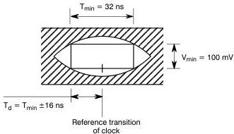

*Figure 8 - Eye diagram.*

a) Common mode rejection

The line receiver must sense correctly the binary data in the presence of common mode interference of  $0.5\mathrm{V}$  at frequencies in the range  $0 - 15\mathrm{kHz}$

b) Clock-to-data differential delay

The line receiver must sense correctly the binary data when the clock to data differential delay is  $\pm 16$  ns (see Fig. 8).

# 2.4. Clock signal

The following specifications apply to the output of the line driver.

# 2.4.1. Clock pulse width

The clock pulse width is  $28.2 \pm 5$  ns  $\left(\frac{1}{2} \times \frac{1}{4f_w}\right)$

# 2.4.2. Clock jitter

The timing of individual rising edges of clock pulses shall be within  $\pm 5$  ns of the average timing of rising edges, as determined over at least one field $^1$ .

# 2.4.3. Clock-to-data timing relationship

The positive transition of the clock signal shall occur midway between data transitions as shown in Fig. 9.

# 2.5. Cables and connectors

# 2.5.1. Cable

a) Characteristic impedance

The cable used shall, for each data or clock pair, have a nominal characteristic impedance of  $110\Omega$

b) Other characteristics

The differential delay, due to the cable, between the clock and any data signal shall not exceed 5 ns.

It is strongly recommended that the cable incorporates overall screening.

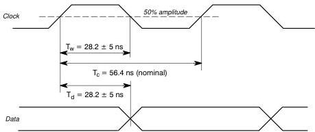

*Figure 9 - Clock-to-data timing at the line driver.*

$\mathrm{T_d} =$  Data timing at sending end

$\mathrm{T_w} =$  Clock pulse width

$\mathrm{T_c} =$  Clock period

1. This amount of clock jitter is acceptable for correct operation of the interface, but is excessive for direct use in digital-to-analogue conversion..

# 2.5.2. Connectors

# a) Connector characteristics

The connectors shall have mechanical characteristics conforming to the 25 pin sub-miniature type D [3].

The cable assembly shall be provided at both ends with connector receptacles containing male pins (plugs). Equipment inputs and outputs shall be provided with connector receptacles containing female sockets.

Connectors are locked together with a screw-lock, with a male screw on the cable connector and a female threaded post on the equipment connector. The threads are of type UNC 4-40. Details of the mounting post are shown in Fig. 10.

It is recommended that screened connectors be used.

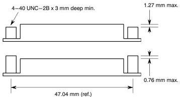

*Figure 10 - Details of the DB25 connector mounting posts.*

# b) Connector contact assignments

The connectors contacts, numbered in the standard manner depicted in Fig. 11, must be assigned in accordance with Table 2.

Table 2 - Connector contact assignments.

|  Pin | Signal line |  | Pin | Signal line  |
| --- | --- | --- | --- | --- |
|  1 | Clock |  | 14 | Clock return  |
|  2 | System ground |  | 15 | System ground  |
|  3 | Data 9 |  | 16 | Data 9 return  |
|  4 | Data 8 |  | 17 | Data 8 return  |
|  5 | Data 7 |  | 18 | Data 7 return  |
|  6 | Data 6 |  | 19 | Data 6 return  |
|  7 | Data 5 |  | 20 | Data 5 return  |
|  8 | Data 4 |  | 21 | Data 4 return  |
|  9 | Data 3 |  | 22 | Data 3 return  |
|  10 | Data 2 |  | 23 | Data 2 return  |
|  11 | Data 1 |  | 24 | Data 1 return  |
|  12 | Data 0 |  | 25 | Data 0 return  |
|  13 | Cable screen |  |  |   |

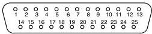

*Figure 11 - Mating face of the connector receptacle containing male pins (plug).*

Note: The preferred orientation for connectors, mounted vertically or horizontally, is with contact 1 uppermost.

# Chapter 3

# Serial Interface

# 3.1. Introduction

The serial interface is intended for use on studio-quality coaxial cables over distances up to  $200\mathrm{m}$ .

The 10-bit data is transferred across the interface as a 177.34 Mbit/s serial data-stream in unbalanced form and at an impedance of  $75\Omega$

# 3.2. Signal coding

The input source for generating the serial signal shall be in accordance with the signal structure described in Chapter 1.

# 3.2.1. Channel coding

The channel coding scheme shall be scrambled NRZI.

The generator polynomial for the scrambled NRZI shall be  $\mathrm{G}_1(\mathbf{x}).\mathrm{G}_2(\mathbf{x})$ , where:

$\mathrm{G}_1(\mathrm{x}) = \mathrm{x}^9 +\mathrm{x}^4 +1$  to produce a scrambled NRZI signal;

$\mathrm{G}_2(\mathrm{x}) = \mathrm{x} + 1$  to produce the polarity-free NRZI sequence.

Block diagrams of the encoding and decoding operations are shown in Fig. 12.

The video data word size through the serial interface shall be 10 bits. This results in a nominal bit-rate of 177.34 Mbit/s.

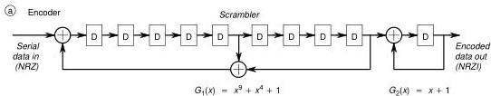

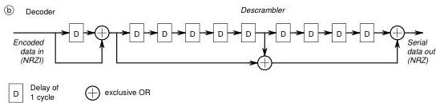

*Figure 12 - Block diagrams of serial encoder and decoder.*

## 3.2.2. Transmission order

The least-significant bit of any data word shall be transmitted first.

## 3.3. Timing reference signals (TRS) and line identification (ID)

### 3.3.1. Timing reference signals

To enable the de-serialiser to establish the correct de-serialising phase and identify correctly the word boundaries, it is necessary to incorporate digital synchronizing information in the serial data-stream. This is accomplished by the replacement of four data words during each horizontal sync pulse with a timing reference signal (TRS) in the serialiser. The TRS shall only be present following the leading edge of a line sync pulse.

The TRS consists of four words and it replaces samples numbered 967, 968, 969, 970 with the values FF.C_h, 00.0_h, 00.0_h, 00.0_h, respectively.

The de-serialiser should remove the TRS from the data-stream.

### 3.3.2. Line identification (ID)

To enable field and line identification to take place in the digital domain, a line identification (ID) word is added, replacing the sample immediately following the TRS, i.e. sample number 971. The three least-significant bits of the ID word indicate the field:

|  DATA 2 (MSB) | DATA 1 | DATA 0 (LSB) | Lines | Field  |
| --- | --- | --- | --- | --- |
|  0 | 0 | 0 | 1 - 313 | 1  |
|  0 | 0 | 1 | 314 - 625 | 2  |
|  0 | 1 | 0 | 1 - 313 | 3  |
|  0 | 1 | 1 | 314 - 625 | 4  |
|  1 | 0 | 0 | 1 - 313 | 5  |
|  1 | 0 | 1 | 314 - 625 | 6  |
|  1 | 1 | 0 | 1 - 313 | 7  |
|  1 | 1 | 1 | 314 - 625 | 8  |

The next five bits (3 to 7) indicate the line number during the field-blanking interval, as follows:

|   | DATA 7 (MSB) | DATA 6 | DATA 5 | DATA 4 | Data 3 LSB)  |
| --- | --- | --- | --- | --- | --- |
|  Not used | 0 | 0 | 0 | 0 | 0  |
|  Line 1/314 | 0 | 0 | 0 | 0 | 1  |
|  Line 2/315 | 0 | 0 | 0 | 1 | 0  |
|  Line 3/316 | 0 | 0 | 0 | 1 | 1  |
|  ... | ... | ... | ... | ... | ...  |
|  Line 29/343 | 1 | 1 | 1 | 0 | 1  |
|  Line 30/344 | 1 | 1 | 1 | 1 | 0  |
|  > Line 30/344 | 1 | 1 | 1 | 1 | 1  |

DATA 8 is even parity for DATA 0 to DATA 7.

DATA 9 is the complement of DATA 8.

The de-serialiser should remove the ID from the data-stream

## 3.4. Electrical characteristics

### 3.4.1. Line driver characteristics

a) Output impedance

The line driver shall have an unbalanced output with a source impedance of $75\,\Omega$ and a return loss of at least 15 dB over a frequency range of 10–180 MHz

b) Signal amplitude

The signal is conveyed in NRZI form using positive logic polarity and its peak-to-peak amplitude shall lie in the range $800\mathrm{mV}\pm 10\%$ measured across a $75\Omega$ resistor connected to the output terminals without any transmission line.

c) DC offset

The DC offset, as defined by the mid-amplitude point of the signal, shall lie within the range $+0.5\mathrm{V}$ to $-0.5\mathrm{V}$.

d) Rise and fall times

Rise and fall times, determined between the $20\%$ and $80\%$ amplitude points and measured across a $75\Omega$ resistor connected to the output terminals, without a transmission line, shall lie in the range 0.75 to 1.50 ns. The rise and fall times shall not differ by more than 0.50 ns

e) Jitter

The timing of the rising edges of the data signal shall be within $\pm 10\%$ of the clock period as determined over a period of one television line

3.4.2. Line receiver characteristics

a) Terminating impedance

The cable shall be terminated by $75\Omega$ with a return loss of at least 15 dB over a frequency range of 10-180 MHz

b) Receiver sensitivity

The line receiver must correctly sense random binary data either when connected directly to a line driver operating at the extreme voltage limits permitted by Section 3.4.1.b), or when connected via a cable having a loss of $40\mathrm{dB}$ at $180\mathrm{MHz}$ and a loss characteristic of $1 / \sqrt{f}$.

For a loss at $180\mathrm{MHz}$ in the range 0-12 dB, no equalization adjustment shall be required; thereafter adjustment is permitted.

c) Interference rejection

When connected directly to a line driver operating at the minimum limit specified in Section 3.4.1.b), the line receiver must correctly sense the binary data in the presence of a superimposed interfering signal at the following levels:

|  DC | ±2.5 V  |
| --- | --- |
|  below 1 kHz | 2.5 V peak-to-peak  |
|  1 kHz – 5 MHz | 100 mV peak-to-peak  |
|  above 5 MHz | 40 mV peak-to-peak.  |

d) Lock-up time

After a non-word-synchronous cut, the de-serializing operation shall achieve word synchronism in not more than one television line.

3.5. Cable

It is recommended that the cable be chosen to meet any relevant national standards on electro-magnetic compatibility

3.5.1. Characteristic impedance

The cable used shall have a nominal characteristic impedance of $75\Omega$

3.6. Connector

3.6.1. Connector characteristics

The connector shall have mechanical characteristics conforming to the standard $75\Omega$ BNC type [4] and its electrical characteristics should permit it to be used at $500\mathrm{MHz}$.

# Appendix

## Glossary of terms

Active picture area
All those parts of the television scanning lines which may contain video data.

Binary
A number system with base 2.

Bit
An abbreviated form of the words “binary digit”; in binary notation either 0 or 1.

Clock
Timing pulses serving as a reference for a digital system.

Composite
A form of video signal in which luminance and chrominance information is encoded into a single signal.

Digital active line
The part of the line period which contains digital video data

ECL
Emitter-coupled logic.

Hexadecimal
A number system with base 16. In the written form, equivalents of the two-digit decimal numbers 10 to 15 are replaced by letters A to F.

Interface
A concept involving the specification of the interconnection between the two items of equipment or systems. The specification includes the type, quantity and function of the interconnection circuits and the type and form of the signals to be interchanged by these circuits.

A parallel interface is one in which all the bits of a data word are sent simultaneously on separate bearers.

A serial interface is one in which the bits of a data word, and successive data words, are sent consecutively on a single bearer.

LSB
Least significant bit.

MSB
Most significant bit

NRZ
Non-return-to-zero.

NRZI
Non-return-to-zero with inversion,

PAL
Phase alternate line, a particular method for encoding composite video signals.

PCM
Pulse code modulation, a way of changing a signal in the analogue domain to one in the digital domain. The analogue signal is sampled to determine the instantaneous amplitude which is then represented by a digital number.

Quantization
An operation which allocates a binary number of fixed length to each sample, representing the amplitude of the sample with a degree of approximation which depends on the number of digits chosen.

Sample
The discrete instantaneous amplitude of a signal.

Sc–H
The phase of colour subcarrier with respect to the horizontal timing reference (leading edge of line sync).

Word
A group or sequence of bits treated together.

# Bibliography

- [1] EBU Technical Statement D23-1994: Timing relationship between the subcarrier reference and the line synchronizing pulses for 625-line PAL television signals
- [2] CCIR Report 624: Characteristics of television systems
- [3] ISO Standard 2110: Information technology – Data communication, 25–pole DTE/DCE interface connector and contact number assignments
- [4] IEC Publication 169: Radio-frequency connectors – Part 8: R.F. coaxial connectors with inner diameter of outer conductor $6.5 \, \text{mm}$ (0.256 in) with bayonet lock – Characteristic impedance 50 ohms (Type BNC)