# 1 Scope

1.1 This standard describes the composite analog color video signal for studio applications: NTSC, 525 lines, 59.94 fields, 2:1 interface with an aspect ratio of 4:3.

1.2 This standard specifies the interface for analog interconnection and serves as the basis for the digital coding necessary for digital interconnection of NTSC equipment.

NOTE - Parts of the NTSC signal defined in this standard differ from the final report of the Second National Television System Committee (NTSC 1953) due to changes in technology and studio operating practices.

# 2 Normative references

The following standards contain provisions which, through reference in this text, constitute provisions of this standard. At the time of publication, the editions indicated were valid. All standards are subject to revision, and parties to agreements based on this standard are encouraged to investigate the possibility of applying the most recent edition of the standards indicated below.

IEC 60169-8 (1978-01), Radio Frequency Connectors — Part 8: R.F. Coaxial Connectors with Inner Diameter of Outer Conductor 6.5 mm (0.256 in) with Bayonet Lock — Characteristic Impedance 50 Ohms (Type BNC); and Amendment 1 (1996-03) and Amendment 2 (1997-11)

ISO 10526:1999 / CIE S005/E-1998, CIE Standard Illuminants for Colorimetry

ISO/CIE 10527, Colorimetric Observers

## 3 General description of signal

The composite color video signal shall contain an electrical representation of the brightness and color of a scene being analyzed (the active picture area) along defined paths (scan lines). The signal shall also include synchronizing and color reference signals that allow the geometric and colorimetric aspects of the original scene to be correctly reconstituted at the display. The synchronizing and color reference signals shall be placed in parts of the composite color video signal that are not visible on a correctly adjusted display. Certain portions of the composite color video signal that do not contain active picture information shall be blanked (forced below black level) in order to allow retrace of scanning beams in some types of cameras and display devices.

3.1 The video signal representing the active picture area shall consist of:

- a wideband luminance (brightness) component with setup (see clauses 10 and 12), and no upper bandwidth limitation for studio applications;
- a pair of simultaneous chrominance (coloring) components, amplitude modulated on a pair of suppressed subcarriers of identical frequency (fₛᵤ = 3.579545... MHz) in quadrature (i.e., with a 90° difference in phase).

3.2 The video signal representing the active picture area shall correspond to the scanning of the image at uniform velocities from left to right and from top to bottom. The velocities shall be such that the picture is repetitively scanned on 525 nominally horizontal lines, with alternate lines scanned on each vertical pass. This process is described as 2:1 interface (see clauses 11 and 13).

3.3 The aspect ratio of the active picture area shall be four units horizontally to three units vertically.

3.4 The composite color video signal shall be produced by an NTSC encoder that functions as follows:

3.4.1 The input signals to an NTSC encoder shall be time-coincident green, blue, and red video signals (G B R), with no setup and of equal amplitude when conveying picture information with no color content (see clause 4). Horizontal and vertical synchronizing signals and reference subcarrier shall also be required.

NOTE — Throughout this standard, references to signals represented by a single letter, e.g., G, B, and R, are equivalent to the nomenclature in earlier documents of the form EG', EB', and ER', which, in turn, refer to signals to which the transfer characteristics given in clause 5 have been applied. Such signals are commonly described as being gamma corrected.

3.4.2 Within the encoder, the green, blue, and red (G B R) video signals shall be matrixed to form one of two component sets, each comprising luminance (Y) and two color-difference signals (see clause 6); Y, B-Y, and R-Y or Y, I, and Q. The choice of component set is influenced by decisions regarding color component bandwidth; the final encoded signal shall be otherwise identical (see clause 7 and annex B).

3.4.3 After low-pass filtering, the color-difference signals (B-Y and R-Y or I and Q) shall be fed to balanced, quadrature-phase, subcarrier amplitude modulators.

3.4.4 The modulated subcarrier signals shall be added to the luminance signal, along with setup, blanking, sync, and burst (a color synchronizing signal) to form the composite output video signal.

3.5 There shall be a fixed frequency and phase relationship between the subcarrier in the burst signal, the subcarriers conveying the color-difference signals, and the horizontal and vertical synchronizing signals (see clauses 11 and 13).

3.6 The luminance and color-difference components of the composite color video signal at the encoder output shall be time-coincident.

## 4 Input signals

4.1 The green, blue, and red (G B R) input signals shall be suitable for a color display device having primary colors with the following chromaticities in the ISO/CIE 10527 system of specifications:

|   |  | x | y  |
| --- | --- | --- | --- |
|  Green | (G) | 0.310 | 0.595  |
|  Blue | (B) | 0.155 | 0.070  |
|  Red | (R) | 0.630 | 0.340  |

## NOTES

1. The display primaries with the chromaticities specified above are commonly referred to as the SMPTE C set.

2. This specification does not preclude the continued use of equipment built to the color encoding/decoding parameters of the NTSC 1953 color television transmission standard for which the chromaticities in the ISO/CIE 10527 system were specified at the following values:

|   |  | x | y  |
| --- | --- | --- | --- |
|  Green | (G) | 0.21 | 0.71  |
|  Blue | (B) | 0.14 | 0.08  |
|  Red | (R) | 0.67 | 0.33  |

4.2 The system reference white is an illuminant which causes equal primary (input) signals to be produced by a reference camera and which is produced by a reference reproducer (display device) when driven by equal primary signals. For this system, the reference white is specified in terms of its ISO/CIE 10527 chromaticity coordinates, which have been chosen to match those of ISO 10526 / CIE S005/E illuminant $D_{65}$:

$$
x = 0.3127 \quad y = 0.3290
$$

4.3 The input signals shall have no setup. Their amplitudes shall be equal for picture areas whose chromaticity corresponds to the system reference white. System nominal peak white shall be represented by input signals whose amplitudes are 100 IRE units for G, B, and R.

NOTE – IRE units are a linear scale for measuring the relative amplitudes of signals. An IRE unit has no absolute value, unless defined (see annex B).

## 5 Transfer characteristics

The reference reproducer for this system is representative of cathode ray tube displays, which have an inherently nonlinear electro-optical transfer characteristic. To achieve an overall system transfer characteristic that is linear, it is necessary to specify compensating non-linearity elsewhere in the system. In the NTSC system, this is done at the signal source. For purposes of precision, particularly in digital signal processing applications, exactly inverse characteristics are specified for the reference camera and reproducer.

The respective transfer characteristics shall be as defined in 5.1 and 5.2. It is recognized that operating values may vary from the precise values given in order to meet operational requirements in practical systems.

# 5.1 Opto-electronic transfer characteristic of reference camera

$$
V_{C} = 1.099 \times L_{C}^{0.4500} - 0.099 \quad \text{for } 0.018 \leq L_{C} \leq 1
$$

$$
V_{C} = 4.500 \times L_{C} \quad \text{for } 0 \leq L_{C} < 0.018
$$

where $V_{C}$ is the video signal output of the reference camera, normalized to the system reference white, and $L_{C}$ is the light input to the reference camera, normalized to the system reference white.

# 5.2 Electro-optical transfer characteristic of reference reproducer

$$
L_{T} = \left[ \frac{V_{r} + 0.099}{1.099} \right]^{\left(1 / 0.4500\right)} \quad \text{for } 0.0812 \leq V_{r} \leq 1
$$

$$
L_{T} = V_{r} / 4.500 \quad \text{for } 0 \leq V_{r} < 0.0812
$$

where $V_{r}$ is the video signal level driving the reference reproducer, normalized to the system reference white, and $L_{T}$ is the light output from the reference reproducer, normalized to the system reference white.

NOTE - The description above is a more technically correct definition of the transfer function (gamma correction), particularly in dark areas of the picture, than the form used in older documents, viz., "having a transfer gradient (gamma exponent) of 2.2 associated with each primary" and "signals shall be gamma corrected through application of an exponential transfer gradient inverse to that assumed in the display; i.e., 1/2.2 (0.455...)."

# 6 Matricing of the signals

The green, blue, and red (G B R) video signals shall be matrixed to form one of two baseband component sets of luminance (Y) and two color-difference signals:

Y, B-Y, and R-Y or Y, I, and Q.

# 6.1 Luminance (Y) and the color-difference signals B-Y and R-Y can be matrixed from G, B, and R according to the following formulas:

$$
Y = + 0. 5 8 7 G + 0. 1 1 4 B + 0. 2 9 9 R
$$

$$
B - Y = - 0. 5 8 7 G + 0. 8 8 6 B - 0. 2 9 9 R
$$

$$
R - Y = - 0. 5 8 7 G - 0. 1 1 4 B + 0. 7 0 1 R
$$

# BASE EQUATION

# 6.2 The color-difference signals I and Q can be matrixed from color-difference signals B-Y and R-Y according to the following formulas:

$$
I = - 0. 2 6 8 0 \dots (B - Y) + 0. 7 3 5 8 \dots (R - Y)
$$

$$
Q = + 0. 4 1 2 7 \dots (B - Y) + 0. 4 7 7 8 \dots (R - Y)
$$

$$
(\dots \text { approximate values})
$$

# 6.3 The color-difference signals I and Q can also be directly matrixed from G, B, and R video signals according to the following formulas:

$$
I = - 0. 2 7 4 6 \dots G - 0. 3 2 1 3 \dots B + 0. 5 9 5 9 \dots R
$$

$$
Q = - 0. 5 2 2 7 \dots G + 0. 3 1 1 2 \dots B + 0. 2 1 1 5 \dots R
$$

$$
(\dots \text { approximate values})
$$

NOTE - This standard assumes input signals (G B R) to the encoder without setup. The luminance signal (Y) generated by the luminance equation above is, therefore, also without setup. Adjustment to achieve the required luminance signal, including setup, is performed in the encoding equations defined in clause 10.

It should be noted that this practice differs from the NTSC 1953 specification, which utilized input signals to the encoder having setup on them and, hence, not requiring the addition of setup in the encoder.

It should also be noted that the coefficients given for G, B, and R in the luminance base equation are precise values; i.e., $0.587\mathrm{G} = 587 / 1000\mathrm{G}$, etc.

# 7 Filtering of signals

7.1 This standard does not impose a bandwidth restriction on the luminance part of the NTSC signal. Care should be taken to ensure that appropriate filtering is applied before the signal is fed to bandwidth-limited devices.

7.2 The color-difference signals shall be bandwidth limited prior to modulation as follows:

- less than 2 db down at 1.3 MHz;
- at least 20 db down at 3.6 MHz.

(See figure 1 for an example of the baseband, modulated carrier, and encoded [composite] signal passbands.)

7.3 The low-pass filters that are used with the baseband color-difference signals should have characteristics with a minimum of ringing and overshoot (Gaussian filter characteristics, for example).

NOTE to clause 7 – This standard does not preclude the continued use of equipment built to the NTSC 1953 color television transmission standard for which the I signal bandwidth is as specified in 7.2 and the Q signal bandwidth is limited as follows:

- at 0.4 MHz less than 2 db down;
- at 0.5 MHz less than 6 db down;
- at 0.6 MHz at least 6 db down.

When the overall bandwidth is not limited to less than 5 MHz, use of wideband, equiband chroma signals provides improved chroma resolution for signal processing in the studio.

When the composite NTSC signal is transmitted (or recorded on some types of video tape recorders), the overall bandwidth is normally limited to less than 5 MHz, typically 4.2 MHz as for broadcasting. In such cases, if it is desired to permit recovery at the receiver of the wideband I signal, as provided in the NTSC transmission specifications, it is necessary to decode and re-encode with the appropriate narrowband Q channel filter prior to transmission (or recording). (See SMPTE EG 27 for further information.)

This standard does not preclude the application of more sophisticated filtering techniques to any combination of the luminance, color-difference, or chrominance signals, provided care is taken not to degrade picture quality on display devices not equipped for operation with the sophisticated filtering techniques.

# 8 Subcarrier modulation

8.1 After low-pass filtering, the B-Y and R-Y (or I and Q) signals shall be fed to balanced, quadrature-phase, subcarrier amplitude modulators.

This process yields suppressed-carrier amplitude modulation in which the subcarrier chrominance signals (chroma) reduce to zero when the G B R input signals are of equal amplitude.

8.2 A gated and filtered signal derived from subcarrier, called the burst, shall be added in the horizontal blanking interval of each line, excluding the nine-line vertical sync interval, as a synchronizing signal and amplitude reference for the chrominance signals. The burst signal shall be inverted in phase from the reference subcarrier.

8.3 The modulated subcarrier signals (B-Y and R-Y or I and Q) shall be added to the luminance signal along with sync, blanking, setup, and burst to form the composite output video signal (N).

# 9 Timing

The input signals to the encoder shall be time coincident. Similarly, all the components that make up the encoded composite video signal (N) shall be time coincident at the output of the encoder (see figure 2). The recommended tolerance for time coincidence shall be $\pm 25$ ns for any pair of nominally coincident signals.

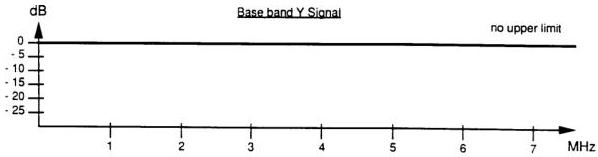

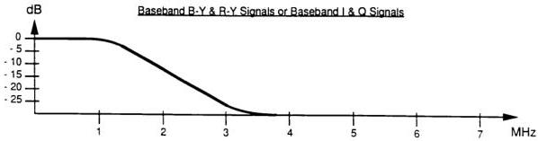

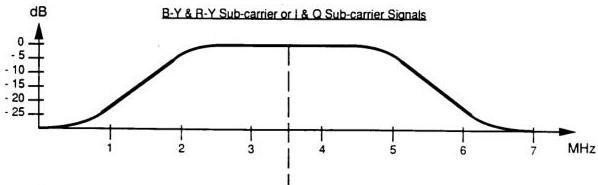

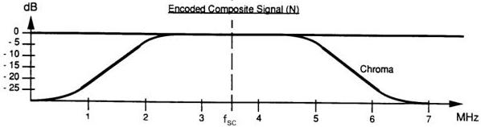

*Figure 1 – Examples of signal passbands.*

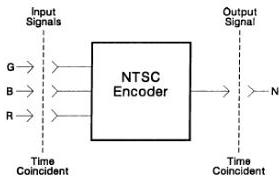

*Figure 2 – Points of time coincidence.*

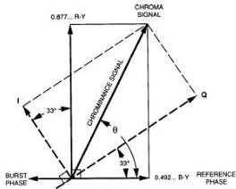

*Figure 3 – Chrominance axis and burst phase.*

# 10 Encoded signal formulas

The encoded video signal (N), without sync, burst, and blanking, shall be defined by the following formulas (see figure 3). (These equations assume G B R inputs to the encoder of 100 IRE without setup).

Where Y, B-Y, and R-Y are used:

$$
N = 0.925(Y) + 7.5 + 0.4552\dots(B-Y) \sin(2\pi f_{sc}t) + 0.8115\dots(R-Y) \cos(2\pi f_{sc}t) \quad \text{BASE EQUATION}
$$

or, where Y, I, and Q are used:

$$
N = 0.925(Y) + 7.5 + 0.925(Q) \sin(2\pi f_{sc}t + 33^\circ) + 0.925(I) \cos(2\pi f_{sc}t + 33^\circ) \quad \text{BASE EQUATION}
$$

# NOTES

1. The preceding formulas differ from those in the NTSC 1953 specification, which assumed a luminance signal (Y) that included setup. The 1953 luminance signal (Y) consisted of 92.5 IRE of signal excursion and 7.5 IRE of setup. The luminance signal used in this standard, as defined in clause 6, does not include setup and has a 100 IRE signal excursion. The encoding equations above apply a scaling factor of 0.925 (92.5%) to reflect the modern practice of adding setup in the encoder, while yielding output signals identical to the NTSC 1953 specification. For a detailed derivation of the encoding equations, see annex A.
2. The subcarrier phase reference in the equations above is the phase of the color burst $+180^\circ$.

# 11 Frequency specifications

## 11.1 Color frequency (subcarrier)

$$
f_{sc} = 5\,\mathrm{MHz} \times \frac{63}{88} = 3.579545\dots\mathrm{MHz} \pm 10\,\mathrm{Hz}
$$

Recommended stability:

- drift $< 1/10$ Hz per second;
- jitter $< 1$ ns (p-p) over one horizontal line.

## 11.2 Line frequency (horizontal)

$$
f_H = \frac{2}{455} \times f_{SC} = 15,734.265\dots Hz
$$

227.5 subcarrier cycles per video line

## 11.3 Field frequency (horizontal)

$$
f_V = \frac{2}{525} \times f_H = 59.94005994\dots Hz
$$

525 lines per frame, 2:1 interlace

## 12 Video output waveform definitions

12.1 Composite video output signal amplitude without the two color-difference subcarrier signals shall be 140 IRE units peak-to-peak (see figure 4).

12.2 Reference level shall be blanking level of 0 IRE units.

12.3 White (luminance), black (setup), blanking, burst, and sync signal levels shall be as given in table 1.

12.4 Maximum composite video output signal amplitude with the two color components (chroma) shall be 171 IRE units peak-to-peak (see figure 4).

## 13 Blanking intervals and synchronizing signals

The horizontal and vertical blanking intervals shall be the periods during which retrace occurs and in which the horizontal, vertical, and color synchronizing signals shall be located.

### 13.1 Horizontal blanking and synchronization

Each horizontal line outside the vertical blanking interval shall be divided into an active line period and a horizontal blanking interval. The horizontal blanking interval shall contain the negative-going horizontal sync pulse followed by the color synchronizing burst. The remainder of the horizontal blanking interval shall be at blanking level to properly space the synchronizing signals. Horizontal timing shall be as given in table 2 and figures 5 and 6. The horizontal reference point shall be as shown in figures 5 and 6.

Synchronization pulse and blanking edges should be skew symmetric. Raised cosine shaping is preferred.

Table 1 – Video output waveform

|  Specification | Standard value | Recommended tolerance | Unit  |
| --- | --- | --- | --- |
|  White level | 100 | ± 1 | IRE  |
|  Black (setup) level | 7.5 | ± 1 | IRE  |
|  Blanking level | 0.0 | Reference | IRE  |
|  Burst amplitude (p-p) | 40 | ± 1 | IRE  |
|  Sync level | – 40 | ± 1 | IRE  |

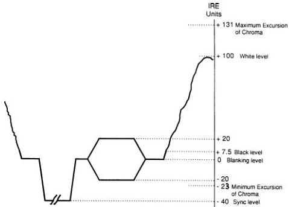

*Figure 4 – Composite video signal amplitudes.*

Table 2 – Video signal horizontal timing (see figures 5 and 6)

|  Specification | Measurement points | Value | Recommended tolerances | Unit  |
| --- | --- | --- | --- | --- |
|  Total line period (derived) |  | 63.556 |  | μs  |
|  Horizontal blanking rise time | 10% – 90% | 140 | ± 20 | ns  |
|  Sync rise time | 10% – 90% | 140 | ± 20 | ns  |
|  Burst envelope rise time | 10% – 90% | 300 | + 200
– 100 | ns  |
|  Horizontal blanking start to horizontal reference point | 50% | 1.5 | ± 0.1 | μs  |
|  Horizontal sync | 50% | 4.70 | ± 0.10 | μs  |
|  Horizontal reference point to burst start 1) | 50% | 19 | Defined by SC/H | cycles  |
|  SC/H phase (see 13.2) | See 13.2 | 0 | ± 10 | degrees  |
|  Horizontal reference point to horizontal blanking end | 50% | 9.20 | + 0.20
– 0.10 | μs  |
|  Burst 1) | 50% | 9 | ± 1 | cycles  |
|  1) The start of burst shall be defined by the zero crossing (positive or negative slope) that precedes the first half cycle of subcarrier that is 50% or greater of the burst amplitude. Its position is nominally 19 cycles of subcarrier from the horizontal reference point as shown in figure 6.
The end of burst shall be defined by the zero crossing (positive or negative slope) that follows the last half cycle of subcarrier that is 50% or greater of the burst amplitude.
Considered separately, the variations in level of each half envelope of the burst shall not exceed 0.5 IRE unit.
The burst signal shall not be present during the nine-line vertical blanking interval of each field, as shown in figure 7.  |   |   |   |   |

# 100 IRE Unit Flat Field Video Signal

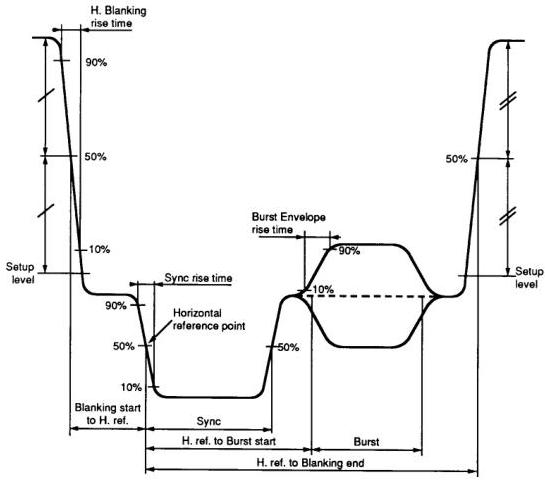

*Figure 5 – Horizontal blanking interval.*

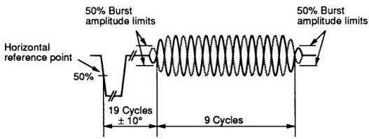

*Figure 6 – Color burst.*

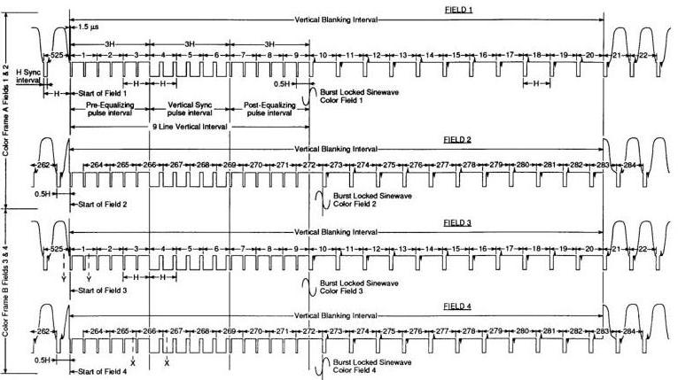

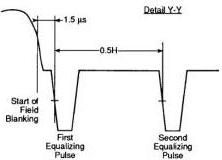

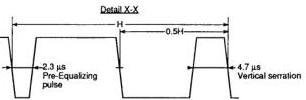

*Figure 7 – Vertical (field) blanking interval. $\downarrow$ Burst begins with a positive half-cycle. $\uparrow$ Burst begins with a negative half-cycle.*

## 13.2 Subcarrier phase to horizontal reference point

The term SC/H (subcarrier to horizontal) shall be used to define the phase relationship between the burst and the horizontal reference point (see figure 8).

A zero SC/H signal shall be defined as a signal in which the horizontal reference point is coincident with the zero crossing point of a burst-locked sine wave (a continuous sine wave of the same phase as burst). The relationship between the subcarrier and the line frequency causes the direction of this zero crossing to alternate on successive lines. On any given line, the direction of this zero crossing shall be the same as the direction of the first zero crossing of the burst.

Field I shall be defined as that field in which the first zero crossing of burst on line 10 is positive going. The first zero crossing of burst on line 10 of field III shall be negative going. Color frame A shall be used to describe fields I and II. Color frame B shall be used to describe fields III and IV.

The data in table 2 define the recommended tolerance for both burst position and SC/H.

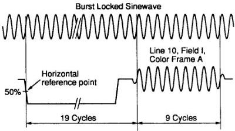

*Figure 8 – Subcarrier phase to horizontal reference point.*

## 13.3 Vertical blanking and synchronization

In an interlaced raster, each television frame (one complete scanning of the picture) is divided into two fields. The fields carry every other scan line in succession with the following field carrying the lines not scanned by the previous field.

In a color video signal, four fields (two monochrome frames) are required to complete one color video frame. The color video fields shall be numbered I through IV.

The color-difference subcarrier signals reverse phase, with reference to the horizontal synchronizing signals, every video line. Since this is a 525-line, 2:1 interlace system, four video fields are required to return to the starting phase relationship between the color-difference subcarrier signals and the horizontal and vertical synchronizing signals.

Each field shall be divided into an active picture area and a vertical blanking interval. The vertical blanking interval shall contain the vertical synchronizing information surrounded by blanking periods to properly position the vertical sync and by space allocated for special vertical interval signals.

The vertical synchronizing signal shall consist of a nine-line block divided into three three-line-long segments. The first of these segments shall contain six pre-equalizing pulses. The second segment shall contain the vertical synchronizing pulse with six serrations provided to maintain horizontal synchronization. The third segment shall contain six post-equalizing pulses. There shall be no color synchronizing burst carried during the nine-line block.

The remainder of the vertical blanking interval not used for the nine-line vertical sync block shall be available for special vertical interval signals. When such signals are carried on a particular line, the signal shall be confined to the active period between horizontal blanking intervals. When such signals are not carried on a particular line, the line shall be maintained at blanking level. Color synchronizing burst shall be applied to all lines following the vertical sync block whether they carry special vertical interval signals or only blanking level (see table 3).

Table 3 – Video signal vertical timing (see figure 7)

|  Specification | Measurement points | Value | Recommended tolerances | Unit  |
| --- | --- | --- | --- | --- |
|  Field period (derived) |  | 16.6833 |  | ms  |
|  Frame period (derived) |  | 33.3667 |  | ms  |
|  Vertical blanking start before first equalizing pulse | 50% | 1.50 | ± 0.10 | μs  |
|  Vertical blanking (63.556... μs × 20 lines + 1.5 μs = 1272.62... μs [see notes] |  | 20 lines plus 1.5 μs^{1)} | ± 0.1 | lines
μs  |
|  Pre-equalizing duration |  | 3 |  | lines  |
|  Pre-equalizing pulse width | 50% | 2.30 | ± 0.10 | μs  |
|  Vertical sync duration |  | 3 |  | lines  |
|  Vertical serration pulse width | 50% | 4.70 | ± 0.10 | μs  |
|  Post-equalizing duration |  | 3 |  | lines  |
|  Post-equalizing pulse width | 50% | 2.30 | ± 0.10 | μs  |
|  1) Some component equipment may not blank lines 20 and 282, resulting in 19-line (+ 1.5 μs) vertical blanking if signals from such equipment are directly encoded into NTSC.

NOTES

1 All pulse rise and fall times, unless otherwise specified, shall be 140 ns ± 20 ns measured from 10% to 90% amplitude points. All pulse widths shall be measured at 50% amplitude points, unless otherwise specified.

2 At some points in the signal, vertical and horizontal blanking overlap. Figure 7 shows the position of vertical blanking with reference to the synchronizing waveforms.

3 Data signals often found on line 21 (closed captioning for the hearing impaired) are part of the program material. These signals should not be removed (blanked), except when processing (editing, special effects, or time compression) will destroy their usability.  |   |   |   |   |

## 14 NTSC encoders

Block diagrams of possible NTSC encoders using Y, B-Y, R-Y and Y, I, Q encoding are illustrated in figures 9a and 9b, respectively.

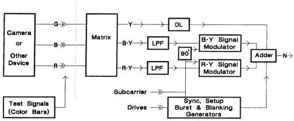

*Figure 9a – Block diagram of possible NTSC encoder using Y, B-Y, R-Y encoding.*

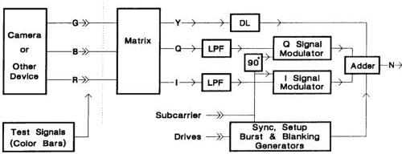

*Figure 9b – Block diagram of possible NTSC encoder using Y, I, Q encoding.*

# 15 Analog interfaces

## 15.1 Cable

For analog interconnection of equipment using this standard, the interface signal shall be carried on an unbalanced coaxial cable.

## 15.2 Impedances

The source impedance shall be 75 Ω resistive. The terminating impedance shall be 75 Ω resistive. The cable impedance shall be 75 Ω nominal.

## 15.3 Connector

The preferred connector shall be a 75 Ω BNC type which mates in a nondestructive manner with the 50 Ω connector specified in IEC 60169-8.

## 15.4 Signal levels

The peak-to-peak amplitude of the luminance plus sync, measured from sync tip to white level, shall be 1 V. Excursions of color subcarrier may exceed this value.

Clause 12 defines the amplitudes of the component parts of the signal and the permissible chroma excursions.

For signals crossing the interface, 140 IRE shall nominally equal 1 V. In dc-coupled systems, blanking level shall be nominally 0 V.

## Annex A (informative)

### Derivation of SMPTE NTSC equations

This standard reflects modern practice in the generation of NTSC signals and, in some respects, differs from the original NTSC specification published in 1953. This annex addresses the differences and explains the relationship of the modern version to the original specification. The principal differences are in the areas of precision, handling of setup, and equiband color encoding.

### A.1 Precision

The original definition of NTSC was based upon the luminance matrix of:

$$
Y = 0.587G + 0.114B + 0.299R \tag{1}
$$

and the corresponding expressions for B-Y and R-Y:

$$
B-Y = -0.587G + 0.886B - 0.299R \tag{2}
$$

$$
R-Y = -0.587G - 0.114B + 0.701R \tag{3}
$$

However, matrices of this precision were not generally realizable in the early 1950s, and most calculations were performed on slide rules. Accordingly, the NTSC specification was published using the lower precision version of the luminance matrix:

$$
Y = 0.59G + 0.11B + 0.30R
$$

Derived formulas were generally published to two-digit precision. The work underlying the published NTSC specification, however, was performed to a higher precision, and (with one small exception noted in A.3) this standard represents a recreation of the original work of the NTSC.

This standard specifies the full precision version of the luminance matrix. Consequently, to ensure consistent results, it is also necessary to recalculate other NTSC equations to an appropriately higher precision. Coefficients used in this standard are quoted to a precision sufficient to ensure accuracy when color bar values are calculated to a precision of 0.1 IRE.

### A.2 Setup

In 1953, it was normal practice for GBR component signals to be distributed with a setup of 7.5 IRE, and the original NTSC equations assumed this form of input signal to the encoder. Modern practice is for GBR component signals to be distributed without setup, and for setup to be added in the NTSC encoder. This standard assumes GBR signals without setup, and the equations are modified accordingly.

Both documents equate the GBR input signals to 100 IRE. For this standard, this represents 100 IRE between black and full amplitude for each component. In the original specification, this represented 7.5 IRE of setup plus a signal excursion of 92.5 IRE between black and full amplitude for each component. This standard, therefore, contains values for Y, B-Y, and R-Y which are greater than those derived in the original specification. This discrepancy is eliminated in the SMPTE encoding equations by multiplying the values of Y, B-Y, and R-Y by 0.925, and by adding 7.5 IRE setup to the luminance signal. Because the luminance matrix is linear, the SMPTE equations yield the same signal as the original 1953 equations.

For example, consider the case where the blue input is at maximum, and red and green are each at black level. For the 1953 equations:

$$
G = 7.5; B = 100; R = 7.5
$$

from (1), (2), and (3):

$$
\begin{array}{l}
Y = 0.587 (7.5) + 0.114 (100) + 0.299 (7.5) \\
= 0.114 (92.5) + (0.587 + 0.114 + 0.299) (7.5) \\
= 10.545 + 7.5 \\
= 18.045 \\
\end{array}
$$

$$
\begin{array}{l}
B-Y = -0.587 (7.5) + 0.886 (100) - 0.299 (7.5) \\
= 81.955 \\
\end{array}
$$

$$
\begin{array}{l}
R-Y = -0.587 (7.5) + 0.114 (100) + 0.701 (7.5) \\
= -10.545 \\
\end{array}
$$

For the SMPTE equations:

$$
G = 0; B = 100; R = 0
$$

$$
\begin{array}{l}
Y = 0.587 (0) + 0.114 (100) + 0.299 (0) \\
= 11.4 \\
\end{array}
$$

$$
0.925Y + 7.5 \text{ (setup)} = 10.545 + 7.5 = 18.045
$$

$$
\begin{array}{l}
B-Y = -0.587 (0) + 0.886 (100) - 0.299 (0) = 88.6 \\
0.925 (B-Y) = 81.955 \\
\end{array}
$$

$$
\begin{array}{l}
R-Y = -0.587 (0) - 0.114 (100) + 0.701 (0) = -11.4 \\
0.925 (R-Y) = -10.545 \\
\end{array}
$$

## A.3 Reduction of (B-Y) and (R-Y)

If the base values of B-Y and R-Y as calculated above were used to modulate the color subcarrier, the resulting composite signal would have subcarrier excursions from approximately $-66$ IRE to $+173$ IRE. This signal would not have been compatible with transmitters and receivers existing at the time. It was determined experimentally that subcarrier excursions of $33.3\%$ of the luminance signal excursion could be permitted above white and below black. This equated to a maximum positive excursion of $100 + (0.333 \times 92.5) = 130.8025$ IRE and a maximum negative excursion of $7.5 - (0.333 \times 92.5) = 23.3025$ IRE. This result was achieved by applying reduction factors to B-Y and R-Y. To the accuracy of the 1953 published equations, these factors resulted in maximum signal excursions for the yellow and cyan bars of a $75\%$ color bar signal being $100$ IRE, and this has become the established reference for aligning NTSC encoders. For the higher precision equations of this standard, this reference has been used in calculating the reduction coefficients.

The results are equivalent for calculations to an accuracy of 0.1 IRE: SMPTE equations give a maximum signal amplitude of 130.8333 IRE for $100\%$ bars in place of the original 130.8025 IRE.

(It should be noted that there is an apparent error in the 1953 calculations of these reduction factors. Although the calculations were performed to a high degree of precision, a luminance matrix coefficient of 0.115 was used for blue instead of the correct 0.114. This resulted in values of 0.493 and 0.877 for B-Y and R-Y, respectively. These were normally approximated to 1/2.03 and 1/1.14, respectively. The error was not significant in the equations published to an accuracy of two significant figures, but it is significant for the higher precision equations used in this standard. The values quoted below and used in this standard are derived from the correct luminance matrix.) (Lower case is used to distinguish the reduced values:

$$
b-y = 0.492111\dots(B-Y); \tag{4}
$$

$$
r-y = 0.877283\dots(R-Y).) \tag{5}
$$

## A.4 Equiband encoding

This standard reflects the modern practice of modulating the color subcarrier with equal bandwidth b-y and r-y signals. In the original NTSC specification, two different bandwidths were used for the signals modulating the subcarrier. The b-y and r-y signals may be considered as orthogonal components of a vector. To achieve the desired axes for nonequiband encoding, an alternative set of orthogonal components of the same vector are calculated; these components are rotated $33^{\circ}$ counterclockwise with respect to b-y and r-y, and are known as I and Q. I and Q are defined in terms of the reduced b-y and r-y as:

$$
I = - (b - y) \sin 33^{\circ} + (r - y) \cos 33^{\circ}
$$

$$
Q = (b - y) \cos 33^{\circ} + (r - y) \sin 33^{\circ}
$$

or, in terms of the unreduced values B-Y and R-Y, as:

$$
I = - 0.26802288 \dots (B - Y) + 0.73575162 \dots (R - Y) \tag{6}
$$

$$
Q = 0.41271905 \dots (B - Y) + 0.47780269 \dots (R - Y) \tag{7}
$$

or, in terms of GBR, as:

$$
I = - 0.274557 \dots G - 0.321344 \dots B + 0.595901 \dots R \tag{8}
$$

$$
Q = - 0.522736 \dots G + 0.311200 \dots B + 0.211537 \dots R \tag{9}
$$

## A.5 Composite signal

If equiband encoding is employed, the composite signal may be derived from either B-Y and R-Y, or from I and Q. If nonequiband encoding is employed, the composite signal must be derived from I and Q; however, the B-Y and R-Y equations are valid for low chroma frequencies.

As discussed above, these equations assume GBR inputs of 100 IRE without setup.

$$
N = 0.925(Y) + 7.5 + 0.925(b - y) \sin(2\pi f_{sc}t) + 0.925(r - y) \cos(2\pi f_{sc}t) \tag{10}
$$

or:

$$
N = 0.925(Y) + 7.5 + 0.455203 \dots (B - Y) \sin(2\pi f_{sc}t) + 0.811487 \dots (R - Y) \cos(2\pi f_{sc}t) \tag{11}
$$

or:

$$
N = 0.925(Y) + 7.5 + 0.925(Q) \sin(2\pi f_{sc}t + 33^{\circ}) + 0.925(I) \cos(2\pi f_{sc}t + 33^{\circ}) \tag{12}
$$

## A.6 Color bar signals

The color bar values resulting from the SMPTE NTSC equations are shown in tables A.1 – A.4. Values are shown for $100\%$ and $75\%$ bars, and are shown to four-decimal place accuracy, and rounded to one decimal place.

Table A.1 – 100/7.5/100/7.5r bars (calculated to $10^{-4}$ IRE)

|  Bar | Luminance (IRE) | Chroma level (IRE) | Minimum chroma excursion (IRE) | Maximum chroma excursion (IRE) | Phase (degrees)  |
| --- | --- | --- | --- | --- | --- |
|  White | 100.0000 | 0.0000 |  |  |   |
|  Yellow | 89.4550 | 82.7567 | 48.0767 | 130.8333 | 167.0812  |
|  Cyan | 72.3425 | 116.9817 | 13.8517 | 130.8333 | 283.4558  |
|  Green | 61.7972 | 109.2338 | 7.1806 | 116.4144 | 240.7098  |
|  Magenta | 45.7025 | 109.2338 | -8.9144 | 100.3194 | 60.7098  |
|  Red | 35.1575 | 116.9817 | -23.3333 | 93.6483 | 103.4558  |
|  Blue | 18.0450 | 82.7567 | -23.3333 | 59.4233 | 347.0812  |
|  Black | 7.5000 | 0.0000 |  |  |   |

Table A.2 – 100/7.5/100/7.5 color bars (calculated to 10⁻¹ IRE)

|  Bar | Luminance (IRE) | Chroma level (IRE) | Minimum chroma excursion (IRE) | Maximum chroma excursion (IRE) | Phase (degrees)  |
| --- | --- | --- | --- | --- | --- |
|  White | 100.0 | 0.0 |  |  |   |
|  Yellow | 89.5 | 82.8 | 48.1 | 130.8 | 167.1  |
|  Cyan | 72.3 | 117.0 | 13.9 | 130.8 | 283.5  |
|  Green | 61.8 | 109.2 | 7.2 | 116.4 | 240.7  |
|  Magenta | 45.7 | 109.2 | – 8.9 | 100.3 | 60.7  |
|  Red | 35.2 | 117.0 | –23.3 | 93.6 | 103.5  |
|  Blue | 18.0 | 82.8 | –23.3 | 59.4 | 347.1  |
|  Black | 7.5 | 0.0 |  |  |   |

Table 3 – 75/7.5/75/7.5 color bars (calculated to 10⁻⁴ IRE)

|  Bar | Luminance (IRE) | Chroma level (IRE) | Minimum chroma excursion (IRE) | Maximum chroma excursion (IRE) | Phase (degrees)  |
| --- | --- | --- | --- | --- | --- |
|  White | 76.8750 | 0.0000 |  |  |   |
|  Yellow | 68.9663 | 62.0675 | 37.9325 | 100.0000 | 167.0812  |
|  Cyan | 56.1319 | 87.7363 | 12.2638 | 100.0000 | 283.4558  |
|  Green | 48.2231 | 81.9253 | 7.2605 | 89.1858 | 240.7098  |
|  Magenta | 36.1519 | 81.9253 | – 4.8108 | 77.1145 | 60.7098  |
|  Red | 28.2431 | 87.7363 | –15.6250 | 72.1113 | 103.4558  |
|  Blue | 15.4088 | 62.0675 | –15.6250 | 46.4425 | 347.0812  |
|  Black | 7.5000 | 0.0000 |  |  |   |

Table A.4 – 75/7.5/75/7.5 color bars (calculated to 10⁻¹ IRE)

|  Bar | Luminance (IRE) | Chroma level (IRE) | Minimum chroma excursion (IRE) | Maximum chroma excursion (IRE) | Phase (degrees)  |
| --- | --- | --- | --- | --- | --- |
|  White | 76.9 | 0.0 |  |  |   |
|  Yellow | 69.0 | 62.1 | 37.9 | 100.0 | 167.1  |
|  Cyan | 56.1 | 87.7 | 12.3 | 100.0 | 283.5  |
|  Green | 48.2 | 81.9 | 7.3 | 89.2 | 240.7  |
|  Magenta | 36.2 | 81.9 | – 4.8 | 77.1 | 60.7  |
|  Red | 28.2 | 87.7 | –15.6 | 72.1 | 103.5  |
|  Blue | 15.4 | 62.1 | –15.6 | 46.4 | 347.1  |
|  Black | 7.5 | 0.0 |  |  |   |

# Annex B (informative)

## IRE units

IRE units are a linear scale for measuring the relative amplitudes of the components of a television signal with the zero reference at blanking level.

The IRE scale is marked from +120 to -50. The reference white level corresponds to (plus) 100 units. Minus 40 IRE units corresponds to the level of the synchronizing pulses in the composite video signal (see figure B.1).

Since IRE units comprise a relative scale (they do not have a fixed voltage value), an oscilloscope may be calibrated to each particular video signal application. Nevertheless, important information can be communicated about the video signal levels.

Composite video systems are normally operated with 140 IRE units = 1.0 V p-p, while component video systems are normally operated with 100 IRE units = 0.7 V p-p.

Information on IRE units may be found in the Code of Federal Regulations 47 CFR 73.681.

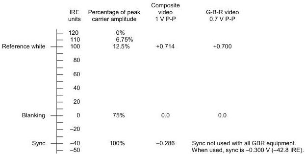

*Figure B.1 – IRE scale. Carrier amplitude is of the transmitter radio frequency carrier.*

# Annex C (informative)

## Synchronizing signal timing

Figure C.1 represents the frequency relationship of the synchronizing signals and the phase relationship of the burst and the color-difference (sub)carriers. It is not meant to represent actual equipment.

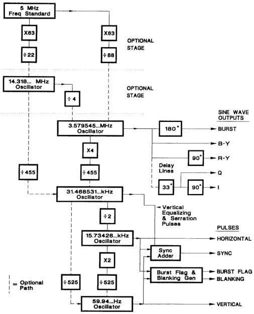

*Figure C.1 – Frequency and phase relationships. The sine wave carrier delay lines are normally part of the encoder.*

Annex D (informative)

Bibliography

Code of Federal Regulations 47 CFR 73.681 (Title 47, Part 73, Section 681), IRE Standard Scale

NTSC 1941, Transmission Standards for Commercial Television Broadcasting

NTSC 1953, Recommendation for Transmission Standards for Color Television

SMPTE EG 1-1990, Alignment Color Bar Test Signal for Television Picture Monitors

SMPTE EG 27-2004, Supplemental Information for SMPTE 170M and Background on the Development of NTSC Color Standards
