# 1 Scope

1.1 This standard describes a bit-parallel composite video digital interface for systems operating according to the 525-line, 59.94-Hz NTSC standard, as described by SMPTE 170M, sampled at four times color subcarrier frequency. Sampling parameters for the digital representation of encoded video signals, the relationship between sampling phase and color subcarrier, and the digital levels of the video signal are defined.

1.2 This standard has application for use with shielded twisted 12-pair cable of conventional design over distances up to 50 m, without transmission equalization or any special equalization of the receiver. Longer cable lengths may be used, but with rapidly increasing requirement for care in the cable selection and possible receiver equalization or the use of active repeaters or both.

1.3 Digital composite video signals, as defined by this standard, are the signals conveyed by the composite implementation of the serial digital interface. It should be noted that additional information to that described by this standard is also carried by the serial digital interface.

The serial digital interface is the preferred method for the interconnection of composite digital equipments when cable lengths exceed 50 m.

# 2 Normative references

The following standards contain provisions which, through reference in this text, constitute provisions of this standard. At the time of publication, the editions indicated were valid. All standards are subject to revision, and parties to agreements based on this standard are encouraged to investigate the possibility of applying the most recent edition of the standards indicated below.

SMPTE 170M-1999, Television — Composite Analog Video Signal — NTSC for Studio Applications
ISO 2110:1989, Information Technology — Data Communication — 25-Pole DTE/DCE Interface Connector and Contact Number Assignments
ITU-R BT.471-1 (07/86), Nomenclature and Description of Colour Bar Signals

# 3 General specifications

3.1 The analog signal shall be sampled at a rate of four times the color subcarrier frequency along the I and Q axes. The phase reference for the sample clock shall be color subcarrier (fsc). Many systems will derive this phase reference from the burst of the analog signal.

3.2 Color subcarrier phase to horizontal sync timing (SC/H) in the digital domain shall be zero.

3.3 The quantization scale shall be uniformly quantized PCM at 10 bits per sample. Eight bits per sample video data may be carried across the interface by using the eight most significant bits and setting the two least significant bits to zero.

3.4 The bits of the digital words that describe the video signal are transmitted in a parallel arrangement using 10 conductor pairs. An eleventh conductor pair carries a clock signal at $4f_{\mathrm{SC}}$ (14.31818 MHz).

3.5 The interface consists of one transmitter and one receiver in a point-to-point connection.

## 4 Sampling structure and quantization specifications

### 4.1 Sampling structure

Figure 1 depicts the line and field structure of the NTSC signal during the vertical blanking interval. Burst locked sinewave, shown in figure 1, is defined as a continuous sinewave at subcarrier frequency, with the same phase as burst.

4.1.1 There are 910 samples in a horizontal line period; 768 samples constitute the digital active video portion of each line. The remaining 142 samples comprise the digital horizontal blanking interval.

Each of the four samples during a color subcarrier period is described by the chrominance signal axis that it falls on. Figure 2 shows the derivation of the sample sequence.

Figure 3 depicts the sample numbering for a nominal NTSC signal. The half-amplitude point of the leading (falling) edge of the analog horizontal sync signal falls between samples 784 and 785.

The first of the 910 samples represents the first sample of the digital active line and is designated sample 0 for the purpose of reference. The 910 samples per line are, therefore, numbered 0 through 909. Samples 0 through 767 inclusive contain the digital active line video data.

4.1.2 The sample at sample 0, line 10, field 1, color frame A is an I axis $(\div 123^{\circ})$ sample. (See figure 4.)

### 4.2 Quantization specifications

4.2.1 The digital video signal shall be quantized according to table 1.

Table 1 – Signal quantization

|   | 8-bit system | 10-bit system  |
| --- | --- | --- |
|  White level | C8h | 320h  |
|  Blanking level | 3Ch | 0F0h  |
|  Sync tip level | 04h | 010h  |
|  NOTE – The “h” suffix indicates a hexadecimal value  |   |   |

4.2.2 The amplitude relationship between the digital signal and an equivalent analog signal is shown in figure 5. The signal illustrated is a representation of $100\%$ level, $7.5\%$ setup (100/7.5/100/7.5) color bars.

4.2.3 The characteristics of the data word are based on the assumption that the location of any required (sin x)/x correction is at the point where the digital signal is converted to an analog form.

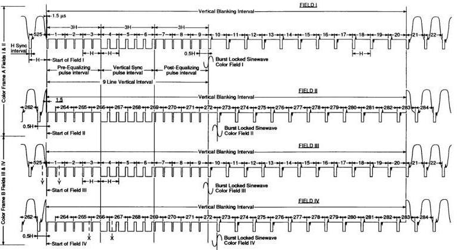

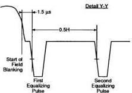

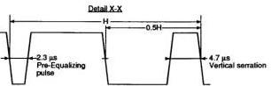

*Figure 1 – Vertical blanking interval structure.*

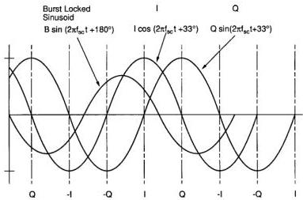

*Figure 2 – Derivation of sample sequence.*

NOTE - The equation for the chrominance signal is  $E = I \cos (2\pi f_{\mathrm{SC}} t + 33^{\circ}) + Q \sin (2\pi f_{\mathrm{SC}} t + 33^{\circ})$ . The equation for the burst locked sinusoid is  $E = B \sin (2\pi f_{\mathrm{SC}} t + 180^{\circ})$ .

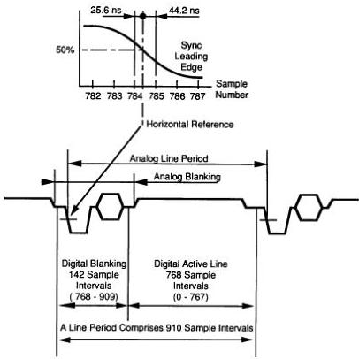

*Figure 3 – Sample numbering for horizontal line period of nominal NTSC signal.*

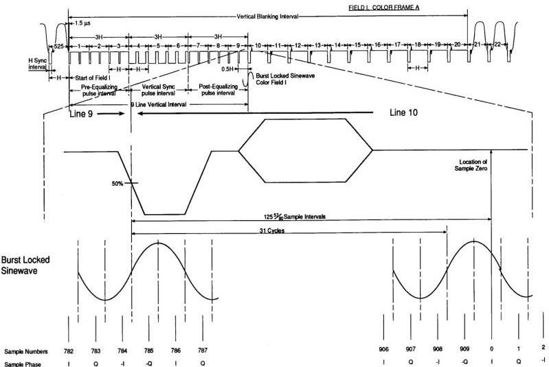

*Figure 4 – Derivation of the sample zero sampling phase for line 10, field I, color frame A.*

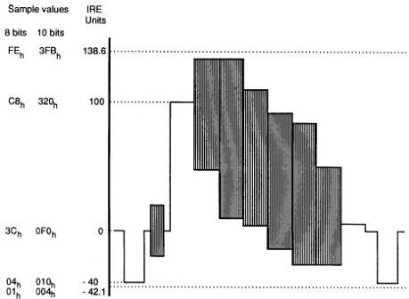

*Figure 5 – Relationship between analog signal levels (IRE units) and digital sample values.*

## 4.2.4 Data is represented in 8- or 10-bit words.

In an 8-bit system, 254 of the 256 levels (01 through FE) are used to express a quantized value. In a 10-bit system, 1016 of the 1024 levels (004 through 3FB) are used to express a quantized value.

In an 8-bit system, levels 00 and FF are protected and are not permitted in the data stream. In a 10-bit system, levels 000, 001, 002, 003 and 3FC, 3FD, 3FE, and 3FF are protected and are not permitted in the data stream.

The protected and permitted data levels are shown in table 2.

Table 2 – Permitted and protected values

|  8 bits |  | 10 bits  |
| --- | --- | --- |
|   |  | 000  |
|   |  | 001  |
|  00 | Protected | 002  |
|   |  | 003  |
|  |   |   |
|  01 |  | 004  |
|  — | Permitted | —  |
|  FE |  | 3FB  |
|   |  | 3FC  |
|  FF | Protected | 3FD  |
|   |  | 3FE  |
|   |  | 3FF  |

4.2.5 Some models of composite digital video equipment allow the use of protected values in the video data. Designers of new equipment should consider the effects of such signals when detecting synchronizing patterns.

## 4.3 Coding parameters

Sampling and quantization parameters are summarized in table 3.

Table 3 – Summary of coding parameters

|  Input signal | NTSC  |   |
| --- | --- | --- |
|  Number of samples/line period | 910  |   |
|  Sampling structure | Orthogonal  |   |
|  Sampling frequency | 4f_{SC}  |   |
|  Sampling phase | I and Q axes (+123° and +33°)  |   |
|  Form of coding | Uniformly quantized PCM, 8 or 10 bits per sample  |   |
|  Quantization scale | 8-bit system | 10-bit system  |
|  White level | C8 | 320  |
|  Blanking level | 3C | 0F0  |
|  Sync tip level | 04 | 010  |

## 5 Digital raster structure

Figure 6 depicts the digital raster structure and its relationship to the analog raster structure.

### 5.1 Digital active field

The digital active field duration exceeds that of the analog active field. The digital active field period is positioned to begin before and end after the analog video. Thus, the vertical blanking edges of the analog video are contained within the digital active picture space.

### 5.2 Digital active line

The digital active line duration exceeds that of the analog active line. The digital active line is positioned to begin before and end after analog video. Thus, the blanking edges of the analog video are contained within the digital active line period.

### 5.3 Analog blanking for digitally generated NTSC

When NTSC signals are digitally generated, blanking edges and rise times appropriate for the analog waveform must be included as an integral part of the digital signal. The edges and timings shall be in accordance with those defined in SMPTE 170M.

### 5.4 Digital vertical blanking interval

5.4.1 The digital vertical blanking interval extends from line 525, sample 768 to line 9, sample 767 inclusive, for fields I and III and from line 263, sample 313 to line 272, sample 767 inclusive, for fields II and IV.

5.4.2 Digital data within the digital vertical blanking interval shall consist of a digital representation of an analog vertical interval. A 10-bit representation of the signal is preferred, although 8-bit values can be used. Suggested values are shown in table 4.

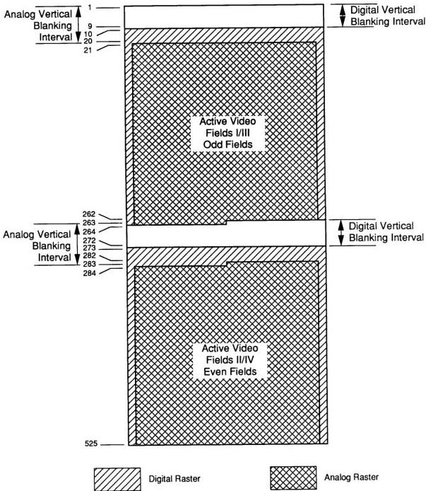

*Figure 6 – Relationship between the analog and digital rasters.*

Table 4 – 10- and 8-bit hexadecimal values for the digital vertical blanking interval

Equalizing pulse interval values

| Fields I / III sample values |  |  | Fields II / IV sample values |  |  |
| --- | --- | --- | --- | --- | --- |
| Word | 10 bit | 8 bit | Word | 10 bit | 8 bit |
| 768–782 | 0F0 | 3C | 313–327 | 0F0 | 3C |
| 783 | 0E9 | 3A | 328 | 0E9 | 3A |
| 784 | 0A4 | 29 | 329 | 0A4 | 29 |
| 785 | 044 | 11 | 330 | 044 | 11 |
| 786 | 011 | 04 | 331 | 011 | 04 |
| 787–815 | 010 | 04 | 332–360 | 010 | 04 |
| 816 | 017 | 06 | 361 | 017 | 06 |
| 817 | 05C | 17 | 362 | 05C | 17 |
| 818 | 0BC | 2F | 363 | 0BC | 2F |
| 819 | 0EF | 3C | 364 | 0EF | 3C |
| 820–327 | 0F0 | 3C | 365–782 | 0F0 | 3C |
| 328 | 0E9 | 3A | 783 | 0E9 | 3A |
| 329 | 0A4 | 29 | 784 | 0A4 | 29 |
| 330 | 044 | 11 | 785 | 044 | 11 |
| 331 | 011 | 04 | 786 | 011 | 04 |
| 332–360 | 010 | 04 | 787–815 | 010 | 04 |
| 361 | 017 | 06 | 816 | 017 | 06 |
| 362 | 05C | 17 | 817 | 05C | 17 |
| 363 | 0BC | 2F | 818 | 0BC | 2F |
| 364 | 0EF | 3C | 819 | 0EF | 3C |
| 365–782 | 0F0 | 3C | 820–327 | 0F0 | 3C |

Vertical serration values

| Fields I / III sample values |  |  | Fields II / IV sample values |  |  |
| --- | --- | --- | --- | --- | --- |
| Word | 10 bit | 8 bit | Word | 10 bit | 8 bit |
| 782 | 0F0 | 3C | 327 | 0F0 | 3C |
| 783 | 0E9 | 3A | 328 | 0E9 | 3A |
| 784 | 0A4 | 29 | 329 | 0A4 | 29 |
| 785 | 044 | 11 | 330 | 044 | 11 |
| 786 | 011 | 04 | 331 | 011 | 04 |
| 787–260 | 010 | 04 | 332–715 | 010 | 04 |
| 261 | 017 | 06 | 716 | 017 | 06 |
| 262 | 05C | 17 | 717 | 05C | 17 |
| 263 | 0BC | 2F | 718 | 0BC | 2F |
| 264 | 0EF | 3C | 719 | 0EF | 3C |
| 265–327 | 0F0 | 3C | 720–782 | 0F0 | 3C |
| 328 | 0E9 | 3A | 783 | 0E9 | 3A |
| 329 | 0A4 | 29 | 784 | 0A4 | 29 |
| 330 | 044 | 11 | 785 | 044 | 11 |
| 331 | 011 | 04 | 786 | 011 | 04 |
| 332–715 | 010 | 04 | 787–260 | 010 | 04 |
| 716 | 017 | 06 | 261 | 017 | 06 |
| 717 | 05C | 17 | 262 | 05C | 17 |
| 718 | 0BC | 2F | 263 | 0BC | 2F |
| 719 | 0EF | 3C | 264 | 0EF | 3C |
| 720–782 | 0F0 | 3C | 265–327 | 0F0 | 3C |

5.4.3 The location and magnitude of the samples during the digital vertical blanking intervals are shown in figure 7a and figure 7b.

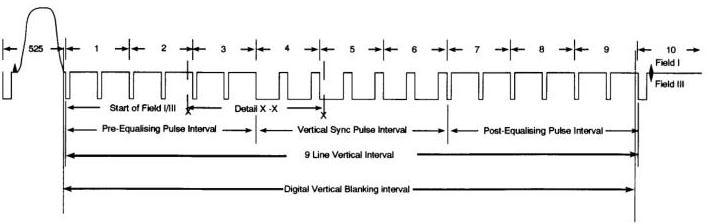

*Fields I / III.*

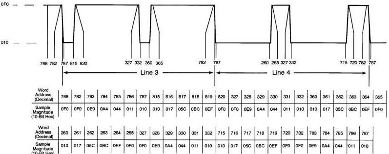

*Figure 7a – Location and magnitude of 10-bit samples during digital vertical blanking interval of fields I and III. Detail X-X.*

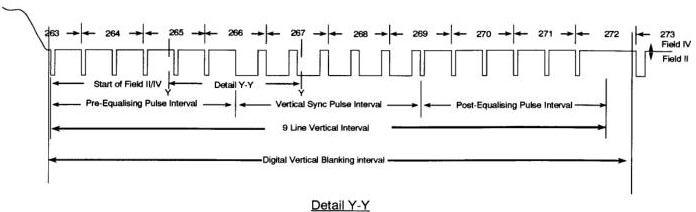

*Fields II/IV.*

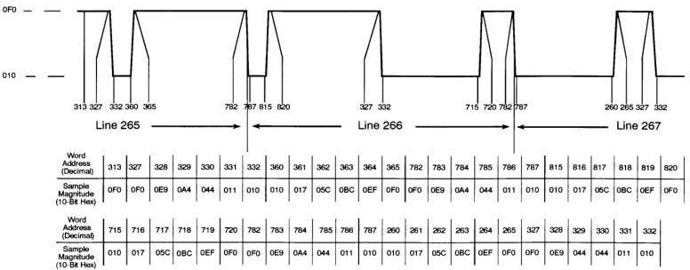

*Figure 7b – Location and magnitude of 10-bit samples during digital vertical blanking interval of fields II and IV.*

5.4.4 Some models of digital composite video equipment may use values for the samples in the digital vertical blanking interval that differ from those listed in table 4. However, the range of values must conform to the tolerances laid down for the analog signal by SMPTE 170M. Designers of receivers for this interface should consider the effects of such changes when implementing detection circuits.

# 5.5 Digital horizontal blanking interval

5.5.1 The digital horizontal blanking interval extends from sample 768 to sample 909 inclusive, on all lines outside the digital vertical blanking interval.

5.5.2 Digital data within the digital horizontal blanking interval shall consist of a digital representation of an analog horizontal blanking interval, with a burst of 0 SC/H phase. A 10-bit representation is preferred. Where 8-bit values are used, the sample values are selected to maximize the accuracy of representation of the burst. Suggested values are shown in table 5.

Table 5 – 10- and 8-bit hexadecimal values for the digital horizontal blanking interval

|  Word | 10-bit sample values |   | 8-bit sample values |   | Word | 10-bit sample values |   | 8-bit sample values  |   |
| --- | --- | --- | --- | --- | --- | --- | --- | --- | --- |
|   |  0° | 180° | 0° | 180° |   | 0° | 180° | 0° | 180°  |
|  768–782 | 0F0 | 0F0 | 3C | 3C | 874 | 12D | 0B3 | 4B | 2D  |
|  783 | 0E9 | 0E9 | 3A | 3A | 875 | 092 | 14E | 25 | 53  |
|  784 | 0A4 | 0A4 | 29 | 29 | 876 | 0B3 | 12D | 2D | 4B  |
|  785 | 044 | 044 | 11 | 11 | 877 | 14E | 092 | 53 | 25  |
|  876 | 011 | 011 | 4 | 4 | 878 | 12D | 0B3 | 4B | 2D  |
|  787–849 | 010 | 010 | 4 | 4 | 879 | 092 | 14E | 25 | 53  |
|  850 | 017 | 017 | 6 | 6 | 880 | 0B3 | 12D | 2D | 4B  |
|  851 | 05C | 05C | 17 | 17 | 881 | 14E | 092 | 53 | 25  |
|  852 | 0BC | 0BC | 2F | 2F | 882 | 12D | 0B3 | 4B | 2D  |
|  853 | 0EF | 0EF | 3C | 3C | 883 | 092 | 14E | 25 | 53  |
|  854–856 | 0F0 | 0F0 | 3C | 3C | 884 | 0B3 | 12D | 2D | 4B  |
|  857 | 0F0 | 0F0 | 3C | 3C | 885 | 14E | 092 | 53 | 25  |
|  858 | 0F4 | 0EC | 3D | 3B | 886 | 12D | 0B3 | 4B | 2D  |
|  859 | 0DC | 104 | 37 | 41 | 887 | 092 | 14E | 25 | 53  |
|  860 | 0D6 | 10A | 36 | 42 | 888 | 0B3 | 12D | 2D | 4B  |
|  861 | 12C | 0B4 | 4B | 2D | 889 | 14E | 092 | 53 | 25  |
|  862 | 123 | 0BD | 49 | 2F | 890 | 12D | 0B3 | 4B | 2D  |
|  863 | 096 | 14A | 25 | 53 | 891 | 092 | 14E | 25 | 53  |
|  864 | 0B3 | 12D | 2D | 4B | 892 | 0B3 | 12D | 2D | 4B  |
|  865 | 14E | 092 | 53 | 25 | 893 | 14E | 092 | 53 | 25  |
|  866 | 12D | 0B3 | 4B | 2D | 894 | 129 | 0B7 | 4A | 2E  |
|  867 | 092 | 14E | 25 | 53 | 895 | 0A6 | 13A | 2A | 4E  |
|  868 | 0B3 | 12D | 2D | 4B | 896 | 0CD | 113 | 33 | 45  |
|  869 | 14E | 092 | 53 | 25 | 897 | 112 | 0CE | 44 | 34  |
|  870 | 12D | 0B3 | 4B | 2D | 898 | 0FA | 0E6 | 3F | 39  |
|  871 | 092 | 14E | 25 | 53 | 899 | 0EC | 0F4 | 3B | 3D  |
|  872 | 0B3 | 12D | 2D | 4B | 900–909 | 0F0 | 0F0 | 3C | 3C  |
|  873 | 14E | 092 | 53 | 25 |  |  |  |  |   |

5.5.3 The location and magnitude of the samples during the digital horizontal blanking region are shown in figure 8.

5.5.4 Some models of digital composite video equipment may use values for the samples in the digital horizontal blanking interval that differ from those listed in table 5. However, the range of values must conform to the tolerances laid down for the analog signal by SMPTE 170M and by this standard in respect of 0 SC/H phase. Designers of receivers for this interface should consider the effects of such changes when implementing detection circuits.

NOTE – There are two sets of values listed in the table for both the 10-bit and 8-bit sample values. The first value is designated as being 0° and represents the sample values that are used when the phase of the burst is positive. The second value is designated as being 180° and represents the sample values that are used when the phase of the burst is negative.

# 6 Electrical characteristics

## 6.1 Signal conventions

6.1.1 The signals shall be transmitted via balanced signal pairs. Although the use of ECL technology is not mandated, the line driver and receiver shall be ECL compatible to permit the use of standard ECL parts for either or both ends. In this standard, "standard ECL" refers to the 10,000 series of ECL logic.

6.1.2 The signalling sense of the voltage appearing across the interconnection cable is positive binary and defined as follows: The DATA terminal of the generator shall be positive (+) with respect to the RETURN terminal for a binary 1 (HIGH or H or ON) state. The DATA terminal of the generator shall be negative (−) with respect to the RETURN terminal for a binary 0 (LOW or L or OFF) state. (See figure 9.)

6.1.3 The data lines are designated DATA 0 through DATA 9. DATA 9 is the most significant bit.

## 6.2 Transmitter characteristics

6.2.1 The transmitter shall have a balanced output with a maximum impedance of 110 ohms.

6.2.2 The common mode voltage of the line driver shall be −1.3 V ± 15% with reference to the ground terminals.

6.2.3 The generated signal shall lie between 0.8 V and 2.0 V peak-to-peak, measured across a 110-ohm resistor connected to the output terminals without any transmission line.

6.2.4 Rise and fall times shall be no longer than 5 ns and differ by not more than 2 ns, as measured between the 20% and 80% amplitude points, across a 110-ohm resistor connected to the output terminals without any transmission line.

## 6.3 Receiver characteristics

6.3.1 The cable shall be terminated by 110 ohms ± 10 ohms.

6.3.2 The line receiver must properly sense the binary data when connected directly to a line driver operating at the extreme voltage limits permitted by 6.2.3.

6.3.3 The receiver shall require a differential input voltage of no more than 185 mV to correctly attain the intended binary state.

6.3.4 The receiver shall operate correctly in the presence of common mode noise having a maximum amplitude of ± 0.5 V.

6.3.5 The receiver shall operate with a different delay between the received clock and any received data signals of up to 15 ns.

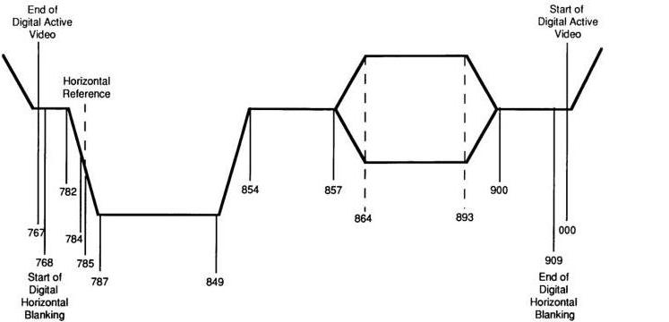

*Figure 8 – Location and magnitude of 10-bit samples during digital horizontal blanking interval.*

|  Word No. | 768 | 782 | 783 | 784 | 785 | 786 | 787 | 849 | 850 | 851 | 852 | 853 | 854 | 857 | 858 | 859 | 860 | 861 | 862 | 863 | 864 | 865 | 866 | 867 | 868 | 869 | 870 | 871 | 872  |
| --- | --- | --- | --- | --- | --- | --- | --- | --- | --- | --- | --- | --- | --- | --- | --- | --- | --- | --- | --- | --- | --- | --- | --- | --- | --- | --- | --- | --- | --- |
|  Burst Phase | 0° | 0F0 | 0F0 | 0E9 | 0A4 | 044 | 011 | 010 | 010 | 017 | 05C | 0BC | 0EF | 0F0 | 0F0 | 0F4 | 0DC | 0D6 | 12C | 123 | 096 | 0B3 | 14E | 12D | 092 | 0B3 | 14E | 12D | 092  |
|   |  180° | 0F0 | 0F0 | 0E9 | 0A4 | 044 | 011 | 010 | 010 | 017 | 05C | 0BC | 0EF | 0F0 | 0F0 | 0EC | 104 | 10A | 0B4 | 0BD | 14A | 12D | 092 | 0B3 | 14E | 12D | 092 | 0B3 | 14E  |
|  Word No. | 873 | 874 | 875 | 876 | 877 | 878 | 879 | 880 | 881 | 882 | 883 | 884 | 885 | 886 | 887 | 888 | 889 | 890 | 891 | 892 | 893 | 894 | 895 | 896 | 897 | 898 | 899 | 900 | 909  |
|  Burst Phase | 0° | 14E | 12D | 092 | 0B3 | 14E | 12D | 092 | 0B3 | 14E | 12D | 092 | 0B3 | 14E | 12D | 092 | 0B3 | 14E | 12D | 092 | 0B3 | 14E | 129 | 0A6 | 0CD | 112 | 0FA | 0EC | 0F0  |
|   |  180° | 092 | 0B3 | 14E | 12D | 092 | 0B3 | 14E | 12D | 092 | 0B3 | 14E | 12D | 092 | 0B3 | 14E | 12D | 092 | 0B3 | 14E | 12D | 092 | 0B7 | 13A | 113 | 0CE | 0E6 | 0F4 | 0F0  |

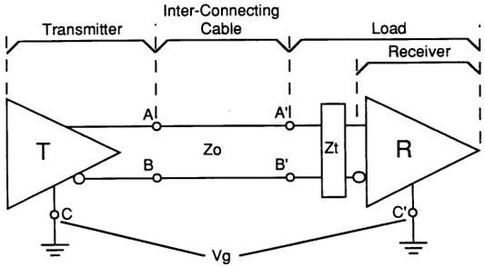

*Figure 9 – Balanced interface circuit.*

A, A' = Data line
B, B' = Return line
Zt = Cable termination
A, B = Transmitter interface points
A', B' = Load interface points
C = Transmitter circuit ground
C' = Load circuit ground
Vg = Ground potential difference
Zo = Cable characteristic impedance

## 6.4 Clock signal

6.4.1 The clock signal is a $4f_{\mathrm{sc}}$ square wave as shown in figure 10. The clock pulse width (Tw) is $35~\mathrm{ns} \pm 5~\mathrm{ns}$.

6.4.2 The peak-to-peak jitter between rising edges of the clock shall be within 5 ns of the average time of the rising edge computed over at least one television field.

NOTE – This jitter specification, while appropriate for an effective parallel interface, is not suitable for clocking digital-to-analog conversion or parallel-to-serial conversion.

6.4.3 The positive transition of the clock signal nominally occurs between the data transitions.

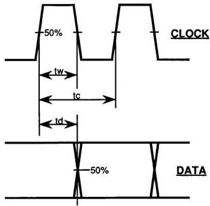

*Figure 10 – Digital interface clock waveform.*

tw = 35 ns ± 5 ns
tc = 1/4fsc (approximately 69.8 ns)
td = 35 ns ± 5 ns

## 7 Mechanical characteristics

### 7.1 General

This clause defines the mechanical specifications for the interface of digital video systems used in environments where the physical distance between the devices is limited and the general physical environment can be termed interior.

The majority of applications of this interface involve cable lengths of less than 50 m. For these lengths, cables with reasonable uniformity between pairs will, generally, give satisfactory results. For cable lengths greater than 50 m, cable specifications and termination characteristics become more critical and it is likely that equalization will be required.

### 7.2 Interconnecting cable

7.2.1 The interface is designed to operate with a nominal signal-pair impedance of 110 ohms.

7.2.2 The cable shall contain 12 pairs of conductors of which 11 pairs shall be used as signal lines. The remaining pair shall be used as system ground.

7.2.3 It is recommended that the cable be constructed to minimize the effects of crosstalk between signal lines, the susceptibility of the signal lines to external noise, and the transmission of interface signals to the external environment.

7.2.4 The cable shall have an outer shield, to minimize radiation, carried through the cable assembly. This shield shall be terminated via the chassis ground pin and the connector body at each end.

7.2.5 The cable shall be constructed to minimize the differential time delay between any two of the conductor pairs.

## 7.3 Connectors

7.3.1 The connectors shall have the mechanical characteristics conforming to the industry standard 25-pin subminiature type D, as described below. Additional information may be found in ISO 2110. (This interface will require that the connectors be inserted many times. ECL voltage and current levels are relatively low. Thus, the materials in the connector should be appropriate to the application.)

7.3.2 Cable connectors employ pin contacts and equipment connectors employ socket contacts (see figure 11).

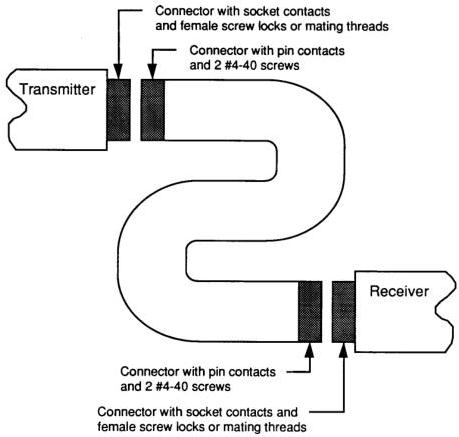

*Figure 11 – Cable connector configuration.*

7.3.3 Cable connectors shall be provided with No. 4-40 mounting screws and equipment connectors shall be provided with female screw locks or mating threads. For further information, see annex A.

7.4 Connector contact assignments shall be in accord with table 6.

Table 6 – Connector contact assignments
|  Contact | Signal line | Contact | Signal line  |
| --- | --- | --- | --- |
|  1 | CLOCK | 14 | CLOCK RETURN  |
|  2 | SYSTEM GROUND | 15 | SYSTEM GROUND  |
|  3 | DATA 9 (MSB) | 16 | DATA 9 RETURN  |
|  4 | DATA 8 | 17 | DATA 8 RETURN  |
|  5 | DATA 7 | 18 | DATA 7 RETURN  |
|  6 | DATA 6 | 19 | DATA 6 RETURN  |
|  7 | DATA 5 | 20 | DATA 5 RETURN  |
|  8 | DATA 4 | 21 | DATA 4 RETURN  |
|  9 | DATA 3 | 22 | DATA 3 RETURN  |
|  10 | DATA 2 | 23 | DATA 2 RETURN  |
|  11 | DATA 1 | 24 | DATA 1 RETURN  |
|  12 | DATA 0 (LSB) | 25 | DATA 0 RETURN  |
|  13 | CABLE SHIELD |  |   |

Annex A (informative)
Additional data

A.1 Connector characteristics

The interface employs a 25-pin subminiature type D connector with the connectors on the transmitter and receiver using socket contacts and the connectors on both ends of the cable using pin contacts.

Connectors are locked together by two No. 4-40 screws on the cable connectors, which mate with female screw locks mounted on the equipment connectors. Detailed dimensions are given in ISO 2110.

The relative position of the connector and the female screw lock are defined in figure A.1. The recommended minimum connector spacing is defined in figure A.2. It is recommended that the cable connectors employ a conductive backshell to maintain the shielding of the signal conductors. Care should be taken to select designs that are appropriate for use with the screw latching specified.

A.2 Cable shield pin

The cable shield (pin 13) is for the purpose of controlling electromagnetic radiation from the cable. It is recommended that pin 13 provide high-frequency continuity to the chassis ground at both ends and, in addition, provide DC continuity to the chassis ground at the transmit end.

A.3 Connector orientation

For either vertical or horizontal mounting, contact 1 should be uppermost.

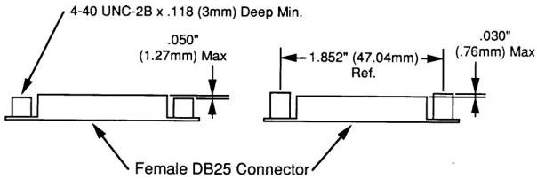

*Figure A.1 – Female screw lock mounting detail.*

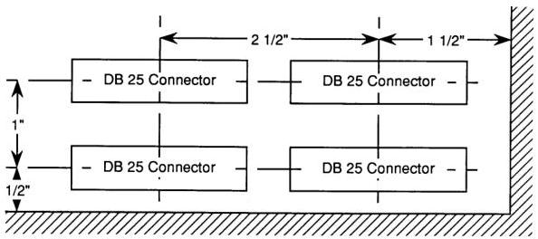

*Figure A.2 – Minimum connector spacing.*