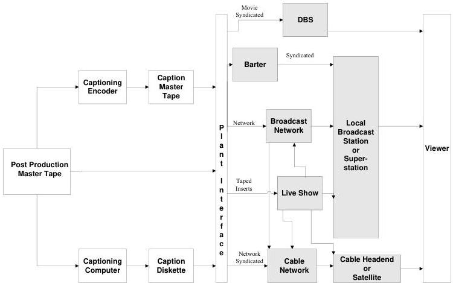
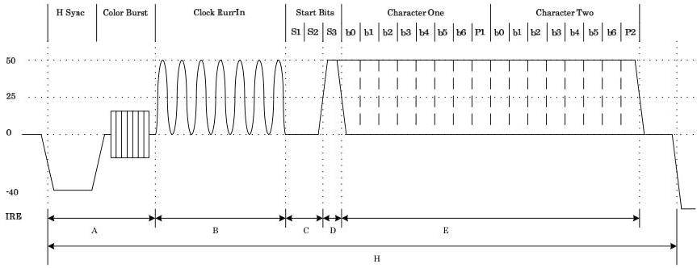
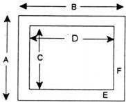
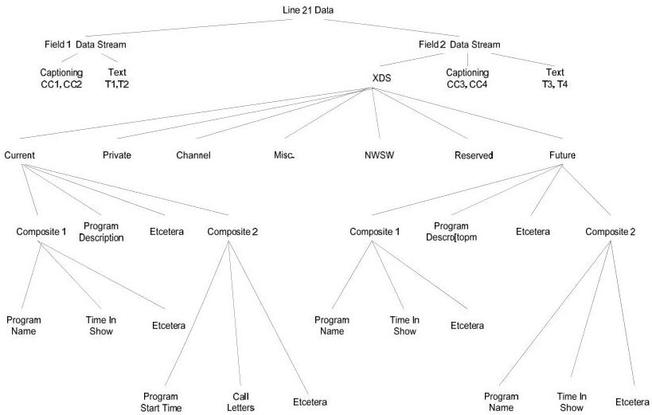
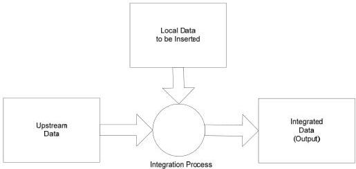
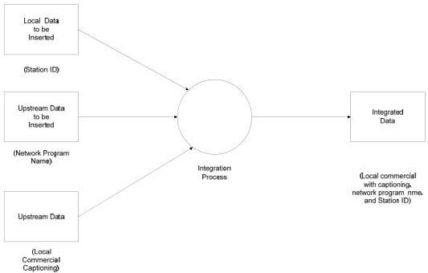
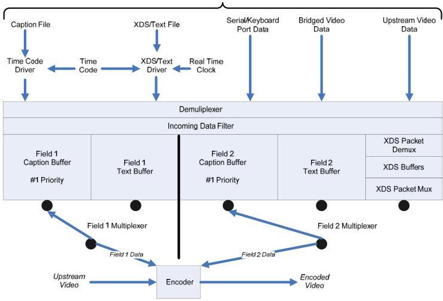
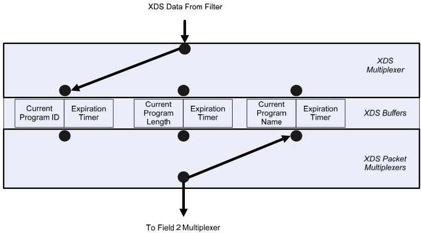

# Line 21 Data Services - ANSI/CTA-608-E S-2019

## 1 Purpose and Scope

This section describes the purpose and scope of the entire standard.

### 1.1 Purpose

CEA-608-D is a technical standard and guide for using or providing Closed Captioning services or other data services embedded in line 21 of the vertical blanking interval of the NTSC video signal. This includes provision for encoding equipment and/or decoding equipment to produce such material as well as manufacturers of television receivers which are required to include such decoders in their equipment as a matter of regulation (see Annex F). It is also a usage guide for producing material using such equipment, and for distributing such material.

This standard describes the specifications for creation, transmission, reception, and display of caption data, plus the relationship of Caption Mode data to other line 21 data. A comparison of decoders meeting Federal Communications Commission (FCC) rules to all decoders designed prior to the drafting of those rules and a timetable for the implementation of features which are unique to the different generations of decoders are retained from the prior version.

ATSC DTV Closed Captioning, as well as a method of carrying the CEA-608-E data stream in ATSC DTV is documented in CEA-708-C.

Guidance on digital transmission of CEA-608-E signals is provided in SMPTE 334 and SMPTE EG-43.

### 1.2 Scope

Where recommendations or requirements are made for service providers, they apply to anyone who creates, transmits, or modifies data, i.e., someone other than an equipment manufacturer. For example, a "caption service provider" could be the agency which creates the captions for a program, the distribution system (e.g. network) which carries the captions on line 21, or the local affiliate which uses its own data encoder to insert Text Mode or XDS between the captions. In a few cases specific categories of service providers are called out.

It is recommended that regardless of the function to be performed, the reader should become familiar at least with all the introductions to sections of this standard to avoid unintentionally degrading other services, and then concentrate on the sections which are appropriate to the activity being undertaken.

While there is no legal requirement to abide by this standard or its recommended practices, except for those portions labeled regulatory, it is strongly recommended that this advice be followed by line 21 data service providers and manufacturers of equipment used to transmit and receive these data services. Failure to follow these practices is likely to result in a degraded and inferior service and a non-uniform, unpredictable display of captions, text or operation of XDS features on the consumer's receiver.

It is necessary to abide by this Standard to be CEA-608-E compliant, however while methods described in this standard for the inclusion of a service shall be followed, unless otherwise stated no service is mandatory.

### 1.3 Other Vertical Interval Lines

Nothing in this standard shall preclude the use of the methods described in this standard for transmission of data on other lines of the Vertical Interval or when allowed the video portion of the NTSC television signal.

### 1.4 Antecedent Documents

CEA-608-E not only is an updated version, but it also includes and supersedes those documents listed in Section 2.4.

## 2 References

The following standards contain provisions that, through reference in this text, constitute normative provisions of this standard. At the time of publication, the editions indicated were valid. All standards are subject to revision, and parties to agreements based on this standard are encouraged to investigate the possibility of applying the most recent editions of the standards listed in Section 2.1.

### 2.1 Normative References

CEA-542-B, Cable Television Channel Identification Plan, July 2003

ECMA 262, Script language specification (June, 1997)

FIPS PUB 6-4, Counties and Equivalent Entities of the United States, Its Possessions, and Associated Areas, 8/31/90

IEC 61880-2: (2002-09) Video System (525/60) Video and Accompanied Data Using the Vertical Blanking Interval -- Part 2 525 Progressive Scan System

IEC 61880: (1998-01), Video System (525/60) Video and Accompanied Data Using the Vertical Blanking Interval -- Analogue Interface

ANSI/IEEE 511:1979, Standard on Video Signal Transmission Measurement of Linear Waveform Distortion

IETF RFC 791, Internet Protocol: DARPA Internet Program—Protocol Specification

IETF RFC 1071, Computing the Internet Checksum

IETF RFC 1738, Uniform Resource Locators (URL), (December, 1984)

ISO-8859-1: 1987, Information processing—8-bit single-byte coded graphic character sets – Part 1: Latin alphabet No. 1

ISO-8601: 1988, Data elements and interchange formats - Information interchange - Representation of dates and times

### 2.2 Informative References

ATSC A/53E, ATSC Digital Television Standard, With Amendment 1, April 18, 2006

ATSC A/65C, Program and System Information Protocol for Terrestrial Broadcast and Cable, With Amendment No. 1, May 9, 2006

CEA-708-C, Digital Television (DTV) Closed Captioning, July, 2006

CEA-766-C, U.S. Region Rating Table (RRT) and Content Advisory Descriptor for Transport of Content Advisory Information using ATSC Program and System Information Protocol (PSIP), July, 2006

Federal Communications Commission, R&amp;O FCC 98-35, http://www.fcc.gov/Bureaus/Cable/Orders/1998/fcc98035.html

Federal Communications Commission, R&amp;O FCC 98-36, http://www.fcc.gov/Bureaus/Engineering_Technology/Orders/1998/fcc98036.html

CRTC letter decision, Public Notice CRTC 1996-36, Respecting Children: A Canadian Approach to Helping Families Deal with Television Violence, (English) http://www.crtc.gc.ca/archive/ENG/Notices/1996/PB96-36.HTM (French) http://www.crtc.gc.ca/archive/FRN/Notices/1996/PB96-36.HTM

CRTC letter decision, Public Notice CRTC 1997-80, Classification System for Violence in Television Programming
(English) http://www.crtc.gc.ca/archive/ENG/Notices/1997/PB97-80.HTM
(French) http://www.crtc.gc.ca/archive/FRN/Notices/1997/PB97-80.HTM

SMPTE 12-1999, Television, Audio and Film—Time and Control Code

SMPTE 170-2004, Composite Analog Video Signal – NTSC for Studio Applications

SMPTE 331-2004, Television – Element and Metadata Definitions for the SDTI-CP

SMPTE EG-43-2004, System Implementation of CEA-708-B and CEA-608-B Closed Captioning

### 2.3 Regulatory References

47 C.F.R. 15.119, Closed Caption Decoder Requirement for Television Receivers

47 C.F.R. 15.120, Program Technology Blocking Requirements for Television Receivers

### 2.4 Antecedent References

EIA-702, Copy Generation Management System (Analog) (1997)

EIA-744-A, Transport of Content Advisory Information using Extended Data Service (XDS) (1998)

EIA-745, Transport of Cable Channel Mapping System Information using Extended Data Service (XDS), 1997

EIA-746-A, Transport of Internet Uniform Resource Locator (URL) Information Using Text-2 (T-2) Service (1998)

EIA-752, Transport of Transmission Signal Identifier (TSID) Using Extended Data Service (XDS) (1998)

EIA-806, Transport of ATSC PSIP Information to Affiliate Broadcast Stations Using Extended Data Service (XDS) (2000)

NOTE—The topic discussed in EIA-806 has been removed from CEA-608-E.

### 2.5 Reference Acquisition

ANSI/CEA/EIA Standards:
- Global Engineering Documents, World Headquarters, 15 Inverness Way East, Englewood, CO USA 80112-5776; Phone 800.854.7179; Fax 303.397.2740; Internet http://global.ihs.com ; Email global@ihs.com

SMPTE Standards:
- Society of Motion Picture &amp; Television Engineers, 595 W. Hartsdale Ave., White Plains, NY 10607-1824 USA Phone: 914.761.1100 Fax: 914.761.3115; Email: eng@smpte.org; Internet http://www.smpte.org

ATSC Standards:
- Advanced Television Systems Committee (ATSC), 1750 K Street N.W., Suite 1200, Washington, DC 20006; Phone 202.828.3130; Fax 202.828.3131; Internet http://www.atsc.org/standards.html

ECMA Standards:
- European Computer Manufacturers Association (ECMA), 114 Rue du Rhône, CH1204 Geneva, Switzerland; Internet http://www.ecma-international.org/publications/index.html

FCC
- FCC Regulations, U.S. Government Printing Office, Washington, D.C. 20401; Internet http://www.access.gpo.gov/cgi-bin/cfrassemble.cgi?title=199847

### FIPS Standards:

- National Institute of Standards and Technology and Information Technology, U.S. Government Printing Office, Washington, D.C. 2040; http://www.itl.nist.gov/fipspubs/

### IETF Standards:

- Internet Engineering Task Force (IETF), c/o Corporation for National Research Initiatives, 1895 Preston White Drive, Suite 100, Reston, VA 20191-5434 USA; Phone 703-620-8990; Fax 703-758-5913; Email ietf-info@ietf.org; Internet http://www.ietf.org/rfc/rfc0791.txt?number=791 and http://www.ietf.org/rfc/rfc1071.txt?number=1071

### IEC and ISO Standards:

- Global Engineering Documents, World Headquarters, 15 Inverness Way East, Englewood, CO USA 80112-5776; Phone 800-854-7179; Fax 303-397-2740; Internet http://global.ihs.com; Email global@ihs.com
- ISO Central Secretariat, 1, rue de Varembe, Case postale 56, CH-1211 Genève 20, Switzerland; Phone +41 22 749 01 11; Fax +41 22 733 34 30; Internet http://www.iso.ch; Email central@iso.ch

## 3 Definitions

### 3.1 Definitions

With respect to definition of terms, abbreviations and units, the practice of the Institute of Electrical and Electronics Engineers (IEEE) as outlined in the Institute's published standards shall be used. Where an abbreviation is not covered by IEEE practice or CEA-608-E practice differs from IEEE practice, then the abbreviation in question is described in Section 3.2.1 or 3.2.2.

### 3.2 Terms Employed

#### 3.2.1 Acronyms

|  AC | Article Clear  |
| --- | --- |
|  AE | Article End  |
|  ANE | Article Name End  |
|  ANS | Article Name Start  |
|  AOF | Reserved (formerly Alarm Off)  |
|  AON | Reserved (formerly Alarm On)  |
|  ANSI | American National Standards Institute  |
|  ASB | Analog Source Bit  |
|  ASCII | American Standard Code for Information Interchange  |
|  APS | Analog Protection System  |
|  ANSI | American National Standards Institute  |
|  ATSC | Advanced Television Systems Committee  |
|  BS | Backspace  |
|  CEA | Consumer Electronics Association  |
|  CGMS | Copy Generation Management System  |
|  CR | Carriage Return  |
|  CRTC | Canadian Radio-television and Telecommunications Commission  |
|  DER | Delete to End of Row  |
|  DVR | Digital Video Recorder  |
|  ECMA | European Computer Manufacturers Association  |
|  EDM | Erase Displayed Memory  |
|  EIA | Electronic Industries Alliance  |
|  ENM | Erase Non-Displayed Memory  |
|  EOC | End of Caption  |
|  FCC | Federal Communications Commission  |
|  FIPS | Federal Information Processing Standard  |
|  FON | Flash On  |
|  IEC | International Electrotechnical Commission  |
|  IEEE | Institute of Electrical and Electronics Engineers  |
|  IETF | Internet Engineering Task Force  |
|  IRE | Institute of Radio Engineers  |
|  ISO | International Organization for Standardization  |
|  NRZ | Non-Return-to-Zero  |
|  NTSC | National Television Standards Committee  |
|  PAC | Preamble Address Code  |
|  PSP | Pseudo Sync Pulse  |
|  RCD | Redistribution Control Descriptor  |
|  RCL | Resume Caption Loading  |
|  RDC | Resume Direct Captioning  |
|  RTD | Resume Text Display  |
|  RU2 | Roll Up Captions 2 Rows  |
|  RU3 | Roll Up Captions 3 Rows  |
|  RU4 | Roll Up Captions 4 Rows  |
|  SMPTE | Society of Motion Picture and Television Engineers  |

1 While some commands are included in Section 3.2.1, a complete list of commands may be found in 47 C.F.R. §15.119.

TC1 TeleCaption I
TC2 TeleCaption II
TO1 Tab Offset 1 Column
TO2 Tab Offset 2 Columns
TO3 Tab Offset 3 Columns
TR Text Restart
TSID Transmission Signal Identifier
URL Uniform Resource Locator
UTC Coordinated Universal Time²
XDS eXtended Data Service

#### 3.2.2 Glossary (Informative)

Base Row: The bottom row of a roll-up display. The cursor always remains on the base row. Rows of text roll upward into the contiguous rows immediately above the base row.

Box: The area surrounding the active character display. In Text Mode, the box is the entire screen area defined for display, whether or not displayable characters appear. In Caption Mode, the box is dynamically redefined by each caption and each element of displayable characters within a caption. The box (or boxes, in the case of a multiple-element caption) includes all the cells of the displayed characters, the non-transparent spaces between them, and one cell at the beginning and end of each row within a caption element in those decoders which use a solid space to improve legibility.

Character: A single group of 7 data bits plus a parity symbol.

Captioning: Textual representation of program dialogue that may include other program descriptions.

Caption File: A computer file that defines the captions used by a captioning encoder.

Captioning Diskette: A computer diskette with a caption file written on it. This file has captioning data used by an encoder to insert captions.

Captioning Sync: The timing relationship between the picture and the appearance of captions on that picture. See Section E.2.

Caption Master Tape: The earliest videotape generation of a production on which captions have been recorded.

Cell: The discrete screen area in which each displayable character or space may appear. A cell is one row high and one column wide.

Channel Grazing: When a viewer changes channels frequently to search for a desired show.

Channel Surfing: When a viewer changes channels frequently to search for a desired show.

Column: One of 32 vertical divisions of the screen, each of equal width, extending approximately across the full width of the Safe Caption Area (see also). Two additional columns, one at the left of the screen and one at the right, may be defined for the appearance of a box in those decoders which use a solid space to improve legibility, but no displayable characters may appear in those additional columns. For reference, columns may be numbered 0 to 33, with columns 1 to 32 reserved for displayable characters.

Control Code or Control Character: The framing characters of an XDS packet, or the characters that control the display of text in closed captioning.

Default: 1) A condition which exists when no explicit parameters are given, or 2) A specified parameter to be used when an explicit parameter is not intended to be recognized or acted upon. Examples:

² Since unanimous agreement could not be achieved by ITU on using either the English word order CUT, or the French word order, TUC, a compromise to use neither was reached.

a) If no PAC is received after a Carriage Return (CR) in roll-up style captioning, the default position for the new row is Indent 0.
b) A mid-screen PAC can be preceded by a default address that is used by any decoder which does not recognize mid-screen PACs.

Display Disable: To turn off the display of captions or text (and accompanying background) at the receiver, rather than through codes transmitted on line 21 which unconditionally erase the display. The receiver may disable the display because the user selects an alternate mode, e.g. TV Mode, or because no valid line 21 data are present.

Display Enable: To allow the display of captions or text when they are transmitted on line 21 and received as valid data.

NOTE—For display to be enabled, the user shall have selected Caption Mode or Text Mode, and valid data for the selected mode shall be present on line 21.

Displayable Character: Any letter, number, or symbol which is defined for on-screen display, plus the 0x20 space.

Element: In a pop-on or paint-on style caption, each contiguous area of cells containing displayable characters and non-transparent spaces between those characters. A single caption may have multiple elements. An element is not necessarily a perfect rectangle, but may include rows of differing widths.

Encoder: A device that adds the caption data signal to line 21 of an NTSC video signal.

Erase Display: In Caption Mode, to clear the screen of all characters (and accompanying background) in response to codes transmitted on line 21. The caption service provider can accomplish the erasure either by sending an Erase Displayed Memory (EDM) command or by sending an Erase Non-Displayed Memory (ENM) command followed by an End of Caption (EOC) command, effectively making a blank caption "appear." Display can also be erased by the receiver when the caption memory erasure conditions are met, such as the user changing TV channels.

To clear the screen of all characters without affecting the solid background box in Text Mode, the text service provider can accomplish the erasure by sending a Text Restart (TR) command. Display can also be erased by the receiver under the same memory erasure conditions as captions.

Field Reversal: Some video processing equipment (Time Base Correctors, Tape Machines, etc.) may place video from field 1 on field 2, and place video from field 2 on field 1.

General Purpose Captioning: Captioning done for wide distribution in which the exact specifications of the decoders to be used are unknown. Open captioning is not general purpose because the specifications of the character generator are known and controllable. Closed captioning done for a closed user group in which the decoder model used for viewing can be specified is also not general purpose. Thus, this phrase refers to closed captioning which may be accessed by general audiences who provide their own decoders and who, therefore, need captions which provide compatible displays on all decoder models.

Hex Notation: Hexadecimal notation in the format 0x00, 0x01... 0x0F. In some tables the prefix 0x may not be included.

Immediately: When receiver functions are supposed to occur "immediately," it is expected that they occur in the same video frame as or no more than one video frame after, the receipt of the command which triggers the function. In the case of redundant control-byte pairs, such as Erase Displayed Memory, receipt of the command means upon receipt of the first of the redundant pairs, assuming it passes parity.

Informational Character: The characters within the packet that contain the message. Informational Characters are always sent in pairs. This excludes the Start, Continue, End, Type &amp; Checksum characters.

Integration: The process of interleaving data from multiple sources into a single field of line 21. See Section E.4.

IRE Units: A linear scale for measuring the relative amplitudes of the components of a television signal with the zero reference at blanking level. For example, composite video systems are normally operated with 140 IRE units = 1.0 V p-p, while component video systems are normally operated with 100 IRE units = 0.7 V p-p. (From SMPTE 170 Annex B).

Live Captioning: The insertion of captioning information into a video feed during transmission to the viewer. This may be done via a "real-time" (simultaneous caption creation and transmission) or "live-display" (manually triggered captions from a computer file) method.

Odd Parity: An odd number of '1' bits within the 8 bit byte.

Packet: A collection of two byte pairs that conveys a complete piece of information.

Packet Class: A group of XDS-related packet types. Seven Classes are used: Current, Future, Channel Information, Miscellaneous, Public Service, Reserved, and Private Data.

Packet Type: A single and complete piece of XDS information. 127 unique Packet Types are allowed for each Packet Class.

Post-production Master Tape: The earliest videotape generation of a complete production. This usually does not have line 21 data encoded.

Program Distribution Path: The various locations that a television program passes through from creation to viewing. See Section 4.2 and Figure 1.

Re-encoding - Reading the existing line 21 data in a video feed, combining this data with data from a local source and inserting this combined data back into line 21. See Integration in Section E.4.

Row: One of 15 horizontal divisions of the screen, each of equal height, extending across the full width of the Safe Caption Area.

Safe Caption Area: The area of the television picture within which captioning and text shall be displayed to ensure visibility of the information on the majority of home television receivers.

Solid Background: An opaque mask shown behind displayable characters to enhance their legibility. In Caption Mode, use of a solid background is optional; when used, the solid background changes shape and size to conform to the caption element(s) displayed. In Text Mode, use of a solid background is required; the solid background completely fills the box area regardless of the presence or parameters of displayable characters.

Solid Space: One cell of the solid background in which no displayable character is present.

Special Characters: Displayable characters (except for "transparent space") which require a two-byte sequence of one non-printing and one printing character. The non-printing byte varies depending on the data channel. Regular characters require a unique one-byte code which is the same in either data channel.

Sub-packet: A contiguous group of two-character pairs that begins with a XDS control character and ends with a command to restore operation to the previous state.

Text: When written with an upper-case "T," refers to Text Mode. When written with a lower-case "t," refers to any combination of displayable characters.

Transparent Space: Transmitted as a special character, it is a one-column-wide space behind which program video is always visible.

Type Character: The character following the Control character which indicates a specific XDS packet type.

Window: The invisible rectangle that defines the top and bottom limits of a roll-up caption. The window can be 2 to 4 rows high. The lowest row of the window is called the base row.

### 3.3 Compliance Notation

As used in this standard, “shall” denotes a mandatory provision of the standard. “Should” denotes a provision that is recommended but not mandatory. “May” denotes a feature, whose presence does not preclude compliance that may or may not be present at the option of the implementer.

Unless a section or subsection is explicitly labeled Informative or Regulatory, it shall be considered Normative. A section or subsection labeled Informative or Regulatory remains as such through the end of that (sub) section level.

Each Annex is explicitly labeled as Normative, Informative, or Regulatory.

## 4 Background (Informative)

### 4.1 Data Types in the Line 21 Signal

The data signal on line 21 consists of independent data on field 1 and field 2. Each data channel may contain specific types of data packets as shown in Table 1.

|  Field 1 Packets |   |   |   | Field 2 Packets  |   |   |   |
| --- | --- | --- | --- | --- | --- | --- | --- |
|  Name* | Field | Data Channel | Description | Name* | Field | Data Channel | Description  |
|  CC1 | 1 | C1 | Primary Synchronous Caption Service | CC3 | 2 | C1 | Secondary Synchronous Caption Service  |
|  CC2 | 1 | C2 | Special Non-Synchronous Use Captions | CC4 | 2 | C2 | Special Non-Synchronous Use Captions  |
|  T1 | 1 | C1 | First Text Service | T3 | 2 | C1 | Third Text Service  |
|  T2 | 1 | C2 | Second Text Service | T4 | 2 | C2 | Fourth Text Service  |
|   |  |  |  | XDS | 2 | C3 | XDS  |

\* The hyphen in the name is optional (T-1 or T1).

Table 1 Field 1 and Field 2 Packets

The Primary Synchronous Caption Service (CC1) is primary language captioning data that should be in sync with the sound, preferably to a specific frame. The Secondary Synchronous Caption Service (CC3) is an alternate captioning data channel usually used for second language captions. CC3 should also be in sync with the sound, although it may be a different language.

The Special Non-synchronous channel (CC2, CC4) carries data that may be intended to augment information carried in the program. It need not be in sync with the sound. Delays of several seconds within the program are to be expected and should not affect the integrity of the data.

Due to bandwidth used by XDS in field 2, Text Services should use channels T1 and/or T2 (field 1) if possible; T3 and T4 should be used only if T1 and T2 are not sufficient.

Text Service T2 may be used for the transmission of broadcast related URLs as specified in Section 7.10.

In the interest of efficient bandwidth utilization, data shall not be duplicated in more than one data channel or field.

Text and XDS have equal priority after captioning. In order to maintain this balance and the integrity of field 2 text data through downstream encoders, Text providers should consider the downstream line 21 environment and restrict Text bandwidth usage as discussed in Section E.7.2.

The XDS packets break down into several packet types (Current program information, Future Program Information, etc.) and some packet types of multiple fields (Program Length, Title, Etc.). Section 9 describes the packet definitions in detail.

This mixture of several data types requires a guideline for processing to assure the integrity of the data is maintained through numerous distribution stages and channels.

This standard recommends a default mode of operating but does not preclude overriding default settings or the addition of features beyond those mentioned here.

### 4.2 Program Distribution Paths

Figure 1 describes the possible distribution paths for a captioned program. The shaded boxes indicate points that may add data packets to an existing captioning signal.



*Figure 1 – Program Distribution Path for Closed Captioned Programming.*

Shaded Box Represents a potential re-encoding point

## 5 Signal Characteristics

### 5.1 Introduction

This section describes the signal format used to encode data for transmission on line 21 of the television picture. It contains important information related to both encoders and decoders. This information is provided to ensure compatibility between encoders and decoders.

### 5.2 Line 21 Waveform

Figure 2 shows the signal waveform. The Clock Run-In is a symmetrical sine wave with its maximum and minimum amplitudes being equal to the logic "1" and "0" levels respectively of the encoded data. The Clock Run-In is also in phase with all of the logic level transitions of the Start and Data bits. The three Start bits follow the same specifications as the Data bits, but are always defined to be "0", "0", "1".

Table 2 shows the signal specifications. Table 2 contains a section related to encoders and another section related to decoders. The specifications for these two sections are different to allow for distortions introduced by the transmission channel. The encoder shall be designed to produce an output that complies with applicable FCC Rules (47 C.F.R. 73.682(a) (22) (i) and 73.699 Fig.17) and should produce an output as close to the nominal specifications as possible.

The decoder shall be designed to accept as large a variance from the nominal specifications as possible.

The tolerances given for the decoder are suggested minimum tolerances.



*Figure 2 – Line 21 Waveform Diagram.*

### NOTES:

1) All interval measurements are made from the midpoints (half amplitude) on all edges.
2) If only Field 1 is being encoded, Field 2 may be 0 IRE, 7.5 IRE (setup) or clock run in with two null characters. If only Field 2 is being encoded, Field 1 shall be clock run in with two null characters.
3) If both fields are to be encoded, each field shall be encoded within the tolerances specified in Table 1. The transmission channel between the encoder output and the decoder input shall not change the difference in the amplitudes of corresponding signal parameters between the two fields by more than 5 IRE.
4) Deviations introduced anywhere in the signal due to source generated switching transients shall be nor greater than  $\pm 2$  IRE. However, decoders should accept larger deviations which may be introduced by passing the signal through a transmission channel and/or signal security system.
5) No setup level allowed.
6) Line 21, Field 2 is also known as line 284.

|  Interval | Description | Encoder Minimum | Encoder Nominal | Encoder Maximum | Decoder Highest Lower Bound | Decoder Nominal | Decoder Lowest Upper Bound  |
| --- | --- | --- | --- | --- | --- | --- | --- |
|  A | H-Sync to Clock Run-In | 10.250 μs | 10.500 μs | 10.750 μs | 10.000 μs | 10.500 μs | 11.000 μs  |
|  B | Clock Run-In 2,3 |  | 6.5 D (12.910 μs) |  |  | 6.5 D (12.910 μs) | 21.4 D 4 (4.250 μs)  |
|  C | Clock Run-In to Third Start Bit3 |  | 2.0 D (3.972 μs) |  |  | 2.0 D (3.972 μs) |   |
|  D | Data Bit1,3 |  | 1.0 D (1.986 μs) |  |  | 1.0 D (1.986 μs) |   |
|  E | Data Characters5 |  | 16.0 D (31.778 μs) |  |  | 16.0 D (31.778 μs) |   |
|  H | Horizontal Line1 |  | 32.0 D (63.556 μs) |  |  | 32.0 D (63.556 μs) |   |
|   | Rise/Fall Time of Data Bit Transitions6 |  | 0.240 μs | 0.288 μs |  | 0.240 μs | 0.480 μs  |
|   | Data Bit High (Logic Level One)7 Clock Run-In Maximum | 48 IRE | 50 IRE | 52 IRE | 38 IRE 8 | 50 IRE | 62 IRE8  |
|   | Data Bit Low (Logic Level Zero)7 Clock Run-In Minimum | 0 IRE | 0 IRE | 2 IRE | -2 IRE 8 | 0 IRE | 12 IRE8  |
|   | Data Bit Differential (High-Low) Clock Run-In Differential (Max-Min) | 48 IRE | 50 IRE | 52 IRE | 40 IRE 8 | 50 IRE | 60 IRE8  |
|  NOTES1) The Horizontal Line frequency fH is nominally 15734.26 Hz ± 0.05 Hz. Interval D shall be adjusted to D = 1/(fH x 32) for the instantaneous fH at line 21.2) The Clock Run-In signal consists of 7.0 cycles of a 0.5034965 MHz (1/D) sine wave when measured from the leading to the trailing 0 IRE points. The sine wave is to be symmetrical about the 25 IRE level.3) The negative going midpoints (half amplitude) of the Clock Run-In shall be coherent with the midpoints (half amplitude) of the Start and Data bit transitions.4) These values have been chosen to accommodate signals generated by some existing encoders.5) Two characters, each consisting of 7 Data bits and 1 Odd Parity bit.6) 2T Bar (also known as a "Bar with a 2T rise (fall) time"), measured between the 10% and 90% amplitude points. 2T Bar and 2T rise shall be as defined in ANSI/IEEE 511.7) The Clock Run-In Maximum level shall not differ from the Data Bit High level by more than ±1 IRE. The Clock Run-In Minimum level shall not differ from the Data Bit Low level by more than ±1 IRE.8) These values have been chosen to accommodate amplitude variations which may be introduced by passing the signal through a transmission channel and/or signal security system.  |   |   |   |   |   |   |   |

Table 2 Line 21 Waveform Timing

### 5.3 Data Formats

The data signal shall be coded using non-return-to-zero (NRZ) format and employing standard ASCII 7 bit plus ODD parity character codes.

## 6 Closed Captioning

### 6.1 Introduction

Captions are program-related data which may be transmitted using either field of line 21. Captions are generally a textual transcription of the soundtrack of a video program, and as such are timed to correspond to the soundtrack. For this reason, caption data shall be given absolute priority over other data which may be carried on line 21. Caption data shall not be delayed in order to insert other data on line 21, except as may be technically necessary to control the throughput of all data.

Captioning services differ from other line 21 services, other than program content advisories, in four important ways. First, they are the only services which are always program related. Second, captioning is the only data service given regulatory protection. Third, only captions command precise screen placement and display style. Fourth, captions alone are restricted as to size (in terms of the number of rows of text displayed simultaneously) so as not to obscure too great a portion of the video image. The program content advisories are also different from other line 21 services in the first two ways listed above.

This section specifies two groups of optional features which receiver manufacturers may choose to implement in advanced closed-captioning decoders.

The first group of optional features provides for additional color choices: seven new background colors (to supplement the standard black background color) and one new foreground (character) color, black, to supplement the standard seven foreground colors. This group also provides for a "semi-transparent" background in addition to the standard opaque background.

The second group provides for up to 64 additional characters to permit correct typography in Spanish, French and other European languages. Also included are additional useful punctuation marks, special symbols, and graphic characters.

Implementation of these features is optional. However, to permit compatibility with standard decoders, these features, when implemented, shall be implemented as described in subsequent sections. This section also indicates how caption providers are expected to use these features in order to produce a meaningful display on standard decoders.

### 6.2 Background and Foreground Attributes

In this section, "Background" refers to the rectangular box which may surround each caption character to set it off from the underlying video (a manufacturer may, however, choose a method other than a rectangular box for this purpose). "Foreground" refers to the characters themselves. "Opaque" refers to a background color which completely obscures (or replaces) the underlying video. "Semi-transparent" refers to a background color which only partially obscures the underlying video; the background color and the underlying video are mixed together in a manner to be decided by the manufacturer.

It is expected that caption providers shall use various combinations of background and foreground colors to convey additional information about a soundtrack. For example, a particular combination might be used to indicate the words of an unseen narrator, while another combination might indicate voices emanating from telephones or loudspeakers. Colors could also help to differentiate among various dramatic characters or to indicate song lyrics, sound effects, etc.

At the manufacturer's option, an extended closed-captioning decoder may support additional Background and Foreground Attribute Codes. If such a decoder also permits the viewer to select background/foreground colors or other attributes, then the viewer's selection should take priority, and the Background and Foreground Attribute Codes described herein are to be ignored whenever the viewer has selected something other than the default.

A manufacturer may choose not to implement the background opacity attribute (opaque versus semi-transparent). In that case, the bit which indicates background opacity is ignored by the decoder; opaque background should be the default. Caption providers should note that semi-transparent background colors may not be available on all extended decoders.

A manufacturer may choose not to implement all the colors in Table 3. If the code for a non-implemented background color is received, the decoder should default to a black background. However, if the Foreground Attribute Code for black foreground is implemented, all the Background Attribute colors should be implemented also. This is to avoid the possibility that a black foreground is selected with a non-implemented background color, resulting in black characters against a black background.

Each Background Attribute Code appears in the display as if a standard space had been received. Such a code sets the current background color (and opacity–opaque or semi-transparent if supported) to the specified value; the displayed space character shall be entirely in the new color and opacity. The new background color and opacity shall remain in effect until the end of the row, or until another Background Attribute Code is received, whichever comes first. If the opacity attribute is not supported, the default opacity is opaque (or another opacity or background feature selected by the viewer or manufacturer). If no Background Attribute Code is received before the first character of an empty row, the default background attribute is opaque black (or other default selected by the viewer or manufacturer).

Each Background Attribute Code incorporates an automatic backspace (BS) for backward compatibility with standard decoders. The captioning service provider is expected to precede each Background Attribute Code with a standard space. A standard decoder shall display the space and ignore the Background Attribute Code. An extended decoder shall also display the space, but upon receipt of the Background Attribute Code, backspace and then display a space which changes the background color and/or opacity. In this way, either type of decoder shall display a single space, and text formatting shall be the same on all decoders.

The Foreground Attribute codes are included in this specification for extended decoders in order to provide the eighth color, black, as a character color. When selecting black as the foreground color, the caption service provider shall select a background color other than black. As with standard Mid Row Codes, the Foreground Attribute Codes turn off italics and flash, and the least-significant bit controls underlining (see Table 3).

Each Foreground Attribute Code incorporates an automatic BS for backward compatibility with standard decoders. The captioning service provider shall precede each Foreground Attribute Code with a standard space. A standard decoder shall display the space and ignore the Foreground Attribute Code. An extended decoder shall also display the space, but then, upon receipt of the Foreground Attribute Code, BS and then display a space which contains the new foreground-color selection. In this way, either type of decoder shall display a single space, and text formatting shall be the same on all decoders.

The behavior of Mid Row Codes, Preamble Address Codes (PACs), Tab Offset Codes and transparent spaces is the same on either type of decoder.

|  Data Channel 1 | Data Channel 2 | Mnemonic1 | Description  |
| --- | --- | --- | --- |
|  10 20 | 18 20 | BWO | Background White, Opaque  |
|  10 21 | 18 21 | BWS | Background White, Semi-transparent  |
|  10 22 | 18 22 | BGO | Background Green, Opaque  |
|  10 23 | 18 23 | BGS | Background Green, Semi-transparent  |
|  10 24 | 18 24 | BBO | Background Blue, Opaque  |
|  10 25 | 18 25 | BBS | Background Blue, Semi-transparent  |
|  10 26 | 18 26 | BCO | Background Cyan, Opaque  |
|  10 27 | 18 27 | BCS | Background Cyan, Semi-transparent  |
|  10 28 | 18 28 | BRO | Background Red, Opaque  |
|  10 29 | 18 29 | BRS | Background Red, Semi-transparent  |
|  10 2A | 18 2A | BYO | Background Yellow, Opaque  |
|  10 2B | 18 2B | BYS | Background Yellow, Semi-transparent  |
|  10 2C | 18 2C | BMO | Background Magenta, Opaque  |
|  10 2D | 18 2D | BMS | Background Magenta, Semi-transparent  |
|  10 2E | 18 2E | BAO | Background Black, Opaque  |
|  10 2F | 18 2F | BAS | Background Black, Semi-transparent  |
|  17 2D | 1F 2D | BT | Background Transparent  |
| --- | --- | --- | --- |
|  17 2E | 1F 2E | FA | Foreground Black  |
|  17 2F | 1F 2F | FAU | Foreground Black Underline  |
|  1Because B in the second character of Mnemonics is reserved for the color Blue, Black is represented by A.  |   |   |   |

Table 3 Background and Foreground Attribute Codes

### 6.3 Closed-Group Extensions (Informative)

Receiver manufacturers and caption service providers may choose to assign new features and/or characters to otherwise unassigned portions of the code space. To maintain compatibility, it is recommended that CEA be consulted regarding all such assignments.

The special assignments in Table 4 are used to support two-byte character sets for captioning some Asian languages. These code assignments are not compatible with caption decoders as specified by the FCC; video materials incorporating them should not be distributed in the North American market.

|  Data Channel 1 | Data Channel 2 | Description  |
| --- | --- | --- |
|  17 24 | 1F 24 | Select the standard line 21 character set in normal size.  |
|  17 25 | 1F 25 | Select the standard line 21 character set in double size.  |
|  17 26 | 1F 26 | Select the first private character set.  |
|  17 27 | 1F 27 | Select the second private character set.  |
|  17 28 | 1F 28 | Select the People's Republic of China character set: GB 2312-80.  |
|  17 29 | 1F 29 | Select the Korean Standard character set: KSC 5601-1987.  |
|  17 2A | 1F 2A | Select the first registered character set.  |

Table 4 Special Assignments

### 6.4 Character Sets (Normative)

The characters shown in Section 6.4.1 and Section 6.4.2 use a particular printed font. This font is for illustrative purpose only. The manufacturer may choose to implement the standard and optional characters in any font style they deem appropriate.

#### 6.4.1 Standard

The following 112 standard characters shall be the 'basic set' of closed captioning characters for NTSC.

- upper-case alphabet: ABCDEFGHIJKLMNOPQRSTUVWXYZ
- lower-case alphabet: abcdefghijklmnopqrstuvwxyz
- accented letters: áàâçéèéííÑñóóúù
- punctuation and signs: !, ; ; " " # % &amp; @ / ( ) [ ] + - ÷ &lt; = &gt; ? ° ¢ $ £ ® ™ ½ ¿
- numerals: 0 1 2 3 4 5 6 7 8 9
- other characters: music note, standard space, transparent space, solid block

NOTE—Some of the above characters are incompatible with TeleCaption I. The one fourth and three fourths characters in the TeleCaption I character set have been replaced with the registered mark and trademark symbols, respectively.

NOTE—For the hex codes corresponding to these characters, see Table 49 and Table 50 in Section F.1.1.1, which copies the Character Set Table of 47 C.F.R. 15.119(g).

The basic character set permits mixed-case captioning in Spanish and French, with a few exceptions (for example, the "e" with diaeresis is not available, so the French word "Noël" cannot be spelled correctly in mixed case). For captioning in all upper case the only available accented letter is "Ñ".

#### 6.4.2 Optional Extended Characters

This specification adds enough new upper- and lower-case accented letters to permit complete typography in Spanish and French, as well as certain other languages which use the Latin alphabet.

For the sake of simplicity, ligature combinations such as (Æ, æ, and ij) have been omitted from the table of 64 Extended Characters. The list also includes the ASCII characters which were omitted from the basic closed-captioning specification.

The order of characters in the list approximately reflects their relative importance to the North American audience. It is suggested that a manufacturer who wishes to support less than the full list should add characters in the order shown. Miscellaneous characters have been intermixed with the alphabetic characters so that each additional language group is contained within a block of 8 or 16 characters.

The languages appear in the following order: Spanish, French, Portuguese, German, and Danish. If all 64 characters are included, Italian, Finnish, and Swedish are also supported.

Each of the 64 Extended Characters incorporates an automatic BS. When an Extended Character is received, the cursor moves to the left one column position (unless the Extended Character is the first character on a row), erasing any character which may be in that location, then displays the Extended Character. This action is the same in both caption and Text mode and in all three captioning styles. For

example, to include a lower-case "u" with umlaut/diaeresis in the captioning, the caption provider shall send a standard "u" followed by the Extended Character "ü". On a basic receiver which does not implement Extended Characters, "u" shall be displayed and the code for "ü" shall be ignored. On a receiver which implements Extended Characters, the "u" shall be replaced by "ü".

In pop-on captioning style, the backspacing and replacement occur in the non-displayed memory, so they are invisible to the viewer. In roll-up and paint-on styles, the backspacing and replacement may be visible (although very rapid), depending on implementation.

NOTE1—One of the Extended Characters is the opening single quote. This character is intended to match the apostrophe, which is included in the basic character set. It is recommended that the apostrophe be curled so that it can be used as a closing single quote; that is, the standard apostrophe and the opening single quote (if implemented) should be mirror images of each other. The basic character table published by the FCC shows the apostrophe as curled.

NOTE2—An extended character cannot be implemented in the 32nd position due to the 32 character per line limit.

Each Extended Character requires two bytes. The first byte is 0x12 or 0x13 for data channel one (0x1A or 0x1B for data channel two). The second byte is in the range of 0x20 to 0x3F.

Add the 8 characters in Table 5 to the basic character set to support Spanish:

|  Data Channel 1 | Data Channel 2 | Symbol | Description | Also needed for:  |
| --- | --- | --- | --- | --- |
|  12 20 | 1A 20 | Á | capital A with acute accent | Portuguese  |
|  12 21 | 1A 21 | É | capital E with acute accent | French, Portuguese  |
|  12 22 | 1A 22 | Ó | capital O with acute accent | Portuguese  |
|  12 23 | 1A 23 | Ú | capital U with acute accent | Portuguese  |
|  12 24 | 1A 24 | Ü | capital U with diaeresis or umlaut | French, German, Portuguese  |
|  12 25 | 1A 25 | ü | small u with diaeresis or umlaut | French, German, Portuguese  |
|  12 26 | 1A 26 | ‘ | opening single quote [see NOTE3] |   |
|  12 27 | 1A 27 | ¡ | inverted exclamation mark [see NOTE4] |   |

Table 5 Extended Character Set—Spanish

NOTE3--The curled opening single quote is the mirror image of the standard curled apostrophe (included in the basic character set), which may be used as a curled closing single quote.

NOTE4--The small "i" can serve as an inverted exclamation mark in the standard fonts developed by PBS and NCI, but this might not be true in other fonts.

Add the 8 miscellaneous characters in Table 6 to the basic character set plus Spanish.

|  Data Channel 1 | Data Channel 2 | Symbol | Description | Also needed for:  |
| --- | --- | --- | --- | --- |
|  12 28 | 1A 28 | * | Asterisk | ASCII  |
|  12 29 | 1A 29 | ' | plain single quote [see NOTE5] |   |
|  12 2A | 1A 2A | — | em dash [see NOTE6] |   |
|  12 2B | 1A 2B | © | Copyright |   |
|  12 2C | 1A 2C | SM | Servicemark [see NOTE7] |   |
|  12 2D | 1A 2D | • | round bullet |   |
|  12 2E | 1A 2E | “ | opening double quotes |   |
|  12 2F | 1A 2F | ° | closing double quotes |   |

Table 6 Extended Character Set—Miscellaneous

NOTE5—The plain (non-curled) single quote is ambidextrous (symmetrical), like the standard double-quote character included in the basic character set.

NOTE6—The em dash extends the entire width of its character cell, so that two of them together appear connected. This character is designed to be used with the vertical bar and corner characters for drawing boxes (see Notes 8 and 9).

NOTE7—The service mark symbol is used to satisfy certain legal requirements. There are various legal ways in which this symbol may be drawn or displayed. For example, the "S" may be drawn next to the "M" or over the "M". It is preferred that the service mark be superscripted, i.e.,  $\mathrm{XYZ}^{\mathrm{SM}}$ . It is left to each individual manufacturer to interpret these symbols in any way that meets the legal needs of the viewer.

Add the 16 characters in Table 7 to the basic set with Spanish to support French.

|  Data Channel 1 | Data Channel 2 | Symbol | Description | Also needed for:  |
| --- | --- | --- | --- | --- |
|  12 30 | 1A 30 | À | capital A with grave accent | Italian, Portuguese  |
|  12 31 | 1A 31 | Â | capital A with circumflex accent | Portuguese  |
|  12 32 | 1A 32 | Ç | capital C with cedilla | Portuguese  |
|  12 33 | 1A 33 | É | capital E with grave accent | Italian, Portuguese  |
|  12 34 | 1A 34 | É | capital E with circumflex accent | Portuguese  |
|  12 35 | 1A 35 | É | capital E with diaeresis or umlaut mark |   |
|  12 36 | 1A 36 | ë | small e with diaeresis or umlaut mark |   |
|  12 37 | 1A 37 | Î | capital I with circumflex accent |   |
|  12 38 | 1A 38 | Ï | capital I with diaeresis or umlaut mark | Portuguese  |
|  12 39 | 1A 39 | ï | small i with diaeresis or umlaut mark | Portuguese  |
|  12 3A | 1A 3A | Ô | capital O with circumflex | Portuguese  |
|  12 3B | 1A 3B | Ù | capital U with grave accent | Italian, Portuguese  |
|  12 3C | 1A 3C | ù | small u with grave accent | Italian, Portuguese  |
|  12 3D | 1A 3D | Û | capital U with circumflex accent |   |
|  12 3E | 1A 3E | « | opening guillemets |   |
|  12 3F | 1A 3F | » | closing guillemets |   |

Table 7 Extended Character Set—French

Add the 16 characters in Table 8 to the basic set with Spanish and French to support Portuguese.

|  Data Channel 1 | Data Channel 2 | Symbol | Description | Also needed for:  |
| --- | --- | --- | --- | --- |
|  13 20 | 1B 20 | Â | capital A with tilde |   |
|  13 21 | 1B 21 | ã | small a with tilde |   |
|  13 22 | 1B 22 | Í | capital I with acute accent |   |
|  13 23 | 1B 23 | Î | capital I with grave accent | Italian  |
|  13 24 | 1B 24 | i | small i with grave accent | Italian  |
|  13 25 | 1B 25 | Ò | capital O with grave accent | Italian  |
|  13 26 | 1B 26 | ò | small o with grave accent | Italian  |
|  13 27 | 1B 27 | Ô | capital O with tilde |   |
|  13 28 | 1B 28 | õ | small o with tilde |   |
|  13 29 | 1B 29 | { | opening brace | ASCII  |
|  13 2A | 1B 2A | } | closing brace | ASCII  |
|  13 2B | 1B 2B | \ | backslash | ASCII  |
|  13 2C | 1B 2C | ^ | caret | ASCII  |
|  13 2D | 1B 2D | _ | Underbar | ASCII  |
|  13 2E | 1B 2E | | | pipe | ASCII  |
|  13 2F | 1B 2F | ~ | tilde | ASCII  |

Table 8 Extended Character Set—Portuguese

Add the 8 characters in Table 9 to the basic set with Spanish, French, and Portuguese to support German.

|  Data Channel 1 | Data Channel 2 | Symbol | Description | Also needed for:  |
| --- | --- | --- | --- | --- |
|  13 30 | 1B 30 | Ä | Capital A with diaeresis or umlaut mark | Finnish, Swedish  |
|  13 31 | 1B 31 | ä | small a with diaeresis or umlaut mark | Finnish, Swedish  |
|  13 32 | 1B 32 | Ö | Capital O with diaeresis or umlaut mark | Finnish, Swedish  |
|  13 33 | 1B 33 | ö | small o with diaeresis or umlaut mark | Finnish, Swedish  |
|  13 34 | 1B 34 | β | eszett (mall sharp s) |   |
|  13 35 | 1B 35 | ¥ | yen |   |
|  13 36 | 1B 36 | □ | non-specific currency sign |   |
|  13 37 | 1B 37 | | | Vertical bar [see NOTE8] |   |

Table 9 Extended Character Set—German

NOTE8—The vertical bar extends the entire height of its character cell, so that one of them above another appears connected. This character is designed to be used with the em dash and corner characters for drawing boxes (see Notes 6 and 9).

Add the 8 characters in Table 10 to the basic character set to support Danish.

|  Data Channel 1 | Data Channel 2 | Symbol | Description | Also needed for:  |
| --- | --- | --- | --- | --- |
|  13 38 | 1B 38 | Å | capital A with ring | Swedish  |
|  13 39 | 1B 39 | å | small a with ring | Swedish  |
|  13 3A | 1B 3A | Ø | capital O with slash |   |
|  13 3B | 1B 3B | ø | small o with slash |   |
|  13 3C | 1B 3C | Γ | upper left corner [see NOTE9] |   |
|  13 3D | 1B 3D | Ί | upper right corner [see NOTE9] |   |
|  13 3E | 1B 3E | L | lower left corner [see NOTE9] |   |
|  13 3F | 1B 3F | J | lower right corner [see NOTE9] |   |

Table 10 Extended Character Set--Danish

NOTE9—These four characters extend to the limits of their respective character cells so that contiguous instances of them appear to be connected. They are designed to be used with the em dash and vertical bar for drawing boxes (see Notes 6 and 8).

## 7 Text Mode

### 7.1 Introduction

Text Mode is a data service, generally not program related, which may be transmitted using either field of line 21. Text Mode data are always displayed as soon as they are received and are intended to be displayed in a manner which isolates them from the video program used to transmit the data. Once the display window is filled these data are always scrolled upward through the display window provided by the decoder. The Text Mode service provider has limited control of the timing and screen placement of the display, except to transmit data in discrete rows and to affect the placement of characters within their given row.

Discussions of Text Mode in this standard are made by explicit reference or by spelling the word "Text" using an upper-case T. The word "text" with a lower-case t refers to a character or string of characters transmitted for display in any service mode.

This document describes the specifications for creation, transmission, reception, and display of Text Mode data, plus the relationship of that data to other line 21 data.

One of the Text Mode data services (Text-2) may also be used to transmit Internet Uniform Resource Locators (URLs). This is done to associate resources on the Internet with television broadcast content.

### 7.2 Text Mode Service Providers and Equipment Manufacturers

A Text Mode may be used that consists of data formatted to fill a box which in height is not less than 7 rows and not more than 15 rows (all of which should be contiguous), and in width is not less than 32 columns. Text should be displayed over a solid background to isolate it from the unrelated program video. Each row of text contains a maximum of 32 characters. If the solid background does not extend the full width of the screen, at least one solid space equal to a single column width may be placed before the first character and after the last character of each row to enhance legibility.

### 7.3 Field 2 Text Bandwidth Considerations

Text and XDS have equal priority. In order to maintain this balance and the integrity of field 2 Text data through downstream encoders, Text providers should consider the downstream line 21 environment and restrict Text bandwidth usage as discussed in Section E.7.2.

### 7.4 Real-Time Scrolling Display

All products that support the Text Mode shall have the real-time scrolling display. This shall be the default display style for Text. Other display styles may be used in addition, but are not required.

The Text Mode shall be initiated by receipt of a Resume Text Display command (RTD) or TR command (TR). In Text Mode, the method of presenting characters depends on whether all available rows have been put on the screen. When Text Mode has initially been selected and the specified Text memory is empty, the cursor starts at the topmost row, Column 1, and moves down to Column 1 on the next row each time a CR is received until the last available row is reached.

A variety of methods may be used to accomplish the scrolling, provided that the text is legible while moving.

For example, as soon as all of the available rows of text are on the screen, Text Mode switches to the standard roll-up type of presentation. Each time a CR is received, the text in the top row of the window is erased from memory and from the display. The remaining rows of text are each rolled up into the next highest row in the window, leaving the base row blank and ready to accept new text. This roll-up shall appear smooth to the viewer and shall take no more than 0.433 seconds to complete. The cursor is automatically placed at Column 1 (pending receipt of a PAC).

Once the cursor reaches the 32nd character position on any row, all subsequent characters received prior to a CR, PAC, or BS shall be displayed in that position, replacing any previous character occupying that cell.

In Text Mode, the cursor cannot be moved randomly around the window. The cursor moves automatically one column to the right after each character or Mid-Row Code received. Receipt of any PAC shall move the cursor to the indicated indent position on the current row, ignoring row information contained in the address. Tab offsets have the same effect in Text mode as they have in caption mode. The TR command shall erase all characters on the screen and move the cursor to the topmost row, Column 1.

Receipt of a BS shall move the cursor one column to the left, erasing the character or Mid-Row Code occupying that location.

If the reception of data for a row is interrupted by data for an alternate data channel the display of Text shall resume from the same cursor position if a RTD command is received and no PAC is given which would move the cursor. A character remains displayed until scrolled off the top of the window, until another character is addressed to the same location, until erased by a BS, or until all text is erased simultaneously by receipt of a TR Command or by the consumer switching data channels (C1/C2) or fields (F1/F2) or selecting receiver functions which use the display memory of the decoder, or by the sustained loss of valid data.

The Delete to End of Row (DER) command shall erase from memory any characters or control codes starting at the current cursor location and in all columns to its right on the same row.

### 7.5 Other Real-Time Display Methods

In addition to (but not instead of) the scrolling type of display described above, alternate dynamic display methods may be used under viewer control. These additional methods shall be capable of displaying the same format of text data while providing a suitable method of moving the text to keep up with continuous data reception. Some examples might include:

a) A reduced size (less than 7 rows) window, scrolling display that could be repositioned on the screen.
b) A "CRAWL" style in which a single, continuous row of text appears from the right and moves across the screen to the left.
c) The text may be displayed in a manner that looks like the Paint-On style.
d) A smaller or larger font size may be used.
e) A "PAGE-POP-ON" style could be used, where a full page would appear at once, followed by subsequent pages one after the other.
f) A "PUSH-ON" style could be used where a new page pushes the old page off all at once. The new page appears at the right and is moving left.

Many other display methods might be used to display the Text as a viewer-selected alternative to the default scrolling mode.

### 7.6 Delayed Display

The data received in the Text Mode may be accumulated in memory during other modes for later retrieval and display. A memory buffer may also be provided to capture data displayed in real time for later review. Any of the display methods may be used to display this optional style.

### 7.7 Other Interruptions

The Text Mode data stream shall be terminated by the receipt of data for another service. In the case of a received Erase Displayed Memory (EDM) or Erase Non-Displayed Memory (ENM) command, that command shall be acted upon as appropriate for caption processing without terminating the Text Mode data stream. Any unidentified data, PACs, Mid-Row Codes, Flash On (FON), or BS command received following an EDM or ENM shall be considered a continuation of Text Mode data. Only the six caption specific commands in the current data channel shall terminate Text Mode: EOC, RCL, RDC, RU2, RU3, or RU4. In the case of line 21, field 2 services, Text Mode shall also be terminated when an XDS control byte is received.

### 7.8 Automatic Erasure of Text and Background

Decoders have the option of providing an automatic erase of the displayed caption memory if no activity has occurred for at least 16 seconds (see Section C.9). This option does not apply to Text Mode displays. There should be no automatic erasure of the character-display memory except when valid data are lost, when the viewer selects a non-Text Mode receiver function, or when the viewer switches the receiver channel, data channel, or the selected field.

The reason that Text Mode should not be treated the same way as the Caption Mode is that Text displays are not synchronized to program audio and are often designed for longer durations. Text Mode data may be received with longer delays between bytes because of display considerations and because Caption Mode has priority.

### 7.9 Data Channel Nomenclature for Text Services

To assist consumers in differentiating among various data channels, the nomenclature Section 4.1 (Table 1) is recommended for use in all materials directing viewers to Text Mode services.

### 7.10 Transmitting URLs in T-2

Uniform Resource Locators (URLs) are compact string representations of a location for use in identifying an abstract or physical resource on the Internet. URLs can be transmitted in the T-2 service, and may be used by receiving devices to permit the linking of television programs with related content on the Internet so that the content from these Internet services may be combined, mixed or shared by the receiving device.

A URL may be lengthy and its transmission may be interrupted by CC1, CC2 or T1 transmissions. After completing the interruption and before transmitting more of the URL, the transmitter shall return to T2 Text mode by sending a RTD command; the TR command shall not be used for this purpose.

On receipt of a TR command, a receiver may terminate any unfinished URL. That is, it may consider the ensuing T2 text receptions to be a new T2 Text message (which may be text or the start of another URL).

### 7.11 Character Set

Characters included in URLs on T-2 between 0x20 and 0x7E are interpreted as ISO-8859-1 characters (also known as Latin-1 and compatible with US-ASCII), rather than as CEA-608-E characters. Although the CEA-608-E and ISO-8859-1 character sets are largely compatible, some character codes have different meanings in the two sets. For example, the character 0x2A is an asterisk ("*") in ISO-8859-1, and shall be interpreted as such if it is included in a URL in T-2, but elsewhere in CEA-608-E this character is interpreted as a lower-case "a" with an acute accent ("á"). A complete list of the characters between 0x20 and 0x7E in both character sets is given in Annex A (informative). Characters outside the range 0x20 to 0x7E shall not be used for purposes of Section 7, and shall be discarded. The second byte of two-byte control codes shall also be discarded.

### 7.12 Standard Syntax

URLs should be transmitted in T-2 by using the following general format:

```txt
<url>[attr₁:val₁][attr₂:val₂]...[attrₙ:valₙ][checksum]
```

In other words, the URL is enclosed in angle brackets, followed by zero or more pairs of attributes and values in square brackets, which is then followed by a checksum in square brackets. (These delimiters were chosen because they are explicitly excluded from URLs by IETF 1738 and are present in the standard CEA-608-E character set.) For example:

```txt
<http: advsponsor.net="">[type:sponsor][name:Advertising Sponsor][0xEA77]
```

Previous versions of this standard allowed the word "type:" to be omitted to conserve bandwidth, but this usage has been disallowed because it introduced ambiguities into the syntax and made parsing difficult.

In order to detect data corruption, checksum shall be added at the end. To compute the checksum, adjacent characters in the string (starting with the left angle bracket) are paired to form 16-bit integers; if there are an odd number of characters, the final character is paired with an octet of zeros. The checksum is computed so that the one's complement sum of all of these 16-bit integers plus the checksum equals the 16-bit integer with all 1 bits (-0 in one's complement arithmetic). This checksum is identical to that used in the Internet Protocol (described in IETF RFC 791); further details on the computation of this checksum are given in IETF RFC 1071. This 16-bit checksum is transmitted as four hexadecimal digits in square brackets following the right square bracket of the final attribute/value pair (or following the right angle bracket if there are no attribute/value pairs). The checksum is sent in network byte order, with the</http:></url>

most significant byte sent first. Because the checksum characters themselves (including the surrounding square brackets) are not included in the calculation of the checksum, they shall be stripped from the string by the receiver before the checksum is recalculated there. Characters outside the range 0x20 to 0x7E (including the second byte of two-byte control codes) shall not be included in the checksum calculation.

Four attributes are defined in this standard: "type", "name", "expires", and "script." The "type" attribute indicates what sort of content the URL is associated with (for example, content related to the current television program or with the broadcast network). The type can be any one of the values in Table 11 (and is case insensitive).

|  Value | URL is associated with  |
| --- | --- |
|  PROGRAM | the current program  |
|  NETWORK | the broadcast network  |
|  STATION | the local station  |
|  SPONSOR | a commercial sponsor or advertiser for the current program  |
|  OPERATOR | the service (e.g., cable or satellite) operator  |

The "name" attribute indicates a human-readable title for the resource. It can be any string of characters between 0x20 and 0x7E except square brackets (0x5B and 0x5D) and angle brackets (0x3C and 0x3E), and should be kept as short as possible to conserve bandwidth.

The "expires" attribute enables the author to specify the last date the URL is valid, after which it should be ignored by the receiving device. The time format conforms to the ISO-8601 standard. A recommended usage is the form yyyyymmddThhmmss, where the capital letter 'T' separates the date from the time. It is possible to shorten the date string by reducing the resolution. For example yyyyymmddThhmm (no seconds specified) is valid, as is simply yyyyymmdd (no time specified at all). For XDS applications, times are assumed to be in UTC (Coordinated Universal Time).

The "script" attribute enables the triggering of specific actions within the content referenced by the URL. The value specifies a script fragment that is to be sent to the page and executed; the scripting language shall be compatible with ECMA-262 (for example, "JavaScript™" or "JScript™"). The script is executed when the content referenced by the URL is displayed on the receiving device. If that content is currently being displayed, the script fragment is immediately executed. The context for the script is the root document corresponding to the URL specified.

In order to conserve the limited bandwidth of line 21, the four standard attributes should be abbreviated as indicated in Table 12.

Table 11 URL Types

|  Long form | Abbreviation  |
| --- | --- |
|  Expires:yyyy | e:yyyy  |
|  Name:xxx | n:xxx  |
|  Script:zzz | s:zzz  |
|  Type:ttt | t:ttt  |
|  Type:network | t:n  |
|  Type:operator | t:o  |
|  Type:sponsor | t:a  |
|  Type:station | t:s  |
|  Type:program | t:p  |

Table 12 Abbreviated Forms

Other attributes could be defined at a later date. However, all other single character attribute names and single character "type" attribute values are reserved for use in future standards. Receivers should ignore attributes they do not understand.

All of the following examples would be valid:

```txt
<http: www.receivermfr.com="">[0x6C1D]
<http: www.tvmanufacturer.com="">[0xF03A]
<http: name:new][0xc015]
<http: www.advsponsor.com="">[type:sponsor][0xF412]
<http: standardstoday="" expires:19921228][0x6d86]="" www.showcontent.com="">[expires:19921228][0x6D86]
<http: standardstoday="" expires:19921228][0x6d86]="" www.sfdnetwork.com="">[t:n][script:doThis("now")][0xE530]
<http: www.newnetwork.org="">[t:network][n:NEW][0x42C3]
<http: www.newsponsor.com="">[type:sponsor][s:buyNow()][0xA217]
<http: www.lastsite.com="">[n:Last][e:19991231T115959][0x65CE]
<http: www.improvedprogram.com="">[t:p][n:The Improved Program][0x1FE4]
<http: www.anothersponsor.net="">[t:s][strange:ignore][0xFDCB]
```

In the last case, most receivers would presumably ignore the non-standard "strange" attribute and its value, although the bytes would be used in the calculation of the checksum. URLs are not limited to the "http:" scheme, so the following are also valid:

```txt
<mailto:info@advsponsor.net>[t:s][0x73BC]
<news:alt.tv.program>[t:p][0x141C]
```

### 7.13 Special Characters

In some cases, it is necessary to include characters in URLs, attributes, or values, that are not within the character set described in 7.11 (i.e., letters in non-English alphabets) or are excluded by this standard for other reasons (i.e., square brackets in scripts or names). These characters shall be encoded using the standard Internet URL mechanism of the percent character ("%") followed by the two digit hexadecimal value of these characters in ISO-8859-1.

### 7.14 Bandwidth Considerations

To preserve sufficient bandwidth for other services on field 1 of line 21, and to provide for timely transmission, URLs inserted on T-2 should be as short as possible. Toward that end, service providers are urged to transmit only those attributes that are truly needed for their application, omitting optional attributes if possible, and to use abbreviated attribute names and values in all cases. "Name" attributes should be kept to a minimum, for both bandwidth and display considerations. Where possible, the path component of the URL (following the host name) should be as short as possible or omitted. Because captioning data shall always have priority over all Text-2 data, long URLs generally cannot be broadcast without interruption. URL transmissions should be limited to 25% of the total field 1 bandwidth, even if more bandwidth is available after captioning, to allow for other downstream services.</news:alt.tv.program></http:></news:alt.tv.program></http:></http:></http:></http:></http:></http:></http:></http:></http:>

## 8 Field 2 Formats and Protocols

### 8.1 Introduction

This section defines the signal characteristics, data formats, and code sequences to support a variety of services for use on line 21, field 2 of the vertical blanking interval of the NTSC system.

This section also defines the use of line 21, field 2 to provide the following data channels:

- Two channels of Closed Captioning services.
- A single channel of XDS.
- Two channels of Text service.

Furthermore, this specification has been designed so that any combination of these distinct services may coexist simultaneously with captioning having priority. This specification has been deliberately designed to allow as much free market choice as possible, so each signal supplier can decide the level of implementation he feels best serves his unique market.

This specification is meant as a signal definition only. This specification makes no attempt to define how these signals may be used within receivers. Captioning and Text displays shall follow the same display formats within the receiver as are required for field 1 services.

### 8.2 Signal Characteristics

When any field 2 services are used, the waveform specifications for line 21 of field 2 shall comply with all the timing, level, and tolerance specifications as defined in Section 5.

When no field 2 services are being used, the line 21, field 2 waveform shall carry the appropriate clock run-in and null characters with parity bits (0 IRE luminance or 7.5 IRE luminance).

If field 2 services are used exclusively (that is there are no captioning or Text services available for field 1), the line 21, field 1 waveform shall contain the appropriate clock run-in and null characters with parity bits.

### 8.3 Data Formats

The data signal shall be coded using NRZ format and employing standard ASCII 7 bit plus ODD parity character codes.

Double control-byte pairs should not be used in field 2 data unless necessary. This conserves precious bandwidth needed for proper functioning of captioning, Text, and XDS data on line 21 field 2.

Field 2 captioning and Text control codes are processed the same as for field 1. Therefore, for example, encoding three CRs is still necessary to result in two CRs being processed by the decoder.

### 8.4 Closed Caption Mode

When closed captioning is used on line 21, field 2, it shall conform to all of the applicable specifications and recommended practices as defined for field 1 services with the following differences:

- The non-printing character of the miscellaneous control-character pairs that fall in the range of 0x14, 0x20 to 0x14, 0x2F in field 1, shall be replaced with 0x15, 0x20 to 0x15, 0x2F when used in field 2.
- The non-printing character of the miscellaneous control-character pairs that fall in the range of 0x1C, 0x20 to 0x1C, 0x2F in field 1, shall be replaced with 0x1D, 0x20 to 0x1D, 0x2F when used in field 2.
- When any of the control codes from 0x01 to 0x0F is used to begin a control-character pair it indicates the beginning of XDS Data. This XDS data should be considered part of a different data channel and can be used to interrupt the captioning data according to the FCC rules for other data channels.

In addition, see Annex F.1 for a list of those closed captioning codes currently included in 47 C.F.R. 15.119

### 8.5 Text Mode

When a Text service is used on line 21, field 2, it shall conform to all of the applicable specifications and recommended practices as defined for field 1 services with the following differences:

a) The non-printing character of the miscellaneous control-character pairs that fall in the range of 0x14, 0x20 to 0x14, 0x2F in field 1, shall be replaced with 0x15, 0x20 to 0x15, 0x2F when used in field 2.
b) The non-printing character of the miscellaneous control-character pairs that fall in the range of 0x1C, 0x20 to 0x1C, 0x2F in field 1, shall be replaced with 0x1D, 0x20 to 0x1D, 0x2F when used in field 2.
c) When any of the control codes from 0x01 to 0x0F is used to begin a control-character pair it indicates the beginning of XDS Data. This XDS data should be considered part of a different data channel and can be used to interrupt the Text data according to the FCC rules for other data channels.

### 8.6 XDS Mode

The eXtended Data service is supported by providing the means to transmit any of the unique data packets by interleaving these packets into any preexisting data on the line on a space available basis. This mode operates as a separate data channel just as the Text service does.

The data for each packet may or may not be contiguous. Packet data can be separated into sub-packets that can be placed anywhere space has been made available in the data stream.

#### 8.6.1 XDS Characters

There are four kinds of XDS characters: Control, Type, Checksum, and Informational.

Control characters are used as a mode switch to activate the XDS mode. They are always the first character of a two-character pair. Control characters are always between 0x01 and 0x0F.

The Type character is used after a Control character to identify the packet type. This character is always in the range of 0x01 to 0x7F. The Type character is always the second of a two-character pair.

The Checksum character always follows the Control character that identifies the end of the packet. It is always the second character of a two-character pair. The Checksum character is always in the range of 0x00 to 0x7F.

The Informational characters may be in the range of (0x00, 0x20-0x7F). Encodings in the range of 0x01 through 0x1F shall be forbidden.

NOTE—When encoding binary data, one needs to ensure that either b5 or b6 is set in every character.

Characters that require two-byte pairs shall not be used. Informational characters may be sequential and may occupy either character position. Informational characters can be transmitted in pairs up to and including 32 total characters.

An Informational character of 0x00 is a null character and is only used as a place holder.

#### 8.6.2 Control Codes

The data within the XDS sub-packets can be easily distinguished from captioning or Text data by the fact that the sub-packet shall always begin with a Control character. These Control character codes are not used by caption or Text modes.

XDS mode shall use ODD parity for all transmissions.

When XDS sub-packets are interleaved with other services, the end of each sub-packet shall be followed by a control pair to change to a different service. When any of the control codes from 0x10 to 0x1F is used to begin a control code pair, it indicates the return to captioning or Text data. The control code pair and subsequent data should then be processed according to the FCC rules. It may be necessary for the line 21 data encoder to automatically insert a control code pair (i.e. RCL, RU2, RU3, RU4, RDC, or RTD) to switch to captioning or Text.

Control codes for the field 2 XDS data channel shall not be repeated, as they may be for captioning and Text control codes.

For each kind of packet, there are two kinds of control codes that may begin the sub-packet: Start and Continue.

The number associated with this control character determines the Class of the packet.

The Start and Continue control characters shall always be followed by the Type character. The type character identifies the unique packet.

For all packet classes and types, there is a single control code (0x0F) to identify the end of the packet. This code shall be followed by a single Checksum Data Byte to complete the pair.

#### 8.6.3 Checksum

The Checksum Data Byte represents the 7-bit binary number necessary for the sum of the Start and Type characters, all of the following Informational characters plus the End and Checksum characters to equal zero (i.e. the two's complement of the sum of the informational characters plus the Start, Type and End Characters). No Continue/Type control character pairs are ever part of the checksum calculation. The Checksum Data Byte is used to verify the integrity of the complete packet data.

#### 8.6.4 Interleave Service Example

Table 13 is an example and illustrates the hexadecimal character sequence of an XDS packet being interleaved with closed captioning data. The left side of the table shows the input data sequence, the right side shows the output data sequence.

It shows how the XDS data are interleaved into the available space left by null characters in the captioning sequence. It also reveals that at least three sequential frames of nulls are necessary to allow a single pair of informational characters of XDS data to be transmitted. This example includes the two frames of delay required to read and modify the data.

|  Input Frame | Char 1 | Char 2 | Contents | Output Frame | Char 1 | Char 2 | Contents  |
| --- | --- | --- | --- | --- | --- | --- | --- |
|  1 | XX | XX | Caption Data-1 | 1 | -- | -- | One Frame Delay Input Analysis  |
|  2 | OO | OO | Nulls | 2 | -- | -- | Two Frame Delay Output Response  |
|  3 | OO | OO | Nulls | 3 | XX | XX | Caption Data-1  |
|  4 | OO | OO | Nulls | 4 | 01 | 03 | XDS "Start" XDS "Type"  |
|  5 | OO | OO | Nulls | 5 | 53 | 74 | XDS Char. XDS Char.  |
|  6 | OO | OO | Nulls | 6 | 61 | 72 | XDS Char. XDS Char.  |
|  7 | OO | OO | Nulls | 7 | 20 | 54 | XDS Char. XDS Char.  |
|  8 | XX | XX | Caption Data-2 | 8 | 72 | 65 | XDS Char. XDS Char.  |
|  9 | XX | XX | Caption Data-3 | 9 | 14 | 26 | "Caption Ch-1" "RU3" *  |
|  10 | XX | XX | Caption Data-4 | 10 | XX | XX | Caption Data-2  |
|  11 | XX | XX | Caption Data-5 | 11 | XX | XX | Caption Data-3  |
|  12 | XX | XX | Caption Data-6 | 12 | XX | XX | Caption Data-4  |
|  13 | XX | XX | Caption Data-7 | 13 | XX | XX | Caption Data-5  |
|  14 | XX | XX | Caption Data-8 | 14 | XX | XX | Caption Data-6  |
|  15 | OO | OO | Nulls | 15 | XX | XX | Caption Data-7  |
|  16 | OO | OO | Nulls | 16 | XX | XX | Caption Data-8  |
|  17 | XX | XX | Caption Data-9 | 17 | 02 | 03 | XDS "Continue" XDS "Type"  |
|  18 | XX | XX | Caption Data-10 | 18 | 14 | 26 | "Caption Ch-1" "RU3" *  |
|  19 | XX | XX | Caption Data-11 | 19 | XX | XX | Caption Data-9  |
|  20 | XX | XX | Caption Data-12 | 20 | XX | XX | Caption Data-10  |
|  21 | XX | XX | Caption Data-13 | 21 | XX | XX | Caption Data-11  |
|  22 | XX | XX | Caption Data-14 | 22 | XX | XX | Caption Data-12  |
|  23 | OO | OO | Nulls | 23 | XX | XX | Caption Data-13  |
|  24 | XX | XX | Caption Data-15 | 24 | XX | XX | Caption Data-14  |
|  25 | XX | XX | Caption Data-16 | 25 | 14 | 26 | "Caption Ch-1" "RU3" *  |
|  26 | XX | XX | Caption Data-17 | 26 | XX | XX | Caption Data-15  |
|  27 | XX | XX | Caption Data-18 | 27 | XX | XX | Caption Data-16  |
|  28 | XX | XX | Caption Data-19 | 28 | XX | XX | Caption Data-17  |
|  29 | OO | OO | Nulls | 29 | XX | XX | Caption Data-18  |
|  30 | OO | OO | Nulls | 30 | XX | XX | Caption Data-19  |
|  31 | OO | OO | Nulls | 31 | 02 | 03 | XDS "Continue" XDS "Type"  |
|  32 | OO | OO | Nulls | 32 | 6B | 00 | XDS char. XDS char.  |
|  33 | OO | OO | Nulls | 33 | 0F | 1D | XDS "End" Checksum  |
|  34 | OO | OO | Nulls | 34 | 14 | 26 | "Caption Ch-1" "RU3" *  |
|  35 | XX | XX | Caption Data-20 | 35 | OO | OO | Nulls  |
|  36 | XX | XX | Caption Data-21 | 36 | OO | OO | Nulls  |
|   |  |  |  | 37 | XX | XX | Caption Data-20  |
|   |  |  |  | 38 | XX | XX | Caption Data-21  |

* This assumes that the mode prior to the XDS transmission was "Capt 1", "RU3"

Table 13 Example—Hexadecimal Character Sequence

8.6.5 Multiple Interleave

XDS packets may be interleaved within one another; however, it is strongly recommended that no more than one level of interleaving be used. This is because most decoders do not support more than two incoming data buffers.

8.6.6 Packet Length

Each complete packet shall have no more than 32 Informational characters.

8.6.7 Packet Suspension

A packet may be suspended or interrupted by another packet type.

A packet may be suspended or interrupted by resuming a caption or Text transmission.

8.6.8 Packet Termination

A packet may be aborted or terminated by beginning another packet of the same class and type.

## 9 XDSPackets

### 9.1 Introduction

XDS mode is a third data service on field 2 intended to supply program related and other information to the viewer.

As an adjunct to program identification, XDS provides the transport mechanism to identify advisories about mature program content, intended to help consumers make appropriate viewing choices.

When fully implemented, the XDS data can be displayed on a decoder-equipped television to inform the viewer of such information as current program title, length of show, type of show, time in show, (or time left) and several other pieces of program-related information. This information may be particularly valuable during commercials so viewers who change channels rapidly can identify XDS encoded programs without the aid of a guide.

During specially prepared promos, the Impulse Capture function can be used to program decoder-equipped VCRs and Digital Video Recorders (DVR) automatically. Future program and weather alert information may also be displayed.

Program ID's transmitted during commercials can be used to capture viewers who do not know what program is scheduled for that channel.

This section defines and identifies kinds of packets to be used for the XDS of line 21, field 2.

The encoder operation for XDS is described in Section 9.6.

Unused bits are designated by “-” in format charts and should be set to logical 0. Reserved bits (for future use) are designated by “Re” in format charts and shall be set to 0 until assigned.

Unless otherwise stated, channel numbers in packet data fields are referenced to CEA-542-B.

Information provided by one packet should not be added into any other packets, except as explicitly provided in Section 9.5.1.10 or 9.5.1.11. This avoids sending redundant or conflicting data (e.g., A movie rating should not be included as part of a program name packet.).

### 9.2 General Use

Each packet can have different refresh or repetition rates. General recommendations and guidelines for packet repetition rates are given in Annex E.7.3.

While many packets are currently defined with fewer than 32 Informational characters, functions may be added at a future point that could extend the definition and length of each packet. Such extensions shall be added after the existing Informational characters (up to a maximum of 32) and can be ignored by products designed prior to definition.

A receiver should continue to receive and verify packets that may be longer than initially defined.

There is no provision (or need) to "erase" or delete data sent previously. Updated or new information simply replaces or supersedes old information. Changes in certain packets can clear several packets.

A packet is first begun by sending a Start/Type character pair. This pair would then be followed by Informational/Informational character pairs until all the informational characters in the packet have been sent, or until the packet is interrupted by captioning, Text, or another packet.

To resume sending a previously started packet, the Continue/Type character pair should be sent.

When resuming a packet, the Type code used with the Continue code shall be identical to the Type code used with the Start code.

To end a packet, the End/Checksum pair shall be used. There is only one code for end, it is used to end all packets and therefore always pertains to the currently active packet.

While some packets have a variable length, the formatting of the XDS packets requires that there always be an even number of informational characters. If the contents of the information require an odd number of characters, a standard null character (0x00) shall be added after the last character to achieve an even number.

### 9.3 XDS Packet Control Codes

Six classes of packets are defined: Current, Future, Channel Information, Miscellaneous, Public Service, and Reserved. In addition, a Private Data class has been included.

Each packet within the class may exist independently.

Table 14 lists the use of the assigned control codes.

|  Control Code | Function | Class  |
| --- | --- | --- |
|  0x01 | Start | Current  |
|  0x02 | Continue | Current  |
|  0x03 | Start | Future  |
|  0x04 | Continue | Future  |
|  0x05 | Start | Channel  |
|  0x06 | Continue | Channel  |
|  0x07 | Start | Miscellaneous  |
|  0x08 | Continue | Miscellaneous  |
|  0x09 | Start | Public Service  |
|  0x0A | Continue | Public Service  |
|  0x0B | Start | Reserved  |
|  0x0C | Continue | Reserved  |
|  0x0D | Start | Private Data  |
|  0x0E | Continue | Private Data  |
|  0x0F | End | ALL  |

Table 14 Control Code Assignments

### 9.4 Class Definitions

The Current class is used to describe a program currently being transmitted.

The Future class is used to describe a program to be transmitted later.

The Channel Information class is used to describe non-program specific information about the transmitting channel.

The Miscellaneous class is used to describe other information.

The Public Service class is used to transmit data or messages of a public service nature such as the National Weather Service Warnings and messages.

The Reserved Class is reserved for future definition.

The Private Data Class is for use in any closed system for whatever that system wishes. It shall not be defined by this standard now or in the future.

For each Class, there shall be two groups of similar packet types. Bit 6 is used as an indicator of these two groups. When bit 6 of the Type character is set to 0 the packet shall only describe information relating to the channel that carries the signal. This is known as an In-Band packet. When bit 6 of the Type character is set to 1, the packet shall only contain information for another channel. This is known as an Out-of-Band packet.

### 9.5 Type Definitions

#### 9.5.1 Current Class

##### 9.5.1.1 Type=0x01 Program Identification Number

(Scheduled Start Time). This packet contains four characters that define the program start time and date relative to UTC. This is binary data so b6 shall be set high (b6=1). The format of the characters is identified in Table 15.

|  Character | b6 | b5 | b4 | b3 | b2 | b1 | b0  |
| --- | --- | --- | --- | --- | --- | --- | --- |
|  Minute | 1 | m5 | m4 | m3 | m2 | m1 | m0  |
|  Hour | 1 | D | h4 | h3 | h2 | h1 | h0  |
|  Date | 1 | L | d4 | d3 | d2 | d1 | d0  |
|  Month | 1 | Z | T | m3 | m2 | m1 | m0  |

The minute field has a valid range of 0 to 59, the hour field from 0 to 23, the date field from 1 to 31, the month field from 1 to 12. The "T" bit is used to indicate a program that is routinely tape delayed (for Mountain and Pacific Time zones). The D, L, and Z bits are ignored by the decoder when processing this packet. (The same format utilizes these bits for time setting, and the D, L and Z bits are defined in Section 9.5.4.1.) The T bit is used to determine if an offset is necessary because of local station tape delays. A separate packet of the Channel Information Class shall indicate the amount of tape delay used for a given time zone. When all characters of this packet contain all Ones, it indicates the end of the current program.

A change in received Current Class Program Identification Number is interpreted by XDS receivers as the start of a new current program. All previously received current program information shall normally be discarded in this case.

##### 9.5.1.2 Type=0x02 Length/Time-in-Show

This packet is composed of 2, 4 or 6 binary informational characters, so, with the exception of the Null character, b6 shall be set high (b6=1). It is used to indicate the scheduled length of the program as well as the elapsed time for the program. The first two informational characters are used to indicate the program's length in hours and minutes. The second two informational characters show the current time elapsed by the program in hours and minutes. The final two informational characters extend the elapsed time count with seconds.

The informational characters are encoded as indicated in Table 16.

Table 15 Time/Date Coding

|  Character | b6 | b5 | b4 | b3 | b2 | b1 | b0  |
| --- | --- | --- | --- | --- | --- | --- | --- |
|  Length - (m) | 1 | m5 | m4 | m3 | m2 | m1 | m0  |
|  Length - (h) | 1 | h5 | h4 | h3 | h2 | h1 | h0  |
|  Elapsed time - (m) | 1 | m5 | m4 | m3 | m2 | m1 | m0  |
|  Elapsed time - (h) | 1 | h5 | h4 | h3 | h2 | h1 | h0  |
|  Elapsed time - (s) | 1 | s5 | s4 | s3 | s2 | s1 | s0  |
|  Null | 0 | 0 | 0 | 0 | 0 | 0 | 0  |

Table 16 Show Length Coding

The minute and second fields have a valid range of 0 to 59, and the hour fields from 0 to 23. The sixth character is a standard null.

##### 9.5.1.3 Type=0x03 Program Name (Title)

This packet contains a variable number, 2 to 32, of Informational characters that define the program title. Each character is in the range of 0x20 to 0x7F. The variable size of this packet allows for efficient transmission of titles of any length up to 32 characters. A change in received Current Class Program name is interpreted by XDS receivers as the start of a new current program. All previously received current program information shall normally be discarded in this case.

##### 9.5.1.4 Type=0x04 Program Type

This packet contains a variable number, 2 to 32, of informational characters that define keywords describing the type or category of program. These characters are coded to keywords as shown in Table 17.

|  HEX Code | Descriptive Keyword | HEX Code | Descriptive Keyword | HEX Code | Descriptive Keyword  |
| --- | --- | --- | --- | --- | --- |
|  20 | Education | 40 | Fantasy | 60 | Music  |
|  21 | Entertainment | 41 | Farm | 61 | Mystery  |
|  22 | Movie | 42 | Fashion | 62 | National  |
|  23 | News | 43 | Fiction | 63 | Nature  |
|  24 | Religious | 44 | Food | 64 | Police  |
|  25 | Sports | 45 | Football | 65 | Politics  |
|  26 | OTHER | 46 | Foreign | 66 | Premier  |
|  27 | Action | 47 | Fund Raiser | 67 | Prerecorded  |
|  28 | Advertisement | 48 | Game/Quiz | 68 | Product  |
|  29 | Animated | 49 | Garden | 69 | Professional  |
|  2A | Anthology | 4A | Golf | 6A | Public  |
|  2B | Automobile | 4B | Government | 6B | Racing  |
|  2C | Awards | 4C | Health | 6C | Reading  |
|  2D | Baseball | 4D | High School | 6D | Repair  |
|  2E | Basketball | 4E | History | 6E | Repeat  |
|  2F | Bulletin | 4F | Hobby | 6F | Review  |
|  30 | Business | 50 | Hockey | 70 | Romance  |
|  31 | Classical | 51 | Home | 71 | Science  |
|  32 | College | 52 | Horror | 72 | Series  |
|  33 | Combat | 53 | Information | 73 | Service  |
|  34 | Comedy | 54 | Instruction | 74 | Shopping  |
|  35 | Commentary | 55 | International | 75 | Soap Opera  |
|  36 | Concert | 56 | Interview | 76 | Special  |
|  37 | Consumer | 57 | Language | 77 | Suspense  |
|  38 | Contemporary | 58 | Legal | 78 | Talk  |
|  39 | Crime | 59 | Live | 79 | Technical  |
|  3A | Dance | 5A | Local | 7A | Tennis  |
|  3B | Documentary | 5B | Math | 7B | Travel  |
|  3C | Drama | 5C | Medical | 7C | Variety  |
|  3D | Elementary | 5D | Meeting | 7D | Video  |
|  3E | Erotica | 5E | Military | 7E | Weather  |
|  3F | Exercise | 5F | Miniseries | 7F | Western  |
|  NOTE—ATSC A/65C Table 6.20 extends Table 17 for other uses.  |   |   |   |   |   |

Table 17 Hex Code and Descriptive Key Word

The service provider or program producer should specify all keywords which apply to the program and should order them according to their opinion of their importance. A single character is used to represent each entire keyword. This allows multiple keywords to be transmitted very efficiently.

The list of keywords is broken down into two groups. The first group consists of the codes 0x20 to 0x26 and is called the "BASIC" group. The second group contains the codes 0x27 to 0x7F and is called the "DETAIL" group.

The Basic group is used to define the program at the highest level. All programs that use this packet shall specify one or more of these codes to define the general category of the program. Programs which may fit more than one Basic category are free to specify several of these keywords. The keyword "OTHER" is used when the program doesn't really fit into the other Basic categories. These keywords shall always be specified before any of the keywords from the Detail group.

The Detail group is used to add more specific information if appropriate. These keywords are all optional and shall follow the Basic keywords. Programs that may fit more than one Detail are free to specify several of these keywords. Only keywords which actually apply should be specified. If the program can not be accurately described with any of these keywords, then none of them should be sent. In this case, the keywords from the Basic group are all that are needed.

##### 9.5.1.5 Type=0x05 Content Advisory

This packet includes two characters that contain information about the program's MPA, U.S. TV Parental Guidelines, Canadian English Language, and Canadian French Language ratings. These four systems are mutually exclusive, so if one is included, then the others shall not be. This is binary data so b6 shall be set high  $(\mathrm{b}6 = 1)$ . Table 18 indicates the contents of the characters.

|  Character | b6 | b5 | b4 | b3 | b2 | b1 | b0  |
| --- | --- | --- | --- | --- | --- | --- | --- |
|  Character 1 | 1 | D/a2 | a1 | a0 | r2 | r1 | r0  |
|  Character 2 | 1 | (F)V | S | L/a3 | g2 | g1 | g0  |

Bits a3, a2, a1, and a0 define which rating system is in use. If (a1, a0) = (1, 1) then a2 and a3 are used to further define this rating system. Only one rating system can be in use at any given time based on Table 19.

Table 18 Content Advisory XDS Packet

|  a3 | a2 | a1 | a0 | System | Name  |
| --- | --- | --- | --- | --- | --- |
|  - | - | 0 | 0 | 0 | MPA  |
|  L | D | 0 | 1 | 1 | U.S. TV Parental Guidelines  |
|  - | - | 1 | 0 | 2 | MPA4  |
|  0 | 0 | 1 | 1 | 3 | Canadian English Language Rating  |
|  0 | 1 | 1 | 1 | 4 | Canadian French Language Rating  |
|  1 | 0 | 1 | 1 | 5 | Reserved for non-U.S. & non-Canadian system  |
|  1 | 1 | 1 | 1 | 6 | Reserved for non-U.S. & non-Canadian system  |

Table 19 Content Advisory Systems a0-a3 Bit Usage

Where MPA (system 0 or system 2) is used, then bits g0-g2 shall be set to zero. In all other cases, bits r0-r2 shall be set to zero.

Bits b5-b4 within the second character shall not be used with the Canadian English and Canadian French rating systems. In these cases, these bits shall be reserved for future use and, pending future assignment shall be set to "0".

The three bits r0-r2 shall be used to encode the MPA picture rating, if used. See Table 20.

|  r2 | R1 | r0 | Rating  |
| --- | --- | --- | --- |
|  0 | 0 | 0 | N/A  |
|  0 | 0 | 1 | “G”  |
|  0 | 1 | 0 | “PG”  |
|  0 | 1 | 1 | “PG-13”  |
|  1 | 0 | 0 | “R”  |
|  1 | 0 | 1 | “NC-17”  |
|  1 | 1 | 0 | “X”  |
|  1 | 1 | 1 | Not Rated  |

Table 20 MPA Rating System

A distinction is made between N/A and Not Rated. When all zeros are specified (N/A) it means that motion picture ratings are not applicable to this program. When all ones are used (Not Rated) it indicates a motion picture that did not receive a rating for a variety of possible reasons.

###### 9.5.1.5.1 U.S. TV Parental Guideline Rating System

If bits a0 – a1 indicate the U.S. TV Parental Guideline system is in use, then bits D, L, S, (F)V and g0 - g2 in the second character shall be as shown in Table 21.

|  g2 | g1 | g0 | Age Rating | FV | V | S | L | D  |
| --- | --- | --- | --- | --- | --- | --- | --- | --- |
|  0 | 0 | 0 | None* |  |  |  |  |   |
|  0 | 0 | 1 | “TV-Y” |  |  |  |  |   |
|  0 | 1 | 0 | “TV-Y7” | X |  |  |  |   |
|  0 | 1 | 1 | “TV-G” |  |  |  |  |   |
|  1 | 0 | 0 | “TV-PG” |  | X | X | X | X  |
|  1 | 0 | 1 | “TV-14” |  | X | X | X | X  |
|  1 | 1 | 0 | “TV-MA” |  | X | X | X |   |
|  1 | 1 | 1 | None* |  |  |  |  |   |

*No blocking is intended per the content advisory criteria.

#### Table 21 U.S. TV Parental Guideline Rating System

Bits (F) V, S, L, and D may be included in some combinations with bits g0-g2. Only combinations indicated by an X in Table 21 are allowed.

NOTE—When the guideline category is TV-Y7, then the V bit shall be the FV bit.

- FV - Fantasy Violence
- V - Violence
- S - Sexual Situations
- L - Adult Language
- D - Sexually Suggestive Dialog

Definition of symbols for the U.S. TV Parental Guideline rating system (informative):

TV-Y All Children. This program is designed to be appropriate for all children. Whether animated or live-action, the themes and elements in this program are specifically designed for a very young audience, including children from ages 2-6. This program is not expected to frighten younger children.

TV-Y7 Directed to Older Children. This program is designed for children age 7 and above. It may be more appropriate for children who have acquired the developmental skills needed to distinguish between make-believe and reality. Themes and elements in this program may include mild fantasy violence or comedic violence, or may frighten children under the age of 7. Therefore, parents may

wish to consider the suitability of this program for their very young children. Note: For those programs where fantasy violence may be more intense or more combative than other programs in this category, such programs will be designated TV-Y7-FV.

The following categories apply to programs designed for the entire audience:

TV-G General Audience. Most parents would find this program suitable for all ages. Although this rating does not signify a program designed specifically for children, most parents may let younger children watch this program unattended. It contains little or no violence, no strong language and little or no sexual dialogue or situations.

TV-PG Parental Guidance Suggested. This program contains material that parents may find unsuitable for younger children. Many parents may want to watch it with their younger children. The theme itself may call for parental guidance and/or the program contains one or more of the following: moderate violence (V), some sexual situations (S), infrequent coarse language (L), or some suggestive dialogue (D).

TV-14 Parents Strongly Cautioned. This program contains some material that many parents would find unsuitable for children under 14 years of age. Parents are strongly urged to exercise greater care in monitoring this program and are cautioned against letting children under the age of 14 watch unattended. This program contains one or more of the following: intense violence (V), intense sexual situations (S), strong coarse language (L), or intensely suggestive dialogue (D).

TV-MA Mature Audience Only. This program is specifically designed to be viewed by adults and therefore may be unsuitable for children under 17. This program contains one or more of the following: graphic violence (V), explicit sexual activity (S), or crude indecent language (L).

(This is the end of this informative section).

###### 9.5.1.5.2 Canadian English Language Rating System

If bits a0 – a3 indicate the Canadian English Language rating system is in use, then bits g0 - g2 in the second character shall be as shown in Table 22.

|  g2 | g1 | g0 | Rating | Description  |
| --- | --- | --- | --- | --- |
|  0 | 0 | 0 | E | Exempt  |
|  0 | 0 | 1 | C | Children  |
|  0 | 1 | 0 | C8+ | Children eight years and older  |
|  0 | 1 | 1 | G | General programming, suitable for all audiences  |
|  1 | 0 | 0 | PG | Parental Guidance  |
|  1 | 0 | 1 | 14+ | Viewers 14 years and older  |
|  1 | 1 | 0 | 18+ | Adult Programming  |
|  1 | 1 | 1 |  |   |

Table 22 Canadian English Language Rating System

A Canadian English Language rating level of (g2, g1, g0) = (1, 1, 1) shall be treated as an invalid content advisory packet.

Definition of symbols for the Canadian English Language rating system (informative)⁵:

E Exempt - Exempt programming includes: news, sports, documentaries and other information programming; talk shows, music videos, and variety programming.

C Programming intended for children under age 8 - Violence Guidelines: Careful attention is paid to themes, which could threaten children's sense of security and well-being. There will be no realistic scenes of violence. Depictions of aggressive behaviour will be infrequent and limited to portrayals that are clearly imaginary, comedic or unrealistic in nature.

⁵ A translation of this informative material into French may be found in the Section Labeled Official Translations in Annex K. These translations are approved by the Government of Canada.

Other Content Guidelines: There will be no offensive language, nudity or sexual content.

C8+ Programming generally considered acceptable for children 8 years and over to watch on their own - Violence Guidelines: Violence will not be portrayed as the preferred, acceptable, or only way to resolve conflict; or encourage children to imitate dangerous acts which they may see on television. Any realistic depictions of violence will be infrequent, discreet, of low intensity and will show the consequences of the acts.

Other Content Guidelines: There will be no profanity, nudity or sexual content.

G General Audience - Violence Guidelines: Will contain very little violence, either physical or verbal or emotional. Will be sensitive to themes which could frighten a younger child, will not depict realistic scenes of violence which minimize or gloss over the effects of violent acts.

Other Content Guidelines: There may be some inoffensive slang, no profanity and no nudity.

PG Parental Guidance - Programming intended for a general audience but which may not be suitable for younger children. Parents may consider some content inappropriate for unsupervised viewing by children aged 8-13. Violence Guidelines: Depictions of conflict and/or aggression will be limited and moderate; may include physical, fantasy, or supernatural violence.

Other Content Guidelines: May contain infrequent mild profanity, or mildly suggestive language. Could also contain brief scenes of nudity.

14+ Programming contains themes or content which may not be suitable for viewers under the age of 14 - Parents are strongly cautioned to exercise discretion in permitting viewing by pre-teens and early teens. Violence Guidelines: May contain intense scenes of violence. Could deal with mature themes and societal issues in a realistic fashion.

Other Content Guidelines: May contain scenes of nudity and/or sexual activity. There could be frequent use of profanity.

18+ Adult - Violence Guidelines: May contain violence integral to the development of the plot, character or theme, intended for adult audiences.

Other Content Guidelines: may contain graphic language and explicit portrayals of nudity and/or sex.

(This is the end of this informative section.)

###### 9.5.1.5.3 Système de classification français du Canada

(Canadian French Language Rating System):

If bits a0 - a3 indicate the Canadian French Language rating system is in use, then bits g0 - g2 in the second character shall be as shown in Table 23.

|  g2 | g1 | g0 | Rating | Description  |
| --- | --- | --- | --- | --- |
|  0 | 0 | 0 | E | Exemptées  |
|  0 | 0 | 1 | G | Général  |
|  0 | 1 | 0 | 8 ans + | Général- Déconseillé aux jeunes enfants  |
|  0 | 1 | 1 | 13 ans + | Cette émission peut ne pas convenir aux enfants de moins de 13 ans  |
|  1 | 0 | 0 | 16 ans + | Cette émission ne convient pas aux moins de 16 ans  |
|  1 | 0 | 1 | 18 ans + | Cette émission est réservée aux adultes  |
|  1 | 1 | 0 |  |   |
|  1 | 1 | 1 |  |   |

Table 23 Canadian French Language Rating System

Canadian French Language rating levels (g2, g1, g0) = (1, 1, 0) and (1, 1, 1) shall be treated as invalid content advisory packets.

Definition of symbols for the Canadian French Language rating system (informative)⁶:

E Exemptées - Émissions exemptées de classement

G Général - Cette émission convient à un public de tous âges. Elle ne contient aucune violence ou la violence qu'elle contient est minime, ou bien traitée sur le mode de l'humour, de la caricature, ou de manière irréaliste.

8 ans+ Général-Déconseillé aux jeunes enfants - Cette émission convient à un public large mais elle contient une violence légère ou occasionnelle qui pourrait troubler de jeunes enfants. L'écoute en compagnie d'un adulte est donc recommandée pour les jeunes enfants (âgés de moins de 8 ans) qui ne font pas la différence entre le réel et l'imaginaire.

13 ans+ Cette émission peut ne pas convenir aux enfants de moins de 13 ans - Elle contient soit quelques scènes de violence, soit une ou des scènes d'une violence assez marquée pour les affecter. L'écoute en compagnie d'un adulte est donc fortement recommandée pour les enfants de moins de 13 ans.

16 ans+ Cette émission ne convient pas aux moins de 16 ans - Elle contient de fréquentes scènes de violence ou des scènes d'une violence intense.

18 ans+ Cette émission est réservée aux adultes - Elle contient une violence soutenue ou des scènes d'une violence extrême.

(This is the end of this informative section)

9.5.1.5.4 General Content Advisory Requirements

All program content analysis is the function of parties involved in program production or distribution. No precise criteria for establishing content ratings or advisories are given or implied. The characters are provided for the convenience of consumers in the implementation of a parental viewing control system.

The data within this packet shall be cleared or updated upon a change of the information contained in the Current Class Program Identification Number and/or Program Name packets.

The data within this packet shall not change during the course of a program, which shall be construed to include program segments, commercials, promotions, station identifications et al.

9.5.1.6 Type=0x06 Audio Services

This packet contains two characters that define the contents of the main and second audio programs. This is binary data so b6 shall be set high (b6=1). The format is indicated in Table 24.

|  Character | b6 | b5 | b4 | b3 | b2 | b1 | b0  |
| --- | --- | --- | --- | --- | --- | --- | --- |
|  Main | 1 | L2 | L1 | L0 | T2 | T1 | T0  |
|  SAP | 1 | L2 | L1 | L0 | T2 | T1 | T0  |

Table 24 Audio Services

Each of these two characters contains two fields: language and type. The language fields of both characters are encoded using the same format, as indicated in Table 25.

⁶ A translation of this informative material into English may be found in the Section Labeled Official Translations in Annex K. These translations are approved by the Government of Canada.

|  L2 | L1 | L0 | Language  |
| --- | --- | --- | --- |
|  0 | 0 | 0 | Unknown  |
|  0 | 0 | 1 | English  |
|  0 | 1 | 0 | Spanish  |
|  0 | 1 | 1 | French  |
|  1 | 0 | 0 | German  |
|  1 | 0 | 1 | Italian  |
|  1 | 1 | 0 | Other  |
|  1 | 1 | 1 | None  |

The type fields of each character are encoded using the different formats indicated in Table 26.

Table 25 Language

|  Main Audio Program |   |   |   | Second Audio Program  |   |   |   |
| --- | --- | --- | --- | --- | --- | --- | --- |
|  T2 | T1 | T0 | Type | T2 | T1 | T0 | Type  |
|  0 | 0 | 0 | Unknown | 0 | 0 | 0 | Unknown  |
|  0 | 0 | 1 | Mono | 0 | 0 | 1 | Mono  |
|  0 | 1 | 0 | Simulated Stereo | 0 | 1 | 0 | Video Descriptions  |
|  0 | 1 | 1 | True Stereo | 0 | 1 | 1 | Non-program Audio  |
|  1 | 0 | 0 | Stereo Surround | 1 | 0 | 0 | Special Effects  |
|  1 | 0 | 1 | Data Service | 1 | 0 | 1 | Data Service  |
|  1 | 1 | 0 | Other | 1 | 1 | 0 | Other  |
|  1 | 1 | 1 | None | 1 | 1 | 1 | None  |

#### Table 26 Audio Types

##### 9.5.1.7 Type=0x07 Caption Services

This packet contains a variable number, 2 to 8 characters that define the available forms of caption encoded data. One character is needed to specify each available service. This is binary data so bit 6 shall be set high (b6=1). Each of the characters shall follow the same format, as indicated in Table 27. The language bits shall be as defined in Table 25 (the same format for the audio services packet). The F, C, and T bits shall be as shall be as defined in Table 28.

|  Character | b6 | b5 | b4 | b3 | b2 | b1 | b0  |
| --- | --- | --- | --- | --- | --- | --- | --- |
|  Service Code | 1 | L2 | L1 | L0 | F | C | T  |

The language bits are encoded using the same format as for the audio services packet. See Table 25.

Table 27 Caption Services

|  F | C | T | Caption Service  |
| --- | --- | --- | --- |
|  0 | 0 | 0 | field one, channel C1, captioning  |
|  0 | 0 | 1 | field one, channel C1, Text  |
|  0 | 1 | 0 | field one, channel C2, captioning  |
|  0 | 1 | 1 | field one, channel C2, Text  |
|  1 | 0 | 0 | field two, channel C1, captioning  |
|  1 | 0 | 1 | field two, channel C1, Text  |
|  1 | 1 | 0 | field two, channel C2, captioning  |
|  1 | 1 | 1 | field two, channel C2, Text  |

#### Table 28 Caption Service Types

##### 9.5.1.8 Type=0x08 Copy and Redistribution Control Packet

This packet contains binary data so b6 shall be set high (b6=1). For copy generation management system (CGMS-A), APS, ASB and RCD syntax, see Table 29.

|   | b6 | b5 | b4 | b3 | b2 | b1 | b0  |
| --- | --- | --- | --- | --- | --- | --- | --- |
|  Byte 1 | 1 | - | CGMS-A | CGMS-A | APS | APS | ASB  |
|  Byte 2 | 1 | Re | Re | Re | Re | Re | RCD  |

Re = Reserved bit for possible future use.

In Table 29, bits b5-b1, of the second byte, are reserved for future use. All reserved bits shall be zero until assigned. ASB shall be defined as the Analog Source Bit. CEA-608-E does not define the use or meaning of the ASB.

The CGMS-A bits have the meanings indicated in Table 30.

Table 29 Copy and Redistribution Control Packet

|  b4 b3 | CGMS-A Meaning  |
| --- | --- |
|  0, 0 | Copying is permitted without restriction  |
|  0, 1 | No more copies (one generation copy has been made)*  |
|  1, 0 | One generation of copies may be made  |
|  1, 1 | No copying is permitted  |
|  * This definition differs from IEC-61880 and IEC 61880-2.  |   |

NOTE—Conditions for applying the CGMS-A and APS bits in source devices may be bound by private agreements or government directives. Also, required behavior of sink devices detecting the CGMS-A and APS bits may be bound by private agreements or government directives. Implementers are cautioned to read and understand all applicable agreements and directives.

NOTE—Where the CGMS-A bits are set to 0,1 or 1,1, a source device may use APS to apply anti-copying protection to its APS-capable outputs, assuming that the device applying the anti-copying protection signal is under an appropriate license from an anti-taping protection technology provider. If the CGMS-A bits in Table 30 are set to either 0,0 or 1,0 (i.e., CGMS-A states that permit copying), APS data should not trigger the application of APS. Notwithstanding, all APS bits should be preserved in signals in the CEA-608-E format, so that APS may be triggered where downstream devices receive such signals with CGMS-A bits set to 1,0 and remark as 0,1 the CGMS-A bits on recordings of the content of those signals.

NOTE—There may be conditions where APS bits are used independently of CGMS-A bits.

The Analog Protection System (APS) bits have the meanings in Table 31.

Table 30 CGMS-A Bit Meanings

|  b2 b1 | Meaning  |
| --- | --- |
|  0, 0 | No APS  |
|  0, 1 | PSP On; Split Burst Off  |
|  1, 0 | PSP On; 2 line Split Burst On  |
|  1, 1 | PSP On; 4 line Split Burst On  |

Table 31 APS Bit Meanings

NOTE—Pseudo Sync Pulse (PSP) may cause degraded recordings, as does either method of Split Burst. PSP may also prevent recording.

The Redistribution Control Descriptor (RCD) bit (b0) in Byte 2 of Table 29, when set to '1', shall mean technological control of consumer redistribution has been signaled by the presence of the ATSC A/65C rc_descriptor. Application of the RCD bit in a source device and behavior of receiving devices are out of scope of CEA-608-E. CEA-608-E imposes no requirement on a receiving device to do more than pass the RCD bit through, unaltered.

NOTE—Conditions for applying the RCD bit in source devices may be bound by private agreements or government regulations, for example 47 C.F.R. Parts 73 and 76. Also, sink device behavior when detecting the RCD bit may be bound by private agreements or government regulations. Implementers are cautioned to read and understand all applicable agreements and regulations.

The recommended transmission rate for this packet is high priority.

##### 9.5.1.9 Type=0x09 Reserved

The Current Class Type 0x09 is reserved as it was used in prior editions of CEA-608-E.

##### 9.5.1.10 Type=0x0C Composite Packet-1

This packet is designed to provide an efficient means of transmitting the information from several packets as a single group. The first four fields are always a fixed length. If information is not available, null characters shall be used within each field. The total length of the packet shall be an even number equal to 32 or less. The last field is the title field, which can be a variable length of up to 22 characters. A change in the received Current Class Composite Packet-1 Program Title field is interpreted by XDS receivers as the start of a new current program. All previously received current program information shall normally be discarded in this case.

When program titles longer than 22 characters are needed, the packet should terminate after the Time-in-show field and the separate Program Title field should be used for the long name. Table 32 shows the contents of each field within the packet.

|  Field Contents | Length  |
| --- | --- |
|  Program Type | 5  |
|  Content Advisory | 1'  |
|  Length | 2  |
|  Time-in-show | 2  |
|  Title | 0-22  |

Table 32 Field Contents—Composite Packet-1

The informational characters of each field are encoded just as they would for each of their respective separate packets.

##### 9.5.1.11 Type=0x0D Composite Packet-2

This packet is designed to provide an efficient means of transmitting the information from several packets as a single group. The first five fields are always a fixed length. If information is not available, null characters shall be used within each field. The total length of the packet shall be an even number equal to 32 or less. The last field is the Network Name field, which can be a variable length of up to 18 characters.

When network names longer than 18 characters are needed, the packet should terminate after the Native Channel field. The following table shows the contents of each field within the packet. See Table 33.

7 Only the first byte of the Content Advisory Packet Type=0x05 is carried in Composite Packet-1 as per Section 9.6.2.5.

|  Field Contents | Length  |
| --- | --- |
|  Program Start Time (ID#) | 4  |
|  Audio Services | 2  |
|  Caption Services | 2  |
|  Call Letters* | 4  |
|  Native Channel* | 2  |
|  Network Name* | 0-18  |

Table 33 Field Contents—Composite Packet-2

The informational characters of each field are encoded just as they would for each of their respective separate packets. Information for the fields marked with asterisk (*) comes from the Channel Information Class.

A change in received Current Class Program Identification Number is interpreted by XDS receivers as the start of a new current program. All previously received current program information shall normally be discarded in this case.

##### 9.5.1.12 Type=0x10 to 0x17 Program Description Row 1 to Row 8

These packets form a sequence of up to eight packets that each can contain a variable number (0 to 32) of displayable characters used to provide a detailed description of the program. Each character is a closed caption character in the range of 0x20 to 0x7F.

This description is free form and contains any information that the provider wishes to include. Some examples: episode title, date of release, cast of characters, brief story synopsis, etc.

Each packet is used in numerical sequence. If a packet contains no informational characters, a blank line shall be displayed. The first four rows should contain the most important information as some receivers may not be capable of displaying all eight rows.

#### 9.5.2 Future Programming

This class contains the same information and formats as the Current Class. Information about future programs is sent by any sequence of separate packets transmitted with the Future Class identifier codes.

#### 9.5.3 Channel Information Class

##### 9.5.3.1 Type=0x01 Network Name (Affiliation)

This packet contains a variable number, 2 to 32, of characters that define the network name associated with the local channel. Each character is a closed caption character in the range of 0x20 to 0x7F. Each network should use a short, unique, and consistent name so that receivers could access internal information, like a logo, about the network.

##### 9.5.3.2 Type=0x02 Call Letters (Station ID) and Native Channel

This packet contains four or six characters. The first four shall define the call letters of the local broadcasting station. If it is a three letter call sign the fourth character shall be blank (0x20). Each character is a closed caption character in the range of 0x20 to 0x7F. A four-letter (or fewer) abbreviation of the network name may also be substituted for the four character call letters.

When six characters are used, the last two are displayable numeric characters that are used to indicate the channel number that is assigned by the FCC to the station for local over-the-air broadcasting. In a CATV system, the native channel number is frequently different than the CATV channel number which carries the station. The valid range for these channels is 2-69. Single digit numbers may either be preceded by a zero or a standard null.

While five- or six- letter names or abbreviations are technically permitted (instead of four characters and two numerals), they should be avoided as some TV receivers may only use the first four letters.

##### 9.5.3.3 Type=0x03 Tape Delay

This packet contains two characters that define the number of hours and minutes that the local station routinely tape delays network programs. This is binary data so b6 shall be set high (b6=1). These characters shall be formatted the same as minute and hour characters of the Program Identification Number packet, as shown in Table 34.

|  Character | b6 | b5 | b4 | b3 | b2 | b1 | b0  |
| --- | --- | --- | --- | --- | --- | --- | --- |
|  Minute | 1 | m5 | m4 | m3 | m2 | m1 | m0  |
|  Hour | 1 | - | h4 | h3 | h2 | h1 | h0  |

Table 34 Tape Delay Character Format

The minute field has a valid range of 0 to 59, the hour field from 0 to 23. This delay shall apply to all programs on the channel that have the T bit set to one in their Program ID packet. The tape delay shall default to zero when this packet is not specified.

##### 9.5.3.4 Type=0x04 Transmission Signal Identifier (TSID)

This packet contains four characters that carry the unique 16-bit Transmission Signal Identifier (TSID) that is assigned to the originating analog licensee. This is binary data so b6 shall be set high (b6=1). The 16 bits in the Transmission Signal Identifier are labeled $t_0$ to $t_{15}$.

|  Character | b6 | b5 | b4 | b3 | b2 | b1 | b0  |
| --- | --- | --- | --- | --- | --- | --- | --- |
|  TSID(t3-0) | 1 | Re | Re | t3 | t2 | t1 | t0  |
|  TSID (t7-4) | 1 | Re | Re | t7 | t6 | t5 | t4  |
|  TSID (t11-8) | 1 | Re | Re | t11 | t10 | t9 | t8  |
|  TSID (t15-12) | 1 | Re | Re | t15 | t14 | t13 | t12  |

Table 35 TSID Bits

Bits $b_5$ and $b_4$, in all four TSID characters, are reserved for future use.

All reserved bits shall be zero until assigned.

#### 9.5.4 Miscellaneous

##### 9.5.4.1 Type=0x01 Time of Day

This packet contains six characters that define the current time of day, month, and date relative to UTC. This is binary data so b6 shall be set high (b6=1). The format of the characters is the same as for the Program Identification Number (scheduled start time) packet with two additional characters added (year and day). The "D" bit is used to determine if the daylight saving time is currently being observed. This information, along with the viewer's specified time zone and whether daylight saving time is locally observed is used to determine the correct local time. This "local time" is only used to determine the time displayed on the front panel or on-screen. All internal timers and clocks should be kept in UTC. The "L" bit is used to determine whether the local day is February 28th or 29th when it is March 1st UTC. The "Z" bit is used to determine if the current time, in seconds, should be reset to zero. This allows the time of day to be calibrated without transmitting the full six bits of data to specify the current number of seconds.

The two additional characters are the day (of the week) and year characters. They shall be used in the format described in Table 36.

|  Character | b6 | b5 | b4 | b3 | b2 | b1 | b0  |
| --- | --- | --- | --- | --- | --- | --- | --- |
|  Day | 1 | - | - | - | D2 | D1 | D0  |
|  Year | 1 | y5 | y4 | y3 | y2 | y1 | y0  |

The day field uses three bits D0 to D2 and has a valid range of 1-7. It represents the day of the week, where  $1 = \text{Sunday} \ldots 7 = \text{Saturday}$ .

The year field has a valid range of 0 to 63. It is calculated by adding this number to the year of 1990.

##### 9.5.4.2 Type=0x02 Impulse Capture ID

Used to carry the Program ID number (start time and stop time) information with a special class &amp; packet ID that is used to tell VCRs that you want to record this program. There are 6 Informational characters in the packet. The format is the same as the Program Identification packet (0x01) of the Current class, for the first four characters, followed by the first two Informational characters of the Length / Time-in-Show packet (0x02) of the Current class.

In this case when the Miscellaneous Class (0x0A or 0x0B) and Packet IDs have been identified (0x02) the receiver shall store the data in a buffer to allow a single response to accomplish the VCR programming. For example, a menu might appear that says: "Press ENTER now if you wish to record this event."

##### 9.5.4.3 Type=0x03 Supplemental Data Location

Used as a pointer to another VBI line. Two to 32 Informational characters are used to indicate the line number where any additional VBI data may be found. Multiple characters may be sent to indicate various data that may be available. There is no indication of the type of data. It is expected that any product that can make use of this auxiliary data would be able to recognize its own valid data format. See Table 37.

Table 36 Day and Year Character Format

|  Character | b6 | b5 | b4 | b3 | b2 | b1 | b0  |
| --- | --- | --- | --- | --- | --- | --- | --- |
|  Location | 1 | F | N4 | N3 | N2 | N1 | N0  |

This is binary data so bit 6 shall be set high  $(\mathrm{b}6 = 1)$ . The F bit is set to 1 to indicate the TV field two, or 0 to indicate field one. The "N" bit data is formatted to indicate the line number within the VBI. The line number has a valid range of 7 to 31; however, users of this standard are cautioned that lines 7-9 are part of V-sync, and placing any data on them may cause a receiver to malfunction. Also, line 10 is frequently used by analog TV studio equipment as a switch point. Placing data on Line 10 is known to make studio equipment malfunction and output no video.

##### 9.5.4.4 Type=0x04 Local Time Zone &amp; DST Use

This packet contains two informational characters. The first character is binary data with b6 set high  $(\mathrm{b}6 = 1)$  and defines the viewer time zone and whether or not the locality observes daylight saving time. The second character is unused and is transmitted as a standard null. See Table 38.

Table 37 Supplemental Data Character Location

|  Character | b6 | b5 | b4 | b3 | b2 | b1 | b0  |
| --- | --- | --- | --- | --- | --- | --- | --- |
|  Hour | 1 | D | h4 | h3 | h2 | h1 | h0  |
|  Null | 0 | 0 | 0 | 0 | 0 | 0 | 0  |

Table 38 Local Time Zone

The hour field (h0 to h4) has a valid range of 0 to 23. This number is the nominal Time Zone offset, in hours, relative to UTC. The value is derived by counting time zones in a westward direction from Greenwich, England (which has a UTC Time Zone value of 0).

Specifically, Eastern Standard Time (EST) has an XDS Time Zone value of 5, Central Standard Time (CST) has a value of 6, Mountain Standard Time (MST) has a value of 7, and Pacific Standard Time (PST) has a value of 8.

The D bit is set to one when the area served by the signal uses daylight saving time. When this bit is zero, it means that the bit in the Time of Day packet shall be ignored.

The "D" bit in this packet designates that the entire viewing audience observes the change to Daylight saving time.

For example: A Time-Of-Day packet containing the UTC time and date of 00:32am, Tuesday April 12, 1994, with the D bit (daylight saving time) set; and a Local Time Zone packet containing a time zone offset value of 5 (for EST), with the D bit set, translates to a local Eastern Daylight Time (EDT) of 8:32pm, Monday April 11, 1994.

This packet is reserved for local insertion. It shall not be permitted on signals that can be received in more than one time zone.

##### 9.5.4.5 Out-of-Band Channel Information

###### 9.5.4.5.1 Type=0x40 Out-of-Band Channel Number

This packet contains two informational characters used to define a channel number based on the format in Table 39. This is binary data so bit 6 shall be set high (b6=1).

|  Character | b6 | b5 | b4 | b3 | b2 | b1 | b0  |
| --- | --- | --- | --- | --- | --- | --- | --- |
|  Chan. Lo | 1 | c5 | c4 | c3 | c2 | c1 | c0  |
|  Chan. Hi | 1 | c11 | c10 | c9 | c8 | c7 | c6  |

The bits (C0 to C11) define a binary number that represents the channel number to which all subsequent out-of-band packets refer. This would be the actual CATV RF channel number to which all of the following Out-of-Band packets belong.

Because the packet Type number (0x40) has bit 6 set to one, this packet only refers to out-of-band information. Receivers which support out-of-band information would simply assign all the following packets which have bit 6 set in their type code to the specified channel number until another Miscellaneous Class Out-of-Band channel number packet is received to define a new channel number. Receivers which do not support Out-of-Band information would simply ignore all packets which have bit 6 set in their type code.

###### 9.5.4.5.2 Type=0x41 Channel Map Pointer

Recommendations concerning Miscellaneous Packet Type 0x41, 0x42 and 0x43 are found in Annex M.

This packet contains two characters used to define a channel number having the format indicated in Table 40. This is binary data so b6 shall be set high (b6=1).

Table 39 Out-of-Band Channel Number Format

|  Character | b6 | b5 | b4 | b3 | b2 | b1 | b0  |
| --- | --- | --- | --- | --- | --- | --- | --- |
|  Tune Chan Lo | 1 | c5 | c4 | c3 | c2 | c1 | c0  |
|  Tune Chan Hi | 1 | - | - | c9 | c8 | c7 | c6  |

Table 40 Channel Map Pointer

The bits (c0-c9) define a binary number that represents the channel number which contains the Channel Map Header and Channel Map packets. The Channel Map Pointer packet is needed when the Channel Map Packet and the Channel Map Header Packet are not transmitted on the first non-scrambled tunable channel between 2 and 13. Otherwise, this packet should not be transmitted.

###### 9.5.4.5.3 Type=0x42 Channel Map Header Packet

This packet contains four characters used to define the number of channels in the channel map and a version number for the current map. This is binary data so b6 shall be set high (b6=1).

The Channel Map Header Packet should be transmitted on the first non-scrambled tunable channel between channels 2 and 13 inclusive. Otherwise the Channel Map Pointer shall reside on the first non-scrambled tunable channel between channels 2 and 13 inclusive, and shall contain the tunable channel number on which the Channel Map Header Packet is transmitted.

The Channel Map Header Packet has the format indicated in Table 41.

|  Character | b6 | b5 | b4 | b3 | b2 | b1 | b0  |
| --- | --- | --- | --- | --- | --- | --- | --- |
|  #Chan Lo | 1 | c5 | c4 | c3 | c2 | c1 | c0  |
|  #Chan Hi | 1 | - | - | c9 | c8 | c7 | c6  |
|  Version | 1 | v5 | v4 | v3 | v2 | v1 | v0  |
|  null | 0 | 0 | 0 | 0 | 0 | 0 | 0  |

The bits (c0-c9) define a binary number indicating the number of channels that are included in the Channel Map packet. This number is limited to the maximum number of allowed channels in CEA-542-B.

The bits v0 - v5 define a binary number assigned to the current version of the channel map table. This number is incremented each time the map data is modified.

##### 9.5.4.6 Type=0x43 Channel Map Packet

This packet contains two or four characters, with b6 set high (b6=1), used to define the user channel number and the tuner channel number for that user channel. This packet also contains up to 6 optional Closed Caption printable characters used to define that user channel's call letters or network ID.

The Channel Map Packet should be transmitted on the first non-scrambled tunable channel between channels 2 and 13 inclusive. Otherwise the Channel Map Pointer shall reside on the first non-scrambled tunable channel between channels 2 and 13 inclusive, and shall contain the tunable channel number on which the Channel Map Packet is transmitted.

The Channel Map Packet is based on the format indicated in Table 42.

Table 41 Channel Map Header

|  Character | b6 b5 b4 b3 b2 b1 b0  |
| --- | --- |
|  User Chan Lo | 1 u5 u4 u3 u2 u1 u0  |
|  User Chan Hi | 1 rm - u9 u8 u7 u6  |
|  Tune Chan Lo | 1 t5 t4 t3 t2 t1 t0  |
|  Tune Chan Hi | 1 - - t9 t8 t7 t6  |
|  Ch ID 1 | a6 a5 a4 a3 a2 a1 a0  |
|  Ch ID 2 | b6 b5 b4 b3 b2 b1 b0  |
|  Ch ID 3 | c6 c5 c4 c3 c2 c1 c0  |
|  Ch ID 4 | d6 d5 d4 d3 d2 d1 d0  |
|  Ch ID 5 | e6 e5 e4 e3 e2 e1 e0  |
|  Ch ID 6 | f6 f5 f4 f3 f2 f1 f0  |

Table 42 Channel Map Packet

The bits (u0-u9) define the User Channel Number. This is the number the user would enter for viewing that channel.

The bit (rm) is used to indicate whether this channel has been remapped.

In the case that bit (rm) is cleared, it shall indicate that the channel has not been remapped and the User Channel Number is equal to the Tune Channel Number. In this case, the Tune Chan Lo and Tune Chan Hi bytes shall not be transmitted.

If the bit (rm) is set it shall indicate that the channel is remapped and the Tune Channel bytes shall indicate the channel number to which the receiver should be tuned.

The bits (t0-t9) define the Tune Channel Number. These two bytes shall only be sent if bit (rm) is set indicating the channel has been remapped. When the user selects a User Channel, this is the channel to which the receiver shall be tuned.

The bits (a0-a6) define the first letter of the Channel ID. This is the left-most displayed character. If omitted, then the Channel ID characters from the first through the sixth would be blank.

The bits (b0-b6) define the second letter of the Channel ID. If omitted, then the Channel ID characters from the second through the sixth would be blank.

The bits (c0-c6) define the third letter of the Channel ID. If omitted, then the Channel ID characters from the third through the sixth would be blank.

The bits (d0-d6) define the fourth letter of the Channel ID. If omitted, then the Channel ID characters from the fourth through the sixth would be blank.

The bits (e0-e6) define the fifth letter of the Channel ID. If omitted, then the Channel ID characters from the fifth through the sixth would be blank.

The bits (f0-f6) define the sixth letter of the Channel ID. If omitted, then the sixth Channel ID character would be blank.

NOTE—It is only necessary to transmit the number of byte-pairs required to carry the active letters of the Channel ID. The End-of-Packet (0x0F) indicates the end of data for a particular channel map packet.

#### 9.5.5 Public Service Class

##### 9.5.5.1 Type=0x01 National Weather Service Code (WRSAME)

This packet is used to indicate a specific type of emergency broadcast message as well as identify the counties affected and an expiration time. The data format following the ID character is compatible with the National Weather Service's WRSAME (Weather Radio Specific Area Message Encoder) system. This facilitates easy transcoding of the information. The WRSAME system has a coding scheme to identify the state and counties affected, as well as the expiration time.

The data within the packet is coded using displayable characters as indicated in Table 43.

|  Packet Code B1 | Packet Code B0 | Meaning  |
| --- | --- | --- |
|  0x09 | 0x01 | Class and Type  |
|  E3 | E2 | A three letter code indicating the category of the event. (See Table 44 for details.) Followed by ASCII code for minus  |
|  E1 | 0x2D ‘-’  |   |
|  P | S2 | “P” is a one digit number in the range 1 to 9 used to divide a county into nine sections. The "SS" is the two digit code per 47 C.F.R. §11.31(f), and the "CCC" is the county number assigned by Federal Information Processing Standard (FIPS) 6-4. Followed by ASCII code for minus and ASCII code for null  |
|  S1 | C3  |   |
|  C2 | C1  |   |
|  Ox2D ‘-’ | 0x00  |   |
|  0x2A ‘+’ | n2 | A two digit number representing the valid period of the message in 15  |

|  n 1 | Ox2D ‘-‘ | minute segments up to one hour  |
| --- | --- | --- |
|  0x0F | checksum | Close Packet  |

Table 43 WRSAME Packet Code

|  EAS_event_code | Nature of Activation  |   |   |
| --- | --- | --- | --- |
|  National Codes:  |   |   |   |
|  EAN | Emergency Action Notification (National only)  |   |   |
|  EAT | Emergency Action Termination (National only)  |   |   |
|  NIC | National Information Center  |   |   |
|  NPT | National Periodic Test  |   |   |
|  RMT | Required Monthly Test  |   |   |
|  RWT | Required Weekly Test  |   |   |
|  Local Codes:  |   |   |   |
|  ADR | Administrative Message | HUA | Hurricane Watch  |
|  AVW | Avalanche Warning | HUW | Hurricane Warning  |
|  AVA | Avalanche Watch | LAE | Local Area Emergency  |
|  BZW | Blizzard Warning | LEW | Law Enforcement Warning  |
|  CAE | Child Abduction Emergency | NMN | Network Message Notification  |
|  CDW | Civil Danger Warning | NUW | Nuclear Power Plant Warning  |
|  CEM | Civil Emergency Message | RHW | Radiological Hazard Warning  |
|  CFW | Coastal Flood Warning | SMW | Special Marine Warning  |
|  CFA | Coastal Flood Watch | SPS | Special Weather Statement  |
|  DFW | Dust Storm Warning | SPW | Shelter in Place Warning  |
|  DMO | Practice/Demo Warning | SVA | Severe Thunderstorm Watch  |
|  EQW | Earthquake Warning | SVR | Severe Thunderstorm Warning  |
|  EVI | Evacuation Immediate | SVS | Severe Weather Statement  |
|  FFA | Flash Flood Watch | TOA | Tornado Watch  |
|  FFS | Flash Flood Statement | TOE | 911 Telephone Outage Emergency  |
|  FFW | Flash Flood Warning | TOR | Tornado Warning  |
|  FLA | Flood Watch | TRA | Tropical Storm Watch  |
|  FLS | Flood Statement | TRW | Tropical Storm Warning  |
|  FLW | Flood Warning | TSA | Tsunami Watch  |
|  FRW | Fire Warning | TSW | Tsunami Warning  |
|  HLS | Hurricane Statement | VOW | Volcano Warning  |
|  HMW | Hazardous Materials Warning | WSA | Winter Storm Watch  |
|  HWA | High Wind Watch | WSW | Winter Storm Warning  |
|  HWW | High Wind Warning |  |   |

Table 44 National Weather Service Code Data

##### 9.5.5.2 Type=0x02 National Weather Service Message

This packet contains the actual text message as delivered by the National Weather Service. The message shall be formatted so that each string of up to 32 characters is a unique packet.

### 9.6 Encoder Operation (Informative)

This section is intended for operators of XDS encoding equipment.

#### 9.6.1 General Usage Types

Encoder users should look for the captioning encoder that is best suited to their applications. Usage types usually fall into one of three categories:

a) Program Producer - Post production (network, syndication, local) or initial distribution (i.e., Syndicator uplink). Typical data encoded: Program title, time-in-show, captioning.

b) Network origination (broadcast, cable, or DBS). Typical data encoded: Network ID, text. If not already encoded, add: captioning, Program title, and time-in-show.

c) Station/cable headend. Typical data encoded: Station call letters, time of day, future packets, EMS, text, tape delay, time zone. If not already encoded, add: captioning, program title, time-in-show. Pre-

recorded inserts (commercials, spots, etc.) add: captioning, Impulse capture. Live shows add: Program title, time-in-show, and captioning.

#### 9.6.2 XDS Packet Usage Recommendations

The information in these sections is intended to give general guidance on the usage of XDS data packets. It is not mandatory.

##### 9.6.2.1 Initial Setup

Upon initial installation, the encoder operator should:

a) If installed at a final distribution point such as a cable head end or broadcast station, set the UTC time and enable transmission of that packet. If the intended distribution area is within one time zone, the Time Zone packet should also be programmed and enabled for transmission.
b) Enable any options that pass on upstream XDS data.
c) Program one-time XDS parameters such as Network Name or station Call Letters as appropriate.
d) Program other XDS parameters as explained in following sections.
e) Disable redundant byte doubling for field 2.
f) Disable zero length packets (sometimes used for delays) for field 2.
g) Set field 2 Text bandwidth limit as described in 10.7.2.

##### 9.6.2.2 Program Identification Number (Scheduled Start Time)

When used in the Current Class this packet is primarily used by VCRs to allow recording of delayed, or overtime events. Separate ID numbers should not be given to commercials or ads unless they are scheduled as programs. The ID number should be placed as close as possible to the start of a new program. It is the actual receipt of a new ID number that causes a VCR to stop recording the previous show.

When used in the Future class, this packet serves (along with the channel) as the index number for all data about a given show. It is common for separate programs on separate channels to have the same ID number. The receiver links the channel number (where the data was found) with the ID number to identify separate programs with the same ID number.

When used in the Current Class, if the most recently received program ID is different than the current program ID, all information about the current program should automatically be erased. The receiver is then ready to acquire new information about the new program.

##### 9.6.2.3 Length/Time-in-Show

This packet should indicate the length of the scheduled time slot regardless of the actual length of the show. The Time-in-show should indicate the elapsed time since the beginning of the show.

##### 9.6.2.4 Program Title

This packet should be used to indicate the actual program or series name, not the episode name. The name may be up to 32 characters, but should be kept under 22 characters to save transmission overhead.

The program title should be kept as short as possible to ensure a high repetition rate. Do not pad the name to fill the entire 32 character buffer.

##### 9.6.2.5 Content Advisory

Bits 0-2 of the first byte of this packet carry information about the MPA rating of the program while bit 3 and bit 4 indicate whether the second byte carries any relevant information about the program's content. This first byte is included in the Composite 1 packet.

The MPA designations should only be used for programs that have been labeled as such by the MPA. The N/A (Not Applicable) in the ratings category should be used by all programs that would not normally be rated by the MPA. The N/R designation would apply only for a motion picture (or version of a motion picture) not rated by the MPA (Motion Picture Association).

##### 9.6.2.6 Program Description Row 1 to Row 8

Each row may contain up to 32 characters. Do not pad each row to fill remaining space.

The first description line should generally be used to indicate the episode name if available. Generally, the most important information, such as the episode name, should be in the first row. Some receivers may display less than all eight rows of this data. A change in any Current Class Program Description row is interpreted by XDS receivers as the start of a new current program. All previously received current program information shall normally be discarded in this case.

##### 9.6.2.7 Network Name (Affiliation)

The network name should be kept short and should always be consistent. Standard letter abbreviations are the preferred method. Network names longer than 18 characters should be avoided due to additional overhead that is used, thereby slowing the repetition rate.

##### 9.6.2.8 Call Letters (Station ID) and Native Channel

This packet should be used only for standard four (or three) letter FCC call letters. Cable programming channels should use the Network Name packet. If there are more than 4 characters in the call letters, the station shall truncate to four characters. Substituting another acronym for the call letters ("TV10", etc.) is acceptable.

A station may choose to include the native channel number to indicate the designated VHF/UHF channel assignment when that station is carried on a different channel by CATV companies.

##### 9.6.2.9 Tape Delay

This packet should only be generated by local program providers that provide a routine, fixed delay to network programming. This is common practice in western time zones. If a station uses different delays for different programs, that station shall be expected to correct or delete network schedule information for the programs affected.

##### 9.6.2.10 Time of Day

This packet should only be generated when a program is transmitted with the intent that it is going directly to the intended audience without any further tape delays.

Time shall always be indicated by Coordinated Universal Time regardless of the local time.

The "D" bit in this packet indicates if daylight saving time is currently in effect. This bit would change twice a year.

The "Z" bit can be used at the top of the minute to zero the seconds counters. If more than one packet is sent per minute, only one may have the "Z" bit set.

##### 9.6.2.11 Impulse Capture ID

This can be a valuable marketing tool to gain additional viewers. It would typically be used during a commercial or station break. In this case, it should be timed as close as possible to the beginning of the preview and have a fairly high repetition rate during the preview.

##### 9.6.2.12 Local Time Zone &amp; DST Use

This packet should only be transmitted when the entire viewing audience falls within a single time zone.

This packet shall contain the number of hours the local time zone is away from UTC. This shall always be the amount of difference during STANDARD time.

The "D" bit in this packet designates that the entire viewing audience observes the change to Daylight saving time.

The local-offset and the DST-use bits shall remain constant all year.

##### 9.6.2.13 National Weather Service Code (WRSAME)

The NWS Code packet should be transmitted immediately upon receipt if the county code matches one of the user programmed codes. The operator may choose to have all NWS Code packets retransmitted. These packets should continue to be transmitted at a high priority rate until the valid period of the message has elapsed (see Section 9.5.4.1).

It is expected that receivers that implement this feature would force an appropriate message display whenever this packet has been received.

##### 9.6.2.14 National Weather Service Message

This packet shall not be deleted by down-stream processors.

##### 9.6.2.15 Program Type

This packet should be used to specify the program content as accurately as possible. Using multiple keywords is encouraged, but is recommended that five or less be used, so this information can be encoded using the Composite 1 packet, thereby conserving bandwidth. The keyword OTHER should indicate the program cannot be defined using the available keywords. When any specific keywords are used, then OTHER should not be used. The root from of the keyword is what is important, not the exact word used in the table (e.g., Education or Educational, Legal or Law, Race or Racing, etc.).

## 10 Component Television Systems –Analog (480I)

A Television Receiver may consist of a Tuner or Set Top Box connected to a Display by analog Component Video signals. In such a device, CEA-608-E data, if available, should be transported from the Tuner or STB to the Display using either Section 10.1 or 10.2 as appropriate.⁸

### 10.1 Color Difference

The CEA-608-E signal, to include run-in-clock and data, shall be carried on the Y (luminance) channel only.

### 10.2 RGB

The CEA-608-E signal, to include run-in-clock and data, shall be carried on the G (Green) channel only, at a level 1.70 times the levels of the Composite method detailed in Figure 2.

⁸ Using a Closed Captioning Decoder in the Tuner or STB and ‘burning’ the captions into the video being sent to the display device is deprecated. This would result in permanent open captions on the video and any recording of this video would always display captions. This method would also violate the Recommended Practices in Annex L.

## Annex A Character Set Differences (Informative)

Table lists all characters between 0x20 and 0x7E in both the ISO8859-1 and CEA-608-E character sets. The final column includes a bullet ("·") for character codes which differ in their interpretations in the two sets.

|  Character code | ISO-8859-1 character | CEA-608-E character | Different  |
| --- | --- | --- | --- |
|  20 | [space] | [space] |   |
|  21 | ! | ! |   |
|  22 | " | " |   |
|  23 | # | # |   |
|  24 | $ | $ |   |
|  25 | % | % |   |
|  26 | & | & |   |
|  27 | ' | ' |   |
|  28 | ( | ( |   |
|  29 | ) | ) |   |
|  2A | " | Ä | •  |
|  2B | + | + |   |
|  2C | , | , |   |
|  2D | - | - |   |
|  2E | . | . |   |
|  2F | / | / |   |
|  30 | 0 | 0 |   |
|  31 | 1 | 1 |   |
|  32 | 2 | 2 |   |
|  33 | 3 | 3 |   |
|  34 | 4 | 4 |   |
|  35 | 5 | 5 |   |
|  36 | 6 | 6 |   |
|  37 | 7 | 7 |   |
|  38 | 8 | 8 |   |
|  39 | 9 | 9 |   |
|  3A | : | : |   |
|  3B | ; | ; |   |
|  3C | < | < |   |
|  3D | = | = |   |
|  3E | > | > |   |
|  3F | ? | ? |   |
|  40 | @ | @ |   |
|  41 | A | A |   |
|  42 | B | B |   |
|  43 | C | C |   |
|  44 | D | D |   |
|  45 | E | E |   |
|  46 | F | F |   |
|  47 | G | G |   |
|  48 | H | H |   |
|  49 | I | I |   |
|  4A | J | J |   |
|  4B | K | K |   |
|  4C | L | L |   |
|  4D | M | M |   |
|  4E | N | N |   |

Table 45 ISO 8859-1 and CEA-608-E Character Set Differences

|  Character code | ISO-8859-1 character | CEA-608-E character | Different  |
| --- | --- | --- | --- |
|  4F | O | O |   |
|  50 | P | P |   |
|  51 | Q | Q |   |
|  52 | R | R |   |
|  53 | S | S |   |
|  54 | T | T |   |
|  55 | U | U |   |
|  56 | V | V |   |
|  57 | W | W |   |
|  58 | X | X |   |
|  59 | Y | Y |   |
|  5A | Z | Z |   |
|  5B | [ | [ |   |
|  5C | \ | É | •  |
|  5D | ] | ] |   |
|  5E | ' | Í | •  |
|  5F | _ | Ó | •  |
|  60 | ‘ | Ü | •  |
|  61 | a | a |   |
|  62 | b | b |   |
|  63 | c | c |   |
|  64 | d | d |   |
|  65 | e | e |   |
|  66 | f | f |   |
|  67 | g | g |   |
|  68 | h | h |   |
|  69 | i | i |   |
|  6A | j | j |   |
|  6B | k | k |   |
|  6C | l | l |   |
|  6D | m | m |   |
|  6E | n | n |   |
|  6F | o | o |   |
|  70 | p | p |   |
|  71 | q | q |   |
|  72 | r | r |   |
|  73 | s | s |   |
|  74 | t | t |   |
|  75 | u | u |   |
|  76 | v | v |   |
|  77 | w | w |   |
|  78 | x | x |   |
|  79 | y | y |   |
|  7A | z | z |   |
|  7B | { | Ç | •  |
|  7C | | | ÷ | •  |
|  7D | } | Ñ | •  |
|  7E | ~ | Ñ | •  |

Table 45 ISO 8859-1 and CEA-608-E Character Set Differences (Continued)

## Annex B Service Providers (Normative)

### B.1 Introduction

All service providers, especially those who use XDS, should familiarize themselves with sections D.1, C.6 and E.3. Service providers should take steps to ensure the integrity of the upstream (existing) XDS data. Existing captioning encoders that do not pass upstream XDS data should be upgraded.

### B.2 New Mid-Screen PACs

The FCC caption decoder rules of 1991 (as revised in 1992) create new PACs which assign captions to display in the mid-screen area of Rows 5 through 11 following the same tab-indent scheme as the other eight rows (1-4 and 12-15). These codes are not recognized as valid data by TeleCaption decoders meeting the original TeleCaption I (TC1) or the 1985 TeleCaption II (TC2) specifications. It is vital that caption service providers understand the different manner in which TC1 and TC2 respond to the new PACs and take steps to ensure compatible displays on these older decoders. (Also, all PACs new and old now affect all three caption styles. See Section B.5 for how new PACs affect roll-up style.)

#### B.2.1 TeleCaption I

There is no backwards compatible way in which to transmit the new mid-screen PACs and maintain a useful display of captions on a TC1 decoder. When the new PACs are sent properly aligned in the same frame, the TC1 loses track of its current mode and style. It then ignores all subsequent data until it receives a control code pair it recognizes, such as a PAC for Rows 1-4 or 12-15, an EOC command, a Resume Caption Loading (RCL) command, or an RTD command.

**RECOMMENDATION**: New mid-screen PACs should not be used for general-purpose captioning as long as the service provider intends to support TC1 decoders. (See Section B.9)

#### B.2.2 TeleCaption II

Although the TC2 cannot display captions in the rows addressed by the mid-screen PACs, it is possible for the service provider to transmit an alternate row number -- also called a "default" row -- on which the TC2 shall display the same caption data seen on new decoders in the mid-screen area. The recommended practice for decoders is that an alternate row shall not be counted as one of the 4 rows supported in memory.

**RECOMMENDATION**: As long as TC2-generation decoders are supported (see Section B.10), caption service providers should always assign an alternate row when using mid-screen addresses.

**PROCEDURE**: Precede each caption element with two PACs. Decoders place caption data at the last recognized cell address received, so the alternate PAC for TC2 placement should be transmitted first, followed immediately by the PAC for the preferred mid-screen placement, followed by the caption data to display.

The following example demonstrates this process. Say the caption data are to display on Rows 10 and 11, non-underlined, at indent 4 and 8 respectively, and Rows 12 and 13 are the desired alternates at which the same captions shall appear on TC2's. The data to transmit are:

[0x13][0x52][0x17][0x72]ROW 12 FOLLOWED BY 10
[0x13][0x74][0x10][0x54]ROW 13 FOLLOWED BY 11

(Again, a reminder that in this example, although four row addresses shall have been received by a new decoder, only two rows of memory shall be assigned because only two rows have received displayable characters. Thus, two more rows of caption data can still be transmitted for display.)

Care shall be taken not to use as an alternate row for the TC2 one of the same rows assigned as the preferred row. (This situation can only happen if caption data are positioned in existing areas and new mid-screen areas in the same caption.) For example, do not use Rows 3 and 4 as the alternate rows if the primary PACs are for Rows 4 and 5; the TC2 would recognize both uses of the Row 4 PAC and would write caption data twice to the same row. The best rule-of-thumb to avoid this pitfall is to address a caption's data entirely within the existing areas or entirely within

the new mid-screen area, but never in both areas within the same caption if alternate PACs are to be provided.

### B.3 Delete to End of Row

Another new feature of the FCC caption decoder rules of 1991 is the Delete to End of Row (DER) command. Two primary purposes are envisioned for DER: instant deletion of errors during live captioning without relying exclusively on the BS command (which can take up to 2 seconds to erase an entire row of characters); and, erasing an individual row of characters in a paint-on style caption to create special effects and allow more than 4 rows to be transmitted without erasing the entire display. Of course, other uses are possible.

The DER may be issued from any point on a row. It shall delete all displayable characters, transparent spaces, and mid-row codes from (and including) the current cell to the end of the row. See Section C.5 for more information on how decoders should handle attributes when a DER is received.

The FCC rules require that decoders be able to display up to four caption rows simultaneously anywhere on the screen. Once four rows are displayed, the caption service provider may position the cursor at Column 1 of one of the four rows (using a PAC or BS to get there), and then issue a DER to delete the entire row. Although other procedures may achieve the same result, this action, and only this action, can be counted upon to de-allocate an individual row from the decoder's memory. A new PAC may then be transmitted to display characters on a different row. Thus, the service provider can send five or more rows' worth of characters without erasing the screen, even though no more than four rows contain displayable characters or mid-row codes at any one time.

Upon receipt of a DER command, the TC1 decoder begins to ignore caption data in the same way it reacts to a mid-screen PAC (see Section B.2.1). The TC2 also treats the DER as it does the mid-screen PACs (see Section B.2.2), ignoring the command itself as invalid, but responding to all other data as if the interruption had not occurred.

Since TC1 does not have paint-on style and does not support either BS or transparent space -- the only methods of selectively erasing displayed characters in TC2 -- there is no way to use DER and generate a compatible display in TC1.

**RECOMMENDATION:** In general-purpose captioning, do not use the Delete to End of Row command as long as TC1 and TC2 decoders continue to be supported (see Sections B.9 and B.10).

**PROCEDURE:** Once support for TC1 ends, service providers may be able, with some effort, to use DER to de-allocate memory and obtain a compatible display on the TC2. To do so, use BS commands and/or transparent spaces to erase all displayable characters on a row. The effect shall be the same in the TC2 and the newer decoders. Then use DER at Column 1 of that row to de-allocate memory in FCC-standard decoders. The TC2 shall ignore the DER command, but since TC2 can support 8 caption rows in memory at one time, there is no need to de-allocate its memory.

### B.4 Tab Offsets

Yet another new feature of the FCC caption decoder rules are the inclusion of three Tab Offset (TOx) commands, which might also be called "cursor right" commands. The primary purpose of these commands is precise cursor positioning for accurate row centering and right-margin justification. Although similar in most usage to the transparent space, they are different in two key ways: Tab Offsets are nondestructive to displayable characters and mid-row codes, and they save time. (Moving three columns to the right requires 6 video frames using transparent spaces, but only 2 frames using TO3.)

For example, to center precisely a row of 18 displayable characters, the first character shall appear in Column 8. The user should send the PAC for Indent 4 (which indents four spaces from the left margin, placing the cursor at Column 5) followed by a TO3 to move three columns to the right.

Tab Offsets may be used at any time, although, as their name implies, they are expected to be used most often following a PAC as a means of offsetting the cursor from the horizontal tabular position (the

"indent") contained in the PAC. Tab Offsets shall not move the cursor beyond the 32nd column of the current row.

Upon receipt of a TOx command, the TC1 decoder begins to ignore caption data in the same way it reacts to a mid-screen PAC (see Section B.2.1). The TC2 also treats Tab Offsets as it does the mid-screen PACs (see Section B.2.2), ignoring the command itself as invalid, but responding to all other data as if the interruption had not occurred.

**RECOMMENDATION:** In general-purpose captioning, do not use Tab Offset commands as long as TC1 decoders continue to be supported (see Section B.9).

Once support for TC1 ends, but while support for TC2 continues (see Section B.10), service providers may elect, on a case-by-case basis, to use Tab Offsets.

**PROCEDURE:** Since the TC2-generation decoders shall ignore Tab Offset commands, the cursor in the TC2 shall not move to the right when a Tab Offset is received. In other words, the TC2 cursor shall be farther left on the row than the cursor in a new decoder. If the Tab Offset is issued following a PAC, with no displayable character in the column immediately preceding the PAC cell, then the only effect in the TC2 is to display the subsequent characters slightly to the left of the new-decoder display. If, however, the Tab Offset is being used to move the cursor ahead of or past already displayed characters, the TC2 shall likely display an unreadable caption.

Service providers need to remember that proper coding for Tab Offset commands involves using a PAC that is at or to the left of the desired first column for characters. Some, if not all current captioning systems designed for TC1 and TC2 use a centering algorithm which starts a row at the indent position nearest true center, which may be to the right of the desired column. When systems are upgraded to use Tab Offsets, "centering" on TC2 decoders shall sometimes appear too far left.

### B.5 Base Row Implementation

The concept of a movable base row for a roll-up caption is new. The base row in TC1 and TC2 is permanently fixed at Row 15, regardless of the row number contained in the PAC received; only the indent portion of the PAC is acted upon in terms of positioning the cursor.

Since TC1 and TC2 can respond only to indent commands of PACs which they recognize as such, it stands to reason that they shall not indent as desired if a new mid-screen PAC is used. (A mid-screen PAC shall cause even further complications for the TC1 as described in Section B.2.1.) Furthermore, the service provider cannot use the same alternate-row scheme described in Section B.2.2 because new decoders shall respond immediately when a new base row is received. If two consecutive PACs address different rows, the base row shall shift accordingly, causing the displayed roll-up caption to jump rapidly up and down the screen.

Thus, PACs for rows 5-11 shall be ignored by the TC2; the captions, as always, shall roll up from row 15. The indent implied in the PAC is also ignored by the TC2, so all rows are at indent 0. On the TC1, the captions shall be lost entirely when mid-screen PACs are received.

PACs for Rows 1-4 and 12-15 shall be recognized by all decoders. TC1 and TC2 shall ignore the row number inherent in those PACs and shall move the cursor to the given indent on Row 15; decoders designed with predecessors of CEA-608-E shall set the base row to the row given in the PAC and then move the cursor to the given indent on that row.

There is a possibility, in decoders designed with predecessors of CEA-608-E, that a conflict could exist between the number of roll-up rows and the base row. For example, if the command for 3-row roll-up is received but the PAC is for base row 2, there is no way the decoder can put a 3-row caption on only the top two rows. In this case, decoder makers have the option of giving precedence to the caption depth (2, 3, or 4 rows) or to the base row, although the preferred method is the former, since it ensures that caption data are not accidentally lost (see Section B.3). Remember that in decoders which give precedence to the

base row, any row which is above Row 1 cannot be displayed and shall, therefore, be erased from memory.

**RECOMMENDATION:** In general-purpose captioning, do not use a new mid-screen row (Rows 5 through 11) as the base row as long as TC1 and TC2 decoders continue to be supported (see Sections 7.9 and 7.10). By using Rows 1 through 4 or 12 through 15 as base rows, older decoders shall default automatically to Row 15 as the base row, and all decoders shall indent to the same column.

Never send a PAC with a base row less than the number of roll-up rows currently active.

Once support for TC1 ends, service providers may elect to use those PACs for Rows 5-11 which set an indent of 0 (zero). A compatible display shall result on the TC2 as long as the PAC is given only when a new row is started, not in the middle of a string of characters as a means of moving the display vertically.

### B.6 New Displayable Characters

The FCC caption decoder rules require the same number of displayable characters as the TC2-generation decoders. However, two characters from the TC2 specification have been "retired" because service providers reported their complete lack of use: the "1/4" and "3/4" fractions. Disuse has been blamed on the poor readability of these characters even in the high-resolution TC2 font. Their place in the code table has been taken by two new characters: a "registered mark" symbol (usually a superscripted upper-case "R" in a circle) and a "trademark" symbol (usually a superscripted upper-case "TM," but also upper-case "T" above "M.")

Both the TC1 and TC2 shall display "1/4" and "3/4" in response to the two-byte codes for "registered mark" and "trademark."

**RECOMMENDATION:** Caption service providers should immediately cease using the "1/4" and "3/4" characters for captioning any program, especially those which may be videotaped and shown once FCC-standard decoders are in use.

In general-purpose captioning, the "registered mark" and "trademark" symbols should not be used as long as TC1 and TC2 decoders continue to be supported (see Sections B.9 and B.10).

### B.7 Protocols for Paint-On Style

Paint-on style captioning, initiated by the Resume Direct Captioning (RDC) command, was first designed as a "reveal" function, allowing caption elements to be added to a displayed caption. With the addition of the Delete to End of Row (DER) function in the FCC rules, paint-on can now also be a means of selectively erasing elements from a displayed caption.

This style did not exist in the TC1 decoder. The TC1 ignores the RDC command and treats the data that follow it as if they are in the mode and style of the last valid data processed.

Paint-on is fully supported by TC2-generation decoders in a manner compatible with the FCC rules, but is different in one important respect. If a roll-up style caption is being displayed when the RDC command is received, the FCC-standard decoders shall leave that caption intact and begin paint-on style (if sufficient memory exists, as explained below). However, the TC2 shall immediately display the roll-up caption as a 4-row caption (regardless of how many rows were indicated by the roll-up command) in B-C-D-A order, probably scrambling the intended order of display.

The FCC caption decoder rules require that decoders be able to display no less than four caption rows simultaneously anywhere on the screen. Once four rows are displayed, the caption service provider shall delete one of the rows and de-allocate that row in memory using the DER command (see Section B.3) before another row can be written. If this step is not taken, the recommended practice for decoder manufacturers (see Section C.6) is to erase row memory as required, and then to display the new row. Obviously, if a 4-row roll-up caption is being displayed, there is no room for a 5th row to paint-on.

RECOMMENDATION: In general-purpose captioning, do not use paint-on style captioning as long as TC1 decoders continue to be supported (see Section B.9).

Once support for TC1 ends, but while support for TC2 continues (see Section B.10), service providers can use paint-on style by itself or in combination with pop-on style captions, but should refrain from combining paint-on rows with roll-up style captions, at least in general purpose captioning when a TC2-generation decoder might be used to receive the data.

### B.8 Proper Order of Data

It is recommended that caption providers follow a consistent algorithm for data insertion, even though the FCC rules theoretically allow for variations. Each burst of data should be immediately preceded by a miscellaneous control code to identify the data channel, mode and/or caption style. (There are two exceptions—the EDM and ENM commands do not need to be preceded by a miscellaneous control code, since they are understood always to apply to the appropriate captioning memories.) This identification is necessary because downstream encoders (data encoders through which an already encoded signal passes) may add data for other modes or channels in the spaces between the original service provider's data. Special care should be taken when changing the caption style; note that the FCC rules require automatic erasures in some cases but not others.

The recommended coding conventions for the three caption styles, based on the FCC rules follow. In all styles, the EDM command may be used at any time to clear the display and free all four rows of memory.

#### B.8.1 Roll-Up Style

Precede each new row of text with these three codes:

- RU2 or RU3 or RU4 (to set roll-up style and depth)
- CR (to roll the display up one row)
- PAC (to set the indent and base row)

To relocate the roll-up display immediately, send a PAC which implies the new base row. To continue painting the current row, assuming the relocation occurred in the middle of a row, the PAC used should indent to the same column number where the cursor resided prior to the move or to the nearest indent to the left of that column. The service provider should then either re-send enough characters to return the cursor to its original column, or use the appropriate Tab Offset command to move the cursor there.

NOTE—Re-sending characters is the only technique which shall work correctly on the TC2 to restore the cursor to its proper column. On the TC1, this procedure shall cause one character to be overwritten and lost, unless the PAC positions the cursor at the start of the row.

#### B.8.2 Paint-On Style

Each continuous transmission should be coded as follows:

- RDC (to select paint-on style)
- PAC (to set row, indent, attributes)
- text (characters to be painted onto this row)
- PAC (to relocate the cursor and/or set attributes)
- text or DER

If there is to be a pause in the data transmission, each new burst of data should be preceded by RDC.

#### B.8.3 Pop-On Style

Each discrete caption should be coded as follows:

- RCL (to select pop-on style)
- ENM (optionally, to clear the memory for new data)
- PAC (to set row, indent, attributes)
- text (characters to be displayed on this row)
- PAC (to set position, attributes for next element)
- text, etc.

EDM (optionally, to erase the currently displayed caption, if any)
EOC (to display the caption just received)

An alternate, though less preferred, method is to "pre-send" pop-on captions by starting each burst of data with EDM and EOC. This combination displays the previously sent caption, and then sends data for the next caption in advance of its desired appear time. If this method is chosen, care shall be taken to assure that a caption is not sent prematurely just before a long pause or a commercial break. A prematurely loaded caption is likely to be lost during a commercial break, especially if one or more commercials are captioned. Viewers who tune in during the long pause or break shall not receive a prematurely loaded caption at all. No caption should be pre-sent more than 15 seconds before its appear time, since some decoders may, contrary to recommended practice (see Section C.9), automatically erase non-displayed memory if no caption data are received for 16 seconds.

In order to load a pop-on caption prior to its display, service providers nearly always (except for unusual special effects) want to start with non-displayed memory clear of any displayable characters or mid-row codes. It is important to remember that the EOC command "flips" displayed and non-displayed memory. This action forces the decoder into pop-on style, but does not erase data in either memory. Therefore, a previously displayed caption created in any style shall move to non-displayed memory. To clear non-displayed memory for the next caption load, the service provider should send an EDM command before the EOC flip or send an ENM command after the EOC.

Sending EDM before flipping memories creates a brief "blink" between captions, an effect which is often desirable. Sending ENM after flipping memories makes one caption appear instantly to replace another with no blink, an effect which may be desirable in some cases. (Note that since ENM is not supported by TC1, the only way in that decoder to clear non-displayed memory is to send EDM before the EOC command.)

NOTE—Sections B.9, B.10, B.11 and B.11.1, regarding support for TeleCaption 1, TeleCaption 2, and other legacy devices, are out of date. Shalls in these sections should be disregarded.

### B.9 Supporting the TeleCaption I Decoder

The first closed-captioning decoder sold in North America was the TeleCaption I (TC1), available exclusively through Sears from March, 1980, until approximately 1982, and then through various retail and catalog outlets until mid-1985. During those years, TC1 was the only decoder available. Just under 100,000 units were sold, including those incorporated in broadcast encoders and decoders.

In late 1985, a second-generation decoder was introduced, again as the exclusive consumer model available. The TeleCaption II (TC2) was designed to be backwards-compatible with the TC1, but it corrected numerous flaws and oversights of the original decoder. Therefore, software which supports TC1 also works in a compatible fashion on TC2, but the reverse is not necessarily true. For this reason, caption (and text) service providers have, until now, almost always followed protocols designed for the TC1, and they have eschewed using features first introduced in the TC2.

It is important to consumers, especially those whose only decoder is a TC1, that service providers coordinate their continued support, or lack of support, for TC1, and that they take aggressive steps to inform TC1 owners about this support. R4.3 is the best vehicle for such coordination of efforts in this regard.

In July, 1993, when the Television Decoder Circuitry Act took effect and millions of decoder-equipped receivers began to reach the market, the newest TC1 decoder was 8 years old. More than 60% of all TC1's are over 10 years old. As many as 15% are 13 years old. There are no figures as to how many TC1 decoders are still in use or how many TC1 owners have bought TC2's to replace or supplement their original decoder. It is reasonable to assume that of the approximately 98,000 decoders which could be in use, less than half that number shall still be employed in 1993, and that perhaps as few as 25,000 shall be the only decoder serving a household.

9 The information in Sections B.9, B.10 and B.11 is provided for historical purposes.

On this basis, it is recommended that service providers continue fully to support TC1 decoders until July 1, 1994, one year after the effective date of the Act. By then, no TC1 decoder shall be less than 9 years old. The delay shall allow time for FCC-standard decoders to become widely available, replacing decoderless receivers which remain in stock.

It is further recommended that use of non-TC1 features be phased in judiciously after July 1, 1994, so that minimal disruption of service occurs for TC1 viewers and that such viewers have an opportunity to learn of the change and acquire a new decoder within a reasonable period of time. "Minimal disruption" means coding captions such that every word of every caption shall appear on a TC1, even if slight errors occur in placement or composition. (Thus, for example, the convention of sending EDM before EOC should continue so that pop-on captions do not become garbled in the TC1.) Service at this level should continue until January 1, 1995, and beyond that at the option of the service provider. (See Annex H for a full schedule.)

All caption service providers and decoder manufacturers should begin immediately to inform TC1 owners and users that the quality of their service may decline somewhat and that they shall get more out of a new (FCC-standard) decoder. This educational process should hit its peak by September, 1993.

Many incompatibilities of the TC1 have been detailed previously. Other differences between TC1 and TC2 also exist. The following summarizes the ways in which TC1 is different.

TC1 ignores the BS, FON, RDC, and ENM commands. It malfunctions upon receipt of RDC, DER, TO1, TO2 and TO3 commands or PACs for rows in the range 5-11. However, it shall provide an identical display for roll-up captions with a base row of 15, and an acceptable display if the base row is in the range 1-4 or 12-14.

The TC1 displays an incorrect character upon receipt of  $\varsigma, \hat{\mathbb{N}},^\circ$ , transparent space,  $\hat{a}, \hat{e}, \hat{a}, \hat{e}, \hat{i}, \hat{o},$  or  $\hat{u}$ .

As a practical matter, the above commands and characters should be avoided as long as the TC1 is to be supported, although such commands as ENM and FON may be used harmlessly. Precise horizontal positioning could be accomplished with transparent spaces, which shall work correctly on TC2 and later decoders while displaying extraneous slash ("/") characters on the TC1 (no text is lost).

The TC1 shall not respond to a change in roll-up depth unless the RUx command is preceded by the RTD command. A switch from pop-on style to roll-up style or vice versa without an intervening erasure may disrupt the TC1 display. When the TC1 receives two regular space characters (0x20) in succession, it displays a gap in the background mask. The underline attribute can reduce legibility on the TC1. The TC1's zero character has no slash.

When a PAC addresses a cell in the midst of displayable characters already received, the TC1 destroys the character to the left of the cursor, using that cell to hold the attributes of the PAC. PACs used in this manner in TC2 and FCC-standard decoders are non-destructive; characters following the PAC have the attributes of the display to the left of the PAC.

### B.10 Supporting the TeleCaption II Decoder

The first of the TeleCaption II (TC2) generation of decoders was introduced in 1985 (see history of decoders in Section B.9). Since then, three new decoders -- the TeleCaption 3000 and 4000 and VR-100 -- have been sold based on TC2 specifications. Since 1985, the total number of TC2-generation decoders sold to consumers is over 300,000, far outselling TC1.

Once the TC1 is no longer to be supported, all features first introduced in the TC2 may be employed, and some new features of the FCC caption decoder rules may be used in a manner compatible with the TC2. (These include the new mid-screen PACs and Tab Offsets. See Sections B.2 through B.8.)

As of July 1, 1993 the first TC2s became 8 years old, although more than half the TC2s were less than 4 years old at that time. Owners of TC2-generation decoders have a right to expect full support of their devices for much longer than 4 years.

Using the same formula recommended for TC1 support, it is recommended that service providers fully support all features of the TC2 until July 1, 2002. By then, even the newest TC2's will be over 9 years old, and a majority of those still in use will be 11 years old or greater. After that date, the full range of features of the FCC rules can be implemented. (See Annex H.)

All caption service providers and decoder manufacturers should begin immediately to inform TC2 owners and users that the quality of their service will not be affected by the FCC rules, but that they may get more out of a new decoder as they become available. Starting in September, 2001, another campaign should begin to inform the very small number of TC2-only households that they may soon experience a slight decline in the quality of their service.

### B.11 Other Encoding and Transmission Information

#### B.11.1 Using Incompatible or Non-Standard Features

Caption service providers may sometimes wish to use new features or characters which are not backwards compatible with older decoders. They may also wish to create captions for a specific decoder which supports enhanced features or displayable characters which are not required under the FCC rules. For example, the captioner may want to ensure that a caption appears on a new mid-screen row, or in color, or uses 5 different rows.

Such specialized captioning is possible if the program is for closed user groups rather than for general-audience viewing. The service provider shall be certain that the program shall be seen only under controlled conditions where an appropriate decoder shall be used, or that the captions shall be in open format on the videotape.

Under these conditions, service providers shall take extra precautions that no older decoders are used inadvertently to display the captions. Closed-caption tapes should be marked as to the nature of the incompatibility. Labels shall contain clear warnings that tapes are not to be used for broadcast or other means of general distribution. Open-caption tapes should be recorded with line 21 stripped of data so that no decoder can accidentally overwrite the caption display.

#### B.11.2 Timing of Control-Code Transmissions

Each pop-on style caption should be timed so that the first EOC command (as opposed to the repeating EOC which follows) occurs on the frame the captioner desires the caption to display. At the beginning of a video segment, caption transmission should not begin until after that segment's first video. Transmission of the first caption of a commercial or a program segment should be deferred as long as possible, so as to allow for an upcut at the time of air.

#### B.11.3 Integrating Live Transmissions with Encoded Data

For time-of-air encoding, it may be necessary to precede each row with commands to the encoding device. Care should be taken to return the encoding device to a "transparent" mode for commercial breaks, so that captions on the commercials shall be allowed to pass through the encoder. At the end of a captioned program, it is vital that the time-of-air caption provider return the encoder to its "transparent" mode and log off promptly to make way for other providers.

#### B.11.4 Miscellaneous Control Codes Can Stand Alone

Remember that certain commands can stand alone and do not need to be preceded by a mode-selection or style-setting command. EDM and ENM shall erase the proper memories no matter what data they follow; no RCL or RDC command is prerequisite. TR can also stand alone in the middle of Caption Mode data; no RTD is needed.

However, be aware that some decoders, in contradiction to the recommended practice and the FCC rules, ignore EDM or ENM except when preceded by a caption-specific command in the same data channel. The caption-specific commands that terminate a Text Mode data stream are: EOC, RCL, RDC, RU2, RU3, and RU4. Preceding EDM or ENM with one of these commands guarantees the command shall be effective, although its effect is delayed by two video frames.

#### B.11.5 Avoiding Invalid Control Codes

Service providers should take great care to avoid inserting control codes 0x01 to 0x0F on Line 21, Field 1 for two reasons. First, some of these codes are user commands to some Line 21 encoders. Second, services designed for Line 21, Field 2 use these codes as valid data.

#### B.11.6 Field 2 Captioning Codes

The recommendation for line 21, field 2 captioning/Text calls for using a different non-printing character in most Miscellaneous Control Codes (see Table 52). In these codes, all 0x14 codes shall be replaced with 0x15 (and 0x1C with 0x1D). This difference shall help distinguish the data on one field from the other. Caption and Text service providers shall use the proper codes with each field.

#### B.11.7 Maintaining Captioning Sync

Each re-encoding point could introduce a one to two frame delay to the captioning signal with respect to the program material. This can add up to several frames from multiple encoding points and cause the captions to be noticeably out of sync to the viewer.

In a taped show where captioning has been synced to shot changes and speaker changes, a delay of more than 2 frames in the entire distribution path begins to become noticeable to the trained eye. A delay of 9 frames or more may make captions less readable, cause confusion, and result in final captions of a show segment or commercial running into the next program. Therefore, the number of encoding devices in the distribution path should be kept to a minimum, with the following impact on captioning sync in mind:

a) A delay of 1 to 4 frames is unobjectionable;
b) A delay of 5 to 6 frames is expected to occasionally cause problems;
c) A delay of 7 to 8 frames is highly likely to cause problems and should be avoided whenever possible;
d) A delay of 9 or more frames is unacceptable and degrades captioning services.

If the downstream delays are predictable, then captioning may be pre-advanced by the expected delay. If the delays are not predictable, a pre-advance of 2 frames would lessen the effects of downstream delays yet not introduce new perceptible sync problems if there are no downstream delays.

While a frame buffer may be used to eliminate the delays, the added signal distortion, timing problems with other equipment, and additional complexity need be considered before this option is used.

### B.12 Backspacing

The FCC rules specify that "a Backspace received when the cursor is in Column 1 shall be ignored," but it does not specify how BS should be applied when it is received following a character displayed in Column 32. Since the rules say, however, that "Backspace shall move the cursor one column to the left, erasing the character or Mid-Row Code occupying that location," and since there is no Column 33, many manufacturers have concluded that a BS received before or after displaying a character in Column 32 shall move the cursor to Column 31 and erase the character there. (See Section C.13). Some decoders, including the TC2, erase both Column 31 and 32; others erase only Column 31.

This command did not exist in the TC1 decoder. The TC1 ignores the BS command and does not move the cursor nor erase any displayable character.

**RECOMMENDATION:** Service providers shall calculate whether a BS is being issued before or after display in Column 32. If a character or mid-row code has been placed in Column 32, send a transparent space or Delete to End of Row command (DER) to erase the 32nd column. If Column 31 is also to be erased, send the transparent space or DER first, then the BS.

In general purpose captioning, the BS command should not be used as long as TC1 decoders continue to be supported.

### B.13 Data Channel Nomenclature for Caption Services

To assist consumers in differentiating among various data channels, the nomenclature in Section 4.1 (Table 2) is recommended for use in all television viewing guides, listings, and manuals. A TV listing, where it now indicates "CC," should say "CC-1" or "CC1." It might also relate the symbol to the language, for example:

CHEERS

CC1-Eng. CC3-Span.

### B.14 Double Control-Byte Pairs

Double control-byte pairs should not be used in field 2 data unless necessary. This conserves precious bandwidth needed for proper functioning of captioning, text, and XDS data on line 21 field 2.

Field 2 captioning and Text control codes are processed the same as for field 1. Therefore, for example, encoding three CRs is still necessary to result in two CRs being processed by the decoder.

Field 2 captions and Text control codes are processed the same as field 1. Therefore, for example, encoding three CRs is still necessary to result in two CRs being processed by the decoder.

### B.15 Non-Functioning Control Byte Pairs

It is possible to send useless data for the purpose of introducing intentional delays in captioning and text displays. This should not be done with field 2 data, as it consumes bandwidth unnecessarily. Use null byte pairs to create intentional delays.

## Annex C Decoder Manufacturers (Normative)

### C.1 Introduction

This annex is for the use of manufacturers who provide equipment for decoding line 21 data. The following practices cite preferred methods in cases where several reasonable options exist.

Manufacturers should use the preferred option if possible, but may safely choose alternate solutions with no significant degradation of service or fear of criticism. Sections are labeled as "regulatory", "normative", "preferred", or "optional."

All decoder manufacturers should familiarize themselves with Sections 9.1, C.6 and E.3 to prevent undesired decoder behavior due to XDS data.

### C.2 Processing Color in a Monochrome-Display Decoder (Regulatory)

The FCC caption decoder rules of 1991 gives manufacturers the option of implementing the color attributes defined in the rules or else displaying the captions monochromatically.

In a monochrome-display decoder, all characters appear in the same color, whether that is white or any other color. The decoder shall ignore the color selection designated in mid-row codes and non-indenting PACs, but it shall recognize the spacing and other attribute assignments these codes may designate.

Decoders may implement less than the full array of seven foreground colors. All colors which are supported should be assigned correctly in response to the matching mid-row code. If a mid-row code or non-indenting PAC is received which calls for a non-supported color, the decoder shall ignore the color selection, but again it shall recognize the spacing and other attribute assignments these codes may designate.

### C.3 Smooth Scroll (Preferred)

The FCC rules state that the scrolling of roll-up style captions "must appear smooth to the viewer, and must take no more than 0.433 second to complete."

A scroll is completed when a caption row has rolled up 13 scan lines, the height of a single cell. (Text Mode rows have the option of being taller.) Therefore, the largest number of incremental movements is 26. The FCC specification of 0.433 second to complete the scroll is equal to 13 video frames, which is 26 fields.

All TC1 and TC2-based decoders scroll at a rate of 1 scan line per frame, completing a normal scroll in 13 frames. However, if a CR is received during those 13 frames, the scroll is terminated and the rows immediately jump to their final screen position. Thus, smooth scroll is not absolutely assured. When the method of smooth scroll conflicts with the need to display received data, the smooth scroll should be condensed or suspended.

TC1 and TC2-based decoders immediately erase the top row of the roll-up style display when scrolling begins. Under the FCC rules, decoders have the option of instant erasure of the top row or of incremental erasure to produce a "scrolling off" effect.

Smooth scroll is defined as one which appears, when viewed in real time, to flow upwards at a consistent rate, during which each increment of motion is not discernible because the distance traveled in each step and the time between each step are coordinated to take advantage of persistence of vision. In other words, smoothness is a function of time and distance. Small distances, such as single-scan-line steps, would not make a very slow scroll appear smooth; fast motion would not make large steps appear smooth. In general, faster scrolls appear smoother than slow ones and smaller steps appear smoother than large ones.

**RECOMMENDATION**: A scroll, except when terminated to process a CR, should take from 0.20 to 0.433 seconds to complete. From 6 to 13 discrete steps should be used, with each step as equal in size as possible. The fewer the number of steps used, the shorter the time taken to complete the scroll, although a perfect 1-to-1 ratio is not necessary.

Displayable characters which are received during scrolling preferably shall be displayed at least partially even before the scroll is completed. The best, though not necessarily the only method, to accomplish this display is to "build" the character from the top to the bottom in the same number of steps as the rest of the scroll. It is not desirable to withhold displaying characters until a smooth scroll is completed.

If smooth scroll-off is used, it should erase the top row of characters from the top to the bottom in the same size increments as the rest of the scroll.

Scrolling should be completed before the receipt of the next CR or, if not before, then immediately upon receipt of the next CR.

### C.4 Roll-Up Row/Base Row Conflicts (Preferred)

Decoders shall take some action in the event of conflicts between the number of roll-up rows indicated in the last Roll-Up Caption command received and the base row set by the most recent PAC received. For example, if the command for 3-row roll-up is received but the PAC is for base row 2, there is no way the decoder can display a 3-row caption using only the top two rows. Such conflicts shall generally occur only by accident, since service providers should never create such conflicts intentionally (see Section B.5).

The FCC allows decoders to resolve these conflicts in either one of two ways: by giving precedence to the caption depth (2, 3, or 4 rows) or to the base row. It is recommended that decoders give precedence to the caption depth when the PAC received is for a row number less than the number of roll-up rows. This method of conflict resolution shall assure that no caption text is lost inadvertently.

### C.5 Allocation of Rows in Memory (Regulatory)

The FCC rules require that decoders be able to display up to four rows of captioning simultaneously anywhere on the screen. The FCC makes no mention of how decoder memory should be allocated or at what point during the reception of data such allocation should take place.

In order to maintain backwards compatibility between future and existing decoders, caption service providers may send two different PACs consecutively for placement of a single caption element (see Section B.2). The first PAC shall indicate on which row TC2-generation decoders should position the element, while the second PAC shall set a mid-screen row for FCC-standard decoders. It is possible that in an extreme case, a caption would include eight sets of PACs addressing eight different display rows, though causing characters to appear on only four rows. If a decoder allocates a row in memory as soon as a PAC is received and before any mid-row code or displayable character is received, it would be unable to display the full contents of the caption.

Once four caption rows are displayed, the caption provider may use paint-on techniques to position the cursor at the start of a row (using a non-indenting or indent-0 PAC) and erase the row with the DER (Delete to End of Row) command. This command is intended to remove the entire row from the display and to de-allocate the associated memory. A new row may then be painted onto the display elsewhere, the row memory having been reassigned to a different display position.

**RECOMMENDATION:** Decoders should not allocate a row of memory immediately upon receipt of a PAC. A caption element should be counted as occupying a row of memory when a displayable character is received for a row which is otherwise empty.

If two separate caption elements are addressed, via PACs, to the same row, only one row of available memory shall be allocated.

When a DER is received while the cursor is at the first column on a row, all codes and displayable characters associated with that row shall be erased, and the row itself shall be de-allocated from memory, thus increasing by one the number of available rows in memory. This technique is the only way in which an individual row shall definitely be freed. (Manufacturers may de-allocate memory as a result of other methods of data erasure, such as BS or a mid-row DER which effectively erases all characters on a row. Such methods of de-allocation can be used in addition

to, but not instead of, response to a DER at Column 1.) The R4.3 wishes to stress that all decoders **shall** implement this procedure, or paint-on style captioning shall be much less useful.

### C.6 Receiving Too Many Rows of Caption Data (Preferred)

The FCC rules require that the decoder be able to display up to four rows of captioning simultaneously anywhere on the screen. (It does not forbid decoders from supporting more than four rows. Though caption service providers could not use more than four rows for general-audience captioning, certain closed user group situations may wish to take advantage of extended-memory decoders.)

However, source switching via an external receiver (such as a cable converter or VCR) or signal degradation may result in the receipt of more than four rows of caption data between the commands to erase/flip memories. It is likely that service providers shall not intentionally send more than four rows of data without an intervening screen erase or de-allocation of a row via DER. Therefore, it is safe to assume a fifth row is in error.

In such cases, the decoder should never discard data. Rather, it should endeavor to display as much text as possible, and to replace earlier rows with more recently received rows. In this way, the displayed caption shall contain text related to the current source in preference to that of the previous source. If a decoder needs to make memory available for a fifth captioning row, one possible solution is for the decoder simply to erase entirely the relevant memory and use the fifth row as the first row of a new caption.

Naturally, this solution has its flaws. It is recognized that, for example, the fifth row received could, in fact, be the second or third row of a caption, not its first. Since there is no way for the decoder to determine how to group rows received from two different sources, or how many subsequent rows may follow the fifth, erasure of all previous rows is a safe alternative.

### C.7 PACs and Tab Offsets (Regulatory/Preferred)

In general, Preamble Address Codes (PACs) have no immediate effect on the display. A major exception is the receipt of a PAC during roll-up captioning. In that case, if the base row designated in the PAC is not the same as the current base row, the display shall be moved immediately to the new base row. (If it is the same base row, the display does not move, but the cursor is positioned at the column indicated by the indent portion of the PAC, even if that column is to the left of the current cursor position.)

During direct captioning (paint-on style) and caption loading (pop-on style), a PAC shall move the cursor to a new row and/or column without erasing, moving, or having any immediate effect on the attributes of previously received characters.

Similarly, in all three styles the Tab Offset commands move the cursor one, two, or three columns to the right without affecting the display.

An indenting PAC carries the attributes of white, non-italicized, and it sets underlining on or off. Tab Offset commands do not change these attributes. If an indenting PAC with underline ON is received followed by a Tab Offset and by text, the text shall be underlined (except as noted below).

When a displayable character is received, it is deposited at the current cursor position. If there is already a displayable character in the column immediately to the left, the new character assumes the attributes of that character. The new character may be arriving as the result of an indenting PAC (with or without a Tab Offset), and that PAC may designate other attributes, but the new character is forced to assume the attributes of the character immediately to its left, and the PAC's attributes are ignored.

If, when a displayable character is received, it overwrites an existing PAC or mid-row code, and there are already characters to the right of the new character, these existing characters shall assume the same attributes as the new character. This adoption can result in a whole caption row suddenly changing color, underline, italics, and/or flash attributes.

### C.8 Solid Spaces Added for Legibility (Regulatory/Preferred)

The FCC rules allow a decoder to place a solid space before and after each caption element to enhance legibility. If the option is selected to add leading and trailing solid spaces, then every displayable

character shall have another displayable character or a solid space before and after it. Remember that a 0x20 space is a displayable character. It is recommended as a preferred practice that Mid-Row codes and the FON command, as spacing attributes, be treated in the same manner as displayable characters in terms of adding solid spaces. In all cases when using a solid background for legibility, decoders should apply the same criteria for leading spaces as for trailing spaces. This consistency shall allow service providers, if they so desire, to "pad" an element with solid spaces.

### C.9 Automatic Caption Erasure (Preferred)

The FCC rules describe events, other than reception of commands intended to erase, which trigger the erasure of caption display and memory. These include the viewer switching receiver channel, data channel, or the selected field; loss of valid data; or the viewer selecting a non-captioning receiver function.

Some manufacturers have suggested building automatic timeout into their decoders. They propose that if no data are received for the selected caption channel within a given time, the decoder should automatically erase the caption. Such erasure may supersede the intentions of the caption service providers and institute one maximum display time for all captioning services. If such a timeout is deemed necessary, however, the time limit should be no less than 16 seconds, an amount of time said by caption service providers to be longer than their most enduring caption. It is preferred, when automatic caption erasure is used in a decoder, that only displayed memory be erased, since some caption service providers may, contrary to recommended practice (see Section B.8.3), send pop-on style caption data to non-displayed memory more than 16 seconds before sending the EOC command which causes the caption to display.

### C.10 Style Switching (Regulatory)

The FCC caption decoder rules are quite clear on how decoders should respond to commands which change the style from that which is currently displayed or most recently received. The purpose of this section is to summarize certain important aspects of the rules relative to style switching.

The RCL command should have no effect except to select pop-on style. If roll-up or paint-on style is in effect, any displayed captioning shall be unaffected. The next data shall be loaded into the non-displayed memory.

Similarly, the RDC command has no effect except to select paint-on style. Next data are written directly to the display upon receipt. If other captioning is already on the screen, the four-row limit is still in effect. (See Section C.6 for processing a fifth row.)

The three roll-up commands -- RU2, RU3, and RU4 -- select roll-up style and move the cursor to column 1. The FCC requires further that, if pop-on or paint-on captioning is already present in either memory, it shall be erased. This required erasure seems reasonable, since display memory may have to be reorganized in order to prepare for roll-up style.

The EOC command should have no effect except to (1) exchange displayed and non-displayed memories and (2) force the decoder into pop-on style (since EOC would make no sense otherwise).

### C.11 Response to EOC During Roll-Up Captioning (Regulatory)

The original FCC Report and Order calls for the decoder to erase any roll-up caption upon receipt of an EOC command, but the FCC's Memorandum, Opinion, and Order adopted March 23, 1992, eliminates this requirement. The effect of an EOC while roll-up captioning style is selected is to swap the entire roll-up caption (if any) from the displayed memory to non-displayed memory.

Service providers are unlikely to send an EOC without having first erased a roll-up caption in displayed memory (see Section B.8). However, in the event that an EOC does flip a roll-up caption into non-displayed memory, the order of the rows should not be rearranged, nor should any rows be moved to other screen positions.

### C.12 Prompt Response to Caption Commands (Regulatory)

The FCC Memorandum, Opinion and Order adopted March 23, 1992, revises section i(4) of the Report and Order. The FCC now states that a receiver should act in response to a valid control code within one

video frame following the reception of the code pair. Existing decoders respond within the same video frame as the first of each redundant pair of control codes.

### C.13 Right Margin Limitation (Regulatory/Normative)

According to the FCC rules, "once the cursor reaches the 32nd column position on any row, all subsequent characters received [prior to certain miscellaneous control codes] shall [replace] any previous character occupying that [cell]." In other words, the cursor can never move beyond the 32nd column. This limitation should also hold true for Tab Offset commands. A Tab Offset can move the cursor to Column 32, but never beyond it. If the number of columns indicated by the Tab Offset plus the current column number is greater than 32, the cursor shall move only to Column 32.

The FCC rules specify that "a Backspace received when the cursor is in Column 1 shall be ignored," but it does not specify how BS should be applied when it is received following a character displayed in Column 32. Since the rules say, however, that "Backspace shall move the cursor one column to the left, erasing the character or Mid-Row Code occupying that location," and since there is no Column 33, many manufacturers have concluded that a BS received either before or after displaying a character in Column 32 shall move the cursor to Column 31 and erase the character there. This application is legal under the rules, and, although a different method might have been preferable, all decoders shall implement BS in this manner. When erasing Column 31, the decoder may also erase any displayable character or other code in Column 32 (as is currently done in TC2).

### C.14 Special Cases Regarding Attributes (Normative)

In most cases, PACs shall set attributes for the caption elements they address. It is theoretically possible for a service provider to use an indenting PAC to start a row at Column 5 or greater, and then to use BS to move the cursor to the left of the PAC into an area to which no attributes have been assigned. It is also possible for a roll-up row, having been created by a CR, to receive characters with no PAC used to set attributes.

In these cases, and in any other case where no explicit attributes have been assigned, the display shall be white, non-underlined, non-italicized, and non-flashing.

In case new displayable characters are received immediately after a Delete to End of Row (DER), the display attributes of the first deleted character shall remain in effect if there is a displayable character to the left of the cursor; otherwise, the most recently received PAC shall set the display attributes.

### C.15 Remembering Cursor Location (Preferred)

The decoder should "remember" the last cursor location at which text was placed for each mode in the event that data are received for the opposite data channel and/or mode which interrupt the data stream. For Caption Mode data, only the cursor location of the most recently addressed memory shall be remembered. There is no requirement or expectation that decoders shall maintain separate cursor-location coordinates for both displayed and non-displayed memory.

The FCC caption decoder rules on displaying roll-up style captioning state, "If no Preamble Address Code is received, the base row shall default to Row 15 or, if a roll-up caption is currently displayed, to the same base row last received, and the cursor shall be placed at Column 1." This rule is meant to be applied only when no roll-up caption is currently displayed, or when no PAC is received between receipt of a CR (causing a displayed caption to roll up) and the first displayable character of the new row. The rule shall not be applied while a roll-up style caption is displayed and a Roll-Up command is received followed by a displayable character, with no PAC or CR in between.

### C.16 Proper Implementation of EDM and ENM Commands (Normative)

EDM (Erase Displayed Memory) is a Caption Mode command. It shall erase a caption displayed using any style. It is not intended to erase a Text Mode display (TR does that). If the decoder is set by the viewer to display Text, a received EDM in the same data channel shall have no effect on the display. However, if captions are processed during Text Mode display, both EDM and ENM (the Erase Non-Displayed Memory command) should erase the appropriate caption memory.

When processing captions, the decoder should respond unconditionally to EDM or ENM in the current data channel. Even if the command is received in the midst of a stream of Text Mode data, and is not

preceded by any other caption-specific command (e.g., EOC or RCL), the appropriate caption memory should be erased.

Receipt of and response to EDM or ENM shall not terminate a Text Mode data stream nor alter Caption Mode style. In other words, an EDM or ENM command does not instruct the decoder to treat subsequent data as caption data. Rather, these are isolated commands which are not necessarily related to the data which precede or follow them.

There are six caption-specific commands which do terminate a Text Mode data stream: EOC, RCL, RDC, RU2, RU3, and RU4.

### C.17 Using Unique Control Codes to Flag Field Reversal (Optional)

It is known that some video equipment is capable of reversing odd and even fields of the video signal, causing caption data to be transmitted on Field 2, and thus be transparent to decoders. Although it is not necessarily recommended, manufacturers may wish to develop decoders to be "field intelligent," capable of determining that if the unique control codes are showing up on Field 1, then a field reversal is expected to have occurred and normal caption data should be decoded from Field 2. However, if such "field intelligent" decoders are placed in broadcast facilities for monitoring purposes, they could inadvertently hide field-reversal problems which the broadcaster should take steps to correct.

Manufacturers should also take note of Section E.5, directed at line 21 data encoder manufacturers. Encoders shall ensure that whenever data are inserted in field 2 for XDS, that valid data, at least with run-in clock and nulls, are also present on field 1. This practice shall allow decoder manufacturers to use pattern recognition, alone or in tandem with line counting, to find Field 2 data.

### C.18 Data Channel Nomenclature for Captions and Text (Informative)

To assist consumers in differentiating among various data channels, the nomenclature in Section 4.1 (Table 1) is recommended for use in all receivers (as well as in all television viewing guides, listings, and manuals).

### C.19 Flashing Underline (Optional)

When the FON command is used to make underlined text flash, decoders may either cause only the characters to flash or both the character or underline to flash. Neither method is preferred over the other.

### C.20 Viewer Control by XDS Content Advisory (Regulatory)

Receivers greater than 13 inches and built since January 1, 2000 (see 47 C.F.R. §15.120) are designed to act on the XDS Program Rating by informing consumers appropriately or by blocking selected program content. If the receiver is designed with a blocking feature based on the mature-content advisory or MPA bits of the XDS Program Rating packet (see Section 9.5.1), the following actions are mandatory.

When the blocking mechanism is triggered in accordance with the content advisory levels selected by the user, the receiver should do all of the following:

a) mute the program audio
b) render the video black or otherwise indecipherable
c) eliminate program-related captions

The receiver shall display information relevant to the action taken and may optionally display other XDS data.

### C.21 Display Enable/Disable Logic and Timing (Regulatory)

Decoders should automatically enable the display of captions or other text in response to the presence of valid data on line 21. The minimum time for the display to be enabled is 12 frames (0.40 seconds); the maximum time is 18 frames (0.60 seconds). When the decoder is first turned on, or after the display has been disabled, it shall not be enabled until the appropriate number (n) of consecutive frames have been received in which both data bytes pass the check for odd parity. If, while accumulating the n frames, a frame occurs in which no data is detected or in which one or more data bytes have even parity, the count of consecutive frames shall be reset to zero. The data contained in the frames counted to enable the display are preserved and shall be displayed appropriately immediately after the nth frame.

Decoders also should automatically disable the display and erase memory in response to loss of valid data on line 21. After the display has been enabled, it shall not be disabled until 45 consecutive frames have been received in which no data are detected or in which at least one data byte has even parity. If, while accumulating the 45 frames, a frame occurs in which both data bytes have odd parity, the count of consecutive frames shall be reset to zero.

### C.22 Safe Caption Area (Regulatory)

The safe caption area is the area of the television picture within which captioning and text shall be displayed to ensure visibility of the information on the majority of home television receivers. The safe caption area is specified as shown in Figure 3 and Table 46.



*Figure 3 – FCC Safe Caption Area.*

|  Label | Dimensions | Percent of TV Picture Height  |
| --- | --- | --- |
|  A | Television picture height | 100.0  |
|  B | Television picture width | 133.3  |
|  C | Height of safe caption area | 80.0  |
|  D | Width of safe caption area | 106.67  |
|  E | Vertical position of safe caption area | 10.0  |
|  F | Horizontal position of safe caption area | 13.33  |

Table 46 FCC Safe Caption Area Dimensions

## Annex D Captioning and Text Encoder Manufacturers

### D.1 Introduction (Informative)

All captioning encoder manufacturers should familiarize themselves with Sections 9.1, 8.6 and E.3. It is recommended that all encoders maintain the integrity of upstream XDS data, regardless of the capability to add or modify XDS data.

Encoder manufacturers are encouraged to offer upgrades to current models to add the capability to pass upstream XDS data.

### D.2 Transmission of Control Code Pairs (Normative/Regulatory)

Encoders, in general, shall process the data to be inserted so that they comply with the FCC rules. That is, each two-byte control code whose first character is in the range of 0x10 to 0x1F should be transmitted twice in successive frames. Null bytes shall be inserted as necessary to provide for frame alignment of two-byte control codes. All data shall be forced to odd parity.

It is recommended that commands be available which permit disabling of byte-pair doubling, frame alignment, and/or parity forcing. The unnecessary doubling of control byte pairs should be disabled as a default for field 2 data. See Section B.14 for details.

Previously, packets with no data were transmitted for the purpose of introducing intentional delays in captioning text displays. This should not be done with field 2 data, as this consumes bandwidth unnecessarily.

Control codes (non-printing characters) with values 0x01 to 0x0F have no valid purpose on line 21, field 1, in the FCC rules. Encoder manufacturers shall not insert these invalid control codes on line 21, field 1, as services designed for line 21, field 2, use these codes as valid data.

### D.3 Text-Mode Multiplexing (Informative)

The TeleCaption I decoder has no cursor memory, which means that when data for one mode and/or data channel are interrupted by data for another, the decoder cannot pick up where it left off when new data are received for the original mode. This weakness meant that the only way to multiplex Text Mode data with Caption Mode data was to send only complete rows of text. If a row were interrupted before it was transmitted in its entirety, the row had to be repeated from the start. Some encoders are programmed to handle this repetition automatically.

This practice has provided reliable Text Mode displays on TeleCaption I decoders, but at a significant cost. During captioned programs, multiplexed text rows often repeat several times before they are completed and the output can continue; during programs when real-time caption data are transmitted, Text Mode becomes virtually useless because there is almost never enough time to put out an entire row. One partial row displays and appears to freeze for several minutes.

TeleCaption II decoders, and decoders which meet the FCC rules, do not suffer from this problem. Thus, when TeleCaption I decoders no longer are to be supported (see Section B.9), it shall not be necessary for encoders to repeat Text Mode rows. It is desirable for encoders to cease Text Mode repetition as soon as possible and insert Text data in a straightforward serial fashion so as to improve the type and quality of Text Mode services which can be offered.

### D.4 Automatic Caption Blanking (Informative)

Captions can, from time to time, become "stuck" on the screen. The two most common causes of this condition are broadcasters who upcut the end of a commercial or program, switching signal sources before the EDM command is transmitted, and viewers who tune to a different program source while a caption is on the screen. All decoders turn off or even erase displayed memory when no valid code is present. Valid code shall always be present when the new source is captioned or when a Smart Encoder is on line. If captions are present in the new source, they shall replace the stuck caption from the old source, thus eliminating the problem. However, if no Smart Encoder is on line and no captions are present, the stuck caption may remain displayed indefinitely.

The solution to this problem which is created by the presence of a Smart Encoder is to empower the encoder itself to monitor Line 21 activity and automatically send a caption erase command at regular intervals when no caption data have been output. The recommended interval for such automatic blanking is 16 seconds. This time is slightly longer than the most enduring caption reported by service providers.

If automatic blanking is activated in a Smart Encoder, then the default setting for the encoder should be to have auto blanking ON for Caption Channel 1 (C1); Caption Channel 2 (C2) should be OFF, at least as long as TeleCaption I decoders are to be supported. The reason that C2 should be off is that TC1 decoders have no cursor memory. During real-time captioning, pauses between data often occur in the middle of a row. If a downstream Smart Encoder auto-blanks C2 during one of those pauses, a TC1 shall be unable to process the rest of the real-time row. Thus, viewers of TC1 decoders shall often lose half a row or more of data during live programs. All newer decoders, with cursor memory, have no such problem.

### D.5 Vendor and Version Enquiry (Informative)

Line 21 data encoders which are intended to be reached via modem from a remote caption provider should include a command whereby the caption provider may query the type, model, and version number of the encoder. In particular, the very availability of this command would indicate that the encoder reacts consistently to all valid Line 21 data, including the new features added in 1991.

In order to be most useful, the encoder ID command should be the same in all encoders. It is recommended that, at least in this case, manufacturers follow the EEG Enterprises syntax for commands $^{10}$ . The recommended command is ^A? (i.e., 0x01, 0x3F) followed by a CR, with no mandatory arguments. Manufacturers should inform the R4.3 (which can then distribute the information to service providers) about their format for response to this command. No standard response format is necessary, though it may be helpful if encoder manufacturers can agree on a format among themselves.

### D.6 Encode Disable Mode (Informative)

It is recommended that encoders implement a mode whereby the caption provider may instruct the encoder to pass arriving video without modification. The transition to this mode should be glitch-free so that it can be made on the air. In this mode, any data on Line 21 are left intact, with no attempt at regeneration or Text Mode multiplexing.

### D.7 Field 1 Waveform When Processing Field 2 (Regulatory/Informative)

FCC Report and Order FCC 93-235 sets aside line 21, field 2 for caption, Text, and other data services using an identical waveform to that employed on field 1 for caption and Text data. For those decoder manufacturers who do not use pattern recognition to seek data, additional data on field 2 pose no problem. However, some manufacturers plan to use pattern recognition in their data search, and they can be adversely affected by the field 2 data.

The solution to their concerns is to ensure that a data signal on field 2 shall always be accompanied by a data signal on field 1, even if field 1 contains nothing but run-in clock and nulls. Thus, field 1 may carry data when field 2 does not, as exists today, but when field 2 is used, field 1 shall also be used. Encoders designed to insert field 2 data should check field 1 for run-in clock and a valid data waveform and, if it does not exist, shall create it.

$^{10}$ Contact EEG Enterprises, Inc., 586 Main St., Farmingdale NY 11735 Ph 516 293 7472 vbi@eegent.com http://www.eegent.com

### D.8 Re-Encoding Delays (Normative)

Each encoder shall maintain the delay of CC1-CC4 captioning data (with respect to video) at or below 2 frames.

### D.9 Field 2 Text Bandwidth Considerations (Normative)

Text and XDS have equal priority. In order to maintain this balance and the integrity of field 2 text data through downstream encoders, text providers should consider the downstream line 21 environment and restrict text bandwidth usage as discussed in Section E.7.2.

## Annex E XDS Encoder Manufacturers

### E.1 Introduction (Informative)

These guidelines are intended for use by manufacturers of line 21 encoding products, and when followed, should minimize the possibility of unintentional deletion of upstream data and maximize the use of the available data channel bandwidth. It is suggested that XDS needs 30% of the field 2 bandwidth to operate at a minimum. The intent is to have XDS and text data share the bandwidth equally after captioning.

The repetitive nature of XDS allows reduction of XDS bandwidth at a downstream point by deleting duplicate packets. This effectively reduces the XDS repetition rates without deleting the desired information. In theory, text data using 30% or less bandwidth is likely to pass through a typical distribution system without delay or loss, assuming a typical captioning bandwidth of 40%. Manufacturers may implement algorithms to delay or delete appropriate text packets to maintain the balance of XDS and text bandwidth.

### E.2 Maintaining Captioning Sync (Informative)

Each re-encoding point could introduce a one to two frame delay to the captioning signal with respect to the program material. This can add up to several frames from multiple encoding points and cause the captions to be noticeably out of sync to the viewer.

In a taped show where captioning has been synced to shot changes and speaker changes, a delay of more than 2 frames in the entire distribution path begins to become noticeable to the trained eye. A delay of 9 frames or more may make captions less readable, cause confusion, and result in final captions of a show segment or commercial running into the next program. Therefore, the number of encoding devices in the distribution path should be kept to a minimum, with the following impact on captioning sync in mind:

a) A delay of 1 to 4 frames is unobjectionable;
b) A delay of 5 to 6 frames is expected to occasionally cause problems;
c) A delay of 7 to 8 frames is highly likely to cause problems and should be avoided whenever possible;
d) A delay of 9 or more frames is unacceptable and degrades captioning services.

If the downstream delays are predictable, then captioning may be pre-advanced by the expected delay. If the delays are not predictable, a pre-advance of 2 frames would lessen the effects of downstream delays yet not introduce new perceptible sync problems if there are no downstream delays.

While a frame buffer may be used to eliminate the delays, the added signal distortion, timing problems with other equipment, and additional complexity need be considered before this option is used.

### E.3 Data Channel Bandwidth (Normative)

Each field (field 1 and field 2) has a bandwidth of 60 8-bit characters per second. Each character consists of 7 data bits and 1 parity bit. Each encoding point has the capability to fill the entire bandwidth of a data channel preventing downstream encoders from adding new data without deleting existing data. The most likely example is Text services. Captioning data has top priority and therefore is not affected by the bandwidth used by Text and XDS services.

XDS data are less susceptible to decreased bandwidth as they pass through the distribution path due to their repetitive nature. As the bandwidth decreases, the update or repetition rate of each XDS packet types decreases, but no data are lost. When the bandwidth available to XDS drops below 30%, the repetition rate is likely to be slow enough to annoy the consumer who is channel grazing.

Text service providers need to be aware of the bandwidth availability downstream in order to avoid text data delay or loss. At any point downstream, an encoder may delay or delete text data if the bandwidth required exceeds the bandwidth available. The bandwidth available to text is 50% of the bandwidth not used by captioning; XDS shall use the other 50%. Section E.7.2 details various approaches to text bandwidth management.

### E.4 Packet Integration (Normative)

Data Integration conflicts occur at each re-encoding point where local information is inserted into an existing captioning data stream. Figure 4 illustrates the hierarchy breakdown of various packet types.



*Figure 4 – Line 21 Data Structures.*

The Encoder Design (Section D) guidelines have been designed to minimize overhead for suspending and resuming interrupted packets.

#### E.4.1 Two Way Integration (Normative)

Figure 5 illustrates two data streams being integrated. This is the simplest example of data integration at a re-encoding point.



*Figure 5 – Two-way Integration Process.*

#### E.4.2 Bridging (Informative)

Bridging occurs when line 21 data are taken from one video source and added to the captioning signal on a second video source. The best example is a network feed that continues to send the program title during a local commercial break. The program title data are taken from the network feed and integrated into the local commercial line 21 data stream to provide the grazing viewer with the network program title during a local commercial.

#### E.4.3 Store and Forward (Normative)

In some network affiliate applications, it is not practical to identify and route the proper network feed to the encoder, thereby interrupting the incoming XDS service. In this case, the encoder shall retain the last received program identification information during the local insert and repeat these packets as necessary in the output video. This is known as the Store and Forward technique. Refer to Section E.8.4.5 for specific timing recommendations.

#### E.4.4 Three-way Integration (Normative)

The next level of complexity involves a three-way integration process where two upstream data sources and one local source shall be integrated. In the example in Figure 6, the network program ID and the local commercial captioning are the upstream sources and the Station ID is the local source.



*Figure 6 – Three Way Integration Process.*

### E.5 Field Reversal (Normative)

Defective signal processing equipment may cause field 1 and field 2 to become reversed. Although the technology exists to correct this situation in the captioning encoder, no automated corrective action shall be taken as this could mask the defective equipment's problem. Note that the equipment is not necessarily defective but could be set up incorrectly.

### E.6 Typical Packet Insertion Points (Normative)

Packet Insertion points fall into three categories:

a) Program Producer - Post production (network, syndication, local) or initial distribution (i.e., Syndicator uplink).

Typical data encoded: Program title, time-in-show, captioning.

b) Network origination (broadcast, cable or DBS)

Typical data encoded: Network ID, text.

If not already encoded, add: captioning, Program title, and time-in-show.

c) Station/cable headend

Typical data encoded: Station call letters, time of day, future packets, EMS, text, tape delay, time zone.

If not already encoded, add: captioning, program title, time-in-show.

Pre-recorded inserts (commercials, spots, etc.) add: captioning, Impulse capture.

Live shows add: Program title, time-in-show, and captioning.

### E.7 High Level Encoder Requirements (Normative)

Each encoder shall meet the following requirements:

#### E.7.1 Re-encoding Delays

Each encoder shall avoid introducing unnecessary delays.

Each encoder shall maintain the delay of CC3-CC4 captioning data (with respect to video) at or below 4 frames.

#### E.7.2 Field 2 Text Service Requirements

Text and XDS have equal priority. In order to maintain this balance and the integrity of field 2 text data through downstream encoders, text providers should consider the downstream line 21 environment and restrict text bandwidth usage as follows:

a) If the downstream environment is known to the text provider, text bandwidth should be limited so that, on average, the text and XDS bandwidth at the final distribution point are shared equally.
b) Text providers should always limit packet size to 40 bytes each. This maintains the interval timing needed for proper XDS operation.
c) If the downstream environment is not known to the text provider, an estimate shall be made. Overall, captioning averages 40% of bandwidth. This leaves 30% for text and 30% for XDS.
d) If the downstream bandwidth is overestimated and too much bandwidth is used, text data may be delayed or lost.
e) Text bandwidth can be managed by inserting a calculated delay between text packets. During this delay, nulls, captioning or XDS may be transmitted. To calculate the delay length (characters):

$$
\text{delay} = \frac{\text{The length of the most recent text packet transmitted (chars)}}{\text{Estimated \% bandwidth available for text at the final distribution point}}
$$

For example, if the most recent text data transmitted was 26 characters long (including control characters), and the estimated bandwidth available for text at the final distribution point (station, cable head end, etc.) is 30%, then the encoder should wait at least 88 bytes before transmitting the next text data.

$$
26 \div 0.3 = 86.66, \text{ rounded up to the next even number} = 88
$$

#### E.7.3 XDS Packet Handling Requirements

a) XDS data packets should be transmitted continuously to fill all available bandwidth beyond what is used by captioning and text. Text packets should be delayed if they consume more than 50% of the field 2 bandwidth available after captioning, and retransmitted at a 50% bandwidth rate. See Annex J for suggested repetition rate algorithms.
b) These packets, if they contain data, might be transmitted every 2 to 5 seconds (high priority):

Current Class: Composite 1, Composite 2, Length/Time-in-show, Program Title, Aspect Ratio, Content Advisory

Channel Information Class: Network Name, Call Letter/Native Channel, Transmission Signal Identifier (TSID)

Misc. Class: Impulse Capture

Public Service Class: NWS Code (type=0x01)

Copy Generation Management System-Analog

The Content Advisory packet contains information that may be used to control a Parental Control Blocking feature of a television receiver. To prevent undue delay in the receiver's Blocking response time, it is important that this packet take precedence over other packets of equal or lower priority where practical. Therefore, the Content Advisory Packet should be repeated at intervals no greater than 3 seconds unless delayed by captioning. The CGMS-A packet contains information that may be used to prohibit functionality of a consumer recording device (e.g., prevent a DVD recorder from recording certain content). The CGMS-A packet should be repeated at intervals of 5 seconds. A faster repetition rate may consume too much of the available bandwidth, and a slower repetition rate may cause undesired delay in a recorder's functionality. The prioritization of time critical packets should be handled as follows:

1) Field 2 Captions always take priority.
2) The Time Of Day packet with a Z bit set can interrupt the transmission of any other XDS packet.

3) When the elapsed time since the previous transmission of the Content Advisory Packet reaches 3 seconds, the transmission of any XDS packet other than Time Of Day packet with Z bit set should be interrupted to send the Content Advisory Packet.

4) When the elapsed time since the previous transmission of the CGMS-A packet reaches 5 seconds, the transmission of any XDS packet other than Time Of Day with Z bit set or Content Advisory packet should be interrupted to send the CGMS-A packet.

5) When the NWS Code Packet is first received it should be sent out after the XDS packet currently being transmitted. Thereafter, it should be transmitted at a high repetition rate. (This paragraph clarifies the term "immediately" as used in Section E.8.4.4.j.)

6) Any new XDS packets that are defined with a time critical option shall have lower priority than the four XDS packets identified above.

c) These packets, if they contain data, might be transmitted every 10 to 30 seconds (medium priority):

Current Class: Program ID (scheduled start time), Program Type, Audio Services, Caption Services, Program Descriptions 1-8
Miscellaneous Class: Channel Map Pointer, Channel Map Header, Channel Map

d) These packets, if they contain data, might be transmitted every 1 to 10 minutes (low priority):

Future Class: All
Channel Information Class: Tape Delay
Miscellaneous Class: Time of Day, Supplemental Data Location, Time Zone, Out of Band Channel.
Public Service Class: NWS Message (type=0x02)

e) XDS packets whose priority is not defined in CEA-608-E should be treated as medium or low priority packets, unless otherwise indicated.

f) The encoder should automatically use the packets that shall conserve the most bandwidth. Composite packets should be used to replace other respective packets where possible. Details are in Section E.8.4.4.

g) Packets with no data should not be transmitted unless they have a specific purpose.

h) The first packet of a Future Class data set is always the Program ID (scheduled start time). The receiver shall not begin collection until the Future Program ID is received; the information in all subsequent Future Class packets shall be related to the Program ID packet.

NOTE—An enhanced version of Future Class data set handling could rotate between multiple data sets to cover several future shows.

### E.8 Line 21 Data Flow (Normative)

Figure 7 illustrates the data flow in a line 21 encoder.



*Figure 7 – Line 21 Data Flow Diagram.*

Some Sources of Captioning, Text &amp; XDS

#### E.8.1 Sources of Captioning, Text and XDS Data

An encoder may have several sources (see) of line 21 data for encoding including Caption files, Serial/Keyboard Port Data, Bridged Video Data, and Upstream Video Data.

Encoders should decode Upstream Video Data and integrate it into the downstream line 21 data. Some parts of this data may be filtered per the Incoming Data Filter (Section E.8.3) and field 2 Text Service Requirements (Section E.7.2). A partial list of data sources illustrated in Figure 7 is identified in subsequent subsections. These sources are optional or required depending on the intended use of the encoder.

##### E.8.1.1 Caption File (Optional)

A logical data file, typically on a mass storage device within the encoder, defines captions and the associated time codes.

##### E.8.1.2 SMPTE Time Code Data (Optional)

Time code data from a Longitudinal or VITC (Vertical Interval Time Code) reader is used to synchronize caption data file information with the incoming video. The type of time code reader implemented depends on the application. See SMPTE 12.

##### E.8.1.3 Time Code Driver (Optional)

This process reads the time code and searches the appropriate caption file for a matching time code. If a match is found, the associated caption is passed downstream for insertion in the Encoded Video (Section E.8.6.3.).

##### E.8.1.4 XDS/Text File (Optional)

A logical data file, typically on a mass storage device within the encoder, defines XDS and/or Text. Each Text or XDS packet may be tagged with a corresponding time code and/or timestamp.

An example of XDS file would be a station/network programming lineup with program titles and scheduled air times.

##### E.8.1.5 XDS/Text Driver (Optional)

This process reads the time code and/or the real time clock and searches the appropriate Text/XDS file for a matching time code and/or timestamp. If a match is found, the associated Text/XDS packet is passed downstream for insertion in the Encoded Video (Section E.8.6.3.).

##### E.8.1.6 Real Time Clock

This clock provides the current date and time to the XDS/Text driver for timing of packets. This clock is required when used to supply the data for the XDS time-of-day packets.

##### E.8.1.7 Serial/Keyboard Port Data (Optional)

Specific commands received from the keyboard or serial port contain data that may be intended for captioning, text, or XDS in either field 1 or 2. Upon receipt of a command, the data shall be placed in the appropriate buffer for Encoding.

A typical use for keyboard entry is live captioning which occurs at time of air.

##### E.8.1.8 Bridged Video Data (Optional)

This data are decoded from a video input. The video is not passed through the encoder - only the line 21 data is extracted for use by the encoder. An example of this video is a network feed that contains program and network names that should be added to the Encoded Video (Section E.8.6.3) during local commercials.

##### E.8.1.9 Upstream Video Data (Required)

This data are decoded from a video input and added to the data on the Encoded Video. The video is passed through the encoder and line 21 is replaced with a new data stream generated by the encoder (Section E.8.6.2.).

#### E.8.2 Demultiplexer

This software module separates the various types of data from each source and places it in the appropriate buffer. In the case of XDS (field 2), XDS data are handed to an XDS Packet Demultiplexer (Section E.8.4.4).

#### E.8.3 Incoming Data Filter (Optional)

This is a software filter that, upon encoder operator activation, would delete selected portions of incoming data (see Figure 8). Some examples are:

a) To delete captioning that would be replaced with new captioning due to editing.
b) To delete XDS Time-of-day data that would be replaced with more accurate Time-of-day data.
c) Remove undesired, unnecessary or out of date text.
d) To delete other XDS information such as Time-in-show that would be replaced with updated data due to editing.

#### E.8.4 Line 21 Data Buffers

##### E.8.4.1 Field 1 Caption and Text Buffers

Field 1 data are not necessarily decoded and re-encoded; it may be left unchanged. See Section 3 for more information on field 1.

##### E.8.4.2 Field 2 Caption Buffer

All captioning data intended for field 2 shall be placed in this buffer. Data arriving in this buffer shall be immediately transmitted, suspending any text or XDS message in progress.

##### E.8.4.3 Field 2 Text Buffer

All text data intended for field 2 shall be placed in this buffer. If no captioning data are currently being transmitted on field 2, data from this buffer shall be transmitted in an interleave fashion with XDS data. This buffer shall be of sufficient size to hold multiple Text packets from multiple sources.

##### E.8.4.4 XDS Packet Demultiplexer

This process separates the various XDS packets by type and places each in the appropriate XDS buffer (see Figure 8). At this point, a timer is set per Table 47.



*Figure 8 – XDS Packet Handling.*

The encoder user should not be programming at the packet level. To ensure maximum throughput, only data fields should be programmed and the encoder shall decide which packets are appropriate for transport of the data.

Some special handling of fields happens as follows:

a) If the program title is longer than 22 characters, it is placed in the Program Title Packet. The Program Title field in the Composite 1 packet is not used.

If Program Title is 22 characters or less, and other composite 1 data are available, it is placed in the composite 1 packet. This applies to the Current and Future Classes.

b) If the Network name is longer than 18 characters, it is placed in the Network Name packet. The Network Name field in Composite 2 is then not used.

c) In the Current class: if the Network Name is 18 characters or less, and other composite 2 data are available, it is placed in the composite 2 packet.

d) If the station call letters are greater than four characters long, the remaining characters are truncated for the composite 2 packet as it only has four characters.

e) If data for two or more fields in the Composite 1 and/or Composite 2 packets are available, the data shall be placed in the appropriate Composite packet and transmitted. The individual packets for these fields shall not be transmitted, except for the Content Advisory Packet.

f) The Time-of-Day field shall be kept current. This field is not buffered, but it is generated and transmitted when enabled by the user.

g) The Time-of-Day field shall be sent as close to the top of the minute as possible.

h) If interrupted, the Time-of-Day packet shall be retransmitted from the start.

i) The Future Class Composite 1 packet Time-in-Show field shall always be set to nulls.

j) Future Class Composite 2 packet fields for Call Letters, Network Name, Native Channel should not be transmitted.

k) The NWS Code packet should be transmitted immediately upon receipt if the county code matches one of the user programmed codes. The operator may choose to have all NWS Code packets retransmitted. These packets should continue to be transmitted at a high priority rate until the valid period of the message has elapsed (see Section 9.5.4.).

l) The first packet of a Future Class data set is always the Program ID (scheduled start time). The receiver shall not begin collection until the Future Program ID is received; the information in all subsequent Future Class packets shall be related to the Program ID packet.

m) If the most recently received Current Class Program ID is different than the current program ID, all information about the current program should automatically be erased (except Call letters, Network name, and Native Channel fields). The receiver is then ready to acquire new information about the new program.

##### E.8.4.5 XDS Buffers

One buffer shall be allocated for each XDS Packet type (except for Time of Day which is ignored). When a new packet arrives at a buffer, an expiration timer shall be set. When the expiration timer expires, the data are no longer considered valid and shall not be transmitted.

Suggested initial expiration timer values are in Table 47. The timer value can range from 1 second to 24 hours. Time of Day, Call Letters, Local Time Zone, Out-of-Band Channel, and Network Name packets may be permanently on.

One of the intended benefits of timers is to ensure transmission of program identification information during local commercials (when upstream program data are not being received). This is a high visibility benefit as it ensures that the consumer, while channel grazing, can identify a show within a few seconds independent of what is being broadcast at the time.

|  Packet Names | Initial Expiration Timer Value  |
| --- | --- |
|  NWS - Code Packet | Set by valid period field in NWS packet  |
|  NWS - Message Packet | Transmit Once  |
|  Impulse Capture | Length of Promo (entered by encoder operator)  |
|  Current Class Packets | 5 minutes but no more than time remaining in current show. Timer resets when Program ID changes  |
|  Future Class Packets | Send up to start time of show  |
|  Channel Information Class and Time of Day | Forever (Enabled by operator)  |
|  Miscellaneous Class, except Time of Day | Set by operator  |
|  Undefined Classes | Retransmit only once within 10 seconds of receipt  |

Table 47 Initial Timer Values

When a new packet, having passed all parity and checksum tests, arrives at a buffer, it is placed in the buffer regardless of the timer status (expired or not); the new data shall replace old or conflicting data. This is true for Future Class packets.

##### E.8.4.6 XDS Packet Multiplexer

This process (see Figure 8) selects the next XDS packet to be transmitted according to the next packet selection algorithm. Only XDS buffers with unexpired timers shall be used.

Some sample algorithms and associated repetition rates for various packet combinations are given in Annex J.

#### E.8.5 Field Multiplexers

##### E.8.5.1 Field 1 Multiplexer

This process selects the next packet to be transmitted from the Field 1 caption buffer and the field 1 Text buffer. The caption buffer has priority over the Text buffer. See Section E.9.

If data arrives at the caption buffer while a Text packet is being transmitted, the Text packet shall be suspended and the caption data shall be sent. Once the caption buffer is empty, data shall be transmitted from the field 1 Text buffer.

##### E.8.5.2 Field 2 Multiplexer

This process selects the next packet to be transmitted from the Field 2 caption buffer and the Field 2 Text buffer, and the XDS packet multiplexer.

The caption buffer has priority over the Text and XDS buffers. See Section E.10 for priorities. If data arrives at the caption buffer while a Text or XDS packet is being transmitted, the Text/XDS packet shall be suspended and the caption data shall be sent.

Once the caption buffer is empty, data shall be transmitted from the appropriate field 2 Text or XDS buffer.

To maintain the balance of XDS/Text bandwidth and a reasonable interleave rate, text packet size should be limited to 40 bytes each and the encoder should delay or delete Text packets that exceed the available Text bandwidth guidelines specified in Section E.7.2.

It is recommended that the operator be notified if the text packets are being deleted.

The Field 2 Multiplexer shall also track the valid Future data as a separate data set and transmit all Future packets that relate to one show as a complete set. The first packet of the set is always the Program ID (scheduled start time). The receiver shall not begin collection until the Future Program ID is received; the information in all subsequent packets shall be related to the Program ID packet.

#### E.8.6 Encoding Process Flow for Video Signal

##### E.8.6.1 Upstream Video

Upstream Video is the source of video onto which the new data shall be encoded. It may or may not contain previously encoded data.

##### E.8.6.2 Encoder

The Encoder strips off line 21 and inserts a new line 21 in a caption data format. This is only done on fields that are actually processed.

##### E.8.6.3 Encoded Video

The output of the encoder consists of the Upstream video with the new line 21 encoded data.

### E.9 Priorities for Field 1 Re-encoding (Integration)

1. Captioning - highest priority
A. Lower priority packets (Text) shall be immediately suspended.
B. No limit on bandwidth usage.
C. If multiple sources of captioning are available, the encoder operator should select the appropriate source.

2. Text

3. No XDS data shall appear in field 1.

### E.10 Priorities for Field 2 Re-encoding (Integration)

See Table 48.

#### E.10.1 Captioning vs. Text vs. XDS

At the highest architecture level, these are the priorities:

1. Captioning - highest priority
A. Lower priority packets (Text and XDS) shall be immediately suspended.
B. No limit on bandwidth usage.
C. If multiple sources of captioning are available, the encoder operator should select the appropriate source.

2. Text and XDS
A. Text and XDS have equal priority. In order to maintain this balance and the integrity of field 2 Text data through downstream encoders, Text providers should consider the downstream line 21 environment and restrict text bandwidth usage as discussed in Section E.7.2.
B. The XDS shall automatically fill in remaining bandwidth.
C. Text and XDS Packets in progress should be allowed to finish.

|   | Source #1  |   |   |   |   |   |   |
| --- | --- | --- | --- | --- | --- | --- | --- |
|   |   |  No data | Captions CC1/CC2 | Captions CC3/CC4 | Text T1/T2 | Text T3/T4 | XDS  |
|  Source #2 | No data | No data | 1 | 1 | 1 | 1 | 1  |
|   |  Captions CC1/CC2 | 2 | User select² |  | 2 |  |   |
|   |  Captions CC3/CC4 | 2 |  | User select² |  | 2 | 2  |
|   |  Text T1/T2 | 2 | 1 |  | User select² |  |   |
|   |  Text T3/T4 | 2 |  | 1 |  | User select² | Interleave¹  |
|   | XDS | 2 |  | 1 |  | Interleave¹ | Combine per Table 64  |

1 Maintain equal priority of Text and XDS.
2 Data on the same channels (CC1, T1, etc.) depends on the encoder operator to select which channel gets passed
blank = Not applicable (data are on opposite fields)

Table 48 Top Level Data Integration Priority Table

#### E.10.2 XDS Vs XDS

Due to the repetitive nature of XDS packets, integrating two or more sources of XDS data are handled differently than Text or captioning data (see Section E.8.4.4 thru E.8.4.6).

## Annex F FCC Regulations (Regulatory)

### F.1 FCC Rules Excerpts

Annex F1 consists of excerpts from the FCC Rules (47 C.F.R. 15.119).

#### F.1.1 Character Set Table

##### F.1.1.1 Special Characters

These require two bytes for each symbol. Each hex code as shown shall be preceded by a 0x11 for data channel 1 or by a 0x19 for data channel 2. For example: 0x19 0x37 shall place a musical note in data channel 2. (See Table 49.)

|  HEX | Example | Alternate | Description  |
| --- | --- | --- | --- |
|  30 | ® | See note ¹ | Registered mark symbol  |
|  31 | ° |  | Degree sign  |
|  32 | ½ |  | ½  |
|  33 |  |  | Inverse query  |
|  34 | ™ | See note ¹ | Trademark symbol  |
|  35 | ¢ |  | Cents sign  |
|  36 | £ |  | Pounds Sterling sign  |
|  37 | ♪ |  | Music note  |
|  38 | à | A | Lower-case a with grave accent  |
|  39 |  |  | Transparent space  |
|  3A | è | E | Lower-case e with grave accent  |
|  3B | â | A | Lower-case a with circumflex  |
|  3C | ê | E | Lower-case e with circumflex  |
|  3D | î | I | Lower-case i with circumflex  |
|  3E | ô | O | Lower-case o with circumflex  |
|  3F | û | U | Lower-case u with circumflex  |
|  ¹Note: The registered and trademark symbols are used to satisfy certain legal requirements. There are various legal ways in which these symbols may be drawn or displayed. For example, the trademark symbol may be drawn with the “T” next to the “M” or over the “M”. It is preferred that the trademark symbol be superscripted, i.e., XYZ™. It is left to each individual manufacturer to interpret these symbols in any way that meets the legal needs of the user.  |   |   |   |

Table 49 Special Characters

##### F.1.1.2 Standard Characters

See Table 50.

|  HEX | Example | Alternate | Description  |
| --- | --- | --- | --- |
|  20. |  |  | Standard space  |
|  21. | ! |  | Exclamation mark  |
|  22. | '' |  | Quotation mark  |
|  23. | # |  | Pounds (number) sign  |
|  24. | $ |  | Dollar sign  |
|  25. | % |  | Percentage sign  |
|  26. | & |  | Ampersand  |
|  27. | ' |  | Apostrophe  |
|  28. | ( |  | Open parentheses  |
|  29. | ) |  | Close parentheses  |
|  2A. | á | A | Lower-case a with acute accent  |
|  2B. | + |  | Plus sign  |
|  2C. | , |  | Comma  |
|  2D. | - |  | Minus (hyphen) sign  |
|  2E. | . |  | Period  |
|  2F. | / |  | Slash  |
|  30. | 0 |  | Zero  |
|  31. | 1 |  | One  |
|  32. | 2 |  | Two  |
|  33. | 3 |  | Three  |
|  34. | 4 |  | Four  |
|  35. | 5 |  | Five  |
|  36. | 6 |  | Six  |
|  37. | 7 |  | Seven  |
|  38. | 8 |  | Eight  |
|  39. | 9 |  | Nine  |
|  3A. | : |  | Colon  |
|  3B. | ; |  | Semi-colon  |
|  3C. | < |  | Less than sign  |
|  3D. | = |  | Equal sign  |
|  3E. | > |  | Greater than sign  |
|  3F. | ? |  | Question mark  |
|  40. | @ |  | At sign  |
|  41. | A |  | Upper-case A  |
|  42. | B |  | Upper-case B  |
|  43. | C |  | Upper-case C  |
|  44. | D |  | Upper-case D  |
|  45. | E |  | Upper-case E  |
|  46. | F |  | Upper-case F  |
|  47. | G |  | Upper-case G  |
|  48. | H |  | Upper-case H  |
|  49. | I |  | Upper-case I  |
|  4A. | J |  | Upper-case J  |
|  4B. | K |  | Upper-case K  |
|  4C. | L |  | Upper-case L  |
|  4D. | M |  | Upper-case M  |
|  4E. | N |  | Upper-case N  |
|  4F. | O |  | Upper-case O  |
|  50. | P |  | Upper-case P  |

Table 50 Standard Characters

|  51. | Q |  | Upper-case Q  |
| --- | --- | --- | --- |
|  52. | R |  | Upper-case R  |
|  53. | S |  | Upper-case S  |
|  54. | T |  | Upper-case T  |
|  55. | U |  | Upper-case U  |
|  56. | V |  | Upper-case V  |
|  57. | W |  | Upper-case W  |
|  58. | X |  | Upper-case X  |
|  59. | Y |  | Upper-case Y  |
|  5A. | Z |  | Upper-case Z  |
|  5B. | [ |  | Open bracket  |
|  5C. | é | E | Lower-case e with acute accent  |
|  5D. | ] |  | Close bracket  |
|  5E. | í | I | Lower-case i with acute accent  |
|  5F. | ó | O | Lower-case o with acute accent  |
|  60. | ú | U | Lower-case u with acute accent  |
|  61. | a | A | Lower-case a  |
|  62. | b | B | Lower-case b  |
|  63. | c | C | Lower-case c  |
|  64. | d | D | Lower-case d  |
|  65. | e | E | Lower-case e  |
|  66. | f | F | Lower-case f  |
|  67. | g | G | Lower-case g  |
|  68. | h | H | Lower-case h  |
|  69. | i | I | Lower-case i  |
|  6A. | j | J | Lower-case j  |
|  6B. | k | K | Lower-case k  |
|  6C. | l | L | Lower-case l  |
|  6D. | m | M | Lower-case m  |
|  6E. | n | N | Lower-case n  |
|  6F. | o | O | Lower-case o  |
|  70. | p | P | Lower-case p  |
|  71. | q | Q | Lower-case q  |
|  72. | r | R | Lower-case r  |
|  73. | s | S | Lower-case s  |
|  74. | t | T | Lower-case t  |
|  75. | u | U | Lower-case u  |
|  76. | v | V | Lower-case v  |
|  77. | w | W | Lower-case w  |
|  78. | x | X | Lower-case x  |
|  79. | y | Y | Lower-case y  |
|  7A. | z | Z | Lower-case z  |
|  7B. | ç | C | Lower-case c with cedilla  |
|  7C. | ÷ |  | Division sign  |
|  7D. | Ñ |  | Upper-case N with tilde  |
|  7E. | ñ | N | Lower-case n with tilde  |
|  7F. | ■ |  | Solid block  |

Table 50 Standard Characters (continued)

##### F.1.1.3 Mid-Row Codes

For mid-row codes, see Table 51.

|  Data channel 1 | Data channel 2 | Attribute Description  |
| --- | --- | --- |
|  11 20 | 19 20 | White  |
|  11 21 | 19 21 | White Underline  |
|  11 22 | 19 22 | Green  |
|  11 23 | 19 23 | Green Underline  |
|  11 24 | 19 24 | Blue  |
|  11 25 | 19 25 | Blue Underline  |
|  11 26 | 19 26 | Cyan  |
|  11 27 | 19 27 | Cyan Underline  |
|  11 28 | 19 28 | Red  |
|  11 29 | 19 29 | Red Underline  |
|  11 2A | 19 2A | Yellow  |
|  11 2B | 19 2B | Yellow Underline  |
|  11 2C | 19 2C | Magenta  |
|  11 2D | 19 2D | Magenta Underline  |
|  11 2E | 19 2E | Italics  |
|  11 2F | 19 2F | Italics Underline  |

##### F.1.1.4 Miscellaneous Control Codes

For miscellaneous control codes, see Table 52.

Table 51 Mid-Row Codes

|  Data Channel 1 | Data Channel 2 | Mnemonic | Command Description  |
| --- | --- | --- | --- |
|  14 20 | 1C 20 | RCL | Resume caption loading  |
|  14 21 | 1C 21 | BS | Backspace  |
|  14 22 | 1C 22 | AOF | Reserved (formerly Alarm Off)  |
|  14 23 | 1C 23 | AON | Reserved (formerly Alarm On)  |
|  14 24 | 1C 24 | DER | Delete to End of Row  |
|  14 25 | 1C 25 | RU2 | Roll-Up Captions-2 Rows  |
|  14 26 | 1C 26 | RU3 | Roll-Up Captions-3 Rows  |
|  14 27 | 1C 27 | RU4 | Roll-Up Captions-4 Rows  |
|  14 28 | 1C 28 | FON | Flash On  |
|  14 29 | 1C 29 | RDC | Resume Direct Captioning  |
|  14 2A | 1C 2A | TR | Text Restart  |
|  14 2B | 1C 2B | RTD | Resume Text Display  |
|  14 2C | 1C 2C | EDM | Erase Displayed Memory  |
|  14 2D | 1C 2D | CR | Carriage Return  |
|  14 2E | 1C 2E | ENM | Erase Non-Displayed Memory  |
|  14 2F | 1C 2F | EOC | End of Caption (Flip Memories)  |
|  17 21 | 1F 21 | TO1 | Tab Offset 1 Column  |
|  17 22 | 1F 22 | TO2 | Tab Offset 2 Columns  |
|  17 23 | 1F 23 | TO3 | Tab Offset 3 Columns  |

Table 52 Miscellaneous Control Codes

##### F.1.1.5 PACs

For PACs, see Table 53.

|   | Row 1 | Row2 | Row3 | Row4 | Row5 | Row6 | Row7 | Row8 | Row9 | Row10 | Row11 | Row12 | Row13 | Row14 | Row15  |
| --- | --- | --- | --- | --- | --- | --- | --- | --- | --- | --- | --- | --- | --- | --- | --- |
|  First byte of code pair |  |  |  |  |  |  |  |  |  |  |  |  |  |  |   |
|  Data Channel 1 | 11 | 11 | 12 | 12 | 15 | 15 | 16 | 16 | 17 | 17 | 10 | 13 | 13 | 14 | 14  |
|  Data Cannel 2 | 19 | 19 | 1A | 1A | 1D | 1D | 1E | 1E | 1F | 1F | 18 | 1B | 1B | 1C | 1C  |
|  Second byte of code pair |  |  |  |  |  |  |  |  |  |  |  |  |  |  |   |
|  White | 40 | 60 | 40 | 60 | 40 | 60 | 40 | 60 | 40 | 60 | 40 | 40 | 60 | 40 | 60  |
|  White Underline | 41 | 61 | 41 | 61 | 41 | 61 | 41 | 61 | 41 | 61 | 41 | 41 | 61 | 41 | 61  |
|  Green | 42 | 62 | 42 | 62 | 42 | 62 | 42 | 62 | 42 | 62 | 42 | 42 | 62 | 42 | 62  |
|  Green Underline | 43 | 63 | 43 | 63 | 43 | 63 | 43 | 63 | 43 | 63 | 43 | 43 | 63 | 43 | 63  |
|  Blue | 44 | 64 | 44 | 64 | 44 | 64 | 44 | 64 | 44 | 64 | 44 | 44 | 64 | 44 | 64  |
|  Blue Underline | 45 | 65 | 45 | 65 | 45 | 65 | 45 | 65 | 45 | 65 | 45 | 45 | 65 | 45 | 65  |
|  Cyan | 46 | 66 | 46 | 66 | 46 | 66 | 46 | 66 | 46 | 66 | 46 | 46 | 66 | 46 | 66  |
|  Cyan Underline | 47 | 67 | 47 | 67 | 47 | 67 | 47 | 67 | 47 | 67 | 47 | 47 | 67 | 47 | 67  |
|  Red | 48 | 68 | 48 | 68 | 48 | 68 | 48 | 68 | 48 | 68 | 48 | 48 | 68 | 48 | 68  |
|  Red Underline | 49 | 69 | 49 | 69 | 49 | 69 | 49 | 69 | 49 | 69 | 49 | 49 | 69 | 49 | 69  |
|  Yellow | 4A | 6A | 4A | 6A | 4A | 6A | 4A | 6A | 4A | 6A | 4A | 4A | 6A | 4A | 6A  |
|  Yellow Underline | 4B | 6B | 4B | 6B | 4B | 6B | 4B | 6B | 4B | 6B | 4B | 4B | 6B | 4B | 6B  |
|  Magenta | 4C | 6C | 4C | 6C | 4C | 6C | 4C | 6C | 4C | 6C | 4C | 4C | 6C | 4C | 6C  |
|  Magenta Underline | 4D | 6D | 4D | 6D | 4D | 6D | 4D | 6D | 4D | 6D | 4D | 4D | 6D | 4D | 6D  |
|  White Italics | 4E | 6E | 4E | 6E | 4E | 6E | 4E | 6E | 4E | 6E | 4E | 4E | 6E | 4E | 6E  |
|  White Italics Underline | 4F | 6F | 4F | 6F | 4F | 6F | 4F | 6F | 4F | 6F | 4F | 4F | 6F | 4F | 6F  |
|  Indent 0 | 50 | 70 | 50 | 70 | 50 | 70 | 50 | 70 | 50 | 70 | 50 | 50 | 70 | 50 | 70  |
|  Indent 0 Underline | 51 | 71 | 51 | 71 | 51 | 71 | 51 | 71 | 51 | 71 | 51 | 51 | 71 | 51 | 71  |
|  Indent 4 | 52 | 72 | 52 | 72 | 52 | 72 | 52 | 72 | 52 | 72 | 52 | 52 | 72 | 52 | 72  |
|  Indent 4 Underline | 53 | 73 | 53 | 73 | 53 | 73 | 53 | 73 | 53 | 73 | 53 | 53 | 73 | 53 | 73  |
|  Indent 8 | 54 | 74 | 54 | 74 | 54 | 74 | 54 | 74 | 54 | 74 | 54 | 54 | 74 | 54 | 74  |
|  Indent 8 Underline | 55 | 75 | 55 | 75 | 55 | 75 | 55 | 75 | 55 | 75 | 55 | 55 | 75 | 55 | 75  |
|  Indent 12 | 56 | 76 | 56 | 76 | 56 | 76 | 56 | 76 | 56 | 76 | 56 | 56 | 76 | 56 | 76  |
|  Indent 12 Underline | 57 | 77 | 57 | 77 | 57 | 77 | 57 | 77 | 57 | 77 | 57 | 57 | 77 | 57 | 77  |
|  Indent 16 | 58 | 78 | 58 | 78 | 58 | 78 | 58 | 78 | 58 | 78 | 58 | 58 | 78 | 58 | 78  |
|  Indent 16 Underline | 59 | 79 | 59 | 79 | 59 | 79 | 59 | 79 | 59 | 79 | 59 | 59 | 79 | 59 | 79  |
|  Indent 20 | 5A | 7A | 5A | 7A | 5A | 7A | 5A | 7A | 5A | 7A | 5A | 5A | 7A | 5A | 7A  |
|  Indent 20 Underline | 5B | 7B | 5B | 7B | 5B | 7B | 5B | 7B | 5B | 7B | 5B | 5B | 7B | 5B | 7B  |
|  Indent 24 | 5C | 7C | 5C | 7C | 5C | 7C | 5C | 7C | 5C | 7C | 5C | 5C | 7C | 5C | 7C  |
|  Indent 24 Underline | 5D | 7D | 5D | 7D | 5D | 7D | 5D | 7D | 5D | 7D | 5D | 5D | 7D | 5D | 7D  |
|  Indent 28 | 5E | 7E | 5E | 7E | 5E | 7E | 5E | 7E | 5E | 7E | 5E | 5E | 7E | 5E | 7E  |
|  Indent 28 Underline | 5F | 7F | 5F | 7F | 5F | 7F | 5F | 7F | 5F | 7F | 5F | 5F | 7F | 5F | 7F  |

Note—All indent codes (second byte equals 0x50-0x5f, 0x70—0x7f) assign white as the color attribute.

Table 53 Preamble Address Codes (PACs)

F.2 U.S. FCC Rules

This section of this annex is an excerpt from FCC Rules Section 15.120

Section 15.120 Program blocking technology requirements for television receivers.

b) Effective January 1, 2000, all TV broadcast receivers as defined in Section 15.3(w) of this chapter, including personal computer systems meeting that definition, with picture screens 33 cm (13 in) or larger in diameter shipped in interstate commerce or manufactured in the United States shall comply with the provisions of paragraphs (c), (d), and (e) of this section.

c) Transmission Format.

1) Analog television program rating information shall be transmitted on line 21 of field 2 of the vertical blanking interval of television signals, in accordance with § 73.682(a)(22) of this chapter.
2) [Reserved]

d) Operation.

1) Analog television receivers will receive program ratings transmitted pursuant to industry standard EIA-744 "Transport of Content Advisory Information Using eXtended Data Service (XDS)" and EIA-608 "Recommended Practice for Line 21 Data Service". This incorporation by reference was approved by the Director of the Federal Register in accordance with 5 U.S.C. 522(a) and 1 C.F.R. Part 51. Blocking of programming shall occur when a program rating is received that meets the pre-determined user requirements. Copies of EIA-744 and EIA-608 may be obtained from: Global Engineering Documents, 15 Inverness Way East, Englewood, Co 80112-5704. Copies of EIA-744 may be inspected during normal business hours at the following locations: Federal Communications Commission, 2000 M Street, NW, Technical Information Center (Suite 230), Washington, DC, or the Office of the Federal Register, 800 North Capitol Street, NW, suite 700 Washington, DC.
2) Digital television receivers shall react in a similar manner as analog televisions when programmed to block specific rating categories.

e) All television receivers as described in paragraph (a) of this section shall block programming as follows:

1) Channel Blocking. Channel Blocking should occur as soon as a program rating packet with the appropriate Content Advisory or MPA rating level is received. Program blocking is described as a receiver performing all of the following:
- Muting the program audio
- Rendering the video black or otherwise indecipherable
- Eliminating program-related captions

2) Default State. The default state of a receiver (i.e., as provided to the consumer) should not block unrated programs. However, it is permissible to include features that allow the user to reprogram the receiver to block programs that are not rated.

3) Picture-In-Picture (PIP). If a receiver has the ability to decode program-related rating information for the Picture-In-Picture (PIP) video signal, then it should block the PIP channel in the same manner as the main channel. If the receiver does not have the ability to decode PIP program-related rating information, then it should block or otherwise disable the PIP if the viewer has enabled program blocking.

4) Selection of Ratings. Each television receiver, in accordance with user input, shall block programming based on the age based ratings, the content based ratings, or a combination of the two.

i. If the user chooses to block programming according to its age based rating level, the receiver must have the ability to automatically block programs with a more restrictive age based rating. For example, if all shows with an age-based rating of TV-PG have been selected for blocking, the user should be able to automatically block programs with the more restrictive ratings of TV-14 and TV-MA.

ii. If the user chooses to block programming according to a combination of age based and content based ratings the receiver must have the ability to automatically block programming with a more restrictive age rating but a similar content rating. For example, if all shows rated TV-PG-V have been selected for blocking, the user should be able to block automatically shows with the more restrictive ratings of TV-14-V and TV-MA-V.

iii. The user should have the capability of overriding the automatic blocking described in paragraphs (4)(i) and (4)(ii) of this section.

## Annex G Future Expansion Plans (Normative)

### G.1 XDS

The system was designed in such a way that future expansion is easily accommodated. A number of ways can be used to enhance this system over time as required.

#### G.1.1 Lengthening Existing Packets

The existing packets may be expanded at a future date by defining additional Informational characters within the 32 character string limit.

#### G.1.2 Adding Additional Packets

Additional packets within any class may be added at a future date.

#### G.1.3 Defining Additional Class Types

The Reserved Class type is available for future definition or assignment.

#### G.1.4 Adding Other Line Formats

Additional data formats may be defined for other lines of the VBI that fall outside the scope of the line 21 signals.

Downloadable look-up-tables may be added as an example. In this case future definitions for program types or subject matter could easily be included. Another example of this might be Downloadable CATV channel maps.

Text based program descriptions may be included on other VBI lines.

### G.2 Text

#### G.2.1 Enhanced Text Introduction

Current Text mode encoders process individual "articles" into a continuous stream of text data no longer having article identification. The downstream encoders and receivers can only accept or reject the data at arbitrary points of time not related to an article boundary.

The competition for channel bandwidth between Text and XDS and the potential for the expanded use of Text services in the future require that the Text data stream be made more efficient. Adding Text Identification codes shall enable an enhanced encoder and/or an enhanced Text mode receiver to properly receive Text articles, securely store them in memory, and when needed, correctly transmit or display them.

Enhanced Text identification consists of two types of codes, Article Identifiers and Page and Row Identifiers.

#### G.2.2 Article Identifiers

Each article can be tagged with an Article Name Start (ANS) code and an Article Name End (ANE) code. The article name itself shall be inserted between these two codes and be limited to a maximum of 32 characters.

The two special codes for T1 and T3 shall be 0x16 0x20 for ANS and 0x16 0x30 for ANE. Text channels T2 and T4 shall use 0x1E 0x20 and 0x1E 0x30 respectively. These codes shall be used for all articles, with the article name itself being used to distinguish between different articles.

In addition the Text service provider can clear out previously used article names by sending the Article Clear (AC) instead of the ANE code. This command uses 0x16 0x31 for T1 and T3 and 0x1E 0x31 for T2 and T4. When an article name is followed by the AC code, all previously stored data shall be cleared from memory and any Text information following shall be considered the new contents under that article name.

An Article End (AE) shall be sent at the end of each article. This code shall be 0x16 0x32 for the T1 and T3 channels and 0x1E 0x32 for T2 and T4 channels. This shall facilitate the proper operation in an

environment where enhanced Text is intermingled with "old" style Text transmissions. Once an AE is received, all Text data shall be considered old style until the next ANS appears.

These enhanced features shall permit an enhanced encoder to recover the Text information from line 21 of the incoming video and store it on an article by article basis. This is the same manner as it treats Text information received through its local serial data port. The outputting of Text data can then be handled on a space available basis without any loss of data.

TV receivers could also use the Article Identifiers to create articles listings on-screen and then provide point and click access to them. They could have independent Text mode memory so that articles from any TV channel can be stored for viewing at any time later, say up to 24 hours, or when cleared or written over by the Text provider.

#### G.2.3 Page And Row Identifiers

Page and row identifier codes can be added as an aid in managing Text files in decoders. Since each decoder display row already has a unique identifier in the line 21 display requirements, these same codes shall be used to identify each row of an article.

The pages within an article are identified by a two byte code which, for T1 and T3, would start with 0x16 0x21 for page two and run through 0x16 0x2F. Similarly, T2 and T4 would use 0x1E 0x21 through 0x1E 0x2F. Using the article name to signify page 1, this code assignment makes provision for any article to have as many as 16 pages, which is more than normally required.

#### G.2.4 Downward Compatibility

These codes shall not be intercepted or inhibited by any existing Smart Encoders that have been upgraded to pass the FCC codes. If an unmodified encoder is in the transmission path it shall delete these codes as well as any of the FCC codes.

These codes shall be ignored by the TC II type decoders and result in the article name appearing in the first row of the article. If the article is being displayed on a 15 row per page basis, with pauses after each page has been displayed, then the TC II shall scroll the article name off screen before pausing. This is one of the ways that an enhanced decoder might choose to display information on a page by page basis.

#### G.2.5 Examples

Example 1 Normal Transmission

...RTD (0x14, 0x2B), ANS (0x16, 0x20), CR (0x14, 0x2D), First Art Name, ANE (0x16, 0x30), CR ()x14, 0x2D), PAC (row 1), first row of text up to 32 characters, CR (0x14, 0x2D), PAC (row 2), second row of text, CR (0x14, 0x2D) PAC ... CR (0x14, 0x2D), P2 (0x16, 0x21), PAC (row 1) ... AE (0x16, 0x32)...

Example 2 Clear Article Transmission

... RTD (0x14, 0x2B), ANS (0x16, 0x20), CR (0x14, 0x2D), First Art Name, AC (0x16, 0x31), CR (0x14, 0x2D), PAC (row 1), first row of text up to 32 characters, CR (0x14, 0x2D), PAC (row 2), second row of text, CR (0x14, 0x2D) PAC ... CR (0x14, 0x2D), P2 (0x16, 0x21), PAC (row 1) ... AE (0x16, 0x32)...

NOTE—Although the RTD command has been shown in the example, the Text service provider may use RTD or the TR command (0x14, 0x2A) as he sees fit. The command shall be stored as part of the article data stream when a decoder is operating in the Text Store mode.

## Annex H Recommended Schedule for Support of TeleCaption I and TeleCaption II Decoders in Closed-Caption Transmissions

NOTE—TeleCaption I and TeleCaption II Decoders are no longer supported. This information is included for Historical purposes.

|  DATE | STATUS  |
| --- | --- |
|  Current Full support of TeleCaption I  |   |
|  - No use of BS, RDC, DER, TO1, TO2, TO3  |   |
|  - No use of PACs for rows 5 to 11  |   |
|  - Limited use of FON, ENM  |   |
|  - No use of ç, Ñ, º, à, è, â, ê, î, ô, û, or transparent space characters  |   |
|  - No use of registered mark or trademark characters; cease using 1/4 and 3/4  |   |
|  - Use preceding RTD when changing roll-up depth  |   |
|  - Transmit EDM before EOC  |   |
|  9/1/93 | Step up campaign to educate TC1 users  |
|  7/1/94 | Phase in TeleCaption II codes  |
|  - Full use of FON  |   |
|  - Limited use of BS, ENM  |   |
|  - Use of transparent space for positioning  |   |
|  - End use of RTD to change roll-up depth  |   |
|  1/1/95 | Full support of TeleCaption II  |
|  - Full use of FON, BS, RDC, ENM  |   |
|  - Full use of ç, Ñ, º, à, è, â, ê, î, ô, û, and transparent space characters  |   |
|  - Use PACs for rows 5-11 with default PAC  |   |
|  - Use EDM/EOC or EOC/ENM  |   |
|  - Limited use of DER, TO1, TO2, TO3  |   |
|  - Limited use of base rows 5-11  |   |
|  - No use of registered mark or trademark characters  |   |
|  9/1/2001 | Step up campaign to educate TC2 users  |
|  7/1/2002 | Full support of FCC-standard codes  |
|  - Full use of rows 5-11  |   |
|  - Full use of DER, TO1, TO2, TO3  |   |
|  - Full use of entire character set  |   |

### Advisory:

TeleCaption I and TeleCaption II users depend on caption service providers to exercise responsible judgment in implementing new decoder features, even after the dates given above. Read Annex B, particularly Sections B.9 and B.10.

Annex I [Intentionally Omitted]

## Annex J Repetition Rates for Various Conditions (Informative)

NOTE—Annex J was accurate with respect to CEA-608-B; however, it does not reflect changes in priority in more recent revisions. It is not suggested that Annex J is an optimal implementation; rather, Annex J is merely provided as an example.

A table-based algorithm allows some flexibility by allowing changes to the table, and therefore the relative repetition rate of various packets, without changing the software. However, we recommend that should the table be changed by the user, every effort be made to ensure that the repetition rates for the high repetition rate packets be maintained as stated in Section E.7.3.

Two table-based algorithms that may be used are included: Linear lookup (Table 54) and Alternating lookup (Table 55).

Only packets with valid data are sent - no zero length packets are sent unless they have a specific purpose.

Each algorithm description has three parts: a step-by-step presentation, a lookup table listing each packet by priority (high, medium, or low), and three sample sequence listings.

The first sequence listing assumes that most packets have data and therefore are expected to have been sent. It is intended to present a general, easy-to-follow demonstration of the algorithm, not to depict a real-world transmission situation.

The next sequence listing, labeled "Data Set 1", shows a transmission sequence for a likely real-world application. The packet lengths in Data Set 1 are defined in the spreadsheet at the end of this annex. Note that a number of packet types have no data and therefore are not transmitted. The algorithm simply skips these null packets and moves on to the next candidate for transmission.

Next, "Data Set 2" shows a transmission sequence for an intensive use real-world application. It is intended to demonstrate the application of each algorithm when XDS is stretched to the maximum capacity. Data Set 2 is also defined in the spreadsheet at the end of this annex. Note that Composite 2 is not transmitted because those fields are transmitted separately in other packets.

### J.1 Linear Lookup

Table 54 sends all high priority packets, then one medium priority packet, then the high priority packets are sent again. This is repeated until all medium priority packets have been sent. At that point, one low priority packet is sent and the process starts over.

Here is a step-by-step presentation:

1. All high priority packets are sent.
2. One medium priority packet is sent.
3. Repeat steps 1 and 2 until all medium priority packets are sent.
4. Repeat Step 1
5. Send one low priority packet.
6. Repeat steps 1 to 5 until all low priority packets are sent.
7. Start over at Step 1.

|  Linear Algorithm  |   |   |   |   |   |
| --- | --- | --- | --- | --- | --- |
|  Packet | High Rep Rate Packet groups | Packet | Med Rep Rate Packet groups | Packet | Low Rep Rate Packet groups  |
|  H1 | Current Length/TIS | M1 | Current Program ID | L1 | Future Composite 2  |
|  H2 | Current Program Title | M2 | Current Type | L2 | Future Program ID (must be 1st Future packets; no Future packet changes until last is sent)  |
|  H3 | Current Aspect Ratio | M3 | Current Rating  |   |   |
|  H4 | Current Composite 1 | M4 | Current Audio Services  |   |   |
|  H5 | Current Composite 2 | M5 | Current Caption Services  |   |   |
|  H6 | Network Name | M6 | Current Description 1 | L3 | Future Length/TIS  |
|  H7 | Call Letters/Native Channel | M7 | Current Description 2 | L4 | Future Name  |
|  H8 | Impulse Capture | M8 | Current Description 3 | L5 | Future Program Type  |
|  H9 | NWS – Code | M9 | Current Description 4 | L6 | Future Rating  |
|  H10 | Content Advisory | M10 | Current Description 5 | L7 | Future Audio  |
|  H11 | TSID | M11 | Current Description 6 | L8 | Future Caption Services  |
|  H12 | CGMS-A | M12 | Current Description 7 | L9 | Future Aspect Ratio  |
|   |  | M13 | Current Description 8 | L10 | Future Composite 1  |
|   |  | M14 | Undefined XDS | L11 | Future Description 1  |
|   |  | M15 | Channel Map Pointer | L12 | Future Description 2  |
|   |  | M16 | Channel Map Header | L13 | Future Description 3  |
|   |  | M17 | Channel Map | L14 | Future Description 4  |
|   |  |  |  | L15 | Future Description 5  |
|   |  |  |  | L16 | Future Description 6  |
|   |  |  |  | L17 | Future Description 7  |
|   |  |  |  | L18 | Future Description 8  |
|   |  |  |  | L19 | Tape Delay  |
|   |  |  |  | L20 | Time of Day  |
|   |  |  |  | L21 | Supplemental Data Loc  |
|   |  |  |  | L22 | Time Zone  |
|   |  |  |  | L23 | Out of Band Channel  |
|   |  |  |  | L24 | NWS Message  |

Table 54 Linear Algorithm Lookup Table

Sequence if all packets are transmitted:

H1 H2 H3 H4 H5 H6 H7 H8 H9 H10 M1 H1 H2 H3 H4 H5 H6 H7 H8 H9 H10 M2 H1 H2 H3 H4 H5 H6 H7 H8 H9 H10 M3
H1 H2 H3 H4 H5 H6 H7 H8 H9 H10 M4 H1 H2 H3 H4 H5 H6 H7 H8 H9 H10 M5 H1 H2 H3 H4 H5 H6 H7 H8 H9 H10 M6
H1 H2 H3 H4 H5 H6 H7 H8 H9 H10 M7 H1 H2 H3 H4 H5 H6 H7 H8 H9 H10 M8 H1 H2 H3 H4 H5 H6 H7 H8 H9 H10 M9
H1 H2 H3 H4 H5 H6 H7 H8 H9 H10 M10 H1 H2 H3 H4 H5 H6 H7 H8 H9 H10 M11 H1 H2 H3 H4 H5 H6 H7 H8 H9 H10 M12
H1 H2 H3 H4 H5 H6 H7 H8 H9 H10 M13 H1 H2 H3 H4 H5 H6 H7 H8 H9 H10 M14 H1 H2 H3 H4 H5 H6 H7 H8 H9 H10 L1

(This repeats for every low priority packet, L1-L12).

Transmission sequence for Data Set 1:

H4 H5 M6 H4 H5 M7 H4 H5 M8 H4 H5 M9 H4 H5 L1
H4 H5 M6 H4 H5 M7 H4 H5 M8 H4 H5 M9 H4 H5 L10
H4 H5 M6 H4 H5 M7 H4 H5 M8 H4 H5 M9 H4 H5 L11
H4 H5 M6 H4 H5 M7 H4 H5 M8 H4 H5 M9 H4 H5 L12
H4 H5 M6 H4 H5 M7 H4 H5 M8 H4 H5 M9 H4 H5 L13
H4 H5 M6 H4 H5 M7 H4 H5 M8 H4 H5 M9 H4 H5 L14
H4 H5 M6 H4 H5 M7 H4 H5 M8 H4 H5 M9 H4 H5 L19
H4 H5 M6 H4 H5 M7 H4 H5 M8 H4 H5 M9 H4 H5 L20

Transmission sequence for Data Set 2:

H1 H2 H3 H6 H7 H9 H10 M1 H1 H2 H3 H6 H7 H9 H10 M2 H1 H2 H3 H6 H7 H9 H10 M3
H1 H2 H3 H6 H7 H9 H10 M4 H1 H2 H3 H6 H7 H9 H10 M5 H1 H2 H3 H6 H7 H9 H10 M6
H1 H2 H3 H6 H7 H9 H10 M7 H1 H2 H3 H6 H7 H9 H10 M8 H1 H2 H3 H6 H7 H9 H10 M9
H1 H2 H3 H6 H7 H9 H10 M10 H1 H2 H3 H6 H7 H9 H10 M11 H1 H2 H3 H6 H7 H9 H10 M12
H1 H2 H3 H6 H7 H9 H10 M13 H1 H2 H3 H6 H7 H9 H10 L2

(This is repeated for L3-L9, L11-23)

### J.2 Alternating Lookup

With each priority category (high/medium/low), packets are grouped. (See Table 55.) Packets with valid data in those groups are transmitted as a set. The transmission sequence alternates between high and medium priority packet groups until all medium packet groups are transmitted. The ratio of high to medium packet groups determines the relative repetition rates.

The low priority packet groups are handled the same way as the Linear lookup.

Here is a step-by-step presentation:

1. One group of high priority packets is sent.
2. One group of medium priority packets is sent.
3. Repeat steps 1 and 2 until all medium packet groups are sent.
4. Send one group of low priority packets.
5. Repeat steps 1 to 4 until all low priority packet groups are sent.

Start over at step 1.

|  Alternating Algorithm  |   |   |   |   |   |
| --- | --- | --- | --- | --- | --- |
|  Group | High Rep Rate Packet groups | Group | Med Rep Rate Packet groups | Group | Low Rep Rate Packet groups  |
|  H1 | Current Length/TIS | M1 | Current Program ID | L1 | Future Composite 2  |
|   |  Current Program Title |   | Current Type |   | Future Program ID  |
|   |  Current Composite 1 |   | Current Rating |   | (must be 1st Future packets; no Future packet changes until last is sent)  |
|  H2 | Impulse Capture |   | Current Audio Services |   | Future Length/TIS  |
|   |  Current Aspect Ratio | Current Caption Srvcs | Future Name  |   |   |
|   |  NWS – Code | M2 | Current Description 1 |   | L2  |
|   |  Content Advisory | M3 | Current Description 2  |   |   |
|   |  TSID | M4 | Current Description 3 | L3 | Future Program Type  |
|   |  Current Composite 2 | M5 | Current Description 4 |   | Future Rating  |
|   |  Call Letters/Native Chan | M6 | Current Description 5 |   | Future Audio  |
|  Network Name | Future Aspect Ratio  |   |   |   |   |
|   | M7 | Current Description 6 | L3 | Future Composite 1  |   |
|   |   |  M8 |   | Current Description 7 | Future Caption Services  |
|   |   |  M9 | Current Description 8 | L4 | Out of Band Channel  |
|   |   |  M10 | Undefined XDS | L5 | Future Description 1  |
|   |   |  Channel Map Pointer | L5 | Future Description 2 |   |
|   |   |  Channel Map Header | L6 | Future Description 3 |   |
|   |   |  Channel Map | L7 | Future Description 4 |   |
|   |   |  L8 | Future Description 5 |  |   |
|   |   |  L9 | Future Description 6 |  |   |
|   |   |  L10 | Future Description 7 |  |   |
|   |   |  L11 | Future Description 8 |  |   |
|   |   |  L12 | Tape Delay |  |   |
|   |   |  L13 | Supplemental Data Loc |  |   |
|   |   |  L14 | Time Zone |  |   |
|   |   |  L15 | Time of Day |  |   |
|   |   |  L16 | NWS Message |  |   |
|   |   |  L17 |  |  |   |

Table 55 Alternating Algorithm Lookup Table

Sequence if all packets are transmitted:

H1 M1 H2 M2 H1 M3 H2 M4 H1 M5 H2 M6 H1 M7 H2 M8 H1 M9 H2 M10 L1
H1 M1 H2 M2 H1 M3 H2 M4 H1 M5 H2 M6 H1 M7 H2 M8 H1 M9 H2 M10 L2
H1 M1 H2 M2 H1 M3 H2 M4 H1 M5 H2 M6 H1 M7 H2 M8 H1 M9 H2 M10 L3
H1 M1 H2 M2 H1 M3 H2 M4 H1 M5 H2 M6 H1 M7 H2 M8 H1 M9 H2 M10 L4
H1 M1 H2 M2 H1 M3 H2 M4 H1 M5 H2 M6 H1 M7 H2 M8 H1 M9 H2 M10 L5
H1 M1 H2 M2 H1 M3 H2 M4 H1 M5 H2 M6 H1 M7 H2 M8 H1 M9 H2 M10 L6
H1 M1 H2 M2 H1 M3 H2 M4 H1 M5 H2 M6 H1 M7 H2 M8 H1 M9 H2 M10 L7
H1 M1 H2 M2 H1 M3 H2 M4 H1 M5 H2 M6 H1 M7 H2 M8 H1 M9 H2 M10 L8
H1 M1 H2 M2 H1 M3 H2 M4 H1 M5 H2 M6 H1 M7 H2 M8 H1 M9 H2 M10 L9
H1 M1 H2 M2 H1 M3 H2 M4 H1 M5 H2 M6 H1 M7 H2 M8 H1 M9 H2 M10 L10
H1 M1 H2 M2 H1 M3 H2 M4 H1 M5 H2 M6 H1 M7 H2 M8 H1 M9 H2 M10 L11
H1 M1 H2 M2 H1 M3 H2 M4 H1 M5 H2 M6 H1 M7 H2 M8 H1 M9 H2 M10 L12
H1 M1 H2 M2 H1 M3 H2 M4 H1 M5 H2 M6 H1 M7 H2 M8 H1 M9 H2 M10 L13
H1 M1 H2 M2 H1 M3 H2 M4 H1 M5 H2 M6 H1 M7 H2 M8 H1 M9 H2 M10 L14
H1 M1 H2 M2 H1 M3 H2 M4 H1 M5 H2 M6 H1 M7 H2 M8 H1 M9 H2 M10 L15
H1 M1 H2 M2 H1 M3 H2 M4 H1 M5 H2 M6 H1 M7 H2 M8 H1 M9 H2 M10 L16

Transmission sequence for Data Set 1:

H1 M2 H2 M3 H1 M4 H2 M5 L1 H1 M2 H2 M3 H1 M4 H2 M5 L3
H1 M2 H2 M3 H1 M4 H2 M5 L5 H1 M2 H2 M3 H1 M4 H2 M5 L6
H1 M2 H2 M3 H1 M4 H2 M5 L7 H1 M2 H2 M3 H1 M4 H2 M5 L8
H1 M2 H2 M3 H1 M4 H2 M5 L13 H1 M2 H2 M3 H1 M4 H2 M5 L16

Transmission sequence for Data Set 2:

H1 M1 H2 M2 H1 M3 H2 M4 H1 M5 H2 M6 H1 M7 H2 M8 H1 M9 L1
H1 M1 H2 M2 H1 M3 H2 M4 H1 M5 H2 M6 H1 M7 H2 M8 H1 M9 L2
H1 M1 H2 M2 H1 M3 H2 M4 H1 M5 H2 M6 H1 M7 H2 M8 H1 M9 L3
H1 M1 H2 M2 H1 M3 H2 M4 H1 M5 H2 M6 H1 M7 H2 M8 H1 M9 L4
H1 M1 H2 M2 H1 M3 H2 M4 H1 M5 H2 M6 H1 M7 H2 M8 H1 M9 L5
H1 M1 H2 M2 H1 M3 H2 M4 H1 M5 H2 M6 H1 M7 H2 M8 H1 M9 L6
H1 M1 H2 M2 H1 M3 H2 M4 H1 M5 H2 M6 H1 M7 H2 M8 H1 M9 L7
H1 M1 H2 M2 H1 M3 H2 M4 H1 M5 H2 M6 H1 M7 H2 M8 H1 M9 L8
H1 M1 H2 M2 H1 M3 H2 M4 H1 M5 H2 M6 H1 M7 H2 M8 H1 M9 L9
H1 M1 H2 M2 H1 M3 H2 M4 H1 M5 H2 M6 H1 M7 H2 M8 H1 M9 L10
H1 M1 H2 M2 H1 M3 H2 M4 H1 M5 H2 M6 H1 M7 H2 M8 H1 M9 L11
H1 M1 H2 M2 H1 M3 H2 M4 H1 M5 H2 M6 H1 M7 H2 M8 H1 M9 L12
H1 M1 H2 M2 H1 M3 H2 M4 H1 M5 H2 M6 H1 M7 H2 M8 H1 M9 L13
H1 M1 H2 M2 H1 M3 H2 M4 H1 M5 H2 M6 H1 M7 H2 M8 H1 M9 L14
H1 M1 H2 M2 H1 M3 H2 M4 H1 M5 H2 M6 H1 M7 H2 M8 H1 M9 L15
H1 M1 H2 M2 H1 M3 H2 M4 H1 M5 H2 M6 H1 M7 H2 M8 H1 M9 L16

### J.3 Linear VS Alternating Algorithm - Conclusions

e) The Linear algorithm treats every valid packet separately, while the Alternating algorithm groups several packets together.
f) The Linear Algorithm treats every priority group the same, while the Alternating algorithm treats high/medium and low groups differently.
g) The differences in 1 and 2 cause the Alternating algorithm to be more difficult to implement.
h) For a given fixed set of data, the Linear algorithm has a consistent repetition rate. The Alternating algorithm has occasional high priority packet pauses that are longer than the Linear rate when the number of medium packets in the data set is even.
i) The Alternating algorithm favors medium and low priority packets at the expense of high priority packets. (If enough packets are shifted from the high priority group to the medium priority group, the opposite phenomenon occurs.)

### J.4 Linear VS Alternating Algorithm - Detailed Analysis

This analysis has 3 steps:

a) Define lookup tables.
b) Example transmission sequences.
c) Spreadsheet analysis of repetition rates using sample data sets.

The following spreadsheet is a performance comparison between the two algorithms using two sample sets of data. Set 1 is an expected typical real-world set of packets. Set 2 is the worst case data set with all packets used to their maximum length (except for duplicate fields in the composite packets).

### J.5 Spreadsheet Heading Description

Packet description - The name of the packet as described in Section 9.

Pkt Len, Min/Max - Each packet has a minimum length of at least six characters due to overhead, and possibly higher if the data field has a minimum length of more than one character. Each packet has an absolute maximum length of 32 characters due to the structure of the system, and some may be smaller due to the size of the data field.

Linear Algorithm - all columns under this heading refer to the Linear Algorithm.

Alternating Algorithm - all columns under this heading refer to the Alternating Algorithm.

Priority - each packet has a priority assigned in the lookup tables on previous pages. For example, "M1" refers to the first medium priority packet in the respective Linear or Alternating algorithm table.

Pkt Len - This is the number of characters in the packet, including an overhead of 4 characters.

Set 1 - A likely real-world set of packets to be transmitted.

Set 2 - A worst case real-world set of packets to be transmitted.

Data Set Char Counts -

XDS Char Count - A sum of the respective all packets in the Pkt Len column.

High Rep Char Cnt - A sum of high repetition rate packets in the Pkt Len column

Med Rep Char Cnt - A sum of medium repetition rate packets in the Pkt Len column

Low Rep Char Cnt - A sum of low repetition rate packets in the Pkt Len column

Data Set Group counts - The linear algorithm has no grouping, in effect having one group per packet. The alternating algorithm groups several packets together.

High rep group count - Number of groups in the high repetition rate category.

Med rep group count - Number of groups in the medium repetition rate category.

Low rep group count - Number of groups in the low repetition rate category.

Algorithm Char counts -

Total Chars/pass - The number of characters transmitted each time the algorithm is executed.

High rep chars/pass - The number of high repetition rate packet characters transmitted each time the algorithm is executed.

Med rep chars/pass - The number of medium repetition rate packet characters transmitted each time the algorithm is executed.

Low rep chars/pass - The number of low repetition rate packet characters transmitted each time the algorithm is executed.

Avg Rep Rate 100% BW, s

High - The average number of seconds between each occurrence of a given high repetition rate packet if all field 2 bandwidth is dedicated to XDS.

Med - The average number of seconds between each occurrence of a given medium repetition rate packet if all field 2 bandwidth is dedicated to XDS.

Low - The average number of seconds between each occurrence of a given low repetition rate packet if all field 2 bandwidth is dedicated to XDS.

Avg Rep Rate 70% or 30% BW, s

High, Med, Low - The average number of seconds between each occurrence of a given high, medium or low repetition rate packet if 70% or 40% of field 2 bandwidth is dedicated to XDS.

Worst case Rep Rate 30% BW, s

High, Med, Low - The longest time, in seconds, between two of a given high, medium or low repetition rate packet over the one complete pass of the algorithm, assuming 30% of field 2 bandwidth is dedicated to XDS.

|  Packet Description | Linear | Linear Algorithm |   |   | Alternating Algorithm  |   |   |
| --- | --- | --- | --- | --- | --- | --- | --- |
|   | Min/max | Priority | Pkt Len | Pkt Len | Priority | Pkt Len | Pkt Len  |
|   |  |  | Set 1 | Set 2 |  | Set 1 | Set 2  |
|  Current Class |  |  |  |  |  |  |   |
|  Program ID | 8 | M1 |  | 8 | M1 |  | 8  |
|  Length/TIS | 6/10 | H1 |  | 8 | H1 |  | 8  |
|  Prog Name | 6/36 | H2 |  | 36 | H1 |  | 36  |
|  Prog Type | 6/36 | M2 |  | 36 | M1 |  | 36  |
|  Prog Rating | 6 | M3 |  | 6 | M1 |  | 6  |
|  Audio Services | 6 | M4 |  | 6 | M1 |  | 6  |
|  Caption Services | 6/12 | M5 |  | 12 | M1 |  | 12  |
|  Aspect Ratio | 6/8 | H3 |  | 8 | H2 |  | 8  |
|  Composite 1 | 16/36 | H4 | 30 |  | H1 | 30 |   |
|  Composite 2 | 18/36 | H5 | 30 |  | H2 | 30 |   |
|  Prog Desc 1 | 6/36 | M6 | 30 | 36 | M2 | 30 | 36  |
|  Prog Desc 2 | 6/36 | M7 | 30 | 36 | M3 | 30 | 36  |
|  Prog Desc 3 | 6/36 | M8 | 30 | 36 | M4 | 30 | 36  |
|  Prog Desc 4 | 6/36 | M9 | 30 | 36 | M5 | 30 | 36  |
|  Prog Desc 5 | 6/36 | M10 |  | 36 | M6 |  | 36  |
|  Prog Desc 6 | 6/36 | M11 |  | 36 | M7 |  | 36  |
|  Prog Desc 7 | 6/36 | M12 |  | 36 | M8 |  | 36  |
|  Prog Desc 8 | 6/36 | M13 |  | 36 | M9 |  | 36  |

Table 56 Alternating Algorithm Lookup Table (Continued)

|  Packet Description | Linear | Linear Algorithm |   |   | Alternating Algorithm  |   |   |
| --- | --- | --- | --- | --- | --- | --- | --- |
|   | Min/max | Priority | Pkt Len | Pkt Len | Priority | Pkt Len | Pkt Len  |
|   |  |  | Set 1 | Set 2 |  | Set 1 | Set 2  |
|  Future Class |  |  |  |  |  |  |   |
|  Program ID | 8 | L2 |  | 8 | L1 |  | 8  |
|  Length/TIS | 6/10 | L3 |  | 8 | L1 |  | 8  |
|  Prog Name | 6/36 | L4 |  | 36 | L1 |  | 36  |
|  Prog Type | 6/36 | L5 |  | 36 | L2 |  | 36  |
|  Prog Rating | 6 | L6 |  | 6 | L2 |  | 6  |
|  Audio Services | 6 | L7 |  | 6 | L2 |  | 6  |
|  Caption Services | 6/12 | L8 |  | 12 | L3 |  | 12  |
|  Aspect Ratio | 6/8 | L9 |  | 8 | L2 |  | 8  |
|  Composite 1 | 16/36 | L10 | 30 |  | L3 | 30 |   |
|  Composite 2 | 18/36 | L1 | 30 |  | L1 | 30 |   |
|  Prog Desc 1 | 6/36 | L11 | 30 | 36 | L5 | 30 | 36  |
|  Prog Desc 2 | 6/36 | L12 | 30 | 36 | L6 | 30 | 36  |
|  Prog Desc 3 | 6/36 | L13 | 30 | 36 | L7 | 30 | 36  |
|  Prog Desc 4 | 6/36 | L14 | 30 | 36 | L8 | 30 | 36  |
|  Prog Desc 5 | 6/36 | L15 |  | 36 | L9 |  | 36  |
|  Prog Desc 6 | 6/36 | L16 |  | 36 | L10 |  | 36  |
|  Prog Desc 7 | 6/36 | L17 |  | 36 | L11 |  | 36  |
|  Prog Desc 8 | 6/36 | L18 |  | 36 | L12 |  | 36  |
|  Channel Info Class |  |  |  |  |  |  |   |
|  Network Name | 6/36 | H6 |  | 36 | H2 |  | 36  |
|  Call Ltr/Chan | 8/10 | H7 |  | 10 | H2 |  | 10  |
|  Tape Delay | 6 | L19 | 6 | 6 | L13 | 6 | 6  |

Table 57 Alternating Algorithm Lookup Table (Continued)

|  Packet Description | Linear | Linear Algorithm |   |   | Alternating Algorithm  |   |   |
| --- | --- | --- | --- | --- | --- | --- | --- |
|   | Min/max | Priority | Pkt Len | Pkt Len | Priority | Pkt Len | Pkt Len  |
|   |  |  | Set 1 | Set 2 |  | Set 1 | Set 2  |
|  Misc Class |  |  |  |  |  |  |   |
|  Time of Day | 10 | L20 | 10 | 10 | L16 | 10 | 10  |
|  Impulse Capt | 10 | H8 |  |  | H2 |  |   |
|  Suppl Date Loc | 6/36 | L21 |  | 6 | L14 |  | 6  |
|  Time Zone/DST | 6 | L22 |  | 6 | L15 |  | 6  |
|  OOB Channel # | 6 | L23 |  | 6 | L4 |  | 6  |
|  Public Serv Class |  |  |  |  |  |  |   |
|  NWS Code | 16 | H9 |  | 16 | H2 |  | 16  |
|  NWS Message | 6/36 | H10 |  | 36 | H2 |  | 36  |
|  Undefined XDS | 4/36 | Not Repetitive |   |  | Not Repetitive |   |   |
|  Data Set Char Counts |   |  |  |  |  |  |   |
|  XDS Char Count |  |  | 376 | 948 |  | 376 | 948  |
|  High Rep Char Cnt |  |  | 60 | 150 |  | 60 | 150  |
|  Med Rep Char Cnt |  |  | 120 | 356 |  | 120 | 356  |
|  Low Rep Char Cnt |  |  | 196 | 442 |  | 196 | 442  |
|  Data Set Group Counts |   |  |  |  |  |  |   |
|  High Rep Group Cnt |  |  | 2 | 7 |  | 2 | 2  |
|  Med Rep Group Cnt |  |  | 4 | 12 |  | 4 | 9  |
|  Low Rep Group Cnt |  |  | 8 | 21 |  | 8 | 16  |
|  Algorithm Char Counts |   |  |  |  |  |  |   |
|  Total Char/Pass |  |  | 3556 | 48868 |  | 2116 | 16938  |
|  High Rep Char/Pass |  |  | 2400 | 40950 |  | 960 | 10800  |
|  Med Rep Char/Pass |  |  | 960 | 7476 |  | 960 | 5696  |
|  Low rep Char/Pass |  |  | 196 | 442 |  | 196 | 442  |

Table 58 Alternating Algorithm Lookup Table (Continued)

|  Packet Description | Linear | Linear Algorithm |   |   | Alternating Algorithm  |   |   |
| --- | --- | --- | --- | --- | --- | --- | --- |
|   | Min/max | Priority | Pkt Len | Pkt Len | Priority | Pkt Len | Pkt Len  |
|   |  |  | Set 1 | Set 2 |  | Set 1 | Set 2  |
|  Avg Rep Rate 100% BW,s |   |  |  |  |  |  |   |
|  High |  |  | 1.5 | 3.0 |  | 2.2 | 3.9  |
|  Medium |  |  | 7.4 | 38.3 |  | 4.4 | 17.6  |
|  Low |  |  | 59.3 | 814.5 |  | 35.3 | 282.3  |
|  Avg Rep Rate 70% BW,s |   |  |  |  |  |  |   |
|  High |  |  | 2.1 | 4.3 |  | 3.1 | 5.6  |
|  Medium |  |  | 10.6 | 55.4 |  | 6.3 | 25.2  |
|  Low |  |  | 84.7 | 1163.5 |  | 50.4 | 403.3  |
|  Avg Rep Rate 30% BW,s |   |  |  |  |  |  |   |
|  High |  |  | 4.9 | 9.9 |  | 7.3 | 13.1  |
|  Medium |  |  | 24.7 | 129.3 |  | 14.7 | 58.8  |
|  Low |  |  | 197.6 | 2714.9 |  | 117.6 | 941.0  |
|  Worst Case Rep Rate 30% BW,s |   |   |  |  |  |  |   |
|  High |  |  | 5.0 | 7.8 |  | 8.3 | 17.7  |
|  Medium |  |  | 23.7 | 130.1 |  | 15.0 | 60.2  |
|  Low |  |  | 197.6 | 2714.9 |  | 117.6 | 941.0  |
|  Assumptions for data set 2: Composite 1 is not transmitted because program type, length, and title  |   |   |   |   |   |   |   |
|  Overflow the fields and it is more efficient to transmit them separately. Composite 2 is not transmitted  |   |   |   |   |   |   |   |
|  Because caption services, network name and native channel overflow their respective fields.  |   |   |   |   |   |   |   |

Table 59 Alternating Algorithm Lookup Table (Continued)

Annex K Canadian CRTC Letter Decisions and Official Translations (Informative)

Following is the text of a communication received from Industry Canada concerning the French translations and the official contracted forms appearing in EIA-744-A:¹¹

Dear Mr. Hanover;

This is to inform you that Industry Canada supports fully the Draft EIA744, its French translations and the official contracted forms for the V-chip descriptors (as per attached).

George Zurakowski
Manager, Broadcasting Regulations and Standards
Industry Canada
613-990-4950 (Voice) 613-991-0652 (Fax)
zurakowg@spectrum.ic.gc.ca (Internet address)

This annex is informative as supplied by the Canadian Government. For further information, see the letter decisions:

- Public Notice CRTC 1996-36, Respecting Children: A Canadian Approach to Helping Families Deal with Television Violence
- Public Notice CRTC 1997-80, Classification System for Violence in Television Programming

OFFICIAL TRANSLATIONS

English to French

Système de classification anglais du Canada

E Émissions exemptées de classification - Sont exemptes, notamment les émissions suivantes : les émissions de nouvelles, les émissions de sports, les documentaires et les autres émissions d'information; les tribunes téléphoniques, les émissions de musique vidéo et les émissions de variétés.

C Émissions à l'intention des enfants de moins de 8 ans - Lignes directrices sur la violence : Il faut porter une attention particulière aux thèmes qui pourraient troubler la tranquillité d'esprit et menacer le bien-être des enfants. Les émissions ne doivent pas présenter de scènes réalistes de la violence. Les représentations de comportements agressifs doivent être peu fréquentes et limitées à des images de nature manifestement imaginaires, humoristiques et irréalistes.

Autres directives à l'égard du contenu : Le contenu des émissions ne doit en aucun cas comporter de jurons, de nudité ou de sexe.

C8+ Émissions que les enfants de huit ans et plus peuvent généralement regarder seuls - Lignes directrices sur la violence: Il s'agit d'émissions qui ne représentent pas la violence comme moyen privilégié, acceptable ou comme seul moyen de résoudre les conflits, ou qui n'encouragent pas les enfants à imiter les actes dangereux qu'ils peuvent voir à la télévision. Toutes représentations réalistes de violence seront peu fréquentes, discrètes, de basse intensité et montreront les conséquences des actes.

Autres directives à l'égard du contenu : Le contenu de ces émissions peut présenter un langage grossier, de la nudité ou du sexe.

¹¹ EIA-774-A was an antecedent document to CEA-608-E and its information is fully contained in CEA-608-E.

G Général - Lignes directrices sur la violence : Les émissions comporteront très peu de scènes de violence physique, verbale ou affective. Elles porteront une attention particulière aux thèmes qui pourraient effrayer un jeune enfant et ne comporteront aucune scène réaliste de violence qui minimise ou estompe les effets des actes violents.

Autres directives à l'égard du contenu : Les émissions peuvent présenter un contenu comportant de l'argot, mais aucune représentation de scène de nudité ou de sexe ne sera faite.

PG Surveillance parentale - Bien qu'elles soient destinées à un auditoire général, ces émissions peuvent ne pas convenir aux jeunes enfants. Les parents doivent savoir que le contenu de ces émissions pourrait comporter des éléments que certains pourraient considérer comme impropres pour que des enfants de 8 à 13 ans les regardent sans surveillance. Lignes directrices sur la violence : Toute représentation de conflits et (ou) d'agressions doit être limitée et modérée; il pourrait s'agir de violence physique légère ou humoristique, ou de violence surnaturelle.

Autres directives à l'égard du contenu : Ces émissions peuvent présenter un contenu quelque peu grossier, un langage suggestif, ou encore de brèves scènes de nudité.

14+ Émissions comportant des thèmes ou des éléments de contenu qui pourraient ne pas convenir aux téléspectateurs de moins de 14 ans - On incite fortement les parents à faire preuve de circonspection en permettant à des préadolescents et à des enfants au début de l'adolescence de regarder ces émissions. Lignes directrices sur la violence : Ces émissions pourraient contenir des scènes intenses de violence et présenter de façon réaliste des thèmes adultes et des problèmes de société.

Autres directives à l'égard du contenu : Les émissions pourraient présenter des scènes de nudité ou de sexe, et utiliser un langage grossier.

18+ Adultes - Lignes directrices sur la violence : Ces émissions peuvent faire certaines représentations de la violence faisant partie intégrante de l'évolution de l'intrigue, des personnages et des thèmes, et s'adressent aux adultes.

Autres directives à l'égard du contenu : Ces émissions peuvent comporter un langage grossier et une représentation explicite de nudité et (ou) de sexe.

### French to English

### Canadian French Language Rating System

E Exempt - Exempt programming

G General - Programming intended for audience of all ages. Contains no violence, or the violence it contains is minimal or is depicted appropriately with humour or caricature or in an unrealistic manner.

8 ans+ 8+ General - Not recommended for young children - Programming intended for a broad audience but contains light or occasional violence that could disturb young children. Viewing with an adult is therefore recommended for young children (under the age of 8) who cannot differentiate between real and imaginary portrayals.

13 ans+ Programming may not be suitable for children under the age of 13 - Contains either a few violent scenes or one or more sufficiently violent scenes to affect them. Viewing with an adult is therefore strongly recommended for children under 13.

16 ans+ Programming is not suitable for children under the age of 16 - Contains frequent scenes of violence or intense violence.

18 ans+ Programming restricted to adults - Contains constant violence or scenes of extreme violence.

The following are contracted forms of the English and French Language rating systems. The standards shall be used where applicable.

### K.1 Primary Language

### CONTRACTIONS FOR ENGLISH RATINGS

|  Title | Cdn. English Ratings  |
| --- | --- |
|  Symbol | Contracted Description  |
|  E | Exempt  |
|  C | Children  |
|  C8+ | 8+  |
|  G | General  |
|  PG | PG  |
|  14+ | 14+  |
|  18+ | 18+  |

### CONTRACTIONS FOR FRENCH RATINGS

|  Title | Codes fr. du Canada  |
| --- | --- |
|  Symbol | Contracted Description  |
|  E | Exemptées  |
|  G | Pour tous  |
|  8 ans + | 8+  |
|  13 ans + | 13+  |
|  16 ans + | 16+  |
|  18 ans + | 18+  |

### OFFICIAL TRANSLATION OF CONTRACTED FORMS

English to French

|  Titre : | Codes ang. du Canada  |
| --- | --- |
|  Titre | Symbole  |
|  E | Exemptées  |
|  C | Enfants  |
|  C8+ | 8+  |
|  G | Général  |
|  PG | Surv. parentale  |
|  14+ | 14+  |
|  18+ | 18+  |

French to English

|  Title: | Cdn. French Ratings  |
| --- | --- |
|  Title | Symbol  |
|  E | Exempt  |
|  G | For all  |
|  8 ans+ | 8+  |
|  13 ans+ | 13+  |
|  16 ans+ | 16+  |
|  18 ans+ | 18+  |

## Annex L Content Advisories (Informative)

### L.1 Scope

This annex is intended to provide guidance for XDS decoder manufacturers utilizing the Program Rating (Content Advisory) packet. This packet has a current class type code 0x05, and is described in detail in Section 9.5.1.1.

This annex also provides guidance for manufacturers of Digital Television Receivers and contains recommended practices for use with CEA-766-B and ATSC A/53E and A/65C.

For excerpts from relevant U.S. Federal Communications Commission regulations, see Annex F2 (Informative). For information concerning relevant Canadian government decisions, see Annex K (Informative).

### L.2 Receiver Indication

Once a program is blocked, the receiver should indicate to the viewer that Content Advisory blocking has occurred via an appropriate on screen display message. The receiver may use additional XDS or PSIP data to display other information, such as program length, title, etc., if available.

### L.3 Blocking

The default state of a receiver (i.e. as provided to the consumer) should not block unrated programs. However, it is permissible to include features that allow the user to reprogram the receiver to block programs that are not rated.

- For U.S., see FCC Rules Section 15.120(e)(2).
- For Canada, see Public Notice CRTC 1996-36, section 1, paragraph 3.

In the U.S., programs with a rating of "None" are not intended to be blocked per the content advisory criteria (see Table 22). Certain types of programming may either carry the content advisory of "None" or not contain a content advisory packet. Examples of this type of programming include:

- Emergency Bulletins (such as EAS messages, weather warnings and others)
- Locally originated programming
- News
- Political
- Public Service Announcements
- Religious
- Sports
- Weather

Programs which are not intended to be blocked in Canada are rated with an "Exempt" rating code. Exempt programming includes: News, sports, documentaries and other information programming such as talk shows, music videos, and variety programming (see Public Notice CRTC 1997-80, Appendix A).

If provisions are included to allow the consumer to block on a rating of "None" or when no rating packets are present, receiver manufacturers should appropriately educate consumers on the use of this feature (e.g. in the instruction book).

### L.4 Cessation

NOTE—Section L.4.1 is considered part of Section L.4 when an analog set is in use, and Section L.4.2 is considered part of Section L.4 when a digital set is in use.

If the user has enabled program blocking and the receiver allows the user to program the default blocking state (i.e. to block or unblock), then the TV should immediately revert to the default blocking state under the following conditions. If the receiver does not allow the user to program the default blocking state, then the TV should immediately unblock under the following conditions:

a) If the channel is changed.
b) If the input source is changed.

Channel blocking should always cease when a content advisory packet is received which contains an acceptable rating and/or advisory level.

#### L.4.1 Analog Cessation

When an analog set is in use, the following is a continuation of the list in Section L.4:

c) If no content advisory is received for 5 seconds.
d) If a new Current Class ID or Title packet is received.
e) If the XDS Content Advisory packet's a0 and a1 bits indicate the MPA rating system is in use and an MPAA rating of "N/A" is received.
f) If the XDS Content Advisory packet's a0 and a1 bits indicate the TV Parental Guideline rating system is in use and a TV Parental Guideline rating of "None" is received.
g) If there is no valid line 21 data on field 2 for 45 frames.
h) If the XDS Content Advisory packet's a0, a1, a2, a3 bits indicate the Canadian English language rating system is in use and a Canadian English Language rating of "Exempt" is received.
i) If the XDS Content Advisory packet's a0, a1, a2, a3 bits indicate the Canadian French language rating system is in use and a Canadian French Language rating of "Exempt" is received.
j) If a Content Advisory packet is received with the a0, a1, a2, a3 bits indicating systems 5 and 6 (non US and non-Canadian rating system) is in use (until these rating systems are further defined).

#### L.4.2 Digital Cessation

When a digital set is in use, the following is a continuation of the list in Section L.4:

k) If the content advisory descriptor indicates that the MPA rating system is in use and an MPA rating of "N/A" is received
l) If the content advisory descriptor indicates that the TV Parental Guideline rating system is in use and a TV Parental Guideline rating of "None" is received
m) If the content advisory descriptor indicates that the Canadian English Language rating system is in use and a Canadian English Language rating packet of "Exempt" is received
n) If the content advisory descriptor indicates that the Canadian French Language rating system is in use and a Canadian French Language rating packet of "Exempt" is received
o) If there is no valid content advisory descriptor information for 1.2 seconds.

### L.5 Selection Advisory

When the categories D, L, S, V, and FV are chosen for blocking, without an age based rating, a receiver should display an advisory that some program sources will not be blocked.

### L.6 Rating Information

The remote control may include a button, which displays the rating icon, and/or the descriptive language, but neither should be displayed except upon action of the viewer unless the set is in the blocked mode. Note that the categories D, L, S, &amp; V should be displayed only in alphabetical order, especially when each is denoted by a single letter.

For the Canadian systems, as a minimum requirement, the rating information as viewed on-screen should be available in its primary language. That is, the English language rating system should be available in English and the French language rating system should be available in French. Manufacturers are free to implement translations, however, if they wish to do so they should adhere to the translations provided in Annex K.

### L.7 XDS Data

NTSC Broadcasters should include XDS packets with the title, start time, and stop time/duration for display when the receiver is in blocking mode. This parallels a recommendation for DTV Broadcasters.

### L.8 Auxiliary Input

If a receiver has the ability to decode line 21 XDS information for the Auxiliary Inputs, then it should block the inputs based on the MPA, U.S. TV Parental Guideline, Canadian English Language or Canadian French Language rating level selected by the viewer. If the receiver does not have the ability to decode the Auxiliary Input's line 21 XDS information, then it should block or otherwise disable the Auxiliary Inputs if the viewer has enabled Content Advisory blocking Once again, this appears to be the only valid solution for allowing Content Advisory information to be a useful feature.

In a similar fashion, DTV sets with an Auxiliary Input should block the inputs based on the MPA, U.S. TV Parental Guideline, Canadian English Language or Canadian French Language rating level selected by the viewer. If the receiver does not have the ability to decode the Auxiliary Input's content advisory descriptor information, then it should block or otherwise disable the Auxiliary Inputs if the viewer has enabled Content Advisory blocking.

### L.9 Invalid Ratings

An invalid rating should be ignored by the receiver and treated as if no rating packet or content advisory descriptor was received.

For the TV Parental Guidelines, an invalid rating is defined as any combination of Age Rating and Content Flag which does not appear in Table 22 for NTSC receivers or Table 1 of CEA-766-B for DTV receivers.

For the Canadian English Language ratings, a rating level of  $(\mathrm{g2},\mathrm{g1},\mathrm{g0}) = (1,1,1)$  is invalid For the Canadian French Language ratings, the rating levels  $(\mathrm{g2},\mathrm{g1},\mathrm{g0}) = (1,1,0)$  and  $(1,1,1)$  are invalid.

### L.10 Multiple Rating Systems

CEA-608-E precludes the simultaneous use of multiple rating systems. All six systems described in Section 9.5.1.1 are mutually exclusive.

In a similar fashion, a given program transmitted within digital TV, targeted for distribution in a single region, should only use a single rating system within the content advisory descriptor (per CEA-766-B).

### L.11 Blocking Hierarchy (Television Parental Guidelines)

Table 60 indicates the only valid combinations of age and content based ratings with a "3" in the appropriate boxes For example, TV-PG-S,V is a valid rating, as is TV-PG However, TV-PG-FV is not a valid rating.

|  Age Rating | FV | D | L | S | V  |
| --- | --- | --- | --- | --- | --- |
|  “TV-Y” |  |  |  |  |   |
|  “TV-Y7” | X |  |  |  |   |
|  “TV-G” |  |  |  |  |   |
|  “TV-PG” |  | X | X | X | X  |
|  “TV-14” |  | X | X | X | X  |
|  “TV-MA” |  |  | X | X | X  |

Table 60 Blocking Example A

The following examples apply to both analog and digital TV In the following tables and in reference to the corresponding examples, a "B" indicates a rating, which is blocked, and a "U" indicates a rating, which is unblocked. In these examples, the user should always have the capability to override the automatic blocking on a cell by cell basis.

If a viewer chooses to block any program with a Violence (V) flag without regard to an age based rating, all entries in that column are automatically blocked as shown by the shaded cells in Table 60. Note that the same result will occur if the TV-PG-V rating combination is chosen based on the automatic blocking feature.

|  Age Rating | FV | D | L | S | V  |
| --- | --- | --- | --- | --- | --- |
|  “TV-Y” |  |  |  |  |   |
|  “TV-Y7” | U |  |  |  |   |
|  “TV-G” |  |  |  |  |   |
|  “TV-PG” |  | U | U | U | B  |
|  “TV-14” |  | U | U | U | B  |
|  “TV-MA” |  |  | U | U | B  |

It should be noted that the rating TV-MA-D is not a valid age based and content based rating combination. Thus choosing to block TV-PG-D will automatically block TV-14-D, but will cause no blocking of a program with a rating of TV-MA. This is shown by the shaded cells in Table 62. In this instance, the same result can be achieved by choosing to block on the Dialog (D) flag without regard to any age-based rating.

Table 61 Blocking Example B

|  Age Rating | FV | D | L | S | V  |
| --- | --- | --- | --- | --- | --- |
|  “TV-Y” |  |  |  |  |   |
|  “TV-Y7” | U |  |  |  |   |
|  “TV-G” |  |  |  |  |   |
|  “TV-PG” |  | B | U | U | U  |
|  “TV-14” |  | B | U | U | U  |
|  “TV-MA” |  |  | U | U | U  |

If the rating TV-14 is chosen to be blocked without regards to any content based ratings, it not only automatically blocks all cells below it in the table, but all cells to the right. This is shown in Table 63.

Table 62 Blocking Example C

|  Age Rating | FV | D | L | S | V  |
| --- | --- | --- | --- | --- | --- |
|  “TV-Y” |  |  |  |  |   |
|  “TV-Y7” | U |  |  |  |   |
|  “TV-G” |  |  |  |  |   |
|  “TV-PG” |  | U | U | U | U  |
|  “TV-14” |  | B | B | B | B  |
|  “TV-MA” |  |  | B | B | B  |

Table 63 Blocking Example D

Note that the ratings TV-Y and TV-Y7 are independent of other age-based ratings and blocking them will not automatically cause cells in the rest of the grid to be blocked. This is shown in Table 64, where the user has selected to block on the rating TV-Y7. Note that this same result can also be achieved by blocking on the age and content based rating combination of TV-Y7-FV.

|  Age Rating | FV | D | L | S | V  |
| --- | --- | --- | --- | --- | --- |
|  “TV-Y” |  |  |  |  |   |
|  “TV-Y7” | B |  |  |  |   |
|  “TV-G” |  |  |  |  |   |
|  “TV-PG” |  | U | U | U | U  |
|  “TV-14” |  | U | U | U | U  |
|  “TV-MA” |  |  | U | U | U  |

Table 64 Blocking Example E

L.12 Blocking Hierarchy (MPA Guidelines)
Although "Not Rated" is the last table entry in the MPA ratings (Table 20 or Figure 1, dimension (7) of CEA-766-B) it should not be automatically blocked when another rating is set to be blocked.

L.13 Blocking Hierarchy (Canadian English and French Language rating systems)
Hierarchical based blocking is used for the Canadian English and French Language services The "Exempt" rating level, which is the first entry in both tables, should not be blocked.

L.14 On Screen Display
There should be a display presented to the user which allows review of the blocking settings.

L.15 Terms and Codes
When used in OSDs and/or instruction books, the terms for the Content Advisory codes should be as stated in CEA-608-E or CEA-766-B.

U.S. TV Parental Guideline example:
Short phrase: "TV-PG", "TV-MA", "TV-14-L", "TV-MA-S,V"
Long phrase: "TV-PG Parental Guidance Suggested"
"TV-MA Mature Audience Only"
"TV-14-L Strong Coarse Language"
"TV-MA-S Explicit Sexual Activity"

Canadian English Language example:
Short phrase: "C", "PG", "14+", "18+"
Long phrase: "C Children"
"PG Parental Guidance"
"14+ Viewers 14 Years and Older"
"18+ Adult Programming"

Canadian French Language example:
Short phrase: "G", "8 ans +", "16 ans +"
Long phrase: "G Général"
"8 ans + Général - Déconseillé aux jeunes enfants"
"16 ans + Cette émission ne convient pas aux moins de 16 ans"

## Annex M Recommended Practice for Expansion of XDS to Include Cable Channel Mapping System Information (Informative)

The three packets addressed in Annex M, 0x41-0x43, are described in Sections 9.5.4.5.2 through 9.5.4.5.3.

### M.1 Encoder Recommendations

The Channel Mapping information consists of a table of available channels on the cable system, specifying the actual channel they are broadcast on, the channel which the user selects, and an optional field containing the channel's identification letters. Every channel that is broadcast on the cable system shall be listed in the table, whether it is re-mapped or not. The channel mapping information is carried to the receiver by three XDS packets, Channel Map Pointer (0x41), Channel Map Header (0x42), and the Channel Map (0x43).

The channel mapping information should be broadcast on the lowest non-scrambled universally tunable channel available between channels 2 and 13, inclusive. If it is not feasible to transmit the Channel Map packets on one of these channels, then the Channel Map Pointer packet should exist on the first non-scrambled universally tunable channel available between channels 2 and 13. The Channel Map Pointer packet specifies the tunable channel number that contains the Channel Map packets.

In no case should the channel chosen for the Channel Map or Channel Map Pointer packets be remapped.

The Channel Map Header and Channel Map packets should be interleaved such that a Channel Map Header packet is inserted once every fifth Channel Map Packet. Since this packet is transmitted between Channel Map packets, a receiver would not need to wait for the beginning of the channel map to be transmitted to start downloading the data. The receiver would know within 5 packets how many channels existed and how many more channels to map.

The Channel Map Header packet contains a 'version number'. This number should be changed any time the Channel Map is modified. The Channel Map Header packet, containing the version number, should be transmitted more frequently than the complete Channel Map allowing the receiving system to quickly read the version number and determine whether it needs to update its internal mapping.

To insure that the complete channel map is transmitted in a reasonable time, it is recommended that the Channel Map Header and Channel Map packets be on a channel normally having no other XDS packets.

### M.2 Decoder Recommendations

The receiver Cable Channel Mapping facility should consist of an internal table containing all available channels on the cable system, specifying the actual channel they are broadcast on, the channel which the user selects, and an optional field containing the channel's identification letters. Every channel that is broadcast on the cable system should be listed in the table, whether it is re-mapped or not. The size of the table is determined by the number of channels on the cable system, how many are remapped, and whether Channel ID is used.

The channel mapping information is carried by three XDS packets: Channel Map Pointer (0x41), Channel Map Header (0x42), and the Channel Map (0x43).

The receiver should, when commanded by user, search for Channel Map and Channel Map Pointer packets. Additionally, the receiver may, if so equipped, periodically search for these packets during Standby operation. One or the other of these packets is expected to be transmitted on an unscrambled channel between 2 and 13, inclusive. If the Channel Map Pointer packet is found, the receiver should then retune to the channel designated to contain the Channel Map packets. The receiver should then wait for the Channel Map Header packet to be received. If this is the first time mapping has been used, or if the version number has changed since last map was received, the receiver should then download the Channel Map information and build its internal map table.

In some cases the mapping action may cause incorrect operation of the receiver, i.e. receiver being 'downstream' of cable decoder box, play a videotape where mapping information is on the tape, etc. To allow the user to bypass mapping in these cases, all receivers should have a user selectable ability to disengage the channel mapping action. Additionally, the receiver may be given the ability to detect those cases that may cause incorrect operation and automatically disengage the mapping.
