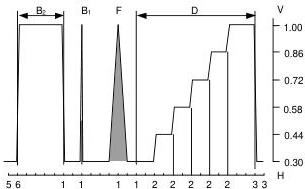
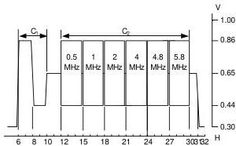
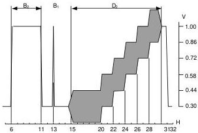
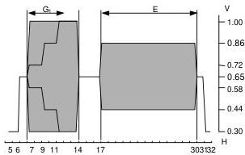
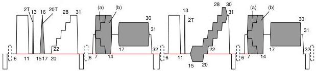
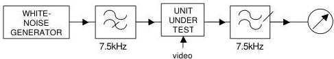
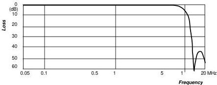
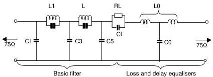

# PERFORMANCE SPECIFICATION OF EQUIPMENT FOR E.B.U. INSERTION SIGNALS

(625 line television systems)

This specification embodies the results of the work undertaken during several years by the Video Sub-group of Working Party M, which was subsequently pursued by Project Group T/G3 of E.B. U. Working Party T when that Working Party was set up to replace the former Working Parties L and M.

The work of the Video Sub-group led to the publication in June, 1970, of a first provisional specification with the reference Com.T. (M)V.14 ; that text has been revised and brought up to date .by Project Group T/G3. That revised version, reference Com.T. (T/G3)201, is annulled and replaced by the specification reproduced in this document .

Insertion signals are being used to a rapidly increasing extent in television production centres and on the networks used for collecting and distributing television signals. The E.B. U. has, in particular~ made their use obligatory with effect from 1st July, 1974 for all Eurovision transmissions. The technique makes it possible to reduce the duration of pre-transmission tests (a valuable advantage in view of the heavy traffic loading on many of the circuits), because measurements are possible throughout the transmission of the programmes. Furthermore, automatic monitoring equipment may be used to give alarms on faulty transmissions and to provide data for statistical purposes on the long-term behaviour of networks. The signal may also be used in automatic equalisers for the correction of distortion. The requirements of the Members of the E.B.U. cover all the foregoing applications, together with the transmission of operational information by the use of lines in the field-blanking period.

## 1. Introduction

C.C.I.R. Recommendation 473 * specifies test signals that may be inserted in lines 17, 18, 330 and 331 of a 625-line television signal. This document provides details of the specifications applicable to equipment for generating these signals and for inserting or removing them at any standard level video point in the chain. However, for routine operational measurements, it is considered sufficient to use the insertion test-signals on lines 17 and 330.

It is recognised that there are many ways of generating and inserting such signals, and for that reason this specification describes the E.B.U. system as an entity, rather than the individual units for generating or inserting the signals.

Further, various stages of complexity are possible in the facilities offered; for example, it will, in some situations, be possible to employ equipment which simply inserts the signal into the chain by means of a resistive network, without any provision for the removal of the signal or for the transmission of data signals. In other situations, it will be necessary to remove incoming insertion signals and replace them with new signals generated locally.

The specified requirement is for equipment for the generation and insertion of test-signals in lines 17 and 18 of one field and in lines 330 and 331 of the other field, but manufacturers may wish to offer equipment suitable also for the insertion of data signals in lines 16 and 329 and national test-signals in lines 19 to 22 of one field and lines 332 to 335 of the other field. This possibility has been envisaged in §§ 2.5 and 2.11 of this specification.

* Insertion of special signals in the field-blanking interval of a television signal.
C.C.I.R. Recommendation 473, XIIth Plenary Assembly, New Delhi 1970, Vol. V, Part 2, pp. 239-249.
Re-issued as Recommendation 473-1 by the XIIIth Plenary Assembly, Geneva 1974 (document CMTT/ 1042).

## 2. General requirements

2.1. The input to the equipment will normally be a standard-level 625-line monochrome or colour video signal, but a free-running mode is also envisaged (see § 2.7 and Section 6).

2.2. The system shall be protected against supply failure by a by-pass relay operating on the main signal path. The same protection circuit shall operate when any module in the main signal path is withdrawn from the main chassis or rack frame.

2.3. It is expected that a system will consist of:
a) an insertion-signal generator unit (which may employ discrete modules or discrete printed-circuit cards) capable of providing all the' signal elements listed in § 2.6 and specified in § 7.2;
b) an inserter unit providing a path for the main video signal and one or more separate input channels which allow insertion of signal elements from unit a) or from other external units.

2.4. It shall be possible to control remotely the insertion and erasure of the insertion signal.

2.5. Provision shall be made for erasing incoming insertion signals which may have been inserted at an upstream point in lines 16 to 22 of one field and lines 329 to 335 of the other field. The "erase" selector must provide individual selection of any of these lines, up to the maximum of fourteen lines.

2.6. The generator shall provide the following basic signal elements:
a) a luminance bar of duration 10 μs.
b) a 2T sine-squared pulse.
c) a 20T composite pulse,
d) a five-riser staircase.
e) signal element d) with superimposed sine wave of colour sub-carrier frequency.
f) a chrominance bar on a mid-grey pedestal.
g) sub-carrier reference on a mid-grey pedestal.

These signals are specified in § 7.2.

It should be noted that the use of a multiburst signal on the Eurovision network is not envisaged, but if required should conform with the appropriate part of this specification.

In the C.C.I.R. arrangement for an international insertion test-signal, the signal elements are assembled to form the composite insertion test-signal depicted in Appendix 1, but for the E.B.U. insertion signal the multiburst signal will be omitted and the sequence shown for line 331 will be repeated in line 18.

It shall be possible, by adjustment of the generator (if necessary using workshop facilities), to reset the individual timings of any of the seven signal elements described in § 2.6 above in increments of H/32, where H is the system line-period (nominally 64 μs).

2.7. In the "free-running" mode, the generator shall provide line-synchronising pulses
2.8. The electrical performance of the system shall be such that when four systems are connected in series, the impairment to the picture is negligible (see § 7.1 for specified performance of the main signal path).
2.9. It is desirable that selection of the insertion line should be by means of a digital counter and that protection against field and line-sync. disturbances such as "drop-outs" in tape-recordings should be provided. The inserter should perform satisfactorily with variations on input signal level of up to +3 dB, -6 dB with respect to the nominal 1 V input. Furthermore, the equipment shall continue to operate normally when a 6 μF non-polarised capacitor is connected in series with the input (75 Ω impedance) and the picture signal in all active lines is changed rapidly between black and white. See Appendix 2 for a description of the method. Additionally, operation of the by-pass switch shall not cause any significant disturbance to the picture *
2.10. The numbers of the lines in which test-signals may be inserted must be clearly indicated on the equipment itself and it should not be necessary to use a waveform monitor to set up the equipment to insert the required signal element in any given line.
2.11. The system shall be capable of inserting the specified signal elements in lines 16 to 22 of one field and 329 to 335 of the other field. The possibility of inserting the signal elements in lines other than 16, 17 and 18 and 329, 330 and 331 is included in order to enable the same system to be used for national purposes.
2.12. The chrominance components of signal elements occurring in adjacent lines shall maintain, one to another, a high order of phase stability. Any difference should not exceed  $2^{\circ}$ . The phase differences between the individual chrominance elements of line 331 should not exceed  $0.5^{\circ}$ .

* To satisfy this condition, it will probably be necessary to maintain connection to the internal sync separator in the by-pass mode.

2.13. A preset control shall be provided inside the equipment to allow small adjustments of the timing with respect to the point "OH" (the half-amplitude point of the leading edge of the line-synchronising pulse that coincides with that of a field-synchronising pulse). A range of adjustment of 0-0.5 µs is sufficient.

2.14. It is assumed that there will be several interconnections at logic level within the system described. If necessary, further + 5 V logic-level outputs shall be provided for controlling ancillary equipment such as multiburst generators and data transmitters.

2.15. The equipment shall operate satisfactorily in the presence of coded pulses which may be superimposed on the synchronising pulses (e.g. for transmitting an accompanying sound signal), and the insertion signals shall not degrade any auxiliary channel thus derived. These tests shall be performed with an input signal having a 10% negative echo delayed by 300 ns or more and a signal-to-noise ratio of 30 dB (using bandlimited noise, measured unweighted). The characteristics of the sound-in-syncs system, which utilises coded pulses in the synchronising interval, are given in the E.B.U. Review, No. 113-A, February 1969, pp. 13-18.

2.16. A unit (to be used in conjunction with an external synchronising-pulse generator) with an independent output at standard level shall be provided for generating a composite video signal consisting of any of the following, at will :

a) all active lines at white level ;
b) all active lines at mid-grey level (50% of the black/white transition)
c) all active lines at black level.

The use of this signal shall not affect the insertion signals generated

Where the external synchronising-pulse generator provides colour-synchronising information, the burst must be produced at the output.

2.17. It is desirable that the equipment shall continue to operate with substandard input signals. Details of tests using such input signals are given in Appendix 2. Manufacturers are asked to inform the Director of the E.B.U. Technical Centre of the results of these tests on their equipment when submitting requests to the E.B.U. for homologation of their equipment.

2.18. After adjustment at an ambient temperature between 20° and 25°C, the equipment shall continue to satisfy the specification without further adjustment when the ambient temperature is reduced to 0°C and increased to 45°C.

## 3. Signal input arrangements

### 3.1. Main signal channel

Standard level (see § 7.1.1).

This input shall be terminated internally in $75\,\Omega \pm 0.5\%$ unless the equipment is in the "by-pass" mode.

### 3.2. By-pass mode

Input connected to transmission output when change-over relay unenergised *. This condition shall result if any of the following occurs :

a) electricity-supply failure ;
b) no output from the power-supply unit ;
c) any module necessary for the normal passage of the video signal removed from the rack-frame ;
d) "by-pass" switch on the unit operated, when in the "local-control" condition ; e) remote "by-pass" switch operated, when in the "remote-control" condition .

## 4. Signal Outputs

### 4.1. Main signal outputs

The signals of the transmission and auxiliary outputs will be at the standard level.

### 4.2. "Mixed syncs" ***

Re-formed sync waveform derived from the input signal. Any modulation in the synchronising interval must be removed. Output level either 2 V peak-to-peak, or 4 V peak-to-peak as specified in the order. The return loss on this output shall be better than 30 dB up to 4 MHz, referred to an impedance of 75 Ω.

**The purpose of this signal is to synchronise external test-signal generators used in conjunction with this system.**

## 5. Remote control

5.1. Facilities for the remote control of the "erase" and "insert" functions shall be provided (see § 2.4).

5.2. Facilities for the remote control of the "by-pass" mode shall be provided (see § 3.2).

## 6. Operating Modes

It will be understood from Section 2 that the equipment is normally expected to operate in conjunction with an input video signal. To facilitate long-term testing requirements in which the generator may be needed to produce continuous ("full-field") test-signals. The following output signal combination should be provided.

### 6.1. Normal mode

This is the normal mode in which test-signals are inserted in the video signal. The insertion-signal generator is locked to the synchronising pulses (and to the colour burst, if present) of the incoming video signal.

The synchronising pulses of the input signal are retained. Synchronising pulses are not required from the internal generators or from any external generator (e.g. for a multiburst) which may be in use. Where a colour burst is not present in the input signal (e.g. during a monochrome transmission), the chrominance signal frequency shall be as specified in § 7.2.2.e).

### 6.2. Full-field mode * *

No incoming video signal is required in this mode. An alternative source of black, white or grey signals shall be provided internally (see § 2.16).

6.2.1. The internally generated signal shall contain :

a) mixed synchronising pulses ;
b) a uniform level during active picture time (see § 6.2.2);
c) sub-carrier burst with phase alternation and blanking when the necessary standard waveforms are available (see § 6.2.3).

* This facility may not be required in those generators which are used to provide only the E.B.U. signals on lines 17, 18, 330 and 331. Alternative arrangements may be necessary in countries using the SECAM system.

6.2.2. The choice of the uniform level during active picture time shall be controlled by a switch on the front panel of the instrument, selecting the following :

a) "black" (capable of adjustment by a preset control over the range 0-15 % of the luminance-bar amplitude);
b) "white" (capable of adjustment by another preset control over the range 85-100 % of the luminance-bar amplitude);
c) "grey" (approximately 50 % of the luminance-bar amplitude);
d) "black" and "white" switched to constitute a square wave of unity mark/ space ratio and with a period adjustable by means of a preset control over the range 1 to 10 seconds.

6.2.3. The inputs available to produce the signal described in § 6.2.1 are :

a) mixed blanking;
b) mixed synchronising pulses
c) burst gate;
d) chrominance sub-carrier;
e) PAL identification signal.

6.2.4. The normal insertion signals shall be provided during field blanking.

6.2.5. By repeating the insertion test-lines in the active picture time it would be possible to use the same equipment for the measurement of apparatus such as quadruplex television tape-machines. To give the maximum degree of flexibility, it is considered that the equipment should provide the choice of :

a) any one of the four insertion test-signals repeated every line;
b) any two of the four insertion test-signals repeated line alternately;
c) any two of the four insertion test-signals repeated every eight lines, the intervening lines being at white, black, grey or switched white/ black (see § 2.16).

### 6.3. Independent generator operation

It will be understood that the generator and inserter are intended normally to work together as a system. However, it is probable that in certain situations it will be convenient to use the generator without the inserter. There are then two modes of generator operation :

- the free-running mode,
- the locked mode.

#### 6.3.1. Free-running mode *

The generator will cycle between the test-signals at nominal line repetition rate. The following output signal combinations shall be obtainable by switching or by simple adjustments to wiring :

a) Any one of the four insertion test-signals generated line repetitively.

b) Any two of the four insertion test-signals generated line-alternately.

c) Any two of the four insertion test-signals repeated every eight lines, the six intermediate lines being either at black or white level, at will.

For all the above signal combinations, the internal sync-pulse generator shall operate continuously at approximately the line-repetition frequency. Field-sync pulses need not be present. To permit measurement of the signal by vectorscopes, colour-burst reference pulses should be present, but these need not be phase-alternated.

#### 6.3.2. Locked mode *

The generator shall provide the output-signal combinations as listed in § 6.3.1., but with the test-signals locked to the line and field synchronising pulses of an external mixed synchronising pulse waveform. The output from the generator must be fully blanked and contain colour-burst pulses and mixed synchronising pulses. It must be possible to lock the internal sub-carrier oscillator to an external sub-carrier source.

Test-signal elements are not required to be generated during the field blanking interval.

The colour burst need not be phase-alternated.

* This facility may not be required in those generators which are used to provide only the E.B.U. signals on lines 17, 18, 330 and 331.

## 7. System characteristics

### 7.1. Main signal path

7.1.1. Nominal input level
Luminance : + 0.7 V
Sync pulses : -0.3 V

7.1.2. Input impedance
75 Ω ± 0.5% (resistive component)
Return loss better than 30 dB up to 7 MHz

7.1.3. Output impedance
75 Ω ± 0.5% (resistive component)
Return loss better than 30 dB up to 7 MHz

7.1.4. Isolation between transmission and auxiliary outputs
Up to 1 MHz : better than 46 dB
At 4.43 MHz : better than 36 dB

7.1.5. Gain
0 dB ± 0.1 dB

7.1.6. Frequency response
± 0.1 dB up to 6 MHz
+ 0.1 to -0.6 dB from 6 to 10 MHz

7.1.7. Chrominance/luminance inequalities
Gain : dB &lt; 0.05
Delay: ns &lt; ± 5

7.1.8. 2T pulse-to-bar ratio
100% ± 25%

7.1.9. 2T pulse overshoot
Must not differ from the input signal by more than .0.5 % of the luminance bar amplitude

7.1.10. 50-Hz square-wave tilt
&lt; 0.5%

7.1.11. 15-kHz line tilt
&lt; 0.25 %

7.1.12. Luminance into chrominance intermodulation
a) differential phase
b) differential gain
at standard level at +3 dB
&lt; 0.15° &lt; 0.3°
&lt; 0.2 % &lt; 0.4 %

7.1.13. Chrominance into luminance intermodulation
&lt; 0.5% of pedestal amplitude

7.1.14. Line-time non-linearity
&lt; 0.25 %

The foregoing tests shall be conducted with mean luminance levels of approximately 15%, 50% and 85% of the luminance-bar amplitude. In §§ 7.1.15 to 7.1.19, the reference level is the nominal peak-to-peak luminance amplitude of the picture signal.

7.1.15. HF noise (weighted) Better than -75 dB RMS
7.1.16. Residual sub-carrier On lines other than insertion line: better than -60 dB peak-to-peak
7.1.17. Hum and lower order harmonics Better than -60 dB peak-to-peak
7.1.18. Spurious transients induced in the signal path during picture time and during the active part of the insertion lines Better than -60 dB peak-to-peak *
7.1.19. Spurious transients induced in the signal path at other times Better than -40 dB peak-to-peak *
7.1.20. Signal rejection in the "erase" mode 2T pulse : &gt; 70 dB Sub-carrier : &gt; 60 dB
7.1.21. Cross-talk into main signal path from insertion signals measured with identical signals at all insertion channel inputs 2T pulse : &lt; -70 dB peak-to-Sub-carrier : &lt; -60 dB peak

### 7.2. Insertion test-signal elements

Measurements shall be made at the main video output, correctly terminated with 75Ω ±0.1%. The characteristic instants of the luminance and chrominance elements, except the 2T and 20T pulses, are measured at the mid-amplitude of the transitions and are referred to the mid-amplitude point of the leading edge of the synchronising pulse (see Appendix 1).

#### 7.2.1. Luminance bar

a) Amplitude 0.7 V ± 1%
b) Shape and times of rise and fall Approximately 200 ns (or may be derived from the shaping network of the sine-squared pulse or of the staircase waveform)
c) Tilt (10 μs period) &lt; 0.5%

#### 7.2.2. Staircase signal

a) Level of the uppermost tread of the staircase Within ± 1% of the luminance-bar amplitude
b) Number of risers 5
c) Shape of risers Determined by a Thomson filter with a transfer-function modulus having its first zero at 4.43 MHz

* Measured via the weighting filter specified in Appendix 4.

d) Line-time non-linearity
The difference in amplitude between the largest and smallest risers must be less than 0.5% of the largest amplitude

e) Superimposed sub-carrier frequency and phase
Frequency: 4.43361875 MHz ± 10 Hz
phase: 60° ± 5° to the B-Y axis
referred to the burst (when present)

f) Rise and fall times of subcarrier superimposed on the staircase
1 µs approximately

g) Inherent differential gain ≤ 0.5 %

h) Inherent differential phase ≤ 0.2°

i) Amplitude of superimposed subcarrier
0.28 V ± 1% peak-to-peak

#### 7.2.3. 2T pulse

a) Amplitude
Within ±1% of luminance-bar amplitude

b) Half-amplitude duration
200 ± 6 ns

c) Ripples after the pulse
(to be stated by the manufacturer)

#### 7.2.4. 20T composite pulse

a) Amplitude
within ±1% of luminance-bar amplitude

b) Half-amplitude duration
2 ± 0.06 µs

c) Inherent chrominance/luminance gain and delay inequalities
perturbations in the pulse base-line
&lt; 0.5% of the pulse amplitude

d) Sub-carrier leak
&lt; 3.5 mV peak-to-peak on insertion lines

e) Harmonic content of sub-carrier
≤ -40 dB

#### 7.2.5. Chrominance bar *

a) Peak-to-peak amplitude
Within ± 1% of the luminance-bar amplitude

b) Pedestal
0.35 V ± 1%
(Rise-time : as in § 7.2.1. b)

c) Inherent chrominance/luminance intermodulation
≤ 0.5% of pedestal amplitude

d) Envelope rise-time
1 µs approximately

* The signals specified in §§ 7.2.5 and 7.2.6 are the waveforms (a) and (b) respectively, inserted on lines 18 and 331 (see Appendix 1). The generator shall be capable of providing both signals, selection being made by internal adjustment.

#### 7.2.6. Three-level chrominance bar *

This signal may be used as an alternative to the chrominance-bar signal specified in § 7.2.5.

a) Position of transitions 7H/32, 9H/32, IIH/32 and 14H/32
b) Peak-to-peak amplitudes

1st section within 1% of 1/5 of the luminance bar (nominal value: 0.14 V)
2nd section within 1% of 3/5 of the luminance bar (nominal value: 0.42 V)
3rd section within ±1% of the luminance bar (nominal value: 0.7 V)

c) Pedestal 0.35 V ± 1% (Rise-time: as in § 7.2.1.b)
d) Inherent chrominance/ luminance intermodulation ≤ 0.5% of pedestal amplitude
e) Envelope rise-time 1 μs approximately

#### 7.2.7. Chrominance reference

a) Amplitude 0.42 V ± 1% peak-to-peak
b) Pedestal As in § 7.2.5.b)
c) Envelope rise-time 1 μs approximately

#### 7.2.8. Black-level stability

Over the range of ambient temperature set out in § .2.17, the change in black level of an inserted or erased line, relative to the black level of the main signal, shall not exceed 5 mV.

#### 7.2.9. Multiburst signal

a) Luminance pedestal 0.35 V ± 1%
b) Reference bar (CI)
1st section: 0.56 V ± 1%
2nd section: 0.14 V ± 1%

* The signals specified in §§ 7.2.5 and 7.2.6 are the waveforms (a) and (b) respectively, inserted on lines 18 and 331 (see Appendix 1). The generator shall be capable of providing both signals, selection being made by internal adjustment.

c) Sine wave signals  $(\mathbf{C}_2)$

Each burst shall start at zero phase of the sine wave, and contain as many complete cycles as needed to leave a gap of between 400 ns and 2 ~s before the start of the next one.

The frequencies of the bursts shall be : 0.5 MHz ± 1%

1.0 MHz ± 1%
2.0 MHz ± 1%
4.0 MHz ± 1%
4.8 MHz ± 1%
5.8 MHz ± 1%

Peak-to-peak amplitude: within  $1\%$  of the amplitude of the reference bar signal C1 (nominal value 0.42 V).

DC component of each burst: not to exceed  $0.5\%$  of the amplitude of the reference-bar signal.

Harmonic content of each burst: at least 40 dB below the fundamental.

## APPENDIX 1

### Insertion test-signal waveforms

#### a) C.C.I.R. test signals

(defined in Recommendation 473-1)

*Figure 1 - C.C.I.R. test signal waveform.*

*Figure 2 - C.C.I.R. test signal waveform, line 18.*

*Figure 3 - C.C.I.R. test signal waveform, lines 17 and 330.*

*Figure 4 - C.C.I.R. test signal waveform, line 331.*

#### b) E.B.U test signals

*Figure 5 - E.B.U. test signals, lines 17, 18, 330 and 331.*

The E.B.U. signals differ from those of the C.C.I.R. in that the multiburst signal in line 18 is replaced by the chrominance signal of line 331.

## APPENDIX 2

### Special tests for checking performance of insertion-signal equipment with sub-standard input signals

#### 1. Signal level

The composite input signal is increased to determine the level at which a significant malfunction of the equipment occurs. A representative selection of input signals both with and without sound-in-syncs should be used including a black/white bump. (A significant malfunction is interpreted to be that which is likely to upset other equipment or to be visible on picture monitors or domestic receivers.)

The input signal is then attenuated until the sync separator malfunctions. This will probably be observed by the position of the insertion test-signals at the output jumping in position or by fluctuations in black level of the output signal due to stray clamp pulses.

#### 2. Noise

White noise in the range 30 Hz to 6 MHz is added to the input signal. The noise is increased until the output of the insertion equipment shows an impairment compared to the input signal. This will probably be of the same form as in § 1.

This test should be repeated with an attenuated input signal.

#### 3. Hum

A 50-Hz sinewave from a signal generator is added to the input signal and its amplitude is increased until malfunction of the equipment occurs. This is most likely to happen when the zero crossing point of the sinewave occurs during the field- blanking period of the input signal. The frequency of the generator should be varied slightly each side of the field frequency during this test and the amplitude slowly reduced until malfunction never occurs.

This test should also be repeated with an attenuated input signal.

With the 50-Hz signal set to a level at which the equipment functions normally the hum rejection of the equipment is measured by observing the peak-to-peak variation of the output black level and comparing it with the peak-to-peak added sine wave.

#### 4. Tilt

Low-frequency tilt is produced by placing a non-polarising capacitor in series with the input signal. This capacitor is decreased in value until malfunctioning of the equipment occurs. The loss at low frequencies produced by this capacitor is equivalent to that of a time constant of 2 $\mathrm{CR}_{\mathrm{T}}$, where C is the value of the capacitor, and where $R_{\mathrm{T}}$ is the sending impedance equal to the terminating impedance, that is 75 Q.

A typical value of capacitor for which normal operation should be maintained is 6 $\mu$F.

This test should also be repeated with an attenuated input signal

#### 5. Drop-outs

A negative pulse is added to the input signal. This pulse is obtained from a pulse generator which is triggered from field drive pulses. The pulse may be varied in width and position in the field of the input signal by the controls on the pulse generator.

To simulate "drop-outs" occurring on VTR signals the pulse duration should be 2 $\mu$s and the amplitude 0.6 V (i.e. extending below black level by twice the height of sync pulses). The position of the pulse should be moved through the field with special attention to the field-blanking period while the output of the equipment is monitored for disturbances.

#### 6. Flashing

The previous test is repeated using a 50-$\mu$s pulse. This pulse simulates the effect noted on some transmission links, that whole lines of information are raised or depressed at the receiving end.

**Note:** In tests 5 and 6, it would be expected that some disturbance would occur to the output signal if the pulse occurred during the clamping period. This disturbance should not be prolonged or cause any "locking-up" of the output signal.

#### 7. Noise conversion

In this test, complementary low-pass and high-pass filters with cut-off frequencies of  $7.5\mathrm{kHz}$  are required. The output of a white-noise generator in the range of  $06\mathrm{MHz}$  is passed through the  $7.5\mathrm{-kHz}$  high-pass filter to the input of the insertion equipment. The sync separator of the equipment is supplied separately by a normal video signal. The output of the inserter is passed through the  $7.5\mathrm{-kHz}$  low-pass filter and is measured on a true RMS voltmeter. The high frequency to low frequency noise conversion may then be expressed as the RMS noise voltage in the  $07.5\mathrm{-kHz}$  output spectrum compared with RMS noise voltage in the  $7.5\mathrm{kHz} - 6.0\mathrm{MHz}$  input spectrum.

*Figure 6 - Arrangement for testing noise conversion.*

## APPENDIX 3

### Typical results of tests

The tests described in Appendix 2 yielded the following results when undertaken using a homologated instrument satisfying the requirements of this specification. Various types of input signal were used in these tests, including colour bars, black/white bump, both with and without Sound-in-Syncs, and the figures given are for the most critical signal.

#### Results

1) Incorrect signal amplitude. Normal operation over range + 7 dB to -21 dB with respect to standard level.

2) Addition of white noise over range 30 Hz to 6 MHz. Normal operation maintained down to a luminance signal-to-noise ratio of + 23 dB at standard level; at a signal level of -12 dB the signal-to-noise ratio required becomes + 21 dB (luminance signal-to-RMS noise). There is thus a greater tolerance as noise and signal are equally attenuated.

3) Hum 50 Hz. Satisfactory operation at standard level input with hum of 1.5 V peak-to-peak. Satisfactory operation with video attenuated by 12 dB with input hum at 1V peak-to-peak. Input hum decreased by at least 44 dB at the output of the inserter.

4) Low-frequency tilt produced by placing a 6.6-µF capacitor in series with video input, producing a loss of low frequencies equivalent to a time constant of 990 µs [6.6 x (75 + 75) µs]. Normal operation continued. Same result at signal level of -12 dB.

5) A brief negative pulse of 2 µs duration extending beyond tips of syncs by the height of the sync pulse, i.e. pulse extends below black level by twice the height of the sync pulse. Normal operation generally continued, but a brief clamping error could occur with a probability of about 1 in 20, and a mistiming of the insertion generator could also occur with a probability of about 1 in 300. Insertion occurred during wanted lines only.

6) A 50-µs negative pulse extending beyond tips of syncs by the height of the sync pulse. Normal operation generally continued, but a brief clamping error could occur with a probability of about 1 in 20, and a mistiming of an insertion line could also occur with a probability of about 1 in 150. Insertion occurred during wanted lines only. No paralysis occurred.

7) Conversion of high-frequency noise to low-frequency noise. White noise over the frequency range 7.5 kHz to 6 MHz applied to the insertion equipment. The sync separator was separately locked by a video signal. Noise in the frequency range up to 7.5 kHz measured at the output of the inserter was found to be 16 dB down compared with the "white noise" input.

## APPENDIX 4

### Low-pass filter for weighting of spurious transients

*Figure 7 - Low-pass filter response curve.*

*Figure 8 - Circuit diagram of the low-pass filter.*

c) Component values

|  Capacitors | Coils and resistor | Resonant frequency  |   |
| --- | --- | --- | --- |
|   |   |  (1) | (2)  |
|  C1: 210 pF |  |  |   |
|  C2: 34.6 pF | L1: 1.81 μH | 20.111 MHz | 5.116 MHz  |
|  C3: 384 pF |  |  |   |
|  C4: 103 pF | L2: 1.39 μH | 13.301 MHz | 5.497 MHz  |
|  C5: 159 pF |  |  |   |
|  CL: 0.022 μF | RL: 2.2 Ω | (1) Normal configuration  |   |
|  C0: 560 pF | L0: 2 x 0.79 μH | (2) With a 500 pF capacitor in parallel with C2 and C4  |   |
|   | (K = 1) |  |   |
