# IEC 60461:2010 Time and control code

## Introduction

IEC 60461 was originally developed for analogue television recording systems and thus dealt only with interlaced television systems operating with frame rates up to 30 frames per second. It is, however, flexible enough in design to be used in digital television systems, both standard definition and high definition. The support for progressive video systems with frame rates above 30 frames per second is described in this International Standard.

Clauses 4, 5, and 6 specify the manner in which time is represented in frame-based systems. Clause 7 specifies the structure of the time address and control bits of the code, and sets guidelines for storage of user data in the code. Clause 8 specifies the modulation method and interface characteristics of a linear time code (LTC) source. Clause 9 specifies the modulation method for inserting the code into the vertical interval of a television signal. Clause 10 summarises the relationship between the two forms of time and control code. Clause 11 summarises time code implementations for video formats with frame rates greater than 30 fps.

## 1 Scope

This International Standard specifies a digital time and control code for use in television, film, and accompanying audio systems operating at nominal rate of 60, 59,94, 50, 30, 29,97, 25, 24 and 23,98 frames per second. This International Standard specifies a time address, binary groups, and flag bit structure. In addition, the standard specifies a binary group flag assignment, a linear time code transport, and a vertical interval time code transport.

This International Standard defines primary data transport structures for linear time code (LTC) and vertical interval time code (VITC). This standard specifies the LTC modulation and timing for all video formats. This standard also defines the VITC modulation and location for 525/59,94 and 625/50 analogue composite and component systems only.

NOTE The digital representation of analogue VITC (D-VITC) is specified in SMPTE 266M and is defined for 525/59,94 and 625/50 digital component systems only. High definition formats, such as those documented in SMPTE 274M and SMPTE 296M, should use ancillary time code (ATC) as specified in SMPTE 12M-2 (formerly SMPTE RP 188) for transport of time code in the digital video data stream. For future implementations of time code for digital standard definition formats, the use of ATC rather than D-VITC is encouraged.

## 2 Normative references

The following referenced documents are indispensable for the application of this document. For dated references, only the edition cited applies. For undated references, the latest edition of the referenced document (including any amendments) applies.

ISO/IEC 646:1991, Information processing – ISO 7-bit coded character set for information interchange

ISO/IEC 2022:1994, Information technology – Character code structure and extension techniques

ITU-R BT.1700-1(2005), Annex 2, Characteristics of composite video signals for conventional analogue television systems

SMPTE 170M:2004, Television – Composite Analog Video Signal – NTSC for Studio Applications

SMPTE 258M:1993, Television – Transfer of Edit Decision Lists

SMPTE 262M:1995, Television, Audio and Film – Binary Groups of Time and Control Codes – Storage and Transmission of Data

SMPTE 309M:1999, Television – Transmission of Date and Time Zone Information in Binary Groups of Time and Control Code

## 3 Terms, definitions and reserved

### 3.1 Terms and definitions

For the purposes of this document the following terms and definitions apply.

#### 3.1.1
##### binary coded decimal system
##### BCD system
means for encoding decimal numbers as groups of binary bits

NOTE 1 Each decimal digit (0-9) is represented by a unique four-bit code. The four bits are weighted with the digit's decimal weight multiplied by successive powers of two.

NOTE 2 For example, the bit weights for a "units" digit would be $1 \times 2^{0}$, $1 \times 2^{1}$, $1 \times 2^{2}$, and $1 \times 2^{3}$, while the bit weights for a "tens" digit would be $10 \times 2^{0}$, $10 \times 2^{1}$, $10 \times 2^{2}$, and $10 \times 2^{3}$.

#### 3.1.2
##### frame
contains all of the lines of spatial information of a video signal required to make up one complete picture (including any necessary associated synchronization lines)

NOTE For progressive video, these lines contain picture samples, captured at one time instant, starting from the top of the frame and continuing through successive lines to the bottom of the frame.

#### 3.1.3
##### field
frame consists of two fields for interlaced video: one of these fields will commence one field period later than the other

NOTE See SMPTE 170M for an example of such a system. Composite television standards might require multiple fields in a "colour sequence," but that does not alter this standard's nominal terminology.

#### 3.1.4
##### linear time code
##### LTC
code word format and modulation system which is normally used to record the time code signal on a linear recording medium or to transport the serial signal over an interface independent of any video signal

#### 3.1.5
##### vertical interval time code
##### VITC
code word format and modulation system used to insert the time code signal in an active line within the vertical blanking interval of an analogue standard definition television (SDTV) signal

#### 3.1.6
##### time and control code
encompasses all aspects of the time address, flag bits, and binary groups for user-defined data codes, as well as two methods of modulation of the resulting code words

NOTE It is commonly abbreviated as "time code" (note also that some users spell this "timecode").

#### 3.1.7
##### time code source
any device which generates a time and control code signal, or regenerates a time and control code signal from a recorded medium or transmission channel

#### 3.1.8
##### original source
refers specifically to a device which is generating the time and control code signal in synchronization with its associated video and/or audio

NOTE The time address and binary group ("user data") payload is attached to a particular frame or frame pairs either directly or by reference within the user's system. For frame-based systems the time address that forms part of the time code is primarily intended as a label to identify discrete frames. It also may imply that a particular frame

has had, has now, or will have, a temporal relationship to something else, such as the frame's position in a sequence of frames or synchronization to a reference signal.

### 3.2 Reserved

Indicates a provision that it is not defined at this time, shall not be used, and may be defined in future.

## 4 Time representation in 30 frames per second and 60 frames per second systems

### 4.1 Definitions of real time and NTSC time

#### 4.1.1 Definition of real time

In a system running at a frame rate of 30 frames per second (fps), exactly one second of real time elapses during the scanning of 30 frames. In a system operating at a frame rate of 60 fps, exactly one second of real time elapses during the duration of 60 frames.

#### 4.1.2 Definition of NTSC time

In an NTSC television system operating at a vertical field rate of 60/1,001 fields per second (=59,94 Hz), one second of NTSC time elapses during the scanning of 60 television fields or 30 television frames. Because of the difference in vertical scanning rates, the relationship between real time and NTSC time is

$$
1 \mathrm {s} _ {\text {N T S C}} = 1, 0 0 1 \mathrm {s} _ {\text {R E A L}}
$$

NOTE 1 There are other television systems (such as some HDTV systems) which operate at 24/1,001, 30/1,001, or 60/1,001 frames per second. The term "NTSC time" is used to indicate its historical origins and to describe the common frame time base of all of these systems.

NOTE 2 The results of dividing the integer frame rates by 1,001 do not result in precise decimal numbers, for example, 30/1,001 is 29,970 029 970 029... (to 12 decimals). This is commonly abbreviated as 29,97. In a similar manner, it is common to abbreviate 24/1,001 as 23,98, and 60/1,001 as 59,94. These abbreviations are used throughout this standard. Sufficient precision is necessary in calculations to assure that rounding or truncation operations will not create errors in the end result. This is particularly important when calculating audio sample alignments or when long-term time keeping is required.

### 4.2 Time address of a frame

#### 4.2.1 Definition of time address of a frame

Each frame shall be identified by a unique and complete address consisting of an hour, minute, second, and frame number. For systems operating at 60 frames per second, each frame pair shall be identified by a unique and complete address consisting of an hour, minute, second, and frame number. Refer to SMPTE 258M for standard formats used to display frame-based time.

The hours, minutes, and seconds follow the ascending progression of a 24-hour clock beginning with 0 hours, 0 minutes, and 0 seconds to 23 hours, 59 minutes, and 59 seconds. The frames shall be numbered successively according to the counting mode (drop frame or non-drop frame) as described below:

NOTE See Clause 11 for additional information regarding television systems which operate at 60 frames per second.

#### 4.2.2 Non-drop frame – Uncompensated mode

Frames shall be numbered 0 through 29, successively, with no omissions.

#### 4.2.3 Drop frame – NTSC time compensated mode

Because the vertical field rate of an NTSC television signal is 60/1,001 fields per second (~59,94 Hz), straightforward counting at 30 frames per second will yield an error of approximately +108 frames (+3,6 s)REAL in one hour of running time.

To minimize the NTSC time error, the first two frame numbers (00 and 01) shall be omitted from the count at the start of each minute except minutes 00, 10, 20, 30, 40, and 50.

Because the frame rate of a progressive NTSC-time related 60 frames per second television signal is actually 60/1,001 frames per second, and each time code count references a frame pair, the same counting mechanism may be applied as well. See Clause 11 for additional information on this subject.

When drop-frame compensation is applied to an NTSC television time code, the total error accumulated after one hour is reduced to –3,6 ms. The total error accumulated over a 24-hour period is –86 ms.

### 4.3 Colour frame identification in NTSC analogue composite television systems

If colour frame identification in the time code is required, the even units of frame numbers shall identify colour fields I and II, and the odd units of frame numbers shall identify colour fields III and IV.

NOTE Even though a component system does not have a colour sequence, the time code may carry colour sequence information from an original video source so that recoding of a composite signal into a component signal and back can preserve the original colour sequence relationship.

## 5 Time representation in 25 frames per second and 50 frames per second systems

### 5.1 Definition of real time

In a system running at a frame rate of 25 frames per second, exactly one second of real time elapses during the scanning of 25 frames. An example of such a system is a 625/50 television system. In a system running at a frame rate of 50 frames per second, exactly one second of real time elapses during the duration of 50 frames.

### 5.2 Time address of a frame

Each frame shall be identified by a unique and complete address consisting of an hour, minute, second, and frame number. For systems operating at 50 frames per second, each frame pair shall be identified by a unique and complete address consisting of an hour, minute, second, and frame number.

The hours, minutes, and seconds follow the ascending progression of a 24-hour clock beginning with 0 hours, 0 minutes, and 0 seconds to 23 hours, 59 minutes, and 59 seconds. The frames (or frame pairs for 50 frames per second systems) shall be numbered successively 0 through 24.

There is no counting mode such as drop frame (which is applicable only to 30 frame counting) that is applicable to 25 frame counting.

NOTE See Clause 11 for additional information regarding television systems which operate at frame rates of 50 frames per second.

### 5.3 Colour frame identification in PAL analogue composite television systems

#### 5.3.1 Colour frame identification

If identification of the eight-field colour sequence in the time code is required, the time address shall bear a predictable relationship with the eight-field colour sequence (as specified in ITU-R BT.1700). This relationship can be expressed using either logical or arithmetic notations as given in 5.3.2 and 5.3.3, respectively.

#### 5.3.2 Logical relationship

Given that the frame and second numbers of the time address are expressed as BCD digit pairs, the value of the logical expression (A|B) ^ C ^ D ^ E ^ F shall be:

"1" for fields 1, 2, 3, and 4;

"0" for fields 5, 6, 7, and 8

where

A equals the value of the 1's bit of the frame number;

B equals the value of the 1's bit of the second number;

C equals the value of the 2's bit of the frame number;

D equals the value of the 10's bit of the frame number;

E equals the value of the 2's bit of the second number;

F equals the value of the 10's bit of the second number;

| represents the logical OR operation;

^ represents the logical EXCLUSIVE OR operation.

#### 5.3.3 Arithmetic relationship

The remainder of the quotient:

$$
\frac{(S + P)}{4}
$$

shall be

0 for fields 7 and 8;

1 for fields 1 and 2;

2 for fields 3 and 4;

3 for fields 5 and 6

where

S equals the decimal value of the "seconds" digits of the time address, and

P equals the decimal value of the frames digits of the time address.

## 6 Time representation in 24-frame systems

### 6.1 Definitions of real time and NTSC time

#### 6.1.1 Definition of real time

In a system running at a frame rate of 24 frames per second, exactly one second of real time elapses during the passing of 24 frames. An example of such a system is a film system.

#### 6.1.2 Definition of NTSC time

In a NTSC-time related television signal operating at 24/1,001 frames per second (approximately 23,976), straightforward counting at 24 frames per second will yield a deviation of approximately 86 frames (3,6 s) in one hour of elapsed time.

Where it is desired to maintain a correspondence with 30 frame per second systems the 30 non-drop frame count mode should be used. For additional details refer to Annex B.1.

### 6.2 Time address of a frame

Each frame shall be identified by a unique and complete address consisting of an hour, minute, second, and frame number. The hours, minutes, and seconds follow the ascending progression of a 24 hour clock beginning with 0 hours, 0 minutes, and 0 seconds to 23 hours, 59 minutes, and 59 seconds. The frames shall be numbered successively 0 through 23.

There is no counting mode such as drop frame (which is applicable only to 30 frame counting) that is applicable to 24 frame counting.

## 7 Structure of the time address and control bits

### 7.1 Numeric code

The numeric code consists of sixteen four-bit groups, eight groups containing time address and flag bits, and eight four-bit binary groups for user-defined data and control codes.

### 7.2 Time address

The basic structure of the time address is based upon the BCD system, using units and tens in digit pairs for hours, minutes, seconds, and frames. Some of the digits are limited to values that do not require all four bits to be significant. These bits are omitted from the time address and include the "80s" and "40s" of hours, "80s" of minutes, "80s" of seconds, and the "80s" and "40s" of frames. Thus the entire time address is coded into 26 bits.

### 7.3 Flag bits

#### 7.3.1 Definition of flag bits

Six bits are reserved for the storage of flags which define the operational mode of the time and control code. A device which decodes a time and control code may utilize these flags to interpret properly the time address and binary group data.

#### 7.3.2 Drop frame flag (NTSC composite television system only)

This flag shall be set to 1 when drop frame compensation is being performed as specified in 4.2.3. When the count is not drop frame compensated, this flag bit shall be set to 0.

#### 7.3.3 Colour frame flag (NTSC and PAL composite television systems only)

If colour frame identification has intentionally been applied to the time and control code by the original source, as defined in 4.3 or 5.3, this flag shall be set to 1. If this flag is set to logical zero then there is no implied relationship between the colour frame sequence and the time address.

NOTE Colour frame identification may be forced by an original source of time and control code by halting the time address until the colour field to time code relationship is satisfied, after which the time address is incremented normally each frame. As long as neither the time address counting sequence nor the colour field sequence is changed, the relationship will remain satisfied.

#### 7.3.4 Binary group flags

Three flags provide eight unique combinations which specify the use of the binary groups (see 7.4). Three combinations of these flags also specify the time address reference as an external precision clock time reference (see 7.5) and these also select subsets of the binary group applications.

NOTE The term binary group flags represents its historical origins, however these flags now also signal time address count parameters.

#### 7.3.5 Modulation method specific flag

The remaining flag bit is reserved for use by each modulation method. This flag is defined in 8.2.6 and 9.2.5.

### 7.4 Use of the binary groups

#### 7.4.1 Binary group flag assignments

The binary groups are intended for storage and transmission of data by the users. The format of the data contained in the binary groups is specified by the value of three binary group flag bits BGF2, BGF1, and BGF0. The following subclauses define the current assignments of the binary group flag states. Table 1 summarises the present assigned combinations.

NOTE The binary groups are commonly referred to as "user bits"

Table 1 – Binary group flag assignments

|  BGF2 | BGF1 | BGF0 | Time address | Binary group | Reference  |
| --- | --- | --- | --- | --- | --- |
|  0 | 0 | 0 | Unspecified | Unspecified | 7.4.2  |
|  0 | 0 | 1 | Unspecified | 8-bit codes | 7.4.3  |
|  1 | 0 | 0 | Unspecified | Date and time zone | 7.4.4  |
|  1 | 0 | 1 | Unspecified | Page/line | 7.4.5  |
|  0 | 1 | 0 | Clock time | Unspecified | 7.4.6, 7.5  |
|  0 | 1 | 1 | Unassigned | Reserved | 7.4.7  |
|  1 | 1 | 0 | Clock time | Date and time zone | 7.4.8, 7.5  |
|  1 | 1 | 1 | Clock time | Page/line | 7.4.9, 7.5  |

#### 7.4.2 Character set not specified and unspecified clock time (BGF2=0, BGF1=0, BGF0=0)

This combination of binary group flags signifies that the time address is not referenced to an external clock and that the binary groups contain an unspecified character set. If the character set used for the data insertion is unspecified, the 32 bits within the eight binary groups may be assigned in any manner without restriction.

#### 7.4.3 Eight-bit character set and unspecified clock time (BGF2=0, BGF1=0, BGF0=1)

This combination signifies that the time address is not referenced to an external clock and that the binary groups contain an eight-bit character set conforming to ISO/IEC 646 or ISO/IEC 2022. If the seven-bit ISO codes are being used, they shall be converted to eight-bit codes by setting the eighth bit to 0.

Four ISO codes may be encoded in the binary groups, each occupying two binary groups. The first ISO code is contained in binary groups 7 and 8, with the least significant four bits in binary group 7 and the most significant four bits in binary group 8. The three remaining ISO codes are stored in binary groups 5/6, 3/4, and 1/2 accordingly.

#### 7.4.4 Date/time zone and unspecified clock time (BGF2=1, BGF1=0, BGF0=0)

This combination signifies that the time address is not referenced to an external clock and that the binary groups contain date and time zone encoding as described in SMPTE 309M.

#### 7.4.5 Page/line multiplex system and unspecified clock time (BGF2=1, BGF1=0, BGF0=1)

This combination signifies that the time address is not referenced to an external clock and that the binary groups contain information formatted according to the page/line multiplex system described in SMPTE 262M. This multiplex system defines a hierarchy that can be used to encode large amounts of data in the binary groups through the use of time multiplexing. Applications for this encoding scheme include control codes, text data, and production information.

#### 7.4.6 Clock time specified and unspecified character set (BGF2=0, BGF1=1, BGF0=0)

This combination specifies that the time address is referenced to an external clock and signifies an unspecified character set. If the character set used for the data insertion is unspecified, the 32 bits within the eight binary groups may be assigned in any manner without restriction (see also 7.5).

#### 7.4.7 Unassigned binary group usage and unassigned clock time (BGF2=0, BGF1=1, BGF0=1)

This combination is unassigned and is reserved for future definition by SMPTE and should not be used.

#### 7.4.8 Date/time zone and clock time (BGF2=1, BGF1=1, BGF0=0)

This combination specifies that the time address is referenced to an external clock and specifies date and time zone encoding as described in SMPTE 309M (see also 7.5).

#### 7.4.9 Specified clock time and page/line multiplex system (BGF2=1, BGF1=1, BGF0=1)

This combination specifies that the time address is referenced to an external clock and specifies the page/line multiplex system described in SMPTE 262M. This multiplex system defines a hierarchy that can be used to encode large amounts of data in the binary groups through the use of time multiplexing. Applications for this encoding scheme include control codes, text data, and production information (see also 7.5).

### 7.5 Clock time reference – Binary group flag combinations

One of three flag combinations shall be set "true" when the time code time address has been referenced to an external precision clock time reference. These flag combinations also define subsets of the available binary group applications (see 7.4.6, 7.4.8, and 7.4.9). One of these combinations may also define the encoding of the time zone and the date in the binary groups (see 7.4.8).

NOTE Additional information relating to time precision is included in Annex A.

## 8 Linear time code application

### 8.1 Code word format

Each LTC code word consists of 80 bits numbered 0 through 79. The bits are generated serially beginning with bit 0. Bit 79 of the code word is followed by bit 0 of the next code word. For systems operating at 30 Hz or below, each code word is normally associated with one television frame. For systems operating above 30 Hz, each code word is normally associated with a pair of television frames.

### 8.2 Code word data content

#### 8.2.1 LTC code word content

Each LTC code word contains the time address, flag bits, binary groups, biphase mark polarity correction bit, and a synchronization word.

#### 8.2.2 Time address

The time address bits of the frame as defined in 7.2. The lowest numbered bit of each group corresponds to the least significant bit of each BCD digit. The bit positions are tabulated in Table 2.

Table 2 – LTC time address bit positions

|  Bit | Definition  |
| --- | --- |
|  0 to 3 | Units of frames  |
|  8 to 9 | Tens of frames  |
|  16 to 19 | Units of seconds  |
|  24 to 26 | Tens of seconds  |
|  32 to 35 | Units of minutes  |
|  40 to 42 | Tens of minutes  |
|  48 to 51 | Units of hours  |
|  56 to 57 | Tens of hours  |

#### 8.2.3 Flag bits

The drop frame, colour frame, and binary group flag bits, as defined in 7.3. The bit positions are listed in Table 3. Note that not all flag bits are used by all systems, as designated by the symbol "—". Unused flag bits should be set to 0 by original sources and ignored by receiving equipment.

NOTE Users are advised that some legacy devices may set unused flag bits to other values.

Table 3 – LTC flag bit positions

|  30-frame bit | 25-frame bit | 24-frame bit | Definition  |
| --- | --- | --- | --- |
|  10 | –[10] | –[10] | Drop frame flag  |
|  11 | 11 | –[11] | Colour frame flag  |
|  27 | 59 | 27 | Polarity correction  |
|  43 | 27 | 43 | Binary group flag BGF0  |
|  58 | 58 | 58 | Binary group flag BGF1  |
|  59 | 43 | 59 | Binary group flag BGF2  |

#### 8.2.4 Binary groups

Eight four-bit binary groups as defined in 7.3. The lowest numbered bit of each group corresponds to the least significant bit of that group. The positions of the bits are listed in Table 4.

Table 4 – LTC binary group bit positions

|  Bit | Definition  |
| --- | --- |
|  4 to 7 | First binary group  |
|  12 to 15 | Second binary group  |
|  20 to 23 | Third binary group  |
|  28 to 31 | Fourth binary group  |
|  36 to -39 | Fifth binary group  |
|  44 to 47 | Sixth binary group  |
|  52 to 55 | Seventh binary group  |
|  60 to 63 | Eighth binary group  |

#### 8.2.5 Synchronization word

The synchronization word is a static combination of bits which can be used by receiving equipment to accurately identify the bit position of the serial code. The LTC synchronization word is unique in that the same combination cannot be generated by any combination of valid data values in the remainder of the code.

Bits 65-78 form a unique pattern that is symmetrical about the center of the synchronization word, allowing detection in either direction. Bits 64 and 79 are complements of each other, allowing a receiver to determine the direction of the code. Sync word bit value for bits 64 and 79 is listed in Table 5.

Table 5 – LTC synchronization word bit positions and values

|  Bit | Sync word bit value  |
| --- | --- |
|  64 | 0  |
|  65 | 0  |
|  66 | 1  |
|  67 | 1  |
|  68 | 1  |
|  69 | 1  |
|  70 | 1  |
|  71 | 1  |
|  72 | 1  |
|  73 | 1  |
|  74 | 1  |
|  75 | 1  |
|  76 | 1  |
|  77 | 1  |
|  78 | 0  |
|  79 | 1  |

#### 8.2.6 Biphase mark polarity correction

This flag bit is specific to the LTC modulation method described in 8.3. The position of this flag is listed in Table 3.

Because of the nature of the modulation method, the polarity of the first clock transition of the first bit of the synchronization word may differ from code word to code word depending on the number of logical 0 in the data.

Applications which switch between two sources of time and control code require the polarity of the two sources to be stable during the synchronization word. In order to stabilize the polarity of the sync word, the biphase mark polarity correction bit shall be put in a state so that every 80-bit word will contain an even number of logical 0. This requirement is summarised as follows:

If polarity correction of the code word is desired and the number of logical 0 in bit positions 0 through 63 (exclusive of the polarity correction bit itself) is odd, then the polarity correction bit shall be set to 1, otherwise the polarity correction bit shall be set to 0.

### 8.3 Modulation method

The LTC code word is biphase mark encoded according to the following coding rules (see Figure 1):

a) a transition occurs at each bit cell boundary, regardless of the value of the bit;
b) a logical 1 is represented by an additional transition occurring at the bit cell midpoint;
c) a logical 0 is represented by having no additional transitions within the bit cell.

The biphase mark encoded signal has no DC component, is amplitude and polarity insensitive, and includes transitions at every bit cell boundary from which the clock may be extracted.

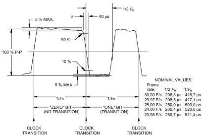

*Figure 1 – Linear time code source output waveform*
IEC 540/10

tr = transition

### 8.4 Bit rate

The bits shall be evenly spaced throughout the address period, and shall occupy fully the address period which is one frame or two television fields. Consequently, the nominal frequency, $F_{\mathrm{e}}$, at which the bits are generated shall be:

$$
F_{\mathrm{e}} = 80 \cdot F_{\mathrm{f}}
$$

where $F_{\mathrm{f}}$ is the frame rate of the television or film system.

If an original source is generating an LTC signal referenced to a television signal, the bit clock shall be phase locked to the television signal. In such a case, each LTC code word is normally associated with one television frame. (See Clause 11 for the exception). However, if an original source is generating an LTC signal without a reference, the frequency tolerance shall be $\pm 100 \times 10^{-6}$.

### 8.5 Timing of the code word relative to a television signal

The timing reference datum for LTC shall be the half amplitude point of the first transition of bit 0 of the 80-bit LTC code word.

For analogue television systems the video reference datum is the start of vertical sync. For digital television systems, the video reference datum is the start of the video frame. For 525/59,94 systems this is the start of line 4 and for all other systems this is the start of line 1.

NOTE 1 SMPTE RP 168, Appendix A defines the timing relationship between the different video formats with common time bases.

The first transition of bit 0 of the codeword shall occur at the reference datum of the video frame with which it is associated. The tolerance shall be $(-32 / +160) \mu s$.

For television systems operating above 30 frames per second, the video reference datum is the start of line 1 of the first frame of the frame pair to which the LTC is associated. The individual frames should be identified by their timing relative to the LTC with the first frame of the pair aligned with LTC bits 0 through 39 and the second frame of the pair aligned with LTC bits 40 through 79. Figure 5 shows an example of the relationship between the resulting LTC and the video signal.

Examples of the alignment of LTC to some 30, 29, 97, 25, 24 and 23, 98 frames per second television systems are shown in Figure 2, Figure 3, and Figure 4.

NOTE 2 Since LTC may be recorded on a different track or stored in a separate area from the video signal on a storage medium, the phase relation between the reproduced LTC and the reproduced video signal may vary during the range of full system operation, while keeping the basic function of video frame identification. Such a video system may regenerate the LTC during playback.

This standard specifies the tolerance for the datum alignment at the output of an original LTC source. A receiver shall as a minimum accept the tolerances of a source time code.

NOTE 3 Users are advised that in operational systems the datum alignment is subject to deviation.

### 8.6 Linear time code interface electrical and mechanical characteristics

#### 8.6.1 Measurements

All measurements shall be made at the interface while driving a resistive load of 1 kΩ.

#### 8.6.2 Rise/fall time

The rise and fall times of the clock and one transition of the time code pulse train shall be 40 μs ± 10 μs, measured between the 10 % and 90 % amplitude points on the waveform.

#### 8.6.3 Amplitude distortion

Any combination of overshoot, undershoot, and tilt shall be limited to 5 % of the peak-to-peak amplitude of the code waveform.

#### 8.6.4 Timing of the transitions

The time between clock transitions shall not vary more than 1,0 % of the average clock period measured over at least one frame. The 1 transition shall occur midway between the two clock transitions within 0,5 % of one clock period. Measurement of these timings shall be made at half-amplitude points on the waveform.

#### 8.6.5 Interface connector

NOTE This subclause is given for information only.

The preferred connector for double-ended or balanced outputs should be 3-pin XLR (MALE) and inputs should be 3-pin XLR (FEMALE). Pin 1 is signal ground, pins 2 and 3 carry the double-ended or balanced signals. The preferred connector for single-ended or unbalanced outputs or inputs shall be BNC (FEMALE).

#### 8.6.6 Output impedance

The output impedance of a single ended, balanced or unbalanced source shall be no greater than 50 Ω. The output impedance of a double ended output shall be no greater than 25 Ω for each output side.

#### 8.6.7 Output amplitude

NOTE This subclause is given for information only.

A preferred output is between 1 V and 2 V peak-to-peak. The allowable range of amplitudes is 0,5 V to 4,5 V peak-to-peak.

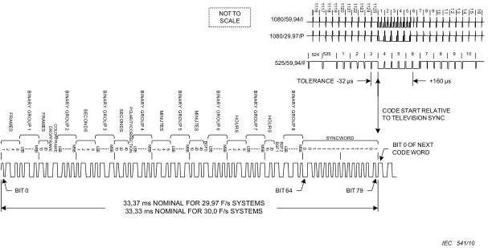

*Figure 2 – 29,97/30 frame linear time code example*

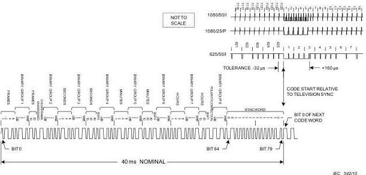

*Figure 3 – 25 frame linear time code example*

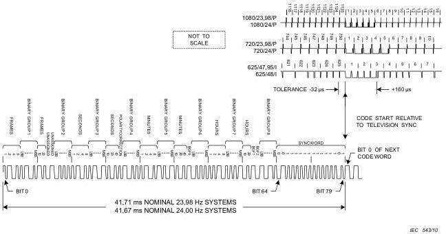

*Figure 4 – 24 frame linear time code example*

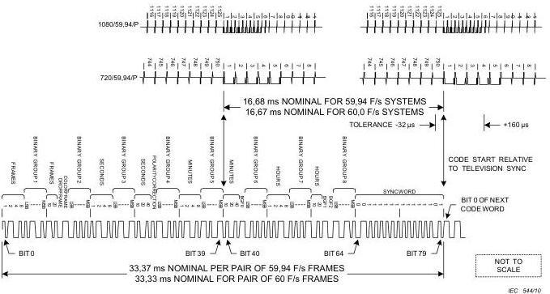

*Figure 5 – Linear time code relationship to 59,94 frame progressive video example*

## 9 Vertical interval application – Analogue television systems

NOTE Digital television systems are encouraged to use ATC for this application. Alternatively, D-VITC may be used.

### 9.1 Code word format

Each code word shall consist of 90 bits numbered 0 through 89, organized as nine groups of ten bits. Each ten-bit group starts with a synchronization bit pair, which is a 1 bit followed by a 0 bit. The synchronization bit pair is followed by eight data bits.

The first eight groups contain the sixty-four time and control code data bits, the ninth contains a cyclic redundancy check (CRC) code used to detect errors in the VITC code word.

The boundaries of the word are defined as the leading edge of the first bit (bit 0) and the trailing edge of the last bit (bit 89). Since bit 0 is the first synchronization bit of the code word, it shall always have the value of 1. Thus, there will always be a rising transition at the leading edge of bit 0 to signal the start of the word.

### 9.2 Code word data content

#### 9.2.1 VITC code word content

Each VITC code word consists of a time address, flag bits, binary groups, field mark flag, CRC code, and synchronization bits. Refer to Figure 6 and Figure 7 for examples of the VITC signal.

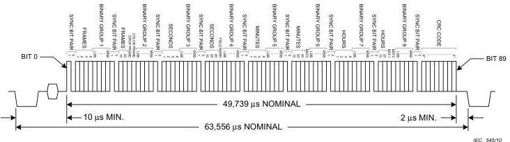

*Figure 6 – 525/59,94 vertical interval time code address bit assignment and timing*

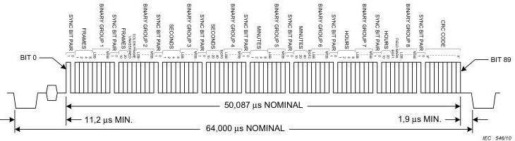

*Figure 7 – 625/50 vertical interval time code address bit assignment and timing*

#### 9.2.2 Time address

The time address bits of the frame as defined in 7.2. The lowest numbered bit of each group corresponds to the least significant bit of each BCD digit. The positions of these bits are listed in Table 6.

Table 6 – VITC time address bit positions

|  Bit | Definition  |
| --- | --- |
|  2 to 5 | Units of frames  |
|  12 to 13 | Tens of frames  |
|  22 to 25 | Units of seconds  |
|  32 to 34 | Tens of seconds  |
|  42 to 45 | Units of minutes  |
|  52 to 54 | Tens of minutes  |
|  62 to 65 | Units of hours  |
|  72 to 73 | Tens of hours  |

#### 9.2.3 Flag bits

The drop frame, colour frame, and binary group flag bits as defined in 7.3. The positions of these flags are listed in Table 7. Note that not all flag bits are used by all systems, as designated by the symbol "—". Unused flag bits should be set to 0 by original sources, and ignored by receiving equipment.

Table 7 – VITC flag bit positions

|  30-frame bit | 25-frame bit | 24-frame bit | Definition  |
| --- | --- | --- | --- |
|  14 | -[14] | -[14] | Drop frame flag  |
|  15 | 15 | -[15] | Colour frame flag  |
|  35 | 75 | 35 | Field flag  |
|  55 | 35 | 55 | Binary group flag BGF0  |
|  74 | 74 | 74 | Binary group flag BGF1  |
|  75 | 55 | 75 | Binary group flag BGF2  |

#### 9.2.4 Binary groups

Eight four-bit binary groups are defined in 7.4. The lowest numbered bit of each group corresponds to the least significant bit of that group. The positions of these bits are listed in Table 8.

Table 8 – VITC binary group bit positions

|  Bit | Definition  |
| --- | --- |
|  6 to 9 | First binary group  |
|  16 to 19 | Second binary group  |
|  26 to 29 | Third binary group  |
|  36 to 39 | Fourth binary group  |
|  46 to 49 | Fifth binary group  |
|  56 to 59 | Sixth binary group  |
|  66 to 69 | Seventh binary group  |
|  76 to 79 | Eighth binary group  |

#### 9.2.5 Field mark flag

##### 9.2.5.1 Position of field mark flag

The position of this flag is listed in Table 7.

##### 9.2.5.2 NTSC analogue composite television system

Field identification shall be recorded as follows: A 0 shall represent monochrome field 1 and colour field I or III. A 1 shall represent monochrome field 2 or colour field II or IV. Colour fields I through IV are defined in SMPTE 170M.

##### 9.2.5.3 PAL analogue composite television system

Field identification shall be recorded as follows: A 0 shall represent colour fields 1, 3, 5, and 7. A 1 shall represent colour fields 2, 4, 6, and 8. Colour fields 1 through 8 are defined in ITU-R BT.1700-1.

##### 9.2.5.4 Analogue component television system

Field identification shall be recorded as follows: A logical zero shall represent field 1. A logical one shall represent field 2.

#### 9.2.6 Synchronization bits

A synchronization bit pair consisting of a 1 followed by a 0 is inserted preceding every eight data bits. Bits 0, 10, 20, 30, 40, 50, 60, 70, and 80 are coded as 1; bits 1, 11, 21, 31, 41, 51, 61, 71, and 81 are encoded as 0.

#### 9.2.7 Cyclic redundancy check code

Eight bits, 82 through 89, are encoded with a CRC code to provide for error detection by cyclic redundancy.

The generating polynomial of the cyclic redundancy check, $G(X)$, is defined as $G(X) = X^8 + 1$ with an initial condition of all 0.

The generating polynomial shall be applied to all bits from 0 to 81 inclusive. The remainder is then encoded in bits 82 through 89 as shown in Table 9.

Applying the generating polynomial to the received data bits 0 through 89, inclusive, shall result in a remainder of all 0 when no error exists.

Table 9 – CRC bit positions

|  Bit | CRC code bit  |
| --- | --- |
|  82 | $X^8$  |
|  83 | $X^7$  |
|  84 | $X^6$  |
|  85 | $X^5$  |
|  86 | $X^4$  |
|  87 | $X^3$  |
|  88 | $X^2$  |
|  89 | $X^1$  |

### 9.3 Modulation method

The VITC code word is NRZ modulated and inserted as a single codeword within the non-blanked interval of a selected television line in the vertical interval (see Figure 8). Signal level to logic level specifications are listed in 9.8.2.

Since an NRZ code has no self-clocking reference, the signal shall be sampled at periodic intervals based on known bit cell timing. The sample period can be adjusted at any available 1-0 or 0-1 transition. Because of the insertion of fixed-value synchronization bits, a transition is guaranteed to occur at least every ten bits.

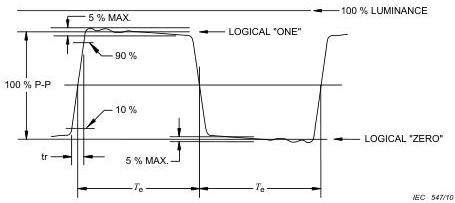

*Figure 8 – Vertical interval time code waveform*
tr = transition

### 9.4 Bit timing

Each bit of the code word shall have a uniform period, $T_{\mathrm{e}}$, related to the horizontal line frequency, $F_{\mathrm{h}}$, as expressed below:

$$
T_{\mathrm{e}} = \frac{1}{115F_{\mathrm{h}}} \pm 2\%
$$

NOTE Previous definitions of the bit timing for 525/60 and 625/50 television systems are different from that given here, but do lie within the tolerance range given.

### 9.5 Timing of the code word relative to the television signal

#### 9.5.1 525/59,94 television system

The half-amplitude point of bit 0 shall occur no earlier than 10,0 µs following the half-amplitude point of the leading edge of the line synchronizing pulse. The half-amplitude point of the trailing edge of bit 89 (logical 1) shall occur no later than 2,1 µs before the half-amplitude point of the leading edge of the following line synchronizing pulse.

#### 9.5.2 625/50 television system

The half-amplitude point of bit 0 shall occur no earlier than 11,2 µs following the half-amplitude point of the leading edge of the line synchronizing pulse. The half-amplitude point of the trailing edge of bit 89 (logical 1) shall occur no later than 1,9 µs before the half-amplitude point of the leading edge of the following line synchronizing pulse.

### 9.6 Location of the address code signal in the vertical interval

#### 9.6.1 Location of the VITC code

The VITC code word shall be inserted on the same line (or lines) in each fields for a given analogue SDTV signal. Line numbers shown in parentheses correspond to the equivalent line in field two.

#### 9.6.2 525/59,94 television system

Insertion of the address code shall not be earlier than line 10(273) or later than line 20(283). The preferred placement of the VITC code word is on line 14(277) and optionally on line 16(279).

If it is necessary to preserve compatibility with older equipment, VITC should appear on two nonconsecutive lines in each field.

In such case the preferred lines are 14(277) and 16(279) except:

- lines 12(275) and 14(277) in type C recorders with sync heads;
- lines 16(279) and 18(281) in type C recorders without sync heads.

#### 9.6.3 625/50 television system

Insertion of the address code shall not be earlier than line 6(319) or later than line 22(335). The preferred placement of the VITC codeword is on television lines 19(332) and 21(334).

#### 9.6.4 Component television system

In analogue component systems, the VITC code word shall be carried in the Y (also known as luma or luminance) video channel.

### 9.7 Redundancy

The address code may be inserted in multiple lines of the vertical interval provided all lines contain the same time address, drop frame, and colour frame data.

Redundancy of the binary group data is dependent on the binary group flags and the requirements of the encoding system which their values indicate.

### 9.8 Vertical interval time code waveform characteristics

#### 9.8.1 Waveform characteristics

This subclause specifies the waveform characteristics of the VITC signal (refer to Figure 8).

#### 9.8.2 Logic level

The tolerance ranges specified for logical 1 and logical 0 states are listed in Table 10.

Table 10 – VITC logic level ranges

|  Television system | Logical 1 | Logical 0  |
| --- | --- | --- |
|  525/59,94 | 70 to 90 IRE | 0 – 10 IRE  |
|  625/50 | 500 to 600 mV | 0 –- 25 mV  |
|  NOTE For analogue component systems, the logic levels apply to the Y video channel.  |   |   |

#### 9.8.3 Rise/fall time

The rise and fall times of the code shall be 200 ns ± 50 ns for 525/59,94 and 625/50 television systems. These measurements shall be made between 10 % and 90 % amplitude points on the waveform.

#### 9.8.4 Amplitude distortion

Amplitude distortion, such as overshoot, undershoot, and tilt, shall be limited to 5 % of the peak-to-peak amplitude of the code waveform.

## 10 Relationship between LTC and VITC

NOTE The relationship between LTC and VITC specified here is primarily addressed to analogue television systems, however, it may also apply to SDTV digital systems employing D-VITC. The relationship may also apply to digital systems employing VITC data carried in ATC.

### 10.1 Time address data

Because of the relative timing of the two time code modulation methods, direct interchange of time address bits is not possible in real time. In order to generate a linear time code from a vertical interval time code, or vice versa, the time address of one frame is incremented by one unit and used as the time address of the next frame. Drop frame and colour frame flag bits (if applicable) are maintained.

This method will produce a one-to-one correspondence between the time address and flag bits of the linear time code and the vertical interval time code as long as the counting sequence is continuous and ascending. Discontinuities will propagate to the second time code after one frame of delay.

### 10.2 Binary group data

#### 10.2.1 General

When transferring binary group data, a one-frame update, similar to that used in time address data transfer, may be applied if the nature of the binary group data format lends itself to being predictable. If this is not the case, then no update shall be applied to the data and the transfer will result in a one-frame delay.

The guideline for transferring binary group data between linear and vertical interval time codes shall be as follows.

#### 10.2.2 Transferring vertical interval binary group data to linear binary group data

The binary group data and flag bits from the first line in field I of the vertical interval time code shall be transferred to the corresponding bits in the linear time code of the next frame.

#### 10.2.3 Transferring linear binary group data to vertical interval binary group data

The binary group data and flag bits from the linear time code shall be transferred to the corresponding bits in the vertical interval time code of the next frame.

If the binary group data format, as identified by the binary group flag bits, supports line or field independence, then the binary group data and flags of the remaining lines in the vertical interval code for that frame shall be set to 0. If the binary group data format is redundant, then the redundant lines in the frame shall contain identical data.

### 10.3 VITC and LTC code word comparison

Table 11 summarizes the correspondence between the VITC and LTC code words for 60, 50, 30, 25, and 24 frame systems.

Table 11 – Summation of VITC and LTC codeword bit definitions

|  VITC bit number | Value (weight) | Common Assignment | 60-field television | 50-field television | 24-frame film | LTC bit number  |
| --- | --- | --- | --- | --- | --- | --- |
|  0 | 1 | VITC sync bit |  |  |  |   |
|  1 | 0 | VITC sync bit |  |  |  |   |
|  2 | (1) | TV frame units |  |  |  | 0  |
|  3 | (2) | TV frame units |  |  |  | 1  |
|  4 | (4) | TV frame units |  |  |  | 2  |
|  5 | (8) | TV frame units |  |  |  | 3  |
|  6 | (LSB) | First binary group |  |  |  | 4  |
|  7 |  | First binary group |  |  |  | 5  |
|  8 |  | First binary group |  |  |  | 6  |
|  9 | (MSB) | First binary group |  |  |  | 7  |
|  10 | 1 | VITC sync bit |  |  |  |   |
|  11 | 0 | VITC sync bit |  |  |  |   |
|  12 | (1) | TV frame units |  |  |  | 8  |
|  13 | (2) | TV frame units |  |  |  | 9  |
|  14 | FLAG | Flag | Drop frame flag | Unused bit | Unused bit | 10  |
|  15 | FLAG | Flag | Colour frame flag | Colour frame flag | Unused bit | 11  |
|  16 | (LSB) | Second binary group |  |  |  | 12  |
|  17 |  | Second binary group |  |  |  | 13  |
|  18 |  | Second binary group |  |  |  | 14  |
|  19 | (MSB) | Second binary group |  |  |  | 15  |
|  20 | 1 | VITC sync bit |  |  |  |   |
|  21 | 0 | VITC sync bit |  |  |  |   |
|  22 | (1) | TV seconds units |  |  |  | 16  |
|  23 | (2) | TV seconds units |  |  |  | 17  |
|  24 | (4) | TV seconds units |  |  |  | 18  |
|  25 | (8) | TV seconds units |  |  |  | 19  |
|  26 | (LSB) | Third binary group |  |  |  | 20  |
|  27 |  | Third binary group |  |  |  | 21  |
|  28 |  | Third binary group |  |  |  | 22  |
|  29 | (MSB) | Third binary group |  |  |  | 23  |
|  30 | 1 | VITC sync bit |  |  |  |   |
|  31 | 0 | VITC sync bit |  |  |  |   |
|  32 | (1) | TV seconds tens |  |  |  | 24  |
|  33 | (2) | TV seconds tens |  |  |  | 25  |
|  34 | (4) | TV seconds tens |  |  |  | 26  |
|  35 | FLAG | Flag | Field/frame | Binary group flag 0 | Phase | 27  |
|  36 | (LSB) | Fourth binary group |  |  |  | 28  |
|  37 |  | Fourth binary group |  |  |  | 29  |
|  38 |  | Fourth binary group |  |  |  | 30  |
|  39 | (MSB) | Fourth binary group |  |  |  | 31  |
|  40 | 1 | VITC sync bit |  |  |  |   |
|  41 | 0 | VITC sync bit |  |  |  |   |
|  42 | (1) | TV minutes units |  |  |  | 32  |
|  43 | (2) | TV minutes units |  |  |  | 33  |
|  44 | (4) | TV minutes units |  |  |  | 34  |
|  45 | (8) | TV minutes units |  |  |  | 35  |
|  46 | (LSB) | Fifth binary group |  |  |  | 36  |
|  47 |  | Fifth binary group |  |  |  | 37  |
|  48 |  | Fifth binary group |  |  |  | 38  |
|  49 | (MSB) | Fifth binary group |  |  |  | 39  |
|  50 | 1 | VITC sync bit |  |  |  |   |
|  51 | 0 | VITC sync bit |  |  |  |   |
|  52 | (1) | TV minutes tens |  |  |  | 40  |
|  53 | (2) | TV minutes tens |  |  |  | 41  |
|  54 | (4) | TV minutes tens |  |  |  | 42  |
|  55 | FLAG | FLAG | Binary group flag 0 | Binary group flag 2 | Binary group flag 0 | 43  |
|  56 | (LSB) | Sixth binary group |  |  |  | 44  |
|  57 |  | Sixth binary group |  |  |  | 45  |
|  58 |  | Sixth binary group |  |  |  | 46  |
|  59 | (MSB) | Sixth binary group |  |  |  | 47  |
|  60 | 1 | VITC sync bit |  |  |  |   |
|  61 | 0 | VITC sync bit |  |  |  |   |
|  62 | (1) | TV hours units |  |  |  | 48  |
|  63 | (2) | TV hours units |  |  |  | 49  |
|  64 | (4) | TV hours units |  |  |  | 50  |
|  65 | (8) | TV hours units |  |  |  | 51  |
|  66 | (LSB) | Seventh binary group |  |  |  | 52  |
|  67 |  | Seventh binary group |  |  |  | 53  |
|  68 |  | Seventh binary group |  |  |  | 54  |
|  69 | (MSB) | Seventh binary group |  |  |  | 55  |
|  70 | 1 | VITC sync bit |  |  |  |   |
|  71 | 0 | VITC sync bit |  |  |  |   |
|  72 | (1) | TV hours tens |  |  |  | 56  |
|  73 | (2) | TV hours tens |  |  |  | 57  |
|  74 | FLAG | FLAG | Binary group flag 1 | Binary group flag 1 | Binary group flag 1 | 58  |
|  75 | FLAG | FLAG | Binary group flag 2 | Field/phase | Binary group flag 2 | 59  |
|  76 | (LSB) | Eight binary group |  |  |  | 60  |
|  77 |  | Eight binary group |  |  |  | 61  |
|  78 |  | Eight binary group |  |  |  | 62  |
|  79 | (MSB) | Eight binary group |  |  |  | 63  |
|  80 | 1 | VITC sync bit |  |  |  |   |
|  81 | 0 | VITC sync bit |  |  |  |   |
|  82-99 |  | VITC CRC code |  |  |  |   |
|   |  | LTC sync word |  |  |  | 64-79  |

## 11 Progressive systems with frame rates greater than 30 frames per second

### 11.1 Time address of a frame pair in 50 and 60 frames per second progressive systems

Since the frame rate of 50 and 60 frames per second progressive systems exceeds the frame count capacity of the time address, the count shall be constrained to increment only every other frame (as shown in Figure 9). This results in an edit resolution of two frames.

Where the time code is conveyed as VITC data (for example as in ATC), the field mark flag should be used to identify each frame of the frame pair. The preferred implementation is to set the field mark flag of the VITC data to zero for the first frame of a pair and to one for the second frame of a pair.

Where the time code is modulated as LTC the codeword shall be aligned to the television signal as specified by 8.5.

### 11.2 Implementation guidelines

NOTE This subclause is given for information only.

Users of this standard are advised that various implementations of the field mark flag contained in the VITC data and carried as ATC exist. Users are further cautioned that ATC packets are not carried in protected HANC or VANC areas of the serial interface, thus they may be overwritten.

In time code compliant with previous versions of this standard, time code values for time representation in progressive systems cannot be distinguished from time code values in interlaced systems. Such distinction should be determined by other parameters such as the line scanning structure at the interface. Where the time code values are used in data systems, other methods should be provided to ensure that this distinction can be determined.

Users are advised to verify which of these methods is implemented in their equipment, so that interoperability problems can be avoided. To be compliant with the current version of this standard all new implementations that convey the timecode as VITC data carried in ATC should implement the use of the field mark flag.

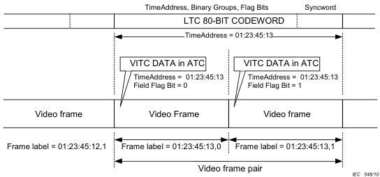

*Figure 9 – Example of frame labeling for 50 and 60 frames per second progressive systems*

## Annex A (informative)

### Explanatory notes

#### A.1 Time precision

The precision of the clock time in the time code may be subject to variances due to the video phase relative to midnight rollover, the use of colour field identification, cyclic drift associated with drop frame compensation, systematic drift associated with noninteger frame rates, the reference video frequency accuracy, and the precision of the clock reference. It is the responsibility of the system implementers to take appropriate measures to ensure satisfactory system operation.

SMPTE 309M provides a method of signaling the degree of time precision that is intended. This standard also provides for indicating the date and time zone to which the time applies.

#### A.2 Leap second corrections

Because of small differences between atomic time (UTC) and time based on the rotational speed of the earth (UTCI), periodic adjustments to atomic time are made in increments of 1 s. These adjustments, when required, are made at the end of June 30, or preferably December 31, universal time so that UTC never deviates by more than 0,9 s. The last minute of the day on which an adjustment is made has 61 s or 59 s. It could happen that leap seconds would need to be removed (negative leap seconds); however, all leap seconds so far have been positive. Since many television facilities operate with their facility time code generator tied to an external time reference, such as GPS, leap second adjustments can affect broadcast operations. In such cases, the binary group flags (see 7.4 and 7.5) should signal "clock time".

The occurrence of a positive leap second time correction results in a second of time being added. It may not be possible to create or display a second with the value of 60 to identify uniquely this second due to the design of existing time code devices which conformed to IEC 60461 (third edition)¹. For uniformity in adding a leap second, it is suggested that at the end of the hour, the last second with a value of 59 s should be repeated.

For 625/50 systems that are also implementing colour field identification, the occurrence of a leap second adjustment may result in a time shift of one or three frames depending on the method of adjusting time to identify the colour frame sequence. Systems implementers should be aware that this may change the intended time precision of the system.

Systems implementations should be aware that some devices which use time code primarily as a label might not generate or correctly recognize 59 second or 61 second minutes, and might treat such as labeling errors when they are encountered. Notwithstanding this limitation, such devices are fully compliant with this standard.

#### A.3 Frames and time code

Fundamentally, a given value of time code labels a moment of time. This standard uses the specifications of traditional raster scan video formats to obtain the duration of a unit of time to which a time code sample is attached. This is called a frame. Users are advised that certain time code values can be skipped (or never associated with a frame of video). This is called the "drop frame" mode of time code counting.

¹ IEC 60461:2001, Time and control code for video tape recorders

For example, in a 525-line ("NTSC") signal running at its native frame rate (30/1,001 frames per second), each video frame's duration is 1,001/30 s (approximately 33,366 7 ms). This is then taken to define the duration of the frame each specific time code sample is applied to. Similarly, in a 625-line signal running at a standard frame rate (25 frames per second), a video frame's duration is 1/25 second (40 ms), and this defines the time code frame duration.

Time code can be used in systems which have no associated video format, such as audio streams, synchronization signals, or object based digital formats. In such systems, the duration of the frame should be specified in terms to match a frame's duration as if it were defined by reference to some video format.

For example, in an audio stream running at a true 48 000 samples per second ("48 kHz sampling"), the time code frame's duration can be defined in several ways, depending on system requirements. If the frame is defined as 48 000 / (25/1) to match a standard frame rate 625-line signal, the time code sample labels 1 920 audio samples. If the frame is defined as 48 000 / (30 000 / 1 001) to match a standard frame rate 525-line signal, time code sample labels 1 601,6 audio samples, or 8 008 samples in 5 frames. If the frame is defined as 48 000 / (30/1), to match a non-standard frame rate 525-line signal, the time code labels 1 600 audio samples. Other combinations are possible, but might not represent "real world" implementations.

System implementations should use appropriate choices for the time code frame duration and take account of its implications, such as the non-terminating decimal representation of rational numbers, to assure consistent behavior.

## Annex B (informative)

### Converting time codes when converting video from 24 fps television systems

#### B.1 Conversion of time codes

When rate converting 24 fps (frames per second) video to 25 fps or 30 fps video by periodically replicating video fields, the conversion hardware inserts extra fields of some of the images to create a pull-down cadence of the picture content on the converted output. In addition, the incoming time code should be converted from a nominal 24 fps to 25 fps or 30 fps rate. This method is valid as well for conversions between non-integer frame rate numbers. A different method for conversion between "integer number" frame rates to "non-integer number" frame rates can be used and is beyond the scope of this standard.

#### B.2 Conversion of 24/1,001 (23,98) fps video to 30/1,001 (29,97) fps video

In order to deterministically move between the nominal 24 fps and 30 fps formats, it is recommended that the video frames of the 24 fps high definition material with the time code frame number zero be converted to an A frame as shown in Figure B.1. These frames are called the A frame candidate frames. SMPTE 318M also recommends that these A frames are aligned with the field identified by the field 1 pulse of the 10 field sequence as shown in Figure B.1. It follows then that subsequent 24 fps high definition frame numbers that are evenly divisible by 4 will also become A frames. As specified in Clause 6 of this standard, the 30 non-drop frame count mode is strongly recommended to be used for the time code of the converted material. It is recommended that the A frame candidate zero frame be numbered as the zero frame on the converted video, resulting in subsequent A frames of the converted video having time code frame numbers that are evenly divisible by 5.

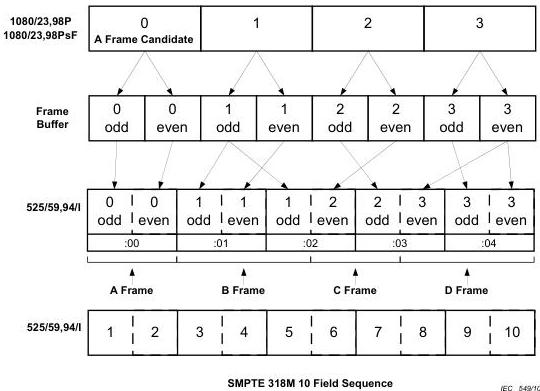

*Figure B.1 – Example of conversion of 23,98 fps video to 525/59,94/I*

As there are delays through the conversion hardware it may not be possible to align the vertical sync at the start of an A frame with the vertical sync at the start of an A frame candidate frame, but the vertical sync at the beginning of the A frame (line 4 for 525 systems) should be aligned with the vertical sync at the beginning of one of the input frames (line 1) as shown in SMPTE RP 168.

#### B.3 Conversion of 24 fps video to 25 fps video

For specific editorial applications it may be desirable to perform an 11(2):3 pull-down conversion between systems operating at 24 fps and 25 fps. Due to the visibility of temporal artifacts this process is not recommended for release material.

In order to deterministically move between the 24 fps and 25 fps formats, it is recommended that the video frames of the 24 fps material with the time code frame number zero be converted to the first A frame of the 24:25 frame pull-down sequence as shown in Figure B.2. These frames are called the A1 frame candidate frames. It follows then each that subsequent 24 fps frame number zero will also become an A frame at the start of the 24:25 pull-down cycle. The converted A1 frame should be numbered as the zero frame of the time code second.

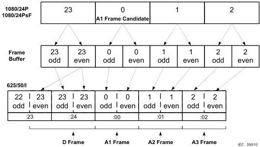

*Figure B.2 – Example of conversion of 24 fps high definition video to 625/50/I*

As there are delays through the conversion hardware it might not be possible to align the vertical sync at the start of an A1 frame with the vertical sync at the start of an A1 candidate frame, but the vertical sync at the beginning of the A1 frame (line 1 for 625 systems) can be aligned with the vertical sync at the beginning of one of the input frames (line 1).

## Bibliography

ARIB STD B4, Version 2.0, Time Code Conveyed by Ancillary Data Packets for 1125/60 Television Systems (available in the Japanese language only)

EBU Technical Standard N12-1999, Time-and-Control Codes for Television Recording

IEC 61169-8:2007, Radio-frequency connectors – Part 8: Sectional specification – RF coaxial connectors with inner diameter of outer conductor 6,5 mm (0,256 in) with bayonet lock – Characteristic impedance 50 Ω (type BNC)

ITU-R BT.470-6 (1998) Annex 1, Conventional Television Systems

NOTE Superseded by ITU-R BT.1700-1, Characteristics of Composite Video Signals for Conventional Analogue Television Systems)

ITU-R BT.1366-1 (2007) Transmission of Time Code and Control Code in the Ancillary Data Space of a Digital Television Stream According to Recommendations ITU-R BT.656, ITU-R BT.799 and ITU-R BT.1120

SMPTE 292-2008, 1 Gb/s Signal / Data Serial Interface

SMPTE EG 40-2002, Conversion of Time Values Between SMPTE 12M Time Code, MPEG-2 PCR Time Base and Absolute Time

SMPTE 12M-2-2008, Television – Transmission of Time Code in the Ancillary Data Space

SMPTE 125M:1995, Television – Component Video Signal 4:2:2 – Bit-Parallel Digital Interface

SMPTE 240M-1999, Television – 1125-Line High-Definition Production Systems – Signal Parameters

SMPTE 258M-2004, Television – Transfer of Edit Decision Lists

SMPTE 260M:1999, Television – 1125/60 High-Definition Production System – Digital Representation and Bit-Parallel Interface

SMPTE 266M-2002, Television – 4:2:2 Digital Component Systems – Digital Vertical Interval Time Code

SMPTE 274M-2008, Television – 1920 × 1080 Image Sample Structure, Digital Representation and Digital Timing Reference Sequences for Multiple Picture Rates

SMPTE 293M-2003, Television – 720 × 483 Active Line at 59.94-Hz Progressive Scan Production — Digital Representation

SMPTE 296M-2001, Television – 1280 × 720 Progressive Image Sample Structure – Analog and Digital Representation and Analog Interface

SMPTE 318M-1999, Television and Audio – Synchronization of 59.94- or 50-Hz Related Video and Audio Systems in Analog and Digital Areas — Reference Signals

SMPTE RP135-2004, Use of Binary User Groups in Motion-Picture Time and Control Codes

SMPTE RP 136-2004, Time and Control Codes for 24, 25 or 30 Frame-Per-Second Motion-Picture Systems

SMPTE RP 159:1995, Vertical Interval Time Code and Longitudinal Time Code Relationship

SMPTE RP 164:1996, Location of Vertical Interval Time Code

SMPTE RP 168:2002, Definition of Vertical Interval Switching Point for Synchronous Video Switching

SMPTE RP 169:1995, Television, Audio and Film Time and Control Code – Auxiliary Time Address Data in Binary Groups – Dialect Specification of Directory Index Locations

SMPTE RP 179-2002, Dialect Specification of Page-Line Directory Index for Television, Audio and Film Time and Control Code for Video-Assisted Film Editing.

SMPTE RP 188:1996, Transmission of Time Code and Control Code in the Ancillary Data Space of a Digital Television Data Stream

SMPTE RP 196:1997, Transmission of LTC and VITC Data as HANC Packets in Serial Digital Television Interfaces
