# RECOMMENDATION ITU-R BT.1439-1 (2006)

Measurement methods applicable in the analogue television studio and the overall analogue television system

Scope

This Recommendation defines measurement methods and test signals used in analogue television systems programme verification.

The ITU Radiocommunication Assembly,

considering

a) that proper operation of analogue television studios and of other analogue parts of the television chain requires accurate monitoring of the correct performance of individual sections of the overall system;
b) that such monitoring is best performed on analogue video equipment using appropriate analogue video test signals;
c) that the methods to measure the correct performance of sections of the analogue television chain, based on the use of analogue video test signals, should desirably be standardized;
d) that ITU-T Recommendation J.61 recommends nomenclature and measuring methods for analogue video test signals at baseband, for use on analogue video transmission links;
e) that most of the test signals and measuring methods recommended in ITU-T Recommendation J.61 are also applicable and are indeed already widely applied to the measurement of the performance of analogue video production chains;
f) that, whenever possible, the same measurement signals and measurement methods should desirably be applied throughout the analogue television chain, including both the production sections and the transmission sections,

recommends

1 that the definitions of video parameters at baseband, as given in Part 1 of this Recommendation, should be applied where appropriate to measurement of video baseband parameters in analogue television studios and the overall analogue television system;
2 that the measuring methods and test signals, as given in Part 2 and Annex 1 to this Recommendation, should be used where appropriate to perform measurements at video baseband in analogue television studios and the overall analogue television system;
3 that the design for filters, as given in Annex 2 to this Recommendation, for application to specific measuring methods should be used where appropriate, when performing similar measurements at video baseband in analogue television studios and the overall analogue television system;

4 that, when it is desired to perform on-line measurements of performance at video baseband in the overall analogue television system in the presence of programme signals, the measurement methods and insertion test signals given in Annex 3 to this Recommendation should be applied where appropriate;

5 that the $K$-rating methods of assessment given in Annex 4 to this Recommendation for the measurement of short-term waveform distortion may also usefully be applied to measurements in the analogue television studio and the overall analogue television system, if desired.

NOTE 1 – Measurement methods for digital television equipment with analogue input and output are defined in Recommendation ITU-R BT.1204. Measuring methods and test signals are the same as in ITU-T Recommendation J.61.

## PART 1

## Definitions of video parameters

## 1 Waveform terminology

The following terms concerning the components and values of a composite colour video signal are illustrated in Fig. 1:

- A: the non-useful d.c. component
- B: the useful d.c. component, integrated over a complete frame period
- C: the picture d.c. component, integrated over the active line period, $T_{u}$
- D: the instantaneous value of the luminance component
- E: the instantaneous signal value with respect to the bottom of the synchronizing pulses
- F: the peak signal amplitude (positive or negative with respect to blanking level)
- G: the peak amplitudes of chrominance components
- H: the peak-to-peak signal amplitude
- J: the difference between black level and blanking level (set-up)
- K: the peak-to-peak amplitude of the colour burst
- L: the nominal value of the luminance component
- M: the peak-to-peak amplitude of a monochrome composite video signal $(M = L + S)$
- S: the amplitude of the synchronizing pulses
- $T_{sy}$: duration of line synchronizing pulse
- $T_{lb}$: duration of line blanking period
- $T_{u}$: duration of active line period
- $T_{b}$: duration of breezeway
- $T_{fp}$: duration of front porch
- $T_{bp}$: duration of back porch.

The amplitudes $L$, $S$ and $M$ are used as reference amplitudes for the video signal. The amplitudes defined by $B$, $C$, $D$, $E$, $F$, $G$, $H$ and $J$ above, may be expressed as percentages of the value $L$.

Average picture level (APL) is the mean value of  $C$  over a complete frame period (excluding blanking periods) expressed as a percentage of  $L$ .

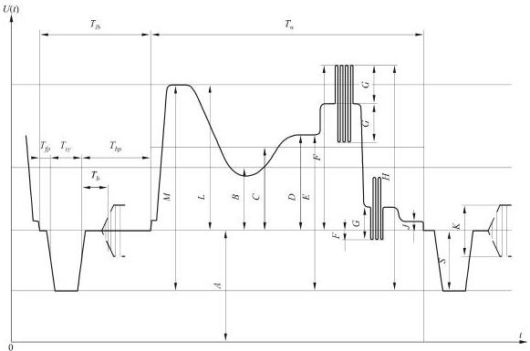

*Figure 1 - One line of a composite colour video signal.*

## 2 Definitions of signal parameters

### 2.1 Nominal impedance,  $Z_{0}$

The input and output impedance,  $Z_{0}$  of each device should be specified, as either unbalanced or balanced with respect to earth.

### 2.2 Return loss

The return loss, relative to  $Z_{0}$ , of an impedance  $Z$  is, in the frequency domain:

$$
2 0 \log \left| \frac {Z _ {0} + Z (f)}{Z _ {0} - Z (f)} \right| \quad \mathrm {d B}
$$

In the time domain, it is expressed by the symbolic formula:

$$
2 0 \log \left| \frac {A _ {1}}{A _ {2}} \right| \quad \mathrm {d B}
$$

where $A_{1}$ is the peak-to-peak amplitude of the incident signal and $A_{2}$ is the peak-to-peak amplitude of the reflected signal. Numerically, the result is the same as that obtained by the frequency domain method if the return loss is independent of frequency.

### 2.3 Polarity and d.c. component

The polarity of the signal should be positive, that is to say, such that black-to-white transitions are positive-going.

The useful d.c. component, $B$ in Fig. 1, which is related to the average luminance of the picture, may or may not be contained in the signal and need not be transmitted or delivered at the output.

A non-useful d.c. component, $A$ in Fig. 1, may be present in the signal (for example, due to d.c. supplies). Limits for this component need to be specified for the terminated and unterminated conditions.

### 2.4 Nominal signal amplitude

The nominal signal amplitude is the peak-to-peak amplitude of the monochrome video signal that includes the synchronizing signal and luminance signal component set to peak-white ($M$ in Fig. 1).

## 3 Definitions of performance parameters

The definitions in § 3.2 and the subsequent sub-sections assume that the equipment has nominal insertion gain as defined in § 3.1.

### 3.1 Insertion gain

Insertion gain is defined as the ratio, expressed in decibels, of the peak-to-peak amplitude of a specified test signal at the receiving end to the nominal amplitude of that signal at the sending end, the peak-to-peak amplitude being defined as the difference between the amplitudes measured at defined points of the signal used.

### 3.2 Noise

#### 3.2.1 Continuous random noise

The signal-to-noise ratio for continuous random noise is defined as the ratio, expressed in decibels, of the nominal amplitude of the luminance signal, $L$ in Fig. 1, to the r.m.s. amplitude of the noise measured after band limiting. A signal-to-weighted-noise ratio is defined as a ratio, expressed in decibels, of the nominal amplitude of the luminance signal, $L$ in Fig. 1, to the r.m.s. amplitude of the noise measured after band limiting and weighting with a specified network.

The measurement should be made with an instrument having, in terms of power, a defined time constant or integrating time.

#### 3.2.2 Low-frequency noise

The signal-to-noise ratio for low-frequency noise is defined as the ratio, expressed in decibels, of the nominal amplitude of the luminance signal, $L$, in Fig. 1, to the peak-to-peak amplitude of the noise after band limiting to include only the spectrum $500\mathrm{Hz}$ to $10\mathrm{kHz}$.

#### 3.2.3 Periodic noise

The signal-to-noise ratio for periodic noise is defined as the ratio, expressed in decibels, of the nominal amplitude of the luminance signal, $L$ in Fig. 1, to the peak-to-peak amplitude of the noise.

Different values are specified for noise at a single frequency between  $1\mathrm{kHz}$  and the upper limit of the video frequency band and for power-supply hum including lower-order harmonics.

#### 3.2.4 Impulsive noise

The signal-to-noise ratio for impulsive noise is defined as the ratio, expressed in decibels, of the nominal amplitude of the luminance signal,  $L$  in Fig. 1, to the peak-to-peak amplitude of the impulsive noise.

### 3.3 Non-linear distortion

In television equipment the transmission may not be completely linear. The extent of the non-linear distortion which is produced will depend primarily on:

the APL, as defined in  $\S 1$
the instantaneous value of the luminance component  $(D$  in Fig. 1);
the amplitude of the chrominance signal  $(G$  in Fig. 1).

There would, in general, be little purpose in defining completely the non-linear characteristics of a television equipment chain. It is necessary, therefore, to limit the number of measured quantities by restricting them to those which are recognized as being directly correlated with picture quality. Additionally, the test conditions should be restricted by introducing a systematic classification in the definition of the quantities to be measured.

The nature of the video signal is such that, in terms of picture quality, the impairment due to the effect of circuit non-linearity on the synchronizing signal is different from the effect of circuit non-linearity on the picture signal.

Furthermore, the non-linearity may affect the luminance and chrominance signals individually or cause interaction between them. This leads to the following system of classification of non-linear distortions:

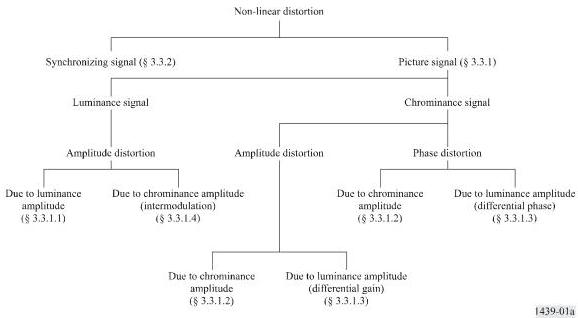

The above classification applies for steady-state conditions during a time span which is long in relation to the field period. In this case, the concept of average picture level has a precise significance. If these conditions are not fulfilled, for example, if a sudden change in the APL is introduced, additional non-linear effects may be produced, the extent of which will depend on the long-time transient response of the circuit.

Additional non-linearity may also occur if a sudden change in signal amplitude occurs.

#### 3.3.1 Picture signal

##### 3.3.1.1 Luminance signal

For a particular value of APL, the non-linear distortion of the luminance signal is defined as the departure from proportionality between the amplitude of a small step function at the input to the circuit and the corresponding amplitude at the output, as the initial level of the step is shifted from blanking level to white level.

##### 3.3.1.2 Chrominance signal

###### Gain

For fixed values of luminance signal amplitude and APL, the non-linear gain distortion of the chrominance signal is defined as the departure from proportionality between the amplitude of the chrominance sub-carrier at the input to the circuit and the corresponding amplitude at the output, as the amplitude of the sub-carrier is varied from a specified minimum to a maximum value.

###### Phase

For fixed values of luminance signal amplitude and APL, the non-linear phase distortion of the chrominance signal is defined as the variation in the phase of the chrominance sub-carrier at the output, as the amplitude of the sub-carrier is varied from a specified minimum to a maximum value.

##### 3.3.1.3 Intermodulation from the luminance signal into the chrominance signal

###### Differential gain

If a constant small amplitude of chrominance sub-carrier, superimposed on a luminance signal, is applied to the input of the circuit, the differential gain is defined as the change in the amplitude of the sub-carrier at the output as the luminance varies from blanking level to white level, the APL being maintained at a particular value.

###### Differential phase

If a constant small amplitude of chrominance sub-carrier without phase modulation, superimposed on a luminance signal, is applied to the input of the circuit, the differential phase is defined as the change in the phase of the sub-carrier at the output as the luminance varies from blanking level to white level, the APL being maintained at a particular value.

##### 3.3.1.4 Intermodulation from the chrominance signal into the luminance signal

If a luminance signal of constant amplitude is applied to the input of a circuit, the intermodulation is defined as the variation of the amplitude of the luminance signal at the output resulting from the superimposition on the input signal of a chrominance signal of specified amplitude, the APL being maintained at a particular value.

#### 3.3.2 Synchronizing signal

##### 3.3.2.1 Steady-state distortion

If a video signal of specified APL and containing synchronizing pulses of nominal amplitude (S in Fig. 1) is applied to the input of the circuit, the steady state non-linear distortion is defined as the departure from nominal of the mid-point amplitude of the synchronizing pulses at the output.

##### 3.3.2.2 Transient distortion

If the APL of the video signal is stepped from a low value to a high value, or from a high value to a low value, the transient non-linear distortion is defined as the maximum instantaneous departure from the nominal value of the mid-point amplitude of the synchronizing pulses at the output.

### 3.4 Linear distortion

Linear distortions are those which can be caused by linear equipment. Such distortions do not depend on the APL, or the amplitude, or the position of the test signals.

In the case of equipment which is affected by a small amount of non-linearity, measurements can still be carried out. However, as the results can be somewhat affected by the APL and the amplitude and position of the test signals, it is good practice, when presenting the results, to specify the measurement conditions.

Linear distortions can be measured either in the time domain or in the frequency domain.

The quantities which can be measured in the two domains may be classified as shown below.

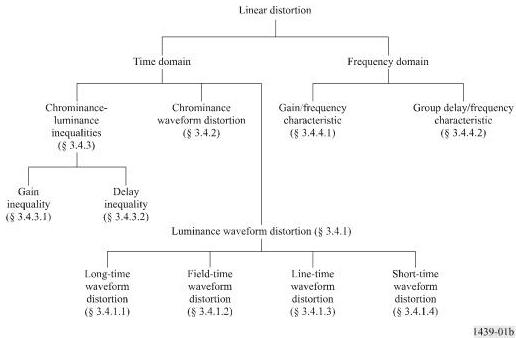

#### 3.4.1 Waveform distortion of the luminance signal

The distortion of the video waveform due to a television circuit will in general be represented by a continuous function in the time domain.

In practice, however, the form of the video signal and the effects on a displayed picture are such that the resulting impairments may be classified by considering four different time-scales which are comparable to the durations of many fields (long-time waveform distortion), one field (field-time waveform distortion), one line (line-time waveform distortion), and one picture element (short-time waveform distortion).

In considering each of these time-scales, therefore, impairments appropriate to the other three are excluded by the measurement method.

##### 3.4.1.1 Long-time waveform distortion

If a video test signal, simulating a sudden change from a low APL to a high one or a high average picture level to a low one, is applied to the input of a circuit, long-time waveform distortion is present if the blanking level of the output signal does not accurately follow that of the input. This failure may be either in exponential form or, more frequently, in the form of damped very low-frequency oscillations.

##### 3.4.1.2 Field-time waveform distortion

If a square-wave signal with a period of the same order as one field and of nominal luminance amplitude is applied to the input of the circuit, the field-time waveform distortion is defined as the change in shape of the square wave at the output. A period at the beginning and end of the square wave, equivalent to the duration of a few lines, is excluded from the measurement.

##### 3.4.1.3 Line-time waveform distortion

If a square-wave signal with a period of the same order as one line and of nominal luminance amplitude is applied to the input of the circuit, the line-time waveform distortion is defined as the change in shape of the square wave at the output. A period at the beginning and end of the square wave, equivalent to a few picture elements, is excluded from the measurement.

##### 3.4.1.4 Short-time waveform distortion

If a short pulse (or a rapid step-function) of nominal luminance amplitude and defined shape is applied to the input of the circuit, the short-time waveform distortion is defined as the departure of the output pulse (or step) from its original shape. The choice of the half-amplitude duration of the pulse (or the rise-time of the step) will be determined by the nominal cut-off frequency, $f_{c}$, of the television system (see Recommendation ITU-R BT.1700).

#### 3.4.2 Chrominance waveform distortion

If a test signal in the form of an amplitude-modulated sub-carrier is applied to the input of a circuit, chrominance waveform distortion is defined as the change in the shape of the envelope and phase of the modulated sub-carrier of the output test signal.

#### 3.4.3 Chrominance-luminance inequalities

##### 3.4.3.1 Gain inequality

If a test signal having defined luminance and chrominance components is applied to the input of the circuit, the gain inequality is defined as the change in amplitude of the chrominance component relative to the luminance component between the input and output of the circuit.

##### 3.4.3.2 Delay inequality

If a composite signal, consisting of a defined luminance test signal in fixed amplitude and time relationship with a chrominance sub-carrier modulated by the same luminance test signal, is applied to the input of the circuit and if the luminance signal at the output is compared with the modulation

envelope of the chrominance signal, then the delay inequality of the circuit is defined as the change in relative timing of corresponding parts of the two waveforms between input and output.

#### 3.4.4 Steady state characteristics

3.4.4.1 The gain/frequency characteristic of the circuit is defined as the variation in gain between the input and output of the circuit over the frequency band extending from the field repetition frequency to the nominal cut-off frequency of the system, relative to the gain at a suitable reference frequency.

3.4.4.2 The group delay/frequency characteristic of the circuit is defined as the variation in group delay between the input and the output of the circuit, over the frequency band extending from the field repetition frequency to the nominal cut-off frequency of the system, relative to the delay at a suitable reference frequency. It is for practical reasons, an approximation to the slope (derivative) of the phase/frequency characteristic of the circuit.

## PART 2

## Measurement methods and test signals

## 1 Introduction

Section numbering in this Part is related to the section numbering of Part 1.

The test signal elements contained in Annex 1 may be combined in any suitable way to form test signals. Unless otherwise specified, the APL of test signals so obtained should be 50%. It should be noted that some practical circuits require the presence of synchronizing signals for correct functioning.

Test signals can be used either as repetitive signals or, with certain exceptions, as insertion test signals in connection with active lines chosen to give the required APL. During programme periods however, due consideration must be given to the effects of the variations of the APL upon measurements made with insertion test signals.

The measurements described in § 3.2 to § 3.4.2 are valid provided that the insertion gain of the circuit is within the stated requirements.

## 2 Measurements of equipment and signal characteristics of television equipment

### 2.1 Nominal impedance

The input and output impedance of equipment will be specified. The actual impedances will be measured, in terms of departure from the nominal value, by the return loss.

### 2.2 Return loss

Return loss may be measured in the time domain or in the frequency domain. If the return loss to be measured is independent of frequency both methods will yield the same numerical result.

To measure return loss in the time domain, test signal elements A, B1, B2 or B3, and F shall be used. The return loss is the ratio of the incident to the reflected test signal element, both being measured in peak-to-peak terms. The return loss for each of the above four test signal elements shall be equal to, or greater than 30 dB.

To measure return loss in the frequency domain, any of several well-established methods may be used. The return loss at all frequencies within the nominal bandwidth of the television system shall be equal to, or greater than 30 dB.

NOTE 1 – Care should be taken to ensure that any spectral components produced by the test signal source above the nominal cut-off frequency, $f_{c}$, of the television system are attenuated by at least 40 dB relative to components below $f_{c}$.

### 2.3 Non-useful d.c. component

A signal consisting of synchronizing pulses and blanking-level is used. The potential of the blanking-level with respect to earth is measured with a d.c.-coupled instrument.

## 3 Measurements of television equipment

### 3.1 Insertion gain

The signal element used is $B3$ for 625-line systems and $B2$ or $B3$ for 525-line systems. The amplitude $L$ is measured between the centre of the bar (point $b_2$ in Fig. 2) and blanking level (point $b_1$ in Fig. 2). The resulting value of the received signal must remain inside the specified limits.

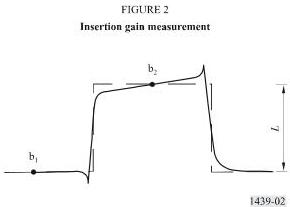

*Figure 2 - Insertion gain measurement.*

### 3.2 Noise

#### 3.2.1 Continuous random noise

##### Measuring equipment

In general, measurements should be made with r.m.s.-reading instruments. Depending on the type of instrument to be used, the circuit will carry either no signal or a specified repetitive signal. The latter case may be used if clamping devices have to be activated. For power measurement, the measuring instrument should have an effective time constant or integrating time of approximately 1 s.

In some cases it may be desirable to precede the noise measuring equipment by a sub-carrier notch filter, so as to eliminate any sub-carrier periodic noise component from the random noise measurement. Consideration must however be given to the effect of such a filter upon the accuracy of measurement.

When the measurements are made by assessing the quasi peak-to-peak amplitude of the noise, administrations are asked to determine the peak factor appropriate for their measuring methods and to express the results in terms of r.m.s. noise amplitude.

##### Band limiting

The measuring instrument should be preceded by band-limiting filters (see § 1 and § 2 of Annex 2). The lower band limit is such that power-supply hum and microphonic noise are excluded. The upper limit is so selected as to eliminate noise which occurs outside the wanted band of the video signal.

If the circuit carries a signal, band limiting may be necessary, using a first order 200 kHz high-pass filter with a slope of 20 dB per decade.

##### Weighting

The measuring instrument should also be preceded by a unified weighting network (see § 3 of Annex 2 to this Recommendation).

#### 3.2.2 Low-frequency noise

Low-frequency noise voltages are usually measured by means of an oscilloscope. The measuring instrument should be preceded by a band-pass filter. The low-pass section of this filter can be as described in § 2 of Annex 2. In cases where line-frequency synchronizing pulses are required on the circuit under test and where field frequency synchronizing pulses can be omitted, a sharp cut low-pass filter may be preferred.

#### 3.2.3 Periodic noise

Conventional measuring methods may be used. Measurements of power supply hum including lower-order harmonics should be made through the low-pass filter described in § 2 of Annex 2. In cases where line-frequency synchronizing pulses are required on the circuit under test and where field-frequency synchronizing pulses can be omitted, a sharp cut low-pass filter may be preferred.

When the frequency of the periodic noise is higher, selective measurement may be necessary for the separation of random noise from periodic noise.

#### 3.2.4 Impulsive noise

Impulsive noise voltages are measured by means of an oscilloscope.

### 3.3 Non-linear distortion

#### 3.3.1 Picture signal

##### 3.3.1.1 Luminance signal

Luminance non-linearity is measured using the 5-riser staircase test signal element (D1) shown in Figs. 9 and 10. At the output, the test signal is passed through a differentiating and shaping network the effect of which is to transform the staircase into a train of 5 pulses (by way of example, § 4 of Annex 2 shows a possible filter, the response of which approximates the sine-squared (sin²) shape).

Comparing the amplitudes of the pulses, the numerical value of the distortion is found by expressing the difference between the largest and the smallest amplitude as a percentage of the largest.

##### 3.3.1.2 Chrominance signal

Chrominance non-linearity is measured with the 3-level chrominance signal shown in Figs. 13 (G2) and 14.

###### Gain

Gain non-linearity is defined as the larger of the two values (%) obtained by substituting $i = 1$ or $i = 3$ in the expression:

$$
100 \times \left| \frac{A_i - k_i A_2}{k_i A_2} \right|
$$

where:

- $A$: amplitude of received sub-carrier
- $i$: position of burst on signal $G$ or $G2$ (1 being the smallest, 3 the largest)
- $k_i = \frac{2i - 1}{3}$ for 625-line signal $G2$
- $k_i = 2^{i-2}$ for 525-line signal $G$.

It is desirable that the chrominance-luminance gain inequality of the circuit should be within the stated requirements when this measurement is made.

Signal amplitudes should be measured peak-to-peak. A sub-carrier bandpass filter is of assistance in carrying out the measurement.

###### Phase

Phase non-linearity is defined as the largest difference (degrees) obtained by comparing the phase of the three bursts in the received signal $G$ or $G2$.

If a vector display is used, it is convenient to normalize the phase of the smallest burst.

##### 3.3.1.3 Intermodulation from the luminance signal into the chrominance signal

Intermodulation is measured with the test signal element $D2$ shown in Figs. 9 and 10, consisting of a 5-riser staircase with superimposed sub-carrier. At the output end, the sub-carrier is filtered from the rest of the test signal and its six sections are compared in amplitude and phase.

###### Differential gain

Differential gain is expressed by two values, $+x\%$ and $-y\%$, which represent the maximum (peak) differences in amplitude between the sub-carrier on the treads of the received test signal and the sub-carrier on its blanking level, expressed as a percentage of the latter. In the case of a monotonic characteristic either $x$ or $y$ will be zero.

Differential gain (%) referred to blanking level, can be found from the expressions below:

$$
x = 100 \left| \frac{A_{\max}}{A_0} - 1 \right| \quad y = 100 \left| \frac{A_{\min}}{A_0} - 1 \right|
$$

Peak-to-peak differential gain can be found from the expression:

$$
x + y = 100 \left| \frac{A_{\max} - A_{\min}}{A_0} \right|
$$

where:
- $A_0$: amplitude of the received sub-carrier at blanking level
- $A$: amplitude of the sub-carrier on any relevant tread of the staircase between 0 (blanking level tread) and 5 (top tread) inclusive.

###### Differential phase

Differential phase is expressed by two values, $+x$ and $-y$ (degrees), which represent the maximum (peak) differences in phase between the sub-carrier on the treads of the received test signal, and the sub-carrier on its blanking level expressed in degrees difference from the latter. In the case of a monotonic characteristic either $x$ or $y$ will be zero.

Differential phase (degrees) referred to blanking level can be found from the expression below:

$$
x = \left| \Phi_{max} - \Phi_0 \right| \quad y = \left| \Phi_{min} - \Phi_0 \right|
$$

Peak-to-peak differential phase can be found from the expression:

$$
x + y = \left| \Phi_{max} - \Phi_{min} \right|
$$

where:
- $\Phi_0$: phase of the received sub-carrier at blanking level
- $\Phi$: phase of sub-carrier on any relevant tread of the staircase between 0 (blanking level tread) and 5 (top tread) inclusive.

##### 3.3.1.4 Intermodulation from the chrominance signal into the luminance signal

Chrominance-luminance intermodulation is measured on element $G$, $G1$ or $G2$ after suppressing the incoming colour sub-carrier. It is defined as the difference between the luminance amplitude in element $G1$, or in the last section of element $G$ or $G2$ ($b_5$ in Figs. 13 and 14) and the amplitude of the succeeding section ($b_6$ in Figs. 13 and 14) in which the test signal has no sub-carrier, expressed as a percentage of the luminance bar amplitude.

#### 3.3.2 Synchronizing signal

##### 3.3.2.1 Steady-state distortion

Synchronizing signal steady-state non-linear distortion may be measured using any test signal which will allow the requisite values of APL to be obtained.

The distortion is expressed as the difference between sync amplitude and its normalized value (i.e. 3/7 luminance bar amplitude for 625-line systems, 4/10 luminance bar amplitude for 525-line systems), expressed as a percentage of the normalized value. Measurement is made between the mid-point amplitude of the synchronizing pulse and the mean blanking level.

### 3.4 Linear distortion

#### 3.4.1 Waveform distortion of the luminance signal

Practical circuits sometimes exhibit amplitude-dependent distortions which show up as linear distortions and which are not detected by the normal non-linear distortion measurement methods.

##### 3.4.1.1 Long-time waveform distortion

Long-time waveform distortion usually deserves consideration only when it assumes the form of a damped, very low-frequency oscillation. It can be measured using any test signal which will allow an adequate change of average picture level to be obtained.

Three parameters can be measured:

- the peak amplitude of the overshoot of the signal (expressed as a percentage of nominal luminance amplitude);
- the time taken for the oscillation to decay to a specified value;
- the slope at the beginning of the phenomenon (%/s).

##### 3.4.1.2 Field-time waveform distortion

Field-time waveform distortion is measured with the field-frequency square wave (signal $A$) shown in Figs. 3 and 4a. The magnitude of the distortion is obtained from the maximum departure in level of the bar top from the level at the centre of the bar expressed as a percentage of the bar amplitude as its centre. The first and last $250~\mu \mathrm{s}$ (approximately 4 lines) are neglected in this measurement.

Alternatively, field-time waveform distortion for 525-line systems is measured with the field bar of the window signal shown in Fig. 4b. The use of the window signal must be noted in the measurement results.

##### 3.4.1.3 Line-time waveform distortion

Line-time waveform distortion is measured with element $B3$ (Fig. 5) for 625-line systems and $B3$ or $B2$ (Fig. 6) for 525-line systems. The magnitude of the top distortion is obtained from the maximum departure in the level of the bar top from the level at the centre of the bar, expressed as a percentage of the bar amplitude as its centre. The first and last $1\mu \mathrm{s}$ are neglected in this measurement.

The magnitude of bottom distortion (base-line distortion) is obtained from the difference between the level at the point:

- 400 ns for 625-line systems,
- 500 ns for 525-line systems,

after the half amplitude point of the trailing edge of the bar and the level at a point which follows the bar by an interval equal to half the duration of the bar, and is expressed as a percentage of the bar amplitude. The distortion is to be measured after the bandwidth of the signal has been limited. Limitation may be achieved by the use of a Thomson filter described in § 5 of Annex 2.

NOTE 1 – Line-time waveform distortion (measured at the top of the bar) and base line distortion are likely to be different, both in shape and magnitude.

##### 3.4.1.4 Short-time waveform distortion

Short-time waveform distortion is measured with $B3$ for 625-line systems and $B3$ or $B2$ for 525-line systems and the $\sin^2$ pulse test signal element $B1$ shown in Figs. 5 and 6. Two measurements of distortion can be made with these signals. The first consists of expressing the amplitude of the pulse as a percentage of the amplitude of the line-time bar (element $B2$ or $B3$ in Figures 5 and 6, as appropriate). The second consists of expressing the amplitude of the lobes, lagging or leading the pulse or bar as a time-weighted percentage of the amplitude of the received pulse or bar respectively.

The results of the foregoing measurements using the $\sin^2$ pulse can be expressed in a compact form in terms of the $K$-rating method which is briefly described in Annex 4. In this method, equal $K$-values for the different parameters approximately correspond to equal degrees of subjective

impairment. Measurements of the bar-edge response of 525-line systems can be expressed in terms of the S-rating which is a more recent method, based on broadly similar principles.

#### 3.4.2 Chrominance-luminance inequalities

##### 3.4.2.1 Gain inequality

Chrominance-luminance gain inequality can be measured with the luminance bar B2 and the elements G, G1 and G2. Alternatively, the chrominance component of the composite pulse F may be used. The magnitude of the distortion is obtained from the departure in peak-to-peak amplitude of the modulated sub-carrier in G1, in F, in the last step of G or G2, from the amplitude of the luminance bar B2, expressed as a percentage of the latter. Account must be taken of the relative amplitudes of B2 and G in the original signal for the 525-line case.

A further alternative is to compare the chrominance component of signal F with its luminance component.

##### 3.4.2.2 Delay inequality

Chrominance-luminance delay inequality is measured on the composite pulse element F. It is expressed in ns, the value being positive when the chrominance element lags the luminance.

#### 3.4.3 Steady state characteristics

##### 3.4.3.1 Gain

The gain/frequency characteristic is measured by means of a sweep-frequency method or with the multi-burst test signal C shown in Figs. 7 and 8.

##### 3.4.3.2 Delay

The delay/frequency characteristic is measured by means of a group-delay measuring set.

## Annex 1

### Test signal elements

An indication of the signal elements required to carry out the tests mentioned in this Recommendation is given below in the form of Figures. Preferred assemblies for insertion test signals are given in ITU-T Recommendation J.63. The reference designations used to describe these elements (e.g. signal B1) are the same as the reference designations in ITU-T Recommendation J.63. This Recommendation also contains full specifications of the test signal elements, with the exception of signals A, B3 and the window (Fig. 4b).

NOTE 1 – In the case of PAL and NTSC transmissions, the chrominance sub-carrier of test signal elements should be locked at the phase listed in Table 1, where each phase angle is described with reference to the positive (B-Y) axis.

TABLE 1

|  Element | PAL | M/PAL^{(1)} | NTSC  |
| --- | --- | --- | --- |
|  D2 | 60 ± 5° | 180 ± 1° | 180 ± 1°  |
|  F | 60 ± 5° | 180 ± 1° | Not defined  |
|  G | 60 ± 5° | 180 ± 1° | 90 ± 1°  |

(1) Refer to Recommendation ITU-R BT.1700 for system characteristics.

NOTE 2 – For measurements requiring a change in APL, test signals repeating a pattern composed of one line with assemblies of test signal elements followed by three or four consecutive flat lines (e.g. full white, half white, black) should be used. The signal sequence in each field should start at lines 24 and 337 in the 625-line system, lines 22 and 285 in the NTSC system and lines 19 and 282 in the M/PAL system.

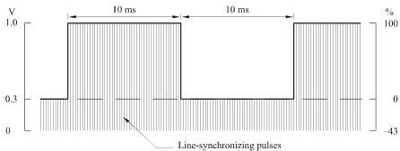

*Figure 3 - Signal A for 625-line systems.*
Note 1 – This signal may contain field-synchronizing pulses.

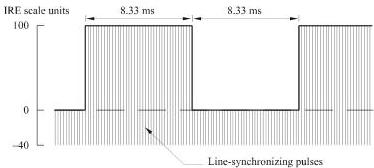

*Figure 4a - Signal A for 525-line systems.*
Note 1 – This signal may contain field-synchronizing pulses.

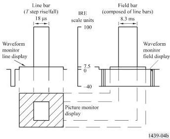

*Figure 4b - The window signal for 525-line systems.*

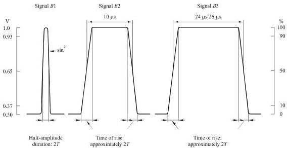

*Figure 5 - Signal $B$ for 625-line systems.*

Note 1 – For 6 MHz video bandwidth $T = 83$ ns, for 5 MHz video bandwidth $T = 100$ ns.
Note 2 – In France, the normal time of rise of $B2$ and $B3$ is approximately 110 ns.
Note 3 – For 6 MHz countries the rise time of $B2$ is equal to $T$.

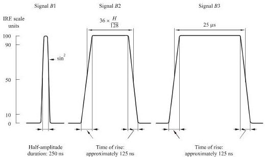

*Figure 6 - Signal $B$ for 525-line systems.*

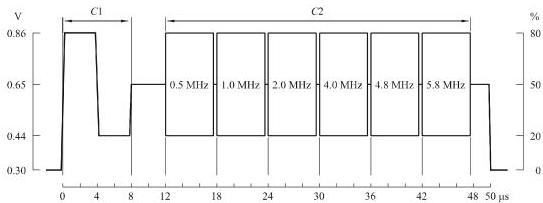

*Figure 7 - Signal $C$ for 625-line systems.*

Note 1 - Some former OIRT countries use  $1.5\mathrm{MHz}$  and  $2.8\mathrm{MHz}$  for the  $2^{\text{nd}}$  and  $3^{\text{rd}}$  bursts respectively.

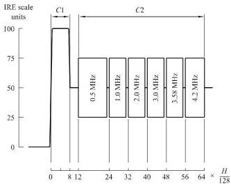

*Figure 8 - Signal $C$ for 525-line systems.*

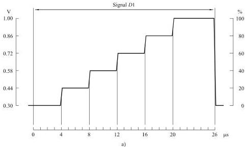

*Figure 9a - Signal $D$ for 625-line systems.*

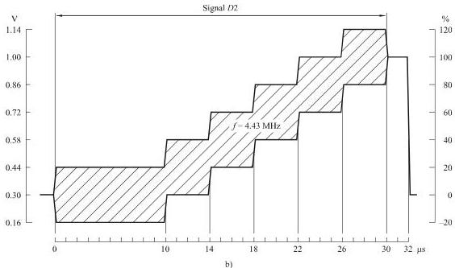

*Figure 9b - Signal $D$ for 625-line systems.*
Note 1 - In full-field test signals, each tread of the staircase may have a duration of  $8.66\mu s$

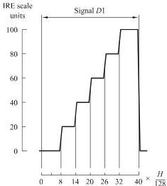

*Figure 10a - Signal $D$ for 525-line systems.*
Note 1 - Vertical scales give signal amplitudes. In Fig. 10b), the tread levels (IRE units) are indicated on the dashed line.

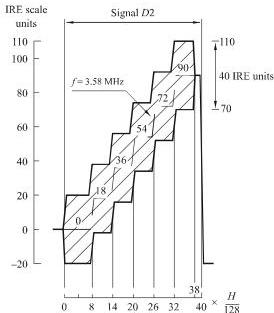

*Figure 10b - Signal $D$ for 525-line systems.*
b)

Note 2 - Sub-carrier amplitude is  $\pm 20$  IRE units.

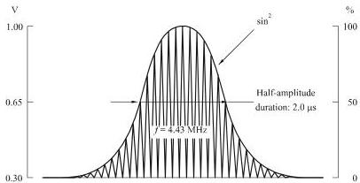

*Figure 11 - Signal $F$ for 625-line systems.*

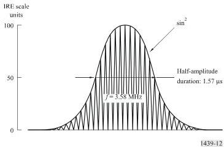

*Figure 12 - Signal $F$ for 525-line systems.*

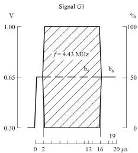

*Figure 13a - Signal $G$ for 625-line systems.*

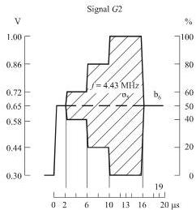

*Figure 13b - Signal $G$ for 625-line systems.*

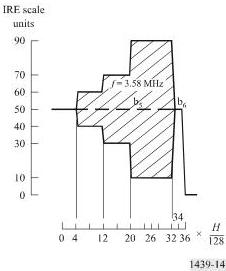

*Figure 14 - Signal $G$ for 525-line systems.*

## Annex 2

### Design of filters used for measurements

#### 1. Low-pass filter for use in noise measurements

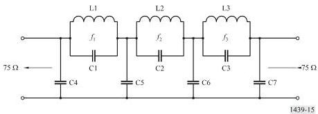

*Figure 15 - Low-pass filter diagram.*

Table of values

|  Component | Multistandard value (fc=5 MHz) | Tolerance  |
| --- | --- | --- |
|  C1 | 100 | Note 2  |
|  C2 | 545  |   |
|  C3 | 390  |   |
|  C4 | 428  |   |
|  C5 | 563  |   |
|  C6 | 463  |   |
|  C7 | 259  |   |
|  L1 | 2.88 | Note 3  |
|  L2 | 1.54  |   |
|  L3 | 1.72  |   |
|  f1 | 9.408 |   |
|  f2 | 5.506  |   |
|  f3 | 6.145  |   |

Note 1 - Inductances are given in  $\mu \mathrm{H}$ , capacitances in pF, frequencies in MHz.
Note 2 - Each capacitance quoted is the total value, including all relevant stray capacitances, and should be correct to  $\pm 2\%$ .
Note 3 - Each inductor should be adjusted to make the insertion loss a maximum at the appropriate indicated frequency.
Note 4 - The  $Q$ -factor of each inductor measured at  $5\mathrm{MHz}$  should be between 80 and 125.

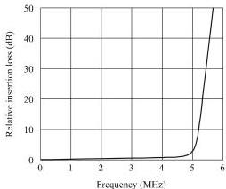

*Figure 16 - Low-pass filter characteristic.*

#### 2 Combined high-pass, low-pass filter  $(f_{c} = 10\mathrm{kHz})$

The high-pass section is used in series with the low-pass filter described in § 1 of this Annex for measuring continuous random noise.

The low-pass section is used to measure power-supply hum.

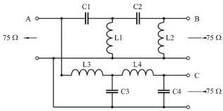

*Figure 17 - Combined filter design diagram.*
A: input
B: high-pass output
C: low-pass output

Table of values
|  Component | Value | Tolerance  |
| --- | --- | --- |
|  C1 | 139 000 | ±5%  |
|  C2 | 196 000  |   |
|  C3 | 335 000  |   |
|  C4 | 81 200  |   |
|  L1 | 0.757 | ±2%  |
|  L2 | 3.12  |   |
|  L3 | 1.83  |   |
|  L4 | 1.29  |   |

Note 1 – Inductances are given in mH, capacitances in pF.
Note 2 – The Q-factor of each inductor should be equal to, or greater than, 100 at 10 kHz.

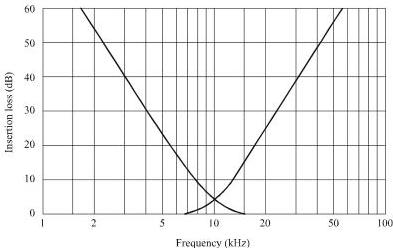

*Figure 18 - Combined filter characteristic.*

#### 3 Unified weighting network for random noise

##### 3.1 Network configuration

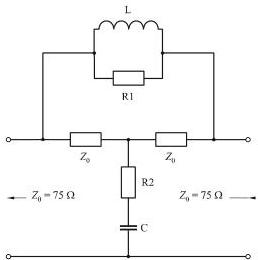

*Figure 19 - Network diagram.*

$$
L = Z _ {0} \cdot \tau
$$

$$
C = - \frac {\tau}{Z _ {0}}
$$

$$
R _ {1} = a \cdot Z _ {0}
$$

$$
R _ {2} = \frac {Z _ {0}}{a}
$$

##### 3.2 Insertion loss $A$

$$
A = 10 \log \frac{1 + \left[\left(1 + \frac{1}{a}\right) \varpi \tau\right]^2}{1 + \left[\frac{1}{a} \varpi \tau\right]^2} \quad \text{dB}
$$

at high frequencies:

$$
A_{\infty} \to 20 \log (1 + a)
$$

$$
(A_{\infty} \to 14.8 \text{ dB})
$$

where:

$$
\tau = 245 \text{ ns}
$$

$$
a = 4.5
$$

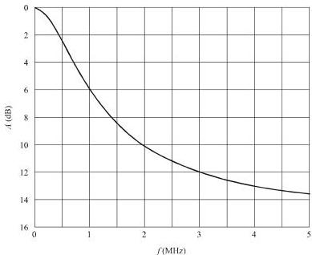

*Figure 20 - Unified weighting characteristic.*

##### 3.3 Noise weighting factors in a 5 MHz band

Flat noise: 7.4 dB
Triangular noise: 12.2 dB

#### 4 Examples of differentiating and shaping network for luminance non-linearity measurement

Note that the networks shown below have equivalent transfer characteristics.

##### 4.1 Non-constant resistance form

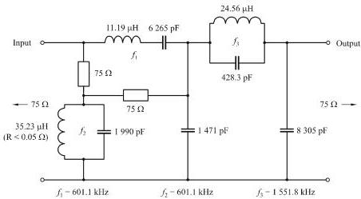

*Figure 21 - Non-constant resistance network diagram.*
Note 1 – Capacitor and resistor tolerances ±1%.
Note 2 – Each inductor should be adjusted to resonate at the appropriate indicated frequency.
Note 3 – This network requires to be operated between 75 Ω terminations for correct performance.

##### 4.2 Constant resistance form

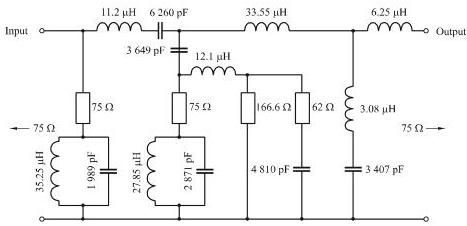

*Figure 22 - Constant resistance network diagram.*

Note 1 – Capacitor and inductor tolerances ±2%, resistor tolerance ±1%. The Q-factor of each inductor should be equal to, or greater than, 80 at 1 MHz.

##### 4.3 Step response of staircase differentiating network

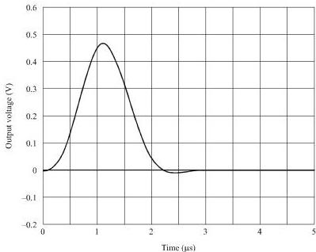

*Figure 23 - Transient response of the network.*

#### 5 Thomson filter for use in measurement of line-time waveform distortion

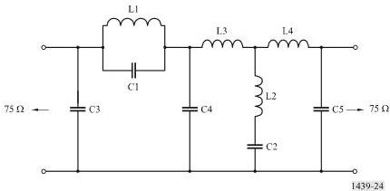

*Figure 24 - Thomson filter diagram.*

Table of values
|  Component | Value (f_{ow} = 3.3 MHz)  |
| --- | --- |
|  C1 | 147.7  |
|  C2 | 4044  |
|  C3 | 141.6  |
|  C4 | 1057  |
|  C5 | 310.5  |
|  L1 | 2.948  |
|  L2 | 0.5752  |

Note 1 – fow is the frequency of the first zero of the output/input transfer function.
Note 2 – Inductances are given in μH, capacitances in pF.
Note 3 – For further details see Phillips, Proc. IEE, Vol. 105B, p. 440.

## Annex 3

### Methods of measurement using insertion test signals

#### 1 Introduction

Some elements given in Annex 1 may be combined to produce test signals which may be inserted into video signals for measurements in the presence of programme signals. The examples of insertion test signals are given in Figs. 25 and 26. The allocation of these signals to vertical blanking lines may differ from the allocations used for international measurements given in ITU-T Recommendation J.63.

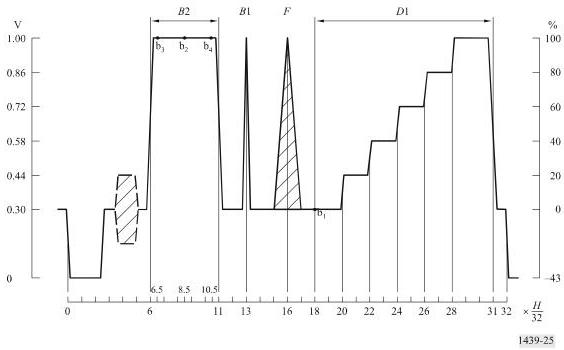

*Figure 25 - Line 17 for 625-line systems.*

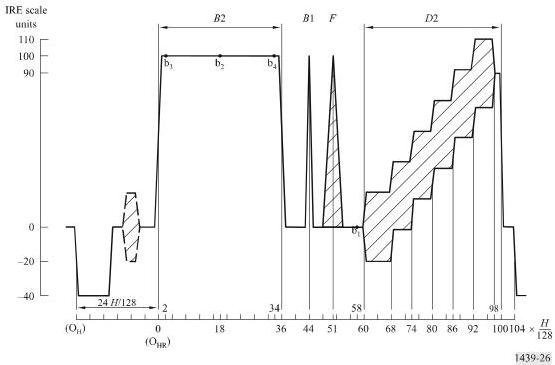

*Figure 26 - Line 17/field 1 for 525-line systems.*

## Annex 4

### Short-time waveform distortion - The K-rating method of assessment

#### 1 Introduction

This Annex briefly describes the K-rating method of assessment of short-time waveform distortion which provides a compact method of expressing the results of the measurements outlined in § 3.4.1.4, Part 2.

The K-rating method, as originally described, was in fact two methods ideally giving the same results:

- the routine-test method; and
- the acceptance-test method.

The routine-test method is based on parameters which can easily be measured on an oscilloscope to give results quickly. The acceptance-test method, based on the response to a T sin² pulse, is more rigorous and well suited to the analysis of systems and networks in addition to acceptance tests on hardware. The rating method has been devised so that equal K-values obtained for the various parameters correspond approximately to equal subjective impairments on pictures.

Section 2 shows how the performance objectives and tolerances for short-time waveform distortion can be expressed using the routine-test $K$-rating method. Section 3, for completeness, outlines how the acceptance-test method could be used.

#### 2 Routine-test method

For the first two parameters, the response to the $2T\sin^2$ pulse (B1) and one of the bar elements (B2 or B3) are used. The third parameter is not normally measured on circuits and equipments for the transmission of composite colour signals. It is included here for possible use on circuits for colour signals in analogue component form. The test-signal element required is a $T\sin^2$ pulse, where $T = 1 / 2F_{c}$ ($F_{c}$ is the nominal bandwidth of the channel-under-test).

##### 2.1 $2T$ pulse response

For a particular value of $K_{(2T)}$, a mask of the type shown in Figs. 27a or 27b is required. The tolerances on the response at the time intervals shown in Fig. 27a correspond to $\pm 4K$ at $\pm 200$ ns, $\pm 2K$ at $\pm 400$ ns and $\pm K$ at $\pm 800$ ns and beyond, with the same values at the greater times in Fig. 27b.

For the masks illustrated in Figs. 27a and 27b:

$$
K_{(2T)} = 3\%
$$

##### 2.2 $2T$ pulse/bar ratio

The $2T$ pulse/bar ratio $(P / B)$ is related to $K_{(P / B)}$ by:

$$
K_{(P / B)} = \frac{1}{4} \left| \frac{B}{P} - 1 \right| \times 100\%
$$

##### 2.3 $T$ pulse response

This measurement is not necessary when the circuit has to meet the close tolerances on chrominance-luminance gain and delay inequalities required for composite colour signals. In other cases, the tests using only the $2T$ pulse leave distortions in the upper half of the transmission band virtually untested, so that a test using the $T$ pulse becomes necessary.

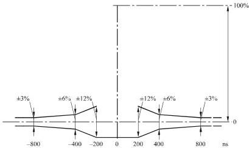

*Figure 27a - Mask for response to test signal B1 (625-lines). Half-amplitude duration: $2T = 200$ ns for $f_{o} = 5\mathrm{MHz}$ and 167 ns for $f_{c} = 6\mathrm{MHz}$.*

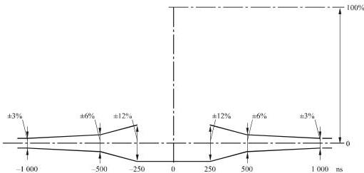

*Figure 27b - Mask for response to test signal B1 (525-lines). Half-amplitude duration: 250 ns.*
Limits to the response to the  $T$  pulse cannot be specified rigidly because the spectrum of the  $T$  pulse extends far beyond the nominal upper frequency limit of the circuit, and the response must therefore contain irrelevant information. A partial solution has been found by the insertion of a phase-corrected low-pass filter with a sharp cut-off at the edge of the nominal channel band, between the channel under test and the oscilloscope. The filter is first measured using a local test

signal. The pulse-to-bar ratio is then, say $y$ ($y$ will be in the region of 0.82). The channel under test is then connected to the filter and the pulse-to-bar ratio measured. From this, the $T$-pulse rating is, approximately:

$$
K_{(T)} = \frac{1}{4} \left| y \cdot \frac{B}{P} - 1 \right|
$$

Delay errors near the edge of the channel passband can also affect the $T$-pulse $K$-rating. An estimate of the effects of such errors can be obtained from the change, caused by the channel, in the first pre- and post-overshoots measured at the filter output. The change in overshoot (normalized to the pulse amplitude) is, approximately, $3K_{(T)}$.

#### 3 Acceptance-test method

From the measured $T$-pulse response and the measured or assumed response of the measuring equipment itself, the filtered impulse response is derived and expressed in the form of a normalized time series. The main term of this series represents the ideal or non-distorting part, and the echo terms represent the distorting parts. The amplitudes of the echo terms should meet the following four sets of limits giving four values of $K$.

Let the time series representing the filtered impulse response be:

$$
B(rT) = \dots B_{-r}, \dots B_{-1}, B_0, B_{+1}, \dots B_{+r}, \dots
$$

and assume that this has already been normalized so that $B_0 = 1$; let the serial product of $B(rT)$ and the series $[\frac{1}{2}, 1, \frac{1}{2}]$ be:

$$
C(rT) = \dots C_{-r}, \dots C_{-1}, C_0, C_{+1}, \dots C_{+r}, \dots
$$

where:

$$
C_r = \frac{1}{2} B_{r-1} + B_r + \frac{1}{2} B_{r+1}
$$

then:

$$
K1 \geq \frac{1}{8} \left| r \cdot \frac{C_r}{C_0} \right| \quad \text{for } -8 \leq r \leq -2 \text{ and } +2 \leq r \leq +8
$$

$$
K1 \geq \left| \frac{C_r}{C_0} \right| \quad \text{for } r \leq -8 \text{ and } r \geq +8
$$

and:

$$
K2 = \frac{1}{4} \left| \left( \frac{1}{C_0} \sum_{-8}^{+8} B_r \right) - 1 \right|
$$

$$
K3 = \frac{1}{6} \left| \left( \sum_{-8}^{+8} B_r \right) - 1 \right|
$$

$$
K4 = \frac{1}{20} \left\{ \left( \sum_{-8}^{+8} |B_r| \right) - 1 \right\}
$$

The series $C(rT)$ represents fairly closely the response to a $2T$ pulse. $K1$ is thus approximately equivalent to $K_{(2T)}$ in the routine test method. $K2$ places limits on the $2T$ pulse/bar ratio and is approximately equivalent to $K_{(P/B)}$ in the routine-test method. $K3$ places limits on the pulse/bar ratio of the response to a hypothetical pulse-and-bar test signal in which the pulse is an ideal filtered impulse and is approximately equivalent to $K_{(T)}$ in the routine-test method. $K4$ places an upper limit on the average amplitude, ignoring signs, of the 16 central echo terms, to protect against rarely-met distortions such as a long train of echoes whose magnitudes are not great enough individually to reach one of the other limits. It has no routine-test equivalent.