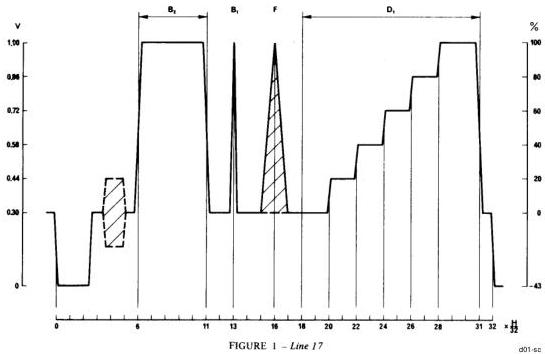
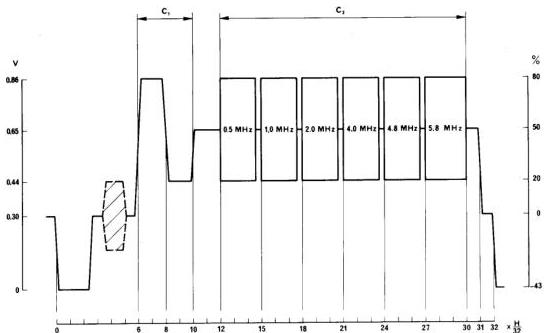
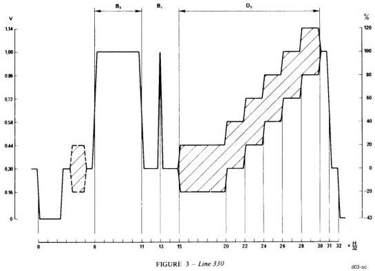
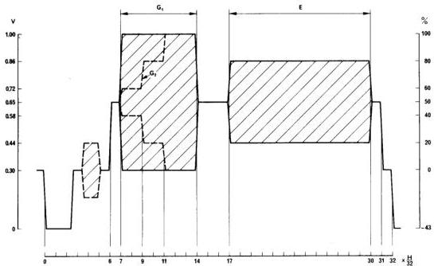
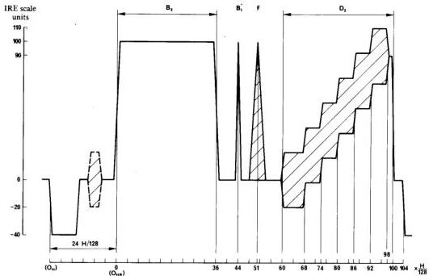
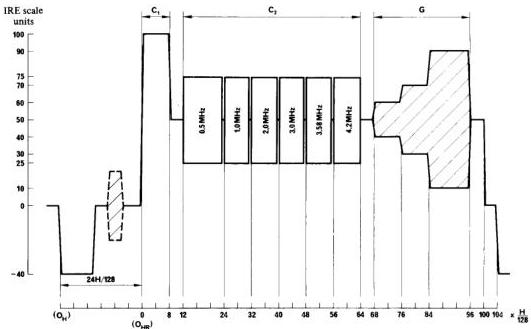
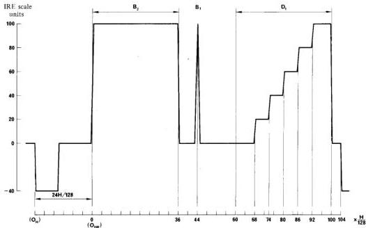
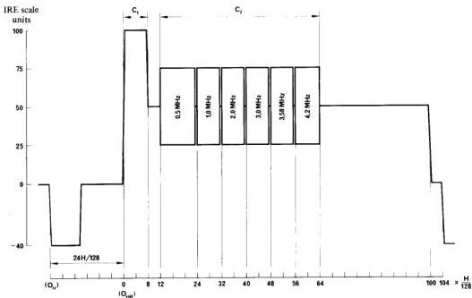

# INSERTION OF TEST SIGNALS IN THE FIELD-BLANKING INTERVAL OF MONOCHROME AND COLOUR TELEVISION SIGNALS

ITU-T Recommendation J.63 (1990)
(1970; revised in 1974, 1978, 1982, 1986 and 1990)

The CCIR,

## CONSIDERING

(a) that it is already current practice in a number of countries to use insertion test signals in the field-blanking interval of monochrome and colour television signals;
(b) that such signals can be used for the measurement of performance and the monitoring, control and correction of characteristics of international transmission circuits;
(c) that Report 314 proposes that certain specific lines in each field be allocated for the insertion of special test signals for international transmissions;
(d) that traffic demands may make it necessary to perform all operational measurements by means of insertion test signals, to an accuracy approaching that of conventional out-of-service measuring methods,

## UNANIMOUSLY RECOMMENDS

1. that for the international transmission of television signals, insertion test signals in accordance with Annex I (625-line systems) and Annex II (525-line systems) may be inserted at the origin of the circuit;

Note. – As an interim measure some administrations may decide to omit some of the waveforms described. Where waveforms are omitted:

- waveforms other than those described should not be inserted;
- care must be taken to ensure that the line-time luminance components of equivalent lines in each field (e.g. 17 and 330 for 625-line systems) are similar.

2. that these signals should neither be removed nor replaced on the international circuit, except possibly at a point of conversion of either standard or colour system.

## ANNEX I

### 625-LINE SYSTEMS

### 1. Introduction

For the international transmission of 625-line television signals, Recommendation 472 and Report 314 propose the use of lines 17 (330) and 18 (331) for insertion test signals.

This Annex describes a comprehensive arrangement of insertion test signals (see Note) to which the following general considerations apply:

- it is assumed that the line duration $H$ is divided into 32 equal time periods. This division defines the characteristic instants;
- the time periods shall not differ from each other by more than $\pm 40$ ns;
- the characteristic instants are referred to the mid-amplitude point of the leading edge of the synchronizing pulse. The half-amplitude points of the luminance and chrominance transitions and the peaks of the pulses occur at the characteristic instants;

- the actual characteristic instants of any luminance waveform shall not differ by more than 250 ns from their nominal positions;
- except in the case of the $20T$ composite pulse, the actual characteristic instants of any chrominance waveform shall not differ by more than 500 ns from their nominal positions;
- the colour burst is present in the line-blanking period only in colour transmission;
- in the case of PAL transmissions, the chrominance sub-carrier of the insertion signals is locked at $60 \pm 5^{\circ}$ from the positive $(B - Y)$ axis;
- harmonic distortion components of the sub-carrier shall be at least $40\mathrm{dB}$ below the level of the fundamental;
- the frequency of the sub-carrier is 4.43361875 MHz ± 10 Hz.

Note. - These are intended for use with colour television signals. The basic insertion test signal for monochrome transmissions is identical, with the following exceptions:

Line 17: element $F$ is omitted;

Line 18: the luminance pedestal and elements $C_1$ and $C_2$ are omitted;

Line 330: element $D_{2}$ is replaced by $D_{1}$;

Line 331: the luminance pedestal and elements $G$ and $E$ are omitted.

The following additions to the basic monochrome insertion test signal may be found useful:

(a) the luminance pedestal on lines 18 and 331 and elements $C_1$ and $C_2$ on line 18

and/or

(b) the element $F$ on line 17.

Alternatively, the whole of the signals may be utilized. The above modifications to the basic monochrome insertion test signal should, however, only be made with the agreement of the administrations concerned.

### 2. Particulars of signals inserted in line 17 (Fig. 1)

#### 2.1 Luminance bar (reference white level) $(B_{2})$

- position of transitions: $6H/32$ and $11H/32$, duration of bar $5H/32$;
- bar amplitude: $0.700 \pm 0.007\mathrm{V}$;
- rise and fall times of transitions: derived from the shaping network of the sine-squared pulse (element $\mathbf{B}_1$);
- overshoot and undershoot $\leq 0.5\%$;
- tilt $\leq 0.5\%$.

#### 2.2 2T sine-squared pulse $(B_{1})$

- peak position: $13H / 32$;
- amplitude: within $\pm 1\%$ of the amplitude of the luminance bar $(B_{2})$ (nominal value: $0.700\mathrm{V}$);
- half-amplitude duration: $200 \pm 10$ ns (see Note).

Note. - In some countries, members of the OIRT, the half-amplitude duration of the $2T$ sine-squared pulse may be 160 ns.

#### 2.3 Composite 20T pulse $(F)$

- position of peak: $16H / 32$;
- position of base: $15H / 32 - 17H / 32$;
- amplitude: within $\pm 1\%$ of the amplitude of the luminance bar $(B_{2})$ (nominal value: $0.700\mathrm{V}$);
- half-amplitude duration: $2 \pm 0.06\mu s$;
- perturbations of the pulse base-line, due to inherent chrominance-luminance amplitude and delay inequalities and different shape of the luminance and chrominance components: $\leq 0.5\%$ peak amplitude.

#### 2.4 Five-riser luminance staircase $(D_{1})$ (see Note)

- position of successive transitions: $20H / 32, 22H / 32, 24H / 32, 26H / 32, 28H / 32$ and $31H / 32$ (fall);
- peak-to-peak amplitude of the staircase: within $\pm 1\%$ of the amplitude of the luminance bar $(B_{2})$ (nominal value: $0.700\mathrm{V}$);

- nominal amplitude of risers: 1/5 of amplitude of the luminance bar  $(B_{2})$  (nominal value:  $0.140\mathrm{V}$ ). The difference in amplitude between the largest and smallest risers must be less than  $0.5\%$  of the largest amplitude;
- rise and fall times of transitions: shaped by a Thomson filter (or similar network) with a transfer function modulus having its first zero at  $4.43\mathrm{MHz}$  to restrict the amplitude of components of the luminance signal in the vicinity of the colour sub-carrier.

Note. - Some administrations may wish to superimpose a chrominance sub-carrier signal on this staircase. In this case, the position and duration of the sub-carrier are determined by instants  $18H/32$  and  $31H/32$ . The other characteristics of this signal are identical to those described in  $\S 4.3.2$ .

*Figure 1 – Line 17.*

### 3. Particulars of signals inserted in line 18 (Fig. 2)

#### 3.1 Luminance pedestal

- position of transitions:  $6H/32$ ,  $31H/32$ ;
- amplitude measured from blanking level: within  $\pm 1\%$  of one-half of the amplitude of luminance bar  $(B_{2})$  (nominal value:  $0.350\mathrm{V}$ );

#### 3.2 Reference bar signal  $(C_1)$

- position of transitions:  $6H/32$ ,  $8H/32$ ,  $10H/32$ ;
- amplitudes measured from blanking level:
1st section: within  $\pm 1\%$  of four-fifths of the amplitude of the luminance bar  $(B_{2})$  (nominal value:  $0.560\mathrm{V}$ );
2nd section: within  $\pm 1\%$  of one-fifth of the amplitude of the luminance bar  $(B_{2})$  (nominal value:  $0.140\mathrm{V}$ );
- rise and fall times of transitions: derived from the shaping network of the sine-squared pulse (element  $B_{1}$ ).

#### 3.3 Sine-wave signals superimposed on the pedestal $(C_2)$

- starting positions and frequencies of the bursts (see Table I);

TABLE I

|  Burst No. | Precise starting position (1) (2) | Frequency MHz (3)  |
| --- | --- | --- |
|  1 | 12H/32 | 0.5  |
|  2 | 15H/32 | 1.0 (4)  |
|  3 | 18H/32 | 2.0 (4)  |
|  4 | 21H/32 | 4.0  |
|  5 | 24H/32 | 4.8  |
|  6 | 27H/32 | 5.8  |

(1) The starting point of each burst shall be at zero phase of the sine-wave, and each burst shall consist of the maximum number of complete cycles. The gaps between successive bursts shall not be shorter than $0.4\,\mu\mathrm{s}$ nor longer than $2.0\,\mu\mathrm{s}$ in duration.

(2) Some administrations may prefer to use burst durations different from those shown above and in Fig. 2.

(3) Spectral components of the bursts may cause interference to sub-carriers or noise detection circuits and the out of band energy should be limited by suitable design techniques. Other frequencies near to the above mentioned may be used, subject to an agreement between the administrations concerned.

(4) In some countries, members of the OIRT, the frequencies of bursts Nos. 2 and 3 may be $1.5\,\mathrm{MHz}$ and $2.8\,\mathrm{MHz}$ respectively.

- the peak-to-peak amplitude of bursts shall be within $\pm 1\%$ of the peak-to-peak amplitude of the reference bar signal $(C_1)$ (nominal value: $0.420\,\mathrm{V}$);
- the d.c. component of each burst shall not exceed $0.5\%$ of the amplitude of the reference bar signal $(C_1)$;
- the harmonic distortion components of each burst are to be at least $40\,\mathrm{dB}$ (see Note) below the fundamental.

Note. – This value is subject to further study.

*Figure 2 – Line 18.*

### 4. Particulars of signals inserted in line 330 (Fig. 3)

#### 4.1 Luminance bar (reference white level) $(B_{2})$

- position of transitions: $6H/32$ and $11H/32$, duration of bar $5H/32$;
- bar amplitude: $0.700 \pm 0.007\mathrm{V}$;
- rise and fall times of transitions: derived from the shaping network of the sine-squared pulse (element $B_{1}$);
- overshoot and undershoot $\leq 0.5\%$;
- tilt $\leq 0.5\%$.

#### 4.2 2T sine-squared pulse $(B_{1})$

- peak position: $13H/32$;
- amplitude: within $\pm 1\%$ of the amplitude of the luminance bar $(B_{2})$ (nominal value: $0.700\mathrm{V}$);
- half-amplitude duration: $200 \pm 10$ ns. (In some countries, members of the OIRT, the half-amplitude duration of the $2T$ sine-squared pulse may be 160 ns.)

#### 4.3 Five-riser luminance staircase $(D_{1})$ and superimposed five-riser staircase $(D_{2})$

##### 4.3.1 The five-riser luminance staircase has the following characteristics:

- position of successive transitions: $20H/32$, $22H/32$, $24H/32$, $26H/32$, $28H/32$ and $31H/32$ (fall);
- peak-to-peak amplitude of the staircase: within $\pm 1\%$ of the amplitude of the luminance bar $(B_{2})$ (nominal value: $0.700\mathrm{V}$);
- nominal amplitude of risers: 1/5 of amplitude of the luminance bar $(B_{2})$ (nominal value: $0.140\mathrm{V}$). The difference in amplitude between the largest and smallest risers must be less than $0.5\%$ of the largest amplitude;
- rise and fall times of transitions: shaped by a Thomson filter (or similar network) with a transfer function modulus having its first zero at $4.43\mathrm{MHz}$ to restrict the amplitude of components of the luminance signal in the vicinity of the colour sub-carrier.

##### 4.3.2 The chrominance signal superimposed on the five-riser luminance staircase $(D_{1})$ has the following characteristics:

- position and duration: $15H/32$ to $30H/32$. The superimposed sub-carrier may be limited to $28H/32$;
- peak-to-peak amplitude: $0.280\mathrm{V} \pm 2\%$;
- inherent differential-gain distortion: $\leq 0.5\%$;
- inherent differential-phase distortion: $\leq 0.2^{\circ}$;
- rise and fall times of the envelope of the chrominance transition: $1\mu\mathrm{s}$ approximately.

### 5. Particulars of signals inserted in line 331 (Fig. 4)

#### 5.1 Luminance pedestal

- position of transitions: $6H/32$, $31H/32$;
- amplitude measured from blanking level: within $\pm 1\%$ of one-half of the amplitude of the luminance bar $(B_{2})$ (nominal value: $0.350\mathrm{V}$);
- rise and fall times of transitions: derived from the shaping network of the sine-squared pulse (element $B_{1}$).

#### 5.2 Superimposed chrominance bar signal $(G_{1})$

- position of transitions: $7H/32$, $14H/32$;
- peak-to-peak amplitude: within $\pm 1\%$ of the amplitude of the luminance bar $(B_{2})$ (nominal value: $0.700\mathrm{V}$);
- rise and fall times of the envelope of the chrominance signal transactions: $1\mu\mathrm{s}$ approximately;
- inherent chrominance-luminance cross-talk: $\leq 0.5\%$ of luminance pedestal amplitude;
- phase difference between the sub-carrier superimposed on the staircase in line 330 and the sub-carrier superimposed on line $331: \leq 2^{\circ}$.

*Figure 3 – Line 330.*

#### 5.3 Superimposed three-level chrominance signal  $(G_{2})$

This signal may be used as an alternative to the superimposed chrominance bar signal defined above:

- position of transitions:  $7H/32$ ,  $9H/32$ ,  $11H/32$  and  $14H/32$ ;
- peak-to-peak amplitudes:

1st section: within  $\pm 1\%$  of one-fifth of the amplitude of the luminance bar  $(B_{2})$  (nominal value:  $0.140\mathrm{V}$ );
2nd section: within  $\pm 1\%$  of three-fifths of the amplitude of the luminance bar  $(B_{2})$  (nominal value:  $0.420\mathrm{V}$ );
3rd section: within  $\pm 1\%$  of the amplitude of the luminance bar  $(B_{2})$  (nominal value:  $0.700\mathrm{V}$ );

- rise and fall times of the envelope of the chrominance signal transitions:  $1\mu \mathrm{s}$  approximately;
- inherent chrominance-luminance cross-talk:  $\leq 0.5\%$  of luminance pedestal amplitude;
- inherent phase/amplitude distortion:  $\leq 0.5^{\circ}$
- phase difference between the sub-carrier superimposed on the staircase in line 330 and the sub-carrier superimposed on line  $331: \leq 2^{\circ}$ .

#### 5.4 Superimposed reference sub-carrier  $(E)$

This auxiliary signal may be used as a reference sub-carrier for the measurement of differential phase;

- position of transitions:  $17H/32$ ,  $30H/32$ ;
- peak-to-peak amplitude: within  $\pm 1\%$  of three-fifths of the amplitude of the luminance bar  $(B_{2})$  (nominal value:  $0.420\mathrm{V}$ );
- rise and fall times of the envelope of the chrominance signal transitions:  $1\mu \mathrm{s}$  approximately;
- phase difference between the sub-carrier superimposed on the staircase in line 330 and the sub-carrier superimposed on the line  $331: \leq 2^{\circ}$ .

*Figure 4 – Line 331.*

### 6. List of measurements which can be made with the defined insertion test signals

TABLE II

|  Characteristics measured | Waveform used | Line number  |
| --- | --- | --- |
|  Linear distortions |  |   |
|  Insertion gain | B2 | 17 and 330  |
|  Amplitude/frequency response | C2and C1 | 18  |
|  Line-time waveform distortion | B2 | 17 and 330  |
|  Short-time waveform distortion: |  |   |
|  - step response | B2 | 17 and 330  |
|  - pulse response | B1 | 17 and 330  |
|  Chrominance-luminance gain inequality | B2and G1or G2 | 17 and 330, 331  |
|   |  B2and F | 17  |
|  Chrominance-luminance delay inequality | F | 17  |
|  Non-linear distortions |  |   |
|  Luminance line-time non-linearity | D1 | 17  |
|  Chrominance non-linearity | G2 | 331  |
|  Luminance-chrominance intermodulation: |  |   |
|  - differential gain | D2 | 330  |
|  - differential phase | D2and E | 330 and 331  |
|  Chrominance-luminance intermodulation | B2and G1or G2 | 17, 331  |

## ANNEX II

### 525-LINE SYSTEMS

### 1. Introduction

This Annex describes waveforms and the corresponding specification of insertion test signals to which the following general considerations apply:

- for international transmission of a 525-line television signal, line 17 of both fields (lines 17 and 280 if numbered consecutively), are reserved for international insertion test signals (see Note 1);
- the signals defined in this Annex apply to both monochrome and colour television transmission, as shown in Figs. 5 and 6. For monochrome transmission, some simplifications of the test signal by the omission of one or more of its components may be desirable. Such simplified signals are shown in Figs. 7 and 8;
- the line duration $H$ is divided into 128 equal parts, and the position and duration of test signals are determined in $H/128$. This division defines the characteristic instants;
- the characteristic instants are referred to the half-amplitude points of the leading edge of the luminance bar signal $(B_{2})$ in Figs. 5 or 7 and the reference bar signal $(C_{1})$ in Figs. 6 or 8, which are inserted in fields 1 and 2 respectively, $(\mathrm{O}_{HR})$. The half-amplitude point of the luminance and chrominance transitions and peak of the pulses occur at the characteristic instants;
- positioning of the reference point $(\mathrm{O}_{HR})$ shall not exceed $24H/128 \pm 125$ ns relative to the mid-amplitude point of the leading edge of the horizontal synchronizing pulse $(\mathrm{O}_{H})$;
- the systematic offset in the defined characteristic instants of any luminance and chrominance waveforms shall not differ by more than $\pm 150$ ns (see Note 2) and $\pm 300$ ns (see Note 2) respectively, from the nominal points;
- the random error in the defined characteristic instants for both luminance and chrominance waveforms shall not exceed $\pm 25$ ns from a fixed position which lies within the above systematic offset;
- the colour burst is present in the line-blanking period only in colour transmission;
- the frequency of the colour sub-carrier is 3.579 545 MHz for system M/NTSC, and 3.575 611 49 MHz for system M/PAL, $\pm 10$ Hz.

Note 1. – The majority of the administrations reserve line 17 for insertion of international test signals. Report 314 provides information on the current allocation of lines reserved for special signals.

Note 2. – Reduction in these tolerances is a matter for further study.

### 2. Particulars of signals inserted in line 17 of field 1 (Figs. 5 or 7) (see Note 1 of § 1)

#### 2.1 Luminance bar (reference white level) $(B_{2})$

- position of transitions: $0H/128$ (O$_{HR}$) and $36H/128$, duration of bar $36H/128$;
- bar amplitude: $100 \pm 0.5$ IRE units (see Note);
- rise and fall times of transitions (integrated sine-squared shape): $125 \pm 5$ ns;
- overshoot and undershoot: $\leq 1\%$;
- tilt: $\leq 0.5\%$.

Note. – For 525-line systems, the signal amplitude is expressed in Institute of Radio Engineers (IRE) units. By convention, 100 IRE units correspond to the amplitude comprised between the blanking level and the white level (see Figs. 5 to 8).

#### 2.2 2T sine-squared pulse $(B_{1})$

- position of peak: $44H/128$;
- amplitude: within $\pm 0.5$ IRE unit of the amplitude of the luminance bar $(B_{2})$ (nominal value: 100 IRE units);
- half-amplitude duration: $250 \pm 10$ ns.

#### 2.3 Modulated 12.5T sine-squared pulse $(F)$ (see Note)

- position of peak: $51H/128$;
- amplitude: within $\pm 0.5$ IRE unit of the amplitude of the luminance bar $(B_{2})$ (nominal value: 100 IRE units);
- half-amplitude duration: $1.57 \pm 0.05 \mu \mathrm{s}$;
- inherent chrominance-luminance amplitude inequality: $\leq 0.5\%$;

- inherent chrominance-luminance delay inequality: $\leq 5$ ns;
- other perturbations in the pulse base line: $\leq 0.5$ IRE unit;
- harmonic distortion component of the chrominance sub-carrier: at least 40 dB below the fundamental;
- chrominance sub-carrier is to be phase-locked to colour burst when this is present.

*Note.* – For monochrome transmissions, this signal is optional.

#### 2.4 Five-riser luminance staircase ($D_1$) (see Note) and superimposed five-riser staircase ($D_2$)

*Note.* – Monochrome transmission only.

##### 2.4.1 The five-riser luminance staircase ($D_1$) has the following characteristics:

- position of successive transitions: $68H/128$, $74H/128$, $80H/128$, $86H/128$, $92H/128$ and $100H/128$ (fall);
- peak-to-peak amplitude of the staircase: $100 \pm 1$ IRE units for the signal $D_1$ and $90 \pm 1$ IRE units for the signal $D_2$;
- nominal amplitude of risers: within $\pm 1\%$ of $1/5$ amplitude of peak-to-peak amplitude of the staircase (nominal value: 20 IRE units for the signal $D_1$ and 18 IRE units for the signal $D_2$);
- rise and fall times of transitions: shaped by a $2T$ sine-squared filter to restrict the amplitude of components of the luminance signal in the vicinity of the colour sub-carrier (nominal value: 250 ns).

##### 2.4.2 The chrominance signal when superimposed on the staircase has the following characteristics:

- position of transitions: $60H/128$ and $98H/128$, duration of the chrominance signal $38H/128$;
- peak-to-peak amplitude of the envelope of the chrominance signal: $40 \pm 0.4$ IRE units;
- inherent differential-gain distortion: $\leq 0.25\%$ (average picture luminance (APL): 10 to $90\%$);
- inherent differential-gain distortion: $\leq 0.2^{\circ}$ (APL: 10 to $90\%$);
- rise and fall times of the envelope of the chrominance signal transitions: $400 \pm 25$ ns;
- phase difference between the chrominance signal and the mean phase (see Note) of the programme colour burst signal: $0 \pm 1^{\circ}$ (APL: 10 to $90\%$).

*Note.* – The term “mean phase” is particularly significant in the case of M/PAL.

### 3. Particulars of signals inserted in line 17 of field 2 (Figs. 6 or 8) (see Note 1 of § 1)

#### 3.1 Reference bar signal ($C_1$)

- position of transitions: $0H/128$ ($\mathrm{O}_{HR}$) and $8H/128$; duration of bar: $8H/128$;
- bar amplitude: within $\pm 0.5$ IRE unit of the amplitude of the luminance bar signal ($B_2$) (nominal value: 100 IRE units);
- rise and fall times of transitions: (integrated sine-squared shape): $125 \pm 5$ ns;
- overshoot and undershoot: $\leq 1\%$;
- tilt: $\leq 0.5\%$.

#### 3.2 Luminance pedestal

- position of transitions: $8H/128$ and $100H/128$;
- amplitude: within $\pm 1\%$ of one half of the amplitude of luminance bar ($B_2$) (nominal value: 50 IRE units).

#### 3.3 Multi-burst signal superimposed on the pedestal ($C_2$)

- starting positions and frequencies of the bursts (see Table III);
- peak-to-peak amplitude of burst: $50 \pm 0.5$ IRE units;
- d.c. component of each burst: not to exceed 0.25 IRE unit;
- harmonics shall be at least 40 dB below the fundamental.

#### 3.4 Superimposed 3-level chrominance signal ($G$) (see Note)

- position of transitions: $68H/128$, $76H/128$, $84H/128$ and $96H/128$;
- peak-to-peak amplitudes:

- 1st section: $20 \pm 0.2$ IRE units,
- 2nd section: $40 \pm 0.4$ IRE units,
- 3rd section: $80 \pm 0.4$ IRE units;

- rise and fall times of the envelope of the chrominance signal transitions: $400 \pm 25$ ns;
- inherent phase/amplitude distortion: $\leq 0.5^{\circ}$;
- inherent chrominance-luminance intermodulation: $\leq 0.25$ IRE unit;

- chrominance component:

- in system M/PAL is to be phase-locked to programme colour burst, if present;
- in system M/NTSC, is to lag the programme colour burst (if present) by $90^{\circ} \pm 1^{\circ}$.

Note. – For monochrome transmission, this signal is optional.

TABLE III

|  Burst No. | Precise starting position (1) | Frequency MHz (2)  |
| --- | --- | --- |
|  1 | 12H/128 | 0.5  |
|  2 | 24H/128 | 1.0  |
|  3 | 32H/128 | 2.0  |
|  4 | 40H/128 | 3.0  |
|  5 | 48H/128 | 3.58  |
|  6 | 56H/128 | 4.2  |

(1) The starting point of each burst shall be at zero phase of the sine-wave, and each burst shall consist of the maximum number of complete cycles. The gaps between successive bursts shall not be shorter than $0.4\,\mu\mathrm{s}$, nor longer than $2.0\,\mu\mathrm{s}$ in duration.

(2) Spectral components of the bursts may cause interference to sound sub-carriers or noise detection circuits and the out-of-band energy should be limited by suitable design techniques. For example, the envelopes of the bursts should have a rise time greater than 300 ns and the envelope should be approximately integrated sine-squared shape.

If harmonics of the burst cause interference, other frequencies near to the above-mentioned may be used, subject to agreement between the administrations concerned.

### 4. List of measurements which can be made with the defined insertion test signals (see Note 1 of § 1)

TABLE IV

|  Characteristics measured | Waveform used | Line number  |
| --- | --- | --- |
|  Linear distortion |  |   |
|  Insertion gain | $B_2$ | 17/field 1  |
|  Amplitude/frequency response | $B_2$ (1) and $C_2$ | 17/fields 1 and 2  |
|  Line-time waveform distortion | $B_2$ | 17/field 1  |
|  Short-time waveform distortion: |  |   |
|  - step response | $B_2$ | 17/field 1  |
|  - pulse response | $B_1$ | 17/field 1  |
|  Chrominance-luminance gain inequality | $B_2$ and $F$ | 17/field 1  |
|  Chrominance-luminance delay inequality | $F$ | 17/field 1  |
|  Non-linear distortion |  |   |
|  Line-time luminance non-linearity | $D_1$ (2) | 17/field 1  |
|  Chrominance non-linearity | $G$ | 17/field 2  |
|  Luminance-chrominance intermodulation: |  |   |
|  - differential gain | $D_2$ | 17/field 1  |
|  - differential phase | $D_2$ | 17/field 1  |
|  Chrominance-luminance intermodulation | $G$ | 17/field 2  |

(1) $C_1$ (line 17/field 2) may be used in place of $B_2$, when line-time distortion is suitably small.

(2) $D_2$ may be used when the chrominance-luminance intermodulation is suitably small.

*Figure 5 – Line 17 of field 1.*

*Figure 6 – Line 17 of field 2.*

*Figure 7 – Line 17 of field 1.*

*Figure 8 – Line 17 of field 2.*
Note. - Figs. 7 and 8 are examples of insertion test signals for monochrome transmission.

# BIBLIOGRAPHY

CCIR Documents

[1982-86]: CMTT/6 (United States of America).