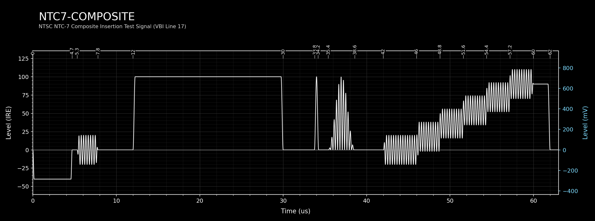
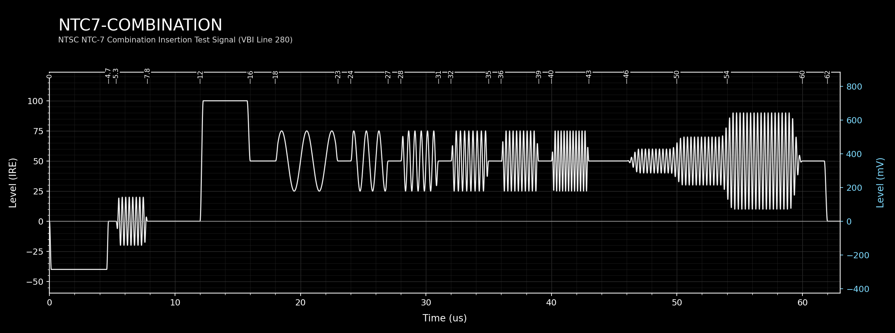
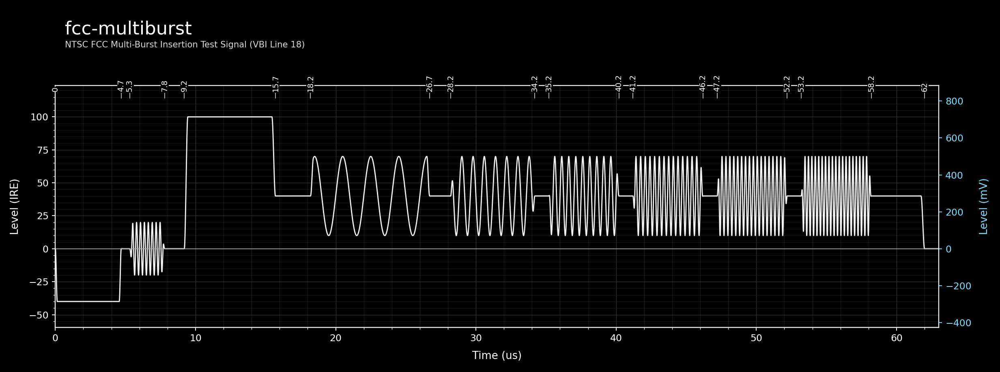
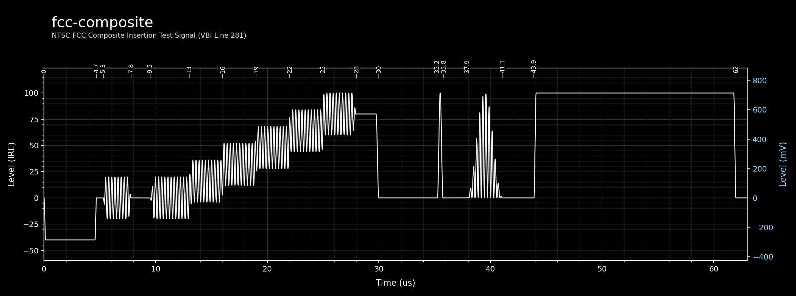
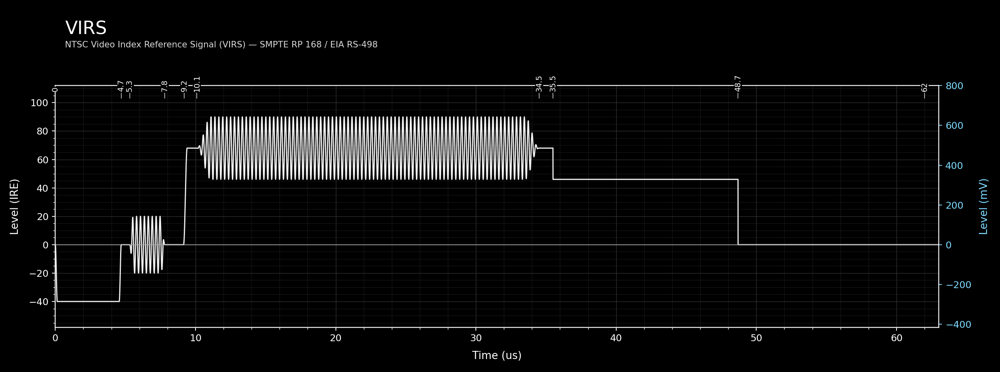

# NTSC VITS Definitions

This document describes the Vertical Interval Test Signals (VITS) used in NTSC 525-line video systems. Each entry corresponds to a YAML definition file in `resources/definitions/vits/ntsc/`.

**Level units:** IRE (100 IRE = 714.3 mV, 0 IRE = blanking).  
**Timing reference:** All NTSC VITS YAML files in this repository use `sync_edge` timing — positions measured from the H-sync leading edge.

**Phase lock note:** Sequence-locked NTSC chroma is now explicit per element. A VITS `burst`/`composite_pulse` is lock-enabled by setting `subcarrier_lock_multiple` (typically `1.0`), which locks runtime frequency to exactly `subcarrier_lock_multiple × color_subcarrier_hz` and applies NTSC sequence phase progression with the YAML `phase_deg` offset.

**Edge shaping note:** VITS `rise_time_us` transitions now use the same shaped S-curve helper as the Field Structure Generator sync and burst ramps. This applies to bar edges, burst envelopes, burst-to-burst amplitude crossfades, and staircase step boundaries.

---

## NTC7 Composite

**YAML:** `resources/definitions/vits/ntsc/ntc7-composite.yaml`  
**VBI Line:** 17 | **Field:** 1  
**Standard:** EIA RS-498 / SMPTE RP 168 (NTC-7 ITS)
**Normative Source:** ITU-T J.63 Annex II section 2 (element assembly); BT.1439 Annex 1 (element definitions)

### Description

NTC7 Composite is the NTC-7 Composite insertion test signal for NTSC 525-line video. It is inserted on VBI line 17 of field 1.

The NTC-7 ITS was defined to enable comprehensive measurement of analogue composite video transmission quality within the VBI. Line 17 carries:

- A **100 IRE white reference bar** (12.00–30.00 µs) for luminance level reference.
- A **2T sine-squared pulse** (centred at 34.0 µs) for luminance group delay and bandwidth. In 525-line NTSC, T ≈ 125 ns.
- A **12.5T modulated sine-squared pulse** (centred at 37.0 µs) consisting of a 50 IRE luminance component and a chrominance component (3.58 MHz, phase-locked to burst) for chrominance-to-luminance delay measurement.
- A **sustained chrominance burst** (42.00–60.00 µs, centre 0 IRE, ±20 IRE (40 p-p), 3.58 MHz, 180°) spanning the staircase zone. When superposed on the staircase, the total level on each step is step value ±20 IRE.
- A **5-step luminance staircase** (46.00–60.00 µs, peak 90 IRE) for differential gain measurement.

### Elements

| # | Type | Label | Key Parameters |
|---|------|-------|----------------|
| 0 | Colour Bar | 100 IRE White Reference Bar | 100 IRE, 12.00–30.00 µs |
| 1 | Sine-Squared Pulse | 2T Luminance Pulse | 100 IRE, centre 34.0 µs, half-dur 0.25 µs |
| 2 | Sine-Squared Pulse | 12.5T Luminance Component | 50 IRE, centre 37.0 µs, half-dur 1.6 µs |
| 3 | Composite Pulse | 12.5T Chrominance Component | dc 0 IRE, centre 37.0 µs, Fsc 3.58 MHz, phase-locked to burst |
| 4 | Burst | Chrominance Reference Burst | dc 0 IRE, ±20 IRE (40 p-p), 42.00–60.00 µs, 3.58 MHz, φ 180° |
| 5 | Staircase | 5-Step Luminance Staircase | top 90 IRE, 46.00–60.00 µs, 5 steps |
| 6 | Colour Bar | Reference Level Bar | 90 IRE, 60.00–62.00 µs |

#### Staircase Detail — 5-Step Luminance Staircase (element 5)

5 steps, each equal width. Step width = (60.00 − 46.00) / 5 = **2.80 µs**. Top level: 90 IRE.

| Step | Start (µs) | End (µs) | Level (IRE) |
|------|------------|----------|-------------|
| 1 | 46.00 | 48.80 | 18.0 |
| 2 | 48.80 | 51.60 | 36.0 |
| 3 | 51.60 | 54.40 | 54.0 |
| 4 | 54.40 | 57.20 | 72.0 |
| 5 | 57.20 | 60.00 | 90.0 |

<!-- vits-diagram: ntc7-composite -->

---

## NTC7 Combination

**YAML:** `resources/definitions/vits/ntsc/ntc7-combination.yaml`  
**VBI Line:** 280 | **Field:** 2  
**Standard:** EIA RS-498 / SMPTE RP 168 (NTC-7 ITS)
**Normative Source:** ITU-T J.63 Annex II section 3 (element assembly); BT.1439 Annex 1 (element definitions)

### Description

NTC7 Combination is the NTC-7 Combination insertion test signal, inserted on VBI line 280 of field 2. It provides a multi-burst frequency sweep from 0.5 to 4.2 MHz and a stepped chrominance burst staircase at NTSC subcarrier frequency for chroma bandwidth and linearity evaluation.

The 50 IRE grey pedestal spans the full active line. A narrower +50 IRE initial reference boost rides on that pedestal at the beginning of the line, producing an apparent 100 IRE reference level, followed by six burst packets at increasing frequencies. At the end of the line, three contiguous chrominance burst zones form a stepped chrominance amplitude sequence with raised-cosine boundary crossfades, represented as overlapping additive bursts whose net amplitudes on the 50 IRE pedestal are ±10/±20/±40 IRE (20/40/80 IRE p-p), giving total instantaneous ranges of 40–60 IRE, 30–70 IRE, and 10–90 IRE respectively. All zones remain within the 0–100 IRE range.

### Elements

| # | Type | Label | Key Parameters |
|---|------|-------|----------------|
| 0 | Colour Bar | Grey Reference Boost (initial zone) | +50 IRE over 50 IRE pedestal, apparent 100 IRE, 12.00–16.00 µs |
| 1 | Colour Bar | Grey Background Level (full line) | 50 IRE, 12.00–62.00 µs |
| 2 | Burst | 0.5 MHz Burst | ±25 IRE (50 p-p), 18.00–23.00 µs |
| 3 | Burst | 1.0 MHz Burst | ±25 IRE (50 p-p), 24.00–27.00 µs |
| 4 | Burst | 2.0 MHz Burst | ±25 IRE (50 p-p), 28.00–31.00 µs |
| 5 | Burst | 3.0 MHz Burst | ±25 IRE (50 p-p), 32.00–35.00 µs |
| 6 | Burst | 3.58 MHz Burst (NTSC Subcarrier) | ±25 IRE (50 p-p), 36.00–39.00 µs |
| 7 | Burst | 4.2 MHz Burst | ±25 IRE (50 p-p), 40.00–43.00 µs |
| 8 | Burst | Chrominance Signal — Zone 1 | dc 0 IRE, ±10 IRE (20 p-p), 46.00–50.00 µs, 3.58 MHz, φ 90° — total 40–60 IRE |
| 9 | Burst | Chrominance Signal — Zone 2 | dc 0 IRE, ±20 IRE (40 p-p), 50.00–54.00 µs, 3.58 MHz, φ 90° — total 30–70 IRE |
| 10 | Burst | Chrominance Signal — Zone 3 | dc 0 IRE, ±40 IRE (80 p-p), 54.00–60.00 µs, 3.58 MHz, φ 90° — total 10–90 IRE |

<!-- vits-diagram: ntc7-combination -->

---

## fcc-multiburst

**YAML:** `resources/definitions/vits/ntsc/fcc-multiburst.yaml`  
**VBI Line:** 18 | **Field:** 1  
**Standard:** FCC Rules Part 73 / EIA RS-498
**Normative Source:** FCC/EIA national usage (not a preferred J.63 international insertion assembly)

### Description

fcc-multiburst is the FCC-specified multi-burst insertion test signal, inserted on VBI line 18. It mirrors the concept of PAL VITS 18 but uses the NTSC frequency domain (up to 4.1 MHz) and IRE levels. The signal is required in the USA for broadcast licence compliance and allows measurement of the frequency response of the transmission chain.

A 40 IRE grey pedestal forms the background for the full active line. A +60 IRE reference boost at the start rides on that pedestal, producing an apparent 100 IRE white reference level. Six burst packets follow at increasing frequencies:

| Burst | Frequency | Amplitude |
|-------|-----------|-----------|
| 1 | 0.5 MHz | ±30 IRE (60 p-p) |
| 2 | 1.25 MHz | ±30 IRE (60 p-p) |
| 3 | 2.0 MHz | ±30 IRE (60 p-p) |
| 4 | 3.0 MHz | ±30 IRE (60 p-p) |
| 5 | 3.58 MHz (Fsc) | ±30 IRE (60 p-p) |
| 6 | 4.1 MHz | ±30 IRE (60 p-p) |

A colour reference burst is embedded in the sync back porch (Sync1: centre 0 IRE, ±20 IRE, 40 p-p) for subcarrier phase locking.

### Elements

| # | Type | Label | Key Parameters |
|---|------|-------|----------------|
| 0 | Colour Bar | Grey Pedestal | 40 IRE, 9.20–62.00 µs |
| 1 | Colour Bar | White Reference Boost | +60 IRE over 40 IRE pedestal, apparent 100 IRE, 9.20–15.70 µs |
| 2 | Burst | 0.5 MHz Burst | ±30 IRE (60 p-p), 18.20–26.70 µs |
| 3 | Burst | 1.25 MHz Burst | ±30 IRE (60 p-p), 28.20–34.20 µs |
| 4 | Burst | 2.0 MHz Burst | ±30 IRE (60 p-p), 35.20–40.20 µs |
| 5 | Burst | 3.0 MHz Burst | ±30 IRE (60 p-p), 41.20–46.20 µs |
| 6 | Burst | 3.58 MHz Burst | ±30 IRE (60 p-p), 47.20–52.20 µs |
| 7 | Burst | 4.1 MHz Burst | ±30 IRE (60 p-p), 53.20–58.20 µs |

<!-- vits-diagram: fcc-multiburst -->

---

## fcc-composite

**YAML:** `resources/definitions/vits/ntsc/fcc-composite.yaml`  
**VBI Line:** 281 | **Field:** 2  
**Standard:** FCC Rules Part 73 / EIA RS-498
**Normative Source:** FCC/EIA national usage (not a preferred J.63 international insertion assembly)

### Description

fcc-composite is the FCC-specified composite insertion test signal, inserted on VBI line 281 of field 2. It is the companion to fcc-multiburst and provides waveforms for measuring differential gain, luminance non-linearity, and chrominance-to-luminance timing.

The signal is arranged as follows:
- A **chrominance burst zone** (9.50–28.00 µs, centre 0 IRE, ±20 IRE (40 p-p), 3.58 MHz, 180°) provides a reference for differential phase measurement, overlapping with the staircase. Over the staircase steps, the total level is step value ±20 IRE.
- A **5-step luminance staircase** (13.00–28.00 µs, 80 IRE peak) tests differential gain and linearity.
- A **reference bar** at staircase amplitude (28.00–30.00 µs, 80 IRE) marks the top staircase level.
- A **2T sine-squared pulse** (centred at 35.5 µs, 100 IRE) and a **12.5T modulated pulse pair** (centred at 39.5 µs) test luminance and chrominance group delay.
- A **100 IRE white reference bar** (43.90–62.00 µs) provides the luminance reference level.

### Elements

| # | Type | Label | Key Parameters |
|---|------|-------|----------------|
| 0 | Burst | Chrominance Reference Burst Zone | dc 0 IRE, ±20 IRE (40 p-p), 9.50–28.00 µs, 3.58 MHz, φ 180° |
| 1 | Staircase | 5-Step Luminance Staircase | top 80 IRE, 13.00–28.00 µs, 5 steps |
| 2 | Colour Bar | Staircase Terminus Reference Bar | 80 IRE, 28.00–30.00 µs |
| 3 | Sine-Squared Pulse | 2T Luminance Pulse | 100 IRE, centre 35.5 µs, half-dur 0.25 µs |
| 4 | Sine-Squared Pulse | 12.5T Luminance Component | 50 IRE, centre 39.5 µs, half-dur 1.6 µs |
| 5 | Composite Pulse | 12.5T Chrominance Component | dc 0 IRE, centre 39.5 µs, 3.58 MHz, φ 180° |
| 6 | Colour Bar | 100 IRE White Reference Bar | 100 IRE, 43.90–62.00 µs |

#### Staircase Detail — 5-Step Luminance Staircase (element 1)

5 steps, each equal width. Step width = (28.00 − 13.00) / 5 = **3.00 µs**. Top level: 80 IRE.

| Step | Start (µs) | End (µs) | Level (IRE) |
|------|------------|----------|-------------|
| 1 | 13.00 | 16.00 | 16.0 |
| 2 | 16.00 | 19.00 | 32.0 |
| 3 | 19.00 | 22.00 | 48.0 |
| 4 | 22.00 | 25.00 | 64.0 |
| 5 | 25.00 | 28.00 | 80.0 |

<!-- vits-diagram: fcc-composite -->

---

## VIRS

**YAML:** `resources/definitions/vits/ntsc/virs.yaml`  
**VBI Line:** assignment-dependent | **Field:** n/a  
**Standard:** SMPTE RP 168 / EIA RS-498
**Normative Source:** SMPTE RP 168 / EIA RS-498 (outside J.63 preferred insertion assemblies)

### Description

The VIRS (Video Index Reference Signal) is defined in SMPTE RP 168 as a reference signal inserted in the VBI of NTSC video recordings to identify the tape format and provide calibrated amplitude reference levels for playback. It is not a diagnostic test signal in the multi-burst sense, but a format identification and level calibration aid used in professional and consumer recording formats.

The signal structure is simple: two luminance bars at different IRE levels bracket a sustained NTSC subcarrier burst, followed by a return to blanking level:

- A **68 IRE bar** (9.15–35.50 µs) occupies the first zone.
- A **3.58 MHz chrominance burst** (10.10–34.50 µs, 180°) is centred on 68 IRE with an excursion from **46 to 90 IRE**.
- A **46 IRE bar** (35.50–48.70 µs) occupies the second zone.
- A **0 IRE segment** (48.70–62.00 µs) carries the remainder of the active interval.

The specific IRE levels (68 and 46) and burst excursion encode the intended VIRS reference structure for this configuration. The chrominance burst rides on the 68 IRE bar with ±22 IRE peak amplitude (44 IRE p-p), so the composite waveform during burst overlap spans 46 to 90 IRE.

### Elements

| # | Type | Label | Key Parameters |
|---|------|-------|----------------|
| 0 | Colour Bar | 68 IRE Reference Bar (first zone) | 68 IRE, 9.15–35.50 µs |
| 1 | Burst | Chrominance Reference Burst | centre 68 IRE (rides on bar), ±22 IRE (44 p-p), 10.10–34.50 µs, 3.58 MHz, φ 180° |
| 2 | Colour Bar | 46 IRE Reference Bar (second zone) | 46 IRE, 35.50–48.70 µs |
| 3 | Colour Bar | Post-VIRS Blanking Level | 0 IRE, 48.70–62.00 µs |

<!-- vits-diagram: virs -->

---