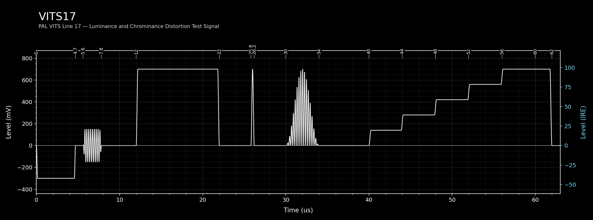
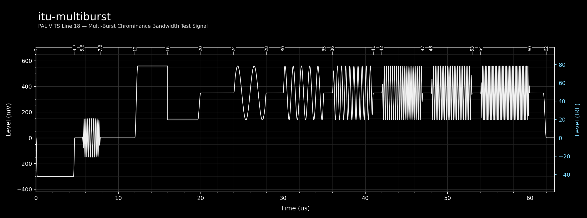
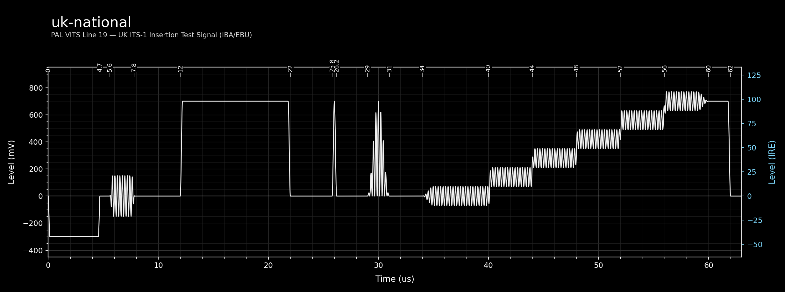
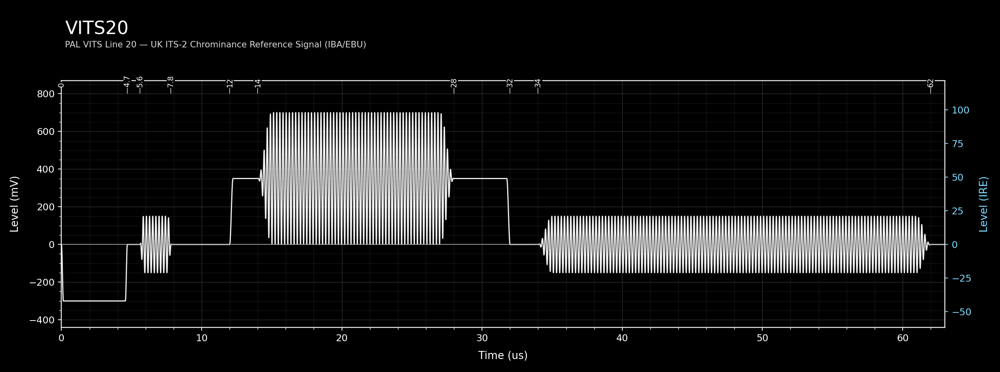
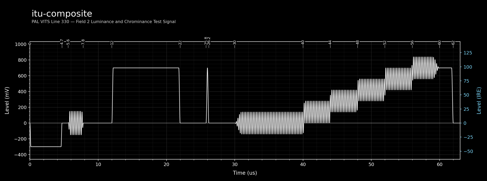
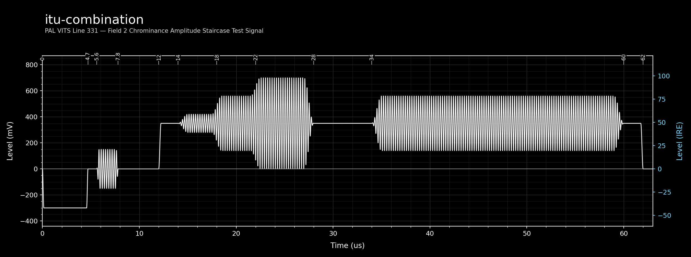

# PAL VITS Definitions

This document describes the Vertical Interval Test Signals (VITS) used in PAL 625-line video systems. Each entry corresponds to a YAML definition file in `resources/definitions/vits/pal/`.

**Level units:** mV composite. Nominal references are 700 mV = 100% white and 0 mV = blanking; PAL white-reference endpoints are normalized to 700 mV.  
**Timing reference:** All positions are measured from the leading half-amplitude edge of horizontal sync (sync_edge), in microseconds.

**Phase lock note:** Sequence-locked PAL chroma is now explicit per element. A VITS `burst`/`composite_pulse` is lock-enabled by setting `subcarrier_lock_multiple` (typically `1.0`), which locks runtime frequency to exactly `subcarrier_lock_multiple × color_subcarrier_hz` and applies PAL sequence phase progression with the YAML `phase_deg` offset.

**Edge shaping note:** VITS `rise_time_us` transitions now use the same shaped S-curve helper as the Field Structure Generator sync and burst ramps. This applies to bar edges, burst envelopes, burst-to-burst amplitude crossfades, and staircase step boundaries.

---

## VITS 17

**YAML:** `resources/definitions/vits/pal/vits17.yaml`  
**VBI Line:** 17 | **Field:** 1  
**Standard:** EBU/CCIR insertion test signal

### Description

VITS 17 is the primary insertion test signal for field 1 of 625-line PAL transmissions. It occupies VBI line 17 and carries four distinct test waveforms that collectively allow measurement of the most important linear distortions introduced by a composite analogue video transmission path.

The signal is constructed in temporal order across the active line as follows:

- A **100% white reference bar** (12.0–22.0 µs) establishes the luminance reference level.
- A **2T sine-squared pulse** (centred at 26.0 µs) tests luminance bandwidth and group delay. In 625-line PAL, T ≈ 100 ns, giving a half-duration of 0.20 µs (2T).
- A **20T modulated sine-squared pulse** (centred at 32.0 µs) carries both a luminance component (Y, 350 mV, half-duration 2.0 µs) and a chrominance component (C, at PAL subcarrier 4.434 MHz, 90°). Together they form the chrominance-to-luminance timing and group-delay test element.
- A **5-step luminance staircase** (40.0–60.0 µs, 700 mV peak) tests differential gain and luminance non-linearity.
- An **end-of-line reference bar** (60.0–62.0 µs, 700 mV) marks the end of the active video zone.

### Elements

| # | Type | Label | Key Parameters |
|---|------|-------|----------------|
| 1 | Colour Bar | 100% White Reference Bar | 700 mV, 12.0–22.0 µs |
| 0 | Sine-Squared Pulse | 2T Luminance Pulse | 700 mV, centre 26.0 µs, half-dur 0.200 µs |
| 2 | Sine-Squared Pulse | 20T Luminance Component | 350 mV, centre 32.0 µs, half-dur 2.0 µs |
| 3 | Composite Pulse | 20T Chrominance Component | dc 0 mV, centre 32.0 µs, Fsc 4.434 MHz, φ 90° |
| 5 | Staircase | 5-Step Luminance Staircase | top 700 mV, 40.0–60.0 µs, 5 steps |
| 4 | Colour Bar | End-of-Line Reference Bar | 700 mV, 60.0–62.0 µs |

#### Staircase Detail — 5-Step Luminance Staircase

5 steps, each equal width. Step width = (60.0 − 40.0) / 5 = **4.0 µs**. Top level: 700.0 mV. All times relative to sync edge.

| Step | Start (µs) | End (µs) | Level (mV) | % of 700 mV |
|------|------------|----------|------------|-------------|
| 1 | 40.0 | 44.0 | 140.0 | 20% |
| 2 | 44.0 | 48.0 | 280.0 | 40% |
| 3 | 48.0 | 52.0 | 420.0 | 60% |
| 4 | 52.0 | 56.0 | 560.0 | 80% |
| 5 | 56.0 | 60.0 | 700.0 | 100% |

<!-- vits-diagram: vits17 -->

---

## itu-multiburst

**YAML:** `resources/definitions/vits/pal/itu-multiburst.yaml`  
**VBI Line:** 18 | **Field:** 1  
**Standard:** ITU Multiburst for PAL systems B, D, G, H, I

### Description

VITS 18 is the ITU multiburst signal for PAL systems B, D, G, H, and I. It is used to test frequency response by presenting six burst packets at defined frequencies and amplitudes across the active line interval.

A 350 mV grey pedestal spanning the entire active line provides the DC background level. At the start of the line, a positive amplitude reference bar (+210 mV, apparent 560 mV) and a negative reference bar (−210 mV, apparent 140 mV) establish the amplitude scale.

> **Note:** Timings are normalized to clean microsecond boundaries to remove sample-domain quantization artifacts.

Six burst packets follow in order of increasing frequency:

| Burst | Frequency | Phase |
|-------|-----------|-------|
| 1 | 0.5 MHz | 0° |
| 2 | 1.0 MHz | 0° |
| 3 | 2.0 MHz | 0° |
| 4 | 4.0 MHz | 0° |
| 5 | 4.8 MHz | 144° |
| 6 | 5.8 MHz | −144° |

Bursts at 4.8 and 5.8 MHz carry phase offsets to avoid aliasing with the PAL line-alternating subcarrier phase during comb filtering. All bursts have an envelope amplitude of 210 mV.

### Elements

| # | Type | Label | Key Parameters |
|---|------|-------|----------------|
| 0 | Colour Bar | Grey Pedestal | 350 mV, 12.0–62.0 µs |
| 1 | Colour Bar | Positive Amplitude Reference Bar | +210 mV, 12.0–16.0 µs |
| 2 | Colour Bar | Negative Amplitude Reference Bar | −210 mV, 16.0–20.0 µs |
| 3 | Burst | 0.5 MHz Burst | 210 mV, 24.0–28.0 µs |
| 4 | Burst | 1.0 MHz Burst | 210 mV, 30.0–35.0 µs |
| 5 | Burst | 2.0 MHz Burst | 210 mV, 36.0–41.0 µs |
| 6 | Burst | 4.0 MHz Burst | 210 mV, 42.0–47.0 µs |
| 7 | Burst | 4.8 MHz Burst | 210 mV, 48.0–53.0 µs, φ 144° |
| 8 | Burst | 5.8 MHz Burst | 210 mV, 54.0–60.0 µs, φ −144° |

<!-- vits-diagram: itu-multiburst -->

---

## uk-national

**YAML:** `resources/definitions/vits/pal/uk-national.yaml`  
**VBI Line:** 19 | **Field:** 1  
**Standard:** UK National Insertion Test Signal (IBA/EBU, PAL-I)

### Description

VITS 19 is the IBA/EBU United Kingdom ITS Line 19 signal for PAL-I operation. It shares the white bar and staircase elements of VITS 17, adds a full-line chrominance reference burst at PAL subcarrier frequency, and positions the 2T reference pulse and 20T modulated pulse for this UK ITS variant.

### Elements

| # | Type | Label | Key Parameters |
|---|------|-------|----------------|
| 1 | Colour Bar | 100% White Reference Bar | 700 mV, 12.0–22.0 µs |
| 0 | Sine-Squared Pulse | 2T Luminance Reference Pulse | 700 mV, centre 26.0 µs, half-dur 0.200 µs |
| 5 | Composite Pulse | 20T Chrominance Reference Pulse | dc 0 mV, centre 30.0 µs, 4.434 MHz, φ 90° |
| 6 | Sine-Squared Pulse | 20T Luminance Reference Pulse | 350 mV, centre 30.0 µs, half-dur 1.0 µs |
| 3 | Burst | Full-Line Chrominance Reference Burst | dc 0 mV / Y 70 mV, 34.0–60.0 µs, 4.434 MHz, φ 60.66° |
| 4 | Staircase | 5-Step Luminance Staircase | top 700 mV, 40.0–60.0 µs, 5 steps |
| 2 | Colour Bar | End-of-Line Reference Bar | 700 mV, 60.0–62.0 µs |

#### Staircase Detail — 5-Step Luminance Staircase (element 4)

5 steps, each equal width. Step width = (60.0 − 40.0) / 5 = **4.0 µs**. Top level: 700.0 mV. All times relative to sync edge.

| Step | Start (µs) | End (µs) | Level (mV) | % of 700 mV |
|------|------------|----------|------------|-------------|
| 1 | 40.0 | 44.0 | 140.0 | 20% |
| 2 | 44.0 | 48.0 | 280.0 | 40% |
| 3 | 48.0 | 52.0 | 420.0 | 60% |
| 4 | 52.0 | 56.0 | 560.0 | 80% |
| 5 | 56.0 | 60.0 | 700.0 | 100% |

<!-- vits-diagram: uk-national -->

---

## VITS 20

**YAML:** `resources/definitions/vits/pal/vits20.yaml`  
**VBI Line:** 20 | **Field:** 1  
**Standard:** IBA / EBU UK ITS-2

### Description

VITS 20 is the IBA/EBU UK Insertion Test Signal Line 20 (ITS-2). It provides chrominance amplitude reference levels for calibration of the PAL composite output. The signal starts with a 350 mV grey pedestal and includes two chrominance burst zones at PAL subcarrier frequency (4.434 MHz):

- A **100% amplitude** burst (Y-channel: 350 mV, 14.0–28.0 µs) serves as the full chrominance reference level.
- A **43% amplitude** burst (Y-channel: 150 mV, 34.0–62.0 µs) provides a secondary reference at a reduced level.

Both bursts are composite-channel dc-offset free (dc_offset_mv: 0); the chroma levels are encoded in the Y/component channel (ch2).

### Elements

| # | Type | Label | Key Parameters |
|---|------|-------|----------------|
| 0 | Colour Bar | Grey Pedestal | 350 mV, 12.0–32.0 µs |
| 1 | Burst | Chrominance Ref Burst — 100% Level | dc 0 mV / Y 350 mV, 14.0–28.0 µs, 4.434 MHz, φ 60.66° |
| 2 | Burst | Chrominance Ref Burst — 43% Level | dc 0 mV / Y 150 mV, 34.0–62.0 µs, 4.434 MHz, φ 60.66° |

<!-- vits-diagram: vits20 -->

---

## itu-composite

**YAML:** `resources/definitions/vits/pal/itu-composite.yaml`  
**VBI Line:** 330 | **Field:** 2  
**Standard:** ITU Composite Insertion Test Signal for PAL (BT.628 / BT.473)

### Description

VITS 330 is the ITU PAL composite insertion test signal form (BT.628/BT.473) carried on field 2. In formal terms, this composite waveform is built from a white flag, a 2T pulse, and a 5-step modulated staircase to support luminance/chrominance transmission measurements.

In this Pattern Master implementation, those core components are mapped to the field-2 line layout shown below, including the sustained chrominance reference burst used in this configuration.

### Elements

| # | Type | Label | Key Parameters |
|---|------|-------|----------------|
| 1 | Colour Bar | 100% White Reference Bar | 700 mV, 12.0–22.0 µs |
| 0 | Sine-Squared Pulse | 2T Luminance Pulse | 700 mV, centre 26.0 µs, half-dur 0.200 µs |
| 3 | Burst | Chrominance Phase Reference Burst | dc 0 mV / Y 140 mV, 30.0–60.0 µs, 4.434 MHz, φ 60.66° |
| 4 | Staircase | 5-Step Luminance Staircase | top 700 mV, 40.0–60.0 µs, 5 steps |
| 2 | Colour Bar | End-of-Line Reference Bar | 700 mV, 60.0–62.0 µs |

#### Staircase Detail — 5-Step Luminance Staircase

5 steps, each equal width. Step width = (60.0 − 40.0) / 5 = **4.0 µs**. Top level: 700.0 mV. All times relative to sync edge.

| Step | Start (µs) | End (µs) | Level (mV) | % of 700 mV |
|------|------------|----------|------------|-------------|
| 1 | 40.0 | 44.0 | 140.0 | 20% |
| 2 | 44.0 | 48.0 | 280.0 | 40% |
| 3 | 48.0 | 52.0 | 420.0 | 60% |
| 4 | 52.0 | 56.0 | 560.0 | 80% |
| 5 | 56.0 | 60.0 | 700.0 | 100% |

<!-- vits-diagram: itu-composite -->

---

## itu-combination

**YAML:** `resources/definitions/vits/pal/itu-combination.yaml`  
**VBI Line:** 331 | **Field:** 2  
**Standard:** ITU Combination Insertion Test Signal for PAL (BT.473)

### Description

VITS 331 is the ITU combination insertion test signal form for PAL (BT.473), used to check multiple transmission parameters with a single waveform on field 2. Formally, it is characterized by a 3-step modulated pedestal together with an extended subcarrier packet.

A 350 mV grey pedestal spans the full active line. Three amplitude steps in succession form the staircase:

| Step | Amplitude | Relative Level |
|------|-----------|----------------|
| 1 | 70 mV (Y-ch) | 20% of reference |
| 2 | 210 mV (Y-ch) | 60% of reference |
| 3 | 350 mV (Y-ch) | 100% reference |

A sustained 60% (210 mV) reference burst follows over the latter portion of the active line. All chrominance elements use zero composite DC offset; the chroma staircase amplitudes are encoded in the component-channel (Y/ch2) parameter of each burst.

### Elements

| # | Type | Label | Key Parameters |
|---|------|-------|----------------|
| 0 | Colour Bar | Grey Pedestal | 350 mV, 12.0–62.0 µs |
| 1 | Burst | Chrominance Staircase — 20% Level (Step 1) | dc 0 / Y 70 mV, 14.0–18.0 µs, 4.434 MHz, φ 60.66° |
| 2 | Burst | Chrominance Staircase — 60% Level (Step 2) | dc 0 / Y 210 mV, 18.0–22.0 µs, 4.434 MHz, φ 60.66° |
| 3 | Burst | Chrominance Staircase — 100% Level (Step 3) | dc 0 / Y 350 mV, 22.0–28.0 µs, 4.434 MHz, φ 60.66° |
| 4 | Burst | Chrominance Reference Burst — 60% Sustained | dc 0 / Y 210 mV, 34.0–60.0 µs, 4.434 MHz, φ 60.66° |

<!-- vits-diagram: itu-combination -->

---